# 三、Pandas——大家最喜欢的数据分析库

在这一章，我们将介绍Pandas图书馆。我们将讨论Pandas，它的能力，以及它在 Python 数据科学堆栈中的重要性。我们还将谈论Pandas图书馆的主要物品系列和数据框。我们将讨论它们的属性，以及在进行数据分析时，我们可以对这些对象进行的一些操作。接下来，我们将看到一些如何使用真实数据集来使用这个库中的对象的例子，并回答一些关于数据集的简单问题。本章将涵盖以下主题:

*   Pandas图书馆
*   Pandas的操作和操纵
*   用例子回答关于数据集的简单问题

# Pandas图书馆介绍

Pandas 是 Python 的一个库，它提供了快速、灵活和富有表现力的数据结构，旨在处理关系数据或表格数据，如 SQL 表或 Excel 电子表格。它是用 Python 进行实际数据分析的一个基本的高级构件。我们使用下面一行代码来导入`pandas`库:

```py
#The importing convention
import pandas as pd
```

Pandas非常适合以下情况:

*   当您有包含异构类型列的表格数据时，例如您可以在 SQL 表或 Excel 电子表格中找到的数据
*   当您拥有有序或无序的时间序列数据时
*   当您有行和列中的数据时，类似于矩阵
*   当您在工作中使用观察性或其他类型的统计数据集时

`pandas`中有两种主要的数据结构:

*   该系列是一维数据结构
*   数据框架是一种二维数据结构

他们可以处理您在不同领域发现的绝大多数数据分析案例，例如金融、统计、社会科学以及工程和商业的许多领域。Pandas 是建立在 NumPy 之上的，它旨在与许多其他第三方库很好地集成在科学计算环境中。也可以和其他库结合使用`pandas`，本章我们将和可视化库一起使用。以下是你可以用`pandas`做的几件事:

*   轻松处理浮点和非浮点数据中的缺失数据
*   轻松插入和删除数据框和高维对象中的数据
*   自动数据对齐
*   按功能分组，实现强大而灵活的数据聚合和转换
*   将其他不同索引的 Python 和 NumPy 数据结构轻松转换为 DataFrame 对象
*   智能的基于标签的切片、花式索引和大数据集的子集化
*   数据集的直观合并和连接
*   轴的分级标注
*   强大的输入输出工具，用于从平面文件、Excel 文件、数据库加载数据，以及从超快 HDF5 格式保存/加载数据
*   用于日期范围生成和频率转换、移动窗口统计、移动窗口线性回归、日期偏移、滞后等的时间序列特定功能

# Pandas的重要物品

`pandas`中最重要的两个对象是:

*   系列
*   数据帧

为了开始使用 Python 在数据科学工作中使用`pandas`，让我们首先用下面一行代码导入 NumPy 和数学库:

```py
import numpy as np
import matplotlib.pyplot as plt
%maplotlib inline
```

然后，为了使用`pandas`，我们使用标准惯例导入`pandas`库:`import pandas as pd`。

# 系列

`pandas`中的序列数据结构是一维标注数组。这种数据结构的特点是:

*   `pandas`系列中的数据可以是任何类型，如整数、字符串、浮点数、Python 对象等
*   数据本质上是同质的，或者所有的数据必须是相同的类型
*   数据总是有一个索引，该索引给出以下数据结构字典和 Python 列表或 NumPy 数组类型属性:

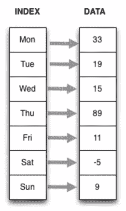

上图是`pandas`系列的视觉示例。您可以看到每个数据点都与一个索引相关联。

# 创作Pandas系列

创建`pandas`系列对象的方法有很多。以下是一些最常见的方法:

*   从列表创建
*   从字典中创造
*   从 NumPy 数组创建
*   从外部数据源(如文件)创建

现在让我们学习如何从列表、字典和 NumPy 数组创建系列。首先，让我们定义数据并将它们索引为列表。让我们创建一个值列表并将其命名为`temperature`，以及另一个名为`days`的值列表。要从数据中创建一个序列，您所要做的就是使用`pd.Series(temperature, index=days)`构造函数:

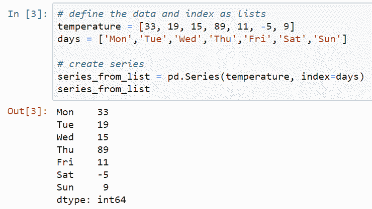

当我们运行代码时，我们看到每个值都与各自的索引相关联。接下来，我们将从 Python 字典创建一个系列。在 Python 字典中，键总是与各自的值相关联。因此，当您从字典中创建一个`pandas`序列时，所有的键都将被用作索引，并且相应的值将是与该索引相关联的序列中的值。使用相同的数据，从前面的截图，我们定义了我们的字典，`my_dict`，其中日期与每个温度相关联。然后，我们将字典传递给`pd.Series(my_dict)`构造器，它将给出以下结果:

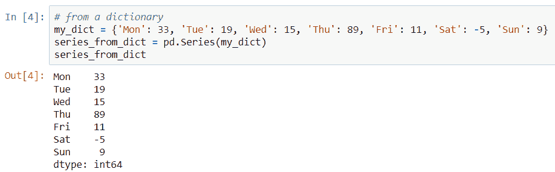

虽然一周中的日子是没有顺序的，但是因为我们在 Python 字典中没有一个隐含的顺序，所以每一天都与它自己的温度相关联。例如`Friday`与`11`关联；`Monday`与`33`相关联，等等。

接下来，我们将看看如何从一个 NumPy 数组创建一个`pandas`系列。首先，让我们使用`np.linspace`函数定义一个对象`my_array`。接下来，我们将对象传递给`pd.Series`构造器，该构造器将根据定义的 NumPy 数组创建一个序列，如下图所示:

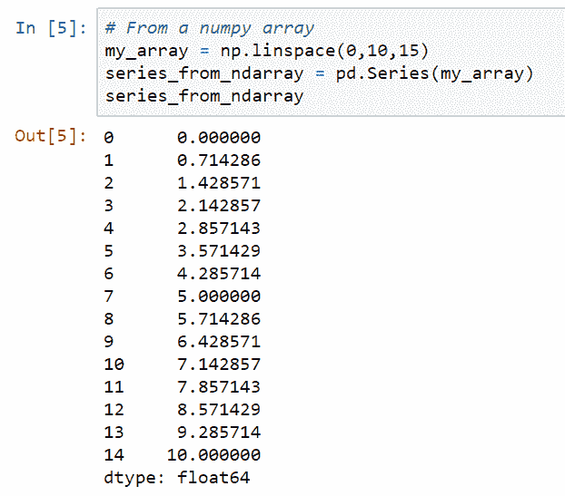

由于我们没有指定任何索引，`pandas`创建了一个自动整数索引，从`0`开始，一直到我们拥有的元素数量为-1。因此，在这种情况下，我们有`15`元素，其索引指向`14`。

您也可以使用`pandas`系列进行向量化操作，类似于使用 NumPy 数组。如果对序列执行一个操作，相同的操作将应用于序列中的每个元素。下面的截图显示了一些这样的例子:

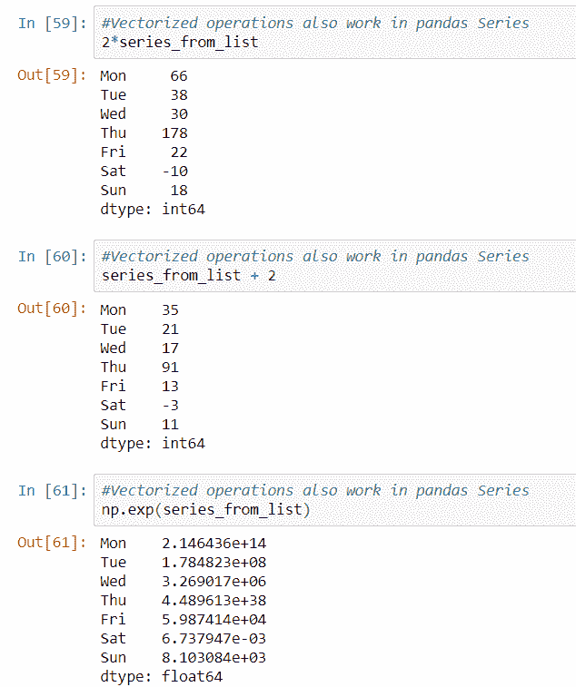

在前面的截图中，我们将序列乘以`2`，其中每个元素都乘以 2。同样，我们在系列中增加了 2，我们看到每个元素都增加了 2。同样，您可以进行其他类型的算术运算，甚至可以应用 NumPy 中的通用函数。为此，我们使用 NumPy，`np.exp`数学函数计算了级数的指数。在运行该操作时，我们看到另一个`pandas`系列具有相同的指数和原始系列的新指数值。

# 数据帧

数据框是一种二维标记的数据结构，具有可能不同类型的列。`pandas`数据框类似于微软 Excel 电子表格或 SQL 表。您有两个索引，行索引和列索引:

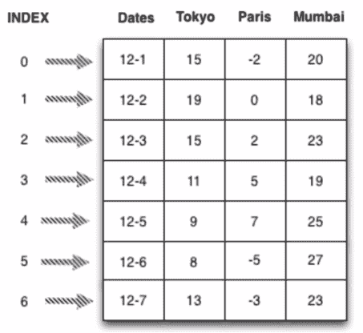

在上图中，我们有两个索引，列与**日期**、**东京**等的值相关联，行与**索引**相关联。

# 创建Pandas数据框

创建`pandas`数据帧的方法有很多，但最重要和最常用的方法是从文件创建`pandas`数据帧。您可以从以下内容创建数据帧:

*   一维字典`ndarrays`、列表、字典或系列
*   二维`numpy.ndarray`
*   文本、CSV、Excel 文件或数据库

让我们从真实数据集创建一个数据框。我们将使用的数据集包含有关人力资源、员工流失、绩效等数据。您可以通过以下链接获取:[https://www . IBM . com/communities/analytics/Watson-analytics-blog/HR-employee-launch/](https://www.ibm.com/communities/analytics/watson-analytics-blog/hr-employee-attrition/)。

One very interesting thing about pandas is that you can download data directly from the internet. If the file is in some URL, you can save the URL in a Python string and create a DataFrame directly using the `read_excel` function from `pandas`.

因为我们将从 Excel 文件创建数据框，所以我们将只使用几个参数。第一个参数将是`io`参数，它指定文件的位置。然后我们有`sheetname`，它定义了你想从 Excel 文件中读取的工作表。第三个也是最后一个论点是你想用作索引的`index_col`:

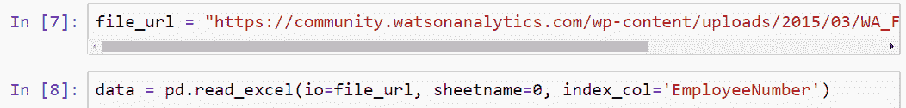

因此，在前面的截图中，我们定义了我们的`file_url`变量，这是下面单元格的文件位置。然后我们创建了数据框，并将其命名为`data`。

# 数据帧的剖析

数据框由三部分组成:

*   索引
*   列名
*   数据

通过访问`index`和`columns`属性可以分别访问行标签和列标签。下面的截图展示了这一点:

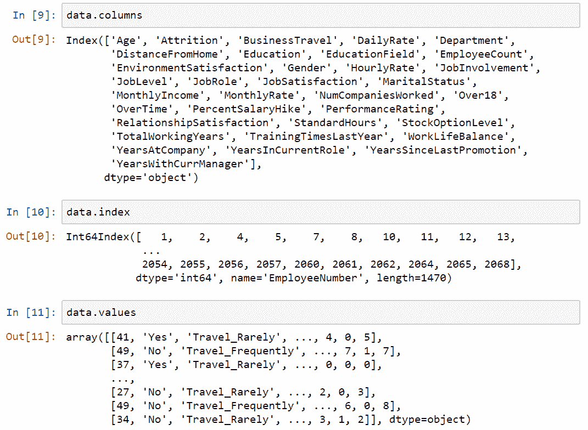

使用`columns`属性将给出所有的列名，同样，使用`index`属性将给出索引。最后，使用`value`属性将给出数据帧的值，它将总是以 NumPy 数组的形式出现。

# Pandas的操作和操控

在`pandas`工作时有多种操作方法。在这一章的这一部分，我们将研究一些我们将在本书中进行的常见操作。

# 数据检查

加载数据框或从文件创建数据框时，您首先要做的是检查刚刚加载的数据。我们有两种方法来检查数据:

*   头
*   尾巴

`head`方法会显示前五行的数据:

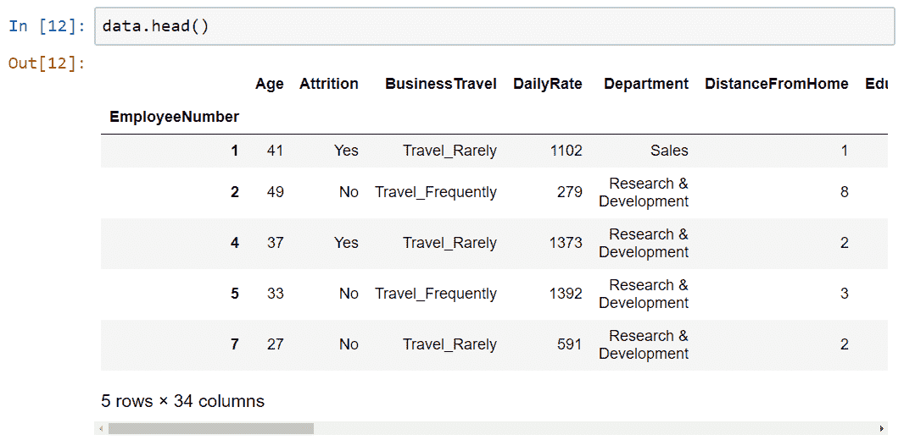

正如您在前面的截图中看到的，我们在运行`data.head()`方法时显示了前五行 34 列:

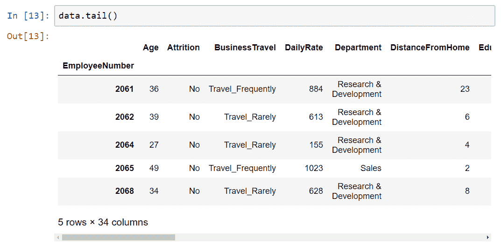

要查看最后五行数据，可以使用`tail`方法。上面的截图显示了运行`data.tail()`方法时数据框中的最后五行数据。使用这两种方法来确保正确加载数据始终是一种好的做法。

# 数据的选择、添加和删除

您可以将数据框视为一个系列的字典，其中每一列都类似于一个`pandas`系列，您可以像访问字典中的对象一样访问该系列。您可以将数据框视为索引系列对象的字典。获取、设置和删除列的语法与处理字典的语法相同。我们来看几个例子。假设您想访问数据框中的`Age`列。您所要做的就是编写方法并指出您想要访问的列的名称:

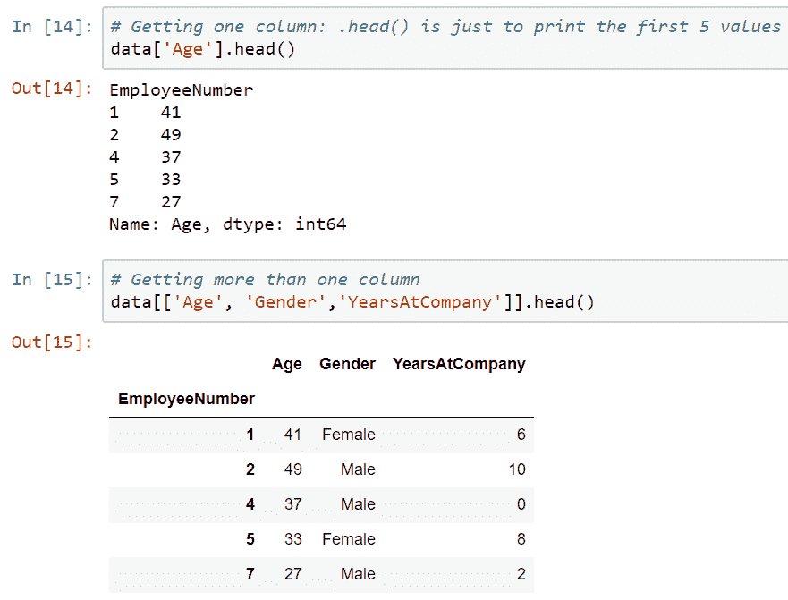

在前面的截图中，当我们执行`data['Age'].head()`和`data[['Age', 'Gender', 'YearsAtCompany']].head()`方法时，我们从 DataFrame 中的每个提到的列中获得了前五行。

Note that `.head()` is used to avoid displaying all the rows in the DataFrame, which would be too long a list.

要向数据框中添加列，可以使用`data['AgeInMonths'] = 12*data['Age']`方法创建列:

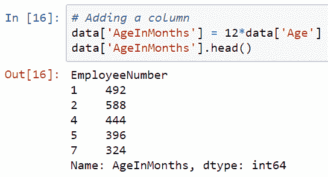

该列当前不存在于数据框中，但是通过执行刚才提到的方法，一个新的列`AgeInMonths`将被添加到数据框中。

您可以使用`del`语句删除我们刚刚在数据框中创建的列。从数据框中删除列的另一种方法是使用`drop`方法。要使用`drop`方法，您传递要删除的列，如果要删除列，您应该指定这将来自`axis=1`，而另一个参数`inplace`意味着您要在适当的位置修改数据对象，因此您希望这种更改在数据结构中是永久的。这些操作显示在下面的屏幕截图中:

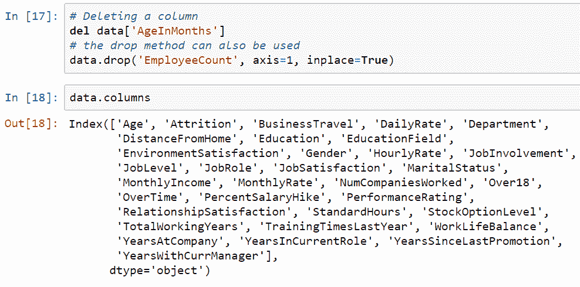

现在，如果我们看一下数据的列，这是我们的数据框，我们会看到`EmployeeCount`已经被删除了。

# 切片数据帧

就像您可以使用 NumPy 系列一样，您可以从`pandas`系列和数据帧中提取切片。我们可以在系列和数据帧中使用相同的符号进行切片:


在前面的截图中，我们有一个从和数据帧切片的例子。从位置 10 到 15(不包括 15)的数据被切片并显示在输出中。

# 标签选择

您也可以通过标签执行选择，这就是为什么索引在数据结构中非常重要。如果你想从一些特定的员工那里获得数据，你可以使用`loc`方法获得它们。让我们首先通过定义`selected_EmployeeNumbers = [15, 94, 337, 1120]`来指定我们想要数据的员工。因为在这两种数据结构中，每个值都与`EmployeeNumber`索引相关联，所以我们可以使用该索引来访问我们特别想要的数据:

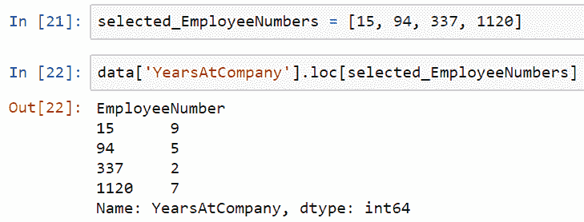

因此，在前面的截图中，我们有来自一个`pandas`系列的数据，其中包含了在公司的年数。

数据框中也有`loc`方法。如果您将相同的列表传递给数据框中的`loc`方法，您将获得与标签相关联的所有数据。这显示在下面的截图中:

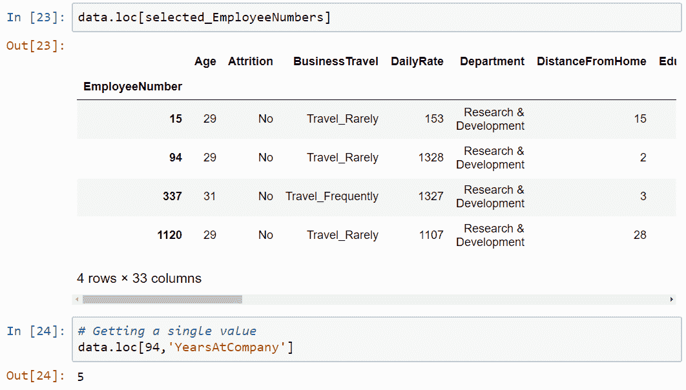

如果您想从数据框中获取特定的值或特定的单元格，您必须将两个索引传递给`loc`方法，行的索引和列的索引。您也可以使用`iloc`方法按位置访问数据。

# 回答关于数据集的简单问题

让我们举个例子来看几个问题并回答它们。假设人力资源总监让你回答一些关于公司员工的描述性问题。以下是一些这样的问题:

*   数据集中按部门划分有多少员工？
*   总体损耗率是多少？
*   平均时薪是多少？
*   在公司的平均工作年限是多少？
*   在公司工作年限最多的五位员工是谁？
*   员工总体满意度如何？

# 数据集中按部门列出的员工总数

要查看数据集中的部门，可以使用`data['Department']`语句。我们得到了名为`Department`的专栏，这是一个`pandas`系列，对于每个员工，你都有该员工所属的部门。因此，要计算您在这个`pandas`系列中看到每个部门的次数，您可以使用`value_counts()`方法:

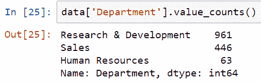

在前面的截图中，您可以看到您的`pandas`系列中的每个唯一值的计数都已制成表格并显示出来。

# 总损耗率

首先，让我们使用`data['Attrition']`语句来查看数据集中的`Attrition`列。在列中，我们看到显示该员工是否仍在公司的数据。对于还在公司的员工，我们有`Attrition`等于`No`，对于已经离职的员工，我们有`Attrition`等于`Yes`。然后我们通过`value_counts`方法计算每个结论的出现。要得到离职率，即已经离开公司的员工比例，我们可以使用额外的参数，`normalize=True`。下面的截图显示了这里提到的操作:

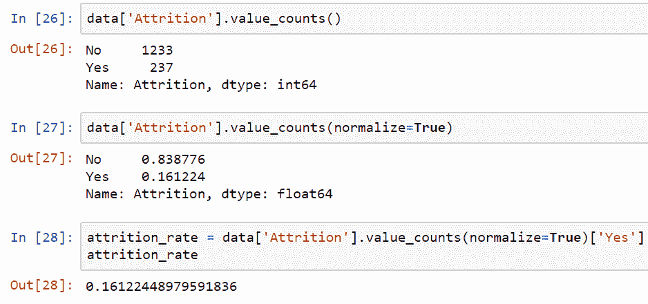

现在，为了获得总体损耗率，我们使用`Yes`指数中的相关标签。因此，在前面的截图中，我们得到了`Yes`指数的值，这是 16.12%的损耗率。

# 平均时薪

`pandas`系列有很多统计方法可以用。您将一直使用的统计方法之一是`mean`方法，它计算您的`pandas`系列的平均值:

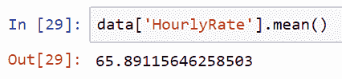

因此，通过使用这种方法，我们发现`HourlyRate`变量的平均值是`65.89`。

# 平均年数

要获得在公司的平均年数，可以使用`mean`方法。然而，还有另一种非常有用的方法，你不仅可以得到平均值，还可以得到该系列的许多其他描述性统计数据。这种方法被称为`describe()`方法，它给出平均值、标准偏差、最小值、最大值和百分位数:

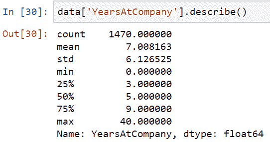

在前面的截图中，我们看到在公司的平均年限是`7`。所以，这是另一个非常方便的方法，你可以一直使用。

# 年数最多的员工

还有一种方法可以用来对Pandas系列中的值进行排序。`sort_values`方法将对值进行排序，默认情况下，它将按升序对值进行排序。如果不希望它们按升序排列，可以将该参数指定为`False`。和往常一样，它将显示整个数据列表，因此我们使用了`slice`符号来获取系列中的前五个元素:

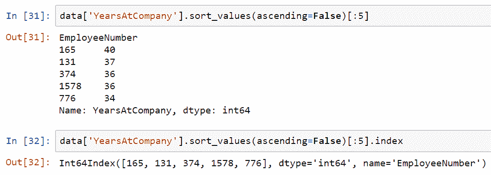

在前面的截图中，我们使用`index`方法来获取员工编号，以识别在公司工作年限最多的员工。

# 员工总体满意度

在数据集中，我们有一个名为`JobSatisfaction`的列，其中保存了员工满意度评分，范围从 1 到 4。让我们使用`head`方法查看前五个观察值，并创建一个字典，其中数字 1 对应于低工作满意度，值 2 对应于中等工作满意度，以此类推。现在我们将使用Pandas系列的`map`方法将代码转换成相应的类别。这将使每个键与各自的值相关联，即`1`将转换为`Low`、`2`到`Medium`等等。然后，我们将该系列重新分配给使用`map`方法操作的系列:

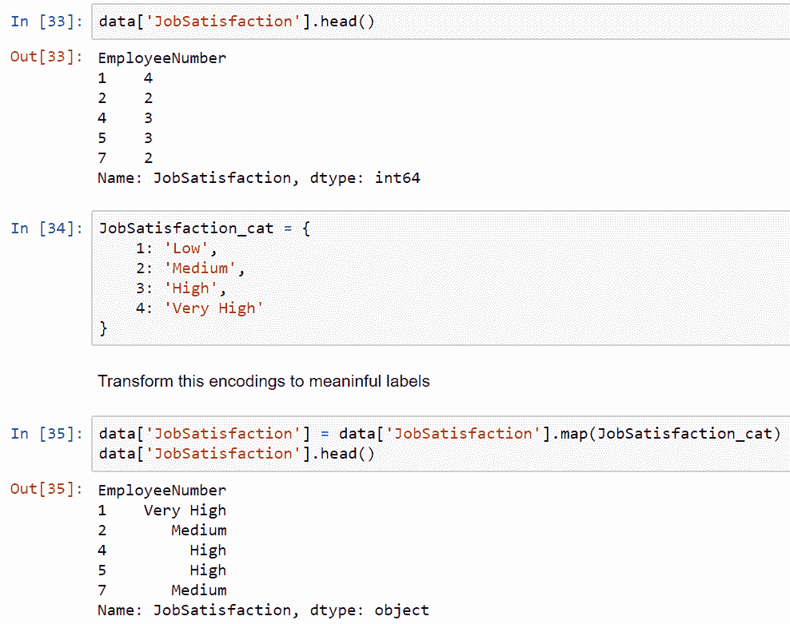

正如您在下面的截图中所看到的，我们已经按照我们想要的那样映射了类别。所以每当你想在你的Pandas系列中执行这种转换时`map`方法非常有用。接下来，我们使用`value_counts()`方法来获取每个类别的出现。但是因为这个问题，得到标准化的计数可能更有用。所以，如果你把这个系列乘以`100`，你会得到百分比:

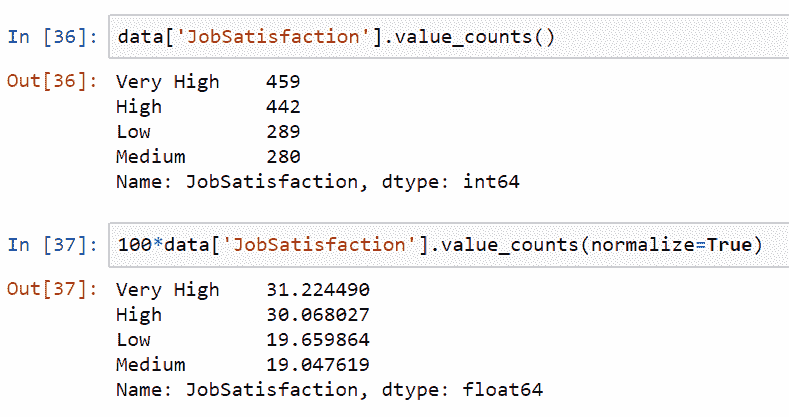

所以，我们可以在截图中看到这个数据集中`31%`的员工有被认为`Very High`的工作满意度，你也可以看到其他类别的其他对应百分比。

# 回答进一步的问题

假设你已经完成了人力资源总监问你的第一轮问题，但现在他想更多地了解员工。以下是分配给您的新任务:

*   给我一份`JobSatisfaction`级别低的员工名单
*   给我一份`JobSatisfaction`和`JobInvolvement`都是低级别的员工名单
*   通过以下变量比较低和非常高`JobSatisfaction`的员工:`Age`、`Department`和`DistanceFromHome`

# 工作满意度低的员工

为了回答这个问题，我们使用布尔数列来索引数列或数据框。这被称为**掩蔽**，或**布尔索引**。首先，我们使用比较运算符将Pandas系列与`data['JobSatisfaction'] == 'Low'`值进行比较，如下所示:

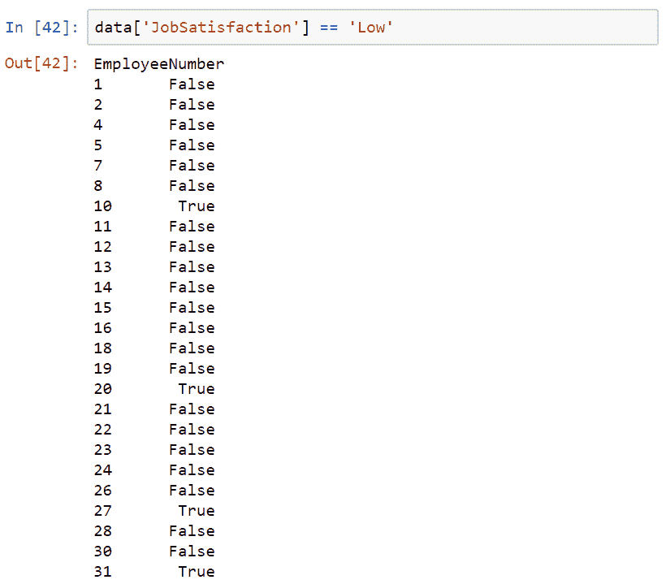

如果运行该操作，您将获得一个布尔序列，其值为每个员工的`True`或`False`。`True`表示员工的`JobSatisfaction`值等于低，`False`表示值不等于低。

您可以使用这个Pandas布尔序列来索引另一个对象，如序列或数据帧。当您使用布尔数列索引另一个对象时，您将返回一个新的数列或数据帧，其中包含您具有`True`值的观察值。让我们使用以下功能来回答我们的问题:

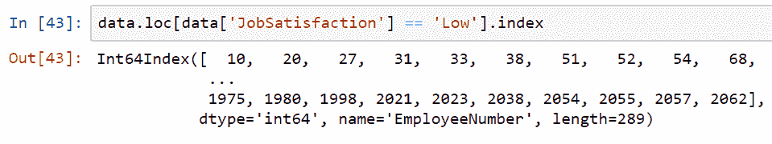

因此，如果我们使用这个布尔序列，使用`data.loc[data['JobSatisfaction'] == 'Low'].index`索引属性来索引我们的数据帧，您会得到一个低级别`JobSatisfaction`的员工列表。

# 工作满意度和工作投入都低的员工

`JobInvolvement`列和`JobSatisfaction`列有相同的属性，所以我们没有类别，而是有相应的数字。我们将首先应用之前应用于`JobSatisfaction`列的`map`变换:

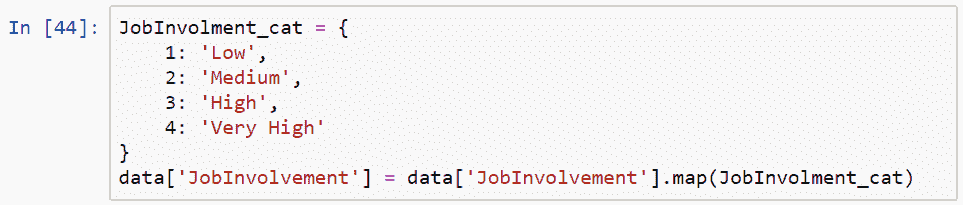

由于我们只需要两列中级别较低的员工，因此我们可以使用`&`逻辑运算符对两个布尔序列进行运算，以获得级别较低的员工列表`JobSatisfaction`和`JobInvolvement`。同样，我们将使用`loc`选择方法和`index`属性来获得具体要求:

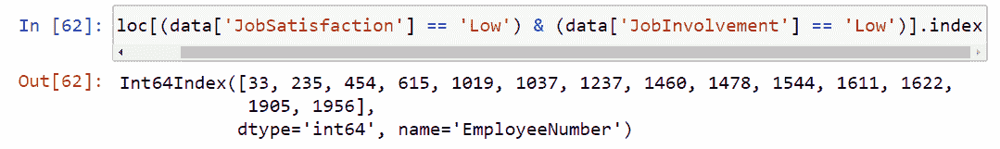

在前面的截图中，我们有一个员工编号列表，其“低”级别为`JobSatisfaction`和`JobInvolvement`。

# 员工比较

现在我们将比较低和非常高`JobSatisfaction`级别的员工。我们将通过以下变量比较这两组人:年龄、部门和`DistanceFromHome`。为了进行比较，我们将使用分组操作。分组操作是我们应用一系列操作的操作。这些操作称为拆分、应用和组合。我们将在以下步骤中了解这是如何工作的:

1.  这个操作的第一步是**分割**步骤，我们根据一些标准或分类变量将数据帧分割成一组数据帧。这将产生一个分组对象，其结构类似于字典，并且每个组都与不同的键相关联。
2.  第二步是对这个分组对象的每个部分应用一个函数，这样我们就可以应用一个函数并得到一个结果。
3.  该操作的第三步是将前一个操作的结果分组或组合成一个新的数据结构。这个新的数据结构可以是`new_df`也可以是`new_series`。

现在，为了进行比较，让我们创建一个新的数据框架，它只包含那些作为比较标准给出的观察值，并调用数据框架`subset_of_interest`。我们将使用`bitwise`或`|`操作符来获得低和高`JobSatisfaction`的员工系列，并将它们组合起来，并使用`shape`属性来查看我们新创建的数据框的形状。然后，我们使用`value_count`操作查看每个观察的准确计数:

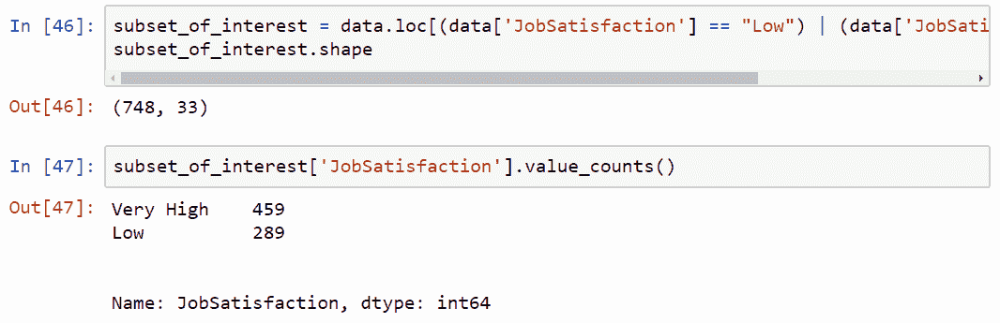

在前面的截图中，我们看到这个 DataFrame 有`748`行和`33`列；此外，我们还有`459`的观测值很高`JobSatisfaction`，以及`289`的观测值很低`JobSatisfaction`。

现在我们只有我们感兴趣的观察结果，我们可以对新创建的数据帧应用`groupby`操作，来比较我们想要的变量。我们将命名我们将从这次操作中获得的对象`grouped`:

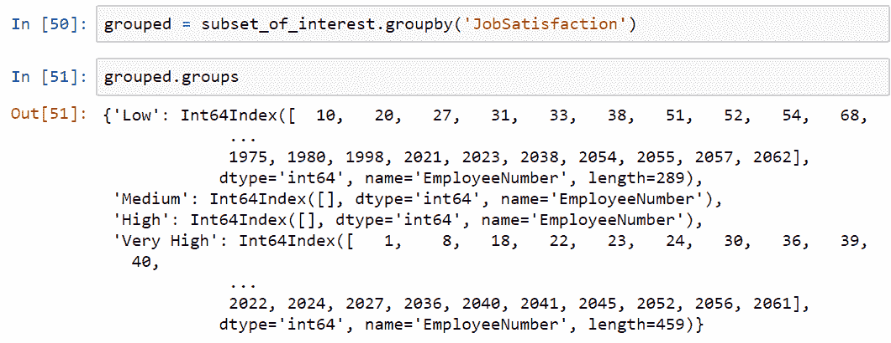

如您所见，将`groups`方法应用于这个新创建的对象，我们有两个组，低组和极高组，您可以为每个关联的组获得相应的标签或索引。如果你想实际得到每一组关联的数据，可以使用`get_group`方法。该操作如下图所示:

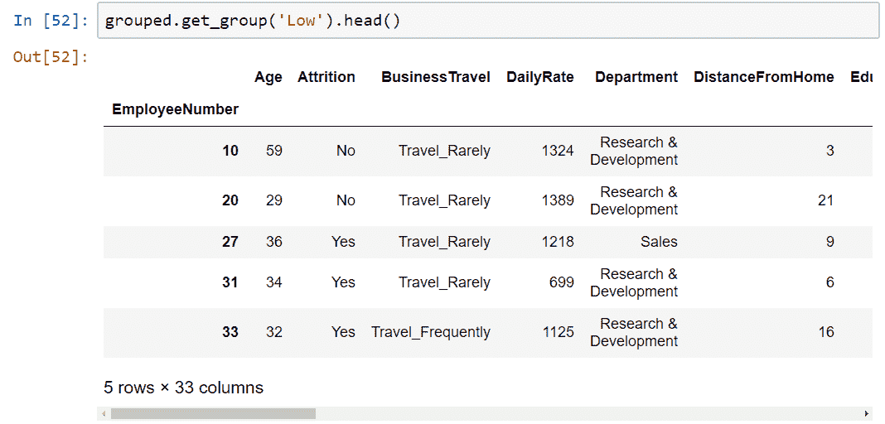

如果您使用`Low`键的`get_group`方法，您将获得与低组相关联的数据帧。

An interesting thing about these grouped objects is that you can actually get the Series from the original DataFrame. But if you try to get the Series by name, you will not get an ordinary Series, but you will get what is called a `groupby` Series, and when you apply a method, for instance the `mean` method, you will see that this method will be applied across every group.

所以，如果你调用分组对象的`Age`序列，然后求平均值，你就会得到每个组的平均值。你也可以使用`groupby`系列中普通系列的每一种方法。如果您使用`describe`方法，您将看到`describe`方法将应用于低组和极高组:

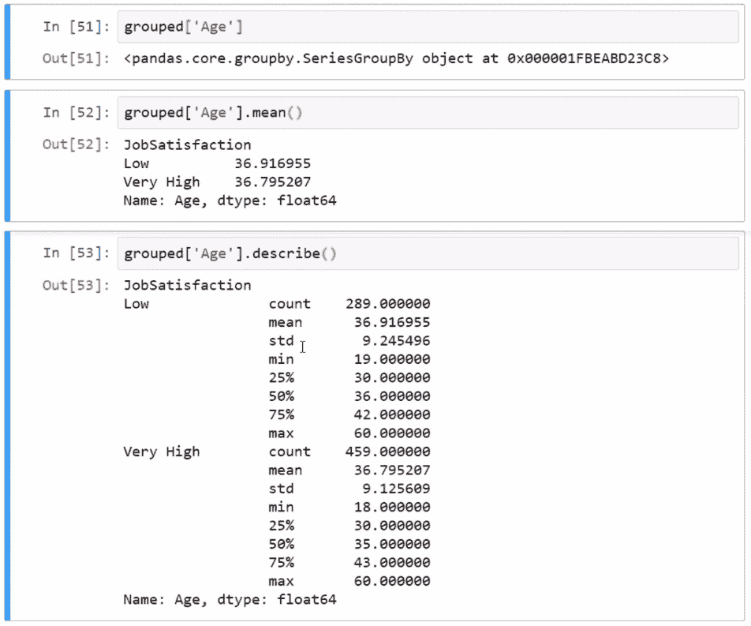

一旦我们将这些方法应用到新系列中，我们会发现低组的平均年龄是`36.9`，而极高组的平均年龄是`36.7`。我们还有应用于低组和极高组的`describe`方法的输出。我们从`describe`方法得到的系列是Pandas系列，但是这个系列有多级指数。指数的第一级是低和极高组，指数的第二级是统计值的名称，如`mean`、`std`、`min`等:

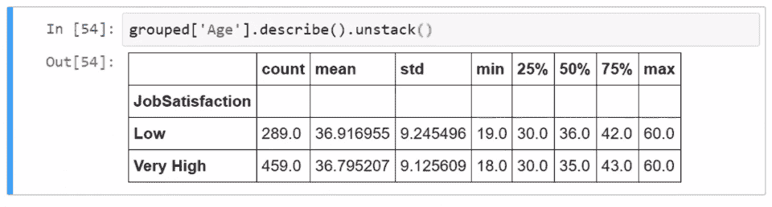

您可以使用`unstack`方法将结果转换为数据帧，如前面的截图所示。

接下来，为了跨部门比较，我们可以使用`value_counts`和`unstack`方法来查看我们感兴趣的每个组在每个部门中的人数，如下所示:

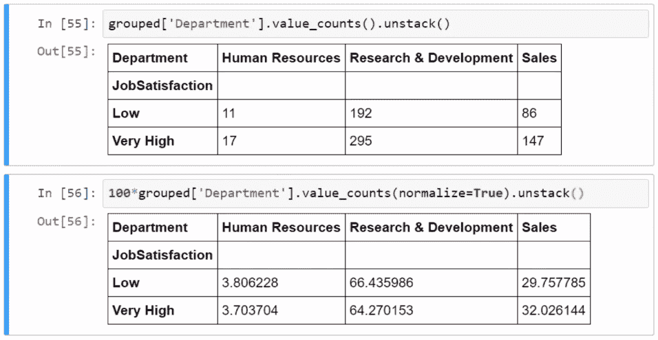

为了做一个比较，我们使用`normalize`操作，我们看到`JobSatisfaction`低级别的人`3%`属于人力资源部，`66%`属于研究&开发部，`29%`属于销售部，同样，我们也有非常高组的详细信息。

最后，对于`DistanceFromHome`比较，我们可以使用`describe`方法和`unstack`方法将其转换为数据帧，并且我们可以跨`DistanceFromHome`变量比较两组:

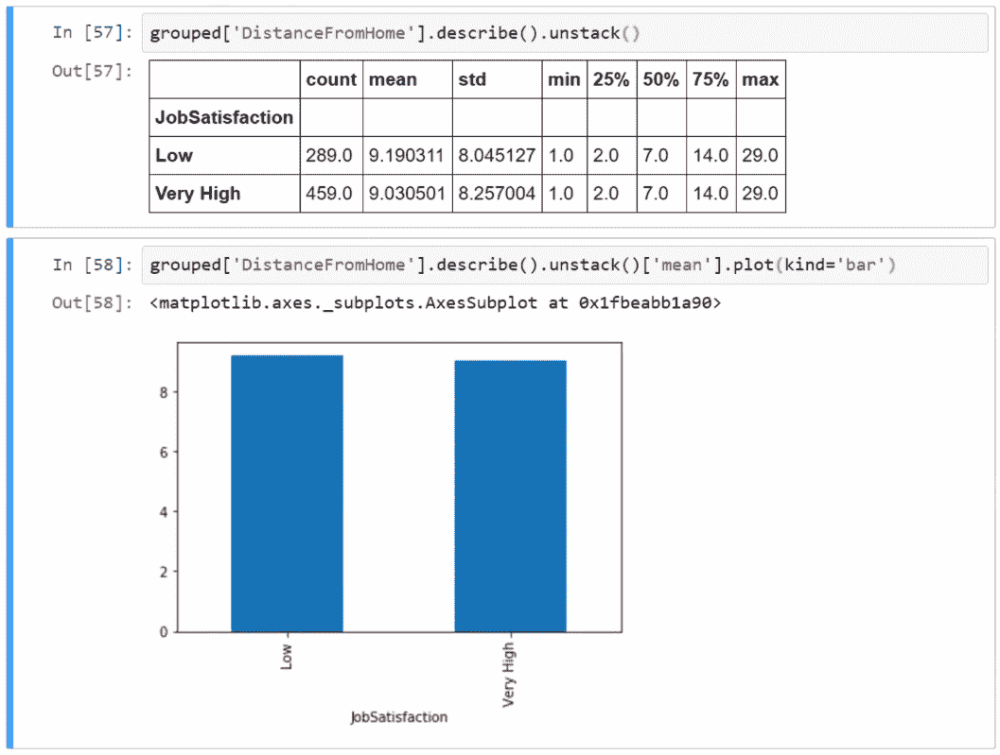

在前面的截图中，我们有一个来自`DistanceFromHome`比较结果的数据框，以及一个来自结果比较平均值的条形图。

# 摘要

在本章中，我们讨论了Pandas及其主要对象，系列和数据帧，以及我们可以使用它们执行的主要操作。我们还使用Pandas来回答类似于每个数据分析师每天都会遇到的问题，通过做一些真实世界的数据分析和回答更复杂的问题。

在下一章中，我们将学习可视化和探索性数据分析，使用非常强大的工具，如 matplotlib 和 seaborn library。