# 可视化和探索性数据分析

可视化是数据科学和数据分析的一个关键主题，Python 在为不同目的执行可视化方面提供了许多选项。在本章中，我们将讨论两个最流行的 Python 可视化库，即 matplotlib 和 seaborn。我们还将讨论熊猫进行可视化的能力。

让我们看看本章将讨论的以下各种主题:

*   介绍 matplotlib
*   介绍 pyplot
*   面向对象的接口
*   常见自定义
*   对海鸟和熊猫的探索性数据分析
*   单独分析变量
*   变量之间的关系

# 介绍 Matplotlib

Matplotlib 试图让容易的事情变得更容易，让困难的事情变得可能。基本上，`matplotlib`是一个绘图库，以各种格式和交互环境生成出版物质量数字。现在我们来讨论一下`matplotlib`是什么，它的能力，以及它的基本概念、图形、支线剧情(轴)和轴。它可以用于任何地方和各种目的。它也可以用于 Python 脚本、Python 解释器、Python 外壳、Jupyter Notebook、网络应用服务器，以及我们可以用 Python 生成的每个图形用户界面。

现在，让我们看看我们的 Jupyter 笔记本，其中有更多关于`matplotlib`的信息。但在此之前，让我们先来看看网站[matplotlib.org](https://matplotlib.org/gallery)。这是项目网站，也是该库文档的主要在线资源。我们可以找到例子、常见问题和画廊，这是我们需要看的东西。

当人们和`matplotlib`一起工作时，他们通常会去画廊。在下面的截图中，我们可以看到它的一个可视化表示，接近于他们试图做的事情:

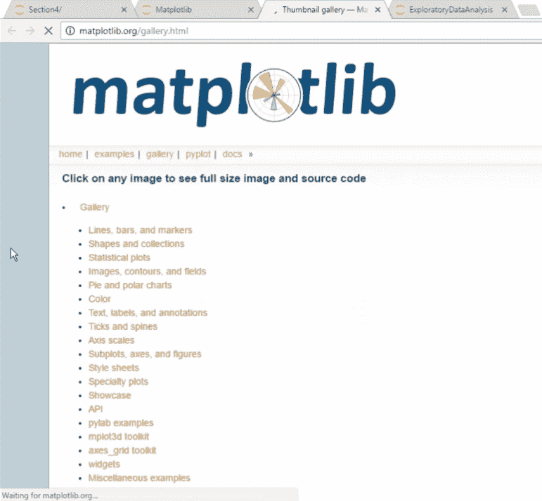

假设我们想做一个方块图。让我们看看下面截图中的一个例子。我们看到一个可视化，比较小提琴图和盒子图，当我们想到类似的东西时，我们可以寻找代码，调整它，并开始将其用于我们自己的可视化:

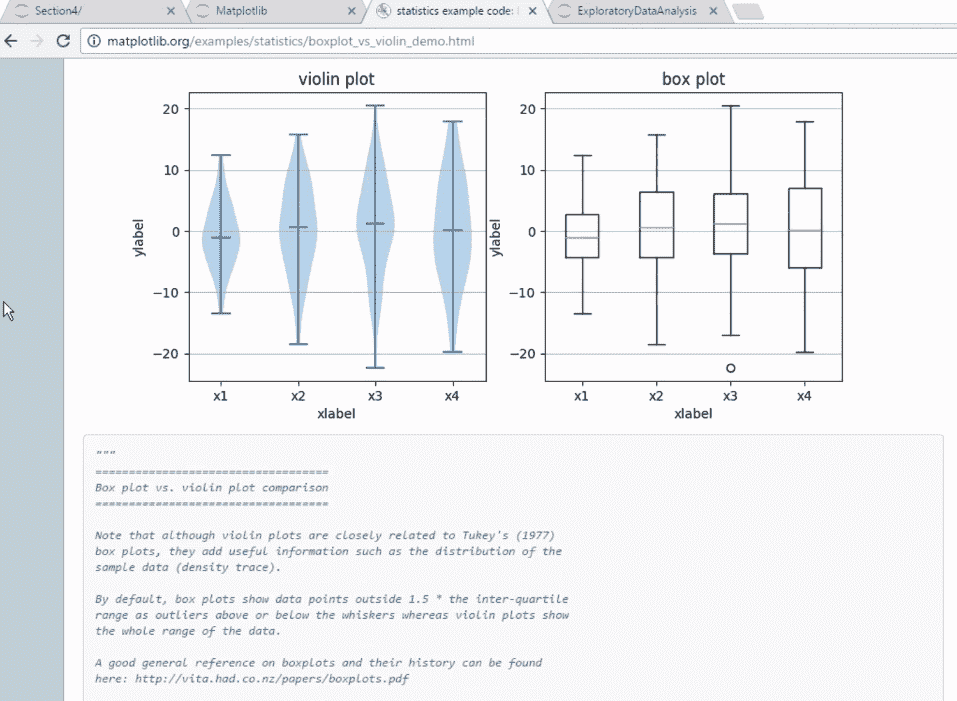

在前面的截图中，我们可以看到部分代码，但是，如果我们希望浏览整个代码，我们可以参考前面提到的官方`matplotlib`网站。

# Matplotlib 中的术语

在谈论这个库的主要概念之前，我们将讨论我们在`matplotlib`中拥有的一些基本术语，例如图形、支线剧情/轴和轴。一个`matplotlib`剧情的解剖从我们在下面截图中看到的图开始:

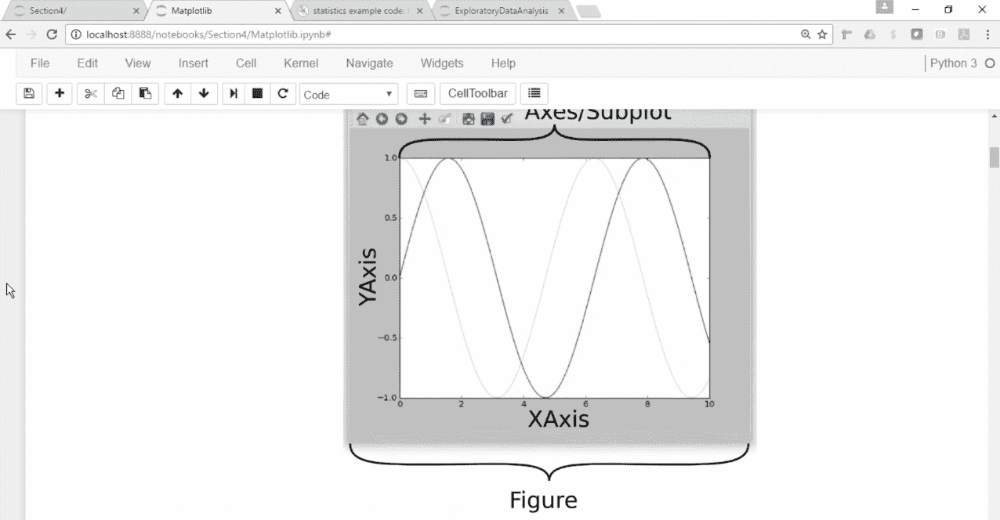

让我们探究一下前面截图中提到的术语:

*   **图**:图是这个层次结构中的第一个顶级容器。它是包含所有绘制内容的整体窗口。我们可以有多个独立的图形和图形中的多个轴。
*   **轴/支线剧情**:现在大部分的绘制都是针对一个轴或者支线剧情。这个图有很多组成部分，比如 *x* 轴和 *y* 轴；我们有一个标绘区域，我们有刻度线，等等。作为子图的一部分，我们有其他对象，如 *x* 轴，在 *x* 轴内，我们有诸如 x 标签、x 刻度线和刻度线标签的东西。这基本上就是我们在`matplotlib`中的等级制度。
*   **轴:**我们可以看到层次的顶部有图，在图里面我们有支线剧情。但是前面的图片只有一个支线剧情，否则一个人物里面我们可以有很多支线剧情。每个支线剧情都有其他元素；最常见的是，我们会有一个 *x* 轴，一个 *y* 轴，以及许多其他元素。

# pyplot 简介

现在，我们将开始使用带有`pyplot`界面的`matplotlib`。我们将讨论的主题是`pyplot`界面和一些例子

在我们的 Jupyter 笔记本中，我们注意到的第一件事是，我们有一个包含带有`%`符号的`matplotlib inline`的命令，如以下代码块所示:

```py
%matplotlib inline
```

这基本上就是我们告诉 Jupyter 笔记本我们想看到笔记本中的情节的方式。当我们不使用此命令并执行此行时，我们会看到绘图将出现在不同的窗口中。

Pyplot 基本上是命令风格函数的集合，使`matplotlib`的工作类似于 MATLAB。这个想法是我们有一个函数的集合，每个函数对一个数字做一些改变，这个数字被认为是当前的数字。所以每个函数都对一个图形有作用；例如，我们可以创建一个图形，我们可以在图形中创建一个绘图区域，我们可以在图形的子图中绘制一条线，我们还可以更改标签。当我们使用`pyplot`界面时，我们必须记住哪个是当前的数字。让我们看一些例子:

1.  将`matplotlib`导入当前会话的第一个约定是`matplotlib.pyplot`作为`plt`:

```py
import matplotlib as plt
```

2.  我们的第一个命令包括来自`plt`模块和`pyplot`模块的`plot`功能，我们还将传递一个数字列表。因此，当我们执行该行时，我们将看到该命令创建了一个图形。在下图中，我们有一个图，尽管我们看不到它，在图中我们有一个子图，在这个子图中我们有一个线图，它只是我们在这个列表中的数字的图形表示:

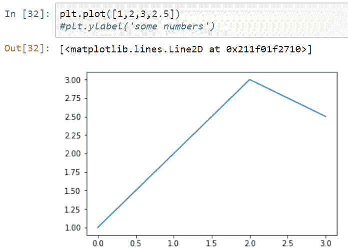

在上图中，我们可以看到这个函数做了什么，这个数字被认为是当前的数字。我们使用或应用的每一个其他函数，例如，如果我们调用这个函数`plt.ylabel`，将在 *y* 轴放置一个标签，并将被称为`ylabel`。在这种情况下，标签是一些数字。让我们再次运行它并查看下图，其中我们可以看到该函数是如何应用的或者已经使标签出现在 y 轴上，如下图所示:

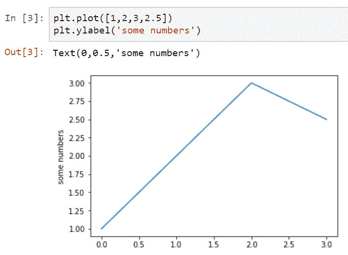

3.  `pyplot`界面最常用的函数是`plot`函数，可以带很多参数。例如，如果我们传递两个数字列表，它将假设第一个列表是 x 坐标，第二个列表是 y 坐标，在这种情况下，它将默认绘制一条线。那么，我们来看看下图中的`plot`函数:

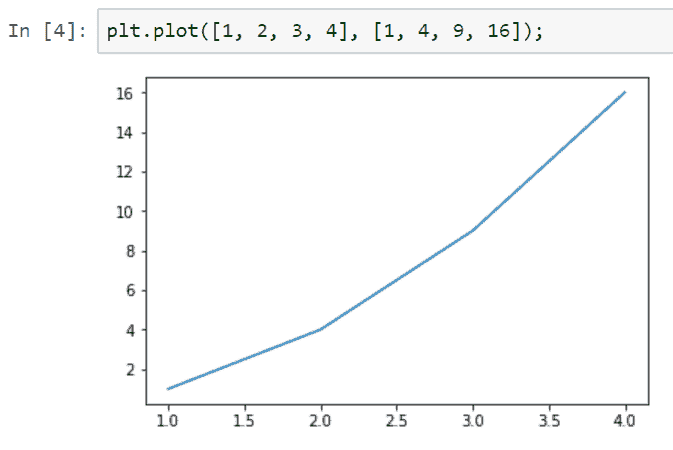

因此，这个接口通过构建一个称为函数序列的图来工作，所有这些函数都应用于当前的图形或当前的子图。那么，让我们看看我们通常如何通过执行以下步骤来使用`pyplot`构建一个图:

1.  我们将向`plot`函数添加两个列表，正如我们之前看到的，默认行为是绘制一条线；因此，我们可以看到 x 值和 y 值，在这两个值中，我们表示希望线条是`lightblue`颜色，并且希望`linewidth`是`3`大小。我们可以在下图中查看输出:

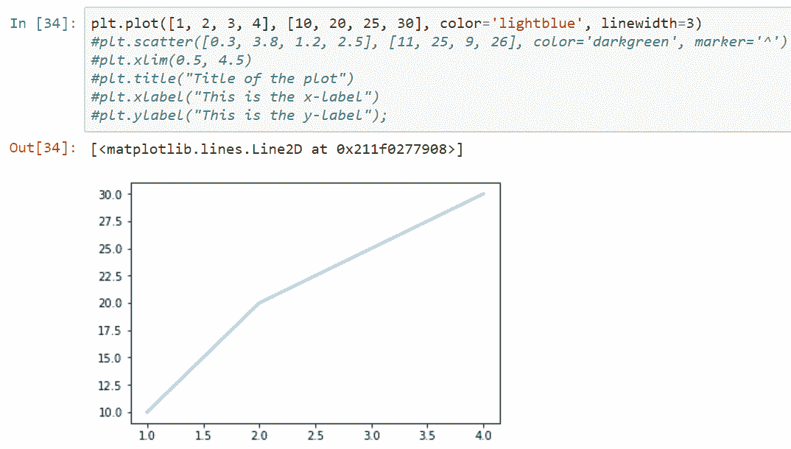

在上图中，我们可以看到我们已经对其他函数进行了注释。我们现在将一行一行地删除注释，这样我们就可以看到应用于我们使用的每个函数的所有更改。

2.  散点图绘制的是我们提供的坐标，而不是直线。在这种情况下，它们是 X 坐标和 Y 坐标。它还将创建地块标记。然后，我们将添加一个参数来定义要在`darkgreen`中着色的标记。现在让我们查看下图中散点图的绘图:

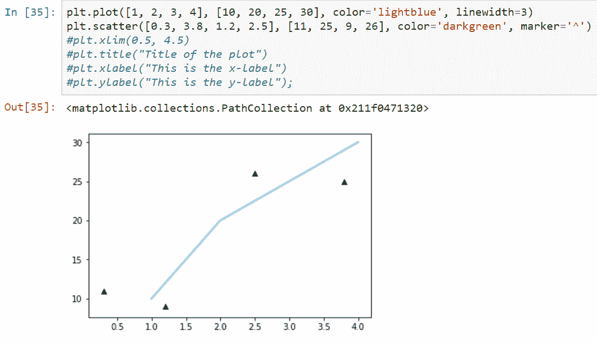

3.  我们现在将应用另一个函数，它将改变图的 x 极限，其中最小值为`0.5`，最大值为`4.5`，因此现在图将在 *x* 轴上从 0.5 变为 4.5。在下图中，我们将看到这一修改，并逐行删除注释:

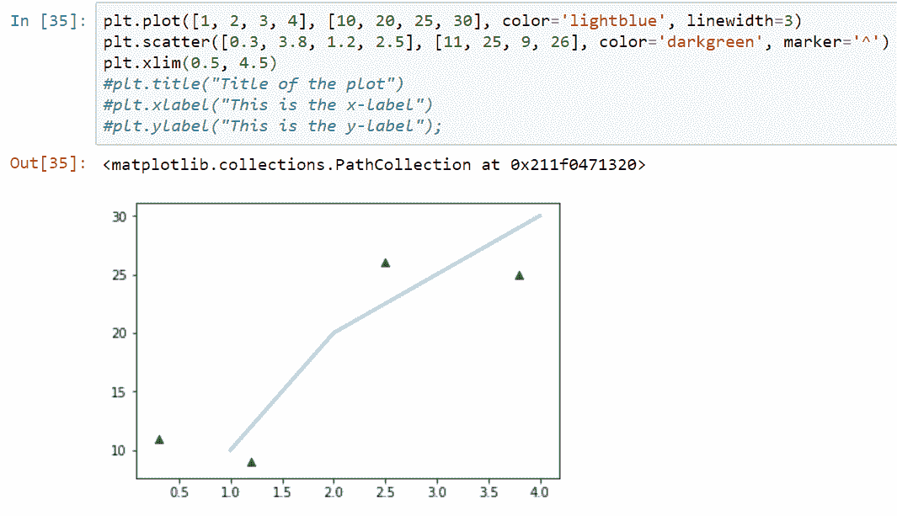

4.  下一个功能是添加一个地块标题并更改地块标签。在下图中，我们可以看到如何添加标题、x 标签和 y 标签:

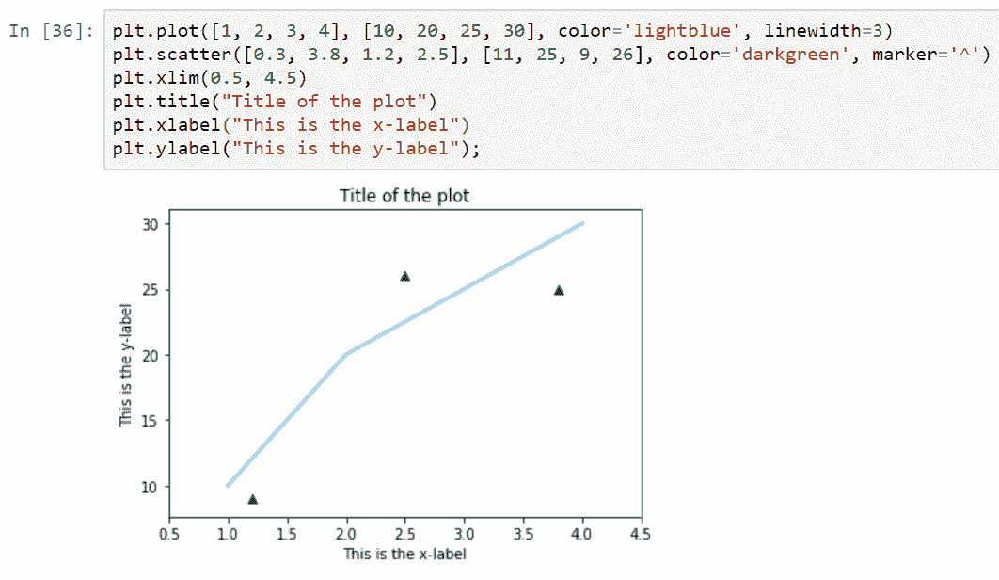

当我们只处理一个支线剧情或者一个人物的时候，一般使用`pyplot`界面是非常方便的。但是当我们处理一个以上的图形或一个图形中的多个子图时，它会变得令人困惑。

5.  我们现在将运行该示例，并在下面的屏幕截图中查看它:

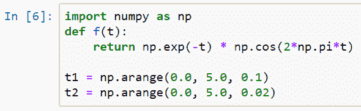

6.  现在我们有了上图中显示的数据，我们现在将生成一个具有两个子情节的图形。我们将首先创建一个图形，使用这个命令，我们将添加一个子场景。我们想要的是一个由两行一列的网格组成的子情节网格，我们将要使用的情节将是第一个。现在，在第一个图中，我们要绘制我们生成并定义的`t1`和`f (t)`，如下图截图所示:

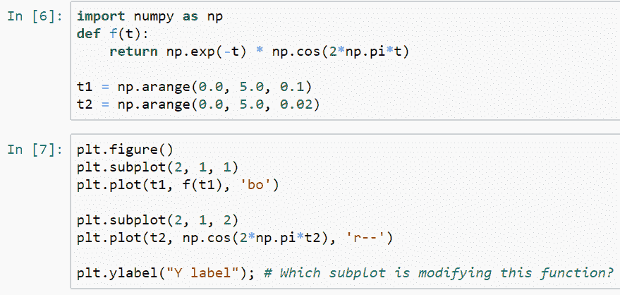

7.  在上图中，我们将使用另一个命令来更改图中的参数。我们仍然会有两行一列的网格，这将是第二个绘图，我们将绘制对象`t2`，我们还将使用标记。为了改变标签，我们需要记住当前的子情节:

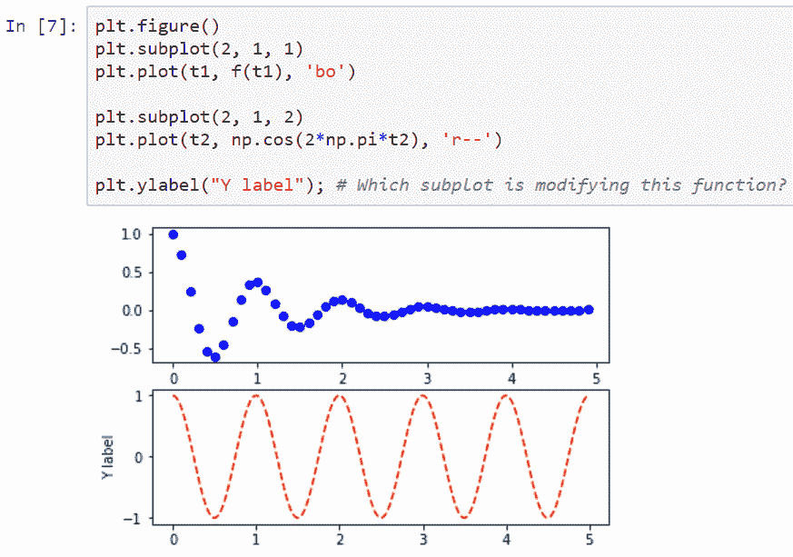

因此，面向对象的接口更好，因为我们可以确定我们指的是哪个对象，而在这种情况下，每当我们应用一个函数时，我们必须记住当前的子图或当前的图形。

# 面向对象的接口

我们现在将研究什么是面向对象接口`matplotlib`。我们将讨论以下主题:

*   面向对象的接口
*   创建带有子情节网格的图形
*   使用方法绘图

在面向对象的接口中，我们需要做的是创建对象并为每个对象调用方法，以便对该对象进行特定的更改。让我们看一个简单的例子，其中使用面向对象的接口创建了一个图。我们通常使用`plt.subplots`功能同时创建两个对象。当我们创建一个图形对象时，我们通常称之为`fig`、**、**，轴对象通常称之为`ax`。在这种情况下，默认功能是生成一个具有一个轴对象或一个子图的图形。当我们创建对象时，会涉及到一些变化。为了改变我们的对象，即情节、标题或设置标签，我们在这些对象上使用方法。让我们通过几个例子，以图表作为我们的参考点。在这个例子中，我们将使用对象上的`plot`方法绘制 NumPy 数组的`x`和`y1`数组，我们希望它们在一条红线内。下一个将是在使用同一个对象的同时，这次我们要用`y2`绘制`x`，我们要把它们放在一条蓝线上。然后，对于同一对象，我们将设置一个`x`标签和一个`y`标签以及标题。让我们看看下图，看看结果:

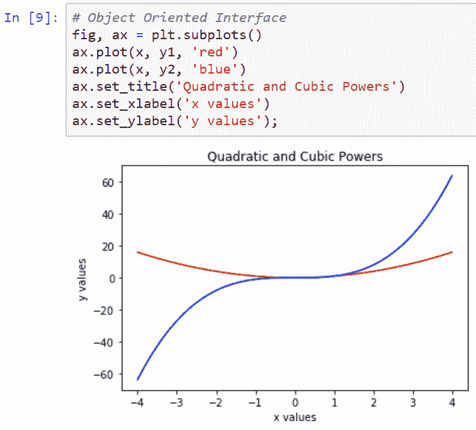

现在，让我们看看如何使用`pyplot`界面再现相同的情节。在`pyplot`界面中，我们不需要显式的命令来创建图形，因为`plot`功能会执行它。我们还可以在这些函数中传递许多参数。首先，我们将传递前两对坐标，`x`和`y1`坐标，我们声明我们希望这是一条红线。然后我们传递第二对对象，我们声明我们希望这是一条蓝线。然后我们可以为这个对象设置标题和`x label`和`y label`。让我们查看下图中的输出:


当我们重现同样的情节时，我们可以看到我们的代码行更少了。而出现的问题是:W *使用面向对象接口*有什么好处？。我们得出的结论是，当我们在一个图中处理多个子场景时，面向对象接口的有用性会更清楚。因此，如果我们在一个图中只生成一个子图，那么使用面向对象的`pyplot`接口可能没问题。但是如果我们使用许多子场景，我们将会看到使用面向对象接口的优势。

所以，为了产生一个支线剧情的网格，我们将使用函数`plt.subplots`，并且可以提到我们想要多少行和列，这将产生一个支线剧情的网格。因此，在下图中，我们有四个子情节:

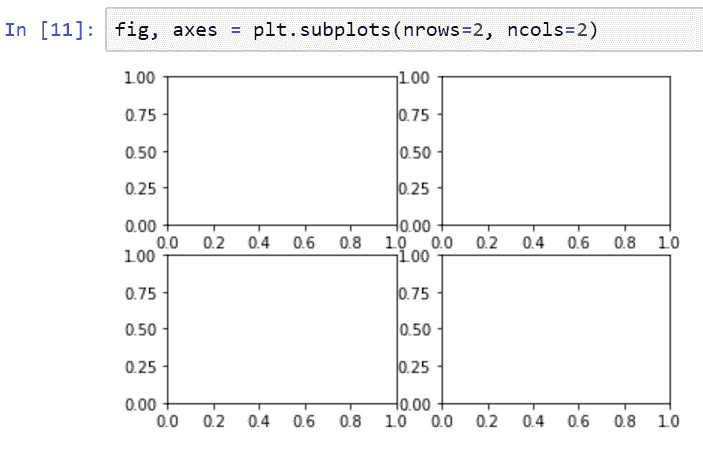

现在，使用面向对象接口的优点是我们可以引用这些对象中的每一个。让我们看另一个例子，我们将再次运行这个代码来创建两个对象，图形和轴，在这种情况下，轴将是一个多维的 NumPy 数组，有四个子场景。为了访问子情节，我们必须使用 NumPy 数组符号。所以，第一个子剧情是带有索引`0,0`的子剧情，如果我们想对那个对象做一些修改，就需要使用合适的方法。所以，在这种情况下，假设我们想要更改标题。我们将为此对象设置标题，即在索引`0,0`中，我们将标题设置为`Upper Left`。我们可以通过索引来引用每个子情节，在这种情况下，我们可以使用我们想要的方法。我们将更改这些对象的标题。这样做的好处是，由于对象`axes`是一个 NumPy 数组，我们可以迭代是否要对每个对象和每个子情节进行类似的更改。

所以，我们可以对每个子剧情使用扁平属性，我们称之为`ax`。在这种情况下，我们将`xticks`设置为空列表，将`yticks`设置为空列表以删除它们。当我们运行这段代码时，正如我们所看到的，我们不再有`xticks`或`yticks`，我们有所有的标题，因为我们在这里设置了标题:

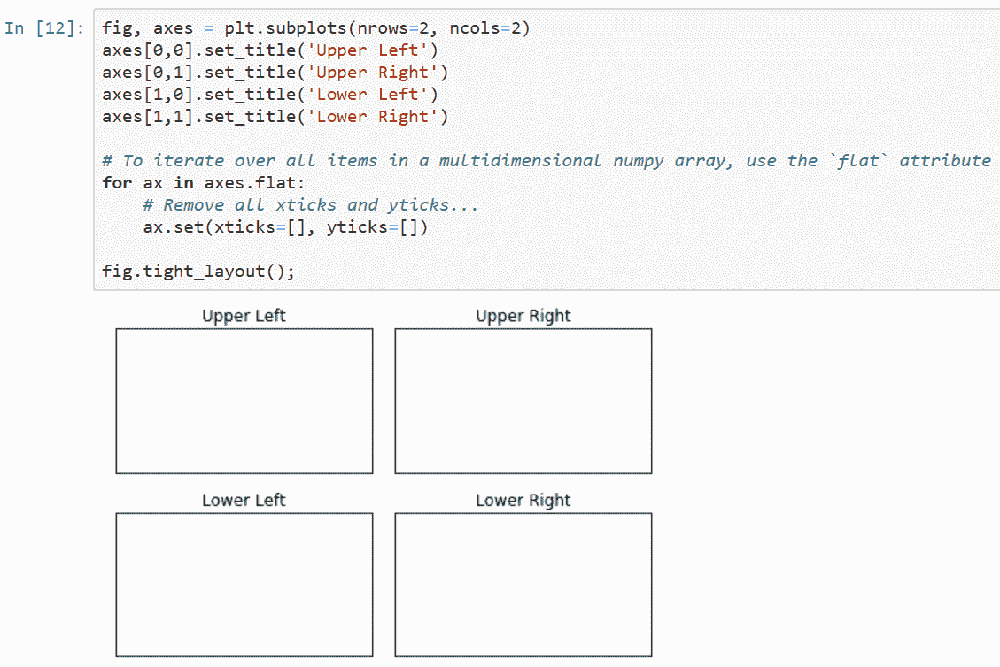

既然创建了人物对象，就可以使用`tight_layout`这样的人物方法，这样会照顾到支线剧情出现的方式，不会重叠。这基本上就是面向对象接口背后的思想；我们创建对象，然后为我们创建的每个对象应用方法。在下图中，我们有更多的例子，让我们看看我们产生了什么:

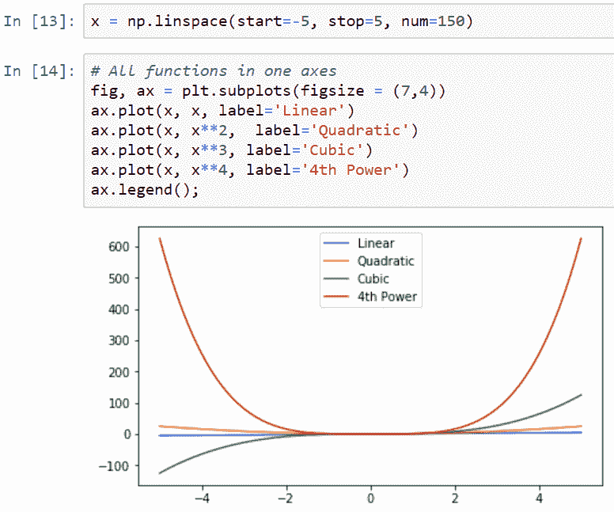

现在让我们用一个单独的子剧情制作一个单独的人物，其中我们将绘制`x`的所有前四次方。我们现在将看到如何在不同的支线剧情中进行剧情。在单元格中，我们将创建一个有两行两列网格的子场景，因此我们总共将有四个子场景。现在，我们将使用面向对象的界面来设置第一个的标题，以及`Linear`功能的图。第二个情节，位于索引`0,1 0,1,`，我们将设置标题和情节`x`和`x squared`。我们可以在下图中看到结果:

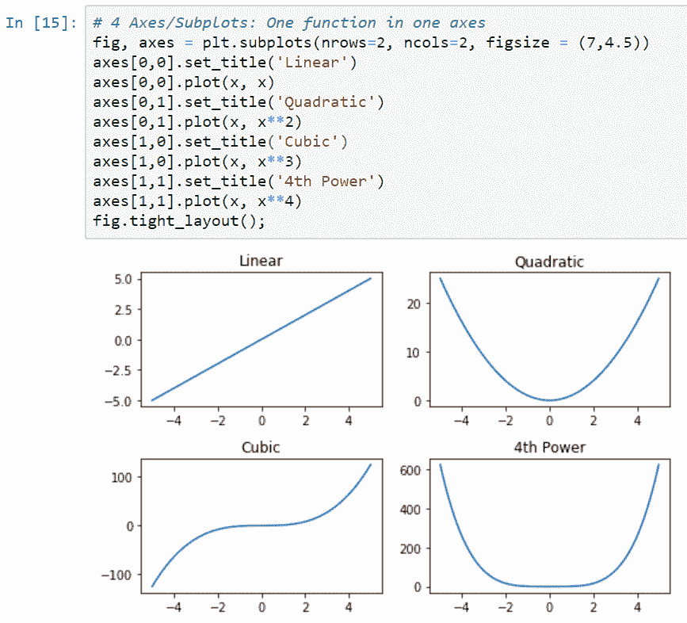

因此，我们可以在上图中看到，有四个子场景，每个子场景有一个函数。而我们可以做更多有趣的事情，可以在下图中查看，比如看一下`x`的前十次方。这就是面向对象接口的工作原理，这也是我们在本课程剩余部分中使用`matplotlib`的方式:

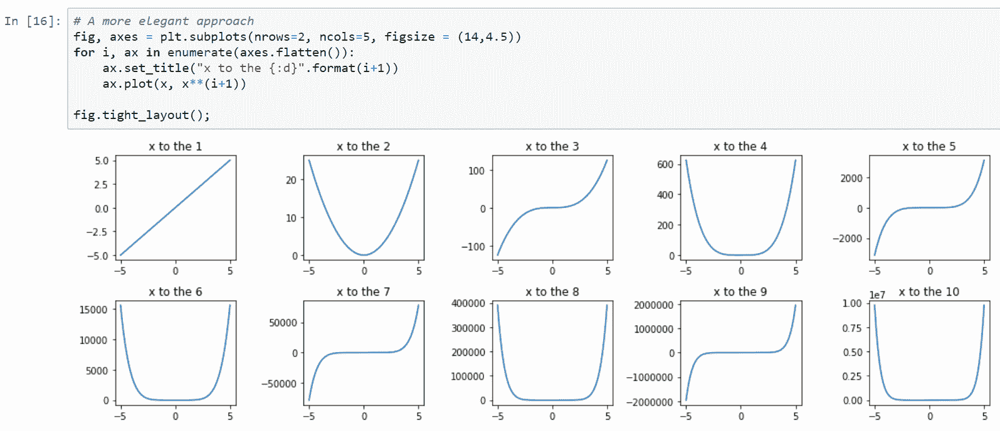

因此，我们已经看到了使用面向对象接口的便利性。

# 常见自定义

`matplotlib`的一个好处是，它允许我们调整剧情的每一个元素。我们将看到在执行数据分析时，您在使用`matplotlib`时总是会进行的一些常见定制。

首先，让我们使用下面几行代码生成一些数据:

```py
# Generating data
x = np.linspace(-np.pi, np.pi, 200)
sine, cosine = np.sin(x), np.cos(x)
```

我们现在将研究`matplotlib`中的每个定制特性。

# 颜色；色彩；色调

颜色与图形中绘制的一切都有关联。Matplotlib 支持一种非常健壮的语言来指定各种用户应该熟悉的颜色。

# 颜色名称

人们在`matplotlib`中使用颜色最常见的方式是根据首字母或名字。因此，对于每个元素，例如条、行或文本的颜色，您可以传递一个附加参数，该参数带有一个包含所需颜色的字符串。如果你希望你的元素是蓝色，你可以传递字符串`b`，或者你可以传递整个单词`blue`。绿色也是如此；你可以通过`g`或者整个单词`green`。

以下是一些常用颜色及其首字母的列表:

*   `b`:蓝色
*   `g`:绿色
*   `r`:红色
*   `c`:青色
*   `m`:洋红色
*   `y`:黄色
*   `k`:黑色
*   `w`:白色

其他允许的颜色名称是 HTML/CSS 颜色名称，例如 *burlywood* 和*chartrese*。

There is a list of 147 such colors; you can see them at [https://www.w3schools.com/tags/ref_colornames.asp](https://www.w3schools.com/tags/ref_colornames.asp).

您可以在`matplotlib`中指定颜色的另一种方法是使用十六进制值，例如您在 HTML 或 CSS 中使用的值，如果您熟悉这些语言的话。所以，你可以通过`#0000FF``matplotlib`等代码就明白了。

通过传递 0 到 1 之间的数字的字符串表示，可以给出灰度而不是颜色。0.0 是黑色，1.0 是白色。中间的每一个值都是灰色的；例如，0.75 将是较浅的灰色阴影。

您也可以传递 RGB 元组，其中最后一个值将是透明度值，也称为 *alpha* 。如果您传递一个由四个元素组成的元组，`matplotlib`会将前三个元素解释为 RGB 颜色，最后一个元素解释为 alpha 值。假设我们想把第一条线，正弦函数的线，涂成红色。我们可以使用这个参数，`color='red'`，然后对于余弦函数，我们使用`color='#165181'`:

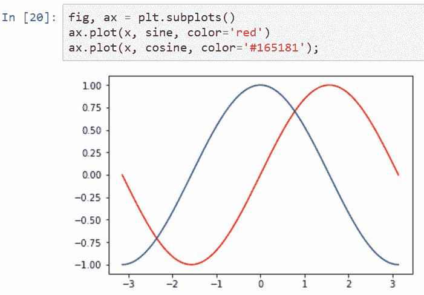

运行单元格时，我们得到了前面的图表，它显示了折线图。

# 设置轴限制

您可以用`set_xlim()`方法更改 *x* 轴限制，用`set_ylim`更改 *y* 轴限制。这些方法采用两个值，最小值和最大值，如下图所示:

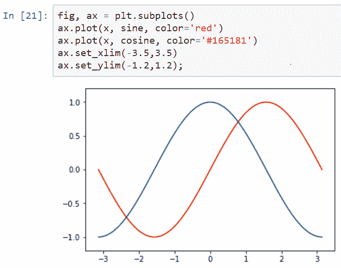

我们看到两个轴的默认限制都发生了变化。

# 设置刻度和刻度标签

Matplotlib 试图给我们非常合理的记号和刻度。刻度是您可以在水平轴上看到的标记，刻度或刻度标签是对应于刻度的数字或值。我们还可以根据需要更改刻度线和刻度标签:

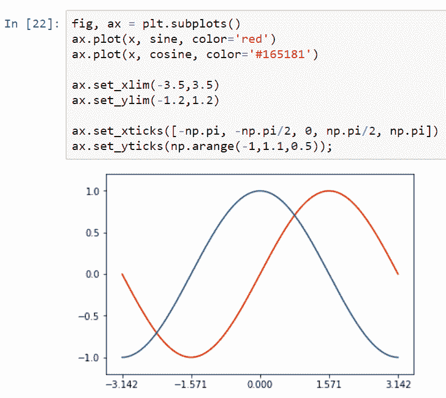

在上图中，我们在 *x* 轴和 *y* 轴上都有自定义的刻度线和刻度标签。

正如您可以更改 XT picks 的位置一样，您也可以更改 XT picks 的标签。假设您希望 *x* 轴上的标签出现在数学符号中，例如-pi 和-pi/2。您可以使用`set_xticks`、`set_yticks`、`set_xticklabels`和`set_yticklabels`方法来更改和分配新值:

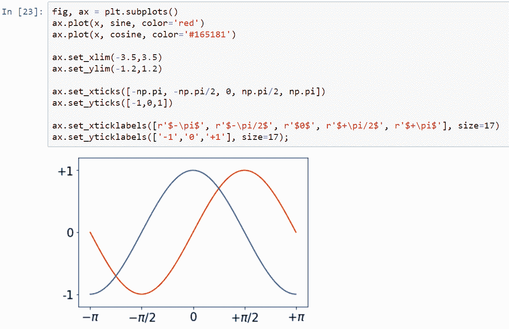

您将在前面的输出中看到，我们已经更改了数学符号中刻度标签的值。

# 神话；传奇

图例用于识别绘图中的曲线。对于图形的观察者来说，知道红色曲线指的是正弦函数，蓝色曲线属于余弦函数将是一个好主意。因此，我们将为绘制的每一行指定一个标签。您可以使用带有可选参数的`legend()`方法，告诉`matplotlib`您希望标签放置的位置:

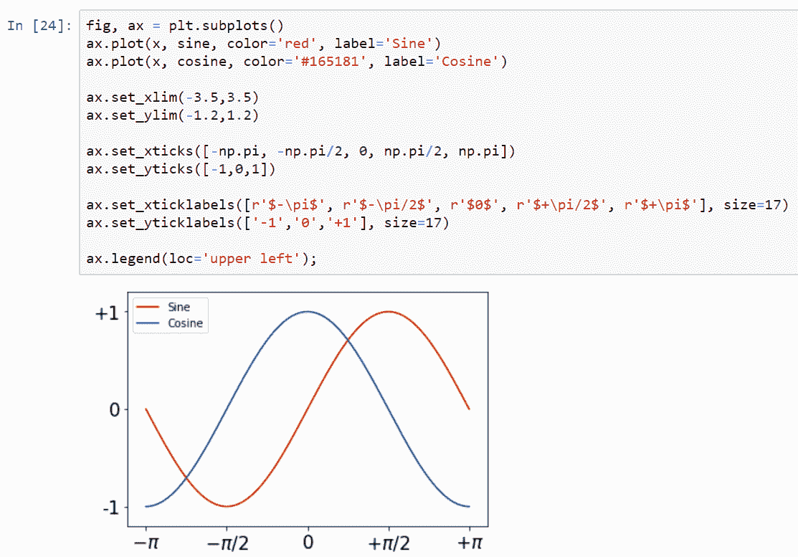

因此，在上图中，我们看到正弦和余弦函数的标签位于图的左上角，在这里我们可以很容易地通过名称识别每一行。

# 释文

在你的绘图中有两个主要的功能或方法来做注释。您可以使用`text ()`方法，指定您希望文本显示的 x 坐标和 y 坐标，该方法的第三个参数是您实际想要在绘图中绘制的文本:

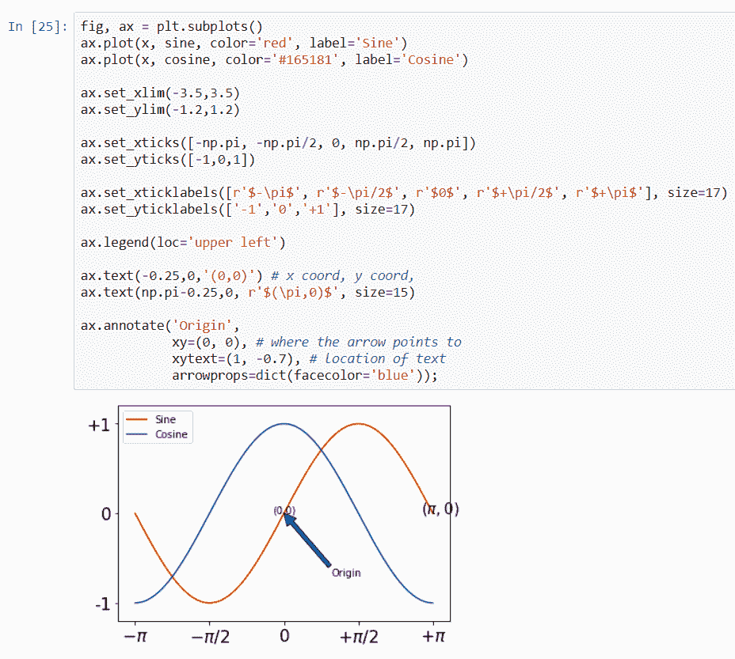

在上图中，标注`(0,0)`使用`ax.text(-0.25,0,'(0,0)')`方法生成，标注(π，0)使用`ax.text(np.pi-0.25,0, r'$(\pi,0)$', size=15)`方法生成。在你的图中做注释的另一个功能是`annotate`方法。

`annotate`方法需要很多参数。在之前看到的输出中，我们已经使用`xytext=(1, -0.7)`指定了希望文本显示的坐标，并且在`arrowprops=dict(facecolor='blue'))`中，我们传递了箭头的字典。

# 生成网格、水平线和垂直线

有几种方法可以生成网格、水平线和垂直线。`axhline()`方法将产生水平线，您可以为颜色和透明度指定其他参数，如 alpha 和 color。类似地，我们有`axvline()`方法，绘制垂直线和参数:

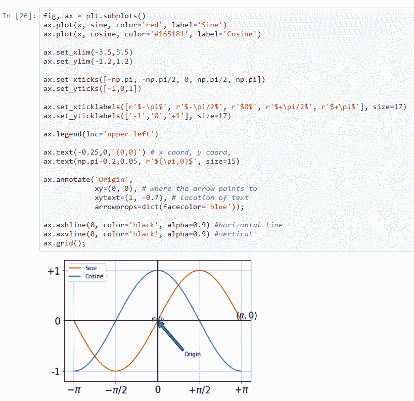

`grid()`方法会给你的图一个网格，换句话说，就是你在输出中看到的让你的图看起来更好的灰色线条。您可以定制`matplotlib`中的几乎每个元素，但是我们所做的是您想要做的常用更改。

# 海鸟和熊猫的电子设计自动化

**探索性数据分析** ( **EDA** )是一种分析数据集以总结其主要特征的方法，通常采用可视化方法。它被用来理解数据，获得一些关于它的上下文，理解变量和它们之间的关系，并制定在构建预测模型时可能有用的假设。

# 了解海底图书馆

Seaborn 是一个库，它用 Python 制作了包含统计数据的吸引人且信息丰富的图形。Matplotlib 被用来建造这个图书馆。它还集成了 Python 的数据科学堆栈。它还支持 NumPy 和`pandas`，以及 SciPy 的统计例程和统计模型。

To know more about seaborn and its features, please visit [https://www.datasciencecentral.com/profiles/blogs/opensource-python-visualization-libraries](https://www.datasciencecentral.com/profiles/blogs/opensource-python-visualization-libraries).

以下是 seaborn 库的导入声明:

```py
# standard import statement for seaborn
import seaborn as sns
```

# 执行探索性数据分析

为了执行探索性数据分析，让我们使用一个数据集，该数据集包含美国某个城市的房价信息和不同房屋的特征。这个数据集在本书的补充资料中，我们将把它加载到`pandas`数据框中:

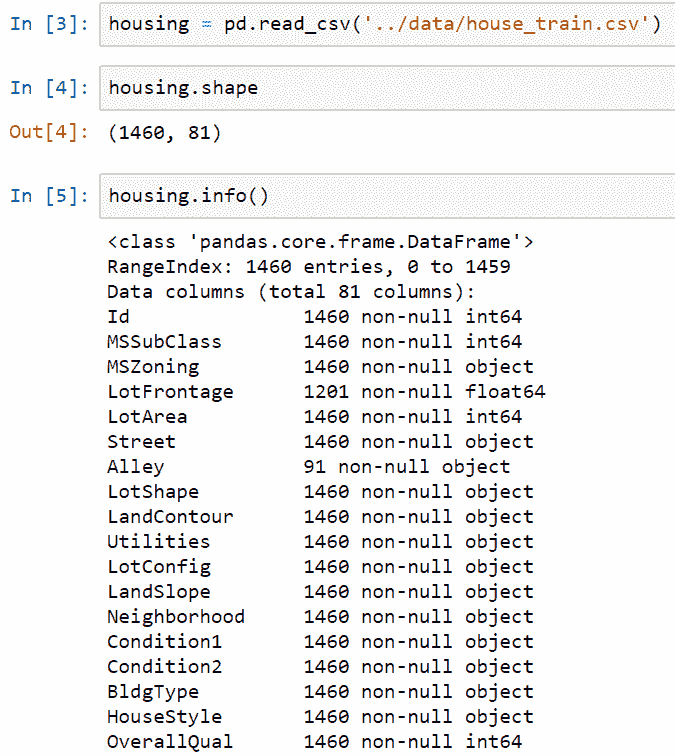

这就是我们将如何在`pandas`数据框中加载数据集。我们看到我们的数据框有 1，460 个观察值和 81 列。每列代表数据框中的一个变量。这里，我们不打算使用所有的变量；相反，我们将只关注一些用于执行探索性分析的工具。

# 执行数据分析时的关键目标

所有数据分析都必须由一些关键问题或目标来指导，这些问题或目标指导我们所做的一切。在开始任何数据分析任务之前，你必须有一个清晰的目标。例如，以下目标将指导我们对此数据集的探索:

*   了解数据集中的单个变量
*   了解该数据集中的变量与房屋销售价格的关系

我们将这样做，因为当您了解您的数据和问题时，您将能够从您的分析中获得有意义的结果。

# 变量类型

一般来说，有两种可能的变量类型:

*   数字变量
*   分类变量

我们所说的数值变量是指数值为数字的变量。我们所说的分类变量是指值是类别的变量:

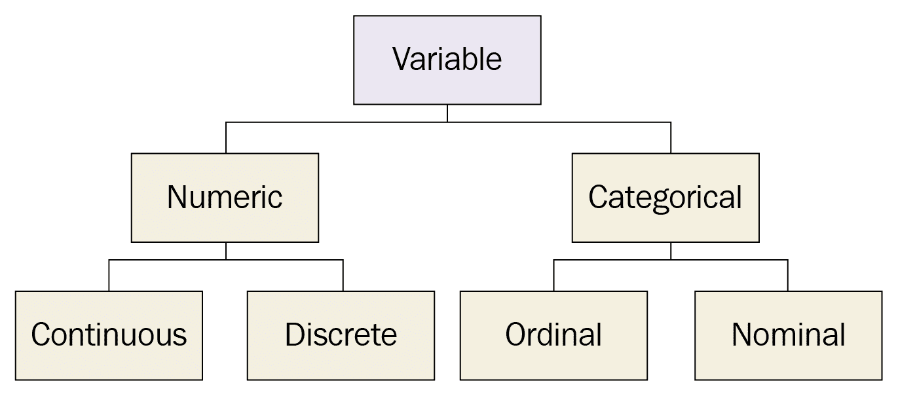

在这两大类中，我们有两个子类。对于数值变量，我们有连续变量，理论上可以取一个区间内的任何值。另一方面，我们有离散的数值变量；这些变量可以在一个区间内取非常具体的值。对于分类变量，我们又有两种类型的分类变量。第一个是所谓的序数变量，这些变量的类别有一个自然的顺序。

例如，如果您有一个名为质量的变量，并且该变量的类别是低质量、中等质量和高质量，那么您知道您有一个序数变量，因为这些类别之间有一个自然的顺序。你可以说中等，从某种意义上说，比低质量好，好质量比中低质量好。最后，名义分类变量是那些在它们之间没有任何顺序的分类变量。

让我们看一下数据集内数字变量的以下示例:

*   `SalesPrice`:这个变量代表房子的销售价格
*   `LotArea`:这个变量代表了以平方英尺为单位的一个地段的大小
*   `OverallQual`:这个变量代表房子整体材料和装修的比率
*   `OverallCond`:这个变量代表房屋整体状况的比率
*   `1stFirSF`:这个变量代表一楼的平方英尺
*   `2ndFirSF`:这个变量代表以平方英尺为单位的第二层
*   `BedroomAbvGr`:该变量代表地上的卧室(不包括地下室卧室)
*   `YearBuilt`:这个变量代表了最初的建造日期(这在技术上不是一个数字变量，但是我们会用它来产生另一个变量叫做`Age`)

让我们看一下数据集内分类变量的以下示例:

*   `MSZoning`:该变量标识销售的一般分区分类
*   `LotShape`:这个变量代表属性的一般形状
*   `Neighborhood`:该变量代表`Ames`城市范围内的物理位置
*   `CentralAir`:这个变量代表中央空调
*   `SaleCondition`:这个变量代表销售条件
*   `MoSold`:此变量代表月销(MM)
*   `YrSold`:该变量代表销售年份(YYYY)

当我们实际分析数据时，这些变量被称为数字和分类的原因将在本章的下一节中看到。

# 单独分析变量

首先，让我们定义将要在这个分析中使用的变量的名称。我们有一个数字变量列表和一个分类变量列表。然后，我们将使用只包含我们刚刚定义的变量的数据框来重新定义我们的房屋数据框。然后，我们使用`shape`属性来查看新数据帧的大小:

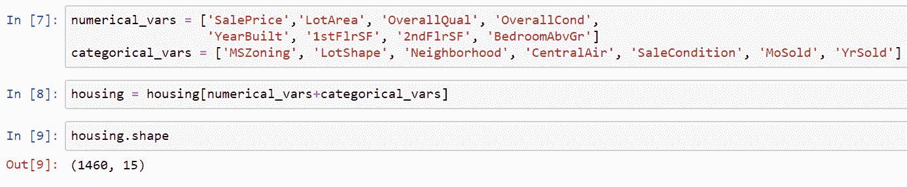

在上图中，我们可以看到我们的数据框的形状现在已经改变了，因为我们只有 15 列。

# 理解主要变量

先说说我们想了解的主要变量，房子的`SalePrice`。当我们有一个分类变量时，我们做的第一件事是我们通常想知道它们的描述性统计:


所以在这里，我们知道了这个变量的取值范围。在上图中，我们看到数据集中平均房价为平均房价`$180,000`。我们的标准偏差在`$80,000`左右。数据集中最便宜的房子对应的最小值在`$35,000`附近，数据集中最贵的房子对应的最大值为`$755,000`。

计算数字变量的描述性统计总是一个好主意，因为你将了解这个变量可以取的值，以及变量的分布和离差。我们必须用变量的图形表示来补充我们从数字总结中获得的信息。对于数值变量，直观理解变量的典型方法是使用直方图。为了得到一个`pandas`序列的直方图，我们可以使用`hist`方法，如下图所示:

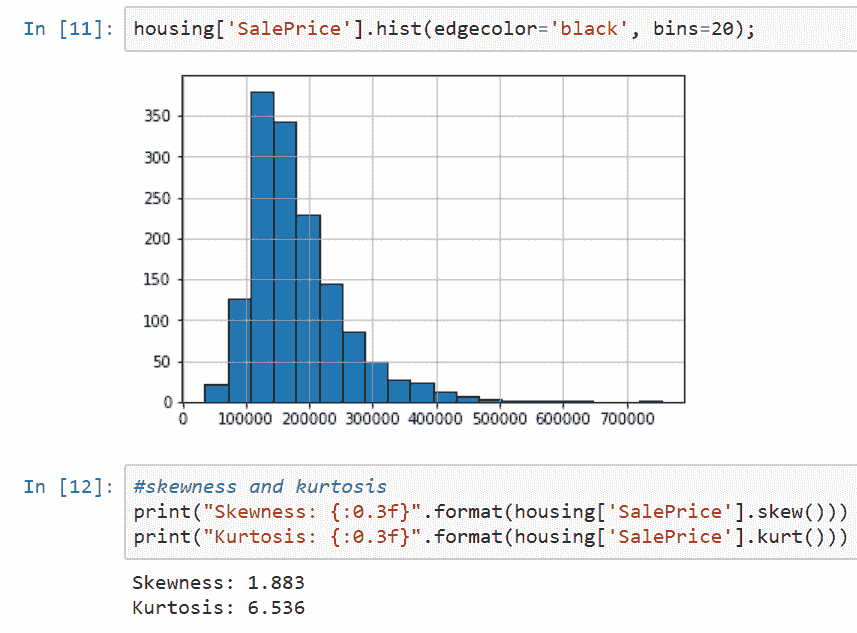

在这里，我们看到很少有房子的价格低于 10 万美元，所以大多数房子都集中在 10 万美元到 20 万美元之间。我们在这里注意到的另一件事是，我们几乎没有观察到非常高的价格。我们很少有 40 万以上的房子，分布有一个长尾，你可以用下面的数字统计来确认，`Skewness`和`Kurtosis`。偏斜度为 0 将告诉你，你有一个对称分布，如果你有一个正值，它将告诉你，你有一个正尾部，类似于我们在这里观察到的。峰度会告诉你分布的厚度，正如你在这里看到的，我们有非常高的值，集中在 10 万美元和 20 万美元左右，这就是为什么我们有一个峰度`6.5`。接近正态分布的变量的通常值约为 3。

# 数字变量

如果您想检查数据集中的所有数值变量，您可以使用为`pandas`数据框对象获得的`hist`方法非常容易地完成。为了做到这一点，我们在房屋数据框中添加了一个数字变量列表，就像我们在`pandas`系列中所做的一样，我们也可以在熊猫数据框中做同样的事情。我们使用`describe`方法，它将显示一个小的数据框，包含我们数据集中每个数字变量的所有描述性统计数据。现在，如果我们想一个一个地可视化所有这些变量，`pandas`和`pandas`的可视化能力的一个好处是，你可以将`hist`方法应用于数据帧，而不仅仅是一个系列。因此，我们使用`hist()`方法，其参数如下:`edgecolor`被指定为黑色，使黑线出现在条之间，而直方图中`bins`的数量被设置为`15`，将`figsize`设置为`(14, 5)`，布局为 2 行 4 列，因此总共有 8 个直方图:

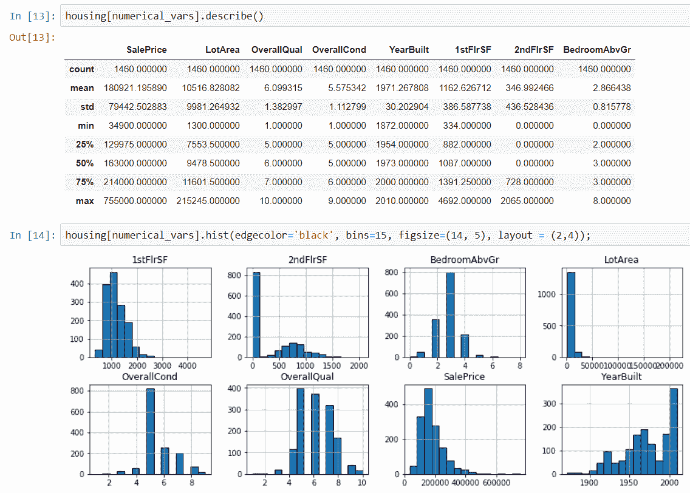

所以，在一行代码中，我们可以看到`pandas`产生了我们在这个数据集中拥有的 8 个数值变量的非常好的可视化，正如你在这里看到的，你从观看这个，从观看和分析这个可视化中获得了很多信息。下面是我们观察到的每个直方图:

*   如你所见，一楼的大小分布是向右倾斜的。所以它告诉你的是，你很少有大房子，但大多数房子的价值在 1000 或 1200 平方英尺左右。
*   你可以在`2ndFlrSF`变量中看到一个 0 左右的大条。这些是没有第二层的变量。
*   大多数房子有三间卧室。
*   地段面积严重倾斜；面积很大的房子很少。
*   条件和质量的评分往往在 5 分左右；很少有房子的评级很高或很低。
*   `YearBuilt`变量在目前的形式下实际上没有用。然而，我们可以用它来构造一个实际上有意义的变量；出售时房屋的年代。

因此，我们将定义一个新的变量`Age`，作为房屋出售的年份减去房屋建造的年份。然后，我们将从我们的数字变量中移除`YearBuilt`变量，并将其替换为我们的数字变量列表中的`Age`变量，并再次进行绘图，以查看年龄分布是如何出现的:

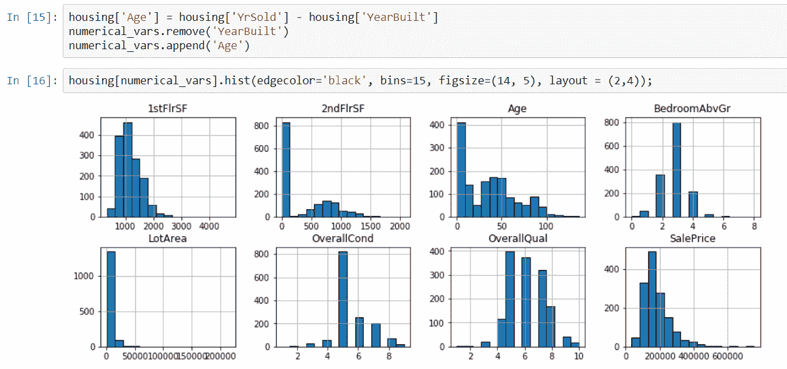

我们在`0`这里看到带有大杠的`Age`变量，所以这意味着卖出了很多房子；几乎有 400 栋房子在新的时候被卖掉了。

# 分类变量

分类变量的推荐绘图类型是条形图。要在`pandas`中对一个分类变量做条形图，你取`pandas`系列对象`SaleCondition`，计算`value_counts`，然后使用`plot`方法；

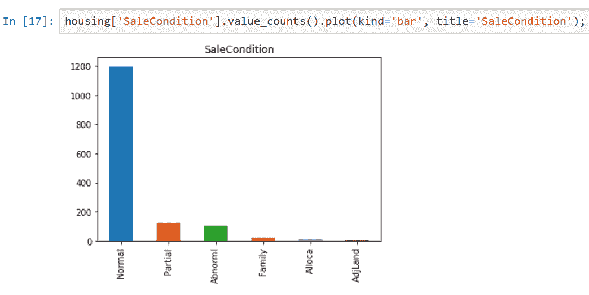

当我们执行该行时，我们得到的是这个`SaleCondition`变量中不同类别的计数。所以大部分房子都是在**正常**条件下卖的，差不多有 1200 套，很少房子是在其他条件下卖的。

现在，为了可视化我们数据集中的所有分类变量，就像我们对数字变量所做的那样，我们没有一种方法可以直接用`pandas`来完成。但是，由于我们从本章的*介绍 Matplotlib* 一节中学到的东西，我们可以利用我们在那里获得的知识来做这件事。因此，我们将使用`plt.subplot`函数创建一个图形和一个轴对象，网格为 2 行 4 列，这将为我们提供 8 个子场景。然后我们将`figsize`指定为`(14, 6)`。接下来，我们将编写一个循环来循环这个`ax.flatten()`对象中每个子图中的每个分类变量。

所以，对于每个变量，我们取`pandas`系列对象，它将计算值计数。然后我们使用`kind`作为`bar`的`plot`方法，我们唯一的修改是要求`pandas`在`subplot`对象和`loop`变量中绘制条形图。最后，我们有`tight_layout`方法让支线剧情在图中很好地出现:

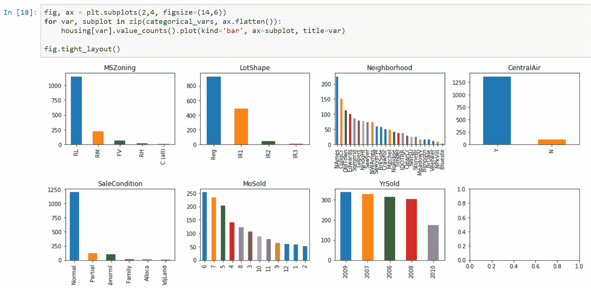

所以，正如我们在这里看到的，只用四行代码，我们就可以产生一个非常复杂和丰富的可视化。

为了更好地理解变量和`SalePrice`之间的关系，我们将编写一个小函数来识别那些值小于 30 的类别级别。然后我们将使用`apply`方法对`pandas`数据框中的每一行应用该函数。然后我们有一个`for`循环，该循环将检测并保存水平超过 30 个观察值的观察值:

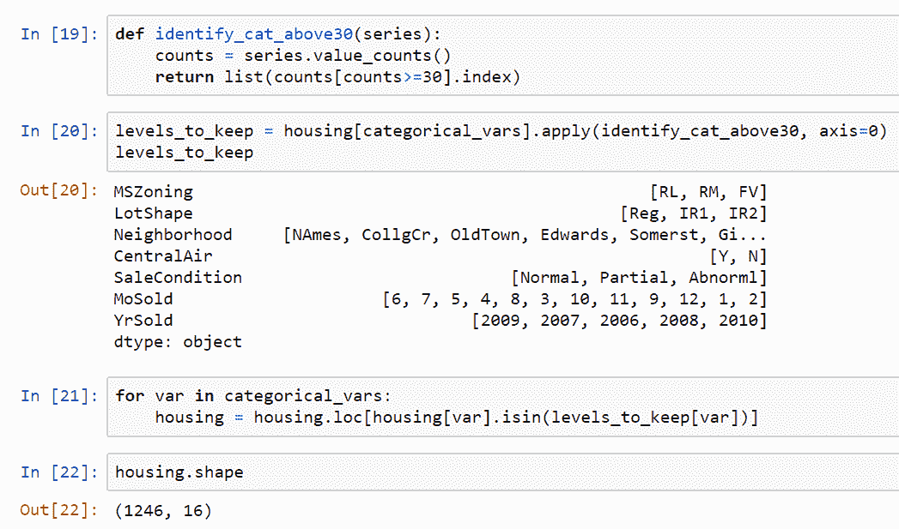

当我们执行这些行时，我们得到的观察结果会更少；16 个变量的 1246 次观测。

现在，让我们再次看看我们之前看到的同样的可视化:

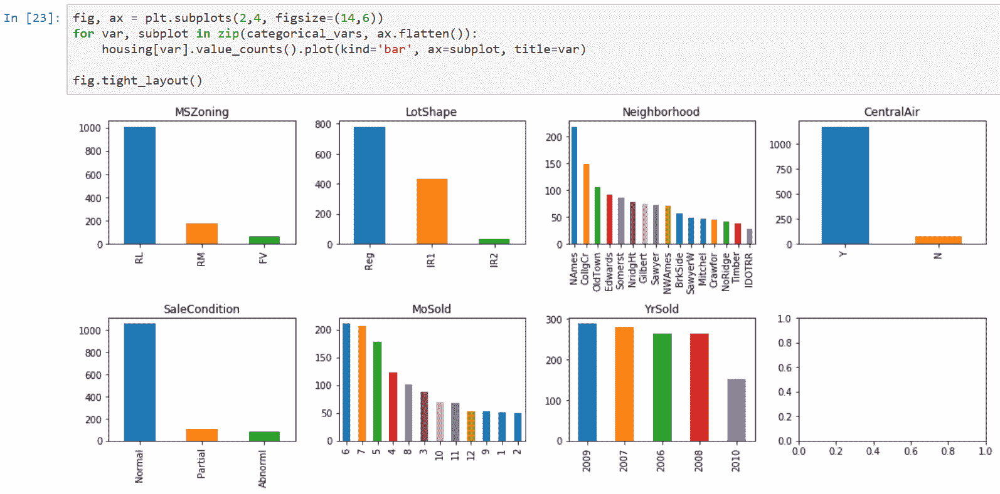

正如我们现在看到的，我们没有少于 30 次观测的水平。现在，`MSZoning`变量只有三级，`LotShape`变量只有三级，`SaleCondition`变量也只有三级。

# 变量之间的关系

不同变量之间的关系可以使用`matplotlib`的名称空间图来可视化。散点图用于可视化两个数值变量之间的关系，箱线图用于可视化一个数值变量和一个分类变量之间的关系。复杂的条件图将用于在一次可视化中可视化许多变量。

# 散点图

要用`pandas`生成散点图，您所要做的就是使用图命名空间。在绘图命名空间中，您有一个`scatter()`方法，并传递一个 x 值和一个 y 值:

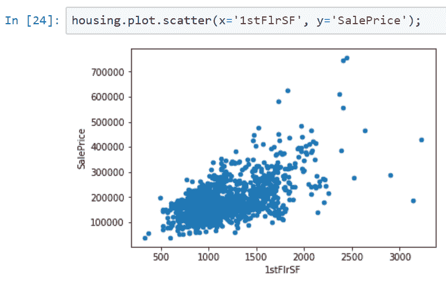

我们在这里看到，房子的`1stFlrSF`和房子的`SalePrice`之间有一种正向的关系。所以，`1stFlrSF`变量被标绘在 *x* 轴上，`SalePrice`变量被标绘在 *y* 轴上，我们在这里可以清楚地看到，这两个变量之间存在正相关关系；`1stFlrSF`你拥有的越多，房子的可能售价就越高。

Seaborn 还为我们提供了一个不错的函数`jointplot`，它会给你一个散点图，但是，除此之外，还会给你一个边际图:

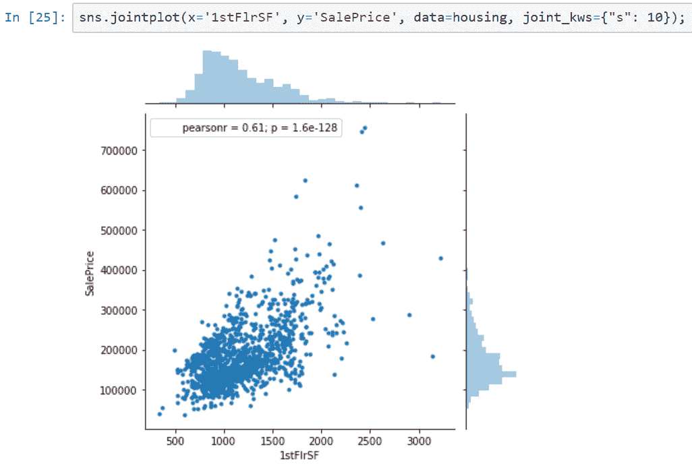

在页边距中，您将看到变量在 *x* 轴和 *y* 轴上的分布。这很好，因为您不仅可以看到两个变量之间的关系，还可以看到它们是如何单独分布的。

如果你想同时可视化许多散点图，你可以产生一个所谓的散点图矩阵，而 seaborn 通过`pairplot`函数使这变得非常容易。您可以传递一个带有一些数字变量的数据框，您将得到一个散点图矩阵:

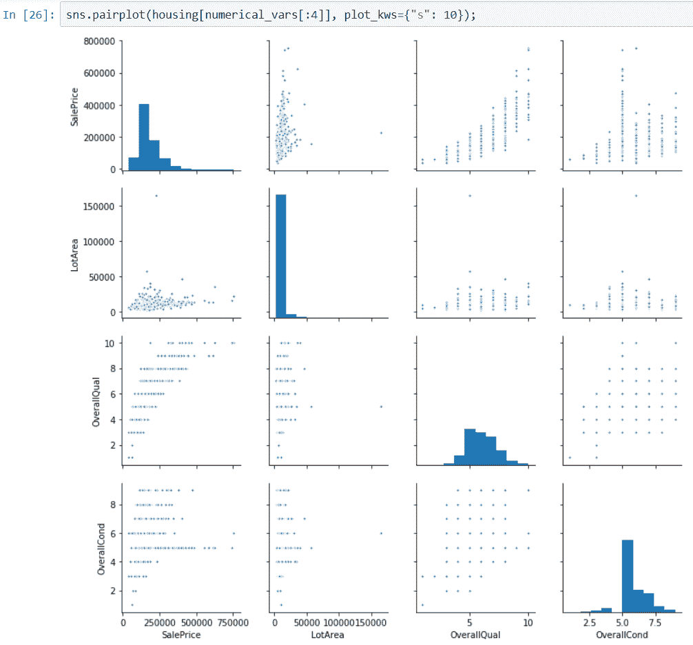

每个图都是数据框中变量之间的成对关系。

建议您同时使用不超过四五个变量，因为否则会很难看到。

这里我们有四个变量，其中一个是房子的`SalePrice`，正如我们在这里看到的，房子的`SalePrice`和另一个变量之间有非常明确的正关系。接下来是`LotArea`，展示了`OverallQual`和房子的`SalePrice`之间的关系。关系还是正面的，但是和房子的`OverallCond`不太清楚。

我们有更多的数字变量，所以让我们把它们形象化，看看它们和`SalePrice`之间的关系:

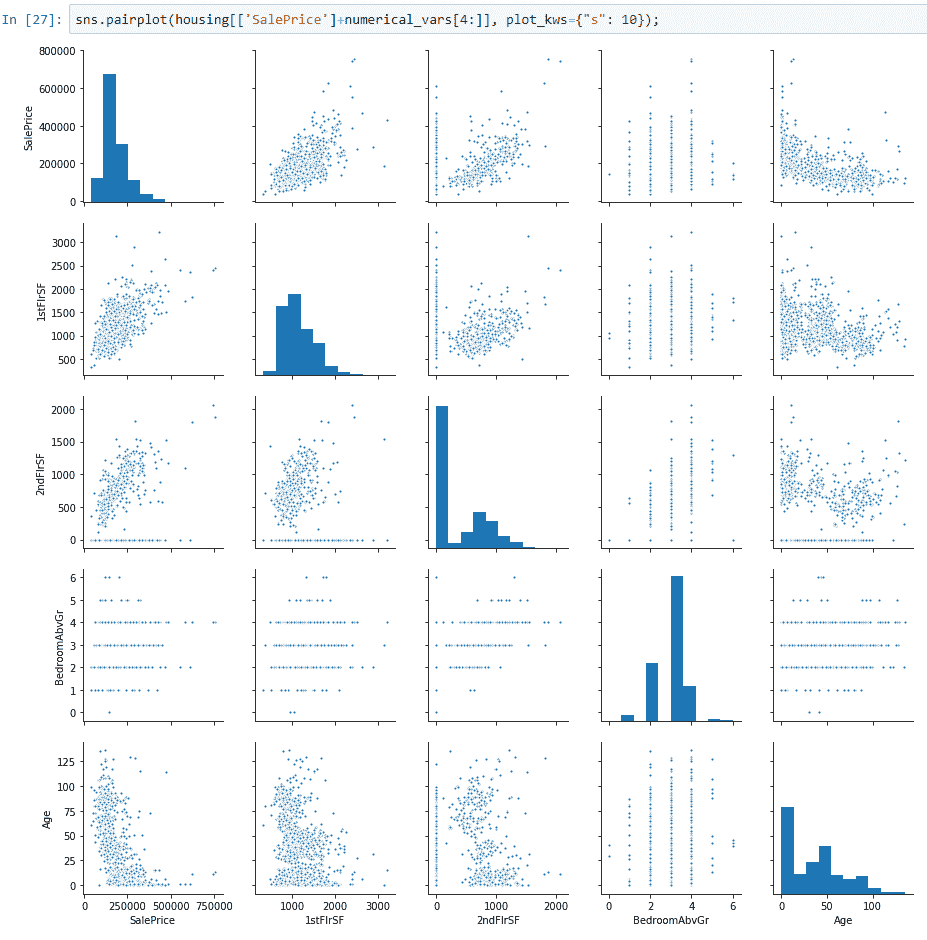

在这里，我们看到房子的`SalePrice`与这两个变量有着非常明确的正相关关系；房子的`1stFlrSF`和`2ndFlrSF`。我们还发现`Age`和`SalePrice`变量之间存在非线性的负相关关系。我们在这里可以看到，随着`Age`上升，房子的`SalePrice`下降，但这种关系是曲线，不是直线。

# 箱线图

这里，我们感兴趣的是我们数据集中的分类变量和房子的`SalePrice`之间的关系。检验数值变量和分类变量之间关系的标准图是箱线图。箱线图是一种通过四分位数图形化描述数字数据组的便捷方式。箱线图也可能有从方框垂直延伸的线(须状图)，表示上下四分位数之外的可变性，因此有术语箱线图和箱线图。异常值可以绘制成单独的点。箱线图是非参数的；它们显示了统计总体样本的变化，而没有对潜在的统计分布做出任何假设。

现在，让我们想象一下房子的`SalePrice`和我们使用箱线图得到的其他分类变量之间的关系:

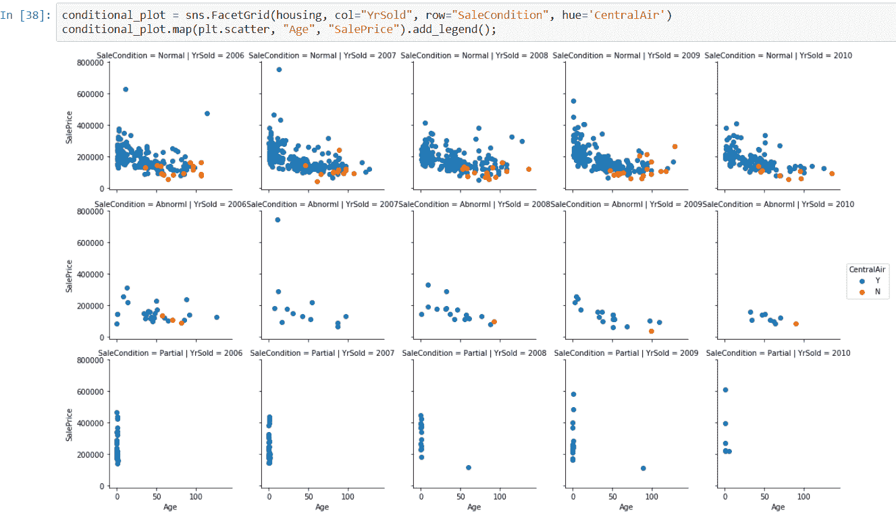

这里，我们看到了我们放置在 *x* 轴上的变量`CentralAir`和房子在 *y* 轴上的`SalePrice`的方框图。我们看到，没有`CentralAir`的房子，`SalePrice`肯定比有`CentralAir`的房子低，价格分布也肯定比有【】的房子低。

我们还可以在一次可视化中可视化许多方框图，就像我们之前对散点图所做的那样。遵循同样的技术生成一个有许多子图的图表，我们可以迭代每个子图，并要求 Python 生成分类变量和`SalePrice`之间的可视化:

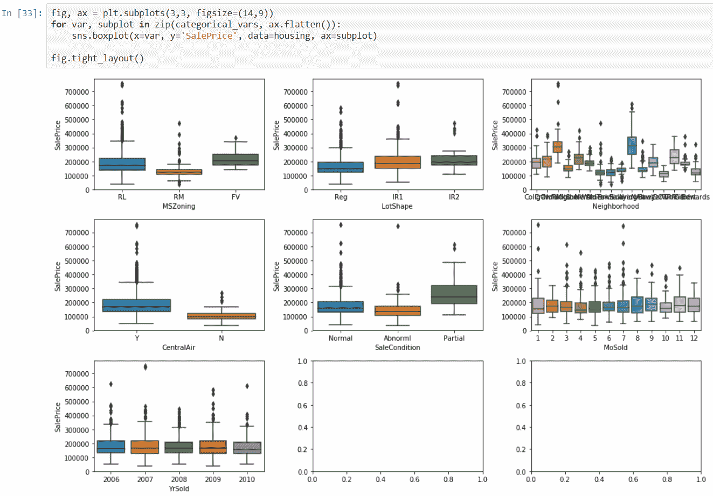

在这里，我们看到变量`MSZoning`在类别上的分布差异；类别`RM`的销售价格肯定较低，在`Neighborhood`变量中，我们看到不同的社区肯定有不同的分布。

让我们看看`Neighborhood`和`SalePrice`变量之间的关系:

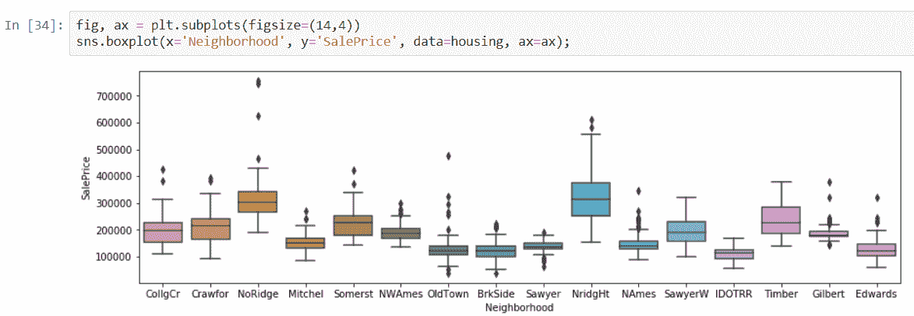

我们看到不同的社区有不同的价格分布，从最便宜的社区到最贵的社区，以一种有序的方式来可视化这可能是一个好主意。使用这个额外的参数`order=sorted`可以很容易地实现这一点，我们从住房价值中得到订单，按照中间价格对`Neighborhood`进行排序:

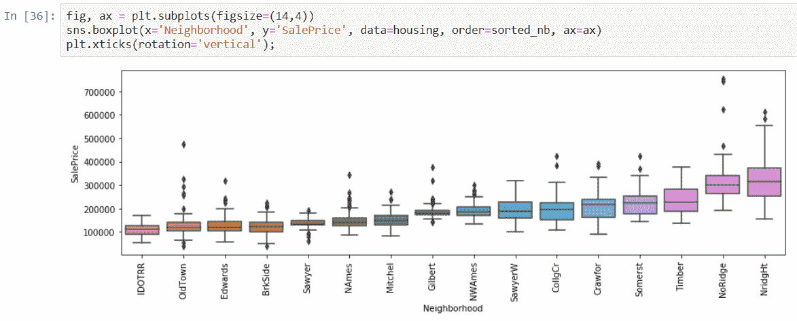

现在，在根据中间价格对街区进行分类后，我们看到了不同街区价格分布的可视化。因此，我们看到最便宜的街区，房子的中位数价格在 10 万美元左右，最贵的街区，房子的中位数价格在 30 万美元左右。

我们看到，对于一些街区来说，价格之间的分散度非常低，所以当你看到小盒子时，这意味着所有的价格都很接近，当你看到大盒子时，这意味着你在价格分布上有很大的分散度。所以我们可以从这些可视化中获得很多信息。

# 复杂条件图

条件图是更复杂的图，可以对一个变量进行条件化。例如，如果我们在`Neighborhood`中进行调节，并且您使用`FacetGrid`功能生成条件图。因此，我们将对`Neighborhood`进行条件化，然后可视化`OverallQual`和`SalePrice`变量之间的散点图:

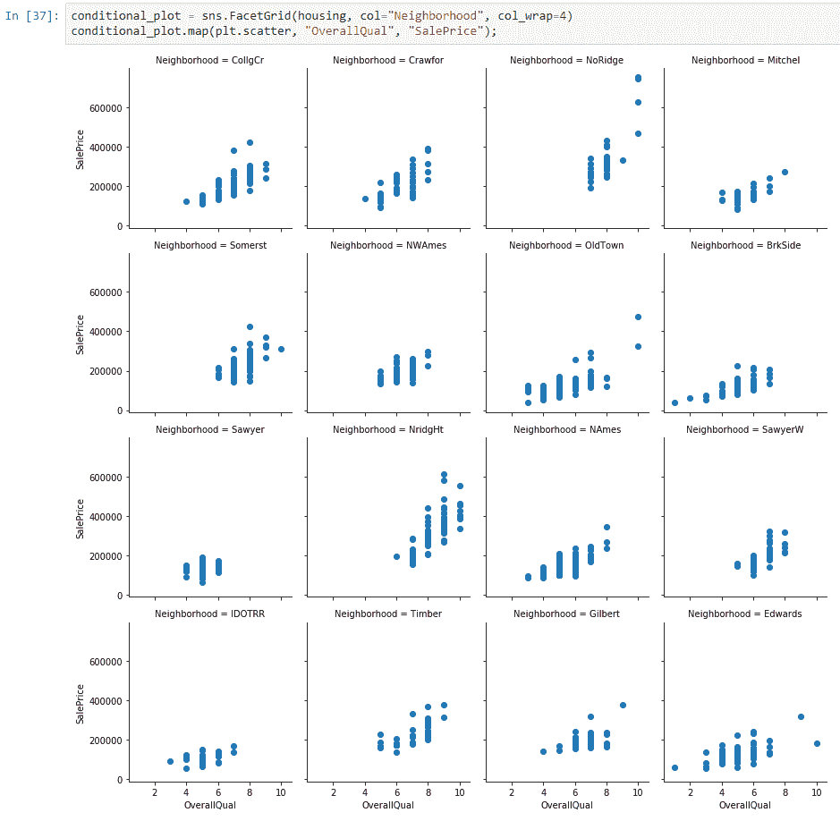

所以在这里，这个可视化中的每个散点图都以每个邻域为条件。如果两个变量之间的正关系适用于整个邻域，那么我们可以说观察到的关系适用于每个邻域。

如果您想要可视化更多的变量，您可以使用`FacetGrid`方法生成一个条件图，并将分类变量作为列和行传递，使用一个附加的分类变量用不同的颜色给散点图的点着色。使用新功能，我们将可视化`Age`和`SalePrice`之间的关系，但这次取决于房子出售的年份和`SaleCondition`变量:

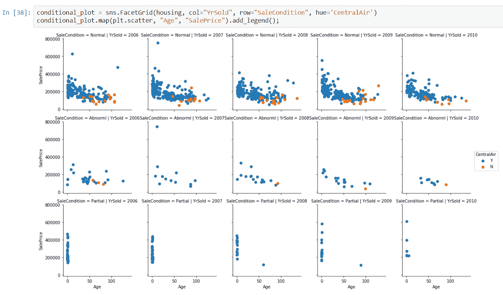

这里可以看到，每一列对应 2006-2010 年开始的每一年，三行对应**正常**状态、**异常**状态、**部分**状态。我们还看到`Age`和`SalePrice`之间的负关系适用于正常行中的每个子组，并且随着`Age`的增加，负关系趋于下降。绿点对应的是那些没有`CentralAir`的房子，由于大部分绿点都在 50 到 100 左右，可以说这些是比较老的房子。从这个图中我们还可以发现另一个方面，我们很少观察到`SaleCondition`是**还是**的局部，而且在大多数观察中，房子的年龄是 0。

这只是一个示例，展示了制作复杂的可视化效果有多容易，以及如何从中获取有价值的信息。作为一名数据分析师，你不仅应该尝试产生这些可视化效果，而且应该从这些可视化效果中获得一些洞察力。

# 摘要

在本章中，我们讨论了`matplotlib`及其工作方式。我们也了解了面向对象接口和`pyplot`接口的区别。此外，我们还学习了如何制作一些常见的可视化效果，并讨论了如何用海鸟和熊猫进行可视化，这非常方便。最后，我们学习了如何可视化变量之间的关系，并在真实数据集上做了一个探索性数据分析的实际例子。

在下一章中，我们将看看如何用 Python 进行统计计算。