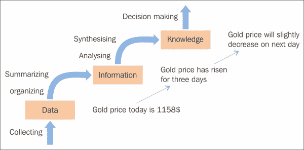

# 一、数据分析和库简介

数据是原始的信息，可以以任何形式存在，可用或不可用。我们可以很容易地在生活中的任何地方获得数据；例如，在撰写本文的当天，黄金价格为每盎司 1.158 美元。这没有任何意义，除了描述黄金的价格。这也表明基于上下文的数据是有用的。

有了关系数据连接，信息就出现了，并允许我们将知识扩展到感官范围之外。当我们拥有随着时间收集的黄金价格数据时，我们可能拥有的一条信息是，价格在三天内从 1.152 美元持续上涨到 1.158 美元。追踪黄金价格的人可以使用这个。

知识帮助人们在生活和工作中创造价值。该值基于组织、合成或总结的信息，以增强理解、意识或理解。它代表行动和决策的状态或潜力。当黄金价格连续三天上涨时，第二天可能会下降；这是有用的知识。

下图说明了从数据到知识的步骤；我们称这个过程为数据分析过程，我们将在下一节介绍它:

在本章中，我们将涵盖以下主题:

*   数据分析和处理
*   使用不同编程语言的数据分析中的库概述
*   常见的 Python 数据分析库

# 数据分析和处理

数据每天都在变得越来越大，越来越多样化。因此，分析和处理数据以推进人类知识或创造价值是一大挑战。为了应对这些挑战，你将需要领域知识和各种技能，从计算机科学、**人工智能** ( **AI** ) 和 **机器学习** ( **ML** )、统计和数学以及知识领域等领域汲取知识，如下图所示:

让我们来看看数据分析及其领域知识:

*   **计算机科学**:我们需要这些知识来为高效的数据处理提供抽象。接下来的章节需要基本的 Python 编程经验。我们将介绍用于数据分析的 Python 库。
*   **人工智能与机器学习**:如果说计算机科学知识帮助我们对数据分析工具进行编程，那么人工智能与机器学习则帮助我们对数据进行建模并从中学习，以构建智能产品。
*   **统计和数学**:如果我们不使用统计技术或数学函数，我们就无法从原始数据中提取有用的信息。
*   **知识领域**:除了技术和通用技术之外，洞察具体领域也很重要。数据字段是什么意思？我们需要收集哪些数据？基于专业知识，我们通过应用上述技术，一步一步地探索和分析原始数据。

数据分析是由以下步骤组成的过程:

*   **数据需求**:我们有根据需求或者问题分析来定义收集什么样的数据。例如，如果我们想检测用户在互联网上阅读新闻时的行为，我们应该知道访问的文章链接、日期和时间、文章类别以及用户在不同页面上花费的时间。
*   **数据采集**:数据可以从各种来源采集:手机、个人电脑、摄像头或录音设备。它也可以通过不同的方式获得:通信、事件以及人与人、人与设备或设备与设备之间的交互。数据随时随地出现在世界上。问题是我们如何找到并收集它来解决我们的问题？这就是这一步的使命。
*   **数据处理**:最初获得的数据必须进行处理或组织分析。这个过程对性能很敏感。我们创建、插入、更新或查询数据的速度有多快？当构建一个必须处理大数据的真实产品时，我们应该仔细考虑这一步。我们应该使用什么样的数据库来存储数据？什么样的数据结构，如分析、统计或可视化，适合我们的目的？
*   **数据清理**:经过处理整理后，数据仍可能存在重复或错误。因此，我们需要一个清洁步骤来减少这些情况，并提高以下步骤的结果质量。常见任务包括记录匹配、重复数据消除和列分段。根据数据的类型，我们可以应用几种类型的数据清理。例如，用户访问新闻网站的历史记录可能包含许多重复的行，因为用户可能已经多次刷新了某些页面。对于我们的具体问题，当我们探究用户的行为时，这些行可能没有任何意义，因此我们应该在将它们保存到数据库之前将其删除。我们可能遇到的另一种情况是新闻上的点击欺诈——有人只想提高自己的网站排名或破坏网站。在这种情况下，数据不会帮助我们探索用户的行为。我们可以使用阈值来检查访问页面事件是来自真人还是来自恶意软件。
*   **探索性数据分析**:现在我们可以通过各种称为探索性数据分析的技术开始分析数据。我们可能会检测到数据清理中的其他问题，或者发现对进一步数据的请求。因此，在整个数据分析过程中，这些步骤可能是重复的。数据可视化技术也用于检查图形或图表中的数据。可视化通常有助于理解数据集，尤其是当数据集很大或很高维的时候。
*   **建模和算法**:大量的数学公式和算法可以应用于从原始数据中检测或预测有用的知识。例如，我们可以使用相似性度量来聚集那些表现出相似新闻阅读行为的用户，并在下次推荐他们感兴趣的文章。或者，我们可以通过应用分类模型，如**支持向量机** ( **SVM** )或线性回归，基于用户的新闻阅读行为来检测用户的性别。根据问题的不同，我们可能会使用不同的算法来获得可接受的结果。评估算法的准确性并为某个产品选择最佳的算法来实现可能需要很多时间。
*   **数据产品**:这一步的目标是构建接收数据输入并根据问题需求生成输出的数据产品。我们将应用计算机科学知识来实现我们选择的算法以及管理数据存储。

# 数据分析中的库概述

有无数数据分析库帮助我们处理和分析数据。它们使用不同的编程语言，在解决各种数据分析问题时有不同的优缺点。现在，我们将介绍一些可能对您有用的常见库。他们应该给你一个该领域图书馆的概述。然而，本书的其余部分侧重于基于 Python 的库。

使用 Java 语言进行数据分析的一些库如下:

*   **Weka** :这是我第一次了解数据分析的熟悉的图书馆。它有一个图形用户界面，允许你在一个小数据集上运行实验。如果您想了解数据处理领域的可能性，这非常好。然而，如果你构建一个复杂的产品，我认为它不是最好的选择，因为它的性能，粗略的应用编程接口设计，非最佳算法，以及很少的文档([http://www.cs.waikato.ac.nz/ml/weka/](http://www.cs.waikato.ac.nz/ml/weka/))。
*   **Mallet** :这是的另一个 Java 库，用于统计自然语言处理、文档分类、聚类、主题建模、信息抽取以及其他关于文本的机器学习应用。Mallet 有一个名为 GRMM 的附加包，包含对一般推理、图形模型的支持，以及对具有任意图形结构的**条件随机字段** ( **CRF** )的训练。以我的经验，库的性能和算法都比 Weka 好。然而，它只关注文本处理问题。参考页面位于[http://mallet.cs.umass.edu/](http://mallet.cs.umass.edu/)。
*   **Mahout** :这个是 Apache 建立在 Hadoop 之上的机器学习框架；它的目标是建立一个可扩展的机器学习库。它看起来很有希望，但是伴随着所有的包袱和 Hadoop 的开销。主页在[http://mahout.apache.org/](http://mahout.apache.org/)。
*   **Spark** :这是一个相对较新的 Apache 项目，据说比 Hadoop 快上百倍。它也是一个可扩展的库，由常见的机器学习算法和实用程序组成。开发可以用 Python 和任何 JVM 语言完成。参考页面位于[https://spark.apache.org/docs/1.5.0/mllib-guide.html](https://spark.apache.org/docs/1.5.0/mllib-guide.html)。

下面是一些用 C++实现的库:

*   **Vowpal Wabbit** :这个库是一个快速的核心外学习系统，由微软研究院和之前的雅虎赞助！研究。它已用于在一小时内学习 1000 个节点上的万亿特征(1012)数据集。更多信息可在[http://arxiv.org/abs/1110.4198](http://arxiv.org/abs/1110.4198)的出版物中找到。
*   **多包**:这个包是一个用 C++实现的多类、多标签、多任务分类助推软件。如果使用本软件，请参考 2012 年发表在《T4 机器学习研究》杂志上的论文、 *MultiBoost:多用途助推包*、 *D.Benbouzid* 、*r . Busa-费科特*、 *N .卡萨格兰德*、*f-D . Collin*、 *B. Kégl* 。
*   **MLpack** :这是也是一个 C++机器-学习库，由佐治亚理工学院**基础算法和统计工具实验室** ( **FASTLab** )开发。它关注可扩展性、速度和易用性，并在 NIPS 2011 的大学习研讨会上展示。其主页位于[http://www.mlpack.org/about.html](http://www.mlpack.org/about.html)。
*   **Caffe** :我们最后要提的 c++库就是 Caffe。这是一个深度学习框架，考虑了表达、速度和模块化。由 **柏克莱视觉与学习中心** ( **BVLC** )和社区贡献者共同开发。你可以在[http://caffe.berkeleyvision.org/](http://caffe.berkeleyvision.org/)找到更多关于它的信息。

用于数据处理和分析的其他库如下:

*   **Statsmodels** :这个是一个很棒的统计建模 Python 库，主要用于预测性和探索性分析。
*   **数据处理模块化工具包** ( **MDP** ):这个是有监督的和无监督的学习算法和其他数据处理单元的集合，可以组合成数据处理序列和更复杂的前馈网络架构([http://mdp-toolkit.sourceforge.net/index.html](http://mdp-toolkit.sourceforge.net/index.html))。
*   **Orange** :这是一个面向新手和专家的开源数据可视化和分析。它充满了数据分析的功能，并有生物信息学和文本挖掘的插件。它包含一个自组织地图的实现，这使它与其他项目(http://orange.biolab.si/)有所不同。
*   **Mirador** :这个是一个对复杂数据集进行可视化探索的工具，支持 Mac 和 Windows。它使用户能够发现相关模式，并从数据中得出新的假设([http://orange.biolab.si/](http://orange.biolab.si/))。
*   **RapidMiner** :这个是另一个基于 GUI 的工具，用于数据挖掘、机器学习和预测性分析([https://rapidminer.com/](https://rapidminer.com/))。
*   **antao**:这个架起了 Python 和低级语言之间的桥梁。该算法具有非常显著的性能提升，特别是对于大型矩阵运算，因此是深度学习模型的良好选择。然而，由于额外的编译层，调试并不容易。
*   **自然语言处理工具包** ( **NLTK** ):这个是用 Python 编写的，非常独特和突出。

这里，我无法列出所有用于数据分析的库。但是，我认为上述库足以占用您大量的时间来学习和构建数据分析应用程序。我希望你读完这本书后会喜欢它们。

# 数据分析中的 Python 库

Python 是一种多平台、通用的编程语言，可以在 Windows、Linux/Unix、Mac OS X 上运行，已经移植到 Java 和。NET 虚拟机。它有一个强大的标准库。此外，它还有许多用于数据分析的库:Pylearn2、Hebel、Pybrain、Pattern、MontePython 和 MILK。在本书中，我们将介绍一些常见的 Python 数据分析库，如 Numpy、Pandas、Matplotlib、PyMongo 和 scikit-learn。现在，为了帮助您入门，我将为那些不太熟悉科学 Python 堆栈的人简要介绍每个库的概述。

## NumPy

Python 中用于科学计算的基础包之一是 Numpy。除其他外，它包含以下内容:

*   一个强大的 N 维数组对象
*   用于执行数组计算的复杂(广播)函数
*   用于集成 C/C++和 Fortran 代码的工具
*   有用的线性代数运算、傅立叶变换和随机数功能

除此之外，它还可以用作通用数据的高效多维容器。可以定义任意数据类型，并将其与各种数据库集成。

## Pandas

Pandas 是一个 Python 包，支持丰富的数据结构和分析数据的功能，由 PyData 开发团队开发。它专注于 Python 的数据库的改进。Pandas 由以下东西组成:

*   一组标记的数组数据结构；其中主要是系列、数据框和面板
*   索引对象支持简单轴索引和多级/分级轴索引
*   用于聚合和转换数据集的集成分组引擎
*   日期范围生成和自定义日期偏移
*   从平面文件或 PyTables/HDF5 格式加载和保存数据的输入/输出工具
*   标准数据结构的最佳内存版本
*   移动窗口统计和静动窗口线性/面板回归

由于的这些特性，Pandas 是需要复杂数据结构或高性能时间序列功能(如金融数据分析应用)的系统的理想工具。

## Matplotlib

Matplotlib 是 2D 图形最常用的 Python 包。它提供了一种非常快速的方式来可视化来自 Python 的数据和多种格式的出版物质量图形:线图、等高线图、散点图和底图图。它带有一组默认设置，但允许自定义各种属性。然而，我们可以用 Matplotlib 中几乎每个属性的默认值轻松创建图表。

## PyMongo

MongoDB 是 NoSQL 数据库的一种类型。它是高度可扩展、健壮，并且非常适合与基于 JavaScript 的 web 应用程序一起工作，因为我们可以将数据存储为 JSON 文档并使用灵活的模式。

PyMongo 是一个 Python 发行版，包含使用 MongoDB 的工具。许多工具也被编写用于与 PyMongo 一起工作，以添加更多功能，例如 MongoKit、Humongolus、MongoAlchemy 和 Ming。

## 科学知识文库

scikit-learn 是一个使用 Python 编程语言的开源机器学习库。它支持各种机器学习模型，如分类、回归和聚类算法，与 Python 数值和科学库 NumPy 和 SciPy 互操作。最新 scikit-learn 版本为 0.16.1，发布于 2015 年 4 月。

# 总结

在这一章中，我们提出了三个要点。首先，我们弄清了原始数据、信息和知识之间的关系。由于它对我们生活的贡献，我们在第二部分继续讨论数据分析和处理步骤的概述。最后，我们介绍了一些常见的受支持的库，它们对实际的数据分析应用程序很有用。其中，在接下来的章节中，我们将关注数据分析中的 Python 库。

**练习练习**

下表描述了用户对《白雪公主》电影的排名:

<colgroup><col style="text-align: left"> <col style="text-align: left"> <col style="text-align: left"> <col style="text-align: left"></colgroup> 
| 

使用者辩证码

 | 

性

 | 

位置

 | 

等级

 |
| --- | --- | --- | --- |
| A | 男性的 | 飞利浦 | four |
| B | 男性的 | 越南 | Two |
| C | 男性的 | 加拿大 | one |
| D | 男性的 | 加拿大 | Two |
| E | 女性的 | 越南 | five |
| F | 女性的 | 纽约州 | four |

**练习 1** :在这个表格中我们可以找到哪些信息？我们能从中获得什么样的知识？

**练习 2** :基于本章的数据分析过程，尝试定义预测用户 B 是否喜欢《玛琳菲森》电影所需的数据需求和分析步骤。