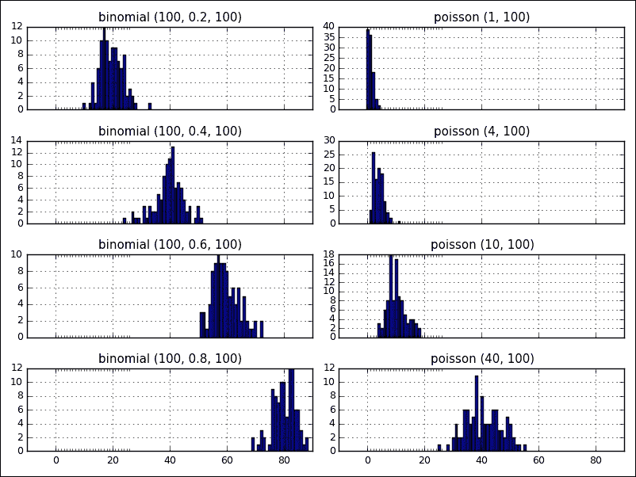

# 二、NumPy 数组和向量化计算

NumPy 是支持在 Python 中以高性能呈现和计算数据的基础包。它提供了如下一些有趣的特性:

*   Python 的扩展包，用于多维数组(`ndarrays`)、各种派生对象(如屏蔽数组)、提供向量化操作的矩阵和广播功能。通过利用现代 CPU 中的 **【单指令多数据】**(**【SIMD】**)指令集，向量化可以显著提高数组计算的性能。
*   对数据数组进行快速便捷的操作，包括数学运算、基本统计运算、排序、选择、线性代数、随机数生成、离散傅里叶变换等。
*   因为集成了 C/C++/Fortran 代码，所以更接近硬件的效率工具。

NumPy 是一个很好的入门包，让你熟悉数据分析中的数组和面向数组的计算。此外，这是学习其他更有效的工具(如 Pandas)的基本步骤，我们将在下一章中看到。我们将使用 NumPy 版本 1.9.1。

# NumPy 数组

数组可用于包含实验或模拟步骤中数据对象的值、图像的像素或测量设备记录的信号。比如巴黎埃菲尔铁塔的纬度是 48.858598，经度是 2.294495。它可以在 NumPy 数组对象中表示为`p`:

```py
>>> import numpy as np
>>> p = np.array([48.858598, 2.294495])
>>> p
array([48.858598, 2.294495])

```

这是一个使用`np.array`功能的数组的手动构造。导入 NumPy 的标准约定如下:

```py
>>> import numpy as np

```

当然，您可以将`from numpy import *`放入代码中，以避免必须编写`np`。但是，由于潜在的代码冲突，您应该小心这个习惯(关于代码约定的更多信息可以在 *Python 风格指南*中找到，也称为 **PEP8** ，位于[https://www.python.org/dev/peps/pep-0008/](https://www.python.org/dev/peps/pep-0008/))。

NumPy 数组有两个要求:创建时的固定大小和统一的固定数据类型，内存中的大小是固定的。以下功能帮助您获取`p`矩阵的信息:

```py
>>> p.ndim    # getting dimension of array p
1
>>> p.shape   # getting size of each array dimension
(2,)
>>> len(p)    # getting dimension length of array p
2
>>> p.dtype    # getting data type of array p
dtype('float64')

```

## 数据类型

有五种基本的数值类型，包括布尔值(`bool`)、整数(`int`)、无符号整数(`uint`)、浮点(`float`)和复数。它们表示需要多少位来表示内存中的数组元素。除此之外，NumPy 还有一些类型，如`intc`和`intp`，它们的位大小因平台而异。

下表列出了 NumPy 支持的数据类型:

<colgroup><col style="text-align: left"> <col style="text-align: left"> <col style="text-align: left"> <col style="text-align: left"></colgroup> 
| 

类型

 | 

类型代码

 | 

描述

 | 

价值范围

 |
| --- | --- | --- | --- |
| `bool` |   | 以字节形式存储的布尔值 | 真/假 |
| `intc` |   | 类似于 C int (int32 或 int 64) |   |
| `intp` |   | 用于索引的整数(与 C size_t 相同) |   |
| `int8`、`uint8` | i1，u1 | 有符号和无符号 8 位整数类型 | int8: (-128 到 127)uint8: (0 至 255) |
| `int16`、`uint16` | i2，u2 | 有符号和无符号 16 位整数类型 | int16: (-32768 到 32767)uint16: (0 至 65535) |
| `int32`、`uint32` | I4，u4 | 有符号和无符号 32 位整数类型 | int32: (-2147483648 到 2147483647uint32: (0 到 4294967295) |
| `int64`、`uinit64` | i8，u8 | 有符号和无符号 64 位整数类型 | Int64: (-9223372036854775808 到 9223372036854775807)uint64: (0 到 18446744073709551615) |
| `float16` | 第二子代 | 半精度浮点:符号位、5 位指数和 10b 位尾数 |   |
| `float32` | f4 / f | 单精度浮点:符号位、8 位指数和 23 位尾数 |   |
| `float64` | f8 / d | 双精度浮点:符号位、11 位指数和 52 位尾数 |   |
| `complex64`、`complex128`、`complex256` | c8、c16、c32 | 由两个 32 位、64 位和 128 位浮点数表示的复数 |   |
| `object` | Zero | Python 对象类型 |   |
| `string_` | S | 固定长度字符串类型 | 使用`S10`声明长度为 10 的字符串`dtype` |
| `unicode_` | U | 固定长度的 Unicode 类型 | 类似于 string_ example，我们有‘U10’ |

我们可以使用`astype`方法轻松地转换或将数组从一个`dtype`转换为另一个:

```py
>>> a = np.array([1, 2, 3, 4])
>>> a.dtype
dtype('int64')
>>> float_b = a.astype(np.float64)
>>> float_b.dtype
dtype('float64')

```

### 注

`astype`函数将使用旧数组的数据副本创建一个新数组，即使新的`dtype`与旧的相似。

## 数组创建

提供了各种和功能来创建数组对象。它们对于我们在不同情况下创建和存储多维数组中的数据非常有用。

现在，在下表中，我们将通过示例总结 NumPy 的一些常见功能及其在数组创建中的使用:

<colgroup><col style="text-align: left"> <col style="text-align: left"> <col style="text-align: left"></colgroup> 
| 

功能

 | 

描述

 | 

例子

 |
| --- | --- | --- |
| `empty, empty_like` | 创建给定形状和类型的新数组，不初始化元素 | 

```py
>>> np.empty([3,2], dtype=np.float64)
array([[0., 0.], [0., 0.], [0., 0.]])
>>> a = np.array([[1, 2], [4, 3]])
>>> np.empty_like(a)
array([[0, 0], [0, 0]])

```

 |
| `eye`、`identity` | 创建一个 NxN 单位矩阵，对角线上为 1，其他地方为零 | 

```py
>>> np.eye(2, dtype=np.int)
array([[1, 0], [0, 1]])

```

 |
| `ones`、`ones_like` | 用给定的形状和类型创建一个新数组，所有元素用 1 填充 | 

```py
>>> np.ones(5)
array([1., 1., 1., 1., 1.])
>>> np.ones(4, dtype=np.int)
array([1, 1, 1, 1])
>>> x = np.array([[0,1,2], [3,4,5]])
>>> np.ones_like(x)
array([[1, 1, 1],[1, 1, 1]])

```

 |
| `zeros`、`zeros_like` | 这与`ones`、`ones_like`类似，但是用 0 来初始化元素 | 

```py
>>> np.zeros(5)
array([0., 0., 0., 0-, 0.])
>>> np.zeros(4, dtype=np.int)
array([0, 0, 0, 0])
>>> x = np.array([[0, 1, 2], [3, 4, 5]])
>>> np.zeros_like(x)
array([[0, 0, 0],[0, 0, 0]])

```

 |
| `arange` | 创建一个在给定间隔内具有均匀间隔值的数组 | 

```py
>>> np.arange(2, 5)
array([2, 3, 4])
>>> np.arange(4, 12, 5)
array([4, 9])

```

 |
| `full`、`full_like` | 用给定的形状和类型创建一个新数组，并填充选定的值 | 

```py
>>> np.full((2,2), 3, dtype=np.int)
array([[3, 3], [3, 3]])
>>> x = np.ones(3)
>>> np.full_like(x, 2)
array([2., 2., 2.])

```

 |
| `array` | 从现有数据创建数组 | 

```py
>>> np.array([[1.1, 2.2, 3.3], [4.4, 5.5, 6.6]])
array([1.1, 2.2, 3.3], [4.4, 5.5, 6.6]])

```

 |
| `asarray` | 将输入转换为数组 | 

```py
>>> a = [3.14, 2.46]
>>> np.asarray(a)
array([3.14, 2.46])

```

 |
| `copy` | 返回给定对象的数组副本 | 

```py
>>> a = np.array([[1, 2], [3, 4]])
>>> np.copy(a)
array([[1, 2], [3, 4]])

```

 |
| `fromstring` | 从字符串或文本创建一维数组 | 

```py
>>> np.fromstring('3.14 2.17', dtype=np.float, sep=' ')
array([3.14, 2.17])

```

 |

## 索引和切片

与列表等其他 Python 序列类型一样，很容易访问和分配每个数组元素的值:

```py
>>> a = np.arange(7)
>>> a
array([0, 1, 2, 3, 4, 5, 6])
>>> a[1], a [4], a[-1]
(1, 4, 6)

```

### 注

在 Python 中，数组索引从 0 开始。这与 Fortran 或 Matlab 形成对比，后者的索引从 1 开始。

作为另一个例子，如果我们的数组是多维的，我们需要整数元组来索引一个项目:

```py
>>> a = np.array([[1, 2, 3], [4, 5, 6], [7, 8, 9]])
>>> a[0, 2]      # first row, third column
3
>>> a[0, 2] = 10
>>> a
array([[1, 2, 10], [4, 5, 6], [7, 8, 9]])
>>> b = a[2]
>>> b
array([7, 8, 9])
>>> c = a[:2]
>>> c
array([[1, 2, 10], [4, 5, 6]])

```

我们称`b`、`c`为阵片，是对原片的看法。这意味着数据不会复制到`b`或`c`中，每当我们修改它们的值时，它也会反映在数组`a`中:

```py
>>> b[-1] = 11
>>> a
array([[1, 2, 10], [4, 5, 6], [7, 8, 11]])

```

### 注

当我们省略索引号时，我们使用冒号(`:`)字符来取整个轴。

## 花式索引

除了用切片索引，NumPy 还支持用布尔或整数数组(掩码)索引。这个方法叫做 **花式标引**。它创建副本，而不是视图。

首先，我们看一个用布尔掩码数组进行索引的例子:

```py
>>> a = np.array([3, 5, 1, 10])
>>> b = (a % 5 == 0)
>>> b
array([False, True, False, True], dtype=bool)
>>> c = np.array([[0, 1], [2, 3], [4, 5], [6, 7]])
>>> c[b]
array([[2, 3], [6, 7]])

```

第二个示例说明了如何在数组上使用整数掩码:

```py
>>> a = np.array([[1, 2, 3, 4], 
 [5, 6, 7, 8], 
 [9, 10, 11, 12],
 [13, 14, 15, 16]])
>>> a[[2, 1]]
array([[9, 10, 11, 12], [5, 6, 7, 8]])
>>> a[[-2, -1]]          # select rows from the end
array([[ 9, 10, 11, 12], [13, 14, 15, 16]])
>>> a[[2, 3], [0, 1]]    # take elements at (2, 0) and (3, 1)
array([9, 14])

```

### 注

掩码数组的长度必须与其索引的轴的长度相同。

### 型式

**下载示例代码**

您可以从您在[http://www.packtpub.com](http://www.packtpub.com)的账户中下载您购买的所有 Packt 书籍的示例代码文件。如果您在其他地方购买了这本书，您可以访问[http://www.packtpub.com/support](http://www.packtpub.com/support)并注册，以便将文件直接通过电子邮件发送给您。

## 数组上的数值运算

我们正在熟悉创建和访问`ndarrays`。现在，我们继续下一步，对数组数据应用一些数学运算，而不写任何 for 循环，当然，性能更高。

标量操作将值传播到数组的每个元素:

```py
>>> a = np.ones(4)
>>> a * 2
array([2., 2., 2., 2.])
>>> a + 3
array([4., 4., 4., 4.])

```

数组之间的所有算术运算都按元素应用运算:

```py
>>> a = np.ones([2, 4])
>>> a * a
array([[1., 1., 1., 1.], [1., 1., 1., 1.]])
>>> a + a
array([[2., 2., 2., 2.], [2., 2., 2., 2.]])

```

此外，这里还有一些比较和逻辑运算的例子:

```py
>>> a = np.array([1, 2, 3, 4])
>>> b = np.array([1, 1, 5, 3])
>>> a == b
array([True, False, False, False], dtype=bool)

>>> np.array_equal(a, b)      # array-wise comparison
False

>>> c = np.array([1, 0])
>>> d = np.array([1, 1])
>>> np.logical_and(c, d)      # logical operations
array([True, False])

```

# 数组函数

NumPy 中支持许多有用的数组函数来分析数据。我们将列出其中一些常用的部分。首先，置换函数是另一种不复制任何内容而返回原始数据数组视图的整形形式:

```py
>>> a = np.array([[0, 5, 10], [20, 25, 30]])
>>> a.reshape(3, 2)
array([[0, 5], [10, 20], [25, 30]])
>>> a.T
array([[0, 20], [5, 25], [10, 30]])

```

一般来说，我们有`swapaxes`方法，该方法获取一对轴号并返回数据视图，而不进行复制:

```py
>>> a = np.array([[[0, 1, 2], [3, 4, 5]], 
 [[6, 7, 8], [9, 10, 11]]])
>>> a.swapaxes(1, 2)
array([[[0, 3],
 [1, 4],
 [2, 5]],
 [[6, 9],
 [7, 10],
 [8, 11]]])

```

置换函数用于进行矩阵计算；例如，使用`np.dot`计算内矩阵乘积`XT.X`:

```py
>>> a = np.array([[1, 2, 3],[4,5,6]])
>>> np.dot(a.T, a)
array([[17, 22, 27],
 [22, 29, 36],
 [27, 36, 45]])

```

对数组中的数据进行排序也是处理数据的一个重要需求。让我们来看看一些排序功能及其用途:

```py
>>> a = np.array ([[6, 34, 1, 6], [0, 5, 2, -1]])

>>> np.sort(a)     # sort along the last axis
array([[1, 6, 6, 34], [-1, 0, 2, 5]])

>>> np.sort(a, axis=0)    # sort along the first axis
array([[0, 5, 1, -1], [6, 34, 2, 6]])

>>> b = np.argsort(a)    # fancy indexing of sorted array
>>> b
array([[2, 0, 3, 1], [3, 0, 2, 1]])
>>> a[0][b[0]]
array([1, 6, 6, 34])

>>> np.argmax(a)    # get index of maximum element
1

```

数组函数列表见下表:

<colgroup><col style="text-align: left"> <col style="text-align: left"> <col style="text-align: left"></colgroup> 
| 

功能

 | 

描述

 | 

例子

 |
| --- | --- | --- |
| `sin`、`cos`、`tan`、`cosh`、`sinh`、`tanh`、`arcos`、`arctan`、`deg2rad` | 三角函数和双曲函数 | 

```py
>>> a = np.array([0.,30., 45.])
>>> np.sin(a * np.pi / 180)
array([0., 0.5, 0.7071678])

```

 |
| `around`、`round`、`rint`、`fix`、`floor`、`ceil`、`trunc` | 将数组的元素舍入到给定或最接近的数字 | 

```py
>>> a = np.array([0.34, 1.65])
>>> np.round(a)
array([0., 2.])

```

 |
| `sqrt`、`square`、`exp`、`expm1`、`exp2`、`log`、`log10`、`log1p`、`logaddexp` | 计算数组的指数和对数 | 

```py
>>> np.exp(np.array([2.25, 3.16]))
array([9.4877, 23.5705])

```

 |
| `add`、`negative`、`multiply`、`devide`、`power`、`substract`、`mod`、`modf`、`remainder` | 数组上的一组算术函数 | 

```py
>>> a = np.arange(6)
>>> x1 = a.reshape(2,3)
>>> x2 = np.arange(3)
>>> np.multiply(x1, x2)
array([[0,1,4],[0,4,10]])

```

 |
| `greater`、`greater_equal`、`less`、`less_equal`、`equal`、`not_equal` | 执行元素比较: >，> =， | 

```py
>>> np.greater(x1, x2)
array([[False, False, False], [True, True, True]], dtype = bool)

```

 |

# 使用数组进行数据处理

借助 NumPy 包，我们可以轻松解决多种数据处理任务，而无需编写复杂的循环。这对我们控制代码以及程序的性能非常有帮助。在这一部分，我们想介绍一些数学和统计函数。

有关数学和统计函数的列表，请参见下表:

<colgroup><col style="text-align: left"> <col style="text-align: left"> <col style="text-align: left"></colgroup> 
| 

功能

 | 

描述

 | 

例子

 |
| --- | --- | --- |
| `sum` | 计算数组中或沿轴的所有元素的总和 | 

```py
>>> a = np.array([[2,4], [3,5]])
>>> np.sum(a, axis=0)
array([5, 9])

```

 |
| `prod` | 计算给定轴上数组元素的乘积 | 

```py
>>> np.prod(a, axis=1)
array([8, 15])

```

 |
| `diff` | 计算沿给定轴的离散差值 | 

```py
>>> np.diff(a, axis=0)
array([[1,1]])

```

 |
| `gradient` | 返回数组的梯度 | 

```py
>>> np.gradient(a)
[array([[1., 1.], [1., 1.]]), array([[2., 2.], [2., 2.]])]

```

 |
| `cross` | 返回两个数组的叉积 | 

```py
>>> b = np.array([[1,2], [3,4]])
>>> np.cross(a,b)
array([0, -3])

```

 |
| `std`、`var` | 返回数组的标准差和方差 | 

```py
>>> np.std(a)
1.1180339
>>> np.var(a)
1.25

```

 |
| `mean` | 计算数组的算术平均值 | 

```py
>>> np.mean(a)
3.5

```

 |
| `where` | 从 x 或 y 返回满足条件的元素 | 

```py
>>> np.where([[True, True], [False, True]], [[1,2],[3,4]], [[5,6],[7,8]])
array([[1,2], [7, 4]])

```

 |
| `unique` | 返回数组中已排序的唯一值 | 

```py
>>> id = np.array(['a', 'b', 'c', 'c', 'd'])
>>> np.unique(id)
array(['a', 'b', 'c', 'd'], dtype='&#124;S1')

```

 |
| `intersect1d` | 计算两个数组中已排序的公共元素 | 

```py
>>> a = np.array(['a', 'b', 'a', 'c', 'd', 'c'])
>>> b = np.array(['a', 'xyz', 'klm', 'd'])
>>> np.intersect1d(a,b)
array(['a', 'd'], dtype='&#124;S3')

```

 |

## 加载和保存数据

我们还可以通过使用 NumPy 包中支持的不同功能，以文本或二进制格式将数据保存到磁盘上或从磁盘上加载数据。

## 保存数组

默认情况下，数组是以未压缩的原始二进制格式保存的，文件扩展名由`np.save`函数指定:

```py
>>> a = np.array([[0, 1, 2], [3, 4, 5]])
>>> np.save('test1.npy', a)

```

### 注

如果我们省略了`.npy`扩展名，库会自动分配它。

如果我们想以未压缩的`.npz`格式将多个数组存储到一个文件中，我们可以使用`np.savez`函数，如下例所示:

```py
>>> a = np.arange(4)
>>> b = np.arange(7)
>>> np.savez('test2.npz', arr0=a, arr1=b)

```

`.npz`文件是一个压缩的文件档案，以它们包含的变量命名。当我们加载一个`.npz`文件时，我们得到一个类似字典的对象，可以查询它的数组列表:

```py
>>> dic = np.load('test2.npz')
>>> dic['arr0']
array([0, 1, 2, 3])

```

将数组数据保存到文件中的另一种方法是使用`np.savetxt`功能，该功能允许我们在输出文件中设置格式属性:

```py
>>> x = np.arange(4)
>>> # e.g., set comma as separator between elements
>>> np.savetxt('test3.out', x, delimiter=',')

```

## 加载数组

我们有两个常用函数如 `np.load`和`np.loadtxt`，对应保存函数，用于加载数组:

```py
>>> np.load('test1.npy')
array([[0, 1, 2], [3, 4, 5]])
>>> np.loadtxt('test3.out', delimiter=',')
array([0., 1., 2., 3.])

```

与的`np.savetxt`功能类似，`np.loadtxt`功能也有很多从文本文件加载数组的选项。

# 带 NumPy 的线性代数

线性代数是数学的一个分支，涉及向量空间和这些空间之间的映射。NumPy 有一个名为 **linalg** 的软件包，支持强大的线性代数功能。我们可以使用这些函数来寻找特征值和特征向量或者执行奇异值分解:

```py
>>> A = np.array([[1, 4, 6],
 [5, 2, 2],
 [-1, 6, 8]])
>>> w, v = np.linalg.eig(A)
>>> w                           # eigenvalues
array([-0.111 + 1.5756j, -0.111 – 1.5756j, 11.222+0.j])
>>> v                           # eigenvector
array([[-0.0981 + 0.2726j, -0.0981 – 0.2726j, 0.5764+0.j],
 [0.7683+0.j, 0.7683-0.j, 0.4591+0.j],
 [-0.5656 – 0.0762j, -0.5656 + 0.00763j, 0.6759+0.j]])

```

该函数使用 geev Lapack 例程实现，该例程计算一般方阵的特征值和特征向量。

另一个常见的问题是求解线性系统，如以`A`为矩阵，以`x`和`b`为向量的`Ax = b`。使用`numpy.linalg.solve`功能可以轻松解决问题:

```py
>>> A = np.array([[1, 4, 6], [5, 2, 2], [-1, 6, 8]])
>>> b = np.array([[1], [2], [3]])
>>> x = np.linalg.solve(A, b)
>>> x
array([[-1.77635e-16], [2.5], [-1.5]])

```

下表将总结`numpy.linalg`包中的一些常用功能:

<colgroup><col style="text-align: left"> <col style="text-align: left"> <col style="text-align: left"></colgroup> 
| 

功能

 | 

描述

 | 

例子

 |
| --- | --- | --- |
| `dot` | 计算两个数组的点积 | 

```py
>>> a = np.array([[1, 0],[0, 1]])
>>> b = np.array( [[4, 1],[2, 2]])
>>> np.dot(a,b)
array([[4, 1],[2, 2]])

```

 |
| `inner`、`outer` | 计算两个数组的内积和外积 | 

```py
>>> a = np.array([1, 1, 1])
>>> b = np.array([3, 5, 1])
>>> np.inner(a,b)
9

```

 |
| `linalg.norm` | 求矩阵或向量范数 | 

```py
>>> a = np.arange(3)
>>> np.linalg.norm(a)
2.23606

```

 |
| `linalg.det` | 计算一个数组的行列式 | 

```py
>>> a = np.array([[1,2],[3,4]])
>>> np.linalg.det(a)
-2.0

```

 |
| `linalg.inv` | 计算矩阵的逆矩阵 | 

```py
>>> a = np.array([[1,2],[3,4]])
>>> np.linalg.inv(a)
array([[-2., 1.],[1.5, -0.5]])

```

 |
| `linalg.qr` | 计算二维码分解 | 

```py
>>> a = np.array([[1,2],[3,4]])
>>> np.linalg.qr(a)
(array([[0.316, 0.948], [0.948, 0.316]]), array([[ 3.162, 4.427], [ 0., 0.632]]))

```

 |
| `linalg.cond` | 计算矩阵的条件数 | 

```py
>>> a = np.array([[1,3],[2,4]])
>>> np.linalg.cond(a)
14.933034

```

 |
| `trace` | 计算对角线元素的总和 | 

```py
>>> np.trace(np.arange(6)).
reshape(2,3))
4

```

 |

# NumPy 随机数

任何模拟的一个重要部分是生成随机数的能力。为此，NumPy 在子模块`random`中提供了各种例程。它使用一种特殊的算法，叫做默森扭转器，来产生伪随机数。

首先，我们需要定义一个种子，使随机数可以预测。重置该值时，每次都会出现相同的数字。如果我们不分配种子，NumPy 会根据系统的随机数发生器设备或时钟自动选择随机种子值:

```py
>>> np.random.seed(20)

```

`[0.0, 1.0]`区间的随机数数组可以如下生成:

```py
>>> np.random.rand(5)
array([0.5881308, 0.89771373, 0.89153073, 0.81583748, 
 0.03588959])
>>> np.random.rand(5)
array([0.69175758, 0.37868094, 0.51851095, 0.65795147, 
 0.19385022])

>>> np.random.seed(20)    # reset seed number
>>> np.random.rand(5)
array([0.5881308, 0.89771373, 0.89153073, 0.81583748, 
 0.03588959])

```

如果想在半开区间`[min, max]`生成随机整数，可以使用`randint` ( `min`、`max`、`length`)功能:

```py
>>> np.random.randint(10, 20, 5)
array([17, 12, 10, 16, 18])

```

NumPy 还提供了许多其他发行版，包括`Beta`、`bionomial`、`chi` - `square`、`Dirichlet`、`exponential`、`F`、`Gamma`、`geometric`或`Gumbel`。

下表将列出一些分布函数，并给出生成随机数的示例:

<colgroup><col style="text-align: left"> <col style="text-align: left"> <col style="text-align: left"></colgroup> 
| 

功能

 | 

描述

 | 

例子

 |
| --- | --- | --- |
| `binomial` | 从二项分布中抽取样本(n:试验次数，p:概率) | 

```py
>>> n, p = 100, 0.2
>>> np.random.binomial(n, p, 3)
array([17, 14, 23])

```

 |
| `dirichlet` | 使用狄利克雷分布绘制样本 | 

```py
>>> np.random.dirichlet(alpha=(2,3), size=3)
array([[0.519, 0.480], [0.639, 0.36],
 [0.838, 0.161]])

```

 |
| `poisson` | 从泊松分布中抽取样本 | 

```py
>>> np.random.poisson(lam=2, size= 2)
array([4,1])

```

 |
| `normal` | 使用正态高斯分布绘制样本 | 

```py
>>> np.random.normal
(loc=2.5, scale=0.3, size=3)
array([2.4436, 2.849, 2.741)

```

 |
| `uniform` | 使用均匀分布绘制样本 | 

```py
>>> np.random.uniform(
low=0.5, high=2.5, size=3)
array([1.38, 1.04, 2.19[)

```

 |

我们还可以使用随机数生成来打乱列表中的项目。有时，当我们想要以随机顺序对列表进行排序时，这很有用:

```py
>>> a = np.arange(10)
>>> np.random.shuffle(a)
>>> a
array([7, 6, 3, 1, 4, 2, 5, 0, 9, 8])

```

下图显示了两个分布`binomial`和`poisson`，并列显示了各种参数(可视化是用`matplotlib`创建的，将在[第 4 章](4.html "Chapter 4. Data Visualization")、*数据可视化*中介绍):



# 总结

在这一章中，我们介绍了很多与 NumPy 包相关的信息，尤其是常用的对`ndarray`中的数据处理和分析非常有帮助的函数。首先，我们学习了 NumPy 包中`ndarray`的属性和数据类型。其次，我们关注如何以不同的方式创建和操作`ndarray`，例如从其他结构转换，从磁盘读取数组，或者仅仅生成具有给定值的新数组。再次，我们研究了如何通过索引和切片来访问和控制`ndarray`中每个元素的值。

然后，我们开始熟悉`ndarray`上的一些常用功能和操作。

最后，我们继续讨论一些与统计、线性代数和采样数据相关的高级函数。这些函数在数据分析中起着重要的作用。

然而，尽管 NumPy 本身并不提供非常高级的数据分析功能，但了解它将帮助您更有效地使用 Pandas 等工具。这个工具将在下一章讨论。

**练习练习**

**练习 1** :使用数组创建函数，让我们尝试在以下情况下创建数组变量:

*   从现有数据创建`ndarray`
*   初始化`ndarray`哪些元素用 1、0 或给定的间隔填充
*   将数据从文件加载并保存到`ndarray`

**练习 2**:`np.dot(a, b)`和`(a*b)`有什么区别？

**练习 3** :考虑向量[1，2，3，4，5]构建一个新向量，在每个值之间插入四个连续的零。

**练习 4** :以包含系统日志信息的数据示例文件`chapter2-data.txt`为例，解决以下任务:

*   尝试从数据文件构建一个`ndarray`
*   构建矩阵中每种设备类型的统计频率
*   列出数据日志中出现的唯一操作系统
*   按`provinceID`排序用户，统计各省用户数