# 四、数据可视化

数据可视化是指以图像或图形的形式呈现数据。这是数据分析中最重要的任务之一，因为它使我们能够看到分析结果，检测异常值，并为模型构建做出决策。有许多用于可视化的 Python 库，其中 matplotlib、seaborn、bokeh 和 ggplot 是最受欢迎的。然而，在本章中，我们主要关注 matplotlib 库，它被许多人在许多不同的上下文中使用。

Matplotlib 以各种格式和跨 Python 平台的交互环境生成出版物质量的数字。另一个优点是 Pandas 配备了一些 matplotlib 绘图例程的有用包装器，允许快速方便地绘制系列和数据帧对象。

IPython 包最初是作为标准交互式 Python 外壳的替代物，但后来发展成为数据探索、可视化和快速原型制作不可或缺的工具。可以通过各种选项使用 IPython matplotlib 提供的图形功能，其中最简单的开始是`pylab`标志:

```py
$ ipython --pylab

```

该标志将预加载`matplotlib`和`numpy`，以便与默认 matplotlib 后端交互使用。IPython 可以在各种环境中运行:在终端中，作为`Qt`应用程序，或者在浏览器中。这些选项值得探索，因为 IPython 已经被许多用例所采用，例如原型制作、用于更吸引人的会议演讲或讲座的交互式幻灯片，以及作为共享研究的工具。

# matplotlib 原料药引物

开始使用 matplotlib 绘图的最简单的方法通常是使用软件包支持的 MATLAB 应用编程接口:

```py
>>> import matplotlib.pyplot as plt
>>> from numpy import *
>>> x = linspace(0, 3, 6)
>>> x
array([0., 0.6, 1.2, 1.8, 2.4, 3.])
>>> y = power(x,2)
>>> y
array([0., 0.36, 1.44, 3.24, 5.76, 9.])
>>> figure()
>>> plot(x, y, 'r')
>>> xlabel('x')
>>> ylabel('y')
>>> title('Data visualization in MATLAB-like API')
>>> plt.show()

```

前面命令的输出如下:

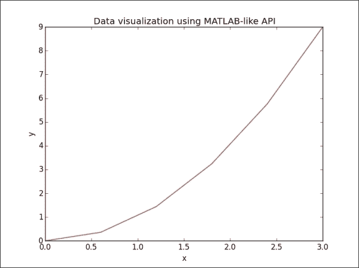

但是，除非有充分的理由，否则不应使用明星进口。在 matplotlib 的情况下，我们可以使用规范导入:

```py
>>> import matplotlib.pyplot as plt

```

前面的例子可以写成如下:

```py
>>> plt.plot(x, y)
>>> plt.xlabel('x')
>>> plt.ylabel('y')
>>> plt.title('Data visualization using Pyplot of Matplotlib')
>>> plt.show()

```

前面命令的输出如下:

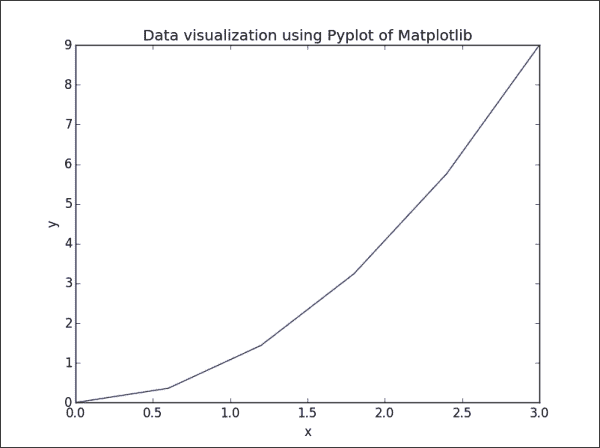

如果我们只为绘图函数提供一个参数，它将自动将其用作`y`值，并生成从`0`到`N-1`的`x`值，其中`N`等于值的数量:

```py
>>> plt.plot(y)
>>> plt.xlabel('x')
>>> plt.ylabel('y')
>>> plt.title('Plot y value without given x values')
>>> plt.show()

```

前面命令的输出如下:


默认情况下，轴的范围受输入`x`和`y`数据的范围约束。如果我们想指定轴的`viewport`，我们可以使用`axis()`方法设置自定义范围。例如，在前面的可视化中，我们可以通过编写以下命令将`x`轴的范围从`[0, 5]`增加到`[0, 6]`，将`y`轴的范围从`[0, 9]`增加到`[0, 10]`:

```py
>>> plt.axis([0, 6, 0, 12])

```

## 线条属性

在 matplotlib 中绘制数据时，的默认线条格式是一条蓝色实线，缩写为`b-`。要更改此设置，我们只需将符号代码添加到`plot`功能中，符号代码包括作为颜色字符串的字母和作为线型字符串的符号。让我们考虑具有不同格式样式的几行的图:

```py
>>> plt.plot(x*2, 'g^', x*3, 'rs', x**x, 'y-')
>>> plt.axis([0, 6, 0, 30])
>>> plt.show()

```

前面命令的输出如下:

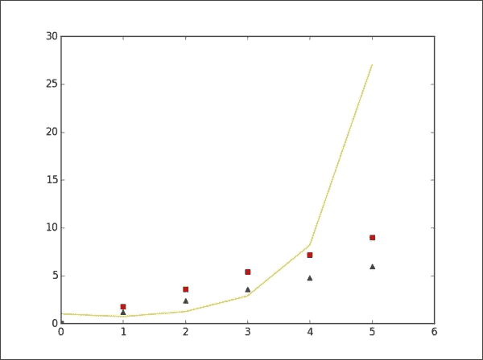

有许多线条样式和属性，例如颜色、线条宽度和虚线样式，我们可以从中进行选择，以控制地块的外观。以下示例说明了设置线属性的几种方法:

```py
>>> line = plt.plot(y, color='red', linewidth=2.0)
>>> line.set_linestyle('--')
>>> plt.setp(line, marker='o')
>>> plt.show()

```

前面命令的输出如下:

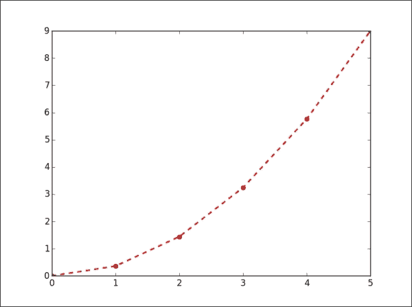

下表列出了`line2d`绘图的一些常见属性:

<colgroup><col style="text-align: left"> <col style="text-align: left"> <col style="text-align: left"></colgroup> 
| 

财产

 | 

值类型

 | 

描述

 |
| --- | --- | --- |
| `color`或`c` | 任何 matplotlib 颜色 | 这将设置图中线条的颜色 |
| `dashes` | 开/关 | 这将设置点中油墨的顺序 |
| `data` | `np`。`array``xdata``np.array``ydata` | 这将设置用于可视化的数据 |
| `linestyle`或`ls` | [ `'-'` &#124; `'—'` &#124; `'-.'` &#124; `':'` &#124;...] | 这将设置图中的线条样式 |
| `linewidth`或`lw` | 浮点值 | 这将设置图中线条的宽度 |
| `marker` | 任何符号 | 这将设置图中数据点的样式 |

## 人物和支线剧情

默认情况下，所有绘图命令适用于当前图形和轴。在某些情况下，我们希望在多个图形和轴中可视化数据，以比较不同的图或更有效地使用页面上的空间。需要两个步骤才能绘制数据。首先，我们必须定义我们要绘制哪个数字。其次，我们需要弄清楚我们的支线剧情在图中的位置:

```py
>>> plt.figure('a')    # define a figure, named 'a'
>>> plt.subplot(221)    # the first position of 4 subplots in 2x2 figure
>>> plt.plot(y+y, 'r--')
>>> plt.subplot(222)    # the second position of 4 subplots
>>> plt.plot(y*3, 'ko')
>>> plt.subplot(223)    # the third position of 4 subplots
>>> plt.plot(y*y, 'b^')
>>> plt.subplot(224)
>>> plt.show()

```

前面命令的输出如下:

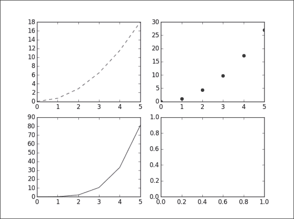

在这种情况下，我们目前有图`a`。如果要修改图`a`中的任何一个子图，首先调用命令选择图和子图，然后执行函数修改子图。例如，在这里，我们更改了我们的四情节图的第二情节的标题:

```py
>>> plt.figure('a')
>>> plt.subplot(222)
>>> plt.title('visualization of y*3')
>>> plt.show()

```

前一命令的输出如下:

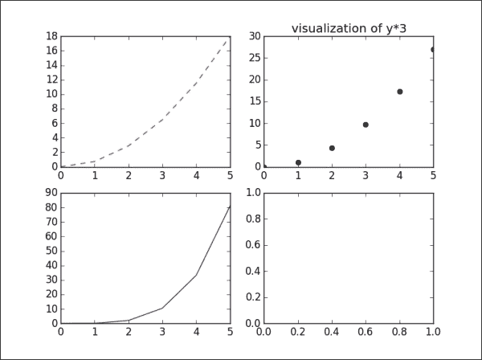

### 型式

如果我们不使用逗号分隔索引，整数子图规格必须是三位数。所以，`plt.subplot(221)`等于`plt.subplot(2,2,1)`命令。

有一种便利方法`plt.subplots()`，可以创建一个包含给定数量支线剧情的图形。就像前面的例子一样，我们可以使用`plt.subplots(2,2)`命令来创建一个由四个支线剧情组成的`2x2`人物。

我们也可以使用`plt.axes([left, bottom, width, height])`命令手动创建轴，而不是矩形网格，其中所有输入参数都在分数`[0, 1]`坐标中:

```py
>>> plt.figure('b')    # create another figure, named 'b'
>>> ax1 = plt.axes([0.05, 0.1, 0.4, 0.32])
>>> ax2 = plt.axes([0.52, 0.1, 0.4, 0.32])
>>> ax3 = plt.axes([0.05, 0.53, 0.87, 0.44])
>>> plt.show()

```

前面命令的输出如下:

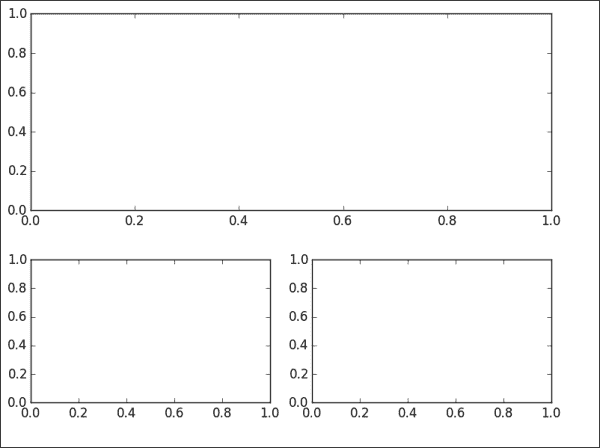

然而，当你手动创建轴时，需要更多的时间来平衡子情节之间的坐标和大小，以获得均匀的图形。

# 探索地块类型

到目前为止，我们已经了解了如何创建简单的线图。matplotlib 库支持更多对数据可视化有用的绘图类型。但是，我们的目标是提供基础知识，帮助您理解和使用库在最常见的情况下可视化数据。因此，我们只关注四种图型:**散点图**、**条形图**、**等高线图**、**直方图**。

## 散点图

一个散点图用于可视化在同一数据集中测量的变量之间的关系。使用`plt.scatter()`函数绘制简单的散点图很容易，它要求`x`轴和`y`轴都有数字列:

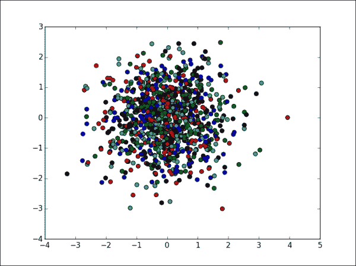

让我们看看前面输出的命令:

```py
>>> X = np.random.normal(0, 1, 1000)
>>> Y = np.random.normal(0, 1, 1000)
>>> plt.scatter(X, Y, c = ['b', 'g', 'k', 'r', 'c'])
>>> plt.show()

```

## 条形地块

一个条形图用于显示带有矩形条的分组数据，矩形条可以是垂直的也可以是水平的，条的长度对应于它们的值。我们使用`plt.bar()`命令来可视化一个竖条，使用`plt.barh()`命令来可视化另一个竖条:

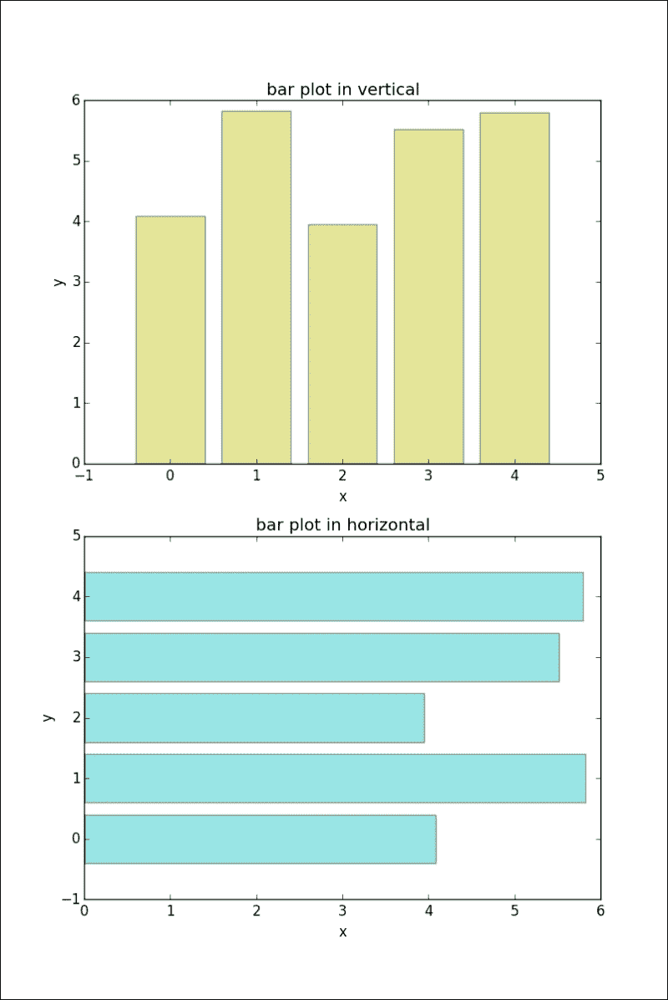

前面输出的命令如下:

```py
>>> X = np.arange(5)
>>> Y = 3.14 + 2.71 * np.random.rand(5)
>>> plt.subplots(2)
>>> # the first subplot
>>> plt.subplot(211)
>>> plt.bar(X, Y, align='center', alpha=0.4, color='y')
>>> plt.xlabel('x')
>>> plt.ylabel('y')
>>> plt.title('bar plot in vertical')
>>> # the second subplot
>>> plt.subplot(212)
>>> plt.barh(X, Y, align='center', alpha=0.4, color='c')
>>> plt.xlabel('x')
>>> plt.ylabel('y')
>>> plt.title('bar plot in horizontal')
>>> plt.show()

```

## 等高线图

我们使用等高线图来表示二维中三个数值变量之间的关系。两个变量沿`x`和`y`轴绘制，第三个变量`z`用于绘制为不同颜色曲线的等高线高程:

```py
>>> x = np.linspace(-1, 1, 255)
>>> y = np.linspace(-2, 2, 300)
>>> z = np.sin(y[:, np.newaxis]) * np.cos(x)
>>> plt.contour(x, y, z, 255, linewidth=2)
>>> plt.show()

```

让我们看看下图中的等高线图:

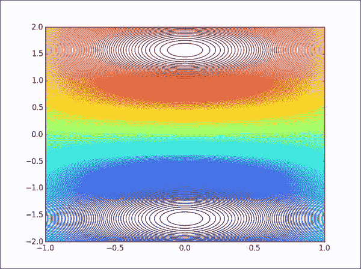

### 型式

如果要画等高线和填充等高线，可以用`plt.contourf()`法代替`plt.contour()`。与 MATLAB 不同，matplotlib 的`contourf()`不会画多边形的边。

## 直方图

一个直方图用图形表示数值数据的分布。通常，值的范围被划分为大小相等的箱，每个箱的高度对应于该箱内值的频率:

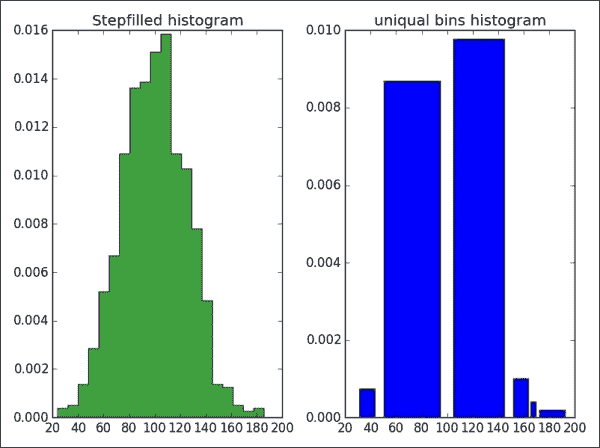

前面输出的命令如下:

```py
>>> mu, sigma = 100, 25
>>> fig, (ax0, ax1) = plt.subplots(ncols=2)
>>> x = mu + sigma * np.random.randn(1000)
>>> ax0.hist(x,20, normed=1, histtype='stepfilled', 
 facecolor='g', alpha=0.75)
>>> ax0.set_title('Stepfilled histogram')
>>> ax1.hist(x, bins=[100,150, 165, 170, 195] normed=1, 
 histtype='bar', rwidth=0.8)
>>> ax1.set_title('uniquel bins histogram')
>>> # automatically adjust subplot parameters to give specified padding
>>> plt.tight_layout()
>>> plt.show()

```

# 传说和注释

传说是用来识别人物中`plot`元素的重要元素。在图形中显示图例最简单的方法是使用`plot`函数的`label`参数，并通过调用`plt.legend()`方法来显示标签:

```py
>>> x = np.linspace(0, 1, 20) 
>>> y1 = np.sin(x)
>>> y2 = np.cos(x)
>>> y3 = np.tan(x)
>>> plt.plot(x, y1, 'c', label='y=sin(x)')
>>> plt.plot(x, y2, 'y', label='y=cos(x)')
>>> plt.plot(x, y3, 'r', label='y=tan(x)')
>>> plt.lengend(loc='upper left')
>>> plt.show()

```

前面命令的输出如下:

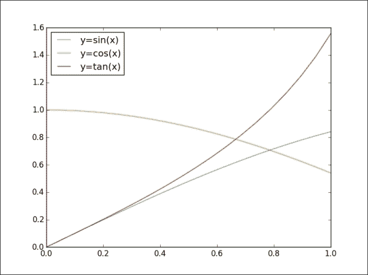

图例命令中的`loc`参数用于计算标签框的位置。有几个有效的位置选项:`lower left`、`right`、`upper left`、`lower center`、`upper right`、`center`、`lower right`、`upper right`、`center right`、`best`、`upper center`和`center left`。默认位置设置为`upper right`。但是，当我们设置一个不存在于以上列表中的无效位置选项时，该功能会自动回落到最佳选项。

如果我们想要将图例拆分为图形中的多个框，我们可以手动设置地块线的预期标签，如下图所示:

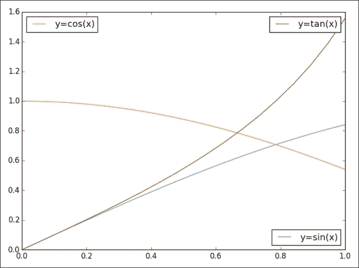

前面命令的输出如下:

```py
>>> p1 = plt.plot(x, y1, 'c', label='y=sin(x)')
>>> p2 = plt.plot(x, y2, 'y', label='y=cos(x)')
>>> p3 = plt.plot(x, y3, 'r', label='y=tan(x)')
>>> lsin = plt.legend(handles=p1, loc='lower right')
>>> lcos = plt.legend(handles=p2, loc='upper left')
>>> ltan = plt.legend(handles=p3, loc='upper right')
>>> # with above code, only 'y=tan(x)' legend appears in the figure
>>> # fix: add lsin, lcos as separate artists to the axes
>>> plt.gca().add_artist(lsin)
>>> plt.gca().add_artist(lcos)
>>> # automatically adjust subplot parameters to specified padding
>>> plt.tight_layout()
>>> plt.show()

```

我们要介绍的图形中的另一个元素是注释，它可以由文本、箭头或其他形状组成，以详细解释图形的各个部分，或者强调一些特殊的数据点。有不同的显示注释的方法，如`text`、`arrow`、、`annotation`。

*   `text`方法在图上给定坐标`(x, y)`处绘制文字；可选地具有自定义属性。函数中有一些常见的参数:`x`、`y`、标签文本和字体相关的属性可以通过`fontdict`传入，如`family`、`fontsize`和`style`。
*   `annotate`方法可以绘制适当排列的文本和箭头。该函数的参数有`s`(标签文本)、`xy`(要标注的元素的位置)、`xytext`(标签的位置`s`)、`xycoords`(表示坐标类型的字符串`xy`)和`arrowprops`(连接标注的箭头的线属性字典)。

这里有一个简单的例子来说明`annotate`和`text`的功能:

```py
>>> x = np.linspace(-2.4, 0.4, 20)
>>> y = x*x + 2*x + 1
>>> plt.plot(x, y, 'c', linewidth=2.0)
>>> plt.text(-1.5, 1.8, 'y=x^2 + 2*x + 1',
 fontsize=14, style='italic')
>>> plt.annotate('minima point', xy=(-1, 0),
 xytext=(-1, 0.3),
 horizontalalignment='center', 
 verticalalignment='top', 
 arrowprops=dict(arrowstyle='->', 
 connectionstyle='arc3'))
>>> plt.show()

```

前面命令的输出如下:

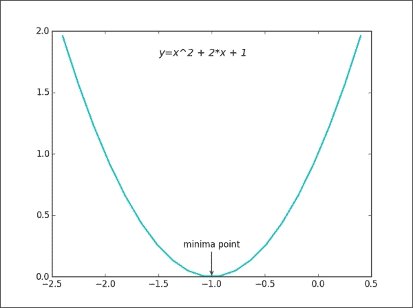

# Pandas 绘图功能

我们已经使用 matplotlib 覆盖了一个绘图图形中的大部分重要组件。在本节中，我们将介绍另一种强大的绘图方法，用于从 Pandas 数据对象直接创建标准可视化，Pandas 数据对象通常用于操作数据。

对于 Pandas 中的系列或数据框对象，支持大多数绘图类型，如折线图、柱状图、柱状图和散点图以及饼图。要选择绘图类型，我们使用`plot`函数的`kind`参数。在没有指定任何类型的绘图的情况下，`plot`功能将默认生成线条样式可视化，如下例所示:

```py
>>> s = pd.Series(np.random.normal(10, 8, 20))
>>> s.plot(style='ko—', alpha=0.4, label='Series plotting')
>>> plt.legend()
>>> plt.show()

```

前面命令的输出如下:

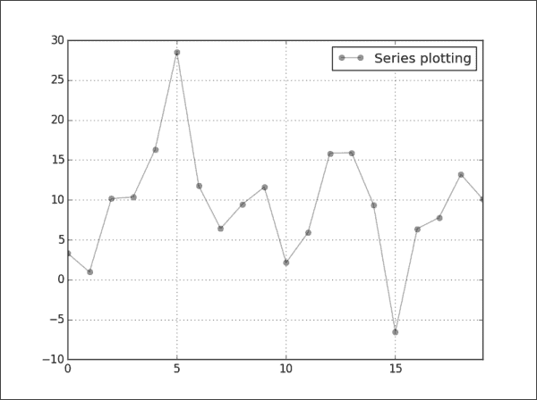

另一个例子将可视化由多列组成的数据框对象的数据:

```py
>>> data = {'Median_Age': [24.2, 26.4, 28.5, 30.3],
 'Density': [244, 256, 268, 279]}
>>> index_label = ['2000', '2005', '2010', '2014'];
>>> df1 = pd.DataFrame(data, index=index_label)
>>> df1.plot(kind='bar', subplots=True, sharex=True)
>>> plt.tight_layout();
>>> plt.show()

```

前面命令的输出如下:

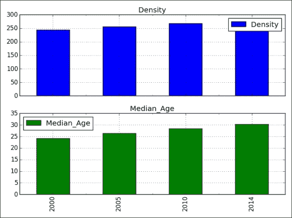

数据框的绘图方法有许多选项，允许我们处理列的绘图。例如，在上面的数据框可视化中，我们选择在单独的子图中绘制列。下表列出了更多选项:

<colgroup><col style="text-align: left"> <col style="text-align: left"> <col style="text-align: left"></colgroup> 
| 

争吵

 | 

价值

 | 

描述

 |
| --- | --- | --- |
| `subplots` | `True` / `False` | 将每个数据列绘制在单独的子图中 |
| `logy` | `True` / `False` | 获得对数刻度`y`轴 |
| `secondary_y` | `True` / `False` | 在次级`y`轴上绘制数据 |
| `sharex`、`sharey` | `True` / `False` | 共享相同的`x`或`y`轴，链接棒和限制 |

# 其他 Python 数据可视化工具

除了 matplotlib，还有其他基于 Python 的强大数据可视化工具包。虽然我们无法深入探讨这些库，但我们希望在本次会议中至少简要介绍一下它们。

## 博克

Bokeh 是由王蒙杰、雨果·史和其他人在连续体分析公司的一个项目。它旨在以`D3.js`的风格提供优雅而迷人的视觉效果。该库可以快速轻松地创建交互式绘图、仪表板和数据应用程序。下面是 matplotlib 和 Bokeh 之间的一些区别:

*   Bokeh 通过 IPython 的浏览器内客户端渲染新模型实现了跨平台的无处不在
*   Bokeh 使用了 R 和 ggplot 用户熟悉的语法，而 matplotlib 则是 Matlab 用户更熟悉的语法
*   Bokeh 有一个连贯的愿景，即构建一个受 ggplot 启发的浏览器内交互式可视化工具，而 Matplotlib 有一个连贯的愿景，即专注于 2D 跨平台图形。

用 Bokeh 创建地块的基本步骤如下:

*   在列表、系列和数据框中准备一些数据
*   告诉 Bokeh 您想在哪里生成输出
*   调用`figure()`创建带有一些整体选项的绘图，类似于前面讨论的 matplotlib 选项
*   为数据添加渲染器，包括颜色、图例和宽度等视觉自定义
*   询问博凯`show()`或`save()`结果

## 玛雅维

MayaVi 是一个用于交互式科学数据可视化和 3D 绘图的库，建立在屡获殊荣的**可视化工具包** ( **VTK** )之上，是开源可视化库的基于特征的包装器。它提供以下功能:

*   通过对话框与可视化中的数据和对象进行交互的可能性。
*   Python 中用于脚本编写的接口。MayaVi 可以与 Numpy 和 scipy 一起开箱即用地进行 3D 绘图，并且可以在 IPython 笔记本内使用，这与 matplotlib 类似。
*   对 VTK 的抽象，提供了一个更简单的编程模型。

让我们来看看一个完全使用 MayaVi 基于 VTK 的例子和他们提供的数据制作的插图:

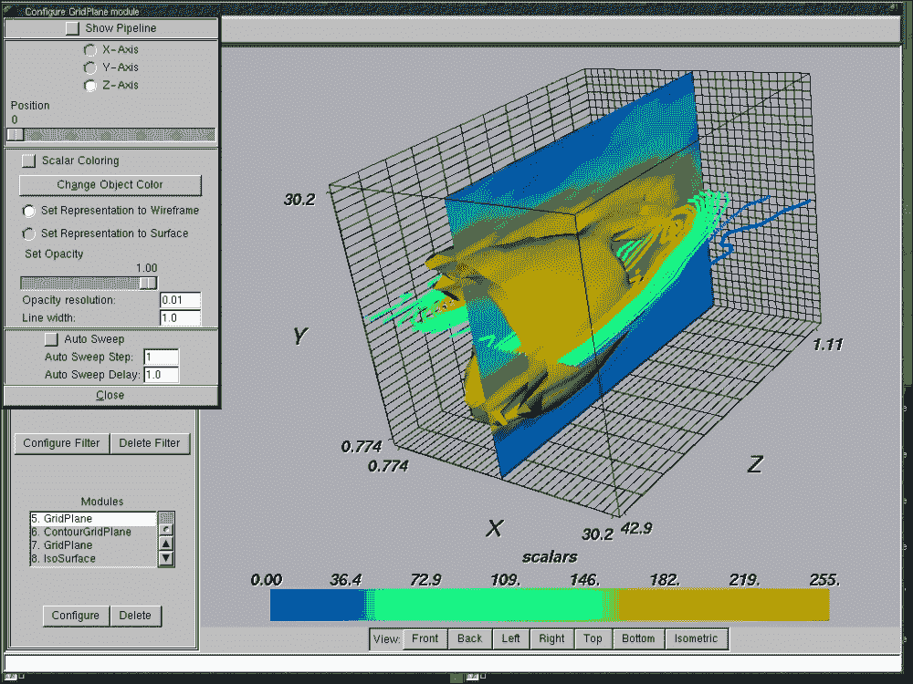

# 总结

基于 matplotlib 库，我们已经完成了大部分基础知识，例如数据可视化的函数、参数和属性。我们希望，通过这些例子，你将能够理解它们并将其应用于你自己的问题。一般来说，为了可视化数据，我们需要考虑五个步骤——也就是说，将数据获取到合适的 Python 或 Pandas 数据结构中，例如列表、字典、系列或数据框架。我们在前面的章节中解释了如何完成这一步。第二步是为所讨论的数据对象定义图和子图。我们在人物和支线剧情部分讨论了这个问题。第三步是选择要在支线剧情中展现的剧情风格及其属性，如:`line`、`bar`、`histogram`、`scatter plot`、`line`、`style`、`color`。第四步是给子剧情添加额外的组件，比如图例、注释和文本。第五步是显示或保存结果。

到目前为止，你可以用数据集做很多事情；例如，基于 Python 库(如 Numpy、Pandas 和 matplotlib)的操纵、清理、探索和可视化。现在，您可以将这些知识和实践与这些库结合起来，以越来越熟悉 Python 数据分析。

**练习练习:**

*   说出两个真实或虚构的数据集，并解释哪种图最适合数据:折线图、条形图、散点图、等高线图或直方图。说出一个或两个应用程序，其中每种绘图类型都很常见(例如，直方图常用于图像编辑应用程序)。
*   我们只关注 matplotlib 最常见的情节类型。经过一番研究，你能说出 matplotlib 中更多可用的绘图类型吗？
*   从[第三章](3.html "Chapter 3. Data Analysis with Pandas")、*Pandas 数据分析*中取一个 Pandas 数据结构，用合适的方式绘制数据。然后，将其作为 PNG 图像保存到磁盘。