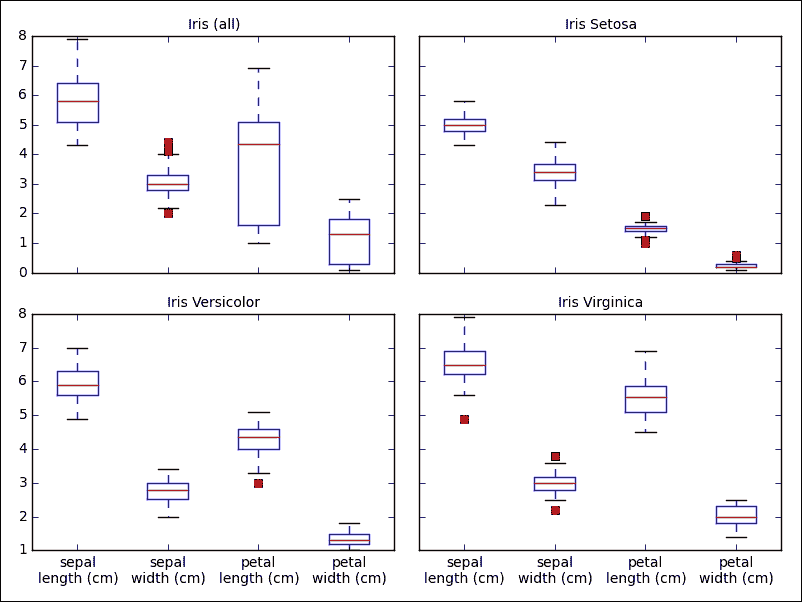
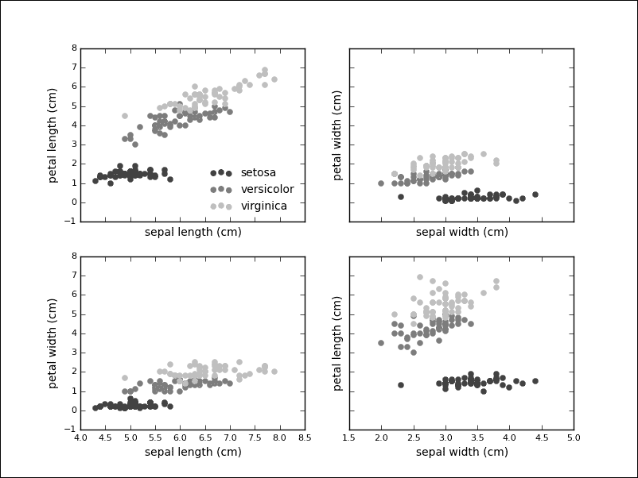
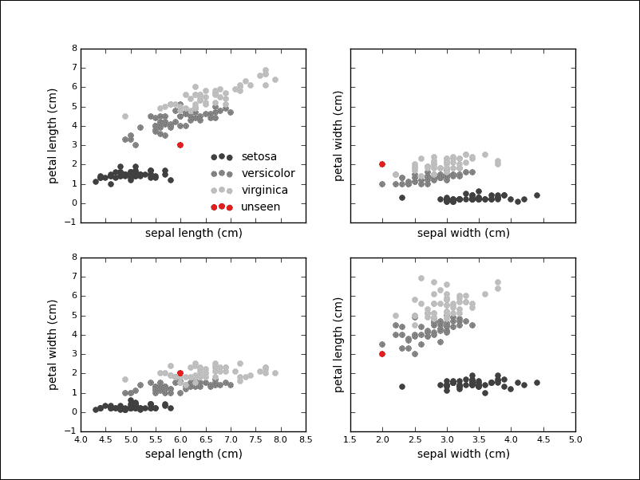
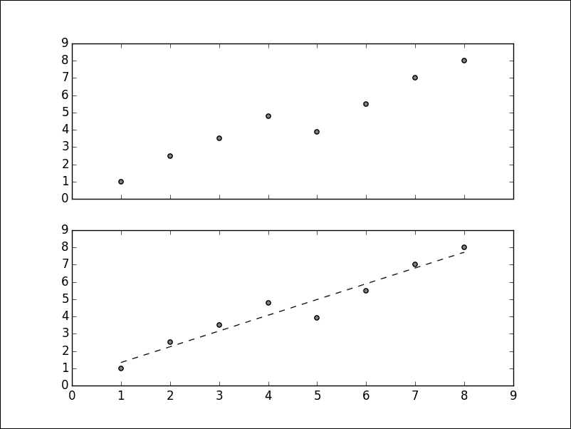
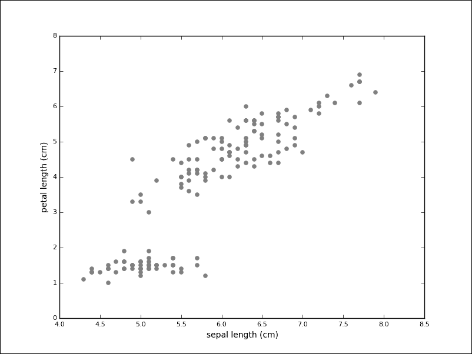
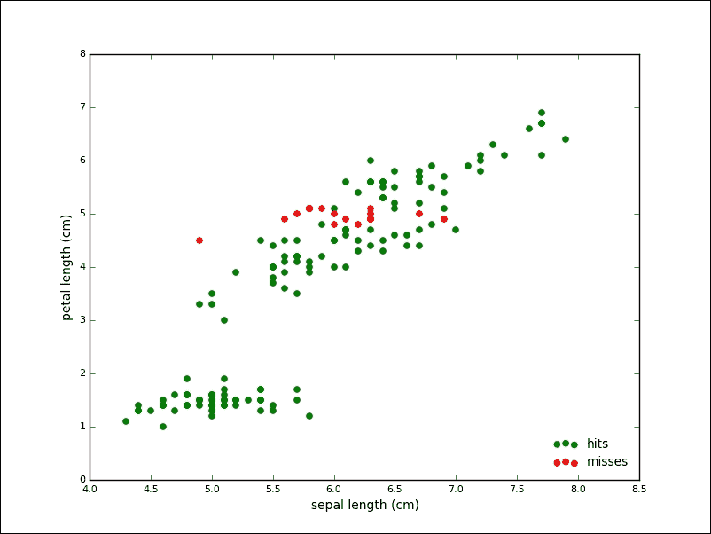
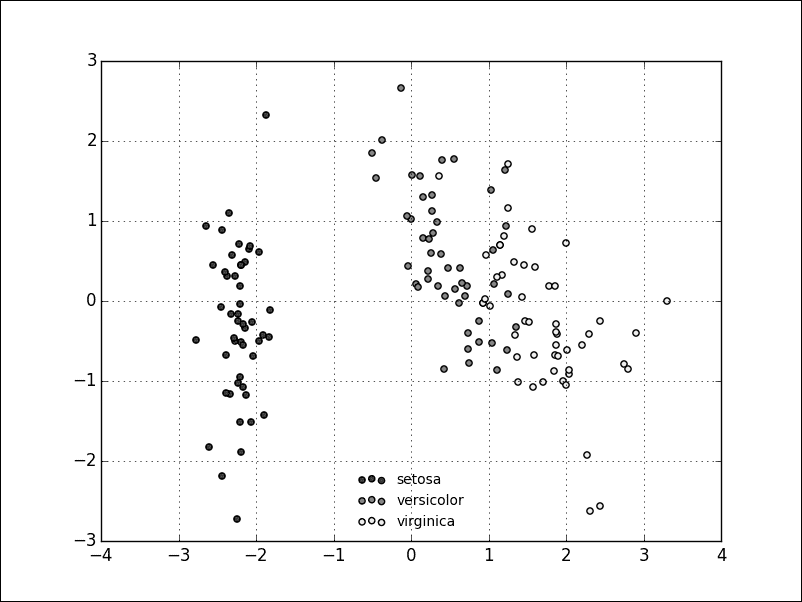

# 第八章。基于 scikit-learn 的机器学习模型

在前一章中，我们看到了如何执行数据管理、数据聚合和分组。在这一章中，我们将简要地看到不同 scikit-learn 模块对不同模型的工作，scikit-learn 中的数据表示，使用示例理解监督和非监督学习，以及测量预测性能。

# 机器学习模型概述

机器学习是人工智能的一个子领域，探索机器如何从数据中学习来分析结构、帮助决策和做出预测。1959 年，阿瑟·塞缪尔将机器学习定义为“赋予计算机学习能力而无需明确编程的研究领域。”

大量应用采用机器学习方法，如垃圾邮件过滤、光学字符识别、计算机视觉、语音识别、信用审批、搜索引擎和推荐系统。

机器学习的一个重要驱动因素是，所有部门的数据生成速度都在加快；无论是网络流量、文本或图像，还是传感器数据或科学数据集。更大的数据量给存储和处理系统带来了许多新的挑战。另一方面，许多学习算法会产生更好的结果，有更多的数据可以学习。近年来，由于各种硬任务(如语音识别或图像中的对象检测)的性能显著提高，该领域受到了广泛关注。没有智能算法的帮助，理解大量数据似乎是不可能的。

学习问题通常使用一组样本(通常用 N 或 N 表示)来构建模型，然后对模型进行验证，并用于预测看不见的数据的属性。

每个样本可能由单个或多个值组成。在机器学习的背景下，数据的属性被称为特征。

机器学习可以根据输入数据的性质来安排:

*   监督学习
*   无监督学习

在监督学习中，输入数据(通常用 x 表示)与目标标签(y)相关联，而在无监督学习中，我们只有未标记的输入数据。

监督学习可以进一步分解为以下问题:

*   分类问题
*   回归问题

分类问题有一组固定的目标标签、类或类别，而回归问题有一个或多个连续的输出变量。将电子邮件分类为垃圾邮件还是非垃圾邮件是一项具有两个目标标签的分类任务。预测房价——考虑到房屋的数据，如大小、年龄和一氧化氮浓度——是一项回归任务，因为价格是连续的。

无监督学习处理不带标签的数据集。一个典型的例子是聚类或自动分类。目标是将相似的项目组合在一起。相似性意味着什么将取决于上下文，在这样的任务中有许多相似性度量可以使用。

# 不同型号的 scikit-learn 模块

scikit-learn 库被组织成子模块。每个子模块包含用于某类机器学习模型和方法的算法和辅助方法。

以下是这些子模块的示例，包括一些示例模型:

<colgroup><col style="text-align: left"> <col style="text-align: left"> <col style="text-align: left"></colgroup> 
| 

子模块

 | 

描述

 | 

示例模型

 |
| --- | --- | --- |
| 串 | 这就是无监督聚类 | KMeans 和 Ward |
| 分解 | 这就是降维 | 常设仲裁法院和 NMF |
| 全体 | 这涉及到基于集成的方法 | AdaBoostClassifier，AdaBoostRegressor，随机应变分类器，随机森林回归器 |
| 皱胃向左移 | 这代表潜在鉴别分析 | 皱胃向左移 |
| 线性模型 | 这是广义线性模型 | 线性回归，物流回归，套索和感知器 |
| 混合 | 这是混合物模型 | GMM 和维也纳国际中心 |
| 朴素贝叶斯 | 这包括基于贝叶斯定理的监督学习 | BaseNB 和 BernoulliNB，GaussianNB |
| 邻居 | 这些是 k 最近的邻居 | KNeighborsClassifier，LSHForest |
| 神经网络 | 这包括基于神经网络的模型 | BernoulliRBM |
| 树 | 决策树 | 决定反对分类者，决定反对者 |

虽然这些方法是多种多样的，但 scikit-learn 库通过向大多数这些算法公开一个常规接口，抽象出了许多不同之处。表中列出的所有示例算法都实现了一种`fit`方法，并且大多数算法也实现了预测。这些方法代表了机器学习的两个阶段。首先，使用`fit`方法在现有数据上训练模型。一旦经过训练，就可以使用模型来预测未知数据的类别或值。在接下来的部分中，我们将看到这两种方法都在发挥作用。

scikit-learn 库是 PyData 生态系统的一部分。它的代码库在过去的六年里稳步增长，拥有超过 100 个贡献者，是 scikit 工具包中最活跃和最受欢迎的一个。

# sci kit-learn 中的数据表示

与机器学习的异构领域和应用相反，scikit-learn 中的数据表示没有那么多样化，许多算法期望的基本格式很简单——样本和特征的矩阵。

底层数据结构是`numpy`和`ndarray`。矩阵中的每一行对应一个样本，每一列对应一个特征的值。

在机器学习数据集的世界中也有类似于`Hello World`的东西；例如，起源于 1936 年的 Iris 数据集。使用 scikit-learn 的标准安装，您已经可以访问几个数据集，包括由 150 个样本组成的鸢尾，每个样本由从三种不同鸢尾花物种获取的四个测量值组成:

```py
>>> import numpy as np
>>> from sklearn import datasets
>>> iris = datasets.load_iris()

```

数据集被打包成一堆，它只是字典的一个薄薄的包装:

```py
>>> type(iris)
sklearn.datasets.base.Bunch
>>> iris.keys()
['target_names', 'data', 'target', 'DESCR', 'feature_names']

```

在`data`键下，我们可以找到样本和特征的矩阵，并可以确认其形状:

```py
>>> type(iris.data)
numpy.ndarray
>>> iris.data.shape
(150, 4)

```

`data`矩阵中的每个条目都已被标记，这些标记可以在`target`属性中查找:

```py
>>> type(iris.target)
numpy.ndarray
>>> iris.target.shape
(150,)
>>> iris.target[:10]
array([0, 0, 0, 0, 0, 0, 0, 0, 0, 0])
>>> np.unique(iris.target)
array([0, 1, 2])

```

目标名称已编码。我们可以在`target_names`属性中查找对应的名称:

```py
>>> iris.target_names
>>> array(['setosa', 'versicolor', 'virginica'], dtype='|S10')

```

这是许多数据集的基本结构，例如示例数据、目标值和目标名称。

该数据集中的单个条目有哪些特征？：

```py
>>> iris.data[0]
array([ 5.1,  3.5,  1.4,  0.2])

```

这四个特征是对真花的测量:它们的萼片长度和宽度，和花瓣长度和宽度。已经检查了三种不同的品种:**鸢尾-濑户鸢尾**、**鸢尾-云芝**和**鸢尾-北美鸢尾**。

机器学习试图回答以下问题:如果只给定花的萼片和花瓣长度的测量值，我们能预测花的种类吗？

在下一节中，我们将看到如何用 scikit-learn 来回答这个问题。

除了有关花卉的数据之外，scikit-learn 发行版中还包括一些其他数据集，如下所示:

*   波士顿房价数据集(506 个样本和 13 个属性)
*   手写数字数据集的光学识别(5620 个样本和 64 个属性)
*   鸢尾植物数据库(150 个样本和 4 个属性)
*   Linnerud 数据集(30 个样本和 3 个属性)

一些数据集没有包括在内，但是它们可以很容易地按需获取(因为这些数据集通常稍大一些)。在这些数据集中，您可以找到一个房地产数据集和一个新闻语料库:

```py
>>> ds = datasets.fetch_california_housing()
downloading Cal. housing from http://lib.stat.cmu.edu/modules.php?op=...
>>> ds.data.shape
(20640, 8)
>>> ds = datasets.fetch_20newsgroups()
>>> len(ds.data)
11314
>>> ds.data[0][:50]
u"From: lerxst@wam.umd.edu (where's my thing)\nSubjec"
>>> sum([len([w for w in sample.split()]) for sample in ds.data])
3252437

```

这些数据集是开始使用 scikit-learn 库的好方法，它们还将帮助您测试自己的算法。最后，scikit-learn 还包括创建人工数据集的函数(前缀为`datasets.make_`)。

如果你使用自己的数据集，你将不得不把它们做成 scikit-learn 所期望的形状，这可能是它自己的任务。Pandas之类的工具让这个任务变得简单多了，Pandas数据帧可以通过数据帧上的`as_matrix()`方法轻松导出到`numpy.ndarray`。

# 监督学习——分类和回归

在这个部分，我们将展示分类和回归的简短示例。

分类问题无处不在:文档分类、欺诈检测、商业智能中的市场细分、生物信息学中的蛋白质功能预测。

尽管手工规则可能会为新数据分配一个类别或标签，但使用算法从现有数据中学习和归纳会更快。

我们将继续使用 Iris 数据集。在我们应用学习算法之前，我们希望通过查看一些值和图来获得数据的直觉。

所有测量值共享相同的维度，这有助于可视化各种箱线图中的差异:



我们看到花瓣长度(第三个特征)表现出最大的变化，这可以表明这个特征在分类过程中的重要性。用两个维度绘制数据点，每个轴使用一个特征，这也很有见地。而且，事实上，我们之前的观察强化了花瓣长度可能是区分不同物种的一个很好的指标。鸢尾似乎也比其他两个物种更容易分离:



从的可视化中，我们获得了解决问题的直觉。我们将使用一种被称为**支持向量机** ( **SVM** )的监督方法来学习虹膜数据的分类器。应用编程接口将模型和数据分开，因此，第一步是实例化模型。在这种情况下，我们传递一个可选的关键字参数，以便以后能够查询模型的概率:

```py
>>> from sklearn.svm import SVC
>>> clf = SVC(probability=True)

```

下一步是根据我们的训练数据拟合模型:

```py
>>> clf.fit(iris.data, iris.target)
SVC(C=1.0, cache_size=200, class_weight=None, coef0=0.0,
 degree=3, gamma=0.0, kernel='rbf', max_iter=-1,
 probability=True, random_state=None, shrinking=True,
 tol=0.001, verbose=False)

```

有了这条线，我们已经在数据集上训练了我们的第一个机器学习模型。这个模型现在可以用来预测未知数据的种类。如果给定一些我们以前从未见过的测量值，我们可以在模型上使用预测方法:

```py
>>> unseen = [6.0, 2.0, 3.0, 2.0]
>>> clf.predict(unseen)
array([1])
>>> iris.target_names[clf.predict(unseen)]
array(['versicolor'],
 dtype='|S10')

```

我们看到分类器给测量赋予了`versicolor`标签。如果我们想象我们的情节中的未知点，我们会发现这似乎是一个明智的预测:



其实分类器对这个标签是比较确定的，我们可以用分类器上的`predict_proba`方法来查询:

```py
>>> clf.predict_proba(unseen)
array([[ 0.03314121,  0.90920125,  0.05765754]])

```

我们的示例由四个特征组成，但是许多问题涉及更高维的数据集，并且许多算法在这些数据集上也运行良好。

我们想展示监督学习问题的另一种算法:线性回归。在线性回归中，我们试图预测一个或多个连续的输出变量，称为回归和，给定一个三维输入向量。回归意味着输出是连续的。之所以称之为线性，是因为输出将以参数的线性函数建模。

我们首先创建一个示例数据集，如下所示:

```py
>>> import matplotlib.pyplot as plt
>>> X = [[1], [2], [3], [4], [5], [6], [7], [8]]
>>> y = [1, 2.5, 3.5, 4.8, 3.9, 5.5, 7, 8]
>>> plt.scatter(X, y, c='0.25')
>>> plt.show()

```

给定这些数据，我们希望学习一个线性函数来逼近数据并最小化预测误差，预测误差定义为观察响应和预测响应之间的平方和:

```py
>>> from sklearn.linear_model import LinearRegression
>>> clf = LinearRegression()
>>> clf.fit(X, y)

```

许多模型将在训练过程中学习参数。这些参数在属性名称的末尾用一个下划线标记。在该模型中，`coef_`属性将保存线性回归问题的估计系数:

```py
>>> clf.coef_
array([ 0.91190476])

```

我们也可以根据我们的数据绘制预测:

```py
>>> plt.plot(X, clf.predict(X), '--', color='0.10', linewidth=1)

```

该图的输出如下:



上图是人工数据的简单例子，但是线性回归有广泛的应用。如果给定房地产对象的特征，我们就可以学会预测价格。如果给出星系的特征，如大小、颜色或亮度，就有可能预测它们的距离。如果给出家庭收入和父母受教育程度的数据，我们可以说说他们孩子的成绩。

线性回归的应用无处不在，一个或多个自变量可能与一个或多个因变量相关联。

# 无监督学习——聚类和降维

很多已有数据没有标注。用无监督模型从没有标签的数据中学习仍然是可能的。探索性数据分析期间的典型任务是找到相关的项目或集群。我们可以想象 Iris 数据集，但是没有标签:



虽然没有标签的任务看起来要困难得多，但是一组测量值(在左下方)似乎与分开了。聚类算法的目标是识别这些组。

我们将在虹膜数据集上使用 K-Means 聚类(没有标签)。该算法期望预先指定聚类的数量，这可能是一个缺点。K-Means 将尝试通过最小化聚类内的平方和来将数据集划分为组。

例如，我们实例化`n_clusters`等于`3`的`KMeans`模型:

```py
>>> from sklearn.cluster import KMeans
>>> km = KMeans(n_clusters=3)

```

类似于监督算法，我们可以使用`fit`方法训练模型，但我们只传递数据，不传递目标标签:

```py
>>> km.fit(iris.data)
KMeans(copy_x=True, init='k-means++', max_iter=300, n_clusters=3, n_init=10, n_jobs=1, precompute_distances='auto', random_state=None, tol=0.0001, verbose=0)

```

我们已经看到属性以下划线结尾。在这种情况下，算法为训练数据分配了一个标签，可以用`labels_`属性进行检查:

```py
>>> km.labels_
array([1, 1, 1, 1, 1, 1, ..., 0, 2, 0, 0, 2], dtype=int32)

```

我们已经可以将这些算法的结果与我们已知的目标标签进行比较:

```py
>>> iris.target
array([0, 0, 0, 0, 0, 0, ..., 2, 2, 2, 2, 2])

```

我们快速`relabel`结果来简化预测误差计算:

```py
>>> tr = {1: 0, 2: 1, 0: 2}
>>> predicted_labels = np.array([tr[i] for i in km.labels_])
>>> sum([p == t for (p, t) in zip(predicted_labels, iris.target)])
134

```

从 150 个样本中，K-Mean 为 134 个样本分配了正确的标签，准确率约为 90%。下图用灰色显示了正确预测的算法点，用红色显示了错误标记的点:



作为无监督算法的另一个例子，我们来看看**主成分分析** ( **主成分分析**)。主成分分析的目的是寻找高维数据中最大方差的方向。一个目标是通过将更高维度的空间投影到更低维的子空间，同时保留大部分信息，从而减少维度的数量。

问题出现在各个领域。您已经收集了许多样本，每个样本包含数百或数千个特征。并不是手头现象的所有属性都同样重要。在我们的 Iris 数据集中，我们看到花瓣长度本身似乎是各种物种的一个很好的鉴别器。主成分分析旨在找到解释数据中大多数变化的主成分。如果我们对我们的分量进行相应的排序(技术上，我们通过特征值对协方差矩阵的特征向量进行排序)，我们可以保留解释大部分数据的特征向量，忽略剩余的特征向量，从而降低数据的维数。

用 scikit-learn 运行 PCA 很简单。我们将不讨论实现细节，而是尝试通过在 Iris 数据集上运行 PCA 来给你一个 PCA 的直觉，以便给你另一个角度。

流程与我们到目前为止实施的流程相似。首先，我们实例化我们的模型；这一次，PCA 来自分解子模块。我们还引入了一种标准化方法，称为`StandardScaler`，它将从我们的数据中移除平均值，并换算成单位方差。这一步是许多机器学习算法的共同要求:

```py
>>> from sklearn.decomposition import PCA
>>> from sklearn.preprocessing import StandardScaler

```

首先，我们用一个参数实例化我们的模型(该参数指定要减少到的维数)，标准化我们的输入，并运行`fit_transform`函数，该函数将处理主成分分析的机制:

```py
>>> pca = PCA(n_components=2)
>>> X = StandardScaler().fit_transform(iris.data)
>>> Y = pca.fit_transform(X)

```

结果是虹膜数据集中的维度从四个维度(萼片和花瓣的宽度和长度)减少到两个维度。需要注意的是，这个投影并不在现有的两个维度上，所以我们的新数据集并不仅仅由花瓣的长度和宽度组成。相反，两个新的维度将代表现有特征的混合。

以下散点图显示了转换后的数据集；从图表上看，看起来我们仍然保留了数据集的本质，尽管我们将维度的数量减半:



降维只是处理高维数据集的一种方式，有时会受到所谓**降维诅咒**的影响。

# 测量预测性能

我们已经看到机器学习过程由以下步骤组成:

*   **模型选择**:我们首先为我们的数据选择一个合适的模型。我们有标签吗？有多少样品？数据可分离吗？我们有几个维度？由于这一步不重要，选择将取决于实际问题。截至 2015 年秋季，scikit-learn 文档包含一个非常受欢迎的流程图，名为*选择正确的评估者*。它很短，但信息量很大，值得仔细看看。
*   **训练**:我们要把模型和数据放在一起，这通常发生在 scikit-learn 中模型的拟合方法中。
*   **应用**:一旦我们训练好我们的模型，我们就能够对看不见的数据做出预测。

到目前为止，我们忽略了在训练和应用之间发生的一个重要步骤:模型测试和验证。在这一步中，我们要评估我们的模型学习得有多好。

学习的一个目标，特别是机器学习，是泛化。有限的一组观察是否足以对任何可能的观察做出陈述，这是一个更深层次的理论问题，在机器学习的专用资源中有所回答。

一个模型概括的好不好也是可以检验的。然而，重要的是训练和测试输入是分开的。模型在训练输入上表现良好，但在看不见的测试输入上失败的情况称为**过拟合**，这种情况并不少见。

基本方法是将可用数据分割成一个训练和测试集，scikit-learn 通过`train_test_split`功能帮助创建这种分割。

我们回到 Iris 数据集，再次执行 SVC。这次我们将在训练集上评估算法的性能。我们留出 40%的数据用于测试:

```py
>>> from sklearn.cross_validation import train_test_split
>>> X_train, X_test, y_train, y_test = train_test_split(iris.data, iris.target, test_size=0.4, random_state=0)
>>> clf = SVC()
>>> clf.fit(X_train, y_train)

```

score 函数返回给定数据和标签的平均精度。我们通过测试集进行评估:

```py
>>> clf.score(X_test, y_test)
 0.94999999999999996

```

该模型似乎表现良好，对看不见的数据的准确率约为 94%。我们现在可以开始调整模型参数(也称为超参数)以提高预测性能。这个周期会带来过度拟合的问题。一种解决方案是将输入数据分成三组:一组用于训练、验证和测试。超参数调整的迭代模型将发生在训练集和验证集之间，而最终评估将在测试集上完成。将数据集分为三个也减少了我们可以学习的样本数量。

**交叉验证** ( **CV** )是一种不需要验证集，但仍能抵消过度拟合的技术。数据集被分割成`k`部分(称为折叠)。对于每个折叠，模型在`k-1`折叠上训练，并在剩余折叠上测试。精度被视为折叠的平均值。

我们将在 Iris 数据集上展示五重交叉验证，再次使用 SVC:

```py
>>> from sklearn.cross_validation import cross_val_score
>>> clf = SVC()
>>> scores = cross_val_score(clf, iris.data, iris.target, cv=5)
>>> scores
array([ 0.96666667,  1\.    ,  0.96666667,  0.96666667,  1\.    ])
>>> scores.mean()
0.98000000000000009

```

有不同类实现的各种策略来拆分数据集进行交叉验证:`KFold`、`StratifiedKFold`、`LeaveOneOut`、`LeavePOut`、`LeaveOneLabelOut`、`LeavePLableOut`、`ShuffleSplit`、`StratifiedShuffleSplit`和`PredefinedSplit`。

模型验证是一个重要的步骤，对于开发健壮的机器学习解决方案是必要的。

# 总结

在这一章中，我们旋风般地浏览了最流行的 Python 机器学习库之一:scikit-learn。我们看到了这个库期望什么样的数据。真实世界的数据很少会马上被输入到估计器中。有了强大的库，比如 Numpy，尤其是 Pandas，您已经看到了如何检索、组合和形成数据。可视化库，如 matplotlib，有助于直观地了解数据集、问题和解决方案。

在这一章中，我们看了一个规范数据集，Iris 数据集。我们也从不同的角度来看它:作为有监督和无监督学习中的一个问题，以及作为模型验证的一个例子。

总之，我们已经研究了四种不同的算法:支持向量机、线性回归、K-Means 聚类和主成分分析。其中的每一个都值得探索，尽管我们只用了几行 Python 就实现了所有的算法，但我们几乎没有触及表面。

有许多方法可以让您进一步了解数据分析过程。已经出版了数百本关于机器学习的书，所以我们在这里只想强调几本:*用 Python 构建机器学习系统**里歇特*和*科埃略*将更深入地探讨 scikit-learn，这是我们在本章中无法做到的。*从数据中学习*由*阿布-穆斯塔法、马格东-伊斯梅尔*和*林*组成，是学习一般问题的坚实理论基础的巨大资源。

最有趣的应用将会出现在你自己的领域。然而，如果你想获得一些灵感，我们建议你看看[www.kaggle.com](http://www.kaggle.com)网站，该网站运行预测建模和分析竞赛，既有趣又有洞察力。

**练习练习**

以下问题是有人监督还是无人监督？回归还是分类问题？：

*   识别自动售货机内的硬币
*   识别手写数字
*   如果给定一些关于人和经济的事实，我们想要估计消费者支出
*   如果给定地理、政治和历史事件的数据，我们希望预测侵犯人权行为最终将在何时何地发生
*   如果考虑到鲸鱼及其物种的声音，我们想给尚未标记的鲸鱼录音贴上标签

查找最早的机器学习模型和算法之一:感知器。在 Iris 数据集上尝试感知器，并估计模型的准确性。感知器与本章中的 SVC 相比如何？