# 电子设计自动化的视觉辅助工具

作为数据科学家，我们工作的两个重要目标是从数据中提取知识，并将数据呈现给利益相关者。向涉众展示结果是非常复杂的，因为我们的受众可能没有足够的技术知识来理解编程术语和其他技术细节。因此，视觉辅助是非常有用的工具。在这一章中，我们将重点介绍可用于数据集的不同类型的视觉辅助工具。我们将学习可用于数据可视化的不同类型的技术。

在本章中，我们将涵盖以下主题:

*   折线图
*   条形图
*   散点图
*   面积图和堆叠图
*   圆形分格统计图表
*   表格图表
*   极区图
*   柱状图
*   棒棒糖图表
*   选择最佳图表
*   要探索的其他库

# 技术要求

你可以在 GitHub 上找到这一章的代码:[https://GitHub . com/PacktPublishing/动手-探索-数据-分析-用 python](https://github.com/PacktPublishing/hands-on-exploratory-data-analysis-with-python) 。为了充分利用本章，请确保以下几点:

*   确保你有 Python 3。安装在你的电脑上。建议使用蟒蛇等 Python 笔记本。
*   您必须安装 Python 库，如`pandas`、`seaborn`和`matplotlib`。

# 折线图

你还记得什么是连续变量，什么是离散变量吗？如果没有，快速看一下[第一章](01.html)、*探索性数据分析基本面*。回到主题，折线图用于说明两个或多个连续变量之间的关系。

我们将使用`matplotlib`库和股价数据绘制时间序列线。首先，让我们了解数据集。我们已经使用`faker` Python 库创建了一个函数来生成数据集。这是你能想象到的最简单的数据集，只有两列。第一栏是`Date`，第二栏是`Price`，表示当日股价。

让我们通过调用 helper 方法来生成数据集。除此之外，我们还保存了 CSV 文件。您可以选择使用`pandas` ( `read_csv`)库加载 CSV 文件并继续可视化。

我的`generateData`功能在这里定义:

```py
import datetime
import math
import pandas as pd
import random 
import radar 
from faker import Faker
fake = Faker()

def generateData(n):
  listdata = []
  start = datetime.datetime(2019, 8, 1)
  end = datetime.datetime(2019, 8, 30)
  delta = end - start
  for _ in range(n):
    date = radar.random_datetime(start='2019-08-1', stop='2019-08-30').strftime("%Y-%m-%d")
    price = round(random.uniform(900, 1000), 4)
    listdata.append([date, price])
  df = pd.DataFrame(listdata, columns = ['Date', 'Price'])
  df['Date'] = pd.to_datetime(df['Date'], format='%Y-%m-%d')
  df = df.groupby(by='Date').mean()

  return df
```

定义了生成数据的方法后，让我们将数据放入 pandas 数据框，并检查前 10 个条目:

```py
df = generateData(50)
df.head(10)
```

下面的屏幕截图显示了前面代码的输出:

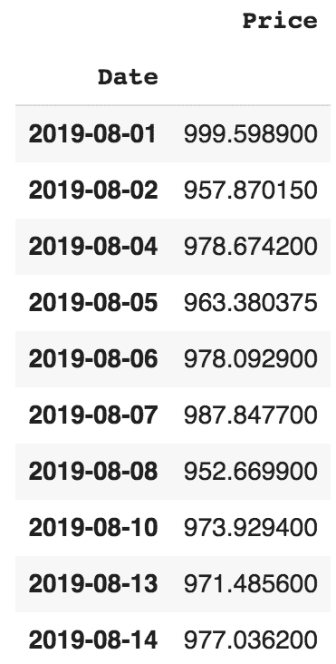

让我们在下一节创建折线图。

# 涉及的步骤

让我们看看创建折线图的过程:

1.  加载并准备数据集。我们将在[第 4 章](04.html)、*数据转换*中详细了解如何准备数据。对于本练习，所有数据都经过预处理。
2.  导入`matplotlib`库。这可以通过以下命令完成:

```py
import matplotlib.pyplot as plt
```

3.  绘制图表:

```py
plt.plot(df)
```

4.  在屏幕上显示:

```py
plt.show()
```

如果我们把它们放在一起，代码如下:

```py
import matplotlib.pyplot as plt

plt.rcParams['figure.figsize'] = (14, 10)
plt.plot(df)
```

绘制的图表看起来像这样:

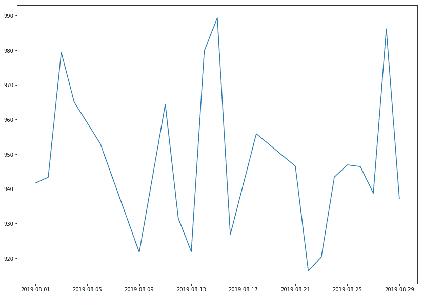

在前面的示例中，我们假设数据以 CSV 格式提供。在现实场景中，数据大多以 CSV、JSON、Excel 或 XML 格式提供，并且大多通过一些标准的应用编程接口传播。对于本系列，我们假设您已经熟悉熊猫以及如何读取不同类型的文件。如果没有，是时候修改熊猫了。更多详情请参考熊猫文档:[https://pandas-datareader.readthedocs.io/en/latest/](https://pandas-datareader.readthedocs.io/en/latest/)。

# 条形图

这是几乎每个人都会遇到的最常见的可视化类型之一。可以水平或垂直绘制条来表示**分类变量**。

条形图经常用于区分不同集合之间的对象，以便跟踪随时间的变化。在大多数情况下，当变化较大时，条形图非常方便。为了了解条形图，让我们假设挪威的一家药店记录了每月左洛复的销售量。左洛复是一种开给抑郁症患者的药。我们可以使用`calendar` Python 库来跟踪一年中对应于 1 月到 12 月的月份(1 到 12):

1.  让我们导入所需的库:

```py
import numpy as np
import calendar
import matplotlib.pyplot as plt
```

2.  设置数据。请记住，`range`停止参数是排他的，这意味着如果您从最后一项`13`生成范围，则不包括:

```py
months = list(range(1, 13))
sold_quantity = [round(random.uniform(100, 200)) for x in range(1, 13)]
```

3.  指定图形的布局并分配空间:

```py
figure, axis = plt.subplots()
```

4.  在 *x* 轴上，我们想要显示月份的名称:

```py
plt.xticks(months, calendar.month_name[1:13], rotation=20)
```

5.  绘制图表:

```py
plot = axis.bar(months, sold_quantity)
```

6.  此步骤是可选的，具体取决于您是否有兴趣在条形图头部显示数据值。它直观地显示了酒吧本身实际售出商品的数量，更有意义:

```py
for rectangle in plot:
height = rectangle.get_height()
axis.text(rectangle.get_x() + rectangle.get_width() /2., 1.002 * height, '%d' % int(height), ha='center', va = 'bottom')
```

7.  在屏幕上显示图形:

```py
plt.show()
```

条形图如下所示:


以下是之前可视化的重要观察结果:

*   `months`和`sold_quantity`是 Python 列表，代表每个月左洛复的销量。
*   我们使用的是前面代码中的`subplots()`方法。为什么呢？它提供了一种根据图形数量定义图形布局的方法，并提供了组织图形的方法。还困惑吗？别担心，我们会在这一章中多次使用支线剧情。此外，如果你需要快速参考，Packt 有几本书解释`matplotlib`。本章的*进一步阅读*部分提到了一些最有趣的阅读。
*   在*步骤 3* 中，我们使用`plt.xticks()`功能，该功能允许我们将 *x* 轴的刻度从 1 更改为 12，而`calender.months[1:13]`从`calendar` Python 库中将该数值格式更改为相应的月份。
*   *第 4 步*实际打印的是销售的月份和数量。
*   `for`循环中的`ax.text()`用相应的值标注每个条。它是如何做到这一点的可能很有趣。我们绘制这些值的方法是获取 x 和 y 坐标，然后将`bar_width/2`添加到高度为`1.002`的 x 坐标中，这是 y 坐标。然后，使用`va`和`ha`参数，我们将文本居中对齐。
*   *第 6 步*在屏幕上实际显示图形。

正如在本节的介绍中提到的，我们说过横条可以是水平的，也可以是垂直的。让我们换成水平格式。所有代码保持不变，除了`plt.xticks`更改为`plt.yticks()`、`plt.bar()`更改为`plt.barh()`。我们假设它是不言自明的。

除此之外，放置精确的数据值有点棘手，需要多次反复试验才能完美放置它们。但是让我们看看他们的行动:

```py
months = list(range(1, 13))
sold_quantity = [round(random.uniform(100, 200)) for x in range(1, 13)]

figure, axis = plt.subplots()

plt.yticks(months, calendar.month_name[1:13], rotation=20)

plot = axis.barh(months, sold_quantity)

for rectangle in plot:
  width = rectangle.get_width()
  axis.text(width + 2.5, rectangle.get_y() + 0.38, '%d' % int(width), ha='center', va = 'bottom')

plt.show()
```

它生成的图形如下:

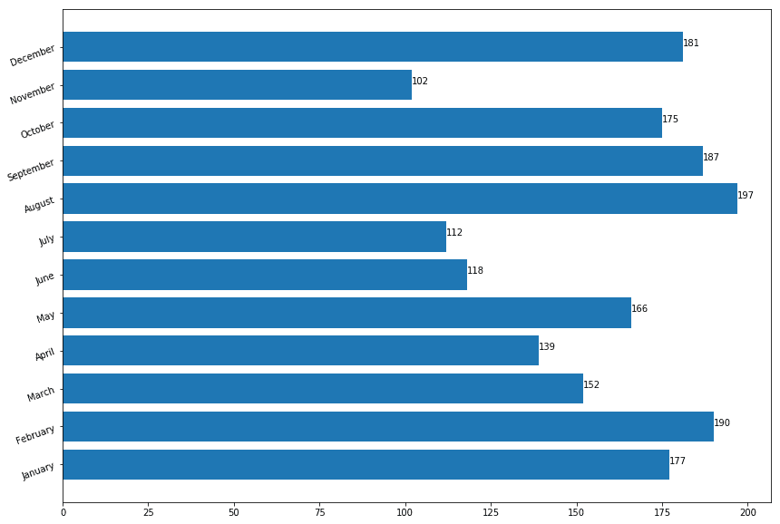

好了，这就是本章中的条形图。在后面的章节中，我们肯定会用到其他几个属性。接下来，我们将使用散点图来可视化数据。

# 散点图

散点图也称为散点图、散点图、散点图和散点图。他们使用笛卡尔坐标系统来显示一组数据的两个变量的值。

我们什么时候应该使用散点图？散点图可以在以下两种情况下构建:

*   当一个连续变量依赖于另一个受观察者控制的变量时
*   当两个连续变量都独立时

有两个重要的概念——**自变量**和**因变量**。在统计建模或数学建模中，因变量的值依赖于自变量的值。因变量是正在研究的结果变量。自变量也称为**回归量**。这里的要点是，当我们需要显示两个变量之间的关系时，使用散点图，因此有时称为相关图。我们将在[第 7 章](07.html)、*相关性*中挖掘更多关于相关性的细节。

你要么是数据科学家专家，要么是计算机科学的初学者，毫无疑问你以前遇到过散点图的形式。这些图是可视化的强大工具，尽管它们很简单。主要原因是它们有很多选项、表示能力和设计选择，并且足够灵活，能够以吸引人的方式表示图形。

散点图适用的一些例子如下:

*   研究已经成功地证实，一个人所需的睡眠时间取决于这个人的年龄。
*   成年人的平均收入是基于受教育的年限。

我们来看第一个案例。数据集可以在 GitHub 存储库中以 CSV 文件的形式找到:

```py
headers_cols = ['age','min_recommended', 'max_recommended', 'may_be_appropriate_min', 'may_be_appropriate_max', 'min_not_recommended', 'max_not_recommended'] 

sleepDf = pd.read_csv('https://raw.githubusercontent.com/PacktPublishing/hands-on-exploratory-data-analysis-with-python/master/Chapter%202/sleep_vs_age.csv', columns=headers_cols)
sleepDf.head(10)
```

正确导入数据集后，让我们显示散点图。我们首先导入所需的库，然后绘制实际的图形。接下来，我们显示 x 标签和 y 标签。代码在以下代码块中给出:

```py
import seaborn as sns
import matplotlib.pyplot as plt
sns.set()

# A regular scatter plot
plt.scatter(x=sleepDf["age"]/12., y=sleepDf["min_recommended"])
plt.scatter(x=sleepDf["age"]/12., y=sleepDf['max_recommended'])
plt.xlabel('Age of person in Years')
plt.ylabel('Total hours of sleep required')
plt.show()
```

由上述代码生成的散点图如下:

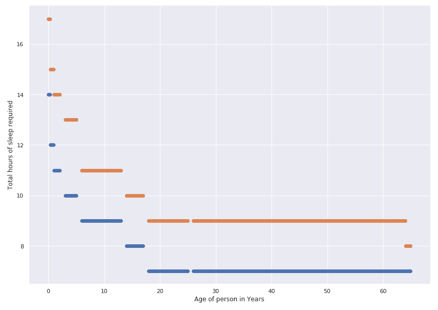

这并不难，是吗？让我们看看能否解释这个图表。你可以清楚地看到，一个人最初需要的睡眠总时数很高，随着年龄的增长而逐渐减少。产生的图形是可解释的，但是由于缺少连续的线，结果不是不言自明的。让我们在上面画一条线，看看这是否能以更明显的方式解释结果:

```py
# Line plot
plt.plot(sleepDf['age']/12., sleepDf['min_recommended'], 'g--')
plt.plot(sleepDf['age']/12., sleepDf['max_recommended'], 'r--')
plt.xlabel('Age of person in Years')
plt.ylabel('Total hours of sleep required')
plt.show()
```

相同数据的折线图如下:

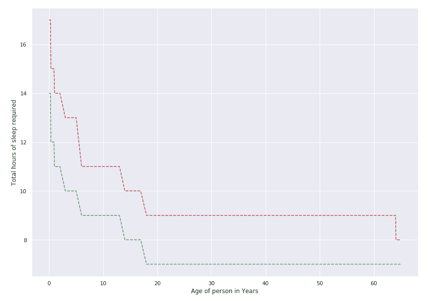

从图中可以明显看出，这两条线随着年龄的增长而下降。它表明 0 到 3 个月的新生儿每天至少需要 14-17 个小时的睡眠。同时，成年人和老年人每天需要 7-9 个小时的睡眠。你的睡眠模式在这个范围内吗？

让我们再举一个散点图的例子，使用数据科学中最流行的数据集 Iris 数据集。数据集由罗纳德·费雪于 1936 年引入，并被博客、书籍、文章和研究论文广泛采用，以展示数据科学和数据挖掘的各个方面。该数据集包含三种不同鸢尾的 50 个例子，分别命名为濑户鸢尾、弗吉尼亚鸢尾和云芝。每个示例有四个不同的属性:`petal_length`、`petal_width`、`sepal_length`和`sepal_width`。数据集可以通过几种方式加载。

这里，我们使用`seaborn`加载数据集:

1.  导入`seaborn`并设置`matplotlib`的一些默认参数:

```py
import seaborn as sns
import matplotlib.pyplot as plt

plt.rcParams['figure.figsize'] = (8, 6)
plt.rcParams['figure.dpi'] = 150
```

2.  从`seaborn`开始使用样式。试着评论下一行，看看图表中的不同之处:

```py
sns.set()
```

3.  加载虹膜数据集:

```py
df = sns.load_dataset('iris')

df['species'] = df['species'].map({'setosa': 0, "versicolor": 1, "virginica": 2})
```

4.  创建常规散点图:

```py
plt.scatter(x=df["sepal_length"], y=df["sepal_width"], c = df.species)
```

5.  为轴创建标签:

```py
plt.xlabel('Septal Length')
plt.ylabel('Petal length')
```

6.  在屏幕上显示绘图:

```py
plt.show()
```

由上述代码生成的散点图如下:

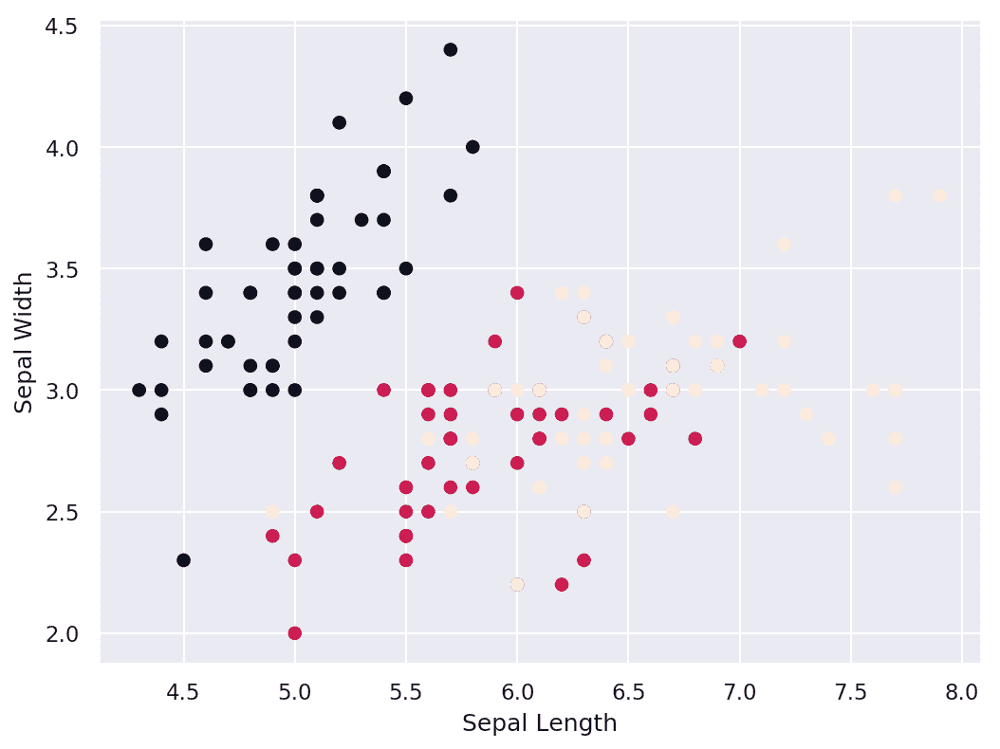

你觉得这张图表信息丰富吗？我们假设你们大多数人都同意，你们可以清楚地看到三种不同类型的点，并且有三种不同的簇。然而，不清楚哪种颜色代表哪种鸢尾。因此，我们将学习如何在*散点图中使用海底*部分创建传说。

# 泡泡图

气泡图是散点图的一种表现形式，图中的每个数据点都显示为一个气泡。每个气泡可以用不同的颜色、大小和外观来说明。

让我们继续使用 Iris 数据集来获得一个气泡图。这里需要注意的重要一点是，我们还是要用`plt.scatter`的方法画一个泡泡图:

```py
# Load the Iris dataset
df = sns.load_dataset('iris')

df['species'] = df['species'].map({'setosa': 0, "versicolor": 1, "virginica": 2})

# Create bubble plot
plt.scatter(df.petal_length, df.petal_width,
            s=50*df.petal_length*df.petal_width, 
            c=df.species,
            alpha=0.3
            )

# Create labels for axises
plt.xlabel('Septal Length')
plt.ylabel('Petal length')
plt.show()
```

由上述代码生成的气泡图如下:

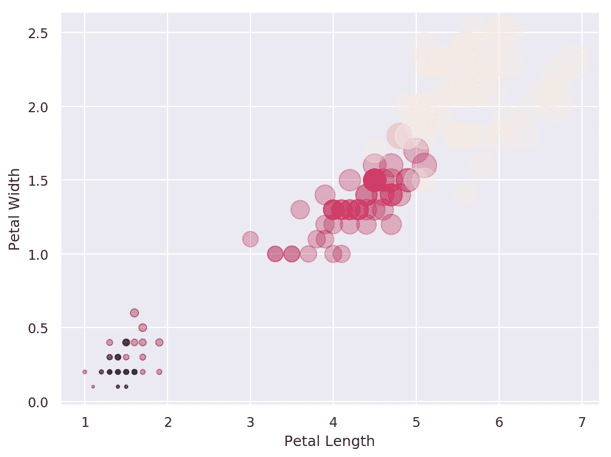

你能解释结果吗？嗯，从图上看不清楚哪种颜色代表哪种鸢尾。但是我们可以清楚地看到三个不同的*簇*，这清楚地表明对于每个特定的物种或簇，花瓣长度和花瓣宽度之间存在关系。

# 使用 seaborn 的散点图

还可以使用`seaborn`库生成散点图。Seaborn 使图表在视觉上更好。我们可以利用`seaborn`散点图的`size`、`style`和`hue`参数来说明不同数据子集的 x 和 y 之间的关系。

Get more detailed information about the parameters from seaborn's documentation website: [https://seaborn.pydata.org/generated/seaborn.scatterplot.html](https://seaborn.pydata.org/generated/seaborn.scatterplot.html).

现在，让我们加载 Iris 数据集:

```py
df = sns.load_dataset('iris')

df['species'] = df['species'].map({'setosa': 0, "versicolor": 1, "virginica": 2})
sns.scatterplot(x=df["sepal_length"], y=df["sepal_width"], hue=df.species, data=df)
```

根据前面的代码生成的散点图如下:

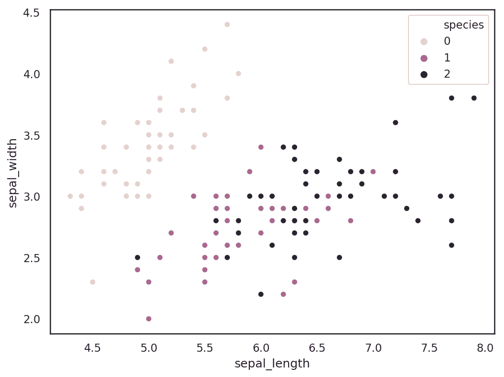

在前面的情节中，我们可以清楚地看到有三种花用三种不同的颜色表示。从图中可以更清楚地看到不同的花在萼片的宽度和长度上是如何变化的。

# 面积图和堆叠图

堆叠图之所以得名，是因为它代表了线形图下面的区域，而且几个这样的图可以堆叠在一起，给人一种堆叠的感觉。当我们想要可视化在 *y* 轴上绘制的多个变量的**累积效应**时，堆叠图会很有用。

为了简化这一点，可以将面积图想象成一个线形图，通过用颜色填充来显示所覆盖的区域。说够了。让我们深入代码库。首先，让我们定义数据集:

```py
# House loan Mortgage cost per month for a year
houseLoanMortgage = [9000, 9000, 8000, 9000, 
                    8000, 9000, 9000, 9000, 
                    9000, 8000, 9000, 9000]

# Utilities Bills for a year
utilitiesBills = [4218, 4218, 4218, 4218,
                  4218, 4218, 4219, 2218, 
                  3218, 4233, 3000, 3000]
# Transportation bill for a year
transportation = [782, 900, 732, 892,
                  334, 222, 300, 800, 
                  900, 582, 596, 222]

# Car mortgage cost for one year
carMortgage = [700, 701, 702, 703, 
              704, 705, 706, 707, 
              708, 709, 710, 711]
```

现在，让我们导入所需的库并绘制堆叠图:

```py
import matplotlib.pyplot as plt
import seaborn as sns
sns.set()

months= [x for x in range(1,13)]

# Create placeholders for plot and add required color 
plt.plot([],[], color='sandybrown', label='houseLoanMortgage')
plt.plot([],[], color='tan', label='utilitiesBills')
plt.plot([],[], color='bisque', label='transportation')
plt.plot([],[], color='darkcyan', label='carMortgage')

# Add stacks to the plot
plt.stackplot(months, houseLoanMortgage, utilitiesBills, transportation, carMortgage, colors=['sandybrown', 'tan', 'bisque', 'darkcyan'])
plt.legend()

# Add Labels
plt.title('Household Expenses')
plt.xlabel('Months of the year')
plt.ylabel('Cost')

# Display on the screen
plt.show()
```

在前面的片段中，首先，我们导入了`matplotlib`和`seaborn`。没什么新鲜的，对吧？然后我们添加了带有图例的堆栈。最后，我们在轴上添加标签，并在屏幕上显示图形。简单明了。现在您知道如何创建面积图或堆叠图了。由上述代码生成的面积图如下:

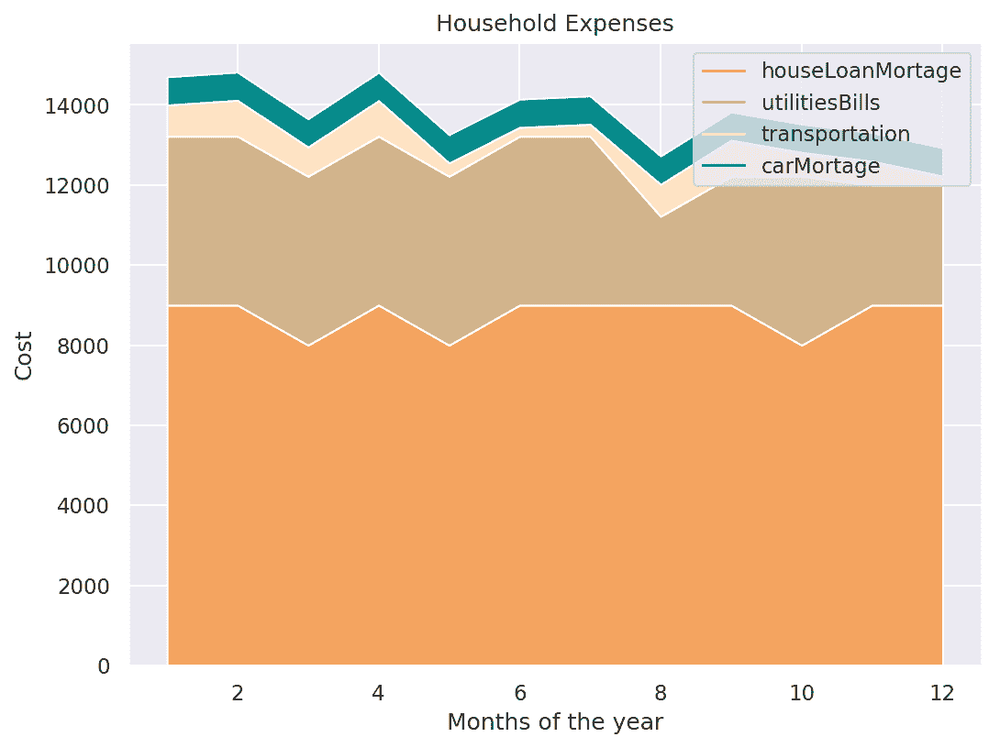

现在最重要的部分是解释图表的能力。在上图中，很明显，房屋抵押贷款是最大的支出，因为房屋抵押贷款的曲线下面积最大。其次，公用事业账单的面积占第二大面积，以此类推。图表清楚地向目标受众传播了有意义的信息。标签、图例和颜色是创建有意义的可视化的重要方面。

# 圆形分格统计图表

这是更有趣的数据可视化图形类型之一。我们说有趣不是因为它有更高的偏好或更强的说明能力，而是因为它是研究中最有争议的可视化类型之一。

伊恩·斯彭斯在 2005 年的一篇论文《不要卑微的馅饼:统计图的起源和使用》认为，馅饼图无法吸引大多数专家。尽管有类似的研究，人们仍然选择使用饼状图。社区给出了几个不遵守饼图的理由。其中一个论点是，人类天生不擅长一眼就能分辨出圆圈切片中的差异。另一个论点是，人们倾向于高估钝角的大小。同样，人们似乎低估了锐角的大小。

看了批评，我们也要有一些积极性。一个相反的论点是:如果饼状图不能沟通，为什么它会持续存在？主要原因是人们热爱圈子。此外，饼图的目的是传达比例，它被广泛接受。说够了；让我们使用口袋妖怪数据集绘制一个饼图。有两种方法可以加载数据:第一，直接从 GitHub URL 加载；或者您可以从 GitHub 下载数据集，并通过提供正确的路径从本地机器引用它。无论哪种情况，都可以使用`pandas`库中的`read_csv`方法。查看以下代码片段:

```py
# Create URL to JSON file (alternatively this can be a filepath)
url = 'https://raw.githubusercontent.com/hmcuesta/PDA_Book/master/Chapter3/pokemonByType.csv'

# Load the first sheet of the JSON file into a data frame
pokemon = pd.read_csv(url, index_col='type')

pokemon
```

前面的代码片段应该如下所示显示数据帧:


接下来，我们尝试绘制饼图:

```py
import matplotlib.pyplot as plt

plt.pie(pokemon['amount'], labels=pokemon.index, shadow=False, startangle=90, autopct='%1.1f%%',)
plt.axis('equal') 
plt.show()
```

我们应该从前面的代码中得到下面的饼图:

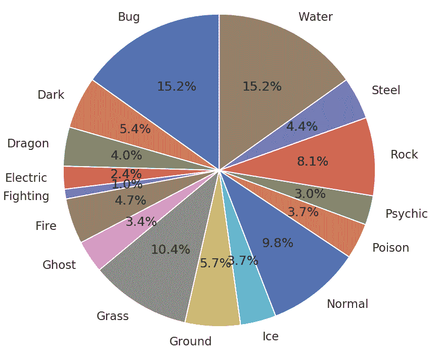

你知道可以直接使用`pandas`库创建饼图吗？检查以下一行:

```py
pokemon.plot.pie(y="amount", figsize=(20, 10))
```

生成的饼图如下:

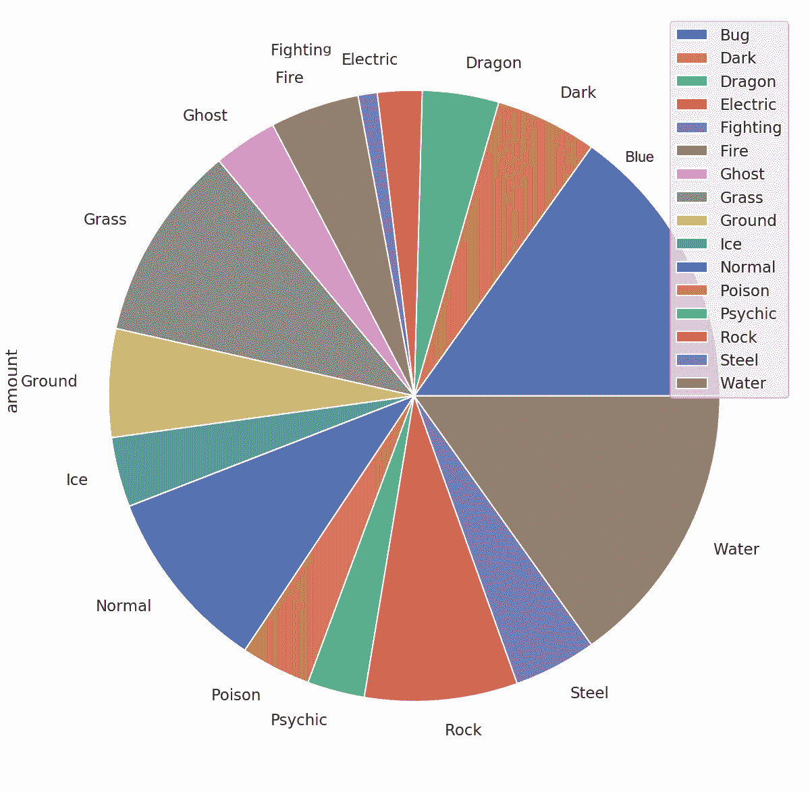

我们用一行代码生成了一个漂亮的带有图例的饼图。这就是为什么说 Python 是喜剧演员。你知道为什么吗？因为它有很多俏皮话。很真实，对吧？

# 表格图表

表格图表结合了条形图和表格。为了理解表格图表，让我们考虑以下数据集。考虑不同瓦特数的标准发光二极管灯泡。标准的飞利浦发光二极管灯泡可以是 4.5 瓦、6 瓦、7 瓦、8.5 瓦、9.5 瓦、13.5 瓦和 15 瓦。让我们假设有两个分类变量，即年份和瓦数，以及一个数字变量，即特定年份售出的单位数量。

现在，让我们声明变量来保存年份和可用瓦数数据。这可以如下面的代码片段所示完成:

```py
# Years under consideration
years = ["2010", "2011", "2012", "2013", "2014"]

# Available watt
columns = ['4.5W', '6.0W', '7.0W','8.5W','9.5W','13.5W','15W']
unitsSold = [
             [65, 141, 88, 111, 104, 71, 99],
             [85, 142, 89, 112, 103, 73, 98],
             [75, 143, 90, 113, 89, 75, 93],
             [65, 144, 91, 114, 90, 77, 92],
             [55, 145, 92, 115, 88, 79, 93],
            ]

# Define the range and scale for the y axis
values = np.arange(0, 600, 100)
```

我们现在已经准备好了数据集。现在，让我们尝试使用以下代码块绘制一个表格图表:

```py
colors = plt.cm.OrRd(np.linspace(0, 0.7, len(years)))
index = np.arange(len(columns)) + 0.3
bar_width = 0.7

y_offset = np.zeros(len(columns))
fig, ax = plt.subplots()

cell_text = []

n_rows = len(unitsSold)
for row in range(n_rows):
    plot = plt.bar(index, unitsSold[row], bar_width, bottom=y_offset, 
                   color=colors[row])
    y_offset = y_offset + unitsSold[row]
    cell_text.append(['%1.1f' % (x) for x in y_offset])
    i=0
# Each iteration of this for loop, labels each bar with corresponding value for the given year
    for rect in plot:
        height = rect.get_height()
        ax.text(rect.get_x() + rect.get_width()/2, y_offset[i],'%d' 
                % int(y_offset[i]), 
                ha='center', va='bottom')
        i = i+1 
```

最后，让我们将表格添加到图表的底部:

```py
# Add a table to the bottom of the axes
the_table = plt.table(cellText=cell_text, rowLabels=years, 
                rowColours=colors, colLabels=columns, loc='bottom')
plt.ylabel("Units Sold")
plt.xticks([])
plt.title('Number of LED Bulb Sold/Year')
plt.show()
```

前面的代码片段生成了一个漂亮的表格，如下所示:

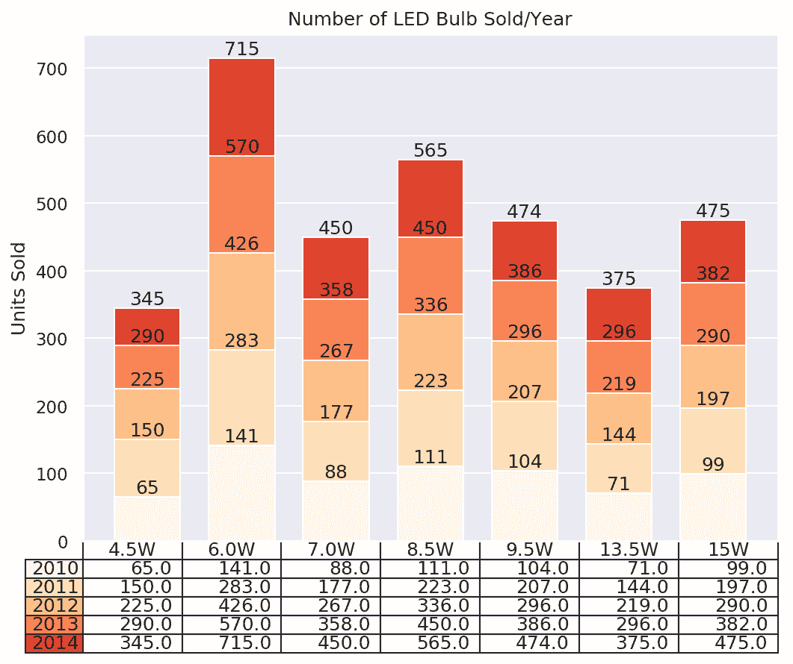

请看前面的表格。你认为它容易被解释吗？很清楚，对吧？例如，你可以看到，在 2014 年，4.5 瓦灯泡售出了 345 台。类似地，同样的信息可以从前面的图表中推断出来。

# 极区图

你还记得数学课上的极轴吗？嗯，极坐标图是绘制在极轴上的图表。它的坐标是角度和半径，与 x 和 y 坐标的笛卡尔系统相反。有时，它也被称为蜘蛛网情节。让我们看看如何绘制一个极坐标图的例子。

首先，让我们创建数据集:

1.  假设你一学年有五门课程:

```py
subjects = ["C programming", "Numerical methods", "Operating system", "DBMS", "Computer Networks"]
```

2.  并且你计划在每一科取得以下成绩:

```py
plannedGrade = [90, 95, 92, 68, 68, 90]
```

3.  然而，在你的期末考试后，这些是你的成绩:

```py
actualGrade = [75, 89, 89, 80, 80, 75]
```

现在数据集已经准备好了，让我们尝试创建一个极坐标图。第一个重要步骤是初始化蜘蛛图。这可以通过设置图形大小和极坐标投影来完成。现在应该清楚了。请注意，在前面的数据集中，等级列表包含一个额外的条目。这是因为它是一个环形图，我们需要将第一点和最后一点连接在一起，形成一个环形流。因此，我们从每个列表中复制第一个条目，并将其附加到列表中。在前面的数据中，条目 90 和 75 分别是列表的第一个条目。让我们看看每一步:

1.  导入所需的库:

```py
import numpy as np
import matplotlib.pyplot as plt
```

2.  准备数据集并设置`theta`:

```py
theta = np.linspace(0, 2 * np.pi, len(plannedGrade))
```

3.  用图形尺寸和极坐标投影初始化绘图:

```py
plt.figure(figsize = (10,6))
plt.subplot(polar=True)
```

4.  让网格线与每个主题名称对齐:

```py
(lines,labels) = plt.thetagrids(range(0,360, int(360/len(subjects))),
 (subjects))
```

5.  使用`plt.plot`方法绘制图形并填充其下的区域:

```py
plt.plot(theta, plannedGrade)
plt.fill(theta, plannedGrade, 'b', alpha=0.2)
```

6.  现在，我们绘制实际成绩:

```py
plt.plot(theta, actualGrade)
```

7.  我们在剧情中加入了一个传奇和一个通俗易懂的标题:

```py
plt.legend(labels=('Planned Grades','Actual Grades'),loc=1)
plt.title("Plan vs Actual grades by Subject")
```

8.  最后，我们在屏幕上展示剧情:

```py
plt.show()
```

生成的极坐标图如下图所示:

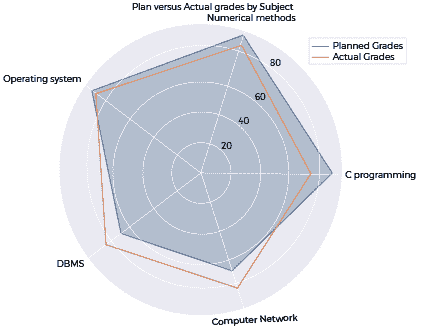

如前面的输出所示，按科目划分的计划成绩和实际成绩很容易区分。图例明确了哪一行表示计划成绩(截图中的蓝线)，哪一行表示实际成绩(截图中的橙线)。这向目标受众清楚地表明了学生的预测成绩和实际成绩之间的差异。

# 柱状图

直方图用于描述任何连续变量的分布。这些类型的图在统计分析中非常受欢迎。

考虑以下用例。在开发人员职业培训课程中进行的一项调查有 100 名参与者。他们有几年的 Python 编程经验，范围从 0 到 20。

让我们导入所需的库并创建数据集:

```py
import numpy as np
import matplotlib.pyplot as plt

#Create data set
yearsOfExperience = np.array([10, 16, 14, 5, 10, 11, 16, 14, 3, 14, 13, 19, 2, 5, 7, 3, 20,
       11, 11, 14, 2, 20, 15, 11, 1, 15, 15, 15, 2, 9, 18, 1, 17, 18,
       13, 9, 20, 13, 17, 13, 15, 17, 10, 2, 11, 8, 5, 19, 2, 4, 9,
       17, 16, 13, 18, 5, 7, 18, 15, 20, 2, 7, 0, 4, 14, 1, 14, 18,
        8, 11, 12, 2, 9, 7, 11, 2, 6, 15, 2, 14, 13, 4, 6, 15, 3,
        6, 10, 2, 11, 0, 18, 0, 13, 16, 18, 5, 14, 7, 14, 18])
yearsOfExperience
```

要绘制直方图，请执行以下步骤:

1.  绘制团队经验分布图:

```py
nbins = 20
n, bins, patches = plt.hist(yearsOfExperience, bins=nbins)
```

2.  向轴和标题添加标签:

```py
plt.xlabel("Years of experience with Python Programming")
plt.ylabel("Frequency")
plt.title("Distribution of Python programming experience in the vocational training session")
```

3.  在平均体验的图表中画一条绿色垂直线:

```py
plt.axvline(x=yearsOfExperience.mean(), linewidth=3, color = 'g') 
```

4.  显示图表:

```py
plt.show()
```

前面的代码生成了以下直方图:

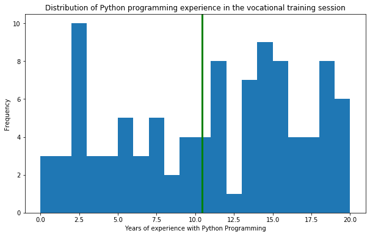

好多了，对吧？现在，从图表中，我们可以说参与者的平均经验是 10 年左右。我们能改进图表以获得更好的可读性吗？我们试着画出`yearsOfExperience`中所有条目总和的百分比怎么样？除此之外，我们还可以使用这些数据的平均值和标准偏差绘制一个正态分布来查看分布模式。如果您不确定正态分布是什么，我们建议您查阅[第 1 章](01.html)、*探索性数据分析基础*中的参考资料。简而言之，正态分布也被称为高斯分布。该术语表示关于平均值对称的概率分布，说明接近平均值的数据比远离平均值的数据更频繁。足够的理论；让我们开始练习吧。

为了绘制分布，我们可以在`plot.hist`函数中添加一个`density=1`参数。让我们检查一下代码。注意*步骤**1**4**5**6*有变化。代码的其余部分与前面的示例相同:

1.  绘制团队经验分布图:

```py
plt.figure(figsize = (10,6))

nbins = 20
n, bins, patches = plt.hist(yearsOfExperience, bins=nbins, density=1)
```

2.  向轴和标题添加标签:

```py
plt.xlabel("Years of experience with Python Programming")
plt.ylabel("Frequency")
plt.title("Distribution of Python programming experience in the vocational training session")
```

3.  在平均体验的图表中画一条绿色垂直线:

```py
plt.axvline(x=yearsOfExperience.mean(), linewidth=3, color = 'g') 
```

4.  计算数据集的平均值和标准偏差:

```py
mu = yearsOfExperience.mean()
sigma = yearsOfExperience.std()
```

5.  为正态分布添加一条最佳拟合线:

```py
y = ((1 / (np.sqrt(2 * np.pi) * sigma)) * np.exp(-0.5 * (1 / sigma * (bins - mu))**2))
```

6.  绘制正态分布:

```py
plt.plot(bins, y, '--')
```

7.  显示图表:

```py
plt.show()
```

生成的正态分布直方图如下:

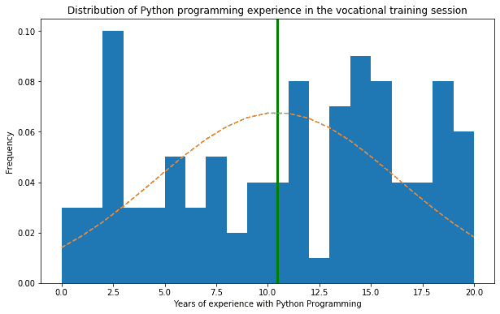

前面的图清楚地说明了它不遵循正态分布。正态分布的最佳拟合曲线上下有许多竖线。也许你想知道在前面的代码中，我们从哪里得到计算步骤 6 的公式。这里涉及到一个小理论。当我们提到正态分布时，我们可以利用`((1 / (np.sqrt(2 * np.pi) * sigma)) * np.exp(-0.5 * (1 / sigma * (bins - mu))**2))`给出的高斯分布函数来计算概率密度函数。

# 棒棒糖图表

棒棒糖图表可以用来显示数据中的排名。它类似于有序条形图。

让我们考虑`carDF`数据集。它可以在第 2 章的 GitHub 存储库中找到。或者，可以直接从 GitHub 链接使用它，如以下代码中所述:

1.  加载数据集:

```py
#Read the dataset

carDF = pd.read_csv('https://raw.githubusercontent.com/PacktPublishing/hands-on-exploratory-data-analysis-with-python/master/Chapter%202/cardata.csv')
```

2.  通过`manufacturer`对数据集进行分组。现在，如果没有意义，请记住以下代码片段按特定字段对条目进行分组(我们将在[第 4 章](04.html) *【数据转换】*中详细介绍`groupby`功能):

```py
#Group by manufacturer and take average mileage
processedDF = carDF[['cty','manufacturer']].groupby('manufacturer').apply(lambda x: x.mean())
```

3.  按`cty`对值进行排序并重置`index`(再次，我们将在[第 4 章](04.html) *【数据转换】*中进行排序以及如何重置索引):

```py
#Sort the values by cty and reset index
processedDF.sort_values('cty', inplace=True)
processedDF.reset_index(inplace=True)
```

4.  绘制图表:

```py
#Plot the graph
fig, ax = plt.subplots(figsize=(16,10), dpi= 80)
ax.vlines(x=processedDF.index, ymin=0, ymax=processedDF.cty, color='firebrick', alpha=0.7, linewidth=2)
ax.scatter(x=processedDF.index, y=processedDF.cty, s=75, color='firebrick', alpha=0.7)
```

5.  注释标题:

```py
#Annotate Title
ax.set_title('Lollipop Chart for Highway Mileage using car dataset', fontdict={'size':22})
```

6.  标注标签、`xticks`和`ylims`:

```py
ax.set_ylabel('Miles Per Gallon')
ax.set_xticks(processedDF.index)
ax.set_xticklabels(processedDF.manufacturer.str.upper(), rotation=65, fontdict={'horizontalalignment': 'right', 'size':12})
ax.set_ylim(0, 30)
```

7.  在图中写出实际平均值，并显示图:

```py
#Write the values in the plot
for row in processedDF.itertuples():
    ax.text(row.Index, row.cty+.5, s=round(row.cty, 2), horizontalalignment= 'center', verticalalignment='bottom', fontsize=14)

#Display the plot on the screen
plt.show()
```

由前面的代码片段生成的棒棒糖图表如下:

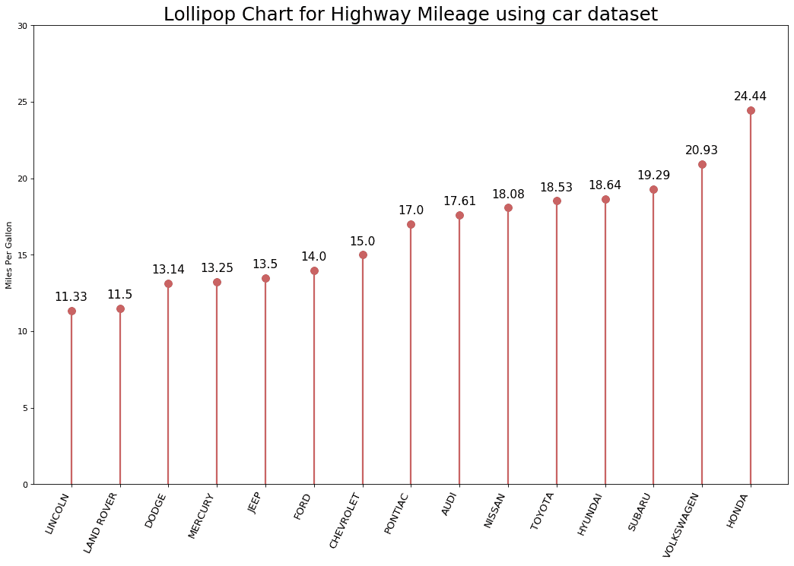

看了前面的输出，你现在知道为什么叫棒棒糖图了吧？顶部的线条和圆圈很好地说明了不同类型的汽车及其相关的每加仑行驶里程。现在，数据更有意义了，不是吗？

# 选择最佳图表

没有标准定义您应该选择哪个图表来可视化您的数据。然而，有一些指导方针可以帮助你。以下是其中的一些:

*   正如我们之前看到的每个图表所提到的，了解您拥有的数据类型非常重要。如果你有连续变量，那么直方图将是一个很好的选择。同样，如果你想显示排名，一个有序的条形图将是一个很好的选择。
*   选择有效传达数据正确和相关含义的图表，而不实际扭曲事实。

*   简单是最好的。画一张简单易懂的图表被认为比画复杂的图表更好，复杂的图表需要几份报告和文本才能理解。
*   选择一个不会让观众信息过载的图表。我们的目的应该是清楚地说明抽象的信息。

话虽如此，让我们看看是否可以根据各种目的概括一些类别的图表。

下表根据用途显示了不同类型的图表:

| **目的** | **图表** |
| 显示相关性 | 散点图相关图成对图随着带状图抖动计数图边缘直方图带有最佳拟合线的散点图带圆圈的气泡图 |
| 显示偏差 | 对比图分叉杆发散文本发散点图带有标记的分叉棒棒糖图 |
| 显示分布 | 连续变量直方图分类变量直方图密度图分类图直方图密度曲线人口金字塔小提琴情节欢乐情节分布点图箱线图 |
| 显示作文 | 华夫饼图表圆形分格统计图表树图条形图 |
| 显示更改 | 时间序列图带波峰和波谷注释的时间序列自相关图互相关图多重时间序列使用次级 *y* 轴绘制不同比例堆叠面积图季节性地块日历热图未堆叠的面积图 |
| 显示组 | 系统树图聚类图安德鲁斯曲线平行坐标 |
| 显示排名 | 有序条形图棒棒糖图表点图坡度图哑铃图 |

请注意，浏览表中提到的每一种情节都超出了本书的范围。然而，我们试图在本章中涵盖其中的大部分内容。其中一些将在接下来的章节中使用；我们将以更符合上下文的方式和高级设置来使用这些图表。

# 要探索的其他库

到目前为止，我们已经看到了使用`matplotlib`和`seaborn`的不同类型的 2D 和三维可视化技术。除了这些广泛使用的 Python 库，您还可以探索其他库:

*   `Ploty`([https://plot.ly/python/](https://plot.ly/python/)):这是一个基于网络应用的可视化工具包。它为 Jupyter Notebook 和其他应用程序提供的 API 使其非常强大，可以表示 2D 和 3D 图表。
*   `Ggplot`([http://ggplot.yhathq.com/](http://ggplot.yhathq.com/)):这是基于 R 编程语言的*Graphics*库的 Python 实现。
*   `Altair`([https://altair-viz.github.io/](https://altair-viz.github.io/)):这是建立在强大的 Vega-Lite 可视化语法之上，遵循非常声明性的统计可视化库技术。除此之外，它还有一个非常描述性和简单的 API。

# 摘要

一方面，以图形的方式描绘任何数据、事件、概念、信息、过程或方法总是被认为具有高度的理解力，另一方面，也很容易销售。向涉众展示结果是非常复杂的，因为我们的受众可能没有足够的技术来理解编程术语和技术细节。因此，视觉辅助工具被广泛使用。在本章中，我们讨论了如何使用这样的数据可视化工具。

在下一章中，我们将以一种非常简单的方式开始探索性数据分析。我们将尝试分析我们的邮箱，并分析我们发送和接收的电子邮件类型。

# 进一步阅读

*   *Matplotlib 3.0 食谱*，*斯里尼瓦萨·拉奥·波拉迪*，*帕克特出版*，2018 年 10 月 22 日
*   *Matplotlib 标绘食谱**亚历山大·德弗特***T5*帕克特出版*，2014 年 3 月 26 日**
*   *Python 数据可视化**马里奥·德布勒**蒂姆·格罗曼**帕克特出版*，2019 年 2 月 28 日
*   《没有卑微的馅饼:统计图的起源和使用》，伊恩·斯彭斯，*多伦多大学*，2005 年。