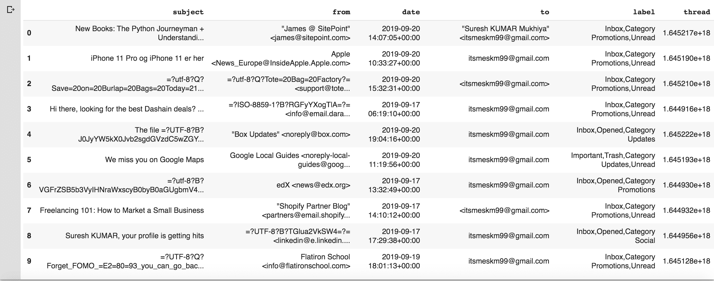
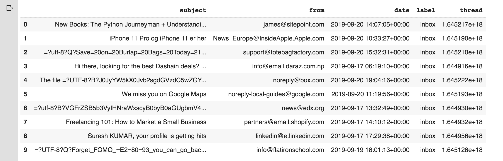
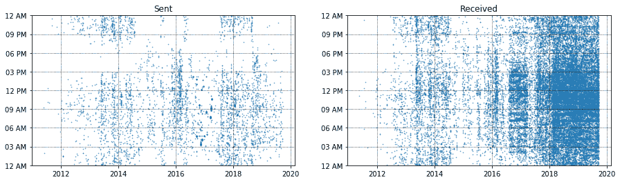
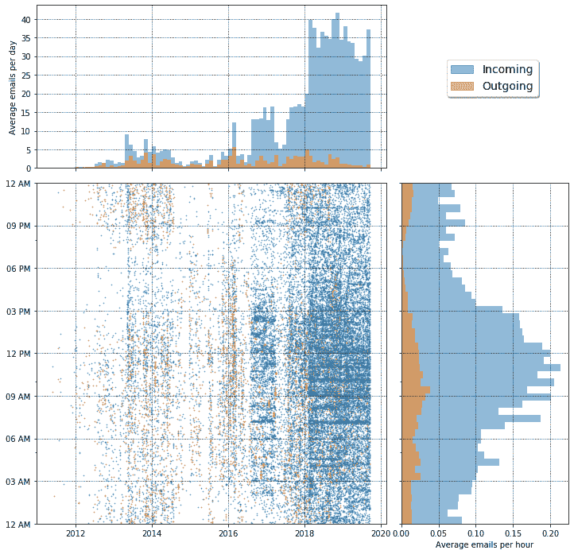
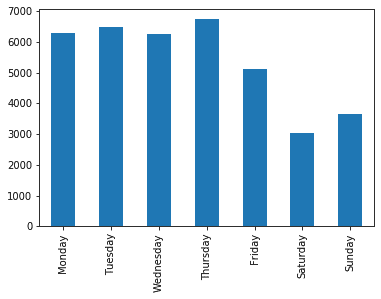
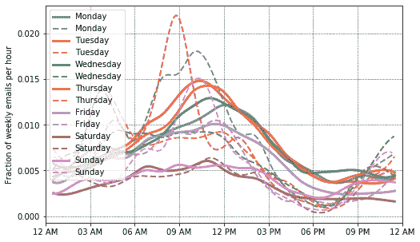

# 个人电子邮件电子设计自动化

从数据集探索有用的见解需要大量的思考以及高水平的经验和实践。您处理不同类型的数据集越多，您在理解可以挖掘的见解类型方面获得的经验就越多。例如，如果您处理过文本数据集，您会发现您可以挖掘许多关键词、模式和短语。类似地，如果您处理过时间序列数据集，那么您将会理解您可以挖掘与周、月和季节相关的模式。这里的要点是，你练习得越多，你就越能理解可以提取的洞见类型和可以完成的可视化类型。话虽如此，在本章中，我们将使用我们自己的一个电子邮件数据集并执行**探索性数据分析** ( **EDA** )。

您将了解如何将所有电子邮件导出为数据集，如何在Pandas数据框中使用导入，如何可视化它们，以及您可以获得的不同类型的见解。

在本章中，我们将涵盖以下主题:

*   正在加载数据集
*   数据转换
*   数据分析
*   进一步阅读建议

# 技术要求

本章的代码可以在`Chapter 3`文件夹中与本书共享的 GitHub 存储库中找到。这个数据集由我个人 Gmail 账户中的电子邮件数据组成。由于隐私问题，无法与您共享数据集。但是，在本章中，我们将指导您如何从 Gmail 下载自己的电子邮件来执行初始数据分析。

以下是要遵循的步骤:

1.  登录您的个人 Gmail 帐户。
2.  转到以下链接:[https://takeout.google.com/settings/takeout](https://takeout.google.com/settings/takeout)。
3.  取消选择除 Gmail 以外的所有项目，如下图所示:


4.  选择归档格式，如下图所示:


注意我选择了**通过邮件发送下载链接**、**一次性存档**、**。拉链**，最大允许尺寸。您可以自定义格式。完成后，点击**创建档案**。

您将获得一个可供下载的电子邮件存档。您可以使用`mbox`文件的路径进行进一步分析，这将在本章中讨论。

现在让我们加载数据集。

# 正在加载数据集

首先，下载数据集至关重要。按照*技术要求*部分的上述步骤，下载数据。Gmail([https://takeout.google.com/settings/takeout](https://takeout.google.com/settings/takeout))提供`mbox`格式的数据。对于这一章，我从谷歌邮件加载了我自己的个人电子邮件。出于隐私原因，我无法共享数据集。但是，我将向您展示您可以执行的不同 EDA 操作，以分析您的电子邮件行为的几个方面:

1.  让我们加载所需的库:

```py
import numpy as np
import pandas as pd
import matplotlib.pyplot as plt
```

Note that for this analysis, we need to have the `mailbox` package installed. If it is not installed on your system, it can be added to your Python build using the `pip install mailbox` instruction.

2.  加载库后，加载数据集:

```py
import mailbox

mboxfile = "PATH TO DOWNLOADED MBOX FIL"
mbox = mailbox.mbox(mboxfile)
mbox
```

请注意，用您自己的路径替换`mbox`文件路径是很重要的。

前面代码的输出如下:

```py
<mailbox.mbox at 0x7f124763f5c0>
```

输出表明邮箱已成功创建。

3.  接下来，让我们看看可用密钥的列表:

```py
for key in mbox[0].keys():
  print(key)
```

前面代码的输出如下:

```py
X-GM-THRID
X-Gmail-Labels
Delivered-To
Received
X-Google-Smtp-Source
X-Received
ARC-Seal
ARC-Message-Signature
ARC-Authentication-Results
Return-Path
Received
Received-SPF
Authentication-Results
DKIM-Signature
DKIM-Signature
Subject
From
To
Reply-To
Date
MIME-Version
Content-Type
X-Mailer
X-Complaints-To
X-Feedback-ID
List-Unsubscribe
Message-ID
```

前面的输出显示了提取的数据集中存在的键的列表。

# 数据转换

虽然提取的数据返回了很多对象，但是我们并不需要所有的项目。我们将只提取必填字段。数据清理是数据分析阶段的重要步骤之一。对于我们的分析，我们只需要以下数据:*主题、开始、日期、结束、标签、*和*线程*。

让我们在下面几节中看看数据转换中涉及的所有步骤。

# 数据清理

让我们创建一个只有必填字段的 CSV 文件。让我们从以下步骤开始:

1.  导入`csv`包:

```py
import csv
```

2.  创建仅包含所需属性的 CSV 文件:

```py
with open('mailbox.csv', 'w') as outputfile:
 writer = csv.writer(outputfile)
  writer.writerow(['subject','from','date','to','label','thread'])

  for message in mbox:
    writer.writerow([
      message['subject'], 
      message['from'], 
      message['date'], 
      message['to'], 
      message['X-Gmail-Labels'], 
      message['X-GM-THRID']
    ]
  )
```

前面的输出是一个名为`mailbox.csv`的`csv`文件。接下来，我们可以使用比原始数据集更小的 CSV 文件进行加载，而不是加载 mbox 文件。

# 正在加载 CSV 文件

我们将加载 CSV 文件。请参考以下代码块:

```py
dfs = pd.read_csv('mailbox.csv', names=['subject', 'from', 'date', 'to', 'label', 'thread'])
```

前面的代码将生成一个 pandas 数据帧，其中只有必填字段存储在 CSV 文件中。

# 转换日期

接下来，我们将转换日期。

检查每列的数据类型，如下所示:

```py
dfs.dtypes
```

前面代码的输出如下:

```py
subject object
from object
date object
to object
label object
thread float64
dtype: object
```

注意，日期字段是一个对象。因此，我们需要将其转换为 DateTime 参数。在下一步中，我们将把日期字段转换成实际的日期时间参数。我们可以通过Pandas`to_datetime()`方法做到这一点。请参见以下代码:

```py
dfs['date'] = dfs['date'].apply(lambda x: pd.to_datetime(x, errors='coerce', utc=True))
```

让我们进入下一步，即从字段中删除 NaN 值。

# 正在删除 NaN 值

接下来，我们将从字段中删除 NaN 值。

我们可以这样做:

```py
dfs = dfs[dfs['date'].notna()]
```

接下来，最好将预处理文件保存到一个单独的 CSV 文件中，以防我们再次需要它。我们可以将数据帧保存到一个单独的 CSV 文件中，如下所示:

```py
dfs.to_csv('gmail.csv')
```

太好了。完成后，让我们做一些描述性的统计。

# 应用描述性统计

预处理数据集后，让我们使用描述性统计技术进行一些健全性检查。

我们可以实现如下所示:

```py
dfs.info()
```

前面代码的输出如下:

```py
<class 'pandas.core.frame.DataFrame'>
Int64Index: 37554 entries, 1 to 78442
Data columns (total 6 columns):
subject 37367 non-null object
from 37554 non-null object
date 37554 non-null datetime64[ns, UTC]
to 36882 non-null object
label 36962 non-null object
thread 37554 non-null object
dtypes: datetime64[ns, UTC](1), object(5)
memory usage: 2.0+ MB
```

我们将在[第 5 章](05.html)*描述性统计中了解更多关于描述性统计的信息。*请注意，共有 37，554 封电子邮件，每封电子邮件包含六列—主题、开始日期、结束日期、标签和主题。让我们检查电子邮件数据集的前几个条目:

```py
dfs.head(10)
```

前面代码的输出如下:



请注意，到目前为止，我们的数据框包含六个不同的列。看一下`from`字段:它包含姓名和电子邮件。对于我们的分析，我们只需要一个电子邮件地址。我们可以使用正则表达式重构列。

# 数据重构

我们注意到`from`字段包含的信息比我们需要的要多。我们只需要从那个字段中提取一个电子邮件地址。让我们做一些重构:

1.  首先，导入正则表达式包:

```py
import re
```

2.  接下来，让我们创建一个函数，从任何一列中提取整个字符串并提取一个电子邮件地址:

```py
def extract_email_ID(string):
  email = re.findall(r'<(.+?)>', string)
  if not email:
    email = list(filter(lambda y: '@' in y, string.split()))
  return email[0] if email else np.nan
```

前面的函数很简单，对吧？我们使用正则表达式来查找电子邮件地址。如果没有电子邮件地址，我们用`NaN`填充该字段。好吧，如果你不确定正则表达式，别担心。只需阅读*附录*。

3.  接下来，让我们将该函数应用于`from`列:

```py
dfs['from'] = dfs['from'].apply(lambda x: extract_email_ID(x))
```

我们使用 lambda 函数将该函数应用于列中的每个值。

4.  接下来，我们将重构`label`字段。逻辑很简单。如果一封电子邮件来自你的电子邮件地址，那么它就是*发送的*电子邮件。否则，它是收到的电子邮件，即收件箱电子邮件:

```py
myemail = 'itsmeskm99@gmail.com'
dfs['label'] = dfs['from'].apply(lambda x: 'sent' if x==myemail else 'inbox')
```

前面的代码是不言自明的。

# 删除列

让我们删除一列:

1.  注意`to`栏只包含你自己的邮件。所以，我们可以去掉这个无关紧要的栏目:

```py
dfs.drop(columns='to', inplace=True)
```

2.  这将从数据框中删除`to`列。现在让我们显示前 10 个条目:

```py
dfs.head(10)
```

前面代码的输出如下:



检查前面的输出。田地被打扫了。数据被转换成正确的格式。

# 重构时区

接下来，我们希望基于我们的时区重构时区:

1.  我们可以使用这里给出的方法重构时区:

```py
import datetime 
import pytz

def refactor_timezone(x):
  est = pytz.timezone('US/Eastern')
  return x.astimezone(est)
```

请注意，在前面的代码中，我将时区转换为美国/东方时区。你可以选择你喜欢的时区。

2.  现在我们的函数已经创建，让我们称之为:

```py
dfs['date'] = dfs['date'].apply(lambda x: refactor_timezone(x))
```

3.  接下来，我们要将星期几变量转换为日的名称，如、`Saturday`、`Sunday`等。我们可以这样做，如下所示:

```py
dfs['dayofweek'] = dfs['date'].apply(lambda x: x.weekday_name)
dfs['dayofweek'] = pd.Categorical(dfs['dayofweek'], categories=[
    'Monday', 'Tuesday', 'Wednesday', 'Thursday', 'Friday',
    'Saturday', 'Sunday'], ordered=True)
```

4.  太好了。接下来，我们在一天中的这个时间做同样的过程。请参见这里给出的片段:

```py
dfs['timeofday'] = dfs['date'].apply(lambda x: x.hour + x.minute/60 + x.second/3600)
```

5.  接下来，我们分别重构小时、年整数和年分数。首先，重构小时，如下所示:

```py
dfs['hour'] = dfs['date'].apply(lambda x: x.hour)
```

6.  重构年整数，如下所示:

```py
dfs['year_int'] = dfs['date'].apply(lambda x: x.year)
```

7.  最后，重构年分数，如下所示:

```py
dfs['year'] = dfs['date'].apply(lambda x: x.year + x.dayofyear/365.25)
```

8.  完成后，我们可以将日期设置为`index`，并且不再需要原始的`date`字段。所以，我们可以去掉它:

```py
dfs.index = dfs['date']
del dfs['date']
```

太好了。到目前为止干得不错。我们已经成功执行了数据转换步骤。如果有些步骤不清楚，不要担心——我们将在接下来的章节中详细讨论这些阶段。

# 数据分析

这是 EDA 最重要的部分。这是我们从现有数据中获得见解的部分。

让我们逐一回答以下问题:

1.  在给定的时间范围内，我发送了多少封电子邮件？
2.  我在一天的什么时候用 Gmail 收发电子邮件？
3.  平均每天的电子邮件数量是多少？
4.  平均每小时的电子邮件数量是多少？
5.  我和谁交流最频繁？
6.  最活跃的电邮日是哪几天？
7.  我发邮件主要是为了什么？

在接下来的部分中，我们将回答前面的问题。

# 电子邮件数量

第一个问题的答案是，“在给定的时间范围内，我发送了多少封电子邮件？”，可以这样回答:

```py
print(dfs.index.min().strftime('%a, %d %b %Y %I:%M %p'))
print(dfs.index.max().strftime('%a, %d %b %Y %I:%M %p'))

print(dfs['label'].value_counts())
```

这里给出了前面代码的输出:

```py
Tue, 24 May 2011 11:04 AM
Fri, 20 Sep 2019 03:04 PM
inbox 32952
sent 4602
Name: label, dtype: int64
```

如果您分析输出，您会看到我们分析了从 2011 年 5 月 24 日星期二上午 11:04 到 2019 年 9 月 20 日下午 03:04 Fri 的电子邮件。在此期间，共收到 32，952 封电子邮件，发送了 4，602 封电子邮件。这是一个很好的见解，对不对？现在，让我们跳到下一个问题。

# 一天中的时间

要回答下一个问题，*我在一天的什么时间用 Gmail 收发邮件？*我们来创建一个图表。我们将查看发送的电子邮件和接收的电子邮件:

1.  让我们创建两个子数据框—一个用于发送的电子邮件，另一个用于接收的电子邮件:

```py
sent = dfs[dfs['label']=='sent']
received = dfs[dfs['label']=='inbox']
```

很明显，对吧？记住，我们早些时候设置了几个标签`sent`和`inbox`。现在，让我们创建一个情节。

2.  首先，让我们导入所需的库:

```py
import matplotlib.pyplot as plt
from matplotlib.ticker import MaxNLocator
from scipy import ndimage
import matplotlib.gridspec as gridspec
import matplotlib.patches as mpatches
```

3.  现在，让我们创建一个函数，将数据帧作为输入并创建一个图。请参见以下功能:

```py
def plot_todo_vs_year(df, ax, color='C0', s=0.5, title=''):
  ind = np.zeros(len(df), dtype='bool')
  est = pytz.timezone('US/Eastern')

  df[~ind].plot.scatter('year', 'timeofday', s=s, alpha=0.6, ax=ax, color=color)
  ax.set_ylim(0, 24)
  ax.yaxis.set_major_locator(MaxNLocator(8))
  ax.set_yticklabels([datetime.datetime.strptime(str(int(np.mod(ts, 24))), "%H").strftime("%I %p") for ts in ax.get_yticks()]);

  ax.set_xlabel('')
  ax.set_ylabel('')
  ax.set_title(title)
  ax.grid(ls=':', color='k')

  return ax
```

现在，您应该已经熟悉了如何创建散点图。我们在[第 2 章](02.html)、*EDA 视觉辅助*中详细讨论了这样做。如果你对某些术语感到困惑，建议你重温那一章。

4.  现在，让我们绘制收到和发送的电子邮件。查看这里给出的代码:

```py
fig, ax = plt.subplots(nrows=1, ncols=2, figsize=(15, 4))

plot_todo_vs_year(sent, ax[0], title='Sent')
plot_todo_vs_year(received, ax[1], title='Received')
```

前面代码的输出如下:



查看前面的图表。图形数据点的密度越高，电子邮件的数量就越多。请注意，发送的电子邮件数量少于接收的电子邮件数量。从 2018 年到 2020 年，我收到的电子邮件比我发送的还要多。请注意，我在下午 03:00 到上午 09:00 之间收到了大多数电子邮件。这个图表给出了一天中电子邮件活动时间的一个很好的概述。这回答了第二个问题。

# 每天和每小时的平均电子邮件数

让我们回答其余的问题，看看每天和每小时的平均电子邮件数量:

1.  为此，我们将创建两个函数，一个计算每天的电子邮件总数，另一个绘制每小时的平均电子邮件数:

```py
def plot_number_perday_per_year(df, ax, label=None, dt=0.3, **plot_kwargs):
    year = df[df['year'].notna()]['year'].values
    T = year.max() - year.min()
    bins = int(T / dt)
    weights = 1 / (np.ones_like(year) * dt * 365.25)
    ax.hist(year, bins=bins, weights=weights, label=label, **plot_kwargs);
    ax.grid(ls=':', color='k')
```

上面的代码创建了一个绘制平均每天电子邮件数量的函数。同样，让我们创建一个绘制每小时平均电子邮件数量的函数:

```py
def plot_number_perdhour_per_year(df, ax, label=None, dt=1, smooth=False,
                      weight_fun=None, **plot_kwargs):

    tod = df[df['timeofday'].notna()]['timeofday'].values
    year = df[df['year'].notna()]['year'].values
    Ty = year.max() - year.min()
    T = tod.max() - tod.min()
    bins = int(T / dt)
    if weight_fun is None:
        weights = 1 / (np.ones_like(tod) * Ty * 365.25 / dt)
    else:
        weights = weight_fun(df)
    if smooth:
        hst, xedges = np.histogram(tod, bins=bins, weights=weights);
        x = np.delete(xedges, -1) + 0.5*(xedges[1] - xedges[0])
        hst = ndimage.gaussian_filter(hst, sigma=0.75)
        f = interp1d(x, hst, kind='cubic')
        x = np.linspace(x.min(), x.max(), 10000)
        hst = f(x)
        ax.plot(x, hst, label=label, **plot_kwargs)
    else:
        ax.hist(tod, bins=bins, weights=weights, label=label, **plot_kwargs);

    ax.grid(ls=':', color='k')
    orientation = plot_kwargs.get('orientation')
    if orientation is None or orientation == 'vertical':
        ax.set_xlim(0, 24)
        ax.xaxis.set_major_locator(MaxNLocator(8))
        ax.set_xticklabels([datetime.datetime.strptime(str(int(np.mod(ts, 24))), "%H").strftime("%I %p")
                            for ts in ax.get_xticks()]);
    elif orientation == 'horizontal':
        ax.set_ylim(0, 24)
        ax.yaxis.set_major_locator(MaxNLocator(8))
        ax.set_yticklabels([datetime.datetime.strptime(str(int(np.mod(ts, 24))), "%H").strftime("%I %p")
                            for ts in ax.get_yticks()]);
```

现在，让我们创建一个类来绘制给定时间范围内所有电子邮件的时间与年份的关系:

```py
class TriplePlot:
  def __init__(self):
    gs = gridspec.GridSpec(6, 6)
    self.ax1 = plt.subplot(gs[2:6, :4])
    self.ax2 = plt.subplot(gs[2:6, 4:6], sharey=self.ax1)
    plt.setp(self.ax2.get_yticklabels(), visible=False);
    self.ax3 = plt.subplot(gs[:2, :4]) 
    plt.setp(self.ax3.get_xticklabels(), visible=False);

  def plot(self, df, color='darkblue', alpha=0.8, markersize=0.5, yr_bin=0.1, hr_bin=0.5):
    plot_todo_vs_year(df, self.ax1, color=color, s=markersize)
    plot_number_perdhour_per_year(df, self.ax2, dt=hr_bin, color=color, alpha=alpha, orientation='horizontal')
    self.ax2.set_xlabel('Average emails per hour')
    plot_number_perday_per_year(df, self.ax3, dt=yr_bin, color=color, alpha=alpha)
    self.ax3.set_ylabel('Average emails per day')
```

现在，最后，让我们实例化该类来绘制图表:

```py
import matplotlib.gridspec as gridspec
import matplotlib.patches as mpatches

plt.figure(figsize=(12,12));
tpl = TriplePlot()

tpl.plot(received, color='C0', alpha=0.5)
tpl.plot(sent, color='C1', alpha=0.5)
p1 = mpatches.Patch(color='C0', label='Incoming', alpha=0.5)
p2 = mpatches.Patch(color='C1', label='Outgoing', alpha=0.5)
plt.legend(handles=[p1, p2], bbox_to_anchor=[1.45, 0.7], fontsize=14, shadow=True);
```

前面代码的输出如下:



上图显示了每小时和每个图表的平均电子邮件数。就我而言，大多数电子邮件交流发生在 2018 年至 2020 年之间。

# 每天的电子邮件数量

让我们从电子邮件中找出一周中最忙的一天:

```py
counts = dfs.dayofweek.value_counts(sort=False)
counts.plot(kind='bar')
```

前面代码的输出如下:



前面的输出显示我最忙的一天是星期四。我在星期四收到大部分电子邮件。让我们更进一步，分别看看接收和发送电子邮件最活跃的日子:

```py
sdw = sent.groupby('dayofweek').size() / len(sent)
rdw = received.groupby('dayofweek').size() / len(received)

df_tmp = pd.DataFrame(data={'Outgoing Email': sdw, 'Incoming Email':rdw})
df_tmp.plot(kind='bar', rot=45, figsize=(8,5), alpha=0.5)
plt.xlabel('');
plt.ylabel('Fraction of weekly emails');
plt.grid(ls=':', color='k', alpha=0.5)
```

前面代码的输出如下:


截图中显示的输出相当不错，对吧？现在，任何人都可以很容易地理解，我最活跃的电子邮件交流日是周四接收电子邮件，周一发送电子邮件。有道理。我通常周末不工作，所以，在周一，我总是在开始一天之前回复我的电子邮件。分析显示，这就是为什么周一我会有更多的外发邮件。

我们甚至可以更进一步。让我们找到一天中最活跃的电子邮件交流时间。我们很容易做到。请参见以下代码:

```py
import scipy.ndimage
from scipy.interpolate import interp1d

plt.figure(figsize=(8,5))
ax = plt.subplot(111)
for ct, dow in enumerate(dfs.dayofweek.cat.categories):
    df_r = received[received['dayofweek']==dow]
    weights = np.ones(len(df_r)) / len(received)
    wfun = lambda x: weights
    plot_number_perdhour_per_year(df_r, ax, dt=1, smooth=True, color=f'C{ct}',
                      alpha=0.8, lw=3, label=dow, weight_fun=wfun)

    df_s = sent[sent['dayofweek']==dow]
    weights = np.ones(len(df_s)) / len(sent)
    wfun = lambda x: weights
    plot_number_perdhour_per_year(df_s, ax, dt=1, smooth=True, color=f'C{ct}',
                      alpha=0.8, lw=2, label=dow, ls='--', weight_fun=wfun)
ax.set_ylabel('Fraction of weekly emails per hour')
plt.legend(loc='upper left')
```

前面代码的输出如下:



太好了。这个图表有点复杂，但仍然很直观。从前面的图表中，我们注意到我最活跃的日子是星期一(发送电子邮件)和星期四(接收电子邮件)。此图显示，在星期一，我的活动持续时间在上午 09:00 到下午 12:00 之间。在星期四，我的活跃时间也在上午 9:00 到下午 12:00 之间。根据你的图表，你最活跃的时间是什么？

If you encounter any error, please check the number of sent emails and the number of received emails. The number of emails, in either case, should be greater than one. If you have less or equal to one email, in either case, make sure you comment out the appropriate line to remove the error.

# 最常用的词

关于你的电子邮件，最容易分析的事情之一是最常用的单词。我们可以创建一个单词云来查看最常用的单词。让我们首先删除存档的电子邮件:

```py
from wordcloud import WordCloud 

df_no_arxiv = dfs[dfs['from'] != 'no-reply@arXiv.org']
text = ' '.join(map(str, sent['subject'].values))
```

接下来，我们来绘制单词云:

```py
stopwords = ['Re', 'Fwd', '3A_']
wrd = WordCloud(width=700, height=480, margin=0, collocations=False)
for sw in stopwords:
    wrd.stopwords.add(sw)
wordcloud = wrd.generate(text)

plt.figure(figsize=(25,15))
plt.imshow(wordcloud, interpolation='bilinear')
plt.axis("off")
plt.margins(x=0, y=0)
```

我添加了一些额外的停止词来从图表中过滤掉。我的输出如下:


这告诉我我最常交流的是什么。从 2011 年到 2019 年的邮件分析来看，最常用的词是新词、网站、项目、数据、WordPress 和网站。这真的很好，对吗？本章介绍的只是一个起点。你可以在其他几个方向上更进一步。

# 摘要

在本章中，我们以 mbox 格式从我们自己的 Gmail 帐户导入数据。然后，我们加载数据集并执行一些原始的 EDA 技术，包括数据加载、数据转换和数据分析。我们还试图回答一些关于电子邮件交流的基本问题。

在下一章中，我们将讨论数据转换。数据转换是数据分析最重要的步骤之一，因为数据越定性，结果越好。

# 进一步阅读

*   *Pandas食谱:科学计算食谱*，*使用 Python 进行时间序列分析和数据可视化第一版*，作者: *Theodore Petrou，Packt 出版社，2017*
*   *掌握Pandas——第二版*，作者:*阿希什·库马尔，帕克特出版社，*2019 年 10 月 25 日
*   *学习Pandas——第二版*，作者:*迈克尔·海德特，帕克特出版社，*2017 年 6 月 29 日