# 描述统计学

在本章中，我们将探讨描述性统计及其各种技术。顾名思义，描述性统计通过提供与所提供的数据集相关的简短摘要来帮助描述和理解数据集。最常见的描述性统计类型包括中心倾向的度量、偏差的度量以及其他。在这一章中，我们将熟悉这些技术，并通过可视化来探索这些实际测量。我们将使用盒子图等工具从统计数据中获取知识。

在本章中，我们将涵盖以下主题:

*   理解统计
*   集中趋势测量
*   分散的度量

# 技术要求

本章的代码可以在本书的 GitHub 资源库[中找到，位于`Chapter 5`文件夹内:](https://github.com/PacktPublishing/hands-on-exploratory-data-analysis-with-python)

*   本章中使用的数据集可在 Kaggle 的开放访问下获得。可以从这里下载:[https://www.kaggle.com/toramky/automobile-dataset](https://www.kaggle.com/toramky/automobile-dataset)。

# 理解统计

在数据科学中，定性和定量分析都是重要的方面。特别是，任何数据集的定量分析都需要理解统计概念。统计学是数学的一个分支，研究收集、组织和解释数据。因此，通过使用统计概念，我们可以了解数据的性质、数据集的摘要以及数据的分布类型。

# 分布函数

为了理解分布函数的概念，理解连续函数的概念是至关重要的。那么，当我们提到一个**con****continuous****函数**时，我们指的是什么呢？基本上，连续函数是任何在值上没有任何意外变化的函数。这些突然或意外的变化被称为**不连续**。例如，考虑以下三次函数:

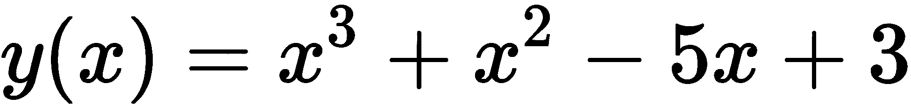

如果你画出这个函数的图，你会发现在这个系列的值中没有跳跃或空洞。因此，该功能是连续的:

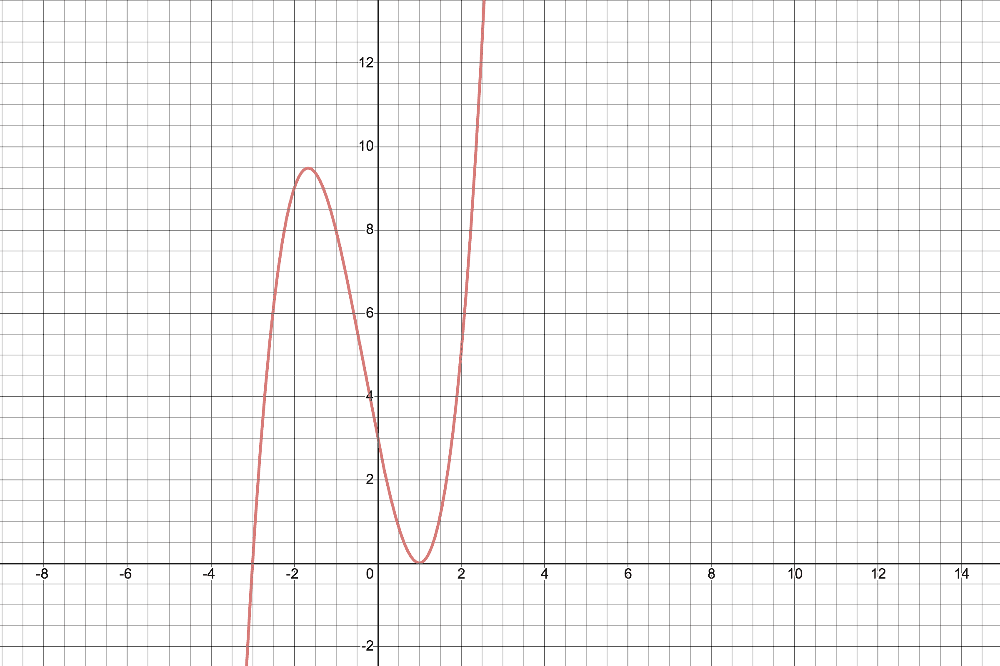

了解了连续函数之后，现在让我们试着了解一下**概率密度函数** ( **PDF** )是什么。PDF 可以用连续函数来定义，换句话说，对于任何连续函数，PDF 是变量具有 x 值的概率。

现在，如果你一直在关注，一个显而易见的问题应该会出现在你的脑海中。如果函数与离散的随机变量而不是连续的随机变量相关联呢？那么这个函数被称为概率质量函数**(**PMF**)。关于更正式的定义，请参考*中的参考文献【6】，进一步阅读*部分。**

 **离散随机变量的**概率** **能力** **分布**或**概率** **f** **函数**是一个概率列表，与每个可达到的值相关联。让我们假设一个随机变量，A，取实数区间上的所有值。然后，A 在结果列表 Z 中的概率，P(Z)，是在 Z 之上和描述满足以下条件的函数 p(a)的曲线之下的区域:

1.  曲线不能有负值(所有 a 的 p(a) > 0)。
2.  曲线下的总面积始终等于 1。

这种曲线被称为密度曲线。连续概率分布包括正态分布、指数分布、均匀分布、伽玛分布、泊松分布和二项式分布。

# 均匀分布

任何连续均匀分布的均匀概率分布函数由下式给出:

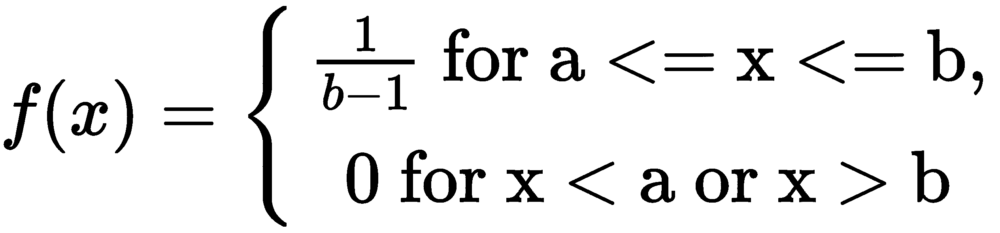

让我们使用 Python 库、seaborn 和 matplotlib 绘制均匀分布的图表。首先，让我们导入生成图形所需的重要库:

```py
import matplotlib.pyplot as plt
from IPython.display import Math, Latex
from IPython.core.display import Image
import seaborn as sns

sns.set(color_codes=True)
sns.set(rc={'figure.figsize':(10,6)})
```

现在，让我们生成一个均匀分布:

```py
from scipy.stats import uniform
number = 10000
start = 20
width = 25

uniform_data = uniform.rvs(size=number, loc=start, scale=width)
axis = sns.distplot(uniform_data, bins=100, kde=True, color='skyblue', hist_kws={"linewidth": 15})
axis.set(xlabel='Uniform Distribution ', ylabel='Frequency')
```

代码很明显，对吧？我们只需从统计库中导入统一函数并生成数据。一旦生成数据集，我们就绘制图表。前面代码的输出图如下:

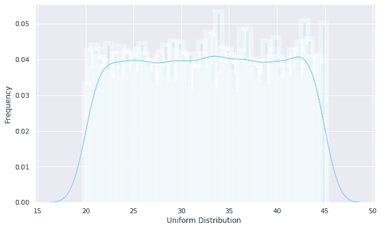

`uniform`函数用于在给定的开始位置(`loc`)和参数宽度(`scale`)之间生成一个统一的连续变量。`size`参数指定所考虑的随机变量的数量。该图说明了数据集是均匀分布的事实。

# 正态分布

**Norm** **al** **分布**，或 **Gaussia** **n** **分布**是一个函数，它将随机变量列表分布在一个形状像对称钟的图形中。我非常肯定，在你的数据科学生涯中，你会多次遇到这个术语。但是你了解它的概念吗？嗯，正态分布有一条关于其平均值对称的密度曲线，其分布通常由其标准差来定义。它有两个参数——均值和标准差。正态分布主要基于中心极限定理，这一事实使它具有相关性。如果一个总体中所有可能样本的大小为`n`，均值为`*μ*`，方差为`*σ2*`，则分布接近正态分布。数学上，给出如下:


现在，让我们看看如何使用 Python `stats`库绘制正态分布的插图:

```py
from scipy.stats import norm

normal_data = norm.rvs(size=90000,loc=20,scale=30)
axis = sns.distplot(normal_data, bins=100, kde=True, color='skyblue', hist_kws={"linewidth": 15,'alpha':0.568})
axis.set(xlabel='Normal Distribution', ylabel='Frequency')
```

前面代码的输出如下:

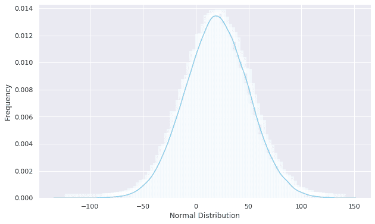

我们可以通过`norm.rvs()`方法使用`scipy.stats`模块得到正态分布图。它允许`loc`参数设置分布的平均值，`scale`参数设置标准差，最后`size`参数指示随机变量的数量。

# 指数分布

一些事件以恒定的平均速率连续独立发生的过程被称为**泊肃**T2【n】T3**点**T6】proT8 过程。指数分布描述了这种泊松点过程中事件之间的时间，指数分布的概率密度函数如下:

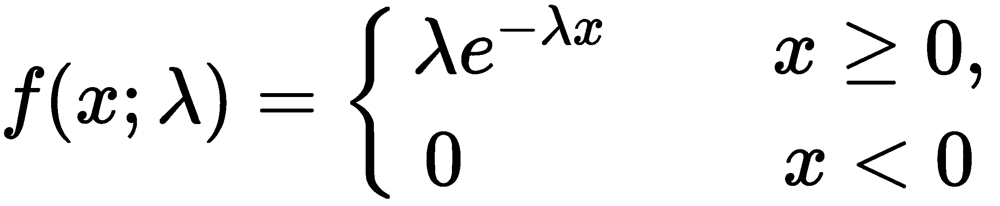

通过应用`expon.rvs()`函数，我们可以使用`scipy.stats`模块可视化指数分布的随机变量。检查以下代码:

```py
# Exponential distribution
from scipy.stats import expon

expon_data = expon.rvs(scale=1,loc=0,size=1000)
axis = sns.distplot(expon_data, kde=True, bins=100, color='skyblue', hist_kws={"linewidth": 15})
axis.set(xlabel='Exponential Distribution', ylabel='Frequency')
```

前面代码的输出如下:

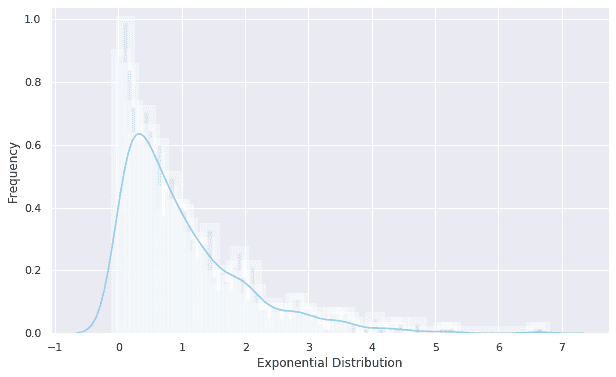

上图所示的图表说明了递减的指数函数。曲线在 *x* 轴上递减。

# 二项分布

顾名思义，二项式分布只有两种可能的结果，成功或失败。结果不需要同样可能，每个试验都是相互独立的。

让我们通过`binom`方法使用`scipy.stats`模块生成二项式分布图:

```py
from scipy.stats import binom

binomial_data = binom.rvs(n=10, p=0.8,size=10000)

axis = sns.distplot(binomial_data, kde=False, color='red', hist_kws={"linewidth": 15})
axis.set(xlabel='Binomial Distribution', ylabel='Frequency')
```

下图给出了上述代码的输出:

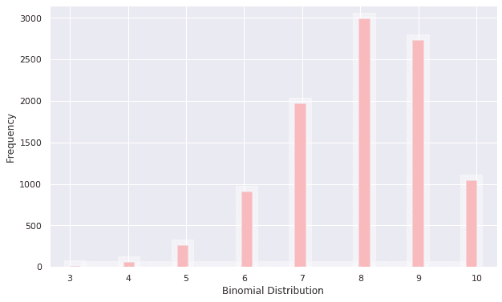

来自`scipy.stats`模块的`binom.rvs()`方法将`n`作为试参数，`p`作为成功概率作为形状参数生成图形。

# 累积分布函数

现在，**cumu******distribution****解决方案** **函数** ( **CDF** )是变量取小于等于`x`的值的概率。数学上，它写如下:**

 **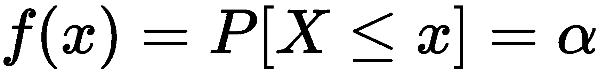

当分布是标量连续时，它提供 PDF 下的面积，范围从负无穷大到 CDF 指定多元随机变量的分布。

# 描述统计学

描述性统计处理简单的数据摘要的表述，以便清楚地理解它们。数据摘要可以是数字表示，也可以是简单图形的可视化，以便进一步理解。通常，这样的总结有助于统计分析的初始阶段。描述性统计有两种类型:

1.  集中趋势测量
2.  可变性的度量(扩散)

中心趋势的度量包括`mean`、`median`和`mode`，而可变性的度量包括`standard deviation`(或方差)、变量的最小值和最大值、`kurtosis`和`skewness`。我们将在下一节讨论这两个类别。

# 集中趋势测量

中心趋势的度量倾向于描述数据集的平均值或均值，该平均值或均值被认为提供了整个度量集的最佳汇总。该值在某种程度上是集合的核心。分析数据分布频率最常用的方法是平均值、中位数和众数。

# 平均值

平均值是一个数字，观察到的连续变量分布在这个数字周围。这个数字估计整个数据集的值。从数学上来说，它是数据集中数字的总和除以整数的结果。

设 x 是一组整数:

*x = (12，2，3，5，8，9，6，4，2)*

因此， *x* 的平均值可以计算如下:

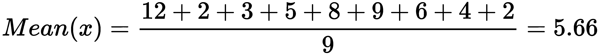

接下来，我们来看看中位数。

# 中位数

给定按升序或降序排序的数据集，中位数将数据分为两部分。计算中位数的一般公式如下:


这里，`n`是数据中的项数。计算中位数的步骤如下:

1.  以升序或降序对数字进行排序。
2.  如果`n`是奇数，求`(n+1)/2<sup>th</sup>`项。该术语对应的值是中位数。
3.  如果`n`为偶数，求`(n+1)/2<sup>th</sup>`项。中间值是中间位置两边数字的平均值。

对于`x`这样的一组整数，我们必须按照升序排列，然后选择中间的整数。

`x`按升序= (2，2，3，4，5，6，8，9，12)。

这里，中位数是 5。

# 方式

模式是在数据集中出现次数最多的整数。它恰好是数据集中出现频率最高的值。在中值示例的`x`数据集中，模式为 2，因为它在集合中出现两次。

Python 提供了不同的库来操作数据集中的描述性统计。常用的库有`pandas`、`numpy`、`scipy`。这些中心趋势的度量可以简单地通过`numpy`和`pandas`功能来计算。

为了实践描述性统计，我们需要一个包含多个数字记录的数据集。这是一个汽车数据集，收集了汽车的不同特征和属性，如象征、标准化损失、渴望和许多其他特征，对这些特征和属性的分析将提供一些与该数据集中的汽车相关的有价值的见解和发现。

让我们从导入所需的数据集和 Python 库开始:

```py
import pandas as pd
import numpy as np
```

现在，让我们加载汽车数据库:

```py
df = pd.read_csv("data.csv")
df.head()
```

在前面的代码中，我们假设数据库存储在当前驱动器中。或者，您可以将路径更改到正确的位置。到目前为止，您应该已经熟悉了数据加载技术。代码的输出如下所示:


Data cleaning:In the previous chapter, we discussed several ways in which we can clean our dataset. We need to clean numeric columns. Since we have already discussed several ways in which we can clean the dataset, I have skipped the codes for doing so. However, you can find a section entitled *Data cleaning* in the Python notebook attached to this chapter in the GitHub repository. 

现在，让我们从计算中心倾向的度量开始。在为所有行建立这些之前，让我们看看如何获得单个列的中心趋势。例如，我们希望获得代表高度的列的平均值、中间值和模式。在Pandas中，我们可以通过将列名指定为`dataframe["column_name"]`来轻松获得单个列。在我们的例子中，我们的数据帧存储在`df`变量中。因此，我们可以得到所有的身高数据项目作为`df["height"]`。现在，Pandas提供了简单的内置功能来测量中枢倾向。让我们这样计算:

```py
height =df["height"]
mean = height.mean()
median =height.median()
mode = height.mode()
print(mean , median, mode)
```

前面代码的输出如下:

```py
53.766666666666715 54.1 0 50.8
dtype: float64
```

现在，重要的是解释结果。光是这些简单的统计就可以明白，汽车的平均高度在`53.766`左右，模式值为`50.8`的汽车很多。同样，我们可以获得数据类型为数字的任何列的中心趋势的度量。下面的屏幕截图显示了类似的有用功能列表:

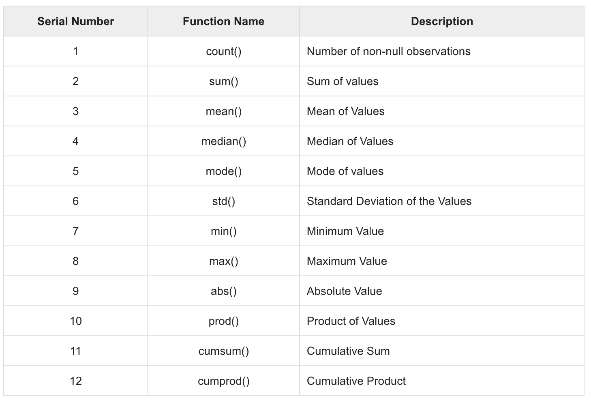

除了查找单个列的统计信息之外，还可以一次查找整个数据集的描述性统计信息。Pandas为此提供了一个非常有用的功能`df.describe`:

```py
df.describe()
```

下面的屏幕截图显示了前面代码的输出:

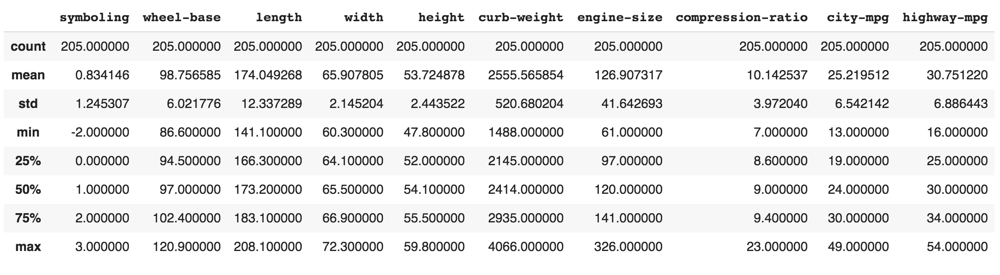

如果你以前用过Pandas，我很肯定你听说过或者可能用过几次这个功能。但是你真的了解你获得的输出吗？在上表中，您可以看到我们有所有列的统计数据，不包括 NaN 值。该函数在计算过程中同时考虑了数值序列和对象序列。在这些行中，我们得到该列的计数、平均值、标准偏差、最小值、百分位数和最大值。我们可以更好地理解我们的数据集。事实上，如果您查看前面的表格，您可以回答以下问题:

*   我们数据集中的总行数是多少？
*   汽车的平均长度、宽度、高度、价格和压缩比是多少？
*   汽车的最小高度是多少？汽车的最大高度是多少？
*   汽车整备质量的最大标准偏差是多少？。

事实上，我们现在可以回答很多问题，仅仅基于一张表。挺好的，对吧？现在，每当您开始任何数据科学工作时，执行一些健全性检查总是被认为是好的做法。我所说的健全性检查，是指在实际拟合机器学习模型之前了解你的数据。获取数据集的描述就是这样一种健全性检查。

在分类变量具有离散值的情况下，我们可以使用`value_counts()`函数来总结分类数据。嗯，身教胜于言教。在我们的数据集中，我们有一个分类数据列`make`。我们先按照这样的类别统计条目总数，然后取前 30 个最大值，画一个条形图:

```py
df.make.value_counts().nlargest(30).plot(kind='bar', figsize=(14,8))
plt.title("Number of cars by make")
plt.ylabel('Number of cars')
plt.xlabel('Make of the cars')
```

到目前为止，前面的代码应该很熟悉了。我们正在使用Pandas图书馆的`value_counts()`功能。一旦我们有了列表，我们就可以使用`nlargest()`函数获得前 30 个最大值。最后，我们利用Pandas图书馆提供的绘图功能。这里显示了前面代码片段的输出:

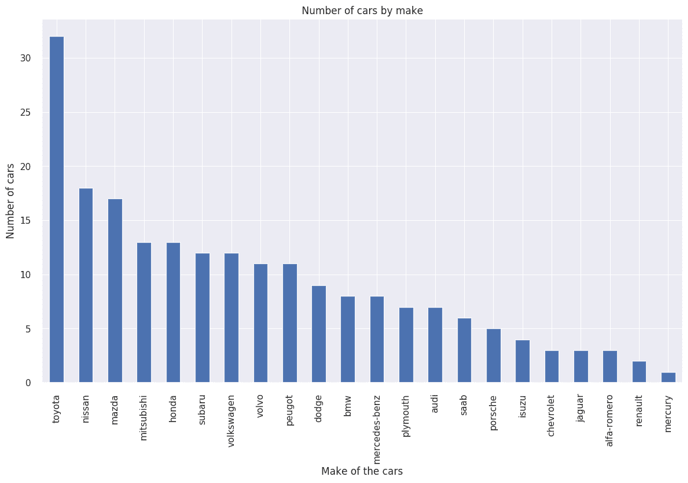

如图所示，表格很有帮助。为了增加理解的程度，我们可以使用可视化技术，如上图所示。从图表中可以很清楚地看出，丰田品牌是最受欢迎的品牌。同样，我们可以很容易地在列表中可视化连续的品牌。

# 分散的度量

第二类描述性统计是**离差**的度量，也称为**变异性的度量**。它用于描述数据集的可变性，数据集可以是样本或总体。它通常与中心趋势的度量结合使用，以提供一组数据的总体描述。对分散性/可变性/分散性的衡量让我们了解了中心趋势在多大程度上代表了数据。如果我们仔细分析数据集，有时平均值可能不是数据的最佳表示，因为当数据之间存在较大差异时，平均值会有所不同。在这种情况下，离差的度量将更准确地表示数据集中的可变性。

多种技术在我们的数据集中提供了分散的度量。一些常用的方法是标准差(或方差)、变量的最小值和最大值、范围、峰度和偏斜度。

# 标准偏差

用简单的语言来说，标准差是数据集中每个值与其平均值/均值之间的差值的平均值/均值；也就是说，数据是如何从平均值展开的。如果数据集的标准偏差较低，则数据点倾向于接近数据集的平均值，否则，数据点分布在更大的值范围内。

不同的 Python 库都有获取数据集标准差的函数。NumPy 库具有`numpy.std(dataset)`功能。统计库有`statistics.stdev(dataset)`。功能。使用 pandas 库，我们使用`df.std()`函数计算`df`数据框中的标准偏差:

```py
#standard variance of dataset using std() function
std_dev =df.std()
print(std_dev)
# standard variance of the specific column
sv_height=df.loc[:,"height"].std()
print(sv_height)
```

前面代码的输出如下:

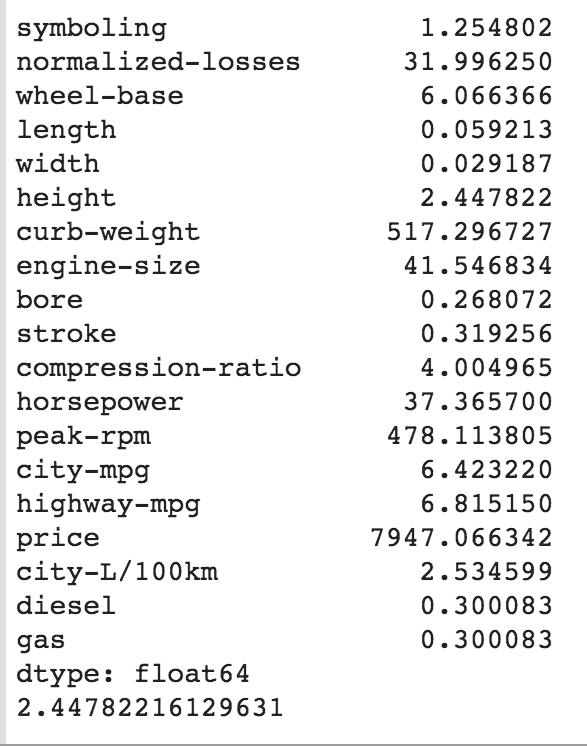

接下来，让我们看看方差。

# 差异

方差是数据集中每个值与其平均值/均值之差的平均值/均值的平方；也就是说，它是标准差的平方。

不同的 Python 库都有获取数据集方差的函数。NumPy 库具有`numpy.var(dataset)`功能。统计库具有`statistics.variance(dataset)`功能。使用Pandas库，我们使用`df.var()`函数计算`df`数据框中的方差:

```py
# variance of dataset using var() function
variance=df.var()
print(variance)

# variance of the specific column
var_height=df.loc[:,"height"].var()
print(var_height)
```

前面代码的输出如下:

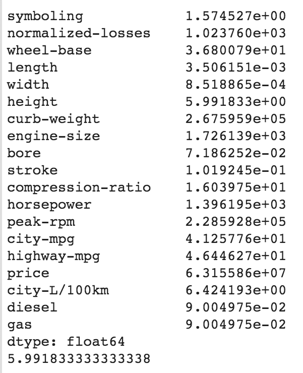

有必要从这里提供的代码片段中注意到以下观察结果:

*   需要注意的是`df.var()`默认情况下会计算给定数据帧中跨列的方差。另外，我们可以指定`axis=0`表示需要按列或按行计算方差。
*   指定`df.var(axis=1)`将计算给定数据帧中的行方向方差。
*   最后，还可以通过指定位置来计算任何特定列中的方差。例如，`df.loc[:,"height"].var()`计算前面数据集中列高度的方差。

# 歪斜

在概率论和统计学中，偏斜度是数据集中变量关于其平均值的不对称性的度量。偏斜度值可以是正的或负的，或者是未定义的。偏斜度值告诉我们数据是偏斜的还是对称的。下面是一个正倾斜数据集、对称数据和一些负倾斜数据的示例:

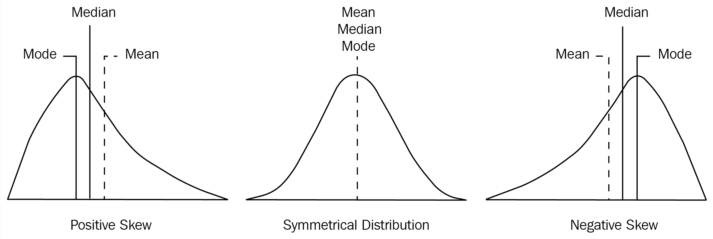

请注意上图中的以下观察结果:

*   右边的图的尾巴比右边的长。这表明数据的分布向左倾斜。如果选择左侧长尾巴中的任何一点，平均值小于模式。这种情况被称为**负** **偏度**。
*   左侧的图表在右侧有一条较长的尾巴。如果选择右侧尾部的任何点，平均值大于模式。这种情况被称为**正** **偏度**。
*   中间的图有一个右手边的尾巴，和左手边的尾巴一样。这种状态被称为**对称状态**。

不同的 Python 库都有获取数据集偏斜度的函数。SciPy 库有一个`scipy.stats.skew(dataset)`功能。使用Pandas库，我们可以使用`df.skew()`函数计算`df`数据帧中的偏斜度。

这里，在我们的汽车数据框架中，让我们使用`df.skew()`函数来获得偏斜度:

```py
df.skew()
```

前面代码的输出如下:

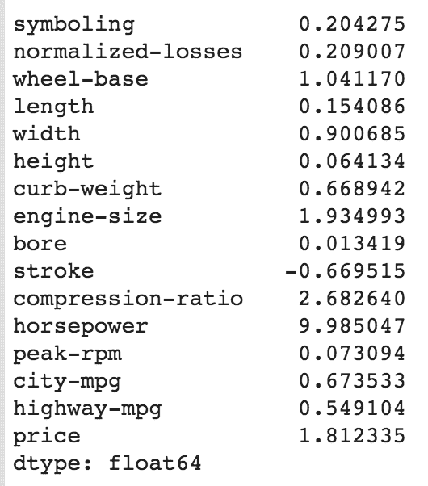

此外，我们还可以在列级别计算偏斜。例如，柱高的偏斜可以使用`df.loc[:,"height"].skew()`来计算。功能。

# 峭度

我们已经讨论过正态分布。你还记得钟形图吗？如果没有，就再看一遍本章的第一节。你很可能会问自己，你为什么要记得这些？为了理解峰度的概念，这是必要的。基本上，峰度是一个统计量，说明分布的尾部与正态分布的尾部有多大的不同。这种技术可以识别给定的分布是否包含极值。

But hold on, isn't that similar to what we do with skewness? Not really. Skewness typically measures the symmetry of the given distribution. On the other hand, kurtosis measures the heaviness of the distribution tails. 

峰度，不像偏斜度，不是关于峰值或平坦度。它是给定分布中异常值存在的度量。峰度的高低都是数据需要进一步调查的指标。峰度越高，异常值越高。

# 峰度类型

峰度有三种类型——中峰度、细峰度和扁峰度。让我们一个一个来看:

*   **中库分布**:如果任何数据集遵循正态分布，则它遵循中库分布。峰度在 0 左右。
*   **细峰度**:这种情况下，分布的峰度大于 3，肥尾表示分布产生更多的异常值。
*   **板状峰度:**在这种情况下，分布具有负峰度，与正态分布相比，尾部非常细。

下图显示了所有三种峰度:

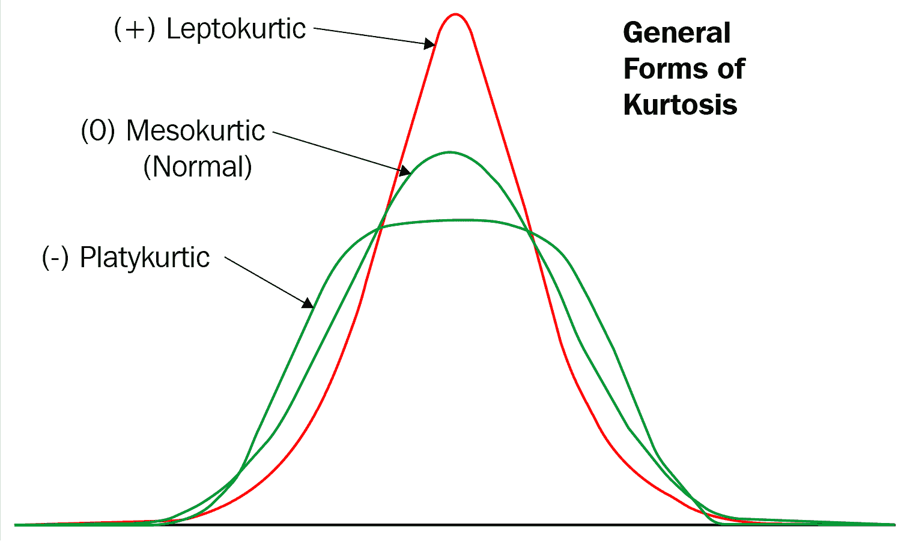

不同的 Python 库都有获取数据集峰度的函数。SciPy 库具有`scipy.stats.kurtosis(dataset)`功能。使用Pandas库，我们使用`df.kurt()`函数计算`df`数据帧的峰度:

```py
# Kurtosis of data in data using skew() function
kurtosis =df.kurt()
print(kurtosis)

# Kurtosis of the specific column
sk_height=df.loc[:,"height"].kurt()
print(sk_height)
```

这里给出了前面代码的输出:

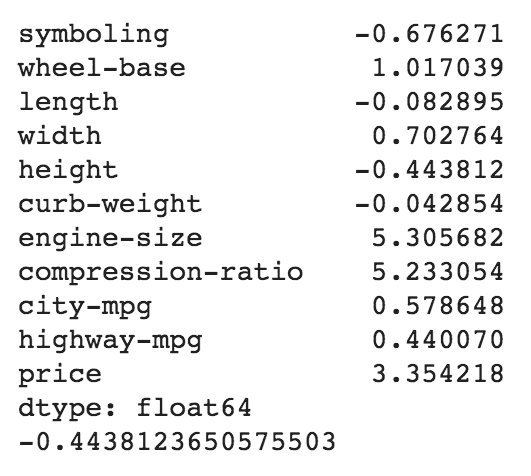

同样，我们可以计算任何特定数据列的峰度。例如，我们可以将柱高的峰度计算为`df.loc[:,"height"].kurt()`。

# 计算百分比

百分位数衡量任何数据集中低于特定值的值的百分比。为了计算百分位数，我们需要确保我们的列表是有序的。举个例子，如果你说第 80 个百分位数的数据是 130:那这意味着什么？嗯，这只是意味着 80%的数值低于 130。很简单，对吧？我们将对此使用以下公式:

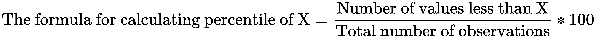

假设我们有给定的数据:1，2，2，3，4，5，6，7，7，8，9，10。那么百分位值 4 = (4/12) * 100 = 33.33%。

这仅仅意味着 33.33%的数据小于 4。

现在，让我们从到目前为止一直使用的同一数据帧中计算`height`列的百分比:

```py
height = df["height"]
percentile = np.percentile(height, 50,)
print(percentile)
```

前面代码的输出如下:

```py
54.1
```

The preceding formula is very simple. But do you see any pattern with the measures of central tendencies? What would be the 50th percentile? This corresponds to the median. Were you able to deduce that?

# 四重奏乐团

给定按升序排序的数据集，四分位数是将给定数据集拆分为四分位数的值。四分位数指的是将给定数据集分成四个相等部分的三个数据点，这样每个分割就占数据集的 25%。就百分位数而言，第 25 个百分位数被称为第一个四分位数(Q1)，第 50 个百分位数被称为第二个四分位数(Q2)，第 75 个百分位数被称为第三个四分位数(Q3)。

基于四分位数，还有另一个度量称为四分位数间范围，它也度量数据集的可变性。其定义如下:

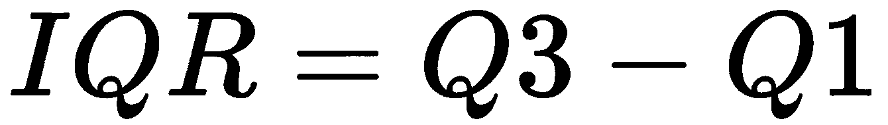

IQR 不受异常值的影响。让我们从到目前为止一直使用的相同数据帧中获取`price`列的 IQR:

```py
price = df.price.sort_values()
Q1 = np.percentile(price, 25)
Q2 = np.percentile(price, 50)
Q3 = np.percentile(price, 75)

IQR = Q3 - Q1
IQR
```

前面片段的输出如下:

```py
8718.5

```

接下来，让我们使用方框图来可视化四分位数。

# 可视化四分位数

首先，让我们生成一些数据。让我们假设以下是学生在三个不同科目中获得的分数:

```py
scorePhysics = [34,35,35,35,35,35,36,36,37,37,37,37,37,38,38,38,39,39,40,40,40,40,40,41,42,42,42,42,42,42,42,42,43,43,43,43,44,44,44,44,44,44,45,45,45,45,45,46,46,46,46,46,46,47,47,47,47,47,47,48,48,48,48,48,49,49,49,49,49,49,49,49,52,52,52,53,53,53,53,53,53,53,53,54,54,54,54,54,54,54,55,55,55,55,55,56,56,56,56,56,56,57,57,57,58,58,59,59,59,59,59,59,59,60,60,60,60,60,60,60,61,61,61,61,61,62,62,63,63,63,63,63,64,64,64,64,64,64,64,65,65,65,66,66,67,67,68,68,68,68,68,68,68,69,70,71,71,71,72,72,72,72,73,73,74,75,76,76,76,76,77,77,78,79,79,80,80,81,84,84,85,85,87,87,88]

scoreLiterature = [49,49,50,51,51,52,52,52,52,53,54,54,55,55,55,55,56,56,56,56,56,57,57,57,58,58,58,59,59,59,60,60,60,60,60,60,60,61,61,61,62,62,62,62,63,63,67,67,68,68,68,68,68,68,69,69,69,69,69,69,70,71,71,71,71,72,72,72,72,73,73,73,73,74,74,74,74,74,75,75,75,76,76,76,77,77,78,78,78,79,79,79,80,80,82,83,85,88]

scoreComputer = [56,57,58,58,58,60,60,61,61,61,61,61,61,62,62,62,62,63,63,63,63,63,64,64,64,64,65,65,66,66,67,67,67,67,67,67,67,68,68,68,69,69,70,70,70,71,71,71,73,73,74,75,75,76,76,77,77,77,78,78,81,82,84,89,90]
```

现在，如果我们想要绘制单个对象的方框图，我们可以使用`plt.boxplot()`功能来完成:

```py
plt.boxplot(scoreComputer, showmeans=True, whis = 99)
```

让我们打印计算机学科分数的方框图:

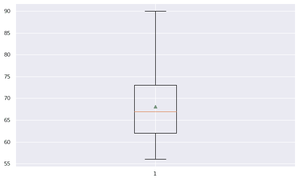

上图说明了这样一个事实，即盒子从上四分位数到下四分位数(大约 62 和 73)，而胡须(从盒子中伸出的条)最小为 56，最大为 90。红线是中间值(大约 67)，而小三角形(绿色)是平均值。

现在，让我们也给其他主题添加方框图。我们可以通过将所有分数组合成一个变量来轻松做到这一点:

```py
scores=[scorePhysics, scoreLiterature, scoreComputer]
```

接下来，我们绘制方框图:

```py
box = plt.boxplot(scores, showmeans=True, whis=99)

plt.setp(box['boxes'][0], color='blue')
plt.setp(box['caps'][0], color='blue')
plt.setp(box['caps'][1], color='blue')
plt.setp(box['whiskers'][0], color='blue')
plt.setp(box['whiskers'][1], color='blue')

plt.setp(box['boxes'][1], color='red')
plt.setp(box['caps'][2], color='red')
plt.setp(box['caps'][3], color='red')
plt.setp(box['whiskers'][2], color='red')
plt.setp(box['whiskers'][3], color='red')

plt.ylim([20, 95]) 
plt.grid(True, axis='y') 
plt.title('Distribution of the scores in three subjects', fontsize=18) 
plt.ylabel('Total score in that subject') 
plt.xticks([1,2,3], ['Physics','Literature','Computer'])

plt.show()
```

这里给出了前面代码的输出:

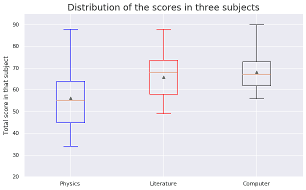

从图中可以明显看出，学生获得的最低分在 32 分左右，而获得的最高分是 90 分，属于计算机科学科目。

# 摘要

在本章中，我们讨论了描述性统计的几个方面。描述性统计通常指定量描述给定数据集的汇总统计。我们讨论了该领域中最常用的汇总度量，包括中心趋势度量(均值、中值和模式)和可变性度量(标准差、最小值、最大值、峰度和偏斜度)。

在下一章中，我们将继续使用分组技术进行更高级的描述性统计。这些分组技术由Pandas图书馆提供。

# 进一步阅读

*   *偏斜度和峰度的测量* :
*   *Pandas食谱**西奥多·彼得罗**帕克特出版*
*   *学习Pandas——第二版**迈克尔·海特**帕克特出版*
*   *掌握Pandas**费米·安东尼**帕克特出版*
*   *Pandas动手数据分析**斯蒂芬妮莫林**帕克特出版*****