# 假设检验和回归

在本章中，我们将深入探讨两个重要的概念，假设检验和回归。首先，我们将讨论假设检验的几个方面，假设检验的基本原则和假设检验的类型，并通过一些工作实例来运行。接下来，我们将讨论回归的类型，并使用 scikit-learn 库开发模型。

在本章中，我们将涵盖以下主题:

*   假设检验
*   黑客攻击
*   理解回归
*   回归类型
*   模型开发和评估

# 技术要求

本章的代码可以在[第九章](09.html)、*假设检验和回归*的文件夹内的 GitHub 存储库中找到。

# 假设检验

假设检验经常被用来促进使用实验数据集的统计决策。测试用于验证关于总体参数的假设。例如，考虑以下语句:

*   在尼泊尔大学学习机器学习课程的学生平均成绩是 78 分。
*   在学习机器学习课程的学生中，男生的平均身高高于女生。

在所有这些例子中，我们假设一些统计事实来证明这些说法。像这样的情况是假设检验有帮助的。假设检验评估关于任何特定**人群**的两个互斥陈述，并确定哪一个陈述最好由**样本**数据建立。这里，我们使用了两个基本关键词:人口和样本。总体包括一组数据中的所有元素，而样本由取自任何特定总体的一个或多个观察值组成。

在下一节中，我们将讨论假设测试，并讨论如何使用 Python 库来执行假设测试。

# 假设检验原理

假设检验基于统计学的两个基本原则，即标准化和标准标准化:

*   **规范化**:规范化的概念因上下文而异。为了容易理解标准化的概念，它是在执行描述性统计之前，将在不同尺度上测量的值调整到公共尺度的过程，并由以下等式表示:

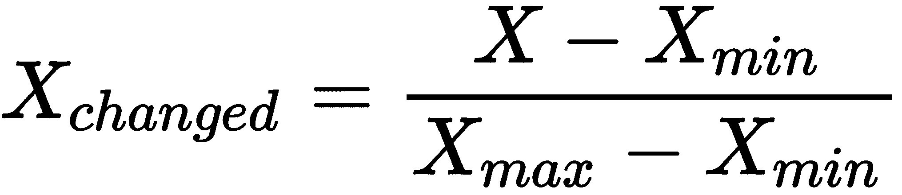

*   **标准归一化**:标准归一化除了均值为 0，标准差为 1 之外，与归一化类似。标准归一化由以下等式表示:

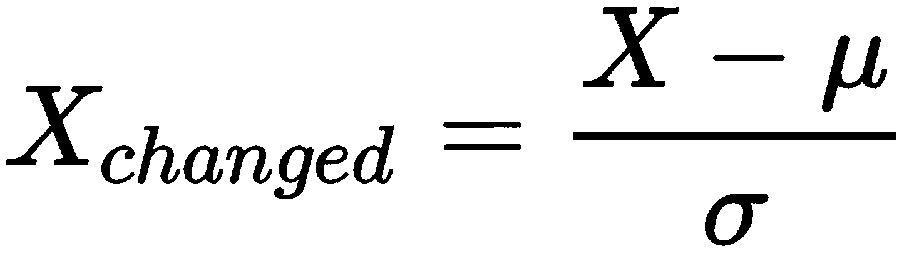

除了这些概念，我们还需要了解假设检验的一些重要参数:

*   **零假设**是基于领域知识做出的最基本的假设。比如一个人的平均打字速度是每分钟 38-40 个字。
*   一个**替代假设**是反对无效假设的不同假设。这里的主要任务是我们是否接受或拒绝基于实验结果的替代假设。比如一个人的平均打字速度总是低于每分钟 38-40 个字。基于某些事实，我们可以接受或拒绝这个假设。例如，我们可以找到一个可以以每分钟 38 个单词的速度打字的人，这将推翻这个假设。因此，我们可以拒绝这种说法。
*   **第一类错误**和**第二类错误**:当我们接受或拒绝一个假设时，我们可能会犯两种错误。它们被称为第一类和第二类错误:
    *   **假阳性**:第一类错误是当 H0 为真时，我们拒绝零假设(H0)。
    *   **假阴性**:第二类错误是当 H0 为假时，我们不拒绝零假设(H0)。
*   **P 值**:这也称为概率值或渐近显著性。假设零假设为真，这是特定统计模型的概率。通常，如果 P 值低于预定阈值，我们拒绝零假设。
*   **显著性水平**:这是你在使用假设之前应该熟悉的最重要的概念之一。重要程度是我们接受或拒绝无效假设的重要程度。我们必须注意，100%的准确性是不可能接受或拒绝的。我们通常根据我们的主题和领域来选择重要程度。一般是 0.05 或 5%。这意味着我们的输出应该有 95%的把握支持我们的零假设。

总而言之，在选择或拒绝零假设之前，请查看条件:

```py
# Reject H0
p <= α
# Accept the null hypothesis
p > α
```

通常，在开始计算新值之前，我们会设置显著性级别。接下来，我们将看到如何使用统计库来执行假设检验。

# statsmodels 库

让我们使用统计库进行假设检验。让我们考虑以下场景。

在一项关于青少年心理健康的研究中，48%的父母认为社交媒体是青少年压力的原因:

*   **人口**:有青少年的父母(年龄> = 18 岁)
*   **感兴趣参数** : p
*   **无效假设** : p = 0.48
*   **替代假设** : p > 0.48

**数据**:调查了 4500 人，65%的被调查者认为自己青少年的压力来源于社交媒体。

让我们开始假设检验:

1.  首先，导入所需的库:

```py
import statsmodels.api as sm
import numpy as np
import matplotlib.pyplot as plt
import pandas as pd
```

2.  接下来，让我们声明变量:

```py
n = 4500
pnull= 0.48
phat = 0.65
```

3.  现在，我们可以使用`proportions_ztest`方法来计算新的 P 值。查看以下代码片段:

```py
sm.stats.proportions_ztest(phat * n, n, pnull, alternative='larger')
```

前面代码的输出如下:

```py
(23.90916877786327, 1.2294951052777303e-126)
```

我们计算的`1.2294951052777303e-126`的 P 值相当小，我们可以拒绝零假设，即社交媒体是青少年压力的原因。

# 平均阅读时间

假设一个阅读比赛是和一些成年人一起进行的。数据如下所示:

```py
[236, 239, 209, 246, 246, 245, 215, 212, 242, 241, 219, 242, 236, 211, 216, 214, 203, 223, 200, 238, 215, 227, 222, 204, 200, 208, 204, 230, 216, 204, 201, 202, 240, 209, 246, 224, 243, 247, 215,249, 239, 211, 227, 211, 247, 235, 200, 240, 213, 213, 209, 219,209, 222, 244, 226, 205, 230, 238, 218, 242, 238, 243, 248, 228,243, 211, 217, 200, 237, 234, 207, 217, 211, 224, 217, 205, 233, 222, 218, 202, 205, 216, 233, 220, 218, 249, 237, 223]
```

现在，我们的假设问题是这样的:**随机学生(成人)的平均阅读速度是否超过每分钟 212 个单词？**

我们可以将前面的概念分解为以下参数:

*   **人口**:所有成年人
*   **感兴趣参数** : μ，教室人数
*   **无效假设** : μ = 212
*   **替代假设** : μ > 212
*   **置信水平** : α = 0.05

我们知道所有需要的参数。现在，我们可以使用带有`alternate="larger"`的`statsmodels`包进行 Z 测试:

```py
import numpy as np

sdata = np.random.randint(200, 250, 89)
sm.stats.ztest(sdata, value = 80, alternative = "larger")
```

前面代码的输出如下:

```py
(91.63511530225408, 0.0)
```

由于计算的 P 值(0.0)低于标准置信水平(α = 0.05)，我们可以**拒绝零假设**。也就是说*成年人平均阅读速度为每分钟 212 个单词*的说法被否决了。

# 假设检验的类型

假设检验有不同的类型。最常用的如下:

*   z 检验
*   t 检验
*   方差分析检验
*   卡方测验

每种类型的测试都超出了本书的范围。我们建议查看维基百科或*进一步阅读*部分的链接，以获得关于它们的详细信息。然而，我们将在本书中研究 Z 测试和 T 测试。在前面的例子中，我们只使用了 Z 检验。

# t 检验

T 检验是推理统计学中最常用的一种检验。该测试最常用于我们需要了解两组平均值之间是否存在显著差异的场景。例如，假设我们有一个特定班级学生的数据集。数据集包含每个学生的身高。我们正在检查平均身高是否为 175 厘米:

*   **人口**:该班所有学生
*   **感兴趣参数** : μ，教室人数
*   **零假设**:平均身高μ = 175
*   **替代假设** : μ > 175
*   **置信水平** : α = 0.05

我们已经列出了所有的参数。现在，我们可以使用假设检验:

1.  让我们首先设置数据集:

```py
import numpy as np
height = np.array([172, 184, 174, 168, 174, 183, 173, 173, 184, 179, 171, 173, 181, 183, 172, 178, 170, 182, 181, 172, 175, 170, 168, 178, 170, 181, 180, 173, 183, 180, 177, 181, 171, 173, 171, 182, 180, 170, 172, 175, 178, 174, 184, 177, 181, 180, 178, 179, 175, 170, 182, 176, 183, 179, 177])
```

2.  接下来，我们将使用 SciPy 库中的统计模块。注意，在前面的例子中，我们使用了 statsmodels API 库。我们还可以继续使用它，但是我们这里的目的是向您介绍 SciPy 库的新模块。让我们导入库:

```py
from scipy.stats import ttest_1samp
import numpy as np
```

3.  现在，让我们使用 NumPy 库来计算平均高度:

```py
height_average = np.mean(height)
print("Average height is = {0:.3f}".format(height_average))
```

前面代码的输出如下:

```py
Average height is = 175.618
```

4.  现在，让我们用 T 检验来计算新的 P 值:

```py
tset,pval = ttest_1samp(height, 175)

print("P-value = {}".format(pval))

if pval < 0.05:
 print("We are rejecting the null Hypothesis.")
else:
  print("We are accepting the null hypothesis.")
```

前面代码的输出如下:

```py
Average height is = 175.618
P-value = 0.35408130524750125
We are accepting the null hypothesis
```

请注意，我们的显著性水平(α= 0.05)和计算的 P 值是 0.354。因为它大于α，所以我们接受零假设。这意味着学生的平均身高为 175 厘米，置信度为 95%。

# 黑客攻击

黑客攻击是一个严重的方法论问题。它也被称为数据钓鱼、数据屠杀或数据挖掘。滥用数据分析来检测数据中可能具有统计意义的模式。这是通过进行一项或多项测试并只发布那些具有更高意义的结果来完成的。

我们在前一节*假设检验*中已经看到，我们依靠 P 值得出结论。简而言之，这意味着我们计算 P 值，这是结果的概率。如果 P 值很小，则结果被宣布为具有统计学意义。这意味着，如果你创建一个假设并用一些标准来检验它，并报告一个小于 0.05 的 P 值，读者很可能会相信你已经找到了真正的相关性或效果。然而，这在现实生活中可能是完全错误的。根本不会有任何影响或关联。所以，无论报道什么都是一个**f**T4】也是一个阳性。这一点在出版物领域见得很多。许多期刊只会发表至少能报告一个统计学显著效应的研究。因此，研究人员试图争论数据集，或者实验得到一个明显更低的 P 值。这叫做黑客入侵。

已经介绍了数据挖掘的概念，现在是我们开始学习如何构建模型的时候了。我们将从最常见和最基本的模型之一——回归开始。

# 理解回归

我们用统计学术语中的相关性来表示两个定量变量之间的关联。请注意，我们使用了术语定量变量。这对你应该是有意义的。如果没有，我们建议您在此暂停，浏览[第 1 章](01.html)、*探索性数据分析基础*。

谈到数量变量和相关性，我们也假设关系是线性的，即一个变量增加或减少一个固定的量，而另一个变量增加或减少。要确定类似的关系，还有另一种在这些情况下经常使用的方法，**回归**，包括确定关系的最佳直线。一个简单的方程，称为**回归方程**，可以表示以下关系:


让我们来看看这个公式:

*   *Y* =因变量(你试图预测的变量)。它通常被称为**结果变量**。
*   *X* =自变量(你用来预测 Y 的变量)。它通常被称为**预测因子**，或**协变量**或**特征**。
*   *a* =截距。
*   *b* =坡度。
*   *u* =回归残差。

如果`y`代表因变量，`x`代表自变量，这种关系被描述为`y`对`x`的回归。`x`和`y`之间的关系一般用一个方程来表示。等式显示了`y`相对于`x`的变化程度。

人们使用回归分析有几个原因。最明显的原因如下:

*   我们可以使用回归分析来预测未来的经济状况、趋势或价值。
*   我们可以使用回归分析来确定两个或多个变量之间的关系。
*   我们可以使用回归分析来理解当一个变量改变时，另一个变量是如何改变的。

在后面的部分，我们将使用模型开发的回归函数来预测因变量，同时在函数中实现一个新的解释变量。基本上，我们会建立一个预测模型。所以，让我们深入研究回归。

# 回归类型

两种主要的回归类型是线性回归和多元线性回归。大多数简单的数据可以用线性回归来表示。一些复杂的数据遵循多元线性回归。在本章中，我们将研究 Python 的回归类型。最后，我们将以一个非线性例子的不同方面来结束讨论。

# 简单线性回归

线性回归又称**简单线性回归**，用一条直线定义两个变量之间的关系。在线性回归过程中，我们的目标是通过找到定义直线的斜率和截距来绘制最接近数据的直线。简单线性回归的方程一般如下:

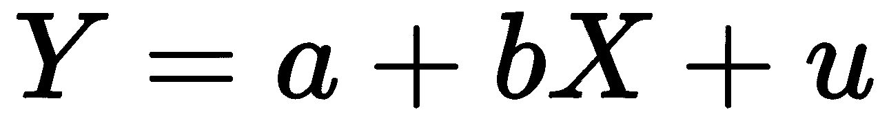

`X`为单一特征，`Y`为目标，`a`和`b`分别为截距和斜率。问题是，我们如何选择`a`和`b`？答案是选择误差函数最小的线路，`u`。这个误差函数也被称为损失或**成本函数**，它是直线和数据点之间垂直距离差的平方(忽略正负抵消)之和。

这个计算叫做**普通最小二乘** ( **OLS** )。请注意，解释回归的每个方面都超出了本书的范围，我们建议您探索*进一步阅读*部分，以拓宽您对该主题的知识。

# 多元线性回归

在**多元线性回归**的情况下，两个或多个自变量或解释变量与目标或因变量呈线性关系。自然界中大多数可线性描述的现象都是通过多元线性回归得到的。例如，任何项目的价格都取决于采购的数量、一年中的时间以及库存中可用的项目数量。例如，一瓶葡萄酒的价格主要取决于你买了多少瓶。此外，在圣诞节等节日期间，价格会高一点。此外，如果库存中的瓶子数量有限，价格可能会更高。在这种情况下，葡萄酒的价格取决于三个变量:数量、一年中的时间和库存数量。这种类型的关系可以使用多元线性回归来捕捉。

多元线性回归方程一般如下:

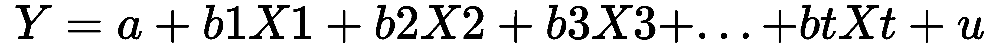

这里 *Y* 为因变量， *X <sub>i</sub> s* 为自变量。

# 非线性回归

非线性回归是一种回归分析，其中数据遵循模型，然后表示为数学函数。简单线性回归涉及两个变量( *X* 和 *Y* )与直线函数， <sub>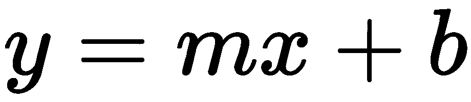</sub> ，而非线性回归必须生成一条曲线。非线性回归使用回归方程，如下所示:

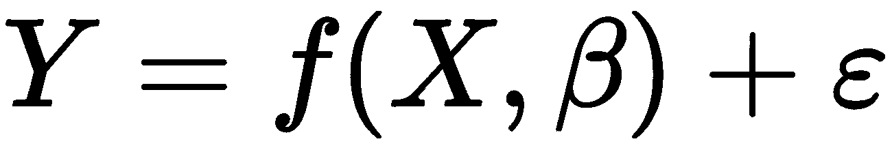

让我们看看这个公式:

*   *X*= p 个预测因子的向量
*   *β*= k 个参数的向量
*   *f(-)* =一个已知的回归函数
*   *ε* =误差项

非线性回归可以拟合各种各样的曲线。它使用对数函数、三角函数、指数函数和许多其他拟合方法。这种建模类似于线性回归建模，因为两者都试图从一组变量中图形化地控制特定的答案。开发这些模型比开发线性模型更复杂，因为函数是通过一系列近似(迭代)生成的，这些近似可能是反复试验的结果。数学家使用各种各样的既定方法，如高斯-牛顿法和莱文伯格-马夸特法。这种非线性模型生成曲线的目的是使 OLS 尽可能小。OLS 越小，函数越适合数据集的点。它测量有多少观测值不同于数据集平均值。

在下一节中，我们将学习如何使用 Python 库开发和评估回归模型。

# 模型开发和评估

在前一节中，我们从理论上讨论了不同类型的回归。既然我们已经涵盖了理论概念，是时候获得一些实践经验了。在本节中，我们将使用 scikit-learn 库来实现线性回归并评估模型。为此，我们将使用著名的波士顿住房定价数据集，该数据集被研究人员广泛使用。我们将讨论回归情况下使用的不同模型评估技术。

让我们尝试在前面看到的解释的基础上开发一些回归模型。

# 构建线性回归模型

任何数据科学专业人员在解决任何回归问题时想到的第一个概念是构建线性回归模型。线性回归是最古老的算法之一，但它仍然非常有效。我们将使用示例数据集在 Python 中构建一个线性回归模型。该数据集在 scikit-learn 中作为一个名为波士顿房价数据集的样本数据集提供。我们将使用`sklearn`库加载数据集并构建实际模型。让我们从加载和理解数据开始:

1.  让我们从导入所有必要的库并创建我们的数据框开始:

```py
# Importing the necessary libraries
import pandas as pd
import numpy as np
import matplotlib.pyplot as plt
import seaborn as sns 
from sklearn.datasets import load_boston

sns.set(style="ticks", color_codes=True)
plt.rcParams['figure.figsize'] = (8,5)
plt.rcParams['figure.dpi'] = 150

# loading the data
df = pd.read_csv("https://raw.githubusercontent.com/PacktPublishing/hands-on-exploratory-data-analysis-with-python/master/Chapter%209/Boston.csv")
```

2.  现在，我们已经将数据集加载到`boston`变量中。我们可以按如下方式查看数据框的键:

```py
print(df.keys())
```

这会将所有键和值作为 Python 字典返回。前面代码的输出如下:

```py
Index(['CRIM', ' ZN ', 'INDUS ', 'CHAS', 'NOX', 'RM', 'AGE', 'DIS', 'RAD', 'TAX', 'PTRATIO', 'LSTAT', 'MEDV'], dtype='object')
```

3.  现在我们的数据已经加载，让我们快速准备好我们的数据帧并继续工作:

```py
df.head()
# print the columns present in the dataset
print(df.columns)
# print the top 5 rows in the dataset
print(df.head()) 
```

前面代码的输出如下:

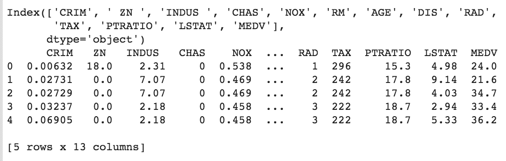

Figure 9.1: The first five rows of the DataFrame

列`MEDV`是目标变量，在建立模型时，它将被用作目标变量。目标变量( *y* )与特征变量( *x* )是分开的。

4.  在新的整体数据框架中，让我们检查是否有任何缺失的值:

```py
df.isna().sum()
```

看看下面的输出:

```py
CRIM 0
ZN 0
INDUS 0
CHAS 0
NOX 0
RM 0
AGE 0
DIS 0
RAD 0
TAX 0
PTRATIO 0
LSTAT 0
MEDV 0
dtype: int64
```

特别是在回归的情况下，确保我们的数据没有任何缺失值是很重要的，因为如果数据有缺失值，回归就不会起作用。

相关性分析是建立任何模型的关键部分。我们必须了解数据的分布以及自变量与因变量之间的关系。

5.  让我们绘制一个热图，描述数据集中各列之间的相关性:

```py
#plotting heatmap for overall data set
sns.heatmap(df.corr(), square=True, cmap='RdYlGn')
```

输出图如下所示:

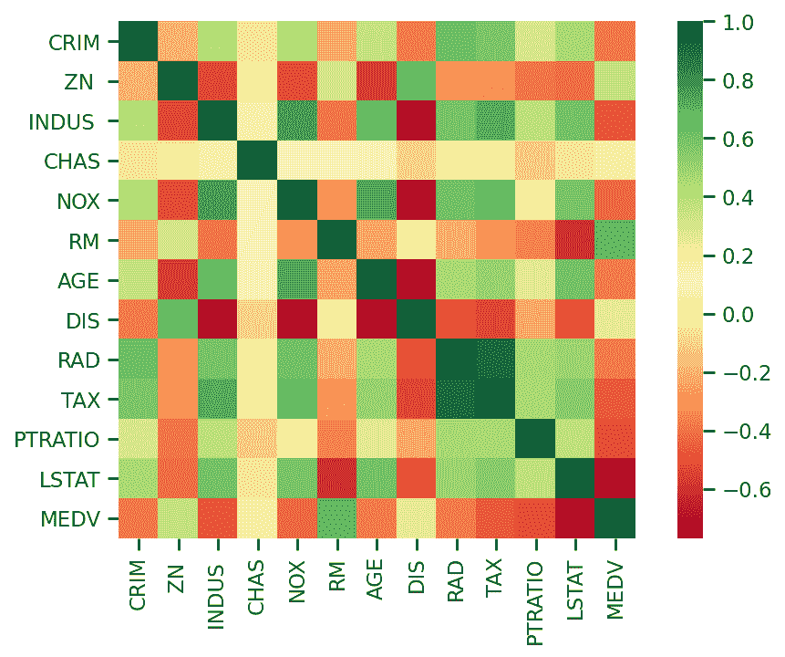

Figure 9.2: Correlation matrix generated from the preceding code snippet

既然要建立线性回归模型，那就找几个与`MEDV`有显著相关性的自变量。从前面的热图来看，`RM`(每套住房的平均房间数)与`MEDV`(1000 美元中自有住房的中位数)正相关，因此我们将把`RM`作为特征( *X* )和`MEDV`作为线性回归模型的预测因子( *y* )。

6.  我们可以用`lmplot`的方法从海鸟身上看到`RM`和`MEDV`之间的关系。查看以下代码片段:

```py
sns.lmplot(x = 'RM', y = 'MEDV', data = df)
```

前面代码的输出如下:

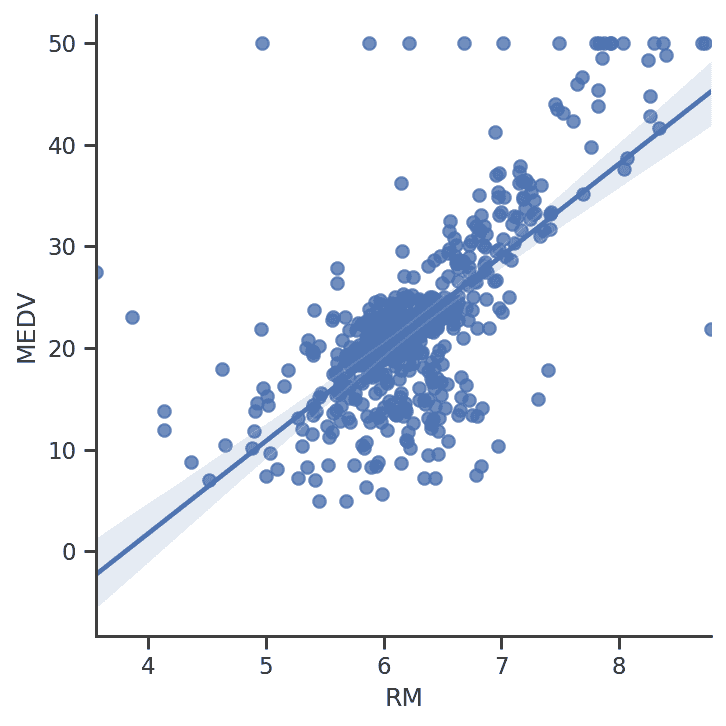

Figure 9.3: Lmplot illustrating the relationship between the RM and MEDV columns

前面的截图显示了这两个变量之间的强相关性。然而，我们可以很容易地从图表中发现一些异常值。接下来，让我们为模型开发创造条件。

Scikit-learn 需要在数组中创建特征和目标变量，所以在给`X`和`y`分配列时要小心:

```py
# Preparing the data
X = df[['RM']]
y = df[['MEDV']]
```

现在我们需要将数据分成训练集和测试集。Sklearn 提供了一些方法，通过这些方法，我们可以将原始数据集分割成训练数据集和测试数据集。我们已经知道，回归模型开发背后的原因是为了得到一个预测未来产量的公式。但是我们如何确定模型预测的准确性呢？衡量模型准确性的一种逻辑技术是将正确预测的数量除以测试的观察总数。

对于这个任务，我们必须有一个已经知道输出预测的新数据集。在模型开发过程中，最常用的技术是数据集的训练/测试分割。这里，您将数据集分为训练数据集和测试数据集。我们将模型训练或拟合到训练数据集，然后通过对测试(标记或预测)数据集进行预测来计算精度。

7.  这是使用`sklearn.model_selection`中的`train_test_split()`功能完成的:

```py
# Splitting the dataset into train and test sets
from sklearn.model_selection import train_test_split
X_train, X_test, y_train, y_test = train_test_split(X, y, test_size = 0.3, random_state = 10)
```

`X`是我们这里的自变量，`Y`是我们的目标(输出)变量。在`train_test_split`中，`test_size`表示测试数据集的大小。`test_size`是用于测试数据集的数据比例。在这里，我们为`test_size`传递了一个`0.3`的值，这意味着我们的数据现在分为 70%的训练数据和 30%的测试数据。最后，`random_state`为随机数生成器设置种子，随机数生成器分割数据。`train_test_split()`函数将返回四个数组:训练数据、测试数据、训练输出和测试输出。

8.  现在最后一步是训练线性回归模型。从极其强大的`sklearn`库中，我们导入`LinearRegression()`函数来将我们的训练数据集拟合到模型中。当我们运行`LinearRegression().fit()`时，该函数会自动计算我们前面讨论过的 OLS，并生成一个适当的直线函数:

```py
#Training a Linear Regression Model
from sklearn.linear_model import LinearRegression
regressor = LinearRegression()

# Fitting the training data to our model
regressor.fit(X_train, y_train)
```

现在，我们有了一个名为`regressor`的模型，它是在训练数据集上完全训练的。下一步是评估模型对目标变量的正确预测程度。

# 模型评估

我们的线性回归模型现在已经被成功训练。请记住，我们从数据集中分离了一些数据用于测试，我们打算使用这些数据来发现模型的准确性。我们将用它来评估我们模型的效率。r<sup>2</sup>-统计学是测量回归模型精度的常用方法:

1.  R <sup>2</sup> 可以使用我们在`LinearRegression.score()`方法中的测试数据集来确定:

```py
#check prediction score/accuracy
regressor.score(X_test, y_test)
```

该`score()`功能的输出如下:

```py
0.5383003344910231
```

`score(y_test, y_pred)`方法预测输入集`X`的`Y`值，并将它们与真实的`Y`值进行比较。R <sup>2</sup> 的值一般在 0 到 1 之间。R <sup>2</sup> 的值越接近 1，模型越精确。这里 R <sup>2</sup> 评分是 0.53 ≈ 53%准确率，还可以。有了一个以上的自变量，我们将提高模型的性能，这将是我们接下来要研究的。

2.  在此之前，让我们用我们的模型来预测 *y* 值，并对其进行更多的评估。并且还建立了目标变量`DataFrame`:

```py
# predict the y values
y_pred=regressor.predict(X_test)
# a data frame with actual and predicted values of y
evaluate = pd.DataFrame({'Actual': y_test.values.flatten(), 'Predicted': y_pred.flatten()})
evaluate.head(10)
```

目标变量`DataFrame`如下:

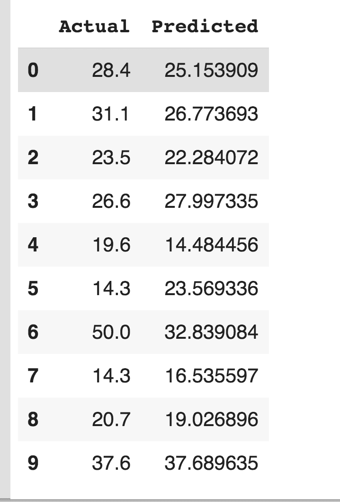

Figure 9.4: The first 10 entries showing the actual values and the predicted values

前面的截图显示了实际值和预测值之间的差异。如果我们把它们画出来，我们就能看到它们:

```py
evaluate.head(10).plot(kind = 'bar')
```

前面代码的输出如下:

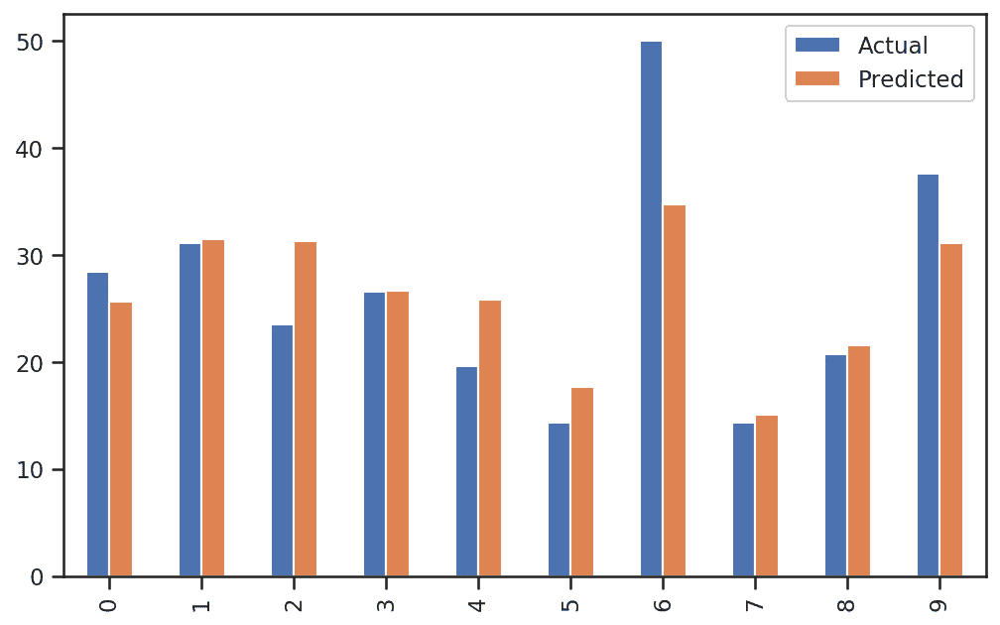

Figure 9.5: Stacked bar plot showing the actual values and the predicted values

更容易理解，对吧？请注意，大多数预测值低于实际值。

# 计算精度

Sklearn 提供的指标可以帮助我们用多种公式评估我们的模型。用于评估模型的三个主要指标是平均绝对误差、均方误差和 R <sup>2</sup> 分数。

让我们快速尝试这些方法:

```py
# Scoring the model
from sklearn.metrics import r2_score, mean_squared_error,mean_absolute_error

# R2 Score
print(f"R2 score: {r2_score(y_test, y_pred)}")

# Mean Absolute Error (MAE)
print(f"MSE score: {mean_absolute_error(y_test, y_pred)}")

# Mean Squared Error (MSE)
print(f"MSE score: {mean_squared_error(y_test, y_pred)}")
```

前面代码的输出如下:

```py
R2 score: 0.5383003344910231
MSE score: 4.750294229575126
MSE score: 45.0773394247183
```

请注意，我们不是在评估我们在前面的输出中获得的精度。在任何机器学习场景中，我们都试图通过执行几种优化技术来提高准确性。

# 理解准确性

我们使用 scikit-learn 库来训练回归模型。除此之外，我们还使用训练好的模型来预测一些数据，然后计算精度。例如查看*图 9.5* 。第一个条目说实际值是 28.4，但是我们训练的回归模型预测它是 25.153909。因此，我们有一个 28.4 - 25.153909 = 3.246091 的差异。让我们试着理解这些差异是如何理解的。让 *x* <sub>*i*</sub> 为实际值，为任意样本`i`的模型预测值。

误差由以下公式给出:

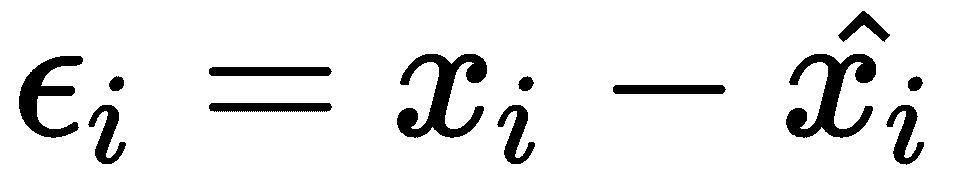

对于任何样本`i`，我们都可以得到预测值和实际值的差值。我们可以通过对误差求和来计算平均误差，但是由于有些误差是负的，有些是正的，所以它们很可能会相互抵消。那么，问题仍然存在，我们如何知道我们的训练模型在所有数据集上的表现有多准确？这就是我们使用平方误差概念的地方。你应该知道正数和负数的平方总是正数。因此，他们没有机会互相抵消。因此，我们可以用下面的等式来表示平方误差:

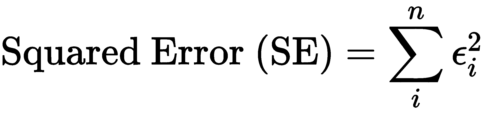

一旦我们知道如何计算平方误差，我们就可以计算均方差。那很容易，对吗？当然，为了计算均方误差，我们可以使用以下公式:

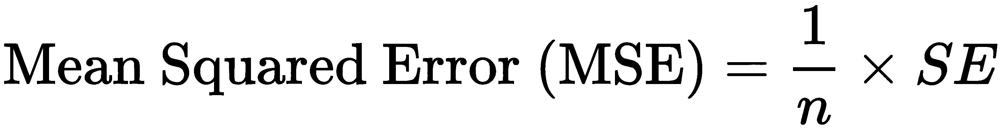

现在，如果我们取均方误差的根，我们得到另一个精度度量，称为**均方误差的根** ( **RMSE** )。等式现在变成了:

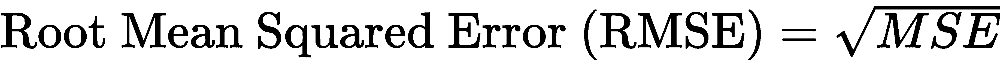

另一种广泛使用的精度测量方法叫做**相对均方误差** ( **均方根误差**)。不要把它和 RMSE 混淆了。计算均方根误差的公式如下:

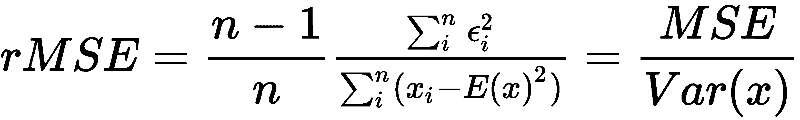

在上式中， *E(x)* 被称为 x 的期望值，除了 rMSE，我们还使用了 R <sup>2</sup> 方法。R <sup>2</sup> 的计算公式如下:

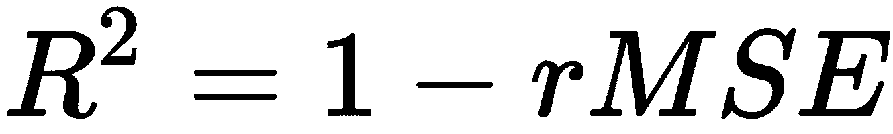

在数据科学中经常看到的另一种精度度量是绝对误差。顾名思义，它取绝对值并计算总和。测量绝对误差的公式如下:

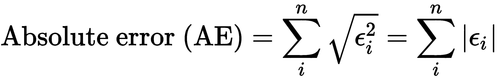

最后，除了绝对误差之外，还可以使用另一种类型的误差，即平均绝对误差。平均绝对误差的计算公式如下:

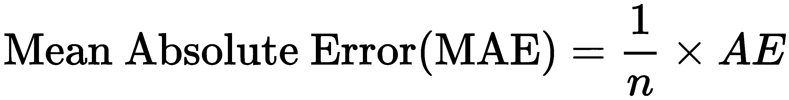

太多了吗？曾经是。然而，如果你仔细检查这些方程，你会发现它们是非常密切相关的。试着把重点放在名字上，这解释了准确度测量的作用。现在，每当你看到任何数据科学模型使用这些精度测量，它会更有意义，不是吗？

祝贺您了解准确度测量。在下一节中，让我们深入研究多元线性回归，我们将尝试使用这些精度度量。

# 实现多元线性回归模型

当因变量依赖于几个自变量时，可以使用多元线性回归来获取关系。多元线性回归可以看作是简单线性回归的延伸。说到使用 sklearn 实现多元线性回归，简单和多元线性回归没有太大区别:

1.  只需在`X`变量中包含额外的列并运行代码。因此，让我们包含`X`变量的附加列，并遵循相同的代码。
2.  记住，二维线性回归模型是一条直线；它是三维的平面，也是三维以上的超平面:

```py
# Preparing the data
X = df[['LSTAT','CRIM','NOX','TAX','PTRATIO','CHAS','DIS']]
y = df[['MEDV']]

# Splitting the dataset into train and test sets
from sklearn.model_selection import train_test_split
X_train, X_test, y_train, y_test = train_test_split(X, y, test_size = 0.3, random_state = 10)

# Fitting the training data to our model
regressor.fit(X_train, y_train)

#score of this model
regressor.score(X_test, y_test)
```

该`score()`功能的输出如下:

```py
0.6446942534265363
```

3.  让我们用我们的模型预测`y`值并评估它:

```py
# predict the y values
y_pred=regressor.predict(X_test)
# a data frame with actual and predicted values of y
evaluate = pd.DataFrame({'Actual': y_test.values.flatten(), 'Predicted': y_pred.flatten()})
evaluate.head(10)
```

目标变量`DataFrame`如下:

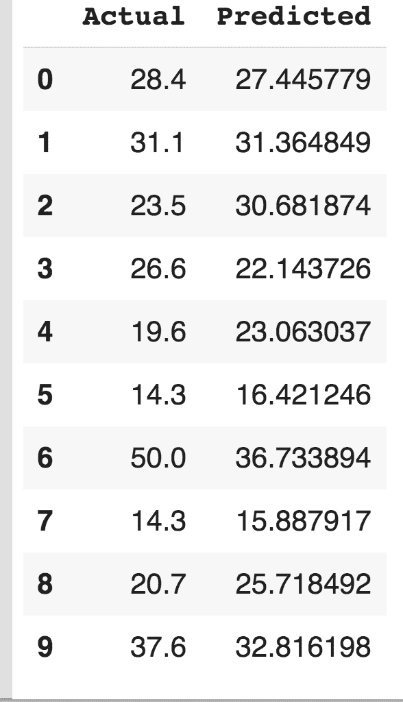

Figure 9.6: The first 10 entries showing the actual values and the predicted values

4.  让我们制作另一个特征较少的多元线性回归模型:

```py
# Preparing the data
X = df[['LSTAT','CRIM','NOX','TAX','PTRATIO']]
y = df[['MEDV']]

# Splitting the dataset into train and test sets
from sklearn.model_selection import train_test_split
X_train, X_test, y_train, y_test = train_test_split(X, y, test_size = 0.3, random_state = 10)

# Fitting the training data to our model
regressor.fit(X_train, y_train)

#score of this model
regressor.score(X_test, y_test)
```

该`score()`功能的输出如下:

```py
0.5798770784084717
```

该模型的准确率为 57%。下表显示了此构建模型的目标变量 MEDV 的实际值和预测值，如下所示:

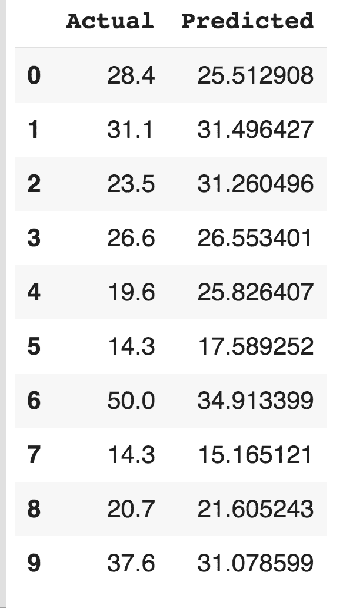

如你所见，在`X`中改变特征会使模型的精度发生变化。因此，您必须仔细分析特征之间的相关性，然后使用它们以更高的精度构建模型。

# 摘要

在本章中，我们讨论了两个重要的概念:假设检验和回归分析。在假设检验中，我们了解了假设、其基本原理以及不同类型的假设检验，并且我们使用了两个不同的 Python 库(statsmodels 和 SciPy)来创建不同的假设检验。此外，我们还讨论了 p-hacking，这是假设测试期间最常遇到的挑战之一。接下来，我们讨论了不同类型的回归，并使用 scikit-learn 来构建、测试和评估一些回归模型。

在下一章中，我们将更详细地讨论模型开发和评估。除了回归之外，我们还将讨论其他几种可以使用的模型。

# 进一步阅读

*   Python 的回归分析，作者:*卢卡·马萨隆*，*阿尔贝托·博切蒂*，*帕克特出版*，2016 年 2 月 29 日
*   *机器学习统计*，*普拉塔·丹盖提*，*帕克特出版*，2017 年 7 月 20 日
*   *数据科学统计**詹姆斯·d·米勒**帕克特出版*，2017 年 11 月 17 日
*   *一周内的数据科学算法-第二版*，作者:*达维德·纳廷加*，*帕克特出版*，2018 年 10 月 31 日
*   *sci kit 机器学习-学习快速入门指南*，作者:*凯文·乔利***帕克特出版*，2018 年 10 月 30 日*