# 十、模型开发和评估

到目前为止，我们已经讨论了几种**探索性数据分析** ( **EDA** )技术。我们执行 EDA 的原因是准备数据集并理解它，以便它可以用于预测和分析目的。我们所说的预测性和分析性是指创建和评估**机器学习** ( **ML** )模型。在本章中，我们将为数据科学奠定基础，了解可以构建的不同类型的模型，以及如何对它们进行评估。

在本章中，我们将涵盖以下主题:

*   机器学习的类型
*   理解监督学习
*   理解无监督学习
*   理解强化学习
*   统一机器学习工作流

# 技术要求

在本章中，我们将使用一些聚类算法。我们将在本章中使用的数据集可以在[https://github . com/sureshHARDIYA/PhD-resources/blob/master/Data/Review % 20 paper/ACM/preferred . xlsx？原始=真](https://github.com/sureshHARDIYA/phd-resources/blob/master/Data/Review%20Paper/acm/preprocessed.xlsx?raw=true)。

我们还将使用 scikit-learn 库中的一些模块，包括`MiniBatchKMeans`、`TfidfVectorizer`、`PCA`和`TSNE`。

# 机器学习的类型

**机器学习** ( **ML** )是计算机科学的一个领域，它处理的是无需明确编程就能自己发现模式的算法的创建。ML 算法有不同的类型，这些算法分为三个不同的类别，如下图所示:

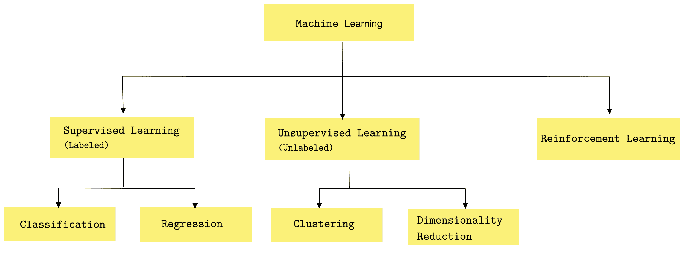

如上图所示，ML 算法有三种不同的类别:

*   监督学习
*   无监督学习
*   强化学习

我们将在接下来的章节中简要讨论这些算法。

# 理解监督学习

监督学习的主要目标是从**标记的训练数据中归纳出一个模型。**一旦一个模型被训练好，它就允许用户对看不见的未来数据做出预测。这里，我们所说的**标注训练数据***是指训练示例知道相关的输出标签。因此，它被称为监督学习。学习过程可以被认为是老师监督整个过程。在这样的学习过程中，我们最初知道正确的答案，学生们随着时间的推移迭代学习足够多，并试图回答看不见的问题。答案中的错误被老师纠正了。当我们能够确保学生的表现达到可接受的水平时，学习的过程就停止了。*

 *在监督学习中，我们有输入变量(x <sub>i</sub> )和输出变量(Y <sub>i</sub> )。有了这个，我们可以学习一个函数，`f`，如下式所示:


目标是学习一个通用的映射函数`f`，以便该函数可以为任何新的输入数据`x`预测输出变量`Y`。监督学习算法可以分为两组，如下所示:

*   回归
*   分类

让我们简单看一下这些。

# 回归

回归问题有一个输出变量或因变量。这是一个真实值，例如体重、年龄或任何其他真实数字。我们在[第 9 章](09.html)、*假设检验和* R *回归*、*T7】中详细讨论了回归，包括不同类型的回归(简单线性回归、多元线性回归和非线性回归)，并使用波士顿住房数据集进行回归分析。*

既然我们在[第 9 章](https://cdp.packtpub.com/hands_on_exploratory_data_analysis_with_python_/wp-admin/post.php?post=33&action=edit#post_32)、*假设检验和* R *回归*中讨论了回归问题，我们就继续学习分类问题。

# 分类

分类问题具有类别值形式的输出变量；例如**红**或**白葡萄酒；年轻人、成年人或老年人**。对于分类问题，有不同类型的分类算法。

一些最受欢迎的如下:

*   线性分类器:朴素贝叶斯分类器，逻辑回归，线性 SVM
*   最近邻
*   决策树分类器

*   支持向量机
*   随机森林分类器
*   神经网络分类器
*   增强树分类器

列出了最流行的分类算法后，我们必须指出，浏览每一种分类算法都超出了本书的范围。然而，我们在这里的主要意图是给你指出正确的方向。我们建议您查看本书的*进一步阅读*部分，了解关于各自主题的更多细节。

关于如何在 Python 中用红葡萄酒和白葡萄酒数据集实现这些分类器的概念证明可以在[第 11 章](11.html)、*关于葡萄酒质量数据分析的 EDA*中找到。我们也将在那一章讨论不同的评估技术，这些技术可以用于分类目的。

# 理解无监督学习

无监督机器学习处理未标记的数据。这种类型的学习可以发现数据中的各种未知模式，并可以促进有用的分类。考虑一个场景，患者使用在线网络应用程序来了解疾病，了解他们的症状，并管理他们的疾病。这种提供关于某些疾病的心理教育的网络应用程序被称为“互联网提供的治疗”(**【IDT】**)。想象一下，几千名患者在一天中不同的时间访问网站，了解他们的病情，他们的所有活动都被记录到我们的数据库中。当我们分析这些日志文件并使用散点图绘制它们时，我们发现一大群患者在下午访问网站，一大块在晚上访问网站。其他一些患者也遵循随机登录模式。这个场景说明了两个不同的病人群:一个在下午活跃，一个在晚上活跃。这个典型的场景是一个集群任务的例子。

我们可以使用几种类型的无监督学习算法。然而，两个主要的无监督学习任务是**聚类**和**降维**。在下一节中，我们将更多地讨论无监督学习算法的不同应用。

# 无监督学习的应用

无监督学习算法有几种应用。下面我们来看几个:

*   **聚类**:这些类型的算法允许我们将数据集分类成几个相似的组，称为一个聚类。每个簇代表一组相似的点。
*   **关联挖掘**:这些类型的无监督学习算法允许我们在数据集中找到频繁出现的项目。
*   **异常检测**:这些类型的无监督学习算法帮助我们确定任何现有数据集中的异常数据点。
*   **降维**:这些技术常用于数据处理，目的是减少数据集中的特征数量。这是无监督学习中最重要的任务之一。

# 基于小批量 K 均值聚类的聚类

在本节中，我们将使用无监督学习算法之一，即聚类。具体来说，我们将基于一个名为 MiniBatch K-means 聚类算法的算法对文本进行聚类。让我们了解一下这方面的背景。

每当研究人员开始在任何特定领域工作时，他们都会进行各种文献综述，以了解任何特定领域的技术水平。这样的研究被称为综述论文。撰写此类综述论文时，您需要设置一组搜索关键词，并在许多研究论文索引数据库中执行搜索，例如 scholar.google.com([https://scholar.google.com/](https://scholar.google.com/))。在几个数据库中执行搜索后，您将有一个想要研究的相关文章的列表。在这种情况下，我们已经执行了搜索，相关文章的列表已经以 Excel 表格的形式提供。请注意，Excel 文件中的每一行都包含一些关于相关论文的元数据。

You can find out more about the MiniBatch K-means clustering algorithm by looking at the official documentation of the sklearn library: [https://scikit-learn.org/stable/modules/generated/sklearn.cluster.MiniBatchKMeans.html](https://scikit-learn.org/stable/modules/generated/sklearn.cluster.MiniBatchKMeans.html). 

了解了上下文之后，让我们将数据集加载到笔记本中。这对我们来说应该不是什么谜了:

1.  让我们加载 Excel 文件:

```py
import pandas as pd
import numpy as np
import matplotlib.pyplot as plt
import matplotlib.cm as cm
import seaborn as sns

sns.set()
plt.rcParams['figure.figsize'] = (14, 7)

df = pd.read_excel("https://github.com/sureshHARDIYA/phd-resources/blob/master/Data/Review%20Paper/acm/preprocessed.xlsx?raw=true")
```

2.  接下来，让我们检查前 10 个条目，以了解数据是什么样子的:

```py
df.head(10)
```

前面代码的输出如下:

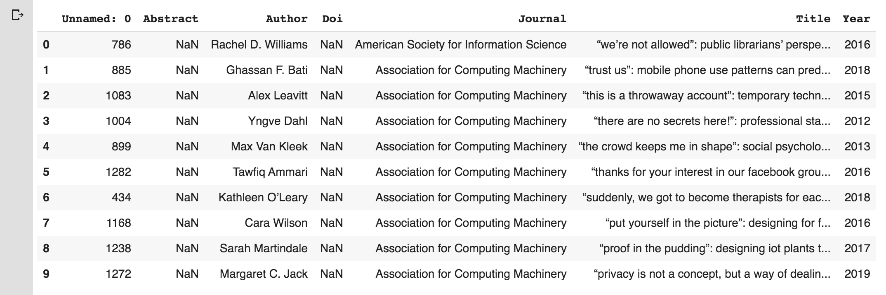

如我们所见，有几列。我们只对研究论文的标题感兴趣。因此，我们将只关注标题列。

# 提取关键词

下一步是从标题中提取关键词。我们有几种方法可以提取关键词。这里，我们将使用`sklearn.feature_extraction`模块提供的`TfidfVectorizer`实用方法。让我们开始吧:

1.  要使用该库，我们需要导入基本库:

```py
from sklearn.feature_extraction.text import TfidfVectorizer
from sklearn.cluster import MiniBatchKMeans
from sklearn.decomposition import PCA
from sklearn.manifold import TSNE
```

2.  接下来，让我们学习如何提取关键词:

```py
tfidf = TfidfVectorizer(
   min_df = 5,
    max_df = 0.95,
    max_features = 8000,
    stop_words = 'english'
)
tfidf.fit(df.Title)
text = tfidf.transform(df.Title)
```

You can find out more about TfidfVectorizer by reading the official documentation: [https://scikit-learn.org/stable/modules/generated/sklearn.feature_extraction.text.TfidfVectorizer.html](https://scikit-learn.org/stable/modules/generated/sklearn.feature_extraction.text.TfidfVectorizer.html).

在前面的代码中，我们将标题转换为 TF-IDF 特性。我们正在从标题中删除停止词。

You can read more about stop words at [https://nlp.stanford.edu/IR-book/html/htmledition/dropping-common-terms-stop-words-1.html](https://nlp.stanford.edu/IR-book/html/htmledition/dropping-common-terms-stop-words-1.html). 

如果你理解了集群的概念，你可能已经理解了围绕集群的最大挑战之一；也就是说，确定有多少集群是最佳的。有一些算法可以帮助我们确定最佳的聚类数。其中一个算法是肘关节法([https://www.scikit-yb.org/en/latest/api/cluster/elbow.html](https://www.scikit-yb.org/en/latest/api/cluster/elbow.html))。

让我们创建一个函数，获取文本和最大数量的聚类，并将它们绘制在图表上。这样做的代码如下:

```py
def generate_optimal_clusters(data, max_k):
    iters = range(2, max_k+1, 2)

    sse = []
    for k in iters:
        sse.append(MiniBatchKMeans(n_clusters=k, init_size=1024, batch_size=2048, random_state=20).fit(data).inertia_)
        print('Fitting {} clusters'.format(k))

    f, ax = plt.subplots(1, 1)
    ax.plot(iters, sse, marker='o')
    ax.set_xlabel('Cluster Centers')
    ax.set_xticks(iters)
    ax.set_xticklabels(iters)
    ax.set_ylabel('SSE')
    ax.set_title('SSE by Cluster Center Plot')

generate_optimal_clusters(text, 20)
```

关于前面的功能，请注意以下几点:

*   它需要两个参数，文本和最大聚类数。在这种情况下，我们假设集群的最大数量是 20。
*   接下来，在函数内部，我们调用`MiniBatchKMeans`簇上的`fit()`方法，范围从 2 到允许的最大簇数(2 到 20)。
*   对于每个聚类，我们计算图中的**平方误差之和** ( **SSE** )。

前面代码的输出如下:


如上图所示，弯头在 4 处发生变化。根据弯头理论，该图在最佳簇号处创建弯头。因此，在这种情况下，最佳集群是 4。

# 绘制集群

现在，让我们在图上画出这些簇。我们将开始使用**主成分分析** ( **主成分分析**)进行绘图，因为它擅长捕捉数据的全局结构。然后，我们将使用**t-分布式随机邻居嵌入** ( **TSNE** )来绘制图表，因为它擅长捕捉与邻居的关系。让我们开始吧:

1.  让我们从再次创建模型开始:

```py
clusters = MiniBatchKMeans(n_clusters=4, init_size=1024, batch_size=2048, random_state=20).fit_predict(text)
```

2.  让我们绘制两张图表。首先，我们将使用主成分分析技术绘图，然后使用 TSNE 技术。使用以下代码来完成此操作:

```py
max_label = max(clusters)
max_items = np.random.choice(range(text.shape[0]), size=3000, replace=True)
pca = PCA(n_components=2).fit_transform(text[max_items,:].todense())
tsne = TSNE().fit_transform(PCA(n_components=50).fit_transform(text[max_items,:].todense()))

idx = np.random.choice(range(pca.shape[0]), size=300, replace=True)
label_subset = clusters[max_items]
label_subset = [cm.hsv(i/max_label) for i in label_subset[idx]]

f, ax = plt.subplots(1, 2, figsize=(14, 6))
ax[0].scatter(pca[idx, 0], pca[idx, 1], c=label_subset)
ax[0].set_title('Generated PCA Cluster Plot')

ax[1].scatter(tsne[idx, 0], tsne[idx, 1], c=label_subset)
ax[1].set_title('Generated TSNE Cluster Plot')

```

前面代码的输出如下:

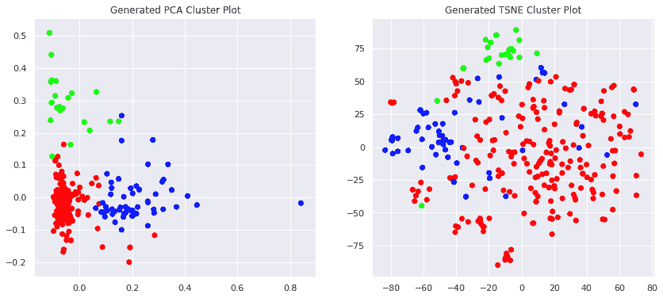

每种颜色代表一种集群。在前面的代码中，我们对特征进行了采样，只捕获了 3，000 个文档以加快处理速度，并使用散点图绘制了它们。对于主成分分析，我们将维度减少到 50。

You can learn more about TSNE from the official website: [https://scikit-learn.org/stable/modules/generated/sklearn.manifold.TSNE.html](https://scikit-learn.org/stable/modules/generated/sklearn.manifold.TSNE.html).

请注意，很难找出在每种类型的集群中找到了哪些关键字。为了更好地可视化这一点，我们需要绘制每个集群的单词 cloud。

# 单词云

为了看到属于每个聚类的前几个关键词，我们需要创建一个函数，为我们提供每个聚类的前 50 个单词，并绘制单词云。

检查功能，如下所示:

```py
from wordcloud import WordCloud 

fig, ax = plt.subplots(4, sharex=True, figsize=(15,10*4))

plt.rcParams["axes.grid"] = False

def high_frequency_keywords(data, clusters, labels, n_terms):
    df = pd.DataFrame(data.todense()).groupby(clusters).mean()

    for i,r in df.iterrows():
      words = ','.join([labels[t] for t in np.argsort(r)[-n_terms:]])
      print('Cluster {} \n'.format(i))
      print(words)
      wordcloud = WordCloud(max_font_size=40, collocations=False, colormap = 'Reds', background_color = 'white').generate(words)
      ax[i].imshow(wordcloud, interpolation='bilinear')
      ax[i].set_title('Cluster {} '.format(i), fontsize = 20) 
      ax[i].axis('off') 
high_frequency_keywords(text, clusters, tfidf.get_feature_names(), 50)
```

前面代码的输出被分成两部分。让我们看看文本输出:

```py
Cluster 0 
bipolar,patient,framework,evaluation,risk,older,internet,healthcare,activity,approach,online,anxiety,research,digital,children,assessment,clinical,dementia,adaptive,cognitive,intervention,disorders,technology,learning,psychiatric,community,interventions,management,therapy,review,adults,use,support,designing,schizophrenia,stress,data,people,analysis,care,self,mobile,disorder,using,patients,design,study,treatment,based,depression

Cluster 1 
cessation,brief,comparing,single,disorder,people,adults,symptoms,risk,clinical,women,prevention,reduce,improve,training,use,results,online,personalized,internet,cluster,alcohol,anxiety,feedback,efficacy,patients,health,mental,therapy,primary,help,self,program,care,effects,cognitive,pilot,treatment,depression,tailored,effectiveness,web,based,randomised,study,intervention,protocol,randomized,controlled,trial

Cluster 2 
qualitative,physical,digital,implementation,self,medical,management,patient,adults,designing,life,quality,work,development,systems,data,related,children,persons,support,online,analysis,assessment,information,intervention,veterans,service,design,patients,problems,behavioral,using,research,systematic,disorders,use,interventions,primary,treatment,based,study,services,review,severe,people,community,illness,care,mental,health

Cluster 3 
modeling,implications,ethical,emotion,behavioral,dementia,based,young,designing,homeless,dynamics,group,experiences,robot,predicting,mobile,game,depression,understanding,physical,people,challenges,therapy,study,patients,management,technology,impact,technologies,self,anxiety,use,skills,interaction,networking,personal,disclosure,sites,data,networks,disclosures,using,design,online,network,support,mental,health,media,social
```

请注意，它打印了四个不同的簇，每个簇中有 50 个经常出现的单词。很容易看到属于每个聚类的关键词，并判断聚类是否正确。为了正确呈现这些单词，我们生成了一个单词云。

字云如下:

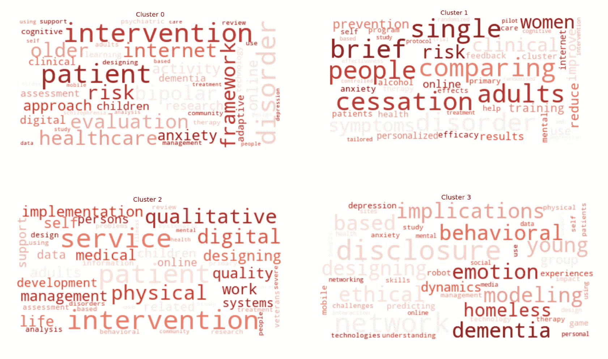

我们可以看到，有四个集群。每个聚类显示最相关的单词。例如，聚类 0 显示了许多与医疗保健、干预、框架、数字健康等相关的单词。这样做，更容易看出关键词之间的关系。

在下一节中，我们将讨论强化学习。

# 理解强化学习

在强化学习中，代理改变其状态以最大化其目标。这里有四个截然不同的概念:代理人、国家、行动和奖励。让我们更详细地看看这些:

*   **特工:**这是我们训练的节目。它从环境中的动作空间中为指定的任务选择动作。
*   **状态:**这是代理从其环境接收到的观察，代表代理的当前情况。
*   **动作:**这是代理从其动作空间做出的选择。该操作会更改代理的状态。
*   **奖励**:这是关于代理人行为的结果反馈，描述了代理人应该如何表现。

下图说明了这些概念中的每一个:

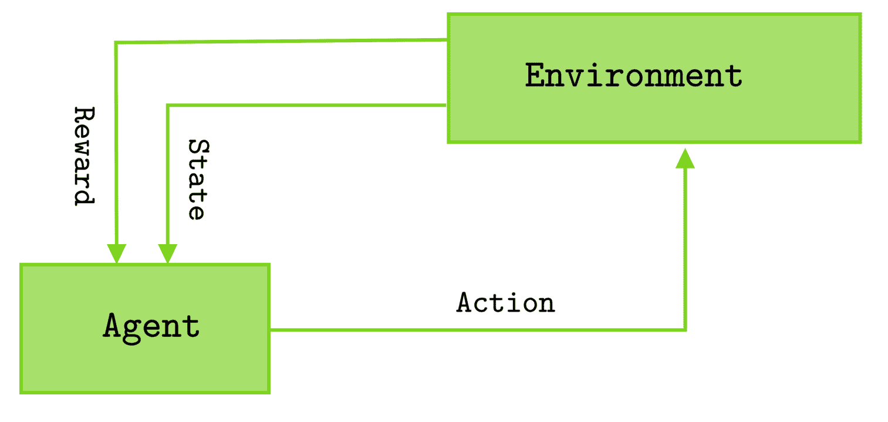

如上图所示，强化学习涉及一个主体、一个环境、一组动作、一组状态和一个奖励系统。代理与环境交互并修改其状态。基于这种修改，它的输入得到奖励或惩罚。代理的目标是随着时间的推移使回报最大化。

# 监督学习和强化学习的区别

当我们有标记的训练数据集时，使用监督学习算法。强化学习用于代理与环境交互以观察基本行为并改变其状态以最大化其回报或目标的场景。

下表给出了它们之间的其他差异:

| **标准** | **监督学习** | **强化学习** |
| 例子 | 数字识别。 | 象棋比赛。 |
| 对…有效 | 给定标记数据集。 | 与给定的环境互动。 |
| 决定 | 根据开始时给出的输入做出决定。 | 在这里，算法帮助线性地做出决定。 |

RL 的一个基本特征是，代理的操作可能不会影响它正在工作的环境的当前状态，但会影响后续状态。因此，算法可能不会在初始状态下学习，但可以在一些状态改变后学习。

# 强化学习的应用

RL 算法有几个用例。

一些最重要的用例如下:

*   **文本挖掘:**一些研究人员和公司已经开始使用基于 RL 的文本生成模型，从长文本中生成可读性很强的文本摘要。
*   **Robotics** :在机器人工程领域使用了多种基于深度 RL 的算法，来提升基于奖励系统的机器人性能。
*   **医疗保健**:多项研究表明，RL 可用于医疗保健，优化用药剂量和治疗政策。
*   **交易**:交易业务中使用了几种基于 RL 的模型来优化交易结果。

# 统一机器学习工作流

选择使用什么机器学习算法总是取决于您拥有的数据类型。如果你有一个带标签的数据集，那么你最明显的选择就是选择一种有监督的机器学习技术。此外，如果您的标记数据集包含目标变量的真实值，那么您将选择回归算法。最后，如果您的标记数据集在目标变量中包含一个分类变量，那么您将选择分类算法。无论如何，您选择的算法始终取决于您拥有的数据集类型。

类似地，如果数据集不包含任何目标变量，那么显而易见的选择是无监督算法。在本节中，我们将研究机器学习的统一方法。

机器学习工作流程可以分为几个阶段:

*   数据预处理
*   数据准备
*   训练集和语料库创建
*   模型创建和培训
*   模型评估
*   最佳模型选择和评估
*   模型部署

机器学习算法的整个工作流程如下图所示:

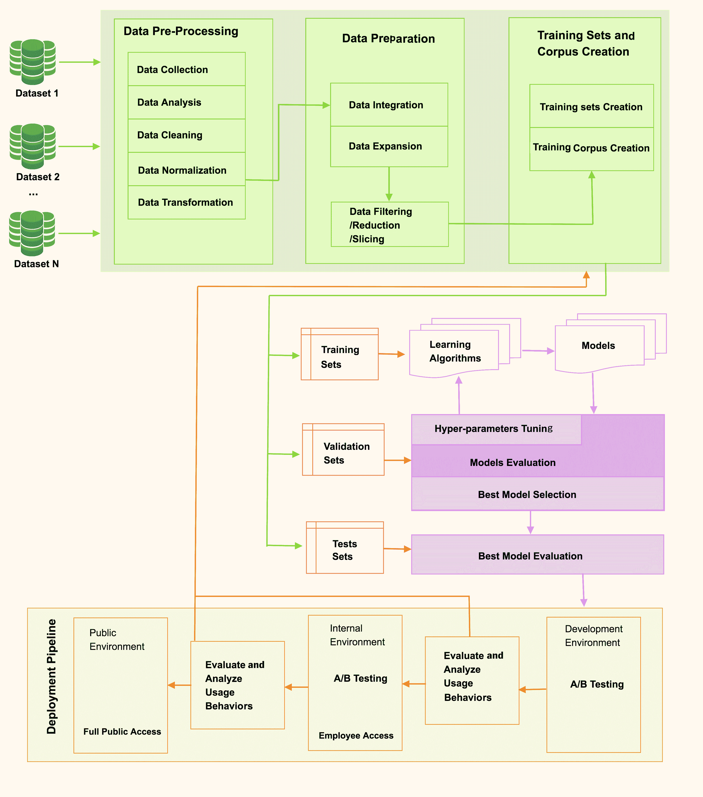

如上图所示，任何机器学习工作流的第一步都是数据预处理。我们将在以下几节中简要解释每个阶段。

# 数据预处理

数据预处理涉及几个步骤，包括数据收集、数据分析、数据清理、数据规范化和数据转换。数据预处理的第一步是数据收集。让我们来看看。

# 数据收集

在**数据科学**中，最重要的是数据。这些数据掌握着我们周围发生的任何事件、现象或实验的基本事实。一旦我们处理了数据，我们就会得到信息。一旦我们处理了这些信息，我们就可以从中获得知识。因此，知识提取中最突出的阶段是被捕获的数据的相关性。有不同类型的数据，包括**结构化数据**、**非结构化数据**、**半结构化数据**。结构化数据在所有观察中保持统一的结构，类似于关系数据库表。非结构化数据不维护任何特定的结构。半结构化数据在观察中保持一定的结构。 **JavaScript 对象标注** ( **JSON** )是存储半结构化数据最流行的方式之一。

任何公司收集数据的过程都取决于需要研究的项目种类和信息类型。不同类型的数据集包括文本数据、文件、数据库、传感器数据和许多其他**物联网** ( **物联网**)数据。然而，当学习机器学习工作流程时，大多数学生更喜欢避开数据收集阶段，使用来自卡格尔和 UCI 机器学习资源库等地方的开源数据。

# 数据分析

这是我们执行探索性数据分析以了解数据集的初步分析阶段之一。我们在[第 3 章](03.html)、 *EDA 和个人电子邮件分析*中讨论了可以执行的几种技术。这一步告诉我们手头的数据类型、目标变量、数据中有多少行和列、每列的数据类型、缺少多少行、数据分布是什么样子等等。

# 数据清理、标准化和转换

我们在[第 4 章](04.html)、*数据转换*中详细讨论了数据清理、规范化和数据转换。我们讨论了如何重新缩放数据集，如何将数据集转换为标准数据集，如何对数据进行二值化，以及如何执行一次性编码和标签编码。

经过这三个步骤后，我们丢失的数据将得到处理，噪声数据将被过滤，不一致的数据将被删除。

# 数据准备

有时，我们拥有的数据集并不总是处于适合机器学习算法使用的状态。在这种情况下，数据准备是我们能做的最基本的事情之一。我们需要集成来自多个来源的数据，执行切片和分组，并将它们聚合成正确的格式和结构。这一步被称为数据准备。

我们在[第 6 章](06.html)、*分组数据集*中详细讨论了这个过程。需要注意的是，有些书认为数据预处理和数据准备是同一个步骤，因为有几个重叠的操作。

# 训练集和语料库创建

在数据准备步骤之后，得到的数据集被用作训练语料库。通常，训练语料库被分成三大块:训练集、验证集和测试集。

**训练集**是您用来训练一个或多个机器学习算法的数据块。**验证集**是用于验证训练模型的数据块。最后，**测试集**是你用来评估一个完全训练好的分类器性能的数据块。

# 模型创建和培训

一旦我们将数据集分成三大块，我们就可以开始训练过程了。我们使用训练集来构建机器学习模型。然后，我们使用验证集来验证模型。一旦模型已经被训练，我们使用测试集来找到模型的最终性能。

# 模型评估

基于测试数据的表现，我们可以创建一个**混淆矩阵**。该矩阵包含四个不同的参数:真阳性、真阴性、假阳性和假阴性。考虑以下混淆矩阵:

|  | 预测:阳性 | 预测:阴性 |
| 实际:正 | 真阳性 | 假阴性 |
| 实际:负 | 假阳性 | 真负值 |

该矩阵显示了四个不同的参数:

*   **真阳性**:当实际值为真时，模型预测为真。
*   **真否定**:当实际值为假时，模型预测为假。
*   **误报**:当实际值为假时，模型预测为真。这也被称为第一类错误。
*   **假阴性**:当实际值为真时，模型预测为假。这也被称为第二类错误。

一旦我们知道了混淆矩阵，我们就可以计算模型的几个精度，包括精度、负谓词值、灵敏度、特异性和准确性。让我们一个接一个地看看它们，并了解它们是如何计算的。

**精度**是真阳性与真阳性和假阳性之和的比值。公式如下:

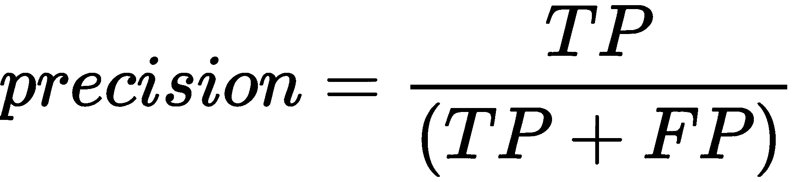

**阴性预测值** ( **净现值**)的公式如下:

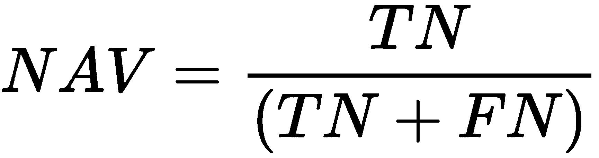

相似度，**灵敏度**的公式如下:

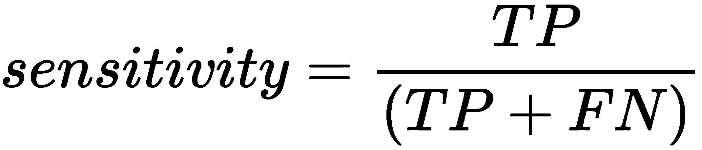

特异性公式如下:

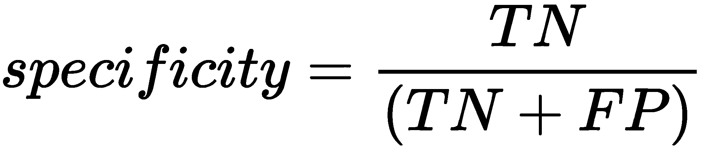

最后，模型的精度由以下公式给出:

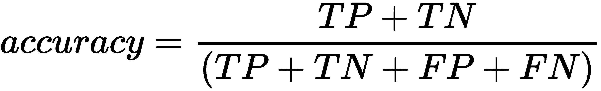

我们来看一个例子。假设我们构建了一个监督分类算法，该算法查看窗口的图片，并将其分类为脏或不脏。最终的混淆矩阵如下:

|  | 预测:肮脏 | 预测:不脏 |
| 实际:脏 | TP = 90 | FN = 40 |
| 实际:不脏 | FP = 10 | TN = 60 |

现在，让我们计算一下这种情况下的精度度量:

*   精度= TP / (TP + FP) = 90 /(90 + 10) = 90%。这意味着 90%被归类为脏的图片实际上是脏的。
*   灵敏度= TP / (TP + FN) = 90/(90 + 40) = 69.23%。这意味着 69.23%的脏窗户被正确分类，并从所有非脏窗户中排除。
*   特异性= TN / (TN + FP) = 60 / (10 + 60) = 85.71%。这意味着 85.71%的非脏窗户被准确分类并排除在脏窗户之外。
*   准确率= (TP + TN)/(TP + TN + FP + FN) = 75%。这意味着 75%的样本被正确分类。

你会遇到的另一个常用的准确度模型是 **F1 评分**。它由以下等式给出:

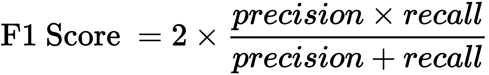

我们可以看到，F1 的分数是召回率和准确率的加权平均值。准确度测量太多了，对吧？这在一开始可能会令人生畏，但随着时间的推移，你会习惯的。

# 最佳模型选择和评估

模型选择是机器学习算法工作流程中必不可少的一步。但是，模型选择在不同的上下文中有不同的含义:

*   **上下文 1** :在机器学习工作流上下文中，**模型选择是选择最佳机器学习算法**的过程，如 logistic 回归、SVM、决策树、Random Forest 分类器等等。
*   **上下文 2** :类似的，模型选择阶段也是指针对任意选择的机器学习算法，在不同的**超参数**之间进行选择的过程。

通常，模型选择是从给定训练数据集的可能候选算法列表中选择一个最佳机器学习算法的方法。有不同的模型选择技术。在正常情况下，我们将训练语料库分成训练集、验证集和测试集。然后，我们在训练集上拟合几个候选模型，使用验证集评估模型，并在测试集上报告模型的性能。然而，只有当我们有足够大的训练语料库时，这种模型选择的场景才起作用。

然而，在许多情况下，用于培训和测试的数据量是有限的。在这种情况下，模型选择变得困难。在这种情况下，我们可以使用两种不同的技术:**概率测量**和**重采样方法**。如果你想了解这些模型选择技巧，我们建议你继续阅读本章的*章节。*

# 模型部署

一旦你得到了基于你的数据集的最佳模型，并且这个模型已经被完全训练好了，是时候部署它了。展示如何将模型完全部署到工作环境中超出了本书的范围。您可以在*进一步阅读*部分找到足够的资源，为您指明正确的方向。

关于模型部署的主要思想是在真实的工作环境中使用训练好的模型。一旦部署，它应该通过 A/B 用户测试，以便您知道它在真实场景中如何工作。一旦经过全面测试，该应用编程接口就可以向公众开放。

# 摘要

在这一章中，我们为数据科学奠定了一些基础，了解了可以构建的不同类型的模型，以及如何对它们进行评估。首先，我们讨论了几种监督学习算法，包括回归和分类。然后，我们讨论了无监督学习算法，包括聚类和使用文本数据聚类成不同的聚类使用迷你批处理知识的算法。最后，我们简要讨论了强化学习。

在下一章中，我们将使用到目前为止所学的所有技术对葡萄酒质量数据集执行 EDA。此外，我们将使用监督学习算法对葡萄酒质量进行分类。

# 进一步阅读

*   *使用 Python 的监督式机器学习*、*泰勒*、*史密斯*、*帕克特出版*
*   *使用 Python 进行大规模机器学习*、*巴斯蒂安·萨贾丁*、*卢卡·马萨龙*、*等人*。，*派克特出版*
*   *Python 高级机器学习**约翰·哈迪**帕克特出版*
*   *用 Python 进行无监督学习的实践*、*朱塞佩·博纳科尔索*、*帕克特出版*
*   *掌握渗透测试的机器学习**奇赫布切比**派克特出版*
*   *动手数据科学与 Python 机器学习**弗兰克·凯恩**帕克特出版*
*   *用 Python 构建机器学习系统-第三版*、*路易斯·佩德罗·科埃略*、*威利·里歇特*、*等人*。，*派克特出版**