# 十一、葡萄酒质量数据 EDA

到目前为止，我们已经讨论了大量关于**探索性数据分析** ( **EDA** )的工具和技术，包括我们如何从不同来源导入数据集，以及如何从数据集中移除异常值，对数据集执行数据分析，并从这样的数据集生成说明性可视化。除此之外，我们还讨论了如何应用高级数据分析，如变量之间的相关性、回归分析和时间序列分析，并基于此类数据集构建高级模型。在本章中，我们将把所有这些技术应用于葡萄酒质量数据集。

本章讨论的主要主题包括以下内容:

*   公开葡萄酒质量数据集
*   分析红酒
*   分析白酒
*   模型开发和评估
*   进一步阅读

# 技术要求

本章的整个代码库可以在`CH012`文件夹内与本书共享的 GitHub 资源库中找到。本章使用的数据集可以从 UCI 网站([https://archive.ics.uci.edu/ml/datasets/wine+quality](https://archive.ics.uci.edu/ml/datasets/wine+quality))下载，该网站是面向最终用户的开源网站。

我们假设您已经阅读了前面的章节，并且对所需的 Python 库有足够的了解。

# 公开葡萄酒质量数据集

葡萄酒质量数据集包含葡萄酒各种物理化学特性的信息。整个数据集分为两类:红酒和白酒。每种葡萄酒都有相关的质量标签。标签在 0 到 10 的范围内。在下一节中，我们将下载数据集并将其加载到 Python 中，并执行初步分析以揭示其中的内容。

# 正在加载数据集

如*技术要求*部分所述，数据集可以直接从 UCI 网站下载。现在，让我们使用 pandas `pd.read_csv()`方法将数据集加载到 Python 环境中。到目前为止，这个操作应该是相对容易和直观的:

1.  我们从加载 pandas 库开始，创建两个不同的数据框架，即`df_red`用于保存红酒数据集，`df_white`用于保存白酒数据集:

```py
import pandas as pd

df_red = pd.read_csv("https://archive.ics.uci.edu/ml/machine-learning-databases/wine-quality/winequality-red.csv", delimiter=";")
df_white = pd.read_csv("https://archive.ics.uci.edu/ml/machine-learning-databases/wine-quality/winequality-white.csv", delimiter=";")
```

2.  我们创建了两个数据帧。让我们检查可用列的名称:

```py
df_red.columns
```

此外，这里给出了前面代码的输出:

```py
Index(['fixed acidity', 'volatile acidity', 'citric acid', 'residual sugar',
       'chlorides', 'free sulfur dioxide', 'total sulfur dioxide', 'density',
       'pH', 'sulphates', 'alcohol', 'quality'],
      dtype='object')
```

如该输出所示，数据集包含以下列:

*   `Fixed acidity`:表示葡萄酒中酒石酸的含量，单位为克/分 <sup>3</sup> 。
*   `Volatile acidity`:表示酒中醋酸的量。以 g/dm <sup>3</sup> 计量。
*   `Citric acid`:表示酒中柠檬酸的量。也以 g/dm <sup>3</sup> 计量。
*   `Residual sugar`:表示发酵过程完成后，葡萄酒中剩余的糖量。也以 g/dm <sup>3</sup> 计量。
*   `Free sulfur dioxide`:测量游离形式的二氧化硫(SO <sub>2</sub> )的量。也以 g/dm <sup>3</sup> 计量。
*   `Total sulfur dioxide`:测量酒中 SO <sub>2</sub> 的总量。这种化学物质作为抗氧化剂和抗菌剂。
*   `Density`:表示酒的密度，单位为克/分 <sup>3</sup> 。
*   `pH`:表示酒的 pH 值。值的范围在 0 到 14.0 之间，表示酸度非常高，14 表示碱性酸度。
*   `Sulphates`:表示酒中硫酸钾的量。也以 g/dm <sup>3</sup> 计量。
*   `Alcohol`:表示酒中的酒精含量。
*   `Quality`:表示酒的质量，范围从 1 到 10。在这里，价值越高，酒越好。

讨论了数据集中的不同列后，现在让我们在下一节中查看数据的一些基本统计信息。

# 描述性统计学

让我们看看红酒数据框中的一些样本数据。请记住，我们可以使用不同的方法来查看数据框中的数据，包括`pd.head()`、`pd.tail()`和`pd.iloc()`:

1.  在这里，我将检查第 100 <sup>行</sup>和第 110 <sup>行</sup>之间的条目:

```py
df_red.iloc[100:110]
```

这里给出了前面代码的输出:

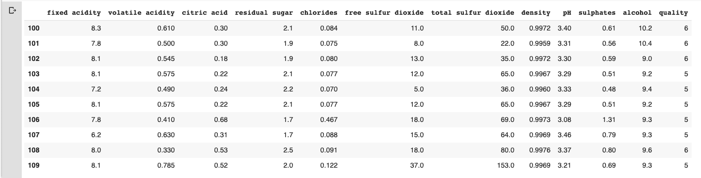

Figure 12.1 - Display the entries from the 100th to 110th rows from the red wine dataframe

2.  除此之外，我们还可以看到每一列的数据类型。让我们使用这里给出的片段:

```py
df_red.dtypes
```

前面代码的输出如下:

```py
fixed acidity float64
volatile acidity float64
citric acid float64
residual sugar float64
chlorides float64
free sulfur dioxide float64
total sulfur dioxide float64
density float64
pH float64
sulphates float64
alcohol float64
quality int64
dtype: object
```

如前面的输出所示，除了`quality`列是`int64`之外，大部分列都是`float64`格式。

3.  我们还可以描述数据帧以获得更多描述性信息。你还记得这样做的方法的名字吗？当然，我们使用`pd.describe()`方法。查看代码片段:

```py
df_red.describe()
```

这里给出了前面代码的输出:

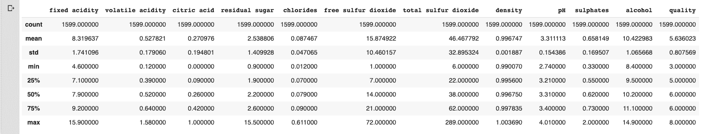

Figure 12.2 - Output of the described method 

注意*图 12.2* 是`pd.describe()`方法的输出，表示每一列都有相同的条目数，1，599，显示在行计数中。现在，每一行和每一列的值都应该有意义了。如果你还不明白，我们强烈建议修改[第五章](05.html) *、描述性统计*。

# 数据争论

嗯，*图 12.2* 显示每一列都有相同的项目数，说明没有遗漏值。

我们可以使用这里显示的`pd.info()`方法来验证:

```py
df_red.info()
```

给出了前面代码的输出:

```py
<class 'pandas.core.frame.DataFrame'>
RangeIndex: 1599 entries, 0 to 1598
Data columns (total 12 columns):
fixed acidity 1599 non-null float64
volatile acidity 1599 non-null float64
citric acid 1599 non-null float64
residual sugar 1599 non-null float64
chlorides 1599 non-null float64
free sulfur dioxide 1599 non-null float64
total sulfur dioxide 1599 non-null float64
density 1599 non-null float64
pH 1599 non-null float64
sulphates 1599 non-null float64
alcohol 1599 non-null float64
quality 1599 non-null int64
dtypes: float64(11), int64(1)
memory usage: 150.0 KB
```

如前面的输出所示，所有列都没有空值。由于没有空条目，我们不需要处理丢失的值。假设有一些，那么我们将使用我们在[第 4 章](04.html)、*数据转换*中概述的技术来处理它们。

We can also access the data quality and missing values using the ways shown in [Chapter 4](04.html), *Data Transformation*. We can use the pandas method, `df_red.isnull().sum().` 

既然知道不需要进一步的数据转换步骤，我们就在下一节回顾一下红酒的数据分析。

# 分析红酒

在本节中，我们将继续分析红酒数据集。首先，我们将从探索最相关的列开始。其次，我们将比较两个不同的列并观察它们的列。

我们先从`quality`栏开始:

```py
import seaborn as sns

sns.set(rc={'figure.figsize': (14, 8)})
sns.countplot(df_red['quality'])
```

这里给出了前面代码的输出:


Figure 12.3 - The output indicates that the majority of wine is of medium quality 

这并不难，不是吗？正如我一直认为的，当你有一个图表时，最重要的一个方面是能够解释结果。如果勾选*图 12.3* ，可以看到大部分红酒属于质量标签 3 和 4 的那一组，其次是标签 5 和 6，部分红酒属于标签 7 的那一组，以此类推。

# 查找相关列

接下来让我们找出红酒数据库中哪些列是高度相关的。如果你还记得，我们在[第 7 章](07.html)*中讨论了不同类型的相关性。*为了让你把握关联背后的意图，我强烈推荐你去翻看[第七章](07.html)、*关联*，只是为了重整一下记忆。说到这里，让我们继续寻找高度相关的列:

1.  我们可以继续使用`seaborn.pairplot()`方法，如下图所示:

```py
sns.pairplot(df_red)
```

您应该会得到一个非常全面的图表，如屏幕截图所示:

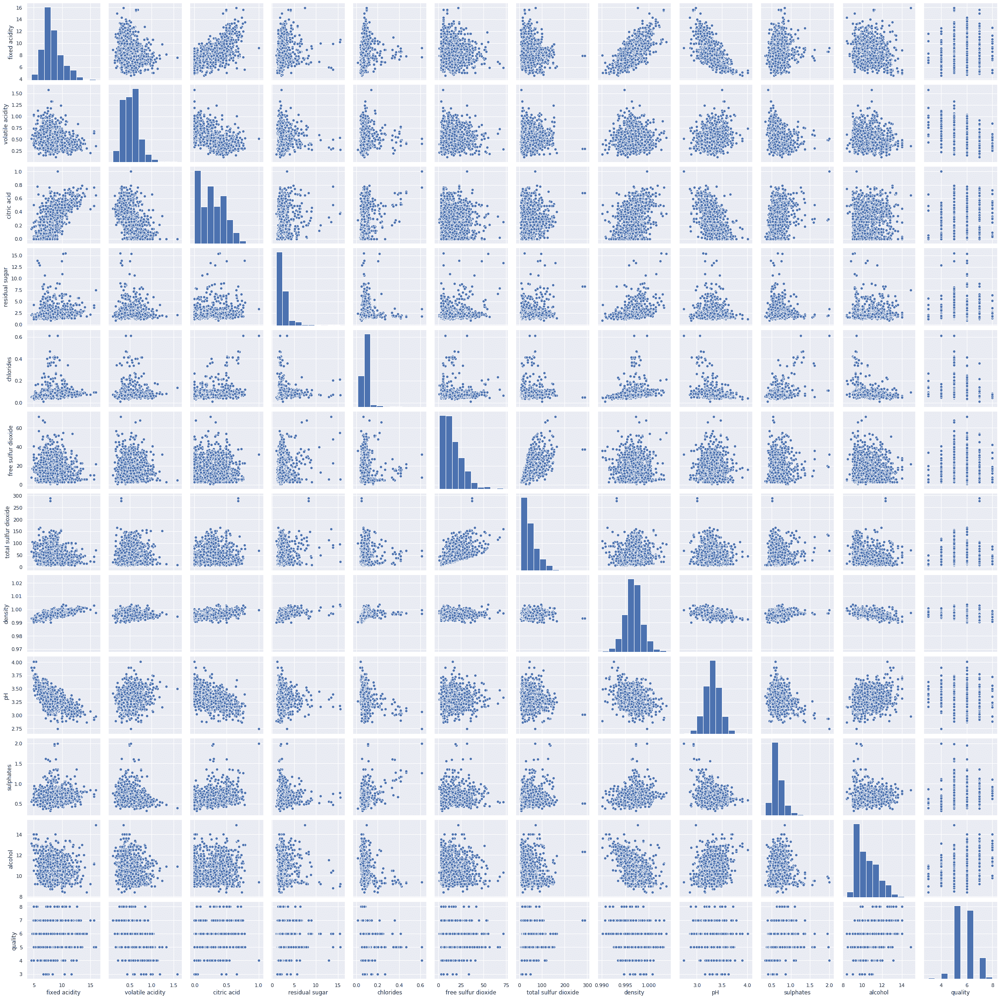

Figure 12.4 - Correlation between different columns of the red wine dataframe

前面的屏幕截图显示了每对可能的组合列的分散图。该图说明了固定酸度和密度之间的一些正相关关系。酸度与 pH 呈负相关，同样，酒精百分比与密度也呈负相关。此外，您可以准确地看到哪些列与其他列具有正相关或负相关。然而，由于`pairplot`图没有数字，解释结果可能会有点偏差。例如，检查固定酸度和挥发性酸度的色谱柱之间的相关性。这个图可能是对称的。然而，你可能会说在图的右边有一些稀疏的点，所以有轻微的负相关。在这里，我的观点是，没有任何具体的可量化的数字，很难讲。这就是为什么我们可以用`sns.heatmap()`方法来量化相关性的原因。

2.  我们可以生成`heatmap`图，如下图所示:

```py
sns.heatmap(df_red.corr(), annot=True, fmt='.2f', linewidths=2)
```

它产生的输出如下:

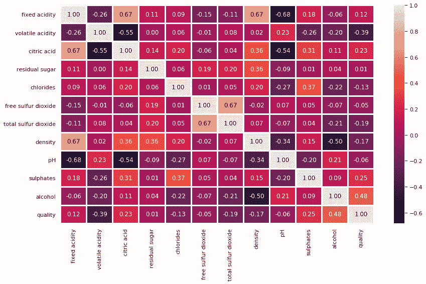

Figure 12.5 - Heatmap showing the correlation between different columns

*图 12.5* 描绘了不同列之间的相关性。由于我们关注的是质量柱，因此质量柱与酒精、硫酸盐、残糖、柠檬酸和固定酸度呈正相关。因为有数字，所以很容易看出哪些列是正相关的，哪些列是负相关的。

看*图 12.5* 是否可以得出以下结论:

*   酒精与红酒的质量呈正相关。
*   酒精与 pH 值呈弱正相关。
*   柠檬酸和密度与固定酸度呈强正相关。
*   酸碱度与密度、固定酸度、柠檬酸和硫酸盐呈负相关。

从*图 12.5* 的热图中我们可以得出几个结论。此外，我们必须认识到相关性的重要性，以及在数据科学模型开发过程中，相关性如何帮助我们确定特征集。

A column has a perfect positive correlation with itself. For example, the quality of wine has a positive correlation with itself. This is the reason why all of the diagonal elements have a positive correlation of 1. 

我们可以进一步深入到单个列并检查它们的分布。比方说，我们想看看酒精浓度相对于红酒质量的分布情况。首先，让我们绘制分布图，如下所示:

```py
sns.distplot(df_red['alcohol'])
```

前面代码的输出如下:

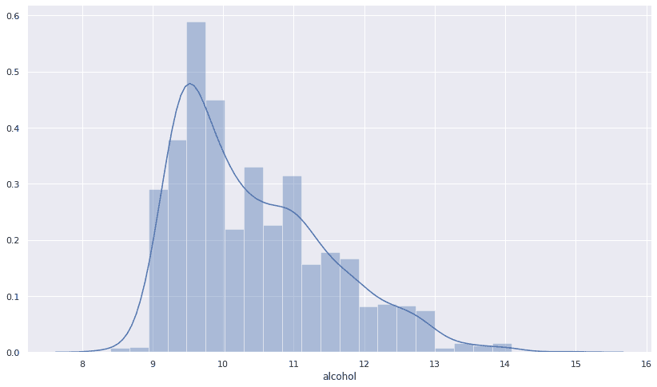

Figure 12.6 - Alcohol distribution graph

从*图 12.6* 可以看出，酒精分布与红酒品质呈正相关。我们可以使用 scipy.stats 中的`skew`方法来验证这一点。

```py
from scipy.stats import skew
skew(df_red['alcohol'])
```

前面代码的输出如下:

```py
0.8600210646566755
```

输出证实酒精是正向倾斜的。这让我们对酒精一栏有了更深入的了解。

请注意，我们可以验证每一列，并尝试查看它们相对于另一列的偏斜度、分布和相关性。这通常是必要的，因为我们正在经历特征工程的过程。

# 酒精与质量

让我们看看葡萄酒的质量是如何随着酒精浓度而变化的。这可以使用方框图来完成。检查这里给出的代码片段:

```py
sns.boxplot(x='quality', y='alcohol', data = df_red)
```

前面代码的输出如下:

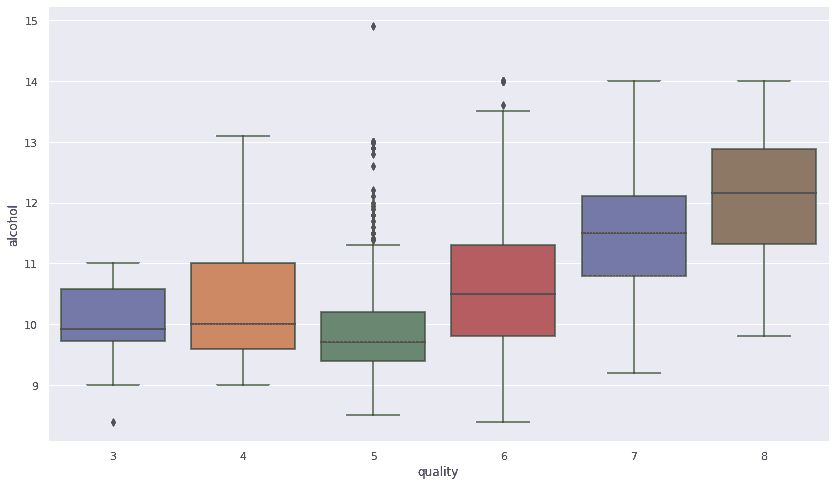

Figure 12.7 - A box plot showing the variation of the quality of wine with respect to alcohol concentration

注意*图 12.7* 中的方框，显示了图外的一些点。这些都是异常值。*图 12.7* 所示的大部分异常值都在品质 5 和 6 的葡萄酒附近。我们可以通过传递参数`showoutliers=False`来移除异常值，如以下代码所示:

```py
sns.boxplot(x='quality', y='alcohol', data = df_red, showfliers=False)
```

代码的输出更加清晰，如下所示:

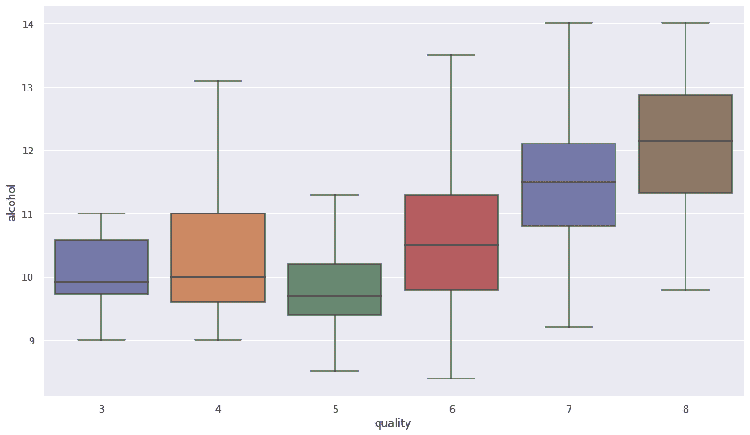

Figure 12.8 -A box plot showing the variation of the quality of wine with respect to alcohol concentration without outliers

注意，从*图 12.8* 来看，似乎随着酒质的提升，酒精浓度也随之提升。有道理，对吧？酒精浓度越高，酒的质量就越高。

# 酒精对酸碱度

接下来，我们也来看看酒精`column`与 pH 值的相关性。从*图 12.5* 我们已经知道它们是弱正相关的。让我们验证本节中的结果:

1.  首先，我们来看看联合剧情:

```py
sns.jointplot(x='alcohol',y='pH',data=df_red, kind='reg')
```

前面的代码现在对您来说应该不是新的。我们已经在[第 2 章](02.html)、【EDA 中的 T2】视觉辅助、[第 7 章](07.html)、*关联*中讨论过这些情节的意义。由前面的代码生成的图表显示在屏幕截图中:

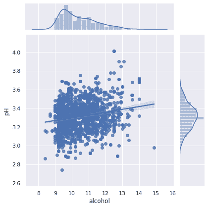

Figure 12.9 - Joint plot illustrating the correlation between alcohol concentration and the pH values 

这张截图显示，酒精与酸碱度呈弱正相关。此外，在截图中描绘了回归线，说明了它们之间的相关性。

2.  我们可以从`scipy.stats`开始使用皮尔逊回归来量化相关性，如下所示:

```py
from scipy.stats import pearsonr

def get_correlation(column1, column2, df):
  pearson_corr, p_value = pearsonr(df[column1], df[column2])
  print("Correlation between {} and {} is {}".format(column1, column2, pearson_corr))
  print("P-value of this correlation is {}".format(p_value))
```

3.  我们可以使用前面的方法来查看任意两列之间的相关性。让我们看看`alcohol`和`pH`的相关性:

```py
get_correlation('alcohol','pH', df_red)
```

前面代码的输出如下所示:

```py
Correlation between alcohol and pH is 0.20563250850549825
P-value of this correlation is 9.96449774146556e-17
```

注意，这与图 12.5 中*所示的数值大致相同。现在，您知道了不同的方法，可以检查两个或多个列的关联有多强或多弱。*

在下一节中，我们将分析白葡萄酒数据框架，并将其与红葡萄酒进行比较。

# 分析白酒

在这一节中，我们将分析白酒，并将其与前一节中的红酒分析进行比较。让我们从加载白葡萄酒数据框开始:

```py
df_white = pd.read_csv("https://archive.ics.uci.edu/ml/machine-learning-databases/wine-quality/winequality-white.csv", delimiter=";")
```

该代码将白葡萄酒数据集加载到`df_white`数据框中。

# 红酒对白酒

我们的输出类是`quality`列。基于该栏，我们可以尝试找到每种葡萄酒的平均质量，如下所示:

```py
print("white mean = ",df_white["quality"].mean())
print("red mean =",df_red["quality"].mean())
```

代码的输出如下:

```py
white mean = 5.87790935075541
red mean = 5.6360225140712945
```

正如产量所说，白葡萄酒的平均质量为 5.877，红葡萄酒的平均质量为 5.63。两个数据框中的列相同。

# 添加新属性

让我们向两个数据帧添加一个新属性`wine_category`。你记得我们是怎么做到的吗？

当然，请检查下面给出的示例代码:

```py
df_white['wine_category'] = 'white'
df_red['wine_category'] = 'red'
```

很简单，对吧？接下来，让我们看看这两种葡萄酒的柱质量有何独特价值:

```py
print('RED WINE: List of "quality"', sorted(df_red['quality'].unique()))
print('WHITE WINE: List of "quality"', sorted(df_white['quality'].unique()))
```

前面代码的输出如下所示:

```py
RED WINE: List of "quality" [3, 4, 5, 6, 7, 8]
WHITE WINE: List of "quality" [3, 4, 5, 6, 7, 8, 9]
```

请注意，红葡萄酒和白葡萄酒在质量栏中具有相同的唯一值。

# 转换成分类列

虽然质量一栏是数字的，但是在这里，我们感兴趣的是把质量作为类。为了清楚起见，让我们在本小节中将数值转换为分类值。

为此，我们需要一套规则。让我们定义一组规则:

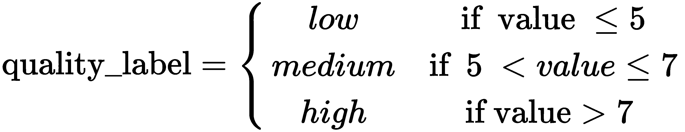

听起来可行，对吧？当然是。让我们检查代码，如下所示:

```py
df_red['quality_label'] = df_red['quality'].apply(lambda value: ('low' if value <= 5 else 'medium') if value <= 7 else 'high')
df_red['quality_label'] = pd.Categorical(df_red['quality_label'], categories=['low', 'medium', 'high'])

df_white['quality_label'] = df_white['quality'].apply(lambda value: ('low' if value <= 5 else 'medium') if value <= 7 else 'high')
df_white['quality_label'] = pd.Categorical(df_white['quality_label'], categories=['low', 'medium', 'high'])
```

到目前为止，前面的代码应该是不言自明的。我们只是使用`pandas.apply()`方法来检查`quality`列中的值。根据它们的价值，如果它们小于或等于 5，我们将其归类为低质量葡萄酒。同样，如果`quality`列的值大于 5 且小于或等于 7，我们将其归类为中等品质葡萄酒。最后，任何列的`quality`值大于 7 的行都被归类为优质葡萄酒。

让我们来数一数每一类葡萄酒的价值:

```py
print(df_white['quality_label'].value_counts())
df_red['quality_label'].value_counts()
```

前面代码的输出如下所示:

```py
medium 3078
low 1640
high 180
Name: quality_label, dtype: int64

medium 837
low 744
high 18
Name: quality_label, dtype: int64
```

上面的是白酒，下面的是红酒。从前面的输出可以非常明显地看出，在这两种情况下，大多数葡萄酒都是中等质量的。

# 连接数据帧

让我们对这两种类型的数据帧进行联合探索。你还记得我们如何合并数据帧吗？如果没有，我强烈建议在这里暂停一下，快速浏览一下[第 6 章](06.html)**分组数据集*:*

 *1.  让我们看看如何连接这两个数据帧:

```py
df_wines = pd.concat([df_red, df_white])
```

2.  让我们重新洗牌，使数据点随机化:

```py
df_wines = df_wines.sample(frac=1.0, random_state=42).reset_index(drop=True)
```

请注意，`drop=True`参数将索引重置为默认的整数索引。

3.  接下来，我们要检查前几列，看看是否所有的行都正确合并了:

```py
df_wines.head()
```

前面代码的输出如下所示:

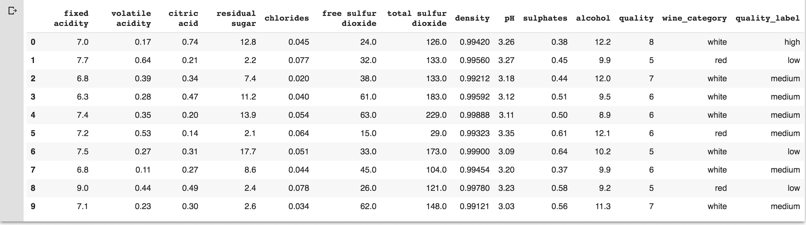

Figure 12.10 - Output of the df.head(10) code snippet shown earlier

注意在*图 12.10* 中，我们已经正确填充了列`wine_category`和`quality_label`。

# 分组列

我们已经在[第 6 章](06.html)*分组数据集*中讨论了使用 Pandas 数据框对列和行进行分组的几种方法。在本节中，我们将使用相同的技术将不同的列组合在一起:

1.  让我们使用组合数据框，并使用列`alcohol`、`density`、`pH`和`quality`对它们进行分组。
2.  接下来，我们可以应用`pd.describe()`方法获得最常用的描述性统计:

```py
subset_attr = ['alcohol', 'density', 'pH', 'quality']

low = round(df_wines[df_wines['quality_label'] == 'low'][subset_attr].describe(), 2)
medium = round(df_wines[df_wines['quality_label'] == 'medium'][subset_attr].describe(), 2)
high = round(df_wines[df_wines['quality_label'] == 'high'][subset_attr].describe(), 2)

pd.concat([low, medium, high], axis=1, 
          keys=[' Low Quality Wine', 
                ' Medium Quality Wine', 
                ' High Quality Wine'])
```

在前面的代码片段中，首先，我们创建了我们感兴趣的属性子集。然后，我们为低品质葡萄酒、中品质葡萄酒和高品质葡萄酒创建了三个不同的数据框。最后，我们将它们串联起来。这里给出了前面代码的输出:

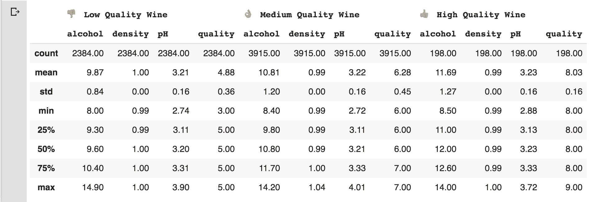

Figure 12.11 - Output of grouping the columns and performing the describe operation

如前面的截图所示，我们将数据集分为三个不同的组:低品质葡萄酒、中品质葡萄酒和高品质葡萄酒。每组显示三种不同的属性:酒精、密度和酸碱度。在数据分析阶段，使用串联方法根据特定条件对列进行分组非常方便。

在下一节中，我们将讨论葡萄酒质量数据集的单变量分析。

# 单变量分析

我们已经在[第 7 章](07.html)、*相关性*中讨论了单变量、双变量和多变量分析。让我们复习一下，看看你还记得多少。

可视化数字数据及其分布的最简单方法是使用直方图。让我们在这里绘制直方图；我们从导入所需的`matplotlib.pyplot`库开始:

```py
import matplotlib.pyplot as plt
from mpl_toolkits.mplot3d import Axes3D
%matplotlib inline
```

接下来，我们绘制直方图，如图所示:

```py
fig = df_wines.hist(bins=15, color='fuchsia', edgecolor='darkmagenta', linewidth=1.0, xlabelsize=10, ylabelsize=10, xrot=45, yrot=0, figsize=(10,9), grid=False)

plt.tight_layout(rect=(0, 0, 1.5, 1.5)) 
```

请注意，我们使用了`tight_layout()`方法来保持图形的组合。

You can get the list of all `matplotlib` color codes from the official website, at [https://matplotlib.org/examples/color/named_colors.html](https://matplotlib.org/examples/color/named_colors.html). 

前面代码的输出如下所示:

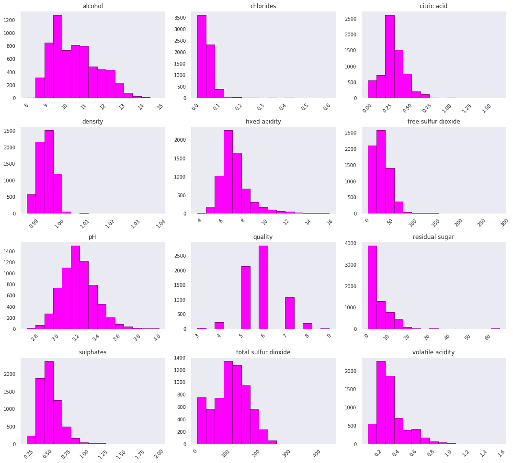

Figure 12.12 - Output of the univariate analysis

前面的截图显示了每个变量/列及其在组合数据框中的分布。到目前为止，结果图应该是不言自明的。

# 组合数据帧的多元分析

让我们使用组合数据集执行多元分析。我们将使用相同的热图图来执行多元分析:

1.  让我们从创建图形开始。首先，我们创建一个子场景:

```py
fig, (ax) = plt.subplots(1, 1, figsize=(14,8))
```

2.  接下来，我们创建热图，如下所示:

```py
hm = sns.heatmap(df_wines.corr(), 
                ax=ax, 
                 cmap="bwr", 
                 annot=True, 
                 fmt='.2f', 
                 linewidths=.05)
```

3.  最后，让我们绘制子情节，并用合适的标题填充它:

```py
fig.subplots_adjust(top=0.93)
fig.suptitle('Combined Wine Attributes and their Correlation Heatmap', fontsize=14, fontweight='bold')
```

前面代码的输出如下所示:

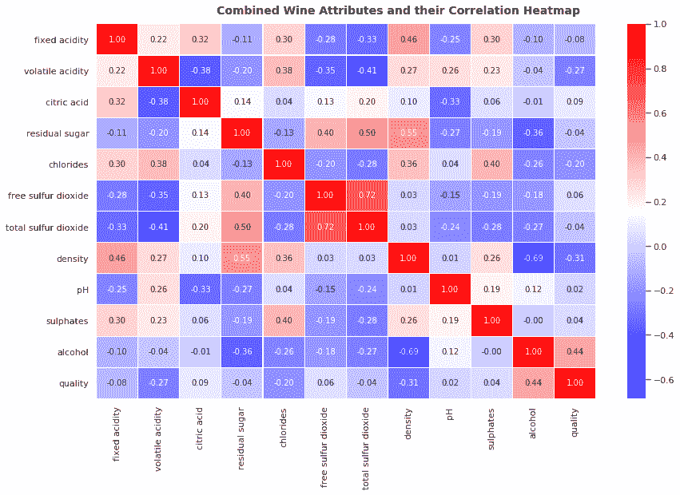

Figure 12.13 - A heatmap illustrating correlation between several columns

注意前面的截图类似于图 12.5*，应该用同样的方式解读。在这种情况下，唯一的区别是我们对组合数据帧进行了多元分析。*

 *# 离散分类属性

我们的数据框中有一个离散的分类列`wine_category`。

让我们使用`seaborn`库使用计数图来可视化它:

```py
fig = plt.figure(figsize=(16, 8))

sns.countplot(data=df_wines, x="quality", hue="wine_category") 
```

前面代码的输出如下所示:

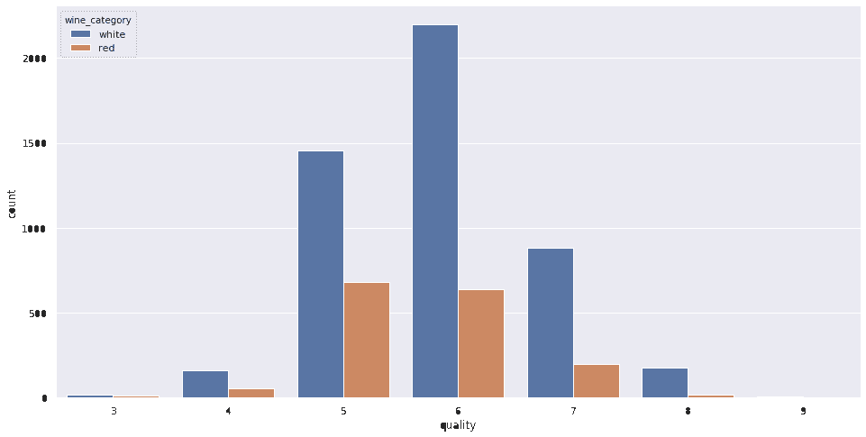

Figure 12.14 - Visualizing the discrete categorical dataset

*图 12.14* 显示了葡萄酒的不同类别[3、4、5、6、7、8、9]以及它们在一个漂亮的计数图上的频率分布。对于最终利益相关者来说，这是一个更清晰的说明。

# 三维可视化

一般来说，我们从一维可视化开始，然后进入更深的维度。之前看过二维可视化，让我们再增加一个维度，绘制三维图表。我们将使用`matplotlib.pyplot`方法来实现:

1.  让我们首先创建轴:

```py
fig = plt.figure(figsize=(16, 12))
ax = fig.add_subplot(111, projection='3d')
```

2.  然后，将列添加到轴上:

```py
xscale = df_wines['residual sugar']
yscale = df_wines['free sulfur dioxide']
zscale = df_wines['total sulfur dioxide']
ax.scatter(xscale, yscale, zscale, s=50, alpha=0.6, edgecolors='w')
```

在这里，我们有兴趣研究残余糖、游离二氧化硫和总二氧化硫柱。

3.  最后，让我们将标签添加到所有轴上:

```py
ax.set_xlabel('Residual Sugar')
ax.set_ylabel('free sulfur dioxide')
ax.set_zlabel('Total sulfur dioxide')

plt.show()
```

前面代码的输出如下所示:

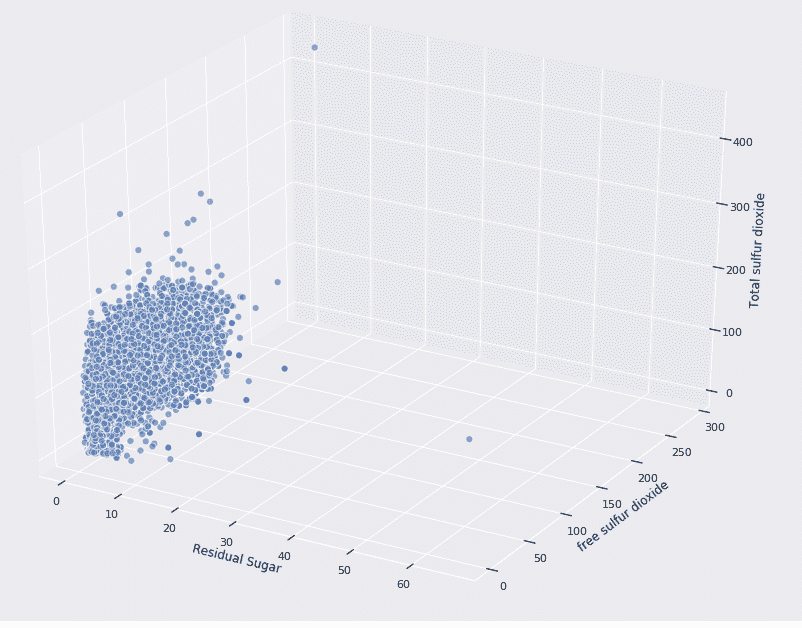

Figure 12.14 - 3-D plot illustrating the correlation between three different columns

*图 12.14* 显示三个变量相互之间呈正相关。在前面的例子中，我们使用了 Matplotlib 库。我们也可以使用`seaborn`库绘制三个不同的变量。检查这里给出的代码片段:

```py
fig = plt.figure(figsize=(16, 12))

plt.scatter(x = df_wines['fixed acidity'], 
            y = df_wines['free sulfur dioxide'], 
            s = df_wines['total sulfur dioxide'] * 2,
            alpha=0.4, 
            edgecolors='w')

plt.xlabel('Fixed Acidity')
plt.ylabel('free sulfur dioxide')
plt.title('Wine free sulfur dioxide Content - Fixed Acidity - total sulfur dioxide', y=1.05)
```

请注意，我们使用了`s`参数来表示第三个变量(二氧化硫总量)。代码的输出如下:

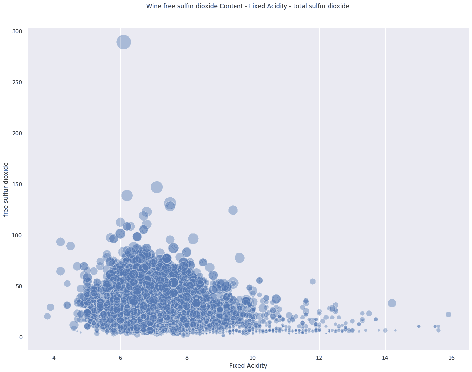

Figure 12.16 - Plot illustrating three different variables as shown in the preceding code

注意在*图 12.16* 中，圆圈的大小表示第三个变量。在这种情况下，圆的半径越大，残糖的价值越高。因此，如果你仔细观察，你会发现大部分较高的圆位于值为 4 到 10 的 *x* 轴和值为 25 到 150 的 *y* 轴之间。

在下一节中，我们将开发不同类型的模型，并应用一些经典的**机器学习** ( **ML** )算法，并评估它们的性能。

# 模型开发和评估

在本节中，我们将开发不同类型的经典 ML 模型，并评估它们的性能。我们已经在 [第 9 章](09.html)、*假设检验和回归*和[第 10 章](10.html)、*模型开发和评估*中详细讨论了模型的开发和评估。在这里，我们将直接进入实现。

我们将使用以下不同类型的算法并评估它们的性能:

*   逻辑回归
*   支持向量机
*   k 近邻分类器
*   随机森林分类器
*   决策树分类器
*   梯度提升分类器
*   高斯朴素贝叶斯分类器

虽然深入研究每个分类器超出了本章和本书的范围，但我们在这里的目的是介绍如何在对某些数据库执行 EDA 操作后继续开发 ML 算法:

1.  让我们首先导入所需的库:

```py
from sklearn.linear_model import LogisticRegression
from sklearn.svm import LinearSVC,SVC
from sklearn.neighbors import KNeighborsClassifier
from sklearn.ensemble import RandomForestClassifier,GradientBoostingClassifier,AdaBoostClassifier
from sklearn.tree import DecisionTreeClassifier
from sklearn.naive_bayes import GaussianNB
from sklearn.model_selection import train_test_split,cross_validate
from sklearn.preprocessing import MinMaxScaler,StandardScaler,LabelEncoder
from sklearn.metrics import accuracy_score,precision_score,recall_score,f1_score 
```

请注意，我们将使用组合的数据帧。接下来，我们将对`quality_label`列的分类值进行编码。我们将对这些值进行编码，以便所有低值都变为 0，中值变为 1，高值变为 2。

2.  让我们执行编码:

```py
label_quality = LabelEncoder()

df_wines['quality_label'] = label_quality.fit_transform(df_wines['quality_label'])
```

这并不难，对吧？我们刚刚利用了`sklearn`预处理功能提供的`LabelEncoder`实用程序功能。

3.  现在，让我们将数据集分成训练集和测试集。我们将使用 70%的数据集作为训练集，剩余的 30%作为测试集:

```py
x_train,x_test,y_train,y_test=train_test_split(df_wines.drop(['quality','wine_category'],axis=1),df_wines['quality_label'],test_size=0.30,random_state=42)
```

我们使用了`sklearn`库提供的`train_test_split()`方法。请注意前面类别中的以下内容:

*   在前面的代码中，我们不再需要`quality`和`wine_category`列，所以我们删除了它们。
*   接下来，我们以 30%的数据作为测试集。我们可以通过简单地传递`test_size = 0.30`参数来做到这一点。

4.  接下来，我们创建模型。请注意，我们可以为上面列出的每个算法单独构建模型。取而代之的是，我们将列出它们，并对每一个进行循环，计算精度。检查下面给出的代码片段:

```py
models=[LogisticRegression(),
        LinearSVC(),
        SVC(kernel='rbf'),
        KNeighborsClassifier(),
        RandomForestClassifier(),
        DecisionTreeClassifier(),
        GradientBoostingClassifier(),
        GaussianNB()]

model_names=['LogisticRegression','LinearSVM','rbfSVM', 'KNearestNeighbors', 'RandomForestClassifier', 'DecisionTree', 'GradientBoostingClassifier', 'GaussianNB']
```

5.  接下来，我们将循环每个模型，创建一个模型，然后评估准确性。检查下面给出的代码片段:

```py
acc=[]
eval_acc={}

for model in range(len(models)):
    classification_model=models[model]
    classification_model.fit(x_train,y_train)
    pred=classification_model.predict(x_test)
    acc.append(accuracy_score(pred,y_test))

eval_acc={'Modelling Algorithm':model_names,'Accuracy':acc}
eval_acc
```

这里给出了前面代码的输出:

```py
{'Accuracy': [0.9687179487179487,
  0.9733333333333334,
  0.6051282051282051,
  0.6912820512820513,
  1.0,
  1.0,
  1.0,
  1.0],
 'Modelling Algorithm': ['LogisticRegression',
  'LinearSVM',
  'rbfSVM',
  'KNearestNeighbors',
  'RandomForestClassifier',
  'DecisionTree',
  'GradientBoostingClassifier',
  'GaussianNB']}
```

6.  让我们创建一个精确度的数据框架，并将其显示在条形图中:

```py
acc_table=pd.DataFrame(eval_acc)
acc_table = acc_table.sort_values(by='Accuracy', ascending=[False])
acc_table
```

前面代码的输出如下所示:

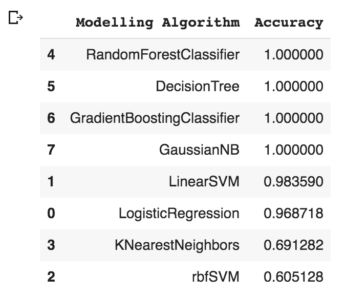

Figure 12.17 - Accuracy dataframe of different algorithms

请注意，将质量转换为分类数据集给了我们更高的准确性。大多数算法给出了 100%的准确性，如前面的截图所示。

7.  让我们创建一个条形图:

```py
sns.barplot(y='Modelling Algorithm',x='Accuracy',data=acc_table)
```

前面代码的输出如下所示:

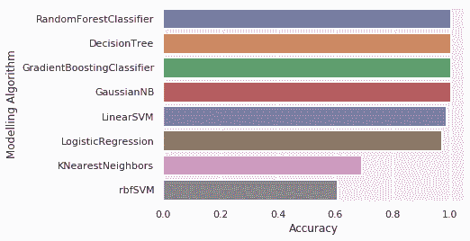

Figure 12.18 - Different types of algorithms and their accuracies

注意，如截图所示，随机森林、决策树、梯度提升分类器和高斯朴素贝叶斯分类器都给出了 100%的准确率。

太好了。恭喜你，你已经成功完成了主要项目。请注意，本书中所有的代码、片段和方法都是为了提供解决特定问题的最少方法。总有一种方法可以让你进行更深入的分析。我们鼓励您阅读每章的*进一步阅读*部分，以获得特定领域的高级知识。

# 摘要

在本章中，我们使用了 UCI 提供的葡萄酒质量数据集来执行 EDA。我们讨论了如何执行 EDA 技术，例如数据加载、数据争论、数据转换、变量之间的相关性、回归分析以及基于数据集构建经典的 ML 模型。

这是这本书的最后一章。如前所述，本书提供的理论、代码和插图的解释是为了给你提供一个基础知识集。我们假设读完这本书后，你将获得足够的洞察力、技巧和技能，使它更上一层楼。

# 进一步阅读

*   *Python 有监督机器学习*，*泰勒·史密斯*，*帕克特出版*，2019 年 5 月 26 日
*   *使用 Python 进行大规模机器学习*、*Bastian Sjardin*、 *Luca Massaron* 、e *t al。*、*packkt**发布*，2016 年 8 月 2 日
*   *Python 高级机器学习*，*约翰·哈迪*，*帕克特* *出版*，2016 年 7 月 27 日
*   *Python 的动手无监督学习**Giuseppe Bonaccorso**Packt**出版*，2019 年 2 月 28 日
*   *掌握渗透测试的机器学习**奇赫布切比**帕克特* *出版*，2018 年 6 月 26 日
*   *动手数据科学与 Python 机器学习**弗兰克·凯恩**帕克特* *出版*，2017 年 7 月 30 日
*   *用 Python 构建机器学习系统–第三版*、*路易斯·佩德罗·科埃略*、*威利·里歇特*、e *t al。*、*packkt**发布*，2018 年 7 月 30 日
*   葡萄酒质量数据集归属于 *P. Cortez* 、 *A. Cerdeira* 、 *F. Almeida* 、 *T. Matos* 和 *J. Reis* 。*建模* w *通过从理化性质*中进行数据挖掘来确定偏好。在决策支持系统，爱思唯尔，47(4):547-553，2009。**