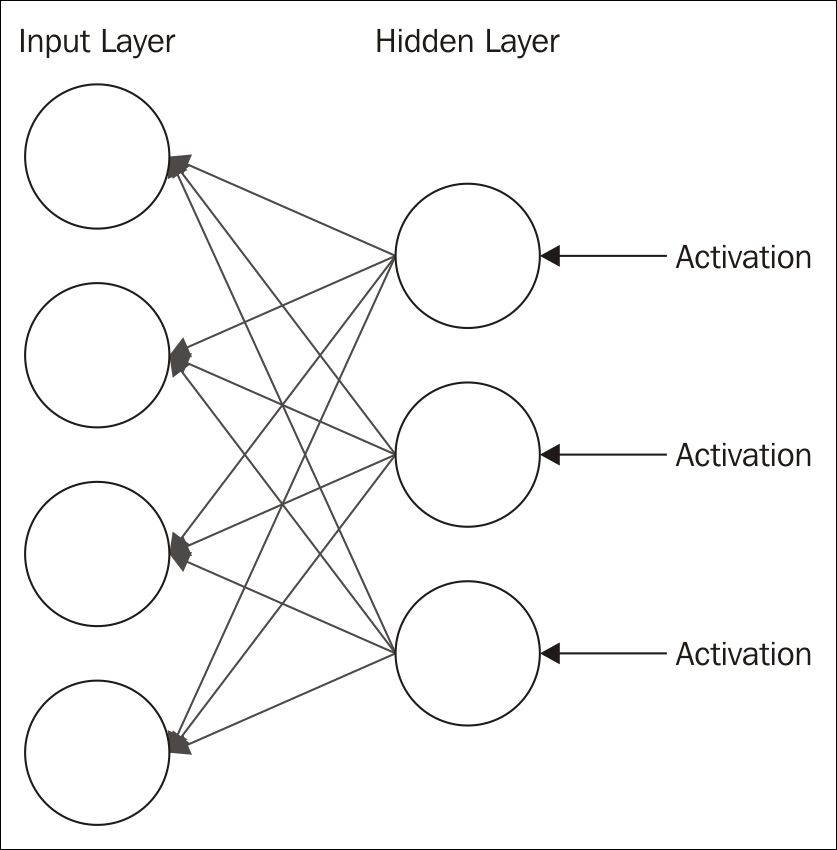

# 八、深度学习

在本章中，我们将重点讨论神经网络，通常称为**深度学习网络** ( **DLNs** )。这种类型的网络被表征为多层神经网络。这些图层中的每一个都基于前一个图层的输出，可能会识别数据集的要素和子要素。以这种方式创建特征层次。

dln 通常处理非结构化和未标记的数据，这些数据构成了当今世界的大部分数据。DLN 将获取这些非结构化数据，识别特征，并尝试重建原始输入。这种方法用**受限玻尔兹曼机** ( **RBMs** )中的*受限玻尔兹曼机*和*深度自动编码器*中的自动编码器来说明。自动编码器获取数据集并对其进行有效压缩。然后对其进行解压缩，以重建原始数据集。

DLN 也可以用于预测分析。DLN 的最后一步将使用激活函数来生成由几个类别之一表示的输出。当与新数据一起使用时，模型将尝试基于先前训练的模型对输入进行分类。

DLN 的一项重要任务是确保模型的准确性和误差最小化。与简单的神经网络一样，每一层都使用权重和偏差。随着权重值的调整，可能会引入误差。一种调整权重的技术使用**梯度下降**。这可以认为是变化的斜率。想法是修改权重以最小化误差。这是一种加速学习过程的优化技术。

在本章的后面，我们将检查**卷积神经网络**(**CNN**)，并简要讨论**递归神经网络** ( **RNN** )。卷积网络模拟了视觉皮层，因为每个神经元都可以根据某个区域的信息进行交互并做出决定。递归网络不仅基于前一层的输出，还基于前一层中执行的计算来处理信息。

有几个支持深度学习的库，包括:

*   用于 Java 的 N 维数组(**ND4J**)【http://nd4j.org/】T4:一个用于生产用途的科学计算库
*   **deep learning 4j**(【http://deeplearnin4j.org/】T2):一个开源的分布式深度学习库
*   **Encog**(【http://www.heatonresearch.com/encog/】T2):这个库支持几种深度学习算法

ND4J 是一个较低级别的库，实际上在其他项目中使用，包括 DL4J。Encog 可能不如 DL4J 支持得好，但确实提供了对深度学习的支持。

本章使用的例子都是基于**深度学习 Java**(**DL4J**)([http://deeplearning4j.org](http://deeplearning4j.org))API，并有 ND4J 的支持。这个库为许多与深度学习相关的算法提供了很好的支持。因此，下一节将解释许多深度学习算法共有的基本任务，如加载数据、训练模型和测试模型。

# Deeplearning4j 架构

在本节中，我们将讨论它的体系结构，并解决使用 API 时执行的几个常见任务。DLN 通常从创建一个`MultiLayerConfiguration`实例开始，它定义了网络或模型。网络由多层组成。**超参数**用于配置网络，是影响学习速度、用于层的激活函数以及如何初始化权重的变量。

与神经网络一样，基本的 DLN 过程包括:

*   获取和操作数据
*   配置和构建模型
*   训练模型
*   测试模型

我们将在接下来的小节中研究这些任务。

### 注意

本节中的代码示例并不打算在这里输入和执行。相反，这些例子是我们将使用的后来模型的片断。

## 获取和处理数据

DL4J API 有许多获取数据的技术。我们将重点关注我们将在示例中使用的那些特定技术。DL4J 项目使用的数据集通常使用**二值化**或**归一化**进行修改。二进制化将数据转换为 1 和 0。归一化将数据转换为介于 *1* 和 *0* 之间的值。

馈送给 DLN 的数据被转换成一组数字。这些数字被称为**向量**。这些向量由行数可变的一列矩阵组成。创建矢量的过程被称为**矢量化**。

Canova(【http://deeplearning4j.org/canova.html】T2)是一个支持矢量化的 DL4J 库。它适用于许多不同类型的数据集。它已经与**data vec**([http://deeplearning4j.org/datavec](http://deeplearning4j.org/datavec))、矢量化和**提取、转换和加载** ( **ETL** )库合并。

在本节中，我们将重点介绍如何读入 CSV 数据。

### 读入 CSV 文件

ND4J 提供了`CSVRecordReader`类，这对于读取 CSV 数据很有用。它有三个重载的构造函数。我们要演示的是传递了两个参数。第一个是第一次读取文件时要跳过的行数，第二个是保存用于解析文本的分隔符的字符串。

在下面的代码中，我们创建了类的一个新实例，其中没有跳过任何行，只使用逗号作为分隔符:

```java
RecordReader recordReader = new CSVRecordReader(0, ","); 

```

该类实现了`RecordReader`接口。它有一个被传递了一个`FileSplit`类实例的`initialize`方法。它的一个构造函数被传递了一个引用数据集的`File`对象的实例。`FileSplit`类帮助分割用于训练和测试的数据。在本例中，我们为一个名为`car.txt`的文件初始化阅读器，我们将在*准备数据*部分使用该文件:

```java
recordReader.initialize(new FileSplit(new File("car.txt"))); 

```

为了处理数据，我们需要一个迭代器，比如下面显示的`DataSetIterator`实例。这个类拥有大量重载的构造函数。在下面的例子中，第一个参数是`RecordReader`实例。接下来是三个论点。第一个是批量大小，即一次检索的记录数量。下一个是记录最后一个属性的索引。最后一个参数是数据集表示的类的数量:

```java
DataSetIterator iterator =  
    new RecordReaderDataSetIterator(recordReader, 1728, 6, 4); 

```

如果我们使用数据集进行回归，文件记录的最后一个属性将保存一个类值。这正是我们以后使用它的方式。类别参数的数目仅用于回归。

在下一个代码序列中，我们将把数据集分成两组:一组用于训练，一组用于测试。从`next`方法开始，这个方法从数据源返回下一个数据集。数据集的大小取决于之前使用的批处理大小。`shuffle`方法使输入随机化，而`splitTestAndTrain`方法返回`SplitTestAndTrain`类的一个实例，我们用它来获得训练和测试数据集。`splitTestAndTrain`方法的参数指定了用于训练的数据的百分比。

```java
DataSet dataset = iterator.next(); 
dataset.shuffle(); 
SplitTestAndTrain testAndTrain = dataset.splitTestAndTrain(0.65); 
DataSet trainingData = testAndTrain.getTrain(); 
DataSet testData = testAndTrain.getTest(); 

```

然后我们可以将这些数据集用于一个模型。

## 配置和构建模型

DL4J 经常使用`MultiLayerConfiguration`类来定义模型的配置，使用`MultiLayerNetwork`类来表示模型。这些类提供了一种构建模型的灵活方式。

在下面的例子中，我们将演示这些类的用法。从`MultiLayerConfiguration`类开始，我们发现在流畅的风格中使用了几种方法。我们将很快提供关于这些方法的更多细节。但是，请注意，该模型定义了两个层:

```java
MultiLayerConfiguration conf =  
    new NeuralNetConfiguration.Builder() 
        .iterations(1000) 
        .activation("relu") 
        .weightInit(WeightInit.XAVIER) 
        .learningRate(0.4) 
        .list() 
        .layer(0, new DenseLayer.Builder() 
                .nIn(6).nOut(3) 
                .build()) 
        .layer(1, new OutputLayer 
                .Builder(LossFunctions.LossFunction 
                        .NEGATIVELOGLIKELIHOOD) 
                .activation("softmax") 
                .nIn(3).nOut(4).build()) 
        .backprop(true).pretrain(false) 
        .build(); 

```

`nIn`和`nOut`方法指定一个层的输入和输出数量。

### 在 ND4J 中使用超参数

构建器类在 DL4J 中很常见。在前面的例子中，使用了`NeuralNetConfiguration.Builder`类。这里使用的方法只是众多可用方法中的几种。在下表中，我们描述了其中的几种:

| **方法** | **用途** |
| `iterations` | 控制执行优化迭代的次数 |
| `activation` | 这是使用的激活功能 |
| `weightInit` | 用于初始化模型的初始权重 |
| `learningRate` | 控制模型学习的速度 |
| `List` | 创建一个`NeuralNetConfiguration.ListBuilder`类的实例，这样我们可以添加层 |
| `Layer` | 创建新层 |
| `backprop` | 当设置为真时，它启用反向传播 |
| `pretrain` | 当设置为 true 时，它将预训练模型 |
| `Build` | 执行实际的构建过程 |

让我们更仔细地研究一下层是如何创建的。在这个例子中，`list`方法返回一个`NeuralNetConfiguration.ListBuilder`实例。它的`layer`方法有两个参数。第一个是图层的编号，这是一个从零开始的编号方案。第二个是`Layer`实例。

这里使用了两个不同的层和两个不同的构建器:一个`DenseLayer.Builder`和一个`OutputLayer.Builder`实例。DL4J 中有几种类型的层可用。构建器的构造函数的自变量可以是一个**损失函数**，与输出层的情况一样，接下来将对此进行解释。

在反馈网络中，神经网络的猜测与所谓的**基本事实**进行比较，这就是误差。该误差用于通过修改权重和偏差来更新网络。损失函数，也称为**目标**或**成本函数**，测量差异。

DL4J 支持多种损失函数:

*   `MSE`:在线性回归中，MSE 代表均方误差
*   `EXPLL`:在泊松回归中，EXPLL 代表指数对数似然
*   `XENT`:在二元分类中，XENT 代表交叉熵
*   这代表多类交叉熵
*   这代表 RMSE 交叉熵
*   这代表平方损失
*   这代表重建交叉熵
*   `NEGATIVELOGLIKELIHOOD`:表示负对数似然
*   `CUSTOM`:定义自己的损失函数

构建器实例使用的其余方法是激活函数、层的输入和输出数量以及创建层的`build`方法。

多层网络的每一层都需要满足以下要求:

*   **输入**:通常以输入向量的形式
*   **权重**:也叫系数
*   **Bias** :用于确保一层中至少有一些节点被激活
*   **激活功能**:决定一个节点是否触发

有许多不同类型的激活功能，每一种都可以解决特定类型的问题。

激活函数用于确定神经元是否触发。支持多种功能，包括`relu`(整流线性)`tanh``sigmoid``softmax``hardtanh``leakyrelu``maxout``softsign``softplus`。

### 注意

一个有趣的激活函数列表和图表可以在[http://stats . stack exchange . com/questions/115258/comprehensive-list-of-activation-functions-in-neural-networks-with-pros](http://stats.stackexchange.com/questions/115258/comprehensive-list-of-activation-functions-in-neural-networks-with-pros-cons)和[https://en.wikipedia.org/wiki/Activation_function](https://en.wikipedia.org/wiki/Activation_function)找到。

### 实例化网络模型

接下来，使用定义的配置创建一个`MultiLayerNetwork`实例。模型被初始化，并且它的监听器被设置。`ScoreIterationListener`实例将显示模型火车的信息，我们很快就会看到。其构造函数的参数指定了该信息的显示频率:

```java
MultiLayerNetwork model = new MultiLayerNetwork(conf); 
model.init(); 
model.setListeners(new ScoreIterationListener(100)); 

```

我们现在准备训练模型。

## 训练一个模特

这实际上是一个相当简单的步骤。`fit`方法执行训练:

```java
model.fit(trainingData); 

```

当执行时，将使用与模型相关联的任何监听器来生成输出，就像前面的情况一样，其中使用了一个`ScoreIterationListener`实例。

如何使用`fit`方法的另一个例子是遍历数据集的过程，如下所示。在这个例子中，使用了一系列数据集。这是自动编码器的一部分，其输出旨在匹配输入，如*深度自动编码器*一节所述。用作`fit`方法参数的数据集同时使用输入和预期输出。在这种情况下，它们与由`getFeatureMatrix`方法提供的相同:

```java
while (iterator.hasNext()) { 
    DataSet dataSet = iterator.next(); 
    model.fit(new DataSet(dataSet.getFeatureMatrix(), 
            dataSet.getFeatureMatrix())); 
} 

```

对于较大的数据集，有必要对模型进行多次预训练，以获得准确的结果。这通常是并行执行的，以减少培训时间。该选项通过图层类的`pretrain`方法设置。

## 测试模型

使用`Evaluation`类和训练数据集对模型进行评估。使用指定类数量的参数创建一个`Evaluation`实例。使用`output`方法将测试数据输入模型。`eval`方法获取模型的输出，并将其与测试数据类进行比较，以生成统计数据:

```java
Evaluation evaluation = new Evaluation(4); 
INDArray output = model.output(testData.getFeatureMatrix()); 
evaluation.eval(testData.getLabels(), output); 
out.println(evaluation.stats()); 

```

输出将类似于以下内容:

```java
==========================Scores===================================
Accuracy: 0.9273
Precision: 0.854
Recall: 0.8323
F1 Score: 0.843

```

这些统计数据详细如下:

*   这是对返回正确答案的频率的测量。
*   `Precision`:这是一个肯定回答是正确的概率的量度。
*   `Recall`:这衡量如果给出一个正例，结果被正确分类的可能性。
*   `F1 Score`:这是网络结果正确的概率。这是回忆和精确的调和平均值。它的计算方法是将真阳性的数量除以真阳性和假阴性的总和。

我们将使用`Evaluation`类来确定我们模型的质量。使用称为 **f1** 的度量，其值范围从 *0* 到 *1* ，其中 *1* 代表最佳质量。


# 深度学习和回归分析

神经网络可用于执行回归分析。然而，其他技术(见前面章节)可能提供更有效的解决方案。使用回归分析，我们希望根据几个输入变量来预测结果。

我们可以使用由单个神经元组成的输出层来执行回归分析，该输出层将加权输入加上前一个隐藏层的偏差相加。因此，结果是代表回归的单个值。

## 准备数据

我们将使用汽车评估数据库来演示如何根据一系列属性来预测汽车的可接受性。包含我们将使用的数据的文件可以从以下位置下载:[http://archive . ics . UCI . edu/ml/machine-learning-databases/car/car . data](http://archive.ics.uci.edu/ml/machine-learning-databases/car/car.data)。它包括汽车数据，如价格、乘客数量和安全信息，以及对其整体质量的评估。这是后一个因素，质量，我们将试图预测。接下来显示了每个属性中以逗号分隔的值，以及替换值。因为模型需要数字数据，所以需要替换:

| **属性** | **原始值** | **替代值** |
| 买价 | `vhigh, high, med, low` | `3,2,1,0` |
| 维持价格 | `vhigh, high, med, low` | `3,2,1,0` |
| 门的数量 | `2, 3, 4, 5-more` | `2,3,4,5` |
| 座位 | `2, 4, more` | `2,4,5` |
| 货舱 | `small, med, big` | `0,1,2` |
| 安全 | `low, med, high` | `0,1,2` |

文件中有 1，728 个实例。这些汽车分为四个等级:

| **类** | **实例数量** | **实例百分比** | **原始值** | **替代值** |
| 不能接受的 | `1210` | `70.023%` | `unacc` | `0` |
| 可接受的 | `384` | `22.222%` | `acc` | `1` |
| 好的 | `69` | `3.99%` | `good` | `2` |
| 很好 | `65` | `3.76%` | `v-good` | `3` |

## 设置类别

我们从定义一个`CarRegressionExample`类开始，如下所示，在这里创建了一个类的实例，并且在它的默认构造函数中执行工作:

```java
public class CarRegressionExample { 

    public CarRegressionExample() { 

        try { 

            ... 

        } catch (IOException | InterruptedException ex) { 

            // Handle exceptions 

        } 

    } 

    public static void main(String[] args) { 

        new CarRegressionExample(); 

    } 

} 

```

## 读取和准备数据

第一项任务是读入数据。我们将使用`CSVRecordReader`类来获取数据，正如在*读取 CSV 文件*中所解释的:

```java
RecordReader recordReader = new CSVRecordReader(0, ","); 

recordReader.initialize(new FileSplit(new File("car.txt"))); 

DataSetIterator iterator = new 

  RecordReaderDataSetIterator(recordReader, 1728, 6, 4); 

```

有了这个数据集，我们将把数据分成两组。65%的数据用于训练，其余用于测试:

```java
DataSet dataset = iterator.next(); 

dataset.shuffle(); 

SplitTestAndTrain testAndTrain = dataset.splitTestAndTrain(0.65); 

DataSet trainingData = testAndTrain.getTrain(); 

DataSet testData = testAndTrain.getTest(); 

```

现在需要对数据进行规范化:

```java
DataNormalization normalizer = new NormalizerStandardize(); 

normalizer.fit(trainingData); 

normalizer.transform(trainingData); 

normalizer.transform(testData); 

```

我们现在准备构建模型。

## 建立模型

使用一系列的`NeuralNetConfiguration.Builder`方法创建一个`MultiLayerConfiguration`实例。下面是用的骰子。我们将讨论代码后面的各个方法。请注意，此配置使用了两层。最后一层使用`softmax`激活函数，用于回归分析:

```java
MultiLayerConfiguration conf = new NeuralNetConfiguration.Builder() 

        .iterations(1000) 

        .activation("relu") 

        .weightInit(WeightInit.XAVIER) 

        .learningRate(0.4) 

        .list() 

        .layer(0, new DenseLayer.Builder() 

                .nIn(6).nOut(3) 

                .build()) 

        .layer(1, new OutputLayer 

                .Builder(LossFunctions.LossFunction 

                        .NEGATIVELOGLIKELIHOOD) 

                .activation("softmax") 

                .nIn(3).nOut(4).build()) 

        .backprop(true).pretrain(false) 

        .build(); 

```

创建了两个层。首先是输入层。`DenseLayer.Builder`类用于创建这一层。`DenseLayer`类是前馈和全连接层。创建的层使用六个汽车属性作为输入。输出由输入输出层的三个神经元组成，为了方便起见，这里复制了三个神经元:

```java
.layer(0, new DenseLayer.Builder() 

        .nIn(6).nOut(3) 

        .build()) 

```

第二层是用`OutputLayer.Builder`类创建的输出层。它使用损失函数作为其构造函数的参数。使用`softmax`激活函数是因为我们正在执行回归，如下所示:

```java
.layer(1, new OutputLayer 

        .Builder(LossFunctions.LossFunction 

                .NEGATIVELOGLIKELIHOOD) 

        .activation("softmax") 

        .nIn(3).nOut(4).build()) 

```

接下来，使用配置创建一个`MultiLayerNetwork`实例。模型被初始化，它的监听器被设置，然后调用`fit`方法来执行实际的训练。`ScoreIterationListener`实例将显示模型火车的信息，我们将很快在这个例子的输出中看到。`ScoreIterationListener`构造函数的参数指定了信息显示的频率:

```java
MultiLayerNetwork model = new MultiLayerNetwork(conf); 

model.init(); 

model.setListeners(new ScoreIterationListener(100)); 

model.fit(trainingData); 

```

我们现在准备评估模型。

## 评估模型

在接下来的代码序列中，我们根据训练数据集评估模型。使用指定有四个类的参数创建一个`Evaluation`实例。使用`output`方法将测试数据输入模型。`eval`方法获取模型的输出，并将其与测试数据类进行比较，以生成统计数据。`getLabels`方法返回预期值:

```java
Evaluation evaluation = new Evaluation(4); 

INDArray output = model.output(testData.getFeatureMatrix()); 

evaluation.eval(testData.getLabels(), output); 

out.println(evaluation.stats()); 

```

下面是训练的输出，它是由`ScoreIterationListener`类产生的。但是，您获得的值可能会因数据的选择和分析方式而有所不同。请注意，分数随着迭代而提高，但在大约 500 次迭代后趋于平稳:

```java
12:43:35.685 [main] INFO o.d.o.l.ScoreIterationListener - Score at iteration 0 is 1.443480901811554
12:43:36.094 [main] INFO o.d.o.l.ScoreIterationListener - Score at iteration 100 is 0.3259061845624861
12:43:36.390 [main] INFO o.d.o.l.ScoreIterationListener - Score at iteration 200 is 0.2630572026049783
12:43:36.676 [main] INFO o.d.o.l.ScoreIterationListener - Score at iteration 300 is 0.24061281470878784
12:43:36.977 [main] INFO o.d.o.l.ScoreIterationListener - Score at iteration 400 is 0.22955121170274934
12:43:37.292 [main] INFO o.d.o.l.ScoreIterationListener - Score at iteration 500 is 0.22249920540161677
12:43:37.575 [main] INFO o.d.o.l.ScoreIterationListener - Score at iteration 600 is 0.2169898450109222
12:43:37.872 [main] INFO o.d.o.l.ScoreIterationListener - Score at iteration 700 is 0.21271599814600958
12:43:38.161 [main] INFO o.d.o.l.ScoreIterationListener - Score at iteration 800 is 0.2075677126088741
12:43:38.451 [main] INFO o.d.o.l.ScoreIterationListener - Score at iteration 900 is 0.20047317735870715

```

接下来是如下所示的`stats`方法的结果。第一部分报告示例如何分类，第二部分显示各种统计数据:

```java
Examples labeled as 0 classified by model as 0: 397 times
Examples labeled as 0 classified by model as 1: 10 times
Examples labeled as 0 classified by model as 2: 1 times
Examples labeled as 1 classified by model as 0: 8 times
Examples labeled as 1 classified by model as 1: 113 times
Examples labeled as 1 classified by model as 2: 1 times
Examples labeled as 1 classified by model as 3: 1 times
Examples labeled as 2 classified by model as 1: 7 times
Examples labeled as 2 classified by model as 2: 21 times
Examples labeled as 2 classified by model as 3: 14 times
Examples labeled as 3 classified by model as 1: 2 times
Examples labeled as 3 classified by model as 3: 30 times
==========================Scores===================================Accuracy: 0.9273
Precision: 0.854
Recall: 0.8323
F1 Score: 0.843
===================================================================

```

回归模型对这个数据集做了合理的工作。


# 受限玻尔兹曼机器

RBM 经常被用作多层深层信念网络的一部分。RBM 的输出被用作另一层的输入。重复使用 RBM，直到到达最后一层。

### 注意

深度信念网络 ( **DBNs** )由几个 RBM 堆叠在一起组成。每个隐藏层为后续层提供输入。在每一层中，节点不能横向通信，它实质上变成了其他单层网络的网络。dbn 特别有助于分类、聚类和识别图像数据。

术语**连续受限玻尔兹曼机**，指的是使用非整数数值的 RBM。输入数据被标准化为 0 到 1 之间的值。

输入层的每个节点都连接到第二层的每个节点。同一层中没有节点相互连接。也就是说，不存在层内通信。这就是受限的含义。


可见图层的输入节点数取决于所解决的问题。例如，如果我们正在查看一个有 *256* 个像素的图像，那么我们将需要 *256* 个输入节点。对于图像，这是图像的行数乘以列数。

**隐藏层**应该比**输入层**包含更少的神经元。使用接近相同数量的神经元有时会导致身份函数的构建。过多的神经元可能会导致过度拟合。这意味着具有大量输入的数据集将需要多个图层。较小的输入大小导致需要较少的层。

随机的，即随机的，值被分配给每个节点的权重。节点的值乘以其权重，然后添加到偏差中。该值与来自其他输入节点的组合输入相结合，然后被馈入激活函数，在那里产生输出值。

## 重建 RBM

RBM 技术经历了一个重建阶段。这是激活被反馈到第一层并乘以用于输入的相同权重的地方。来自第二层的每个节点的这些值的总和，加上另一个偏差，表示原始输入的近似值。想法是训练模型以最小化原始输入值和反馈值之间的差异。



值的差异被视为错误。重复该过程，直到达到误差最小值。您可以将重构视为对原始输入的猜测。这些猜测本质上是原始输入的概率分布。这被称为生成学习，与使用分类技术的鉴别学习相反。

在多层模型中，每一层都可以用来从本质上识别一个特征。在随后的层中，可以识别或生成特征的组合。以这种方式，可以分析看似随机的一组像素值来识别树叶、树叶、树干以及树的叶脉。

RBM 的输出是一个基本上代表百分比的值。如果它不是零，那么机器已经学习了关于输入的一些东西。

## 配置 RBM

我们将研究两种不同的 RBM 组态。第一个是最小的，我们将在*深度自动编码器*中再次看到它。第二种方法使用了几种额外的方法，并提供了对其各种配置方式的更多见解。

以下语句使用`RBM.Builder`类创建一个新层。基于图像的行数和列数计算输入。输出大，包含`1000`个神经元。损失函数是`RMSE_XENT`。这种损失函数对某些分类问题更有效:

```java
.layer(0, new RBM.Builder() 

    .nIn(numRows * numColumns).nOut(1000) 

    .lossFunction(LossFunctions.LossFunction.RMSE_XENT) 

    .build()) 

```

接下来是一个更复杂的 RBM。我们不会在这里详细介绍这些方法，但会在后面的示例中看到它们的使用:

```java
.layer(new RBM.Builder() 

    .l2(1e-1).l1(1e-3) 

    .nIn(numRows * numColumns 

    .nOut(outputNum) 

    .activation("relu") 

    .weightInit(WeightInit.RELU)  

    .lossFunction(LossFunctions.LossFunction 

        .RECONSTRUCTION_CROSSENTROPY).k(3) 

    .hiddenUnit(HiddenUnit.RECTIFIED) 

    .visibleUnit(VisibleUnit.GAUSSIAN) 

    .updater(Updater.ADAGRAD) 

        .gradientNormalization( 

             GradientNormalization.ClipL2PerLayer) 

    .build()) 

```

单层`RBM`并不总是有用的。通常需要多层自动编码器。我们将在下一节研究这个选项。


# 深度自动编码器

自动编码器用于特征选择和提取。它由两个对称的 dbn 组成。网络的前半部分由几层组成，执行编码。网络的第二部分执行解码。自动编码器的每一层都是一个 RBM。下图对此进行了说明:


编码序列的目的是将原始输入压缩到更小的向量空间中。上图的中间层就是这个压缩层。这些中间向量可以被认为是数据集的可能特征。该编码也被称为预训练半部分。它是中间 RBM 层的输出，不执行分类。

编码器的第一层将使用比数据集更多的输入。这具有扩展数据集特征的效果。sigmoid-belief 单元是每层使用的一种非线性变换形式。该单元不能准确地将信息表示为真实值。然而，使用更多的投入，它能够做得更好。

网络的后半部分执行解码，有效地重构输入。这是一个前馈网络，使用与编码部分中相应层相同的权重。然而，权重是转置的，并且不是随机初始化的。下半年的训练率需要定得低一些。

自动编码器对于数据压缩和搜索非常有用。模型前半部分的输出是压缩的，因此有利于存储和传输。稍后，它可以被解压缩，正如我们将在第 10 章*视听分析*中演示的。这有时被称为语义散列。

如果一系列输入(如图像或声音)已经被压缩和存储，那么新的输入可以被压缩并与存储的值匹配以找到最佳匹配。自动编码器也可以用于其他信息检索任务。

## 在 DL4J 中构建自动编码器

这个例子改编自[http://deeplearning4j.org/deepautoencoder](http://deeplearning4j.org/deepautoencoder)。我们首先使用一个 try-catch 块来处理可能出现的错误，并使用一些变量声明。这个例子使用了`Mnist`([http://yann.lecun.com/exdb/mnist/](http://yann.lecun.com/exdb/mnist/))数据集，这是一组包含手写数字的图像。每幅图像由`28`乘`28`像素组成。声明一个迭代器来访问数据:

```java
try { 

    final int numberOfRows = 28; 

    final int numberOfColumns = 28; 

    int seed = 123; 

    int numberOfIterations = 1; 

    iterator = new MnistDataSetIterator( 

        1000, MnistDataFetcher.NUM_EXAMPLES, true); 

    ... 

} catch (IOException ex) { 

    // Handle exceptions 

} 

```

### 配置网络

使用`NeuralNetConfiguration.Builder()`类创建网络配置。创建了十层，其中输入层由`1000`神经元组成。这大于 28×28 像素输入，并且用于补偿在每一层中使用的 sigmoid 信念单元。

随后的每一层都变小，直到到达第四层。这一层代表编码过程的最后一步。对于第五层，解码过程开始，随后的层变得更大。最后一层使用`1000`神经元。

模型的每一层都使用一个 RBM 实例，除了最后一层，它是使用`OutputLayer.Builder`类构建的。配置代码如下:

```java
MultiLayerConfiguration conf = new NeuralNetConfiguration.Builder() 

        .seed(seed) 

        .iterations(numberOfIterations) 

        .optimizationAlgo( 

           OptimizationAlgorithm.LINE_GRADIENT_DESCENT) 

        .list() 

        .layer(0, new RBM.Builder() 

            .nIn(numberOfRows * numberOfColumns).nOut(1000) 

            .lossFunction(LossFunctions.LossFunction.RMSE_XENT) 

            .build()) 

        .layer(1, new RBM.Builder().nIn(1000).nOut(500) 

            .lossFunction(LossFunctions.LossFunction.RMSE_XENT) 

            .build()) 

        .layer(2, new RBM.Builder().nIn(500).nOut(250) 

            .lossFunction(LossFunctions.LossFunction.RMSE_XENT) 

            .build()) 

        .layer(3, new RBM.Builder().nIn(250).nOut(100) 

            .lossFunction(LossFunctions.LossFunction.RMSE_XENT) 

            .build()) 

        .layer(4, new RBM.Builder().nIn(100).nOut(30) 

            .lossFunction(LossFunctions.LossFunction.RMSE_XENT) 

            .build()) //encoding stops 

        .layer(5, new RBM.Builder().nIn(30).nOut(100) 

            .lossFunction(LossFunctions.LossFunction.RMSE_XENT) 

            .build()) //decoding starts 

        .layer(6, new RBM.Builder().nIn(100).nOut(250) 

            .lossFunction(LossFunctions.LossFunction.RMSE_XENT) 

            .build()) 

        .layer(7, new RBM.Builder().nIn(250).nOut(500) 

            .lossFunction(LossFunctions.LossFunction.RMSE_XENT) 

            .build()) 

        .layer(8, new RBM.Builder().nIn(500).nOut(1000) 

            .lossFunction(LossFunctions.LossFunction.RMSE_XENT) 

            .build()) 

        .layer(9, new OutputLayer.Builder( 

                LossFunctions.LossFunction.RMSE_XENT).nIn(1000) 

                .nOut(numberOfRows * numberOfColumns).build()) 

        .pretrain(true).backprop(true) 

        .build(); 

```

### 建立和培训网络

然后创建并初始化模型，并设置分数迭代监听器:

```java
model = new MultiLayerNetwork(conf); 

model.init(); 

model.setListeners(Collections.singletonList( 

        (IterationListener) new ScoreIterationListener())); 

```

使用`fit`方法训练模型:

```java
while (iterator.hasNext()) { 

    DataSet dataSet = iterator.next(); 

    model.fit(new DataSet(dataSet.getFeatureMatrix(),  

            dataSet.getFeatureMatrix())); 

} 

```

### 保存和检索网络

保存模型是很有用的，这样它可以用于以后的分析。这是使用`ModelSerializer`类的`writeModel`方法完成的。它接受`model`实例和`modelFile`实例，以及一个`boolean`参数，该参数指定是否应该保存模型的更新程序。更新器是用于调整某些模型参数的学习算法:

```java
modelFile = new File("savedModel"); 

ModelSerializer.writeModel(model, modelFile, true); 

```

可以使用以下代码检索模型:

```java
modelFile = new File("savedModel"); 

MultiLayerNetwork model = ModelSerializer.restoreMultiLayerNetwork(modelFile); 

```

### 专业自动编码器

自动编码器有专门的版本。当自动编码器使用比输入更多的隐藏层时，它可以学习 identity 函数，该函数总是返回与用作函数输入的值相同的值。为了避免这个问题，使用了对**自动编码器**、**去噪自动编码器**的扩展；它随机修改引入噪声的输入。引入的噪声量因输入数据集而异。一个**堆叠去噪自动编码器** ( **SdA** )是一系列去噪自动编码器串在一起。

# 卷积网络

CNN 是模仿动物视觉皮层的前馈网络。视觉皮层排列着重叠的神经元，因此在这种类型的网络中，神经元也排列在重叠的部分，称为感受野。由于它们的设计模型，它们只需最少的预处理或先验知识就能工作，这种缺少人工干预的特性使它们特别有用。

这种类型的网络经常用于图像和视频识别应用。它们可用于分类、聚类和对象识别。CNN 还可以通过实现**光学字符识别** ( **OCR** )应用于文本分析。CNN 一直是机器学习运动的驱动力，部分原因在于其在实际情况中的广泛适用性。

我们将使用 DL4J 演示一个 CNN。该流程将与我们在 DL4J 部分的*构建自动编码器中使用的流程非常相似。我们将再次使用`Mnist`数据集。该数据集包含图像数据，因此非常适合卷积网络。*

## 建立模型

首先，我们需要创建一个新的`DataSetIterator`来处理数据。`MnistDataSetIterator`构造函数的参数是批量大小，在本例中是`1000`，以及要处理的样本总数。然后，我们得到下一个数据集，随机排列数据，并分割数据进行测试和训练。正如我们在本章前面所讨论的，我们通常使用 65%的数据来训练数据，剩余的 35%用于测试:

```java
DataSetIterator iter = new MnistDataSetIterator(1000,  
MnistDataFetcher.NUM_EXAMPLES); 
DataSet dataset = iter.next(); 
dataset.shuffle(); 
SplitTestAndTrain testAndTrain = dataset.splitTestAndTrain(0.65); 
DataSet trainingData = testAndTrain.getTrain(); 
DataSet testData = testAndTrain.getTest(); 

```

然后我们对两组数据进行归一化处理:

```java
DataNormalization normalizer = new NormalizerStandardize(); 
normalizer.fit(trainingData); 
normalizer.transform(trainingData); 
normalizer.transform(testData); 

```

接下来，我们可以建立我们的网络。如前所示，我们将再次使用带有一系列`NeuralNetConfiguration.Builder`方法的`MultiLayerConfiguration`实例。我们将在下面的代码序列之后讨论各个方法。注意，最后一层再次使用`softmax`激活函数进行回归分析:

```java
MultiLayerConfiguration.Builder builder = new    
          NeuralNetConfiguration.Builder() 
     .seed(123) 
     .iterations(1) 
     .regularization(true).l2(0.0005) 
     .weightInit(WeightInit.XAVIER)  
     .optimizationAlgo(OptimizationAlgorithm 
           .STOCHASTIC_GRADIENT_DESCENT) 
     .updater(Updater.NESTEROVS).momentum(0.9) 
     .list() 
     .layer(0, new ConvolutionLayer.Builder(5, 5) 
           .nIn(6) 
           .stride(1, 1) 
           .nOut(20) 
           .activation("identity") 
           .build()) 
     .layer(1, new SubsamplingLayer.Builder(
                SubsamplingLayer.PoolingType.MAX) 
           .kernelSize(2, 2) 
           .stride(2, 2) 
           .build()) 
     .layer(2, new ConvolutionLayer.Builder(5, 5) 
           .stride(1, 1) 
           .nOut(50) 
           .activation("identity") 
           .build()) 
     .layer(3, new SubsamplingLayer.Builder(
                SubsamplingLayer.PoolingType.MAX) 
           .kernelSize(2, 2) 
           .stride(2, 2) 
           .build()) 
     .layer(4, new DenseLayer.Builder().activation("relu") 
           .nOut(500).build()) 
     .layer(5, new OutputLayer.Builder(
                LossFunctions.LossFunction.NEGATIVELOGLIKELIHOOD) 
           .nOut(10) 
           .activation("softmax") 
           .build()) 
     .backprop(true).pretrain(false); 

```

第一层，图层`0`，为了方便起见，它使用了`ConvolutionLayer.Builder`方法。卷积层的输入是图像高度、宽度和通道数的乘积。在标准 RGB 图像中，有三个通道。`nIn`方法获取通道的数量。`nOut`方法指定了期望的`20`输出:

```java
.layer(0, new ConvolutionLayer.Builder(5, 5) 
        .nIn(6) 
        .stride(1, 1) 
        .nOut(20) 
        .activation("identity") 
        .build()) 

```

层`1`和`3`都是二次采样层。这些层跟随卷积层，它们本身不进行真正的卷积。它们返回一个值，即该输入区域的最大值:

```java
.layer(1, new SubsamplingLayer.Builder( 
            SubsamplingLayer.PoolingType.MAX) 
        .kernelSize(2, 2) 
        .stride(2, 2) 
        .build()) 
                        ... 
.layer(3, new SubsamplingLayer.Builder( 
            SubsamplingLayer.PoolingType.MAX) 
        .kernelSize(2, 2) 
        .stride(2, 2) 
        .build()) 

```

层`2`也是像层`0`一样的卷积层。请注意，我们没有指定该层中的通道数量:

```java
.layer(2, new ConvolutionLayer.Builder(5, 5) 
        .nOut(50) 
        .activation("identity") 
        .build()) 

```

第四层使用了`DenseLayer.Builder`类，就像我们前面的例子一样。如前所述，`DenseLayer`类是一个前馈和全连接层:

```java
.layer(4, new DenseLayer.Builder().activation("relu") 
        .nOut(500).build()) 

```

层`5`是一个`OutputLayer`实例，使用`softmax`自动化:

```java
.layer(5, new OutputLayer.Builder( 
            LossFunctions.LossFunction.NEGATIVELOGLIKELIHOOD) 
        .nOut(10) 
        .activation("softmax") 
        .build()) 
        .backprop(true).pretrain(false); 

```

最后，我们创建了一个`ConvolutionalLayerSetup`类的新实例。我们传递构建器对象和图像的尺寸(28 x 28)。我们还传递通道的数量，在本例中，`1`:

```java
new ConvolutionLayerSetup(builder, 28, 28, 1); 

```

我们现在可以配置和适应我们的模型。我们再次使用`MultiLayerConfiguration`和`MultiLayerNetwork`类来构建我们的网络。我们设置监听器，然后遍历我们的数据。对于每个`DataSet`，我们执行`fit`方法:

```java
MultiLayerConfiguration conf = builder.build(); 
MultiLayerNetwork model = new MultiLayerNetwork(conf); 
model.init(); 
model.setListeners(Collections.singletonList((IterationListener) 
  new ScoreIterationListener(1/5))); 

while (iter.hasNext()) { 
    DataSet next = iter.next(); 
    model.fit(new DataSet(next.getFeatureMatrix(), next.getLabels())); 
} 

```

我们现在准备评估我们的模型。

## 评估模型

为了评估我们的模型，我们使用了`Evaluation`类。我们从模型中获取输出，并将其与数据集的标签一起发送给`eval`方法。然后，我们执行`stats`方法来获取我们网络的统计信息:

```java
Evaluation evaluation = new Evaluation(4); 
INDArray output = model.output(testData.getFeatureMatrix()); 
evaluation.eval(testData.getLabels(), output); 
out.println(evaluation.stats()); 

```

以下是执行这段代码的输出示例，因为我们只显示了`stats`方法的结果。第一部分报告示例如何分类，第二部分显示各种统计数据:

```java
Examples labeled as 0 classified by model as 0: 19 times
Examples labeled as 1 classified by model as 1: 41 times
Examples labeled as 2 classified by model as 1: 4 times
Examples labeled as 2 classified by model as 2: 30 times
Examples labeled as 2 classified by model as 3: 1 times
Examples labeled as 3 classified by model as 2: 1 times
Examples labeled as 3 classified by model as 3: 28 times
==========================Scores===================================Accuracy: 0.3371
Precision: 0.8481
Recall: 0.8475
F1 Score: 0.8478
===================================================================

```

与我们之前的模型一样，评估证明了我们网络的准确性和成功性。


# 递归神经网络

RNN 不同于前馈网络，因为它们的输入包括来自前一迭代或步骤的输入。它们仍然处理当前输入，但是使用反馈循环来考虑前一步骤的输入，也称为最近的过去。这一步有效地给了网络内存。一种流行的循环网络涉及**长期短期记忆** ( **LSTM** )。这种类型的存储器提高了网络的处理能力。

rnn 是为处理顺序数据而设计的，尤其适用于文本数据的分析和预测。给定一个单词序列，RNN 可以预测每个单词成为序列中下一个单词的概率。这也允许通过网络生成文本。rnn 是通用的，也能很好地处理图像数据，尤其是图像标记应用。设计和目的的灵活性以及训练的简易性使 RNNs 成为许多数据科学应用的流行选择。DL4J 还为 LSTM 网络和其他 rnn 提供支持。


# 总结

在这一章中，我们研究了神经网络的深度学习技术。本章中的所有 API 支持都是由 Deeplearning4j 提供的。我们首先演示了如何获取和准备用于深度学习网络的数据。我们讨论了如何配置和构建模型。随后解释了如何通过将数据集分为训练和测试部分来训练和测试模型。

我们的讨论继续进行深度学习和回归分析的检查。我们展示了如何准备数据和类、构建模型以及评估模型。我们使用样本数据和显示输出统计数据来演示我们的模型的相对有效性。

然后检查 RBM 和 DBNs。dbn 由堆叠在一起的 RBM 组成，对于分类和聚类应用程序特别有用。深度自动编码器也是使用 RBM 构建的，有两个对称的 dbn。自动编码器对于特征选择和提取特别有用。

最后，我们演示了一个卷积网络。这个网络模仿视觉皮层，允许网络使用信息区域进行分类。和前面的例子一样，我们构建、训练，然后评估模型的有效性。然后，我们以对递归神经网络的简要介绍结束了这一章。

当我们进入下一章并研究文本分析技术时，我们将进一步阐述这些主题。