# 三、地理空间技术前景

地理空间技术生态系统由数百个软件库和包组成。对于地理空间分析的新手来说，这种大量的选择可能是压倒性的。快速学习地理空间分析的秘诀是了解少数真正重要的库和包。大多数软件，无论是商业软件还是开源软件，都是从这些关键包中派生出来的。了解地理空间软件的生态系统及其使用方式可以让您快速理解和评估任何地理空间工具。

地理空间库可以分配给以下一个或多个高级核心功能，它们在一定程度上实现了这些功能。我们将在本章中学习这些功能:

*   数据存取
*   计算几何(包括数据重投影)
*   图像处理
*   可视化工具
*   元数据工具

在本章中，我们将研究对地理空间分析影响最大的包，以及您可能经常遇到的包。然而，和任何信息过滤一样，我们鼓励你自己做研究，得出自己的结论。

以下网站提供了本章未包括的软件的更多信息:

*   维基百科地理信息系统软件列表:[https://en . Wikipedia . org/wiki/List _ of _ geographic _ information _ systems _ software](https://en.wikipedia.org/wiki/List_of_geographic_information_systems_software)
*   OSGeo 项目清单及孵化器项目:[http://www.osgeo.org](http://www.osgeo.org/)

图像处理软件的功能是用于遥感。然而，这类软件非常分散，包含几十个软件包，很少集成到衍生软件中。大多数遥感图像处理软件都是基于相同的数据访问库，在此基础上实现定制的图像处理算法。

看看下面这些类型软件的例子，包括开源和商业软件包:

*   **开源软件映像图** ( **OSSIM** )
*   **地理资源分析支持系统** ( **GRASS** )
*   **OTB** 奥菲欧工具箱
*   **ERDAS IMAGINE**
*   我发

# 技术要求

以下是本章的技术要求列表:

*   Python 3.6 或更高版本
*   内存:最小 6 GB (Windows)，8gb(macOS)；推荐 8 GB
*   存储:最低 7200 转/分的 SATA，可用空间为 20gb；推荐的具有 40 GB 可用空间的固态硬盘
*   处理器:最低英特尔酷睿 i3 2.5 GHz 推荐的英特尔酷睿 i5

# 了解数据访问

如[第 2 章](02.html)、*学习地理空间数据*所述，地理空间数据集通常很大、很复杂且变化多端。这一挑战使得能够高效读取(在某些情况下是写入)这些数据的库对于地理空间分析至关重要。如果无法访问数据，地理空间分析就无法开始。

此外，准确性和精确性是地理空间分析的关键因素。未经许可重新采样数据的图像库，或者将坐标四舍五入几个小数位的计算几何库，都会对分析质量产生不利影响。此外，这些库必须有效地管理内存。一个复杂的地理空间过程可能会持续数小时，甚至数天。

如果数据访问库出现内存故障，它可能会延迟整个项目甚至整个工作流，涉及依赖该分析输出的几十个人。

像**地理空间数据抽象库** ( **GDAL** )这样的数据访问库，为了速度和跨平台兼容性，大部分都是用 C 或 C++编写的。速度很重要，因为地理空间数据集通常很大。但是，您也会看到许多用 Java 编写的包。写得好的时候，纯 Java 可以达到处理大型向量或栅格数据集可以接受的速度，并且通常对于大多数应用程序来说是可以接受的。

下面的概念图显示了主要的地理空间软件库和包以及它们之间的关系。粗体的库表示被主动维护的根库，并且没有明显地从任何其他库派生。这些根库代表地理空间操作，相当难实现，绝大多数人选择使用其中一个库，而不是创建一个竞争的库。如您所见，少数库构成了不成比例的地理空间分析软件。下图绝非详尽无遗。在本书中，我们将只讨论最常用的包:

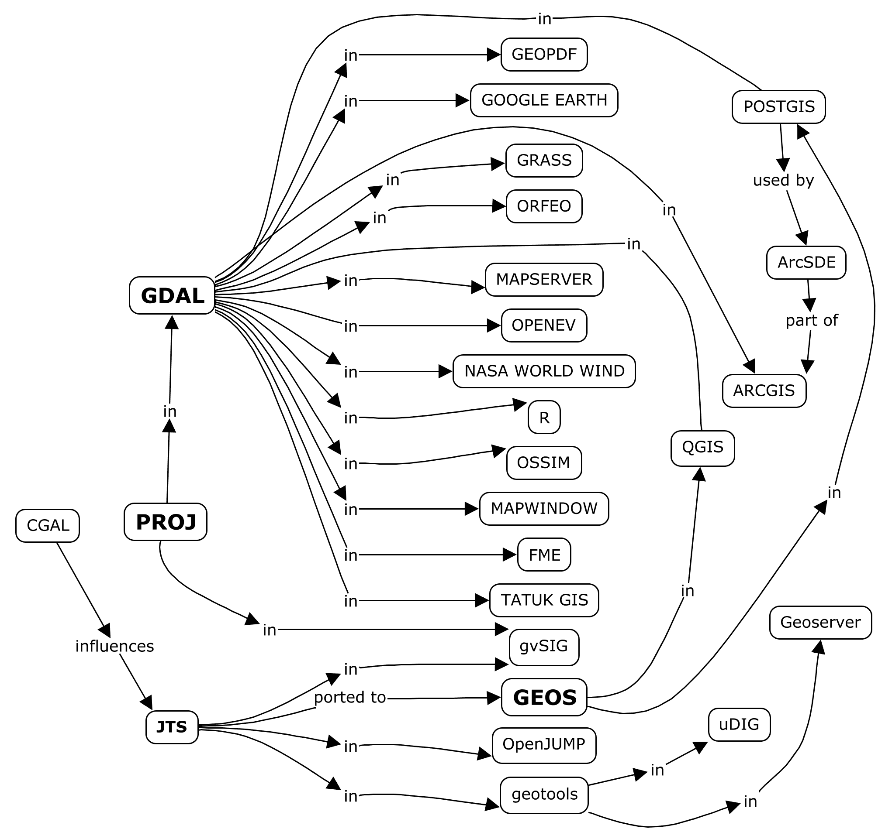

**GDAL** 、 **GEOS** (简称**几何引擎-开源**)和 **PROJ** 库是商业和开源两方面地理空间分析社区的核心和灵魂。需要注意的是，这些库都是用 C 或 C++编写的。以**地理工具**和 **Java 拓扑套件** ( **JTS** )核心库的形式，在 Java 中也做了大量工作，这些核心库在一系列台式机、服务器和移动软件中使用。鉴于有数百个地理空间包可用，几乎所有的包都依赖于这些库来做任何有意义的事情，您将开始了解地理空间数据访问和计算几何的复杂性。将这个软件领域与文本编辑器进行比较，文本编辑器在开源项目网站([http://sourceforge.net/](http://sourceforge.net/))上搜索时会返回 5000 多个选项。

地理空间分析是一个真正的全球社区，对该领域的重大贡献来自全球的每个角落。但是，当你更多地了解软件领域中心的高质量软件包时，你会发现这些程序往往来自加拿大，或者由加拿大开发人员大量贡献。

地理空间分析被认为是现代地理信息系统的诞生地，是国家的骄傲。此外，加拿大政府和公私地理连接项目在研究和公司方面投入巨资，既是出于经济原因，也是出于必要，以更好地管理该国丰富的自然资源和人口需求。

# 断续器

GDAL 承担着地理空间行业最繁重的任务。GDAL 网站列出了 80 多种使用该库的软件，这个列表一点也不完整。这些包中的许多都是行业领先的开源商业工具。该列表不包括数百个较小的项目和使用该库进行地理空间分析的独立分析师。GDAL 还包括一组命令行工具，无需任何编程即可完成各种操作。

A list of projects using GDAL can be found at the following URL: [http://trac.osgeo.org/gdal/wiki/SoftwareUsingGdal](http://trac.osgeo.org/gdal/wiki/SoftwareUsingGdal).

# 栅格数据和栅格数据

GDAL 为地理空间行业中的大量栅格数据类型提供了一个单一的抽象数据模型。它整合了不同格式的独特数据访问库，并为读写数据提供了一个通用的应用编程接口。在开发人员 Frank Warmerdam 于 20 世纪 90 年代末创建 GDAL 之前，每种数据格式都需要一个单独的数据访问库，该库具有不同的 API，以便读取数据，或者在最坏的情况下，开发人员经常编写定制的数据访问例程。

下图直观地描述了 GDAL 如何抽象栅格数据:

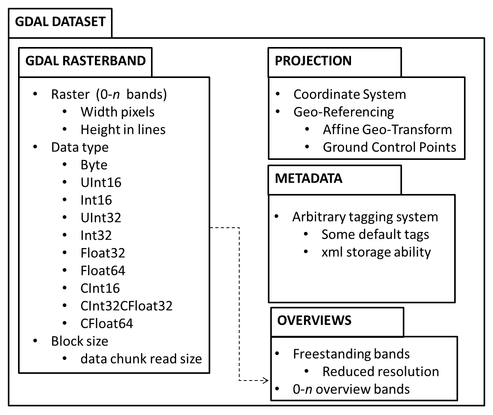

在前面的软件概念图中，您可以看到 GDAL 在任何单一的地理空间软件中具有最大的影响力。将 GDAL 和它的姊妹库 OGR 结合起来，用于向量数据，影响几乎加倍。PROJ 图书馆也产生了巨大的影响，但它通常是通过 OGR 或 GDAL 访问的。

The GDAL home page can be found at [http://www.gdal.org/](http://www.gdal.org/).

# GDAL 和向量数据

除了栅格数据，GDAL 还列出了至少对 70 多种向量数据格式的部分支持。GDAL 包成功的一部分是 X11/MIT 开源许可。该许可证是商业和开源友好的。GDAL 库可以包含在专有软件中，而不会向用户透露专有源代码。

GDAL 具有以下向量功能:

*   统一向量数据和建模抽象
*   向量数据重投影
*   向量数据格式转换
*   属性数据过滤
*   基本几何过滤，包括裁剪和多边形内点测试

GDAL 有几个命令行实用程序，展示了它处理向量数据的能力。这种能力也可以通过它的编程接口来访问。下图概述了 GDAL 向量体系结构:

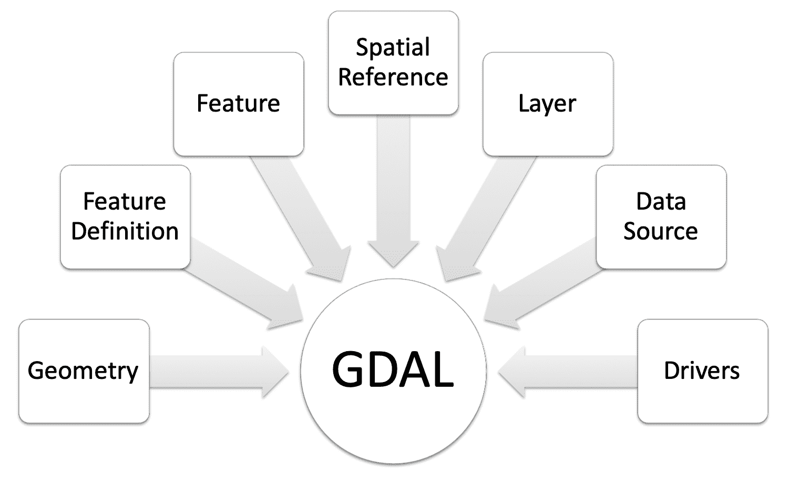

考虑到该模型能够表示 70 多种不同的数据格式，GDAL 向量架构相当简洁:

*   **几何图形**:该对象表示点、线串、多边形、几何集合、多多边形、多点和多线的**开放地理空间联盟** ( **OGC** )简单要素规范数据模型。
*   **特征定义**:该对象包含一组相关特征的属性定义。
*   **特征:**该对象将**几何**和**特征定义**信息联系在一起。
*   **空间参考**:该对象包含 OGC 空间参考定义。
*   **图层**:该对象表示在数据源中分组为图层的要素。
*   **数据源**:该对象是 GDAL 访问的文件或数据库对象。
*   **驱动程序**:这个对象包含 GDAL 可用的 70 多种数据格式的翻译器。

这种体系结构运行平稳，只有一个小问题——层的概念甚至用于只包含一个层的数据格式。例如，shapefiles 只能表示一个层。但是，当您使用 GDAL 访问一个 shapefile 时，您仍然必须使用 shapefile 的基本名称调用一个新的层对象，而不需要文件扩展名。这个设计特性只是一个小的不便，远远超过了 GDAL 提供的功能。

现在，让我们超越访问数据，使用它进行分析。

# 理解计算几何

计算几何包括对向量数据进行运算所需的算法。这个领域在计算机科学中非常古老；但是，由于地理空间坐标系的原因，大多数用于地理空间操作的库与计算机图形库是分开的。正如[第 1 章](01.html)*末尾所述，使用 Python* 学习地理空间分析时，计算机屏幕坐标几乎总是以正数表示，而地理空间坐标系在向西和向南移动时通常使用负数。

几个不同的地理空间库属于这一类别，但它们也有广泛的用途，从空间选择到渲染。应该注意的是，前面描述的 GDAL 的一些特性使它超越了数据访问的范畴，进入了计算几何的领域。但是，它被列入前一类，因为这是它的主要目的。

计算几何是一门迷人的学科。当编写一个简单的脚本来自动化地理空间操作时，您不可避免地需要一个空间算法。于是问题来了，*你是自己尝试实现这个算法，还是经历使用第三方库的开销？*选择总是带有欺骗性的，因为有些任务在视觉上很容易理解和实现，有些任务看起来很复杂，但结果很容易，有些任务理解起来很琐碎，但实施起来异常困难。一个这样的例子是地理空间缓冲操作。

这个概念很简单，但算法却相当困难。本节中的以下库是用于计算几何算法的主要包。

# PROJ 投影图书馆

美国地质勘探局(美国地质勘探局)分析师杰里·埃文登在美国地质勘探局工作期间，于 20 世纪 90 年代中期创建了现在被称为 PROJ 投影库的项目。从那以后，它成为了**开源地理空间基金会** ( **OSGeo** )的一个项目，得到了许多其他开发者的贡献。PROJ 完成了在数千个坐标系之间转换数据的艰巨任务。在如此多的坐标系中转换点所需的数学极其复杂。没有其他图书馆能比得上 PROJ 的能力。这一事实以及应用程序将不同来源的数据集转换为通用投影所需的例行程序，使 PROJ 成为该领域无可争议的领导者。

下面的图是一个例子，说明 PROJ 支持的预测有多具体。此图从[https://calcofi.org](https://calcofi.org)开始，代表**加州合作海洋渔业调查** ( **卡尔科菲**)项目伪投影的线/站坐标系，仅 **NOAA** (简称**国家海洋和大气管理局**)、加州大学斯克里普斯海洋研究所和加州鱼类和野生动物部用于收集加州海岸线过去 60 年的海洋和渔业数据:

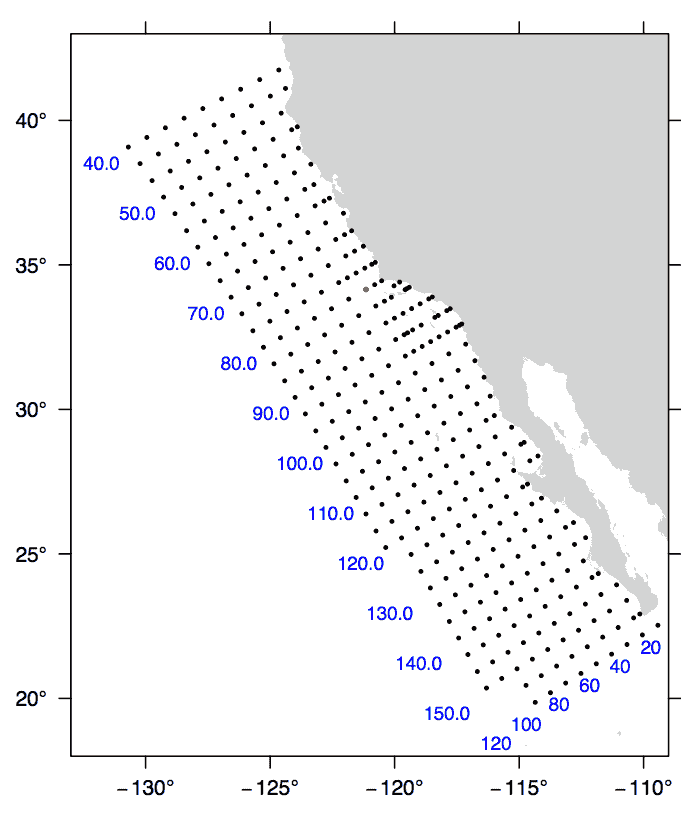

PROJ 使用一个简单的语法，能够描述任何投影，包括自定义的，本地化的，如前图所示。PROJ 可以在几乎每个主要的地理信息系统包中找到，提供重投影支持，它也有自己的命令行工具。

它可通过 GDAL 获得向量和栅格数据。但是，直接访问库通常很有用，因为它使您能够重新投影单个点。大多数包含 PROJ 的库只允许您重新投影整个数据集。

For more information on PROJ, visit [https://proj4.org](https://proj4.org).

# CGAL 的

**计算几何算法库** ( **CGAL** )最初发布于 20 世纪 90 年代末，是一个健壮且成熟的开源计算几何库。它不是专门为地理空间分析而设计的，但通常在现场使用。

CGAL 经常被引用作为可靠的几何处理算法的来源。 *CGAL 用户和参考手册*中的下图提供了 CGAL 中经常引用的一种算法的可视化，称为多边形直骨架，它是精确增长或收缩多边形所必需的:

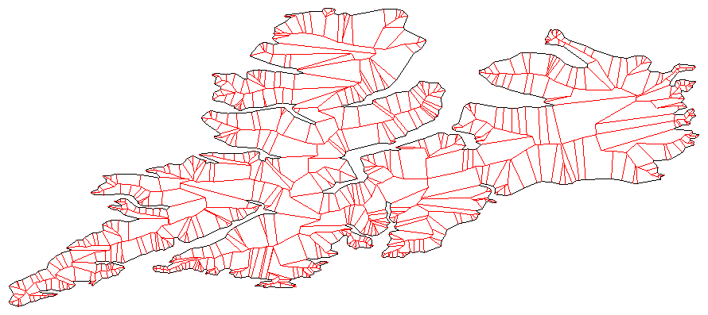

直骨架算法既复杂又重要，因为缩小或增长多边形不仅仅是使其变大或变小的问题。多边形实际上会改变形状。当多边形收缩时，不相邻的边会碰撞并消除连接边。随着多边形的增长，相邻的边会分开，并形成新的边来连接它们。这个过程是地理空间多边形缓冲的关键。下图同样来自 *CGAL 用户和参考手册*，显示了在前面的多边形上使用 insets 的效果:

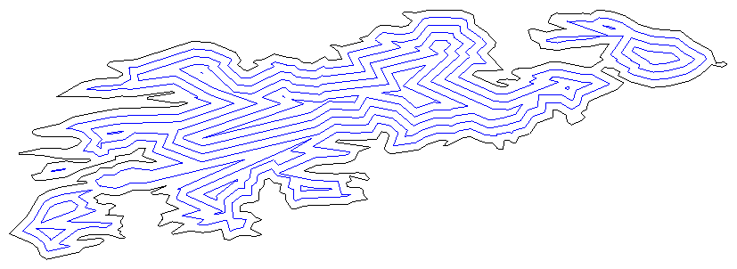

CGAL can be found online at [http://www.cgal.org/](http://www.cgal.org/).

# JTS

JTS 是一个用 100%纯 Java 编写的地理空间计算几何库。JTS 通过实现 SQL 的 OGC 简单功能规范，将自己与其他计算几何库区分开来。有趣的是，其他开发人员已经将 JTS 移植到其他语言，包括 C++、微软。NET，甚至 JavaScript。

JTS 包括一个奇妙的测试程序，叫做 JTS 测试生成器，它提供了一个图形用户界面来测试功能，而不需要设置整个程序。地理空间分析最令人沮丧的一个方面是奇异的几何形状，它打破了大多数时候都有效的算法。另一个常见的问题是由于数据中的微小错误而导致的意外结果，例如多边形在不容易看到的非常小的区域中相交。JTS 测试构建器允许您交互测试 JTS 算法来验证数据，或者只是直观地理解一个过程，如下所示:

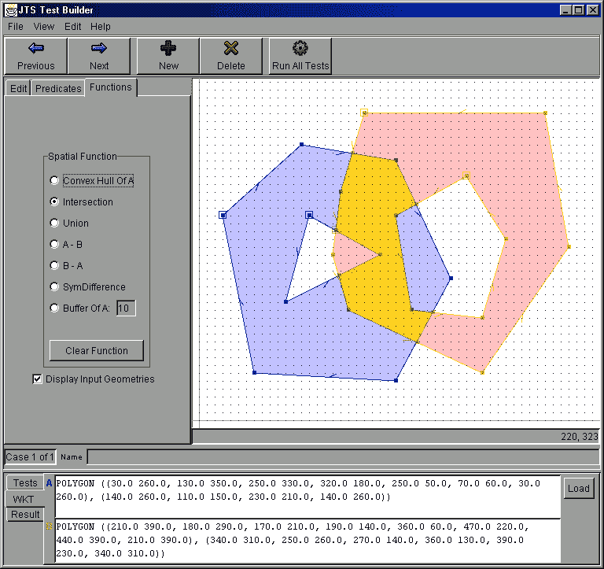

即使您不使用 JTS，而是另一种语言的几个端口之一，这个工具也很方便。需要注意的是，自 2006 年 12 月的 1.8 版本以来，JTS 的维护者 Vivid Solutions 一直没有发布新版本。包装相当稳定，仍在积极使用中。

The JTS home page is available at [https://locationtech.github.io/jts.](https://locationtech.github.io/jts/)

# 乔斯大衣呢

GEOS 是前面解释过的 JTS 库的 C++端口。这里提到它是因为这个港口对地理空间分析的影响比最初的 JTS 要大得多。C++版本可以在许多平台上编译，因为它避免了任何平台特定的依赖关系。造成全球测地系统流行的另一个因素是，存在大量的基础设施来创建到各种脚本语言(包括 Python)的自动化或半自动绑定。另一个因素是，大多数地理空间分析软件都是用 C 或 C++编写的。全球测地系统最常见的用途是通过包括全球测地系统作为库的其他应用编程接口。

全球测地系统提供以下功能:

*   OGC 简单的特征
*   地理空间谓词函数
*   交叉
*   高光
*   解体
*   交叉
*   在…之内
*   包含
*   重复
*   等于
*   覆盖
*   地理空间操作
*   联盟
*   距离
*   交集
*   对称差
*   凸包
*   信封
*   缓冲器
*   简化
*   多边形装配
*   多边形验证
*   面积
*   长度
*   空间索引
*   OGC **知名文字** ( **WKT** )和**知名二进制** ( **WKB** )输入/输出
*   C 和 C++ API
*   螺纹安全

全球测地系统可以用全球测地系统汇编，以利用其所有能力。

GEOS can be found online at [https://trac.osgeo.org/geos](https://trac.osgeo.org/geos).

# 邮政地理信息系统

就开源地理空间数据库而言，PostGIS 是最常用的空间数据库。PostGIS 本质上是在著名的 PostgreSQL 关系数据库之上的一个模块。PostGIS 的大部分功能来自前面提到的 GEOS 库。像 JTS 一样，它也实现了 SQL 的 OGC 简单特性规范。地理空间环境中计算几何能力的这种组合将 PostGIS 置于自己的类别中。

PostGIS 允许您对数据集执行属性和空间查询。回想一下第 2 章*学习* *地理空间数据*中的观点，典型的空间数据集由多种数据类型组成，包括几何、属性(一行中的一列或多列数据)以及大多数情况下的索引数据。在 PostGIS 中，您可以像使用 SQL 查询任何数据库表一样查询属性数据。

这种能力并不奇怪，因为属性数据存储在传统的数据库结构中。但是，您也可以使用 SQL 语法查询几何图形。空间操作可以通过 SQL 函数来实现，您可以将这些函数作为查询的一部分。以下示例 PostGIS SQL 语句在`Florida`状态周围创建了一个 14.5 公里的缓冲区:

```py
SELECT ST_Buffer(the_geom, 14500) 
FROM usa_states 
WHERE state = 'Florida' 
```

`FROM`子句将`usa_states`层指定为查询的位置。我们通过隔离`WHERE`子句中的`Florida`来过滤该层。`Florida`是`usa_states`层的`state`列中的一个值。`SELECT`子句使用 PostGIS `ST_Buffer()`功能对通常包含在`the_geom`列中的`Florida`的几何图形执行实际的空间选择。在这种情况下，`the_geom`列是后置地理信息系统图层的几何列。功能名称中的`ST`缩写代表**空间类型**。`ST_Buffer()`功能接受包含空间几何图形和底层地图单位距离的列。

`usa_states`图层中的地图单位以米为单位表示，因此在前面的示例中，14.5 公里为 14，500 米。回想一下[章节](01.html)[1](01.html)*使用 Python 学习地理空间分析，*中的观点，类似这样的查询缓冲区用于邻近分析。碰巧的是，佛罗里达州的水域边界扩大了 9 海里，即从该州西部和西北部海岸线延伸到墨西哥湾约 14.5 公里。

下图以虚线显示了佛罗里达州的官方水边界，在地图上标注为:

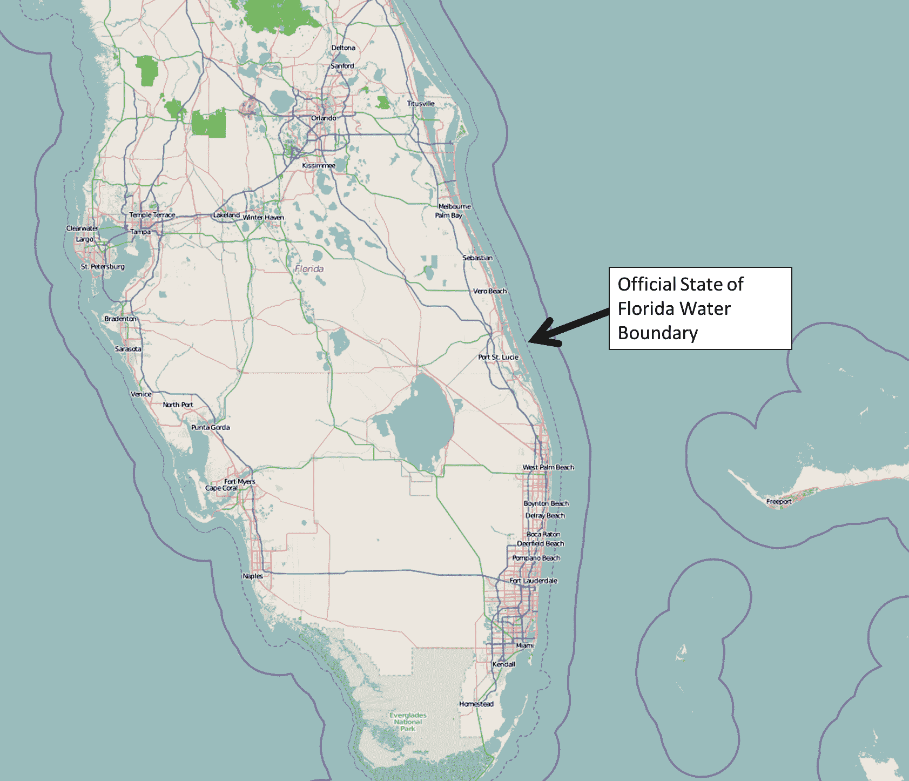

应用 9 海里缓冲区后，您可以在下面的地图上看到，以橙色突出显示的结果非常接近基于详细地面调查的官方法律边界:


目前，PostGIS 维护以下功能集:

*   地理空间几何类型，包括点、线串、多边形、多点、多线、多多边形和几何集合，它们可以存储不同类型的几何，包括用于测试几何关系的其他空间函数集合(例如，面中点或并集)
*   用于导出新几何图形的空间函数(例如，缓冲区和交叉点)
*   空间测量，包括周长、长度和面积
*   基于 R 树算法的空间索引
*   基本地理空间栅格数据类型
*   拓扑数据类型
*   基于**TIGER**(T2 的简称】拓扑集成地理编码和参考)普查数据的美国地理编码器
*   一种新的 JSONB 数据类型，允许对 JSON 和 GeoJSON 进行索引和查询

PostGIS 要素集在所有地理数据库中具有竞争力，是所有开源或免费地理数据库中最广泛的。PostGIS 开发社区的活跃势头是该系统成为同类最佳的另一个原因。邮政编码保持在[http://postgis.net](http://postgis.net)。

# 其他空间数据库

PostGIS 是免费和开源地理空间数据库的黄金标准。但是，作为地理空间分析师，您还应该了解其他几个系统。该列表包括商业和开源系统，每个系统都有不同程度的地理空间支持。

地理数据库与地理空间软件、标准和网络并行发展。互联网推动了对能够服务大量数据的大型多用户地理空间数据库服务器的需求。下图由[www.OSGeo.org](https://www.osgeo.org/)提供，显示了地理空间架构是如何演变的，其中很大一部分演变发生在数据库级别:

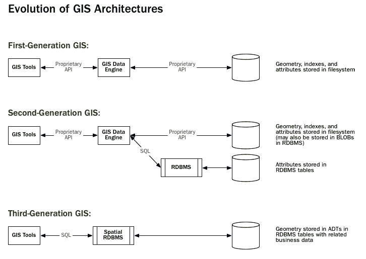

# 甲骨文空间与图形

Oracle 关系数据库是一种广泛使用的数据库系统，由于其成本和巨大的可扩展性，通常由非常大的组织使用。它也非常稳定和快速。它运行着世界上一些最大、最复杂的数据库，经常出现在医院、银行和管理数百万重要记录的政府机构中。

地理空间数据能力最初出现在甲骨文第 4 版中，是由**加拿大水文局** ( **CHS** )进行的修改。CHS 还实现了 Oracle 的第一个空间索引，其形式是一个不同寻常但高效的三维螺旋。甲骨文随后纳入了这一修改，并在主数据库版本 7 中发布了甲骨文**空间数据库选项** ( **SDO** )。SDO 系统在 Oracle 版本 8 中变成了 Oracle Spatial。Oracle Spatial 的数据库模式在一些列名和表名上仍然有 SDO 前缀，类似于 PostGIS 如何使用 OGC 约定 ST 在模式级别将空间信息与传统的关系数据库表和函数分开。

从 2012 年开始，甲骨文开始调用包甲骨文空间和图形，以强调网络数据模块。该模块用于分析网络数据集，如交通或公用事业。然而，该模块也可以用于对抗抽象网络，例如社交网络。社交网络数据的分析是大数据分析的共同目标，现在这种趋势越来越明显。大数据社交网络分析很可能是甲骨文更改产品名称的原因。

Oracle Spatial 具有以下功能:

*   地理空间数据模式
*   现在基于 R 树索引的空间索引系统
*   一个执行几何运算的应用编程接口
*   优化特定数据集的空间数据调整应用编程接口
*   拓扑数据模型
*   网络数据模型
*   用于存储、索引、查询和检索栅格数据的地理主数据类型
*   三维数据类型，包括**不规则三角网**(**tin**)和 **LIDAR** (简称**光探测和测距**)点云
*   用于搜索位置名称和返回坐标的地理编码器
*   用于驱动方向类型查询的路由引擎
*   OGC 法规遵从性

Oracle Spatial 和 PostGIS 具有合理的可比性，并且都是常用的。在执行地理空间分析时，您迟早会将这两个系统视为数据源。

Oracle Spatial and Graph is sold separately from Oracle itself. A little-known fact is that the SDO data type is native to the main Oracle database. If you have a simple application that just inputs points and retrieves them, you can use the main Oracle API to add, update, and retrieve SDOs without Oracle Spatial and Graph.

美国海洋能源、管理、法规和执行局使用甲骨文管理全球最大的地理空间系统之一中价值数十亿美元的石油、天然气和矿产权利的环境、商业和地理空间数据。以下地图由京东方提供:

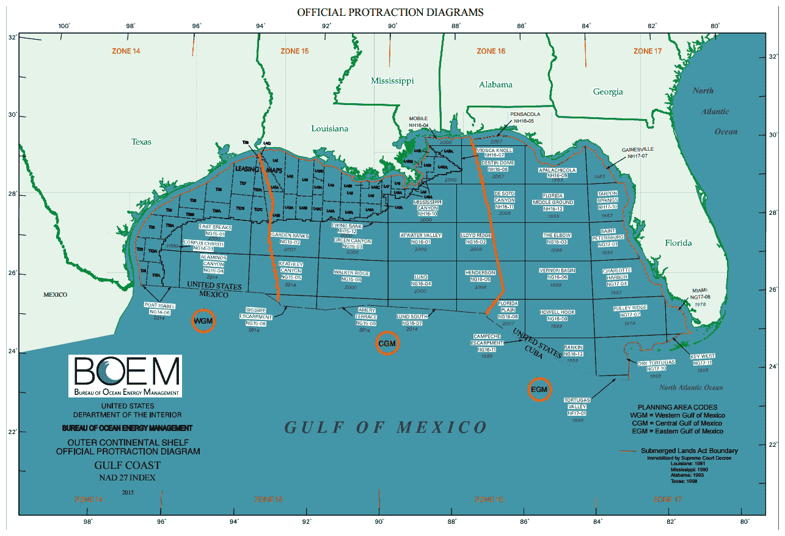

Oracle Spatial and Graph can be found online at the following URL: [http://www.oracle.com/us/products/database/options/spatial/overview](http://www.oracle.com/us/products/database/options/spatial/overview).

# ArcSDE

ArcSDE 是 Esri 的**空间数据引擎** ( **SDE** )。作为一款独立产品，它已经存在了十多年，现在已经推出到 Esri 的 ArcGIS Server 产品中。让 ArcSDE 有趣的是，该引擎大多独立于数据库，支持多个数据库后端。ArcSDE 支持 IBM DB2、Informix、微软 SQL Server、Oracle 和 PostgreSQL 作为数据存储系统。虽然 ArcSDE 能够在系统(如微软 SQL Server 和甲骨文)上从头开始创建和管理空间模式，但它使用本机空间引擎(如果有)。这种安排适用于 IBM DB2、Oracle 和 PostgreSQL。对于 Oracle，ArcSDE 管理表结构，但可以依赖 Oracle SDO 数据类型进行要素存储。

与前面提到的地理数据库一样，ArcSDE 也有丰富的空间选择应用编程接口，可以处理栅格数据。但是，ArcSDE 没有像 Oracle 和 PostGIS 那样丰富的 SQL 空间 API。Esri 在技术上支持与 ArcSDE 相关的基本 SQL 功能，但它鼓励用户和开发人员使用 Esri 软件或编程 API 来操作通过 ArcSDE 存储的数据，因为它旨在成为 Esri 软件的数据源。

Esri 确实提供了软件库，允许开发人员使用 ArcSDE 或 Esri 的基于文件的地理数据库(称为个人地理数据库)在 Esri 软件之外构建应用程序。但是，这些库是黑盒，ArcSDE 使用的通信协议从未进行过逆向工程。通常情况下，ArcSDE 和第三方应用程序之间会使用 ArcGIS Server API(在某种程度上支持 OGC 服务)和返回 GeoJSON 的相当简单的 REST API 服务在 web 服务级别进行交互。

以下截图来自美国联邦网站[http://catalog.data.gov](http://catalog.data.gov)，这是一个基于 ArcSDE 的非常大的地理空间数据目录，该目录反过来将美国联邦数据联网，包括来自其他联邦机构的其他 ArcSDE 安装。

ArcSDE is integrated into ArcGIS Server; however, information on it can be found at [http://www.esri.com/software/arcgis/arcsde](http://www.esri.com/software/arcgis/arcsde).

# 微软 SQL 服务器

微软在其旗舰数据库产品微软 SQL Server 2008 中增加了空间数据支持。自该版本以来，它已经逐渐改进，但仍远不如甲骨文空间地理信息系统或邮政地理信息系统复杂。Microsoft 支持与 PostGIS 相同的数据类型，但使用略有不同的命名约定，但不直接支持栅格数据。它还支持输出到 WKT 和 WKB 格式。

它为空间选择提供了一些非常基本的支持，但这显然不是微软目前的优先事项。这种有限的支持可能是因为它是所有可用于微软软件映射组件的支持，并且几个第三方引擎可以在 SQL Server 之上提供空间支持。

Microsoft's support for spatial data in SQL Server is documented at the following link: [http://msdn.microsoft.com/en-us/library/bb933790.aspx](http://msdn.microsoft.com/en-us/library/bb933790.aspx)[.](http://msdn.microsoft.com/en-us/library/bb933790.aspx)

# 关系型数据库

另一个非常受欢迎的免费数据库 MySQL 提供了与微软 SQL Server 几乎相同的支持。基本空间关系函数支持 OGC 几何类型。通过一系列收购，MySQL 已经成为甲骨文的财产。

虽然甲骨文目前仍然致力于将 MySQL 作为开源数据库，但这一购买使世界上最受欢迎的开源数据库的最终未来受到质疑。但是，就地理空间分析而言，MySQL 几乎不是竞争者，也不太可能成为任何项目的首选。

For more information on MySQL spatial support, visit the following link: [https://dev.mysql.com/doc/refman/8.0/en/spatial-types.html](https://dev.mysql.com/doc/refman/8.0/en/spatial-types.html)

# 太空员

SpatiaLite 是开源 SQLite 数据库引擎的扩展。SQLite 使用文件数据库，旨在集成到应用程序中，而不是大多数关系数据库服务器使用的典型客户端-服务器模型中。SQLite 已经有了空间数据类型和空间索引，但是 SpatiaLite 增加了对 OGC 简单要素规范的支持，以及地图投影。

应该注意的是，非常流行的 SQLite 与 Oracle、PostgreSQL 或 MySQL 不属于同一类别，因为它是为单用户应用程序设计的基于文件的数据库。

SpatiaLite can be found at [http://www.gaia-gis.it/gaia-sins/](http://www.gaia-gis.it/gaia-sins/).

# 地质包装

地理包是一种基于文件的地理数据库格式。官方地理打包网站[http://geopackage.org](http://geopackage.org)将其描述为:

"An open, standards-based, platform-independent, portable, self-describing, compact format for transferring geospatial information."

这也是对 Esri 文件地理数据库格式的直接回答，也是对开放地理空间社区指定的 *shapefile 杀手*的直接回答，以取代老化的、部分封闭的 shapefile 格式。这两种格式都是真正的文件规范，需要依靠其他软件来读写数据。

地理打包是 OGC 规范，这意味着它作为行业数据格式的未来是安全的。它也是一种*包罗万象的*格式，可以处理向量数据、栅格数据、属性信息和扩展来满足新的需求。而且，像任何好的数据库一样，它处理多个层。您可以将整个地理信息系统项目存储在一个包中，从而使数据管理更加简单。

You can read more about Esri's file geodatabase format here: [http://desktop.arcgis.com/en/arcmap/10.3/manage-data/administer-file-gdbs/file-geodatabases.htm](http://desktop.arcgis.com/en/arcmap/10.3/manage-data/administer-file-gdbs/file-geodatabases.htm).

# 按指定路线发送

路由是计算几何中一个非常小众的领域。这也是一个非常丰富的研究领域，远远超出了熟悉的驾驶方向用例。路由算法的要求只是一个网络数据集和影响网络传输速度的阻抗值。通常，数据集是基于向量的，但栅格数据也可用于某些应用。

这一领域的两个主要竞争者是 Esri 的网络分析师和 PostGIS 的开源 pgRouting 引擎。最常见的路由问题是访问多个点位置的最有效方式。这个问题叫做**旅行推销员问题** ( **TSP** )。旅行商问题是计算几何中研究最深入的问题之一。它通常被认为是任何路由算法的基准。

More information on the TSP can be found at [http://en.wikipedia.org/wiki/Travelling_salesman_problem](http://en.wikipedia.org/wiki/Travelling_salesman_problem).

# Esri 网络分析师和空间分析师

Esri 进入路由领域，即网络分析师，是一个真正通用的路由引擎，可以处理大多数路由应用，而无需考虑上下文。空间分析师是另一个以栅格为中心的 Esri 扩展，它可以对栅格地形数据执行*最小成本路径*分析。

The ArcGIS Network Analyst product page is located on Esri's website at: [http://www.esri.com/software/arcgis/extensions/networkanalyst](http://www.esri.com/software/arcgis/extensions/networkanalyst).

# pgRouting

后置地理信息系统的 **pgRouting** 扩展为地理数据库添加了路由功能。它面向道路网络，但也适用于其他类型的网络数据。

下图显示了 pgRouting 输出的行驶距离半径计算，显示在 QGIS 中。这些点根据它们与起始位置的接近程度，从绿色到红色进行颜色编码。如下图所示，这些点是网络数据集中的节点，由 QGIS.org([https://qgis.org/en/site/](https://qgis.org/en/site/))提供，在本例中为道路:

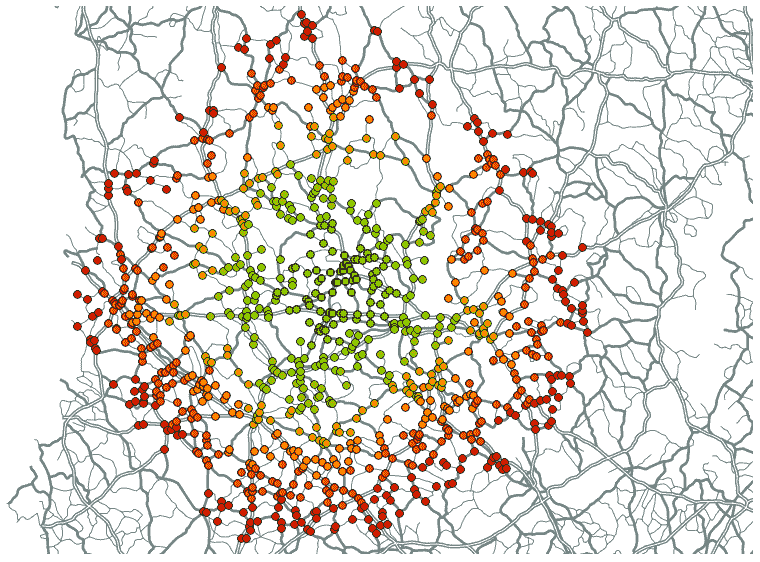

The pgRouting PostGIS extension is maintained at [http://pgrouting.org/](http://pgrouting.org/).

接下来，我们将研究您需要的工具，以便像前面一样可视化图表。

# 理解桌面工具(包括可视化)

地理空间分析需要可视化输出的能力。这一事实使得能够可视化数据的工具对该领域绝对至关重要。有两类地理空间可视化工具。

第一个是地理空间查看器，第二个是地理空间分析软件。第一类—地理空间查看器—允许您访问、查询和可视化数据，但不能以任何方式编辑数据。第二类允许您执行这些任务，也可以编辑数据。查看器的主要优势是它们通常是轻量级的软件，可以快速启动和加载数据。

地理空间分析软件需要更多的资源才能编辑复杂的地理空间数据，因此它的加载速度更慢，数据呈现速度也更慢，以便提供动态编辑功能。

# 量子 GIS

**量子 GIS** ，更俗称 **QGIS** ，是一个完整的开源地理信息系统。在两类可视化软件中，QGIS 属于地理空间分析范畴。该系统的开发始于 2002 年，1.0 版于 2009 年发布。

这是本章前面提到的大多数图书馆的最佳展示。QGIS 是用 C++编写的，使用了用于 GUI 的 Qt 库。图形用户界面设计良好，易于使用。事实上，受过专有软件包培训的地理空间分析师，如 Esri 的 ArcGIS 或流形系统，将会在家里使用 QGIS。工具和菜单系统符合逻辑，是典型的地理信息系统。QGIS 的整体速度与任何其他可用系统一样好，甚至更好。

QGIS 的一个很好的特性是底层的库和实用程序就在表面之下。模块可以由任何第三方用 Python 编写并添加到系统中。QGIS 还有一个强大的在线包管理系统来搜索、安装和更新这些扩展。Python 集成包括一个控制台，允许您在控制台发出命令，并在图形用户界面中查看结果。QGIS 并不是唯一提供这种功能的软件。

像大多数地理空间软件包一样，通过 Python 集成，如果您使用自动安装程序，它会安装完整版本的 Python。如果您已经安装了 Python，那么没有理由担心。在一台机器上拥有多个版本的 Python 是相当常见的，并且得到了很好的支持。许多人在他们的计算机上有多个版本的 Python，目的是为了测试软件，或者因为它是如此多不同软件包的如此常见的脚本环境。

当 Python 控制台在 QGIS 中运行时，整个程序 API 通过一个名为`qgis.utils.iface`的自动加载对象可用。下面的截图显示了运行 Python 控制台的 QGIS:

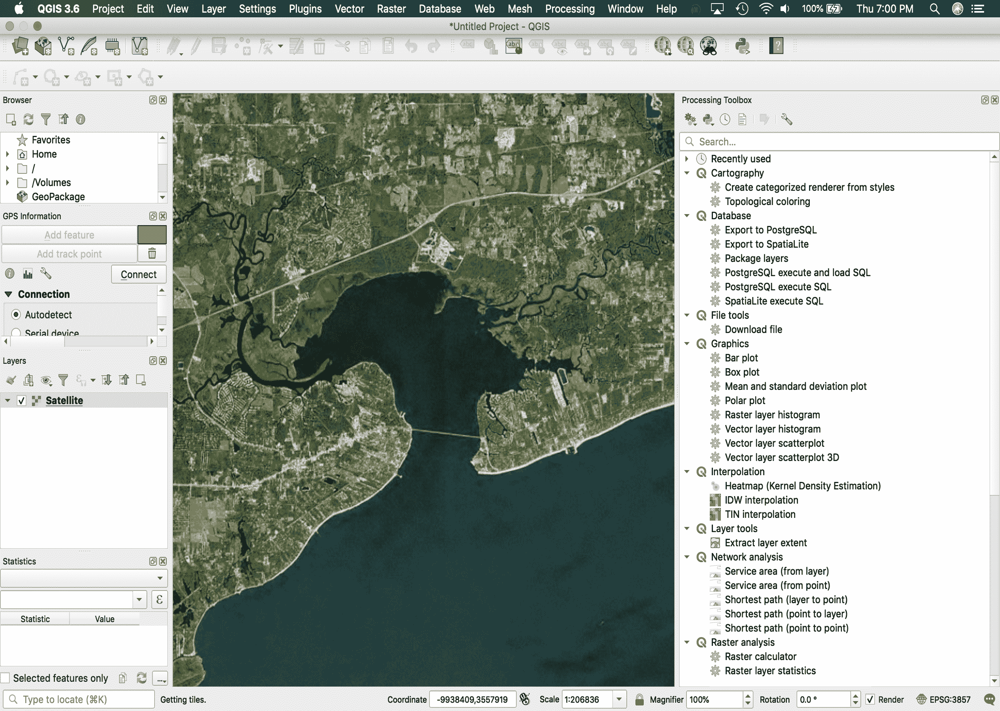

因为 QIS 基于 GDAL/OGR 和 GEOS，并且可以使用 PostGIS，所以它支持这些包提供的所有数据源。它也有不错的光栅处理功能。QGIS 非常适合使用可用的扩展来制作纸质地图或整个地图册。

QGIS is well documented on the QGIS website at the following link: [http://www.qgis.org/en/documentation.html](https://www.qgis.org/en/docs/index.html). You can also find numerous online and video tutorials by searching for QGIS or particular operation.

# opencv

OpenEV 是一个开源的地理空间查看器，最初由 Atlantis Scientific 在 2002 年左右开发，在被微软收购之前成为 Vexcel。Vexcel 将 OpenEV 开发为可免费下载的卫星图像浏览器，用于**加拿大地理空间数据基础设施** ( **CGDI** )。它是使用 GDAL 和 Python 构建的，部分由 GDAL 创建者 Frank Warmerdam 维护。

OpenEV 是目前最快的光栅浏览器之一。尽管最初是作为一个查看器设计的，OpenEV 提供了 GDAL 和 PROJ 的所有功能。虽然创建为光栅工具，但它可以覆盖向量数据，如形状文件，甚至支持基本编辑。还可以使用内置的光栅计算器更改光栅图像，并且可以转换、重新投影和裁剪数据格式。

以下截图显示了 OpenEV 查看器窗口中的一个 25 MB、16 位整数 GeoTIFF 高程文件:

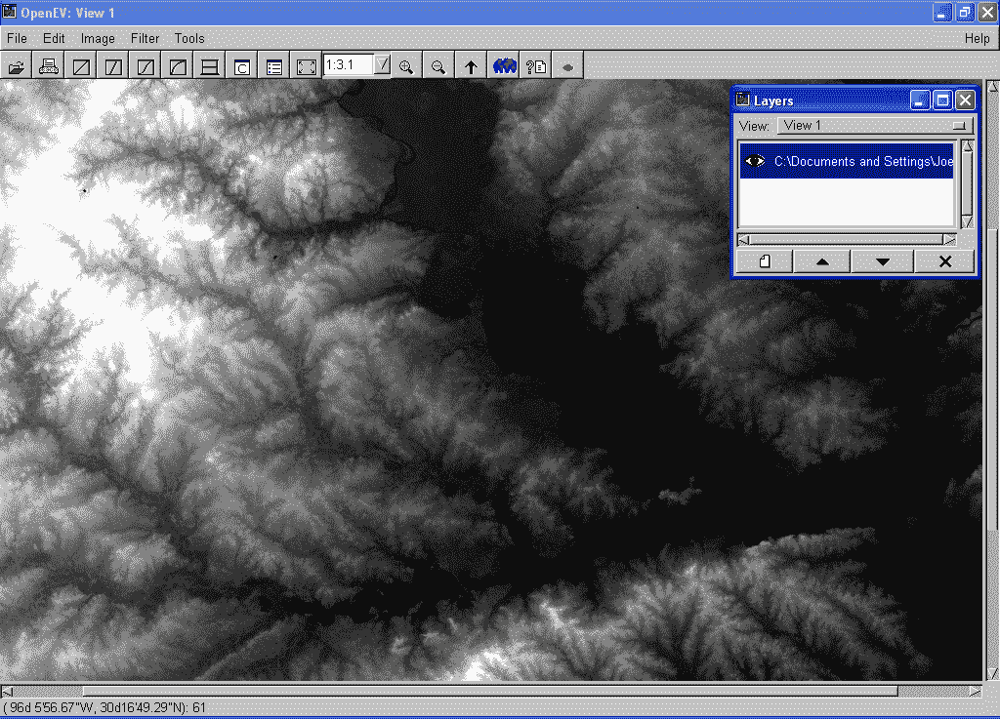

OpenEV 主要是用 Python 构建的，它提供了一个 Python 控制台，可以访问程序的全部功能。OpenEV 的图形用户界面没有 QGIS 等其他工具复杂。例如，不能像在 QGIS 中那样将地理空间数据集拖放到查看器中。但是，OpenEV 的原始速度使得它对于简单的光栅观看，或者对于基本的处理和数据转换非常有吸引力。

The OpenEV home page is available at [http://openev.sourceforge.net](http://openev.sourceforge.net).

# 地理信息系统

GRASS 是现存最古老的持续开发的地理空间系统之一。美国陆军工程兵部队于 1982 年开始 GRASS 的开发。它最初是为在 Unix 系统上运行而设计的。1995 年，军队发布了最后一个补丁，软件被转移到社区开发，此后一直保留在那里。

即使重新设计了用户界面，GRASS 对现代地理信息系统用户来说仍然有些深奥。然而，由于其几十年的历史和不存在的价格标签，多年来，许多地理空间工作流和高度专业化的模块已经在 GRASS 中实现，使其与许多组织和个人高度相关，特别是在研究社区。由于这些原因，GRASS 仍在积极开发中。

GRASS 也已经和 QGIS 集成在一起，所以可以使用更现代更熟悉的 QGIS GUI 来运行 GRASS 功能。GRASS 还与 Python 深度集成，可以用作库或命令行工具。下面的截图显示了原生 GRASS GUI 中的一些地形分析，该 GUI 是使用`wxPython`库构建的:

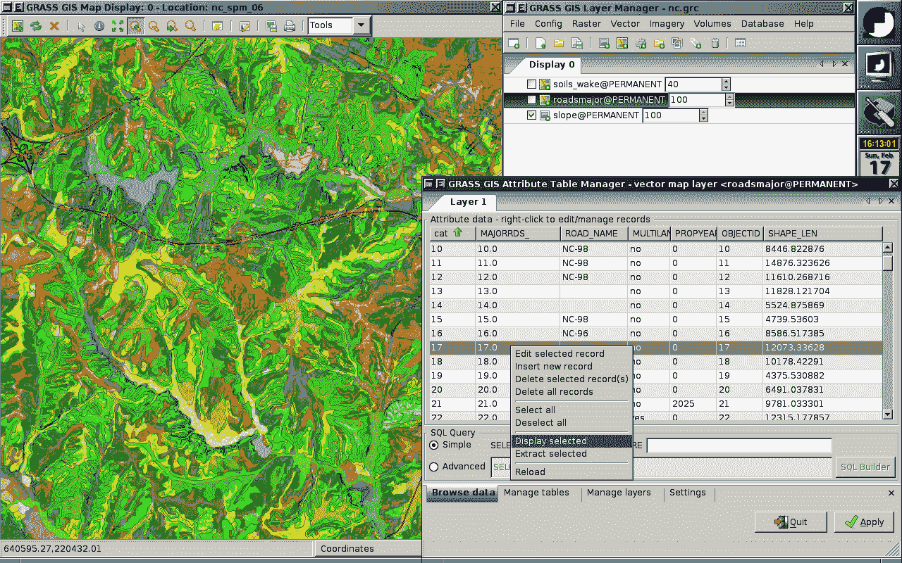

GRASS is housed online at [http://grass.osgeo.org/](http://grass.osgeo.org/)[.](http://grass.osgeo.org/)

# 格夫吉先生

另一个基于 Java 的桌面 GIS 是 **gvSIG** 。全球虚拟空间信息小组项目始于 2004 年，是将西班牙巴伦西亚地区基础设施和运输部的信息技术系统迁移到自由软件的更大项目的一部分。结果是 gvSIG，它一直在不断成熟。该特征集大部分可与 QGIS 相媲美，也具有一些独特的功能。

官方 gvSIG 项目有一个非常活跃的分叉叫做 **gvSIG 社区版** ( **gvSIG CE** )。还有一个手机版叫 gvSIG 手机。gvSIG 代码库是开源的。

The official home page for gvSIG is available at [http://www.gvsig.org/web/](http://www.gvsig.org/web/).

# OpenJUMP

OpenJUMP 是另一个基于 Java 的开源桌面 GIS。 **JUMP** 代表 **Java 统一制图平台**，最初由生动解决方案为不列颠哥伦比亚省政府创建。在生动解决方案交付 JUMP 后，开发停止了。生动解决方案最终将 JUMP 发布到开源社区，并在那里更名为 OpenJUMP。

OpenJUMP 具有读写 shapefiles 和 OGC **GML** (简称**地理标记语言**)的能力，支持 PostGIS 数据库。还可以显示来自 OGC **WMS** (简称**网络地图服务器**)和 **WFS** (简称**网络要素服务**)服务的部分图像格式和数据。它有一个插件架构，也可以作为定制应用的开发平台。

You can find out more about OpenJUMP on the official web page at [http://www.openjump.org/](http://www.openjump.org/).

# 谷歌地球

谷歌地球无处不在，似乎不值得一提。2001 年首次发布的 EarthViewer 3D(由一家名为 Keyhole Inc .的公司创建)和 EarthViewer 3D 项目由非营利风险投资公司 In-Q-Tel 资助，后者又由美国中央情报局资助。这种间谍机构的血统，以及随后谷歌购买 Keyhole 来创建和分发谷歌地球，让全球关注地理空间分析领域。

自 2005 年谷歌地球首次发布该软件以来，谷歌一直在不断完善它。一些值得注意的新增功能是创建了谷歌月亮、谷歌火星、谷歌天空和谷歌海洋。这些是虚拟地球应用程序，以月球和火星的数据为特色，但谷歌海洋除外，它在谷歌地球上增加了海底高程测绘，即水深测量。

谷歌地球引入了旋转虚拟地球概念，用于探索地理数据。在看了几个世纪的 2D 地图或低分辨率物理地球仪后，虚拟地绕着地球飞行，落在世界任何地方的街角都令人惊叹——尤其是对地理空间分析师和其他地理爱好者来说，正如下面俯瞰路易斯安那州新奥尔良中央商务区的谷歌地球截图所示:

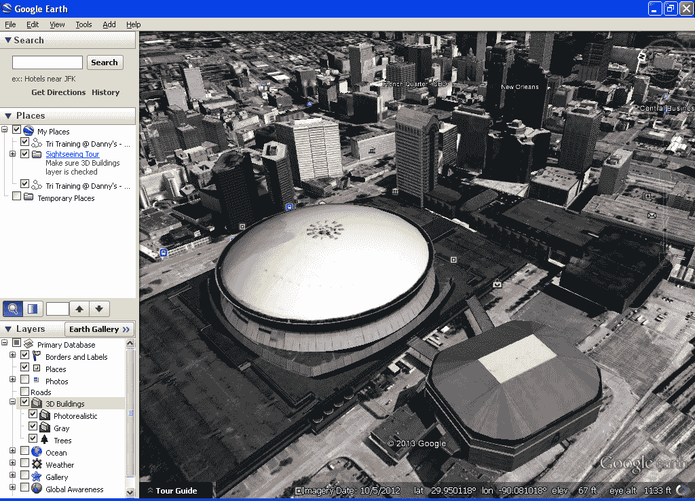

正如谷歌通过其基于图块的*滑动*制图方法彻底改变了网络制图一样，虚拟地球概念是地理空间可视化的一大推动力。

最初的兴奋消失后，许多地理空间分析师意识到谷歌地球是一个非常生动有趣的地理探索工具，但它对任何有意义的地理空间分析的效用都非常有限。谷歌地球正好属于地理空间浏览器软件领域。

它消耗的唯一数据格式是其原生的**锁眼标记语言** ( **KML** )，这是一种集数据和样式于一体的格式，在[第 2 章](02.html)、*学习* *地理空间数据*中进行了讨论。由于这种格式现在是 OGC 标准，只使用一种数据格式会立即限制任何工具的效用。任何涉及谷歌地球的项目都必须首先从 KML 完整的数据转换和样式开始，让人想起大约 10-20 年前的地理空间分析。支持 KML 的工具，包括谷歌地图，只支持 KML 的有限部分。

谷歌地球的原生数据集覆盖全球，但它是跨越几年和来源的数据集的混合。谷歌已经大大改进了工具中的内联元数据，它可以识别当前视图的来源和大致日期。但是，这种方法在外行人中造成了混乱。许多人认为，谷歌地球中的数据更新频率远远高于实际情况。谷歌街景系统显示了世界大部分地区的街道级 360 度视图，这在一定程度上有助于纠正这种误解。

人们能够很容易地识别出几年前熟悉地点的图像。谷歌地球造成的另一个常见误解是，整个世界已经被详细绘制，因此创建地理空间分析的基础地图应该是微不足道的。正如[第 2 章](02.html)*学习* *地理空间数据*中所讨论的，使用现代数据和软件绘制感兴趣区域的地图远比几年前容易，但这仍然是一项复杂且劳动密集型的工作。这种误解是地理空间分析师在启动项目时必须管理的第一批客户期望之一。

尽管有这些误解，谷歌对地理空间分析的影响几乎完全是积极的。几十年来，发展地理空间产业面临的最大挑战之一是让潜在的利益相关者相信，在做出有关人员、资源和环境的决策时，地理空间分析几乎总是最好的方法。这个障碍与汽车经销商形成鲜明对比。当潜在客户来到停车场时，销售员不需要说服买家他们需要一辆车，只需要告诉他们车的类型。

地理空间分析师必须首先对项目发起人进行技术教育，然后说服他们地理空间方法是应对挑战的最佳方式。对于分析师来说，谷歌基本上取消了这些步骤。

Google Earth can be found online at [http://www.google.com/earth/index.html](http://www.google.com/earth/index.html).

# 美国宇航局世界风

NASA WorldWind 是一个开源的虚拟地球仪和地理空间浏览器，最初由美国国家航空航天局于 2004 年发布。它最初是基于微软的。NET 框架，使其成为一个以 Windows 为中心的应用程序。

下面这张 NASA WorldWind 的截图看起来和谷歌地球很像:

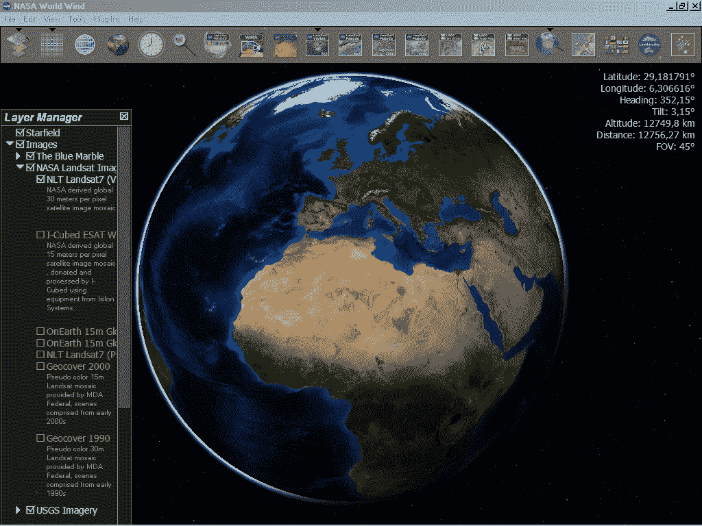

2007 年，一款基于 Java 的**软件开发工具包** ( **SDK** )发布，名为 **WorldWind Java** ，使得 WorldWind 更加跨平台。向 Java 的过渡也导致了 WorldWind 浏览器插件的创建。

WorldWind Java 软件开发工具包被认为是一个软件开发工具包，而不是像。. NET 版本但是，SDK 附带的演示提供了一个无需任何额外开发的查看器。虽然美国宇航局的世界风最初是受谷歌地球的启发，但它作为开源项目的地位使它走向了一个完全不同的方向。

谷歌地球是一个受 KML 规范限制的通用工具。美国宇航局的世界风现在是一个平台，任何人都可以在其上无限制地发展。随着新类型数据的出现和计算资源的增长，虚拟地球范式的潜力无疑为地理空间可视化带来了更多尚未被发掘的潜力。

NASA WorldWind is available online at [http://worldwind.arc.nasa.gov/java/](http://worldwind.arc.nasa.gov/java/).

# ArcGIS

Esri 走的路线是成为地理空间分析方法的最大推动者之一，以了解我们的世界，并且是一家私人控股的盈利企业，必须在一定程度上关注自身利益。ArcGIS 软件套件代表了所有已知的地理空间可视化类型，包括向量、栅格、球体和 3D。它也是许多国家的市场领导者。如本章前面的地理空间软件地图所示，Esri 越来越多地将开源软件纳入其工具套件，包括用于栅格显示的 GDAL，以及作为 ArcGIS 脚本语言的 Python。

下面的截图显示了带有海洋跟踪密度数据分析的核心 ArcGIS 应用程序 ArcMap。该界面与 QGIS 有很多共同之处，如本截图[https://marinecadastre.gov/](https://marinecadastre.gov/)提供:

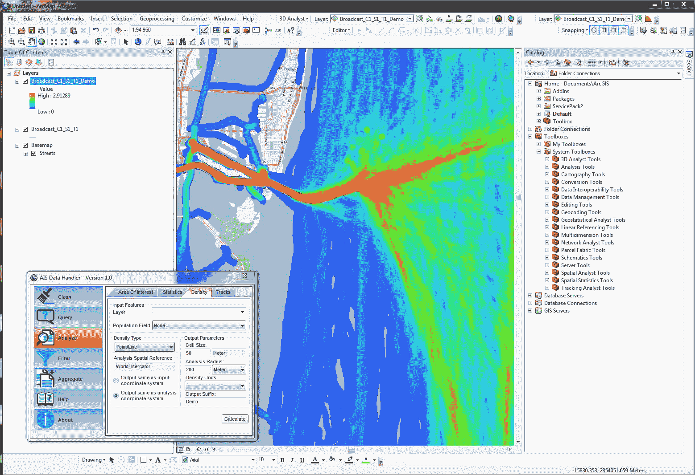

The ArcGIS product page is available online at [http://www.esri.com/software/arcgis](http://www.esri.com/software/arcgis).

现在我们已经了解了可视化和分析数据的工具，让我们来看看如何管理数据。

# 理解元数据管理

数据在互联网上的分布增加了元数据的重要性。数据保管人能够向全世界发布数据集供下载，而无需任何个人交互。地理空间数据集的元数据记录可以遵循这一点，以帮助确保维护这些数据的完整性和可问责性。

适当格式化的元数据还允许自动编目、搜索索引和数据集集成。元数据已经变得如此重要，以至于地理空间社区中的一个常见口号是*没有元数据的数据不是数据*，这意味着没有元数据，地理空间数据集就无法得到充分利用和理解。

下一节列出了一些可用的常见元数据工具。元数据管理的 OGC 标准是网络目录服务，它创建了一个基于元数据的目录系统和一个用于分发和发现数据集的应用编程接口。

# Python 的 pycsw 库

`pycsw`是一个符合 OGC 标准的 CSW，用于发布和发现地理空间元数据。它支持多种应用编程接口，包括 CSW 2/CSW 3、开放搜索、OAI-PMH 和 SRU。它非常轻便，是纯 Python。有关使用`pycsw`构建的 CSW 和客户端的优秀示例，请参见**太平洋岛屿海洋观测系统** ( **太平洋观测系统**)目录，可通过以下链接获得:[http://pacioos.org/search/](http://pacioos.org/search/)。`pycsw`库也用在一个更大的名为**地理节点**的包中。

# 地理编码

GeoNode 是一个基于 Python 的地理空间内容管理系统。它将地理空间数据创建、元数据和可视化结合在一个服务器包中。它还包括社交功能，如评论和评级系统。它是开源的，可在[http://geonode.org/](http://geonode.org/)获得。以下截图来自 GeoNode 在线演示:

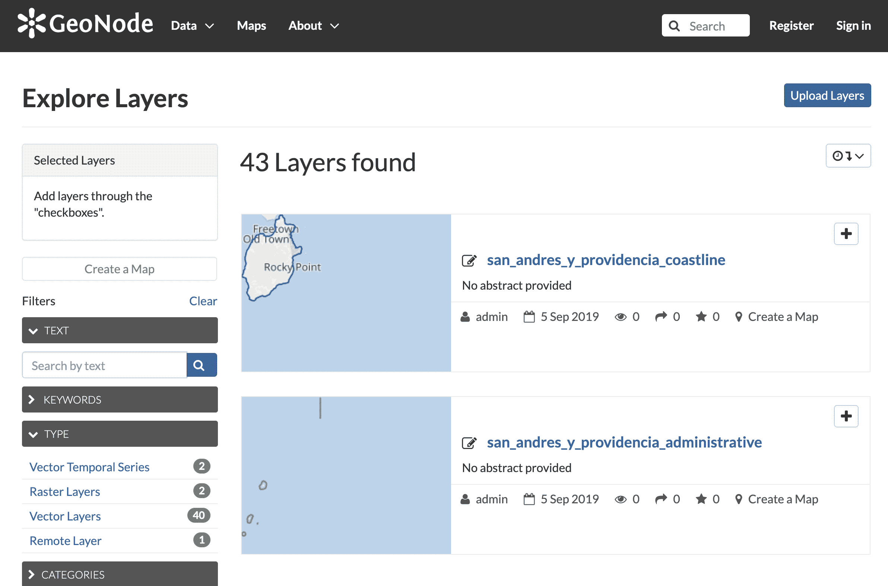

GeoNode 和`pycsw`是 Python 的两个主要元数据工具。接下来，我们将看看一些用其他语言编写的工具。

# 地理网络

GeoNetwork 是一个开源的、基于 Java 的目录服务器，用于管理地理空间数据。它包括一个元数据编辑器和搜索引擎，以及一个交互式网络地图查看器。该系统旨在全球连接空间数据基础设施。它可以使用元数据编辑工具通过网络发布元数据。它还可以通过嵌入式地理服务器地图服务器发布空间数据。它具有用户和组安全权限，以及 web 和桌面配置实用程序。

还可以配置地理网络，以便按计划的时间间隔从其他目录中获取元数据。以下是联合国粮食及农业组织实施地理网络的截图:

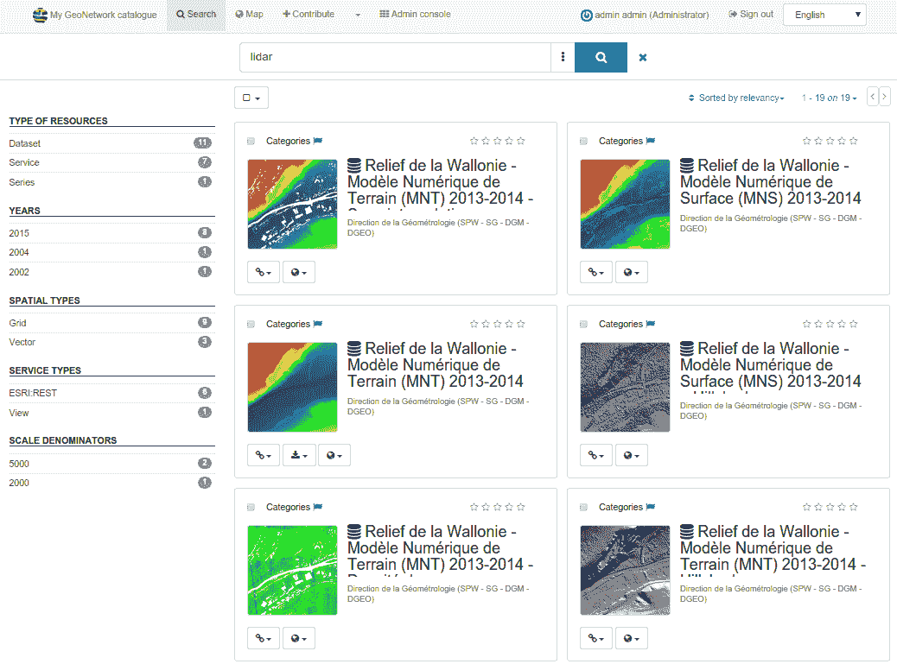

You can find out more about GeoNetwork at [http://geonetwork-opensource.org/](http://geonetwork-opensource.org/)[.](http://geonetwork-opensource.org/)

# 摘要

在本章中，您学习了地理空间分析软件的层次结构。您还学习了一个处理数百个现有地理空间软件包和库的框架，将它们分为一个或多个主要功能，包括数据访问、计算几何、栅格处理、可视化和元数据管理。

我们还检查了常用的基础库，包括 GDAL、OGR、PROJ 和 GEOS，这些库在地理空间软件中反复出现。你可以走近任何一款新的地理空间软件，追溯到这些核心库，然后问，*w*T2【增值是什么？更好地了解套餐。如果软件没有使用这些库中的一个，你需要问，*为什么这些开发人员要违背规则？*为了理解该系统带来了什么。

本章中只提到了几次 Python，以避免在理解地理空间软件领域时分心。但是，正如我们将会看到的，Python 在本章中被交织到每一个单独的软件中，它本身就是一个完全有能力的地理空间工具。Python 是 ArcGIS、QGIS、GRASS 和许多其他包的官方脚本语言，这绝非巧合。GDAL、OGR、PROJ、CGAL、JTS、GEOS 和 PostGIS 都有 Python 绑定也不是偶然的。

至于这里没有提到的包，它们都是 Python 通过 Jython Java 发行版 IronPython 掌握的。NET 发行版，Python 的各种数据库和 web APIs，以及内置的`ctypes`模块。作为一名地理空间分析师，如果有一项技术你不能错过，那就是 Python。

在下一章中，我们将看到 Python 是如何进入地理空间行业的。我们还将学习地理信息系统脚本语言、混搭粘合语言和成熟的编程语言。

# 进一步阅读

以下是您可以参考的网页列表:

*   [https://github.com/sacridini/Awesome-Geospatial](https://github.com/sacridini/Awesome-Geospatial)
*   [https://github.com/jerr0328/awesome-geospatial-list](https://github.com/jerr0328/awesome-geospatial-list)