# 高级地理空间 Python 建模

在这一章中，我们将在已经学习的数据处理概念的基础上，创建一些全面的信息产品。以前介绍的数据处理方法很少能自己提供问题的答案。您可以结合这些数据处理方法，从多个已处理的数据集构建地理空间模型。地理空间模型是现实世界某个方面的简化表示，有助于我们回答关于项目或问题的一个或多个问题。在本章中，我们将介绍一些在农业、应急管理、物流和其他行业中常用的重要地理空间算法。

我们将创造的产品如下:

*   作物健康地图
*   洪水淹没模型
*   彩色的山影
*   地形路线图
*   街道路线图
*   带有地理位置照片链接的形状文件

虽然这些产品是特定于任务的，但是用于创建它们的算法被广泛应用于地理空间分析。我们将在本章中讨论以下主题:

*   创建归一化差异植被指数
*   创建洪水淹没模型
*   创建彩色山体阴影
*   执行最低成本路径分析
*   将路线转换为形状文件
*   沿着街道走
*   地理定位照片
*   计算卫星图像云量

本章中的例子比前几章更长，涉及面更广。因此，有更多的代码注释来使程序更容易理解。在这些例子中，我们还将使用更多的函数。在前面的章节中，为了清晰起见，大部分都避免了函数，但是这些例子足够复杂，以至于某些函数使得代码更容易阅读。这些示例是作为地理空间分析师，您将在工作中使用的实际流程。

# 技术要求

对于本章，需要满足以下要求:

*   **版本** : Python 3.6 或更高
*   **RAM** :最小 6 GB (Windows)，8gb(macOS)；推荐 8 GB
*   **存储**:最低 7,200 RPM SATA，可用空间 20 GB，推荐 SSD，可用空间 40 GB。
*   **处理器**:最低英特尔酷睿 i3 2.5 GHz，推荐英特尔酷睿 i5。

# 创建归一化差异植被指数

我们的第一个例子是**归一化差异植被指数** ( **NVDI** )。NDVIs 用于显示感兴趣区域内植物的相对健康状况。一种 NDVI 算法使用卫星或航空图像，通过突出植物中的叶绿素密度来显示相对健康状况。NDVIs 只使用红色和近红外波段。NDVI 公式如下:

```py
NDVI = (Infrared – Red) / (Infrared + Red)
```

这项分析的目标是，首先生成一个包含红外和红色波段的多光谱图像，最后生成一个使用七个类别的伪彩色图像，这些类别将健康的植物染成深绿色，不太健康的植物染成浅绿色，裸露的土壤染成棕色。

因为健康指数是相对的，所以定位感兴趣的区域很重要。您可以对整个地球执行相对索引，但是广阔的区域，例如低植被极端的撒哈拉沙漠和茂密的森林区域，例如亚马逊丛林，会扭曲中等范围内植被的结果。然而，话虽如此，气候科学家还是会定期创建全球 NDVIs 来研究全球趋势。不过，更常见的应用是用于管理区域，如森林或农田，如本例所示。

我们将首先分析密西西比三角洲的一个农场。为此，我们将从相当大面积的多光谱图像开始，并使用 shapefile 来隔离单个场。下面截图中的图像是我们的广阔区域，感兴趣的领域用黄色突出显示:

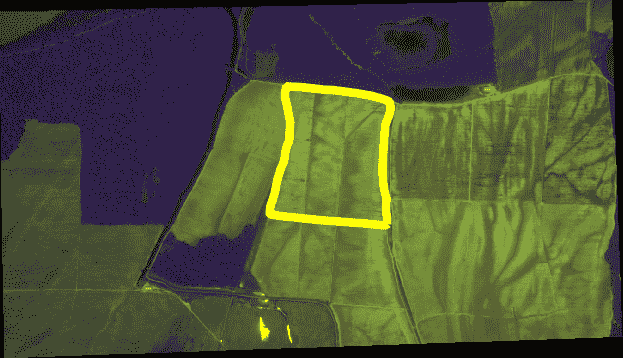

您可以从[http://git.io/v3fS9](http://git.io/v3fS9)下载该图像和农场区域的形状文件作为 ZIP 文件。

对于这个例子，我们将使用 GDAL，OGR，`gdal_array` / `numpy`，以及 **Python 图像库** ( **PIL** )来剪辑和处理数据。在本章的其他示例中，我们将只使用简单的 ASCII 网格和 NumPy。因为我们将使用 ASCII 高程网格，所以不需要 GDAL。在所有示例中，脚本使用以下约定:

*   导入库。
*   定义函数。
*   定义全局变量，如文件名。
*   执行分析。
*   保存输出。

我们对作物健康示例的方法分为两个脚本。第一个脚本创建索引图像，这是一个灰度图像。第二个脚本对索引进行分类，并输出彩色图像。在第一个脚本中，我们将执行以下步骤来创建索引映像:

1.  读取红外波段。
2.  读取字段边界形状文件。
3.  将形状文件光栅化为图像。
4.  将 shapefile 图像转换为 NumPy 数组。
5.  使用 NumPy 数组将红色带裁剪到字段中。
6.  对红外波段也这样做。
7.  使用波段数组在 NumPy 中执行 NDVI 算法。
8.  使用`gdal_array`将生成的索引算法保存到一个 GeoTIFF 文件中。

我们将分部分讨论这个脚本，以便于理解。代码注释还会告诉你每一步都发生了什么。

# 建立框架

设置框架将帮助我们导入我们需要的模块，并设置我们将用于前面指令的步骤 1 到 5 的功能。`imageToArray()`功能将 PIL 图像转换为 NumPy 数组，并依赖于`gdal_array`和 PIL 模块。`world2Pixel()`功能将地理空间坐标转换为目标图像的像素坐标。该功能使用`gdal`模块提供的地理参考信息。`copy_geo()`函数将源图像中的地理参考信息复制到目标数组中，但会考虑到在裁剪图像时产生的偏移。这些功能相当通用，可以在本例以外的各种不同遥感过程中发挥作用:

1.  首先，我们导入我们的库:

```py
import gdal
from osgeo import gdal
from osgeo import gdal_array
from osgeo import ogr
try:
 import Image
 import ImageDraw
except ImportError:
 from PIL import Image, ImageDraw
```

2.  然后，我们需要一个函数将图像转换成`numpy`数组:

```py
def imageToArray(i):
    """
    Converts a Python Imaging Library
    array to a gdal_array image.
    """
    a = gdal_array.numpy.fromstring(i.tobytes(), 'b')
    a.shape = i.im.size[1], i.im.size[0]
    return a
```

3.  现在，我们将设置一个函数，将坐标转换为图像像素:

```py
def world2Pixel(geoMatrix, x, y):
 """
 Uses a gdal geomatrix (gdal.GetGeoTransform())
 to calculate the pixel location of a
 geospatial coordinate
 """
 ulX = geoMatrix[0]
 ulY = geoMatrix[3]
 xDist = geoMatrix[1]
 yDist = geoMatrix[5]
 rtnX = geoMatrix[2]
 rtnY = geoMatrix[4]
 pixel = int((x - ulX) / xDist)
 line = int((ulY - y) / abs(yDist))
 return (pixel, line)
```

4.  最后，我们将创建一个从图像复制地理元数据的函数:

```py
def copy_geo(array, prototype=None, xoffset=0, yoffset=0):
 """Copy geotransfrom from prototype dataset to array but account
 for x, y offset of clipped array."""
 ds = gdal_array.OpenArray(array)
 prototype = gdal.Open(prototype)
 gdal_array.CopyDatasetInfo(prototype, ds,
 xoff=xoffset, yoff=yoffset)
 return ds
```

下一步是加载数据，我们将在下一节中检查这些数据。

# 正在加载数据

在这一节中，我们使用`gdal_array`加载农场场的源图像，它直接进入一个 NumPy 数组。我们还定义了输出图像的名称，它将是`ndvi.tif`。这一部分的一个有趣的部分是，我们使用`gdal`模块第二次加载源图像，而不是`gdal_array`。

第二个调用是捕获通过`gdal`而不是`gdal_array`获得的图像的地理参考数据。幸运的是，`gdal`仅按需加载栅格数据，因此这种方法避免了将完整数据集加载到内存中两次。一旦我们有了多维 NumPy 数组的数据，我们就可以分离出红色和红外波段，因为它们都将用于 NDVI 方程:

```py
# Multispectral image used
# to create the NDVI. Must
# have red and infrared
# bands
source = "farm.tif"

# Output geotiff file name
target = "ndvi.tif"

# Load the source data as a gdal_array array
srcArray = gdal_array.LoadFile(source)

# Also load as a gdal image to
# get geotransform info
srcImage = gdal.Open(source)
geoTrans = srcImage.GetGeoTransform()

# Red and infrared (or near infrared) bands
r = srcArray[1]
ir = srcArray[2]
```

现在我们已经加载了数据，我们可以将 shapefile 转换为光栅。

# 光栅化形状文件

本节开始剪辑过程。然而，第一步是光栅化 shapefile，它勾勒出我们将要分析的特定区域的边界。该区域在更大的`field.tif`卫星图像内。换句话说，我们将其从向量数据转换为栅格数据。但是我们也想在转换多边形时填充它，以便它可以用作图像遮罩。遮罩中的像素将与红色和红外数组中的像素相关联。

遮罩之外的任何像素都将变成`NODATA`像素，因此它们不会作为 NDVI 的一部分进行处理。为了进行这种关联，我们需要实心多边形成为一个 NumPy 数组，就像栅格波段一样。这种方法将确保我们的 NDVI 计算仅限于农田。

将 shapefile 多边形转换为 NumPy 数组形式的填充多边形的最简单方法是将其绘制为 PIL 图像中的多边形，填充该多边形，然后使用允许转换的 PIL 和 NumPy 中的现有方法将其转换为 NumPy 数组。

在这个例子中，我们使用`ogr`模块来读取 shapefile，因为我们已经有了可用的 GDAL。但是，我们也可以使用 PyShp 同样轻松地读取 shapefile。如果我们的农田图像可以作为 ASCII 网格使用，我们就可以完全避免使用`gdal`、`gdal_array`和`ogr`模块:

1.  首先，我们打开 shapefile 并选择唯一的一层:

```py
# Clip a field out of the bands using a
# field boundary shapefile

# Create an OGR layer from a Field boundary shapefile
field = ogr.Open("field.shp")
# Must define a "layer" to keep OGR happy
lyr = field.GetLayer("field")
```

2.  只有一个多边形，所以我们要抓住这个特征:

```py
# Only one polygon in this shapefile
poly = lyr.GetNextFeature()
```

3.  现在我们将图层范围转换为图像像素坐标:

```py
# Convert the layer extent to image pixel coordinates
minX, maxX, minY, maxY = lyr.GetExtent()
ulX, ulY = world2Pixel(geoTrans, minX, maxY)
lrX, lrY = world2Pixel(geoTrans, maxX, minY)
```

4.  然后，我们计算新图像的像素大小:

```py
# Calculate the pixel size of the new image
pxWidth = int(lrX - ulX)
pxHeight = int(lrY - ulY)
```

5.  接下来，我们以正确的大小创建一个新的空白图像:

```py
# Create a blank image of the correct size
# that will serve as our mask
clipped = gdal_array.numpy.zeros((3, pxHeight, pxWidth),
 gdal_array.numpy.uint8)
```

6.  现在，我们准备使用边界框来裁剪红色和红外波段:

```py
# Clip red and infrared to new bounds.
rClip = r[ulY:lrY, ulX:lrX]
irClip = ir[ulY:lrY, ulX:lrX]
```

7.  接下来，我们为图像创建地理配准信息:

```py
# Create a new geomatrix for the image
geoTrans = list(geoTrans)
geoTrans[0] = minX
geoTrans[3] = maxY
```

8.  然后，我们可以准备将点映射到像素，以创建我们的遮罩图像:

```py
# Map points to pixels for drawing
# the field boundary on a blank
# 8-bit, black and white, mask image.
points = []
pixels = []
# Grab the polygon geometry
geom = poly.GetGeometryRef()
pts = geom.GetGeometryRef(0)
```

9.  我们遍历所有点要素并存储它们的 *x* 和 *y* 值:

```py
# Loop through geometry and turn
# the points into an easy-to-manage
# Python list
for p in range(pts.GetPointCount()):
    points.append((pts.GetX(p), pts.GetY(p)))
```

10.  现在，我们将这些点转换为像素位置:

```py
# Loop through the points and map to pixels.
# Append the pixels to a pixel list
for p in points:
    pixels.append(world2Pixel(geoTrans, p[0], p[1]))
```

11.  接下来，我们创建一个新图像作为我们的蒙版图像:

```py
# Create the raster polygon image as a black and white 'L' mode
# and filled as white. White=1
rasterPoly = Image.new("L", (pxWidth, pxHeight), 1)
```

12.  现在我们可以光栅化我们的多边形:

```py
# Create a PIL drawing object
rasterize = ImageDraw.Draw(rasterPoly)

# Dump the pixels to the image
# as a polygon. Black=0
rasterize.polygon(pixels, 0)
```

13.  最后，我们可以将我们的遮罩转换成一个`numpy`数组:

```py
# Hand the image back to gdal/gdal_array
# so we can use it as an array mask
mask = imageToArray(rasterPoly)
```

现在，我们已经将 shapefile 转换为遮罩图像，我们可以剪辑波段了。

# 修剪乐队

现在我们有了图像遮罩，我们可以将红色和红外波段裁剪到遮罩的边界。对于此过程，我们使用 NumPy 的`choose()`方法，该方法将遮罩像元与栅格波段像元相关联，并返回该值，或返回`0`。结果是一个新数组被裁剪到遮罩上，但具有栅格波段中的相关值:

```py
# Clip the red band using the mask
rClip = gdal_array.numpy.choose(mask,
 (rClip, 0)).astype(gdal_array.numpy.uint8)

# Clip the infrared band using the mask
irClip = gdal_array.numpy.choose(mask,
 (irClip, 0)).astype(gdal_array.numpy.uint8)
```

我们现在只有我们想要的数据，所以我们可以应用我们的 NDVI 相对植被健康公式。

# 使用 NDVI 公式

我们创建 NDVI 的最后过程是执行方程式*红外-红色/红外+红色*。我们执行的第一步是消除任何**非数字**，也称为 **NaN** ，NumPy 中可能在除法运算中出现的值。在保存输出之前，我们将把任何 NaN 值转换成`0`。我们将输出保存为`ndvi.tif`，这将是下一个脚本的输入，以便对 NDVI 进行分类和着色，如下所示:

1.  首先，我们将忽略来自`numpy`的任何警告，因为我们将在边缘附近得到一些错误:

```py
# We don't care about numpy warnings
# due to NaN values from clipping
gdal_array.numpy.seterr(all="ignore")
```

2.  现在我们可以执行我们的 NDVI 公式:

```py
# NDVI equation: (infrared - red) / (infrared + red)
# *1.0 converts values to floats,
# +1.0 prevents ZeroDivisionErrors
ndvi = 1.0 * ((irClip - rClip) / (irClip + rClip + 1.0))
```

3.  如果有任何 NaN 值，我们将其转换为零:

```py
# Convert any NaN values to 0 from the final product
ndvi = gdal_array.numpy.nan_to_num(ndvi)
```

4.  最后，我们保存我们完成的 NDVI 图像:

```py
# Save the ndvi as a GeoTIFF and copy/adjust 
# the georeferencing info
gtiff = gdal.GetDriverByName( 'GTiff' )
gtiff.CreateCopy(target, copy_geo(ndvi, prototype=source, xoffset=ulX, yoffset=ulY))
gtiff = None
```

下图是该示例的输出。您需要在地理空间查看器(如 QGIS 或 OpenEV)中查看它。大多数图像编辑器都不会打开该图像。灰色阴影越浅，那块地里的植物就越健康:

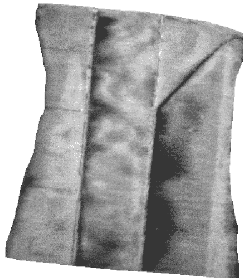

现在我们知道如何使用 NDVI 公式，让我们看看如何对它进行分类。

# 对 NDVI 进行分类

我们现在有一个有效的索引，但是不容易理解，因为它是一个灰度图像。如果我们用直观的方式给图像上色，那么即使是一个孩子也能识别出更健康的植物。在下一节*附加功能*中，我们读入这个灰度索引，并使用七个类别将其从棕色分类为深绿色。分类和图像处理例程，例如直方图和拉伸功能，几乎与我们在[第 6 章](06.html)、 *Python 和遥感*中*创建直方图*部分使用的相同，但这次我们以更具体的方式应用它们。

这个例子的输出将是另一个 GeoTIFF 文件，但这次它将是一个彩色的 RGB 图像。

# 附加功能

我们不需要之前 NDVI 脚本中的任何函数，但是我们需要添加一个函数来创建和拉伸直方图。这两个函数都适用于 NumPy 数组。我们也将在这个脚本中缩短对`gdal_array`到`gd`的引用，因为这是一个很长的名称，我们在整个脚本中都需要它。

让我们看看下面的步骤:

1.  首先，我们导入我们需要的库:

```py
import gdal_array as gd
import operator
from functools import reduce
```

2.  接下来，我们需要创建一个`histogram`函数，我们需要它来进行直方图拉伸:

```py
def histogram(a, bins=list(range(256))):
 """
 Histogram function for multi-dimensional array.
 a = array
 bins = range of numbers to match
 """
 # Flatten, sort, then split our arrays for the histogram.
 fa = a.flat
 n = gd.numpy.searchsorted(gd.numpy.sort(fa), bins)
 n = gd.numpy.concatenate([n, [len(fa)]])
 hist = n[1:]-n[:-1]
 return hist
```

3.  现在，我们创建直方图`stretch`函数:

```py
def stretch(a):
 """
 Performs a histogram stretch on a gdal_array array image.
 """
 hist = histogram(a)
 lut = []
 for b in range(0, len(hist), 256):
 # step size – create equal interval bins.
 step = reduce(operator.add, hist[b:b+256]) / 255
 # create equalization lookup table
 n = 0
 for i in range(256):
 lut.append(n / step)
 n = n + hist[i+b]
 gd.numpy.take(lut, a, out=a)
 return a
```

既然我们有了实用功能，我们就可以处理 NDVI 了。

# 装载 NDVI

接下来，我们将把 NDVI 脚本的输出加载回 NumPy 数组。我们还将输出图像的名称定义为`ndvi_color.tif`，并创建一个零填充的多维数组作为彩色 NDVI 图像的红色、绿色和蓝色带的占位符。以下代码将把 NDVI TIFF 图像加载到一个`numpy`数组中:

```py
# NDVI output from ndvi script
source = "ndvi.tif"

# Target file name for classified
# image image
target = "ndvi_color.tif"

# Load the image into an array
ndvi = gd.LoadFile(source).astype(gd.numpy.uint8)
```

现在我们的图像被加载为一个数组，我们可以拉伸它。

# 准备 NDVI

我们需要对 NDVI 进行直方图拉伸，以确保图像覆盖了赋予最终产品意义的类别范围:

```py
# Peform a histogram stretch so we are able to
# use all of the classes
ndvi = stretch(ndvi)

# Create a blank 3-band image the same size as the ndvi
rgb = gd.numpy.zeros((3, len(ndvi), len(ndvi[0])), gd.numpy.uint8)
```

现在我们已经拉伸了图像，我们可以开始分类过程了。

# 创建类

在这一部分中，我们为我们的 NDVI 类设置了范围，这些范围从 0 到 255 不等。我们将使用七节课。您可以通过在类列表中添加或删除值来更改类的数量。接下来，我们创建一个**查找表**，或者 **LUT** ，以便为每个类分配颜色。颜色的数量必须与类别的数量相匹配。

颜色被定义为 RGB 值。`start`变量定义了第一个类的开始。在这种情况下，`0`是一个 nodata 值，这是我们在前面的脚本中指定的，所以我们在`1`开始上课。然后，我们遍历类，提取范围，并使用颜色分配将 RGB 值添加到占位符数组中。最后，我们将彩色图像保存为 GeoTIFF 文件:

```py
# Class list with ndvi upper range values.
# Note the lower and upper values are listed on the ends
classes = [58, 73, 110, 147, 184, 220, 255]

# Color look-up table (lut)
# The lut must match the number of classes
# Specified as R, G, B tuples from dark brown to dark green
lut = [[120, 69, 25], [255, 178, 74], [255, 237, 166], [173, 232, 94],
 [135, 181, 64], [3, 156, 0], [1, 100, 0]]

# Starting value of the first class
start = 1
```

现在我们可以对图像进行分类:

```py
# For each class value range, grab values within range,
# then filter values through the mask.
for i in range(len(classes)):
 mask = gd.numpy.logical_and(start <= ndvi,
 ndvi <= classes[i])
 for j in range(len(lut[i])):
     rgb[j] = gd.numpy.choose(mask, (rgb[j], lut[i][j]))
     start = classes[i]+1
```

最后，我们可以保存我们的分类 GeoTIFF 文件:

```py
# Save a geotiff image of the colorized ndvi.
output=gd.SaveArray(rgb, target, format="GTiff", prototype=source)
output = None
```

这是我们输出的图像:

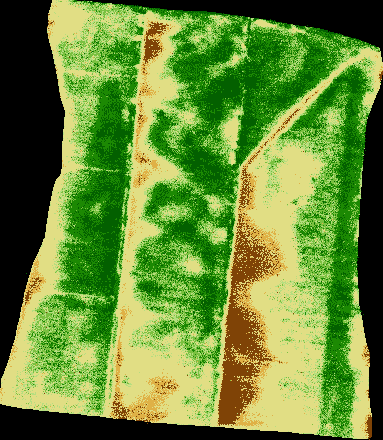

这是我们这个例子的最终产品。农民可以利用这些数据来确定如何以有针对性、更有效和更环保的方式有效灌溉和喷洒化肥和农药等化学品。事实上，这些类甚至可以转化为向量形状文件，然后加载到田间喷雾器上的全球定位系统驱动的计算机中。然后，当喷雾器在田地周围行驶时，或者在某些情况下，甚至在带有喷雾器附件的飞机上飞过田地时，这将自动在正确的位置应用正确数量的化学品。

还要注意，即使我们将数据剪切到字段中，图像仍然是一个正方形。黑色区域是已转换为黑色的 nodata 值。在显示软件中，您可以使 nodata 颜色透明，而不影响图像的其余部分。

虽然我们创建了一个非常特殊的产品类型，一个分类的 NDVI，这个脚本的框架可以被改变，以实现许多遥感分析算法。NDVIs 有不同的类型，但通过相对较小的更改，您可以将此脚本变成一个工具，用于查找海洋中的有害藻类水华，或者森林中间的烟雾，表明发生了森林火灾。

This book attempts to limit the use of GDAL as much as possible in order to focus on what can be accomplished with pure Python and tools that can easily be installed from PyPI. However, it is helpful to remember that there is a wealth of information on using GDAL and its associated utilities to carry out similar tasks. For another tutorial on clipping a raster with GDAL via its command-line utilities, see [https://joeyklee.github.io/broc-cli-geo/guide/XX_raster_cropping_and_clipping.html](https://joeyklee.github.io/broc-cli-geo/guide/XX_raster_cropping_and_clipping.html).

现在我们已经研究了土地，让我们研究水，以便创建洪水淹没模型。

# 创建洪水淹没模型

在下一个例子中，我们将开始进入水文学的世界。洪水是最常见和最具破坏性的自然灾害之一，影响到全球几乎每一个人口。地理空间模型是评估洪水影响并在洪水发生前减轻其影响的有力工具。我们经常在新闻上听到一条河流正在达到洪水阶段，但是如果我们不能理解其影响，这些信息就没有意义。

水文洪水模型的开发成本很高，而且可能非常复杂。这些模型对工程师建造防洪系统至关重要。然而，第一反应者和潜在的洪水受害者只对即将到来的洪水的影响感兴趣。

我们可以使用一个非常简单易懂的工具**洪水淹没模型**开始了解一个地区的洪水影响。这个模型从一个点开始，在一个特定的洪水阶段，用一个洪水盆地所能容纳的最大水量淹没一个区域。通常，这种分析是最坏的情况。成百上千的其他因素被用来计算有多少水将从河流顶部的洪水阶段进入流域。但是我们仍然可以从这个简单的一阶模型中学到很多。

As mentioned in the *Elevation data* section in [Chapter 1](01.html), *Learning about Geospatial Analysis with Python*, the **Shuttle Radar Topography Mission** (**SRTM**) dataset provides a nearly-global DEM that you can use for these types of models. More on SRTM data can be found here: [http://www2.jpl.nasa.gov/srtm/](http://www2.jpl.nasa.gov/srtm/).

你可以从 http://git.io/v3fSg 下载 EPSG 的 ASCII 网格数据:4326 和一个包含该点的形状文件作为`.zip`文件。shapefile 仅供参考，在这个模型中没有任何作用。下图是一个**数字高程模型** ( **DEM** )源点显示为德克萨斯州休斯顿附近的一颗黄色恒星。在现实世界的分析中，这个点可能是一个测流计，在这里你可以得到河流水位的数据:

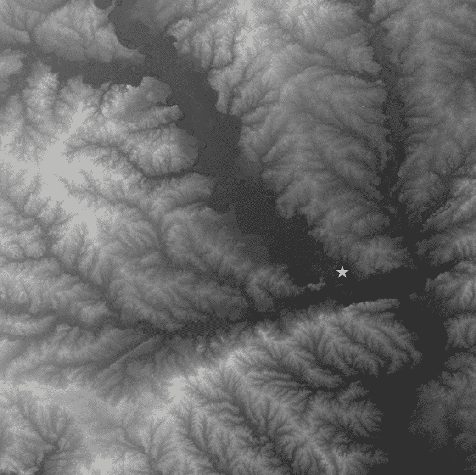

我们在这个例子中介绍的算法叫做**洪水填充算法**。该算法在计算机科学领域众所周知，在经典计算机游戏**扫雷**中使用，当用户点击方块时清除棋盘上的空方块。也是众所周知的**油漆桶工具**在 **Adobe Photoshop** 等图形程序中使用的方法，用于用不同的颜色填充同一颜色相邻像素的区域。

有很多方法可以实现这个算法。最古老和最常见的方法之一是递归地遍历图像的每个像素。递归的问题在于，你最终会不止一次地处理像素，并产生不必要的工作量。递归泛洪填充的资源使用很容易使程序崩溃，即使是中等大小的图像。

该脚本使用基于队列的四路泛洪填充，可以多次访问一个单元格，但确保我们只处理一次单元格。通过使用 Python 的内置集合类型，队列只包含唯一的、未处理的单元，该集合类型只保存唯一的值。我们使用两组:**填充**，包含我们需要填充的单元格，**填充**，包含处理后的单元格。

本示例执行以下步骤:

1.  从 ASCII 数字高程模型中提取标题信息。
2.  打开数字高程模型作为`numpy`数组。
3.  将我们的起点定义为数组中的行和列。
4.  声明洪水高程值。
5.  将地形过滤到所需的高程值及以下。
6.  处理过滤后的数组。
7.  创建一个 1，0，0 数组(即二进制数组)，泛洪像素为 1。
8.  将洪水淹没数组保存为 ASCII 网格。

This example can take a minute or two to run on a slower machine; we'll use the `print` statements throughout the script as a simple way to track progress. Once again we'll break this script up with explanations, for clarity.

现在我们有了数据，我们可以开始我们的洪水填充功能。

# 注水功能

我们在这个例子中使用了 ASCII 网格，这意味着这个模型的引擎完全在 NumPy 中。我们首先定义`floodFill()`函数，这是这个模型的核心和灵魂。这篇维基百科关于洪水填充算法的文章提供了不同方法的极好概述:[http://en.wikipedia.org/wiki/Flood_fill](http://en.wikipedia.org/wiki/Flood_fill)。

泛洪填充算法从给定的单元格开始，并开始检查相邻单元格的相似性。相似性因素可能是颜色，或者在我们的例子中是海拔。如果相邻像元与当前像元的高程相同或更低，则该像元将被标记为检查其相邻像元，直到检查完整个网格。NumPy 并不是为了以这种方式在数组上爬行而设计的，但是它在处理多维数组时仍然是有效的。我们穿过每个牢房，检查它的北面、南面、东面和西面的邻居。那些可以被淹没的单元中的任何一个都被添加到填充集合中，并且它们的邻居被添加到填充集合中以被算法检查。

如前所述，如果您试图将相同的值添加到集合中两次，它只会忽略重复的条目并维护一个唯一的列表。通过在数组中使用集合，我们可以有效地只检查一次单元格，因为填充集合包含唯一的单元格。下面的代码实现了我们的`floodFill`功能:

1.  首先，我们导入我们的库:

```py
import numpy as np
from linecache import getline
```

2.  接下来，我们创建我们的`floodFill`函数:

```py
def floodFill(c, r, mask):
 """
 Crawls a mask array containing
 only 1 and 0 values from the
 starting point (c=column,
 r=row - a.k.a. x, y) and returns
 an array with all 1 values
 connected to the starting cell.
 This algorithm performs a 4-way
 check non-recursively.
 """
```

3.  接下来，我们创建集合来跟踪已经覆盖的单元格:

```py
 # cells already filled
 filled = set()
 # cells to fill
 fill = set()
 fill.add((c, r))
 width = mask.shape[1]-1
 height = mask.shape[0]-1
```

4.  然后我们创建我们的淹没数组:

```py
 # Our output inundation array
 flood = np.zeros_like(mask, dtype=np.int8)
```

5.  现在我们可以循环通过细胞并淹没它们，或者不这样做:

```py
 # Loop through and modify the cells which
 # need to be checked.
 while fill:
   # Grab a cell
   x, y = fill.pop()
```

6.  如果土地高于洪水，跳过它:

```py
   if y == height or x == width or x < 0 or y < 0:
    # Don't fill
    continue
```

7.  如果地面高程等于或小于洪水，填写:

```py
   if mask[y][x] == 1:
    # Do fill
    flood[y][x] = 1
   filled.add((x, y))
```

8.  现在，我们检查周围的相邻细胞，看看它们是否需要填充，当细胞用完时，我们返回淹没的矩阵:

```py
   # Check neighbors for 1 values
   west = (x-1, y)
   east = (x+1, y)
   north = (x, y-1)
   south = (x, y+1)
   if west not in filled:
     fill.add(west)
   if east not in filled:
     fill.add(east)
   if north not in filled:
     fill.add(north)
   if south not in filled:
     fill.add(south)
 return flood
```

现在我们已经设置了`floodFill`功能，我们可以创建一个洪水。

# 洪水淹没预测

在脚本的剩余部分，我们从一个 ASCII 网格加载我们的地形数据，定义我们的输出网格文件名，并对地形数据执行算法。洪水填充算法的种子是任意点，如低海拔区域内的`sx`和`sy`。在现实世界的应用中，这些点可能是一个已知的位置，比如一个测流计或者大坝的裂缝。在最后一步，我们保存输出网格。

需要执行以下步骤:

1.  首先，我们设置我们的`source`和`target`数据名称:

```py
source = "terrain.asc"
target = "flood.asc"
```

2.  接下来，我们打开源代码:

```py
print("Opening image...")
img = np.loadtxt(source, skiprows=6)
print("Image opened")
```

3.  我们将为`70`米以下的所有东西创建一个掩码数组:

```py
# Mask elevations lower than 70 meters.
wet = np.where(img < 70, 1, 0)
print("Image masked")
```

4.  现在，我们将从头部解析地理空间信息:

```py
# Parse the header using a loop and
# the built-in linecache module
hdr = [getline(source, i) for i in range(1, 7)]
values = [float(h.split(" ")[-1].strip()) for h in hdr]
cols, rows, lx, ly, cell, nd = values
xres = cell
yres = cell * -1
```

5.  现在，我们将建立一个位于河床上的起点:

```py
# Starting point for the
# flood inundation in pixel coordinates
sx = 2582
sy = 2057
```

6.  现在，我们触发我们的`floodFill`功能:

```py
print("Beginning flood fill")
fld = floodFill(sx, sy, wet)
print("Finished flood fill")

header = ""
for i in range(6):
 header += hdr[i]
```

7.  最后，我们可以保存洪水淹没模型输出:

```py
print("Saving grid")
# Open the output file, add the hdr, save the array
with open(target, "wb") as f:
 f.write(bytes(header, 'UTF-8'))
 np.savetxt(f, fld, fmt="%1i")
print("Done!")
```

下图显示了分类版数字高程模型的洪水淹没输出，其中较低的高程值为棕色，中等范围的值为绿色，较高的值为灰色和白色:

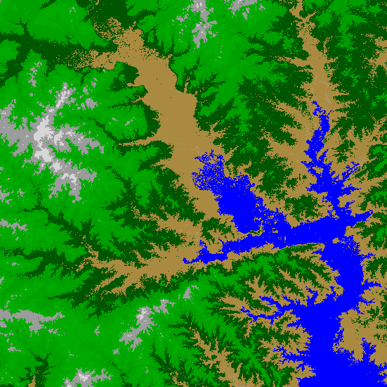

洪水栅格包括所有小于 70 米的区域，颜色为蓝色。此图像是用 QGIS 创建的，但它可以在 ArcGIS 中显示为 EPSG:4326。您也可以使用 GDAL 将洪水栅格保存为 8 位 TIFF 文件或 JPEG 文件，就像 NDVI 示例一样，以便在标准图形程序中查看它。

下面截图中的图像几乎完全相同，除了被过滤的蒙版，它显示为黄色。这是通过为名为`wet`的数组而不是`fld`生成一个文件来完成的，以显示不连续的区域，这些区域不包括在洪水中。这些区域没有连接到源点，因此在洪水期间不太可能到达:

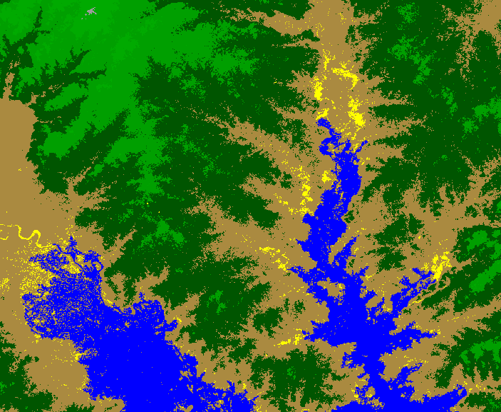

通过更改高程值，可以创建额外的洪水淹没栅格。我们从海拔 70 米开始。如果我们将该值增加到 90，我们可以扩大洪水。以下截图显示了 70 米和 90 米处的洪水事件:

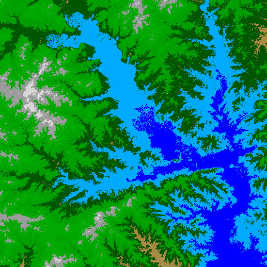

90 米的洪水是浅蓝色的多边形。你可以采取更大或更小的步骤，并以不同的层显示不同的影响。

这个模型是一个优秀的和有用的可视化。但是，您可以通过在洪水遮罩上使用 GDAL 的`polygonize()`方法来进一步进行分析，就像我们在[第 6 章](06.html)、 *Python 和遥感*中的*从图像中提取特征*部分中对岛屿所做的那样。这个操作会给你一个向量淹没多边形。然后，您可以使用我们在[第 5 章](05.html)、 *Python 和地理信息系统*中*执行选择*部分讨论的原则，使用多边形选择建筑物以确定人口影响。您也可以将洪水多边形与[第 5 章](05.html)、 *Python 和地理信息系统*的*点密度计算*部分中的点密度示例结合起来，以评估洪水对人口的潜在影响。可能性是无穷的。

# 创建彩色山体阴影

在本例中，我们将结合以前的技术，将来自[第 7 章](07.html)、 *Python 和*的地形山体阴影与我们在 LIDAR 上使用的颜色分类相结合。对于这个例子，我们将需要命名为`dem.asc`和`relief.asc`的 ASCII 网格 DEMs，我们在上一章中使用了它们。

我们将创建一个彩色的数字高程模型和一个山体阴影，然后使用 PIL 将它们混合在一起，以增强高程可视化。代码注释将指导您完成示例，因为您已经熟悉其中的许多步骤:

1.  首先，我们导入我们需要的库:

```py
import gdal_array as gd
try:
 import Image
except ImportError:
 from PIL import Image
```

对于下一部分，您将需要以下两个文件:[https://github . com/GeospatialPython/Learn/raw/master/relief . zip](https://github.com/GeospatialPython/Learn/raw/master/relief.zip)和[https://github . com/GeospatialPython/Learn/raw/master/DEM . zip](https://github.com/GeospatialPython/Learn/raw/master/dem.zip)。

2.  然后，我们将为输入和输出设置变量:

```py
relief = "relief.asc"
dem = "dem.asc"
target = "hillshade.tif"
```

3.  接下来，我们将加载我们的`relief`图像:

```py
# Load the relief as the background image
bg = gd.numpy.loadtxt(relief, skiprows=6)
```

4.  然后，我们将加载数字高程模型图像，这样我们将获得高程数据:

```py
# Load the DEM into a numpy array as the foreground image
fg = gd.numpy.loadtxt(dem, skiprows=6)[:-2, :-2]
```

5.  现在，我们将为我们的彩色化创建一个新图像，其中高程断点在 LUT 中形成类和相应的颜色:

```py
# Create a blank 3-band image to colorize the DEM
rgb = gd.numpy.zeros((3, len(fg), len(fg[0])), gd.numpy.uint8)

# Class list with DEM upper elevation range values.
classes = [356, 649, 942, 1235, 1528,
 1821, 2114, 2300, 2700]

# Color look-up table (lut)
# The lut must match the number of classes.
# Specified as R, G, B tuples
lut = [[63, 159, 152], [96, 235, 155], [100, 246, 174],
 [248, 251, 155], [246, 190, 39], [242, 155, 39],
 [165, 84, 26], [236, 119, 83], [203, 203, 203]]

# Starting elevation value of the first class
start = 1
```

6.  我们现在可以执行我们的颜色分类:

```py
# Process all classes.
for i in range(len(classes)):
 mask = gd.numpy.logical_and(start <= fg,
 fg <= classes[i])
 for j in range(len(lut[i])):
 rgb[j] = gd.numpy.choose(mask, (rgb[j], lut[i][j]))
 start = classes[i]+1
```

7.  然后，我们可以将我们的着色浮雕数组转换为图像，以及我们的彩色数字高程模型:

```py
# Convert the shaded relief to a PIL image
im1 = Image.fromarray(bg).convert('RGB')

# Convert the colorized DEM to a PIL image.
# We must transpose it from the Numpy row, col order
# to the PIL col, row order (width, height).
im2 = Image.fromarray(rgb.transpose(1, 2, 0)).convert('RGB')
```

8.  现在，我们将混合两个图像以获得最终效果，并将其保存到图像文件中:

```py
# Blend the two images with a 40% alpha
hillshade = Image.blend(im1, im2, .4)

# Save the hillshade
hillshade.save(target)
```

下图显示了输出，这为地理信息系统地图提供了很好的背景:

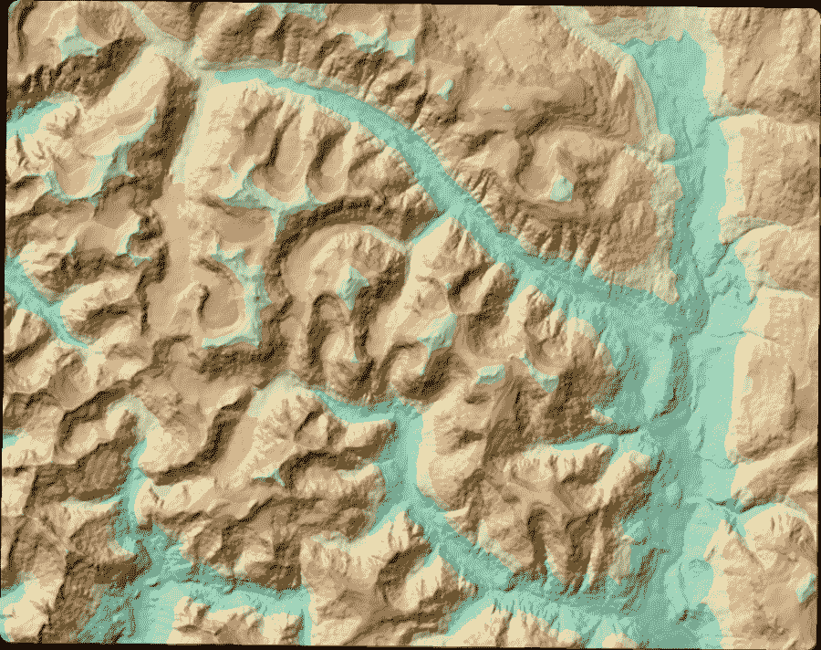

既然我们可以模拟地形，让我们学习如何在上面导航。

# 执行最低成本路径分析

计算行车方向是世界上最常用的地理空间功能。通常，这些算法计算点 *A* 和 *B* 之间的最短路径，或者它们可以考虑道路的速度限制，甚至当前的交通状况，以便通过行驶时间来选择路线。

但是如果你的工作是修建一条新路呢？或者，如果你负责决定在偏远地区的哪里铺设输电线路或输水线路呢？在基于地形的环境中，最短的路径可能会穿过一座困难的山，或者穿过一个湖。在这种情况下，我们需要考虑障碍，并尽可能避免它们。然而，如果避开一个小障碍让我们走得太远，实施这条路线的成本可能比仅仅翻越一座山还要高。

这种类型的高级分析称为**最小成本路径分析**。我们在一个区域内寻找一条路线，这条路线是距离与遵循这条路线的成本之间的最佳折衷。我们用于此过程的算法称为 **A 星或 A*** 算法。最古老的路由方法被称为**迪克斯特拉算法**，它计算网络中的最短路径，例如道路网络。A*方法也可以做到这一点，但它也更适合遍历网格状的数字高程模型。

You can find out more about these algorithms on the following web pages:

*   迪克斯特拉算法:[http://en.wikipedia.org/wiki/Dijkstra's_algorithm](http://en.wikipedia.org/wiki/Dijkstra's_algorithm)。
*   A*算法:[http://en.wikipedia.org/wiki/A-star_algorithm](http://en.wikipedia.org/wiki/A-star_algorithm)。

这个例子是本章中最复杂的。为了更好地理解它，我们有一个简单版本的程序，它是基于文本的，在一个 5×5 的网格上运行，随机生成值。实际上，您可以看到这个程序是如何遵循算法的，然后在具有数千个值的高程网格上进行尝试。

该程序执行以下步骤:

1.  创建一个简单的网格，其中随机生成的伪高程值介于 1 和 16 之间。
2.  在网格的左下角定义一个开始位置。
3.  将端点定义为网格的右上角。

4.  创建一个成本网格，其中包含每个单元的高程，以及单元到终点的距离。
5.  从一开始就检查每个相邻的小区，选择成本最低的一个。
6.  使用选定的单元格重复评估，直到我们到达最后。
7.  返回所选单元格集作为最小成本路径。
8.  设置测试网格。

您只需从命令行运行该程序并查看其输出。该脚本的第一部分将我们的人工地形网格设置为随机生成的 NumPy 数组，名义高程值在 1 到 16 之间。我们还创建了一个距离网格，用于计算每个像元到目标像元的距离。该值是每个单元的成本。

让我们看看以下步骤:

1.  首先，我们将导入`numpy`并设置网格的大小:

```py
import numpy as np

# Width and height
# of grids
w = 5
h = 5
```

2.  接下来，我们设置开始位置单元格和结束位置:

```py
# Start location:
# Lower left of grid
start = (h-1, 0)

# End location:
# Top right of grid
dx = w-1
dy = 0
```

3.  现在，我们可以根据宽度和高度创建一个零网格:

```py
# Blank grid
blank = np.zeros((w, h))
```

4.  接下来，我们将设置距离网格，以创建阻抗值:

```py
# Distance grid
dist = np.zeros(blank.shape, dtype=np.int8)

# Calculate distance for all cells
for y, x in np.ndindex(blank.shape):
 dist[y][x] = abs((dx-x)+(dy-y))
```

5.  现在，我们将打印出成本网格中每个单元格的成本值:

```py
# "Terrain" is a random value between 1-16.
# Add to the distance grid to calculate
# The cost of moving to a cell
cost = np.random.randint(1, 16, (w, h)) + dist

print("COST GRID (Value + Distance)\n{}\n".format(cost))
```

现在我们有一个模拟地形网格可以使用，我们可以测试一个路由算法。

# 简单的 A*算法

这里实现的 A*搜索算法以类似于上一个示例中的洪水填充算法的方式爬行网格。再一次，我们使用集合来避免使用递归，并避免单元检查的重复。但是这一次，我们没有检查海拔，而是检查通过有问题的小区的路由的距离成本。如果这一举动增加了到达终点的成本，那么我们会选择成本更低的方案。

需要执行以下步骤，如下所示:

1.  首先，我们将通过创建跟踪路径进度的集合来启动我们的 A*函数:

```py
# Our A* search algorithm
def astar(start, end, h, g):
    closed_set = set()
    open_set = set()
    path = set()
```

2.  接下来，我们将起始单元格添加到打开的单元格列表中，以便处理并开始循环遍历该集合:

```py
    open_set.add(start)
    while open_set:
        cur = open_set.pop()
        if cur == end:
            return path
        closed_set.add(cur)
        path.add(cur)
        options = []
        y1 = cur[0]
        x1 = cur[1]
```

3.  我们检查周围的单元格作为前进的选项:

```py
        if y1 > 0:
            options.append((y1-1, x1))
        if y1 < h.shape[0]-1:
            options.append((y1+1, x1))
        if x1 > 0:
            options.append((y1, x1-1))
        if x1 < h.shape[1]-1:
            options.append((y1, x1+1))
        if end in options:
            return path
        best = options[0]
        closed_set.add(options[0])
```

4.  然后，我们检查每个选项，找出最佳选项，并将其附加到路径中，直到到达终点:

```py
        for i in range(1, len(options)):
            option = options[i]
            if option in closed_set:
                continue
            elif h[option] <= h[best]:
                best = option
                closed_set.add(option)
            elif g[option] < g[best]:
                best = option
                closed_set.add(option)
            else:
                closed_set.add(option)
        print(best, ", ", h[best], ", ", g[best])
        open_set.add(best)
    return []
```

现在我们已经建立了算法，我们可以通过创建一个路径来测试它。

# 生成测试路径

在本节中，我们将在测试网格上生成一个路径。我们将使用起点、终点、成本网格和距离网格来调用我们的 A*函数:

```py
# Find the path
path = astar(start, (dy, dx), cost, dist)
print()
```

现在，我们将把我们的路径放在它自己的网格上并打印出来:

```py
# Create and populate the path grid
path_grid = np.zeros(cost.shape, dtype=np.uint8)
for y, x in path:
 path_grid[y][x] = 1
path_grid[dy][dx] = 1

print("PATH GRID: 1=path")
print(path_grid)
```

接下来，我们将查看这个测试的输出。

# 查看测试输出

运行该程序时，您将生成一个类似于以下内容的随机编号网格:

```py
COST GRID (Value + Distance)
[[13 10 5 15 9]
 [15 13 16 5 16]
 [17 8 9 9 17]
 [ 4 1 11 6 12]
 [ 2 7 7 11 8]]

(Y,X), HEURISTIC, DISTANCE
(3, 0) , 4 , 1
(3, 1) , 1 , 0
(2, 1) , 8 , 1
(2, 2) , 9 , 0
(2, 3) , 9 , 1
(1, 3) , 5 , 0
(0, 3) , 15 , 1

PATH GRID: 1=path
[[0 0 0 1 1]
 [0 0 0 1 0]
 [0 1 1 1 0]
 [1 1 0 0 0]
 [1 0 0 0 0]]
```

网格足够小，以便您可以轻松地手动跟踪算法的步骤。该实现使用**曼哈顿距离**，这意味着该距离不使用对角线，仅使用左、右、上、下测量值。为了保持简单，搜索也不会沿对角线移动。

# 现实世界的例子

现在我们已经对 A*算法有了基本的了解，让我们来看一个更复杂的例子。对于地形示例，我们将使用位于加拿大不列颠哥伦比亚省温哥华附近的相同 DEM，我们在*创建阴影地形*部分的[第 7 章](07.html)、 *Python 和高程数据*中使用了该 DEM。该网格的空间参考是 EPSG:26910 NAD 83/UTM 10N 区。您可以从[http://git.io/v3fpL](http://git.io/v3fpL)下载形状文件的数字高程模型、地形起伏以及起点和终点作为压缩包。

我们将实际使用阴影浮雕进行可视化。我们在本练习中的目标是以尽可能低的成本从起点到终点:

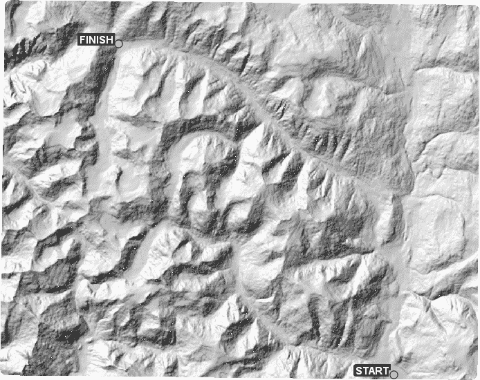

单看地形，有两条路径走低海拔路线，方向没有太大变化。下面的截图说明了这两条路线:

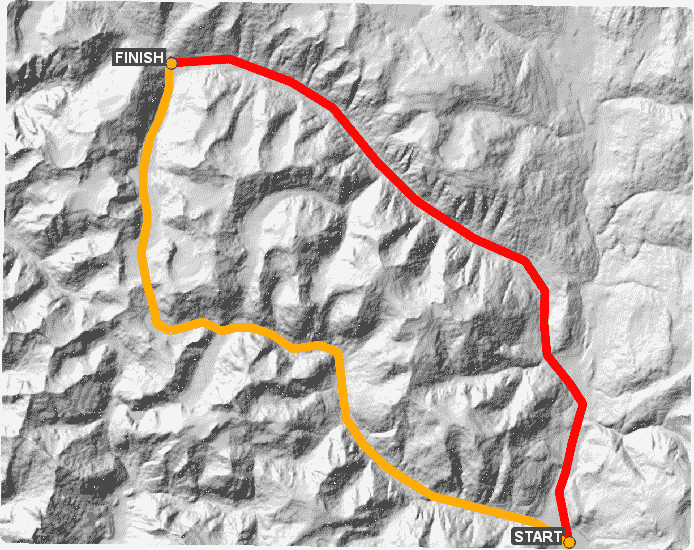

所以，我们期望当我们使用 A*算法时，它会很接近。请记住，该算法只查看紧邻区域，因此它不能像我们一样查看整个图像，也不能根据前面已知的障碍物在路线的早期进行调整。

我们将从我们的简单示例中扩展这个实现，并使用欧几里德距离，或乌鸦飞翔时的*测量，我们还将允许搜索向八个方向而不是四个方向看。我们将优先考虑地形作为主要决策点。为了确保我们朝着目标前进，并且不会偏离轨道太远，我们还会把从终点到起点的距离作为较低的优先级。除了这些区别之外，步骤与简单的示例相同。输出将是一个栅格，路径值设置为 1，其他值设置为零。*

 *既然理解了问题，那就来解决吧！

# 正在加载网格

在这一节和接下来的几节中，我们将创建可以在地形上创建路线的脚本。剧本一开始很简单。我们将网格从 ASCII 网格加载到 NumPy 数组中。我们命名输出路径网格，然后定义开始单元格和结束单元格:

1.  首先，我们导入我们的库:

```py
import numpy as np
import math
from linecache import getline
import pickle
```

2.  接下来，我们将定义输入和输出数据源:

```py
# Our terrain data
source = "dem.asc"

# Output file name for the path raster
target = "path.asc"
```

3.  然后，我们可以跳过标题加载网格:

```py
print("Opening %s..." % source)
cost = np.loadtxt(source, skiprows=6)
print("Opened %s." % source)
```

4.  接下来，我们将解析地理空间和网格大小信息的标题:

```py
# Parse the header
hdr = [getline(source, i) for i in range(1, 7)]
values = [float(ln.split(" ")[-1].strip()) for ln in hdr]
cols, rows, lx, ly, cell, nd = values
```

5.  最后，我们将定义我们的开始和结束位置:

```py
# Starting column, row
sx = 1006
sy = 954

# Ending column, row
dx = 303
dy = 109
```

现在我们的网格已经加载，我们可以设置我们需要的功能。

# 定义助手函数

我们需要三个功能来在地形上走路线。一个是 A*算法，另外两个辅助算法选择下一步。我们将简要讨论这些助手函数。首先，我们有一个简单的欧几里德距离函数`e_dist`，它返回两点之间的直线距离作为地图单位。接下来，我们有一个名为`weighted_score`的重要函数，它根据邻居和当前小区之间的海拔变化以及到目的地的距离，返回相邻小区的分数。

这个功能比单独的距离或高度更好，因为它减少了两个单元之间存在联系的机会，从而更容易避免回溯。这个评分公式大致基于一个名为**尼森评分**的概念，该概念通常用于这些类型的算法中，并在本章前面提到的维基百科文章中引用。这个函数的伟大之处在于，它可以用任何你想要的值给相邻的单元格打分。您还可以使用实时提要来查看相邻单元格中的当前天气，并避开有雨或雪的单元格。

下面的代码将创建我们穿越地形所需的距离函数和权重函数:

1.  首先，我们将创建一个欧几里德距离函数，它将给出点之间的距离:

```py
def e_dist(p1, p2):
 """
 Takes two points and returns
 the Euclidian distance
 """
 x1, y1 = p1
 x2, y2 = p2
 distance = math.sqrt((x1-x2)**2+(y1-y2)**2)
 return int(distance)
```

2.  现在，我们将创建权重函数，以便为每个节点的移动适宜性评分:

```py
def weighted_score(cur, node, h, start, end):
 """
 Provides a weighted score by comparing the
 current node with a neighboring node. Loosely
 based on the Nisson Score concept: f=g+h
 In this case, the "h" value, or "heuristic",
 is the elevation value of each node.
 """
```

3.  我们从`0`的`score`开始，检查节点距离终点和起点的距离:

```py
 score = 0
 # current node elevation
 cur_h = h[cur]
 # current node distance from end
 cur_g = e_dist(cur, end)
 # current node distance from
 cur_d = e_dist(cur, start)
```

4.  接下来，我们检查相邻节点，并决定移动到哪里:

```py
 # neighbor node elevation
 node_h = h[node]
 # neighbor node distance from end
 node_g = e_dist(node, end)
 # neighbor node distance from start
 node_d = e_dist(node, start)
 # Compare values with the highest
 # weight given to terrain followed
 # by progress towards the goal.
 if node_h < cur_h:
 score += cur_h-node_h
 if node_g < cur_g:
 score += 10
 if node_d > cur_d:
 score += 10
 return score
```

现在我们的助手函数已经完成，我们可以构建 A*函数了。

# 真实世界的 A*算法

这个算法比我们前面例子中的简单版本更复杂。我们使用集合来避免冗余。它还实现了我们更先进的评分算法，并在进行额外计算之前进行检查，以确保我们没有到达路径的末端。与我们的上一个示例不同，这个更高级的版本还检查八个方向的单元格，因此路径可以对角移动。这个函数的末尾有一个`print`语句被注释掉了。您可以取消对它的注释，以便观察搜索在网格中的爬行。下面的代码将实现我们将在本节剩余部分使用的 A*算法:

1.  首先，我们通过接受一个起点、一个终点和一个分数来打开函数:

```py
def astar(start, end, h):
 """
 A-Star (or A*) search algorithm.
 Moves through nodes in a network
 (or grid), scores each node's
 neighbors, and goes to the node
 with the best score until it finds
 the end. A* is an evolved Dijkstra
 algorithm.
 """
```

2.  现在，我们设置了跟踪进度的设置:

```py
 # Closed set of nodes to avoid
 closed_set = set()
 # Open set of nodes to evaluate
 open_set = set()
 # Output set of path nodes
 path = set()
```

3.  接下来，我们从起点开始处理:

```py
 # Add the starting point to
 # to begin processing
 open_set.add(start)
 while open_set:
 # Grab the next node
 cur = open_set.pop()
```

4.  如果我们到达终点，我们返回完整的路径:

```py
 # Return if we're at the end
 if cur == end:
 return path
```

5.  否则，我们将继续通过网格工作并消除各种可能性:

```py
 # Close off this node to future
 # processing
 closed_set.add(cur)
 # The current node is always
 # a path node by definition
 path.add(cur)
```

6.  为了保持移动，我们会在移动时抓取所有需要处理的邻居:

```py
 # List to hold neighboring
 # nodes for processing
 options = []
 # Grab all of the neighbors
 y1 = cur[0]
 x1 = cur[1]
 if y1 > 0:
 options.append((y1-1, x1))
 if y1 < h.shape[0]-1:
 options.append((y1+1, x1))
 if x1 > 0:
 options.append((y1, x1-1))
 if x1 < h.shape[1]-1:
 options.append((y1, x1+1))
 if x1 > 0 and y1 > 0:
 options.append((y1-1, x1-1))
 if y1 < h.shape[0]-1 and x1 < h.shape[1]-1:
 options.append((y1+1, x1+1))
 if y1 < h.shape[0]-1 and x1 > 0:
 options.append((y1+1, x1-1))
 if y1 > 0 and x1 < h.shape[1]-1:
 options.append((y1-1, x1+1))
```

7.  我们检查每个邻居是否是目的地:

```py
 # If the end is a neighbor, return
 if end in options:
 return path
```

8.  我们将第一个选项作为`best`选项，并处理其他选项，边走边升级:

```py
 # Store the best known node
 best = options[0]
 # Begin scoring neighbors
 best_score = weighted_score(cur, best, h, start, end)
 # process the other 7 neighbors
 for i in range(1, len(options)):
 option = options[i]
 # Make sure the node is new
 if option in closed_set:
 continue
 else:
 # Score the option and compare 
 # it to the best known
 option_score = weighted_score(cur, option, 
 h, start, end)
 if option_score > best_score:
 best = option
 best_score = option_score
 else:
 # If the node isn't better seal it off
 closed_set.add(option)
 # Uncomment this print statement to watch
 # the path develop in real time:
 # print(best, e_dist(best, end))
 # Add the best node to the open set
 open_set.add(best)
return []
```

既然我们有了路由算法，我们就可以生成真实世界的路径。

# 生成真实世界的路径

最后，我们将现实世界的路径创建为零网格中的一串 1。然后，可以将该栅格引入到 QGIS 等应用程序中，并在地形网格上进行可视化。在下面的代码中，我们将使用我们的算法和助手函数来生成路径，如下所示:

1.  首先，我们将起点和终点以及地形网格发送给路由功能:

```py
print("Searching for path...")
p = astar((sy, sx), (dy, dx), cost)
print("Path found.")
print("Creating path grid...")
path = np.zeros(cost.shape)
print("Plotting path...")
for y, x in p:
 path[y][x] = 1
path[dy][dx] = 1
print("Path plotted.")
```

2.  一旦我们有了路径，我们就可以把它保存为 ASCII 网格:

```py
print("Saving %s..." % target)
header = ""
for i in range(6):
 header += hdr[i]

# Open the output file, add the hdr, save the array
with open(target, "wb") as f:
 f.write(bytes(header, 'UTF-8'))
 np.savetxt(f, path, fmt="%4i")
```

3.  现在，我们希望保存路径数据，因为从起点到终点，点的顺序是正确的。当我们将它们放入栅格中时，我们会失去这个顺序，因为它都是一个栅格。我们将使用内置的 Python `pickle`模块将列表对象保存到磁盘。我们将在下一节中使用这些数据来创建路线的向量形状文件。因此，我们将路径数据保存为一个腌制的 Python 对象，以后可以重用，而无需运行整个程序:

```py
print("Saving path data...")
with open("path.p", "wb") as pathFile:
 pickle.dump(p, pathFile)
print("Done!")
```

以下是我们搜索的输出路径:

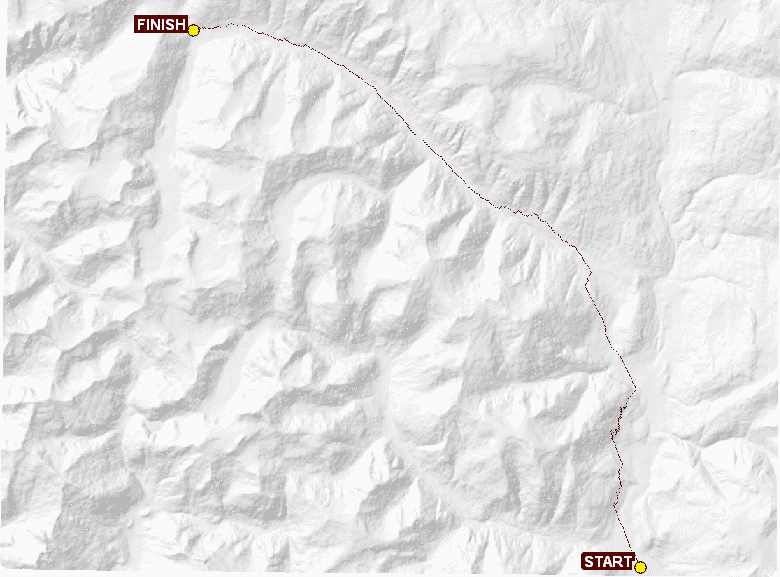

如您所见，A*搜索非常接近我们手动选择的路线之一。在一些情况下，算法选择处理一些地形，而不是试图绕过它。有时，轻微的地形被认为比绕过它的距离花费更少。您可以在路线右上角的放大部分看到这种选择的示例。红线是我们的程序通过地形生成的路线:

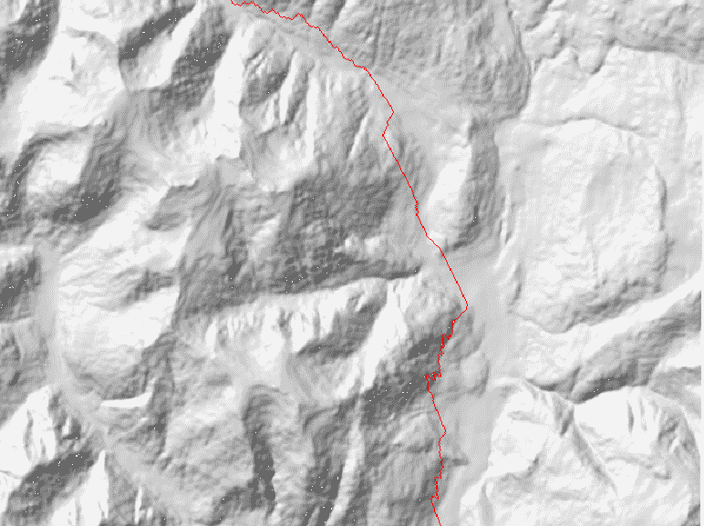

我们只使用了两个值:地形和距离。但是你也可以添加数百个因素，如土壤类型、水体和现有道路。所有这些项目都可以作为阻抗或直接墙。您只需修改示例中的评分函数，以考虑任何附加因素。请记住，您添加的因素越多，就越难追踪 A*实现在选择路线时*在想什么*。

这种分析的一个明显的未来方向是将这条路线创建为一条线的向量版本。该过程将包括将每个单元映射到一个点，然后在将其保存为 shapefile 或 GeoJSON 文件之前，使用最近邻分析对这些点进行正确排序。

# 将路线转换为形状文件

最低成本路径路线的栅格版本对于可视化很有用，但它对于分析来说并不太好，因为它嵌入在栅格中，因此很难与其他数据集相关联，就像我们在本书中多次做的那样。我们的下一个目标是使用我们在创建路径时保存的路径数据来创建一个 shapefile，因为保存的数据是以正确的顺序保存的。下面的代码将把我们的栅格路径转换成一个更容易在地理信息系统中用于分析的形状文件:

1.  首先，我们将导入我们需要的模块，这些模块并不多。我们将使用`pickle`模块来恢复路径`data`对象。然后，我们将使用`linecache`模块从路径栅格中读取地理空间标题信息，以便将路径行和列映射到地球坐标。最后，我们将使用`shapefile`模块导出 shapefile:

```py
import pickle
from linecache import getline
import shapefile
```

2.  接下来，我们将创建一个函数，将行和列转换为 *x* 和 *y* 坐标。该函数接受来自路径栅格文件的元数据头信息，以及列号和行号:

```py
def pix2coord(gt,x,y):
 geotransform = gt
 ox = gt[2]
 oy = gt[3]
 pw = gt[4]
 ph = gt[4]
 cx = ox + pw * x + (pw/2)
 cy = oy + pw * y + (ph/2)
 return cx, cy
```

3.  现在，我们将从腌制对象中恢复`path`对象:

```py
with open("path.p", "rb") as pathFile:
 path = pickle.load(pathFile)
```

4.  然后，我们将解析路径栅格文件中的元数据信息:

```py
hdr = [getline("path.asc", i) for i in range(1, 7)]
gt = [float(ln.split(" ")[-1].strip()) for ln in hdr]
```

5.  接下来，我们需要一个列表对象来保存转换后的坐标:

```py
coords = []
```

6.  现在，我们将每个栅格位置从最低成本路径对象转换为地理空间坐标，并将其存储在我们创建的列表中:

```py
for y,x in path:
 coords.append(pix2coord(gt,x,y))
```

7.  最后，只需几行，我们就可以写出一个线条形状文件:

```py
with shapefile.Writer("path", shapeType=shapefile.POLYLINE) as w:
 w.field("NAME")
 w.record("LeastCostPath")
 w.line([coords])
```

干得好！您已经创建了一个程序，该程序可以根据一组规则自动通过障碍物，并将其导出到一个文件中，您可以在地理信息系统中显示和分析该文件！我们只使用了三个规则，但是您可以通过添加其他数据集，例如天气或水体，或者您可以想象的任何其他东西，来添加对程序如何选择路径的附加限制。

既然我们理解了在任意表面上开辟一条路径，我们就来看看通过网络的路由。

# 计算卫星图像云量

卫星图像给我们提供了一个强有力的地球鸟瞰图。它们有多种用途，我们在[第 6 章](06.html)、*Python和遥感*中看到过。然而，它们有一个缺点——云。当卫星绕地球运行并收集图像时，它不可避免地会对云成像。除了阻碍我们对地球的观察，云数据还会通过在无用的云数据上浪费 CPU 周期对遥感算法产生不利影响，或者通过引入不需要的数据值来扭曲结果。

解决方案是创建云遮罩。云遮罩是将云数据隔离在单独栅格中的栅格。然后，您可以在处理图像时使用该栅格作为参考，以避免云数据，或者您甚至可以使用它从原始图像中移除云。

在本节中，我们将使用`rasterio`模块和`rio-l8qa`插件为 Landsat 图像创建一个云遮罩。云遮罩将被创建为单独的图像，仅包含云:

1.  首先，我们需要从[http://bit.ly/landsat8data](http://bit.ly/landsat8data)下载一些样本 Landsat 8 卫星图像数据作为 ZIP 文件。
2.  点击右上角的下载图标，将数据下载为 ZIP 文件，解压到名为`l8`的目录下。
3.  接下来，通过运行`pip`，确保您拥有我们需要的栅格库:

```py
pip install rasterio
pip install rio-l8qa
```

4.  现在，我们将通过首先导入所需的库来创建云遮罩:

```py
import glob
import os
import rasterio
from l8qa.qa import write_cloud_mask
```

5.  接下来，我们需要提供我们卫星图像目录的参考:

```py
# Directory containing landsat data
landsat_dir = "l8"
```

6.  现在，我们需要找到卫星数据的质量保证元数据，它为我们提供了生成云遮罩所需的信息:

```py
src_qa = glob.glob(os.path.join(landsat_dir, '*QA*'))[0]
```

7.  最后，我们使用质量保证文件来创建云遮罩 TIFF 文件:

```py
with rasterio.open(src_qa) as qa_raster:
 profile = qa_raster.profile
 profile.update(nodata=0)
 write_cloud_mask(qa_raster.read(1), profile, 'cloudmask.tif')
```

下面的图像只是来自 Landsat 8 数据集的波段 7(短波红外)图像:

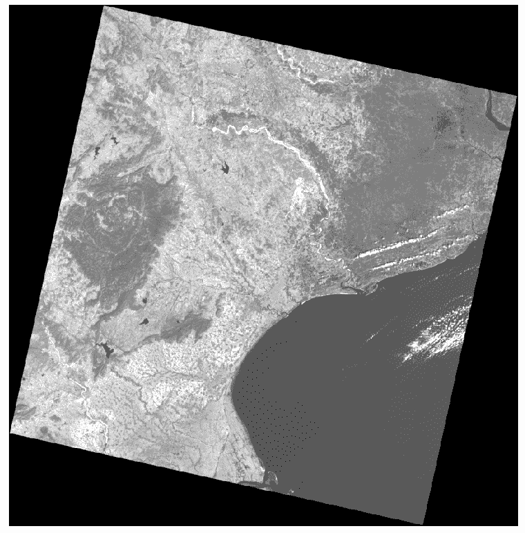

下一个图像是仅包含云和阴影位置的云遮罩图像:

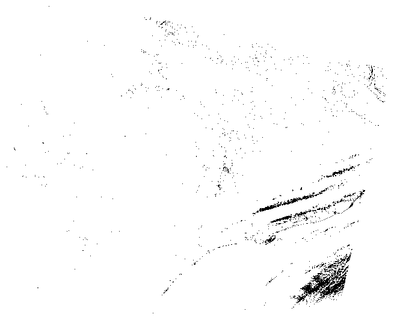

最后，这是图像上的面具，显示云是黑色的:

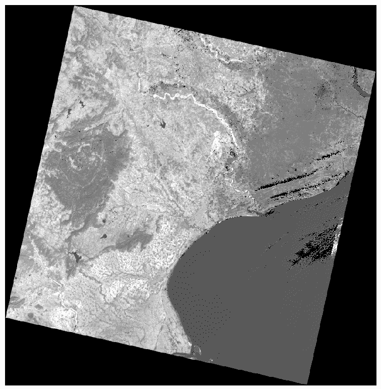

这个例子刷表面，你可以用图像蒙版。另一个`rasterio`模块`rio-cloudmask`允许您从头开始计算云遮罩，而无需使用质量保证数据。但是它需要一些额外的预处理步骤。您可以在这里了解更多信息:[https://github.com/mapbox/rio-cloudmask.](https://github.com/mapbox/rio-cloudmask)

# 沿着街道走

沿着街道走的路线使用一个由线组成的连接网络，这被称为图形。图中的线可以有阻抗值，这阻碍了路由算法将它们包括在路由中。阻抗值的例子通常包括交通量、速度限制甚至距离。布线图的一个关键要求是所有的线(称为边)都必须连接起来。为映射而创建的道路数据集通常具有节点不相交的线。

在这个例子中，我们将根据距离计算通过图表的最短路径。我们将使用起点和终点，它们不是图中的节点，这意味着我们必须首先找到离我们的起点和终点最近的图节点。

为了计算最短路线，我们将使用一个强大的纯 Python 图形库，称为网络。NetworkX 是一个通用的网络图形库，可以创建、操作和分析复杂的网络，包括地理空间网络。如果`pip`没有在你的系统上安装 NetworkX，那么你可以在[http://networkx.readthedocs.org/en/stable/](http://networkx.readthedocs.org/en/stable/)找到不同操作系统的 NetworkX 下载安装说明。

您可以从[http://git.io/vcXFQ](http://git.io/vcXFQ)下载位于美国墨西哥湾沿岸的公路网以及起点和终点的 ZIP 文件。然后，您可以按照以下步骤操作:

1.  首先，我们需要导入将要使用的库。除了网络之外，我们还将使用 PyShp 库来读写形状文件:

```py
import networkx as nx
import math
from itertools import tee
import shapefile
import os
```

2.  接下来，我们将当前目录定义为我们将要创建的 route shapefile 的输出目录:

```py
savedir = "."
```

3.  现在，我们需要一个能够计算点与点之间距离的函数，以便填充图形的阻抗值，并找到距离路线起点和终点最近的节点:

```py
def haversine(n0, n1):
 x1, y1 = n0
 x2, y2 = n1
 x_dist = math.radians(x1 - x2)
 y_dist = math.radians(y1 - y2)
 y1_rad = math.radians(y1)
 y2_rad = math.radians(y2)
 a = math.sin(y_dist/2)**2 + math.sin(x_dist/2)**2 \
 * math.cos(y1_rad) * math.cos(y2_rad)
 c = 2 * math.asin(math.sqrt(a))
 distance = c * 6371
 return distance
```

4.  然后，我们将创建另一个函数，该函数从列表中返回成对的点，以给出我们将用来构建图形边的线段:

```py
def pairwise(iterable):
 """Return an iterable in tuples of two
 s -> (s0,s1), (s1,s2), (s2, s3), ..."""
 a, b = tee(iterable)
 next(b, None)
 return zip(a, b)
```

5.  现在，我们将定义我们的道路网络形状文件。该道路网是美国地质调查局**的美国州际公路文件 shapefile】美国地质勘探局**)的子集，该文件已经过编辑，以确保所有道路都已连接:

```py
shp = "road_network.shp"
```

6.  接下来，我们将使用 NetworkX 创建一个图形，并将 shapefile 段添加为图形边:

```py
G = nx.DiGraph()
r = shapefile.Reader(shp)
for s in r.shapes():
 for p1, p2 in pairwise(s.points):
 G.add_edge(tuple(p1), tuple(p2))
```

7.  然后，我们可以提取连接的组件作为子图。然而，在这种情况下，我们已经确保了整个图是连通的:

```py
sg = list(nx.connected_component_subgraphs(G.to_undirected()))[0]
```

8.  接下来，我们可以阅读我们想要导航的`start`和`end`点:

```py
r = shapefile.Reader("start_end")
start = r.shape(0).points[0]
end = r.shape(1).points[0]
```

9.  现在，我们循环通过图表，并使用我们的`haversine`公式为每条边分配距离值:

```py
for n0, n1 in sg.edges_iter():
 dist = haversine(n0, n1)
 sg.edge[n0][n1]["dist"] = dist
```

10.  接下来，我们必须在图中找到离我们的起点和终点最近的节点，以便通过循环遍历所有节点来开始和结束我们的路线，并测量到我们的终点的距离，直到我们找到最短的距离:

```py
nn_start = None
nn_end = None
start_delta = float("inf")
end_delta = float("inf")
for n in sg.nodes():
 s_dist = haversine(start, n)
 e_dist = haversine(end, n)
 if s_dist < start_delta:
 nn_start = n
 start_delta = s_dist
 if e_dist < end_delta:
 nn_end = n 
 end_delta = e_dist
```

11.  现在，我们准备计算通过我们的道路网的最短距离:

```py
path = nx.shortest_path(sg, source=nn_start, target=nn_end, weight="dist")
```

12.  最后，我们将结果添加到 shapefile 并保存我们的路线:

```py
w = shapefile.Writer(shapefile.POLYLINE)
w.field("NAME", "C", 40)
w.line(parts=[[list(p) for p in path]])
w.record("route")
w.save(os.path.join(savedir, "route"))
```

下面的截图显示了浅灰色的道路网，起点和终点，以及黑色的路线。您可以看到，路线穿过道路网络，以便在最短的距离内到达距离终点最近的道路:

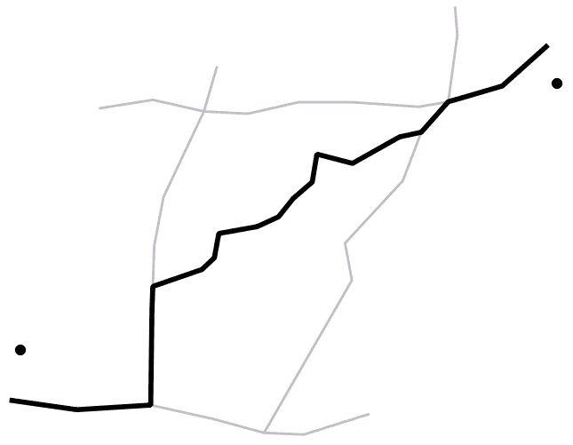

现在我们知道了如何创建各种类型的路线，我们可以看看如何定位您在路线上旅行时可能拍摄的照片。

# 地理定位照片

使用支持全球定位系统的相机拍摄的照片，包括智能手机，以一种称为 **EXIF** 标签的格式将位置信息存储在文件的标题中。这些标签主要基于 TIFF 图像标准使用的相同标题标签。在本例中，我们将使用这些标签创建一个形状文件，其中包含照片的点位置和照片的文件路径作为属性。

我们将在这个例子中使用 PIL，因为它能够提取 EXIF 数据。大多数用智能手机拍摄的照片都是带有地理标签的图像；但是，您可以从[https://git.io/vczR0](http://git.io/vczR0)下载本例中使用的器械包:

1.  首先，我们将导入我们需要的库，包括用于图像元数据的 PIL 和用于形状文件的 PyShp:

```py
import glob
import os
try:
 import Image
 import ImageDraw
except ImportError:
 from PIL import Image
 from PIL.ExifTags import TAGS
import shapefile
```

2.  现在，我们需要三个函数。第一个函数提取 EXIF 数据。第二个函数将**度、分、秒** ( **DMS** )坐标转换为十进制度(EXIF 数据将 GPS 数据存储为 DMS 坐标)。第三个函数提取全球定位系统数据并执行坐标转换:

```py
def exif(img):
 # extract exif data.
 exif_data = {}
 try: 
 i = Image.open(img)
 tags = i._getexif()
 for tag, value in tags.items():
 decoded = TAGS.get(tag, tag)
 exif_data[decoded] = value
 except:
 pass
 return exif_data

def dms2dd(d, m, s, i):
 # convert degrees, min, sec to decimal degrees
 sec = float((m * 60) + s)
 dec = float(sec / 3600)
 deg = float(d + dec)
 if i.upper() == 'W':
 deg = deg * -1
 elif i.upper() == 'S':
 deg = deg * -1
 return float(deg)

def gps(exif):
 # get gps data from exif
 lat = None
 lon = None
 if exif['GPSInfo']: 
 # Lat
 coords = exif['GPSInfo']
 i = coords[1]
 d = coords[2][0][0]
 m = coords[2][1][0]
 s = coords[2][2][0]
 lat = dms2dd(d, m, s, i)
 # Lon
 i = coords[3]
 d = coords[4][0][0]
 m = coords[4][1][0]
 s = coords[4][2][0]
 lon = dms2dd(d, m, s, i)
 return lat, lon
```

3.  接下来，我们将循环浏览照片，提取坐标，并将坐标和文件名存储在字典中:

```py
photos = {}
photo_dir = "./photos"
files = glob.glob(os.path.join(photo_dir, "*.jpg"))
for f in files:
 e = exif(f)
 lat, lon = gps(e)
 photos[f] = [lon, lat]
```

4.  现在，我们将照片信息保存为形状文件:

```py
with shapefile.Writer("photos", shapefile.POINT) as w:
    w.field("NAME", "C", 80)
    for f, coords in photos.items():
        w.point(*coords)
        w.record(f)
```

shapefile 中照片的文件名现在是照片拍摄点位置的属性。当您单击照片路径或点时，包括 QGIS 和 ArcGIS 在内的 GIS 程序具有将这些属性转换为链接的工具。以下来自 QGIS 的截图显示，其中一张照片在使用运行要素操作工具点击关联点后打开:

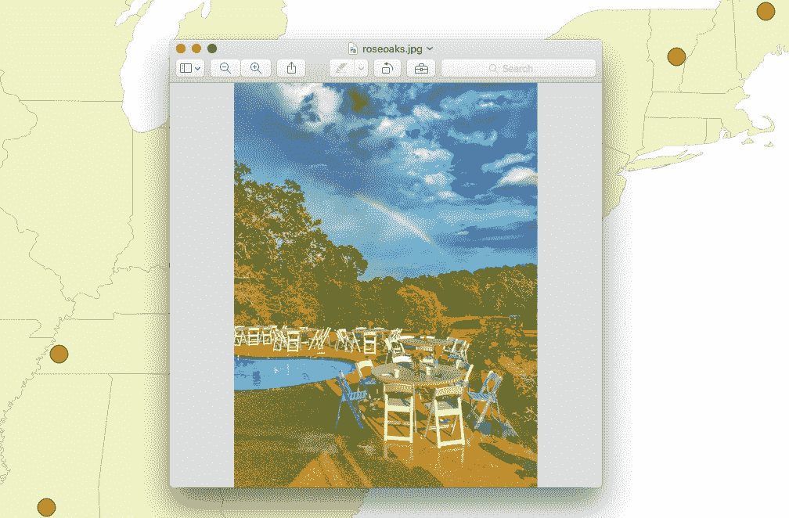

要查看结果，请使用以下说明:

1.  从[https://qgis.org](http://qgis.org)下载 QGIS，按照安装说明进行。
2.  打开 QGIS，将`photos.shp`文件拖到空白地图上。
3.  在左侧的图层面板中，右键单击名为照片的图层，然后选择属性。
4.  在操作选项卡上，单击绿色加号打开新的操作对话框。
5.  在类型下拉菜单中，选择打开。
6.  在描述字段中，输入打开图像。
7.  单击右下角的“插入”按钮。
8.  单击“确定”按钮，然后关闭属性对话框。

9.  单击运行特征操作工具右侧的黑色小箭头，这是一个带有绿色中心和白色箭头的齿轮图标。
10.  在弹出的菜单中，选择“打开图像”。
11.  现在，点击地图上的一个点来查看地理标记的图像弹出窗口。

现在，让我们通过使用卫星图像，从地球上拍摄的图像转移到地球本身拍摄的图像。

# 摘要

在本章中，我们学习了如何创建三个真实世界的产品，它们每天都在政府、科学和工业中使用。除了通常使用**黑盒**包进行分析的地方——花费数千美元——我们能够使用非常少且免费的跨平台 Python 工具。除了本章中的例子之外，您现在还有一些更可重用的函数、算法和处理框架用于其他高级分析，这将允许您解决在交通、农业和天气等领域遇到的新问题。

在下一章中，我们将进入一个相对较新的地理空间分析领域:实时和接近实时的数据。*