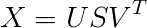
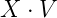
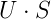
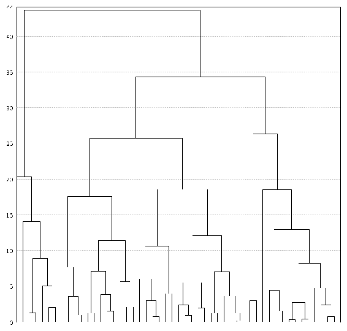
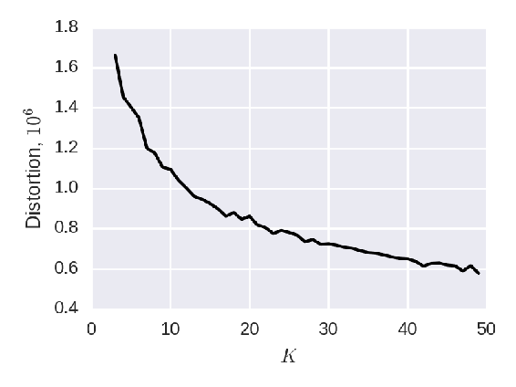

# 五、无监督学习——聚类和降维

在前一章中，介绍了 Java 中的机器学习，并讨论了在提供标签信息的情况下如何处理监督学习问题。

然而往往没有标签信息，我们有的只是一些数据。在这种情况下，仍然可以使用机器学习，这类问题称为**无监督学习**；没有标签，因此没有**监督**。聚类分析属于这些算法中的一种。给定一些数据集，目标是从那里对项目进行分组，以便将相似的项目放入同一个组中。

此外，当有标签信息时，一些无监督学习技术可能是有用的。

例如，降维算法试图*压缩*数据集，以便保留大部分信息，并且数据集可以用较少的特征来表示。此外，降维对于执行聚类分析也是有用的，并且聚类分析可以用于执行降维。

我们将在本章中看到如何做到这一切。具体来说，我们将涵盖以下主题:

*   无监督的降维方法，如 PCA 和 SVD
*   聚类分析算法，如 k-means
*   Java 中可用的实现

到本章结束时，你将知道如何对你拥有的数据进行聚类，以及如何使用 Smile 和其他 Java 库在 Java 中进行降维。


# 降维

顾名思义，降维就是降低数据集的维数。也就是说，这些技术试图压缩数据集，以便只保留最有用的信息，而丢弃其余的信息。

数据集的维度是指数据集的特征数量。当维数很高时，即有太多的特征时，由于以下原因，它可能是不好的:

*   如果特征多于数据集的项目，问题就变得难以定义，一些线性模型，如**普通最小二乘法** ( **OLS** )回归无法处理这种情况
*   一些特征可能是相关的，并导致训练和解释模型的问题
*   一些特征可能会变得嘈杂或不相关，并使模型混乱
*   在高维空间中，距离开始变得不那么有意义了——这个问题通常被称为维数灾难
*   处理大量的特征在计算上可能是昂贵的

在高维数的情况下，我们感兴趣的是降低维数，使其变得易于管理。有几种方法可以做到这一点:

*   **监督降维方法，如特征选择**:我们使用关于标签的信息来帮助我们决定哪些特征是有用的，哪些是无用的
*   **无监督的维数减少，例如特征提取**:我们不使用关于标签的信息(或者因为我们没有或者不愿意这样做),并试图将大的特征集压缩成较小的特征集

在这一章中，我们将讨论第二种类型，即无监督降维，特别是特征提取。


# 无监督降维

特征提取算法背后的主要思想是，它们接受一些高维度的数据集，对其进行处理，并返回一个包含更小的新特征集的数据集。

注意，返回的特征是新的，它们是从数据中**提取的**或**学习的**。但是这种提取是以这样一种方式进行的，即数据的新表示尽可能多地保留来自原始特征的信息。换句话说，它获取用旧要素表示的数据，对其进行转换，然后返回一个包含全新要素的新数据集。

有许多用于降维的特征提取算法，包括:

*   **主成分分析** ( **PCA** )和**奇异值分解** ( **SVD** )
*   **非负矩阵分解** ( **NNMF**
*   随机投影
*   **局部线性嵌入** ( **LLE** )
*   t 雪

在这一章中，我们将讨论主成分分析、奇异值分解和随机投影。其他技术不太流行，在实践中也不常用，所以我们不会在本书中讨论它们。


# 主成分分析

**主成分分析** ( **PCA** )是最著名的特征提取算法。PCA 学习的新特征表示是原始特征的线性组合，使得原始数据内的变化被尽可能地保留。

让我们来看看这个算法的运行情况。首先，我们将考虑我们已经使用的性能预测数据集。对于这个问题，特征的数量比较大；在使用 one-hot-encoding 对分类变量进行编码后，有超过 1000 个特征，而只有 5000 个观察值。显然，1000 个特征对于这样小的样本量来说是相当多的，这可能会在建立机器学习模型时造成问题。

让我们看看是否可以在不损害模型性能的情况下降低数据集的维度。

但首先，让我们回忆一下 PCA 是如何工作的。通常需要完成以下步骤:

1.  首先，对数据集执行均值归一化——转换数据集，使每一列的平均值为零。
2.  然后，计算协方差或相关矩阵。
3.  之后，进行协方差/相关矩阵的**特征值分解**(**【EVD】**)或**奇异值分解** ( **SVD** )。
4.  结果是一组主成分，每个主成分解释了部分方差。主成分通常是有序的，第一个成分解释了大部分的差异，最后一个成分解释了很少的差异。
5.  在最后一步中，我们丢弃那些没有方差的成分，只保留方差大的第一主成分。为了选择要保留的成分数量，我们通常使用解释方差与总方差的累积比率。
6.  我们使用这些组件通过在由这些组件形成的基础上执行原始数据的投影来压缩原始数据集。
7.  完成这些步骤后，我们得到了一个包含较少要素的数据集，但原始数据集的大部分信息都保留了下来。

在 Java 中有很多方法可以实现 PCA，但是我们可以使用其中一个库，比如 Smile，它提供了现成的实现。在 Smile 中，PCA 已经执行了均值归一化，然后计算协方差矩阵，并自动决定是使用 EVD 还是奇异值分解。我们只需要给它一个数据矩阵，剩下的事情它会做。

通常，对协方差矩阵执行 PCA，但有时，当一些原始要素处于不同的比例时，解释方差的比率可能会产生误导。

例如，如果我们拥有的一个要素是以千米为单位的距离，另一个是以毫秒为单位的时间，那么第二个要素将具有更大的方差，因为第二个要素中的数字要大得多。因此，该特征将在最终组件中占主导地位。

为了克服这个问题，我们可以使用相关矩阵代替协方差矩阵，并且由于相关系数是无单位的，因此 PCA 结果不会受到不同尺度的影响。或者，我们可以对数据集中的要素进行标准化，实际上，计算协方差与计算相关性是一样的。

因此，首先我们将使用之前编写的`StandardizationPreprocessor`来标准化数据:

```java
StandardizationPreprocessor preprocessor = StandardizationPreprocessor.train(dataset); 
dataset = preprocessor.transform(dataset)

```

然后，我们可以对转换后的数据集运行 PCA，并查看累积方差:

```java
PCA pca = new PCA(dataset.getX(), false); 
double[] variance = pca.getCumulativeVarianceProportion(); 
System.out.println(Arrays.toString(variance));

```

如果我们获取输出并绘制前一百个组件，我们将看到下图:


我们可以看到，主成分解释了大约 67%的方差，累积解释率在小于 **40** 成分时很快达到 95%，在 61 成分时达到 99%，在 **80** 成分时几乎达到 100%。这意味着，如果我们只取第一个 **80** 分量，就足以捕获数据集中几乎所有的方差。这意味着我们应该能够安全地将 1000 多个维度的数据集压缩到 80 个维度。

我们来测试一下。首先，让我们试着不用 PCA 做 OLS。我们将采用上一章的代码:

```java
Dataset train = trainTestSplit.getTrain(); 

List<Split> folds = train.shuffleKFold(3); 
DescriptiveStatistics ols = crossValidate(folds, data -> { 
    return new OLS(data.getX(), data.getY()); 
});

```

这将打印以下输出:

```java
ols: rmse=15.8679 &pm; 3.4587

```

现在，让我们尝试将主成分的数量限制在 95%、99%和 99.9%的水平，并看看错误会发生什么:

```java
double[] ratios = { 0.95, 0.99, 0.999 }; 

for (double ratio : ratios) { 
    pca = pca.setProjection(ratio); 
    double[][] projectedX = pca.project(train.getX()); 
    Dataset projected = new Dataset(projectedX, train.getY()); 

    folds = projected.shuffleKFold(3); 
    ols = crossValidate(folds, data -> { 
        return new OLS(data.getX(), data.getY()); 
    }); 

    double mean = ols.getMean(); 
    double std = ols.getStandardDeviation() 
    System.out.printf("ols (%.3f): rmse=%.4f &pm; %.4f%n", ratio, mean, std); 
}

```

这会产生以下输出:

```java
ols (0.950): rmse=18.3331 &pm; 3.6308 
ols (0.990): rmse=16.0702 &pm; 3.5046 
ols (0.999): rmse=15.8656 &pm; 3.4625

```

正如我们所见，保持 99.9%的 PCA 方差给出了与原始数据集上的 OLS 回归拟合相同的性能。对于该数据集，99.9%的方差仅由 84 个主成分解释，而原始数据集中有 1070 个特征。因此，我们设法在不损失任何性能的情况下，通过仅保留原始数据大小的 7.8%来减少数据的维度。

然而有时候，从性能上来说，Smile 和其他类似包的 PCA 实现并不是最好的。接下来，我们将看到为什么以及如何处理它。


# 截断奇异值分解

前面的代码(在本例中，使用 Smile)通过完整的 SVD 或 EVD 执行完整的 PCA。这里， **full** 是指它计算所有的特征值和特征向量，可能计算量很大，特别是当我们只需要前 7.8%的主成分时。然而，我们不必总是计算完整的 PCA，而是可以使用截断的 SVD。截断 SVD 只计算指定数量的主分量，通常比完整版本快得多。

Smile 还提供了截断 SVD 的实现。但是在使用之前，我们先快速修改一下 SVD。

矩阵 *X* 的 SVD 计算 *X* 的行和列的基底，使得:

***XV = US ***

这里，该等式解释如下:

*   *V* 的列形成了 *X* 的行的基础
*   *U* 的列形成了 *X* 的行的基础
*   *S* 是奇异值为 *X* 的对角矩阵

通常，SVD 是这样写的:



于是，SVD 将矩阵 *X* 分解成三个矩阵 *U* 、 *S、*和 *V* 。

当 SVD 截断到维数 *K* 时，矩阵 *U* 和 *V* 只有 *K* 列，我们只计算 *K* 奇异值。如果我们随后将原始矩阵 *X* 乘以截断的 *V* ，或者将 *S* 乘以 *U* ，我们将获得 *X* 的行到这个新的 SVD 基的缩减投影。

这将把原始矩阵带到新的约简空间，我们可以使用结果作为特征而不是原始的特征。

现在，我们准备应用它。在微笑中，它看起来像这样:

```java
double[][] X = ... // X is mean-centered 
Matrix matrix = new Matrix(X); 
SingularValueDecomposition svd = SingularValueDecomposition.decompose(matrix, 100);

```

这里，`Matrix`是一个来自 Smile 的类，用于存储密集矩阵。矩阵 *U* 、 *S、*和 *V* 作为二维双精度数组返回到`SingularValueDecomposition`对象内， *U* 和 *V* 作为一维双精度数组返回到 *S* 。

现在，我们需要得到数据矩阵 *X* 的简化表示。正如我们前面讨论的，有两种方法可以做到这一点:

*   通过计算
*   通过计算

首先，我们来看看计算。

在 Smile 中，`SingularValueDecomposition`的`decompose`方法将*的*返回为一个双精度一维数组，因此我们需要将其转换为矩阵形式。我们可以利用 *S* 是对角线的这一事实，用它来加速乘法运算。

让我们使用公共数学图书馆。对角矩阵有一个特殊的实现，所以我们将使用它，通常的数组支持矩阵用于 *U* 。

```java
DiagonalMatrix S = new DiagonalMatrix(svd.getSingularValues()); 
Array2DRowRealMatrix U = new Array2DRowRealMatrix(svd.getU(), false);

```

现在我们可以将这两个矩阵相乘:

```java
RealMatrix result = S.multiply(U.transpose()).transpose(); 
double[][] data = result.getData();

```

注意，我们不是将 *U* 乘以 *S* ，而是反方向进行，然后转置:这利用了 *S* 是对角线的优势，使得矩阵乘法快了很多。最后，我们提取要在 Smile 中使用的 doubles 数组。

如果我们把这个代码用于预测性能的问题，用时不到 4 秒，这还包括矩阵乘法部分。相对于完整的 PCA 版本，这是一个很大的速度提高，在我们的笔记本电脑上，需要 1 分多钟。

另一种计算投影的方法是计算。让我们再一次使用公地数学:

```java
Array2DRowRealMatrix X = new Array2DRowRealMatrix(dataX, false); 
Array2DRowRealMatrix V = new Array2DRowRealMatrix(svd.getV(), false); 
double[][] data = X.multiply(V).getData();

```

这比计算花费的时间稍多，因为两个矩阵都不是对角矩阵。然而，速度上的差异只是微不足道的:对于性能预测问题，以这种方式计算 SVD 和降低维数花费的时间不到 5 秒。

当你使用 SVD 对*训练*数据进行降维时，这两种方法没有区别。然而，我们不能将方法应用于新的未知数据，因为 *U* 和 *S* 都是为矩阵 *X、*产生的，我们为其训练 SVD。相反，我们使用方法。注意，在这种情况下, *X* 将是包含测试数据的新矩阵，而不是我们用于训练 SVD 的同一个 *X* 。

在代码中，它看起来像这样:

```java
double[] trainX = ...;
double[] testX = ...;

Matrix matrix = new Matrix(trainX);
SingularValueDecomposition svd = SingularValueDecomposition.decompose(matrix, 100);

double[][] trainProjected = mmult(trainX, svd.getV());
double[][] testProjected = mmult(testX, svd.getV());

```

这里，`mmult`是将矩阵 *X* 乘以矩阵 *V* 的方法。

还有另一个实现细节:在 Smile 的 PCA 实现中，我们使用解释方差的比率来确定所需的维数。回想一下，我们通过在`PCA`对象上调用`getCumulativeVarianceProportion`来实现这一点，并且通常保持足够高的组件数量，以获得至少 95%或 99%的方差。

但是，由于我们直接使用 SVD，所以我们现在不知道这个比值。这意味着为了能够选择正确的维度，我们需要自己实现它。幸运的是，做起来并不复杂；首先，我们需要计算数据集的总体方差，然后计算所有主成分的方差。后者可以从奇异值中获得(矩阵 *S* )。奇异值对应于标准差，所以要得到方差，我们只需要对它们求平方。最后，求比值很简单，我们只需要一个除以另一个。

让我们看看它在代码中的样子。首先，我们使用 Commons Math 来计算总方差:

```java
Array2DRowRealMatrix matrix = new Array2DRowRealMatrix(dataset.getX(), false); 
int ncols = matrix.getColumnDimension(); 

double totalVariance = 0.0; 
for (int col = 0; col < ncols; col++) { 
    double[] column = matrix.getColumn(col); 
    DescriptiveStatistics stats = new DescriptiveStatistics(column); 
    totalVariance = totalVariance + stats.getVariance(); 
}

```

现在，我们可以根据奇异值计算累积比率:

```java
int nrows = X.length; 
double[] singularValues = svd.getSingularValues(); 
double[] cumulatedRatio = new double[singularValues.length]; 

double acc = 0.0; 
for (int i = 0; i < singularValues.length; i++) { 
    double s = singularValues[i]; 
    double ratio = (s * s / nrows) / totalVariance; 
    acc = acc + ratio; 
    cumulatedRatio[i] = acc; 
}

```

运行这段代码后，`cumulatedRatio`数组将包含所需的比率。结果应该与来自`pca.getCumulativeVarianceProportion()`的 Smile 的 PCA 实现完全相同。


# 分类和稀疏数据的截断奇异值分解

对于包含许多分类变量的数据集，降维非常有用，尤其是当这些变量中的每一个都有许多可能的值时。

当我们有非常高维的稀疏矩阵时，计算全奇异值分解通常是非常昂贵的。因此，截断 SVD 特别适合这种情况，在这里我们将看到如何使用它。在下一章的后面，我们会看到这对于文本数据也是非常有用的，我们将在下一章讨论这种情况。现在，我们将看看如何将它用于分类变量。

为此，我们将使用来自 Kaggle 的客户投诉数据集。你可以从这里下载:[https://www.kaggle.com/cfpb/us-consumer-finance-complaints](https://www.kaggle.com/cfpb/us-consumer-finance-complaints)。

该数据集包含银行和其他金融机构的客户提交的投诉，还包含有关这些投诉的其他信息，如下所示:

*   投诉的产品可以是*按揭贷款*、*助学贷款*、*讨债、*等。有 11 种产品。
*   关于产品的举报问题，如*不正确信息*、*虚假陈述、*等。共有 95 种问题。
*   被投诉的公司，3000 多家。
*   `submitted_via`是投诉的发送方式，6 个可能选项，例如，*网络和* *电子邮件。*
*   州和邮政编码分别是 63 和 27，000 个可能值。
*   `consumer_complaint_narrative`是问题的自由文本描述。

我们看到在这个数据集中有大量的分类变量。正如我们在前面章节中已经讨论过的，编码分类变量的典型方式是一次热编码(也称为**虚拟编码**)。这个想法是，对于一个变量的每个可能的值，我们创建一个单独的特性，如果一个项目有这个特定的值，就把值`1`放在那里。所有其他可能值的列都有`0`。

实现这一点的最简单的方法是使用特性散列，这有时被称为散列技巧。

按照以下步骤可以很容易地做到这一点:

*   我们预先指定稀疏矩阵的维数，为此我们取一个相当大的数
*   然后，对于每个值，我们计算这个值的散列
*   使用散列，我们计算稀疏矩阵中的列数，并将该列的值设置为`1`

所以，让我们试着去实现它。首先，我们加载数据集并只保留分类变量:

```java
DataFrame<Object> categorical = dataframe.retain("product", "sub_product", "issue", 
        "sub_issue", "company_public_response", "company", 
        "state", "zipcode", "consumer_consent_provided", 
        "submitted_via");

```

现在，让我们实现特性散列来编码它们:

```java
int dim = 50_000; 
SparseDataset result = new SparseDataset(dim); 

int ncolOriginal = categorical.size(); 
ListIterator<List<Object>> rows = categorical.iterrows(); 

while (rows.hasNext()) { 
    int rowIdx = rows.nextIndex(); 
    List<Object> row = rows.next(); 
    for (int colIdx = 0; colIdx < ncolOriginal; colIdx++) { 
        Object val = row.get(colIdx); 
        String stringValue = colIdx + "_" + Objects.toString(val); 
        int targetColIdx = Math.abs(stringValue.hashCode()) % dim; 

        result.set(rowIdx, targetColIdx, 1.0); 
    } 
}

```

这里发生的事情是，我们首先创建一个`SparseDataset`——一个来自 Smile 的类，用于保存基于行的稀疏矩阵。接下来，我们说矩阵应该具有由变量`dim`指定的维度。`dim`的值应该足够高，这样碰撞的几率就不会很高。然而，通常情况下，如果有冲突，也没什么大不了的。

如果您将 dim 的值设置为一个非常大的数字，那么当我们稍后分解矩阵时，可能会出现一些性能问题。

特征散列是一种非常简单的方法，并且在实践中经常非常有效。还有另一种方法，实现起来更复杂，但它确保没有哈希冲突。为此，我们构建一个从所有可能的值到列索引的映射，然后构建稀疏矩阵。

构建地图将如下所示:

```java
Map<String, Integer> valueToIndex = new HashMap<>(); 
List<Object> columns = new ArrayList<>(categorical.columns()); 

int ncol = 0; 

for (Object name : columns) { 
    List<Object> column = categorical.col(name); 
    Set<Object> distinct = new HashSet<>(column); 
    for (Object val : distinct) { 
        String stringValue = Objects.toString(name) + "_" + Objects.toString(val); 
        valueToIndex.put(stringValue, ncol); 
        ncol++; 
    } 
}

```

`ncol`变量包含列数，这是我们未来稀疏矩阵的维数。现在我们可以构建实际的矩阵。这与我们之前的内容非常相似，但是我们现在在映射中查找索引，而不是散列:

```java
SparseDataset result = new SparseDataset(ncol); 

ListIterator<List<Object>> rows = categorical.iterrows(); 
while (rows.hasNext()) { 
    int rowIdx = rows.nextIndex(); 
    List<Object> row = rows.next(); 
    for (int colIdx = 0; colIdx < columns.size(); colIdx++) { 
        Object name = columns.get(colIdx); 
        Object val = row.get(colIdx); 
        String stringValue = Objects.toString(name) + "_" + Objects.toString(val); 
        int targetColIdx = valueToIndex.get(stringValue); 

        result.set(rowIdx, targetColIdx, 1.0); 
    } 
}

```

这样做之后，我们有了一个`SparseDataset`对象，它包含基于行格式的数据。接下来，我们需要能够将它放到 SVD 求解器中，为此我们需要将它转换成不同的基于列的格式。这是在`SparseMatrix`类中实现的。幸运的是，`SparseDataset`类中有一个特殊的方法来完成转换，所以我们使用它:

```java
SparseMatrix matrix = dataset.toSparseMatrix(); 
SingularValueDecomposition svd = SingularValueDecomposition.decompose(matrix, 100);

```

分解相当快；计算特征散列矩阵的 SVD 花费了大约 28 秒，而通常的一次热编码花费了大约 24 秒。记住这个数据集中有 50 万行，所以速度相当不错。据我们所知，SVD 的其他 Java 实现不能提供同样的性能。

现在，当计算 SVD 时，我们需要将原始矩阵投影到缩减的空间，就像我们之前在密集矩阵的情况下所做的那样。

由于 *U* 和 *S* 都是密集的，所以投影可以完全像以前一样进行。但是 *X* 是稀疏的，我们需要找到一种高效地将稀疏的 *X* 和密集的 *X* 相乘的方法。

不幸的是，Smile 和 Commons Math 都没有合适的实现。因此，我们需要使用另一个库，这个问题可以用**Matrix Java Toolkit**(**MTJ**)来解决。这个库基于 netlib-java，它是 BLAS、LAPACK 和 ARPACK 等低级高性能库的包装器。你可以在它的 GitHub 页面上了解更多:【https://github.com/fommil/matrix-toolkits-java[。](https://github.com/fommil/matrix-toolkits-java)

由于我们使用 Maven，它将负责下载二进制依赖项并将它们链接到项目。我们需要做的只是指定以下依赖关系:

```java
<dependency> 
  <groupId>com.googlecode.matrix-toolkits-java</groupId> 
  <artifactId>mtj</artifactId> 
  <version>1.0.2</version> 
</dependency>

```

我们需要用两个矩阵相乘， *X* 和 *V，*，条件是 *X* 稀疏而 *V* 稠密。由于 *X* 位于乘法运算符的左侧，存储 *X* 的值的最有效方式是基于行的稀疏矩阵表示。对于 V，最有效的表示是基于列的密集矩阵。

但是在我们这样做之前，我们首先需要将 Smile 的`SparseDataset`转换成 MTJ 的稀疏矩阵。为此，我们使用了一个特殊的构建器:`FlexCompRowMatrix`类，它适合于用值填充矩阵，但不太适合乘法。一旦我们构建了矩阵，我们就把它转换成`CompRowMatrix`，它有一个更有效的内部表示，并且更适合于乘法目的。

我们是这样做的:

```java
SparseDataset dataset = ... // 
int ncols = dataset.ncols(); 
int nrows = dataset.size(); 
FlexCompRowMatrix builder = new FlexCompRowMatrix(nrows, ncols); 

SparseArray[] array = dataset.toArray(new SparseArray[0]); 
for (int rowIdx = 0; rowIdx < array.length; rowIdx++) { 
    Iterator<Entry> row = array[rowIdx].iterator(); 
    while (row.hasNext()) { 
        Entry entry = row.next(); 
        builder.set(rowIdx, entry.i, entry.x); 
    } 
} 

CompRowMatrix X = new CompRowMatrix(builder);

```

第二步是创建一个密集的矩阵。这一步更简单:

```java
DenseMatrix V = new DenseMatrix(svd.getV());

```

在内部，MTJ 按列存储密集矩阵，这对于我们的目的来说是理想的。

接下来，我们需要创建一个矩阵对象，它将包含结果，然后我们将 *X* 乘以 *V* :

```java
DenseMatrix XV = new DenseMatrix(X.numRows(), V.numColumns()); 
X.mult(V, XV);

```

最后，我们需要从结果矩阵中提取双数组数据。出于性能考虑，MTJ 将数据存储为一维双数组，因此我们需要将其转换为传统的表示形式。我们这样做:

```java
double[] data = XV.getData(); 
int nrows = XV.numRows(); 
int ncols = XV.numColumns(); 
double[][] result = new double[nrows][ncols]; 

for (int col = 0; col < ncols; col++) { 
    for (int row = 0; row < nrows; row++) { 
        result[row][col] = data[row + col * nrows]; 
    } 
}

```

最后，我们得到了结果数组，它捕获了原始数据集的大部分可变性，并且我们可以将其用于需要小的密集矩阵的情况。

这种转换对于本章的第二个主题:集群特别有用。通常，我们使用距离来聚类数据点，但当涉及到高维空间时，距离不再有意义，这种现象被称为维度的**曲线**。然而，在缩减的 SVD 空间中，距离仍然有意义，并且当我们应用聚类分析时，结果通常更好。

这对于处理自然语言文本也是一种非常有用的方法，因为通常文本被表示为非常高维和非常稀疏的矩阵。我们将在第六章、*处理文本-自然语言处理和信息检索*中回到这个话题。

注意，与通常的 PCA 情况不同，我们在这里不执行均值居中。这有几个原因:

*   如果我们这样做，矩阵将变得密集，并将占用太多的内存，因此不可能在合理的时间内处理它
*   在稀疏矩阵中，平均值已经非常接近于零，因此没有必要执行平均值归一化

接下来，我们来看一种不同的降维技术，这种技术非常简单，不需要学习，而且速度非常快。


# 随机投影

主成分分析试图在数据中找到某种结构，并利用它来降低维数；它找到了这样一个基础，在这个基础上，原始方差的大部分被保留下来。但是，有一种替代方法，而不是试图学习基础，只是随机生成它，然后将原始数据投影到它上面。

令人惊讶的是，这个简单的想法在实践中非常有效。原因是这种变换保持了距离。这意味着，如果我们在原始空间中有两个彼此靠近的物体，那么，当我们应用投影时，它们仍然保持靠近。同样地，如果物体彼此远离，那么它们将在新的缩减空间中保持远离。

Smile 已经实现了随机投影，它接受输入维度和期望的输出维度:

```java
double[][] X = ... // data 
int inputDimension = X[0].length; 
int outputDimension = 100; 
smile.math.Math.setSeed(1); 
RandomProjection rp = new RandomProjection(inputDimension, outputDimension);

```

注意，我们为随机数生成器显式设置了种子；由于随机投影的基础是随机生成的，我们希望确保可重复性。

只有在版本 1.2.1 中才可以设置种子，在撰写本文时，Maven Central 上还没有这个功能。

它通过以下方式在 Smile 中实现:

*   首先，从高斯分布中抽取一组随机向量
*   然后，通过 Gram-Schmidt 算法使向量正交，也就是说，首先使它们正交，然后将长度归一化为 1
*   投影是在这个标准正交基上进行的

让我们用它来进行性能预测，然后拟合通常的 OLS:

```java
double[][] X = dataset.getX(); 
int inputDimension = X[0].length; 
int outputDimension = 100; 
smile.math.Math.setSeed(1); 
RandomProjection rp = new RandomProjection(inputDimension, outputDimension); 

double[][] projected = rp.project(X); 
dataset = new Dataset(projected, dataset.getY()); 

Split trainTestSplit = dataset.shuffleSplit(0.3); 
Dataset train = trainTestSplit.getTrain(); 

List<Split> folds = train.shuffleKFold(3); 
DescriptiveStatistics ols = crossValidate(folds, data -> { 
    return new OLS(data.getX(), data.getY()); 
}); 

System.out.printf("ols: rmse=%.4f &pm; %.4f%n", ols.getMean(), ols.getStandardDeviation());

```

它非常快(在我们的笔记本电脑上不到一秒钟)，并且该代码产生以下结果:

```java
ols: rmse=15.8455 &pm; 3.3843

```

结果与平原 OLS 或 OLS 的 PCA 结果非常相似，方差为 99.9%。

然而，来自 Smile 的实现只适用于密集矩阵，在撰写本文时还不支持稀疏矩阵。因为这个方法非常简单，所以我们自己实现它并不困难。让我们实现一个生成随机基的简化版本。

为了生成基，我们从均值为零且标准差等于`1 / new_dimensionality`的高斯分布中采样，其中`new_dimensionality`是新的缩减空间的期望维度。

让我们用公地数学来计算:

```java
NormalDistribution normal = new NormalDistribution(0.0, 1.0 / outputDimension); 
normal.reseedRandomGenerator(seed); 
double[][] result = new double[inputDimension][]; 

for (int i = 0; i < inputDimension; i++) { 
    result[i] = normal.sample(outputDimension); 
}

```

这里，我们有以下参数:

*   `inputDimension`:这是我们要投影的矩阵的维数，也就是这个矩阵的列数
*   `outputDimension`:这是期望的投影维度
*   `seed`:这是用于再现性的随机数发生器种子

首先，让我们检查实现的合理性，并将其应用于相同的性能问题。尽管它很密集，但对于测试目的来说已经足够了:

```java
double[][] X = dataset.getX(); 
int inputDimension = X[0].length; 
int outputDimension = 100; 
int seed = 1; 
double[][] basis = Projections.randomProjection(inputDimension, outputDimension, seed); 
double[][] projected = Projections.project(X, basis); 
dataset = new Dataset(projected, dataset.getY()); 

Split trainTestSplit = dataset.shuffleSplit(0.3); 
Dataset train = trainTestSplit.getTrain(); 

List<Split> folds = train.shuffleKFold(3); 
DescriptiveStatistics ols = crossValidate(folds, data -> { 
    return new OLS(data.getX(), data.getY()); 
}); 

System.out.printf("ols: rmse=%.4f &pm; %.4f%n", ols.getMean(), ols.getStandardDeviation());

```

这里我们有两种方法:

*   这产生了我们之前实现的随机基础。
*   `Projections.project`:将矩阵 *X* 投影到基底上，通过将矩阵 *X* 乘以基底的矩阵来实现。

运行代码后，我们会看到以下输出:

```java
ols: rmse=15.8771 &pm; 3.4332

```

这表明我们的实现已经通过了健全性检查，结果是有意义的，并且方法被正确地实现了。

现在我们需要改变投影方法，使其可以应用于稀疏矩阵。我们已经完成了，但是让我们再来看一下大纲:

*   将稀疏矩阵放入`RompRowMatrix`、**压缩行存储** ( **CRS** 矩阵中
*   将基础放入`DenseMatrix`
*   将矩阵相乘，并将结果写入`DenseMatrix`
*   将来自`DenseMatrix`的底层数据展开成一个二维双数组

对于投诉数据集中的分类示例，如下所示:

```java
DataFrame<Object> categorical = ... // data 
SparseDataset sparse = OHE.hashingEncoding(categorical, 50_000); 
double[][] basis = Projections.randomProjection(50_000, 100, 0); 
double[][] proj = Projections.project(sparse, basis);

```

这里，我们创建了一些助手方法:

*   `OHE.hashingEncoding`:这将对来自分类数据`DataFrame`的分类数据进行一次热编码
*   `Projections.randomProjection`:生成一个随机的基础
*   `Projections.project`:这在这个生成的基础上投射我们的稀疏矩阵

我们之前已经为这些方法编写了代码，这里为了方便起见，我们将它们放在了 helper 方法中。当然，像往常一样，您可以在为本章提供的代码包中看到完整的代码。到目前为止，我们只讨论了无监督学习降维的一组技术。还有聚类分析，我们将在接下来讨论。有趣的是，聚类也可以用于降低数据集的维度，很快我们就会看到如何实现。


# 聚类分析

聚类或聚类分析是另一种无监督学习算法。聚类的目标是将数据组织成簇，使得相似的项目出现在同一个簇中，而不相似的项目出现在不同的簇中。

执行聚类分析有许多不同的算法系列，它们在元素分组方式上有所不同。

最常见的系列如下:

*   **Hierarchical** :这将数据集组织成一个层次结构，例如凝聚和分裂聚类。结果通常是一个树状图。
*   **分割**:这将数据集分割成 *K* 个不相交的类——*K*通常是预先指定的——例如， *K* 意味着。
*   **基于密度**:基于密度区域组织项目；如果在一些密集的区域中有许多项目，它们形成一个簇，例如 DBSCAN。
*   **基于图形的**:这将项目之间的关系表示为图形，并应用图论中的分组算法，例如，连接组件和最小生成树。


# 分层方法

分层方法被认为是最简单的聚类算法；它们很容易理解和解释。聚类方法有两个家族，它们属于等级家族:

*   分裂聚类算法
*   凝聚聚类算法

在分裂法中，我们将所有数据项放入一个簇中，在每一步中，我们选取一个簇，然后将其分成两半，直到每个元素都是自己的簇。因此，这种方法有时被称为**自顶向下聚类**。

凝聚聚类方法是相反的；开始的时候，每个数据点都属于自己的聚类，然后在每一步，我们选择两个最接近的聚类进行合并，直到只剩下一个大的聚类。这也叫做**自下而上**的方法。

尽管有两种类型的层次聚类算法，但当人们说层次聚类时，他们通常指的是聚集聚类，这些算法更常见。所以让我们仔细看看它们。

在凝聚聚类中，在每一步，我们合并两个最接近的聚类，但是根据我们如何定义最接近，结果可能会有很大的不同。

合并两个集群的过程通常被称为**链接**，**链接**描述了两个集群之间的距离是如何计算的。

链接有多种类型，最常见的如下:

*   **单链**:两个簇之间的距离是最近的两个元素之间的距离。
*   **完全连锁**:两个集群之间的距离是两个最远元素之间的距离。
*   **平均连锁(有时也称为 UPGMA 连锁)**:聚类之间的距离是质心之间的距离，其中质心是该聚类所有项目的平均值。

这些方法通常适用于较小规模的数据集，并且非常适用。但是对于较大的数据集，它们通常不太有用，并且要花很多时间才能完成。尽管如此，它甚至可以用于更大的数据集，但我们需要一些可管理规模的样本。

让我们看看例子。我们可以使用之前使用的投诉数据集，通过 One-Hot-Encoding 对分类变量进行编码。如果你还记得的话，我们然后通过使用 SVD 将带有分类变量的稀疏矩阵转化为更小维度的密集矩阵。数据集非常大，很难处理，所以我们先从其中抽取 10，000 条记录作为样本:

```java
double[] data = ... // our data in the reduced SVD space 
int size = 10000; // sample size 
long seed = 0; // seed number for reproducibility 
Random rnd = new Random(seed); 

int[] idx = rnd.ints(0, data.length).distinct().limit(size).toArray(); 
double[][] sample = new double[size][]; 
for (int i = 0; i < size; i++) { 
    sample[i] = data[idx[i]]; 
} 

data = sample;

```

我们在这里做的是从随机数生成器中获取一个不同的整数流，然后将其限制为 10，000。然后我们用这些整数作为样本的索引。
在准备好数据并提取样本后，我们可以尝试对该数据集进行凝聚聚类分析。我们之前讨论的大多数机器学习库都有聚类算法的实现，所以我们可以使用它们中的任何一个。因为我们已经广泛使用了 Smile，所以在本章中，我们还将使用 Smile 的实现。
当我们使用它时，首先需要指定的是**联动**。为了指定链接并创建一个`Linkage`对象，我们首先需要计算一个**邻近矩阵**——一个包含数据集中每对对象之间距离的矩阵。我们可以使用任何距离度量，但我们将采用最常用的一种，欧几里德距离。回想一下，欧几里得距离是两个向量之差的范数。为了有效地计算它，我们可以使用下面的分解:


我们把距离的平方表示成内积，然后分解。接下来，我们认识到这是各个向量的范数之和减去它们的乘积:


这是我们可以用来有效计算邻近矩阵的公式，邻近矩阵是每对项目之间的距离矩阵。在这个公式中，我们有对的内积，它可以通过使用矩阵乘法来有效地计算。让我们看看如何将这个公式翻译成代码。前两个部分是单独的标准，让我们来计算它们:

```java
int nrow = data.length; 

double[] squared = new double[nrow]; 
for (int i = 0; i < nrow; i++) { 
    double[] row = data[i]; 

    double res = 0.0; 
    for (int j = 0; j < row.length; j++) { 
        res = res + row[j] * row[j]; 
    } 

    squared[i] = res; 
}

```

当涉及到内积时，它只是数据矩阵与其转置的矩阵乘法。我们可以用 Java 中的任何数学软件包来计算它。例如，使用 Commons Math:

```java
Array2DRowRealMatrix m = new Array2DRowRealMatrix(data, false); 
double[][] product = m.multiply(m.transpose()).getData();

```

最后，我们将这些组件放在一起计算邻近矩阵:

```java
double[][] dist = new double[nrow][nrow]; 

for (int i = 0; i < nrow; i++) { 
    for (int j = i + 1; j < nrow; j++) { 
        double d = squared[i] - 2 * product[i][j] + squared[j]; 
        dist[i][j] = dist[j][i] = d; 
    } 
}

```

因为距离矩阵是对称的，所以我们可以节省时间，只在一半的索引上循环。`i == j`的时候不用盖案子。

我们还可以使用其他的距离度量:这对于`Linkage`类来说无关紧要。比如不用欧氏距离，我们可以取另一个，比如余弦距离。

余弦距离是两个向量之间相异度的另一种度量，它基于余弦相似度。余弦相似度在几何上对应于两个向量之间的角度，它是使用内积计算的:


这里的内积除以每个向量的范数。但是如果向量已经归一化了，也就是有范数，等于 1，那么余弦就是内积。如果余弦相似度等于 1，则向量完全相同。

余弦距离与余弦相似度相反:当向量相同时，它应该等于零，因此我们可以通过从 1 中减去它来计算它:


因为这里有内积，所以使用矩阵乘法很容易计算这个距离。

我们来实施吧。首先，我们对数据矩阵的每个行向量进行单位归一化:

```java
int nrow = data.length; 
double[][] normalized = new double[nrow][]; 

for (int i = 0; i < nrow; i++) { 
    double[] row = data[i].clone(); 
    normalized[i] = row; 
    double norm = new ArrayRealVector(row, false).getNorm(); 
    for (int j = 0; j < row.length; j++) { 
        row[j] = row[j] / norm; 
    } 
}

```

现在，我们可以将归一化矩阵相乘，以获得余弦相似度:

```java
Array2DRowRealMatrix m = new Array2DRowRealMatrix(normalized, false); 
double[][] cosine = m.multiply(m.transpose()).getData();

```

最后，我们通过从 1:

```java
for (int i = 0; i < nrow; i++) { 
    double[] row = cosine[i]; 
    for (int j = 0; j < row.length; j++) { 
        row[j] = 1 - row[j]; 
    } 
}

```

现在，可以将计算出的矩阵传递给`Linkage`实例。正如我们提到的，任何距离度量都可以与层次聚类一起使用，这是一个很好的属性，是其他聚类方法通常所缺乏的。

现在让我们使用计算出的距离矩阵进行聚类:

```java
double[][] proximity = calcualateSquaredEuclidean(data); 
Linkage linkage = new UPGMALinkage(proximity); 
HierarchicalClustering hc = new HierarchicalClustering(linkage);

```

在凝聚聚类中，我们将两个最相似的聚类合并，然后重复这个过程，直到只剩下一个聚类。这个合并过程可以用树状图来形象化。为了用 Java 绘制它，我们可以使用 Smile 自带的绘图库。

为了说明如何做到这一点，让我们首先只对几个项目进行采样并应用聚类。然后我们可以得到类似下图的东西:



在底部的 *x* 轴上，我们有被合并到集群中的项目。在 *y* 轴上，我们有聚类合并的距离。

为了创建绘图，我们使用以下代码:

```java
Frame frame = new JFrame("Dendrogram"); 
frame.setDefaultCloseOperation(WindowConstants.DISPOSE_ON_CLOSE); 

PlotCanvas dendrogram = Dendrogram.plot(hc.getTree(), hc.getHeight()); 
frame.add(dendrogram); 

frame.setSize(new Dimension(1000, 1000)); 
frame.setLocationRelativeTo(null); 
frame.setVisible(true);

```

当我们需要分析生成的集群时，这种可视化非常有用。因为我们知道合并完成的距离(在 *y* 轴上)，我们可以知道从数据中提取多少个集群是有意义的。例如，在大约 21 之后，合并变得彼此相当遥远，这可能暗示有 5 个集群。

为了得到这些聚类，我们可以在某个距离阈值处切割树状图。如果一些元素在低于阈值的距离处被合并，则它们保持在相同的聚类内。否则，如果它们在阈值以上的距离处合并，它们将被视为单独的聚类。

对于前面的树状图，如果我们在 23 的高度切割，我们应该得到 5 个独立的聚类。我们可以这样做:

```java
double height = 23.0; 
int[] labels = hc.partition(height);

```

或者，我们可以要求特定数量的集群:

```java
int k = 5; 
int[] labels = hc.partition(k);

```

分层集群有几个优点:

*   它可以与任何距离函数一起工作，它所需要的只是一个距离矩阵，所以任何函数都可以用来创建矩阵
*   通过这种聚类，很容易得出聚类的数量

然而，也有一些缺点:

*   它不适用于数据集中的大量项目——距离矩阵很难适应内存。
*   它通常比其他方法慢，尤其是当使用一些链接时。

还有另一种非常流行的方法，它非常适合大型数据集，接下来我们将讨论它。


# k 均值

正如我们之前提到的，凝聚聚类方法对于小数据集非常有效，但是对于大数据集却有一些问题。K -means 是另一种流行的聚类技术，它没有这个问题。

*K* -means 是一种聚类方法，属于聚类算法的划分家族:给定簇数 *K* ， *K* -Means 将数据分割成 *K* 个不相交的组。
使用质心将项目分组为簇。质心代表一个聚类的“中心”,对于每个项目，我们将其分配到与其最近的质心的组中。聚类的质量通过**失真**来衡量——每个项目与其质心之间的距离之和。

与凝聚式集群一样，Java 中有多种实现方式可以使用 *K* -Means，和前面一样，我们将使用来自 Smile 的实现方式。不幸的是，它不支持稀疏矩阵，只能处理密集矩阵。如果我们想将其用于稀疏数据，我们要么需要将其转换为稠密矩阵，要么用奇异值分解或随机投影来降低其维数。

让我们再次使用投诉的分类数据集，并用 SVD 将其投射到`30`组件:

```java
SingularValueDecomposition svd = SingularValueDecomposition.decompose(sparse.toSparseMatrix(), 30); 
double[][] proj = Projections.project(sparse, svd.getV());

```

正如我们在这里看到的， *K* -means 在 Smile 中的实现接受四个参数:

*   我们要聚类的矩阵
*   我们想要找到的集群的数量
*   要运行的迭代次数
*   选择最佳方案之前的试验次数

*K* -means 优化数据集的失真，这个目标函数有很多局部最优。这意味着，根据初始配置，您可能会得到完全不同的结果，有些结果可能会比其他结果更好。这个问题可以通过多次运行 K-means 来缓解，每次都从不同的起始位置开始，然后选择具有最佳值的聚类。这就是为什么我们需要最后的参数，试验次数。

现在，让我们跑*K*——意思是在微笑:

```java
int k = 10; 
int maxIter = 100; 
int runs = 3; 
KMeans km = new KMeans(proj, k, maxIter, runs);

```

虽然 Smile 的实现只能处理密集矩阵，但是 JSAT 的实现没有这个限制，它可以处理任何矩阵，不管是密集的还是稀疏的。

我们在 JSAT 的做法如下:

```java
SimpleDataSet ohe = JsatOHE.oneHotEncoding(categorical); 
EuclideanDistance distance = new EuclideanDistance(); 
Random rand = new Random(1); 
SeedSelection seedSelection = SeedSelection.RANDOM; 
KMeans km = new ElkanKMeans(distance, rand, seedSelection); 

List<List<DataPoint>> clustering = km.cluster(ohe);

```

在这段代码中，我们使用了 One-Hot-Encoding 的另一个实现，它生成稀疏的 JSAT 数据集。它非常接近我们对 Smile 的实现。关于细节，你可以看看本章代码库中的代码。

在 JSAT，*K*-的意思有多种实现方式。其中一个实现是`ElkanKMeans`，我们之前用过。来自 JSAT 的`ElkanKMeans`参数与 Smile 版本大相径庭:

*   首先，它采用距离函数，通常是欧几里德距离函数
*   它创建 random 类的一个实例以确保可再现性
*   它创建了为聚类选择初始种子的算法，随机是最快的，KPP(它是*K*-意味着++)在成本函数方面是最优的

对于稀疏矩阵，JSAT 实现太慢，所以它不适合我们的问题。对于密集矩阵，JSAT 实现产生的结果与 Smile 相当，但它也需要相当多的时间。

K-means 有一个参数 *K，*这是我们想要的聚类数。通常，想出一个好的 *K* 值是具有挑战性的，接下来我们将看看如何选择它。


# 在 K-Means 中选择 K

*K* -means 有一个缺点:我们需要指定集群的数量 *K* 。有时 *K* 可以从我们试图解决的领域问题中得知。例如，如果我们知道有 10 种类型的客户端，我们可能想要查找 10 个集群。

然而，我们往往没有这种领域知识。在这种情况下，我们可以使用一种通常被称为**肘法**的方法:

*   尝试不同的 *K* 值，记录每个值的失真
*   绘制每个 *K* 的失真
*   试着找出**拐点**，图中误差停止快速下降并开始缓慢下降的部分

你可以用下面的方法来做:

```java
PrintWriter out = new PrintWriter("distortion.txt"); 

for (int k = 3; k < 50; k++) { 
    int maxIter = 100; 
    int runs = 3; 
    KMeans km = new KMeans(proj, k, maxIter, runs); 
    out.println(k + "/t" + km.distortion()); 
} 

out.close();

```

然后，你可以用你喜欢的绘图库来绘制`distortion.txt`文件的内容，结果是这样的:



在这里，我们可以看到它最初下降很快，但在 15-20 左右，它开始缓慢下降。所以我们可以从这个区域中选取 *K* ，比如取 *K* = 17。

另一个解决方案是对少量数据进行采样，然后用层次聚类构建一个树状图。通过查看树状图，可以清楚地知道什么是最佳的聚类数 *K* 。

这两种方法都需要人的判断，很难形式化。但是还有另外一个选择——让机器学习为我们选择最好的 *K* 。为此，我们可以使用 X-Means，它是对 *K* -Means 算法的扩展。X-Means 试图使用**贝叶斯信息标准** ( **BIC** )得分自动选择最佳 *K* 。

Smile 已经包含了 X-Means 的一个实现，名为`XMeans`，运行它很简单，如下所示:

```java
int kmax = 300; 
XMeans km = new XMeans(data, kmax); 
System.out.println("selected number of clusters: " + km.getNumClusters());

```

这将根据 BIC 输出最佳数量的集群。JSAT 也有一个`XMeans`的实现，它的工作方式类似。

从来都不清楚哪种方法更好，所以您可能需要尝试每种方法，并为特定问题选择最佳方法。

除了凝聚聚类和 *K* -Means 之外，还有其他聚类方法，这些方法有时在实践中也是有用的。接下来，我们现在来看看其中的一个- DBSCAN。


# 基于密度的噪声应用空间聚类

DBSCAN 是另一种非常流行的集群技术。DBSCAN 属于基于密度的算法家族，与 *K* -Means 不同，它不需要事先知道聚类的数量 *K* 。

简而言之，DBSCAN 的工作方式如下:在每一步中，它都需要一个项目在其周围生成一个集群。

当我们从一个高密度区域中取出一个项目时，那么在当前项目附近有许多其他数据点，并且所有这些项目都被添加到聚类中。然后，对集群的每个新添加的元素重复该过程。然而，如果该区域不够密集，附近又没有那么多点，那么我们就不能形成一个聚类，并说这个项目是一个异常值。

因此，为了使 DBSCAN 工作，我们需要提供以下参数:

*   计算两个项目接近程度的距离度量
*   半径内继续增长集群的最小邻居数
*   每个点周围的半径

正如我们所看到的，我们不需要为 DBSCAN 预先指定 *K* 。此外，它自然会处理异常值，这可能会给像 *K* -Means 这样的方法带来严重的问题。
在 Smile 中有一个 DBSCAN 的实现，下面是我们如何使用它:

```java
double[] X = ... // data 
EuclideanDistance distance = new EuclideanDistance(); 
int minPts = 5; 
double radius = 1.0; 
DBScan<double[]> dbscan = new DBScan<>(X, distance, minPts, radius); 

System.out.println(dbscan.getNumClusters()); 
int[] assignment = dbscan.getClusterLabel();

```

在这段代码中，我们指定了以下三个参数:距离、一个项目周围被认为是一个集群的最小点数以及半径。

完成后，我们就可以使用`getClusterLabel`方法来分配聚类标签。因为 DBSCAN 处理离群值，所以它们有一个特殊的集群 ID，`Integer.MAX_VALUE`。

凝聚聚类、 *K* -Means 和 DBSCAN 是最常用的聚类方法之一，当我们需要对共享某种模式的项目进行分组时，它们非常有用。然而，我们也可以使用聚类进行降维，接下来我们将看到如何进行降维。


# 监督学习的聚类

像降维一样，聚类也可以用于监督学习。

我们将讨论以下案例:

*   聚类作为创建额外特征的特征工程技术
*   聚类作为一种降维技术
*   作为简单分类或回归方法的聚类


# 作为特征的聚类

聚类可以被视为特征工程的一种方法，聚类的结果可以作为一组附加特征添加到监督模型中。

使用聚类结果的一次热编码的最简单方法如下:

*   首先，您运行一个聚类算法，结果，您将数据集分组到 *K* 个聚类中
*   然后，使用集群 ID 将每个数据点表示为它所属的集群
*   最后，您将 IDs 视为一个分类特征，并对其应用一次性编码。

代码看起来非常简单:

```java
KMeans km = new KMeans(X, k, maxIter, runs); 
int[] labels = km.getClusterLabel(); 

SparseDataset sparse = new SparseDataset(k); 

for (int i = 0; i < labels.length; i++) { 
    sparse.set(i, labels[i], 1.0); 
}

```

运行后，稀疏对象将包含集群 id 的一次热编码。接下来，我们可以将它添加到现有的特征中，并在其上运行常用的监督学习技术。


# 聚类作为降维

聚类可以被看作是一种特殊的降维。例如，如果您将数据分组到 *K* 个簇中，那么您可以将其压缩到 *K* 个质心中。一旦我们做到了这一点，每个数据点就可以表示为到每个质心的距离矢量。如果 *K* 小于你数据的维度，可以看作是一种降维的方式。

让我们实现这一点。首先，让我们在一些数据上运行一个 *K* -means。我们可以使用之前使用的性能数据集。

我们将再次使用 Smile，我们已经知道如何运行 *K* -means。代码如下:

```java
double[][] X = ...; // data 
int k = 60; 
int maxIter = 10; 
int runs = 1; 
KMeans km = new KMeans(X, k, maxIter, runs);

```

一旦完成，就可以提取每个簇的质心。它们按行存储在二维数组中:

```java
double[][] centroids = km.centroids();

```

这将返回一个由 *K* 行(在我们的例子中， *K* = 60)组成的数据集，其列数等于数据集中的要素数。

接下来，对于每个观察值，我们可以计算它离每个质心有多远。我们已经讨论了如何通过矩阵乘法有效地实现欧几里德距离，但是之前我们需要计算同一集合中每个元素之间的成对距离。然而，现在我们需要计算数据集的每个项目和每个质心之间的距离，因此我们有两组数据点。我们将稍微修改代码，以便它可以处理这种情况。

回想一下公式:


我们需要分别计算每个向量的平方范数，然后计算所有项之间的内积。

因此，如果我们将每个集合中的所有项目都作为两个矩阵 *A* 和 *B* 的行，那么我们可以使用这个公式通过矩阵乘法来计算两个矩阵之间的成对距离。

首先，我们计算规范和乘积:

```java
double[] squaredA = squareRows(A); 
double[] squaredB = squareRows(B); 

Array2DRowRealMatrix mA = new Array2DRowRealMatrix(A, false); 
Array2DRowRealMatrix mB = new Array2DRowRealMatrix(B, false); 
double[][] product = mA.multiply(mB.transpose()).getData();

```

这里，`squareRows`函数计算矩阵的每个行向量的平方范数:

```java
public static double[] squareRows(double[][] data) { 
    int nrow = data.length; 

    double[] squared = new double[nrow]; 
    for (int i = 0; i < nrow; i++) { 
        double[] row = data[i]; 

        double res = 0.0; 
        for (int j = 0; j < row.length; j++) { 
            res = res + row[j] * row[j]; 
        } 

        squared[i] = res; 
    } 

    return squared; 
}

```

现在，我们可以使用前面代码中的公式来计算距离:

```java
int nrow = product.length; 
int ncol = product[0].length; 
double[][] distances = new double[nrow][ncol]; 
for (int i = 0; i < nrow; i++) { 
    for (int j = 0; j < ncol; j++) { 
        double dist = squaredA[i] - 2 * product[i][j] + squaredB[j]; 
        distances[i][j] = Math.sqrt(dist); 
    } 
}

```

如果我们把它包装成一个函数，例如，`distance`，我们可以这样使用它:

```java
double[][] centroids = km.centroids(); 
double[][] distances = distance(X, centroids);

```

现在我们可以使用距离数组代替原始数据集`X`，例如，像这样:

```java
OLS model = new OLS(distances, y);

```

请注意，它不一定必须用作降维技术。相反，我们可以用它来设计额外的功能，并将这些新功能添加到现有的功能中。


# 通过聚类的监督学习

非监督学习可以用作监督学习的模型，根据我们所拥有的监督问题，它可以是通过聚类的*分类，或者是通过聚类*的*回归。*

这种方法相对简单。首先，将每个项目与某个集群 ID 相关联，然后:

*   对于二元分类问题，您输出在聚类中看到正类的概率
*   对于回归，输出整个分类的平均值

让我们来看看如何进行回归。开始时，我们照常在原始数据上运行*K*-意味着:

```java
int k = 250; 
int maxIter = 10; 
int runs = 1; 

KMeans km = new KMeans(X, k, maxIter, runs);

```

通常选择一个相对较大的 K 是有意义的，最佳值，正如我们通常所做的，应该通过交叉验证来确定。

接下来，我们从训练数据中计算每个聚类的平均目标值。为此，我们首先按群集 ID 分组，然后计算每个组的平均值:

```java
double[] y = ... // target variable 
int[] labels = km.getClusterLabel(); 

Multimap<Integer, Double> groups = ArrayListMultimap.create(); 
for (int i = 0; i < labels.length; i++) { 
    groups.put(labels[i], y[i]); 
} 

Map<Integer, Double> meanValue = new HashMap<>(); 
for (int i = 0; i < k; i++) { 
    double mean = groups.get(i).stream()
                        .mapToDouble(d -> d)
                        .average().getAsDouble(); 
    meanValue.put(i, mean); 
}

```

现在，如果我们想把这个模型应用到测试数据中，我们可以用下面的方法。首先，对于每个看不见的数据项，我们找到最接近的集群 ID，然后，使用这个 ID，我们查找平均目标值。

在代码中，它看起来像这样:

```java
double[][] testX = ... // test data 
double[] testY = ... // test target 
int[] testLabels = Arrays.stream(testX).mapToInt(km::predict).toArray(); 

double[] testPredict = Arrays.stream(testLabels)
                             .mapToDouble(meanValue::get)
                             .toArray();

```

现在，`testPredict`数组包含了来自测试数据的每个观察的预测。

此外，如果不是回归，而是有一个二进制分类问题，并且将标签保存在双精度数组中，前面的代码将输出属于基于聚类的类的概率，而不做任何更改！而`testPredict`数组将包含预测的概率。


# 估价

无监督学习最复杂的部分是评估模型的质量。很难客观地判断一个聚类是好的还是一个结果比另一个好。

有几种方法可以解决这个问题:

*   人工评估
*   使用标签信息(如果有)
*   无监督度量


# 人工评估

手动评估意味着手动查看结果，并使用领域专业知识来评估集群的质量以及它们是否有意义。

手动检查通常以下列方式完成:

*   对于每个集群，我们采样相同的数据点
*   然后，我们看着他们，看看他们是否应该在一起

在查看数据时，我们想问自己以下问题:

*   这些物品看起来相似吗？
*   把这些物品放在同一个组里有意义吗？

如果两个问题的答案都是肯定的，那么聚类结果是好的。此外，我们采集数据的方式也很重要。例如，在 *K* -means 的情况下，我们应该采样一些靠近质心的项目，以及一些远离质心的项目。然后，我们可以比较近的和远的。如果我们观察它们，仍然可以发现它们之间的一些相似之处，那么聚类就是好的。

即使我们使用其他种类的集群验证技术，这种评估也总是有意义的，并且，如果可能的话，应该总是对模型进行健全性检查。例如，如果我们将它应用于客户分离，我们总是应该手动查看两个客户在聚类中是否确实相似，否则模型结果将是无用的。

然而，很明显，这种方法非常主观，不可重复，并且不可扩展。不幸的是，有时这是唯一好的选择，并且对于许多问题，没有合适的方法来评估模型质量。然而，对于一些问题，其他更自动化的方法可以提供良好的结果，接下来我们将研究一些这样的方法。


# 监督评估

手动检查输出总是好的，但是可能相当麻烦。通常会有一些额外的数据，我们可以使用这些数据以更自动化的方式评估我们的聚类结果。

例如，如果我们使用聚类进行监督学习，那么我们就有了标签。例如，如果我们解决了分类问题，那么我们可以使用类别信息来测量所发现的聚类有多纯(或同质)。也就是说，我们可以看到集群中多数类与其余类的比率是多少。

如果我们拿投诉数据集来说，有一些变量我们没有用于聚类，例如:

*   **及时响应**:这是一个二元变量，表示公司是否及时响应投诉。
*   **公司对消费者的回应**:说明公司对投诉的回应。
*   **消费者有争议**:表示消费者是否同意响应。

潜在地，我们可能对预测这些变量感兴趣，所以我们可以使用它们作为聚类质量的指示。

例如，假设我们对预测公司的反应感兴趣。所以我们执行聚类:

```java
int maxIter = 100; 
int runs = 3; 
int k = 15; 
KMeans km = new KMeans(proj, k, maxIter, runs);

```

现在想看看它对预测反应有多大用处。让我们计算每个集群内的结果比率。

为此，我们首先按集群 ID 分组，然后计算比率:

```java
int[] assignment = km.getClusterLabel(); 
List<Object> resp = data.col("company_response_to_consumer"); 
Multimap<Integer, String> respMap = ArrayListMultimap.create(); 

for (int i = 0; i < assignment.length; i++) { 
    int cluster = assignment[i]; 
    respMap.put(cluster, resp.get(i).toString()); 
}

```

现在我们可以打印它，按照最频繁的值对集群中的值进行排序:

```java
List<Integer> keys = Ordering.natural().sortedCopy(map.keySet()); 

for (Integer c : keys) { 
    System.out.print(c + ": "); 

    Collection<String> values = map.get(c); 
    Multiset<String> counts = HashMultiset.create(values); 
    counts = Multisets.copyHighestCountFirst(counts); 

    int totalSize = values.size(); 
    for (Entry<String> e : counts.entrySet()) { 
        double ratio = 1.0 * e.getCount() / totalSize; 
        String element = e.getElement(); 
        System.out.printf("%s=%.3f (%d), ", element, ratio, e.getCount()); 
    } 

    System.out.println(); 
}

```

这是第一对集群的输出:

```java
0: Closed with explanation=0.782 (12383), Closed with non-monetary relief=0.094 (1495)... 
1: Closed with explanation=0.743 (19705), Closed with non-monetary relief=0.251 (6664)... 
2: Closed with explanation=0.673 (18838), Closed with non-monetary relief=0.305 (8536)...

```

我们可以看到，聚类并不是真正的*纯的:*有一个主导类，并且在各个聚类中纯度或多或少是相同的。另一方面，我们看到类在集群中的分布是不同的。例如，在分类 2 中，30%的项目是以非货币救济结束的*，而在分类 1 中，只有 9%的项目。*

即使多数类本身可能没有用，但是如果我们将它用作一个特征，每个聚类内的分布对于分类模型可能是有用的。

这给我们带来了不同的评估方法；如果我们将聚类作为一种特征工程技术来使用，我们可以通过聚类提供多少性能增益来评估聚类的质量，并通过挑选增益最大的一个来选择最佳聚类。

这就给我们带来了下一个评估方法。如果我们在一些受监督的设置中使用聚类的结果(比方说，通过将它作为一种特征工程技术使用)，那么我们可以通过查看它给出多少性能来评估聚类的质量。

例如，我们有一个模型，在没有任何聚类功能的情况下具有 85%的准确性。然后我们使用两种不同的聚类算法并从中提取特征，并将它们包含到模型中。来自第一个算法的特征将分数提高了 2%，而第二个算法给出了 3%的提高。那么，第二种算法更好。

最后，有一些特殊的度量标准，我们可以使用它们来评估对于一个提供的标签来说，聚类有多好。一个这样的度量是 Rand 指数和互信息。这些指标在 JSAT 实现，你可以在`jsat.clustering.evaluation`包中找到它们。


# 无监督评估

最后，当标签未知时，存在用于评估聚类质量的无监督评估分数。

我们已经提到过一个这样的度量:失真，这是每个项目和它最近的质心之间的距离的总和。还有其他指标，例如:

*   聚类内最大成对距离
*   平均成对距离
*   成对距离的平方和

这些和其他一些指标也在 JSAT 实施，你可以在`jsat.clustering.evaluation.intra`包中找到它们。


# 摘要

在这一章中，我们讨论了无监督机器学习和两个常见的无监督学习问题，维度缩减和聚类分析。我们讨论了每种类型中最常见的算法，包括 PCA 和 K-means。我们还讨论了这些算法在 Java 中的现有实现，并自己实现了其中的一些。此外，我们还讨论了一些重要的技术，比如 SVD，这在一般情况下非常有用。

前一章和这一章已经给了我们相当多的信息。通过这些章节，我们为如何使用机器学习和数据科学算法处理文本数据打下了良好的基础，这也是我们将在下一章中讨论的内容。