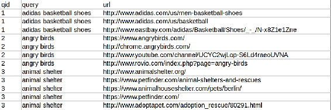

# 七、极限梯度提升

到目前为止，我们应该已经非常熟悉 Java 中的机器学习和数据科学:我们已经讨论了监督学习和非监督学习，还考虑了机器学习在文本数据中的应用。

在这一章中，我们继续讨论监督机器学习，并将讨论一个在许多监督任务中提供最先进性能的库:XGBoost 和极限梯度提升。我们将会看到一些熟悉的问题，比如预测一个 URL 是否在第一页排名，性能预测，以及搜索引擎的排名，但是这次我们将使用 XGBoost 来解决这个问题。

本章的大纲如下:

*   梯度增压机和 XGBoost
*   安装 XGBoost
*   分类的 XGBoost
*   XGBoost 用于回归
*   XGBoost 用于学习排名

在本章结束时，您将学习如何从源代码构建 XGBoost，并使用它来解决数据科学问题。


# 梯度增压机和 XGBoost

**梯度提升机** ( **GBM** )是一种集合算法。GBM 背后的主要思想是采用一些基本模型，然后将这个模型一遍又一遍地与数据相适应，从而逐步提高性能。它与随机森林模型不同，因为 GBM 试图在每一步改进结果，而随机森林建立多个独立的模型并取其平均值。

GBM 背后的主要思想可以用一个线性回归的例子来很好地说明。要对数据进行几个线性回归，我们可以执行以下操作:

1.  将基础模型与原始数据进行拟合。
2.  取目标值和第一个模型的预测值之间的差(我们称之为步骤 1 的残差),并用它来训练第二个模型。
3.  取步骤 1 的残差和步骤 2 的预测之间的差(这是步骤 2 的残差)并拟合第三个模型。
4.  继续，直到你训练出 *N* 个模型。
5.  对于预测，将所有单个模型的预测相加。

因此，正如你所看到的，在算法的每一步，模型都试图改善前一步的结果，到最后，它会将所有模型合并到最终的模型中。

本质上，任何模型都可以作为基础模型，不仅仅是线性回归。例如，它可以是逻辑回归或决策树。通常，基于树的模型是非常好的，并且在各种问题上表现出优异的性能。当我们在 GBM 中使用树时，整个模型通常被称为**梯度增强树**，根据树的类型，它可以是**梯度增强回归树**或**梯度增强分类树**。

极限梯度提升，简称 **XGBoost** ，或 **XGB** ，是梯度提升机器的一种实现，它提供了一些基础模型，包括决策树。基于树的 XGBoost 模型非常强大:它们不对数据集及其特性中的值的分布做任何假设，它们自然地处理丢失的值，
，并且它们非常快，可以有效地利用所有可用的 CPU。

XGBoost 可以达到优秀的性能，可以从数据中尽可能的压榨。如果你知道举办数据科学竞赛的网站[https://www.kaggle.com/](https://www.kaggle.com/)，那么你可能已经听说过 XGBoost。这是获胜者在他们的解决方案中经常使用的库。当然，它在 Kaggle 之外的表现也一样好，并帮助了许多数据科学家的日常工作。

这个库最初是用 C++编写的，但是也有其他语言的绑定，比如 R 和 Python。最近，Java 的一个包装器也被创建了，在这一章中，我们将看到如何在我们的 Java 应用程序中使用它。这个包装器库叫做 **XGBoost4j，**，它是通过 **Java 本地接口** ( **JNI** )绑定实现的，所以它在底层使用 C++。但是在我们使用它之前，我们需要能够构建和安装它。现在我们来看看如何做到这一点。


# 安装 XGBoost

正如我们已经提到的，XGBoost 是用 C++编写的，有一个 Java 库允许通过 JNI 在 Java 中使用 XGBoost。不幸的是，在撰写本文时，XGBoost4J 在 Maven Central 上不可用，这意味着它需要在本地构建，然后发布到本地 Maven 存储库。有计划将这个库发布到中央存储库，你可以在 https://github.com/dmlc/xgboost/issues/1807 看到进展。

即使当它发布到 Maven Central 时，知道如何构建它以获得具有最新更改和错误修复的最新版本仍然是有用的。因此，让我们看看如何构建 XGBoost 库本身，然后如何为它构建 Java 包装器。关于这一点，你可以遵循 https://xgboost.readthedocs.io/en/latest/build.html 的官方指示，这里我们将给出一个非官方的总结。

XGBoost 主要针对 Linux 系统，所以在 Linux 上构建它是很简单的:

```java
git clone --recursive https://github.com/dmlc/xgboost
cd xgboost
make -j4

```

通过执行前面的命令，我们安装了基本的 XGBoost 库，但是现在我们需要安装 XGBoost4J 绑定。为此，请执行以下步骤:

*   首先，确保设置了`JAVA_HOME`环境变量，并且它指向您的 JDK
*   然后，转到`jvm-packages`目录
*   最后，在这里运行`mvn -DskipTests install`

最后一个命令构建 XGBoost4J JNI 绑定，然后编译 Java 代码并将所有内容发布到本地 Maven 存储库。

现在，为了在我们的项目中使用 XGBoost4J，我们需要做的就是包含以下依赖项:

```java
<dependency>
  <groupId>ml.dmlc</groupId>
  <artifactId>xgboost4j</artifactId>
  <version>0.7</version>
</dependency>

```

OS X 的安装过程非常相似。然而，当涉及到 Windows 时，情况就更复杂了。

要为 Windows 构建它，我们需要首先从 https://sourceforge.net/projects/mingw-w64/下载 64 位 GCC 编译器。安装时，选择`x86_64`架构而不是`i686`很重要，因为 XGBoost 只支持 64 位平台。如果由于某种原因，安装程序不工作，我们可以直接从[https://goo.gl/CVcb8d](https://goo.gl/CVcb8d)下载带有二进制文件的`x86_64-6.2.0-release-posix-seh-rt_v5-rev1.7z`档案，然后解压。

在 Windows 上构建 XGBoost 时，避免在目录名中使用空格是很重要的。因此，最好在根目录下创建一个文件夹，例如`C:/soft`，并从那里执行所有的安装。

接下来，我们克隆 XGBoost 并`make`它。这里我们假设您使用 Git Windows 控制台:

```java
git clone --recursive https://github.com/dmlc/xgboost
PATH=/c/soft/mingw64/bin/:$PATH
alias make='mingw32-make'
cp make/mingw64.mk config.mk
make -j4

```

最后，我们需要构建 XGBoost4J JNI 二进制文件。你需要 JDK 的内容。但是，在 Windows 中有一个问题:默认情况下，JDK 安装到`Program Files`文件夹中，其中有一个空格，这将在安装过程中导致问题。一个可能的解决方案是将 JDK 复制到其他地方。

完成这些之后，我们就可以开始构建库了:

```java
export JAVA_HOME=/c/soft/jdk1.8.0_102
make jvm
cd jvm-packages
mvn -DskipTests install

```

如果您的 Maven 抱怨样式并中止构建，您可以通过传递`-Dcheckstyle.skip`标志来禁用它:

```java
mvn -DskipTests -Dcheckstyle.skip install

```

成功执行这一步后，XGBoost4J 库应该发布到本地 maven 存储库中，我们可以使用之前使用的依赖项。

要测试库是否构建正确，请尝试执行这行代码:

```java
Class<Booster> boosterClass = Booster.class;

```

如果您看到代码正确终止，那么您就准备好了。然而，如果你得到类似于`xgboost4j.dll: Can't find dependent libraries`的消息`UnsatisfiedLinkError`，那么确保`mingw64/bin`文件夹在系统变量`PATH`上。


# 实践中的 XGBoost

在我们成功地构建并安装了这个库之后，我们可以用它来创建机器学习模型，在这一章中，我们将讨论三种情况:二进制分类、回归和学习对模型进行排序。我们还将讨论熟悉的用例:预测一个 URL 是否在第一页或搜索引擎结果中，预测计算机的性能，以及为我们自己的搜索引擎排名。


# 分类的 XGBoost

现在让我们最后用它来解决一个分类问题！
在[第四章](24f23333-1326-47d1-9cb2-9ab9c53f82e8.xhtml)、*监督学习-分类和回归*中，我们试图预测一个 URL 是否有可能出现在搜索结果的第一页。之前，我们创建了一个特殊的对象来保存这些特性:

```java
public class RankedPage {
    private String url;
    private int position;
    private int page;
    private int titleLength;
    private int bodyContentLength;
    private boolean queryInTitle;
    private int numberOfHeaders;
    private int numberOfLinks;
    public boolean isHttps();
    public boolean isComDomain();
    public boolean isOrgDomain();
    public boolean isNetDomain();
    public int getNumberOfSlashes();
}

```

如您所见，有许多功能，但没有一个真正涉及到文本。如果你还记得的话，有了这些特性，我们在一个测试集上实现了大约 0.58 的 AUC。
首先，让我们试着用 XGBoost 重现这个结果。因为这是一个二元分类，我们将目标参数设置为`binary:logistic`，由于我们上次使用 AUC 进行评估，我们将坚持这一选择，并将`eval_metric`设置为`auc`。我们通过地图设置参数:

```java
Map<String, Object> params = new HashMap<>();
params.put("objective", "binary:logistic");
params.put("eval_metric", "logloss");
params.put("nthread", 8);
params.put("seed", 42);
params.put("silent", 1);

// default values:
params.put("eta", 0.3);
params.put("gamma", 0);
params.put("max_depth", 6);
params.put("min_child_weight", 1);
params.put("max_delta_step", 0);
params.put("subsample", 1);
params.put("colsample_bytree", 1);
params.put("colsample_bylevel", 1);
params.put("lambda", 1);
params.put("alpha", 0);
params.put("tree_method", "approx");

```

这里，除了物镜、`eval_metric`、`nthread`、`seed`和`silent`之外，大多数参数都被设置为默认值。

如您所见，XGBoost 是梯度增强机器算法的一个非常可配置的实现，有许多参数我们可以更改。我们不会在这里包括所有的参数；完整列表可以参考[https://github . com/dmlc/xgboost/blob/master/doc/parameter . MD](https://github.com/dmlc/xgboost/blob/master/doc/parameter.md)的官方文档。在本章中，我们将只使用基于树的方法，所以让我们回顾一下它们的一些参数:

| **参数名称** | **范围** | **描述** |
| `nthread` | 1 及以上 | 这是构建树时要使用的线程数 |
| `eta` | 从 0 到 1 | 这是集合中每个模型的权重 |
| `max_depth` | 1 及以上 | 这是每棵树的最大深度 |
| `min_child_weight` | 1 及以上 | 这是每片叶子的最小观察值 |
| `subsample` | 从 0 到 1 | 这是每一步要用的观察值的一部分 |
| `colsample_bytree` | 从 0 到 1 | 这是每一步要使用的功能的一部分 |
| `objective` |  | 这定义了任务(回归或分类) |
| `eval_metric` |  | 这是任务的评估指标 |
| `seed` | 整数 | 这为再现性埋下了种子 |
| `silent` | 0 或 1 | 这里，1 在训练期间关闭调试输出 |

然后，我们读取数据并创建训练集、验证集和测试集。我们已经为此准备了特殊的函数，我们也将在这里使用:

```java
Dataset dataset = readData();

Split split = dataset.trainTestSplit(0.2);
Dataset trainFull = split.getTrain();
Dataset test = split.getTest();

Split trainSplit = trainFull.trainTestSplit(0.2);
Dataset train = trainSplit.getTrain();
Dataset val = trainSplit.getTest();

```

之前，我们将标准化(或 Z 分数转换)应用于我们的数据。对于基于树的算法，包括 XGBoost，这是不需要的:这些方法对这种单调变换不敏感，所以我们可以跳过这一步。

接下来，我们需要将数据集包装成 XGBoost 的内部格式:`DMatrix`。让我们为此创建一个实用方法:

```java
public static DMatrix wrapData(Dataset data) throws XGBoostError {
    int nrow = data.length();
    double[][] X = data.getX();
    double[] y = data.getY();

    List<LabeledPoint> points = new ArrayList<>();

    for (int i = 0; i < nrow; i++) {
        float label = (float) y[i];
        float[] floatRow = asFloat(X[i]);
        LabeledPoint point = LabeledPoint.fromDenseVector(label, floatRow);
        points.add(point);
    }

    String cacheInfo = "";
    return new DMatrix(points.iterator(), cacheInfo);
}

```

现在我们可以用它来包装数据集:

```java
DMatrix dtrain = XgbUtils.wrapData(train);
DMatrix dval = XgbUtils.wrapData(val);

```

XGBoost 为我们提供了一种便捷的方式，通过所谓的监视列表来监控模型的性能。本质上，这类似于学习曲线，我们可以看到评估指标在每一步是如何发展的。如果在培训过程中，我们看到培训和评估指标的值明显不同，那么这可能表明我们可能会过度适应。同样，如果在某个步骤中，验证指标开始下降，而训练指标值持续增加，那么我们会过度拟合。

观察列表是通过映射定义的，在映射中，我们将某个名称与我们感兴趣的每个数据集相关联:

```java
Map<String, DMatrix> watches = ImmutableMap.of("train", dtrain, "val", dval);

```

现在我们准备训练一个 XGBoost 模型:

```java
int nrounds = 30;
IObjective obj = null;
IEvaluation eval = null;
Booster model = XGBoost.train(dtrain, params, nrounds, watches, obj, eval);

```

可以在 XGBoost 中提供定制的目标和评估函数，但是因为我们只使用标准的，所以这些参数被设置为 null。

正如我们所讨论的，可以通过观察列表来监控训练过程，这是您将在训练过程中看到的内容:在每一步，它将对所提供的数据集计算评估函数，并将值输出到控制台:

```java
[0]    train-auc:0.735058    val-auc:0.533165
[1]    train-auc:0.804517    val-auc:0.576641
[2]    train-auc:0.842617    val-auc:0.561298
[3]    train-auc:0.860178    val-auc:0.567264
[4]    train-auc:0.875294    val-auc:0.570171
[5]    train-auc:0.888918    val-auc:0.575836
[6]    train-auc:0.896271    val-auc:0.573969
[7]    train-auc:0.904762    val-auc:0.577094
[8]    train-auc:0.907462    val-auc:0.580005
[9]    train-auc:0.911556    val-auc:0.580033
[10]    train-auc:0.922488    val-auc:0.575021
[11]    train-auc:0.929859    val-auc:0.579274
[12]    train-auc:0.934084    val-auc:0.580852
[13]    train-auc:0.941198    val-auc:0.577722
[14]    train-auc:0.951749    val-auc:0.582231
[15]    train-auc:0.952837    val-auc:0.579925

```

如果在训练期间，我们想要构建大量的树，那么消化从控制台输出的文本是很困难的，而可视化这些曲线通常会有所帮助。然而，在我们的例子中，我们只有 30 次迭代，所以可以对性能做出一些判断。如果我们仔细观察，我们可能会注意到，在步骤 8 中，验证分数停止增加，而训练分数仍然越来越好。我们可以由此得出的结论是，在某个点上，它开始过度拟合。为了避免这种情况，我们在进行预测时只能使用前九棵树:

```java
boolean outputMargin = true;
int treeLimit = 9;
float[][] res = model.predict(dval, outputMargin, treeLimit);

```

请注意两点:

*   如果我们将`outputMargin`设置为 false，那么将返回未标准化的值，而不是概率。将其设置为 true 会将逻辑转换应用于值，并确保结果看起来像概率。
*   结果是一个二维的 floats 数组，而不是一维的 doubles 数组。

让我们写一个将这些结果转换成双精度的效用函数:

```java
public static double[] unwrapToDouble(float[][] floatResults) {
    int n = floatResults.length;
    double[] result = new double[n];
    for (int i = 0; i < n; i++) {
        result[i] = floatResults[i][0];
    }
    return result;
}

```

现在，我们可以使用之前开发的其他方法，例如，检查 AUC 的方法:

```java
double[] predict = XgbUtils.unwrapToDouble(res);
double auc = Metrics.auc(val.getY(), predict);
System.out.printf("auc: %.4f%n", auc);

```

如果我们没有在 predict 中指定树的数量，那么默认情况下，它会使用所有可用的树并执行值的规范化:

```java
float[][] res = model.predict(dval);
double[] predict = unwrapToDouble(res);
double auc = Metrics.auc(val.getY(), predict);
System.out.printf("auc: %.4f%n", auc);

```

在前面的章节中，我们已经为 K-Fold 交叉验证创建了一些代码。我们也可以在这里使用它:

```java
int numFolds = 3;
List<Split> kfold = trainFull.kfold(numFolds);
double aucs = 0;

for (Split cvSplit : kfold) {
    DMatrix dtrain = XgbUtils.wrapData(cvSplit.getTrain());

    Dataset validation = cvSplit.getTest();
    DMatrix dval = XgbUtils.wrapData(validation);
    Map<String, DMatrix> watches = ImmutableMap.of("train", dtrain, "val", dval);

    Booster model = XGBoost.train(dtrain, params, nrounds, watches, obj, eval);
    float[][] res = model.predict(dval);
    double[] predict = unwrapToDouble(res);

    double auc = Metrics.auc(validation.getY(), predict);
    System.out.printf("fold auc: %.4f%n", auc);
    aucs = aucs + auc;
}

aucs = aucs / numFolds;
System.out.printf("cv auc: %.4f%n", aucs);

```

然而，XGBoost 具有执行交叉验证的内置功能:我们所需要做的就是提供`DMatrix`，然后它将分割数据并自动运行评估。下面是我们如何使用它:

```java
DMatrix dtrainfull = wrapData(trainFull);
int nfold = 3;
String[] metric = {"auc"};
XGBoost.crossValidation(dtrainfull, params, nrounds, nfold, metric, obj, eval);

```

我们将看到以下评估日志:

```java
[0]    cv-test-auc:0.556261    cv-train-auc:0.714733
[1]    cv-test-auc:0.578281    cv-train-auc:0.762113
[2]    cv-test-auc:0.584887    cv-train-auc:0.792096
[3]    cv-test-auc:0.592273    cv-train-auc:0.824534
[4]    cv-test-auc:0.593516    cv-train-auc:0.841793
[5]    cv-test-auc:0.593855    cv-train-auc:0.856439
[6]    cv-test-auc:0.593967    cv-train-auc:0.875119
[7]    cv-test-auc:0.588910    cv-train-auc:0.887434
[8]    cv-test-auc:0.592887    cv-train-auc:0.897417
[9]    cv-test-auc:0.589738    cv-train-auc:0.906296
[10]   cv-test-auc:0.588782    cv-train-auc:0.915271
[11]   cv-test-auc:0.586081    cv-train-auc:0.924716
[12]   cv-test-auc:0.586461    cv-train-auc:0.935201
[13]   cv-test-auc:0.584988    cv-train-auc:0.940725
[14]   cv-test-auc:0.586363    cv-train-auc:0.945656
[15]   cv-test-auc:0.585908    cv-train-auc:0.951073

```

在我们选择了最佳参数(本例中为树的数量)后，我们可以对整个训练数据部分重新训练模型，然后在测试中对其进行评估:

```java
int bestNRounds = 9;
Map<String, DMatring> watches = Collections.singletonMap("dtrainfull", dtrainfull);

Booster model = XGBoost.train(dtrainfull, params, bestNRounds, watches, obj, eval);

DMatrix dtest = XgbUtils.wrapData(test);
float[][] res = model.predict(dtest);
double[] predict = XgbUtils.unwrapToDouble(res);

double auc = Metrics.auc(test.getY(), predict);
System.out.printf("final auc: %.4f%n", auc);

```

最后，我们可以保存模型并在以后使用它:

```java
Path path = Paths.get("xgboost.bin");
try (OutputStream os = Files.newOutputStream(path)) {
    model.saveModel(os);
}

```

读取保存的模型也很简单:

```java
Path path = Paths.get("xgboost.bin");
try (InputStream is = Files.newInputStream(path)) {
     Booster model = XGBoost.loadModel(is);
}

```

这些模型与其他 XGBoost 绑定兼容。因此，我们可以用 Python 或 R 训练一个模型，然后将其导入 Java——或者反过来。

这里，我们仅使用默认参数，这些参数通常并不理想。让我们看看如何修改它们以获得最佳性能。


# 参数调谐

到目前为止，我们已经讨论了使用 XGBoost 执行交叉验证的三种方法:保留数据集、手动 K 折叠和 XGBoost K 折叠。这些方法中的任何一种都可以用来选择最佳性能。

来自 XGBoost 的实现通常更适合这个任务，因为它们可以显示每一步的性能，并且一旦发现学习曲线偏离太多，可以手动停止训练过程。

如果您的数据集相对较大(例如，超过 100k 个示例)，那么简单地选择一个拒绝的数据集可能是最好和最快的选择。另一方面，如果您的数据集较小，执行 *K* -Fold 交叉验证可能是个好主意。

一旦我们决定了验证方案，我们就可以开始调整模型了。由于 XGBoost 有很多参数，这是一个相当复杂的问题，因为尝试所有可能的组合在计算上是不可行的。然而，有一些方法可能有助于获得相当好的性能。

一般的方法是一次改变一个参数，然后使用观察列表运行训练过程。这样做时，我们会密切监视验证值，并记录最大值。最后，我们选择给出最佳验证性能的参数组合。如果两个组合提供了可比较的性能，那么我们应该选择更简单的一个(例如，深度较浅，树叶中有更多实例，等等)。

下面是一个调整参数的算法:

1.  首先，为树的数量选择一个非常大的值，比如 2，000 或 3，000。当您看到验证分数停止增长或开始下降时，千万不要增长所有这些树并停止训练过程。
2.  采用默认参数，一次更改一个参数。
3.  如果你的数据集很小，在开始时选择一个更小的`eta`可能是有意义的，例如 0.1。如果数据集足够大，那么默认值就可以了。
4.  首先，我们调整`depth`参数。使用默认值(6)训练模型，然后尝试使用小值(3)和大值(10)。根据哪个表现更好，往合适的方向走。
5.  一旦确定了树的深度，尝试改变`subsample`参数。首先，尝试默认值(1)，然后尝试将其减少到 0.8、0.6 和 0.4，然后将其移动到适当的方向。通常，0.6-0.7 左右的值相当好。
6.  接下来，调`colsample_bytree`。该方法与二次抽样的方法相同，0.6-0.7 左右的值也能很好地工作。
7.  现在，我们调整`min_child_weight.`你可以尝试 10，20，50 这样的值，然后移动到合适的方向。
8.  最后，将`eta`设置为某个小值(比如 0.01、0.05 或 0.1，这取决于数据集的大小)，并查看验证性能停止增长的迭代次数。使用此数字选择最终模型的迭代次数。

有其他方法可以做到这一点。例如:

*   将`depth`初始化为 10，`eta`初始化为 0.1，`min_child_weight`初始化为 5
*   如前所述，首先通过尝试更小和更大的值来找到最佳的`depth`
*   然后，调整`subsample`参数
*   之后，调`min_child_weight`
*   最后一个要调整的参数是`colsample_bytree`
*   最后，我们将`eta`设置为一个较小的数字，并观察验证性能来选择树的数量

这些都是简单的试探法，不涉及许多可用的参数，但它们仍然可以给出一个相当好的模型。您还可以调整正则化参数，如`gamma`、`alpha`和`beta`。例如，对于较高的`depth`值(大于 10)，您可能希望稍微增加`gamma`参数，看看会发生什么。

不幸的是，这些算法都不能 100%保证找到最佳解决方案，但你应该尝试一下，找到你个人最喜欢的一个——它可能是这些算法的组合，甚至可能是完全不同的。

如果您没有大量数据，并且不想手动调整参数，那么可以尝试随机设置参数，重复多次，并基于交叉验证选择最佳模型。这被称为随机搜索参数优化:它不需要手动调整，并且在实践中通常工作良好。

开始的时候可能看起来很困难，所以不要担心。在做了几次之后，你会对这些参数如何相互依赖以及什么是调整它们的最佳方式有一些直觉。


# 文本特征

在前一章中，我们学习了很多可以应用于文本数据的东西，并在构建搜索引擎时使用了一些想法。让我们将这些特征纳入我们的模型，看看我们的 AUC 如何变化。

回想一下，我们之前创建了这些功能:

*   查询和文档的文本字段(如标题、正文内容以及 h1、h2 和 h3 标题)之间的 TF-IDF 空间中的余弦相似性
*   查询和所有其他文本字段之间的 LSA 相似性

我们在上一章中也使用了手套功能，但是我们在这里将跳过它们。此外，我们不会在本章中包括前面功能的实现。有关如何操作的信息，请参考[第 6 章](43d5078e-805b-4e29-a527-ed11fa96c4b2.xhtml)、*使用文本-自然语言处理和信息检索*。

一旦我们添加了特性，我们就可以对参数进行一些调整了。例如，我们最终可以使用这些参数:

```java
Map<String, Object> params = XgbUtils.defaultParams();
params.put("eval_metric", "auc");
params.put("colsample_bytree", 0.5);
params.put("max_depth", 3);
params.put("min_child_weight", 30);
params.put("subsample", 0.7);
params.put("eta", 0.01);

```

这里，`XgbUtils.defaultParams()`是一个 helper 函数，它创建一个 map，其中的一些参数设置为它们的默认值，然后我们可以修改其中的一些参数。例如，由于性能不是很好，这里很容易过度拟合，我们生长深度为 3 的较小的树，并要求在叶节点中至少有 30 个观察值。最后，我们将学习率参数`eta`设置为一个小值，因为数据集不是很大。

有了这些特征，我们现在可以实现 64.4%的 AUC。这离好的性能还差得很远，但是比没有任何特性的前一个版本提高了 5%，这是一个相当大的进步。

为了避免重复，我们省略了许多代码。如果你觉得有点迷茫，随时欢迎查看章节的代码包了解详情。


# 特征重要性

最后，我们还可以看到哪些特性对模型的贡献最大，哪些不太重要，并根据它们的性能对我们的特性进行排序。XGBoost 实现了一个这样的特性的重要度量，称为 **FScore，**，它是一个特性被模型使用的次数。

要提取 FScore，我们首先需要创建一个特性映射:一个包含特性名称的文件:

```java
List<String> featureNames = columnNames(dataframe);
String fmap = "feature_map.fmap";
try (PrintWriter printWriter = new PrintWriter(fileName)) {
    for (int i = 0; i < featureNames.size(); i++) {
        printWriter.print(i);
        printWriter.print('t');
        printWriter.print(featureNames.get(i));
        printWriter.print('t');
        printWriter.print("q");
        printWriter.println();
    }
}

```

在这段代码中，我们首先调用函数`columnNames`(此处不存在)，它从 joinery 数据帧中提取列名。然后，我们创建一个文件，在每一行我们首先打印特性名称，然后是一个字母`q`，这意味着该特性是定量的，而不是一个`i`指标。

然后，我们调用一个名为`getFeatureScore`的方法，该方法获取特征映射文件并返回特征在映射中的重要性。得到它后，我们可以根据它们的值对地图条目进行排序，这将产生一个按重要性排序的要素列表:

```java
Map<String, Integer> scores = model.getFeatureScore(fmap);
Comparator<Map.Entry<String, Integer>> byValue = Map.Entry.comparingByValue();
scores.entrySet().stream().sorted(byValue.reversed()).forEach(System.out::println);

```

对于具有文本特征的分类模型，它将产生以下输出:

```java
numberOfLinks=17
queryBodyLsi=15
queryTitleLsi=14
bodyContentLength=13
numberOfHeaders=10
queryBodySimilarity=10
urlLength=7
queryTitleSimilarity=6
https=3
domainOrg=1
numberOfSlashes=1

```

我们看到这些新特性对模型非常重要。我们也看到像`domainOrg`或`numberOfSlashes`这样的特性很少被使用，我们包含的许多特性甚至不在这个列表中。这意味着我们可以安全地从我们的模型中排除这些特征，并在没有它们的情况下重新训练模型。

FScore 不是基于树的方法唯一可用的特性重要性度量，但是 XGBoost 库只提供这个分数。有一些外部库，比如 XGBFI([https://github.com/Far0n/xgbfi](https://github.com/Far0n/xgbfi))，它们可以使用模型转储来计算增益、加权 FScore 等指标，而且这些分数通常会提供更多信息。

XGBoost 不仅在分类方面很好，在回归方面也很出色。接下来，我们将看到如何使用 XGBoost。


# XGBoost 用于回归

梯度提升是一个非常通用的模型:它可以处理分类和回归任务。要使用它来解决回归问题，我们需要做的就是改变目标和评估标准。

对于二进制分类，我们使用了`binary:logistic`目标，但是对于回归，我们只是将其更改为`reg:linear`。谈到评估，有以下内置评估指标:

*   均方根误差(设置`eval_metric`至`rmse`
*   平均绝对偏差(设置`eval_metric`至`mae`

除了这些变化之外，基于树的模型的其他参数是完全相同的！我们可以遵循相同的方法来调整参数，只是现在我们将监视一个不同的指标。

在[第 4 章](24f23333-1326-47d1-9cb2-9ab9c53f82e8.xhtml)、*监督学习-分类和回归*中，我们使用了矩阵乘法性能数据来说明回归问题。让我们再次使用同一个数据集，这次使用 XGBoost 来构建模型。

为了加快速度，我们可以从[第五章](e4294e91-73ee-46ca-8fb5-eb6183c0e361.xhtml)、*无监督学习-聚类和降维*中获取缩减的数据集。然而，在[第 6 章](43d5078e-805b-4e29-a527-ed11fa96c4b2.xhtml)、*处理文本自然语言处理和信息检索*中，我们为 SVD 创建了一个特殊的类:`TruncatedSVD`。所以，让我们用它来降低这个数据集的维数:

```java
Dataset dataset = ... // read the data
StandardizationPreprocessor preprocessor = StandardizationPreprocessor.train(dataset);
dataset = preprocessor.transform(dataset);

Split trainTestSplit = dataset.shuffleSplit(0.3);
Dataset allTrain = trainTestSplit.getTrain();
Split split = allTrain.trainTestSplit(0.3);
Dataset train = split.getTrain();
Dataset val = split.getTest();

TruncatedSVD svd = new TruncatedSVD(100, false)
svd.fit(train);

train = dimred(train, svd);
val = dimred(val, svd);

```

你应该还记得[第 5 章](e4294e91-73ee-46ca-8fb5-eb6183c0e361.xhtml)、*无监督学习-聚类和降维*中的内容，如果我们要通过 SVD 用 PCA 降低数据集的维度，我们需要在此之前标准化数据，下面是我们读取数据后发生的情况。我们进行通常的训练-验证-测试分离，并减少所有数据集的维度。`dimred`函数只是包装从 SVD 调用`transform`方法，然后将结果放回一个`Dataset`类。

现在，让我们使用 XGBoost:

```java
DMatrix dtrain = XgbUtils.wrapData(train);
DMatrix dval = XgbUtils.wrapData(val);
Map<String, DMatrix> watches = ImmutableMap.of("train", dtrain, "val", dval);
IObjective obj = null;
IEvaluation eval = null;

Map<String, Object> params = XgbUtils.defaultParams();
params.put("objective", "reg:linear");
params.put("eval_metric", "rmse");
int nrounds = 100;

Booster model = XGBoost.train(dtrain, params, nrounds, watches, obj, eval);

```

在这里，我们将数据集包装到`DMatrix`中，然后创建一个观察列表，最后将`objective`和`eval_metric`参数设置为合适的值。现在我们可以训练模型了。

让我们来看看监视列表的输出(为了简洁起见，我们将只显示每 10 条记录):

```java
[0]    train-rmse:21.223036    val-rmse:18.009176
[9]    train-rmse:3.584128    val-rmse:5.860992
[19]    train-rmse:1.430081    val-rmse:5.104758
[29]    train-rmse:1.117103    val-rmse:5.004717
[39]    train-rmse:0.914069    val-rmse:4.989938
[49]    train-rmse:0.777749    val-rmse:4.982237
[59]    train-rmse:0.667336    val-rmse:4.976982
[69]    train-rmse:0.583321    val-rmse:4.967544
[79]    train-rmse:0.533318    val-rmse:4.969896
[89]    train-rmse:0.476646    val-rmse:4.967906
[99]    train-rmse:0.422991    val-rmse:4.970358

```

我们可以看到，验证误差在第 50 棵树附近停止下降，然后又开始增加。因此，让我们将模型限制为 50 棵树，并将此模型应用于测试数据:

```java
DMatrix dtrainall = XgbUtils.wrapData(allTrain);
watches = ImmutableMap.of("trainall", dtrainall);
nrounds = 50;
model = XGBoost.train(dtrainall, params, nrounds, watches, obj, eval);

```

然后，我们可以将该模型应用于测试数据，并查看最终性能:

```java
Dataset test = trainTestSplit.getTest();
double[] predict = XgbUtils.predict(model, test);
double testRmse = rmse(test.getY(), predict);
System.out.printf("test rmse: %.4f%n", testRmse);

```

这里，`XgbUtils.predict`将一个数据集转换成`DMatrix`，然后调用 predict 方法，最后将 floats 数组转换成 doubles。执行代码后，我们将看到以下内容:

```java
test rmse: 4.2573

```

回想一下，以前它大约是 15，所以使用 XGBoost 比使用线性回归好三倍多！

注意，在原始数据集中有分类变量，当我们使用 One-Hot-Encoding(通过来自 joinery 数据框的`toModelMatrix`方法)时，得到的矩阵是稀疏的。此外，我们然后用 PCA 压缩这个数据。但是，XGBoost 也可以处理稀疏数据，所以我们用这个例子来说明如何做到这一点。

在[第 5 章](e4294e91-73ee-46ca-8fb5-eb6183c0e361.xhtml)、*无监督学习——聚类和维度缩减*中，我们创建了一个用于执行 One-Hot-Encoding 的类:我们使用它将分类变量从 Smile 转换为`SparseDataset`类的对象。现在我们可以使用这个方法来创建这样的`SparseDataset`，然后从它为 XGBoost 构造一个`DMatrix`对象。

因此，让我们创建一个将`SparseDataset`转换成`DMatrix`的方法:

```java
public static DMatrix wrapData(SparseDataset data) {
    int nrow = data.size();
    List<LabeledPoint> points = new ArrayList<>();

    for (int i = 0; i < nrow; i++) {
        Datum<SparseArray> datum = data.get(i);
        float label = (float) datum.y;
        SparseArray array = datum.x;

        int size = array.size();
        int[] indices = new int[size];
        float[] values = new float[size];

        int idx = 0;
        for (Entry e : array) {
            indices[idx] = e.i;
            values[idx] = (float) e.x;
            idx++;
        }

        LabeledPoint point = 
                LabeledPoint.fromSparseVector(label, indices, values);
        points.add(point);
    }

    String cacheInfo = "";
    return new DMatrix(points.iterator(), cacheInfo);
}

```

这里，代码与我们用于密集矩阵的代码非常相似，但是现在我们调用`fromSparseVector`工厂方法而不是`fromDenseVector`。为了使用它，我们将`SparseDataset`的每一行转换成一个索引数组和值数组，然后用它们创建一个`LabeledPoint`实例，我们用它来创建一个`DMatrix`实例。

转换之后，我们在其上运行 XGBoost 模型:

```java
SparseDataset sparse = readData();
DMatrix dfull = XgbUtils.wrapData(sparse);

Map<String, Object> params = XgbUtils.defaultParams();
params.put("objective", "reg:linear");
params.put("eval_metric", "rmse");

int nrounds = 100;
int nfold = 3;
String[] metric = {"rmse"};
XGBoost.crossValidation(dfull, params, nrounds, nfold, metric, null, null);

```

当我们运行这个时，我们看到 RMSE 达到 17.549534，之后就再也没有下降。这是意料之中的，因为我们只有一小部分功能；这些特征都是绝对的，而且并不是所有的特征都能提供很多信息。不过，这很好地说明了我们如何将 XGBoost 用于稀疏数据集。

除了分类和回归，XGBoost 还为创建排名模型提供了特殊的支持，现在我们将看看如何使用它。


# XGBoost 用于学习排名

我们的搜索引擎变得非常强大。以前，我们使用 Lucene 来快速检索文档，然后使用机器学习模型来重新排序它们。通过这样做，我们解决了一个排名问题。在给出一个查询和一组文档之后，我们需要对所有文档进行排序，使得与查询最相关的文档具有最高的等级。

以前，我们将这个问题作为分类来处理:我们建立了一个二元分类模型来分离相关和不相关的文档，并使用文档相关的概率来进行排序。这种方法在实践中相当有效，但是有一个限制:它一次只考虑一个元素，并且将其他文档完全隔离。换句话说，当决定一个文档是否相关时，我们只看这个特定文档的特征，而不看其他文档的特征。

相反，我们可以做的是查看文档相对于彼此的位置。然后，对于每个查询，我们可以形成一个文档组，我们考虑这个特定的查询，并优化所有这些组内的排名。

**LambdaMART** 是运用这一理念的一款车型的名字。它查看文档对，并考虑文档对中文档的相对顺序。如果顺序是错误的(一个不相关的文档比一个相关的文档排名更高)，那么模型引入一个惩罚，并且在训练期间我们想要使这个惩罚尽可能小。

LambdaMART 中的 MART 代表**多元可加回归树**，所以是基于树的方法。XGBoost 也实现了这个算法。要使用它，我们将目标设置为`rank:pairwise`，然后将评估标准设置为以下之一:

*   `ndcg`:表示归一化贴现累计收益
*   `ndcg@n`:在 *N* 的 NDCG 是列表的第一个 *N* 元素，并在上面评估 NDCG
*   `map`:表示平均精度
*   `map@n`:这是在每个组的第一个 *N 个*元素处评估的地图

出于我们的目的，详细了解这些指标做什么并不重要；现在，知道一个指标的值越高越好就足够了。然而，这两种度量之间有一个重要的区别:MAP 只能处理二进制(0/1)标签，而 NDCG 可以处理序数(0，1，2，...)标签。

当我们构建分类器时，我们只有两个标签:阳性(`1`)和阴性(`0`)。扩展标签以包括更多相关度可能是有意义的。例如，我们可以按以下方式分配标签:

*   首先，3 个 URL 的相关性为 3
*   第一页上的其他 URL 的相关性为 2
*   第二页和第三页上剩余的相关 URL 的相关性为 1
*   所有不相关的文档都标有 0

正如我们已经提到的，NDCG 可以处理这样的序数标签，所以我们将使用它进行评估。为了实现这个相关性赋值，我们可以使用之前使用的`RankedPage`类，并创建以下方法:

```java
private static int relevanceLabel(RankedPage page) {
    if (page.getPage() == 0) {
        if (page.getPosition() < 3) {
            return 3;
        } else {
            return 2;
        }
    }

    return 1;
}

```

我们可以对一个查询中的所有文档使用这种方法，而对所有其他文档，我们只需指定相关性为 0。除了这个方法之外，用于创建和提取特征的其余代码保持不变，因此为了简洁起见，我们将省略这些代码。

一旦数据准备好了，我们就将`Dataset`包装到`DMatrix`中。当这样做时，我们需要指定组，在每个组中我们将优化排名。在我们的例子中，我们通过查询对数据进行分组。

XGBoost 希望属于同一个组的对象顺序连续，所以它需要一个组大小的数组。例如，假设我们的数据集中有 12 个对象:4 个来自组 1，3 个来自组 2，5 个来自组 3:


然后，size 数组应该包含这些组的大小:`[4, 3, 5]`。

这里，`qid`是查询的 ID:一个整数，我们将它与每个查询关联起来:



让我们首先创建一个用于计算数组大小的效用函数:

```java
private static int[] groups(List<Integer> queryIds) {
    Multiset<Integer> groupSizes = LinkedHashMultiset.create(queryIds);
    return groupSizes.entrySet().stream().mapToInt(e -> e.getCount()).toArray();
}

```

这个方法接受一个查询 ID 列表，然后计算每个 ID 出现的次数。为此，我们使用了来自番石榴的 multiset。multiset 的这种特殊实现记住了元素插入的顺序，因此当取回计数时，顺序被保留。

现在，我们可以为两个数据集指定组大小:

```java
DMatrix dtrain = XgbUtils.wrapData(trainDataset);
int[] trainGroups = queryGroups(trainFeatures.col("queryId"));
dtrain.setGroup(trainGroups);

DMatrix dtest = XgbUtils.wrapData(testDataset);
int[] testGroups = queryGroups(testFeatures.col("queryId"));
dtest.setGroup(testGroups);

```

我们准备训练一个模型:

```java
Map<String, DMatrix> watches = ImmutableMap.of("train", dtrain, "test", dtest);
IObjective obj = null;
IEvaluation eval = null;

Map<String, Object> params = XgbUtils.defaultParams();
params.put("objective", "rank:pairwise");
params.put("eval_metric", "ndcg@30");

int nrounds = 500;
Booster model = XGBoost.train(dtrain, params, nrounds, watches, obj, eval);

```

在这里，我们将目标改为`rank:pairwise`，因为我们对解决排名问题感兴趣。我们还将评估指标设置为`ndcg@30`，这意味着我们只想查看前 30 个文档的 NDCG，并不真正关心 30 个之后的文档。其原因是搜索引擎的用户很少查看搜索结果的第二页和第三页，并且他们很可能会越过第三页，因此我们只考虑搜索结果的前三页。也就是说，我们只对前 30 个文档感兴趣，所以我们只查看 30 个文档中的 NDCG。

正如我们之前所做的，我们从默认参数开始，并经历与分类或回归相同的参数调整过程。

我们可以对其进行一些调整，例如，使用以下参数:

```java
Map<String, Object> params = XgbUtils.defaultParams();
params.put("objective", "rank:pairwise");
params.put("eval_metric", "ndcg@30");
params.put("colsample_bytree", 0.5);
params.put("max_depth", 4);
params.put("min_child_weight", 30);
params.put("subsample", 0.7);
params.put("eta", 0.02);

```

有了这组参数，我们看到，在大约第 220 次迭代时达到了保留数据的 0.632 的最佳 NDCG@30，因此我们不应该生长超过 220 棵树。

现在我们可以用 XGBoost 模型转储器保存模型，并在 Lucene 中使用它。为此，我们需要使用和以前一样的代码，几乎不做任何改动；我们唯一需要改变的是模型。也就是说，唯一的区别是，我们需要加载 XGBoost 模型，而不是加载随机的森林模型。之后，我们只需遵循相同的过程:用 Lucene 检索前 100 个文档，并用新的 XGBoost 模型对它们重新排序。

因此，使用 XGBoost，我们能够考虑每个查询组中文档的相对顺序，并使用这些信息进一步改进模型。


# 摘要

在这一章中，我们学习了极限梯度提升——梯度提升机器的一种实现。我们学习了如何安装库，然后我们申请解决各种监督学习问题:分类、回归和排序。

当数据结构化时，XGBoost 大放异彩:当有可能从我们的数据中提取好的特征并将这些特征放入表格格式时。然而，在某些情况下，数据很难结构化。比如在处理图像或者声音的时候，需要付出很大的努力来提取有用的特征。但是，我们不一定要自己进行特征提取，相反，我们可以使用神经网络模型，它可以自己学习最佳特征。

在下一章，我们将看看 deep learning 4j——一个面向 Java 的深度学习库。