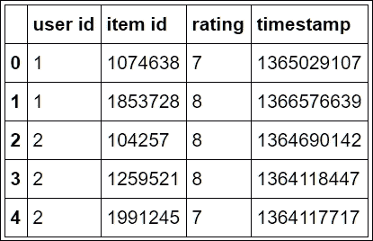
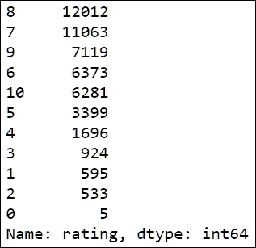
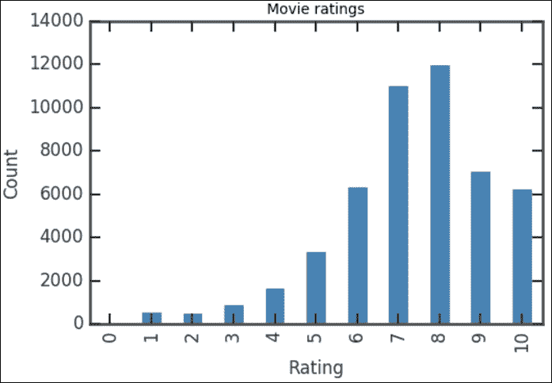
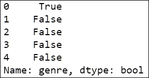
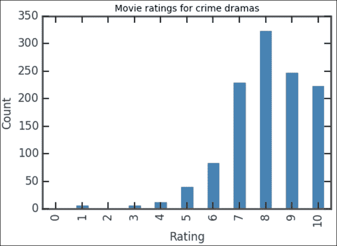

# 第一章。贸易工具

本章向您概述了 Python 中可用于数据分析的工具，并详细介绍了将在本书中使用的 Python 包和库。给出了一些安装技巧，本章以一个简单的例子结束。我们将专注于如何读取数据文件，选择数据，并产生简单的图，而不是钻研数字数据分析。

# 开始之前

我们假设您熟悉 Python，并且已经开发并运行了一些脚本或交互使用了 Python，无论是在 shell 中还是在另一个界面上，例如 Jupyter Notebook(以前称为 **IPython notebook** )。因此，我们还假设您有一个运行良好的 Python 安装。在本书中，我们假设您已经安装了 Python 3.4 或更高版本。

我们还假设您已经基于需求和可用环境，使用 Python 开发了自己的工作流。按照本书中的示例，您应该能够访问 Python 3.4 或更高版本的工作安装。有两种方法可以开始，如下表所示:

*   从头开始使用 Python 安装。这个可以从[https://www.python.org](https://www.python.org)下载。这将需要为每个所需的库单独安装。
*   安装包含科学和数据计算库的预打包发行版。两个流行的发行版是 Anaconda 科学巨蟒([https://store.continuum.io/cshop/anaconda](https://store.continuum.io/cshop/anaconda))和 entsuren 发行版([https://www.enthought.com](https://www.enthought.com))。

### 型式

即使您有一个正在运行的 Python 安装，您也可能想要尝试一个预打包的发行版。它们包含适用于数据分析和科学计算的全面的包和模块集合。如果选择此路径，默认情况下将包括下一个列表中的所有库。

我们还假设您拥有以下列表中的库:

*   `numpy`和`scipy`:在[http://www.scipy.org](http://www.scipy.org)都有。这些是计算工作中必不可少的 Python 库。NumPy 定义了一个快速灵活的数组数据结构，SciPy 有大量用于数值计算的函数集合。列表中提到的一些库需要它们。
*   `matplotlib`:这个在[http://matplotlib.org](http://matplotlib.org)有售。这是一个建立在 NumPy 之上的交互式图形库。我推荐高于 1.5 的版本，这是默认情况下包含在 Anaconda Python 中的内容。
*   `pandas`:这个在[http://pandas.pydata.org](http://pandas.pydata.org)有售。它是一个 Python 数据分析库。它将在整本书中广泛使用。
*   `pymc`:这是一个库，让 Python 中的贝叶斯模型和拟合变得简单易懂。在[http://pymc-devs.github.io/pymc/](http://pymc-devs.github.io/pymc/)有售。本包主要用于本书 *[第六章](106.html "Chapter 6. Bayesian Methods")**贝叶斯方法*。
*   `scikit-learn`:这个在[http://scikit-learn.org](http://scikit-learn.org)有售。它是 Python 中的机器学习库。本包用于 *[第七章](107.html "Chapter 7. Supervised and Unsupervised Learning")**监督和非监督学习*。
*   `IPython`:这个在[http://ipython.org](http://ipython.org)有售。它是一个库，从命令行为 Python 中的交互式计算提供了增强的工具。
*   `Jupyter`:这个在[https://jupyter.org/](https://jupyter.org/)有售。它是在 IPython(和其他编程语言)之上工作的笔记本界面。笔记本界面最初是 IPython 项目的一部分，是一个基于网络的计算和数据科学平台，允许轻松集成本书中使用的工具。

请注意，前面列表中的每个库都可能有几个依赖项，这些依赖项也必须单独安装。要测试任何包的可用性，启动一个 Python shell 并运行相应的`import`语句。例如，要测试 NumPy 的可用性，请运行以下命令:

```py
import numpy

```

如果您的系统中没有安装 NumPy，这将产生一条错误消息。另一种不需要启动 Python shell 的方法是运行命令行:

```py
python -c 'import numpy'

```

我们还假设您有一个程序员编辑器或 Python IDE。有几个选项，但在基本层面上，任何能够处理无格式文本文件的编辑器都可以。

# 使用笔记本界面

本书中的大多数示例将使用 Jupyter Notebook 界面。这是一个基于浏览器的界面，集成了计算、图形和其他形式的媒体。笔记本可以轻松共享和发布，例如[http://nbviewer.ipython.org/](http://nbviewer.ipython.org/)提供了简单的发布路径。

然而，使用 Jupyter 接口来运行本书中的示例并不是绝对必要的。但是，我们强烈建议您至少尝试一下笔记本电脑及其许多功能。Jupyter Notebook 接口可以将格式化的描述性文本与同时计算的代码单元格混合在一起。这个特性使它适合于教育目的，但是它对于个人使用也是有用的，因为它使得在编写完整的报告之前更容易添加评论和共享部分进度。我们有时会称 Jupyter 笔记本为笔记本。

要启动笔记本界面，请从 shell 或 Anaconda 命令提示符运行以下命令行:

```py
jupyter notebook

```

笔记本服务器将在发出命令的目录中启动。过一会儿，笔记本界面将出现在您的默认浏览器中。确保您使用的是符合标准的浏览器，例如 Chrome、火狐、Opera 或 Safari。一旦 Jupyter 仪表盘显示在浏览器上，点击页面右上角的**新建**按钮，选择 **Python 3** 。几秒钟后，新笔记本将在浏览器中打开。了解笔记本界面的一个有用的地方是[http://jupyter.org](http://jupyter.org)。

# 进口

在每个项目开始时，我们都需要加载一些模块。假设您运行的是 Jupyter 笔记本，所需的导入如下:

```py
%matplotlib inline
import matplotlib.pyplot as plt
import numpy as np
import pandas as pd

```

在单个笔记本单元格中输入前面的所有命令，然后按 **Shift + Enter** 运行整个单元格。当您正在运行的单元格之后没有单元格时，将创建一个新单元格；但是，如果你想自己创建一个，菜单或快捷键 *Ctrl +M+A/B* 就很方便了(上面的 *A* ，下面的当前单元格 *B* )。在[附录](109.html "Appendix E. More on Jupyter Notebook and matplotlib Styles")、*更多关于 Jupyter 笔记本和 matplotlib 样式*中，我们介绍了 Jupyter 笔记本的一些可用和可安装的键盘快捷键扩展(即插件)。

语句`%matplotlib inline`是 Jupyter Notebook 魔法的一个例子，设置了内嵌显示剧情的界面，即嵌入在笔记本中。脚本中不需要这一行(这会导致错误)。接下来，可选地输入以下命令:

```py
import os
plt.style.use(os.path.join(os.getcwd(), 'mystyle.mplstyle') )

```

如前所述，按*Shift+回车*运行单元格。这段代码有选择 matplotlib 样式表`mystyle.mplstyle`的效果。这是我创建的自定义样式表，它与笔记本位于同一个文件夹中。这是一个可以做什么的相当简单的例子；你可以根据自己的喜好修改它。随着我们在整本书中获得绘制图形的经验，我鼓励您在文件中使用这些设置。还有内置的样式，你可以通过在新的单元格中输入`plt.style.available`来设置。

就是这里！我们都准备好开始有趣的部分了！

# 一个使用Pandas库的例子

这个例子的目的是检查在你的安装中是否一切正常，并给出即将到来的味道。我们专注于Pandas库，这是 Python 数据分析中使用的主要工具。

我们将使用电影网络 50K 电影分级数据集，该数据集可从[https://github.com/sidooms/MovieTweetings](https://github.com/sidooms/MovieTweetings)下载。数据来源于研究《电影网络:从推特上收集的电影分级数据集》，作者是杜姆斯、德·佩塞米尔和马腾斯，在推荐系统众包和人工计算研讨会上发表，该研讨会在 RecSys 的 CrowdRec 上举行(2013 年)。数据集分布在几个文本文件中，但我们将只使用以下两个文件:

*   `ratings.dat`:这是一个双冒号分隔的文件，包含每个用户和电影的评分
*   `movies.dat`:这个文件包含电影的信息

要查看这些文件的内容，可以使用标准文本编辑器打开它们。数据按列组织，每行一个数据项。列的含义在与数据集一起分发的`README.md`文件中描述。数据有一个特殊的方面:一些列使用双冒号(`::`)字符作为分隔符，而其他列使用竖线(`|`)。这强调了现实世界数据中的一个常见现象:我们无法控制数据的收集和格式化方式。对于存储在文本文件中的数据，例如这个，在文本编辑器或电子表格软件中打开文件来查看数据并识别不一致和不规则的地方总是一个好策略。

要读取分级文件，请运行以下命令:

```py
 cols = ['user id', 'item id', 'rating', 'timestamp']
ratings = pd.read_csv('data/ratings.dat', sep='::',
                          index_col=False, names=cols,
                          encoding="UTF-8")

```

第一行代码用数据集中的列名创建一个 Python 列表。下一个命令读取文件，使用`read_csv()`功能，这是Pandas的一部分。这是一个从文本文件中读取面向列的数据的通用函数。调用中使用的参数如下:

*   `data/ratings.dat`:这是包含数据的文件的路径(这个参数是必需的)。
*   `sep='::'`:这是分隔符，这里是双冒号字符。
*   `index_col=False`:我们不希望任何一列作为索引。这将导致数据被从 1 开始的连续整数索引。
*   `names=cols`:这些是要与列关联的名称。

`read_csv()`函数返回一个 DataFrame 对象，这是表示表格数据的 Pandas 数据结构。我们可以使用以下命令查看数据的前几行:

```py
ratings[:5]

```

这将输出一个表格，如下图所示:



要开始处理数据，让我们找出每个评级在表格中出现的次数。这可以通过以下命令来完成:

```py
rating_counts = ratings['rating'].value_counts()
rating_counts

```

第一行代码计算计数并将它们存储在`rating_counts`变量中。为了获得计数，我们首先使用`ratings['rating']`表达式从表评级中选择`rating`列。然后，调用`value_counts()`方法计算计数。请注意，我们在单元格的末尾重新键入了变量名`rating_counts`。这是一个常见的笔记本(和 Python)习惯用法，用于在每个单元格后面的输出区域中打印变量值。在一个剧本里，它没有效果；我们也可以用 print 命令`(print(rating_counts))`来打印它。输出显示在下图中:



请注意，输出按照计数值降序排序。`value_counts`返回的对象是 Series 类型，这是 Pandas 数据结构，用于表示一维、索引的数据。Pandas中广泛使用系列对象。例如，数据框对象的列可以被认为是共享一个公共索引的系列对象。

在我们的例子中，根据评级对行进行排序更有意义。这可以通过以下命令实现:

```py
sorted_counts = rating_counts.sort_index()
sorted_counts

```

这通过调用 Series 对象的`sort_index()`方法`rating_counts`来实现。结果存储在`sorted_counts`变量中。现在，我们可以使用以下命令快速可视化评分分布:

```py
sorted_counts.plot(kind='bar', color='SteelBlue')
plt.title('Movie ratings')
plt.xlabel('Rating')
plt.ylabel('Count')

```

第一行通过调用`sorted_counts`对象的`plot()`方法生成图。我们指定`kind='bar'`选项来生成条形图。请注意，我们添加了`color='SteelBlue'`选项来选择直方图中条形的颜色。`SteelBlue`是 matplotlib 中可用的 HTML5 颜色名称之一(例如，[http://matplotlib.org/examples/color/named_colors.html](http://matplotlib.org/examples/color/named_colors.html))。接下来的三个语句分别设置标题、横轴标签和纵轴标签。这将产生以下图:



竖线显示有多少投票者给出了一定的评分，涵盖了数据库中的所有电影。评级的分布并不十分令人惊讶:计数增加到`8`级，而`9-10`级的计数较小，因为大多数人不愿意给出最高的评级。如果您检查每个等级的条值，您可以看到它对应于我们之前打印`rating_counts`对象时的值。要想知道如果不先对收视率进行排序会发生什么，请绘制`rating_counts`对象，也就是说，在一个单元格中运行`rating_counts.plot(kind='bar', color='SteelBlue')`。

假设我们想知道特定电影类型的收视率分布，比如`Crime Drama`，是否与整体分布相似。我们需要将收视率信息与`movies.dat`文件中包含的电影信息进行交叉引用。要读取该文件并将其存储在Pandas数据帧对象中，请使用以下命令:

```py
 cols = ['movie id','movie title','genre']
 movies = pd.read_csv('data/movies.dat', sep='::',
                         index_col=False, names=cols,
                         encoding="UTF-8")

```

### 型式

**下载示例代码**

下载代码包的详细步骤在本书的前言中提到。请看看。该书的代码包也托管在 GitHub 上，网址为[https://GitHub . com/packt publishing/Mastering-Python-Data-Analysis](https://github.com/PacktPublishing/Mastering-Python-Data-Analysis)。我们还有来自丰富的图书和视频目录的其他代码包，可在[https://github.com/PacktPublishing/](https://github.com/PacktPublishing/)获得。看看他们！

我们再次使用`read_csv()`功能读取数据。列名是从与数据一起分发的`README.md`文件中获得的。请注意，该文件中使用的分隔符也是双冒号(`::`)。表格的前几行可以通过命令显示:

```py
movies[:5]

```

请注意流派是如何表示的，用竖线`|`聚集在一起作为分隔符。这是因为一部电影可以属于不止一种类型。我们现在可以使用以下几行只选择犯罪剧电影:

```py
drama = movies[movies['genre']=='Crime|Drama'] 

```

请注意，这使用了带方括号的标准索引符号`movies[...]`。然而，我们使用布尔`movies['genre']=='Crime|Drama'`表达式作为索引，而不是指定数字或字符串索引。要了解这是如何工作的，请在单元格中运行以下代码:

```py
is_drama = movies['genre']=='Crime|Drama'
is_drama[:5]

```

这将显示以下输出:



`movies['genre']=='Crime|Drama'`表达式返回一个 Series 对象，其中每个条目或者是`True`或者是`False`，分别表示对应的电影是不是犯罪剧。

因此，`drama = movies[movies['genre']=='Crime|Drama']`赋值的净效果是选择电影表中`genre`列中的条目等于`Crime|Drama`的所有行，并将结果存储在`drama`变量中，该变量是数据帧类型的对象。

我们只需要这个表的`movie id`列，可以用下面的语句选择:

```py
drama_ids = drama['movie id']

```

这也是使用标准的字符串索引从表中选择一列。

下一步是从`ratings`表中提取那些对应戏剧的条目。这需要另一个索引技巧。代码包含在以下几行中:

```py
criterion = ratings['item id'].map(lambda x:(drama_ids==x).any())
drama_ratings = ratings[criterion]

```

这段代码如何工作的关键是变量`criterion`的定义。我们要查找`ratings`表的每一行，检查`item id`条目是否在`drama_ids`表中。这可以通过`map()`方法方便地完成。此方法将函数应用于 Series 对象的所有条目。在我们的示例中，函数如下:

```py
 lambda x:(drama_ids==x).any() 

```

该功能只是检查一个项目是否出现在`drama_ids`中，如果出现，则返回`True`。产生的对象`criterion`将是一个序列，该序列仅在对应于戏剧的行中包含`True`值。您可以使用以下代码查看前几行:

```py
criterion[:10]

```

然后我们使用`criterion`对象作为索引从`ratings`表中选择行。

我们现在已经完成了对所需数据的选择。为了生成速率计数和条形图，我们使用与之前相同的命令。详细信息在以下代码中，这些代码可以在单个执行单元中运行:

```py
rating_counts = drama_ratings['rating'].value_counts()
sorted_counts = rating_counts.sort_index()
sorted_counts.plot(kind='bar', color='SteelBlue')
plt.title('Movie ratings for dramas')
plt.xlabel('Rating')
plt.ylabel('Count')

```

和以前一样，这段代码首先计算计数，根据评级对计数进行索引，然后生成条形图。这将生成一个类似于总体评分分布的图表，如下图所示:



# 总结

在本章中，我们已经看到了 Python 中有哪些工具可用于数据分析，回顾了与安装和工作流相关的问题，并考虑了一个需要读取和操作数据文件的简单示例。

在下一章中，我们将介绍使用Pandas模块提供的一些主要工具以图形和数字方式探索数据的技术。