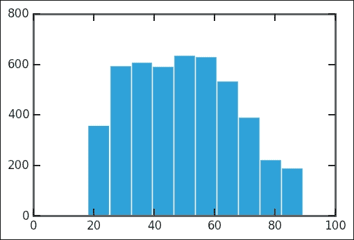
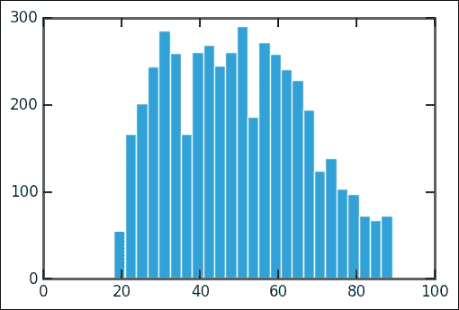
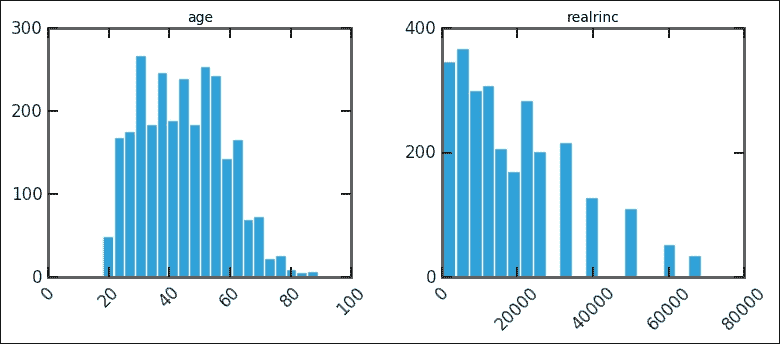
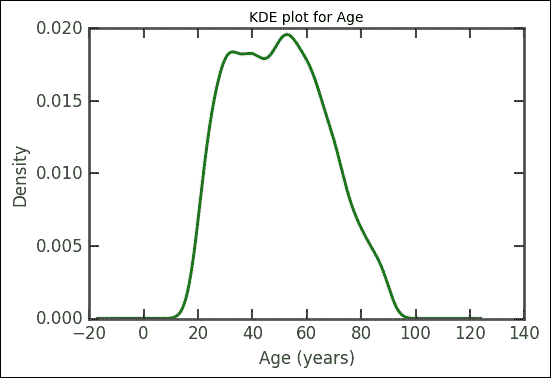
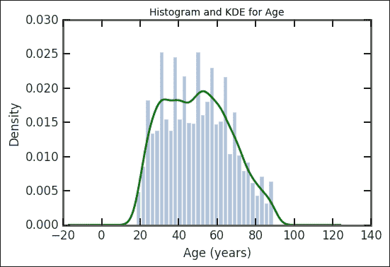
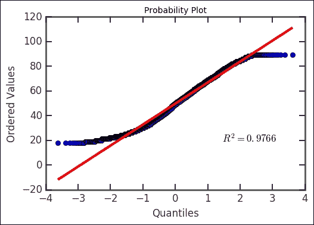
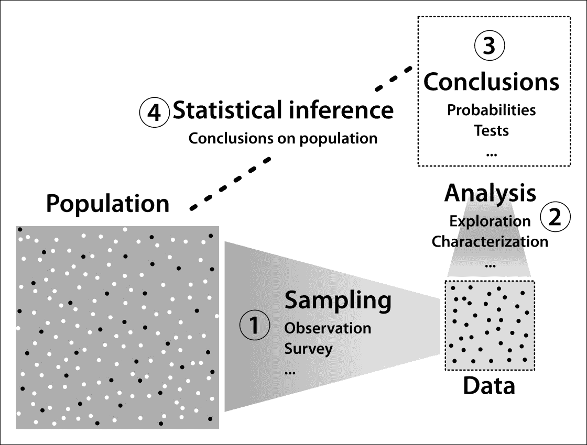
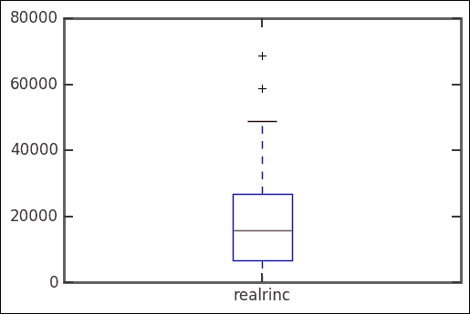
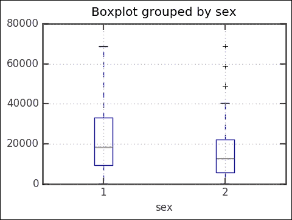
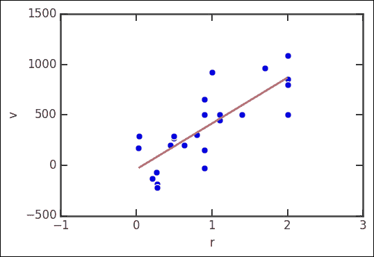

# 第二章。探索数据

当开始处理一个新的数据集时，首先了解可以从数据中得出什么结论是至关重要的。在我们能够进行推理和假设检验之前，我们需要了解手头的数据能够回答什么问题。这是探索性数据分析的关键，探索性数据分析是开发直觉和识别数据中统计模式的技能和科学。在本章中，我们将介绍有助于这项任务的图形和数字方法。你会注意到，对于如何进行每一步，没有硬性的规则，但相反，我们给出了在每种情况下适合的技术建议。发展成为数据探索者专家所需技能的最佳方式是查看大量示例，或许更重要的是，在我们自己的数据集上工作。更具体地说，本章将涵盖以下主题:

*   执行数据的初始探索和清理
*   绘制一元分布的直方图、核密度估计、概率和箱线图
*   绘制二元关系的散点图，并给出数据的各种点估计的初步概述，如平均值、标准偏差等

在开始阅读本章中的示例之前，请启动 Jupyter 笔记本并运行与上一章中提到的相同的初始命令。记住笔记本所在的目录。示例的数据文件夹需要存储在同一个目录中。

# 社会概况

为了在本章中给出具体的数据示例，我们将使用**一般社会调查** ( **GSS** )。GSS 是芝加哥大学 T4 国家观点研究中心进行的一项大型社会趋势调查。由于这是一个非常复杂的数据集，我们将使用数据的子集，即 2012 年调查的汇编。对于 5.5 MB 的大小，按照当前的标准，这是一个很小的数据大小，但是仍然非常适合本章中说明的那种探索。(史密斯、汤姆·W、彼得·马斯登、迈克尔·豪特和金·吉布姆。一般社会调查，1972-2014 年[机器可读数据文件]/首席调查员，汤姆·史密斯；彼得·马斯登共同首席调查员；联合首席调查员迈克尔·豪特；国家科学基金会主办。-NORC·艾德。-芝加哥:NORC 在芝加哥大学[制片人]；康涅狄格州斯托尔斯:康涅狄格州大学罗珀民意研究中心[发行人]，2015 年。)

## 获取数据

示例中使用的 GSS 子集可以在该书的网站上找到，但也可以直接从 NORC 网站下载。请注意，除了数据本身之外，还需要获取带有元数据的文件，其中包含调查中考虑的变量的缩写列表。

要下载数据，请按照以下步骤进行:

1.  前往[http://www3.norc.org](http://www3.norc.org)。
2.  在搜索栏中，输入`GSS 2012 merged with all cases and variables`。
3.  点击标题为 **SPSS | NORC** 的链接。
4.  向下滚动至**合并的单年数据集**部分。点击名为**的链接，GSS 2012 合并了所有案例和变量**。如果有多个版本，请选择最新版本。
5.  按照程序将文件下载到计算机。文件将被命名为`gss2012merged_stata.zip`。解压缩文件将创建`GSS2012merged_R5.dta`数据文件。(不同版本的文件名可能略有不同。)
6.  如有必要，将数据文件移动到笔记本所在的目录。

我们还需要描述数据中变量缩写的文件。这可以通过以下步骤完成:

1.  前往[http://gss.norc.org/Get-Documentation](http://gss.norc.org/Get-Documentation)。
2.  点击名为**数据集索引**的链接。这将下载一个 PDF 文件，其中包含变量缩写及其相应含义的列表。浏览此文件可以让您了解本次调查中所提问题的范围。

你可以随意浏览 GSS 网站上的信息。使用 GSS 的研究人员可能需要熟悉与数据集相关的所有细节。

## 读取数据

我们的下一步是确保我们可以将数据读入笔记本。数据采用 STATA 格式。STATA 是一个众所周知的统计分析包，其格式在数据文件中的使用非常广泛。幸运的是，熊猫允许我们以一种简单的方式读取 STATA 文件。

如果您还没有这样做，请启动一个新的笔记本并运行默认命令来导入我们需要的库。(参考 *[第一章](101.html "Chapter 1. Tools of the Trade")**交易工具*。)

接下来，执行以下命令:

```py
gss_data = pd.read_stata('data/GSS2012merged_R5.dta', 
                         convert_categoricals=False) 
gss_data.head() 

```

读取数据可能需要几秒钟，所以我们要求您耐心一点。第一行代码调用 Pandas 的`read_stata()`函数读取数据，然后将结果存储在`gss_data`变量中，该结果是 DataFrame 类型的对象。`convert_categoricals=False`选项指示熊猫不要试图将列数据转换为分类数据，有时称为因子数据。由于数据集中的列只是数字，需要支持文档来解释其中的许多列(例如，性别，1 =男性，2 =女性)，因此转换为分类变量没有意义，因为数字是有序的，但转换后的变量可能不是有序的。分类数据是有两个或更多，通常是有限数量的可能值的数据。它有两种类型:有序的(例如大小)和无序的(例如颜色或性别)。

### 注

这里需要指出的是，分类数据是熊猫的数据类型，不同于统计分类变量。统计分类变量只适用于无序变量(如前所述)；有序变量称为统计序数变量。这方面的两个例子是教育和收入水平。注意，水平之间的距离(间隔)不需要固定。第三个相关的统计变量是统计区间变量，它与序数变量相同，只是水平之间有固定的区间；这方面的一个例子是固定间隔的收入水平。

在继续之前，让我们对数据导入的方式做一点改进。默认情况下，`read_stata()`函数会用从 0 开始的整数对数据记录进行索引。GSS 数据在标有`id`的列中包含自己的索引。要更改 DataFrame 对象的索引，我们只需为索引字段分配一个新值，如以下代码行所示(在单独的笔记本单元格中输入):

```py
gss_data.set_index('id') 
gss_data.drop('id', 1, inplace=True) 
gss_data.head() 

```

前面代码的第一行将`gss_data`字段的索引设置为标记为`id`的列。由于数据中不再需要该列，我们使用`drop()`方法将其从表中删除。`inplace=True`选项会导致`gss_data`自行修改。(默认情况下，返回一个包含更改的新数据框对象。)

现在让我们将表格保存到 CSV 格式的文件中。严格来说，这一步不是必需的，但如果有必要，它简化了重新加载数据的过程。要保存文件，请运行以下代码:

```py
gss_data.to_csv('GSS2012merged.csv') 

```

这段代码使用`to_csv()`方法，使用默认选项将表输出到名为`GSS2012merged.csv`的文件中。CSV 格式实际上没有正式的标准，但是由于规则简单，每行中的条目都由一些分隔符(例如，逗号)分隔的文件，它运行得相当好。然而，像往常一样，在读入数据时，我们需要检查它，以确保我们已经正确读取了它。包含数据的文件现在可以用标准电子表格软件打开，因为数据集不是很大。

# 单变量数据

我们现在准备开始玩数据。获得数据的初步感觉的一个好方法是创建图形表示，目的是了解其分布的形状。“分布”这个词在数据分析中有技术含义，但我们现在不关心这种细节。我们在*的非正式意义上使用这个词，表示我们数据中的一组值是如何分布的*。

从最简单的情况开始，我们单独查看数据中的变量，首先不用担心变量之间的关系。当我们观察单个变量时，我们说我们在处理单变量数据。因此，这是我们将在本节中考虑的情况。

## 直方图

直方图是显示定量数据分布的标准方式，即可以用实数或整数表示的数据。(请注意，整数也可以用来表示某些类型的分类数据。)直方图将数据分成若干个面元，这些面元只是值的间隔，并计算每个面元中有多少数据点。

让我们把注意力集中在标有`age`的栏上，它记录了被调查者的年龄。要显示数据直方图，请运行以下代码行:

```py
gss_data['age'].hist() 
plt.grid() 
plt.locator_params(nbins=5); 

```

在这段代码中，我们使用`gss_data['age']`来引用名为 age 的列，然后调用`hist()`方法绘制直方图。不幸的是，这个情节包含了一些多余的元素，比如网格。因此，我们通过调用`plt.grid()`触发函数来移除它，之后，我们重新定义通过`plt.locator_params(nbins=5)`调用放置多少个刻度定位器。运行代码将产生下图，其中 *y* 轴是箱中的元素数量， *x* 轴是年龄:



直方图的关键特征是放置数据的面元数量。如果面元太少，可能会隐藏分布的重要特征。另一方面，过多的面元会导致直方图在视觉上强调样本中的随机差异，从而难以识别一般模式。上图的直方图似乎过于*平滑*，我们怀疑可能隐藏了分布的细节。我们可以通过在`hist()`的调用中添加选项箱来将箱的数量增加到 25 个，如下面的代码所示:

```py
gss_data['age'].hist(bins=25) 
plt.grid() 
plt.locator_params(nbins=5); 

```

将显示以下屏幕截图中的图:



请注意，现在直方图看起来不同了；我们在数据中看到了更多的结构。然而，分辨率仍然足以显示剧情的主要特征:

*   分布近似为*单峰*，即只有一个显著的*峰*。请注意，在进行此评估时，我们没有考虑很可能由样本随机性引起的小间隙和峰值。
*   分布是*不对称的*，有点向右倾斜，也就是说，它有一个向高值延伸的更长的尾巴。
*   分布范围大约从 20 年到 90 年，中心在 50 年左右。不清楚分布的模式或最高点是什么。
*   没有异常特征，例如异常值、间隙或聚类。

请注意，从这些观察中，我们已经可以说一些关于数据收集的事情:很可能对受访者有一个最低年龄要求。这可能是分布不对称的原因。在采样中要求下限通常会使分布的上尾部突出。

将这种分布与包含在`realrinc`栏中的被调查者的收入分布进行比较是有用的。然而，那里有一个小陷阱。让我们从创建一个只包含两个感兴趣的列的数据框开始，并通过运行以下命令显示结果的前几行:

```py
inc_age = gss_data[['realrinc','age']] 
inc_age.head(10) 

```

请注意前面代码第一行中的*双括号*。我们正在使用 Pandas 提供的众多复杂索引功能之一，并将 Python 列表`['realinc','age']`作为`gss_data`数据框的索引。这具有选择 Python 列表中指定的两列的预期效果。

查看上一条命令的输出，我们可以看到`realinc`列有很多缺失值，由`NaN`值表示，这是 Pandas 缺省使用的缺失数据。这可能是由于几个原因，但一些受访者只是选择不透露他们的收入。因此，为了比较两列的分布，我们可以省略这些行，如下面的代码所示:

```py
inc_age = gss_data[['realrinc','age']].dropna() 
inc_age.head(10) 

```

我们使用相同的索引来选择两列，但是现在我们调用`dropna()`方法来排除缺少数据的行。检查输出时，请注意 Pandas 巧妙地从提取值的原始数据帧中保留了行索引 ID。这样，如果需要，我们可以将数据与原始表进行交叉引用。

现在，使用下面几行代码生成两个变量的并排直方图非常简单:

```py
ax_list = inc_age.hist(bins=40, figsize=(8,3), xrot=45) 
for ax in ax_list[0]: 
    ax.locator_params(axis='x', nbins=6) 
    ax.locator_params(axis='y', nbins=3) 

```

注意我们在`hist()`方法中使用的选项。除了设置箱数，我们使用`figsize=(8,3)`选项，将图形大小设置为 8 英寸乘 3 英寸和`xrot=45`选项，使 *x* 轴标签旋转 45 度，提高可读性。该命令返回图形的轴对象列表。我们将其保存到`ax_list`变量中。接下来，我们遍历这个列表来修改轴的对象(也就是我们正在绘制的图)。像以前一样，我们使用 matplotlib 的面向对象界面来更改刻度线的数量，这次是用不同的函数。玩玩 nbins 设置，看看会发生什么。

检查得到的直方图，我们可以看到它们有很大的不同:收入的分布严重倾斜，更重要的是，在 30 万美元以上的地区，与一个孤立的酒吧有很大的差距。让我们计算一下这个区域中有多少值，如下面的代码所示:

```py
inc_age[inc_age['realrinc'] > 3.0E5].count() 

```

在这段代码中，我们在数据框中使用了一个布尔索引`inc_age['realrinc'] > 3.0E5`。这将选择`realinc`列中值大于 300，000 美元的所有行(`3.0E5`相当于`3.0 * 10<sup>5</sup>`)。`count()`方法只是计算有多少值满足条件。

看产量，收入在 30 万美元以上的有 80 行。像往常一样，当有看起来不寻常的事情时，我们应该更仔细地看数据。让我们通过运行以下代码来显示相应值的数据:

```py
inc_age[inc_age['realrinc'] >3.0E5].head(10)

```

这与上一个示例中的命令行非常相似，但是现在我们获取对应于前十行的一部分数据。输出包含一个惊喜:所有数据值都相等！

为了理解正在发生的事情，我们必须深入挖掘 GSS 调查中的假设。这项调查并没有要求受访者给出他们收入的数值。取而代之的是，向被调查者提供收入类别，这为问卷中的收入设定了上限。也就是说，所有收入超过一定值的受访者被集中在一起。顺便说一句，估计这些类别的实际收入是一个不简单的问题，在这个问题上有相当多的研究。

无论如何，就我们的目的而言，简单地排除 30 万美元以上的价值是合法的。要根据这一假设生成直方图，请运行下面几行所示的代码:

```py
inc_age = gss_data[['realrinc','age']].dropna() 
lowinc_age = inc_age[inc_age['realrinc'] <3.0E5] 
ax_list = lowinc_age.hist(bins=20, figsize=(8,3), xrot=45) 
for ax in ax_list[0]: 
    ax.grid() 
    ax.locator_params(axis='x' ,nbins=6) 
    ax.locator_params(axis='y' ,nbins=3) 

```

请注意前面代码中的第二行，它选择`inc_age`数据框中与`realrinc`列中的值小于 300，000 的条目相对应的行，并将其存储在新的`lowinc_age`对象中。这将产生如下图所示的直方图:



通过查看输出，我们可以看到分布非常明显。收入分配明显向大价值倾斜，似乎有几个差距。请注意，差距可能是由于调查结构造成的，特别是关于从收入范围计算实际收入的方式。

### 让事情变得美好

到目前为止，示例中显示的直方图足以进行数据探索，但在视觉上不太吸引人。熊猫用 matplotlib 做图表。Matplotlib 是一个广泛的技术绘图库，能够生成高质量的、演示就绪的图形([http://matplotlib.org](http://matplotlib.org))。为了说明这种可能性，运行以下代码(`lowinc_age`存储在前面的代码中):

```py
ax_list = lowinc_age.hist(bins=20, figsize=(8,3), 
                          xrot=45, color='SteelBlue') 
ax1, ax2 = ax_list[0] 
ax1.set_title('Age (years)') 
ax2.set_title('Real Income ($)') 
for ax in ax_list[0]: 
    ax.grid() 
    ax.locator_params(axis='x' ,nbins=6) 
    ax.locator_params(axis='y' ,nbins=4) 

```

让我们从分析前面代码第三行中对`hist()`方法的调用开始。使用 matplotlib 进行绘图时，每个命令有几种方法。在这里，我们展示了面向对象的方式，其中`ax1, ax2 = ax_list[0]`获取并存储两个轴。然后，我们设置标题，并使用这些对象关闭每个轴的背景网格。

### 表征

我们现在考虑尝试将数据拟合到经典统计中的标准模型之一的问题。这可能是一个复杂的问题，因为真实数据可能不符合任何预定义的模型。第一步可能是试图近似分布的密度，即在这种情况下某个年龄的一小部分人(假设它是连续的)。常用的方法是**核密度估计** ( **KDE** )，可以认为是*平滑直方图*。熊猫可以很容易地生产 KDE 地块，如下面的代码所示:

```py
age = gss_data['age'].dropna() 
age.plot(kind='kde', lw=2, color='green') 
plt.title('KDE plot for Age') 
plt.xlabel('Age (years)') 

```

在这段代码中，我们首先从数据中选择年龄列，删除缺失的值。然后我们用`kind='kde'`选项调用`plot()`方法(用`kde`作为选项，SciPy 包是一个依赖项)。请注意，这与我们用于直方图的界面略有不同。还要注意，我们使用选项来设置绘图的线宽和颜色。最后两行设置了 *x* 轴的标题和标签，虽然这次是直接函数方法，而不是前面显示的面向对象方法。你将如何用面向对象的方法来设计这个？

需要注意的一个重要因素是熊猫不支持设置 KDE 图的参数，特别是平滑过程中使用的带宽。带宽有点类似于直方图中的面元宽度，不同的带宽会产生明显不同的近似值。熊猫使用启发式近似，在大多数情况下会产生接近最佳的拟合，但在某些情况下可能不会产生最佳结果。我们预计未来版本的熊猫在这里会更加灵活。

运行前面的代码，我们得到如下显示:



虽然这一切都很好，但我们可能想在柱状图上绘制 KDE。这可以通过以下代码来完成:

```py
ax = age.hist(bins=30, color='LightSteelBlue', normed=True) 
age.plot(kind='kde', lw=2, color='Green', ax=ax) 
plt.title('Histogram and KDE for Age') 
plt.xlabel('Age (years)'); 

```

这将产生一个带有直方图的图形，归一化后就像 KDE 图一样，上面是 KDE 曲线。该图如下所示:



KDE 曲线有点钟形，但是如果你熟悉正态分布，你会注意到曲线似乎在尾部下降得太快而归零。为了直观地了解数据偏离正态分布的程度，我们可以使用**正态分布图**。在正态分布图中，数据与正态分布值一起绘制，具有与数据相似的特征。这种情节在熊猫的当前版本中不受支持，但是我们可以使用 SciPy 来创建情节，如下面几行代码所示:

```py
import scipy.stats as stats 
stats.probplot(age, dist='norm', plot=plt) 

```

第一个参数`age`是要绘制的数据。然后我们使用`dist='norm'`选项将数据与正态分布进行比较。最后一个选项`plot=plt`指定`plt`模块应用于绘图。这可以是现有的轴实例(对象)或绘图模块；在这种情况下，我们只需将其发送到`plt`，也就是`matplotlib.pyplot`模块。结果图如下图所示:



请注意，数据明显偏离了绘图末端的直线:它位于左侧直线的上方和右侧直线的下方。与正态分布的相似性越多，数据值就越符合直线。这里呈现的年龄数据与尾部比正态分布短的数据一致，这与我们早期的观察一致。因此，我们会得出结论，正态分布对于这些数据是不够的。

## 统计推断的概念

在分析的这一点上，我们已经弄清楚了样品的一些情况。它不是正态分布的。在进一步的探索中，我们将发现更多关于样本的信息。有了来自全部人口的充分抽样数据，我们可以通过对数据样本进行分析来得出关于人口的结论。这是统计推断的基础，下图说明了这个概念。该概念在以下步骤中提到:

1.  我们从人群中抽取了一个希望没有偏见的样本。
2.  通过数据分析，我们对样本数据进行了表征。
3.  通过统计测试、参数估计和类似的工具，我们可以得出关于样本的结论。
4.  通过推断，我们现在可以对整个人口得出结论。



## 数值汇总和箱线图

我们现在朝着用数字描述数据的方向前进。在我们开始之前，我们需要提醒一下。简单地使用数据中的一组数字来得出结论并不是好的做法。依靠确定的数字提供一定程度的*确定性*的感觉是非常诱人的。然而，没有上下文和进一步分析的数值不是很有用，可能会误导。在这一章中，我们只考虑初步研究的方法，试图熟悉数据，以便了解它的表现。

当考虑数字数据时，我们可能会问以下问题:

*   数据的范围有多大？也就是说，最小和最大的值是多少？
*   数据值的中心在哪里？我们将考虑中心性的两个衡量标准，*意味着*和*中间值*。
*   数据从其中心扩散了多少？我们将考虑*标准偏差*以及*四分位数*和*百分位数*的概念作为传播的度量。

所有这些量都可以通过`describe()`方法在熊猫中轻松计算，适用于系列和数据帧类型的对象。回到收入分配，我们可以绘制如下数据汇总:

```py
inc = gss_data['realrinc'].dropna() 
lowinc = inc[inc <3.0E5] 
lowinc.describe() 

```

在第一行中，我们使用`dropna()`方法从表中选择`realrinc`列来丢弃丢失的数据。然后，我们只选择低于 30 万美元的收入，因为该栏中报告的收入可能无法可靠地反映高收入的分布，这一点我们之前已经讨论过。最后，我们使用`describe()`方法生成数据摘要。运行这段代码，我们获得如下行所示的输出:

```py
count     2751.000000 
mean     18582.194656 
std      14841.581333 
min        245.000000 
25%       6737.500000 
50%      15925.000000 
75%      26950.000000 
max      68600.000000 
Name: realrinc, dtype: float64 

```

该输出中提供的信息描述如下:

*   `count`是数据点的数量。因此，调查中有 2751 人的收入低于 30 万美元。
*   `mean`是数据的平均值。因此，受访者的平均收入约为 18，582 美元。
*   `standard deviation` ( `std`)是数据如何围绕平均值传播的一种度量。标准差的公式有些技术性，将在后面的章节中介绍。
*   `minimum` ( `min`)和`maximum` ( `max`)是数据中最小和最大的值。它们一起规定了数据的范围。在我们的例子中，收入从最低值 245 美元到最高值 68，600 美元。
*   `median` (50%)是对应于数据集中点的值，即一半的值低于中值，一半的值高于中值。例如，根据我们的数据，一半的报告收入低于 15，925 美元，一半高于这个值。

### 注

这里导出的单个值代表我们的数据的某些特征，称为**点估计**。最常见和广泛使用的点估计是样本均值，它通过统计推断给出总体均值的点估计。点估计是对*区间估计*的恭维。这些由两个或多个数字定义，例如，如果样本均值位于某个区间，这表明总体均值也位于该区间。

*   The `quartiles` (25% and 75%) together with the median give a more specific view of how the data is distributed. In our data, they can be interpreted as follows:
    *   25%的收入低于 6737 美元
    *   25%的收入在 6737 美元到 15925 美元之间
    *   25%的收入在 15，925 美元到 26，950 美元之间
    *   25%的收入在 26，950 美元到 15，925 美元之间

如果需要更详细的分布视图，我们可以请求输出更多的`percentiles`，如下面的代码所示:

```py
lowinc.describe(percentiles=np.arange(0, 1.0, 0.1)) 

```

在这段代码中，我们使用了`describe()`方法的百分位数选项。`np.arange(0, 1.0, 0.1)`表达式用数字`0.0, 0.1,0.2,...,0.9`表示一个 NumPy 数组。前面示例的输出将提供将数据分成 10 个区间的值，每个区间包含报告收入的 10%。

诚然，数字总结很难想象。一个非常古老但仍然有用的图形工具是**箱线图**。尽管有些过时，但箱线图仍然可以用来显示数据的中心和分布。我们可以用以下代码显示收入的箱线图:

```py
lowinc.plot(kind='box'); 

```

或者，可以运行以下程序:

```py
lowinc.plot.box(); 

```

运行这些命令中的任何一个都会产生以下结果:



该箱线图可以解释如下:

*   用十字符号标记的点是异常值。异常值是远离分布中心的值。什么是离群值没有明确的普遍接受的定义，所以 Pandas 以启发式的方式确定它们(http://matplotlib . org/API/pyplot _ API . html # matplotlib . pyplot . box plot)。
*   底部和顶部的水平条(箱线图的*须*)分别代表最小值和最大值。
*   方框的底部和顶部分别代表 25%和 75%的四分位数。
*   框内的线代表中位数或 50%四分位数。

解释箱线图的一个快速方法是记住，排除异常值后，50%的数据值在盒子里面，25%在盒子下面，25%在盒子上面。请注意，在我们的示例中，数据的不对称性很明显，箱线图偏向高值。

箱线图对于比较不同亚群的数据也很有用。比方说，我们想比较男性和女性的收入。这可以通过以下代码来实现:

```py
inc_gen = gss_data[['realrinc','sex']] 
inc_gen = inc_gen[inc_gen['realrinc'] < 3.0E5] 
inc_gen.boxplot(column='realrinc', by='sex'); 

```

前两条线选择要绘制的数据，不包括 30 万以上的收入。然后，调用 DataFrame 对象的`boxplot()`方法。我们用`column='realrinc'`选项指定要绘制的数据，用`by='sex'`选项指定组。执行时，将显示以下图形:



这些方框图讲述了一个关于收入如何分配的有趣故事。男性的收入( **1** )比女性的收入( **2** )分布更广，男性的收入明显高于女性。例如，女性收入分布的前四分之一略高于男性收入的中位数。也就是说，几乎 75%的女性收入相当于男性收入的后一半。分布的上层讲述了一个类似的故事。男性分布的四分位数以上的箱线图部分比女性分布的要长得多。请特别注意女性分布中的异常值。似乎肯定有一种*玻璃天花板*效应，很少有女性能够控制男性获得的最高工资。

# 变量之间的关系–散点图

当我们研究不同变量之间的关系时，数据分析的真正力量就显现出来了。在上一节的最后，我们将收入和性别联系起来，也就是说，一个量化变量和一个分类变量联系起来。在本节中，我们将研究散点图，散点图是两个定量变量之间关系的图形表示。

为了说明熊猫如何被用来探索两个变量之间的关系，我们将使用天文学历史上的一个重要例子。天文学家埃德温·哈勃在 1929 年发表了一篇非常重要的论文，他发现河外星云的距离和速度之间存在近似线性的关系。这是后来成为大爆炸理论的基础。

文章的重印版可在[http://apod.nasa.gov/diamond_jubilee/d_1996/hub_1929.html](http://apod.nasa.gov/diamond_jubilee/d_1996/hub_1929.html)获得，数据来源于此。请注意，数据集非常小，只需在文章本身中打印即可！对数据进行了一些小的格式化和清理，使其更易于使用。特别是，速度值被手动更改为全正，因为只有速度的大小才重要。要绘制数据的散点图，请输入并运行以下代码:

```py
hubble_data = pd.read_csv('data/hubble-data.csv') 
hubble_data.plot(kind='scatter', x='r', y='v'); 

```

在这段代码中，在使用`read_csv()`函数读取数据后，我们使用带有`kind='scatter'`选项的`plot()`方法绘制数据。`x='r'`和`y='v'`选项分别告诉熊猫在 *x* 和 *y* 轴上绘制哪些列。

观察图，可以清楚地看到距离和速度之间有关系，这与当时流行的宇宙是静止的观点相矛盾。为了使关系更清晰，我们可以在图中添加一条趋势线。

### 注

统计推断的一个核心部分是假设检验，即一个数据集/样本对照另一个数据集或模型生成的数据集进行检验。然后使用统计假设检验来研究两个数据集之间的关系。将所提出的关系与理想化的零假设进行比较，即两个数据集之间不存在关系。只有当零假设为真的概率低于某个显著水平时，它才会被拒绝。也就是说，假设检验只能给出零假设的意义，而不能给出所提出的模型。这是一个非常奇怪且通常很难理解的概念。本章我们将触及假设检验，并在 *[第 4 章](104.html "Chapter 4. Regression")**回归*中进行更深入的探讨。

我们首先需要计算关系的线性回归线。我们使用 SciPy 通过以下代码来实现:

```py
from scipy.stats import linregress 
rv = hubble_data.as_matrix(columns=['r','v']) 
a, b, r, p, stderr = linregress(rv) 
print(a, b, r, p, stderr) 

```

我们首先从`scipy.stats`模块导入`linregress`功能。该模块不支持 Pandas，因此我们首先使用`as_matrix()`方法将数据转换为 NumPy 数组。接下来，我们调用`linregress`函数，返回如下内容:

*   `a`:这是回归线的斜率
*   `b`:这是回归线的截距
*   `r`:这是相关系数
*   `p`:这是假设检验的双边 p 值——假设斜率为零的零假设
*   `stderr`:这是估算的标准误差

举个例子，四舍五入到两位小数，`a=454.16`、`b=-40.78`、`r=0.79`、`p=4.48E-6`和`stderr=75.24`。

线性回归涵盖在 *[第四章](104.html "Chapter 4. Regression")**回归*中，但我们将在这里解读结果。0.79 的相关系数表明存在很强的关系，非常小的 p 值表明应该拒绝零假设，从而支持变量之间存在关系。r 的平方是 0.62，因此数据中 62%的可变性由线性模型解释，而不是随机变化。

所有这些都表明，对于宇宙中的星系，线性模型可以将速度的增加描述为距离的函数。为了直观地显示这一点，我们可以使用以下代码绘制回归线和数据:

```py
hubble_data.plot(kind='scatter', x='r', y='v') 
rdata = hubble_data['r'] 
rmin, rmax = min(rdata), max(rdata) 
rvalues = np.linspace(rmin, rmax, 200) 
yvalues = a * rvalues + b 
plt.plot(rvalues, yvalues, color='red', lw=1.5) 
plt.locator_params(nbins=5); 

```

由于 Pandas 目前不支持在散点图上绘制回归线的选项，我们利用 matplotlib 被 Pandas 在后台用来构建图的事实。绘制散点图后，我们计算数据的最大值和最小值，并通过调用`linspace()`函数生成一个距离值相等的 NumPy 数组。然后， *yvalues = a*右值+ b* 语句计算直线上的点。最后，我们调用 matplotlib 的`plot()`函数来绘制直线。结果图形显示在下图中:



根据这个模型，哈勃继续假设宇宙正在膨胀，这个想法最终产生了宇宙学中目前接受的宇宙模型。

# 总结

在本章中，您学习了如何使用 Pandas 对数据进行初步探索。您学习了数据显示，包括直方图、单变量分布的 KDE 图和箱线图，以及双变量关系的散点图。我们还讨论了数据汇总，包括平均值、标准偏差、范围、中位数、四分位数和百分位数。

在下一章中，您将了解数据的统计模型。