# 四、回归

线性回归是实验技术一般介绍的一部分；它构成了过去几个世纪许多科学突破的基础。我们之前对线性回归做了一些简短的探索，看看哈勃定律和其他一些东西。前一章包括研究分布，这是探索性数据分析不可或缺的一部分，也是深入了解数据的第一步。正如你将看到的，我们到目前为止所经历的所有事情在这一章中也是有用的。强烈鼓励你结合前几章学到的知识，尝试这些新事物。在本章中，我们将讨论以下形式的回归:

*   线性回归
*   多次回归
*   逻辑回归

在最简单的公式中，线性回归处理从另一个变量估计一个变量。在多元回归中，一个变量是从两个或多个其他变量中估计出来的。当然，只有当变量之间存在某种相关性时，这种方法才有效。在这一点上需要指出的是，相关性并不意味着因果关系；仅仅因为两个或更多的变量显示出相互依赖，并不意味着它们在现实生活中实际上相互影响/依赖。逻辑回归将模型拟合到一个或多个离散变量，这些变量有时是二元的(也就是说，只能取值 0 或 1)。

在本章中，我们将从线性回归的快速介绍开始，然后我们直接进入获取数据和检验两个变量之间简单关系的假设。在此之后，我们将介绍对多个变量的扩展，我们只需将数据添加到上一节的内容中。逻辑回归在这一章的最后部分讨论。

强烈鼓励好奇心，并利用我们在前面章节中学到的知识来探索数据。在运行本章中的示例之前，启动 Jupyter 笔记本并运行默认导入。

# 引入线性回归

最简单的线性回归形式由关系 *y = k <sub>x</sub> + k <sub>0</sub>* 给出，其中*k<sub>0</sub>T10】称为**截距，**即`x=0`和 *k* 时 *y* 的值为斜率。通过将每个点看作前面的关系加上一个错误 *ε* ，可以找到这个问题的一般表达式。然后，对于 *N* 点，这将如下所示:*

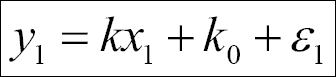

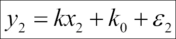


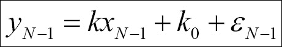

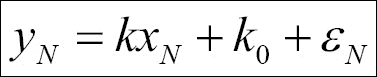

我们可以用矩阵形式来表达:

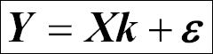

这里，各种矩阵/向量表示如下:

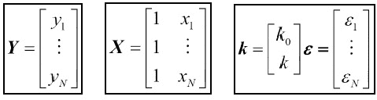

执行矩阵和向量的乘法和加法应该产生这里定义的相同的方程组。在这种情况下，回归的目标是估计参数 k。有许多类型的参数估计方法——普通最小二乘法是最常见的方法之一——但也有最大似然法、贝叶斯法、混合模型法和其他几种方法。在普通最小二乘最小化中，残差的平方最小化，即 *r <sup>T</sup> r* 最小化( *T* 表示转置， *r* 表示残差，即 *Y <sub>数据</sub> -Y <sub>拟合</sub>* )。求解矩阵方程是不平凡的；然而，如果时间允许的话，至少这样做一次是有益的。在下面的例子中，我们将使用最小二乘法。大多数情况下，基础计算使用矩阵来计算参数的估计值和确定中的不确定性。分析还得出变量之间的相关性，即变量之间存在线性关系的可能性有多大。

## 获取数据集

在我们开始估计线性关系的参数之前，我们需要一个数据集。在第一个例子中，我们将查看来自世界卫生组织在 http://www.who.int T4 的自杀率数据。数据分析的一个非常重要和复杂的部分是将数据放入适合我们分析的可管理的数据结构中。因此，我们将看到如何获取数据并将其映射到我们想要的数据结构。数据集的第一部分是每个国家和性别的年龄标准化自杀率(每 10 万居民)。

### 注

**年龄标准化**(也称为年龄调整)是一种技术，用于在群体的年龄分布不同时对群体进行比较。

以下代码下载数据并将其存储在文件中:

```py
importurllib.request 
payload='target=GHO/MH_12&profile=crosstable&filter=COUNTRY:*;REGION:*&x-sideaxis=COUNTRY&x-topaxis=GHO;YEAR;SEX' 
suicide_rate_url='http://apps.who.int/gho/athena/data/xmart.csv?' 

local_filename, headers = urllib.request.urlretrieve(suicide_rate_url+payload, filename='data/who_suicide_rates.csv') 

```

`urllib`模块是 Python 标准库([https://docs.python.org/3/library](https://docs.python.org/3/library))的一部分。如果没有输入文件名，文件将存储在磁盘上的临时位置。如果出现问题，也可以直接转到网址下载文件。或者，经合组织数据库包含的自杀率也可以追溯到 1960 年([http://stats.oecd.org](http://stats.oecd.org))。

和以前一样，我们使用 Pandas 数据阅读器中的 Pandas 功能。在这里，我们给列命名；只能发送`header=2`参数。这将告诉您列名在标题中给出；然而，这可能并不总是我们想要的:

```py
LOCAL_FILENAME = 'data/who_suicide_rates.csv_backup' 
rates = pandas.read_csv(LOCAL_FILENAME, names=['Country','Both', 'Female', 'Male'], skiprows=3) 
rates.head(10) 

```

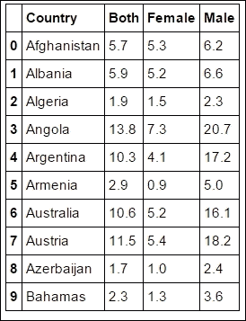

为了方便您，我们告诉它跳过前三行，文件的元数据存储在这三行中。如前所述，CSV 文件格式缺乏适当的标准，因此很难正确解释所有内容，因此在这种情况下跳过标题会使其更加健壮。然而，我们鼓励尝试不同的输入参数，这可能会很有启发性。如前几章所示，我们从探索这个数据集开始:

```py
rates.plot.hist(stacked=True, y=['Male', 'Female'], 
                bins=30, color=['Coral', 'Green']) 
plt.xlabel('Rate'); 

```

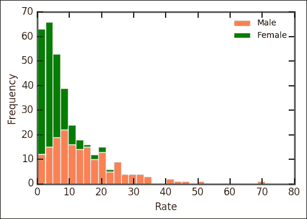

直方图现在绘制了名称匹配**男性**和**女性**的列，它们堆叠在一起。这表明男性和女性的自杀率略有不同。打印出男女的平均自杀率表明，男性的自杀率明显更高:

```py
print(rates['Male'].mean(), rates['Female'].mean())
14.69590643274854 5.070602339181275
```

为了更详细地了解一些基本的费率统计数据，我们使用 boxplot 命令:

```py
rates.boxplot(); 

```

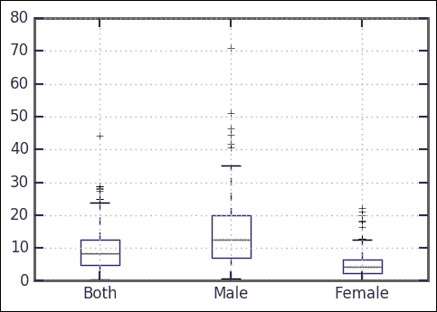

很明显，与女性相比，男性的自杀率更高。查看箱线图和组合分布(即**和**键)，我们可以看到有一个异常值(即交叉)的比率非常高。每 10 万人中有 40 多人自杀；这是哪个国家？我们来看看:

```py
print(rates[rates['Both']>40])
   Country Both Female Male
66  Guyana 44.2   22.1 70.8
```

这里，我们通过说我们只想要`Both`列中的比率高于 40 的指数来过滤。显然，圭亚那的自杀率非常高。围绕这一点，有一些有趣的、显然是麻烦的事实。一个快速的网络搜索显示，尽管解释高比率的理论已经提出，研究还没有揭示显著高于平均比率的潜在原因。

如前面的直方图所示，自杀率都有相似的分布(形状)。让我们首先使用前面几章的例子中定义的 CDF 绘图函数:

```py
def plot_cdf(data, plot_range=None, scale_to=None, nbins=False, **kwargs): 
  if not nbins: 
    nbins = len(data) 
    sorted_data = np.array(sorted(data), dtype=np.float64) 
    data_range = sorted_data[-1] - sorted_data[0] 
    counts, bin_edges = np.histogram(sorted_data, bins=nbins) 
    xvalues = bin_edges[1:] 
    yvalues = np.cumsum(counts) 
    if plot_range is None: 
      xmin = xvalues[0] 
      xmax = xvalues[-1] 
    else: 
      xmin, xmax = plot_range 
   # pad the arrays 
    xvalues = np.concatenate([[xmin, xvalues[0]], xvalues, [xmax]]) 
    yvalues = np.concatenate([[0.0, 0.0], yvalues, [yvalues.max()]]) 
    if scale_to: 
      yvalues = yvalues / len(data) * scale_to 
    plt.axis([xmin, xmax, 0, yvalues.max()]) 
    return plt.step(xvalues, yvalues, **kwargs) 

```

有了这个，我们可以再次研究自杀率的分布。对组合费率运行该功能，即`Both`栏:

```py
plot_cdf(rates['Both'], nbins=50, plot_range=[-5, 70]) 

```

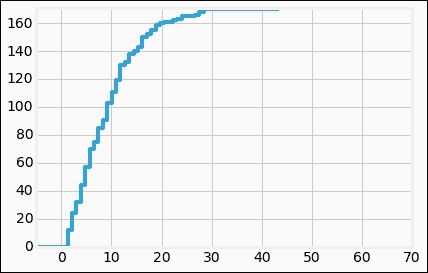

我们可以首先测试正态分布，因为它是最常见的分布:

```py
st.probplot(rates['Both'], dist='norm', plot=plt); 

```

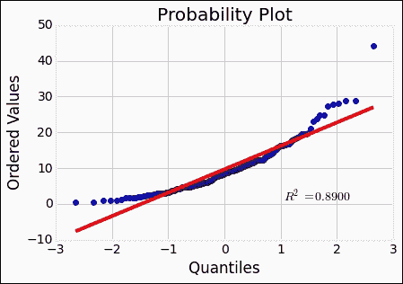

对比我们之前在创作这样的情节时看到的，契合度一点都不好。回忆上一章的威布尔分布；它可能更适合向较低值倾斜。让我们试试看:

```py
beta = 1.5 
eta = 1\. 
rvweib = st.weibull_min(beta, scale=eta) 
st.probplot(rates['Both'], dist=rvweib, plot=plt); 

```

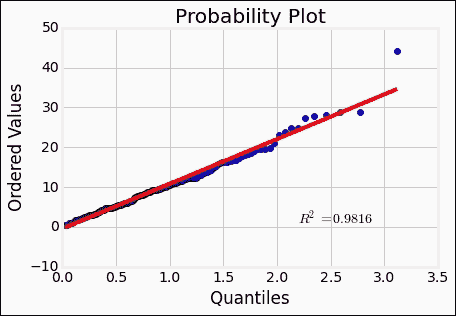

威布尔分布似乎很好地再现了数据。`r`值或**皮尔逊相关系数**是衡量线性模型在多大程度上代表了两个变量之间的关系。此外，`st.probplot`给出的`r`平方值是`r`值的平方，在这种情况下。可以根据数据拟合分布。这里，我们用`floc=0`将位置参数固定为 0:

```py
beta, loc, eta = st.weibull_min.fit(rates['Both'],  
                      floc=0, scale = 12) 

```

这给出了`1.49`的`beta`、`loc`的 0、`10.76`的`scale`。利用拟合的参数，我们可以绘制数据的直方图，并绘制分布图。我包含了一个固定的随机种子值，因此它应该以同样的方式为您再现结果:

```py
rates['Both'].hist(bins=30) 
np.random.seed(1100) 
rvweib = st.weibull_min(beta, scale=eta) plt.hist(rvweib.rvs(size=len(rates.Both)),bins=30, alpha=0.5); 

```


然后，比较威布尔分布的 CDF 和我们的数据，很明显它们是相似的。能够拟合分布的参数非常有用:

```py
plot_cdf(rates['Both'], nbins=50,scale_to=1) 
np.random.seed(1100) 
plot_cdf(rvweib.rvs(size=50),scale_to=1) 
plt.xlim((-2,50));  

```

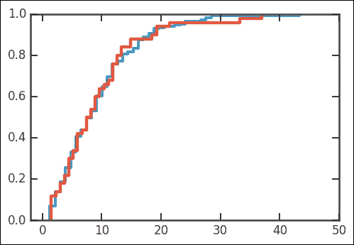

现在我们已经有了数据集的第一部分，我们可以开始尝试理解这一点。自杀率有哪些可能的参数？也许是经济指标或者与抑郁症相关的变量，比如一年的日照量？在接下来的部分中，我们将测试一个人得到的阳光越少，离赤道越远，是否会显示出与自杀率的相关性。然而，如圭亚那的情况所示，一些异常值可能不属于任何已发现趋势的一般解释。

## 线性回归检验

使用线性回归，可以测试两个变量之间的拟议相关性。在前一节中，我们得到了一个关于每个国家自杀率的数据集。我们有一个 Pandas 数据框架，有三栏:国名、男女自杀率和男女平均水平。为了检验自杀率取决于国家获得多少阳光的假设，我们将使用国家坐标质心，即每个国家的纬度(和经度)。我们假设每个国家的日照量与纬度成正比。获得世界上每个国家的质心比人们想象的要困难。这方面的一些资源如下:

*   一个简单的国家质心可以在高托斯的网页上找到:[http://gothos.info/2009/02/centroids-for-countries/](http://gothos.info/2009/02/centroids-for-countries/)
*   一个更复杂的表格，在分析之前需要更多的处理，在开放地理编码:[http://www.opengeocode.org/download.php#cow](http://www.opengeocode.org/download.php#cow)
*   OpenGeocode 拥有免费的公共领域地理位置数据库

我们使用的是 Gothos 版本，所以您应该确保您有数据文件(CSV 格式):

```py
    coords=pandas.read_csv('data/country_centroids/
                           country_centroids_primary.csv', sep='\t')
    coords.keys()

```

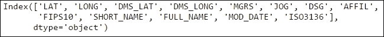

有很多列名可以使用！首先，我们看一眼桌子:

```py
    coords.head()

```

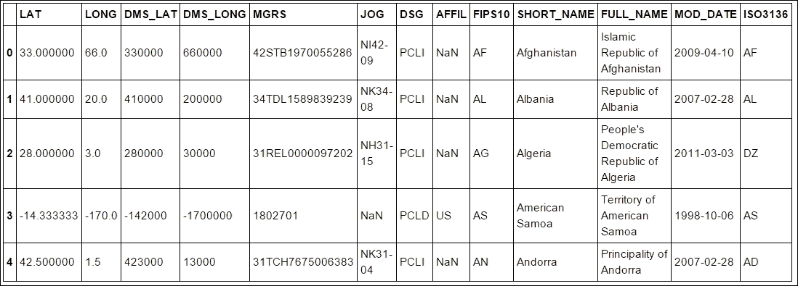

有趣的栏目是`SHORT_NAME`和`LAT`。我们现在将`coords`数据框中的`SHORT_NAME`与`rates`数据框中的`Country`进行匹配，并在国家名称匹配时存储`Lat`和`Lon`值。理论上，世卫组织表格最好也有国际标准化组织国家代码，这是由**国际标准化组织** ( **国际标准化组织**)制定的标准:

```py
rates['Lat'] = '' 
rates['Lon'] = '' 
for i in coords.index: 
  ind = rates.Country.isin([coords.SHORT_NAME[i]]) 
val = coords.loc[i, ['LAT', 'LONG']].values.astype('float') 
rates.loc[ind,['Lat','Lon']] = list(val) 

```

这里，我们在`coords`数据框中循环索引，`rates.Country.isin([coords.SHORT_NAME[i]])`找到我们从 rates 对象中的 coords 对象获取的国家。因此，我们在我们找到的国家的行列中。然后，我们获取在`coords`对象中找到的`LAT`和`LONG`值，并将其放入`Lat`和`Lon`列中的费率对象中。为了检查是否一切正常，我们打印出前几行:

```py
    rates.head()

```

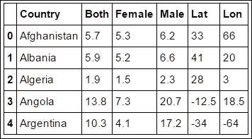

一些值仍然是空的，Pandas、matplotlib 和许多其他模块不能很好地处理空值。所以我们找到它们，并将空值设置为 NaN(不是数字)。这些是空的，因为我们没有`Country`质心或者名称不匹配:

```py
rates.loc[rates.Lat.isin(['']), ['Lat']] = np.nan 
rates.loc[rates.Lon.isin(['']), ['Lon']] = np.nan 
rates[['Lat', 'Lon']] = rates[['Lat', 'Lon']].astype('float') 

```

同时，我们将值转换为浮点数(代码的最后一行)而不是字符串；这使得绘制和执行其他例程变得更加容易。否则，例程必须转换为 float，并且可能会遇到我们必须解决的问题。手动转换它可以确保我们知道自己拥有什么。在我们的简单近似中，阳光的量与离赤道的距离成正比，但是我们有纬度。因此，我们创建一个新的列，并计算出**到赤道** ( **DFE** )的距离，这只是纬度的绝对值:

```py
rates['DFE'] = '' 
rates['DFE'] = abs(rates.Lat) 
rates['DFE'] = rates['DFE'].astype('float') 

```

此外，距离赤道+/-23.5 度范围内的国家全年都获得等量的阳光，因此根据我们的假设，它们应该被认为具有相同的自杀率。为了首先说明我们的新数据集，我们绘制了速率与 DFE 的关系图:

```py
import matplotlib.patches as patches 
import matplotlib.transforms as transforms 
fig = plt.figure() 
ax = fig.add_subplot(111) 
ax.plot(rates.DFE, rates.Both, '.') 
trans = transforms.blended_transform_factory( 
         ax.transData, ax.transAxes) 
rect = patches.Rectangle((0,0), width=23.5, height=1, 
         transform=trans, color='yellow', alpha=0.5) 
ax.add_patch(rect) 
ax.set_xlabel('DFE') 
ax.set_ylabel('Both'); 

```

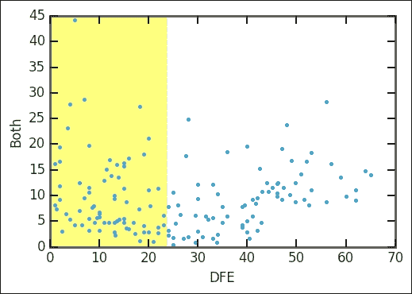

首先，我们绘制速率与密度函数的关系图，然后我们添加一个矩形，对其坐标进行混合变换。通过混合变换，我们可以定义`x`坐标跟随数据坐标，定义`y`坐标跟随轴(0 为下边缘，1 为上边缘)。DFE 等于或小于 23.5 度的区域用黄色矩形标记。似乎有某种趋势倾向于更高的 DFE 和更高的自杀率。虽然对于居住在离赤道更远的人来说，这是一个悲惨的前景，但它支持了我们的假设。

为了检查我们是否在 DFE 上大致均匀地采样，我们在 DFE 上画了一个直方图。统一的覆盖范围确保我们有较低的样本偏差风险:

```py
rates.DFE.hist(bins=13) 
plt.xlabel('DFE') 
plt.ylabel('Counts'); 

```

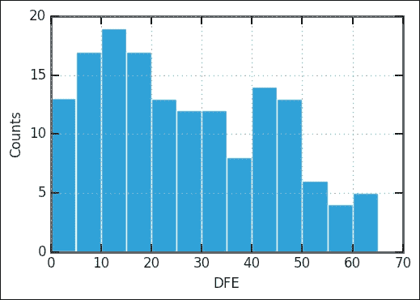

DFE > 50 度的国家较少；然而，似乎仍然有足够的对比和回归。目测一下数值，似乎我们拥有的 DFE > 50 的国家和 DFE < 50 的国家一样多。现阶段的一种可能性是绑定数据。基本上，这是取直方图仓和该仓内所有速率的平均值，让仓的中心代表位置和平均值，即值。为了绑定数据，我们使用 Pandas 中的`groupby`方法和 NumPy 的数字化功能:

```py
bins = np.arange(23.5, 65+1,10, dtype='float') 
groups_rates = rates.groupby(np.digitize(rates.DFE, bins)) 

```

数字化查找每个库的输入数组的索引。`groupby`方法然后获取索引列表，从输入数组中获取这些位置，并将它们放在一个单独的数据组中。现在，我们准备绘制未绑定和绑定的数据:

```py
import matplotlib.patches as patches 
import matplotlib.transforms as transforms 
fig = plt.figure() 
ax = fig.add_subplot(111) 
ax.errorbar(groups_rates.mean().DFE,  
      groups_rates.mean().Both,  
      yerr=np.array(groups_rates.std().Both), 
      marker='.',  
      ls='None', 
      lw=1.5, 
      color='g',  
      ms=1) 
ax.plot(rates.DFE, rates.Both, '.', color='SteelBlue', ms=6) 
trans = transforms.blended_transform_factory( 
      ax.transData, ax.transAxes) 
rect = patches.Rectangle((0,0), width=23.5, height=1, 
      transform=trans, color='yellow', alpha=0.5) 
ax.add_patch(rect) 
ax.set_xlabel('DFE') 
ax.set_ylabel('Both'); 

```

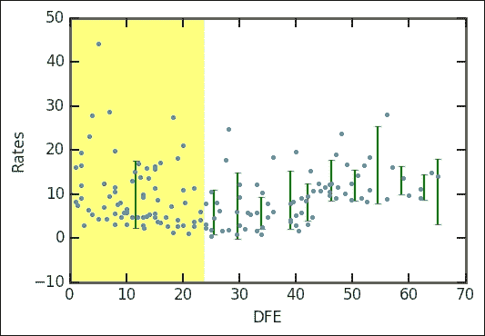

我们现在进行线性回归，检验我们的假设，即较少的阳光意味着较高的自杀率。和以前一样，我们使用 SciPy 中的`linregress`:

```py
From scipy.stats import linregress 
mindfe = 30 
selection = ~rates.DFE.isnull() * rates.DFE>mindfe 
rv = rates[selection].as_matrix(columns=['DFE','Both']) 
a, b, r, p, stderr = linregress(rv.T) 
print('slope:{0:.4f}\nintercept:{1:.4f}\nrvalue:{2:.4f}\npvalue:{3:.4f}\nstderr:{4:.4f}'.format(a, b, r, p, stderr)) 

```

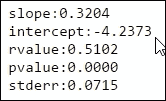

这里引入`mindfe`参数只是为了拟合一条 DFE 高于此的直线；你可以用这个值做实验。从逻辑上讲，我们将从`DFE`是`23.5`的地方开始；对于不同的值，您会得到稍微不同的结果。在我们的例子中，我们使用 30 度。如果你愿意，你可以用`linregress`的输出绘制结果，就像上一章一样。

作为`linregress`的替代拟合方法，我们可以使用强大的`statsmodels`包。默认情况下，它安装在 Anaconda 3 Python 发行版中。`statsmodels`包有一个简单的方法来输入变量之间的假设关系；与 R 型公式相同，从 0.5.0 版本开始包含在`statsmodels`中。我们想测试`rates.DFE`和`rates.Both`之间的线性关系，所以我们用`DFE ~ Both`把这个告诉`statsmodels`。我们只是给出了数据框的键/列名之间的关系。

### 注

公式框架使得表达你想要适合的关系变得非常简单明了。除了`Y ~ X + Z`等关系，还可以在公式中加入函数，如`Y ~ X + np.log10(Z)`，考察更复杂的关系。

该函数采用**普通最小二乘** ( **OLS** )方法拟合，基本上使拟合与数据之差的平方最小(也称为`loss`函数):

```py
import statsmodels.formula.api as smf 
mod = smf.ols("DFE ~ Both", rates[selection]).fit() 
print(mod.summary()) 

```

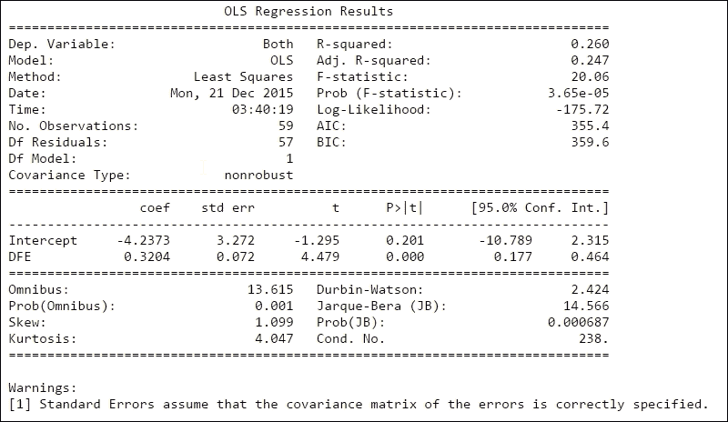

第一部分，即顶部表格的左侧给出了一般信息。因变量( **Dep。变量**)表示拟合变量的名称。**模型**说明我们在拟合中使用了什么模型；除了 OLS，还有其他几款车型如**加权最小二乘** ( **WLS** )。列出观测值的数量(**号观测值**)和残差的自由度( **Df 残差**，即观测值的数量(59)减去通过拟合 2 确定的参数( *k* )和 *k* )。 **Df 模型**显示确定了多少参数(除了常数，即截距)。顶部表格右侧的表格显示了模型与数据吻合程度的信息。r 平方以前被覆盖过；这里还列出了调整后的 R 平方值( **Adj. R 平方**)，这是针对数据点数量和自由度校正后的 R 平方值。 **F 统计**数字给你一个拟合有多重要的估计。实际上，它是模型的均方误差除以残差的均方误差。下一个值，Prob(F-统计量)，给出了如果零假设为真，即变量不相关，得到 F-统计量的概率。之后是三组`log-likelihood`函数值:拟合的对数似然值、**阿卡克信息准则** ( **AIC** )和**贝叶斯信息准则** ( **BIC** )。AIC 和 BIC 是调整对数似然函数的多种方法，用于观察数和模型类型。

在此之后，有一个确定参数的表格，其中，对于每个参数，显示估计值(`coeff`)、估计值的标准误差(`std err`)、t 统计值(`t`)、P 值(P > |t|)和 95%置信区间。低于固定置信水平的 P 值，这里为 0.05(即 5%)，表明`data`和`model`参数之间存在统计上显著的关系。

最后一部分显示了与拟合残差分布相关的几个统计测试的结果。关于这些的信息可以在文献和 statsmodels 文档([http://statsmodels.sourceforge.net/](http://statsmodels.sourceforge.net/))中找到。一般来说，误差(残差)形状(偏斜度)的前几个测试:偏斜度、峰度、综合和 Jarque-Bera。剩下的测试误差是否独立(即自相关)——杜宾-沃森——或者拟合参数如何相互关联(对于多元回归)——T2 条件数 ( **条件数。否**)。

由此，我们现在可以说，每 100，000 名居民中，每增加 30 度以上的绝对纬度，自杀率大约增加 0.32+/-0.07。与绝对纬度(DFE)的相关性较弱。很低的 Prob(F-statistics)值表明我们可以以相当高的确定性拒绝两个变量不相关的零假设，低的 *P > |t|* 值表明 DFE 与自杀率之间存在关系。

我们现在可以用数据绘制拟合曲线。为了获得图中绘制的拟合的不确定性，我们使用内置的`wls_prediction_std`函数，该函数计算具有 1 个标准偏差不确定性的下限和上限。这里的 WLS 代表加权最小二乘法，一种类似于 OLS 的方法，但是输入变量的不确定性是已知的并且被考虑在内。这是 OLS 更普遍的情况；为了计算不确定性的界限，它是相同的:

```py
from statsmodels.sandbox.regression.predstd import wls_prediction_std 
prstd, iv_l, iv_u = wls_prediction_std(mod) 
fig = plt.figure() 
ax = fig.add_subplot(111) 
rates.plot(kind='scatter', x='DFE', y='Both', ax=ax) 
xmin, xmax = min(rates['DFE']), max(rates['DFE']) 
ax.plot([mindfe, xmax],  
        [mod.fittedvalues.min(), mod.fittedvalues.max()],  
        'IndianRed', lw=1.5) 
ax.plot([mindfe, xmax], [iv_u.min(), iv_u.max()], 'r--', lw=1.5) 
ax.plot([mindfe, xmax], [iv_l.min(), iv_l.max()], 'r--', lw=1.5) 
ax.errorbar(groups_rates.mean().DFE,  
            groups_rates.mean().Both,  
            yerr=np.array(groups_rates.std().Both), 
            ls='None', 
            lw=1.5, 
            color='Green') 
trans = transforms.blended_transform_factory( 
    ax.transData, ax.transAxes) 

rect = patches.Rectangle((0,0), width=mindfe, height=1, 
                         transform=trans, color='Yellow', 
                         alpha=0.5) 
ax.add_patch(rect) 
ax.grid(lw=1, ls='dashed') 
ax.set_xlim((xmin,xmax+3)); 

```

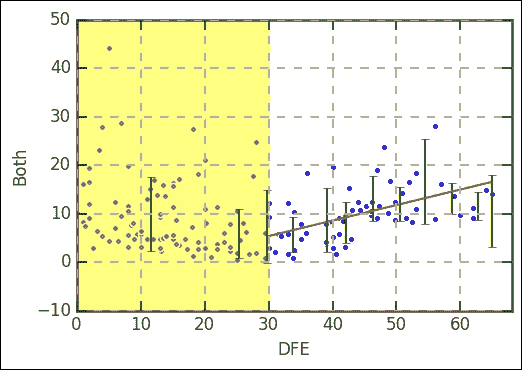

有相当多的研究显示了自杀率和纬度的相关性(例如， *Davis GE* 和 *Lowell WE* ， *Can J 精神病学*。 *2002 年 8 月；47(6):572-4* 。*纬度与自杀率变化直接相关的证据*。).然而，一些研究使用较少的国家(20 个)，所以他们可能会遭受选择偏差，也就是说，不小心选择了那些倾向于强相关性的国家。然而，从这些数据中有趣的是，在更高的纬度似乎有一个最低自杀率，这有利于某种关系。

这里需要记住的几件事如下:

*   围绕这一趋势有一个明显的扩散。这表明这不是世界范围内自杀率蔓延的主要原因之一。然而，它确实表明这是可能影响它的事情之一。
*   一开始，我们取坐标质心；有些国家跨越很长的纬度范围。因此，该国的利率可能会有所不同。
*   虽然我们假设与一个人每年接收的阳光量直接相关的是与纬度成正比的，天气当然也在我们看到和获得的阳光量中起作用。
*   很难解释性别数据；也许女人和男人一样尝试自杀，但失败的次数更多，然后得到适当的帮助。这将使数据产生偏差，因此我们认为男性更倾向于自杀。

从长远来看，暴露在阳光下的时间会影响体内维生素 D 的产生。许多研究试图弄清楚所有这些因素是如何影响人体的。这种复杂性的一个迹象来自于研究表明，越靠近赤道，自杀率的季节性变化越大(坎特，希基和德利奥，精神病理学 2000；33:303-306)，表明日光照射的增加和突然变化会增加自杀风险。人体对日晒变化的反应是释放或抑制各种激素(褪黑素、血清素、L-色氨酸等)的释放；荷尔蒙水平的突然变化似乎增加了自杀的风险。

对自杀率的另一个潜在影响是经济指标。因此，我们现在将尝试通过多元回归来看看这三个变量之间是否存在相关性。

# 多元回归

在本节中，我们将向之前构建的线性模型添加第二个变量。我们现在用来表示相关性的函数基本上变成了一个平面，*y = k<sub>2</sub>x<sub>2</sub>+k<sub>1</sub>x<sub>1</sub>+k<sub>0</sub>*。请记住 *x <sub>1</sub>* 和 *x <sub>2</sub>* 是不同的轴/尺寸。澄清一点，我们也可以写成*z = k<sub>2</sub>y+k<sub>1</sub>x+k<sub>0</sub>*。正如本章开头所述，我们可以把它写成矩阵乘法。我们选择纳入的变量是一个经济变量，即**国内生产总值** ( **GDP** )。正如之前假设的那样，该国的经济可能会影响自杀率，因为预防自杀需要一个发达的医疗系统来隔离有需要的人并提供帮助，这是昂贵的。

## 增加经济指标

幸运的是，在这种情况下，Pandas 有一个内置的远程数据模块，可以用来获取某些指标(http://Pandas . py data . org/Pandas-docs/stable/remote _ data . html)。目前，可以从 Pandas 直接查询的服务如下:

*   雅虎！金融
*   谷歌金融
*   圣路易美联储(弗雷德)
*   肯尼斯·弗伦奇的数据库
*   世界银行
*   谷歌分析

要向世界银行查询人均国内生产总值指标，我们只需搜索一下:

```py
from pandas.io import wb 
wb.search('gdp.*capita.*').iloc[:,:2] 

```

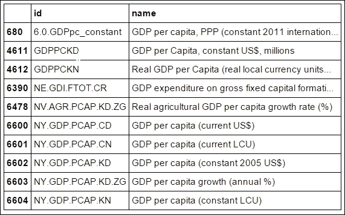

### 注

在 Pandas 即将推出的版本中，`pandas.io.data`模块将是一个名为`pandas-datareader`的独立包。如果您在更新时碰巧看到此内容，请安装`pandas-datareader` ( `conda install pandas-datareader`)并用`from pandas_datareader import wb`替换进口`from pandas.io import wb`。

我们要找的指标是人均国内生产总值(目前为美元)。现在我们可以非常简单的方式下载这个数据集，直接询问它的`ID`、`NY.GDP.PCAP.PP.CD`:

```py
dat = wb.download(indicator='NY.GDP.PCAP.PP.CD', country='all', start=2014, end=2014) 
dat.head() 

```

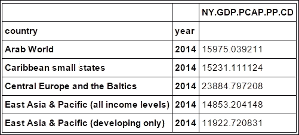

数据结构有点复杂，所以我们需要让它对我们来说更容易访问。我们通过将数据放入数组并创建一个名为*数据*的新 Pandas 数据帧来实现这一点:

```py
country = np.array(dat.index.tolist())[:,0] 
gdp = np.array(np.array(dat['NY.GDP.PCAP.PP.CD'])) 
data = pd.DataFrame(data=np.array([country,gdp]).T, columns=['country', 'gdp']) 
print(dat['NY.GDP.PCAP.PP.CD'].head()) 
print(data.head()) 

```

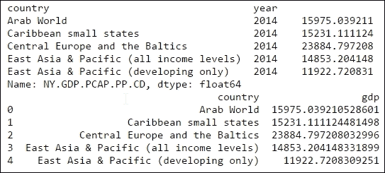

数据现在对我们来说更容易访问，并且格式与以前的数据集相同。就像坐标质心一样，我们需要匹配国家名称，并将相关数据放入 rates 对象中。我们以与之前完全相同的方式进行:

```py
rates['GDP_CD'] = '' 
for i in np.arange(len(data)): 
    ind = rates.Country.isin([data.country[i] 
    val = data.loc[i, ['gdp']].values.astype('float') 
    rates.loc[ind]), ['GDP_CD'] ] = val 
    rates.loc[rates.GDP_CD.isin(['']), ['GDP_CD']] = np.nan 

```

为了检查是否一切正常，我们可以打印其中一个项目。在这个例子中，我们看看瑞典:

```py
print(rates[rates.Country=='Sweden']) 
print(data[data.country=='Sweden']) 
print(data.loc[218, ['gdp']].values.astype('float')) 
rates.loc[rates.Country.isin(['Sweden'])] 

```

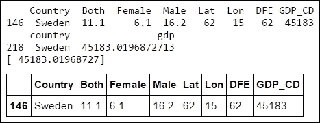

看起来我们做对了。当我们使用 **DFE** 时，我们定义了一个`mindfe`变量。我们在这里使用它来选择那些满足高于我们之前设置的最小纬度的国家，并且也应该有 DFE 的值。然后我们将有国内生产总值的行添加到选择中:

```py
selection = ~rates.DFE.isnull() * rates.DFE>mindfe 
selection *= ~rates.GDP_CD.isnull() 

```

首先检查国内生产总值和自杀率之间是否有明显的相关性:

```py
plt.plot(rates[selection].GDP_CD.values,rates[selection].Both.values, '.', ms=10) 
plt.xlabel('GDP') 
plt.ylabel('Suicide rate'); 

```

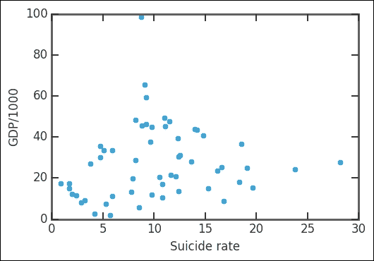

这似乎是一种非常广泛的关系。我们添加了 DFE 变量，并将标记的大小绘制为自杀率:

```py
plt.scatter(rates[selection].GDP_CD.values/1000,   
          rates[selection].DFE.values,              s=rates[selection].Both.values**1.5) 
plt.xlabel('GDP/1000') 
plt.ylabel('DFE') 

```


似乎高 GDP 国家的 DFE 高，但自杀率也高。现在，当然，我们想用一个线性模型来拟合。基本上，模型将是一个适合这些点的平面。为此，我们可以再次使用`statsmodels`，对于绘图，我们导入 matplotlib 3D 轴:

```py
import statsmodels.api as sm 

A = rates[selection][['DFE', 'GDP_CD']].astype('float') 
A['GDP_CD'] = A['GDP_CD']/1000 
b = rates[selection]['Both'].astype('float') 
A = sm.add_constant(A) 
est = sm.OLS(b, A).fit() 

```

首先，我们选择拟合所需的数据，`DFE`和`GDP_CD`用于`A`矩阵。然后，我们运行拟合，假设自杀率依赖于`A`(即 DFE 和 GDP)。为了让它工作，我们必须添加一个常量值的列(`1`)；`statsmodels`开发者提供了这样一个我们可以使用的功能。注意，我们展示了如何在`statsmodels`中使用另一种定义拟合函数的方式，这种方式不是 R 公式方法，而是使用 NumPy 数组。被拟合的线性函数正是我们在本节开头所讨论的，它是下面的关系:

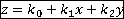

这里，我们用矩阵乘法表示变量之间的关系(即通过拟合例程找到 *k <sub>0</sub>* 、 *k <sub>1</sub>* 、 *k <sub>2</sub>* )。注意这里的不同导入；该方法被称为 **OLS** (大写字母)，而不是 **ols** ，后者与上例中的公式一起使用。我们现在可以用数据绘制拟合曲线:

```py
from mpl_toolkits.mplot3d import Axes3D 
X, Y = np.meshgrid(np.linspace(A.DFE.min(), A.DFE.max(), 100),    np.linspace(A.GDP_CD.min(), A.GDP_CD.max(), 100)) 
Z = est.params[0] + est.params[1] * X + est.params[2] * Y 
fig = plt.figure(figsize=(12, 8)) 
ax = Axes3D(fig, azim=-135, elev=15) 
surf = ax.plot_surface(X, Y, Z, cmap=plt.cm.RdBu, alpha=0.6,    linewidth=0) 
ax.scatter(A.DFE, A.GDP_CD, y, alpha=1.0) 
ax.set_xlabel('DFE') 
ax.set_ylabel('GDP_CD/1000') 
ax.set_zlabel('Both'); 

```

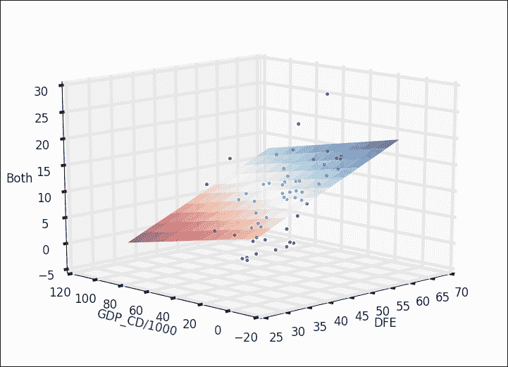

在 Axes3D 对象创建过程中，可以使用`azim`和`evel`关键字控制查看方向。为了绘制平面，我们使用 NumPy 中的`meshgrid`函数来创建坐标网格，然后使用拟合例程中确定的参数来获得平面的值。再一次，为了得到合适的摘要，我们打印它:

```py
print(est.summary()) 

```

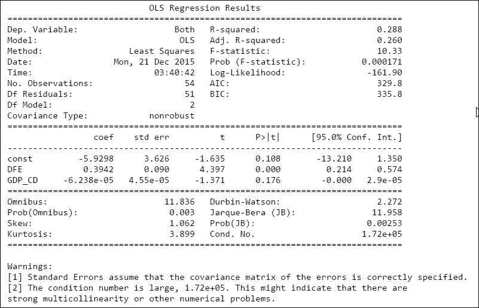

得到的 r 平方类似于仅使用 DFE 时得到的 r 平方。这个假设并非完全错误；然而，情况比这两个变量复杂得多。这反映在拟合结果中。国内生产总值的系数很小，非常接近于零(-6.238 × 10 <sup>-5</sup> ，也就是说，对国内生产总值的依赖没有纬度那么明显。那么*>| t |*的价值观呢——你能从中得出什么结论？此外，由于条件数较高，还会出现多重共线性警告。因此，一些拟合变量可能是相互依赖的。

## 后退一步

记住我们把 DFE 值低的东西都剪掉；让我们检查完整数据集的外观。在这个剧情中，你也看到我们使用了另一个魔法命令(以`%`开头)；我们使用 notbook 绘图界面，而不是 matplotlib 内联。这为您提供了直接在 Jupyter 笔记本中平移、缩放和保存数据的交互式控件:

```py
%matplotlib notebook 
selection2 = ~rates.DFE.isnull() 
plt.scatter(rates[selection2].GDP_CD.values/1000,    rates[selection2].DFE.values, s=rates[selection2].Both.values**1.5) 
plt.xlabel('GDP/1000') 
plt.ylabel('DFE'); 

```


根据自杀率引入标记的大小，我们可以看到数据中似乎至少有两个自杀率较高的主要集群——一个是国内生产总值和绝对纬度较低的集群，一个是自杀率较高的集群。我们将在下一章中使用它来继续我们的分析，并尝试识别集群。因此，我们应该保存这些数据，但是我们首先创建一个只包含所需列的新数据框:

```py
data=pd.DataFrame(data=rates[['Country','Both','Male','Female','GDP_CD', 'DFE']][~rates.DFE.isnull()]) 
data.head() 

```

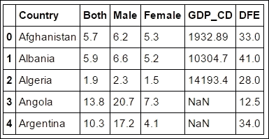

我们只包括有 DFE 的数据；尽管如此，一些行仍然缺乏国内生产总值。现在我们已经创建了一个新的数据框，保存它非常容易。这一次，我们以更标准化的格式保存它，即 HDF 格式:

```py
TABLE_FILE = 'data_ch4.h5' 
data.to_hdf(TABLE_FILE, 'ch4data', mode='w', table=True) 

```

该代码将数据保存到当前目录的`data_ch4.h5`文件中。

### 注

**HDF** 代表**分层数据格式**；它是由**国家超级计算应用中心** ( **NCSA** )开发的科学数据格式，专门针对大型数据集。它在从/向磁盘读写大数据方面非常快。大多数主要的编程语言都有与 HDF 文件交互的库。当前的旧版格式版本是 HDF 版本 5。

要读取 HDF 数据，我们只需使用 Pandas 的`read_hdf`功能:

```py
d2 = pd.read_hdf(TABLE_FILE) 

```

您现在可以运行`d2.head()`进行健全性检查，是否与我们写入文件的内容相同。记住在下一章把这个文件放在手边。

# 逻辑回归

迄今为止的例子都是连续变量。但是，其他变量是离散的，可以是二进制类型。离散二进制变量的一些常见例子是某个城市在某一天是否下雪，病人是否携带病毒，等等。二元逻辑回归和线性回归的主要区别之一是，在二元逻辑回归中，我们在给定测量(离散或连续)变量的情况下拟合结果的概率，而线性回归模型处理两个或多个连续变量相互依赖的特征。逻辑回归给出了给定一些观察变量的发生概率。概率有时表示为 *P(Y|X)* ，读作*给定变量 X* 值为 Y 的概率。

猜测离散结果的算法被称为分类算法，是机器学习技术的一部分，这将在本书后面介绍。

逻辑回归模型可以表示如下:

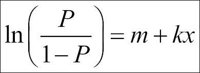

求解 *P* 的这个方程，我们得到逻辑概率:

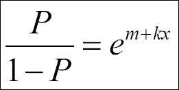

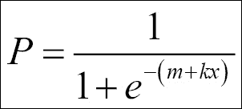


就像线性回归一样，我们可以给问题增加几个维度(因变量):

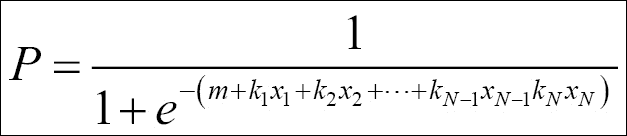

为了说明这个函数是什么样子，以及与拟合线性模型的区别，我们绘制了两个函数:

```py
k = 1\. 
m = -5\. 
y = lambda x: k*x + m 
#p = lambda x: np.exp(k*x+m) / (1+np.exp(k*x+m)) 
p = lambda x: 1 / (1+np.exp(-1*(k*x+m))) 

xx = np.linspace(0,10) 
plt.plot(xx,y(xx), label='linear') 
plt.plot(xx,p(xx), label='logistic') 
plt.plot([0,abs(m)], [0.5,0.5], dashes=(4,4), color='.7') 
plt.plot([abs(m),abs(m)], [-.1,.5], dashes=(4,4), color='.7') 

# limits, legends and labels 
plt.ylim((-.1,1.1)) 
plt.legend(loc=2) 
plt.ylabel('P') 
plt.xlabel('xx') 

```

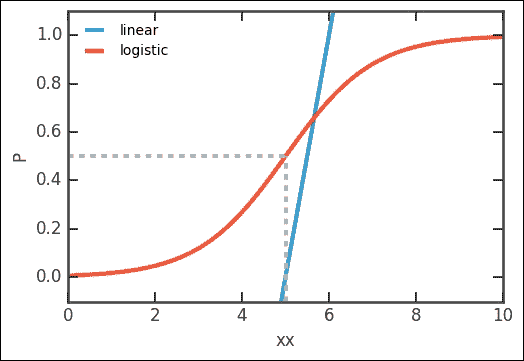

可以清楚地看到，S 形曲线，我们的逻辑拟合函数(更一般地称为 **sigmoid 函数**，可以更好地说明二元逻辑概率。玩转`k`、`m`，我们很快意识到`k`决定坡度的陡度，`m`左右移动曲线。我们还注意到 *P(Y|xx=5) = 0.5* ，即在 *xx=5* 时，结果 Y(对应`P=1`)有 50%的概率。

想象一下，我们问学生他们为了考试学习了多长时间。我们能查一下你需要学习多长时间才能相当肯定地通过吗？为了研究这个，我们需要使用逻辑回归。考试只有通过或失败的可能，也就是说，它是一个二进制变量。首先，我们需要创建数据:

```py
studytime=[0,0,1.5,2,2.5,3,3.5,4,4,4,5.5,6,6.5,7,7,8.5,9,9,9,10.5,10.5,12,12,12,12.5,13,14,15,16,18] 
passed=[0,0,0,0,0,0,0,0,0,0,0,1,0,1,1,0,1,1,0,1,1,1,1,1,1,1,1,1,1,1] 
data = pd.DataFrame(data=np.array([studytime, passed]).T, columns=['Time', 
                    'Pass']) 
data.Time.hist(bins=6) 
plt.xlabel('Time') 
plt.ylabel('No. students'); 

```

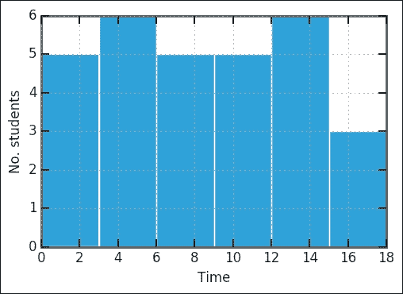

绘制的第一件事是学生花了多少时间准备考试的柱状图。这似乎是一个相当平坦的分布。在这里，我们将检查他们的考试成绩:

```py
plt.plot(data.Time, data.Pass,'o', mew=0, ms=7,) 
plt.ylim(-.1,1.1) 
plt.xlim(-0.2,16.2) 
plt.xlabel('Time studied') 
plt.ylabel('Pass? (0=no, 1=yes)'); 

```

这个图现在将显示某人学习了多少时间以及考试的结果——如果他们通过了，给出的值是`1.0` ( `yes`)或者如果他们失败了，给出的值是`0.0` ( `no`)。 *x* 轴从 0 小时(一个完全不学习的学生)到 18 小时(一个学习更多的学生)。

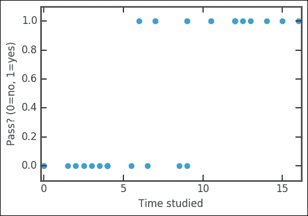

通过简单地检查数字，似乎至少需要 5-10 个小时才能通过考试。我们再次使用 statsmodels 将数据与我们的模型进行拟合。在 statsmodels 中，有一个执行逻辑回归的`logit`函数:

```py
import statsmodels.api as sm 
probfit = sm.Logit(data.Pass, sm.add_constant(data.Time, prepend=True)) 

```

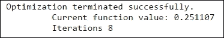

优化成功了；如果出现任何问题，就会打印错误信息。运行拟合后，检查摘要是一个好主意:

```py
fit_results = probfit.fit() 
print(fit_results.summary()) 

```

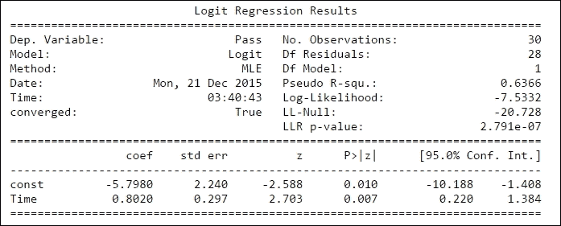

`const`变量是拟合函数的截距，即`k`，时间是截距，`m`。协方差参数可用于通过取协方差矩阵对角线的平方根来估计标准差:

```py
logit_pars = fit_results.params 
intercept_err, slope_err = np.diag(fit_results.cov_params())**.5 
fit_results.cov_params() 

```


然而，statsmodels 也给出了参数的不确定性，这可以从拟合总结输出中看出:

```py
intercept = logit_pars['const'] 
slope = logit_pars['Time'] 
print(intercept,slope)
-5.79798670884 0.801979232718
```

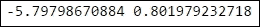

也可以直接打印出置信区间:

```py
fit_results.conf_int() 

```

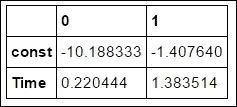

现在，在数据的顶部绘制拟合曲线是合适的。我们已经估计了拟合函数的参数:

```py
plt.plot(data.Time, data.Pass,'o', mew=0, ms=7, label='Data') 
p = lambda x,k,m: 1 / (1+np.exp(-1*(k*x+m))) 
xx = np.linspace(0,data.Time.max()) 
l1 = plt.plot(xx, p(xx,slope,intercept), label='Fit') 
plt.fill_between(xx, p(xx,slope+slope_err**2, intercept+intercept_err), p(xx,slope-slope_err**2, intercept-intercept_err), alpha=0.15, color=l1[0].get_color()) 
plt.ylim(-.1,1.1) 
plt.xlim(-0.2,16.2) 
plt.xlabel('Time studied') 
plt.ylabel('Pass? (0=no, 1=yes)') 
plt.legend(loc=2, numpoints=1); 

```

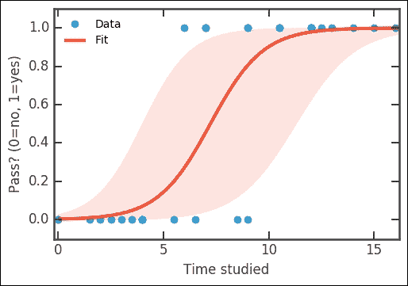

这里，我们不仅绘制了最佳拟合曲线，还绘制了一个标准差对应的曲线。不确定性包含许多价值。现在，通过估计的参数，可以计算出我们应该学习多长时间才能获得 50%的成功机会:

```py
target=0.5 
x_prob = lambda p,k,m: (np.log(p/(1-p))-m)/k 
T_max = x_prob(target, slope-slope_err, intercept-intercept_err) 
T_min = x_prob(target, slope+slope_err, intercept+intercept_err) 
T_best = x_prob(target, slope, intercept) 
print('{0}% sucess rate: {1:.1f} +{2:.1f}/-    {3:.1f}'.format(int(target*100),T_best,T_max-T_best,T_best-T_min))
50% success rate: 7.2 +8.7/-4.0
```

所以这次考试学习 7.2 小时，通过的几率大概是 50%。不确定性相当大，50%的通过几率也可能是 15 个小时左右的学习，或者少到 3 个小时。当然，为考试而学习不仅仅是投入的绝对小时数。然而，由于根本不学习，通过的机会非常渺茫。

## 一些注意事项

逻辑回归假设拐点处，即 S 曲线的中途，概率为 0.5。没有真正的理由假设这总是真的；因此，使用允许拐点移动的模型可能是更普遍的情况。然而，这将增加另一个参数来估计，并且，考虑到输入数据的质量，这可能不会使其更容易或增加可靠性。

# 总结

在本章中，我们研究了线性回归、多元回归和逻辑回归。我们从网上获取数据，清理数据，并将其映射到我们感兴趣的数据结构。统计学的世界是巨大的，甚至对于这些有些简单的概念和方法也有许多特殊的领域。对于回归分析，需要注意的是，相关性并不总是意味着因果关系，也就是说，仅仅因为两个变量之间存在相关性，并不意味着它们在本质上相互依赖。有些网站显示了这些虚假的相关性；其中一些相当有趣([http://www.tylervigen.com/spurious-correlations](http://www.tylervigen.com/spurious-correlations))。

在下一章中，我们将研究聚类技术来发现数据中的相似之处。我们将从一个示例开始，该示例使用了我们在本章中执行多元回归分析时保存的相同数据。