# 六、贝叶斯方法

贝叶斯推理是统计学的不同范式；它不是一种方法或算法，如聚类分析或线性回归。它仅次于经典统计分析。到目前为止，我们在这本书里所做的一切，以及你在经典(或频繁)统计分析中所能做的一切，你都可以在贝叶斯统计中做。经常性统计(经典)和贝叶斯统计的主要区别在于，经常性统计假设模型参数是固定的，而贝叶斯假设它们有一个范围，一个分布。因此，从频率计方法中，直接从数据中创建点估计值(均值、方差或固定模型参数)是很容易的。点估计对于数据是唯一的；每个新数据集都需要新的点估计。

在本章中，我们将涵盖以下主题:

*   贝叶斯分析的例子:一个是我们试图识别时间序列中的一个转换点，另一个是线性回归，我们比较了来自 *[第 4 章](104.html "Chapter 4. Regression")**回归*的方法
*   如何从贝叶斯分析评估多芯片组件运行
*   关于在地图上绘制坐标的非常简短的介绍，这在呈现和调查数据时非常重要

# 贝叶斯方法

从贝叶斯方法来看，数据被视为固定的。一旦我们测量了东西，数值就固定了。另一方面，参数可以用概率分布来描述。概率分布描述了对某个参数的了解程度。如果我们获得新数据，这种描述可能会改变，但模型本身不会改变。关于这方面的文献很多，对于什么时候使用频繁者分析或者什么时候使用贝叶斯分析没有经验法则。

对于简单且表现良好的数据，我想说，当您需要快速估算时，频繁方法是可以的。为了获得更多的见解和更多的约束问题，也就是说，当我们更多地了解我们的参数并且可以用比简单的一致先验更多的先验来估计先验分布时，最好使用贝叶斯方法。由于贝叶斯分析中对事物的处理略显直观，因此更容易构建更复杂的模型，回答更复杂的问题。

## 可信区间与置信区间

突出差异的一个好的常见方法是将常客的置信区间与贝叶斯统计中的相应概念，可信区间进行比较。置信区间来自于频繁者方法，其中参数是固定的。置信区间基于观察的重复。98%的置信区间是指重复实验大量测量参数并计算每个实验的区间，98%的区间将包含参数的值。这可以追溯到数据是随机的这一事实。

可信(或概率)区间源于概率，即贝叶斯方法。这意味着参数是随机的，我们可以说，给定数据，参数的真实值有 98%的概率在区间内。

## 贝叶斯公式

贝叶斯分析归结为贝叶斯公式；因此，一个关于贝叶斯分析的章节，如果没有提到贝叶斯公式，就没有多大价值。在贝叶斯分析中，所做的一切都可以用概率陈述来表达:

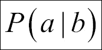

这被理解为给定`b`的概率，其中`b`是数据，`a`是你试图估计的参数。通过贝叶斯分析，我们建立了可以用数据进行测试的模型。贝叶斯分析(推理)使用概率分布作为我们正在构建(测试)的模型(假设)的输入。

有了行李统计的一些先验知识，我们写出了贝叶斯公式:

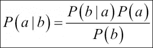

贝叶斯公式来自条件概率。用文字描述，后验概率是观测值(给定参数)乘以参数先验的概率除以整个参数空间的积分。正是这个分母给分析带来了麻烦，因为为了计算它，我们需要使用一些高级分析；在这些例子中，使用了**马尔可夫链蒙特卡罗** ( **MCMC** )算法。我们假设您熟悉贝叶斯公式的基础知识。我们将看到如何在 PyMC 包的帮助下用 Python 实现分析。

## Python 包

Python 中一个流行的贝叶斯分析包是 PyMC([http://pymc-devs.github.io/pymc/](http://pymc-devs.github.io/pymc/))。PyMC 是一个积极开发的包，使贝叶斯模型和 Python 中的拟合变得容易理解和直接。可用的拟合算法之一是 MCMC，它也是使用最多的算法之一。还有其他套餐，如特色丰富的司仪套餐([http://dan.iel.fm/emcee/current/](http://dan.iel.fm/emcee/current/))。我们将在本书中使用 PyMC。要在 Anaconda 中安装 PyMC，请打开 Anaconda 命令提示符(或终端窗口)并使用 conda 命令安装 PyMC:

```py
conda install pymc

```

它将检查 Anaconda Python 包索引，并下载和安装/升级 PyMC 的必要依赖项。接下来，我们可以启动一个新的 Jupyter Notebook，并输入默认导入。

# 美国航空旅行安全记录

在本例中，我们将查看来自美国**国家运输安全委员会** ( **NTSB** )的数据集。NTSB 有一个开放的数据库，可以从他们的网页[http://www.ntsb.gov](http://www.ntsb.gov)下载。数据中有一点很重要，那就是包含了美国境内*的民航事故和选定的事件，其领土和属地，以及国际水域*，也就是说，它不是针对整个世界的。基本上，它只适用于与美国相关的事故，这对于美国的国家组织来说是有意义的。有包含整个世界的数据库，但其中的字段较少。例如，NTSB 数据集包含有关事故轻伤的信息。为了进行比较，并作为练习的开始，在对 NTSB 数据进行贝叶斯分析后，我们将加载并快速查看由 Socrata([https://opendata.socrata.com](https://opendata.socrata.com))从 OpenData 获得的覆盖全球的数据集。我们想在这一部分调查的问题是，飞机事故的统计数据是否随时间有任何跳跃。另一个来源是航空安全网([https://aviation-safety.net](https://aviation-safety.net))。在开始分析之前，有一点很重要，那就是我们应该再次读入真实的原始数据，并清除掉不需要的部分，这样我们才能专注于分析。这需要几行代码，但是覆盖这一点非常重要，因为这向您展示了真正发生的事情，并且您将比我给您完整的清理和减少的数据(或者甚至用*随机*噪声创建的数据)更好地理解结果和数据。

## 获取 NTSB 数据库

从 NTSB 下载数据，进入他们的网页([http://www.ntsb.gov](http://www.ntsb.gov)，点击**航空事故数据库**，选择**全部下载(文本)**。现在应该下载并保存数据文件`AviationData.txt`，供您读入。

数据集包含特定事故发生时间的日期戳。为了能够将日期读入 Python 理解的格式，我们需要用 datetime 包解析日期字符串。日期时间包是 Python 附带的标准包(以及 Anaconda 发行版):

```py
from datetime import datetime

```

现在让我们读入数据。为了节省您的时间，我重新定义了列名，以便更容易访问。现在，您应该已经熟悉了非常有用的Pandas`read_csv`功能:

```py
aadata = pd.read_csv('data/AviationData.txt',
                     delimiter='|',
                     skiprows=1,
                     names=['id', 'type', 'number', 'date',
       'location', 'country', 'lat', 'long', 'airport_code',
       'airport_name', 'injury_severity', 'aircraft_damage',
       'aircraft_cat', 'reg_no', 'make', 'model',
       'amateur_built', 'no_engines', 'engine_type', 'FAR_desc',
       'schedule', 'purpose', 'air_carrier', 'fatal',
       'serious', 'minor', 'uninjured',
       'weather', 'broad_phase', 'report_status',
       'pub_date', 'none'])
```

列出列名表明这里有丰富的数据，例如事故的位置、纬度和经度、机场代码和名称等等:

```py
aadata.columns

```

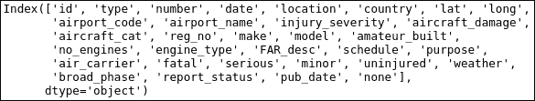

在查看数据并尝试以下一些操作后，您会发现一些日期条目是空的，也就是说，只包含空格()。像以前一样，我们可以使用`apply` ( `-map`)函数找到带有空白的条目，并替换这些值。在这种情况下，我将使用匹配表达式`!=`，即`not equal to`产生的布尔数组快速过滤掉它们(我们只需要带有日期的行)。这是因为，如开头所述，我们想知道事故是如何随时间变化的:

```py
selection = aadata['date'] != '  ' 
aadata = aadata[selection] 

```

现在实际的日期字符串有点棘手。他们有`MONTH/DAY/YEAR`格式(对我这个欧洲人来说，这是不合逻辑的)。标准的`datetime`模块可以做这项工作，只要我们告诉它日期是什么格式。实际上，Pandas 可以在读取带有`parse_dates=X`标志的数据时解析这一点，其中`X`要么是列索引整数，要么是列名字符串。

然而，有时它在没有投入大量工作的情况下不能很好地工作，就像在我们的例子中一样，所以我们将自己解析它。这里，我们将其解析到新的列`datetime,`中，其中每个日期都通过`strptime`函数转换成一个`datetime`对象。其中一个原因是日期是用空格括起来的。所以给出的是`02/18/2016`而不是`02/18/2016`，这也是为什么我们给出的日期格式规范是`%m/%d/%Y`，也就是四周有空白。这样，`strptime`功能就知道它是什么样子了:

```py
aadata['datetime'] = [datetime.strptime(x, ' %m/%d/%Y ') for x in 
  aadata['date']]
```

现在我们有了`datetime`对象，Python 知道日期意味着什么。只检查年份或月份可能会在以后变得有趣。为了方便使用，我们将它们保存在单独的列中。有了这样一个适中的数据集，我们可以创建许多列，而不会明显减慢速度:

```py
aadata['month'] = [int(x.month) for x in aadata['datetime']]
aadata['year'] = [int(x.year) for x in aadata['datetime']]

```

现在我们也希望日期是十进制的年份，这样我们就可以一年一年地绑定它们，并计算年度统计数据。为了做到这一点，我们想看看某个日期已经过去了一年的哪一部分。在这里，我们写了一个小函数，这个解决方案的灵感部分来自于网上的各种答案。我们调用`datetime`函数来创建代表一年的开始和结束的对象。我们需要把`year+1`放在这里，如果我们不这样做，`month=12`和`day=31`将在新年前后产生无意义的值(例如，2017 年，而现在仍然是 2016 年)。如果你在谷歌上搜索这个问题，有很多不同的好答案和方法(有些需要安装额外的软件包):

```py
def decyear(date): 
    start = datetime(year=date.year, month=1, day=1) 
    end = datetime(year=date.year+1, month=1, day=1) 
    decimal = (date-start)/(end-start) 
    return date.year+decimal 

```

有了这个函数，我们可以将其应用到我们表格的`datetime`列中的每个元素。由于所有的列行已经包含一个`datetime`对象，我们刚刚创建的函数愉快地接受输入:

```py
aadata['decyear'] = aadata['datetime'].apply(decyear) 

```

现在，列`Latitude,` `Longitude,` `uninjured,` `fatalities,`和`serious and minor injuries`应该都是浮点数而不是字符串，以便于计算和其他操作。所以我们用`applymap`方法把它们转换成浮点数。以下代码将把空字符串转换成`Nan`值，把数字转换成浮点数:

```py
cols = ['lat', 'long',  
        'fatal', 
        'serious', 
        'minor',  
        'uninjured'] 
aadata[cols] = aadata[cols].applymap( 
        lambda x: np.nan if isinstance(x, str)  
                    and x.isspace() else float(x)) 

```

我们只是将 lambda 函数应用于给定列中的所有条目，该函数将值转换为浮点数，将空字符串转换为 NaN。现在让我们绘制数据图，看看我们是否需要进一步修整或处理它:

```py
plt.figure(figsize=(9,4.5)) 
plt.step(aadata['decyear'], aadata['fatal'],  
         lw=1.75, where='mid', alpha=0.5, label='Fatal') 
plt.step(aadata['decyear'], aadata['minor']+200,  
         lw=1.75,where='mid', label='Minor') 
plt.step(aadata['decyear'], aadata['serious']+200*2,  
         lw=1.75, where='mid', label='Serious') 
plt.xticks(rotation=45) 
plt.legend(loc=(0.01,.4),fontsize=15) 
plt.ylim((-10,600)) 
plt.grid(axis='y') 
plt.title('Accident injuries {0}-{1}'.format( 
            aadata['year'].min(), aadata['year'].max())) 
plt.text(0.15,0.92,'source: NTSB', size=12,  
         transform=plt.gca().transAxes, ha='right') 
plt.yticks(np.arange(0,600,100), [0,100,0,100,0,100]) 
plt.xlabel('Year') 
plt.ylabel('No injuries recorded') 
plt.xlim((aadata['decyear'].min()-0.5,
          aadata['decyear'].max()+0.5));

```

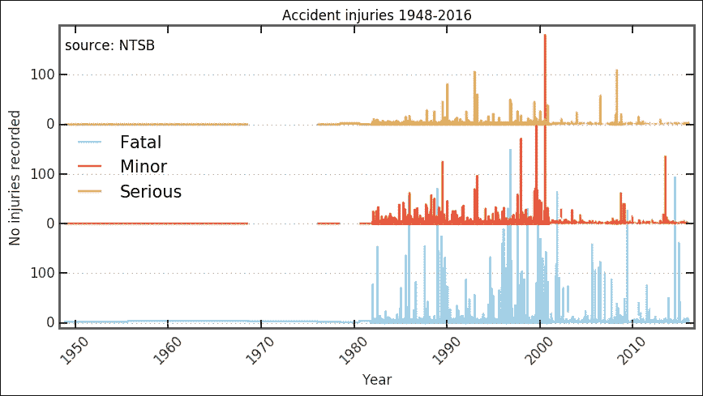

1980 年前后的可用数据非常稀少，不适合统计解释。在决定做什么之前，让我们检查这些条目的数据。为了查看记录的事故数量，我们绘制了当时的柱状图。这里，我们通过组合两个布尔数组来使用过滤器。我们还通过给出年份来改变`bins`参数，从 1975 年到 1990 年；这样，我们就知道了`bins`将是每年:

```py
plt.figure(figsize=(9,3))
plt.subplot(121)
year_selection = (aadata['year']>=1975) & (aadata['year']<=2016)
plt.hist(aadata[year_selection]['year'].as_matrix(), 
         bins=np.arange(1975,2016+2,1), align='mid')
plt.xlabel('Year'); plt.grid(axis='x')
plt.xticks(rotation=45);
plt.ylabel('Accidents recorded')
plt.subplot(122)
year_selection = (aadata['year']>=1976) & (aadata['year']<=1986)
plt.hist(aadata[year_selection]['year'].as_matrix(), 
         bins=np.arange(1976,1986+2,1), align='mid')
plt.xlabel('Year')
plt.xticks(rotation=45);

```

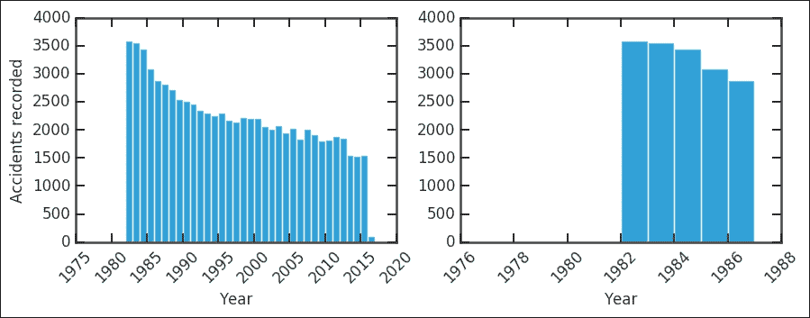

事故的绝对数量在 35 年里大约减少了一半；鉴于乘客人数肯定增加了，这是非常好的。右边的图显示，在 1983 年之前，NTSB 记录的事故很少。用该标准列出的表格显示了六个记录的事故:

```py
aadata[aadata['year']<=1981]

```

经过这次彻底检查，我认为删除 1981 年以前(包括 1981 年)的条目是安全的。我不知道缺乏数据的原因；也许 NTSB 就是在这个时候建立的？他们的任务被重新制定，包括存储事件的数据库？无论如何，让我们排除这些条目:

```py
aadata = aadata[ aadata['year']>1981 ]

```

创建与之前相同的图形，这是我们可以看到的:

```py
plt.figure(figsize=(10,5))
plt.step(aadata['decyear'], aadata['fatal'], 
         lw=1.75, where='mid', alpha=0.5, label='Fatal')
plt.step(aadata['decyear'], aadata['minor']+200, 
         lw=1.75,where='mid', label='Minor')
plt.step(aadata['decyear'], aadata['serious']+200*2, 
         lw=1.75, where='mid', label='Serious')
plt.xticks(rotation=45)
plt.legend(loc=(0.8,0.74),fontsize=15)
plt.ylim((-10,600))
plt.grid(axis='x')
plt.title('Accidents {0}-{1}'.format(
          aadata['year'].min(), aadata['year'].max()))

plt.text(0.135,0.95,'source: NTSB', size=12, 
         transform=plt.gca().transAxes, ha='right')
plt.yticks(np.arange(0,600,100), [0,100,0,100,0,100])
plt.xlabel('Year')
plt.ylabel('No injuries recorded')
plt.xlim((aadata['decyear'].min()-0.5,
          aadata['decyear'].max()+0.5));

```

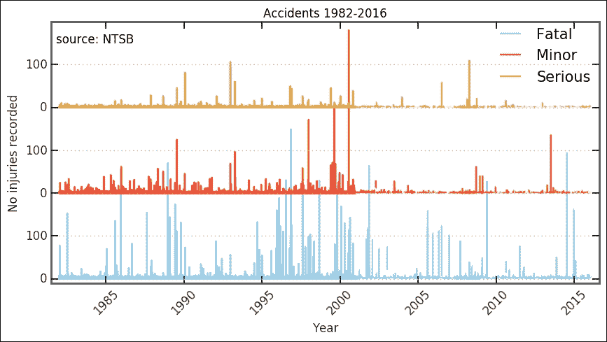

我们现在有了一个可以使用的干净数据集。目前仍很难区分任何趋势，但在千年转移前后，趋势发生了变化。然而，为了进一步了解可能发生的情况，我们希望绑定数据并查看各种关键数字。

## 宁滨各项数据

在本节中，我们将按年份绑定数据。这是为了让我们更好地了解数据的总体趋势，这将带我们进入表征和分析的下一步。

如前所述，我们希望绑定每年的数据来查看每年的趋势。我们在 *[第四章](104.html "Chapter 4. Regression")**回归*之前做过宁滨；我们用Pandas的`groupby`方法`DataFrame`。这里有两种方法来定义垃圾箱，我们可以使用 NumPy 的`digitize`功能，也可以使用 Pandas cut 功能。我在这里使用了数字化功能，因为它通常更有用；您可能不会总是使用Pandas作为您的数据(出于某些原因):

```py
bins = np.arange(aadata.year.min(), aadata.year.max()+1, 1 )
yearly_dig = aadata.groupby(np.digitize(aadata.year, bins))

```

我们现在可以计算每个箱子的统计数据。我们可以得到总和、最大值、平均值等等:

```py
yearly_dig.mean().head()

```

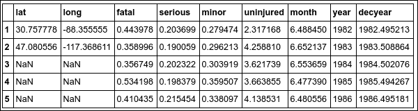

此外，请确保您度过了这些年:

```py
np.floor(yearly_dig['year'].mean()).as_matrix()

```

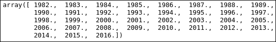

更重要的是，我们可以把它形象化。下面的函数将绘制条形图，并将各个字段堆叠在一起。作为输入，它采用 Pandas `groups`对象、字段名列表(`< 3`)以及哪个字段名用作 *x* 轴。然后，有一些定制和调整，使它看起来更好。其中值得注意的是`fig.autofmt_xdate(rotation=90, ha='center')`功能，它会自动为您格式化日期。可以给它发送各种参数；在这种情况下，我们使用它来旋转和水平对齐 x 刻度标签(作为日期):

```py
def plot_trend(groups, fields=['Fatal'], which='year', what='max'): 
    fig, ax = plt.subplots(1,1,figsize=(9,3.5)) 
    x = np.floor(groups.mean()[which.lower()]).as_matrix() 
    width = 0.9 
    colors = ['LightSalmon', 'SteelBlue', 'Green'] 
    bottom = np.zeros( len(groups.max()[fields[0].lower()]) ) 
    for i in range(len(fields)): 
        if what=='max': 
            ax.bar(x, groups.max()[fields[int(i)].lower()],
                   width, color=colors[int(i)],
                   label=fields[int(i)], align='center',
                   bottom=bottom, zorder=4) 
bottom += groups.max()[ 
fields[int(i)].lower() 
].as_matrix() 
        elif what=='mean': 
            ax.bar(x, groups.mean()[fields[int(i)].lower()],  
                   width, color=colors[int(i)],
                   label=fields[int(i)], 
                   align='center', bottom=bottom, zorder=4) 
            bottom += groups.mean()[
                                    fields[int(i)].lower()
                                    ].as_matrix() 
    ax.legend(loc=2, ncol=2, frameon=False) 
    ax.grid(b=True, which='major',
            axis='y', color='0.65',linestyle='-', zorder=-1) 
    ax.yaxis.set_ticks_position('left') 
    ax.xaxis.set_ticks_position('bottom') 
    for tic1, tic2 in zip(
                          ax.xaxis.get_major_ticks(),
                          ax.yaxis.get_major_ticks()
                          ): 
        tic1.tick1On = tic1.tick2On = False 
        tic2.tick1On = tic2.tick2On = False 
    for spine in ['left','right','top','bottom']: 
        ax.spines[spine].set_color('w') 
    xticks = np.arange(x.min(), x.max()+1, 1) 
    ax.set_xticks(xticks) 
    ax.set_xticklabels([str(int(x)) for x in xticks]) 
    fig.autofmt_xdate(rotation=90, ha='center') 
    ax.set_xlim((xticks.min()-1.5, xticks.max()+0.5)) 
    ax.set_ylim((0,bottom.max()*1.15)) 
    if what=='max': 
        ax.set_title('Plane accidents maximum injuries') 
        ax.set_ylabel('Max value') 
    elif what=='mean': 
        ax.set_title('Plane accidents mean injuries') 
        ax.set_ylabel('Mean value') 
    ax.set_xlabel(str(which)) 
    return ax 

```

现在，让我们用它来绘制从 1982 年到 2016 年时间跨度内每年最大的致命、严重和轻微伤害:

```py
ax = plot_trend(yearly_dig, fields=['Fatal','Serious','Minor'], 
  which='Year')
```

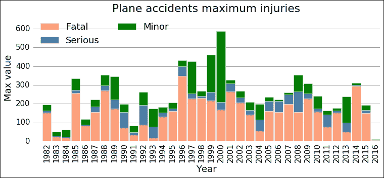

占主导地位的酒吧是致命的酒吧——至少从这个视觉检查来看是如此——所以当事情在飞机事故中变得非常糟糕时，大多数人都会受到致命的伤害。这里奇怪的是，最大值似乎有一个变化，在 1991 年和 1996 年之间的某个地方有一个跳跃。之后，看起来最大死亡人数的平均值更高。这就是我们将在下一节中尝试用贝叶斯推理建模的内容。

## 数据的贝叶斯分析

现在我们可以深入到这个分析的贝叶斯部分。您应该始终按照我们在前面练习中所做的方式检查数据。这些步骤通常在文本中被跳过，甚至使用捏造的数据；这描绘了一幅简化的数据分析图。我们必须与数据一起工作才能有所收获，并了解什么样的分析是可行的。首先，我们需要从 Matplot 子模块导入 PyMC 包和绘图函数。该函数绘制了参数后验分布、轨迹(即每次迭代)和自相关的摘要:

```py
import pymc
from pymc import Matplot as mcplt

```

为了开始分析，我们将`x`和`y`值、年份和最大死亡人数存储在数组中:

```py
x = np.floor(yearly_dig.mean()['year']).as_matrix() 
y = yearly_dig.max()['fatal'].as_matrix() 

```

现在我们通过定义一个包含所有参数和数据的函数来开发我们的模型。这是一个离散的过程，所以我们使用泊松分布。此外，我们使用早期和晚期平均利率的指数分布；这适用于这个随机过程。试着画出死亡人数的直方图，看看它有什么分布。对于发生跳跃/切换的年份，我们使用离散的均匀分布，也就是说，它对于上下界之间的所有值都是平坦的，其他地方为零。由各种随机变量决定的变量，后期、前期均值，切换点是跳跃前后的均值。因为它依赖于(随机)变量，所以被称为确定性变量。在代码中，这是由`@pymc.deterministic()`装饰器标记的。这就是我们试图模拟的过程。PyMC 内置了几个发行版，但您也可以定义自己的发行版。然而，对于大多数问题，内置的应该可以解决。各种可用的分布在`pymc.distributions`子模块中:

```py
def model_fatalities(y=y):  
    s = pymc.DiscreteUniform('s', lower=5, upper=18, value=14) 
    e = pymc.Exponential('e', beta=1.) 
    l = pymc.Exponential('l', beta=1.) 
    @pymc.deterministic(plot=False) 
    def m(s=s, e=e, l=l): 
        meanval = np.empty(len(y)) 
        meanval[:s] = e 
        meanval[s:] = l  
        return meanval 
    D = pymc.Poisson('D', mu=m, value=y, observed=True) 
    return locals() 

```

`return locals()`是一种将所有局部变量发送回去的简单方法。因为我们对它们有一个很好的概述，所以使用起来不成问题。我们现在已经定义了模型；为了在 MCMC 采样器中使用它，我们将模式作为 MCMC 类的输入:

```py
np.random.seed(1234) 
MDL = pymc.MCMC(model_fatalities(y=y)) 

```

为了使用标准采样器，我们可以简单地调用`MDL.sample(N)`方法，其中`N`是要运行的迭代次数。还有其他参数；你可以给它一个磨合期，一个不考虑结果的时期。这是 MCMC 算法的一部分，有时让它运行几次被丢弃的迭代会很好，这样它就可以开始收敛。第二，我们可以给出一个单薄的论据；这就是保存迭代结果的频率。在我们的例子中，我运行了 50，000 次，其中 5，000 次迭代是老化和减二。尝试用各种数字运行，看看结果是否改变，如何改变，以及参数估计得如何:

```py
MDL.sample(5e4, 5e3, 2) 

```

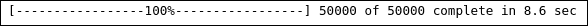

step 方法，即如何在参数空间中移动，也可以改变。要检查我们有什么步骤方法，我们运行以下命令:

```py
MDL.step_method_dict 

```

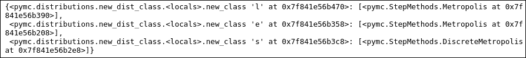

要更改步长方法，可能是使用自适应步长(长度)的自适应 Metropolis 算法，我们将导入它并运行以下内容:

```py
from pymc import AdaptiveMetropolis 
MDL = pymc.MCMC(model_fatalities(y=y)) 
MDL.use_step_method(AdaptiveMetropolis, MDL.e) 
MDL.use_step_method(AdaptiveMetropolis, MDL.l) 
MDL.sample(5e4, 5e3, 2) 

```

不过，我们不会在这里这样做；这是针对变量高度相关的问题。我把这个作为一个练习留给你们测试，还有不同的先验参数分布。

现在我们在`MDL`对象中有了整个运行。从这个对象，我们可以估计参数并绘制它们的后验分布。所有这些都有方便的功能。下面的代码向您展示了如何提取后验分布和标准差的平均值。这是可信区间出现的地方；我们有可信的参数区间，而不是置信区间:

```py
early = MDL.stats()['e']['mean'] 
earlyerr = MDL.stats()['e']['standard deviation'] 
late = MDL.stats()['l']['mean'] 
lateerr = MDL.stats()['l']['standard deviation'] 
spt = MDL.stats()['s']['mean'] 
spterr = MDL.stats()['s']['standard deviation'] 

```

在绘制结果和所有数字之前，我们必须检查 MCMC 运行的结果，为此，我们绘制了所有随机参数的轨迹、后验分布和自相关。我们使用开始时导入的`pymc.Matplot`模块中的`plot`功能来完成此操作:

```py
mcplt.plot(MDL)

```

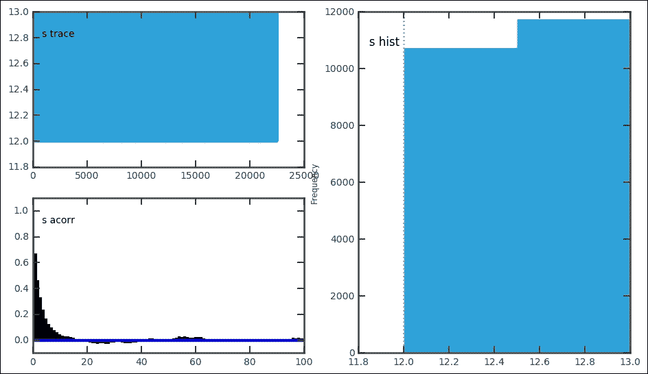

该函数将这三件事绘制在一个图形中。这对于快速评估结果非常方便。看所有的情节很重要；他们给出了跑步进展如何的线索:


对于每个随机变量，绘制轨迹、自相关和后验分布:

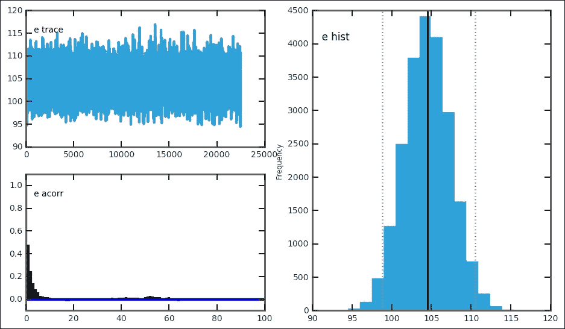

在我们的例子中，这给出了`e`、`l`和`s`各一个数字。在每个图中，左上角的图显示了轨迹或时间序列。跟踪是每次迭代的值。可以通过`late`参数的`MDL.trace('l')[:]`进入。尝试获取跟踪，并为其绘制跟踪与迭代和直方图；它们看起来应该和这些一样。对于一个好的模型设置，跟踪应该围绕最佳估计随机波动，就像早期和`later`参数的跟踪一样。自相关图应该在 0 处有一个峰值；如果曲线图在较高的`x`值处显示大量值，则表明您需要增加 thin 变量。跳跃/切换点的轨迹和后验分布看起来不同。然而，因为它是一个离散变量，并且被限制在一年内，所以它只显示一个峰值，并且轨迹遵循这个峰值。因此，切换点受到非常小的可信区间的良好约束。在`pymc.Matplot`模块`(mcplt`中，可以使用相关功能单独绘制图中的每个图。可以使用以下命令生成`l`变量的自相关图:

```py
mcplt.autocorrelation(MDL.l)

```

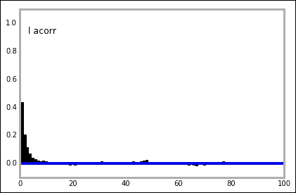

现在，我们已经构建了一个模型，运行了采样器，并提取了最佳估计参数，我们可以绘制结果。模型识别的跳转/切换点只是年数组中的一个指标，所以我们需要找到该指标/位置对应的年份。为此，我们使用 NumPy 的`floor`函数向下舍入，然后我们可以将其转换为整数并对`x`数组进行切片，这是我们在开始创建的年份数组:

```py
s = int(np.floor(spt)) 
print(spt, spterr, x[s]) 

```

前面的代码给出了`12.524`、`0.499423667841`和`1994.0`作为输出。

为了用结果构建图，我们可以再次使用前面定义的函数，但是这次我们只关注致命伤害，所以我们给出了不同的场参数。为了绘制可信区间，我在这里使用`fill_between`函数；这是一个非常方便的功能，并完全按照它所说的去做。此外，我使用了更强大的注释功能，而不是图中的`text`功能，我们可以用一个漂亮的框来定制它:

```py
ax = plot_trend(yearly_dig, fields=['Fatal'], which='Year') 
ax.plot([x[0]-1.5,x[s]],[early,early], 'k', lw=2) 
ax.fill_between([x[0]-1.5,x[s]], 
                [early-3*earlyerr,early-3*earlyerr], 
                [early+3*earlyerr,early+3*earlyerr], 
               color='0.3', alpha=0.5, zorder=2) 
ax.plot([x[s],x[-1]+0.5],[late,late], 'k', lw=2) 
ax.fill_between([x[s],x[-1]+0.5], 
                [late-3*lateerr,late-3*lateerr],  
                [late+3*lateerr,late+3*lateerr],  
                color='0.3', alpha=0.5, zorder=2) 
ax.axvline(int(x[s]), color='0.4', dashes=(3,3), lw=2) 
bbox_args = dict(boxstyle="round", fc="w", alpha=0.85) 
ax.annotate('{0:.1f}$\pm${1:.1f}'.format(early, earlyerr),  
            xy=(x[s]-1,early),  
            bbox=bbox_args, ha='right', va='center') 
ax.annotate('{0:.1f}$\pm${1:.1f}'.format(late, lateerr),  
            xy=(x[s]+1,late),  
            bbox=bbox_args, ha='left',va='center') 
ax.annotate('{0}'.format(int(x[s])),xy=(int(x[s]),300),  
            bbox=bbox_args, ha='center',va='center'); 

```

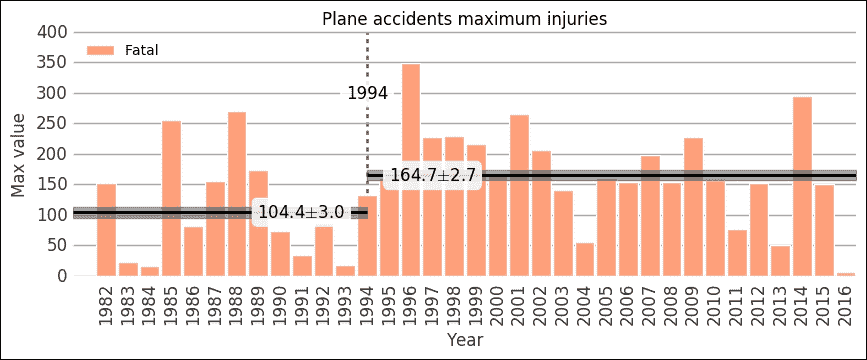

给定数据，参数在范围`104.5+/-3.0`和`164.7+/- 2.7`内，可信度为 95%(即`+/-1`σ)。一年中平均最高死亡人数有所增加，并在 1994 年左右从`104.5`人跃升至`164.7`人。虽然从图中可以看到 2004 年和 2012-2013 年，但最大值并没有遵循同样的趋势。即使这是一个简单的模型，也很难主张一个更复杂的模型，并且结果是显著的。当然，目标应该是每年零死亡。

我们分析了每年的统计数据；如果我们看看这一年的统计数据呢？为此，我们需要每月绑定。所以在下一部分，这就是我们要做的。

### 宁滨按月

重复我们的宁滨程序，但是按月重复:

```py
bins = np.arange(1, 12+1, 1 ) 
monthly_dig = aadata.groupby(np.digitize(aadata.month, bins)) 
monthly_dig.mean().head() 

```

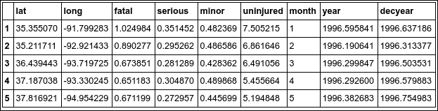

现在我们可以做同样的事情，但是每个月；只需将正确的参数发送到我们创建的`plot_trend`函数:

```py
ax = plot_trend(monthly_dig, fields=['Fatal', 'Serious', 'Minor'],
  which='Month') 
ax.set_xlim(0.5,12.5); 

```

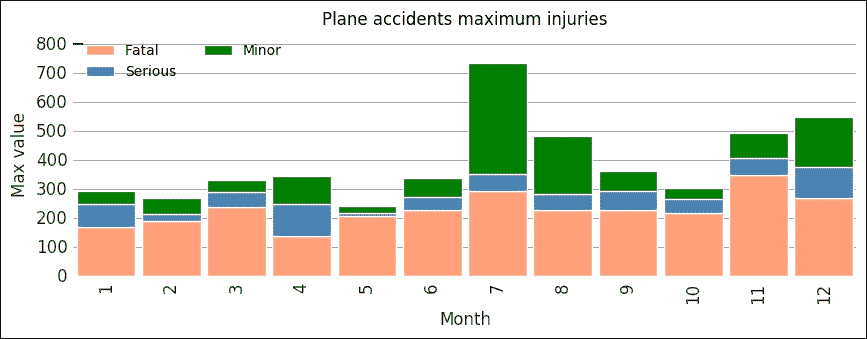

虽然没有强烈的趋势，但我们可以注意到，第 7 和第 8 个月、7 月和 8 月，以及第 11 和第 12 个月、11 月和 12 月，都有较高的值。夏天和圣诞节是一年中最受欢迎的旅游时间，所以这可能反映了每年游客数量的变化。更多的旅行者意味着事故数量的增加(风险不变)，因此发生高死亡率事故的可能性更大。另一个问题是均值变异是什么样子的；到目前为止，我们所做的是最大限度的。我在绘图功能中增加了一个参数`what`，并将其设置为`mean`，这将导致平均值被绘制。我把这个作为练习；你会看到一些奇怪的意思。试着创造不同的情节来调查！另外，不要忘记检查每月和每年的平均值。

最后一个情节也突出了一些其他的东西——乘客的总数可能会影响结果。要获取美国的乘客总数，您可以运行以下命令:

```py
from pandas.io import wb 
airpasstot = wb.download(indicator='IS.AIR.PSGR',  
       country=['USA'], start=1982, end=2014) 

```

但是，查看这些数据并将其与我们在这里处理的数据进行比较，这只是留给您的一个练习。

为了让您体验 Python 可能实现的一些强大的可视化，我想在地图上快速绘制每个事故的坐标。在这种情况下，这当然不是必须的，但是有时可视化结果是很好的，在 Python 中，如何做到这一点并不明显。所以这一部分对于本章来说不是必须的，但是知道如何用 Python 在地图上绘制东西的基础知识是很好的，因为我们研究的很多东西都取决于地球上的位置。

## 标绘坐标

为了绘制坐标，我们(不幸地)必须安装软件包。更不幸的是，这取决于你运行的是什么操作系统和 Python 发行版。我们将在这里快速介绍的两个包是 mpl_toolkits 包的底图模块和制图包。

第一个，mpl_toolkits，在 Windows 上不工作(截至 2016 年 4 月)。要在 Mac 和 Linux 上安装 Anaconda 中 mpl_toolkits 的底图，请运行`conda install -c https://conda.anaconda.org/anaconda basemap`。这将安装底图及其所有依赖项。

第二个包 cartopy 依赖于 GEOS 和 proj.4 库，所以需要先安装它们。这可能有点繁琐，但是一旦安装了 GEOS(大于 3.3.3 版本)和 proj.4 库(大于 4.8.0 版本)，cartopy 就可以用`pip`命令行工具`pip install cartopy`安装了。同样，在 Windows 中，proj.4 的预构建二进制文件是 4.4.6 版本，这使得安装 cartopy 也非常困难。

对于这个快速练习，我们在单独的数组中获取每个事故的纬度和经度，因为绘图命令可能对输入格式敏感，并且可能不支持Pandas系列:

```py
lats, lons = aadata['lat'].as_matrix(), aadata['long'].as_matrix()

```

### 迦太基

首先是漫画，我们首先创建一个图形，然后给它添加轴，在这里我们必须指定图形内轴的左下和右上边缘，此外，给它一个投影，这是从漫画的 CRS 模块中获取的。在导入 CRS 模块时，我们还会导入经度和纬度的格式化程序，这只会在`x`和`y`的刻度标签上添加`N`、`S`、`E`和`W`。导入 matplotlib ticker 模块，我们可以指定 tick 标签的确切位置。我们可以用与 ticks 函数相同的方式来实现这一点。

当我们绘制事故的坐标时，有一个显示地球的背景是很好的。因此，我们用`ax.stock_img()`命令加载地球的图像。可以装载海岸线、国家和其他东西。要查看包括不同投影在内的示例和其他可能性，请查看漫画网站([http://scitools.org.uk/cartopy](http://scitools.org.uk/cartopy))。然后，我们创建一个以经纬度为坐标的散点图，并根据总死亡人数按比例缩放标记的大小。然后，我们绘制网格线、经线和纬度大圆。之后，我们只需使用导入的格式化程序和刻度位置设置程序自定义刻度位置和标签:

```py
import cartopy.crs as ccrs 
from cartopy.mpl.gridliner import LONGITUDE_FORMATTER, LATITUDE_FORMATTER 
import matplotlib.ticker as mticker 
fig = plt.figure(figsize=(12,10)) 
ax = fig.add_axes([0,0,1,1], projection=ccrs.PlateCarree()) 
ax.stock_img() 
ax.scatter(aadata['long'],aadata['lat'] , 
           color='IndianRed', s=aadata['fatal']*2, 
           transform=ccrs.Geodetic()) 
gl = ax.gridlines(crs=ccrs.PlateCarree(), draw_labels=True,
                  linewidth=2, color='gray',
                  alpha=0.5, linestyle='--') 
gl.xlabels_top = False 
gl.ylabels_right = False 
gl.xlocator = mticker.FixedLocator(np.arange(-180,180+1,60)) 
gl.xformatter = LONGITUDE_FORMATTER 
gl.yformatter = LATITUDE_FORMATTER 

```

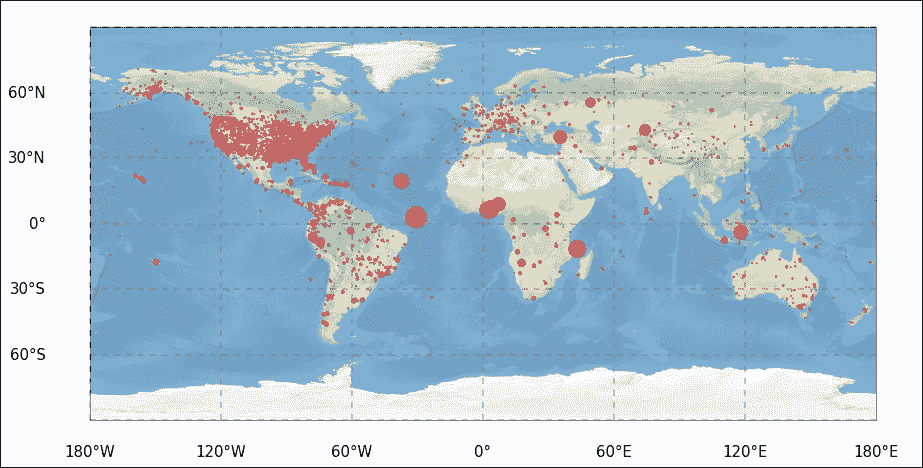

似乎大多数登记的事故发生在陆地上。我把这个数字的进一步修改留给你。查看世界各地的统计数据，能够绘制参数的空间分布图是非常有用的。

### Mpl 工具包–底图

正如承诺的那样，我们现在在 mpl_toolkits 的底图模块中生成完全相同的图。这里，我们只需要导入底图模块，不需要其他的勾号修改功能。在创建轴时不会设置投影，而是通过使用所需投影调用底图函数来创建投影。以前，我们称之为卡雷投影；这只是等距圆柱投影，在底图中，这是通过给它圆柱的投影字符串`cyl`获得的。分辨率参数为`c`，为粗略。要获得相同的背景图像，请调用`shadedrelief`命令。还有其他的背景，比如黑夜中的地球。只画海岸线或国界是可能的。底图中，很多东西都有内置功能；因此，我们现在不再调用 matplotlib 函数，而是调用`map`对象的方法来创建经线和纬线。我还包括了绘制海岸线和国家边界的功能，但是把它们注释掉了。尝试取消它们的注释，并可能注释掉背景图像的绘制:

```py
from mpl_toolkits.basemap import Basemap 
fig = plt.figure(figsize=(11,10)) 
ax = fig.add_axes([0,0,1,1]) 
map = Basemap(projection='cyl', resolution='c') 
map.shadedrelief() 
#map.drawcoastlines() 
#map.drawcountries() 
map.drawparallels(np.arange(-90,90,30),labels=[1,0,0,0],  
                  color='grey') 
map.drawmeridians(np.arange(map.lonmin,map.lonmax+30,60),  
                  labels=[0,0,0,1], color='grey') 
x, y = map(lons, lats) 
map.scatter(x, y, color='IndianRed', s=aadata['fatal']*2); 

```

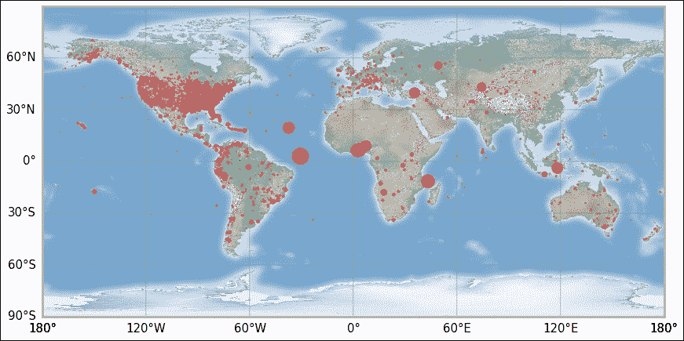

我把坐标图的进一步修改留给你。但是，这里有第一步。由于本章的主要目标是贝叶斯分析，我们现在将继续数据分析示例。

# 气候变化-大气中的一氧化碳 <sub>2</sub>

有了贝叶斯分析，我们可以拟合任何模型；任何我们可以用常客统计或经典统计做的事情，我们都可以用贝叶斯统计做。在下一个例子中，我们将使用贝叶斯推理和频繁方法执行线性回归。由于我们已经介绍了模型创建和数据解析，在这个例子中，我们将会更快地完成一些事情。我们要用的数据是大约 1000 年跨度的大气 CO <sub>2</sub> 和过去 40 年的增长率，然后用线性函数拟合过去 50-60 年的增长率。

## 获取数据

最近 50-60 年的数据来自**国家海洋和大气管理局** ( **国家海洋和大气管理局**)海洋站、**地面站**。可以在[http://www.esrl.noaa.gov/gmd/ccgg/trends/global.html](http://www.esrl.noaa.gov/gmd/ccgg/trends/global.html)找到，这里可以下载两个数据集，增长率和年均值。数据表格的直接链接是增长率(即 gr)的[ftp://aftp.cmdl.noaa.gov/products/trends/co2/co2_gr_gl.txt](ftp://aftp.cmdl.noaa.gov/products/trends/co2/co2_gr_gl.txt)和全球平均值(本例中为年度)的[。数据参考资料是美国国家海洋和大气管理局/ESRL 的 Ed Dlugokencky 和 Pieter Tans(](ftp://aftp.cmdl.noaa.gov/products/trends/co2/co2_annmean_gl.txt)[hhtp://www . esrl . NOAA . gov/gmd/ccgg/trends/](http://www.esrl.noaa.gov/gmd/ccgg/trends/))。

要追溯到更远的地方，我们需要来自南极的冰芯样本，即大约 200 年前的 SIPLE 站冰芯。在[http://cdiac.ornl.gov/trends/co2/siple.html](http://cdiac.ornl.gov/trends/co2/siple.html)，有更多的信息和数据的直接链接，[http://cdiac.ornl.gov/ftp/trends/co2/siple2.013](http://cdiac.ornl.gov/ftp/trends/co2/siple2.013)。数据参考为 1994 年的*内福特*、 *A.* 、 *H .弗里德里希*、 *E .摩尔*、 *H .罗彻*、 *H .奥斯切格*、 *U .希根塔尔*、 *B .斯陶弗*。*历史 CO <sub>2</sub> 记录来自锡普尔站冰芯。《趋势:全球变化数据概要》。美国能源部橡树岭国家实验室二氧化碳信息分析中心***美国田纳西州橡树岭*。对于更远的数据，1000 年前，我们使用来自法律穹顶的冰芯；更多信息可在[http://cdiac.ornl.gov/trends/co2/lawdome.html](http://cdiac.ornl.gov/trends/co2/lawdome.html)找到，直接链接到数据，[http://cdiac.ornl.gov/ftp/trends/co2/lawdome.smoothed.yr75](http://cdiac.ornl.gov/ftp/trends/co2/lawdome.smoothed.yr75)，参考号为 *D.M. Etheridge* 、 *L.P. Steele* 、 *R.L. Langenfelds* 、 *R.J. Francey* 、*j-m . Barnola*和 *V.I. Morgan* *历史 CO <sub>2</sub> 记录来自 Law Dome DE08、DE08-2 和 DSS 冰芯。《趋势:全球变化数据概要》。美国田纳西州橡树岭美国能源部橡树岭国家实验室二氧化碳信息分析中心*、*。**

 **正如我们已经做了几次的那样，我们用Pandas csv 阅读器读取数据:

```py
co2_gr = pd.read_csv('data/co2_gr_gl.txt',  
                  delim_whitespace=True, 
                 skiprows=62, 
                 names=['year', 'rate', 'err']) 
co2_now = pd.read_csv('data/co2_annmean_gl.txt',  
                  delim_whitespace=True, 
                 skiprows=57, 
                 names=['year', 'co2', 'err']) 
co2_200 = pd.read_csv('data/siple2.013.dat',  
                  delim_whitespace=True, 
                 skiprows=36, 
                 names=['depth', 'year', 'co2']) 
co2_1000 = pd.read_csv('data/lawdome.smoothed.yr75.dat',  
                  delim_whitespace=True, 
                 skiprows=22, 
                 names=['year', 'co2']) 

```

SIPLE 冰芯文件的最后几行还有一些附加注释:

```py
co2_200.tail() 

```

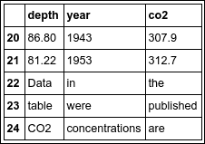

我们通过对数据帧进行切片(不包括最后三行)来删除它们:

```py
co2_200 = co2_200[:-3] 

```

由于Pandas csv 阅读器无法将最后三行解析为浮点数/整数，`dtype`不对；因为它也读取文本，它将使用最通用和可接受的数据类型。首先，检查所有数据集的数据类型，以确保我们不必修复任何其他数据集:

```py
print( co2_200['year'].dtype, co2_1000['co2'].dtype,
  co2_now['co2'].dtype, co2_gr['rate'].dtype)
```

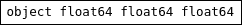

不出所料，`co2_200 DataFrame`有错误的`dtype`。我们用Pandas的`to_numeric`功能来改变它，并检查它是否有效:

```py
co2_200['year'] = pd.to_numeric(co2_200['year']) 
co2_200['co2'] = pd.to_numeric(co2_200['co2']) 
co2_200['co2'].dtype,co2_200['year'].dtype 

```

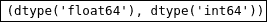

64 位整数和浮点现在分别是年度和`co2`列的新数据类型，这正是我们需要的。

## 创建和采样模型

现在让我们想象一下这一切。如前所述，数据集可以分为两部分——一部分是绝对一氧化碳 <sub>2</sub> 浓度，另一部分是增长率。CO <sub>2</sub> 浓度的单位表示为干燥空气中的摩尔分数(南极是地球上最干燥的地方之一)；在这种情况下，分数以百万分之几表示:

```py
fig, axs = plt.subplots(1,2,figsize=(10,4)) 

ax2 = axs[0] 
ax2.errorbar(co2_now['year'], co2_now['co2'],  
           #yerr=co2_now['err'], 
           color='SteelBlue', 
           ls='None',   
           elinewidth=1.5, 
           capthick=1.5, 
           marker='.', 
           ms=6) 
ax2.plot(co2_1000['year'], co2_1000['co2'], 
            color='Green', 
           ls='None',   
           marker='.', 
           ms=6) 
ax2.plot(co2_200['year'], co2_200['co2'], 
            color='IndianRed', 
           ls='None',   
           marker='.', 
           ms=6) 
ax2.axvline(1800, lw=2, color='Gray', dashes=(6,5)) 
ax2.axvline(co2_gr['year'][0], lw=2,  
color='SteelBlue', dashes=(6,5)) 
print(co2_gr['year'][0]) 
ax2.legend(['Recent',
            'LAW ice core',
            'SIPLE ice core'],fontsize=15, loc=2) 
labels = ax2.get_xticklabels() 
plt.setp(labels, rotation=33, ha='right') 
ax2.set_ylabel('CO$_2$ (ppm)') 
ax2.set_xlabel('Year') 
ax2.set_title('Past CO$_2$') 

ax1 = axs[1] 
ax1.errorbar(co2_gr['year'], co2_gr['rate'],  
           yerr=co2_gr['err'], 
           color='SteelBlue', 
           ls='None',   
           elinewidth=1.5, 
           capthick=1.5, 
           marker='.', 
           ms=8) 
labels = ax1.get_xticklabels() 
plt.setp(labels, rotation=33, ha='right') 
ax1.set_ylabel('CO$_2$ growth (ppm/yr)') 
ax1.set_xlabel('Year') 
ax1.set_xlim((1957,2016)) 
ax1.set_title('Growth rate since 1960'); 

```

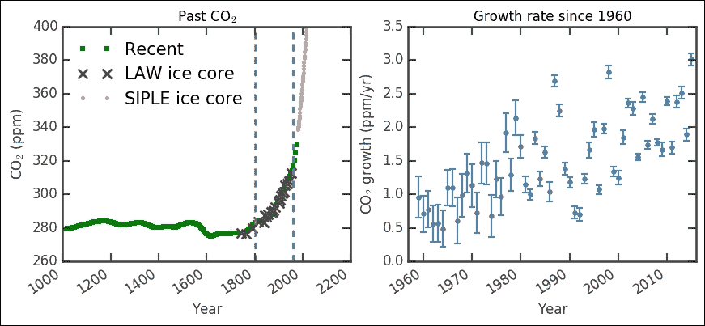

左侧显示绝对一氧化碳 <sub>2</sub> 水平的图显示冰芯与当前测量值非常吻合。第一条垂直虚线标志着工业革命(1800 年)的大致开始。尽管花了大约 50 年的时间才真正让蒸汽开始流动(双关语)，但这表明曲线从哪里开始指数增长，并一直持续到今天。在引入燃煤蒸汽机后，从相当稳定的测量值到指数增长的急剧变化之间的这种相关性是人为气候变化的有力证据。第二条垂直线表示现代直接测量的起点，即 1959 年。它们与从冰芯中提取的历史记录非常吻合。在右边的图中，我们基本上放大了那个现代时期，从 1959 年到今天；然而，它显示了大气中二氧化碳 <sub>2</sub> 以 ppm 为单位的增长(如前所述)。数据似乎在不确定性中有一些分布(表明测量技术/仪器的升级)。出于好奇，我们先来看看这个:

```py
_ = plt.hist(co2_gr['err'], bins=20) 
plt.xlabel('Uncertainty') 
plt.ylabel('Count'); 

```

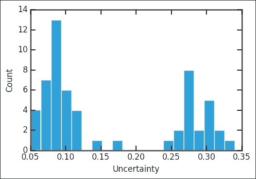

事实上，它有两个峰值，最老的值最不确定。就像我们前面的例子一样，让我们首先将我们想要的值转换成 NumPy 数组:

```py
x = co2_gr['year'].as_matrix()   
y = co2_gr['rate'].as_matrix() 
y_error = co2_gr['err'].as_matrix() 

```

现在我们已经做到了这一点，我们用与飞机事故相同的方法定义我们的线性斜坡模型。它只是一个返回随机和确定变量的函数。在我们的例子中，它是一个线性函数，取斜率和截距；这一次，我们假设它们是正态分布的，这不是一个不合理的假设。正态分布最少需要两个参数`mu`和`tau`(来自 PyMC 文档)，这就是高斯正态分布的位置和宽度:

```py
def model(x, y):  
    slope = pymc.Normal('slope', 0.1, 1.) 
    intercept = pymc.Normal('intercept', -50., 10.) 
    @pymc.deterministic(plot=False) 
    def linear(x=x, slope=slope, intercept=intercept): 
        return x * slope + intercept 
    f = pymc.Normal('f', mu=linear,  
         tau=1.0/y_error, value=y, observed=True) 
    return locals() 

```

像以前一样，我们通过调用 MCMC 来启动模型，然后从中取样 50 万次，老化 5 万次，这次减少 100 次。我建议您首先运行一些低的东西，例如 4，甚至省略它(即`MDL.sample(5e5, 5e4)`)，绘制诊断图(如下所示)，并比较结果:

```py
MDL = pymc.MCMC(model(x,y)) 
MDL.sample(5e5, 5e4, 100) 

```

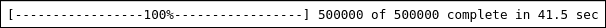

你刚刚在不到一分钟的时间里运行了 50 万次迭代！由于变薄，采样后分析会更快一些:

```py
y_min = MDL.stats()['linear']['quantiles'][2.5] 
y_max = MDL.stats()['linear']['quantiles'][97.5] 
y_fit = MDL.stats()['linear']['mean'] 

slope = MDL.stats()['slope']['mean'] 
slope_err = MDL.stats()['slope']['standard deviation'] 
intercept = MDL.stats()['intercept']['mean'] 
intercept_err = MDL.stats()['intercept']['standard deviation'] 

```

我们还应该为时间序列、后验分布和自相关创建图:

```py
mcplt.plot(MDL) 

```

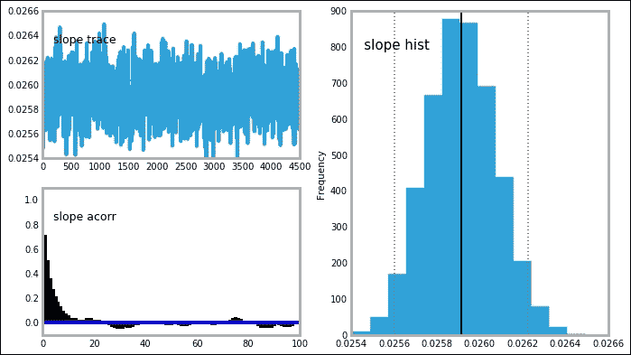

轨迹、后验分布和自相关图看起来都非常好——清晰、明确的峰值和稳定的时间序列。截距变量也是如此:

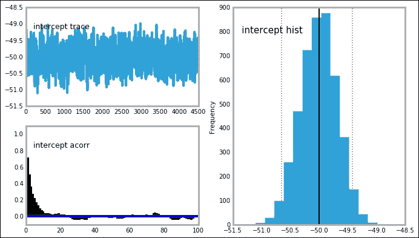

在绘制结果之前，我还想让我们使用另一个包，statsmodels 普通最小二乘拟合。就像以前一样，我们导入公式包，这样我们就可以简单地给 Pandas 列名，我们希望找到它们之间的关系:

```py
import statsmodels.formula.api as smf 
from statsmodels.sandbox.regression.predstd import wls_prediction_std 
ols_results = smf.ols("rate ~ year", co2_gr).fit() 

```

然后，我们获取最佳拟合参数及其不确定性。这里，为了方便起见，我翻转了参数元组:

```py
prstd, iv_l, iv_u = wls_prediction_std(ols_results) 
ols_params = np.flipud(ols_results.params) 
ols_err = np.flipud(np.diag(ols_results.cov_params())**.5) 

```

我们现在可以比较两种方法，最小二乘法和贝叶斯模型拟合:

```py
print('OLS: slope:{0:.3f}, intercept:{1:.2f}'.format(*ols_params)) 
print('Bay: slope:{0:.3f}, intercept:{1:.2f}'.format(slope, intercept)) 

```

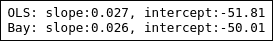

贝叶斯方法似乎能找到仅次于普通最小二乘法的最佳参数估计值。这些参数足够接近，我们可以称之为均匀，但始终接近零——这是一个有趣的观察。当我们在下一章中研究机器学习算法时，我们将回到这个相同的数据集。我还想看看置信区间和可信区间。我们用以下方法对 OLS 和贝叶斯模型进行拟合:

```py
ols_results.conf_int(alpha=0.05) 

```

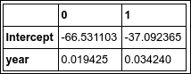

`alpha=0.05`给出置信区间水平，表示 95%置信区间(即`1-0.05=0.95`):

```py
MDL.stats(['intercept','slope']) 

```

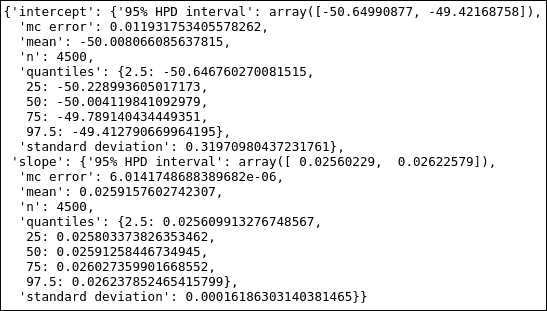

因此 OLS 拟合的截距置信水平为`[-66.5, -37.1]`，贝叶斯拟合的可信区间为`[-50.6,-49.4]`。这突出了两种方法的区别。现在让我们最后画出结果，我想在同一个图中画出两个拟合:

```py
plt.figure(figsize=(10,6)) 
plt.title('Growth rate since 1960'); 
plt.errorbar(x,y,yerr=y_error,              
        color='SteelBlue', ls='None',   
        elinewidth=1.5, capthick=1.5, 
        marker='.', ms=8,  
        label='Observed') 
plt.xlabel('Year') 
plt.ylabel('CO$_2$ growth rate (ppm/yr)') 
plt.plot(x, y_fit,  
        'k', lw=2, label='pymc') 
plt.fill_between(x, y_min, y_max,  
        color='0.5', alpha=0.5,  
        label='Uncertainty') 
plt.plot([x.min(), x.max()],  
        [ols_results.fittedvalues.min(), ols_results.fittedvalues.max()],  
        'r', dashes=(13,2), lw=1.5, label='OLS', zorder=32) 
plt.legend(loc=2, numpoints=1); 

```

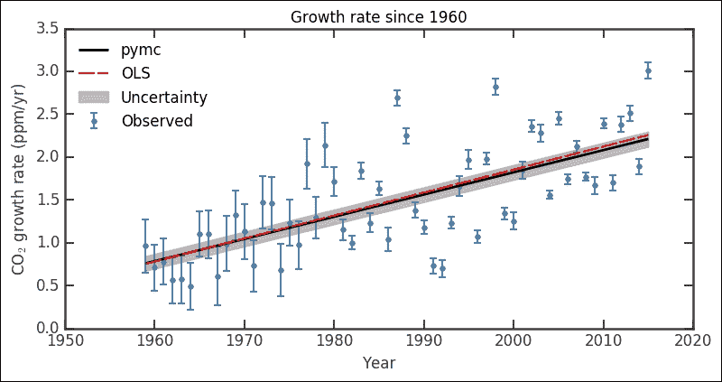

这里我用 matplotlib 函数，`fill_between`，来表示函数的可信区间。数据的拟合看起来很好，看了几次之后，你可能会意识到它看起来像是被分成了两部分——大约在 1985 年被分成了两个带有一些偏移的线性部分。你的一个练习是测试这个假设:创建一个在某一年有一个中断的两个线性段的函数，然后尝试约束模型并比较结果。为什么会这样？也许他们改变了乐器；如果你还记得，这两部分数据也有不同的不确定性，所以系统误差的差异也不是完全不可能的。

# 总结

我们已经讨论了如何使用 Python 包 PyMC 用贝叶斯分析测试模型和假设。这是一个强大的包，它给出了更直观的结果，您可以看到参数是如何表征的。并非所有后验分布的形状都像高斯分布，但是对于约束良好的参数，迹线和自相关应该看起来相似。

在下一章中，我们将深入研究 Python 中可用的一些机器学习算法，并看看它们如何识别集群、对数据进行分类以及进行线性回归。在本章中，我们将把线性拟合与贝叶斯分析和 OLS 进行比较。我们将把集群的发现与我们在 *[第五章](105.html "Chapter 5. Clustering")**集群*中对宇宙中的星系所做的分析进行比较。**