# 附录 e .关于 Jupyter 笔记本和 matplotlib 样式的更多信息

在本附录中，我们将介绍在 Jupyter Notebook 中进行数据分析和编译报告时可以帮助您的几件事。本附录涵盖以下主题:

*   Jupyter 通用笔记本提示和技巧:
    *   加快工作流程的有用键盘快捷键
    *   编辑文本单元格的标记语法简介
    *   其他一些有用的提示
*   Jupyter 笔记本扩展
*   **Matplotlib** 风格从一开始就非常适合绘图
*   有用的资源，如数据存储库、Python 包等

各种提示和技巧对于 Python 中的数据分析来说并不重要，但是让工作流变得更好、更容易，就像在项目中停下来一样，这是非常有用的。让我们直接开始，仔细看看 Jupyter Notebook 的一些优点。

# Jupyter 笔记本电脑

Jupyter Notebook 是一个交互式网络应用程序，它从编程语言内核发送/接收数据。在这本书里，我们用 Python 工作过；在 Jupyter Notebook 中也可以用其他几种编程语言工作。笔记本格式支持它所称的检查点——当您保存时，它将创建一个检查点，并且您总是可以从菜单中的**文件** | **恢复到检查点**回滚到上一个检查点。

Jupyter Notebook 解决的最重要的问题之一是它提供了您的数据分析会话的完整记录；任何人都需要这个记录和数据文件来重现你的分析。除了代码之外，记录可能包含(结构化的)文本、图像、视频、等式，甚至交互式小部件。笔记本可以编译成其他更容易共享的格式，如 PDF 和 HTML。除了这些，还可以用扩展来扩展 Jupyter Notebook 的功能。在看了一些更有用的键盘快捷键之后，我们将浏览其中的一些扩展。

## 有用的键盘快捷键

首先，我想介绍几个最有用的键盘快捷键。Jupyter Notebook 中键盘快捷键的一般方法非常简单。它有*两个*主模式:*命令*和*编辑*模式。正如您可能已经怀疑的那样，编辑模式是当您编辑单元格中的文本时，命令模式是当您在笔记本中运行命令时。可用的键盘快捷键当然会反映在您所处的模式中。但是，在这两种模式下， ***Shift*** + ***回车*** 将运行当前单元格，***Ctrl***+***S***将保存笔记本(并创建检查点)。

### 命令模式快捷方式

进入命令模式后，按下 ***Ctrl* + *M*** 或 ***Esc*** 可使用以下键盘快捷键:

*   ***B* / *A*** :这创建了一个新的单元格，*T7】BT9】下方或*T11】AT13】上方的当前单元格。**
*   ***X*/*C*/*V***:这个剪切、复制、粘贴单元格，就像你在其他程序中习惯的一样。将单元格粘贴到此处会将其粘贴到当前单元格的下方。
*   ***D**D***:这将删除一个单元格。
*   ***【Z】***:此操作撤销删除。
*   ***【L】***:此处显示行号。当获取引用代码中行号的错误消息时，这尤其有用。
*   ***M*** :这将当前单元格转换为一个标记单元格。
*   ***Shift* + *M*** :这将当前单元格与下面的单元格合并。
*   ***【O】***:切换显示/隐藏单元格正下方显示的输出。
*   ***H*** :这里显示了所有的键盘快捷键。
*   ***进入*** :进入所选单元格的编辑模式。

### 编辑模式快捷方式

当您处于编辑模式时，通过在选择您想要编辑的单元格时按下 ***进入*** ，您可以执行以下操作:

*   ***制表符*** :缩进，或制表符补全；也就是说，开始键入命令时，tab 将列出名称空间中存在的可用命令/方法/对象/变量。
*   ***Ctrl*+*Shift*+*-***:这会在当前行拆分一个单元格
*   ***Ctrl* + *A*** :选择单元格内的所有内容
*   ***Ctrl* + *Z*** :这是撤销
*   ***Ctrl*+*Shift*+*Z***:这是重做
*   ***Esc*** :进入命令模式

如上所述，这些是一些可用的键盘快捷键。在我看来，这些是最有用的。如果想查看全部*，进入命令模式，按 ***H*** 。*

 *## 标记细胞

在通过选择现有单元格并按下***【M】***创建的标记单元格中，您可以执行以下功能:

*   通过在文本前面加一个散列和空格“`#` ”来创建标题。
*   像在任何文本编辑器中一样，键入普通文本。您可以按如下方式设置文本的样式:
    *   *斜体*通过用星星包围文本，即，*text*
    *   **加粗**通过在文字周围加上两颗星，也就是，**文字* *
*   通过在每个项目符号前加一个星号来制作项目符号列表，如下所示:

    ```py
              * Item1 
              * Item 2 
                * Sub-item1 

    ```

*   通过键入`[your link text](http://your-url.com)`包括一个网址。
*   包含带有``的图像。
*   通过在列表中的每一项前面加上一个数字来制作一个编号列表。

如果您将单元格转换为标记文字，但想将其转换回代码单元格，只需按 *Ctrl + M* 或 *Esc* 进入命令模式，然后按 *Y* 转换所选单元格。

Markdown 语法非常广泛，Jupyter Notebook 遵循与 GitHub 相同的语法；因此，关于可以做什么的更多信息，请参见[https://help . github . com/articles/basic-writing-and-formatting-syntax/](https://help.github.com/articles/basic-writing-and-formatting-syntax/)。本附录随附的笔记本中也显示了一些可能性。

## 笔记本 Python 扩展

Jupyter 的功能可以通过扩展进行扩展。一些扩展仅依赖于 Jupyter，而另一些依赖于外部库和软件。其中一些灵感来自 CodeMirror 在线 JavaScript 编辑器([https://codemirror.net](https://codemirror.net))的插件或功能。可以从 GitHub 上的 IPython-contrib 存储库中安装一组特定于 Python 的扩展。收藏的网址是[https://github . com/IPython-contrib/IPython-notebook-extensions](https://github.com/ipython-contrib/IPython-notebook-extensions)。在本附录中，我们将介绍其中的一些扩展。

### 安装延伸部分

要安装扩展集合以及 Anaconda 存储库中的扩展管理器，请执行以下步骤:

1.  启动 Anaconda 命令提示符并运行以下命令:

    ```py
     conda install -c https://conda.binstar.org/juhasch nbextensions 

    ```

2.  要激活我们想要使用的一些扩展，请启动 Jupyter 笔记本。
3.  打开一个新的浏览器选项卡，转到 `http://localhost:8888/nbextensions` (其中`8888`是 Jupyter 监听的端口)。
4.  The page that you are presented with should look something like the following screenshot. The page is basically a list of the available extensions with checkboxes to activate them. If you click on the name of an extension, the page will load details about that extension:

    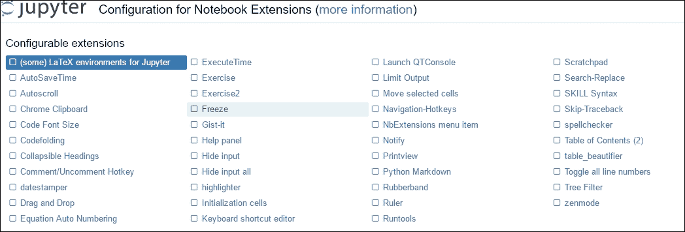

5.  现在，通过单击名称旁边的复选框，激活我们将浏览的以下扩展(按字母顺序):
    *   **代码折叠**
    *   **可折叠标题**
    *   **帮助面板**
    *   **初始化单元格**
    *   **NbExtensions 菜单项**
    *   **尺子**
    *   **跳过追溯**
    *   **目录(2)**

完成这些操作后，每个扩展旁边的复选框都会被标记，如下图所示:


### 注

要安装 GitHub 的最新版本，而不是 Anaconda 存储库中的版本(即前面的步骤 2)，您可以运行以下命令:

```py
pip install https://github.com/ipython-contrib/
IPython-notebook-extensions/archive/master.zip --user

```

根据我的经验，点击响应有点错误，所以要确保它们都被标记了。选择所有要激活的指定扩展后，您还可以配置其中一些扩展。我们将分别查看它们，但是通过单击每个扩展的名称显示的总体布局如下:

*   扩展名的名称
*   简短的描述
*   它与哪些版本的 Jupyter 笔记本兼容
*   激活/去激活按钮
*   右边的图像，大致显示了它的功能
*   扩展的可能参数/设置

之后，界面将抓取并输出自述文件，该文件采用 Markdown 语法。在这个文件中，扩展名的作者放入了任何可能有用的附加信息。在接下来的部分中，我们将一个接一个地浏览扩展。

### 代码折叠

代码折叠扩展是一个简单但非常有用的扩展。它将折叠缩进的代码行，例如，函数或类可以折叠。此外，它还会给你的选择折叠在评论。此扩展的信息窗格顶部显示如下:


作为您在自述文件中看到的示例，我将向您展示 Jupyter Notebook 在此输出的代码折叠扩展自述文件的顶部:

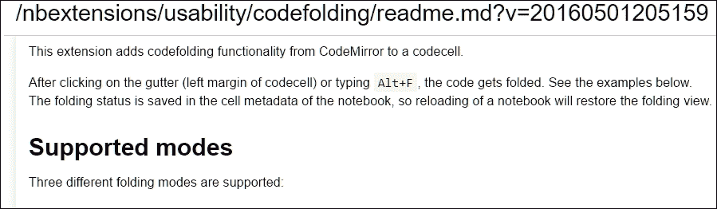

自述文件只是一个更广泛的描述，附有图片和外部链接。使用代码折叠扩展，可以在单元格中隐藏长代码片段和函数。这在下面的示例中显示。第一张图片展示了 Jupyter 笔记本中任意函数的外观:

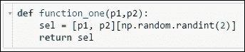

单击左边距中的小箭头会将代码折叠成一行。接下来会是这样的:


如本节第一张显示该扩展参数的图片所示，快捷键 ***Alt* + *F*** 将切换折叠。折叠也适用于嵌套函数和语句；对于每个缩进级别，您可以折叠代码。您也可以将注释作为第一行来折叠代码单元格:

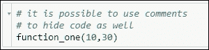

再次单击箭头，您将折叠其下整个单元格中的其余代码:


当您倾向于编写长函数或代码时，这是一个非常有用的扩展，可能是一个包含许多不同组件的图，或者您在笔记本中编写了帮助函数。

### 可折叠标题

使用可折叠标题扩展，可以通过创建标记单元格和定义标题来对单元格的整个部分进行分组。通常，这只会将文本显示为标题。扩展使标题及其下的所有单元格可折叠，它将折叠其下的所有内容，直到遇到相同或更高级别的标题。这里显示了设置页面中的可用参数:

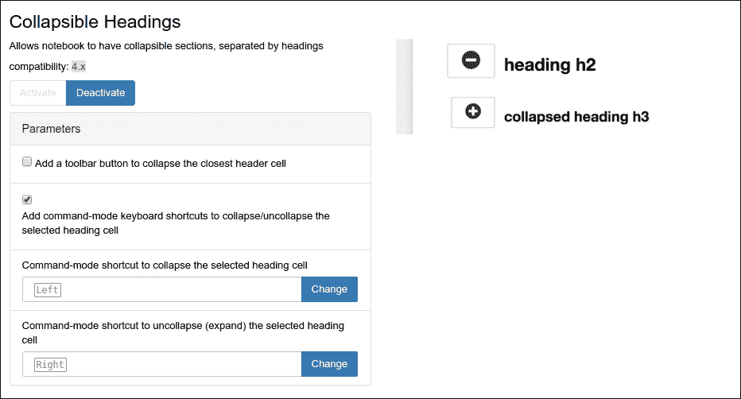

您可以将键盘快捷键设置为(取消)折叠选定的标题、添加工具栏按钮以及切换键盘快捷键的使用。使用扩展的结果示例如下所示:

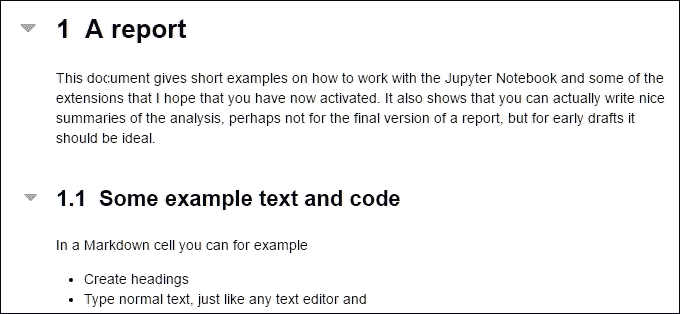

单击标题左侧的小箭头将折叠标题及其下的所有内容，使其位于同一部分下。它将看起来像下图:


当您对相似或相同的数据进行多次分析时，这非常有用。试着打开我们在本书中使用扩展的一章，你会看到它的用处。

### 帮助面板

当您开始在 Jupyter Notebook 中编写自己的代码时，帮助面板非常有用，因为它可以在笔记本旁边的面板中显示所有键盘快捷键。扩展的详细信息页面顶部如下所示:

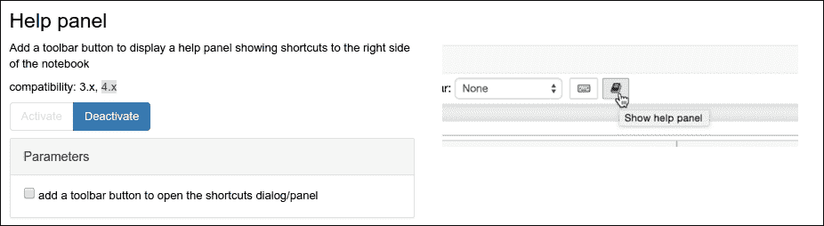

在这里，可以勾选 ******框添加一个工具栏按钮，打开****** 快捷方式对话框/面板。然后，您将有一个按钮，如前图中右侧所示。

### 初始化单元格

分析会话开始时的大部分代码都是您希望在每次打开时运行的。初始化单元格扩展通过添加两件事缓解了这个问题——一个允许您标记初始化单元格的单元格工具栏和一个重新运行所有这些标记的初始化单元格的按钮。下图显示了扩展的详细信息页面，右侧是触发初始化单元格重新运行的按钮:

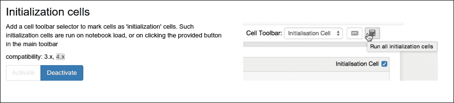

要使用此扩展，请执行以下步骤:

1.  激活后，打开一个笔记本，创建你想要的细胞作为开始。附带的示例笔记本中有一些初始化单元格。
2.  To change cells into initialization cells, you navigate to **View** | **Cell Toolbar** | **Initialization Cell**. When you have clicked this, each cell will get a toolbar (that is, cell toolbar) with a checkbox in the upper right corner, as shown in the following image:

    

3.  点按您想要在打开笔记本时自动运行的单元格的复选框，例如，包含导入、数据读取和数据清理的单元格。
4.  现在，关闭笔记本，再次打开它，并观看选中的单元格自动运行。你也可以通过点击看起来像计算器的按钮来触发它；请参见本节的第一张图片。

这个扩展非常有用，因为有时我们必须重启内核或笔记本，当这种情况发生时，重新运行所有简单导入模块和加载数据的单元就没那么有趣了。

### NbExtensions 菜单项

NbExtensions 菜单项扩展非常简单；它添加了一个菜单项来打开扩展设置页面，您可以在其中激活/停用扩展。菜单项可以在**编辑**项下找到。以下是扩展详细信息页面的屏幕截图，左侧显示了菜单项:


### 尺子

尺子是一个简单的扩展，是为了美观，这样你就知道什么时候包装你的代码，让它遵循标准。可用的参数是标尺的列宽、颜色及其线条样式，如下图所示:

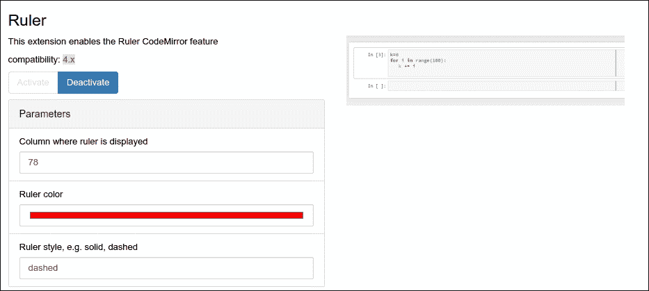

该扩展将在每个单元格中以参数中给定的列宽绘制一条垂直线。下图显示了它的外观:

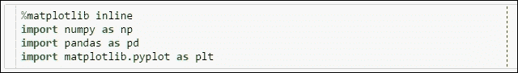

### 跳过追溯

有时在单元格中运行的代码中会引发异常。当异常的堆栈跟踪很长时，Jupyter Notebook 仍然会显示整个跟踪。滚动到单元格输出的底部以获取导致异常的原因可能有点乏味。没有可为此扩展设置的参数。举一个很好的例子，我在当前版本的 NumPy 中发现了一个已归档的 bug，给出了一个很长的跟踪。你可以在[https://github.com/numpy/numpy/issues/7547](https://github.com/numpy/numpy/issues/7547)上看到这个 bug。要测试跳过回溯扩展，请遵循以下说明:

1.  标准导入后(如前所述激活扩展)，运行以下命令:

    ```py
            values = (1+np.array([0, 1.e-15]))*1.e27 
            plt.plot(values) 

    ```

2.  You should now see something like the following screenshot:

    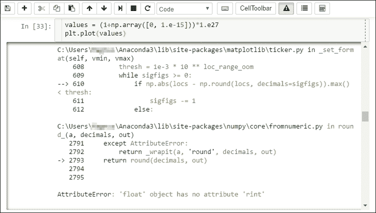

3.  痕迹真的很长；您必须滚动一长串指针和文件。现在，点击工具栏上显示三角形和感叹号的按钮(见上图和下图)；它切换回溯的隐藏。
4.  Run the code again and you get the following:

    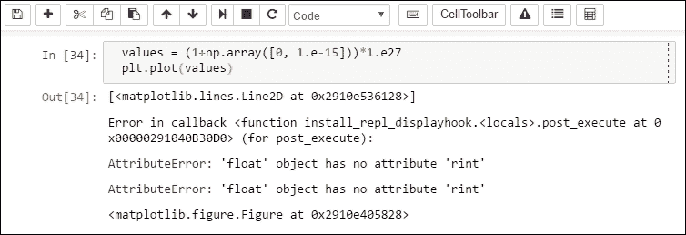

    这要好得多，也不那么令人困惑，并显示了为什么跳过回溯有时非常有用。当然，在某些情况下，查看完整的跟踪很有用，例如，当您想要报告错误时。

### 目录

当使用带有多个部分的长笔记本时，可折叠标题扩展很有用。在这类笔记本中浏览时，目录很有用。这个插件只有几个参数。您可以让它对部分进行编号，选择目录的深度，并切换是否在笔记本顶部显示浮动窗口或表格。其中一些也可以在浮动窗口中设置:


在笔记本中，您可以通过按按钮来切换带有目录的浮动窗口。如下图所示:


按下按钮后，浮动窗口将出现在右侧。对于本附录的示例笔记本，它将如下所示:

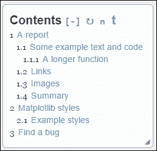

这里**目录**旁边有四个按钮，除了表格的可点击标题。点击标题会带你到笔记本的那一部分。第一个按钮 **[-]** ，会简单的折叠目录，旁边的按钮会重新加载； **n** 将在笔记本中切换章节编号；最后， **t** 将在笔记本顶部的单独单元格中切换目录。点击最后一个按钮的输出如下所示:

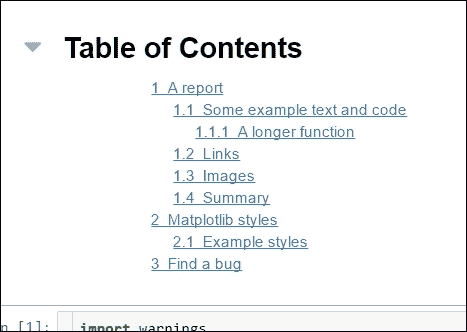

## 其他 Jupyter 笔记本提示

在这里，我会给你一些使用 Jupyter 笔记本的额外提示。你可以用它做很多事情，这就是它如此优秀的原因。

### 外部连接

用额外的标志`-ip *`或实际的 IP 而不是`*`启动 Jupyter Notebook，将允许外部连接，即与您的计算机在同一个网络上(如果直接连接，则是互联网)。它将允许其他人编辑笔记本，并在您的计算机上实际运行代码，因此要非常小心。完整的调用如下所示:

```py
jupyter notebook -ip *

```

它在教育环境中很有用，在教育环境中，您希望人们能够专注于编码而不是安装东西，或者他们没有某个软件包的正确版本。

### 出口

所有笔记本都可以导出为 PDF、HTML 和其他格式。为此，导航至菜单中的**文件** | **下载为**。如果以 PDF 格式导出，则可能需要将以下内容放在笔记本开头的单元格中。它将首先尝试制作图形的 PDF 版本，这将是基于矢量的图形，因此当您调整它们的大小时是无损的，并且最终在合并到 PDF 中时质量会更好:

```py
ip = get_ipython() 
ibe = ip.configurables[-1] 
ibe.figure_formats = { 'pdf', 'png'} 
print(ibe.figure_formats) 

```

要导出到 PDF，您需要其他外部软件——Latex 发行版([https://www.latex-project.org](https://www.latex-project.org))和 Pandoc([http://pandoc.org](http://pandoc.org))。安装后，应该可以将笔记本导出为 PDF 格式；任何 Latex 编译错误都应该出现在您启动 Jupyter Notebook 的终端中。

### 附加文件类型

也可以用 Jupyter 编辑任何其他文本文件。在 Jupyter 仪表板中，即启动时打开的主页面中，您可以创建非笔记本的新文件:

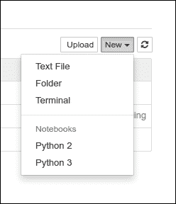

为了给你一个想法，我在附录数据文件中加入了额外的文件——一个是 Markdown 格式的文本文件(以`.md`结尾)，还有一个名为`helpfunctions.py`的文件，带有我们在前面章节中创建的`despine()`函数。除了这两个，你还有`mystyle.mplstyle`文件要编辑。在编辑器中，您可以选择文件的格式，您将得到高亮显示。

# Matplotlib 样式

在整本书中，我们使用了我们的自定义样式文件`mystyle.mplstyle`。如前所述，在 matplotlib 中，已经包含了许多样式文件。要打印发行版中可用的样式，只需打开 Jupyter 笔记本并运行以下命令:

```py
import matplotlib.pyplot as plt 
print(plt.style.available()) 

```

我正在运行 matplotlib 1.5，因此我将获得以下输出:

```py
['seaborn-deep', 'grayscale', 'dark_background', 'seaborn-whitegrid', 'seaborn-talk', 'seaborn-dark-palette', 'seaborn-colorblind', 'seaborn-notebook', 'seaborn-dark', 'seaborn-paper', 'seaborn-muted', 'seaborn-white', 'seaborn-ticks', 'bmh', 'fivethirtyeight', 'seaborn-pastel', 'ggplot', 'seaborn-poster', 'seaborn-bright', 'seaborn-darkgrid', 'classic'] 

```

为了了解其中一些样式的外观，让我们创建一个测试绘图函数:

```py
def test_plot(): 
        x = np.arange(-10,10,1) 
        p3 = np.poly1d([-5,2,3]) 
        p4 = np.poly1d([1,2,3,4]) 
        plt.figure(figsize=(7,6)) 
        plt.plot(x,p3(x)+300, label='x$^{-5}$+x$^2$+x$^3$+300') 
        plt.plot(x,p4(x)-100, label='x+x$^2$+x$^3$+x$^4$-100') 
        plt.plot(x,np.sin(x)+x**3+100, label='sin(x)+x$^{3}$+100') 
        plt.plot(x,-50*x, label='-50x') 
        plt.legend(loc=2) 
        plt.ylabel('Arbitrary y-value') 
        plt.title('Some polynomials and friends',  
                  fontsize='large') 
        plt.margins(x=0.15, y=0.15) 
        plt.tight_layout() 
        return plt.gca() 

```

它将绘制几个不同的多项式和一个三角函数。这样，我们可以创建应用了不同样式的地块，并直接进行比较。如果你没有做什么特别的事情，只是叫它，也就是`test_plot()`，你会得到类似于下图的东西:

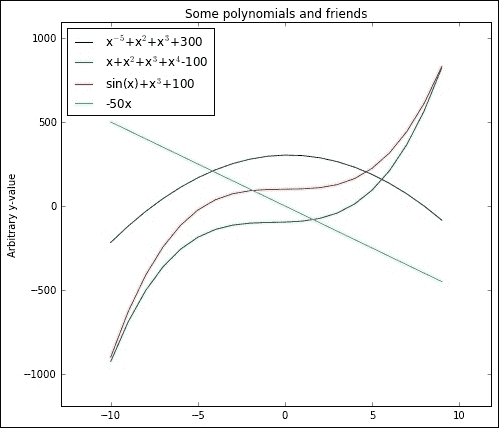

这是 matplotlib 1.5 中的默认样式；现在我们要测试前面列表中的一些不同风格。由于 Jupyter Notebook *内联*图形显示使用的样式参数不同(即`rcParams`)，我们无法像运行普通 Python 提示一样重置每个样式设置的参数。因此，如果没有在新样式中设置参数，我们就不能在一行中绘制不同的样式，而不保留旧样式中的一些参数。我们可以做的如下，我们用`'fivethirtyeight'`样式集调用绘图函数:

```py
with plt.style.context('fivethirtyeight'): 
    test_plot() 

```

通过放入`with`语句，我们限制了在该语句中设置的任何内容，因此，不改变任何整体参数:

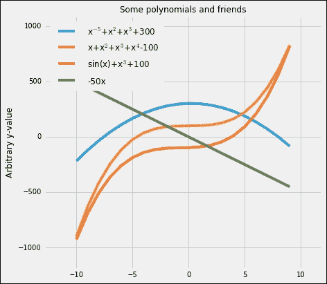

这就是`'fivethirtyeight'`风格的样子，灰色背景，彩色线条很粗。灵感来自统计网站[http://fivethirtyeight.com](http://fivethirtyeight.com)。为了给你留下一些展示几种不同风格的图表，我建议你自己运行一些。一个有趣的事情是`'dark-background'`风格，例如，如果您通常在深色背景下运行演示文稿，可以使用该风格。我将很快向您展示`with`声明让我们做了什么。取我们的`mystyle.mplstyle`文件，绘制如下:

```py
import os 
stylepath = os.path.join(os.getcwd(), 'mystyle.mplstyle') 
with plt.style.context(stylepath): 
    test_plot() 

```

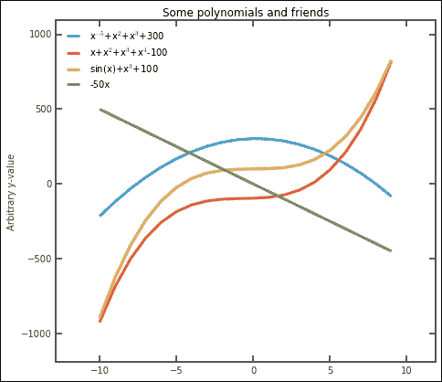

你可能并不总是对图形的外观完全满意——字体太小，情节周围的大框架也没有必要。为了做出一些改变，我们仍然可以像往常一样在`with`语句中调用函数来修复问题:

```py
from helpfunctions import despine 
plt.rcParams['font.size'] = 15 
with plt.style.context(stylepath): 
    plt.rcParams['legend.fontsize'] ='Small' 
    ax = test_plot() 
    despine(ax) 
    ax.spines['right'].set_visible(False) 
    ax.spines['top'].set_visible(False) 
    ax.spines['left'].set_color('w') 
    ax.spines['bottom'].set_color('w') 
    plt.minorticks_on() 

```

输出如下所示:

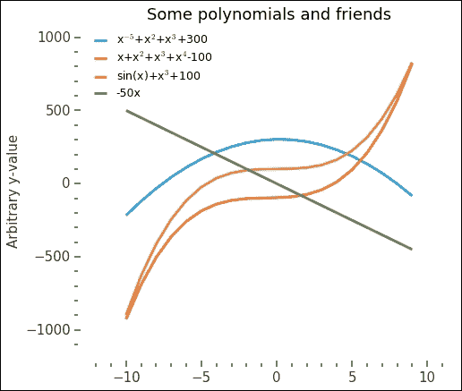

这看起来更好更清晰。你能把这些额外的修改直接合并到`mystyle.mplstyle`文件中吗？尝试这样做——大部分都是可能的——最终，你会有一个不错的样式文件可以使用。

关于样式文件的最后一点重要意见。可以连续连锁几个。这意味着您可以创建一种改变事物(轴、线等)大小的样式和另一种改变颜色的样式。这样，如果您在演示文稿或书面报告中使用该图形，就可以适应不断变化的尺寸。

# 有用资源

在线上有大量关于数据分析主题的资源，特别关注 Python。我在这里试着编了几个，希望对你有用。你会发现一些我列出了资源的部分，一个简短的描述，和一个你可以找到更多信息的链接。

## 一般资源

Python 相关资源的常规链接:

**连续分析**

[https://www.continuum.io](https://www.continuum.io)

Python分布的制造者。在他们的网页上，你可以找到文档和支持。

**Python 和 IPython**

[https://python.org](https://python.org)和[http://ipython.org](http://ipython.org)

真的没必要解释。我们非常感谢世界上的这两个项目。

**Jupyter 笔记型电脑**

[https://jupyter.org](https://jupyter.org)

Jupyter 笔记本项目网页，您可以在其中找到更多信息、文档和帮助。

**Python 周报**

[http://www.pythonweekly.com](http://www.pythonweekly.com)

每周(电子邮件)时事通讯，让您更容易了解 Python 世界的最新动态。

**堆栈溢出**

http://stack overflow . com

基本上所有内容的问答页面。如果你在网上搜索任何类型的 Python 编程问题，你很有可能会登陆他们的某个网页。注册并提问或回答问题！

**想法**

[https://www.enthought.com](https://www.enthought.com)

恩托林冠的制造者，就像一个 Anaconda 发行版，一个完整的 Python 发行版。entorn 还为任何感兴趣的人提供了许多课程和培训。

**黑桃**

[https://pypi . python . org/pypi](https://pypi.python.org/pypi)

大多数 Python 包的存储库，`pip`寻找包的第一个地方。

**Scipy 工具包**

[https://www . scipy . org/scikits . html](https://www.scipy.org/scikits.html)

SciPy 工具包(Scikits)的门户，Scipy 的附属包。`scikit-learn`是一个 Scikit 包。

**GitHub**

https://github . com

一个代码存储库，它使用著名的 Git 版本系统来跟踪代码的变化。只要公开代码，就可以免费注册和上传自己的代码。代码可以是 Python 或任何其他编程语言。

## 包装

这是一个有用的 Python 包列表。大部分可以通过`conda`或`pip`包装系统安装。

**PyMC**

[https://pymc-devs . github . io/pymc/](https://pymc-devs.github.io/pymc/)

或者，[https://github.com/pymc-devs/pymc](https://github.com/pymc-devs/pymc)

Python 中的贝叶斯推理/建模分析包；用在[第 6 章](6.html "Chapter 6. Interacting with Databases")、*贝叶斯方法*中，在本书中。

**司仪**

[http://dan.iel.fm/emcee/](http://dan.iel.fm/emcee/)

PyMC 的一个替代品，一个用于贝叶斯推理的 MCMC 包。

**科学学习**

[http://scikit-learn.org](http://scikit-learn.org)

一个用 Python 进行机器学习数据分析的工具；用于本书[第 7 章](107.html "Chapter 7. Supervised and Unsupervised Learning")、*监督与非监督学习*。

**天体 ML**

[http://www.astroml.org/](http://www.astroml.org/)

一个机器学习包，专注于天文应用。

**开赛体育馆**

[https://gym.openai.com/](https://gym.openai.com/)

一个公开发布的开发和测试强化学习算法的工具包。

当时

[https://www.quandl.com/](https://www.quandl.com/)

一个访问金融和经济数据的中心——他们有一个 Python 应用编程接口，你可以用它来安装和访问大量数据。

**海伯恩**

[https://stanford.edu/~mwaskom/software/seaborn/](https://stanford.edu/~mwaskom/software/seaborn/)

用 Python 实现统计数据可视化的软件包。它有一些独特的绘图功能，但还没有进入 matplotlib 包。

## 数据仓库

这里，我列出了一些在线可用的数据存储库。

**UCI 机器学习资源库**

[http://archive . ics . UCI . edu/ml](http://archive.ics.uci.edu/ml)

加州大学欧文分校机器学习和智能系统中心数据集存储库，针对机器学习问题。

**世卫组织-全球卫生观察站数据库**

[http://apps.who.int/gho/data/node.home](http://apps.who.int/gho/data/node.home)

来自全球的关键健康相关数据的大型数据库。

**欧统局**

[http://EC . Europa . eu/Eurostat](http://ec.europa.eu/eurostat)

欧洲联盟所有国家各种关键统计数据的数据库。

**NTSB**

[http://www.ntsb.gov](http://www.ntsb.gov)

国家运输安全委员会网页，这是一个关于美国汽车、铁路、航空和海上事故的统计数据库。

**Socrata 开放数据**

[https://open data . socrata . com](https://opendata.socrata.com)

各种数据集的大数据库(例如，全世界的航空事故统计数据)，易于探索和查找数据。

**综合社会调查(美国)**

[http://gss.norc.org](http://gss.norc.org)

美国的年度调查，开放和可下载的数据集和在线数据探索工具。

**疾控中心**

[http://www.cdc.gov/datastatistics/](http://www.cdc.gov/datastatistics/)

疾病控制和预防中心(CDC)有很多关于各种疾病和健康相关统计的公开数据。

**开放数据初始(+2500 个来源)**

[http://open data perception . I](http://opendatainception.io)

显示开放数据资源的位置和链接的地图。

**Data.gov.in**

[https://data.gov.in](https://data.gov.in)

印度政府公共数据门户。它包含一组丰富而广泛的公开可用数据来练习您的数据分析技能。

**Census.gov**

[http://www.census.gov](http://www.census.gov)

美国人口普查局在美国就各种主题进行了调查并收集了数据。

**日期。欧洲**

[https://data . Europa . eu/euodp](https://data.europa.eu/euodp)

欧洲联盟开放数据门户提供了从所有欧盟国家获取数据的单一途径。

## 数据可视化

以下是一些对可视化有用的资源列表(这里重叠的是 Seaborn，之前已经列出)。

**五点三十八分**

[http://fivethirtyeight.com/](http://fivethirtyeight.com/)

说到数据可视化，这是一个很好的启发。该网站提供了世界各地数据的统计分析和展示。

**剧情**

[https://plot.ly](https://plot.ly)

数据分析和可视化在线完成。他们的 Python 工具现在是开源的，在自我托管时可以免费使用。

**mpld3**

[http://mpld3.github.io/](http://mpld3.github.io/)

创建交互式 Python 图并导出到浏览器供其他人探索。

# 总结

在本附录中，我们介绍了在 Jupyter Notebook 中进行数据分析和工作时有用的几件事。希望你能很好地利用这些资源和知识。社会的许多不同部分有如此多的数据等待分析。鉴于生产和存储的数据量的增加，我们需要更多的人能够以一种可理解的方式分析和呈现数据。*