# 第四章。处理数据和数字问题

本章中的配方如下:

*   裁剪和过滤异常值
*   正在获取数据
*   测量噪声数据的中心趋势
*   用 Box-Cox 变换归一化
*   用权力阶梯转换数据
*   用对数转换数据
*   重新绑定数据
*   应用`logit()`变换比例
*   拟合稳健的线性模型
*   用加权最小二乘法考虑方差
*   使用任意精度进行优化
*   线性代数使用任意精度

# 简介

在现实世界中，数据很少与教科书的定义和例子相匹配。我们必须处理诸如硬件故障、不合作的客户和不满的同事等问题。很难预测你会遇到什么样的问题，但可以肯定的是，这些问题会非常丰富和具有挑战性。在本章中，我将概述一些处理有噪声数据的常见方法，这些方法更多地基于经验法则，而不是严格的科学。幸运的是，数据分析的试错部分是有限的。

本章的大部分内容是关于异常值管理的。离群值是我们认为不正常的值。当然，这不是你唯一会遇到的问题，但这是一个偷偷摸摸的问题。一个常见的问题是缺少或无效的值，所以我将简要地提到屏蔽数组和 pandas 特性，例如我在本书中使用的`dropna()`函数。

我还写了两个关于使用 **mpmath** 进行任意精度计算的食谱。我不建议使用 mpmath，除非你真的必须这样做，因为你必须付出性能代价。通常我们可以解决数值问题，所以很少需要任意精度的库。

# 裁剪和过滤异常值

异常值是数据分析中常见的问题。虽然不存在异常值的精确定义，但我们知道异常值会影响均值和回归结果。异常值是异常的值。通常，异常值是由测量误差引起的，但异常值有时是真实的。在第二种情况下，我们可能要处理两种或两种以上与不同现象相关的数据。

该配方的数据在[中描述](https://vincentarelbundock.github.io/Rdatasets/doc/robustbase/starsCYG.html)。它由某一星团中 47 颗恒星的对数有效温度和对数光强组成。任何一个天文学家读了这一段都会知道T4【赫茨普鲁-罗素图。从数据分析的角度来看，该图是一个散点图，但对于天文学家来说，它当然不止于此。赫茨普龙罗素图是在 1910 年左右定义的，其特征是一条对角线(不完全是直线)，称为**主序列**。我们数据集中的大多数恒星应该在主序列上，左上角有四个异常值。这些异常值被归类为巨人。

我们有许多策略来处理异常值。在这个食谱中，我们将使用两个最简单的策略:用 NumPy `clip()`函数裁剪和完全去除异常值。对于本例，我将异常值定义为从第一个和第三个四分位数定义的框中移除的 1.5 个四分位数区间的值。

## 怎么做...

以下步骤显示了如何裁剪和过滤异常值:

1.  进口情况如下:

    ```py
    import statsmodels.api as sm
    import matplotlib.pyplot as plt
    import numpy as np
    import seaborn as sns
    import dautil as dl
    from IPython.display import HTML
    ```

2.  定义以下函数过滤异常值:

    ```py
    def filter_outliers(a):
        b = a.copy()
        bmin, bmax = dl.stats.outliers(b)
        b[bmin > b] = np.nan
        b[b > bmax] = np.nan

        return b
    ```

3.  如下所示加载和裁剪异常值:

    ```py
    starsCYG = sm.datasets.get_rdataset("starsCYG", "robustbase", cache=True).data

    clipped = starsCYG.apply(dl.stats.clip_outliers)
    ```

4.  过滤异常值如下:

    ```py
    filtered = starsCYG.copy()
    filtered['log.Te'] = filter_outliers(filtered['log.Te'].values)
    filtered['log.light'] = filter_outliers(filtered['log.light'].values)
    filtered.dropna()
    ```

5.  用以下代码绘制结果:

    ```py
    sp = dl.plotting.Subplotter(3, 1, context)
    sp.label()
    sns.regplot(x='log.Te', y='log.light', data=starsCYG, ax=sp.ax)
    sp.label(advance=True)
    sns.regplot(x='log.Te', y='log.light', data=clipped, ax=sp.ax)
    sp.label(advance=True)
    sns.regplot(x='log.Te', y='log.light', data=filtered, ax=sp.ax)
    plt.tight_layout()
    HTML(dl.report.HTMLBuilder().watermark())
    ```

最终结果参见下面的截图(参见本书代码包中的`outliers.ipynb`文件):

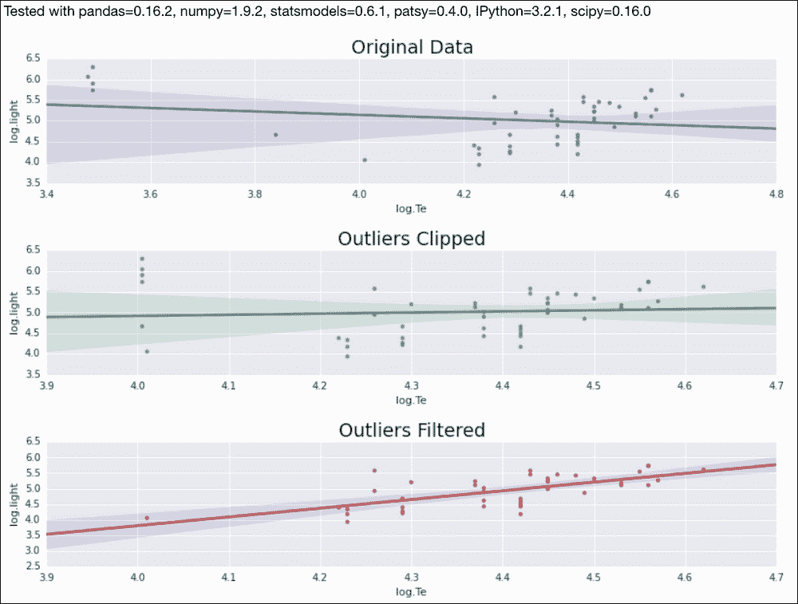

## 另见

*   [https://docs . scipy . org/doc/NumPy/reference/generated/NumPy . clip . html # NumPy . clip](https://docs.scipy.org/doc/numpy/reference/generated/numpy.clip.html#numpy.clip)记录的 NumPy `clip()`功能(2015 年 8 月检索)
*   您可以在[https://en . Wikipedia . org/wiki/赫茨普龙%E2%80%93Russell_diagram](https://en.wikipedia.org/wiki/Hertzsprung%E2%80%93Russell_diagram) 上阅读更多关于 Hertzsprung-Russell 图的信息(检索于 2015 年 8 月)

# winsoring 数据

**winsoring**是处理异常值的另一种技术，以 Charles Winsor 命名。实际上，Winsorization 以对称的方式将异常值裁剪到给定的百分位数。例如，我们可以剪辑到第 5 和第 95 百分位。SciPy 有一个`winsorize()`功能，执行这个程序。该配方的数据与*裁剪和过滤异常值*配方的数据相同。

## 怎么做...

使用以下程序读取数据:

1.  进口情况如下:

    ```py
    rom scipy.stats.mstats import winsorize
    import statsmodels.api as sm
    import seaborn as sns
    import matplotlib.pyplot as plt
    import dautil as dl
    from IPython.display import HTML
    ```

2.  加载并保存有效温度的数据(限制设置为 15%):

    ```py
    starsCYG = sm.datasets.get_rdataset("starsCYG", "robustbase", cache=True).data
    limit = 0.15
    winsorized_x = starsCYG.copy()
    winsorized_x['log.Te'] = winsorize(starsCYG['log.Te'], limits=limit)
    ```

3.  按照以下方式调节光强:

    ```py
    winsorized_y = starsCYG.copy()
    winsorized_y['log.light'] = winsorize(starsCYG['log.light'], limits=limit)
    winsorized_xy = starsCYG.apply(winsorize, limits=[limit, limit])
    ```

4.  用回归线绘制赫茨普鲁格-罗素图(不是通常天文图的一部分):

    ```py
    sp = dl.plotting.Subplotter(2, 2, context)
    sp.label()
    sns.regplot(x='log.Te', y='log.light', data=starsCYG, ax=sp.ax)

    sp.label(advance=True)
    sns.regplot(x='log.Te', y='log.light', data=winsorized_x, ax=sp.ax)

    sp.label(advance=True)
    sns.regplot(x='log.Te', y='log.light', data=winsorized_y, ax=sp.ax)

    sp.label(advance=True)
    sns.regplot(x='log.Te', y='log.light', data=winsorized_xy, ax=sp.ax)
    plt.tight_layout()
    HTML(dl.report.HTMLBuilder().watermark())
    ```

最终结果见下图截图(参见本书代码包中的`winsorising_data.ipynb`文件):

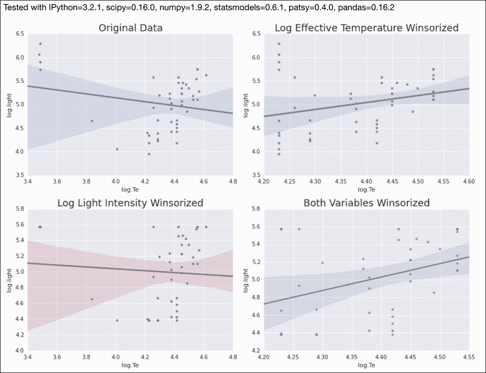

## 另见

*   相关维基百科页面在[https://en.wikipedia.org/wiki/Winsorising](https://en.wikipedia.org/wiki/Winsorising)(2015 年 8 月检索)

# 测量噪声数据的中心趋势

我们可以用平均值和中位数来测量中心趋势。这些措施使用所有可用的数据。通过丢弃数据集中较高端和较低端的数据来消除异常值是一个普遍接受的想法。**截断表示** 或 **修剪表示**，其派生词如 **四分位数间平均值** ( **IQM** )和**曲美**、也采用这种思路。看看下面的等式:

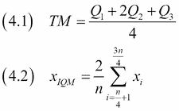

截断平均值在给定的百分位数丢弃数据，例如，从最低值到第 5 个百分位数，从第 95 个百分位数到最高值。**曲美安** (4.1)是中位数、第一四分位数和第三四分位数的加权平均值。对于 IQM (4.2)，我们丢弃数据的最低和最高四分位数，因此这是截断平均值的特殊情况。我们将使用 SciPy `tmean()`和`trima()`函数计算这些度量。

## 怎么做...

我们将通过以下步骤研究不同截断水平的主要趋势:

1.  进口情况如下:

    ```py
    import matplotlib.pyplot as plt
    from scipy.stats import tmean
    from scipy.stats.mstats import trima
    import numpy as np
    import dautil as dl
    import seaborn as sns
    from IPython.display import HTML

    context = dl.nb.Context('central_tendency')
    ```

2.  定义以下函数计算四分位数平均值:

    ```py
    def iqm(a):
        return truncated_mean(a, 25)
    ```

3.  定义以下函数来绘制分布:

    ```py
    def plotdists(var, ax):
        displot_label = 'From {0} to {1} percentiles'
        cyc = dl.plotting.Cycler()

        for i in range(1, 9, 3):
            limits = dl.stats.outliers(var, method='percentiles', 
                                   percentiles=(i, 100 - i))
            truncated = trima(var, limits=limits).compressed()
            sns.distplot(truncated, ax=ax, color=cyc.color(),
                         hist_kws={'histtype': 'stepfilled', 'alpha': 1/i,
                                   'linewidth': cyc.lw()},
                         label=displot_label.format(i, 100 - i))
    ```

4.  定义以下函数计算截断平均值:

    ```py
    def truncated_mean(a, percentile):
        limits = dl.stats.outliers(a, method='percentiles', 
                                   percentiles=(percentile, 100 - percentile))

        return tmean(a, limits=limits)
    ```

5.  加载数据，计算方式如下:

    ```py
    df = dl.data.Weather.load().resample('M').dropna()
    x = range(9)
    temp_means = [truncated_mean(df['TEMP'], i) for i in x]
    ws_means = [truncated_mean(df['WIND_SPEED'], i) for i in x]
    ```

6.  用以下代码绘制平均值和分布:

    ```py
    sp = dl.plotting.Subplotter(2, 2, context)
    cp = dl.plotting.CyclePlotter(sp.ax)
    cp.plot(x, temp_means, label='Truncated mean')
    cp.plot(x, dl.stats.trimean(df['TEMP']) * np.ones_like(x), label='Trimean')
    cp.plot(x, iqm(df['TEMP']) * np.ones_like(x), label='IQM')
    sp.label(ylabel_params=dl.data.Weather.get_header('TEMP'))

    cp = dl.plotting.CyclePlotter(sp.next_ax())
    cp.plot(x, ws_means, label='Truncated mean')
    cp.plot(x, dl.stats.trimean(df['WIND_SPEED']) * np.ones_like(x),
            label='Trimean')
    cp.plot(x, iqm(df['WIND_SPEED']) * np.ones_like(x), label='IQM')
    sp.label(ylabel_params=dl.data.Weather.get_header('WIND_SPEED'))

    plotdists(df['TEMP'], sp.next_ax())
    sp.label(xlabel_params=dl.data.Weather.get_header('TEMP'))

    plotdists(df['WIND_SPEED'], sp.next_ax())
    sp.label(xlabel_params=dl.data.Weather.get_header('WIND_SPEED'))
    plt.tight_layout()
    HTML(dl.report.HTMLBuilder().watermark())
    ```

最终结果参见以下截图(参见本书代码包中的`central_tendency.ipynb`文件):

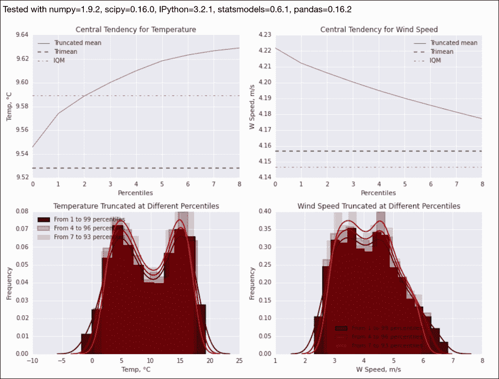

## 另见

*   位于[的`trima()`的 SciPy 文档](https://docs.scipy.org/doc/scipy/reference/generated/scipy.stats.mstats.trima.html)(检索日期:2015 年 8 月)
*   位于[的`tmean()`的 SciPy 文档](https://docs.scipy.org/doc/scipy/reference/generated/scipy.stats.tmean.html#scipy.stats.tmean)(检索日期:2015 年 8 月)

# 用 Box-Cox 变换归一化

不遵循已知分布(如正态分布)的数据通常难以管理。控制数据的一个流行策略是应用 Box-Cox 变换。它由以下等式给出:

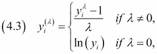

`scipy.stats.boxcox()`函数可以对正数据应用转换。我们将使用与*裁剪和过滤异常值*配方中相同的数据。通过 Q-Q 图，我们将表明 Box-Cox 变换确实使数据看起来更正常。

## 怎么做...

以下步骤显示了如何使用 Box-Cox 转换对数据进行规范化:

1.  进口情况如下:

    ```py
    import statsmodels.api as sm
    import matplotlib.pyplot as plt
    from scipy.stats import boxcox
    import seaborn as sns
    import dautil as dl
    from IPython.display import HTML
    ```

2.  加载数据并转换如下:

    ```py
    context = dl.nb.Context('normalizing_boxcox')

    starsCYG = sm.datasets.get_rdataset("starsCYG", "robustbase", cache=True).data

    var = 'log.Te'

    # Data must be positive
    transformed, _ = boxcox(starsCYG[var])
    ```

3.  显示 Q-Q 图和分布图如下:

    ```py
    sp = dl.plotting.Subplotter(2, 2, context)
    sp.label()
    sm.qqplot(starsCYG[var], fit=True, line='s', ax=sp.ax)

    sp.label(advance=True)
    sm.qqplot(transformed, fit=True, line='s', ax=sp.ax)

    sp.label(advance=True)
    sns.distplot(starsCYG[var], ax=sp.ax)

    sp.label(advance=True)
    sns.distplot(transformed, ax=sp.ax)                                       
    plt.tight_layout()
    HTML(dl.report.HTMLBuilder().watermark())
    ```

最终结果参见下面的截图(参见本书代码包中的`normalizing_boxcox.ipynb`文件):

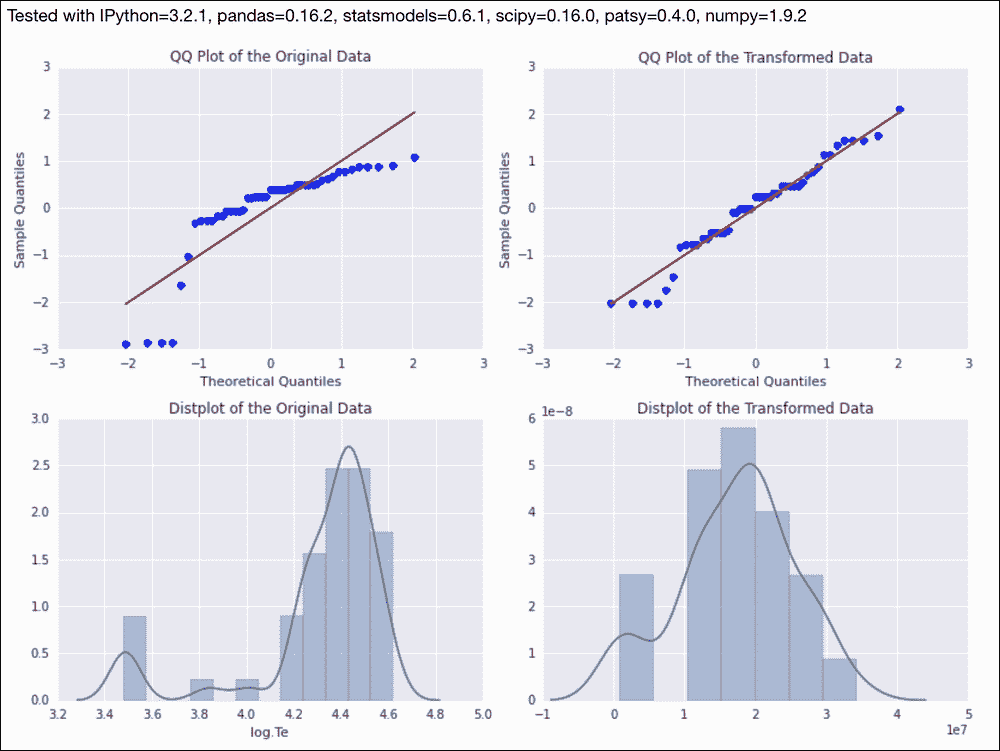

## 它是如何工作的

在之前的截图中，Q-Q 图将正态分布的理论分位数与实际数据的分位数进行了对比。为了帮助评估是否符合正态分布，我显示了一条线，它应该与完全正常的数据一致。数据越符合直线，就越正常。如您所见，转换后的数据更符合直线，因此更正常。分布图应该有助于你确认这一点。

## 另见

*   相关维基百科页面在[https://en.wikipedia.org/wiki/Power_transform](https://en.wikipedia.org/wiki/Power_transform)(2015 年 8 月检索)
*   《转换分析》，英国皇家统计学会杂志，第 26 期，第 211-252 页(1964 年)。

# 用权力阶梯转换数据

线性关系在科学和数据分析中很常见。显然，线性模型比非线性模型更容易理解。所以历史上，线性模型的工具最先被开发出来。在某些情况下，线性化(使数据线性)以简化分析是有好处的。一个简单的策略有时会奏效，那就是将一个或多个变量平方或立方。同样，我们可以通过取平方根或立方根，将数据转换成一个假想的幂阶梯。

在本食谱中，我们将使用[中描述的](https://vincentarelbundock.github.io/Rdatasets/doc/car/Duncan.html)邓肯数据集的数据。这些数据是在 1961 年前后收集的，大约有 45 种职业，分为四栏——类型、收入、教育和声望。我们来看看收入和声望。这些变量似乎通过三次多项式联系在一起，所以我们可以取收入的立方根或声望的立方根。为了检查结果，我们将把回归的残差可视化。期望是残差是随机分布的，这意味着我们不期望它们遵循可识别的模式。

## 怎么做...

在以下步骤中，我将演示基本的数据转换:

1.  进口情况如下:

    ```py
    import matplotlib.pyplot as plt
    import numpy as np
    import dautil as dl
    import seaborn as sns
    import statsmodels.api as sm
    from IPython.display import HTML
    ```

2.  加载并转换数据如下:

    ```py
    df = sm.datasets.get_rdataset("Duncan", "car", cache=True).data
    transformed = df.copy()
    transformed['income'] = np.power(transformed['income'], 1.0/3)
    ```

3.  用 Seaborn 回归图(三次多项式)绘制原始数据，如下所示:

    ```py
    sp = dl.plotting.Subplotter(2, 2, context)
    sp.label()
    sns.regplot(x='income', y='prestige', data=df, order=3, ax=sp.ax)
    ```

4.  用以下线条绘制转换后的数据:

    ```py
    sp.label(advance=True)
    sns.regplot(x='income', y='prestige', data=transformed, ax=sp.ax)
    ```

5.  绘制三次多项式的残差图:

    ```py
    sp.label(advance=True)
    sns.residplot(x='income', y='prestige', data=df, order=3, ax=sp.ax)
    ```

6.  绘制残差图绘制转换数据如下:

    ```py
    sp.label(advance=True)
    sp.ax.set_xlim([1, 5])
    sns.residplot(x='income', y='prestige', data=transformed, ax=sp.ax)
    plt.tight_layout()
    HTML(dl.report.HTMLBuilder().watermark())
    ```

最终结果参见以下截图(参见本书代码包中的`transforming_up.ipynb`文件):

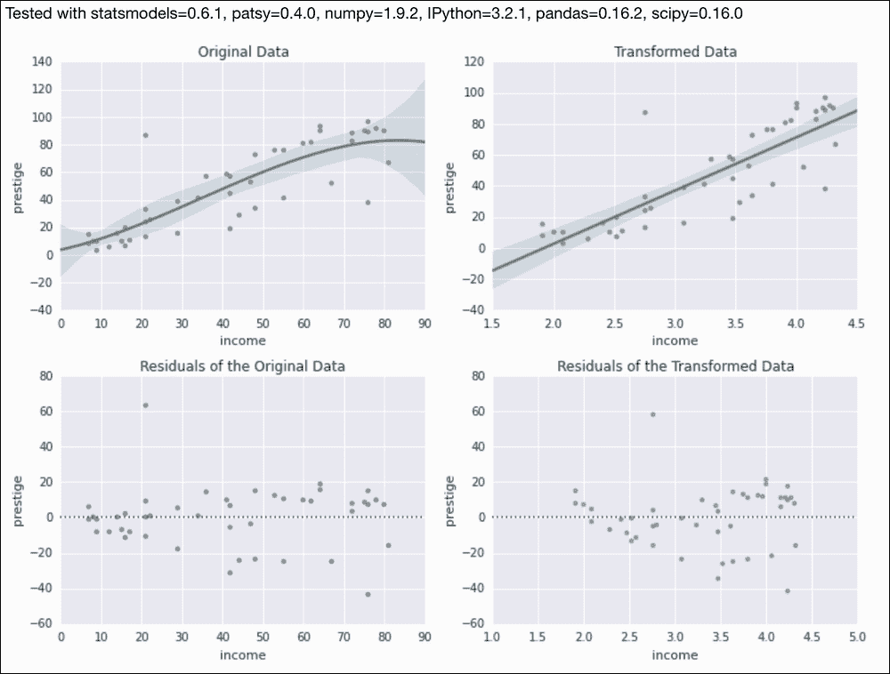

# 用对数转换数据

当数据按数量级变化时，用对数转换数据是一个显而易见的策略。在我的经验中，用指数函数做相反的变换不太常见。通常在探索时，我们将成对变量的对数或半对数散点图可视化。

为了展示这一转变，我们将使用世界银行的数据，计算每 1000 例活产婴儿死亡率和可用国家的人均国内生产总值(T2)(T4)。如果我们对两个变量都应用以 10 为底的对数，我们通过拟合数据得到的直线的斜率有一个有用的性质。一个变量增加 1%对应于另一个变量斜率给出的百分比变化。

## 怎么做...

按照以下步骤使用对数转换数据:

1.  进口情况如下:

    ```py
    import dautil as dl
    import matplotlib.pyplot as plt
    import numpy as np
    from IPython.display import HTML
    ```

2.  下载 2010 年数据，代码如下:

    ```py
    wb = dl.data.Worldbank()
    countries = wb.get_countries()[['name', 'iso2c']]
    inf_mort = wb.get_name('inf_mort')
    gdp_pcap = wb.get_name('gdp_pcap')
    df = wb.download(country=countries['iso2c'],
                     indicator=[inf_mort, gdp_pcap],
                     start=2010, end=2010).dropna()
    ```

3.  使用以下代码片段应用日志转换:

    ```py
    loglog = df.applymap(np.log10)
    x = loglog[gdp_pcap]
    y = loglog[inf_mort]
    ```

4.  绘制变换前后的数据:

    ```py
    sp = dl.plotting.Subplotter(2, 1, context)
    xvar = 'GDP per capita'
    sp.label(xlabel_params=xvar)
    sp.ax.set_ylim([0, 200])
    sp.ax.scatter(df[gdp_pcap], df[inf_mort])

    sp.next_ax()
    sp.ax.scatter(x, y, label='Transformed')
    dl.plotting.plot_polyfit(sp.ax, x, y)
    sp.label(xlabel_params=xvar)
    plt.tight_layout()
    HTML(dl.report.HTMLBuilder().watermark())
    ```

最终结果参见下面的截图(参见本书代码包中的`transforming_down.ipynb`文件):

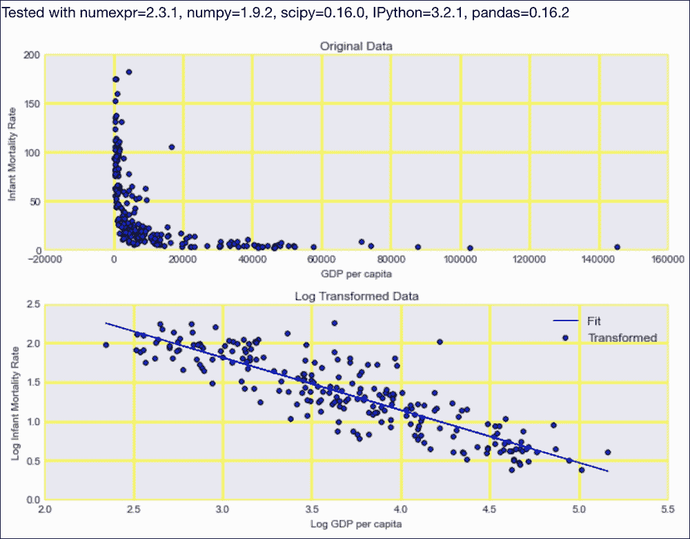

# 重新绑定数据

通常，我们拥有的数据并不是按照我们想要的方式构建的。我们可以使用的一种结构化技术叫做(统计)**数据宁滨**或**逆势**。该策略用一个代表值替换一个区间(一个箱)内的值。在这个过程中，我们可能会丢失信息；但是，我们可以更好地控制数据和效率。

在天气数据集中，我们有以度为单位的风向和以米/秒为单位的风速，它们可以用不同的方式表示。在这个食谱中，我选择用基本方向(北、南等)来表示风向。对于风速，我使用了博福特标度(访问[https://en.wikipedia.org/wiki/Beaufort_scale](https://en.wikipedia.org/wiki/Beaufort_scale))。

## 怎么做...

按照以下说明重新绑定数据:

1.  进口情况如下:

    ```py
    import dautil as dl
    import seaborn as sns
    import matplotlib.pyplot as plt
    import pandas as pd
    import numpy as np
    from IPython.display import HTML
    ```

2.  按照以下方式加载和重新绑定数据(风向为 0-360 度；我们重新绑定到基本方向，如北、西南等):

    ```py
    df = dl.data.Weather.load()[['WIND_SPEED', 'WIND_DIR']].dropna()
    categorized = df.copy()
    categorized['WIND_DIR'] = dl.data.Weather.categorize_wind_dir(df)
    categorized['WIND_SPEED'] = dl.data.Weather.beaufort_scale(df)
    ```

3.  用以下代码显示分布和计数图:

    ```py
    sp = dl.plotting.Subplotter(2, 2, context)
    sns.distplot(df['WIND_SPEED'], ax=sp.ax)
    sp.label(xlabel_params=dl.data.Weather.get_header('WIND_SPEED'))

    sns.distplot(df['WIND_DIR'], ax=sp.next_ax())
    sp.label(xlabel_params=dl.data.Weather.get_header('WIND_DIR'))

    sns.countplot(x='WIND_SPEED', data=categorized, ax=sp.next_ax())
    sp.label()

    sns.countplot(x='WIND_DIR', data=categorized, ax=sp.next_ax())
    sp.label()
    plt.tight_layout()
    HTML(dl.report.HTMLBuilder().watermark())
    ```

最终结果参见下面的截图(参见本书代码包中的`rebinning_data.ipynb`文件):

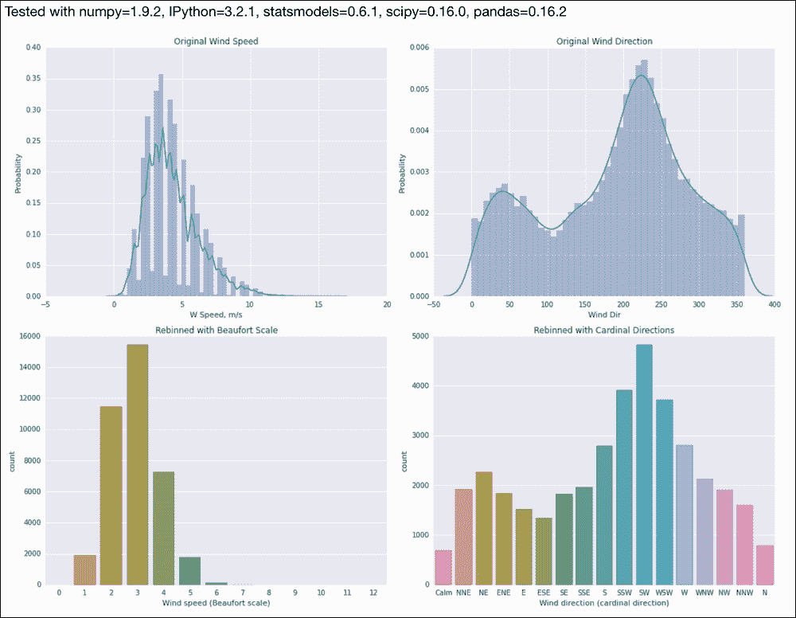

# 应用 logit()变换比例

我们可以使用 SciPy `logit()`函数转换比例或比率。结果应该是更高斯的分布。该函数是由以下等式定义的:

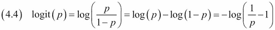

正如你在等式(4.4)中看到的，logit 是赔率的对数。我们希望通过这种转换获得更对称的分布——接近于零的偏斜。当比例接近 0 和 1 时，logit 渐近地接近负无穷大和无穷大，所以在这些情况下我们必须小心。

作为一个比例的例子，我们将采取每月的雨天比例。我们通过将降雨量转化为二进制变量，然后对每个月进行平均，得到这些比例。

## 怎么做...

按照本指南通过转换比率:

1.  进口情况如下:

    ```py
    import dautil as dl
    import seaborn as sns
    import matplotlib.pyplot as plt
    import pandas as pd
    import math
    import statsmodels.api as sm
    from scipy.special import logit
    from IPython.display import HTML
    ```

2.  加载数据并用以下代码转换:

    ```py
    rain = dl.data.Weather.load()['RAIN'].dropna()
    rain = rain > 0
    rain = rain.resample('M').dropna()
    transformed = rain.apply(logit)
    transformed = dl.data.dropinf(transformed.values)
    ```

3.  用分布图和 Q-Q 图绘制转换的结果:

    ```py
    sp = dl.plotting.Subplotter(2, 2, context)
    sns.distplot(rain, ax=sp.ax)
    sp.label()

    sp.label(advance=True)
    sns.distplot(transformed, ax=sp.ax)

    sp.label(advance=True)
    sm.qqplot(rain, line='s', ax=sp.ax)

    sp.label(advance=True)
    sm.qqplot(transformed, line='s', ax=sp.ax)
    plt.tight_layout()
    HTML(dl.report.HTMLBuilder().watermark())
    ```

最终结果见下图截图(参见本书代码包中的`transforming_ratios.ipynb`文件):

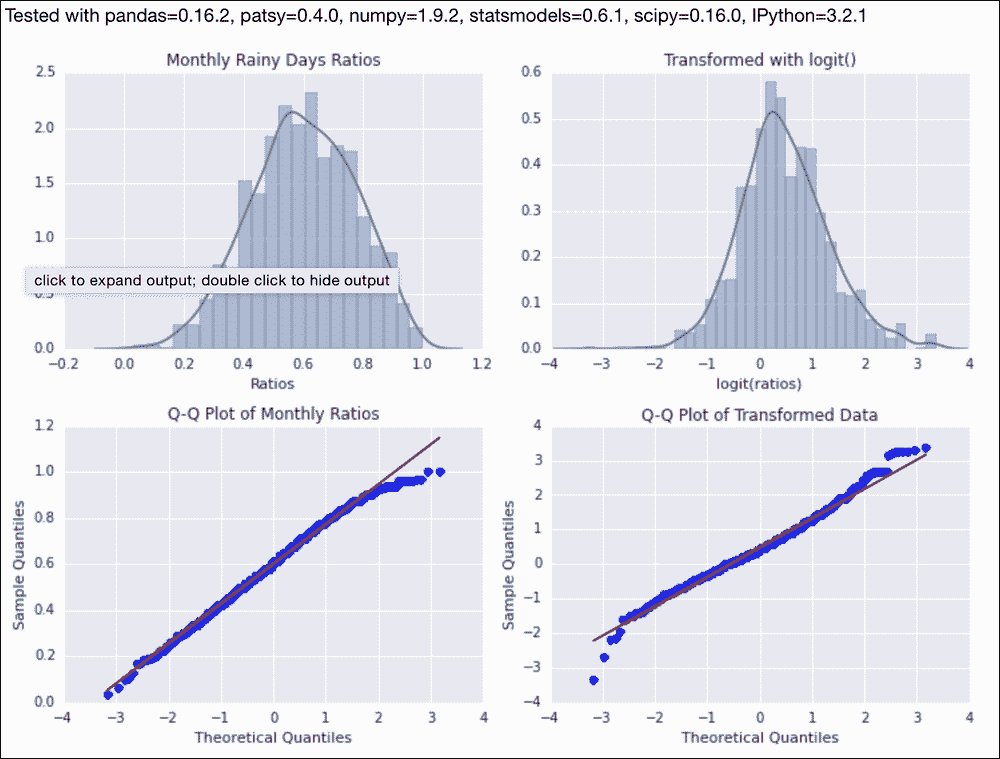

# 拟合稳健线性模型

**稳健回归**旨在比普通回归更好地处理数据中的异常值。这种类型的回归使用特殊的稳健估计量，这也受到状态模型的支持。显然，没有最佳估计量，所以估计量的选择取决于数据和模型。

在这个配方中，我们将拟合 statsmodels 中可用的年太阳黑子数数据。我们将定义一个简单的模型，其中当前计数线性依赖于先前的值。为了演示异常值的影响，我添加了一个相当大的值，我们将比较稳健回归模型和普通最小二乘模型。

## 怎么做...

以下步骤描述了如何应用稳健线性模型:

1.  进口情况如下:

    ```py
    import statsmodels.api as sm
    import matplotlib.pyplot as plt
    import dautil as dl
    from IPython.display import HTML
    ```

2.  定义以下功能来设置地块的标签:

    ```py
    def set_labels(ax):
        ax.set_xlabel('Year')
        ax.set_ylabel('Sunactivity')
    ```

3.  定义以下功能来绘制模型拟合:

    ```py
    def plot_fit(df, ax, results):
        x = df['YEAR']
        cp = dl.plotting.CyclePlotter(ax)
        cp.plot(x[1:], df['SUNACTIVITY'][1:], label='Data')
        cp.plot(x[2:], results.predict()[1:], label='Fit')
        ax.legend(loc='best')
    ```

4.  加载数据并添加一个异常值用于演示目的:

    ```py
    df = sm.datasets.sunspots.load_pandas().data
    vals = df['SUNACTIVITY'].values

    # Outlier added by malicious person, because noone
    # laughs at his jokes.
    vals[0] = 100
    ```

5.  如下所示拟合稳健模型:

    ```py
    rlm_model = sm.RLM(vals[1:], sm.add_constant(vals[:-1]),
                       M=sm.robust.norms.TrimmedMean())

    rlm_results = rlm_model.fit()
    hb = dl.report.HTMLBuilder()
    hb.h1('Fitting a robust linear model')
    hb.h2('Robust Linear Model')
    hb.add(rlm_results.summary().tables[1].as_html())
    ```

6.  拟合一个普通的最小二乘模型:

    ```py
    hb.h2('Ordinary Linear Model')
    ols_model = sm.OLS(vals[1:], sm.add_constant(vals[:-1]))
    ols_results = ols_model.fit()
    hb.add(ols_results.summary().tables[1].as_html())
    ```

7.  用以下代码绘制数据和模型结果:

    ```py
    fig, [ax, ax2] = plt.subplots(2, 1)

    plot_fit(df, ax, rlm_results)
    ax.set_title('Robust Linear Model')
    set_labels(ax)

    ax2.set_title('Ordinary Least Squares')
    plot_fit(df, ax2, ols_results)
    set_labels(ax2)
    plt.tight_layout()
    HTML(hb.html)
    ```

最终结果参见下面的截图(参见本书代码包中的`rlm_demo.ipynb`文件):

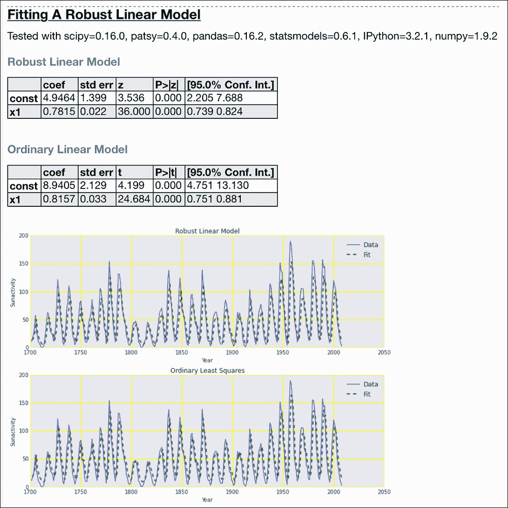

## 另见

*   相关的 statsmodels 文档位于[http://stats models . source forge . net/0 . 6 . 0/generated/stats models . robust . robust _ linear _ model。RLM.html](http://statsmodels.sourceforge.net/0.6.0/generated/statsmodels.robust.robust_linear_model.RLM.html)(2015 年 8 月检索)

# 用加权最小二乘法考虑方差

statsmodels 库允许我们为回归定义每个数据点的任意权重。用简单的拇指规则有时很容易发现异常值。其中一个经验法则是基于四分位数范围，即第一个四分位数和第三个四分位数数据之间的差异。通过四分位数范围，我们可以定义**加权最小二乘**回归的权重。

我们将使用来自*的数据和模型来拟合鲁棒的线性模式*，但是具有任意的权重。我们怀疑是异常值的点将获得较低的权重，这是刚才提到的四分位数范围值的倒数。

## 怎么做...

使用以下方法用加权最小二乘法拟合数据:

1.  进口情况如下:

    ```py
    import dautil as dl
    import matplotlib.pyplot as plt
    import statsmodels.api as sm
    import numpy as np
    from IPython.display import HTML
    ```

2.  加载数据并添加一个异常值:

    ```py
    temp = dl.data.Weather.load()['TEMP'].dropna()
    temp = dl.ts.groupby_yday(temp).mean()

    # Outlier added by malicious person, because noone
    # laughs at his jokes.
    temp.values[0] = 100
    ```

3.  使用普通最小二乘模型拟合:

    ```py
    ntemp = len(temp)
    x = np.arange(1, ntemp + 1)
    factor = 2 * np.pi/365.25
    cos_x = sm.add_constant(np.cos(-factor * x - factor * 337))
    ols_model = sm.OLS(temp, cos_x)
    ols_results = ols_model.fit()
    hb = dl.report.HTMLBuilder()
    hb.h1('Taking variance into account with weighted least squares')
    hb.h2('Ordinary least squares')
    hb.add(ols_results.summary().tables[1].as_html())
    ols_preds = ols_results.predict()
    ```

4.  使用四分位数范围计算权重，并拟合加权最小二乘模型:

    ```py
    box = dl.stats.Box(temp)
    iqrs = box.iqr_from_box()
    # Adding 1 to avoid div by 0
    weights = 1./(iqrs + 1)
    wls_model = sm.WLS(temp, cos_x, weights=weights)
    wls_results = wls_model.fit()

    hb.h2('Weighted least squares')
    hb.add(wls_results.summary().tables[1].as_html())
    ```

5.  绘制模型结果和权重:

    ```py
    sp = dl.plotting.Subplotter(2, 2, context)

    sp.ax.plot(x[1:], temp[1:], 'o', label='Data')
    sp.ax.plot(x[1:], ols_preds[1:], label='Fit')
    sp.label(ylabel_params=dl.data.Weather.get_header('TEMP'))

    sp.label(advance=True)
    sp.ax.plot(x, iqrs, 'o')

    sp.next_ax().plot(x[1:], temp[1:], 'o', label='Data')
    sp.ax.plot(x[1:], wls_results.predict()[1:], label='Fit')
    sp.label(ylabel_params=dl.data.Weather.get_header('TEMP'))

    sp.label(advance=True)
    sp.ax.plot(x, weights, 'o')
    plt.tight_layout()
    HTML(hb.html)
    ```

最终结果参见下面的截图(参见本书代码包中的`weighted_ls.ipynb`文件):

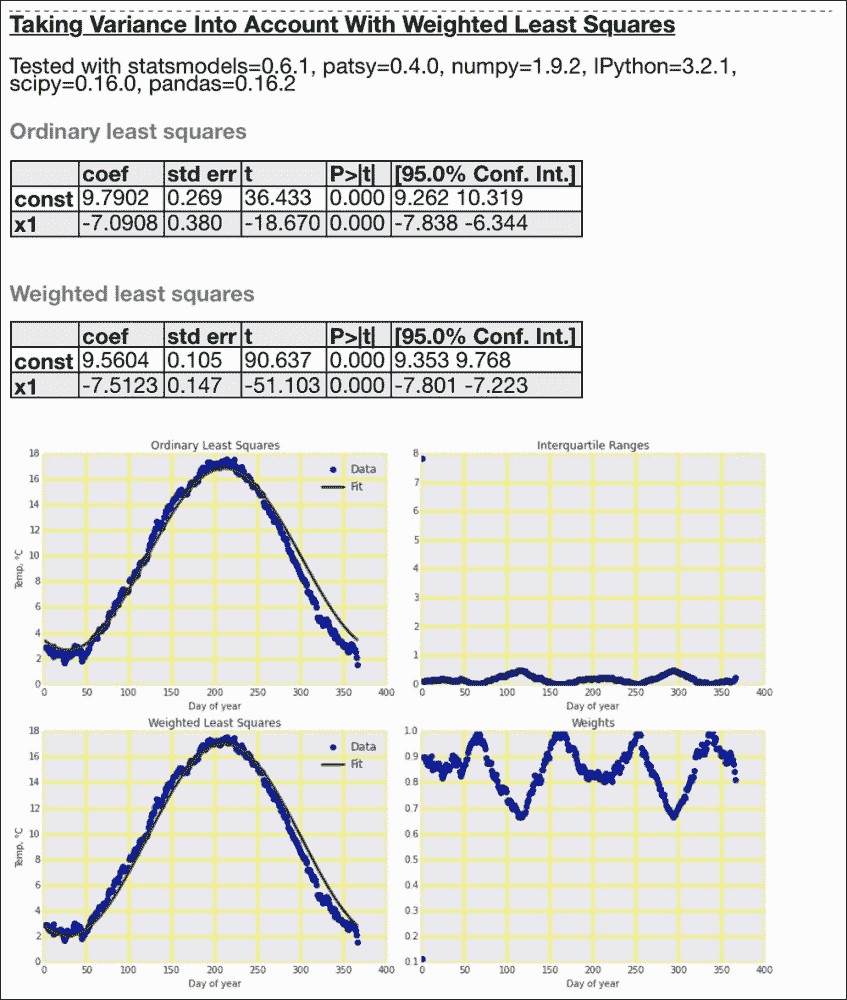

## 另见

*   相关 statsmodels 文档位于[http://stats models . SourceForge . net/0 . 5 . 0/examples/generated/example _ WLS . html](http://statsmodels.sourceforge.net/0.5.0/examples/generated/example_wls.html)(2015 年 8 月检索)。

# 使用任意精度进行优化

这本书的目标读者应该知道浮点数的问题。我会提醒你，我们不能准确地表示浮点数。偶数整数表示是有限的。对于某些应用，例如金融计算或涉及已知解析表达式的工作，我们需要比 NumPy 等数值软件更高的精度。Python 标准库提供了`Decimal`类，我们可以用它来实现任意精度。然而，专门的`mpmath`库更适合更高级的用途。

温度遵循季节性模式，因此包含余弦的模型似乎是自然的。我们将应用这样的模型。使用任意精度的好处是，您可以轻松地进行分析、微分、求根和逼近多项式。

## 做好准备

使用以下任一命令安装专用`mpmath`库:

```py
$ conda install mpmath
$ pip install mpmath

```

我通过 Anaconda 用 mpmath 0.19 测试了代码。

## 怎么做...

以下说明描述了如何使用任意精度进行优化:

1.  进口情况如下:

    ```py
    import numpy as np
    import matplotlib.pyplot as plt
    import mpmath
    import dautil as dl
    from IPython.display import HTML
    ```

2.  为模型和一阶导数定义以下函数:

    ```py
    def model(t):
        mu, C, w, phi = (9.6848106, -7.59870042, -0.01766333, -5.83349705)

        return mu + C * mpmath.cos(w * t + phi)

    def diff_model(t):
        return mpmath.diff(model, t)
    ```

3.  加载数据，求一阶导数的根:

    ```py
    vals = dl.data.Weather.load()['TEMP'].dropna()
    vals = dl.ts.groupby_yday(vals).mean()
    diff_root = mpmath.findroot(diff_model, (1, 366), solver='anderson')
    ```

4.  获得模型的多项式近似，如下所示:

    ```py
    days = range(1, 367)
    poly = mpmath.chebyfit(model, (1, 366), 3)
    poly = np.array([float(c) for c in poly])
    ```

5.  用以下代码绘制数据、建模结果和近似值:

    ```py
    sp = dl.plotting.Subplotter(2, 1, context)
    cp = dl.plotting.CyclePlotter(sp.ax)
    cp.plot(days, [model(i) for i in days], label='Model')
    cp.plot(days, vals, label='Data')
    sp.ax.annotate(s='Root of derivative', xy=(diff_root, vals.max() - 1),
                xytext=(diff_root, vals.max() - 8),
                arrowprops=dict(arrowstyle='->'))
    yvar = dl.data.Weather.get_header('TEMP')
    sp.label(ylabel_params=yvar)

    cp = dl.plotting.CyclePlotter(sp.next_ax())
    cp.plot(days, vals, label='Data')
    cp.plot(days, np.polyval(poly, days), label='Approximation')
    sp.label(ylabel_params=yvar)
    plt.tight_layout()
    HTML(dl.report.HTMLBuilder().watermark())
    ```

最终结果参见下面的截图(参见本书代码包中的`mpmath_fit.ipynb`文件):

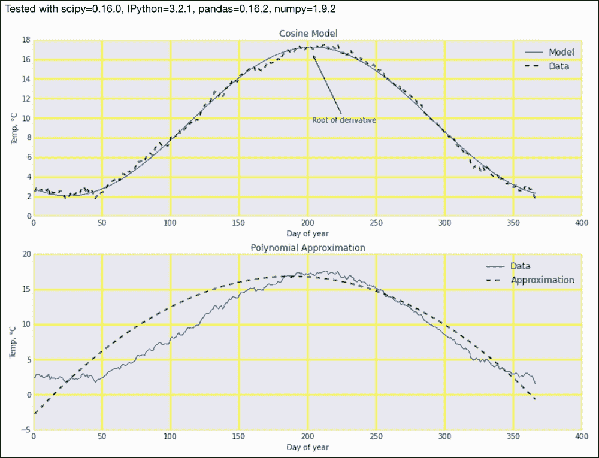

## 另见

*   位于[的`chebyfit()`函数的文档](https://mpmath.readthedocs.org/en/latest/calculus/approximation.html#mpmath.chebyfit)(检索于 2015 年 8 月)
*   位于[的](https://mpmath.readthedocs.org/en/latest/calculus/optimization.html) `findroot()`函数的文档

# 对线性代数使用任意精度

很多模型可以归结为线性方程组，其中是线性代数的定义域。*中提到的使用任意精度进行优化的 mpmath 库*配方也可以做任意精度的线性代数。

理论上，我们可以将任何可微函数近似为多项式级数。为了找到多项式的系数，我们可以定义一个线性方程组，基本上是取一个数据向量(向量作为数学项)的幂，用一个 1 的向量来表示多项式中的常数。我们将用 mpmath `lu_solve()`函数来求解这样一个系统。作为示例数据，我们将使用按一年中的某一天分组的风速数据。

## 做好准备

有关说明，请参考*使用任意精度进行优化*配方。

## 怎么做...

按照以下步骤对线性代数使用任意精度:

1.  进口情况如下:

    ```py
    import mpmath
    import dautil as dl
    import numpy as np
    import matplotlib.pyplot as plt
    from IPython.display import HTML
    ```

2.  定义以下函数，用 mpmath 计算算术平均值:

    ```py
    def mpmean(arr):
        mpfs = [mpmath.mpf(a) for a in arr]

        return sum(mpfs)/len(arr)
    ```

3.  加载数据，用`lu_solve()` :

    ```py
    vals = dl.data.Weather.load()['WIND_SPEED'].dropna()
    vals = dl.ts.groupby_yday(vals).apply(mpmean)

    days = np.arange(1, 367, dtype=int)
    A = [[], [], []]
    A[0] = np.ones_like(days, dtype=int).tolist()
    A[1] = days.tolist()
    A[2] = (days ** 2).tolist()
    A = mpmath.matrix(A).transpose()

    params = mpmath.lu_solve(A, vals)

    result = dl.report.HTMLBuilder()
    result.h1('Arbitrary Precision Linear Algebra')
    result.h2('Polynomial fit')
    dfb = dl.report.DFBuilder(['Coefficient 0', 'Coefficient 1', 'Coefficient 2'])
    dfb.row(params)
    result.add_df(dfb.build())
    ```

    求解系统
4.  定义以下函数来计算我们得到的多项式:

    ```py
    def poly(x):
        return mpmath.polyval(params[::-1], x)
    ```

5.  使用`fourier()`函数获得三角近似:

    ```py
    cs = mpmath.fourier(poly, days.tolist(), 1)
    result.h2('Cosine and sine terms')
    dfb = dl.report.DFBuilder(['Coefficient 1', 'Coefficient 2'])
    dfb.row(cs[0])
    dfb.row(cs[1])
    result.add_df(dfb.build(index=['Cosine', 'Sine']), index=True)
    ```

6.  将数据、模型结果和近似值绘制如下:

    ```py
    sp = dl.plotting.Subplotter(2, 1, context)

    cp = dl.plotting.CyclePlotter(sp.ax)
    cp.plot(days, vals, label='Data')
    cp.plot(days, poly(days), label='Fit')
    yvar = dl.data.Weather.get_header('WIND_SPEED')
    sp.label(ylabel_params=yvar)

    cp = dl.plotting.CyclePlotter(sp.next_ax())
    cp.plot(days, vals, label='Data')
    cp.plot(days, [mpmath.fourierval(cs, days, d) for d in days], label='Approximation')
    sp.label(ylabel_params=yvar)
    plt.tight_layout()
    HTML(result.html)
    ```

最终结果参见下面的截图(参见本书代码包中的`mpmath_linalg.ipynb`文件):

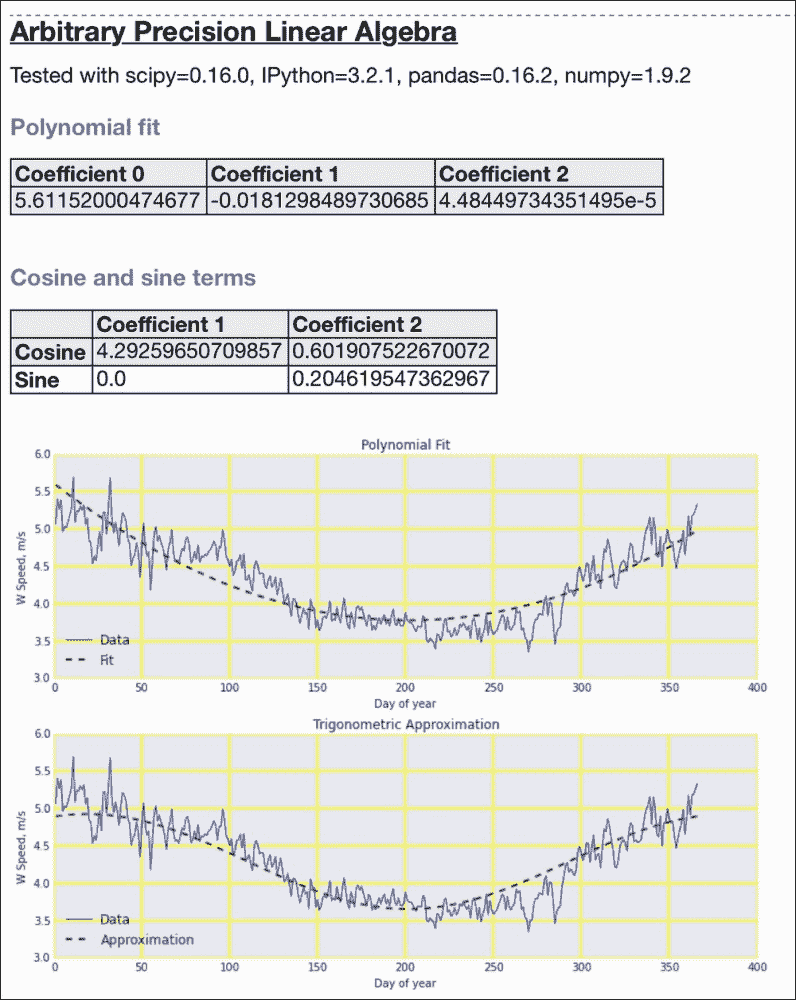

## 另见

*   在[https://mpmath . readed docs . org/en/latest/calculation/近似值. html 中记录的`fourier()`函数？高光=傅立叶#mpmath .傅立叶](https://mpmath.readthedocs.org/en/latest/calculus/approximation.html?highlight=fourier#mpmath.fourier)(检索于 2015 年 8 月)
*   `lu_solve()`功能在[https://mpmath.readthedocs.org/en/latest/matrices.html?记录高光= Lu _ solve](https://mpmath.readthedocs.org/en/latest/matrices.html?highlight=lu_solve)(2015 年 8 月检索)