# 九、集成学习和降维

在本章中，我们将介绍以下食谱:

*   递归消除特征
*   应用主成分分析进行降维
*   应用线性判别分析进行降维
*   多个模型的堆叠和多数投票
*   随机森林学习
*   用 RANSAC 算法拟合噪声数据
*   打包以提高结果
*   促进更好的学习
*   嵌套交叉验证
*   使用 joblib 重用模型
*   分层聚类数据
*   进行一次大西洋之旅

# 简介

在 1983 年的战争游戏电影中，一台电脑做出了可能导致第三次世界大战的生死决定。据我所知，当时的技术还不能完成这样的壮举。然而，在 1997 年，深蓝超级计算机确实击败了一位世界象棋冠军。2005 年，一辆斯坦福自动驾驶汽车在沙漠中独自行驶了 130 多公里。2007 年，另一个车队的车在正常交通中行驶了 50 多公里。2011 年，沃森电脑在与人类对手的竞赛中获胜。如果我们假设计算机硬件是限制因素，那么我们可以尝试推断未来。雷·库兹韦尔做到了这一点，根据他的说法，我们可以预计人类水平的智力将在 2029 年左右。

在这一章中，我们将集中讨论更简单的预测第二天天气的问题。我们将假设今天的天气取决于昨天的天气。理论上，如果一只蝴蝶在一个位置扇动翅膀，这可能会引发一连串的事件，在几千公里外的地方引发一场暴风雪(蝴蝶效应)。这并非不可能，但非常不可能。然而，如果我们有很多这样的事件，类似的情况会比你想象的更频繁地发生。

不可能考虑所有可能的因素。事实上，我们会试图通过忽略一些我们现有的数据来让我们的生活变得更容易。我们将应用分类和回归算法，以及层次聚类。让我们将结果评估推迟到第 10 章、*评估分类器、回归器和聚类*。如果你对分类食谱中提到的混淆矩阵感到好奇，请直接跳到*用混淆矩阵*食谱进行分类。

事实上，如今大多数人工智能系统并不那么智能。法庭上的法官可能会做出错误的决定，因为他或她有偏见或者过得不好。一组多位评委应该表现更好。这相当于一个机器学习项目，我们担心过度拟合和欠拟合。**集成学习**就是这个难题的解决方案，它基本上意味着以一种巧妙的方式组合多个学习者。

本章的主要部分是关于 **超参数**优化——这些是分类器和回归器的参数。为了检查过拟合或欠拟合，我们可以使用**学习曲线**，该曲线显示训练和不同训练集大小的测试分数。我们也可以通过**验证曲线**改变单个超参数的值。

# 递归消除特征

如果我们有许多特性(解释变量)，那么将它们都包含在我们的模型中是很有诱惑力的。然而，我们会冒过度拟合的风险——得到一个对训练数据非常有效而对看不见的数据非常无效的模型。不仅如此，模型必然会相对较慢，需要大量内存。我们必须权衡准确性(或其他指标)与速度和内存需求。

我们可以尝试忽略特征或创建新的更好的复合特征。例如，在在线广告中，通常使用比率，例如与广告相关的浏览量和点击量的比率。常识或领域知识可以帮助我们选择特征。在最坏的情况下，我们可能不得不依赖相关性或其他统计方法。scikit-learn 库提供了`RFE`类(递归特征消除)，可以自动选择特征。我们将在这个食谱中使用这个课程。我们还需要一个外部估计器。`RFE`类是相对较新的，不幸的是，不能保证所有的评估人员都能与`RFE`类一起工作。

## 怎么做...

1.  进口情况如下:

    ```py
    from sklearn.feature_selection import RFE
    from sklearn.svm import SVC
    from sklearn.svm import SVR
    from sklearn.preprocessing import MinMaxScaler
    import dautil as dl
    import warnings
    import numpy as np
    ```

2.  创建一个 SVC 分类器和一个 RFE 对象，如下所示:

    ```py
    warnings.filterwarnings("ignore", category=DeprecationWarning)
    clf = SVC(random_state=42, kernel='linear')
    selector = RFE(clf)
    ```

3.  加载数据，使用`MinMaxScaler`功能进行缩放，并添加一年中的某一天作为特征:

    ```py
    df = dl.data.Weather.load().dropna()
    df['RAIN'] = df['RAIN'] == 0
    df['DOY'] = [float(d.dayofyear) for d in df.index]
    scaler = MinMaxScaler()

    for c in df.columns:
        if c != 'RAIN':
            df[c] = scaler.fit_transform(df[c])
    ```

4.  打印数据的第一行作为健全性检查:

    ```py
    dl.options.set_pd_options()
    print(df.head(1))
    X = df[:-1].values
    np.set_printoptions(formatter={'all': '{:.3f}'.format})
    print(X[0])
    np.set_printoptions()
    ```

5.  使用有雨或无雨作为类别来确定对功能的支持和排名(在分类的上下文中):

    ```py
    y = df['RAIN'][1:].values
    selector = selector.fit(X, y)
    print('Rain support', df.columns[selector.support_])
    print('Rain rankings', selector.ranking_)
    ```

6.  使用温度作为特征来确定特征的支持度和等级:

    ```py
    reg = SVR(kernel='linear')
    selector = RFE(reg)
    y = df['TEMP'][1:].values
    selector = selector.fit(X, y)
    print('Temperature support', df.columns[selector.support_])
    print('Temperature ranking', selector.ranking_)
    ```

最终结果参见以下截图:

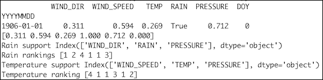

本食谱的代码在本书代码包的`feature_elimination.py`文件中。

## 它是如何工作的

`RFE`类默认选择一半的特征。算法如下:

1.  根据数据训练外部估计器，并为特征分配权重。
2.  权重最小的要素将被移除。
3.  重复该过程，直到我们拥有必要数量的功能。

## 另见

*   位于[的 `RFE`课程的文档。RFE.html](http://scikit-learn.org/stable/modules/generated/sklearn.feature_selection.RFE.html)(2015 年 11 月检索)

# 应用主成分分析进行降维

**主成分分析** ( **PCA** )由卡尔·皮尔逊于 1901 年发明，是一种将数据转换为不相关的正交特征的算法，称为**主成分**。主分量是协方差矩阵的特征向量。

有时，我们通过在应用主成分分析之前缩放数据来获得更好的结果，尽管这不是严格必要的。我们可以将主成分分析解释为将数据投影到更低维度的空间。一些主成分贡献的信息相对较少(低方差)；因此，我们可以省略它们。我们有以下转变:

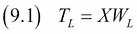

结果是矩阵 *T* <sub>*L*</sub> ，行数与原始矩阵相同，但列数较低。

当然，降维对于可视化和建模以及减少过度拟合的机会是有用的。事实上，有一种技术叫做**主成分回归** ( **聚合酶链反应**)，它利用了这个原理。简而言之，聚合酶链反应执行以下步骤:

1.  使用主成分分析将数据转换到低维空间。
2.  在新空间中执行线性回归。
3.  将结果转换回原始坐标系。

## 怎么做...

1.  进口情况如下:

    ```py
    import dautil as dl
    from sklearn.decomposition import PCA
    import matplotlib.pyplot as plt
    from sklearn.preprocessing import scale
    ```

2.  按如下方式加载数据，并按一年中的某一天分组:

    ```py
    df = dl.data.Weather.load().dropna()
    df = dl.ts.groupby_yday(df).mean()
    X = df.values
    ```

3.  应用主成分分析将数据投影到二维空间:

    ```py
    pca = PCA(n_components=2)
    X_r = pca.fit_transform(scale(X)).T
    ```

4.  绘制转换结果:

    ```py
    plt.scatter(X_r[0], X_r[1])
    plt.xlabel('x')
    plt.ylabel('y')
    plt.title('Dimension Reducion with PCA')
    ```

有关最终结果，请参考以下屏幕截图:

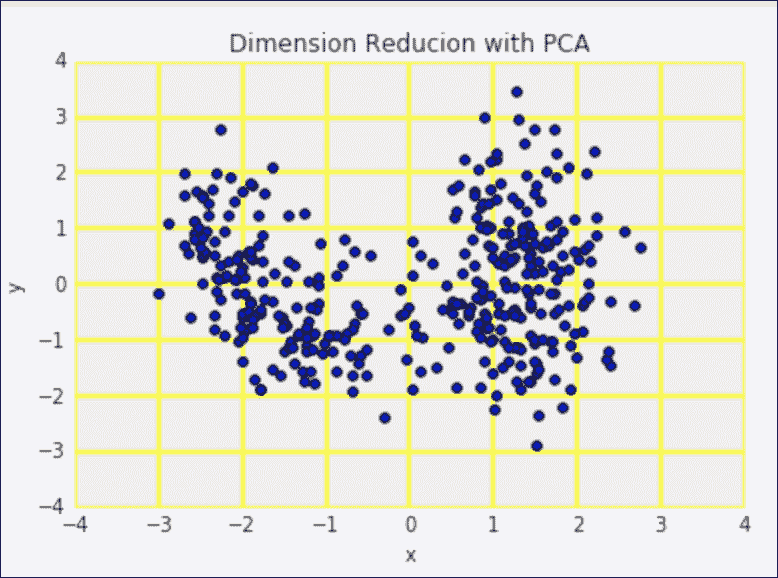

代码在本书代码包的`applying_pca.ipynb`文件中。

## 另见

*   https://en.wikipedia.org/wiki/Principal_component_analysis 关于主成分分析的维基百科页面(2015 年 11 月检索)
*   关于聚合酶链反应的维基百科页面，网址为(2015 年 11 月检索)
*   位于[的](http://scikit-learn.org/stable/modules/generated/sklearn.decomposition.PCA.html)主成分分析课程的文档

# 应用线性判别分析进行降维

**线性判别分析** ( **LDA** )是一种寻找特征线性组合以区分类别的算法。通过投影到低维子空间，它可以用于分类或降维。LDA 需要一个目标属性来进行分类和降维。

如果我们将类密度表示为多元高斯分布，那么线性判别分析假设类具有相同的协方差矩阵。我们可以使用训练数据来估计类分布的参数。

在 scikit-learn 中，`lda.LDA`在 0.17 中已被弃用，并重新命名为`discriminant_analysis.LinearDiscriminantAnalysis`。这个类的默认解算器使用奇异值分解，不需要计算协方差矩阵，因此速度很快。

## 怎么做...

代码在本书代码包的`applying_lda.ipynb`文件中:

1.  进口情况如下:

    ```py
    import dautil as dl
    from sklearn.discriminant_analysis import LinearDiscriminantAnalysis
    import matplotlib.pyplot as plt
    ```

2.  加载数据如下:

    ```py
    df = dl.data.Weather.load().dropna()
    X = df.values
    y = df['WIND_DIR'].values
    ```

3.  应用 LDA 将数据投影到二维空间:

    ```py
    lda = LinearDiscriminantAnalysis(n_components=2)
    X_r = lda.fit(X, y).transform(X).T
    ```

4.  绘制转换结果:

    ```py
    plt.scatter(X_r[0], X_r[1])
    plt.xlabel('x')
    plt.ylabel('y')
    plt.title('Dimension Reduction with LDA')
    ```

有关最终结果，请参考以下屏幕截图:

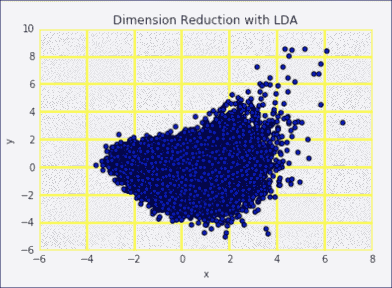

## 另见

*   https://en.wikipedia.org/wiki/Linear_discriminant_analysis 关于 LDA 的维基百科页面(检索到【2015 年 11 月)
*   相关 scikit-learn 文档为[http://sci kit-learn . org/stable/modules/generated/sklearn . discriminal _ analysis。LinearDiscriminantAnalysis.html](http://scikit-learn.org/stable/modules/generated/sklearn.discriminant_analysis.LinearDiscriminantAnalysis.html)(2015 年 11 月检索)

# 多模型叠加和多数投票

一般认为，两个人单独认识的不止一个人。民主应该比独裁更有效。在机器学习中，我们没有人类做决定，而是算法。当我们有多个分类器或回归器一起工作时，我们说的是 **集成学习**。

有很多集成学习方案。最简单的设置是对分类进行多数投票，对回归进行平均。在 scikit-learn 0.17 中，可以使用`VotingClassifier`类进行多数投票。该分类器允许您使用权重来强调或抑制分类器。

**堆叠**获取机器学习估计器的输出，然后将这些输出用作另一个算法的输入。当然，您可以将高级算法的输出馈送给另一个预测器。可以使用任意拓扑，但出于实际原因，您应该首先尝试简单的设置。

## 怎么做...

1.  进口情况如下:

    ```py
    import dautil as dl
    from sklearn.tree import DecisionTreeClassifier
    import numpy as np
    import ch9util
    from sklearn.ensemble import VotingClassifier
    from sklearn.grid_search import GridSearchCV
    from IPython.display import HTML
    ```

2.  加载数据并创建三个决策树分类器:

    ```py
    X_train, X_test, y_train, y_test = ch9util.rain_split()
    default = DecisionTreeClassifier(random_state=53, min_samples_leaf=3,
                                     max_depth=4)
    entropy = DecisionTreeClassifier(criterion='entropy',
                                     min_samples_leaf=3, max_depth=4,
                                     random_state=57)
    random = DecisionTreeClassifier(splitter='random', min_samples_leaf=3,
                                    max_depth=4, random_state=5)
    ```

3.  使用分类器进行投票:

    ```py
    clf = VotingClassifier([('default', default), 
                            ('entropy', entropy), ('random', random)])
    params = {'voting': ['soft', 'hard'],
             'weights': [None, (2, 1, 1), (1, 2, 1), (1, 1, 2)]}
    gscv = GridSearchCV(clf, param_grid=params, n_jobs=-1, cv=5)
    gscv.fit(X_train, y_train)
    votes = gscv.predict(X_test)

    preds = []

    for clf in [default, entropy, random]:
        clf.fit(X_train, y_train)
        preds.append(clf.predict(X_test))

    preds = np.array(preds)
    ```

4.  绘制基于投票的预测的混淆矩阵:

    ```py
    %matplotlib inline
    context = dl.nb.Context('stacking_multiple')
    dl.nb.RcWidget(context)

    sp = dl.plotting.Subplotter(2, 2, context)
    html = ch9util.report_rain(votes, y_test, gscv.best_params_, sp.ax)
    sp.ax.set_title(sp.ax.get_title() + ' | Voting')
    ```

5.  绘制基于堆叠的预测的混淆矩阵:

    ```py
    default.fit(preds_train.T, y_train)
    stacked_preds = default.predict(preds.T)
    html += ch9util.report_rain(stacked_preds, 
                                y_test, default.get_params(), sp.next_ax())
    sp.ax.set_title(sp.ax.get_title() + ' | Stacking')
    ch9util.report_rain(default.predict(preds.T), y_test)
    ```

6.  绘制投票和堆叠分类器的学习曲线【T1:

    ```py
    ch9util.plot_learn_curve(sp.next_ax(), gscv.best_estimator_, X_train,
                             y_train, title='Voting')

    ch9util.plot_learn_curve(sp.next_ax(), default, X_train,
                             y_train, title='Stacking')
    ```

有关最终结果，请参考以下屏幕截图:

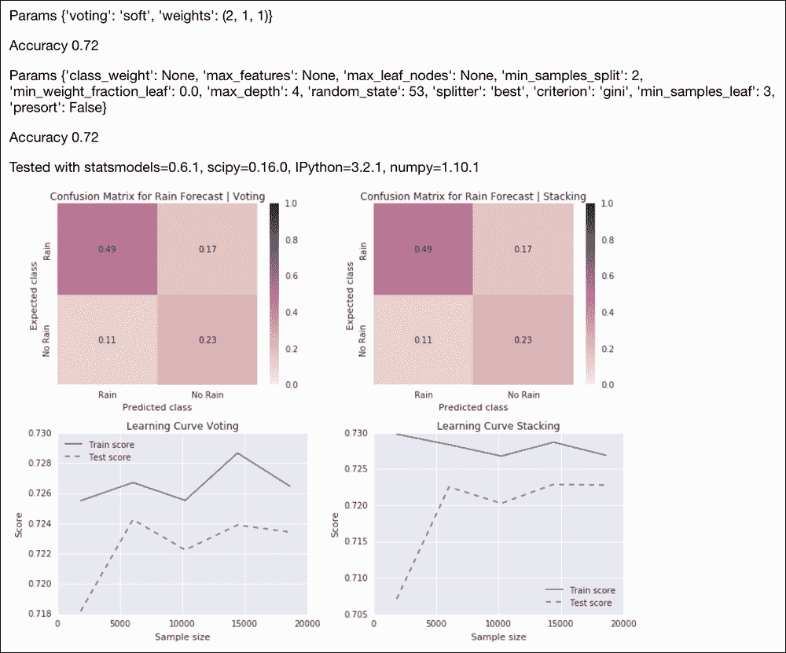

代码是本书代码包中`stacking_multiple.ipynb`文件中的。

## 另见

*   位于[的](http://scikit-learn.org/stable/modules/generated/sklearn.ensemble.VotingClassifier.html) `VotingClassifier`课程的文档
*   维基百科关于[https://en.wikipedia.org/wiki/Ensemble_learning#Stacking](https://en.wikipedia.org/wiki/Ensemble_learning#Stacking)堆积的部分(2015 年 11 月检索)

# 随机森林学习

`if a: else b`语句是 Python 编程中最常见的语句之一。通过嵌套和组合这样的语句，我们可以构建一个所谓的决策树。这类似于老式的流程图，尽管流程图也允许循环。决策树在机器学习中的应用叫做 **决策树学习**。决策树学习中的树的末端节点，也称为**叶子**，包含一个分类问题的类标签。每个非叶节点都与一个包含特征值的布尔条件相关联。

决策树可以用来推导相对简单的规则。能够产生这样的结果，当然是一个巨大的优势。然而，你不得不怀疑这些规则有多好。如果我们添加新数据，我们会得到相同的规则吗？

如果一棵决策树是好的，那么整个森林应该会更好。多棵树应该可以减少过度拟合的机会。然而，在真实的森林中，我们不希望只有一种类型的树。显然，我们将不得不平均或通过多数投票决定什么是适当的结果。

在这个食谱中，我们将应用利奥·布雷曼和阿黛尔·卡特勒发明的 **随机森林**算法。名称中的“随机”是指从数据中随机选择特征。我们使用所有数据，但不在同一个决策树中。

随机森林也应用 **装袋** ( **引导聚集**)，我们将在*装袋中讨论以提高结果*配方。决策树的打包包括以下步骤:

1.  带有替换的示例训练示例，并将其分配到树中。
2.  根据指定的数据训练树。

我们可以通过交叉验证或绘制测试和训练误差相对于树的数量来确定正确的树的数量。

## 怎么做...

代码在本书代码包的`random_forest.ipynb`文件中:

1.  进口情况如下:

    ```py
    import dautil as dl
    from sklearn.grid_search import GridSearchCV
    from sklearn.ensemble import RandomForestClassifier
    import ch9util
    import numpy as np
    from IPython.display import HTML
    ```

2.  加载数据，做如下预测:

    ```py
    X_train, X_test, y_train, y_test = ch9util.rain_split()
    clf = RandomForestClassifier(random_state=44)
    params = {
        'max_depth': [2,  4],
        'min_samples_leaf': [1, 3],
        'criterion': ['gini', 'entropy'],
        'n_estimators': [100, 200]
    }

    rfc = GridSearchCV(estimator=RandomForestClassifier(),
                       param_grid=params, cv=5, n_jobs=-1)
    rfc.fit(X_train, y_train)
    preds = rfc.predict(X_test)
    ```

3.  将降雨预报混淆矩阵绘制如下:

    ```py
    sp = dl.plotting.Subplotter(2, 2, context)
    html = ch9util.report_rain(preds, y_test, rfc.best_params_, sp.ax)
    ```

4.  绘制一系列森林大小的验证曲线:

    ```py
    ntrees = 2 ** np.arange(9)
    ch9util.plot_validation(sp.next_ax(), rfc.best_estimator_, 
                            X_train, y_train, 'n_estimators', ntrees)
    ```

5.  绘制深度范围的验证曲线:

    ```py
    depths = np.arange(2, 9)
    ch9util.plot_validation(sp.next_ax(), rfc.best_estimator_, 
                            X_train, y_train, 'max_depth', depths)
    ```

6.  绘制最佳估计量的学习曲线:

    ```py
    ch9util.plot_learn_curve(sp.next_ax(), 
                             rfc.best_estimator_, X_train,y_train)
    HTML(html + sp.exit())
    ```

有关最终结果，请参考以下屏幕截图:

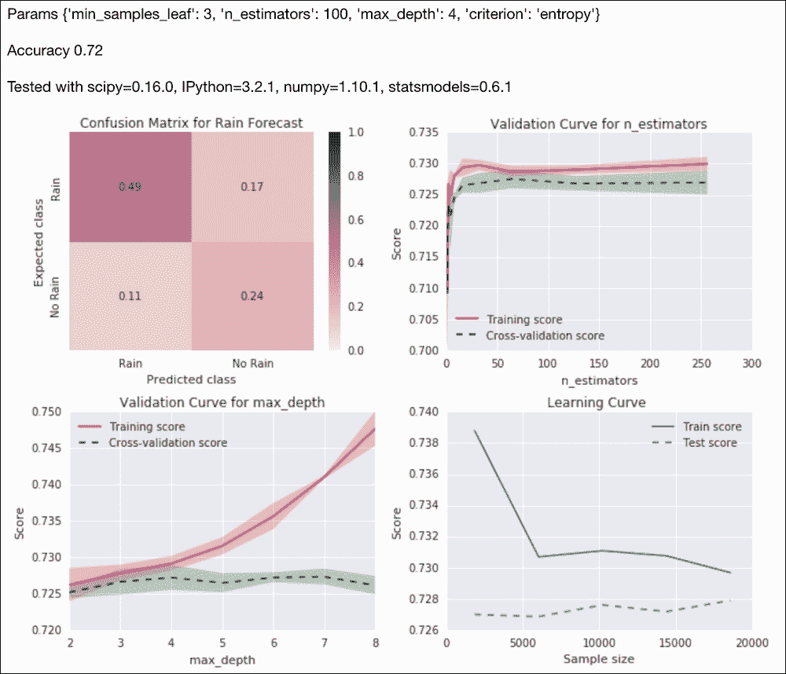

## 还有更多…

随机森林分类被认为是一种通用的算法，我们几乎可以将其用于任何分类任务。**遗传** **算法**和**遗传编程**一般可以做一个网格搜索或者优化。

我们可以把程序看作是一个生成结果的操作符和操作数的序列。当然，这是一个非常简化的编程模型。然而，在这样的模型中，有可能使用模仿生物学理论的自然选择来进化程序。遗传程序是自我修改的，具有巨大的适应性，但我们得到的决定论水平较低。

TPOT 项目试图发展机器学习管道(目前使用少量分类器，包括随机森林)。我在 GitHub 上分叉了 TPOT 0.1.3 并做了一些修改。TPOT 使用`deap`作为遗传编程部件，可以安装如下:

```py
$ pip install deap

```

我用 deap 1.0.2 测试了代码。在标签`r1`下安装我的更改，如下所示:

```py
$ git clone git@github.com:ivanidris/tpot.git
$ cd tpot
$ git checkout r1
$ python setup.py install

```

您也可以从[https://github.com/ivanidris/tpot/releases/tag/r1](https://github.com/ivanidris/tpot/releases/tag/r1)获取代码。本书代码包中`rain_pot.py`文件的以下代码演示了如何用 TPOT 拟合和评分降雨预测:

```py
import ch9util
from tpot import TPOT

X_train, X_test, y_train, y_test = ch9util.rain_split()
tpot = TPOT(generations=7, population_size=110, verbosity=2)
tpot.fit(X_train, y_train)
print(tpot.score(X_train, y_train, X_test, y_test))
```

## 另见

*   维基百科关于 https://en.wikipedia.org/wiki/Random_forest 随机森林的页面(2015 年 11 月检索)
*   位于[的`RandomForestClassifier`类的文档](http://scikit-learn.org/stable/modules/generated/sklearn.ensemble.RandomForestClassifier.html)(2015 年 11 月检索)

# 用 RANSAC 算法拟合噪声数据

我们在本书的其他地方讨论了回归背景下的异常值问题(参见本食谱末尾的*也参见*部分)。问题很明显——异常值使得我们很难恰当地拟合我们的模型。**随机样本一致性算法** ( **RANSAC** )尽最大努力以迭代方式拟合我们的数据。RANSAC 是由 Fishler 和 Bolles 在 1981 年推出的。

我们通常对我们的数据有一些了解，例如数据可能遵循正态分布。或者，数据可以是由具有不同特征的多个过程产生的混合。由于数据转换中的故障或错误，我们也可能有异常数据。在这种情况下，识别异常值并对其进行适当处理应该很容易。RANSAC 算法不知道你的数据，但它也假设有内联和外联。

算法经过固定次数的迭代。目标是找到一组指定大小的内联集(**共识集**)。

RANSAC 执行以下步骤:

1.  随机选择尽可能小的数据子集并拟合模型。
2.  检查每个数据点是否与上一步拟合的模型一致。使用残差阈值将不一致的点标记为异常值。
3.  如果找到足够多的内联，则接受该模型。
4.  用完全一致集重新估计参数。

scikit-learn `RANSACRegressor`类可以使用合适的估计器进行拟合。我们将使用默认的`LinearRegression`估计器。我们还可以指定拟合的最小样本数、残差阈值、异常值的决策函数、决定模型是否有效的函数、最大迭代次数以及共识集中所需的内联数。

## 怎么做...

代码在本书代码包的`fit_ransac.ipynb`文件中:

1.  进口情况如下:

    ```py
    import ch9util
    from sklearn import linear_model
    from sklearn.grid_search import GridSearchCV
    import numpy as np
    import dautil as dl
    from IPython.display import HTML
    ```

2.  加载数据并进行温度预测，如下所示:

    ```py
    X_train, X_test, y_train, y_test = ch9util.temp_split()
    ransac = linear_model.RANSACRegressor(random_state=27)
    params = {
        'max_trials': [50, 100, 200],
        'stop_probability': [0.98, 0.99]
    }

    gscv = GridSearchCV(estimator=ransac, param_grid=params, cv=5)
    gscv.fit(X_train, y_train)
    preds = gscv.predict(X_test)
    ```

3.  将预测值与实际值进行散点图:

    ```py
    sp = dl.plotting.Subplotter(2, 2, context)
    html = ch9util.scatter_predictions(preds, y_test, gscv.best_params_,
                                       gscv.best_score_, sp.ax)
    ```

4.  绘制一系列试验号的验证曲线:

    ```py
    trials = 10 * np.arange(5, 20)
    ch9util.plot_validation(sp.next_ax(), gscv.best_estimator_, 
                            X_train, y_train, 'max_trials', trials)
    ```

5.  绘制一系列停止概率的验证曲线:

    ```py
    probs = 0.01 * np.arange(90, 99)
    ch9util.plot_validation(sp.next_ax(), gscv.best_estimator_, 
                            X_train, y_train, 'stop_probability', probs)
    ```

6.  绘制一系列一致集合大小的验证曲线:

    ```py
    ninliers = 2 ** np.arange(4, 14)
    ch9util.plot_validation(sp.next_ax(), gscv.best_estimator_, 
                            X_train, y_train, 'stop_n_inliers', ninliers)
    HTML(html + sp.exit())
    ```

有关最终结果，请参考以下屏幕截图:

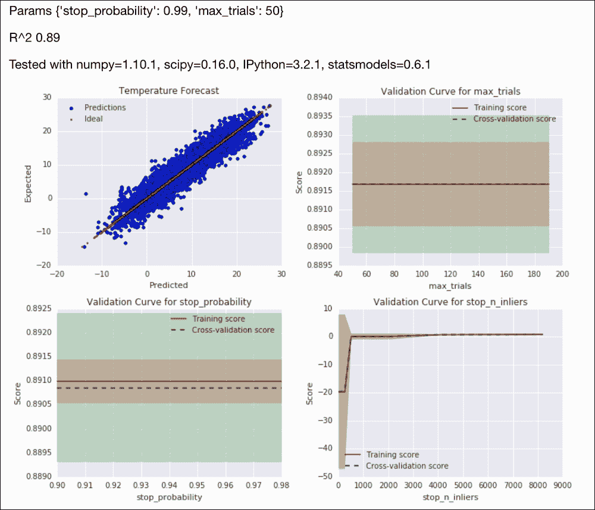

## 另见

*   https://en.wikipedia.org/wiki/RANSAC 关于 RANSAC 算法的维基百科页面(2015 年 11 月检索)
*   相关 scikit-learn 文档位于[http://sci kit-learn . org/stable/modules/generated/sklearn . linear _ model。RANSACRegressor.html](http://scikit-learn.org/stable/modules/generated/sklearn.linear_model.RANSACRegressor.html)(2015 年 11 月检索)
*   拟合稳健线性模型的方法
*   用加权最小二乘法考虑方差的*配方*

# 套袋提高效果

**Bootstrap 聚合**或 **bagging** 是 Leo Breiman 在 1994 年引入的一种算法，它将 Bootstrap 应用于机器学习问题。*随机森林学习*食谱中也提到了套袋。

该算法旨在通过以下步骤减少过拟合的机会:

1.  我们通过替换采样从输入训练数据生成新的训练集。
2.  使模型适合每个生成的训练集。
3.  通过平均或多数投票来组合模型的结果。

scikit-learn `BaggingClassifier`类允许我们引导训练示例，我们还可以引导随机森林算法中的特征。当我们执行网格搜索时，我们引用前缀为 `base_estimator__`的基本估计量的超参数。我们将使用决策树作为基础估计，这样我们就可以重用来自*随机森林学习*方法的一些超参数配置。

## 怎么做...

代码在本书代码包的`bagging.ipynb`文件中:

1.  进口情况如下:

    ```py
    import ch9util
    from sklearn.ensemble import BaggingClassifier
    from sklearn.grid_search import GridSearchCV
    from sklearn.tree import DecisionTreeClassifier
    import numpy as np
    import dautil as dl
    from IPython.display import HTML
    ```

2.  加载数据并创建`BaggingClassifier` :

    ```py
    X_train, X_test, y_train, y_test = ch9util.rain_split()
    clf = BaggingClassifier(base_estimator=DecisionTreeClassifier(
        min_samples_leaf=3, max_depth=4), random_state=43)
    ```

3.  网格搜索、拟合和预测如下:

    ```py
    params = {
        'n_estimators': [320, 640],
        'bootstrap_features': [True, False],
        'base_estimator__criterion': ['gini', 'entropy']
    }

    gscv = GridSearchCV(estimator=clf, param_grid=params,
                        cv=5, n_jobs=-1)

    gscv.fit(X_train, y_train)
    preds = gscv.predict(X_test)
    ```

4.  将降雨预报混淆矩阵绘制如下:

    ```py
    sp = dl.plotting.Subplotter(2, 2, context)
    html = ch9util.report_rain(preds, y_test, gscv.best_params_, sp.ax)
    ```

5.  绘制一系列集合大小的验证曲线:

    ```py
    ntrees = 2 ** np.arange(4, 11)
    ch9util.plot_validation(sp.next_ax(), gscv.best_estimator_, 
                            X_train, y_train, 'n_estimators', ntrees)
    ```

6.  绘制`max_samples`参数的验证曲线:

    ```py
    nsamples = 2 ** np.arange(4, 14)
    ch9util.plot_validation(sp.next_ax(), gscv.best_estimator_, 
                            X_train, y_train, 'max_samples', nsamples)
    ```

7.  绘制学习曲线如下:

    ```py
    ch9util.plot_learn_curve(sp.next_ax(), gscv.best_estimator_, 
                             X_train, y_train)
    HTML(html + sp.exit())
    ```

有关最终结果，请参考以下屏幕截图:

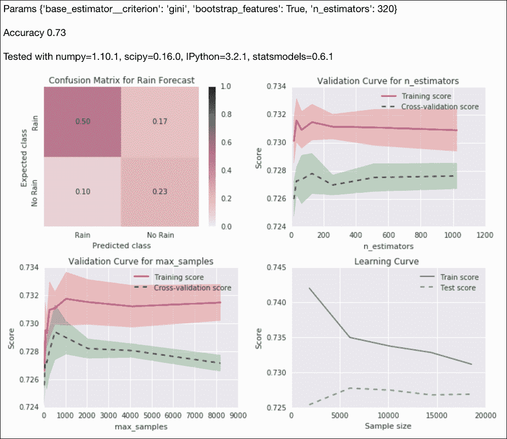

## 另见

*   https://en.wikipedia.org/wiki/Bootstrap_aggregating 装袋的维基百科页面(2015 年 11 月检索)
*   位于[的](http://scikit-learn.org/stable/modules/generated/sklearn.ensemble.BaggingClassifier.html) `BaggingClassifier`文档

# 促进更好的学习

数量上的优势是大国比小国更成功的原因。这并不意味着一个大国的人生活得更好。但是从全局来看，个人并没有那么重要，就像在决策树的集合中，如果我们有足够多的树，单棵树的结果可以被忽略。

在分类的背景下，我们将 **【弱学习者】**定义为只比基线好一点的学习者，例如随机分配班级。虽然学习能力弱的人个人也很弱，就像蚂蚁一样，但是在一起，他们可以像蚂蚁一样做惊人的事情。

使用权重考虑每个学习者的力量是有意义的。这个总的思路叫做 **助推**。有很多助推算法，其中我们将在本食谱中使用 **AdaBoost** 。增强算法的不同之处主要在于它们的加权方案。

AdaBoost 使用加权求和来产生最终结果。这是一种自适应算法，试图提高单个训练示例的结果。如果你已经为考试而学习，你可能已经应用了类似的技术，识别你有问题的问题类型，并专注于困难的问题。在 AdaBoost 的情况下，提升是通过调整弱学习者来完成的。

## 怎么做...

程序在本书代码包的`boosting.ipynb`文件中:

1.  进口情况如下:

    ```py
    import ch9util
    from sklearn.grid_search import GridSearchCV
    from sklearn.ensemble import AdaBoostRegressor
    from sklearn.tree import DecisionTreeRegressor
    import numpy as np
    import dautil as dl
    from IPython.display import HTML
    ```

2.  加载数据并创建`AdaBoostRegressor`类:

    ```py
    X_train, X_test, y_train, y_test = ch9util.temp_split()
    params = {
        'loss': ['linear', 'square', 'exponential'],
        'base_estimator__min_samples_leaf': [1, 2]
    }
    reg = AdaBoostRegressor(base_estimator=DecisionTreeRegressor(random_state=28),
                            random_state=17)
    ```

3.  网格搜索、拟合和预测如下:

    ```py
    gscv = GridSearchCV(estimator=reg,
                        param_grid=params, cv=5, n_jobs=-1)
    gscv.fit(X_train, y_train)
    preds = gscv.predict(X_test)
    ```

4.  将预测值与实际值进行散点图:

    ```py
    sp = dl.plotting.Subplotter(2, 2, context)
    html = ch9util.scatter_predictions(preds, y_test, gscv.best_params_,  
                                       gscv.best_score_, sp.ax)
    ```

5.  绘制一系列集合大小的验证曲线:

    ```py
    nestimators = 2 ** np.arange(3, 9)
    ch9util.plot_validation(sp.next_ax(), gscv.best_estimator_, 
                            X_train, y_train, 'n_estimators', nestimators)
    ```

6.  绘制一系列学习率的验证曲线:

    ```py
    learn_rate = np.linspace(0.1, 1, 9)
    ch9util.plot_validation(sp.next_ax(), gscv.best_estimator_, 
                            X_train, y_train, 'learning_rate', learn_rate)
    ```

7.  绘制学习曲线如下:

    ```py
    ch9util.plot_learn_curve(sp.next_ax(), gscv.best_estimator_, 
                             X_train, y_train)
    HTML(html + sp.exit())
    ```

有关最终结果，请参考以下屏幕截图:

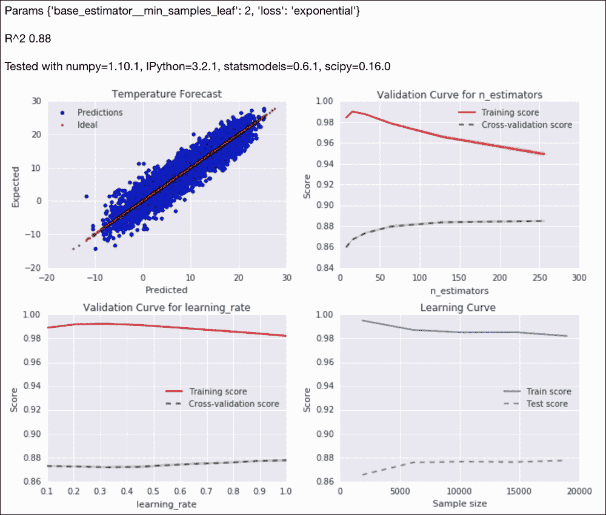

## 另见

*   维基百科关于提升的页面在[https://en . Wikipedia . org/wiki/Boosting _ % 28 machine _ learning % 29](https://en.wikipedia.org/wiki/Boosting_%28machine_learning%29)(2015 年 11 月检索)
*   https://en.wikipedia.org/wiki/AdaBoost 关于 AdaBoost 的维基百科页面(2015 年 11 月检索)
*   位于[的](http://scikit-learn.org/stable/modules/generated/sklearn.ensemble.AdaBoostRegressor.html)`AdaBoostRegressor`课程的文档

# 嵌套交叉验证

如果我们将数据拟合到一条直线上，数学模型的参数将是直线的斜率和截距。当我们确定模型的参数时，我们在数据的子集(训练集)上拟合模型，并在其余数据(测试集)上评估模型的性能。这叫做 **验证**还有更精细的方案。例如，scikit-learn `GridSearchCV`类使用 k 倍交叉验证。

分类器和回归器通常需要额外的参数(超参数)，例如集成的组件数量，这通常与第一句中提到的线性模型无关。谈论模型有点令人困惑，因为我们有带有普通参数的模型和带有超参数的更大的模型。

让我们称较大的模型为 2 级模型，尽管据我所知这不是标准术语。如果我们使用`GridSearchCV`来获得 2 级模型的超参数，我们还有另一组参数(不是超参数或 1 级参数)需要担心——折叠的数量和用于比较的度量。评估指标还没有通过评审(参考[第 10 章](10.html "Chapter 10. Evaluating Classifiers, Regressors, and Clusters")、*评估分类器、回归器和聚类*，但是比我们在本章中使用的指标更多。此外，我们可能会担心我们是否在用于评估结果的相同数据上确定了超参数。一种解决方案是应用 **嵌套交叉验证**。

嵌套交叉验证由以下交叉验证组成:

*   内部交叉验证进行超参数优化，例如使用网格搜索
*   外部交叉验证用于评估绩效和进行统计分析

在这个配方中，我们将查看以下分布:

*   所有分数的分布
*   `GridSearchCV`报告的每个外部交叉验证迭代的最佳分数分布
*   每个折叠的平均分数分布
*   `GridSearchCV`迭代中分数标准差的分布

## 怎么做...

代码在本书代码包的`nested_cv.ipynb`文件中:

1.  进口情况如下:

    ```py
    from sklearn.grid_search import GridSearchCV
    from sklearn.cross_validation import ShuffleSplit
    from sklearn.cross_validation import cross_val_score
    import dautil as dl
    from sklearn.ensemble import ExtraTreesRegressor
    from joblib import Memory
    import numpy as np
    from IPython.display import HTML

    memory = Memory(cachedir='.')
    ```

2.  按照上一节

    ```py
    @memory.cache
    def get_scores():
        df = dl.data.Weather.load()[['WIND_SPEED', 'TEMP', 'PRESSURE']].dropna()
        X = df.values[:-1]
        y = df['TEMP'][1:]

        params = { 'min_samples_split': [1, 3],
                'min_samples_leaf': [3, 4]}

        gscv = GridSearchCV(ExtraTreesRegressor(bootstrap=True,
                                                random_state=37),
                            param_grid=params, n_jobs=-1, cv=5)
        cv_outer = ShuffleSplit(len(X), n_iter=500,
                                test_size=0.3, random_state=55)
        r2 = []
        best = []
        means = []
        stds = []

        for train_indices, test_indices in cv_outer:
            train_i = X[train_indices], y[train_indices]
            gscv.fit(*train_i)
            test_i = X[test_indices]
            gscv.predict(test_i)
            grid_scores = dl.collect.flatten([g.cv_validation_scores
                for g in gscv.grid_scores_])
            r2.extend(grid_scores)
            means.extend(dl.collect.flatten([g.mean_validation_score
                for g in gscv.grid_scores_]))
            stds.append(np.std(grid_scores))
            best.append(gscv.best_score_)

        return {'r2': r2, 'best': best, 'mean': means, 'std': stds}
    ```

    的描述，得到 R 平方的分数
3.  获取分数并将其载入 NumPy 数组:

    ```py
    scores = get_scores()
    r2 = np.array(scores['r2'])
    avgs = np.array(scores['mean'])
    stds = np.array(scores['std'])
    best = np.array(scores['best'])
    ```

4.  将分布绘制如下:

    ```py
    sp = dl.plotting.Subplotter(2, 2, context)
    dl.plotting.hist_norm_pdf(sp.ax, r2)
    sp.label()

    dl.plotting.hist_norm_pdf(sp.next_ax(), best)
    sp.label()

    dl.plotting.hist_norm_pdf(sp.next_ax(), avgs)
    sp.label()

    dl.plotting.hist_norm_pdf(sp.next_ax(), stds)
    sp.label()
    HTML(sp.exit())
    ```

有关最终结果(交叉验证结果的分布)，请参考以下屏幕截图:

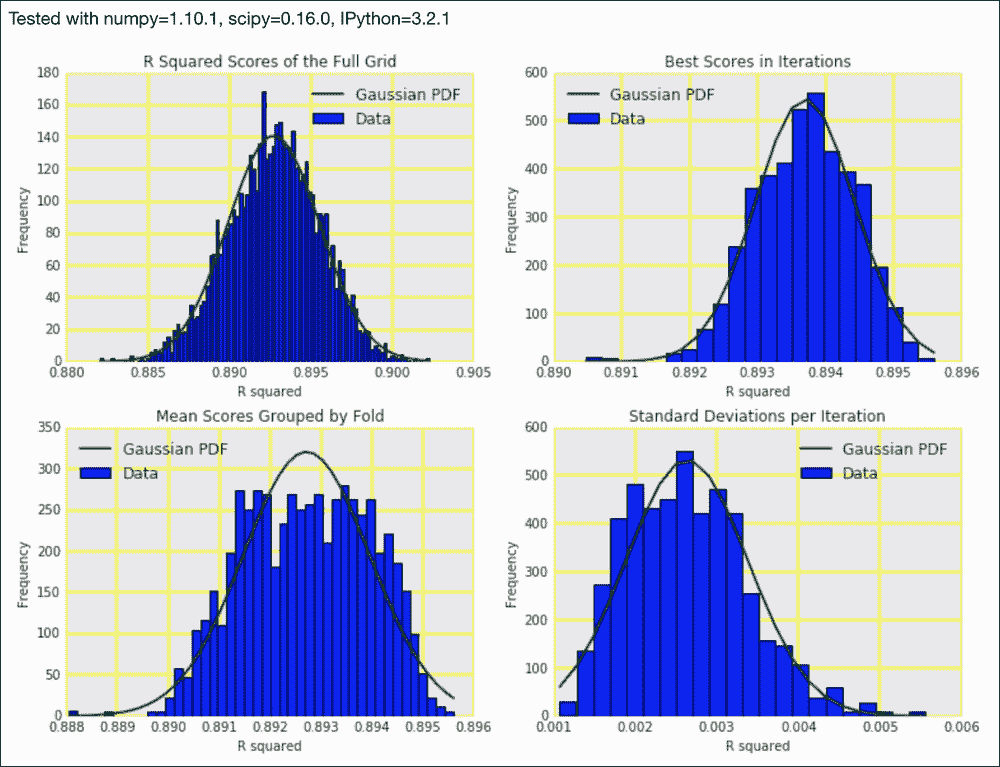

## 另见

*   关于[交叉验证的维基百科页面](https://en.wikipedia.org/wiki/Cross-validation_%28statistics%29)
*   关于[https://en.wikipedia.org/wiki/Hyperparameter_optimization](https://en.wikipedia.org/wiki/Hyperparameter_optimization)超参数优化的维基百科页面(2015 年 11 月检索)

# 使用 joblib 重用模型

joblib `Memory`类是一个实用程序类，便于将函数或方法结果缓存到磁盘。我们通过指定一个缓存目录来创建一个`Memory`对象。然后，我们可以修饰函数以进行缓存，或者在类构造函数中指定要缓存的方法。如果愿意，可以指定要忽略的参数。`Memory`类的默认行为是在函数修改或输入值改变时移除缓存。显然，您也可以通过移动或删除缓存目录和文件来手动删除缓存。

在这个食谱中，我描述了如何重用 scikit-learn 回归器或分类器。天真的方法是将对象存储在标准 Python 泡菜中或使用 joblib。然而，在大多数情况下，最好存储估计量的超参数。

我们将使用`ExtraTreesRegressor`类作为估计量。**额外树** ( **极随机树**)是随机森林算法的变种，在*随机森林学习*食谱中有所涉及。

## 怎么做...

1.  进口情况如下:

    ```py
    from sklearn.grid_search import GridSearchCV
    from sklearn.ensemble import ExtraTreesRegressor
    import ch9util
    from tempfile import mkdtemp
    import os
    import joblib
    ```

2.  加载数据并定义超参数网格搜索字典:

    ```py
    X_train, X_test, y_train, y_test = ch9util.temp_split()
    params = {'min_samples_split': [1, 3],
              'bootstrap': [True, False],
              'min_samples_leaf': [3, 4]}
    ```

3.  按照以下步骤进行网格搜索:

    ```py
    gscv = GridSearchCV(ExtraTreesRegressor(random_state=41),
                        param_grid=params, cv=5)
    ```

4.  拟合和预测如下:

    ```py
    gscv.fit(X_train, y_train)
    preds = gscv.predict(X_test)
    ```

5.  存储网格搜索找到的最佳参数:

    ```py
    dir = mkdtemp()
    pkl = os.path.join(dir, 'params.pkl')
    joblib.dump(gscv.best_params_, pkl)
    params = joblib.load(pkl)
    print('Best params', gscv.best_params_)
    print('From pkl', params)
    ```

6.  创建一个新的估计值，并比较预测值:

    ```py
    est = ExtraTreesRegressor(random_state=41)
    est.set_params(**params)
    est.fit(X_train, y_train)
    preds2 = est.predict(X_test)
    print('Max diff', (preds - preds2).max())
    ```

最终结果参见以下截图:

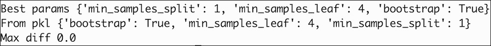

代码在本书代码包的`reusing_models.py`文件中。

## 另见

*   [https://pythonhosted.org/joblib/memory.html](https://pythonhosted.org/joblib/memory.html)的`Memory`班的文件(2015 年 11 月检索)
*   维基百科关于 https://en.wikipedia.org/wiki/Random_forest T2 随机森林的页面(2015 年 11 月检索)

# 分层聚类数据

在 *Python 数据分析*中，您学习了聚类——在不提供任何提示的情况下将数据分成聚类——这是无监督学习的一种形式。有时，我们需要猜测集群的数量，就像我们在*中使用 Spark* 方法对流式数据进行集群一样。

不限制簇包含其他簇。在这种情况下，我们谈到**层次聚类**。我们需要一个距离度量来分隔数据点。看看下面的等式:

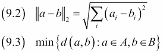

在本食谱中，我们将使用 SciPy `pdist()`函数提供的欧几里德距离(9.2)。点集合之间的距离由链接标准给出。在本食谱中，我们将使用 SciPy `linkage()`功能提供的单连锁标准(9.3)。

## 怎么做...

脚本在本书代码包的`clustering_hierarchy.ipynb`文件中:

1.  进口情况如下:

    ```py
    from scipy.spatial.distance import pdist
    from scipy.cluster.hierarchy import linkage
    from scipy.cluster.hierarchy import dendrogram
    import dautil as dl
    import matplotlib.pyplot as plt
    ```

2.  加载数据，重采样至年值，计算距离:

    ```py
    df = dl.data.Weather.load().resample('A').dropna()
    dist = pdist(df)
    ```

3.  将分层聚类绘制如下:

    ```py
    dendrogram(linkage(dist), labels=[d.year for d in df.index],
               orientation='right')
    plt.tick_params(labelsize=8)
    plt.xlabel('Cluster')
    plt.ylabel('Year')
    ```

有关最终结果，请参考以下屏幕截图:

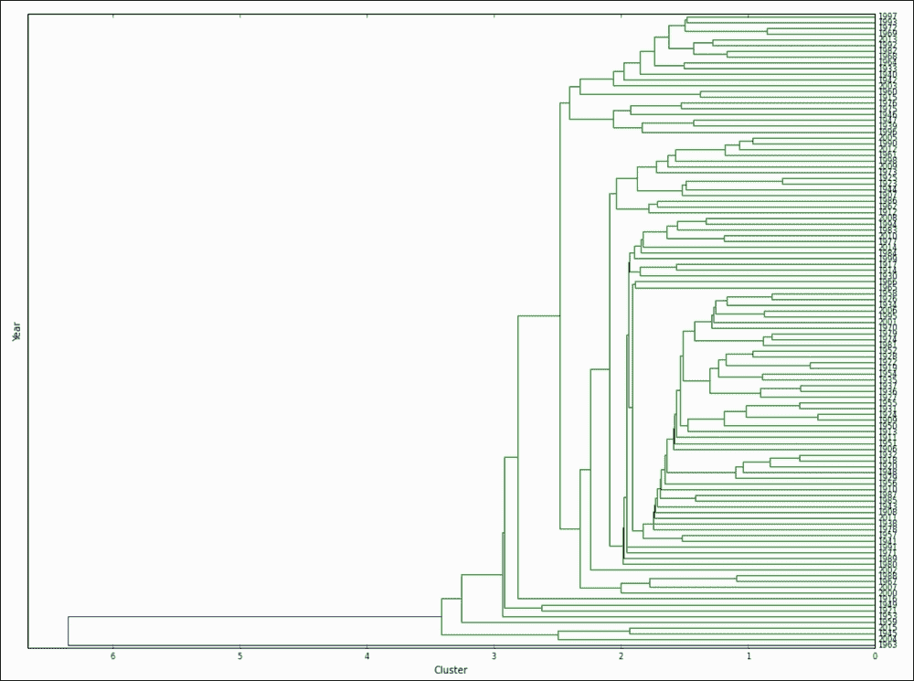

## 另见

*   https://en.wikipedia.org/wiki/Hierarchical_clustering 的等级聚类的维基百科页面(2015 年 11 月检索)
*   位于[的](https://docs.scipy.org/doc/scipy/reference/generated/scipy.spatial.distance.pdist.html) `pdist()`功能文档
*   位于[的](https://docs.scipy.org/doc/scipy/reference/generated/scipy.cluster.hierarchy.linkage.html) `linkage()`功能文档

# 进行一次茶道旅行

antao 是蒙特利尔的一个机器学习小组创建的 Python 库，通常与深度学习相关联，尽管这不一定是它的核心目的。antio 与 NumPy 紧密集成，可以在 CPU 或 GPU 上运行代码。如果您对图形处理器选项感兴趣，请参考*部分列出的文档，另请参见*部分。also 还支持通过符号变量进行符号微分。

根据它的文档，antao 是 NumPy 和 SymPy 的杂交。用 Anano 实现机器学习算法是可能的，但它没有使用 scikit-learn 那么容易和方便。但是，您可能会获得更高的并行性和数值稳定性的潜在优势。

在本食谱中，我们将使用**梯度下降**对温度数据进行线性回归。梯度下降是一种优化算法，我们可以在回归环境中使用它来最小化拟合残差。梯度衡量一个函数有多陡。为了找到一个局部极小值，该算法需要许多与梯度有多陡成正比的步骤。我们正试图走下坡路，但我们不知道在哪个方向可以找到局部最小值。所以，大幅度下跌平均会让我们下跌得更快，但不能保证。在某些情况下，它可能有助于平滑功能(更平滑的山丘)，因此我们不会花很多时间振荡。

## 做好准备

使用以下命令安装天线:

```py
$ pip install --no-deps git+git://github.com/Theano/Theano.git 

```

截至 2015 年 11 月，我用出血边缘版本测试了代码。

## 怎么做...

代码在本书代码包的`theano_tour.ipynb`文件中:

1.  进口情况如下:

    ```py
    import theano
    import numpy as np
    import theano.tensor as T
    import ch9util
    from sklearn.cross_validation import train_test_split
    from sklearn.metrics import r2_score
    import dautil as dl
    from IPython.display import HTML
    ```

2.  加载温度数据并定义无符号变量:

    ```py
    temp = dl.data.Weather.load()['TEMP'].dropna()
    X = temp.values[:-1]
    y = temp.values[1:]
    X_train, X_test, y_train, y_test = train_test_split(X, y, random_state=16)
    w = theano.shared(0., name ='w')
    c = theano.shared(0., name ='c')

    x = T.vector('x')
    y = T.vector('y')
    ```

3.  定义预测和成本(损失)函数以最小化:

    ```py
    prediction = T.dot(x, w) + c
    cost = T.sum(T.pow(prediction - y, 2))/(2 * X_train.shape[0])
    Define gradient functions as follows:
    gw = T.grad(cost, w)
    gc = T.grad(cost, c)

    learning_rate = 0.01
    training_steps = 10000
    ```

4.  将训练函数定义如下:

    ```py
    train = theano.function([x, y], cost, updates =
                            [(w, w - learning_rate * gw),
                             (c, c - learning_rate * gc)])
    predict = theano.function([x], prediction)
    ```

5.  按照以下步骤训练估算器:

    ```py
    for i in range(training_steps):
        train(X_train.astype(np.float), y_train)
    ```

6.  预测和可视化预测如下:

    ```py
    preds = predict(X_test)
    r2 = r2_score(preds, y_test)
    HTML(ch9util.scatter_predictions(preds, y_test, '', r2))
    ```

有关最终结果，请参考以下屏幕截图:

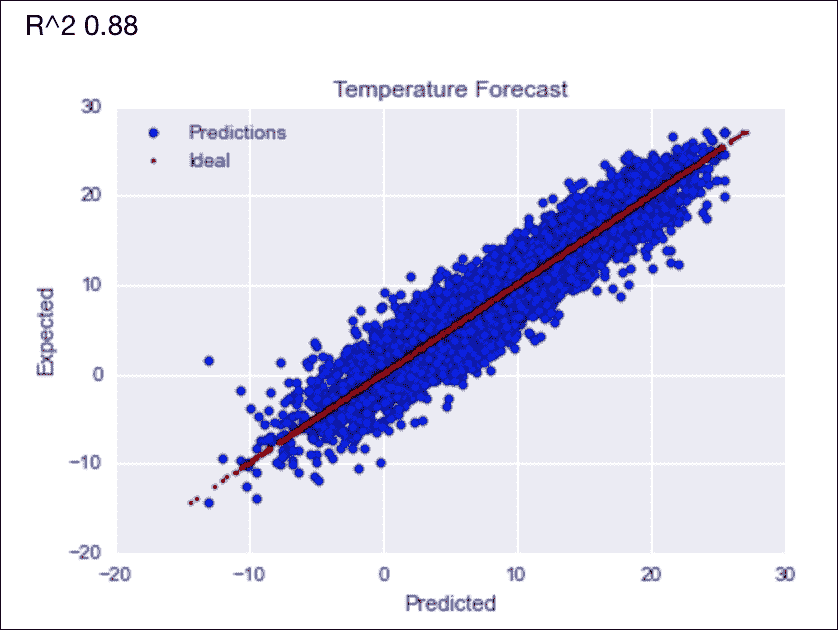

## 另见

*   http://deeplearning.net/software/theano/的安蒂诺文件(2015 年 11 月检索)
*   维基百科关于[https://en.wikipedia.org/wiki/Gradient_descent](https://en.wikipedia.org/wiki/Gradient_descent)梯度下降的页面(2015 年 11 月检索)