# 第十章。评估分类器、回归器和聚类

在本章中，我们将介绍以下食谱:

*   用混淆矩阵直接分类
*   计算精度、召回率和 F1 分数
*   检查接收器工作特性和曲线下的区域
*   想象契合度
*   计算均方误差和中值绝对误差
*   用平均轮廓系数评价聚类
*   将结果与虚拟分类器进行比较
*   确定 MAPE 和多相萃取
*   与虚拟回归器进行比较
*   计算平均绝对误差和残差平方和
*   检查分类的 kappa
*   看看马修斯相关系数

# 简介

评估分类器、回归器和聚类是一个涉及多个方面的关键多维问题。纯粹从工程的角度来看，我们担心速度、内存和正确性。在某些情况下，速度就是一切。如果记忆不足，我们当然要优先考虑。这个世界是一个充满选择的巨大迷宫，你有时被迫选择一个模型而不是其他模型，而不是在一个集合中使用多个模型。当然，我们应该用适当的评估标准来指导我们的理性决策。

有这么多的评估标准，你需要多本书来描述它们。显然，许多指标非常相似。其中一些被接受和流行，在这些度量中，一些在 scikit-learn 中实现。

我们将评估第 9 章、*集成学习和降维*中的分类器和回归器。我们将这些估计应用于天气预报的样本问题。这不一定是人类擅长的问题。实现人的表现是一些问题的目标，例如人脸识别、字符识别、垃圾邮件分类和情感分析。作为击败的底线，我们经常选择某种形式的随机猜测。

# 用混淆矩阵直接分类

准确性是一个衡量模型在给定环境中表现如何的指标。准确性是 scikit-learn 分类器的默认评估指标。不幸的是，准确性是一维的，当类不平衡时，它没有帮助。我们在[第 9 章](09.html "Chapter 9. Ensemble Learning and Dimensionality Reduction")、*集成学习和降维*中检查的降雨数据相当均衡。雨天的数量几乎等于不下雨的天数。在电子邮件垃圾邮件分类的情况下，至少对我来说，平衡转向了垃圾邮件。

A **混淆矩阵**是一个表格，通常用来总结分类的结果。表的两个维度是预测类和目标类。在二元分类的背景下，我们谈论正类和负类。将一个类命名为负数是任意的——这并不一定意味着它在某种程度上是坏的。我们可以将任何多类问题简化为一类，而不是问题的其余部分；所以，当我们评估二元分类时，我们可以将框架扩展到多类分类。一个类可以被正确预测，也可以不被正确预测；我们相应地用“真”和“假”来标记这些实例。

我们有四种真、假、阳性和阴性组合，如下表所述:

<colgroup><col style="text-align: left"> <col style="text-align: left"> <col style="text-align: left"></colgroup> 
|   | 

预测类别

 |
| --- | --- |
| **目标类** | **真阳性**:下雨了，我们预测的没错。 | **误报**:我们错误的预测了会下雨。 |
| **假阴性**:确实下雨了，但是我们预测不会下雨。 | **真否定**:没下雨，我们预测的没错。 |

## 怎么做...

1.  进口情况如下:

    ```py
    import numpy as np
    from sklearn.metrics import confusion_matrix
    import seaborn as sns
    import dautil as dl
    from IPython.display import HTML
    import ch10util
    ```

2.  定义以下函数绘制混淆矩阵:

    ```py
    def plot_cm(preds, y_test, title, cax):
        cm = confusion_matrix(preds.T, y_test)
        normalized_cm = cm/cm.sum().astype(float)
        sns.heatmap(normalized_cm, annot=True, fmt='.2f', vmin=0, vmax=1,
                    xticklabels=['Rain', 'No Rain'],
                    yticklabels=['Rain', 'No Rain'], ax=cax)
        cax.set_xlabel('Predicted class')
        cax.set_ylabel('Expected class')
        cax.set_title('Confusion Matrix for Rain Forecast | ' + title)
    ```

3.  加载目标值并绘制随机森林分类器、打包分类器、投票和堆叠分类器的混淆矩阵:

    ```py
    y_test = np.load('rain_y_test.npy')
    sp = dl.plotting.Subplotter(2, 2, context)

    plot_cm(y_test, np.load('rfc.npy'), 'Random Forest', sp.ax)

    plot_cm(y_test, np.load('bagging.npy'), 'Bagging', sp.next_ax())

    plot_cm(y_test, np.load('votes.npy'),'Votes', sp.next_ax())

    plot_cm(y_test, np.load('stacking.npy'), 'Stacking', sp.next_ax())
    sp.fig.text(0, 1, ch10util.classifiers())
    HTML(sp.exit())
    ```

有关最终结果，请参考以下屏幕截图:

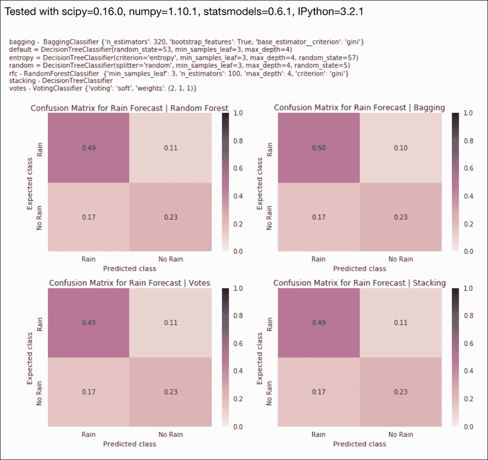

源代码在本书代码包的 `conf_matrix.ipynb`文件中。

## 它是如何工作的

我们为四个分类器显示了四个混淆矩阵，每个矩阵的四个数字似乎在重复。当然，数字并不完全相等；然而，你必须考虑到一些随机变化。

## 另见

*   关于 https://en.wikipedia.org/wiki/Confusion_matrix 混乱矩阵的维基百科页面(2015 年 11 月检索)
*   `confusion_matrix()`功能记录在[http://sci kit-learn . org/stable/modules/generated/sklearn . metrics . muffusion _ matrix . html](http://scikit-learn.org/stable/modules/generated/sklearn.metrics.confusion_matrix.html)(2015 年 11 月检索)

# 计算精度、召回率和 F1 分数

在*用混淆矩阵*配方直接分类中，您了解到我们可以将分类的样本标记为真阳性、假阳性、真阴性和假阴性。通过这些类别的计数，我们可以计算的许多评估指标，我们将在本食谱中涵盖四个，如下式所示:

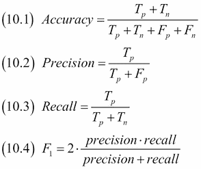

这些指标的范围从零到一，零是最差的理论分数，一是最好的。实际上，最差的分数是我们通过随机猜测得到的。实践中的最佳分数可能低于 1，因为在某些情况下，我们只能希望模仿人类的表现，对于正确的分类应该是什么可能存在歧义，例如，在情感分析的情况下(涵盖在 *Python 数据分析*一书中)。

*   精确度(10.1)是正确预测的比率。
*   **精度** (10.2)将相关性度量为将阴性类别样本分类为阳性的可能性。选择哪个班是积极的多少有些武断，但我们可以说，未雨绸缪是积极的。高精度意味着我们将相对较少的非雨天(负)标记为雨天。对于搜索(网络、数据库或其他)，这意味着相关结果的数量相对较高。
*   **回忆** (10.3)是找到所有阳性样本的可能性。如果再来一次，雨天是我们的正课，雨天分类越正确，召回率越高。对于搜索，我们可以通过返回所有文档来获得完美的召回，因为这将自动返回所有相关文档。人脑有点像数据库，在这种情况下，回忆意味着记住某个 Python 函数如何工作的可能性。
*   **F1 分数** (10.4)是精度和召回率的调和平均值(实际上，F1 分数有多个变化)。G 分数使用几何平均值；但是，据我所知，它不太受欢迎。F1 成绩背后的理念，相关的 F 成绩和 G 成绩，就是把精准性和召回率结合起来。这并不一定是最好的衡量标准。还有其他指标你可能更喜欢，比如**马修斯相关系数**(参考*看一下马修斯相关系数*配方)和**科恩卡帕**(参考*检验卡帕的分类*配方)。当我们开始选择这么多分类指标时，我们显然想要最好的指标。然而，你必须根据你的情况做出选择，因为没有一个标准适合所有人。

## 怎么做...

1.  进口情况如下:

    ```py
    import numpy as np
    from sklearn import metrics
    import ch10util
    import dautil as dl
    from IPython.display import HTML
    ```

2.  加载目标值并计算指标:

    ```py
    y_test = np.load('rain_y_test.npy')
    accuracies = [metrics.accuracy_score(y_test, preds)
                  for preds in ch10util.rain_preds()]
    precisions = [metrics.precision_score(y_test, preds)
                  for preds in ch10util.rain_preds()]
    recalls = [metrics.recall_score(y_test, preds)
               for preds in ch10util.rain_preds()]
    f1s = [metrics.f1_score(y_test, preds)
           for preds in ch10util.rain_preds()]
    ```

3.  绘制降雨预报的指标:

    ```py
    sp = dl.plotting.Subplotter(2, 2, context)
    ch10util.plot_bars(sp.ax, accuracies)
    sp.label()

    ch10util.plot_bars(sp.next_ax(), precisions)
    sp.label()

    ch10util.plot_bars(sp.next_ax(), recalls)
    sp.label()

    ch10util.plot_bars(sp.next_ax(), f1s)
    sp.label()
    sp.fig.text(0, 1, ch10util.classifiers())
    HTML(sp.exit())
    ```

最终结果见截图后的:

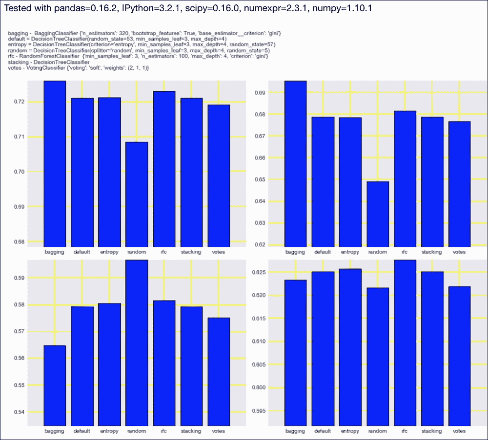

代码在本书代码包的`precision_recall.ipynb`文件中。

## 另见

*   https://en.wikipedia.org/wiki/Precision_and_recall 关于精度和召回的维基百科页面(2015 年 11 月检索
*   `precision_score()`功能记录在[http://sci kit-learn . org/stable/modules/generated/sklearn . metrics . precision _ score . html](http://scikit-learn.org/stable/modules/generated/sklearn.metrics.precision_score.html)(2015 年 11 月检索)
*   `recall_score()`功能记录在[http://sci kit-learn . org/stable/modules/generated/sklearn . metrics . recall _ score . html](http://scikit-learn.org/stable/modules/generated/sklearn.metrics.recall_score.html)(2015 年 11 月检索)
*   `f1_score()`功能记录在[http://sci kit-learn . org/stable/modules/generated/sklearn . metrics . f1 _ score . html](http://scikit-learn.org/stable/modules/generated/sklearn.metrics.f1_score.html)(2015 年 11 月检索)

# 检查接收器操作特性和曲线下的区域

**接收器** **操作特性** ( **ROC** )是二进制分类器的召回率(10.3)和**假阳性率** ( **FPR** )的图。FPR 由下式给出:

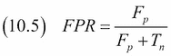

在本食谱中，我们将绘制我们在第 9 章、*集成学习和降维*中使用的各种分类器的 ROC。此外，我们将绘制与随机猜测相关的曲线和理想曲线。显然，我们想要超越基线，尽可能地接近理想曲线。

曲线下的 **区域** ( **AUC** 、 **ROC AUC** 或 **AUROC** )是总结 ROC 的另一个评价指标。AUC 也可以用来比较模型，但它提供的信息比 ROC 少。

## 怎么做...

1.  进口情况如下:

    ```py
    from sklearn import metrics
    import numpy as np
    import ch10util
    import dautil as dl
    from IPython.display import HTML
    ```

2.  加载数据并计算指标:

    ```py
    y_test = np.load('rain_y_test.npy')
    roc_aucs = [metrics.roc_auc_score(y_test, preds)
                for preds in ch10util.rain_preds()]
    ```

3.  绘制雨预报器的 AUROC:

    ```py
    sp = dl.plotting.Subplotter(2, 1, context)
    ch10util.plot_bars(sp.ax, roc_aucs)
    sp.label()
    ```

4.  绘制降雨预报器的 ROC 曲线:

    ```py
    cp = dl.plotting.CyclePlotter(sp.next_ax())

    for preds, label in zip(ch10util.rain_preds(),
                            ch10util.rain_labels()):
        fpr, tpr, _ = metrics.roc_curve(y_test, preds,
                                        pos_label=True)
        cp.plot(fpr, tpr, label=label)

    fpr, tpr, _ = metrics.roc_curve(y_test, y_test)
    sp.ax.plot(fpr, tpr, 'k', lw=4, label='Ideal')
    sp.ax.plot(np.linspace(0, 1), np.linspace(0, 1), 
               '--', label='Baseline')
    sp.label()
    sp.fig.text(0, 1, ch10util.classifiers())
    HTML(sp.exit())
    ```

有关最终结果，请参考以下屏幕截图:

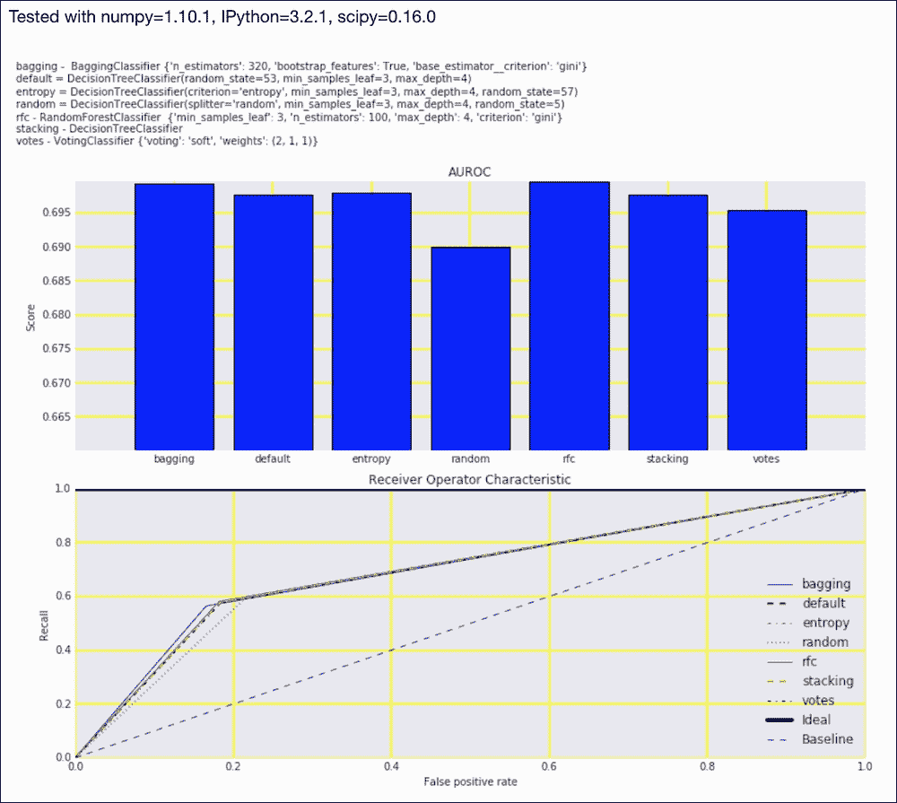

代码在本书代码包的`roc_auc.ipynb`文件中。

## 另见

*   [关于中华民国的维基百科页面https://en . Wikipedia . org/wiki/Receiver _ operating _ feature](https://en.wikipedia.org/wiki/Receiver_operating_characteristic)(2015 年 11 月检索)
*   `roc_auc_score()`功能记录在[http://sci kit-learn . org/stable/modules/generated/sklearn . metrics . roc _ AUC _ score . html](http://scikit-learn.org/stable/modules/generated/sklearn.metrics.roc_auc_score.html)(2015 年 11 月检索)

# 可视化拟合优度

我们期望，或者至少希望，回归的残差只是随机噪声。如果不是这样，那么我们的回归者可能忽略了信息。我们期望残差是独立的并且是正态分布的。用直方图或者 QQ 图比较容易检查。一般来说，我们希望残差的均值尽可能接近零，并且希望残差的方差尽可能小。理想拟合会有零值残差。

## 怎么做...

1.  进口情况如下:

    ```py
    import numpy as np
    import matplotlib.pyplot as plt
    import dautil as dl
    import seaborn as sns
    from scipy.stats import probplot
    from IPython.display import HTML
    ```

2.  加载助推回归器的目标和预测:

    ```py
    y_test = np.load('temp_y_test.npy')
    preds = np.load('boosting.npy')
    ```

3.  将实际值和预测值绘制如下:

    ```py
    sp = dl.plotting.Subplotter(2, 2, context)
    cp = dl.plotting.CyclePlotter(sp.ax)
    cp.plot(y_test)
    cp.plot(preds)
    sp.ax.set_ylabel(dl.data.Weather.get_header('TEMP'))
    sp.label()
    ```

4.  将残差绘制如下:

    ```py
    residuals = preds - y_test
    sp.next_ax().plot(residuals)
    sp.label()
    ```

5.  绘制残差分布图:

    ```py
    sns.distplot(residuals, ax=sp.next_ax())
    sp.label()
    ```

6.  绘制残差的 QQ 图:

    ```py
    probplot(residuals, plot=sp.next_ax())
    HTML(sp.exit())
    ```

有关最终结果，请参考以下屏幕截图:

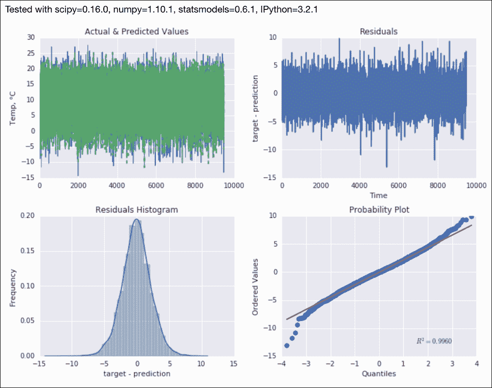

代码在本书代码包的`visualizing_goodness.ipynb`文件中。

## 另见

*   `probplot()`功能记录在[https://docs . scipy . org/doc/scipy-0 . 16 . 0/reference/generated/scipy . stats . prob plot . html](https://docs.scipy.org/doc/scipy-0.16.0/reference/generated/scipy.stats.probplot.html)(2015 年 11 月检索)

# 计算均方误差和中值绝对误差

**均方误差** ( **均方误差**)和**中值** **绝对误差** ( **梅达**)是流行的回归指标。它们由以下等式给出:

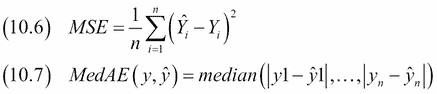

均方误差(10.6)类似于总体方差。因此，均方误差的平方根( **RMSE** )类似于标准偏差。均方误差的单位与被分析的变量相同——在我们的例子中，是温度。理想拟合具有零值残差，因此其均方误差等于零。由于我们处理的是平方误差，均方误差的值大于或理想地等于零。

MedAE 类似于 MSE，但是我们从残差的绝对值开始，我们使用中值而不是平均值作为中心性的度量。MedAE 也类似于方差，理想情况下为零或非常小。取绝对值而不是平方有可能避免数值不稳定和速度问题，并且中值对于异常值比平均值更稳健。此外，取平方倾向于强调较大的误差。

在本食谱中，我们将为来自[第 9 章](09.html "Chapter 9. Ensemble Learning and Dimensionality Reduction")、*集成学习和降维*的回归器绘制 MSE 和 MedAE 的自举种群。

## 怎么做...

1.  进口情况如下:

    ```py
    from sklearn import metrics
    import ch10util
    from IPython.display import HTML
    import dautil as dl
    from IPython.display import HTML
    ```

2.  绘制温度预测指标的分布:

    ```py
    sp = dl.plotting.Subplotter(3, 2, context)
    ch10util.plot_bootstrap('boosting',
                            metrics.mean_squared_error, sp.ax)
    sp.label()

    ch10util.plot_bootstrap('boosting',
                            metrics.median_absolute_error, sp.next_ax())
    sp.label()

    ch10util.plot_bootstrap('etr',
                            metrics.mean_squared_error, sp.next_ax())
    sp.label()

    ch10util.plot_bootstrap('etr',
                            metrics.median_absolute_error, sp.next_ax())
    sp.label()

    ch10util.plot_bootstrap('ransac',
                            metrics.mean_squared_error, sp.next_ax())
    sp.label()

    ch10util.plot_bootstrap('ransac',
                            metrics.median_absolute_error, sp.next_ax())
    sp.label()
    sp.fig.text(0, 1, ch10util.regressors())
    HTML(sp.exit())
    ```

最终结果参见以下截图:

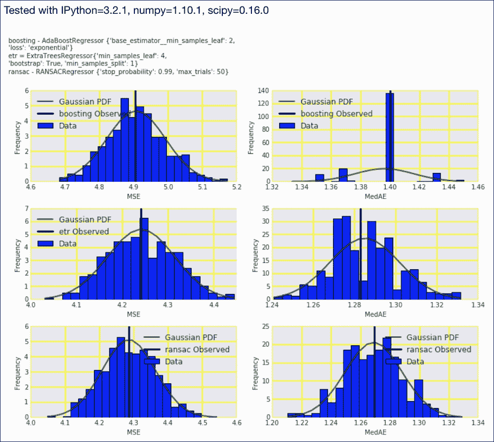

代码在本书代码包的`mse.ipynb`文件中。

## 另见

*   https://en.wikipedia.org/wiki/Mean_squared_error 的 MSE 的维基百科页面(2015 年 11 月检索)
*   `mean_squared_error()`功能记录在[http://sci kit-learn . org/stable/modules/generated/sklearn . metrics . mean _ squared _ error . html](http://scikit-learn.org/stable/modules/generated/sklearn.metrics.mean_squared_error.html)(2015 年 11 月检索)
*   `median_absolute_error()`功能记录在[http://sci kit-learn . org/stable/modules/generated/sklearn . metrics . median _ absolute _ error . html](http://scikit-learn.org/stable/modules/generated/sklearn.metrics.median_absolute_error.html)(2015 年 11 月检索)

# 用平均轮廓系数评价聚类

聚类是一种无监督的机器学习类型的分析。虽然我们一般不知道什么是最好的聚类，但我们仍然可以得到一个聚类结果有多好的概念。一种方法是计算**轮廓系数**，如下式所示:

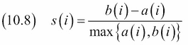

在上式中， *a(i)* 是样本 *i* 相对于同一聚类中其他样本的平均相异度。一个小的 *a(i)* 表示样品属于它的簇。 *b(i)* 是 *i* 与其他聚类的最低平均相异度。它为 *i* 指示下一个最佳集群。如果样本的轮廓系数 *s(i)* 接近 1，则表示样本分配正确。 *s(i)* 的值在-1 到 1 之间变化。所有样本的轮廓系数的平均值衡量聚类的质量。

我们可以使用平均轮廓系数来通知我们对 K-均值聚类算法的聚类数量的决定。在[第 5 章](05.html "Chapter 5. Web Mining, Databases, and Big Data")、*网络挖掘、数据库和大数据*中的*使用 Spark* 配方对流式数据进行聚类中更详细地介绍了 K-means 聚类算法。

## 怎么做...

1.  进口情况如下:

    ```py
    import dautil as dl
    from sklearn.cluster import KMeans
    from sklearn.metrics import silhouette_score
    from sklearn.metrics import silhouette_samples
    from IPython.display import HTML
    ```

2.  定义以下函数绘制轮廓样本:

    ```py
    def plot_samples(ax, years, labels, i, avg):
        silhouette_values = silhouette_samples(X, labels)
        dl.plotting.plot_text(ax, years, silhouette_values,
                              labels, add_scatter=True)
        ax.set_title('KMeans k={0} Silhouette avg={1:.2f}'.format(i, avg))
        ax.set_xlabel('Year')
        ax.set_ylabel('Silhouette score')
    ```

3.  加载数据并重新采样，如下所示:

    ```py
    df = dl.data.Weather.load().resample('A').dropna()
    years = [d.year for d in df.index]
    X = df.values
    ```

4.  绘制不同簇数的簇:

    ```py
    sp = dl.plotting.Subplotter(2, 2, context)
    avgs = []
    rng = range(2, 9)

    for i in rng:
        kmeans = KMeans(n_clusters=i, random_state=37)
        labels = kmeans.fit_predict(X)
        avg = silhouette_score(X, labels)
        avgs.append(avg)

        if i < 5:
            if i > 2:
                sp.next_ax()

            plot_samples(sp.ax, years, labels, i, avg)

    sp.next_ax().plot(rng, avgs)
    sp.label()
    HTML(sp.exit())
    ```

有关最终结果，请参考以下屏幕截图:

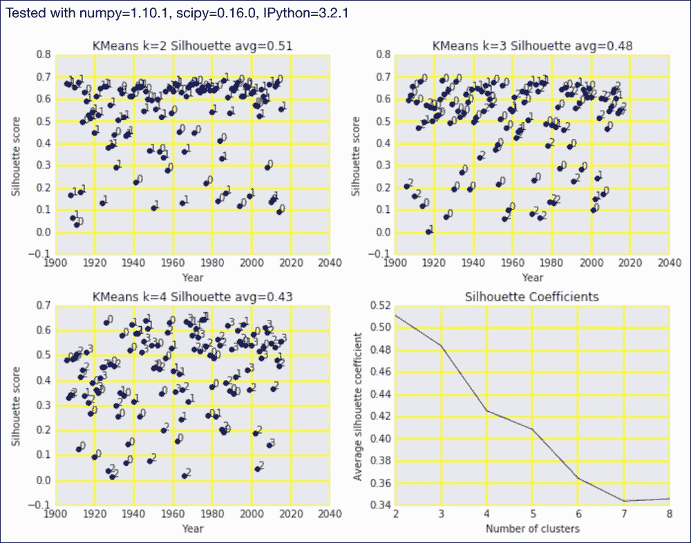

代码在本书代码包的 `evaluating_clusters.ipynb`文件中。

## 另见

*   关于 https://en.wikipedia.org/wiki/Silhouette_%28clustering%29 侧影系数的维基百科页面(2015 年 11 月检索)
*   `silhouette_score()`功能记录在[http://sci kit-learn . org/stable/modules/generated/sklearn . metrics . skill _ score . html](http://scikit-learn.org/stable/modules/generated/sklearn.metrics.silhouette_score.html)(2015 年 11 月检索)

# 用虚拟分类器比较结果

scikit-learn `DummyClassifier`类实现了几种随机猜测的策略，可以作为分类器的基线。策略如下:

*   `stratified`:这使用了训练集类分布
*   `most_frequent`:这预示着最频繁的上课
*   `prior`:这在 scikit-learn 0.17 中提供，通过最大化课程优先级进行预测
*   `uniform`:这使用均匀分布对类进行随机采样
*   `constant`:这预测了用户指定的类

可以看到`DummyClassifier`类的一些策略总是预测同一个类。这可能会导致一些 scikit-learn 度量函数发出警告。我们将执行与在*计算精度、召回率和 F1 评分*配方中相同的分析，但添加了虚拟分类器。

## 怎么做...

1.  进口情况如下:

    ```py
    import numpy as np
    from sklearn import metrics
    import ch10util
    from sklearn.dummy import DummyClassifier
    from IPython.display import HTML
    import dautil as dl
    ```

2.  加载数据如下:

    ```py
    y_test = np.load('rain_y_test.npy')
    X_train = np.load('rain_X_train.npy')
    X_test = np.load('rain_X_test.npy')
    y_train = np.load('rain_y_train.npy')
    ```

3.  创建虚拟分类器并使用它们进行预测:

    ```py
    stratified = DummyClassifier(random_state=28)
    frequent = DummyClassifier(strategy='most_frequent',
                               random_state=28)
    prior = DummyClassifier(strategy='prior', random_state=29)
    uniform = DummyClassifier(strategy='uniform',
                              random_state=29)
    preds = ch10util.rain_preds()

    for clf in [stratified, frequent, prior, uniform]:
        clf.fit(X_train, y_train)
        preds.append(clf.predict(X_test))
    ```

4.  使用预测计算指标，如下所示:

    ```py
    accuracies = [metrics.accuracy_score(y_test, p)
                  for p in preds]
    precisions = [metrics.precision_score(y_test, p)
                  for p in preds]
    recalls = [metrics.recall_score(y_test, p)
               for p in preds]
    f1s = [metrics.f1_score(y_test, p)
           for p in preds]
    ```

5.  绘制虚拟和常规分类器的度量:

    ```py
    labels = ch10util.rain_labels()
    labels.extend(['stratified', 'frequent',
                   'prior', 'uniform'])

    sp = dl.plotting.Subplotter(2, 2, context)
    ch10util.plot_bars(sp.ax, accuracies, labels, rotate=True)
    sp.label()

    ch10util.plot_bars(sp.next_ax(), precisions, labels, rotate=True)
    sp.label()

    ch10util.plot_bars(sp.next_ax(), recalls, labels, rotate=True)
    sp.label()

    ch10util.plot_bars(sp.next_ax(), f1s, labels, rotate=True)
    sp.label()
    sp.fig.text(0, 1, ch10util.classifiers(), fontsize=10)
    HTML(sp.exit())
    ```

有关最终结果，请参考以下屏幕截图:


代码在本书代码包的 `dummy_clf.ipynb`文件中。

## 另见

*   在[http://sci kit-learn . org/stable/modules/generated/sklearn . dummy . dummy classifier . html](http://scikit-learn.org/stable/modules/generated/sklearn.dummy.DummyClassifier.html)记录的`DummyClassifier`类(2015 年 11 月检索)

# 测定 MAPE 和多相萃取

**平均百分比误差** **(MPE** )和**平均绝对百分比误差** ( **MAPE** )将预测误差表示为比率，因此它们是无量纲的，易于解释。从下面的等式中可以看出，MPE 和 MAPE 的缺点是我们有被零除的风险:

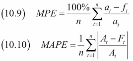

目标变量等于零是完全有效的。对于温度，这恰好是冰点。冬天经常会结冰，所以我们要么忽略那些观测值，要么加入一个足够大的常数，避免被零值除。在下一节中，很明显，简单地忽略观察会导致奇怪的引导分布。

## 怎么做...

1.  进口情况如下:

    ```py
    import ch10util
    import dautil as dl
    from IPython.display import HTML
    ```

2.  将自举指标绘制如下:

    ```py
    sp = dl.plotting.Subplotter(3, 2, context)
    ch10util.plot_bootstrap('boosting',
                            dl.stats.mape, sp.ax)
    sp.label()

    ch10util.plot_bootstrap('boosting',
                            dl.stats.mpe, sp.next_ax())
    sp.label()

    ch10util.plot_bootstrap('etr',
                            dl.stats.mape, sp.next_ax())
    sp.label()

    ch10util.plot_bootstrap('etr',
                            dl.stats.mpe, sp.next_ax())
    sp.label()

    ch10util.plot_bootstrap('ransac',
                            dl.stats.mape, sp.next_ax())
    sp.label()

    ch10util.plot_bootstrap('ransac',
                            dl.stats.mpe, sp.next_ax())
    sp.label()
    sp.fig.text(0, 1, ch10util.regressors())
    HTML(sp.exit())
    ```

最终结果参见下面的截图:

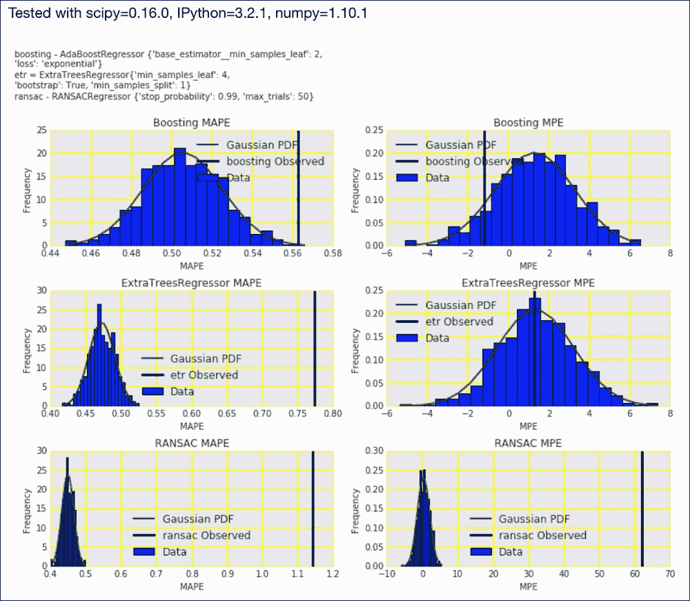

代码在本书代码包的`mape_mpe.ipynb`文件中。

## 另见

*   https://en.wikipedia.org/wiki/Mean_percentage_error 的 MPE 的维基百科页面(2015 年 11 月检索)
*   位于[的关于](https://en.wikipedia.org/wiki/Mean_absolute_percentage_error) MAPE 的维基百科页面

# 与虚拟回归器进行比较

scikit-learn `DummyRegressor`类实现了随机猜测的几种策略，可以作为回归器的基线。这些战略如下:

*   `mean`:这预测了训练集的均值。
*   `median`:这预测了训练集的中位数。
*   `quantile`:当提供`quantile`参数时，这预测训练集的指定分位数。我们将通过指定第一个和第三个四分位数来应用这个策略。
*   `constant`:这预测了由用户提供的恒定值。

我们将使用 R 平方、均方误差、最大似然误差和最大似然误差将虚拟回归器与第 9 章、*集成学习和降维*中的回归器进行比较。

## 怎么做...

1.  进口情况如下:

    ```py
    import numpy as np
    from sklearn.dummy import DummyRegressor
    import ch10util
    from sklearn import metrics
    import dautil as dl
    from IPython.display import HTML
    ```

2.  加载温度数据如下:

    ```py
    y_test = np.load('temp_y_test.npy')
    X_train = np.load('temp_X_train.npy')
    X_test = np.load('temp_X_test.npy')
    y_train = np.load('temp_y_train.npy')
    ```

3.  使用可用的策略创建虚拟回归，并用它们预测温度:

    ```py
    mean = DummyRegressor()
    median = DummyRegressor(strategy='median')
    q1 = DummyRegressor(strategy='quantile', quantile=0.25)
    q3 = DummyRegressor(strategy='quantile', quantile=0.75)

    preds = ch10util.temp_preds()

    for reg in [mean, median, q1, q3]:
        reg.fit(X_train, y_train)
        preds.append(reg.predict(X_test))
    ```

4.  计算常规回归和虚拟回归的 R 平方、均方误差、中值绝对误差和平均百分比误差:

    ```py
    r2s = [metrics.r2_score(p, y_test) for p in preds]
    mses = [metrics.mean_squared_error(p, y_test)
            for p in preds]
    maes = [metrics.median_absolute_error(p, y_test)
            for p in preds]
    mpes = [dl.stats.mpe(y_test, p) for p in preds]

    labels = ch10util.temp_labels()
    labels.extend(['mean', 'median', 'q1', 'q3'])
    ```

5.  将指标绘制如下:

    ```py
    sp = dl.plotting.Subplotter(2, 2, context)
    ch10util.plot_bars(sp.ax, r2s, labels)
    sp.label()

    ch10util.plot_bars(sp.next_ax(), mses, labels)
    sp.label()

    ch10util.plot_bars(sp.next_ax(), maes, labels)
    sp.label()

    ch10util.plot_bars(sp.next_ax(), mpes, labels)
    sp.label()
    sp.fig.text(0, 1, ch10util.regressors())
    HTML(sp.exit())
    ```

有关最终结果，请参考以下屏幕截图:

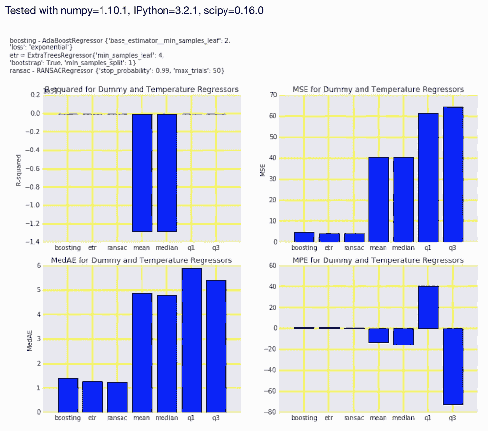

代码在本书代码包的`dummy_reg.ipynb`文件中。

## 另见

*   `DummyRegressor`类记录在[http://sci kit-learn . org/stable/modules/generated/sklearn . dummymergressor . html](http://scikit-learn.org/stable/modules/generated/sklearn.dummy.DummyRegressor.html)(2015 年 11 月检索)
*   本章中的*计算均方误差和中值绝对误差*配方
*   本章中的*确定 MAPE 和 MPE* 配方

# 计算平均绝对误差和残差平方和

**平均绝对误差** ( **平均**)和 **残差平方和** ( **RSS** )是由以下公式给出的回归度量:

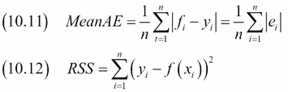

平均绝对误差(10.11)类似于均方误差和最大误差，但在计算的一个步骤中有所不同。这些度量的共同特征是它们忽略了误差的符号，类似于方差。平均值大于或理想地等于零。

RSS (10.12)类似于 MSE，只是我们没有除以残差数。因此，使用 RSS 可以获得更大的值。然而，一个理想的适合给你一个零 RSS。

## 怎么做...

1.  进口情况如下:

    ```py
    import ch10util
    import dautil as dl
    from sklearn import metrics
    from IPython.display import HTML
    ```

2.  将自举指标绘制如下:

    ```py
    sp = dl.plotting.Subplotter(3, 2, context)
    ch10util.plot_bootstrap('boosting',
                            metrics.mean_absolute_error, sp.ax)
    sp.label()

    ch10util.plot_bootstrap('boosting',
                            dl.stats.rss, sp.next_ax())
    sp.label()

    ch10util.plot_bootstrap('etr',
                            metrics.mean_absolute_error, sp.next_ax())
    sp.label()

    ch10util.plot_bootstrap('etr',
                            dl.stats.rss, sp.next_ax())
    sp.label()

    ch10util.plot_bootstrap('ransac',
                            metrics.mean_absolute_error, sp.next_ax())
    sp.label()

    ch10util.plot_bootstrap('ransac',
                            dl.stats.rss, sp.next_ax())
    sp.label()
    sp.fig.text(0, 1, ch10util.regressors())
    HTML(sp.exit())
    ```

最终结果参见以下截图:

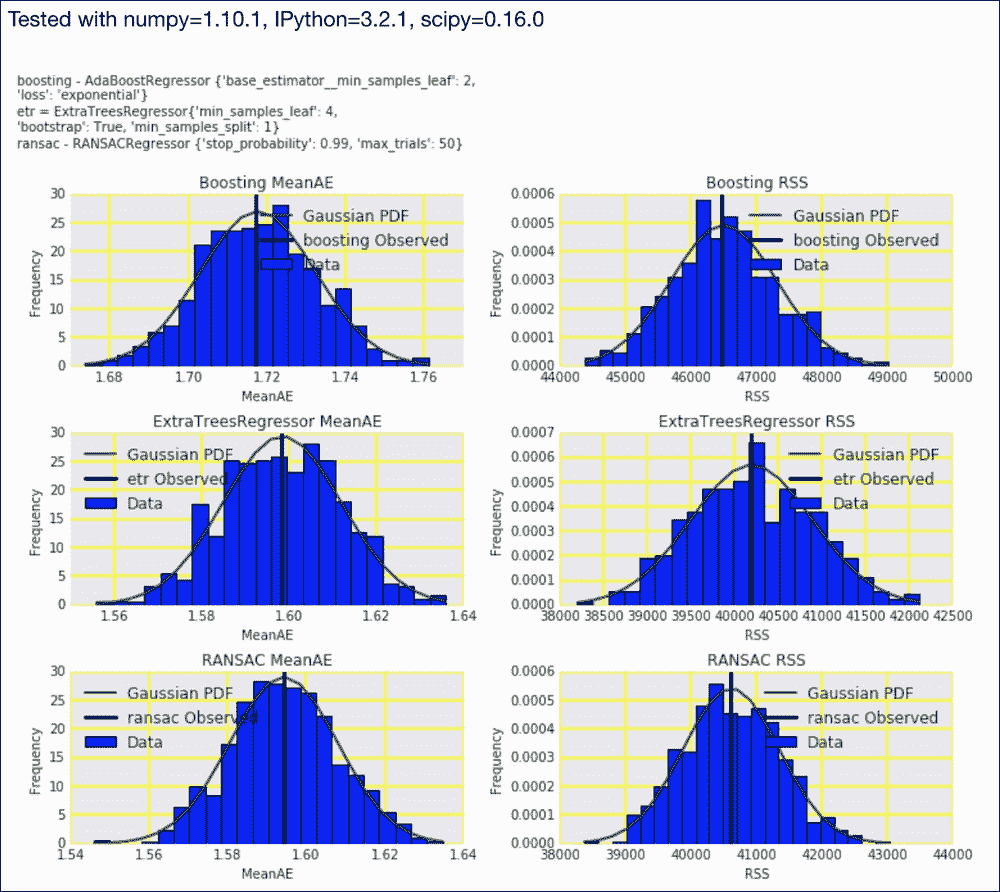

代码在本书代码包的`mae_rss.ipynb`文件中。

## 另见

*   维基百科中关于的页面指的是[https://en.wikipedia.org/wiki/Mean_absolute_error](https://en.wikipedia.org/wiki/Mean_absolute_error)(检索于 2015 年 11 月)
*   [http://sci kit-learn . org/stable/modules/generated/sklearn . metrics . mean _ absolute _ error . html](http://scikit-learn.org/stable/modules/generated/sklearn.metrics.mean_absolute_error.html)记录的功能(2015 年 11 月检索)
*   https://en.wikipedia.org/wiki/Residual_sum_of_squares 的 RSS 的维基百科页面(2015 年 11 月检索)

# 检验分类的 kappa

**Cohen 的 kappa** 测量目标和预测类别之间的一致性，类似于精确度，但是它也考虑了获得预测的随机机会。科恩的 kappa 由下式给出:

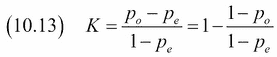

在这个方程中， *p <sub>0</sub>* 是相对观测一致性， *p <sub>e</sub>* 是由数据推导出的随机一致性概率。Kappa 在负值和以下兰迪斯和科赫的粗略分类之间变化:

*   不一致:kappa < 0
*   略微一致:kappa = 0 至 0.2
*   公平协议:kappa = 0.21 至 0.4
*   中度一致:kappa = 0.41 至 0.6
*   良好一致性:kappa = 0.61 至 0.8
*   非常好的一致性:kappa = 0.81 到 1.0

我知道另外两个评定卡帕等级的方案，所以这些数字不是一成不变的。我想我们可以同意不接受低于 0.2 的 kappa。最合适的用例当然是对模型进行排名。科恩的 kappa 还有其他变体，但截至 2015 年 11 月，它们还没有在 scikit-learn 中实现。scikit-learn 0.17 通过`cohen_kappa_score()`功能增加了对 Cohen 的 kappa 的支持。

## 怎么做...

1.  进口情况如下:

    ```py
    import dautil as dl
    from sklearn import metrics
    import numpy as np
    import ch10util
    from IPython.display import HTML
    ```

2.  计算雨预报器的准确度、精确度、召回率、F1 评分和 kappa:

    ```py
    y_test = np.load('rain_y_test.npy')
    accuracies = [metrics.accuracy_score(y_test, preds)
                  for preds in ch10util.rain_preds()]
    precisions = [metrics.precision_score(y_test, preds)
                  for preds in ch10util.rain_preds()]
    recalls = [metrics.recall_score(y_test, preds)
               for preds in ch10util.rain_preds()]
    f1s = [metrics.f1_score(y_test, preds)
           for preds in ch10util.rain_preds()]
    kappas = [metrics.cohen_kappa_score(y_test, preds)
              for preds in ch10util.rain_preds()]
    ```

3.  散点图针对 kappa 的指标如下:

    ```py
    sp = dl.plotting.Subplotter(2, 2, context)
    dl.plotting.plot_text(sp.ax, accuracies, kappas,
                          ch10util.rain_labels(), add_scatter=True)
    sp.label()

    dl.plotting.plot_text(sp.next_ax(), precisions, kappas,
                          ch10util.rain_labels(), add_scatter=True)
    sp.label()

    dl.plotting.plot_text(sp.next_ax(), recalls, kappas,
                          ch10util.rain_labels(), add_scatter=True)
    sp.label()

    dl.plotting.plot_text(sp.next_ax(), f1s, kappas,
                          ch10util.rain_labels(), add_scatter=True)
    sp.label()
    sp.fig.text(0, 1, ch10util.classifiers())                     
    HTML(sp.exit())
    ```

有关最终结果，请参考以下屏幕截图:

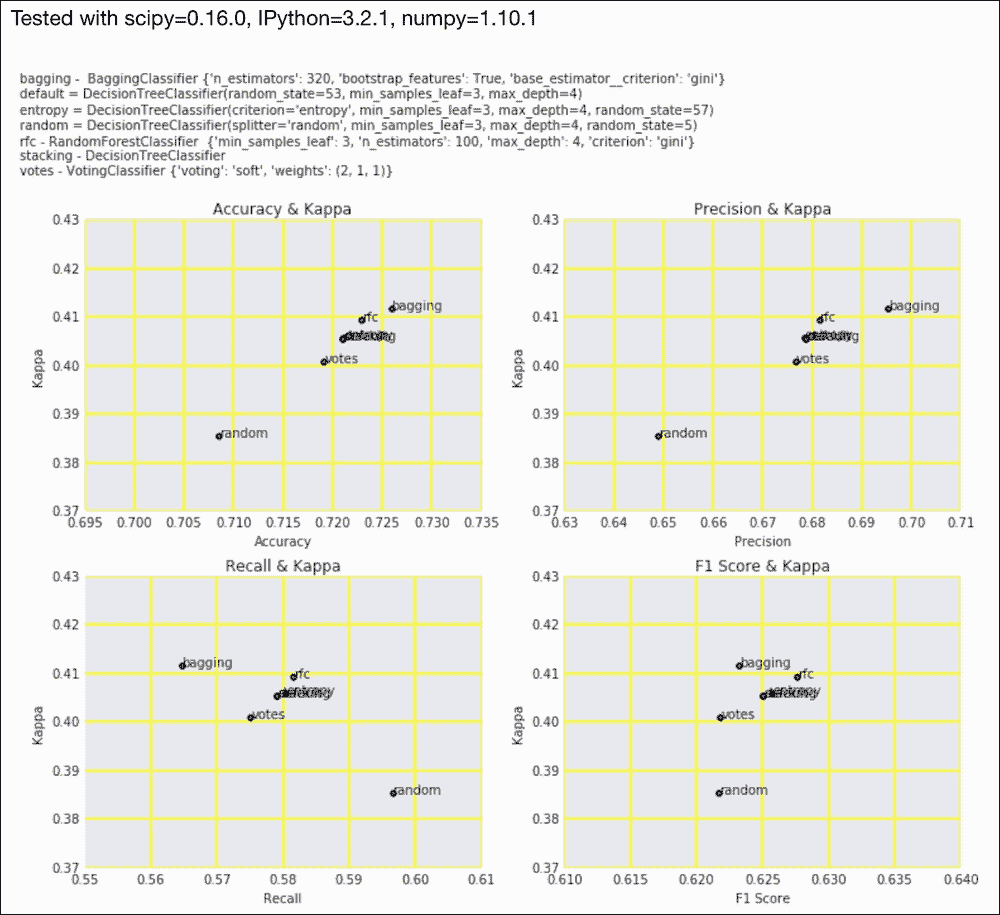

代码在本书代码包的`kappa.ipynb`文件中。

## 它是如何工作的

从前两个图中，我们可以得出结论，bagging 分类器具有最高的准确度、精确度和 kappa。所有分类器的 kappa 都在 0.2 以上，所以它们至少在一定程度上是可以接受的。

## 另见

*   关于科恩在 https://en.wikipedia.org/wiki/Cohen's_kappa T2 的卡帕的维基百科页面(2015 年 11 月检索)

# 看一下马修斯相关系数

**马修斯相关系数** ( **MCC** )或**φ系数**是 Brian Matthews 在 1975 年发明的二进制分类的评价指标。监控中心是目标和预测的相关系数，在-1 和 1 之间变化(最佳一致性)。MCC 是总结混淆矩阵的一个非常好的方法(参考*用混淆矩阵*配方直接得到分类)，因为它使用了其中的所有四个数字。监控中心由以下等式给出:

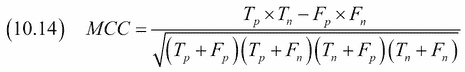

## 怎么做...

1.  进口情况如下:

    ```py
    import dautil as dl
    from sklearn import metrics
    import numpy as np
    import ch10util
    from IPython.display import HTML
    ```

2.  计算降雨预报器的准确度、精确度、召回率、F1 分数和马修斯相关系数:

    ```py
    y_test = np.load('rain_y_test.npy')
    accuracies = [metrics.accuracy_score(y_test, preds)
                  for preds in ch10util.rain_preds()]
    precisions = [metrics.precision_score(y_test, preds)
                  for preds in ch10util.rain_preds()]
    recalls = [metrics.recall_score(y_test, preds)
               for preds in ch10util.rain_preds()]
    f1s = [metrics.f1_score(y_test, preds)
           for preds in ch10util.rain_preds()]
    mc = [metrics.matthews_corrcoef(y_test, preds)
          for preds in ch10util.rain_preds()]
    ```

3.  将指标绘制如下:

    ```py
    sp = dl.plotting.Subplotter(2, 2, context)
    dl.plotting.plot_text(sp.ax, accuracies, mc,
                          ch10util.rain_labels(), add_scatter=True)
    sp.label()

    dl.plotting.plot_text(sp.next_ax(), precisions, mc,
                          ch10util.rain_labels(), add_scatter=True)
    sp.label()

    dl.plotting.plot_text(sp.next_ax(), recalls, mc,
                          ch10util.rain_labels(), add_scatter=True)
    sp.label()

    dl.plotting.plot_text(sp.next_ax(), f1s, mc,
                          ch10util.rain_labels(), add_scatter=True)
    sp.label()
    sp.fig.text(0, 1, ch10util.classifiers())
    HTML(sp.exit())
    ```

最终结果参见下面的截图:

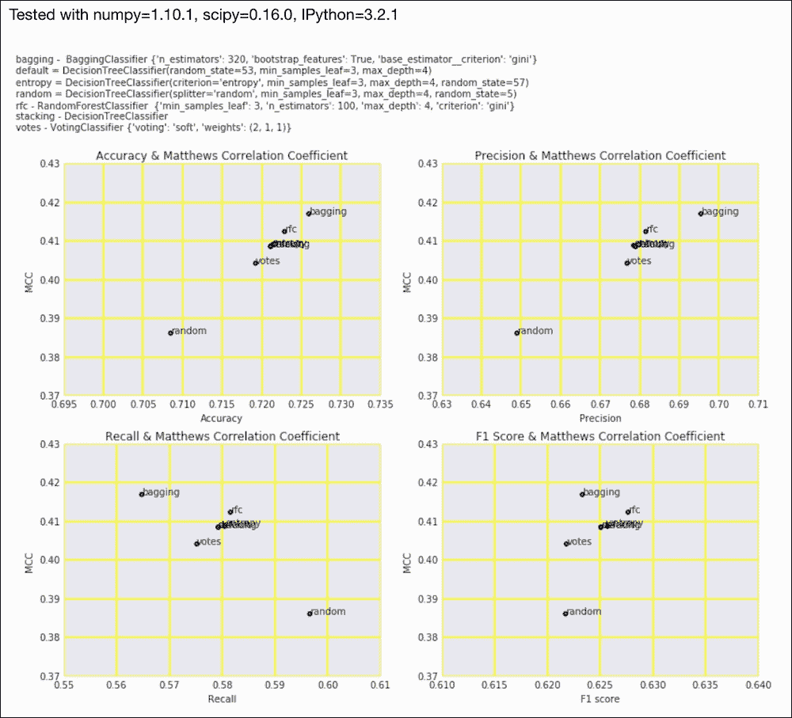

代码在本书的代码包`matthews_correlation.ipynb`文件中。

## 另见

*   位于[的](https://en.wikipedia.org/wiki/Matthews_correlation_coefficient) MCC 的维基百科页面
*   `matthews_corrcoef()`功能记录在[http://sci kit-learn . org/stable/modules/generated/sklearn . metrics . Matthews _ corrcoef . html](http://scikit-learn.org/stable/modules/generated/sklearn.metrics.matthews_corrcoef.html)(2015 年 11 月检索)