# 第十一章。分析图像

在本章中，我们将介绍以下食谱:

*   设置 OpenCV
*   应用尺度不变特征变换
*   使用 SURF 检测要素
*   量化颜色
*   图像去噪
*   从图像中提取面片
*   用哈尔级联检测人脸
*   寻找明亮的星星
*   从图像中提取元数据
*   从图像中提取纹理特征
*   在图像上应用分层聚类
*   用谱聚类分割图像

# 简介

图像处理是一个非常大的研究领域。用于图像处理的技术通常也可以应用于视频分析。我们可以将图像处理视为一种特殊类型的信号处理。信号处理包含在[第 6 章](06.html "Chapter 6. Signal Processing and Timeseries")、*信号处理和时间序列*中。然而，图像带来了特殊的挑战，例如高维数(我们可以将每个图像像素定义为一个特征)和空间依赖性(像素位置很重要)。

与计算机相比，人类的视觉系统非常先进。我们能够识别物体、面部表情和物体运动。显然，这与食肉动物和它们食用人肉的倾向有关。在本章中，我们将集中精力寻找图像中的特征并对图像像素进行聚类(分割)，而不是试图理解人类视觉是如何工作的。

在这一章中，我们经常使用 OpenCV 库，由于它是一个相当大的库，我决定只为这一章创建一个特殊的 Docker 容器。你可能已经知道了，我制作了一个名为`pydacbk`的 Docker 图像。嗯，本章的 Docker 容器名为`pydacbk11`。

# 设置开放式课程

**OpenCV** ( **开源计算机视觉**)是 2000 年创建的计算机视觉库，目前由 Itseez 维护。OpenCV 是用 C++编写的，但它也有针对 Python 和其他编程语言的绑定。支持多种操作系统和图形处理器。本章没有足够的篇幅来涵盖 OpenCV 的所有功能。即使是一本书可能也是不够的——对于皮德尼塔斯，我推荐约瑟夫·豪斯的《用 Python 打开计算机视觉》。

OpenCV 2.x.x 包中的一些第三方专利算法，如 SIFT 和 SURF(参考本章中的相关食谱)，已经被转移到一个特殊的 GitHub 存储库中。您仍然可以使用它们，但是您需要在安装过程中明确包含它们。

OpenCV 构建过程有许多选项。如果您不确定哪些选项最适合您，请阅读 OpenCV 文档或使用适合您的操作系统的软件包管理器。一般来说，你不应该使用太多的选项。尽管您可以灵活地关闭某些模块，但其他模块可能会依赖于它们，这可能会导致一连串的错误。

## 做好准备

如果你在 Windows 或者 Fedora 上，可以在[http://docs . opencv . org/3 . 0 . 0/da/df6/tutorial _ py _ table _ contents _ setup . html](http://docs.opencv.org/3.0.0/da/df6/tutorial_py_table_of_contents_setup.html)阅读相应教程(2015 年 12 月检索)。对于基于 Ubuntu 的 Docker 容器，我需要用以下命令安装一些先决条件:

```py
$ apt-get update
$ apt-get install -y cmake make git g++

```

## 怎么做...

以下说明作为示例，并对您的设置做了一些假设。例如，它假设您正在 Python 3 中使用 Anaconda。为了方便起见，我将基于 Ubuntu 的 Docker 容器的所有指令组织在一个 shell 脚本中；但是，如果您愿意，也可以在终端中分别键入每一行。

1.  下载核心 OpenCV 项目的代码(如果没有 Git，也可以从 GitHub 网站下载代码):

    ```py
    $ cd /opt
    $ git clone https://github.com/Itseez/opencv.git
    $ cd opencv
    $ git checkout tags/3.0.0

    ```

2.  下载 OpenCV(第三方)投稿的代码(如果没有 Git，也可以从 GitHub 网站下载代码):

    ```py
    $ cd /opt
    $ git clone https://github.com/Itseez/opencv_contrib
    $ cd opencv_contrib
    $ git checkout tags/3.0.0
    $ cd /opt/opencv

    ```

3.  创建一个构建目录并导航到它:

    ```py
    $ mkdir build
    $ cd build

    ```

4.  此步骤显示了您可以使用的一些构建选项(您不必使用所有这些选项):

    ```py
    $ ANACONDA=~/anaconda
    $ cmake -D CMAKE_BUILD_TYPE=RELEASE \
     -D BUILD_PERF_TESTS=OFF \
     -D BUILD_opencv_core=ON \
     -D BUILD_opencv_python2=OFF \
     -D BUILD_opencv_python3=ON \
     -D BUILD_opencv_cuda=OFF \
     -D BUILD_opencv_java=OFF \
     -D BUILD_opencv_video=ON \
     -D BUILD_opencv_videoio=ON \
     -D BUILD_opencv_world=OFF \
     -D BUILD_opencv_viz=ON \
     -D WITH_CUBLAS=OFF \
     -D WITH_CUDA=OFF \
     -D WITH_CUFFT=OFF \
     -D WITH_FFMPEG=OFF \
     -D PYTHON3_EXECUTABLE=${ANACONDA}/bin/python3 \
     -D PYTHON3_LIBRARY=${ANACONDA}/lib/libpython3.4m.so \
     -D PYTHON3_INCLUDE_DIR=${ANACONDA}/include/python3.4m \
     -D PYTHON3_NUMPY_INCLUDE_DIRS=${ANACONDA}/lib/python3.4/site-packages/numpy/core/include \
     -D PYTHON3_PACKAGES_PATH=${ANACONDA}/lib/python3.4/site-packages \
     -D BUILD_opencv_latentsvm=OFF \
     -D BUILD_opencv_xphoto=OFF \
     -D BUILD_opencv_xfeatures2d=ON \
     -D OPENCV_EXTRA_MODULES_PATH=/opt/opencv_contrib/modules \
     /opt/opencv

    ```

5.  运行`make`命令(8 芯)安装如下:

    ```py
    $ make -j8
    $ sudo make install

    ```

## 它是如何工作的

前面的说明假设您是第一次安装 OpenCV。如果您是从 OpenCV 2.x.x 升级，您将不得不采取额外的预防措施。另外，我假设您不想要某些选项，并且正在 Python 3 中使用 Anaconda。下表解释了我们使用的一些构建选项:

<colgroup><col style="text-align: left"> <col style="text-align: left"></colgroup> 
| 

[计]选项

 | 

描述

 |
| --- | --- |
| `BUILD_opencv_python2` | 支持 Python 2 |
| `BUILD_opencv_python3` | 支持 Python 3 |
| `BUILD_opencv_java` | 支持 OpenCV Java 绑定 |
| `PYTHON3_EXECUTABLE` | Python 3 可执行文件的位置 |
| `PYTHON3_LIBRARY` | Python 3 库的位置 |
| `PYTHON3_INCLUDE_DIR` | Python 3 `include`目录的位置 |
| `PYTHON3_NUMPY_INCLUDE_DIRS` | NumPy `include`目录的位置 |
| `PYTHON3_PACKAGES_PATH` | Python 3 包的位置 |
| `BUILD_opencv_xfeatures2d` | 支持某些第三方算法，如 SIFT 和 SURF |
| `OPENCV_EXTRA_MODULES_PATH` | OpenCV 第三方贡献代码的位置 |

## 还有更多

如果您没有足够的空间，例如在 Docker 容器中，那么您可以使用以下命令进行清理:

```py
$ rm -rf /opt/opencv
$ rm -rf /opt/opencv_contrib

```

# 应用尺度不变特征变换

SIFT 算法(1999)在图像或视频中发现特征，并获得了不列颠哥伦比亚大学的专利。通常，我们可以使用特征进行分类或聚类。SIFT 在平移、缩放和旋转方面是不变的。

算法步骤如下:

1.  使用高斯模糊滤镜以不同的比例模糊图像。
2.  一个**八度** 对应的是两倍的滤镜标准差。将模糊的图像按八度音分组，并加以区别。
3.  为差分图像找到跨尺度的局部极值。
4.  将与局部极值相关的每个像素与同一尺度和相邻尺度中的相邻像素进行比较。
5.  从比较中选择最大值或最小值。
6.  拒绝对比度低的点。
7.  插值候选关键点(图像特征)以获得原始图像上的位置。

## 做好准备

按照*中的说明设置 OpenCV* 配方。

## 怎么做...

1.  进口情况如下:

    ```py
    import cv2
    import matplotlib.pyplot as plt
    import dautil as dl
    from scipy.misc import face
    ```

2.  将原始图像绘制如下:

    ```py
    img = face()
    plt.title('Original')
    dl.plotting.img_show(plt.gca(), img)
    gray = cv2.cvtColor(img, cv2.COLOR_BGR2GRAY)
    ```

3.  将灰度图像绘制如下:

    ```py
    plt.figure()
    plt.title('Gray')
    dl.plotting.img_show(plt.gca(), gray, cmap=plt.cm.gray)
    ```

4.  用关键点(蓝色)绘制图像，如下所示:

    ```py
    sift = cv2.xfeatures2d.SIFT_create()
    (kps, descs) = sift.detectAndCompute(gray, None)
    img2 = cv2.drawKeypoints(gray, kps, None, (0, 0, 255))

    plt.figure()
    plt.title('With Keypoints')
    dl.plotting.img_show(plt.gca(), img2)
    ```

有关最终结果，请参考以下屏幕截图:


程序在本书代码包的`applying_sift.ipynb`文件中。

## 另见

*   维基百科关于 SIFT 的页面，位于(2015 年 12 月检索)
*   SIFT 算法记录在[http://docs . opencv . org/3 . 0 . 0/da/df5/tutorial _ py _ SIFT _ intro . html](http://docs.opencv.org/3.0.0/da/df5/tutorial_py_sift_intro.html)(2015 年 12 月检索)

# 利用 SURF 检测特征

**加速鲁棒特征** ( **SURF** )是一种类似于 SIFT 并受其启发的专利算法(参考*应用比例不变特征变换*配方)。SURF 于 2006 年推出，使用哈尔小波(参考*应用离散小波变换*配方)。SURF 最大的优点就是比 SIFT 快。

看看下面的等式:

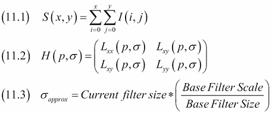

算法步骤如下:

1.  如有必要，变换图像以获得等效灰度。
2.  计算不同尺度下的 **积分图像**，它是一个像素上面和左边的像素之和，如公式(11.1)所示。积分图像代替了 SIFT 中的高斯滤波器。
3.  将包含灰度图像二阶导数的 **黑森矩阵** (11.2)定义为像素位置 *p* 和比例 *σ* (11.3)的函数。
4.  **行列式**是与方阵相关的值。黑森矩阵的行列式对应于一个点的局部变化。选择行列式最大的点。
5.  音阶σ由 11.3 定义，就像 SIFT 一样，我们可以定义音阶八度。SURF 通过改变过滤器内核的大小来工作，而 SIFT 改变图像大小。在比例和图像空间中插入上一步的最大值。
6.  将哈尔小波变换应用于关键点周围的圆。
7.  使用滑动窗口对响应求和。
8.  根据响应总和确定方向。

## 做好准备

按照*中的说明设置 OpenCV* 配方。

## 怎么做...

1.  进口如下:

    ```py
    import cv2
    import matplotlib.pyplot as plt
    import dautil as dl
    ```

2.  将原始图像绘制如下:

    ```py
    img = cv2.imread('covers.jpg')
    plt.title('Original')
    dl.plotting.img_show(plt.gca(), img)
    ```

3.  将灰度图像绘制如下:

    ```py
    gray = cv2.cvtColor(img, cv2.COLOR_BGR2GRAY)

    plt.figure()
    plt.title('Gray')
    dl.plotting.img_show(plt.gca(), gray, cmap=plt.cm.gray)
    surf = cv2.xfeatures2d.SURF_create()
    (kps, descs) = surf.detectAndCompute(gray, None)
    img2 = cv2.drawKeypoints(gray, kps, None, (0, 0, 255))
    ```

4.  用关键点(蓝色)绘制图像，如下所示:

    ```py
    plt.figure()
    plt.title('With Keypoints')
    dl.plotting.img_show(plt.gca(), img2)
    ```

有关最终结果，请参考以下屏幕截图:

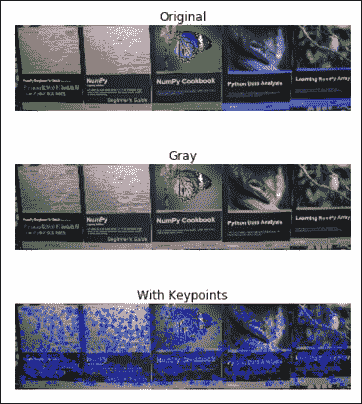

代码在本书代码包的 `applying_surf.ipynb`文件中。

## 另见

*   https://en.wikipedia.org/wiki/Speeded_up_robust_features 冲浪的维基百科页面(2015 年 12 月检索)
*   关于 https://en.wikipedia.org/wiki/Summed_area_table 积分图的维基百科页面(2015 年 12 月检索)
*   维基百科关于 https://en.wikipedia.org/wiki/Hessian_matrix 黑森矩阵的页面(2015 年 12 月检索)
*   维基百科关于 https://en.wikipedia.org/wiki/Determinant 的行列式的页面(2015 年 12 月检索)
*   在[http://docs . opencv . org/3 . 0 . 0/df/dd2/tutorial _ py _ SURF _ intro . html](http://docs.opencv.org/3.0.0/df/dd2/tutorial_py_surf_intro.html)记录的 SURF 算法(2015 年 12 月检索)

# 量化颜色

在古代，电脑游戏几乎是单色的。许多年后，互联网允许我们下载图像，但网络速度很慢，所以首选颜色很少的紧凑图像。我们可以得出结论，限制颜色的数量是传统的。颜色是图像的一个维度，所以如果我们从图像中去除颜色，我们就可以说是降维。实际过程叫做 **颜色量化**。

通常，我们在三维空间中为每个像素表示 **RGB** ( **红色**、**绿色**、**蓝色**)值，然后对这些点进行聚类。对于每个集群，我们都有相应的平均颜色。在这个配方中，我们将使用 k-means 聚类(参考*用 Spark* 配方对流式数据进行聚类)，尽管这不一定是最好的算法。

## 做好准备

按照*中的说明设置 OpenCV* 配方。

## 怎么做...

代码在本书代码包的`quantizing_colors.ipynb`文件中:

1.  进口情况如下:

    ```py
    import numpy as np
    import cv2
    import matplotlib.pyplot as plt
    import dautil as dl
    from scipy.misc import face
    ```

2.  将原始图像绘制如下:

    ```py
    sp = dl.plotting.Subplotter(2, 2, context)
    img = face()
    dl.plotting.img_show(sp.ax, img)
    sp.label()
    Z = img.reshape((-1, 3))

    Z = np.float32(Z)
    ```

3.  应用 k-均值聚类并绘制结果:

    ```py
    criteria = (cv2.TERM_CRITERIA_MAX_ITER, 7, 1.0)

    for k in [2, 4, 8]:
        _, label, center = cv2.kmeans(Z, k, None, criteria, 7,
                                      cv2.KMEANS_RANDOM_CENTERS)

        center = np.uint8(center)
        res = center[label.flatten()]
        res2 = res.reshape((img.shape))

        dl.plotting.img_show(sp.next_ax(), res2)
        sp.label()
    ```

最终结果参见以下截图:

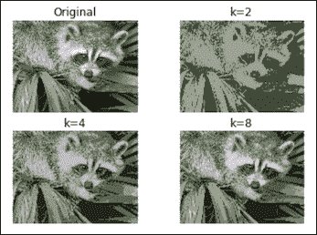

## 另见

*   https://en.wikipedia.org/wiki/Color_quantization 的颜色量化的维基百科页面(2015 年 12 月检索)
*   `kmeans()`功能记录在[http://docs . opencv . org/3 . 0 . 0/D5/d38/group _ _ core _ _ cluster . html # ga9a 34 DC 06 c6ec 9460 e 90860 f 15 bcd2f 88](http://docs.opencv.org/3.0.0/d5/d38/group__core__cluster.html#ga9a34dc06c6ec9460e90860f15bcd2f88)(2015 年 12 月检索)

# 图像去噪

噪声是数据和图像中的常见现象。当然，噪音是不可取的，因为它不会给我们的分析增加任何价值。我们通常假设噪声通常分布在零附近。我们认为像素值是真实值和噪声(如果有的话)的总和。我们还假设噪声值是独立的，即一个像素的噪声值独立于另一个像素。

一个简单的想法是在一个小窗口中平均像素，因为我们假设噪声的期望值为零。这是模糊背后的一般想法。我们可以将这个想法更进一步，在一个像素周围定义多个窗口，然后我们可以对相似的面片进行平均。

OpenCV 有几个去噪功能，通常我们需要指定过滤器的强度、搜索窗口的大小以及模板窗口的大小来进行相似性检查。您应该注意不要将滤镜强度设置得太高，因为这可能会使图像不仅更干净，而且有点模糊。

## 做好准备

按照*中的说明设置 OpenCV* 配方。

## 怎么做...

1.  进口情况如下:

    ```py
    import cv2
    import matplotlib.pyplot as plt
    from sklearn.datasets import load_sample_image
    import numpy as np
    import dautil as dl
    ```

2.  将原始图像绘制如下:

    ```py
    img = load_sample_image('china.jpg')
    dl.plotting.img_show(plt.gca(), img) 
    plt.title('Original')
    Z = img.reshape((-1, 3))
    ```

3.  向图像添加噪点并绘制噪点图像:

    ```py
    np.random.seed(59)
    noise = np.random.random(Z.shape) < 0.99

    noisy = (Z * noise).reshape((img.shape))

    plt.figure()
    plt.title('Noisy')
    dl.plotting.img_show(plt.gca(), noisy)
    ```

4.  清洁图像并显示:

    ```py
    cleaned = cv2.fastNlMeansDenoisingColored(noisy, None, 10, 10, 7, 21)
    plt.figure()
    plt.title('Cleaned')
    dl.plotting.img_show(plt.gca(), cleaned)
    ```

有关最终结果，请参考以下屏幕截图:

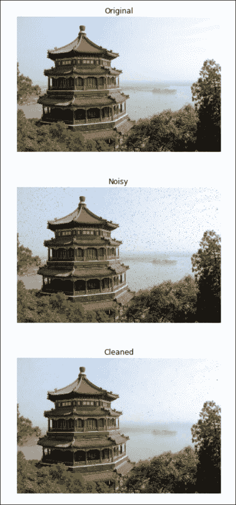

代码在本书代码包的`denoising_images.ipynb`文件中。

## 另见

*   [http://docs . opencv . org/3 . 0 . 0/D1/d79/group _ _ photo _ _ deadline . html # ga21 bc1c 8 b 0 e 15 f 78 cd3eff 672 CB 6 c 476](http://docs.opencv.org/3.0.0/d1/d79/group__photo__denoise.html#ga21abc1c8b0e15f78cd3eff672cb6c476)中记录的 `fastNlMeansDenoisingColored()`功能(2015 年 12 月检索)

# 从图像中提取斑块

**图像分割**是将图像分割成多个片段的过程。这些片段具有相似的颜色或强度。这些片段在医学、交通、天文学或其他方面通常也有的含义。

分割图像最简单的方法是使用阈值，这将产生两个片段(如果值等于阈值，我们将它们放在两个片段之一中)。**大津阈值**方法最小化两个片段的加权方差(参考以下等式):

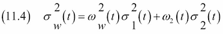

如果我们分割图像，去除噪声或外来伪像是个好主意。借助**膨胀**(参见*也参见*部分)，我们可以找到图像中属于背景和前景的部分。然而，膨胀给我们留下了未识别的像素。

## 做好准备

按照*中的说明设置 OpenCV* 。

## 怎么做...

1.  进口情况如下:

    ```py
    import numpy as np
    import cv2
    from matplotlib import pyplot as plt
    from sklearn.datasets import load_sample_image
    import dautil as dl
    from IPython.display import HTML
    ```

2.  将原始图像绘制如下:

    ```py
    sp = dl.plotting.Subplotter(2, 2, context)
    img = load_sample_image('flower.jpg')
    dl.plotting.img_show(sp.ax, img)
    sp.label()
    ```

3.  如下绘制大津阈值图像:

    ```py
    gray = cv2.cvtColor(img, cv2.COLOR_BGR2GRAY)
    _, thresh = cv2.threshold(gray, 0, 255,
                              cv2.THRESH_OTSU)

    dl.plotting.img_show(sp.next_ax(), thresh)
    sp.label()
    ```

4.  绘制前景和背景分散的图像，如下所示:

    ```py
    kernel = np.ones((3, 3), np.uint8)
    opening = cv2.morphologyEx(thresh, cv2.MORPH_OPEN,
                               kernel, iterations=2)

    bg = cv2.dilate(opening, kernel, iterations=3)

    dist_transform = cv2.distanceTransform(opening, cv2.DIST_L2, 5)
    _, fg = cv2.threshold(dist_transform, 0.7 * dist_transform.max(),
                          255, 0)

    fg = np.uint8(fg)
    rest = cv2.subtract(bg, fg)

    dl.plotting.img_show(sp.next_ax(), rest)
    sp.label()
    ```

5.  用标记绘制图像，如下所示:

    ```py
    _, markers = cv2.connectedComponents(fg)
    markers += 1
    markers[rest == 255] = 0

    dl.plotting.img_show(sp.next_ax(), markers)
    sp.label()

    HTML(sp.exit())
    ```

有关最终结果，请参考以下屏幕截图:

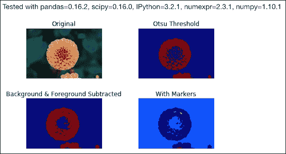

代码在本书代码包的 `extracting_patches.ipynb`文件中。

## 另见

*   https://en.wikipedia.org/wiki/Image_segmentation 关于图像分割的维基百科页面(2015 年 12 月检索)
*   https://en.wikipedia.org/wiki/Otsu's_method 大津法的维基百科页面(2015 年 12 月检索)
*   维基百科关于 https://en.wikipedia.org/wiki/Dilation_%28morphology%29 膨胀的页面(2015 年 12 月检索)

# 用哈尔级联检测人脸

人脸是人体解剖学的一个识别特征。严格来说，许多动物也有脸，但这与大多数实际应用不太相关。**人脸检测**试图在图像中找到代表人脸的(矩形)区域。人脸检测是**物体检测**的一种，因为人脸是物体的一种。

大多数人脸检测算法都擅长检测干净的人脸，因为大多数训练图像都属于这一类。倾斜的面部、明亮的灯光或嘈杂的图像可能会导致面部检测出现问题。从一张脸推断年龄、性别或种族(例如内眦赘皮的存在)是可能的，这当然对营销有用。

一个可能的应用是分析社交媒体网站上的个人资料图片。OpenCV 使用基于哈尔特征的级联分类器系统来检测人脸。该系统还被命名为“紫百合-琼斯目标检测框架”T4，以其在 2001 年提出的“T5”清单命名。

该算法具有以下步骤:

1.  哈尔特征选择:哈尔特征类似于哈尔小波(如[第 6 章](06.html "Chapter 6. Signal Processing and Timeseries")、*信号处理和时间序列*中*应用离散小波变换*配方所述)。
2.  创建完整图像(参考*使用 SURF* 配方检测特征)。
3.  Adaboost 训练(参考[第九章](09.html "Chapter 9. Ensemble Learning and Dimensionality Reduction")、*集成学习和降维*中 *Boosting 更好的学习*食谱)。
4.  级联分类器。

当我们看人脸图像时，我们可以创建与亮度相关的试探法。

例如，鼻子区域比直接位于其左右两侧的区域更亮。因此，我们可以定义一个覆盖鼻子的白色矩形和覆盖邻近区域的黑色矩形。当然 Viola-Jones 系统并不知道鼻子的确切位置，但是通过定义不同大小的窗口并寻找相应的白色和黑色矩形，就有机会匹配到鼻子。实际的哈尔特征被定义为黑色矩形的亮度总和和相邻矩形的亮度总和。对于 24 x 24 的窗口，我们有超过 16 万个功能(大约是 24 的四次方)。

训练集由大量正面(有脸)图像和负面(没有脸)图像组成。只有大约 0.01%的窗口(大约 24×24 像素)实际包含人脸。级联分类器逐步过滤掉负像区域。在每个渐进阶段，分类器在更少的图像窗口上逐渐使用更多的特征。这个想法是把大部分时间花在包含人脸的图像块上。维奥拉和琼斯的原始论文有 38 个阶段，前五个阶段有 1、10、25、25 和 50 个特征。平均每个图像窗口评估 10 个特征。

在 OpenCV 中，可以自己训练一个级联分类器，如[中所述。然而，OpenCV 有预先训练好的人脸、眼睛和其他特征的分类器。这些分类器的配置存储为 XML 文件，可以在安装 OpenCV 的文件夹中找到(在我的机器上，`/usr/local/share/OpenCV/haarcascades` /)。](http://docs.opencv.org/3.0.0/dc/d88/tutorial_traincascade.html)

## 做好准备

按照*中的说明设置 OpenCV* 。

## 怎么做...

1.  进口情况如下:

    ```py
    import cv2
    from scipy.misc import lena
    import matplotlib.pyplot as plt
    import numpy as np
    import dautil as dl
    import os
    from IPython.display import HTML
    ```

2.  定义以下功能，绘制检测到人脸的图像(如果检测到):

    ```py
    def plot_with_rect(ax, img):
        img2 = img.copy()

        for x, y, w, h in face_cascade.detectMultiScale(img2, 1.3, 5):
            cv2.rectangle(img2, (x, y), (x + w, y + h), (255, 0, 0), 2)

        dl.plotting.img_show(ax, img2, cmap=plt.cm.gray)
    ```

3.  下载 XML 配置文件，创建分类器:

    ```py
    # dir = '/usr/local/share/OpenCV/haarcascades/'
    base = 'https://raw.githubusercontent.com/Itseez/opencv/master/data/'
    url = base + 'haarcascades/haarcascade_frontalface_default.xml'
    path = os.path.join(dl.data.get_data_dir(),
                        'haarcascade_frontalface_default.xml')

    if not dl.conf.file_exists(path):
        dl.data.download(url, path)

    face_cascade = cv2.CascadeClassifier(path)
    ```

4.  用检测到的人脸绘制原始图像:

    ```py
    sp = dl.plotting.Subplotter(2, 2, context)
    img = lena().astype(np.uint8)
    plot_with_rect(sp.ax, img)
    sp.label()
    ```

5.  绘制轻微旋转的图像(检测失败):

    ```py
    rows, cols = img.shape
    mat = cv2.getRotationMatrix2D((cols/2, rows/2), 21, 1)
    rot = cv2.warpAffine(img, mat, (cols, rows))
    plot_with_rect(sp.next_ax(), rot)
    sp.label()
    ```

6.  绘制添加了噪声的图像(检测失败):

    ```py
    np.random.seed(36)
    noisy = img * (np.random.random(img.shape) < 0.6)
    plot_with_rect(sp.next_ax(), noisy)
    sp.label()
    ```

7.  用检测到的人脸绘制模糊图像:

    ```py
    blur = cv2.blur(img, (9, 9))
    plot_with_rect(sp.next_ax(), blur)
    sp.label()

    HTML(sp.exit())
    ```

有关最终结果，请参考以下屏幕截图:

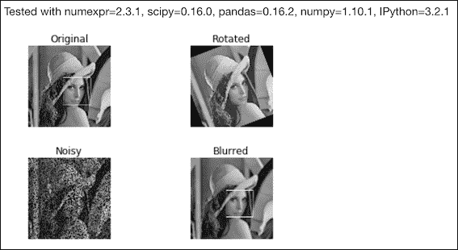

代码在本书代码包的`detecting_faces.ipynb`文件中。

## 另见

*   https://en.wikipedia.org/wiki/Face_detection 关于人脸检测的维基百科页面(2015 年 12 月检索)
*   维基百科关于 Viola-Jones 框架的页面位于[https://en . Wikipedia . org/wiki/Viola % E2 % 80% 93 Jones _ object _ detection _ framework](https://en.wikipedia.org/wiki/Viola%E2%80%93Jones_object_detection_framework)(2015 年 12 月检索)

# 寻找明亮的星星

许多星星在晚上是可见的，甚至不用望远镜或任何其他光学设备。一般来说，恒星比行星地球大，但在它们进化的某些阶段，它们可以更小。由于距离很远，它们看起来像小点。通常，这些点由两颗(双星系统)或更多恒星组成。不是所有的恒星都发出可见光，也不是所有的星光都能到达我们这里。

我们有许多方法可以在星空图像中找到明亮的星星。在这个食谱中，我们将寻找亮度的局部最大值，它也高于一个阈值。为了确定亮度，我们将把图像转换到 HSV 颜色空间。在这个颜色空间中，三个维度是色调、饱和度和值(亮度)。OpenCV `split()`将颜色空间中的图像值转换为组成值，例如色调、饱和度和亮度。这是一个相对缓慢的操作。为了找到最大值，我们可以应用 SciPy `argrelmax()`函数。

## 做好准备

按照*中的说明设置 OpenCV* 配方。

## 怎么做...

1.  进口情况如下:

    ```py
    import dautil as dl
    import os
    import cv2
    import matplotlib.pyplot as plt
    from scipy.signal import argrelmax
    import numpy as np
    from IPython.display import HTML
    ```

2.  定义以下功能来扫描水平或垂直轴上的局部亮度峰值:

    ```py
    def scan_axis(v, axis):
        argmax = argrelmax(v, order=int(np.sqrt(v.shape[axis])),
                           axis=axis)

        return set([(i[0], i[1]) for i in np.column_stack(argmax)])
    ```

3.  下载图片分析:

    ```py
    dir = dl.data.get_data_dir()
    path = os.path.join(dir, 'night-927168_640.jpg')
    base = 'https://pixabay.com/static/uploads/photo/2015/09/06/10/19/'
    url = base + 'night-927168_640.jpg'

    if not dl.conf.file_exists(path):
        dl.data.download(url, path)
    ```

4.  从图像中提取亮度值:

    ```py
    img = cv2.imread(path)
    hsv = cv2.cvtColor(img, cv2.COLOR_BGR2HSV)

    h, s, v = cv2.split(hsv)

    # Transform for normalization
    v = v.astype(np.uint16) ** 2
    ```

5.  绘制亮度值直方图:

    ```py
    sp = dl.plotting.Subplotter(2, 2, context)
    sp.ax.hist(v.ravel(), normed=True)
    sp.label()
    ```

6.  绘制轴 0 的亮度值直方图:

    ```py
    dl.plotting.hist_norm_pdf(sp.next_ax(), v.mean(axis=0))
    sp.label()
    ```

7.  绘制轴 1 的亮度值直方图:

    ```py
    dl.plotting.hist_norm_pdf(sp.next_ax(), v.mean(axis=1))
    sp.label()
    ```

8.  用我们认为包含亮星的点绘制图像:

    ```py
    points = scan_axis(v, 0).intersection(scan_axis(v, 1))

    limit = np.percentile(np.unique(v.ravel()), 95)

    kp = [cv2.KeyPoint(p[1], p[0], 1) for p in points
          if v[p[0], p[1]] > limit]
    with_kp = cv2.drawKeypoints(img, kp, None, (255, 0, 0))

    dl.plotting.img_show(sp.next_ax(), with_kp)
    sp.label()

    HTML(sp.exit())
    ```

有关最终结果，请参考以下屏幕截图:

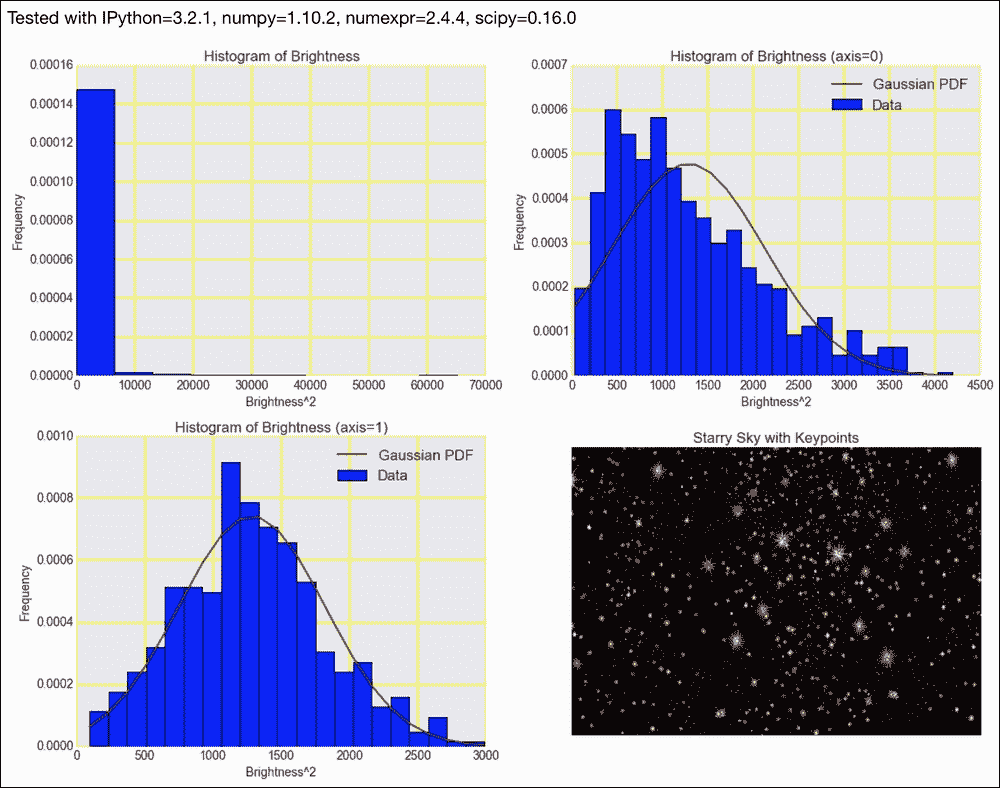

代码在本书代码包的 `searching_stars.ipynb`文件中。

## 另见

*   https://en.wikipedia.org/wiki/HSL_and_HSV 的高铁和高铁的维基百科页面(2015 年 12 月检索)
*   [https://docs . scipy . org/doc/scipy-0 . 16 . 0/reference/generated/scipy . signal . argrelmax . html](https://docs.scipy.org/doc/scipy-0.16.0/reference/generated/scipy.signal.argrelmax.html)记录的功能(2015 年 12 月检索)
*   `split()`功能记录在[http://docs . opencv . org/3.0-rc1/D2/de8/group _ _ core _ _ array . html # ga 0547 C7 fed 86152d 7e 9d 0096029 c 8518 a](http://docs.opencv.org/3.0-rc1/d2/de8/group__core__array.html#ga0547c7fed86152d7e9d0096029c8518a)(2015 年 12 月检索)

# 从图像中提取元数据

数字照片经常包含额外的文本元数据，例如时间戳、曝光信息和地理位置。其中一些元数据可由相机所有者编辑。例如，在营销环境中，从社交媒体网站上的个人资料(或其他)图像中提取元数据可能会很有用。据称，告密者爱德华·斯诺登声称美国国家安全局正在从全球在线数据中收集 EXIF 元数据。

## 做好准备

在这个食谱中，我们将使用 ExifRead 提取 EXIF 元数据。

按照以下步骤安装 ExifRead:

```py
$ pip install ExifRead

```

我用 ExifRead 2.1.2 测试了代码。

## 怎么做...

1.  进口情况如下:

    ```py
    import exifread
    import pprint
    ```

2.  打开图像如下:

    ```py
    f = open('covers.jpg', 'rb')
    ```

3.  打印标签和密钥如下:

    ```py
    # Return Exif tags
    tags = exifread.process_file(f)
    print(tags.keys())
    pprint.pprint(tags)
    f.close()
    ```

参考以下最终结果:

```py
dict_keys(['EXIF Flash', 'Image Make', 'EXIF Contrast', 'EXIF DateTimeOriginal', 'Image ResolutionUnit', 'EXIF ComponentsConfiguration', 'EXIF ISOSpeedRatings', 'Image ExifOffset', 'Image ImageDescription', 'EXIF MaxApertureValue', 'EXIF ExposureBiasValue', 'Image YResolution', 'Image Orientation', 'EXIF DateTimeDigitized', 'EXIF MeteringMode', 'EXIF Sharpness', 'EXIF WhiteBalance', 'EXIF ExposureTime', 'Image Model', 'EXIF SceneCaptureType', 'Image Software', 'EXIF SceneType', 'EXIF SubjectDistanceRange', 'EXIF LightSource', 'EXIF FocalLengthIn35mmFilm', 'Image XResolution', 'Image DateTime', 'EXIF FileSource', 'EXIF ExposureProgram', 'EXIF FocalLength', 'EXIF FNumber', 'EXIF Saturation', 'EXIF ExifImageWidth', 'EXIF ExposureMode', 'EXIF DigitalZoomRatio', 'EXIF FlashPixVersion', 'EXIF ExifVersion', 'EXIF ColorSpace', 'EXIF CustomRendered', 'EXIF GainControl', 'EXIF CompressedBitsPerPixel', 'EXIF ExifImageLength'])
{'EXIF ColorSpace': (0xA001) Short=sRGB @ 406,
 'EXIF ComponentsConfiguration': (0x9101) Undefined=YCbCr @ 298,
 'EXIF CompressedBitsPerPixel': (0x9102) Ratio=2 @ 650,
 'EXIF Contrast': (0xA408) Short=Normal @ 550,
 'EXIF CustomRendered': (0xA401) Short=Normal @ 466,
 'EXIF DateTimeDigitized': (0x9004) ASCII=0000:00:00 00:00:00 @ 630,
 'EXIF DateTimeOriginal': (0x9003) ASCII=0000:00:00 00:00:00 @ 610,
 'EXIF DigitalZoomRatio': (0xA404) Ratio=0 @ 682,
 'EXIF ExifImageLength': (0xA003) Long=240 @ 430,
 'EXIF ExifImageWidth': (0xA002) Long=940 @ 418,
 'EXIF ExifVersion': (0x9000) Undefined=0220 @ 262,
 'EXIF ExposureBiasValue': (0x9204) Signed Ratio=0 @ 658,
 'EXIF ExposureMode': (0xA402) Short=Auto Exposure @ 478,
 'EXIF ExposureProgram': (0x8822) Short=Program Normal @ 238,
 'EXIF ExposureTime': (0x829A) Ratio=10/601 @ 594,
 'EXIF FNumber': (0x829D) Ratio=14/5 @ 602,
 'EXIF FileSource': (0xA300) Undefined=Digital Camera @ 442,
 'EXIF Flash': (0x9209) Short=Flash fired, auto mode @ 370,
 'EXIF FlashPixVersion': (0xA000) Undefined=0100 @ 394,
 'EXIF FocalLength': (0x920A) Ratio=39/5 @ 674,
 'EXIF FocalLengthIn35mmFilm': (0xA405) Short=38 @ 514,
 'EXIF GainControl': (0xA407) Short=None @ 538,
 'EXIF ISOSpeedRatings': (0x8827) Short=50 @ 250,
 'EXIF LightSource': (0x9208) Short=Unknown @ 358,
 'EXIF MaxApertureValue': (0x9205) Ratio=3 @ 666,
 'EXIF MeteringMode': (0x9207) Short=Pattern @ 346,
 'EXIF Saturation': (0xA409) Short=Normal @ 562,
 'EXIF SceneCaptureType': (0xA406) Short=Standard @ 526,
 'EXIF SceneType': (0xA301) Undefined=Directly Photographed @ 454,
 'EXIF Sharpness': (0xA40A) Short=Normal @ 574,
 'EXIF SubjectDistanceRange': (0xA40C) Short=0 @ 586,
 'EXIF WhiteBalance': (0xA403) Short=Auto @ 490,
 'Image DateTime': (0x0132) ASCII=0000:00:00 00:00:00 @ 184,
 'Image ExifOffset': (0x8769) Long=204 @ 126,
 'Image ImageDescription': (0x010E) ASCII=           @ 134,
 'Image Make': (0x010F) ASCII=NIKON @ 146,
 'Image Model': (0x0110) ASCII=E7900 @ 152,
 'Image Orientation': (0x0112) Short=Horizontal (normal) @ 54,
 'Image ResolutionUnit': (0x0128) Short=Pixels/Inch @ 90,
 'Image Software': (0x0131) ASCII=E7900v1.1 @ 174,
 'Image XResolution': (0x011A) Ratio=300 @ 158,
 'Image YResolution': (0x011B) Ratio=300 @ 166}
```

代码在本书代码包的`img_metadata.py`文件中。

## 另见

*   位于[的关于](https://en.wikipedia.org/wiki/Exchangeable_image_file_format) EXIF 的维基百科页面
*   在 https://github.com/ianare/exif-py 的 ExifRead 文件(2015 年 12 月检索)

# 从图像中提取纹理特征

纹理是图像的空间和视觉质量。在这个食谱中，我们将看看 **哈拉利克纹理特征**。这些特征基于如下定义的**共现矩阵** (11.5) :

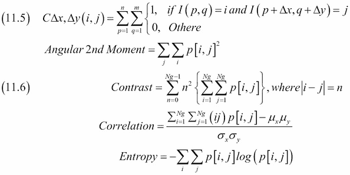

在等式 11.5 中， *i* 和 *j* 是强度，而 *p* 和 *q* 是位置。哈拉里克特征是从共现矩阵中导出的 13 个度量，其中一些在等式 11.6 中给出。更多完整列表，请参考[http://murphylab . web . CMU . edu/publications/Boland/Boland _ node 26 . html](http://murphylab.web.cmu.edu/publications/boland/boland_node26.html)(2015 年 12 月检索)。

我们将使用 mahotas API 计算 Haralick 特征，并将其应用于 scikit-learn 的手写数字数据集。

## 做好准备

按照以下步骤安装 maho tas:

```py
$ pip install mahotas

```

我用 mahotas 1.4.0 测试了代码。

## 怎么做...

1.  进口如下:

    ```py
    import mahotas as mh
    import numpy as np
    from sklearn.datasets import load_digits
    import matplotlib.pyplot as plt
    from tpot import TPOT
    from sklearn.cross_validation import train_test_split
    import dautil as dl
    ```

2.  加载 sci kit-学习数字数据如下:

    ```py
    digits = load_digits()
    X = digits.data.copy()
    ```

3.  创建哈拉利克特征并添加它们:

    ```py
    for i, img in enumerate(digits.images):
        np.append(X[i], mh.features.haralick(
            img.astype(np.uint8)).ravel())
    ```

4.  用 TPOT(或我的叉子，如[第 9 章](09.html "Chapter 9. Ensemble Learning and Dimensionality Reduction")、*集成学习和降维*所述)拟合模型并评分:

    ```py
    X_train, X_test, y_train, y_test = train_test_split(
        X, digits.target, train_size=0.75)

    tpot = TPOT(generations=6, population_size=101,
                random_state=46, verbosity=2)
    tpot.fit(X_train, y_train)

    print('Score {:.2f}'.format(tpot.score(X_train, y_train, X_test, y_test)))
    ```

5.  将第一张原图绘制如下:

    ```py
    dl.plotting.img_show(plt.gca(), digits.images[0])
    plt.title('Original Image')
    ```

6.  绘制该图像的核心特征:

    ```py
    plt.figure()
    dl.plotting.img_show(plt.gca(), digits.data[0].reshape((8, 8)))
    plt.title('Core Features')
    ```

7.  绘制该图像的哈拉利克特征:

    ```py
    plt.figure()
    dl.plotting.img_show(plt.gca(), mh.features.haralick(
        digits.images[0].astype(np.uint8)))
    plt.title('Haralick Features')
    ```

有关最终结果，请参考以下屏幕截图:

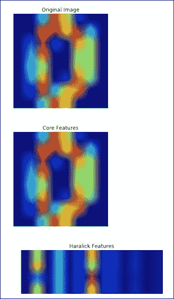

代码在本书代码包的`extracting_texture.ipynb`文件中。

## 另见

*   关于[https://en.wikipedia.org/wiki/Image_texture](https://en.wikipedia.org/wiki/Image_texture)的图像纹理的维基百科页面(2015 年 12 月检索)
*   维基百科页面关于[https://en.wikipedia.org/wiki/Co-occurrence_matrix](https://en.wikipedia.org/wiki/Co-occurrence_matrix)的共现矩阵(2015 年 12 月检索)

# 对图像应用层次聚类

我们在[第 9 章](09.html "Chapter 9. Ensemble Learning and Dimensionality Reduction")、*集成学习和降维*中遇到了层次聚类的概念。在这个食谱中，我们将通过分层聚类来分割图像。我们将应用**凝聚聚类** O(n <sup>3</sup> ，这是的一种层次聚类。

在聚集聚类中，每个项目在初始化时被分配其自己的聚类。随后，这些集群合并(聚集)并根据需要向上移动。显然，我们只合并在某种程度上相似的集群。

初始化之后，我们找到距离最近的一对，并将其合并。合并后的集群是由较低级别的集群组成的较高级别的集群。之后，我们再次找到最接近的一对并将其合并，以此类推。在此过程中，集群可以有任意数量的项目。当我们达到一定数量的集群后，或者当集群相距太远时，我们停止集群。

## 怎么做...

1.  进口情况如下:

    ```py
    import numpy as np
    from scipy.misc import ascent
    import matplotlib.pyplot as plt
    from sklearn.feature_extraction.image import grid_to_graph
    from sklearn.cluster import AgglomerativeClustering
    import dautil as dl
    ```

2.  加载图像并将其加载到数组中:

    ```py
    img = ascent()
    X = np.reshape(img, (-1, 1))
    ```

3.  将图像聚类，聚类数设置为`9`(猜测):

    ```py
    connectivity = grid_to_graph(*img.shape)
    NCLUSTERS = 9
    ac = AgglomerativeClustering(n_clusters=NCLUSTERS,
                                 connectivity=connectivity)
    ac.fit(X)
    label = np.reshape(ac.labels_, img.shape)
    ```

4.  绘制叠加了簇段的图像:

    ```py
    for l in range(NCLUSTERS):
        plt.contour(label == l, contours=1,
                    colors=[plt.cm.spectral(l/float(NCLUSTERS)), ])

    dl.plotting.img_show(plt.gca(), img, cmap=plt.cm.gray)
    ```

最终结果参见下面的截图:

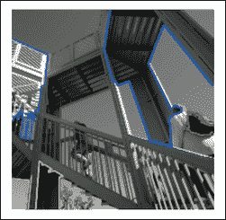

代码在本书代码包的 `clustering_hierarchy.ipynb`文件中。

## 另见

*   `AgglomerativeClustering`课程记录在[http://sci kit-learn . org/stable/modules/generated/sklearn . cluster . aggregateveclustering . html](http://scikit-learn.org/stable/modules/generated/sklearn.cluster.AgglomerativeClustering.html)(2015 年 12 月检索)
*   https://en.wikipedia.org/wiki/Hierarchical_clustering 的等级聚类的维基百科页面(2015 年 12 月检索)

# 利用光谱聚类分割图像

**光谱聚类**是一种可以用来分割图像的聚类技术。scikit-learn `spectral_clustering()`函数实现了归一化图割谱聚类算法。该算法将图像表示为单位图。这里的“图”与[第八章](08.html "Chapter 8. Text Mining and Social Network Analysis")、*文本挖掘和社交网络分析*中的数学概念相同。该算法试图分割图像，同时最小化片段大小和沿切割的强度梯度比率。

## 怎么做...

1.  进口情况如下:

    ```py
    import numpy as np
    import matplotlib.pyplot as plt
    from sklearn.feature_extraction.image import img_to_graph
    from sklearn.cluster import spectral_clustering
    from sklearn.datasets import load_digits
    ```

2.  加载数字数据集如下:

    ```py
    digits = load_digits()
    img = digits.images[0].astype(float)
    mask = img.astype(bool)
    ```

3.  根据图像创建图形:

    ```py
    graph = img_to_graph(img, mask=mask)
    graph.data = np.exp(-graph.data/graph.data.std())
    ```

4.  应用谱聚类得到三个聚类:

    ```py
    labels = spectral_clustering(graph, n_clusters=3)
    label_im = -np.ones(mask.shape)
    label_im[mask] = labels
    ```

5.  将原始图像绘制如下:

    ```py
    plt.matshow(img, False)
    plt.gca().axis('off')
    plt.title('Original')
    ```

6.  将图像与三个簇绘制如下:

    ```py
    plt.figure()
    plt.matshow(label_im, False)
    plt.gca().axis('off')
    plt.title('Clustered')
    ```

有关最终结果，请参考以下屏幕截图:

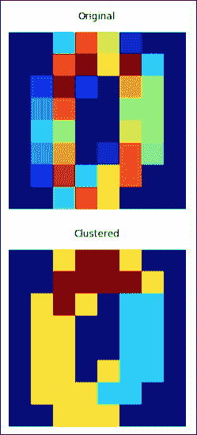

代码在本书代码包的`clustering_spectral.ipynb`文件中。

## 另见

*   https://en.wikipedia.org/wiki/Spectral_clustering 光谱聚类的维基百科页面(2015 年 12 月检索)
*   `spectral_clustering()`功能记录在[http://sci kit-learn . org/stable/modules/generated/sklearn . cluster . spectrum _ clustering . html](http://scikit-learn.org/stable/modules/generated/sklearn.cluster.spectral_clustering.html)(2015 年 12 月检索)