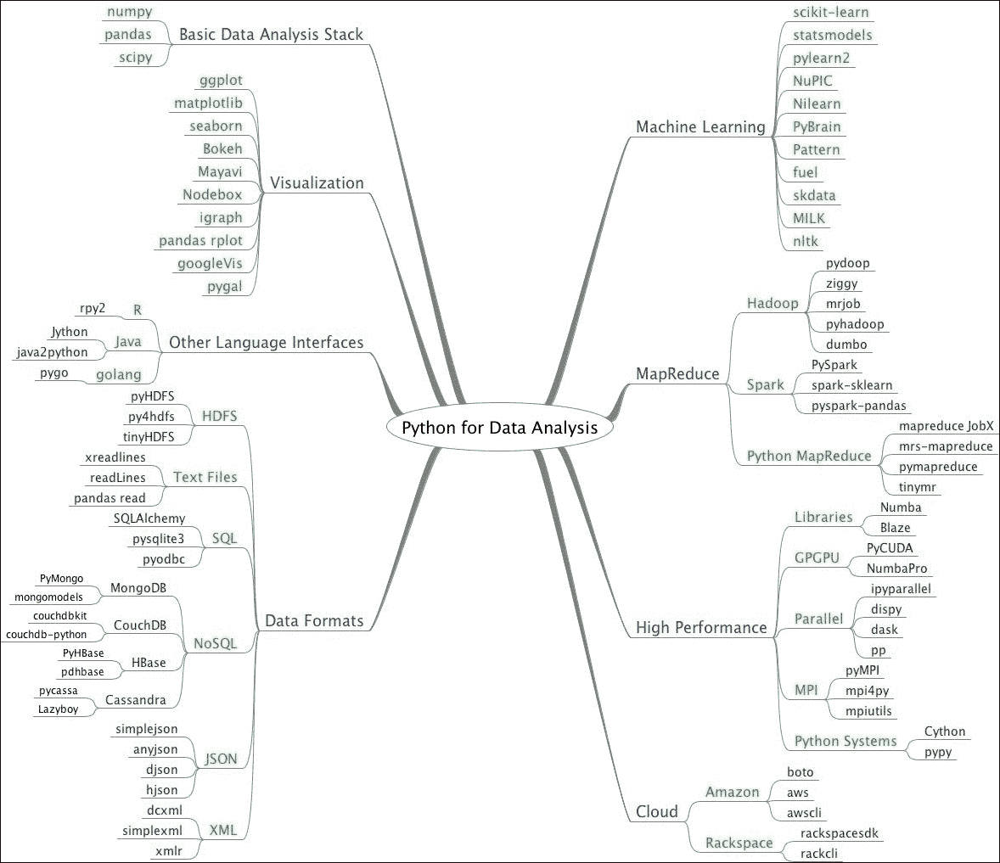
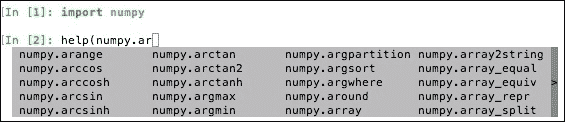
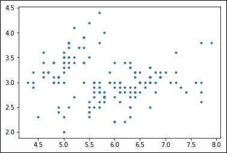
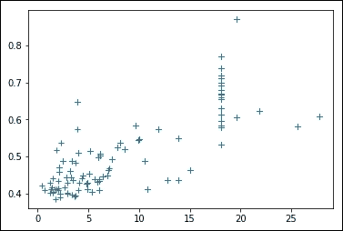

# 第一章。Python 库入门

欢迎光临！我们开始吧。Python 已经成为数据分析和数据科学事实上的标准语言和平台之一。您将很快看到的思维导图描述了数据分析师和数据科学家使用的 Python 生态系统中的一些可用库。NumPy、SciPy、Pandas 和 Matplotlib 库奠定了 Python 数据分析的基础，现在是 SciPy Stack 1.0([http://www.scipy.org/stackspec.html](http://www.scipy.org/stackspec.html))的一部分。我们将学习如何安装 SciPy Stack 1.0 和 Jupyter Notebook，并编写一些简单的数据分析代码作为热身练习。

以下是 Python 生态系统中可供数据分析师和数据科学家使用的库:

*   **NumPy** :这是一个通用库，提供数值数组，以及高效操作数组的函数。
*   **SciPy** :这是一个提供科学和工程相关功能的科学计算库。SciPy 补充并略微重叠 NumPy。NumPy 和 SciPy 在历史上共享他们的代码库，但后来分开了。
*   **Pandas**:这是一个数据操作库，提供数据结构和操作来操作表格和时间序列数据。
*   **Matplotlib** :这是一个 2D 绘图库，为生成绘图、图表和图形提供支持。Matplotlib 由 SciPy 使用，支持 NumPy。
*   **IPython** :这为 Python 提供了强大的交互外壳，为 Jupyter 提供了内核，并支持交互数据可视化。我们将在本章稍后介绍 IPython 外壳。
*   **Jupyter Notebook** :这提供了一个基于网络的交互式外壳，用于通过实时代码和可视化来创建和共享文档。Jupyter Notebook 通过 IPython 提供的内核支持多个版本的 Python。我们将在本章稍后介绍 Jupyter 笔记本。

其他所需软件的安装说明将在适当的时候在整本书中给出。在这一章的最后，你会发现一些提示，告诉你如果你陷入困境或者不确定解决问题的最佳方法，如何在网上找到更多的信息:



在本章中，我们将涵盖以下主题:

*   安装 Python 3
*   使用 IPython 作为外壳
*   阅读手册页
*   Jupyter 笔记型电脑
*   NumPy 数组
*   简单的应用程序
*   在哪里可以找到帮助和参考资料
*   列出 Python 库中的模块
*   使用 matplotlib 可视化数据

# 安装 Python 3

本书使用的软件基于 Python 3，所以需要安装 Python 3。在一些操作系统上，已经安装了 Python 3。Python 有许多实现，包括商业实现和发行版。在本书中，我们将重点介绍标准 Python 实现，它保证与 NumPy 兼容。

### 注

可以从[https://www.python.org/downloads/](https://www.python.org/download/)下载 Python 3.5.x。在这个网页上，你可以找到 Windows 和 Mac OS X 的安装程序，以及 Linux、Unix 和 Mac OS X 的源文件库。你可以在[https://docs.python.org/3/using/index.html](https://docs.python.org/3/using/index.html)找到各种操作系统安装和使用 Python 的说明。

我们将在本章安装的软件有 Windows 的二进制安装程序、各种 Linux 发行版和 Mac OS X。如果您愿意，也有源代码发行版。您需要在系统上安装 Python 3.5.x 或更高版本。Python 2.7 的日落日期从 2015 年移动到 2020 年，因此 Python 2.7 将被支持和维护到 2020 年。出于这些原因，我们为 Python 3 更新了这本书。

## 安装数据分析库

我们将学习如何在 Windows、Linux 和 Mac OS X 上安装和设置 NumPy、SciPy、Pandas、Matplotlib、IPython 和 Jupyter Notebook，让我们详细了解一下这个过程。我们将使用`pip3`来安装库。从 3.4 版本开始，默认情况下，Python 安装中包含了`pip3`。

## 在 Linux 或者 Mac OS X 上

要安装基础库，请运行以下命令行指令:

```py
$ pip3 install numpy scipy pandas matplotlib jupyter notebook 

```

如果您的当前用户在您的系统上没有足够的权限，可能有必要将`sudo`添加到该命令之前。

## 在窗户上

在撰写本书时，我们在 Windows 10 虚拟机上安装了以下软件作为先决条件:

*   Python 3.6 来自[https://www . python . org/FTP/python/3 . 6 . 0/python-3 . 6 . 0-amd64 . exe](https://www.python.org/ftp/python/3.6.0/python-3.6.0-amd64.exe)
*   微软 Visual C++构建工具 2015 来自[http://landinghub.visualstudio.com/visual-cpp-build-tools](http://landinghub.visualstudio.com/visual-cpp-build-tools)

从[http://www.lfd.uci.edu/~gohlke/pythonlibs/](http://www.lfd.uci.edu/~gohlke/pythonlibs/)为您的 Windows 平台下载并安装适当的预建 NumPy 和 Scipy 二进制文件:

*   我们下载了**numpy-1 . 12 . 0+mkl-cp36-cp36m-win _ amd 64 . whl**和**scipy-0 . 18 . 1-cp36-cp36m-win _ amd 64 . whl**
*   下载后，我们执行`pip3 install Downloads\numpy-1.12.0+mkl-cp36-cp36m-win_amd64.whl` 和`pip3 install Downloads\scipy-0.18.1-cp36-cp36m-win_amd64.whl`命令

安装这些先决条件后，要安装其余的基础库，请运行以下命令行指令:

```py
$ pip3 install pandas matplotlib jupyter

```

### 型式

安装 **Jupyter** 使用这些命令，安装所有需要的软件包，比如笔记本和 IPython。

# 使用 IPython 作为外壳

数据分析师、数据科学家和工程师习惯于实验。IPython 是由科学家在实验的基础上创造出来的。IPython 提供的交互环境与 Matlab、Mathematica 和 Maple 提供的交互计算环境相当。

以下是 IPython 外壳的功能列表:

*   选项卡完成，这有助于您找到命令
*   历史机制
*   内嵌编辑
*   能够用`%run`调用外部 Python 脚本
*   访问系统命令
*   对 Python 调试器和分析器的访问

以下列表描述了如何使用 IPython 外壳:

*   **Starting a session**: To start a session with IPython,enter the following instruction on the command line:

    ```py
    $ ipython3
    Python 3.5.2 (default, Sep 28 2016, 18:08:09) 
    Type "copyright", "credits" or "license" for more information.
     IPython 5.1.0 -- An enhanced Interactive Python.
    ?         -> Introduction and overview of IPython's features.
    %quickref -> Quick reference.
    help      -> Python's own help system.
    object?   -> Details about 'object', use 'object??' for extra 
                         details.
    In [1]: quit()

    ```

    ### 型式

    `quit()`功能或 *Ctrl* + *D* 退出 IPython 外壳。

*   **Saving a session**: We might want to be able to go back to our experiments. In IPython, it is easy to save a session for later use with the following command:

    ```py
    In [1]: %logstart
    Activating auto-logging. Current session state plus future 
     input saved:
     Filename : ipython_log.py
     Mode : rotate
     Output logging : False
     Raw input log : False
     Timestamping : False
    State : active

    ```

    日志记录可以按如下方式关闭:

    ```py
    In [9]: %logoff
    Switching logging OFF

    ```

*   **Executing a system shell command**: Execute a system shell command in the default IPython profile by prefixing the command with the `!` symbol. For instance, the following input will get the current date:

    ```py
    In [1]: !date

    ```

    事实上，任何以`!`为前缀的行都会被发送到系统外壳。我们还可以存储命令输出，如下所示:

    ```py
    In [2]: thedate = !date
    In [3]: thedate

    ```

*   **Displaying history**: We can show the history of our commands with the `%hist` command. For example:

    ```py
    In [1]: a = 2 + 2
    In [2]: a
    Out[2]: 4
    In [3]: %hist
    a = 2 + 2
    a
    %hist

    ```

    这是**命令行界面** ( **CLI** )环境中的常见功能。我们也可以通过`-g`开关搜索历史，如下所示:

    ```py
    In [5]: %hist -g a = 2
     1: a = 2 + 2

    ```

我们看到了一些所谓的神奇功能在发挥作用。这些功能以`%`字符开始。如果魔法功能单独在一行上使用，`%`前缀是可选的。

# 阅读手册页

在 IPython 中导入库时，我们可以用`help`命令打开库函数的手动页面。不必知道函数的名称。我们可以键入几个字符，然后让标签完成它的工作。例如，让我们浏览`arange()`功能的可用信息。

我们可以通过以下两种方式浏览可用信息:

*   **Calling the help function**: Type in `help(` followed by a few characters of the function and press the ***Tab*** key. A list of functions will appear. Select the function from the list using the arrow keys and press the ***Enter*** key. Close the help function call with `)`  and press the ***Enter*** key.

    

*   **Querying with a question mark**: Another option is to append a question mark to the function name. You will then, of course, need to know the function name, but you don't have to type `help`, for example:

    ```py
    In [3]: numpy.arange?

    ```

    标签完成依赖于`readline`，所以你需要确定它已经安装。通过输入以下命令，可以安装`pip`:

    ```py
    $ pip3 install readline

    ```

    问号提供了来自文档字符串的信息。

# Jupyter 笔记本电脑

Jupyter Notebook，以前被称为 IPython Notebooks，它提供了一个工具，可以创建和共享带有特殊格式的文本、图表和 Python 代码的网页。请通过以下链接查看这些笔记本系列:

*   [https://github . com/IPython/IPython/wiki/A-有趣的图库-IPython-笔记本](https://github.com/ipython/ipython/wiki/A-gallery-of-interesting-IPython-Notebooks)
*   [https://nbviewer . jupyter . org/](https://nbviewer.jupyter.org/)

通常，笔记本被用作教育工具，或者演示 Python 软件。我们可以从普通 Python 代码或特殊笔记本格式导入或导出笔记本。笔记本可以在本地运行，或者我们可以通过运行专用的笔记本服务器使它们在线可用。某些云计算解决方案，如 Wakari 和 PiCloud，允许您在云中运行笔记本电脑。云计算是[第 11 章](11.html "Chapter 11.  Environments Outside the Python Ecosystem and Cloud Computing")*Python 生态系统外的环境和云计算*的主题之一。

要启动与 Jupyter 笔记本的会话，请在命令行中输入以下指令:

```py
$ jupyter-notebook

```

这将启动笔记本服务器，并打开一个网页，显示将从中执行命令的文件夹的内容。然后可以选择**新建** | **Python 3** 在 Python 3 中开始一个新的笔记本。

也可以打开本书代码包中提供的`ch-01.ipynb`。`ch-01`笔记本文件包含我们稍后将描述的简单应用程序的代码。

# NumPy 数组

完成 NumPy 的安装后，是时候看一下 NumPy 数组了。在数值运算方面，NumPy 数组比 Python 列表更高效。事实上，NumPy 数组是经过大量优化的专用对象。NumPy 代码比同等的 Python 代码需要更少的显式循环。这是基于向量化的。

如果我们回到高中数学，那么我们应该记住标量和向量的概念。例如，数字 2 是一个标量。当我们将 2 加 2 时，我们执行的是标量加法。我们可以用一组标量组成一个向量。在 Python 编程术语中，我们将有一个一维数组。当然，这个概念可以扩展到更高的维度。在两个数组上执行操作，如加法，可以简化为一组标量操作。在直接 Python 中，我们将这样做，循环遍历第一个数组中的每个元素，并将其添加到第二个数组中的相应元素中。然而，这比数学中的方式更冗长。在数学中，我们把两个向量的相加当作一次运算。NumPy 数组也是这样做的，并且使用低级 C 例程进行了某些优化，使这些基本操作更加高效。我们将在[第 2 章](02.html "Chapter 2. NumPy Arrays")、 *NumPy 数组*中详细介绍 NumPy 数组。

# 简单的应用

假设我们要加上两个向量，分别叫做`a`和`b`。*向量*这个词在这里是数学意义上的，意思是一维数组。我们将在[第 4 章](04.html "Chapter 4. Statistics and Linear Algebra")、*统计学和线性代数*中学习表示矩阵的专用 NumPy 数组。向量`a`保存整数`0`到 *n* 的平方；例如，如果`n`等于`3`，`a`包含`0`，`1`或`4`。向量`b`保存整数`0`到 *n* 的立方，所以如果`n`等于`3`，那么向量`b`等于`0`、`1`或者`8`。使用普通的 Python 你会怎么做？在我们想出一个解决方案后，我们将把它与 NumPy 等效方案进行比较。

以下函数使用不带 NumPy 的纯 Python 解决了向量加法问题:

```py
def pythonsum(n): 
   a = list(range(n)) 
   b = list(range(n)) 
   c = [] 

   for i in range(len(a)): 
       a[i] = i ** 2 
       b[i] = i ** 3 
       c.append(a[i] + b[i]) 

   return c 

```

下面是一个用 NumPy 解决向量加法问题的函数:

```py
def numpysum(n): 
  a = numpy.arange(n) ** 2 
  b = numpy.arange(n) ** 3 
  c = a + b 
  return c 

```

注意`numpysum()`不需要`for`循环。我们还使用了 NumPy 中的`arange()`函数，该函数为我们创建了一个 NumPy 数组，其中包含从`0`到 *n* 的整数。`arange()`功能已导入；这就是为什么它的前缀是`numpy`。

有趣的部分来了。我们之前提到，在数组操作方面，NumPy 更快。不过，Numpy 要快多少？下面的程序将通过测量`numpysum()`和`pythonsum()`功能的经过时间(以微秒计)来显示。它还打印向量和的最后两个元素。让我们检查一下是否使用 Python 和 NumPy 得到了相同的答案:

```py
#!/usr/bin/env/python 

import sys 
from datetime import datetime 
import numpy as np 

""" 
This program demonstrates vector addition the Python way. 
Run the following from the command line: 

  python vectorsum.py n 

Here, n is an integer that specifies the size of the vectors. 

The first vector to be added contains the squares of 0 up to n. 
The second vector contains the cubes of 0 up to n. 
The program prints the last 2 elements of the sum and the elapsed  time: 
""" 

def numpysum(n): 
   a = np.arange(n) ** 2 
   b = np.arange(n) ** 3 
   c = a + b 

   return c 

def pythonsum(n): 
   a = list(range(n)) 
   b = list(range(n)) 
   c = [] 

   for i in range(len(a)): 
       a[i] = i ** 2 
       b[i] = i ** 3 
       c.append(a[i] + b[i]) 

   return c 

size = int(sys.argv[1]) 

start = datetime.now() 
c = pythonsum(size) 
delta = datetime.now() - start 
print("The last 2 elements of the sum", c[-2:]) 
print("PythonSum elapsed time in microseconds", delta.microseconds) 

start = datetime.now() 
c = numpysum(size) 
delta = datetime.now() - start 
print("The last 2 elements of the sum", c[-2:]) 
print("NumPySum elapsed time in microseconds", delta.microseconds) 

```

`1000`、`2000`和`3000`向量元素的程序输出如下:

```py
$ python3 vectorsum.py 1000
The last 2 elements of the sum [995007996, 998001000]
PythonSum elapsed time in microseconds 976
The last 2 elements of the sum [995007996 998001000]
NumPySum elapsed time in microseconds 87
$ python3 vectorsum.py 2000
The last 2 elements of the sum [7980015996, 7992002000]
PythonSum elapsed time in microseconds 1623
The last 2 elements of the sum [7980015996 7992002000]
NumPySum elapsed time in microseconds 143
$ python3 vectorsum.py 4000
The last 2 elements of the sum [63920031996, 63968004000]
PythonSum elapsed time in microseconds 3417
The last 2 elements of the sum [63920031996 63968004000]
NumPySum elapsed time in microseconds 237

```

显然，NumPy 比同等的正常 Python 代码快得多。有一点是肯定的；无论是否使用 NumPy，我们都会得到相同的结果。但是，打印的结果在表示上有所不同。注意`numpysum()`函数的结果没有逗号。怎么会这样显然，我们处理的不是 Python 列表，而是 NumPy 数组。我们将在[第 2 章](02.html "Chapter 2. NumPy Arrays")、 *NumPy 数组*中了解更多关于 NumPy 数组的信息。

# 哪里可以找到帮助和推荐人

下表列出了我们在本章中讨论的 Python 数据分析库的文档网站。

<colgroup><col> <col></colgroup> 
| **包装** | **描述** |
| NumPy 和 SciPy | NumPy 和 SciPy 的主要文档网站在[http://docs.scipy.org/doc/](http://docs.scipy.org/doc/)。通过此网页，您可以浏览 NumPy 和 SciPy 用户指南和参考指南，以及几个教程。 |
| Pandas | [http://pandas.pydata.org/pandas-docs/stable/](http://pandas.pydata.org/pandas-docs/stable/)。 |
| Matplotlib | [http://matplotlib.org/contents.html](http://matplotlib.org/contents.html)。 |
| 伊普提洪伊普提翁伊普提翁伊普提翁伊普提翁伊普提翁伊普提翁伊普提翁伊普提翁伊普提翁伊普提翁伊普提翁 | [http://ipython . readthedocs . io/en/stable/](http://ipython.readthedocs.io/en/stable/)。 |
| Jupyter 笔记型电脑 | [http://jupyter-notebook.readthedocs.io/en/latest/](http://jupyter-notebook.readthedocs.io/en/latest/) . |

流行的堆栈溢出软件开发论坛有数百个问题，分别标记为 NumPy、SciPy、Pandas、Matplotlib、IPython 和 Jupyter Notebook。要查看它们，请转到`http://stackoverflow.com/questions/tagged/<your-tag-word-here>`。

如果你真的遇到了问题，或者你想随时了解这些库的发展，你可以订阅他们各自的讨论邮件列表。每天的电子邮件数量因列表而异。积极参与这些库开发的开发人员回答了邮件列表中的一些问题。

对于 IRC 用户，在`irc://irc.freenode.net`上有一个 IRC 频道。这个频道叫做`#scipy`，但是你也可以问 NumPy 问题，因为 SciPy 用户也有 NumPy 的知识，因为 SciPy 是基于 NumPy 的。SciPy 频道始终至少有 50 名成员。

# 列出 Python 库中的模块

`ch-01.ipynb`文件包含查看 NumPy、SciPy、Pandas 和 Matplotlib 库中模块的代码。不要担心理解代码，只是现在尝试运行它。您可以修改这段代码来查看其他库中的模块。

# 使用 Matplotlib 可视化数据

我们将在后面的章节中学习可视化数据。现在，让我们尝试加载两个样本数据集并构建一个基本图。首先，安装 sklearn 库，我们将使用以下命令从中加载数据:

```py
$ pip3 install scikit-learn 

```

使用以下命令导入数据集:

```py
from sklearn.datasets import load_iris 
from sklearn.datasets import load_boston 

```

导入 Matplotlib 绘图模块:

```py
from matplotlib import pyplot as plt 
%matplotlib inline 

```

加载`iris`数据集，打印数据集描述，将第 1 列(萼片长度)绘制为`x`，将第 2 列(萼片宽度)绘制为`y`:

```py
iris = load_iris() 
print(iris.DESCR) 
data=iris.data 
plt.plot(data[:,0],data[:,1],".") 

```

生成的图将如下图所示:



加载 boston 数据集，打印数据集描述，将第 3 列(非零售业务占比)标为`x`，第 5 列(一氧化氮浓度)标为`y`，图上各点标有 **+** 符号:

```py
boston = load_boston()
print(boston.DESCR)
data=boston.data
plt.plot(data[:,2],data[:,4],"+")
```

生成的图将如下图所示:



# 总结

在这一章中，我们安装了 NumPy、SciPy、Pandas、Matplotlib、IPython 和 Jupyter Notebook，所有这些都将在本书中使用。我们让一个向量加法程序工作，并了解了 NumPy 如何提供卓越的性能。此外，我们还探索了可用的文档和在线资源。我们执行代码来查找库中的模块，并加载了一些示例数据集来使用 Matplotlib 绘制一些基本图。

在下一章[第二章](02.html "Chapter 2. NumPy Arrays")、 *NumPy 数组*中，我们将在 NumPy 的兜帽下看一看，探索一些基本概念，包括数组和数据类型。