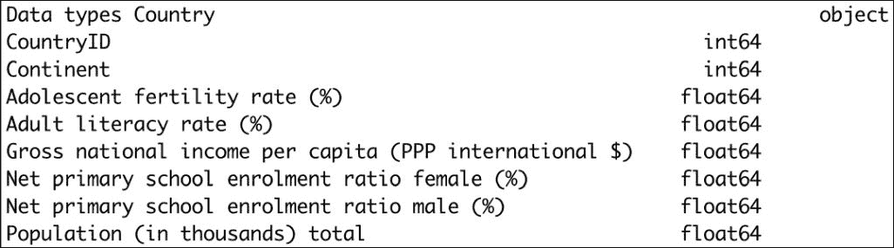
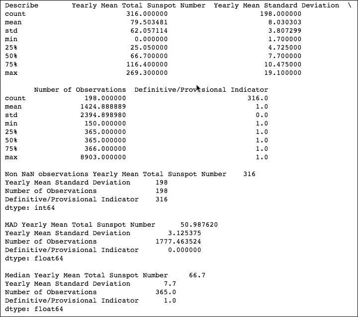
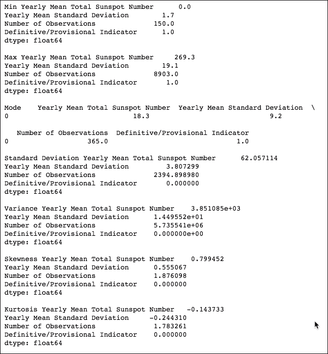

# 三、Pandas 入门

Pandas 以**面板数据**(计量经济学术语)和 Python 数据分析命名，是一个流行的开源 Python 库。在本章中，我们将学习 Pandas 的基本功能、数据结构和操作。

官方 Pandas 文件坚持用小写字母命名项目“T1”Pandas“T2”。Pandas 项目坚持的另一个惯例是`import pandas as pd`进口声明。

我们将在本文中遵循这些约定。

在本章中，我们将安装和探索 Pandas。然后，我们将熟悉 Pandas 的两个核心数据结构——数据框架和系列。之后，您将学习如何对这些数据结构中包含的数据执行类似于 SQL 的操作。Pandas 有统计工具，包括时间序列例程，其中一些将被演示。我们将研究的主题如下:

*   安装和探索 Pandas
*   Pandas 数据帧
*   Pandas 系列
*   Pandas 中的数据查询
*   Pandas 数据帧的统计
*   Pandas 数据帧的数据聚合
*   连接和附加数据帧
*   正在加入数据框
*   处理缺失值
*   处理日期
*   数据透视表

# 安装和探索 Pandas

Pandas 的最小依赖集要求如下:

*   **NumPy** :这是我们安装的基本数值数组包，在前面的章节中已经详细介绍过了
*   **python-dateutil** :这是一个日期处理库
*   **pytz** :这处理时区定义

这份清单是最起码的；可选依赖项的更长列表可以位于[http://pandas.pydata.org/pandas-docs/stable/install.html](http://pandas.pydata.org/pandas-docs/stable/install.html)。我们可以使用二进制安装程序，借助我们的操作系统包管理器，或者通过检查代码从源代码，通过 PyPI 用`pip`或`easy_install`安装 Pandas。二进制安装程序可以从[http://pandas.pydata.org/getpandas.html](http://pandas.pydata.org/getpandas.html)下载。

用`pip`安装 Pandas 的命令如下:

```py
$ pip3 install pandas rpy2

```

`rpy2`是 R 的接口，因为`rpy`被弃用，所以需要。如果您的用户帐户没有足够的权限，您可能需要在前面的命令前面加上`sudo`。

正如我们在[第 1 章](01.html "Chapter 1. Getting Started with Python Libraries")*Python 库*入门中看到的，我们可以打印 Pandas 的版本和子包。该程序为 Pandas 打印了以下输出:

```py
pandas version 0.19.0
pandas.api
pandas.compat DESCRIPTION compat  Cross-compatible functions for Python 2 and 3\. Key items to import for 2/3 compatible code: * iterators: range(), map(), 
pandas.computation
pandas.core
pandas.formats
pandas.indexes
pandas.io
pandas.msgpack DESCRIPTION # coding: utf-8 # flake8: noqa PACKAGE CONTENTS _packer _unpacker _version exceptions CLASSES ExtType(builtins.tuple) ExtType cl 
pandas.rpy DESCRIPTION # GH9602 # deprecate rpy to instead directly use rpy2 PACKAGE CONTENTS base common mass vars FILE /usr/local/lib/python3.5/site- 
pandas.sparse
pandas.stats
pandas.tests
pandas.tools
pandas.tseries
pandas.types
pandas.util

```

不幸的是，Pandas 子包的文档缺乏信息描述；然而，子包名称的描述性足以让我们了解它们的内容。

# Pandas 数据帧

Pandas 数据框架是一种带标签的二维数据结构，在精神上类似于谷歌工作表或微软 Excel 中的工作表，或者关系数据库表。Pandas 数据框中的列可以是不同的类型。顺便说一下，类似的概念最初是在 R 编程语言中发明的。(更多信息请参考[http://www.r-tutor.com/r-introduction/data-frame](http://www.r-tutor.com/r-introduction/data-frame))。可以通过以下方式创建数据框:

*   使用另一个数据帧。
*   使用 NumPy 数组或具有二维形状的数组组合。
*   同样，我们可以从另一个 Pandas 数据结构创建一个数据帧，称为**系列**。我们将在下一节中了解系列。
*   数据帧也可以从文件中生成，例如 CSV 文件。
*   来自一维结构的字典，如一维 NumPy 数组、列表、字典或 Pandas 系列。

例如，我们将使用可以从[http://www.exploredata.net/Downloads/WHO-Data-Set](http://www.exploredata.net/Downloads/WHO-Data-Set)检索的数据。原始数据文件比较大，列比较多，我们就用一个编辑好的文件代替，只包含前九列，叫做`WHO_first9cols.csv`；文件在这本书的代码包里。这是前两行，包括标题:

```py
Country,CountryID,Continent,Adolescent fertility rate (%),Adult literacy rate (%),Gross national income per capita (PPP international $),Net primary school enrolment ratio female (%),Net primary school enrolment ratio male (%),Population (in thousands) total
Afghanistan,1,1,151,28,,,,26088

```

在接下来的步骤中，我们将了解 Pandas 数据帧及其属性:

1.  To kick off, load the data file into a `DataFrame` and print it on the screen:

    ```py
              from pandas.io.parsers import read_csv 

              df = read_csv("WHO_first9cols.csv") 
              print("Dataframe", df) 

    ```

    打印输出是数据框的摘要。它太长，无法完全显示，所以我们将只抓取最后几行:

    ```py
              199                          21732.0   
              200                          11696.0   
              201                          13228.0

              [202 rows x 9 columns]
    ```

2.  The DataFrame has an attribute that holds its shape as a tuple, similar to `ndarray`. Query the number of rows of a DataFrame as follows:

    ```py
            print("Shape", df.shape) 
            print("Length", len(df)) 

    ```

    我们获得的值符合上一步的打印输出:

    ```py
            Shape (202, 9) 
            Length 202 

    ```

3.  Check the column's header and data types with the other attributes:

    ```py
            print("Column Headers", df.columns) 
            print("Data types", df.dtypes) 

    ```

    我们接收特殊数据结构中的列标题:

    ```py
              Column Headers Index([u'Country', u'CountryID', u'Continent',  
              u'Adolescent fertility rate (%)', u'Adult literacy rate (%)', 
              u'Gross national income per capita (PPP international $)', 
              u'Net primary school enrolment ratio female (%)', 
              u'Net primary school enrolment ratio male (%)', 
              u'Population (in thousands) total'], dtype='object') 

    ```

    数据类型打印如下:

    

4.  The Pandas DataFrame has an index, which is like the primary key of relational database tables. We can either specify the index or have Pandas create it automatically. The index can be accessed with a corresponding property, as follows:

    ```py
            Print("Index", df.index) 

    ```

    索引帮助我们快速搜索项目，就像本书中的索引一样。在我们的例子中，索引是从`0`开始的数组的包装，每行增加一个:

    ```py
              Index Int64Index([0, 1, 2, 3, 4, 5, 6, 7, 8, 9, 10, 11, 12, 
              13, 14, 15, 16, 17, 18, 19, 20, 21, 22, 23, 24, 25, 26, 27, 
              28, 29, 30, 31, 32, 33, 34, 35, 36, 37, 38, 39, 40, 41, 42, 
              43, 44, 45, 46, 47, 48, 49, 50, 51, 52, 53, 54, 55, 56, 57, 
              58, 59, 60, 61, 62, 63, 64, 65, 66, 67, 68, 69, 70, 71, 72, 
              73, 74, 75, 76, 77, 78, 79, 80, 81, 82, 83, 84, 85, 86, 87, 
              88, 89, 90, 91, 92, 93, 94, 95, 96, 97, 98, 99, ...], 
              dtype='int64')
    ```

5.  有时，我们希望迭代数据框架的底层数据。如果我们使用 Pandas 迭代器，对列值进行迭代可能效率很低。提取底层的 NumPy 数组并使用它们要好得多。Pandas 数据框也有一个属性可以帮助你做到这一点:

    ```py
            print("Values", df.values) 

    ```

请注意，有些值在输出中被指定为`nan`，表示“不是数字”。这些值来自输入数据文件中的空字段:

```py
Values [['Afghanistan' 1 1 ..., nan nan 26088.0] 
 ['Albania' 2 2 ..., 93.0 94.0 3172.0] 
 ['Algeria' 3 3 ..., 94.0 96.0 33351.0]
 ..., 
 ['Yemen' 200 1 ..., 65.0 85.0 21732.0] 
 ['Zambia' 201 3 ..., 94.0 90.0 11696.0] 
 ['Zimbabwe' 202 3 ..., 88.0 87.0 13228.0]]
```

前面的代码可以在 Python 笔记本`ch-03.ipynb`中找到，可以在本书的代码包中找到。

# Pandas 系列

Pandas`Series`数据结构是一个带有标签的一维异构数组。我们可以创建 Pandas`Series`数据结构如下:

*   使用 Python 格言
*   使用 NumPy 数组
*   使用单个标量值

当创建一个系列时，我们可以给构造函数一个轴标签的列表，这通常被称为索引。索引是一个可选参数。默认情况下，如果我们使用 NumPy 数组作为输入数据，Pandas 将通过从 0 开始自动递增索引来索引值。如果传递给构造函数的数据是 Python 字典，排序后的字典键将成为索引。在标量值作为输入数据的情况下，我们需要提供索引。对于索引中的每个新值，将重复标量输入值。Pandas 系列和数据框架接口的特性和行为借鉴了 NumPy 数组和 Python 字典，例如切片、使用键的查找函数和向量化操作。对`DataFrame`列执行查找会返回`Series`。我们将通过返回上一节并再次加载 CSV 文件来演示`Series`的这一特性和其他特性:

1.  We will start by selecting the `Country` column, which happens to be the first column in the datafile. Then, show the type of the object currently in the local scope:

    ```py
            country_col = df["Country"] 
            print("Type df", type(df)) 
            print("Type country col", type(country_col)) 

    ```

    我们现在可以确认，当我们选择数据框的一列时，我们得到了一个系列:

    ```py
              Type df <class 'pandas.core.frame.DataFrame'>
              Type country col  <class 'pandas.core.series.Series'>
    ```

    ### 注

    如果需要，您可以打开 Python 或 IPython shell，导入 Pandas，并使用`dir()`函数查看上一次打印输出中找到的类的函数和属性列表。但是，请注意，在这两种情况下，您都会得到一长串函数。

2.  The Pandas `Series` data structure shares some of the attributes of DataFrame, and also has a `name` attribute. Explore these properties as follows:

    ```py
            print("Series shape", country_col.shape) 
            print("Series index", country_col.index) 
            print("Series values", country_col.values) 
            print("Series name", country_col.name) 

    ```

    输出(为了节省空间而被截断)如下所示:

    ```py
              Series shape (202,)
              Series index Int64Index([0, 1, 2, 3, 4, 5, 
              6, 7, 8, 9, 10, 11, 12, ...], dtype='int64')
              Series values ['Afghanistan' ... 'Vietnam' 'West Bank and          
              Gaza' 'Yemen' 'Zambia' 'Zimbabwe']
              Series name Country
    ```

3.  To demonstrate the slicing of a Series, select the last two countries of the `Country` Series and print the type:

    ```py
            print("Last 2 countries", country_col[-2:]) 
            print("Last 2 countries type", type(country_col[-2:])) 

    ```

    切片产生另一个系列，如下所示:

    ```py
              Last 2 countries
              200      Zambia
              201    Zimbabwe
              Name: Country, dtype: object
              Last 2 countries type <class 'pandas.core.series.Series'>
    ```

4.  NumPy functions can operate on Pandas DataFrame and Series. We can, for instance, apply the NumPy `sign()` function, which yields the sign of a number. `1` is returned for positive numbers, `-1` for negative numbers, and `0` for zeros. Apply the function to the DataFrame's last column, which happens to be the population for each country in the dataset:

    ```py
            last_col = df.columns[-1] 
            print("Last df column signs:\n", last_col, 
            np.sign(df[last_col]), "\n") 

    ```

    为了节省空间，输出在这里被截断，如下所示:

    ```py
              Last df column signs Population (in thousands) total 0     1
              1     1
              [TRUNCATED]
              198   NaN
              199     1
              200     1
              201     1
              Name: Population (in thousands) total, Length: 202, dtype: 
              float64
    ```

### 注

请注意，指数 198 的人口值为`NaN`。匹配记录如下:`West Bank and Gaza,199,1,,,,,,`

我们可以在数据帧、序列和 NumPy 数组之间执行各种数值操作。如果我们得到 Pandas 系列的基本 NumPy 数组，并从该系列中减去该数组，我们可以合理地预期以下两个结果:

*   用零和至少一个 NaN 填充的数组(我们在上一步中看到了一个 NaN)
*   我们也可以期望只得到零

NumPy 函数的规则是为涉及 nan 的大多数操作生成 nan，如以下 IPython 会话所示:

```py
In: np.sum([0, np.nan])
Out: nan
```

编写以下代码来执行减法:

```py
print np.sum(df[last_col] - df[last_col].values) 

```

该代码片段产生第二个选项预测的结果:

```py
0.0
```

请参考本书代码包中的`ch-03.ipynb`文件。

# 查询 Pandas 的数据

由于 Pandas 数据框的结构类似于关系数据库，因此我们可以将从数据框中读取数据的操作视为查询。在这个例子中，我们将从 Quandl 检索年太阳黑子数据。我们可以使用 Quandl API 或者从[http://www . Quandl . com/SIDC/黑子 _ A-黑子-数字-年度](http://www.quandl.com/SIDC/SUNSPOTS_A-Sunspot-Numbers-Annual)手动下载数据作为 CSV 文件。如果您想安装应用编程接口，您可以通过从[https://pypi.python.org/pypi/Quandl](https://pypi.python.org/pypi/Quandl)下载安装程序或运行以下命令来完成:

```py
$ pip3 install Quandl

```

### 注

使用该应用编程接口是免费的，但仅限于每天 50 次应用编程接口调用。如果您需要更多的 API 调用，您将不得不请求一个身份验证密钥。本教程中的代码没有使用键。将代码更改为使用密钥或读取下载的 CSV 文件应该很简单。如果您有困难，请参考[第 1 章](01.html "Chapter 1. Getting Started with Python Libraries") *中的*哪里可以找到帮助和参考资料*部分，或者在[https://docs.python.org/2/](https://docs.python.org/2/)的 Python 文档中搜索。*

没有进一步的前言，让我们来看看如何查询 Pandas 数据框中的数据:

1.  作为第一步，我们显然必须下载数据。导入 Quandl API 后，得到如下数据:

    ```py
            import quandl 

            # Data from 
            http://www.quandl.com/SIDC/SUNSPOTS_A-Sunspot-Numbers-Annual 
            # PyPi url https://pypi.python.org/pypi/Quandl 
            sunspots = quandl.get("SIDC/SUNSPOTS_A") 

    ```

2.  The `head()` and `tail()` methods have a purpose similar to that of the Unix commands with the same name. Select the first *n* and last *n* records of a DataFrame, where *n* is an integer parameter:

    ```py
            print("Head 2", sunspots.head(2) ) 
            print("Tail 2", sunspots.tail(2)) 

    ```

    这给了我们太阳黑子数据的前两行和后两行(为了简洁起见，我们这里没有显示所有的列；您的输出将包含数据集的所有列):

    ```py
              Head 2             Number
              Year              
              1700-12-31         5
              1701-12-31        11

              [2 rows x 1 columns]
              Tail 2             Number
              Year              
              2012-12-31    57.7
              2013-12-31    64.9

              [2 rows x 1 columns]
    ```

    请注意，我们只有一栏记录每年太阳黑子的数量。日期是数据框索引的一部分。

3.  The following is the query for the last value using the last date:

    ```py
            last_date = sunspots.index[-1] 
            print("Last value", sunspots.loc[last_date]) 

    ```

    您可以使用上一步的结果检查以下输出:

    ```py
              Last value Number    64.9
              Name: 2013-12-31 00:00:00, dtype: float64
    ```

4.  Query the date with date strings in the `YYYYMMDD` format as follows:

    ```py
            print("Values slice by date:\n", sunspots["20020101": 
            "20131231"]) 

    ```

    这给出了从 2002 年到 2013 年的记录:

    ```py
              Values slice by date             Number
              Year              
              2002-12-31   104.0
              [TRUNCATED]
              2013-12-31    64.9

              [12 rows x 1 columns]
    ```

5.  A list of indices can be used to query as well:

    ```py
            print("Slice from a list of indices:\n", sunspots.iloc[[2, 4, 
            -4, -2]]) 

    ```

    前面的代码选择了下列行:

    ```py
              Slice from a list of indices             Number
              Year              
              1702-12-31    16.0
              1704-12-31    36.0
              2010-12-31    16.0
              2012-12-31    57.7

              [4 rows x 1 columns]
    ```

6.  To select scalar values, we have two options. The second option given here should be faster. Two integers are required, the first for the row and the second for the column:

    ```py
            print("Scalar with Iloc:", sunspots.iloc[0, 0]) 
            print("Scalar with iat", sunspots.iat[1, 0]) 

    ```

    这给了我们数据集的第一个和第二个标量值:

    ```py
              Scalar with Iloc 5.0
              Scalar with iat 11.0
    ```

7.  Querying with Booleans works much like the `Where` clause of SQL. The following code queries for values larger than the arithmetic mean. Note that there is a difference between when we perform the query on the whole DataFrame and when we perform it on a single column:

    ```py
            print("Boolean selection", sunspots[sunspots > 
            sunspots.mean()]) 
            print("Boolean selection with column label:\n",          
            sunspots[sunspots['Number of Observations'] > sunspots['Number 
            of Observations'].mean()]) 

    ```

    值得注意的区别是，第一个查询生成所有的行，有些行不符合 NaN 值的条件。第二个查询只返回值大于平均值的行:

    ```py
                Boolean selection             Number
                Year                      
                1700-12-31     NaN
                [TRUNCATED]
                1759-12-31    54.0              
                               ...

               [314 rows x 1 columns]
               Boolean selection with column label             Number
               Year              
               1705-12-31    58.0
               [TRUNCATED]
               1870-12-31   139.1               
                              ...

               [127 rows x 1 columns]
    ```

前面的示例代码在本书代码包的`ch_03.ipynb`文件中。

# Pandas 数据帧统计

Pandas 数据框架有十几种统计方法。下表列出了这些方法，以及每种方法的简短描述:

<colgroup><col> <col></colgroup> 
| **方法** | **描述** |
| `describe` | 此方法返回一个带有描述性统计信息的小表。 |
| `count` | 此方法返回非 NaN 项的数量。 |
| `mad` | 该方法计算平均绝对偏差，这是一种类似于标准偏差的稳健度量。 |
| `median` | 此方法返回中位数。这相当于第 50 个百分点的值。 |
| `min` | 此方法返回最低值。 |
| `max` | 此方法返回最高值。 |
| `mode` | 此方法返回模式，这是最常出现的值。 |
| `std` | 此方法返回标准偏差，用于测量离差。它是方差的平方根。 |
| `var` | 此方法返回方差。 |
| `skew` | 此方法返回偏斜度。偏斜度表示分布对称。 |
| `kurt` | 此方法返回峰度。峰度表示分布形状。 |

使用与前面示例相同的数据，我们将演示这些统计方法。完整的脚本在本书的代码包`ch-03.ipynb`中:

```py
import quandl 

# Data from http://www.quandl.com/SIDC/SUNSPOTS_A-Sunspot-Numbers-Annual 
# PyPi url https://pypi.python.org/pypi/Quandl 
sunspots = quandl.get("SIDC/SUNSPOTS_A") 
print("Describe", sunspots.describe(),"\n") 
print("Non NaN observations", sunspots.count(),"\n") 
print("MAD", sunspots.mad(),"\n") 
print("Median", sunspots.median(),"\n") 
print("Min", sunspots.min(),"\n") 
print("Max", sunspots.max(),"\n") 
print("Mode", sunspots.mode(),"\n") 
print("Standard Deviation", sunspots.std(),"\n") 
print("Variance", sunspots.var(),"\n") 
print("Skewness", sunspots.skew(),"\n") 
print("Kurtosis", sunspots.kurt(),"\n") 

```

以下是脚本的输出:





# Pandas 数据帧的数据聚合

数据聚合是关系数据库领域中使用的一个术语。在数据库查询中，我们可以按一列或多列中的值对数据进行分组。然后，我们可以对每个组执行各种操作。Pandas 数据框也有类似的功能。我们将生成保存在 Python 字典中的数据，然后使用这些数据创建 Pandas 数据框架。然后，我们将练习 Pandas 聚合功能:

1.  Seed the NumPy random generator to make sure that the generated data will not differ between repeated program runs. The data will have four columns:
    *   `Weather`(一串)
    *   `Food`(也是一串)
    *   `Price`(随机浮动)
    *   `Number`(1 到 9 之间的随机整数)

    用例是，我们有某种消费者购买研究的结果，结合天气和市场定价，我们计算价格的平均值，并跟踪样本大小和参数:

    ```py
                import pandas as pd
                from numpy.random import seed
                from numpy.random import rand
                from numpy.random import rand_int
                import numpy as np

                seed(42)

                df = pd.DataFrame({'Weather' : ['cold', 'hot', 'cold',   
                'hot', 'cold', 'hot', 'cold'],
                'Food' : ['soup', 'soup', 'icecream', 'chocolate',
                'icecream', 'icecream', 'soup'],
                'Price' : 10 * rand(7), 'Number' : rand_int(1, 9,)})
                 print(df)
    ```

    您应该会得到类似如下的输出:

    ```py
                      Food  Number     Price Weather
               0       soup       8  3.745401    cold
               1       soup       5  9.507143     hot
               2   icecream       4  7.319939    cold
               3  chocolate       8  5.986585     hot
               4   icecream       8  1.560186    cold
               5   icecream       3  1.559945     hot
               6       soup       6  0.580836    cold

               [7 rows x 4 columns]
    ```

    ### 注

    请注意，列标签来自 Python 字典的词汇顺序键。词汇或词典顺序基于字符串中字符的字母顺序。

2.  Group the data by the `Weather` column and then iterate through the groups as follows:

    ```py
            weather_group = df.groupby('Weather') 

            i = 0 

            for name, group in weather_group: 
               i = i + 1 
               print("Group", i, name) 
               print(group) 

    ```

    我们有两种天气，热的和冷的，所以我们有两组:

    ```py
               Group 1 cold
                      Food  Number     Price Weather
               0      soup       8  3.745401    cold
               2  icecream       4  7.319939    cold
               4  icecream       8  1.560186    cold
               6      soup       6  0.580836    cold

               [4 rows x 4 columns]
               Group 2 hot
                       Food  Number     Price Weather
               1       soup       5  9.507143     hot
               3  chocolate       8  5.986585     hot
               5   icecream       3  1.559945     hot

               [3 rows x 4 columns]
    ```

3.  The `weather_group` variable is a special Pandas object that we get as a result of the `groupby()` method. This object has aggregation methods, which are demonstrated as follows:

    ```py
            print("Weather group first\n", weather_group.first()) 
            print("Weather group last\n", weather_group.last()) 
            print("Weather group mean\n", weather_group.mean()) 

    ```

    前面的代码片段打印了每组的第一行、最后一行和平均值:

    ```py
               Weather group first
                        Food  Number     Price
               Weather                        
               cold     soup       8  3.745401
               hot      soup       5  9.507143

               [2 rows x 3 columns]
               Weather group last
                        Food  Number     Price
               Weather                            
               cold         soup       6  0.580836
               hot      icecream       3  1.559945

               [2 rows x 3 columns]
               Weather group mean           Number     Price
               Weather                    
               cold     6.500000  3.301591
               hot      5.333333  5.684558

               [2 rows x 2 columns]
    ```

4.  Just as in a database query, we are allowed to group on multiple columns. The `groups` attribute will then tell us the groups that are formed, as well as the rows in each group:

    ```py
            wf_group = df.groupby(['Weather', 'Food']) 
            print("WF Groups", wf_group.groups) 

    ```

    对于天气和食物价值的每种可能组合，都会创建一个新的组。每行的成员资格由其索引值表示，如下所示:

    ```py
            WF Groups {('hot', 'chocolate'): [3], ('cold', 'icecream'):
            [2, 4], ('hot', 'icecream'): [5], ('hot', 'soup'): [1],  
            ('cold', 'soup'): [0, 6]} 

    ```

5.  Apply a list of NumPy functions on groups with the `agg()` method:

    ```py
            print("WF Aggregated\n", wf_group.agg([np.mean, np.median])) 

    ```

    显然，我们可以应用更多的函数，但是它看起来比下面的输出更混乱:

    ```py
    WF Aggregated                    Number             Price                                            
                                       mean  median      mean    median
    Weather Food
    cold    icecream                      6       6  4.440063  4.440063        
            soup                          7       7  2.163119  2.163119
    hot     chocolate                     8       8  5.986585  5.986585              
            icecream                      3       3  1.559945  1.559945           
            soup                          5       5  9.507143  9.507143

    [5 rows x 4 columns]
    ```

完整的数据聚合示例代码在`ch-03.ipynb`文件中，可以在本书的代码包中找到。

# 连接和追加数据帧

Pandas 数据框架允许类似于数据库表的内部和外部连接的操作。我们还可以追加和连接行。为了练习追加和连接行，我们将重用上一节中的数据帧。让我们选择前三行:

```py
print("df :3\n", df[:3]) 

```

检查这些是否确实是前三行:

```py
df :3
       Food  Number     Price Weather
0      soup       8  3.745401    cold
1      soup       5  9.507143     hot
2  icecream       4  7.319939    cold
```

`concat()`函数连接数据帧。例如，我们可以将由三行组成的数据框连接到其余的行，以便重新创建原始数据框:

```py
print("Concat Back together\n", pd.concat([df[:3], df[3:]])) 

```

串联输出如下所示:

```py
Concat Back together
        Food  Number     Price Weather
0       soup       8  3.745401    cold
1       soup       5  9.507143     hot
2   icecream       4  7.319939    cold
3  chocolate       8  5.986585     hot
4   icecream       8  1.560186    cold
5   icecream       3  1.559945     hot
6       soup       6  0.580836    cold

[7 rows x 4 columns]
```

要追加行，使用`append()`功能:

```py
print("Appending rows\n", df[:3].append(df[5:])) 

```

结果是一个`DataFrame`，原始`DataFrame`的前三行和最后两行附加在它上面:

```py
Appending rows
       Food  Number     Price Weather
0      soup       8  3.745401    cold
1      soup       5  9.507143     hot
2  icecream       4  7.319939    cold
5  icecream       3  1.559945     hot
6      soup       6  0.580836    cold

[5 rows x 4 columns]
```

# 连接数据帧

为了演示加入，我们将使用两个 CSV 文件- `dest.csv`和`tips.csv`。背后的用例是我们在经营一家出租车公司。每次乘客在目的地下车时，我们都会在`dest.csv`文件中添加一行司机的员工编号和目的地:

```py
EmpNr,Dest5,The Hague3,Amsterdam9,Rotterdam
```

有时候司机会得到提示，所以我们希望在`tips.csv`文件中注册(如果这看起来不现实，请随意想出自己的故事):

```py
EmpNr,Amount5,109,57,2.5
```

Pandas 中类似数据库的连接可以通过`merge()`函数或`join()`数据框方法来完成。`join()`方法默认连接到指数，这可能不是你想要的。在关系数据库查询语言 SQL 中，我们有内部连接、左外部连接、右外部连接和完全外部连接。

### 注

对于联接条件中指定的列，当且仅当值匹配时，内部联接从两个表中选择行。外部联接不需要匹配，并且可能返回更多的行。更多关于连接的信息可以在[http://en.wikipedia.org/wiki/Join_%28SQL%29](http://en.wikipedia.org/wiki/Join_%28SQL%29)找到。

Pandas 支持所有这些连接类型，但我们只看一下内部连接和完全外部连接:

*   A join on the employee number with the `merge()` function is performed as follows:

    ```py
            print("Merge() on key\n", pd.merge(dests, tips, on='EmpNr')) 

    ```

    这就产生了一个内部连接:

    ```py
              Merge() on key   
                 EmpNr       Dest  Amount
              0      5  The Hague      10
              1      9  Rotterdam       5

              [2 rows x 3 columns]
    ```

*   Joining with the `join()` method requires providing suffixes for the left and right operands:

    ```py
            print("Dests join() tips\n", dests.join(tips, lsuffix='Dest',  
            rsuffix='Tips')) 

    ```

    此方法调用联接索引值，因此结果不同于 SQL 内部联接:

    ```py
               Dests join() tips
                  EmpNrDest       Dest  EmpNrTips  Amount
               0          5  The Hague          5    10.0
               1          3  Amsterdam          9     5.0
               2          9  Rotterdam          7     2.5

               [3 rows x 4 columns]
    ```

*   An even more explicit way to execute an inner join with `merge()` is as follows:

    ```py
            print("Inner join with merge()\n", pd.merge(dests, tips, 
            how='inner')) 

    ```

    输出如下:

    ```py
               Inner join with merge()
                  EmpNr       Dest  Amount
               0      5  The Hague      10
               1      9  Rotterdam       5

               [2 rows x 3 columns]
    ```

    要使这成为完全的外部连接，只需要一个小的改变:

    ```py
                print("Outer join\n", pd.merge(dests, tips, how='outer')) 

    ```

    外部连接添加具有`NaN`值的行:

    ```py
                Outer join
                   EmpNr       Dest  Amount
                0      5  The Hague    10.0
                1      3  Amsterdam     NaN
                2      9  Rotterdam     5.0
                3      7        NaN     2.5

                [4 rows x 3 columns]
    ```

在关系数据库查询中，这些值会被设置为`NULL`。演示代码在本书代码包的`ch-03.ipynb`文件中。

# 处理缺失值

我们经常在数据记录中遇到空字段。我们最好接受这一点，并学习如何以稳健的方式处理这类问题。真实的数据不仅可能有缺口，还可能有错误的值，例如，由于测量设备故障。在 Pandas 中，缺少的数值将被指定为`NaN`，对象将被指定为`None`，而`datetime64`对象将被指定为`NaT`。带有`NaN`值的算术运算的结果也是`NaN`。描述性统计方法，如求和和平均，表现不同。正如我们在前面的例子中观察到的，在这种情况下，`NaN`值被视为零值。然而，如果在求和过程中所有的值都是`NaN`，返回的总和仍然是`NaN`。在聚合操作中，我们分组的列中的`NaN`值被忽略。我们将再次将`WHO_first9cols.csv`文件加载到数据框中。请记住，该文件包含空字段。我们只选择前三行，包括`Country`和`Net primary school enrolment ratio male (%)`列的标题如下:

```py
df = df[['Country', df.columns[-2]]][:2] 
print("New df\n", df) 

```

我们得到一个具有两个 NaN 值的数据帧:

```py
New df
       Country  Net primary school enrolment ratio male (%)
0  Afghanistan                                          NaN
1      Albania                                           94

[2 rows x 2 columns]
```

Pandas`isnull()`功能检查缺失值，如下所示:

```py
print("Null Values\n", pd.isnull(df)) 

```

我们的数据帧输出如下:

```py
Null Values
  Country Net primary school enrolment ratio male (%)
0   False                                        True
1   False                                       False
```

为了计算每一列的`NaN`值的数量，我们可以对`isnull()`返回的布尔值求和。这是因为在求和过程中，`True`值被视为 1，`False`值被视为 0:

```py
Total Null Values
Country                                        0
Net primary school enrolment ratio male (%)    1
dtype: int64
```

同样，我们可以使用数据框`notnull()`方法检查任何存在的非缺失值:

```py
print("Not Null Values\n", df.notnull()) 

```

`notnull()`方法的结果与`isnull()`功能相反:

```py
Not Null Values
  Country Net primary school enrolment ratio male (%)
0    True                                       False
1    True                                        True
```

当我们将具有`NaN`值的数据帧中的值加倍时，乘积仍将包含`NaN`值，因为加倍是一种算术运算:

```py
print("Last Column Doubled\n", 2 * df[df.columns[-1]]) 

```

我们将包含数值的最后一列加倍(将字符串值加倍会重复字符串):

```py
Last Column Doubled
0    NaN
1    188
Name: Net primary school enrolment ratio male (%), dtype: float64
```

然而，如果我们添加一个`NaN`值，则`NaN`值获胜:

```py
print("Last Column plus NaN\n", df[df.columns[-1]] + np.nan) 

```

如你所见，`NaN`值宣布完全胜利:

```py
Last Column plus NaN
0   NaN1   NaN
Name: Net primary school enrolment ratio male (%), dtype: float64
```

用标量值替换缺少的值。例如，用`fillna()`方法替换`0`(我们不能总是用零替换丢失的值，但有时这已经足够好了):

```py
print("Zero filled\n", df.fillna(0)) 

```

前一行的效果是将 NaN 值替换为 0:

```py
Zero filled
       Country  Net primary school enrolment ratio male (%)
0  Afghanistan                                            0
1      Albania                                           94
```

本节的代码在本书代码包的`ch-03.ipynb`文件中:

# 处理日期

日期很复杂。想想千年虫，悬而未决的 2038 年问题，时区造成的混乱。一团糟。在处理时间序列数据时，我们自然会遇到日期。Pandas 可以创建日期范围，对时间序列数据重新采样，并执行日期算术运算。

创建从 1900 年 1 月 1 日开始并持续 42 天的日期范围，如下所示:

```py
print("Date range", pd.date_range('1/1/1900', periods=42, freq='D')) 

```

一月不到 42 天，所以结束日期在二月，因为你可以自己检查:

```py
Date range <class 'pandas.tseries.index.DatetimeIndex'>
[1900-01-01, ..., 1900-02-11]
Length: 42, Freq: D, Timezone: None
```

Pandas 官方文档中的下表描述了 Pandas 使用的频率:

<colgroup><col> <col></colgroup> 
| 

分类代码

 | 

描述

 |
| --- | --- |
| `B` | 工作日频率 |
| `C` | 自定义工作日频率(实验性) |
| `D` | 日历日频率 |
| `W` | 每周频率 |
| `M` | 月末频率 |
| `BM` | 营业月末频率 |
| `MS` | 月份开始频率 |
| `BMS` | 营业月开始频率 |
| `Q` | 四分之一结束频率 |
| `BQ` | 业务季度结束频率 |
| `QS` | 四分之一开始频率 |
| `BQS` | 业务季度开始频率 |
| `A` | 年终频率 |
| `BA` | 营业年度结束频率 |
| `AS` | 年度开始频率 |
| `BAS` | 业务年度开始频率 |
| `H` | 每小时频率 |
| `T` | 微小频率 |
| `S` | 其次是频率 |
| `L` | 毫秒 |
| `U` | 微秒 |

Pandas 的日期范围是有限制的。Pandas 中的时间戳(基于 NumPy `datetime64`数据类型)由一个 64 位整数表示，分辨率为纳秒(十亿分之一秒)。这将合法时间戳限制在大约介于 1677 年和 2262 年之间的日期范围内(并非这些年中的所有日期都有效)。这个范围的确切中点是 1970 年 1 月 1 日。例如，1677 年 1 月 1 日不能用 Pandas 时间戳定义，而 1677 年 9 月 30 日可以，如以下代码片段所示:

```py
try: 
   print("Date range", pd.date_range('1/1/1677', periods=4, freq='D')) 
except: 
   etype, value, _ = sys.exc_info() 
   print("Error encountered", etype, value) 

```

该代码片段打印以下错误消息:

```py
Date range Error encountered <class 'pandas.tslib.OutOfBoundsDatetime'> Out of bounds nanosecond timestamp: 1677-01-01 00:00:00
```

给定所有先前的信息，用 Pandas`DateOffset`计算允许的日期范围如下:

```py
offset = DateOffset(seconds=2 ** 33/10 ** 9) 
mid = pd.to_datetime('1/1/1970') 
print("Start valid range", mid - offset) 
print("End valid range", mid + offset') 

```

我们得到以下范围值:

```py
Start valid range 1969-12-31 23:59:51.410065 
End valid range 1970-01-01 00:00:08.589935
```

我们可以把字符串列表转换成 Pandas 的日期。当然，不是所有的字符串都可以转换。如果 Pandas 无法转换字符串，通常会报告一个错误。有时，由于不同地区定义日期的方式不同，可能会出现歧义。在这种情况下，请使用格式字符串，如下所示:

```py
print("With format", pd.to_datetime(['19021112', '19031230'], format='%Y%m%d')) 

```

字符串应该在不发生错误的情况下进行转换:

```py
With format [datetime.datetime(1902, 11, 12, 0, 0) datetime.datetime(1903, 12, 30, 0, 0)]
```

如果我们尝试转换一个字符串(显然不是日期)，默认情况下该字符串不会被转换:

```py
print("Illegal date", pd.to_datetime(['1902-11-12', 'not a date'])) 

```

不应转换列表中的第二个字符串:

```py
Illegal date ['1902-11-12' 'not a date']
```

要强制转换，请将`coerce`参数设置为`True`:

```py
print("Illegal date coerced", pd.to_datetime(['1902-11-12', 'not a date'], errors='coerce')) 

```

显然，第二个字符串仍然不能转换为日期，所以我们能给它的唯一有效值是`NaT`(“不是时间”):

```py
Illegal date coerced <class 'pandas.tseries.index.DatetimeIndex'>
[1902-11-12, NaT]Length: 2, Freq: None, Timezone: None
```

这个例子的代码在本书的代码包`ch-03.ipynb`中。

# 数据透视表

Excel 中使用的**透视表汇总数据。到目前为止，我们在本章中看到的 CSV 文件中的数据都在平面文件中。数据透视表从平面文件中为某些列和行聚合数据。聚合操作可以是求和、求平均值、标准差等。我们将从`ch-03.ipynb`开始重用数据生成代码。Pandas 应用编程接口有一个顶级的`pivot_table()`函数和一个相应的数据框架方法。使用`aggfunc`参数，我们可以指定聚合函数，比如说，使用 NumPy `sum()`函数。`cols`参数告诉 Pandas 要聚合的列。在`Food`列上创建一个透视表，如下所示:**

```py
print(pd.pivot_table(df, cols=['Food'], aggfunc=np.sum)) 

```

我们得到的数据透视表包含每种食物的总数:

```py
Food    chocolate   icecream      soup
Number   8.000000  15.000000  19.00000
Price    5.986585  10.440071  13.83338

[2 rows x 3 columns]
```

前面的代码可以在本书的代码包`ch-03.ipynb`中找到。

# 总结

在这一章中，我们重点介绍了 Pandas——一个 Python 数据分析库。这是一个关于 Pandas 的基本特征和数据结构的入门教程。我们看到了 Pandas 的大量功能是如何模仿关系数据库表的，允许我们高效地查询、聚合和操作数据。NumPy 和 Pandas 很好地合作，使得进行基本的统计分析成为可能。在这一点上，你可能会想 Pandas 是我们进行数据分析所需要的一切。然而，数据分析不仅仅是表面现象。

已经掌握了基础知识，现在是时候使用[第 4 章](04.html "Chapter 4. Statistics and Linear Algebra")、*统计和线性代数*中的常用函数进行数据分析了。这包括使用主要的统计和数字函数。

鼓励读者阅读参考资料部分提到的书籍，以更详细和更深入地探索 Pandas。

# 参考文献

1.  *泰德·佩特罗**Pandas 食谱**帕克特出版**2017*。
2.  *F .安东尼**掌握 Pandas**帕克特出版**2015*。
3.  *M. Heydt* ，*掌握 Pandas 财经，*T4】Packt 出版， *2015* 。
4.  *t . hauk*，*Pandas 数据密集型应用-操作指南*， *Packt Publishing* ， *2013* 。
5.  *m . Heydt**学习 Pandas**Packt 出版**2015*。