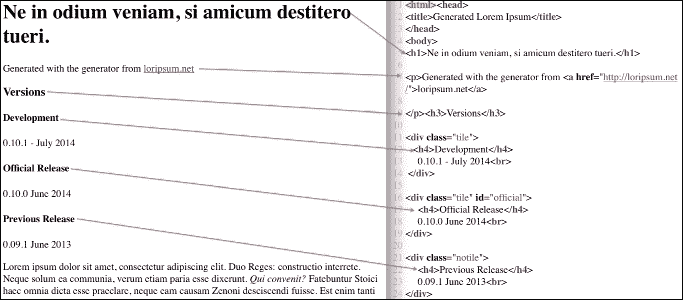
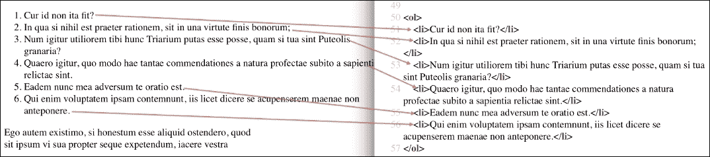

# 五、检索、处理和存储数据

数据随处可见，有各种形状和形式。我们可以通过网络、电子邮件和文件传输协议获得它，或者我们可以自己在实验室实验或市场调查中创建它。全面概述如何获取各种格式的数据将需要比我们现有的更多的页面。有时，我们需要在分析数据之前或完成分析之后存储数据。我们将在本章中讨论存储数据。[第 8 章](08.html "Chapter 8.  Working with Databases")、*使用数据库*，给出了关于各种数据库(关系数据库和 NoSQL 数据库)和相关应用编程接口的信息。以下是我们将在本章中讨论的主题列表:

*   用 NumPy 和 Pandas 编写 CSV 文件
*   二进制`.npy`和泡菜格式
*   用 PyTables 存储数据
*   向 HDF5 商店读写 Pandas 数据帧
*   和 Pandas 一起读写 Excel
*   使用 REST 网络服务和 JSON
*   和 Pandas 一起读写 JSON
*   解析 RSS 和 Atom 提要
*   用美丽的汤解析 HTML

# 用 NumPy 和 Pandas 编写 CSV 文件

在前面的章节中，我们学习了阅读 CSV 文件。编写 CSV 文件同样简单，但是使用不同的功能和方法。让我们首先生成一些以 CSV 格式存储的数据。在下面的代码片段中植入随机生成器后，生成一个 3x4 NumPy 数组。

将其中一个数组值设置为`nan`:

```py
np.random.seed(42) 

a = np.random.randn(3, 4) 
a[2][2] = np.nan 
print(a) 

```

该代码将按如下方式打印数组:

```py
[[ 0.49671415 -0.1382643   0.64768854  1.52302986]
 [-0.23415337 -0.23413696  1.57921282  0.76743473]
 [-0.46947439  0.54256004         nan -0.46572975]]

```

NumPy `savetxt()`函数是 NumPy `loadtxt()`函数的对应物，可以以分隔文件格式保存数组，例如 CSV。使用以下函数调用保存我们创建的数组:

```py
np.savetxt('np.csv', a, fmt='%.2f', delimiter=',', header=" #1,  #2,  #3,  #4") 

```

在前面的函数调用中，我们指定了要保存的文件名、数组、可选格式、分隔符(默认为空格)和可选标题。

### 注

格式参数记录在[http://docs . python . org/2/library/string . html # format-specification-mini-language](http://docs.python.org/2/library/string.html#format-specification-mini-language)。

查看我们使用`cat`命令(`cat np.csv`)或编辑器(如 Windows 中的记事本)创建的`np.csv`文件。文件的内容应显示如下:

```py
    #  #1,  #2,  #3,  #4
    0.50,-0.14,0.65,1.52
    -0.23,-0.23,1.58,0.77
    -0.47,0.54,nan,-0.47

```

从随机值数组创建 Pandas 数据帧:

```py
df = pd.DataFrame(a) 
print(df) 

```

如您所见，Pandas 会自动为我们的数据提供列名:

```py
              0         1         2         3
    0  0.496714 -0.138264  0.647689  1.523030
    1 -0.234153 -0.234137  1.579213  0.767435
    2 -0.469474  0.542560NaN -0.465730

```

使用 Pandas`to_csv()`方法将数据帧写入 CSV 文件，如下所示:

```py
df.to_csv('pd.csv', float_format='%.2f', na_rep="NAN!") 

```

我们给了这个方法文件名，一个类似于 NumPy `savetxt()`函数的格式参数的可选格式字符串，以及一个表示`NaN`的可选字符串。查看`pd.csv`文件可以看到以下内容:

```py
    ,0,1,2,3
    0,0.50,-0.14,0.65,1.52
    1,-0.23,-0.23,1.58,0.77
    2,-0.47,0.54,NAN!,-0.47

```

看看本书代码包中`ch-05.ipynb`文件中的代码:

```py
import numpy as np 
import pandas as pd 

np.random.seed(42) 

a = np.random.randn(3, 4) 
a[2][2] = np.nan 
print(a) 
np.savetxt('np.csv', a, fmt='%.2f', delimiter=',', header=" #1,  #2,  #3,  #4") 
df = pd.DataFrame(a) 
print(df) 
df.to_csv('pd.csv', float_format='%.2f', na_rep="NAN!") 

```

# 二进制。npy 和泡菜格式

大多数情况下，以 CSV 格式保存数据是可以的。交换 CSV 文件很容易，因为大多数编程语言和应用程序都可以处理这种格式。但是，效率不是很高；CSV 和其他明文格式占用大量空间。已经发明了许多提供高级压缩的文件格式，例如`.zip`、`.bzip`和`.gzip`。

以下是本次存储对比练习的完整代码，也可以在本书的代码包`ch-05.ipynb`文件中找到:

```py
import numpy as np 
import pandas as pd 
from tempfile import NamedTemporaryFile 
from os.path import getsize 

np.random.seed(42) 
a = np.random.randn(365, 4) 

tmpf = NamedTemporaryFile() 
np.savetxt(tmpf, a, delimiter=',') 
print("Size CSV file", getsize(tmpf.name)) 

tmpf = NamedTemporaryFile() 
np.save(tmpf, a) 
tmpf.seek(0) 
loaded = np.load(tmpf) 
print("Shape", loaded.shape) 
print("Size .npy file", getsize(tmpf.name)) 

df = pd.DataFrame(a) 
df.to_pickle(tmpf.name) 
print("Size pickled dataframe", getsize(tmpf.name)) 
print("DF from pickle\n", pd.read_pickle(tmpf.name)) 

```

NumPy 提供了一种特定于 NumPy 的格式`.npy`，可以用来存储 NumPy 数组。在演示这种格式之前，我们将生成一个充满随机值的 365x4 NumPy 数组。该数组模拟一年中四个变量的每日测量值(例如，带有测量温度、湿度、降水和大气压力的传感器的天气数据站)。我们将使用标准的 Python `NamedTemporaryFile`来存储数据。临时文件应该被自动删除。

将数组存储在 CSV 文件中，并按如下方式检查其大小:

```py
tmpf = NamedTemporaryFile() 
np.savetxt(tmpf, a, delimiter=',') 
print("Size CSV file", getsize(tmpf.name)) 

```

CSV 文件大小打印如下:

```py
 Size CSV file 36693

```

以 NumPy `.npy`格式保存数组，加载数组，检查其形状和`.npy`文件的大小:

```py
tmpf = NamedTemporaryFile() 
np.save(tmpf, a) 
tmpf.seek(0) 
loaded = np.load(tmpf) 
print("Shape", loaded.shape) 
print("Size .npy file", getsize(tmpf.name)) 

```

需要调用`seek()`方法来模拟关闭和重新打开临时文件。形状应以文件大小打印:

```py
Shape (365, 4)
Size .npy file 11760

```

`.npy`文件大致比 CSV 文件小三倍，果然不出所料。Python 允许我们存储实际上任意复杂的数据结构。我们也可以将 Pandas 数据框或系列存储为泡菜。

### 注

Python pickle 是一种用于将 Python 对象存储到磁盘或其他介质的格式。这叫**腌制**。我们可以从存储中重新创建 Python 对象。这个反向过程叫做**拆线**(参考[http://docs.python.org/2/library/pickle.html](http://docs.python.org/2/library/pickle.html))。腌制已经发展了多年，因此，各种腌制协议存在。不是所有 Python 对象都可以腌制；然而，也有替代的实现，比如 **dill、**，允许腌制更多类型的 Python 对象。如果可能，使用 cPickle(包含在标准 Python 发行版中)，因为它是用 C 实现的，因此速度更快。

从生成的 NumPy 数组中创建一个 DataFrame，用`to_pickle()`方法将其写入 pickle，用`read_pickle()`函数从 pickle 中检索:

```py
df = pd.DataFrame(a) 
df.to_pickle(tmpf.name) 
print("Size pickled dataframe", getsize(tmpf.name)) 
print("DF from pickle\n", pd.read_pickle(tmpf.name)) 

```

数据框的泡菜略大于`.npy`文件，如以下打印输出所示:

```py
Size pickled dataframe 12244
DF from pickle
           0         1         2         3
0   0.496714 -0.138264  0.647689  1.523030
[TRUNCATED]
59 -2.025143  0.186454 -0.661786  0.852433
         ...       ...       ...       ...

[365 rows x 4 columns]

```

# 用 PyTables 存储数据

**分层数据格式** ( **HDF** )是存储大数值数据的规范和技术。HDF 是在超级计算社区创建的，现在是一个开放标准。HDF 的最新版本是 **HDF5** ，也是我们将要使用的版本。HDF5 以组和数据集的形式组织数据。数据集是多维齐次数组。组可以包含其他组或数据集。组就像分层文件系统中的目录。

两个主要的 HDF5 Python 库如下:

*   h5y
*   iptables(iptables)

在这个例子中，我们将使用 PyTables。PyTables 有许多依赖项:

*   我们在[第 1 章](01.html "Chapter 1. Getting Started with Python Libraries")、*Python 库*中安装的 NumPy 包
*   numexpr 包声称它计算多运算符数组表达式的速度比 NumPy 快很多倍
*   HDF5

### 注

HDF5 的并行版本也需要 MPI。可以通过从[http://www.hdfgroup.org/HDF5/release/obtain5.html](http://www.hdfgroup.org/HDF5/release/obtain5.html)获得一个发行版并运行以下命令(可能需要几分钟)来安装 HDF5:

```py
$ gunzip < hdf5-X.Y.Z.tar.gz | tar xf -
$ cd hdf5-X.Y.Z
$ make
$ make install

```

你最喜欢的包管理器很可能有一个 HDF5 的发行版。选择最新的稳定版本。在写这本书的时候，安装的版本是 1.8.12。

第二个依赖项 numexpr 声称能够比 NumPy 更快地执行某些操作。它支持多线程，并且有自己的用 c 实现的虚拟机，在 PyPi 上有 Numexpr 和 PyTables，所以我们可以用`pip`安装这些，如下所示:

```py
$ pip3 install numexpr tables

```

同样，我们将生成随机值并用这些随机值填充 NumPy 数组。创建一个 HDF5 文件，并用以下代码将 NumPy 数组附加到根节点:

```py
filename = "pytable_demo.h5" 
h5file = tables.openFile(filename, mode='w', ) 
root = h5file.root 
h5file.createArray(root, "array", a) 
h5file.close() 

```

读取 HDF5 文件并打印其文件大小:

```py
h5file = tables.openFile(filename, "r") 
print(getsize(filename)) 

```

我们得到的文件大小值是`13824`。一旦我们读取了一个 HDF5 文件并获得了它的句柄，我们通常会遍历它来找到我们需要的数据。由于我们只有一个数据集，遍历非常简单。调用`iterNodes()`和`read()`方法取回 NumPy 数组:

```py
for node in h5file.iterNodes(h5file.root): 
   b = node.read() 
   print(type(b), b.shape) 

```

数据集的类型和形状符合我们的预期:

```py
    <class 'numpy.ndarray'> (365, 4)

```

以下代码可以在本书代码包的`ch-05.ipynb`文件中找到:

```py
import numpy as np 
import tables 
from os.path import getsize 

np.random.seed(42) 
a = np.random.randn(365, 4) 

filename = "pytable_demo.h5" 
h5file = tables.open_file( filename, mode='w', ) 
root = h5file.root 
h5file.create_array(root, "array", a) 
h5file.close() 

h5file = tables.open_file(filename, "r") 
print(getsize(filename)) 

for node in h5file.root: 
   b = node.read() 
   print(type(b), b.shape) 
 h5file.close() 

```

# 读写 Pandas 数据帧到 HDF5 商店

`HDFStore`类是负责处理 HDF5 数据的 Pandas 抽象。使用随机数据，我们将演示这个功能。

给`HDFStore`构造函数一个演示文件的路径，并创建一个存储:

```py
filename = "pytable_df_demo.h5"  
store = pd.io.pytables.HDFStore(filename) 
print(store) 

```

前面的代码片段将打印存储及其内容的文件路径，该路径目前为空:

```py
    <class 'pandas.io.pytables.HDFStore'>
    File path: pytable_df_demo.h5
    Empty

```

`HDFStore`有一个类似字典的接口，这意味着我们可以存储值，比如 Pandas 数据帧和相应的查找键。将包含随机数据的数据帧存储在`HDFStore`中，如下所示:

```py
store['df'] = df 
print(store) 

```

现在，该存储包含数据，如以下输出所示:

```py
    <class 'pandas.io.pytables.HDFStore'>
    File path: pytable_df_demo.h5
                frame        (shape->[365,4])

```

我们可以通过三种方式访问数据框:使用`get()`方法、类似字典的查找或点状访问。让我们试试这个:

```py
print("Get", store.get('df').shape) 
print("Lookup", store['df'].shape) 
print("Dotted", store.df.shape) 

```

数据框的形状对于所有三种访问方法都是相同的:

```py
Get (365, 4)
Lookup (365, 4)
Dotted (365, 4)

```

我们可以通过调用`remove()`方法或使用`del`运算符来删除商店中的商品。显然，我们只能移除一个项目一次。从存储中删除数据帧:

```py
del store['df'] 
print("After del\n", store) 

```

商店现在又空了:

```py
After del
<class 'pandas.io.pytables.HDFStore'>
File path: pytable_df_demo.h5
Empty

```

`is_open`属性表示店铺是否开门。商店可以用`close()`方法关闭。关闭商店并检查其是否已关闭:

```py
print("Before close", store.is_open) 
store.close() 
print("After close", store.is_open) 

```

一旦关闭，商店将不再营业，如下所述:

```py
Before close True
After close False

```

Pandas 还提供了一个数据框架`to_hdf()`方法和一个顶层`read_hdf()`函数来读写 HDF 数据。调用`to_hdf()`方法并读取数据:

```py
df.to_hdf(tmpf.name, 'data', format='table') 
print(pd.read_hdf(tmpf.name, 'data', where=['index>363'])) 

```

读写应用编程接口的参数是文件路径、存储中组的标识符和可选的格式字符串。格式可以是固定的，也可以是表格的。固定格式更快，但不能追加或搜索。表格格式对应于 PyTables `Table`结构，允许搜索和选择。我们在数据框上获得以下查询值:

```py
                0         1         2         3
    364  0.753342  0.381158  1.289753  0.673181
    [1 rows x 4 columns]

```

本书代码包中的`ch-05.ipynb`文件包含以下代码:

```py
import numpy as np 
import pandas as pd 

np.random.seed(42) 
a = np.random.randn(365, 4) 

filename = "pytable_df_demo.h5" 
store = pd.io.pytables.HDFStore(filename) 
print(store) 

df = pd.DataFrame(a) 
store['df'] = df 
print(store) 

print("Get", store.get('df').shape) 
print("Lookup", store['df'].shape) 
print( "Dotted", store.df.shape) 

del store['df'] 
print("After del\n", store) 

print("Before close", store.is_open) 
store.close() 
print("After close", store.is_open) 

df.to_hdf('test.h5', 'data', format='table') 
print(pd.read_hdf('test.h5', 'data', where=['index>363']))  

```

# 和 Pandas 一起读写 Excel

Excel 文件包含大量重要数据。当然，我们可以以其他更便携的格式导出这些数据，例如 CSV。但是用 Python 读写 Excel 文件更方便。正如在 Python 世界中常见的那样，目前有不止一个项目致力于提供 Excel 输入/输出功能的目标。我们将需要安装的模块，以获得 Excel 输入/输出工作与 Pandas 有点模糊的文件。原因是 Pandas 所依赖的项目是独立的，发展迅速。Pandas 包对它接受为 Excel 文件的文件很挑剔。这些文件必须有`.xls`或`.xlsx`后缀，否则，我们会得到以下错误:

```py
ValueError: No engine for filetype: '' 
```

这很容易解决。例如，如果我们创建一个临时文件，我们只需给它一个适当的后缀。如果您没有安装任何东西，您将收到以下错误消息:

```py
ImportError: No module named openpyxl.workbook

```

以下命令通过安装`openpyxl`消除错误:

```py
$ pip3 install openpyxl xlsxwriter xlrd

```

`openpyxl`模块是 PHPExcel 的一个端口，支持`.xlsx`文件的读写。

### 型式

如果由于某种原因`pip install`方法对您不起作用，您可以在[http://pythonhosted.org/openpyxl/](http://pythonhosted.org/openpyxl/)找到替代安装说明。

读取`.xlsx`文件也需要`xlsxwriter`模块。`xlrd`模块能够从`.xls`和`.xlsx`文件中提取数据。

让我们生成随机值来填充 Pandas 数据框，从数据框创建一个 Excel 文件，从 Excel 文件重新创建数据框，并对其应用`mean()`方法。对于 Excel 文件的工作表，我们可以指定从零开始的索引或名称。

参考书籍代码包中的`ch-05.ipynb`文件，其中将包含以下代码:

```py
import numpy as np 
import pandas as pd 

np.random.seed(42) 
a = np.random.randn(365, 4) 

filename="excel_demo.xlsx" 
df = pd.DataFrame(a) 
print(filename) 
df.to_excel(filename, sheet_name='Random Data') 
print("Means\n", pd.read_excel(filename, 'Random Data').mean())) 

```

使用`to_excel()`方法创建一个 Excel 文件:

```py
df.to_excel(tmpf.name, sheet_name='Random Data') 

```

使用顶级`read_excel()`功能重新创建数据框:

```py
print("Means\n", pd.read_excel(tmpf.name, 'Random Data').mean()) 

```

打印方式如下:

```py
/var/folders/k_/xx_xz6xj0hx627654s3vld440000gn/T/tmpeBEfnO.xlsx
Means
0    0.037860
1    0.024483
2    0.059836
3    0.058417
dtype: float64

```

# 使用 REST web 服务和 JSON

**具象** **状态** **转移** ( **REST** ) web 服务使用 REST 架构风格(更多信息请参考[http://en . Wikipedia . org/wiki/具象 _state_transfer](http://en.wikipedia.org/wiki/Representational_state_transfer) )。在 HTTP(S)协议的通常上下文中，我们有 **GET** 、 **POST** 、 **PUT** 和 **DELETE** 方法。这些方法可以与数据上的常见操作保持一致，以创建、请求、更新或删除数据项。

在 RESTful API 中，数据项由 URIs 标识，如`http://example.com/resources`或`http://example.com/resources/item42`。REST 不是一个官方标准，但它如此广泛，我们需要了解它。Web 服务经常使用 **JavaScript 对象符号** ( **JSON** )(更多信息参考[http://en.wikipedia.org/wiki/JSON](http://en.wikipedia.org/wiki/JSON))来交换数据。在这种格式中，数据是使用 JavaScript 符号编写的。该符号类似于 Python 列表和字典的语法。在 JSON 中，我们可以定义由列表和字典的组合组成的任意复杂的数据。为了说明这一点，我们将使用一个非常简单的 JSON 字符串，它对应于一个字典，给出特定 IP 地址的地理信息:

```py
{"country":"Netherlands","dma_code":"0","timezone":"Europe\/Amsterdam","area_code":"0","ip":"46.19.37.108","asn":"AS196752","continent_code":"EU","isp":"Tilaa V.O.F.","longitude":5.75, "latitude":52.5,"country_code":"NL","country_code3":"NLD"}

```

以下是来自`ch-05.ipynb`文件的代码:

```py
import json 

json_str = '{"country":"Netherlands","dma_code":"0","timezone":"Europe\/Amsterdam","area_code":"0","ip":"46.19.37.108","asn":"AS196752","continent_code":"EU","isp":"Tilaa V.O.F.","longitude":5.75,"latitude":52.5,"country_code":"NL","country_code3":"NLD"}' 

data = json.loads(json_str) 
print("Country", data["country"]) 
data["country"] = "Brazil" 
print(json.dumps(data)) 

```

Python 有一个标准的 JSON API，非常容易使用。使用`loads()`函数解析 JSON 字符串:

```py
data = json.loads(json_str) 

```

使用以下代码访问`country`值:

```py
print "Country", data["country"] 

```

前一行应打印以下内容:

```py
Country Netherlands

```

覆盖`country`值，并根据新的 JSON 数据创建一个字符串:

```py
data["country"] = "Brazil" 
printjson.dumps(data) 

```

结果是带有新`country`值的 JSON。这种顺序不会像字典中通常出现的那样被保留:

```py
{"longitude": 5.75, "ip": "46.19.37.108", "isp": "Tilaa V.O.F.", "area_code": "0", "dma_code": "0", "country_code3": "NLD", "continent_code": "EU", "country_code": "NL", "country": "Brazil", "latitude": 52.5, "timezone": "Europe/Amsterdam", "asn": "AS196752"}

```

# 与 Pandas 一起读写 JSON

我们可以很容易地从前面例子中的 JSON 字符串创建一个 Pandas`Series`。Pandas`read_json()`功能可以创建 Pandas 系列或 Pandas 数据框。

以下示例代码可以在本书的代码包`ch-05.ipynb`中找到:

```py
import pandas as pd 

json_str = '{"country":"Netherlands","dma_code":"0","timezone":"Europe\/Amsterdam","area_code":"0","ip":"46.19.37.108","asn":"AS196752","continent_code":"EU","isp":"Tilaa V.O.F.","longitude":5.75,"latitude":52.5,"country_code":"NL","country_code3":"NLD"}' 

data = pd.read_json(json_str, typ='series') 
print("Series\n", data) 

data["country"] = "Brazil" 
print("New Series\n", data.to_json()) 

```

我们可以指定一个 JSON 字符串或者 JSON 文件的路径。调用`read_json()`函数，从前面例子中的 JSON 字符串创建 Pandas`Series`:

```py
data = pd.read_json(json_str, typ='series') 
print("Series\n", data) 

```

在生成的`Series`中，按键按字母顺序排列:

```py
    Series
    area_code                        0
    asn                       AS196752
    continent_code                  EU
    country                Netherlands
    country_code                    NL
    country_code3                  NLD
    dma_code                         0
    ip                    46.19.37.108
    ispTilaa V.O.F.
    latitude                      52.5
    longitude                     5.75
    timezone          Europe/Amsterdam
    dtype: object

```

再次更改`country`值，并使用`to_json()`方法将 Pandas`Series`转换为 JSON 字符串:

```py
data["country"] = "Brazil" 
print("New Series\n", data.to_json()) 

```

在新的 JSON 字符串中，键顺序被保留，但是我们还有一个不同的`country`值:

```py
 New Series
    {"area_code":"0","asn":"AS196752","continent_code":"EU","country":"Brazil","country_code":"NL","country_code3":"NLD","dma_code":"0","ip":"46.19.37.108","isp":"Tilaa V.O.F.","latitude":52.5,"longitude":5.75,"timezone":"Europe\/Amsterdam"}

```

# 解析 RSS 和 Atom 提要

**真正简单的联合** ( **RSS** )和 Atom feeds(参考[http://en.wikipedia.org/wiki/RSS](http://en.wikipedia.org/wiki/RSS))经常用于博客和新闻。这些类型的订阅源遵循发布/订阅模式。例如，帕克特出版公司有一个文章和书籍公告的 RSS 源。我们可以订阅订阅源以获得及时的更新。Python `feedparser`模块允许我们轻松解析 RSS 和 Atom 提要，而无需处理很多技术细节。`feedparser`模块可以安装`pip`如下:

```py
$ pip3 install feedparser

```

解析完一个 RSS 文件后，我们可以使用*虚线*符号访问底层数据。解析打包发布 RSS 源并打印条目数:

```py
import feedparser as fp 

rss = fp.parse("http://www.packtpub.com/rss.xml") 

print("# Entries", len(rss.entries)) 

```

打印条目的数量(数量可能因每次程序运行而异):

```py
# Entries 10

```

如果条目包含带有以下代码的单词`Python`，则打印条目标题和摘要:

```py
for i, entry in enumerate(rss.entries): 
   if "Python" in entry.summary: 
      print(i, entry.title) 
      print(entry.summary) 

```

在此特定运行中，打印了以下内容(如果您自己尝试，则可能会得到其他内容，如果过滤器限制太多，则可能什么也没有):

```py
42 Create interactive plots with matplotlib using Pack't new book and eBook
About the author: Alexandre Devert is a scientist. He is an enthusiastic Python coder as well and never gets enough of it! He used to teach data mining, software engineering, and research in numerical optimization.
Matplotlib is part of the Scientific Python modules collection. It provides a large library of customizable plots and a comprehensive set of backends. It tries to make easy things easy and make hard things possible. It can help users generate plots, add dimensions to plots, and also make plots interactive with just a few lines of code. Also, matplotlib integrates well with all common GUI modules.

```

以下代码可以在本书代码包的`ch-05.ipynb`文件中找到:

```py
import feedparser as fp 

rss = fp.parse("http://www.packtpub.com/rss.xml") 

print("# Entries", len(rss.entries)) 

for i, entry in enumerate(rss.entries): 
   if "Java" in entry.summary: 
      print(i, entry.title) 
      print(entry.summary) 

```

# 用靓汤解析 HTML

**超文本标记语言** ( **HTML** )是用来创建网页的基础技术。HTML 是由 HTML 元素组成的，这些元素由所谓的标记组成，这些标记封装在倾斜的括号中(例如，`<html>`)。通常，标签与一个开始和结束标签成对出现在一个分层的树状结构中。伯纳斯-李于 1991 年首次发布了一个与 HTML 相关的规范草案。最初，只有 18 个 HTML 元素。正式的 HTML 定义由**互联网工程任务组** ( **IETF** )于 1993 年发布。IETF 在 1995 年完成了 HTML 2.0 标准。大约在 2013 年，指定了最新的 HTML 版本 HTML5。与 XHTML 和 XML 相比，HTML 并不是一个非常严格的标准。

现代浏览器容忍大量违反标准的行为，使得网页成为一种非结构化数据。例如，我们可以将 HTML 视为一个大字符串，并用正则表达式对其执行字符串操作。这种方法只适用于简单的项目。

我曾在专业的环境中从事过网页抓取项目，所以从个人经验来看，我可以告诉你，我们需要更复杂的方法。在现实场景中，可能需要以编程方式提交 HTML 表单，例如，登录、浏览页面和健壮地管理 cookies。从网络上抓取数据的问题是，如果我们不能完全控制我们正在抓取的网页，我们可能不得不经常更改代码。网站所有者也可能主动阻止程序访问，甚至可能是非法的。出于这些原因，您应该总是先尝试使用其他替代方法，例如 REST API。

如果您必须通过抓取来检索数据，建议您使用 Python 美丽汤应用编程接口。这个应用编程接口可以从 HTML 和 XML 文件中提取数据。新项目应该用美人汤 4，因为美人汤 3 已经不开发了。我们可以用以下命令安装美人汤 4(类似`easy_install`):

```py
$ pip3 install beautifulsoup4 lxml

```

如果这不起作用，您可以简单地将美丽的汤和您自己的代码打包在一起。为了演示解析 HTML，我用来自 http://loripsum.net/ T2 的生成器生成了本书代码包中的 T0 文件。然后，我稍微编辑了一下文件。该文件的内容是西塞罗用拉丁语创作的公元前一世纪的文本，这是创建网站模型的传统方式。请参考以下网页顶部的截图:



在这个例子中，我们将使用美丽的汤 4 和标准的 Python 正则表达式库。

使用以下行导入这些库:

```py
from bs4 import BeautifulSoup 
import re 

```

打开 HTML 文件，创建一个`BeautifulSoup`对象，如下行:

```py
soup = BeautifulSoup(open('loremIpsum.html')) 

```

使用虚线符号，我们可以访问第一个`<div>`元素。`<div>` HTML 元素用于组织元素和设置元素的样式。访问第一个`div`元素，如下所示:

```py
print("First div\n", soup.div) 

```

结果输出是一个 HTML 片段，带有第一个`<div>`标签和它包含的所有标签:

```py
    First div
    <div class="tile">
    <h4>Development</h4>
         0.10.1 - July 2014<br/>
    </div>

```

### 注

这个特殊的`div`元素有一个值为`tile`的类属性。类属性属于应用于这个`div`元素的 CSS 样式。**层叠样式表** ( **CSS** )是一种用于设计网页元素样式的语言。CSS 是一个广泛使用的规范，它通过 CSS 类来处理网页的外观和感觉。CSS 通过定义颜色、字体和元素布局来帮助分离内容和表示。这种分离导致更简单和更干净的设计。

标签的属性可以以类似字典的方式访问。如下打印`<div>`标签的类属性值:

```py
print("First div class", soup.div['class']) 
First div class ['tile'] 

```

虚线符号允许我们访问任意深度的元素。例如，打印第一个`<dfn>`标签的文本如下:

```py
print("First dfn text", soup.dl.dt.dfn.text) 

```

打印一行拉丁文文本(`Solisten, I pray`):

```py
    First dfn text Quareattende, quaeso

```

有时候，我们只对 HTML 文档的超链接感兴趣。例如，我们可能只想知道哪个文档链接到哪个其他文档。在 HTML 中，链接用`<a>`标记指定。该标签的`href`属性保存链接指向的网址。`BeautifulSoup`班有个很好用的`find_all()`方法，我们会经常用到。使用`find_all()`方法定位所有超链接:

```py
for link in soup.find_all('a'): 
      print("Link text", link.string, "URL", link.get('href')) 

```

文档中有三个链接具有相同的网址，但具有三种不同的文本:

```py
Link text loripsum.net URL http://loripsum.net/ 
Link text Potera tautem inpune; URL http://loripsum.net/ 
Link text Is es profecto tu. URL http://loripsum.net/ 

```

我们可以省略`find_all()`方法作为捷径。访问所有`<div>`标签的内容，如下所示:

```py
for i, div in enumerate(soup('div')): 
   print(i, div.contents) 

```

`contents`属性保存一个包含 HTML 元素的列表:

```py
    0 [u'\n', <h4>Development</h4>, u'\n     0.10.1 - July 2014', <br/>, u'\n']
    1 [u'\n', <h4>Official Release</h4>, u'\n     0.10.0 June 2014', <br/>, u'\n']
    2 [u'\n', <h4>Previous Release</h4>, u'\n     0.09.1 June 2013', <br/>, u'\n']

```

带有唯一标识的标签很容易找到。选择`official`标识的`<div>`元素，打印第三个元素:

```py
official_div = soup.find_all("div", id="official") 
print("Official Version", official_div[0].contents[2].strip()) 

```

许多网页是根据访问者的输入或外部数据动态创建的。网上购物网站的大部分内容都是这样提供的。如果我们在处理一个动态网站，我们必须记住，任何标签属性值都可能在一瞬间发生变化。通常，在大型网站中，会自动生成标识，从而产生长的字母数字字符串。最好不要寻找完全匹配，而是使用正则表达式。稍后我们将看到一个基于模式的匹配示例。前面的代码片段打印了一个版本号和月份，您可以在软件产品的网站上找到:

```py
    Official Version 0.10.0 June 2014

```

众所周知，`class`是 Python 的一个关键词。要查询标签中的`class`属性，我们将其与`class_`进行匹配。获取已定义类别属性的`<div>`标签数量:

```py
print("# elements with class",len(soup.find_all(class_=True))) 

```

正如预期的那样，我们发现了三个标签:

```py
    # elements with class 3

```

用类别`"tile"`找到`<div>`标签的数量:

```py
tile_class = soup.find_all("div", class_="tile") 
print("# Tile classes", len(tile_class)) 

```

有两个`<div>`类标签`tile`，一个`<div>`类标签`notile`:

```py
  # Tile classes 2

```

定义一个匹配所有`<div>`标签的正则表达式:

```py
print("# Divs with class containing tile", len(soup.find_all("div", class_=re.compile("tile")))) 

```

再次发现三种情况:

```py
   # Divs with class containing tile 3

```

在 CSS 中，我们可以定义模式来匹配元素。这些模式被称为 **CSS 选择器**，并记录在[http://www.w3.org/TR/selectors/](http://www.w3.org/TR/selectors/)中。我们也可以用 CSS 选择器从`BeautifulSoup`类中选择元素。使用`select()`方法将`<div>`元素与`notile`类匹配:

```py
print("Using CSS selector\n", soup.select('div.notile')) 

```

屏幕上会显示以下内容:

```py
Using CSS selector
[<div class="notile">
<h4>Previous Release</h4>
 0.09.1 June 2013<br/>
</div>]

```

一个 HTML 排序的列表看起来像一个编号的项目符号列表。有序列表由每个列表项的一个`<ol>`标签和几个`<li>`标签组成。`select()`方法的结果可以被切片为任何 Python 列表。请参考下面的订购列表截图:



选择有序列表中的前两个列表项:

```py
print("Selecting ordered list list items\n", soup.select("ol > li")[:2]) 

```

显示了以下两个列表项:

```py
Selecting ordered list list items
[<li>Cur id non ita fit?</li>, <li>In qua si nihil est praeter rationem, sit in una virtute finis bonorum;</li>]

```

在 CSS 选择器迷你语言中，我们从`1`开始计数。选择第二个列表项，如下所示:

```py
print("Second list item in ordered list", soup.select("ol>li:nth-of-type(2)")) 

```

第二个清单项可以翻译成英文*其中，如果没有什么违背理智的事情，就让他成为美好事物终结的力量于一身*:

```py
Second list item in ordered list [<li>In qua si nihil est praeter rationem, sit in una virtute finis bonorum;</li>]

```

如果我们在浏览器中查看网页，我们可能会决定检索与某个正则表达式匹配的文本节点。查找包含带有`text`属性的字符串`2014`的所有文本节点:

```py
print("Searching for text string", soup.find_all(text=re.compile("2014"))) 

```

这会打印以下文本节点:

```py
Searching for text string [u'\n     0.10.1 - July 2014', u'\n     0.10.0 June 2014']

```

这只是`BeautifulSoup`课能为我们做什么的一个简单概述。美丽汤也可以用来修改 HTML 或 XML 文档。它有实用工具来排除故障，漂亮的打印，并处理不同的字符集。代码请参考`ch-05.ipynb`:

```py
from bs4 import BeautifulSoup 
import re 

soup = BeautifulSoup(open('loremIpsum.html'),"lxml") 

print("First div\n", soup.div) 
print("First div class", soup.div['class']) 

print("First dfn text", soup.dl.dt.dfn.text) 

for link in soup.find_all('a'): 
   print("Link text", link.string, "URL", link.get('href')) 

# Omitting find_all 
for i, div in enumerate(soup('div')): 
   print(i, div.contents) 

#Div with id=official 
official_div = soup.find_all("div", id="official") 
print("Official Version", official_div[0].contents[2].strip()) 

print("# elements with class", len(soup.find_all(class_=True))) 

tile_class = soup.find_all("div", class_="tile") 
print("# Tile classes", len(tile_class)) 

print("# Divs with class containing tile", len(soup.find_all("div", class_=re.compile("tile")))) 

print("Using CSS selector\n", soup.select('div.notile')) 
print("Selecting ordered list list items\n", soup.select("ol > li")[:2]) 
print("Second list item in ordered list", soup.select("ol > li:nth-of-type(2)")) 

print("Searching for text string", soup.find_all(text=re.compile("2014"))) 

```

鼓励读者阅读*参考*部分提到的书籍，了解更多关于美丽汤功能的详细信息，例如搜索子节点的返回节点，获取返回节点的第 n 个父节点，获取返回节点的第 n 个同级节点，以及其他高级功能。

# 总结

在本章中，我们学习了以不同格式检索、处理和存储数据。这些是 CSV、NumPy `.npy`格式、Python pickle、JSON、RSS 和 HTML 格式。我们使用了 NumPy Pandas、JSON、feedparser 和美丽的汤库。

下一章[第六章](06.html "Chapter 6. Data Visualization")*数据可视化*，讲的是用 Python 可视化数据的重要话题。可视化是我们开始分析数据时经常做的事情。它有助于显示数据中变量之间的关系。通过可视化数据，我们还可以了解其统计特性。

# 参考

动词 （verb 的缩写）g .奈尔，*美丽汤入门，*帕克特出版，2014。