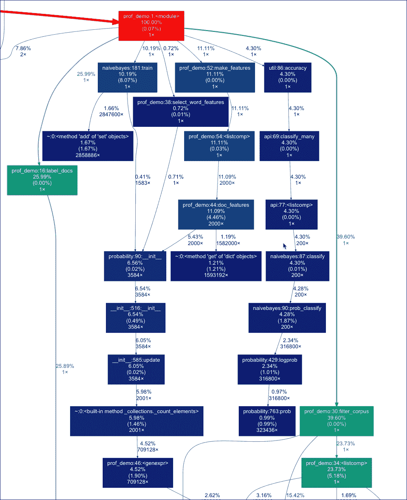
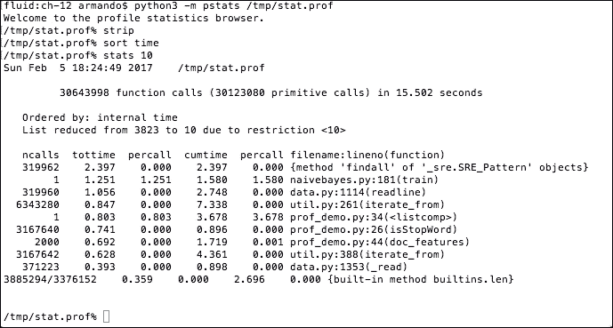
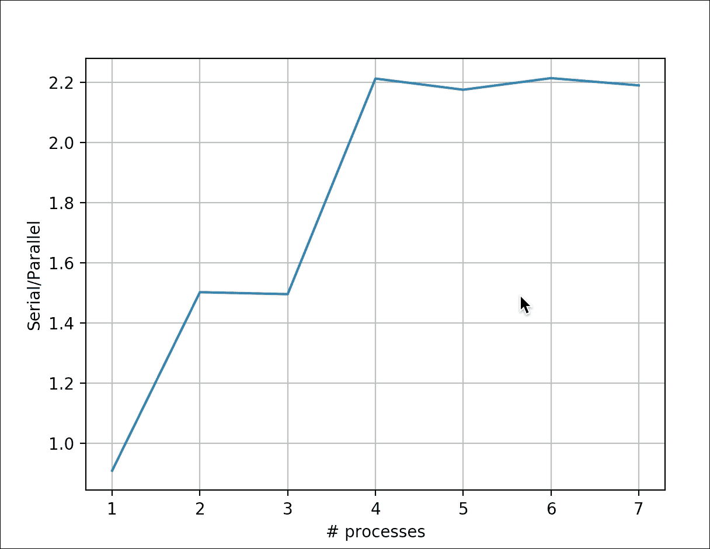
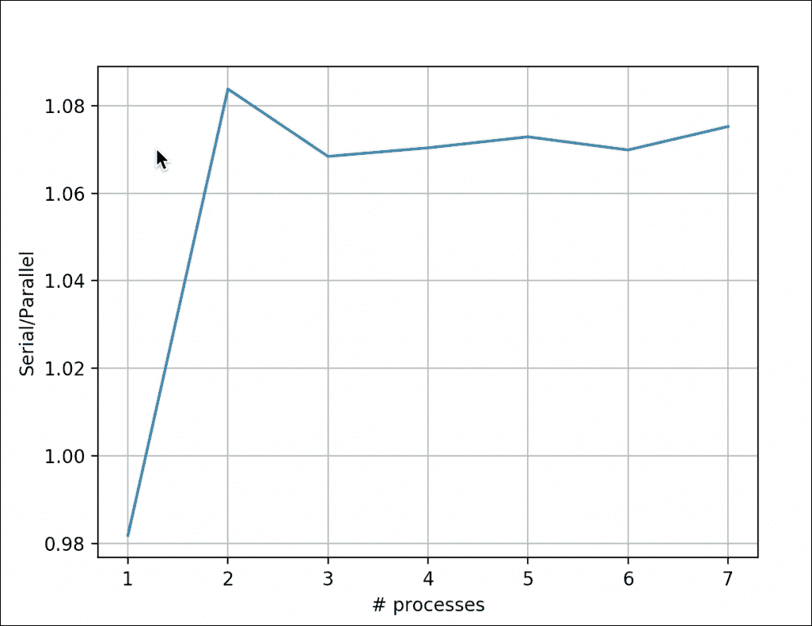

# 第十二章。性能调整、性能分析和并发性

|   | *“过早优化是万恶之源”* |   |
|   | - *唐纳德·克努特，著名的计算机科学家和数学家* |

对于现实世界的应用程序，性能与特性、健壮性、可维护性、可测试性和可用性一样重要。性能与应用程序的可伸缩性成正比。结束这本书而不考虑性能增强从来都不是一个选择。事实上，为了避免过早优化，我们将性能这个话题推迟到了本书的最后一章讨论。在本章中，我们将给出使用概要分析作为关键技术来提高性能的提示。我们还将讨论多核分布式系统的相关框架。我们将在本章中讨论以下主题:

*   分析代码
*   安装 Cython
*   调用 C 代码
*   使用多处理创建池进程
*   加速与 Joblib 令人尴尬的平行`for`循环
*   瓶颈函数与 NumPy 函数的比较
*   使用 Jug 执行 MapReduce
*   为 Python 安装 MPI
*   IPython 并行

# 分析代码

**分析**包括识别需要性能调整的代码部分，因为它们要么太慢，要么使用大量资源，如处理器功率或内存。我们将从[第 9 章](09.html "Chapter 9. Analyzing Textual Data and Social Media")、*分析文本数据和社交媒体*中概述情绪分析代码的修改版本。代码经过重构，符合多处理编程准则(您将在本章后面学习多处理)。我们还简化了停止词过滤。第三个变化是在代码中有更少的单词特征，这样减少不会影响准确性。最后一个变化影响最大。原始代码运行了大约 20 秒。新代码运行速度比这更快，并将作为本章的基准。一些更改与性能分析有关，将在本节后面解释。请参考本书代码包中的`prof_demo.py`文件:

```py
import random 
from nltk.corpus import movie_reviews 
from nltk.corpus import stopwords 
from nltk import FreqDist 
from nltk import NaiveBayesClassifier 
from nltk.classify import accuracy 

import builtins 

# Define profile function so the profile decorator  
#   does not return error when code is not profiled 
try: 
    profile = builtins.profile 
except AttributeError: 
    def profile(func):  
        return func 

@profile 
def label_docs(): 
    docs = [(list(movie_reviews.words(fid)), cat) 
            for cat in movie_reviews.categories() 
            for fid in movie_reviews.fileids(cat)] 
    random.seed(42) 
    random.shuffle(docs) 

    return docs 

@profile 
def isStopWord(word): 
    return word in sw or len(word) == 1 

@profile 
def filter_corpus(): 
    review_words = movie_reviews.words() 
    print("# Review Words", len(review_words)) 
    res = [w.lower() for w in review_words if not isStopWord(w.lower())] 
    print("# After filter", len(res)) 

    return res 

@profile 
def select_word_features(corpus): 
    words = FreqDist(corpus) 
    N = int(.02 * len(words.keys())) 
    return list(words.keys())[:N] 

@profile 
def doc_features(doc): 
    doc_words = FreqDist(w for w in doc if not isStopWord(w)) 
    features = {} 
    for word in word_features: 
        features['count (%s)' % word] = (doc_words.get(word, 0)) 
    return features 

@profile 
def make_features(docs): 
    return [(doc_features(d), c) for (d,c) in docs] 

@profile 
def split_data(sets): 
    return sets[200:], sets[:200] 

if __name__ == "__main__": 
    labeled_docs = label_docs() 

    sw = set(stopwords.words('english')) 
    filtered = filter_corpus() 
    word_features = select_word_features(filtered) 
    featuresets = make_features(labeled_docs) 
    train_set, test_set = split_data(featuresets) 
    classifier = NaiveBayesClassifier.train(train_set) 
    print("Accuracy", accuracy(classifier, test_set)) 
    print(classifier.show_most_informative_features())  
    print(classifier.show_most_informative_features()) 

```

当我们测量时间时，让尽可能少的进程运行是有帮助的。然而，我们不能确定后台没有运行，所以我们将使用`time`命令从三次测量中获取最低时间。这是一个可以在各种操作系统和 Cygwin 上使用的命令。按如下方式运行命令:

```py
$ time python3 prof_demo.py

```

我们得到一个`real`时间，这是我们用时钟测量的时间。`user`和`sys`时间测量程序使用的中央处理器时间。`sys`时间是在内核中度过的时间。在我的机器上，获得了以下以秒为单位的时间(括号内为最低值):

<colgroup><col> <col> <col> <col></colgroup> 
| **时间类型** | **运行 1** | **运行 2** | **运行 3** |
| `real` | Eleven point five two one | Ten point eight zero eight | (10.416) |
| `user` | Nine point seven five eight | Nine point eight two six | (9.444) |
| `sys` | Zero point nine six five | Zero point six four three | (0.620) |

使用标准 Python 分析器对代码进行分析，如下所示:

```py
$ python3 -m cProfile -o /tmp/stat.prof prof_demo.py

```

`-o`开关指定输出文件。我们可以用`gprof2dot` PyPi 包可视化分析器输出。按照以下步骤安装:

```py
$ pip3 install gprof2dot 

```

使用以下命令创建巴布亚新几内亚可视化:

```py
$ gprof2dot -f pstats /tmp/stat.prof |dot -Tpng -o /tmp/cprof.png

```

### 注

如果出现`dot: command not found`错误，说明没有安装 Graphviz。你可以从[http://www.graphviz.org/Download.php](http://www.graphviz.org/Download.php)下载 Graphviz。

完整图像太大，无法显示。这是它的一小部分:



按如下方式查询探查器输出:

```py
$ python3 -m pstats /tmp/stat.prof

```

使用此命令，我们进入配置文件统计浏览器。从输出中去除文件名，按时间排序，并显示前 10 次:

```py
/tmp/stat.prof% strip
/tmp/stat.prof% sort time
/tmp/stat.prof% stats 10

```

有关最终结果，请参考以下屏幕截图:



以下是标题的描述:

<colgroup><col> <col></colgroup> 
| **表头** | **描述** |
| `ncalls` | 这是电话号码。 |
| `tottime` | 这是在给定函数中花费的总时间(不包括调用子函数的时间)。 |
| `percall` | 这是`tottime`除以`ncalls`的商。 |
| `cumtime` | 这是在这个和所有子功能中花费的总时间(从调用到退出)。即使对于递归函数，这个数字也是准确的。 |
| `percall`(秒) | 这是`cumtime`除以原始调用的商。 |

使用以下命令退出配置文件浏览器:

```py
/tmp/stat.prof% quit

```

`line_profiler`是我们可以使用的另一个剖析器。这个分析器可以显示已经用`@profile`装饰器装饰的函数中每一行的统计数据。使用以下命令安装并运行此探查器:

```py
$ pip3 install line_profiler
$ kernprof -l -v prof_demo.py

```

完整的报告太长，无法在此复制；相反，下面是每个功能的摘要(有一些重叠):

```py
Function: label_docs at line 9 Total time: 6.19904 s
Function: isStopWord at line 19 Total time: 2.16542 s
File: prof_demo.py Function: filter_corpus at line 23
Function: select_word_features at line 32 Total time: 4.05266 s
Function: doc_features at line 38 Total time: 12.5919 s
Function: make_features at line 46 Total time: 14.566 s
Function: split_data at line 50 Total time: 3.6e-05 s

```

# 安装 Cython

**Cython** 编程语言充当了 Python 和 C/C++之间的粘合剂。有了 Cython 工具，我们可以从普通的 Python 代码生成 C 代码，然后可以编译成二进制，这更接近机器级别。`cytoolz`包包含由 Cythonizing 方便的 Python `toolz`包创建的实用程序。以下命令将安装`cython`和`cytoolz:`

```py
$ pip3 install cython cytoolz

```

就像在烹饪节目中一样，我们将在完成相关过程(推迟到下一部分)之前展示 Cythonizing 的结果。`timeit` Python 模块测量时间。我们将使用这个模块来测量不同的功能。定义以下函数，该函数接受短代码片段、函数调用以及代码作为参数运行的次数:

```py
def time(code, n): 
    times = min(timeit.Timer(code, setup=setup).repeat(3, n)) 

    return round(1000* np.array(times)/n, 3) 

```

接下来，我们预定义一个包含所有代码的大设置字符串。代码在本书代码包的`timeits.py`文件中(代码使用`cython_module`，在您的机器上构建):

```py
import timeit 
import numpy as np 

setup = ''' 
import nltk 
import cython_module as cm 
import collections 
from nltk.corpus import stopwords 
from nltk.corpus import movie_reviews 
from nltk.corpus import names 
import string 
import pandas as pd 
import cytoolz 

sw = set(stopwords.words('english')) 
punctuation = set(string.punctuation) 
all_names = set([name.lower() for name in names.words()]) 
txt = movie_reviews.words(movie_reviews.fileids()[0]) 

def isStopWord(w): 
    return w in sw or w in punctuation 

def isStopWord2(w): 
    return w in sw or w in punctuation or not w.isalpha() 

def isStopWord3(w): 
    return w in sw or len(w) == 1 or not w.isalpha() or w in all_names 

def isStopWord4(w): 
    return w in sw or len(w) == 1 

def freq_dict(words): 
    dd = collections.defaultdict(int) 

    for word in words: 
        dd[word] += 1 

    return dd 

def zero_init(): 
    features = {} 

    for word in set(txt): 
        features['count (%s)' % word] = (0) 

def zero_init2(): 
    features = {} 
    for word in set(txt): 
        features[word] = (0) 

keys = list(set(txt)) 

def zero_init3(): 
    features = dict.fromkeys(keys, 0) 

zero_dict = dict.fromkeys(keys, 0) 

def dict_copy(): 
    features = zero_dict.copy() 
''' 

def time(code, n): 
    times = min(timeit.Timer(code, setup=setup).repeat(3, n)) 

    return round(1000* np.array(times)/n, 3) 

if __name__ == '__main__': 
    print("Best of 3 times per loop in milliseconds") 
    n = 10 
    print("zero_init ", time("zero_init()", n)) 
    print("zero_init2", time("zero_init2()", n)) 
    print("zero_init3", time("zero_init3()", n)) 
    print("dict_copy ", time("dict_copy()", n)) 
    print("\n") 

    n = 10**2 
    print("isStopWord ", time('[w.lower() for w in txt if not isStopWord(w.lower())]', n)) 
    print("isStopWord2", time('[w.lower() for w in txt if not isStopWord2(w.lower())]', n)) 
    print("isStopWord3", time('[w.lower() for w in txt if not isStopWord3(w.lower())]', n)) 
    print("isStopWord4", time('[w.lower() for w in txt if not isStopWord4(w.lower())]', n)) 
    print("Cythonized isStopWord", time('[w.lower() for w in txt if not cm.isStopWord(w.lower())]', n)) 
    print("Cythonized filter_sw()", time('cm.filter_sw(txt)', n)) 
    print("\n") 
    print("FreqDist", time("nltk.FreqDist(txt)", n)) 
    print("Default dict", time('freq_dict(txt)', n)) 
    print("Counter", time('collections.Counter(txt)', n)) 
    print("Series", time('pd.Series(txt).value_counts()', n)) 
    print("Cytoolz", time('cytoolz.frequencies(txt)', n)) 
    print("Cythonized freq_dict", time('cm.freq_dict(txt)', n)) 

```

因此，我们有几个`isStopword()`函数版本，运行时间以毫秒为单位如下:

```py
isStopWord  0.843
isStopWord2 0.902
isStopWord3 0.963
isStopWord4 0.869
Cythonized isStopWord 0.924
Cythonized filter_sw() 0.887

```

作为比较，我们还有一个普通`pass`语句的运行时间。cytnonized`isStopWord()`基于`isStopWord3()`功能(最精细的滤镜)。如果我们看看`prof_demo.py`中的`doc_features()`功能，很明显我们不应该仔细检查每个单词的特征。相反，我们应该只是将文档中的一组单词与作为特征选择的单词相交。所有其他字数都可以安全地设置为零。事实上，最好我们将所有的值初始化为零一次，然后复制这个字典。对于相应的函数，我们得到以下执行时间:

```py
zero_init  0.61
zero_init2 0.555
zero_init3 0.017
dict_copy  0.011

```

另一个改进是使用 Python `defaultdict`类，而不是 NLTK `FreqDist`类。相关例程具有以下运行时间:

```py
FreqDist 2.206
Default dict 0.674
Counter 0.79
Series 7.006
Cytoolz 0.542
Cythonized freq_dict 0.616

```

正如我们所看到的，Cythonized 版本的速度一直在加快，尽管并没有加快多少。

# 调用 C 代码

我们可以从 Cython 调用 C 函数。C 字符串`strlen()`函数相当于 Python `len()`函数。通过导入以下文件，从 Cython `.pyx`文件调用该函数:

```py
from libc.string cimport strlen 

```

然后我们可以从`.pyx`文件中的其他地方调用`strlen()`。`.pyx`文件可以包含任何 Python 代码。请看一下本书代码包中的`cython_module.pyx`文件:

```py
from collections import defaultdict 
from nltk.corpus import stopwords 
from nltk.corpus import names 
from libc.string cimport strlen 

sw = set(stopwords.words('english')) 
all_names = set([name.lower() for name in names.words()]) 

def isStopWord(w): 
     py_byte_string = w.encode('UTF-8') 
     cdef char* c_string = py_byte_string 
     truth = (w in sw) or (w in all_names) or (not w.isalpha()) or (strlen(c_string) == 1) 
     return truth 

def filter_sw(words): 
    return [w.lower() for w in words if not isStopWord(w.lower())] 

def freq_dict(words): 
    dd = defaultdict(int) 

    for word in words: 
        dd[word] += 1 

    return dd 

```

要编译这段代码，我们需要一个包含以下内容的`setup.py`文件:

```py
from distutils.core import setup 
from Cython.Build import cythonize 

setup( 
    ext_modules = cythonize("cython_module.pyx") 
) 

```

使用以下命令编译代码:

```py
$ python3 setup.py build_ext --inplace

```

以下输出显示了`cython_module`扩展的构建:

```py
$python3 setup.py build_ext --inplace
running build_ext
building 'cython_module' extension
creating build
creating build/temp.macosx-10.12-x86_64-3.6
clang -Wno-unused-result -Wsign-compare -Wunreachable-code -fno-common -dynamic -DNDEBUG -g -fwrapv -O3 -Wall -Wstrict-prototypes -I/usr/local/include -I/usr/local/opt/openssl/include -I/usr/local/opt/sqlite/include -I/usr/local/Cellar/python3/3.6.0/Frameworks/Python.framework/Versions/3.6/include/python3.6m -c cython_module.c -o build/temp.macosx-10.12-x86_64-3.6/cython_module.o
clang -bundle -undefined dynamic_lookup build/temp.macosx-10.12-x86_64-3.6/cython_module.o -L/usr/local/lib -L/usr/local/opt/openssl/lib -L/usr/local/opt/sqlite/lib -o /Users/armando/gdrive/projects/bitbucket/pubs/2016-pda-e2-packt/chapters/ch-12/cython_module.cpython-36m-darwin.so

```

我们现在可以修改情绪分析程序来调用 Cython 函数。我们还将添加上一节中提到的改进。由于我们要反复使用一些函数，这些函数被提取到本书代码包的`core.py`文件中。查看本书代码包中的`cython_demo.py`文件(代码使用`cython_module`，在您的机器上构建):

```py
from nltk.corpus import movie_reviews 
from nltk import NaiveBayesClassifier 
from nltk.classify import accuracy  
import cython_module as cm 
import cytoolz 
from core import label_docs 
from core import filter_corpus 
from core import split_data 

def select_word_features(corpus): 
    words = cytoolz.frequencies(filtered) 
    sorted_words = sorted(words, key=words.get) 
    N = int(.02 * len(sorted_words)) 

    return sorted_words[-N:] 

def match(a, b): 
    return set(a.keys()).intersection(b) 

def doc_features(doc): 
    doc_words = cytoolz.frequencies(cm.filter_sw(doc)) 

    # initialize to 0 
    features = zero_features.copy() 

    word_matches = match(doc_words, word_features) 

    for word in word_matches: 
        features[word] = (doc_words[word]) 

    return features 

def make_features(docs): 
    return [(doc_features(d), c) for (d,c) in docs] 

if __name__ == "__main__": 
    labeled_docs = label_docs() 
    filtered = filter_corpus() 
    word_features = select_word_features(filtered) 
    zero_features = dict.fromkeys(word_features, 0) 
    featuresets = make_features(labeled_docs) 
    train_set, test_set = split_data(featuresets) 
    classifier = NaiveBayesClassifier.train(train_set) 
    print("Accuracy", accuracy(classifier, test_set)) 
    print(classifier.show_most_informative_features()) 

```

使用 time 命令执行代码，如下所示:

```py
$ time python3 cython_demo.py

```

下表总结了`time`命令的结果(括号内为最低值):

<colgroup><col> <col> <col> <col></colgroup> 
| **时间类型** | **运行 1** | **运行 2** | **运行 3** |
| `real` | (9.639) | Nine point eight one seven | Nine point nine one two |
| `user` | (9.604) | Nine point six six one | Nine point six eight three |
| `sys` | (0.404) | Zero point four two four | Zero point four five one |

与之前的代码执行相比，我们可以看到性能的提升。为了便于比较，下面的时序表是从上一节复制过来的:

<colgroup><col> <col> <col> <col></colgroup> 
| **时间类型** | **运行 1** | **运行 2** | **运行 3** |
| `real` | Eleven point five two one | Ten point eight zero eight | (10.416) |
| `user` | Nine point seven five eight | Nine point eight two six | (9.444) |
| `sys` | Zero point nine six five | Zero point six four three | (0.620) |

# 创建具有多处理的进程池

多处理是一个标准的 Python 模块，目标是具有多个处理器的机器。多处理通过创建多个进程围绕**全局解释器锁** ( **GIL** )工作。

### 注

GIL 锁 Python 字节码，因此只有一个线程可以访问它。

多处理支持进程池、队列和管道。进程池是可以并行执行功能的系统进程池。队列是通常用于存储任务的数据结构。管道连接不同的进程，使得一个进程的输出成为另一个进程的输入。

### 注

Windows 没有`os.fork()`功能，所以我们需要确保只有导入和`def`块被定义在`if __name__ == "__main__"`块之外。

创建一个池并注册一个函数，如下所示:

```py
   p = mp.Pool(nprocs) 

```

该池有一个`map()`方法，它是 Python `map()`函数的并行等价物:

```py
p.map(simulate, [i for i in xrange(10, 50)]) 

```

我们将模拟一维粒子的运动。粒子执行随机游走，我们感兴趣的是计算粒子的平均末端位置。我们对不同的行走长度重复这个模拟。计算本身并不重要。重要的部分是比较多进程和单个进程的加速比。我们将使用 matplotlib 绘制加速图。完整的代码在本书代码包的`multiprocessing_sim.py`文件中:

```py
from numpy.random import random_integers 
from numpy.random import randn 
import numpy as np 
import timeit 
import argparse 
import multiprocessing as mp 
import matplotlib.pyplot as plt 

def simulate(size): 
    n = 0 
    mean = 0 
    M2 = 0 

    speed = randn(10000) 

    for i in range(1000):  
        n = n + 1 
        indices = random_integers(0, len(speed)-1, size=size) 
        x = (1 + speed[indices]).prod() 
        delta = x - mean 
        mean = mean + delta/n 
        M2 = M2 + delta*(x - mean) 

    return mean 

def serial(): 
    start = timeit.default_timer() 

    for i in range(10, 50): 
        simulate(i) 

    end = timeit.default_timer() - start 
    print("Serial time", end) 

    return end 
def parallel(nprocs): 
    start = timeit.default_timer() 
    p = mp.Pool(nprocs) 
    print(nprocs, "Pool creation time", timeit.default_timer() - start) 

    p.map(simulate, [i for i in range(10, 50)]) 
    p.close() 
    p.join() 

    end = timeit.default_timer() - start 
    print(nprocs, "Parallel time", end) 
    return end 

if __name__ == "__main__": 
    ratios = [] 
    baseline = serial() 

    for i in range(1, mp.cpu_count()): 
        ratios.append(baseline/parallel(i)) 

    plt.xlabel('# processes') 
    plt.ylabel('Serial/Parallel') 
    plt.plot(np.arange(1, mp.cpu_count()), ratios) 
    plt.grid(True) 
    plt.show() 

```

如果我们取范围从 1 到 8 的进程池大小的加速值(处理器的数量取决于硬件)，我们得到下图:



**阿姆达尔定律**(见[http://en.wikipedia.org/wiki/Amdahl%27s_law](http://en.wikipedia.org/wiki/Amdahl%27s_law))最能描述并行化带来的加速。这个定律预测了最大可能的加速。进程的数量限制了绝对最大加速。然而，正如我们在前面的图中看到的，我们没有用两个进程获得双倍的速度，也没有用三个进程获得三倍的速度，但是我们接近了。任何给定 Python 代码的某些部分都可能无法并行化。例如，我们可能需要等待资源变得可用，或者我们可能正在执行一个必须顺序执行的计算。我们还必须考虑来自并行化设置和相关进程间通信的开销。阿姆达尔定律指出，加速的倒数、进程数的倒数和代码中不能并行的部分之间存在线性关系。

# 加快了与 Joblib 循环的并行速度，令人尴尬

Joblib 是由 scikit-learn 的开发人员创建的 Python 库。它的主要任务是提高长时间运行的 Python 函数的性能。Joblib 通过使用多处理或幕后线程的缓存和并行化实现了这些改进。按照以下步骤安装 Joblib:

```py
$ pip3 install joblib

```

我们将重复使用前面例子中的代码，只改变`parallel()`函数。参考本书代码包中的`joblib_demo.py`文件:

```py
def parallel(nprocs): 
    start = timeit.default_timer() 
    Parallel(nprocs)(delayed(simulate)(i) for i in xrange(10, 50)) 

    end = timeit.default_timer() - start 
    print(nprocs, "Parallel time", end) 
    return end 

```

最终结果见下图(处理器数量取决于硬件):



# 比较瓶颈和 NumPy 函数

**瓶颈**是一组受 NumPy 和 SciPy 启发的函数，但在 Cython 中编写时考虑到了高性能。瓶颈为数组维度、轴和数据类型的每个组合提供单独的 Cython 函数。这不会显示给最终用户，瓶颈的限制因素是要确定执行哪个 Cython 功能。安装瓶颈，如下所示:

```py
$ pip3 install bottleneck

```

我们将比较`numpy.median()`和`scipy.stats.rankdata()`函数相对于它们的瓶颈对应物的执行时间。在紧密循环或经常调用的函数中使用 Cython 函数之前，手动确定它可能是有用的。

该程序在本书代码包的`bn_demo.py`文件中给出:

```py
import bottleneck as bn 
import numpy as np 
import timeit 

setup = ''' 
import numpy as np 
import bottleneck as bn 
from scipy.stats import rankdata 

np.random.seed(42) 
a = np.random.randn(30) 
''' 
def time(code, setup, n): 
    return timeit.Timer(code, setup=setup).repeat(3, n) 

if __name__ == '__main__': 
    n = 10**3 
    print(n, "pass", max(time("pass", "", n))) 
    print(n, "min np.median", min(time('np.median(a)', setup, n))) 
    print(n, "min bn.median", min(time('bn.median(a)', setup, n))) 
    a = np.arange(7) 
    print)"Median diff", np.median(a) - bn.median(a)) 

    print(n, "min scipy.stats.rankdata", min(time('rankdata(a)', setup, n))) 
    print(n, "min bn.rankdata", min(time('bn.rankdata(a)', setup, n))) 

```

以下是带有运行时间和函数名的输出:

```py
$ python3 bn_demo.py 
1000 pass 7.228925824165344e-06
1000 min np.median 0.019842895912006497
1000 min bn.median 0.0003261091187596321
Median diff 0.0
1000 min scipy.stats.rankdata 0.04070987505838275
1000 min bn.rankdata 0.0011222949251532555 

```

显然，瓶颈很快；不幸的是，由于它的设置，瓶颈还没有那么多功能。下表列出了从[http://pypi.python.org/pypi/Bottleneck](http://pypi.python.org/pypi/Bottleneck)实现的功能:

<colgroup><col> <col></colgroup> 
| **类别** | **功能** |
| NumPy/SciPy | `median`、`nanmedian`、`rankdata`、`ss`、`nansum`、`nanmin`、`nanmax`、`nanmean`、`nanstd`、`nanargmin`和`nanargmax` |
| 功能 | `nanrankdata`、`nanvar`、`partsort`、`argpartsort`、`replace`、`nn`、`anynan`和`allnan` |
| 移动窗口 | `move_sum`、`move_nansum`、`move_mean`、`move_nanmean`、`move_median`、`move_std`、`move_nanstd`、`move_min`、`move_nanmin`、`move_max`和`move_nanmax` |

# 用 Jug 执行 MapReduce

**Jug** 是一个分布式计算框架，使用任务作为中央并行化单元。Jug 使用文件系统或 Redis 服务器作为后端。Redis 服务器在[第 8 章](08.html "Chapter 8.  Working with Databases")、*使用数据库*中进行了讨论。使用以下命令安装 Jug:

```py
$ pip3 install jug

```

**MapReduce** (参见[【http://en.wikipedia.org/wiki/MapReduce】](http://en.wikipedia.org/wiki/MapReduce))是一种分布式算法，用于用一组计算机处理大型数据集。该算法包括一个**映射**和一个**减少**阶段。在地图阶段，数据以并行方式处理。数据被分成多个部分，在每个部分上，执行过滤或其他操作。在缩减阶段，来自映射阶段的结果被聚合，例如，创建一个统计报告。

如果我们有一个文本文件列表，我们可以计算每个文件的字数。这可以在映射阶段完成。最后，我们可以将单个的字数合并成一个语料库词频词典。Jug 具有 MapReduce 功能，这在本书的代码包中的`jug_demo.py`文件中进行了演示(代码取决于`cython_module`工件):

```py
import jug.mapreduce 
from jug.compound import CompoundTask 
import cython_module as cm 
import cytoolz 
import pickle 

def get_txts(): 
    return [(1, 'Lorem ipsum dolor sit amet, consectetur adipiscing elit.'), (2, 'Donec a elit pharetra, malesuada massa vitae, elementum dolor.'), (3, 'Integer a tortor ac mi vehicula tempor at a nunc.')] 

def freq_dict(file_words): 
    filtered = cm.filter_sw(file_words[1].split()) 

    fd = cytoolz.frequencies(filtered) 

    return fd 

def merge(left, right): 
    return cytoolz.merge_with(sum, left, right) 

merged_counts = CompoundTask(jug.mapreduce.mapreduce, merge, freq_dict, get_txts(), map_step=1) 

```

在前面的代码中，`merge()`函数在减少阶段被调用，`freq_dict()`函数在映射阶段被调用。我们定义了一个由多个子任务组成的 Jug `CompoundTask`。在运行这段代码之前，我们需要启动一个 Redis 服务器。通过发出以下命令来执行 MapReduce:

```py
$ jug execute jug_demo.py --jugdir=redis://127.0.0.1/&

```

结尾的&符号(`&`)表示该命令在后台运行。如果 Redis 服务器可以在网络中访问，我们可以通过这种方式从多台计算机发出命令。在这个例子中，Redis 只在本地机器上运行(`127.0.0.1`是本地主机的 IP 地址)。但是，我们仍然可以在本地多次运行该命令。我们可以如下检查`jug`命令的状态:

```py
$ jug status jug_demo.py

```

默认情况下，如果我们不指定`jugdir`选项，Jug 会将数据存储在当前工作目录中。使用以下命令清理`jug`目录:

```py
$ jug cleanup jug_demo.py

```

为了查询 Redis 并执行剩下的分析，我们将使用另一个程序。在这个程序中，初始化 Jug 如下:

```py
jug.init('jug_demo.py', 'redis://127.0.0.1/') 
import jug_demo 

```

下面一行是减少阶段的结果:

```py
words = jug.task.value(jug_demo.merged_counts) 

```

其余代码在本书代码包的`jug_redis.py`文件中给出:

```py
import jug 

def main(): 
    jug.init('jug_demo.py', 'redis://127.0.0.1/') 
    import jug_demo 
    print("Merged counts", jug.task.value(jug_demo.merged_counts)) 

if __name__ == "__main__": 
    main() 

```

# 为 Python 安装 MPI

**消息传递接口** ( **MPI** )(参见[http://en.wikipedia.org/wiki/Message_Passing_Interface](http://en.wikipedia.org/wiki/Message_Passing_Interface))是由专家开发的标准协议，用于广泛的分布式机器。最初，在九十年代，MPI 被用来编写 Fortran 和 c 语言的程序，MPI 独立于硬件和编程语言。MPI 功能包括发送和接收操作、MapReduce 功能和同步。MPI 具有涉及两个处理器的点对点功能，以及涉及所有处理器的操作。MPI 有几种编程语言的绑定，包括 Python。从[http://www.open-mpi.org/software/ompi/](http://www.open-mpi.org/software/ompi/v1.8/%201.8.1)下载 MPI。MPI 2.0.2 在编写本报告时已经安装并使用；我们可以在网站上查看是否有更新的版本。安装 MPI 可能需要一段时间(近 30 分钟)。以下是所涉及的命令，假设我们将其安装在`/usr/local`目录中:

```py
$ ./configure --prefix=/usr/local
$ make all
$ sudo make install

```

为 MPI 安装 Python 绑定，如下所示:

```py
$ pip3 install mpi4py

```

# IPython 并行

**IPython Parallel** 是用于并行计算的 IPython API。我们将设置它使用 MPI 进行消息传递。我们可能必须按如下方式设置环境变量:

```py
$ export LC_ALL=en_US.UTF-8
$ export LANG=en_US.UTF-8

```

在命令行中发出以下命令:

```py
$ ipython3 profile create --parallel --profile=mpi

```

前面的命令将在位于`home`目录的`.ipython/profile_mpi`文件夹中创建几个文件。

按如下方式启动使用 MPI 配置文件的集群:

```py
$ ipcluster start --profile=mpi --engines=MPI --debug

```

前面的命令指定我们使用的是带有调试级日志记录的`mpi`概要文件和 MPI 引擎。我们现在可以通过 IPython 笔记本与集群进行交互。启动笔记本，启用绘图，并自动导入 NumPy、SciPy 和 matplotlib，如下所示:

```py
$ jupyter-notebook --profile=mpi --log-level=DEBUG 

```

上述命令使用调试日志级别的`mpi`配置文件。本例的笔记本存储在本书代码包的`IPythonParallel.ipynb`文件中。导入 IPython 并行`Client`类和`statsmodels.api`模块，如下所示:

```py
  In [1]:from ipyparallel import Client 
  import statsmodels.api as sm 

```

加载太阳黑子数据并计算平均值:

```py
 In [2]: data_loader = sm.datasets.sunspots.load_pandas() 
 vals = data_loader.data['SUNACTIVITY'].values 
 glob_mean = vals.mean() 
 glob_mean 

```

输出如下:

```py
Out [2]: 49.752103559870541

```

按照以下方式创建客户端:

```py
In [3]: c = Client(profile='mpi') 

```

使用以下行创建客户端视图:

```py
In [4]: view=c[:] 

```

IPython 使用**魔法**的概念。这些是 IPython 笔记本特有的特殊命令。按如下方式启用 magics:

```py
In [5]: view.activate() 

```

在本书的代码包中加载`mpi_ipython.py`文件:

```py
from mpi4py import MPI 
from numpy.random import random_integers 
from numpy.random import randn 
import numpy as np 
import statsmodels.api as sm 
import bottleneck as bn 
import logging 

def jackknife(a, parallel=True): 
    data_loader = sm.datasets.sunspots.load_pandas() 
    vals = data_loader.data['SUNACTIVITY'].values 

    results = [] 

    for i in a: 
        tmp = np.array(vals.tolist()) 
        tmp[i] = np.nan 
        results.append(bn.nanmean(tmp)) 
    results = np.array(results) 

    if parallel: 
        comm = MPI.COMM_WORLD 
        rcvBuf = np.zeros(0.0, 'd') 
        comm.gather([results, MPI.DOUBLE], [rcvBuf, MPI.DOUBLE]) 

   return results 

if __name__ == "__main__": 
    skiplist = np.arange(39, dtype='int') 
    print(jackknife(skiplist, False)) 

```

前面的程序包含一个执行**刀切重采样**的功能。刀切重采样是重采样的一种，我们省略样本中的一个观测值，然后计算我们感兴趣的统计估计量。在这种情况下，我们对平均值感兴趣。我们将一个观察值设置为 NumPy NaN，从而将其忽略。然后，我们在新样本上调用瓶颈`nanmean()`函数。以下是加载命令:

```py
In [6]: view.run('mpi_ipython.py') 

```

接下来，我们分割并展开一个包含太阳黑子数组所有指数的数组:

```py
In [7]: view.scatter('a',np.arange(len(vals),dtype='int')) 

```

`a`数组可以在笔记本中显示如下:

```py
In [8]: view['a'] 

```

以下是前面命令的输出:

```py
Out[8]:[array([ 0,  1,  2,  3,  4,  5,  6,  7,  8,  9, 10, 11, 12, 13, 14, 15, 16,  17, 18, 19, 20, 21, 22, 23, 24, 25, 26, 27, 28, 29, 30, 31, 32, 33,  34, 35, 36, 37, 38]), ... TRUNCATED ...]

```

在所有客户端上调用`jackknife()`功能:

```py
In [9]: %px means = jackknife(a) 

```

完成所有工作进程后，我们可以查看结果:

```py
In [10]: view['means'] 

```

结果列表显示了与我们开始时一样多的进程。每个进程返回一个 NumPy 数组，其中包含通过刀切重采样计算的平均值。这个结构不是很有用，所以把它转换成一个平面列表:

```py
In [11]: all_means = [] 

for v in view['means']: 
    all_means.extend(v) 

mean(all_means) 

```

您将获得以下输出:

```py
Out [11]: 49.752103559870577
```

我们也可以计算标准差，但这很容易，所以我们将跳过它。画出折刀的直方图更有趣:

```py
In [13]: hist(all_means, bins=sqrt(len(all_means))) 

```

最终结果见下图:

对于故障排除，我们可以使用下面一行显示工作进程的错误消息:

```py
In [14]: [(k, c.metadata[k]['started'], c.metadata[k]['pyout'], c.metadata[k]['pyerr']) for k in c.metadata.keys()] 

```

# 总结

在这一章中，我们从[第 9 章](09.html "Chapter 9. Analyzing Textual Data and Social Media")、*分析文本数据和社交媒体*调整了情绪分析脚本的表现。使用概要分析、Cython 和各种改进，我们将该示例的执行速度提高了一倍。我们还通过 IPython Parallel 使用了多处理、Joblib、Jug 和 MPI 来利用并行化。

这是这本书的最后一章。当然，学习的过程不应该停止。更改代码以满足您的需求。有一个私人的数据分析项目总是很好的，即使只是为了练习。如果想不出项目，可以参加[http://www.kaggle.com/](http://www.kaggle.com/)上的比赛。他们有好几个比赛，奖品很好。