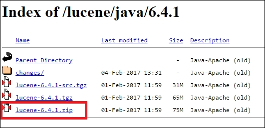
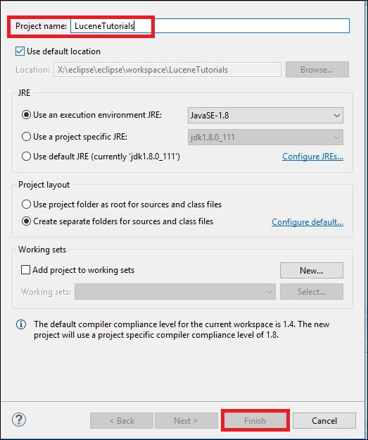
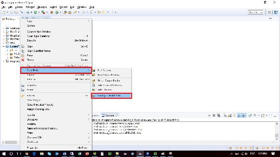
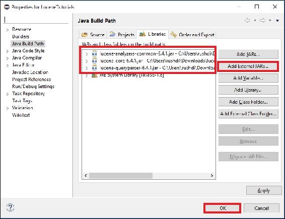
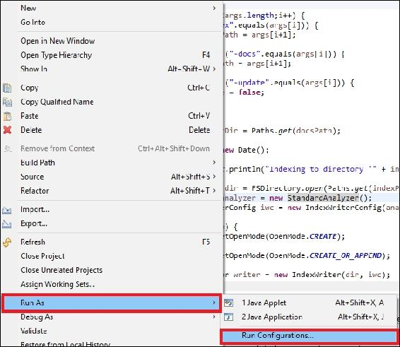
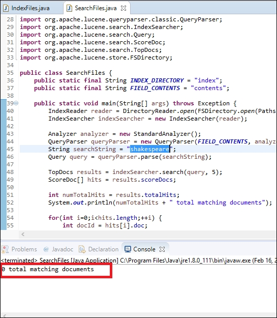

# 二、索引和搜索数据

在本章中，我们将介绍以下配方:

*   用 Apache Lucene 索引数据
*   用 Apache Lucene 搜索索引数据

# 简介

在这一章中，你将学到两个非常重要的食谱。第一个配方演示了如何索引数据，第二个配方与第一个配方密切相关，演示了如何搜索索引数据。

对于索引和搜索，我们将使用 Apache Lucene。Apache Lucene 是一个免费的开源 Java 软件库，主要用于信息检索。它由 Apache 软件基金会支持，并根据 Apache 软件许可证发布。

许多不同的现代搜索平台，如 Apache Solr 和 ElasticSearch，或爬行平台，如 Apache Nutch，在后端使用 Apache Lucene 进行数据索引和搜索。因此，任何学习这些搜索平台的数据科学家都将从本章的两个基本食谱中受益。


# 使用 Apache Lucene 索引数据

在这个菜谱中，我们将演示如何用 Apache Lucene 索引大量数据。索引是快速搜索数据的第一步。实际上，Lucene 使用了一个倒排全文索引。换句话说，它考虑所有的文档，将它们分成单词或标记，然后为每个标记建立一个索引，这样它就可以提前知道如果搜索一个术语，应该查找哪个文档。

## 准备就绪

以下是要实施的步骤:

1.  To download Apache Lucene, go to [http://lucene.apache.org/core/downloads.html](http://lucene.apache.org/core/downloads.html), and click on the Download button. At the time of writing, the latest version of Lucene was 6.4.1\. Once you click on the Download button, it will take you to the mirror websites that host the distribution:
2.  Choose any appropriate mirror for downloading. Once you click a mirror website, it will take you to a directory of distribution. Download the `lucene-6.4.1.zip` file onto your system:
3.  Once you download it, unzip the distribution. You will see a nicely organized folder distribution, as follows:
4.  Open Eclipse, and create a project named `LuceneTutorial`. To do that, open Eclipse and go to File. Then go to **New...** and Java Project. Take the name of the project and click on **Finish**:
5.  Now you will be inserting JAR files necessary for this recipe as external libraries into your project. Right-click on your project name in the **Package Explorer**. Select **Build Path** and then **Configure Build Path...** This will open properties for your project:
6.  Click on the Add External Jars button, and then add the following JAR files from Lucene 6.4.1 distributions:

    *   `lucene-core-6.4.1.jar`，可以在解压后的 Lucene 发行版的`lucene-6.4.1\core`中找到
    *   `lucene-queryparser-6.4.1.jar`，可以在解压后的 Lucene 发行版的`lucene-6.4.1\queryparser`中找到
    *   `Lucene-analyzers-common-6.4.1.jar`，可以在解压后的 Lucene 发行版的`lucene-6.4.1\analysis\common`中找到

    添加完 JAR 文件后，点击 **OK** :

    
7.  对于索引，你将使用文本格式的威廉莎士比亚的作品。打开浏览器，进入[http://norvig.com/ngrams/](http://norvig.com/ngrams/)。这将打开一个名为自然语言语料库数据:美丽数据的页面。在下载部分的文件中，您会发现一个名为 shakespeare 的. txt 文件。将此文件下载到系统中的任何位置。
8.  Unzip the files and you will see that the distribution contains three folders, `comedies`, `historical`, and `tragedies`:
9.  Create a folder in your project directory. Right-click on your project in Eclipse and go to **New**, and then click **Folder**. As the folder name, type in input and click on **Finish**:
10.  将步骤 8 中的`shakespeare.txt`复制到您在步骤 9 中创建的文件夹中。
11.  按照步骤 9 中的说明创建另一个名为 index 的文件夹。在此阶段，您的项目文件夹将如下所示:


现在您已经为编码做好了准备。

## 怎么做...

1.  Create a package in your project named `org.apache.lucene.demo`, and create a Java file in the package named `IndexFiles.java`:
2.  在这个 Java 文件中，您将创建一个名为`IndexFiles` :

    ```
             public class IndexFiles { 

    ```

    的类
3.  您将编写的第一个方法称为`indexDocs`。该方法使用给定的索引编写器对任何给定的文件进行索引。如果将目录作为参数提供，该方法将递归地遍历在给定目录下找到的文件和目录。这个方法为每个输入文件索引一个文档:

    ### 提示

    这种方法相对较慢,因此为了获得更好的性能,可以将多个文档放入输入文件中

    ```
            static void indexDocs(final IndexWriter writer, Path path) 
              throws IOException { 

    ```

    *   writer 是编写索引的索引编写器，给定的文件或目录信息将存储在该索引中
    *   path 是要索引的文件，或包含将为其创建索引的文件的目录

4.  如果提供了一个目录，该目录将被递归迭代或遍历:

    ```
            if (Files.isDirectory(path)) { 
              Files.walkFileTree(path, new SimpleFileVisitor<Path>() { 

    ```

5.  然后，您将重写一个名为`visitFile`的方法，根据给定的路径和基本文件属性来访问文件或目录:

    ```
            @Override 
              public FileVisitResult visitFile(Path file, 
                BasicFileAttributes attrs) throws IOException { 

    ```

6.  接下来，您将调用一个稍后将创建的名为`indexDoc`的静态方法。我们故意将 catch 块留空，因为我们让您决定如果文件不能被索引时该做什么:

    ```
            try { 
                indexDoc(writer, file, 
                   attrs.lastModifiedTime().toMillis()); 
              } catch (IOException ignore) { 

           } 

    ```

7.  从`visitFile`方法返回:

    ```
            return FileVisitResult.CONTINUE; 
           } 

    ```

8.  关闭区块:

    ```
        } 
             ); 
        } 

    ```

9.  在 else 块中，调用`indexDoc`方法。请记住，在`else`块中，您处理的是文件，而不是目录:

    ```
            else { 
             indexDoc(writer, path,  
               Files.getLastModifiedTime(path).toMillis()); 
           } 

    ```

10.  关闭`indexDocs()`方法:

    ```
           } 

    ```

11.  现在创建一个方法来处理单个文档的索引:

    ```
            static void indexDoc(IndexWriter writer, Path file, long 
              lastModified) throws IOException { 

    ```

12.  首先，创建一个`try`块来创建一个新的空文档:

    ```
            try (InputStream stream = Files.newInputStream(file)) { 
              Document doc = new Document(); 

    ```

13.  接下来，将文件的路径添加为一个字段。键入`"path"`作为字段名。该字段将是可搜索的或索引的。但是，请注意，您没有对字段进行标记，也没有对术语频率或位置信息进行索引:

    ```
            Field pathField = new StringField("path", file.toString(),  
              Field.Store.YES); 
            doc.add(pathField); 

    ```

14.  添加文件的最后修改日期，一个名为`"modified"` :

    ```
            doc.add(new LongPoint("modified", lastModified)); 

    ```

    的字段
15.  将文件内容添加到名为`"contents"`的字段中。您指定的阅读器将确保文件的文本被标记化和索引，但不被存储:

    ```
            doc.add(new TextField("contents", new BufferedReader(new 
              InputStreamReader(stream, StandardCharsets.UTF_8)))); 

    ```

    ### 注意

    如果文件不是用`UTF-8`编码,那么搜索特殊字符将会失败

16.  为文件创建索引:

    ```
            if (writer.getConfig().getOpenMode() == OpenMode.CREATE) { 
                System.out.println("adding " + file); 
                writer.addDocument(doc); 
            } 

    ```

17.  文档可能已经被索引了。你的`else`区块将处理这些情况。您将使用`updateDocument`而不是替换与精确路径匹配的旧路径，如果存在:

    ```
            else { 
                System.out.println("updating " + file); 
                writer.updateDocument(new Term("path", file.toString()),  
                  doc); 
           } 

    ```

18.  关闭 try 块和方法:

    ```
            }
            }
    ```

19.  现在让我们为这个类创建 main 方法。

    ```
            public static void main(String[] args) {
    ```

20.  You will be providing three options from the console when you run your program:

    *   第一个选项是 index，参数将是包含索引的文件夹
    *   第二个选项是 docs，参数是包含文本文件的文件夹
    *   最后一个选项是 update，该参数将表示您是想要创建新索引还是更新旧索引

    为了保存这三个参数的值，创建并初始化三个变量:

    ```
            String indexPath = "index"; 
            String docsPath = null; 
            boolean create = true; 

    ```

21.  设置三个选项的值:

    ```
            for(int i=0;i<args.length;i++) { 
             if ("-index".equals(args[i])) { 
                indexPath = args[i+1]; 
                i++; 
             } else if ("-docs".equals(args[i])) { 
                docsPath = args[i+1]; 
                i++; 
             } else if ("-update".equals(args[i])) { 
                create = false; 
             } 
           } 

    ```

22.  设置文件目录:

    ```
            final Path docDir = Paths.get(docsPath); 

    ```

23.  现在，您将开始索引目录中的文件。首先，设置计时器，因为您将计时索引延迟:

    ```
            Date start = new Date(); 

    ```

24.  对于索引，创建一个目录并创建一个分析器(在这种情况下，您将使用一个基本的、标准的分析器和一个索引编写器配置器):

    ```
           try { 

             Directory dir = FSDirectory.open(Paths.get(indexPath)); 
             Analyzer analyzer = new StandardAnalyzer(); 
             IndexWriterConfig iwc = new IndexWriterConfig(analyzer); 

    ```

25.  配置好索引编写器后，根据关于索引创建或更新的输入，设置索引的打开模式。如果选择创建新的索引，打开模式将被设置为`CREATE`。否则就是`CREATE_OR_APPEND` :

    ```
             if (create) { 
                iwc.setOpenMode(OpenMode.CREATE); 
             } else { 
                iwc.setOpenMode(OpenMode.CREATE_OR_APPEND); 
             } 

    ```

26.  创建索引编写器:

    ```
            IndexWriter writer = new IndexWriter(dir, iwc); 
            indexDocs(writer, docDir);  

    ```

27.  关闭`writer` :

    ```
           writer.close(); 

    ```

28.  至此，您差不多完成了编码。只需完成对索引时间的跟踪:

    ```
            Date end = new Date(); 
            System.out.println(end.getTime() - start.getTime() + " total 
              milliseconds"); 

    ```

29.  关闭`try`块。我们有意将`catch`块留为空白，以便您可以决定在索引过程中出现异常的情况下应该做什么:

    ```
            } catch (IOException e) { 
            } 

    ```

30.  关闭 main 方法并关闭类:

    ```
           } 
           } 

    ```

31.  Right-click on your project in Eclipse, select ****Run** As,** and click on ****Run** Configurations...**:
32.  Go to the **Arguments** tab in the Run Configurations window. In the Program Arguments option, put `-docs input\ -index index\`. Click on **Run**:
33.  代码的输出如下所示:


## 它是如何工作的...

食谱的完整代码如下:

```
package org.apache.lucene.demo; 

import org.apache.lucene.analysis.Analyzer; 
import org.apache.lucene.analysis.standard.StandardAnalyzer; 
import org.apache.lucene.document.Document; 
import org.apache.lucene.document.Field; 
import org.apache.lucene.document.LongPoint; 
import org.apache.lucene.document.StringField; 
import org.apache.lucene.document.TextField; 
import org.apache.lucene.index.IndexWriter; 
import org.apache.lucene.index.IndexWriterConfig.OpenMode; 
import org.apache.lucene.index.IndexWriterConfig; 
import org.apache.lucene.index.Term; 
import org.apache.lucene.store.Directory; 
import org.apache.lucene.store.FSDirectory; 
import java.io.BufferedReader; 
import java.io.IOException; 
import java.io.InputStream; 
import java.io.InputStreamReader; 
import java.nio.charset.StandardCharsets; 
import java.nio.file.FileVisitResult; 
import java.nio.file.Files; 
import java.nio.file.Path; 
import java.nio.file.Paths; 
import java.nio.file.SimpleFileVisitor; 
import java.nio.file.attribute.BasicFileAttributes; 
import java.util.Date; 

public class IndexFiles { 
   static void indexDocs(final IndexWriter writer, Path path) throws 
     IOException { 
      if (Files.isDirectory(path)) { 
         Files.walkFileTree(path, new SimpleFileVisitor<Path>() { 
            @Override 
            public FileVisitResult visitFile(Path file, 
              BasicFileAttributes attrs) throws IOException { 
               try { 
                  indexDoc(writer, file, 
                    attrs.lastModifiedTime().toMillis()); 
               } catch (IOException ignore) { 
               } 
               return FileVisitResult.CONTINUE; 
            } 
         } 
               ); 
      } else { 
         indexDoc(writer, path, 
            Files.getLastModifiedTime(path).toMillis()); 
      } 
   } 

   static void indexDoc(IndexWriter writer, Path file, long 
      lastModified) throws IOException { 
      try (InputStream stream = Files.newInputStream(file)) { 
         Document doc = new Document(); 
         Field pathField = new StringField("path", file.toString(), 
           Field.Store.YES); 
         doc.add(pathField); 
         doc.add(new LongPoint("modified", lastModified)); 
         doc.add(new TextField("contents", new BufferedReader(new 
            InputStreamReader(stream, StandardCharsets.UTF_8)))); 

         if (writer.getConfig().getOpenMode() == OpenMode.CREATE) { 
            System.out.println("adding " + file); 
            writer.addDocument(doc); 
         } else { 
            System.out.println("updating " + file); 
            writer.updateDocument(new Term("path", file.toString()), 
              doc); 
         } 
      } 
   } 
   public static void main(String[] args) { 
      String indexPath = "index"; 
      String docsPath = null; 
      boolean create = true; 
      for(int i=0;i<args.length;i++) { 
         if ("-index".equals(args[i])) { 
            indexPath = args[i+1]; 
            i++; 
         } else if ("-docs".equals(args[i])) { 
            docsPath = args[i+1]; 
            i++; 
         } else if ("-update".equals(args[i])) { 
            create = false; 
         } 
      } 

      final Path docDir = Paths.get(docsPath); 

      Date start = new Date(); 
      try { 
         System.out.println("Indexing to directory '" + indexPath + 
           "'..."); 

         Directory dir = FSDirectory.open(Paths.get(indexPath)); 
         Analyzer analyzer = new StandardAnalyzer(); 
         IndexWriterConfig iwc = new IndexWriterConfig(analyzer); 

         if (create) { 
            iwc.setOpenMode(OpenMode.CREATE); 
         } else { 
            iwc.setOpenMode(OpenMode.CREATE_OR_APPEND); 
         } 
         IndexWriter writer = new IndexWriter(dir, iwc); 
         indexDocs(writer, docDir); 

         writer.close(); 

         Date end = new Date(); 
         System.out.println(end.getTime() - start.getTime() + " total 
           milliseconds"); 

      } catch (IOException e) { 
      } 
   } 
} 

```


# 使用 Apache Lucene 搜索索引数据

现在您已经索引了您的数据，您将在这个菜谱中使用 Apache Lucene 搜索数据。这个配方中的搜索代码依赖于您在前一个配方中创建的索引，因此，只有按照前一个配方中的说明执行，它才能成功执行。

## 准备就绪

1.  Complete the previous recipe. After completing the previous recipe, go to the index directory in your project that you created in step 11 of that recipe. Make sure that you see some indexing files there:
2.  Create a Java file named `SearchFiles` in the `org.apache.lucene.demo` package you created in the previous recipe:
3.  现在您已经准备好在`SearchFiles.java`文件中键入一些代码。

## 怎么做...

1.  在 Eclipse 的编辑器中打开`SearchFiles.java`并创建下面的类:

    ```
            public class SearchFiles { 

    ```

2.  您需要创建两个常量字符串变量。第一个变量将包含您在之前的配方中创建的`index`的路径。第二个变量将包含您要搜索的字段内容。在我们的例子中，我们将在`index` :

    ```
            public static final String INDEX_DIRECTORY = "index"; 
            public static final String FIELD_CONTENTS = "contents"; 

    ```

    的`contents`字段中进行搜索
3.  开始创建你的主方法:

    ```
            public static void main(String[] args) throws Exception { 

    ```

4.  通过打开`index`目录中的索引创建一个`indexreader`:

    ```
            IndexReader reader = 
              DirectoryReader.open(FSDirectory.open
                (Paths.get(INDEX_DIRECTORY))); 

    ```

5.  下一步是创建一个搜索器来搜索索引:

    ```
             IndexSearcher indexSearcher = new IndexSearcher(reader); 

    ```

6.  作为您的分析仪，创建一个标准分析仪:

    ```
             Analyzer analyzer = new StandardAnalyzer(); 

    ```

7.  通过向`QueryParser`构造函数提供两个参数来创建一个查询解析器，这两个参数是您将要搜索的字段和您已经创建的解析器:

    ```
            QueryParser queryParser = new QueryParser(FIELD_CONTENTS,  
              analyzer); 

    ```

8.  在这个菜谱中，您将使用一个预定义的搜索词。在这个搜索中，您试图找到同时包含`"over-full"`和`"persuasion"` :

    ```
            String searchString = "over-full AND persuasion"; 

    ```

    的文档
9.  使用搜索字符串创建一个查询:

    ```
            Query query = queryParser.parse(searchString); 

    ```

10.  搜索者将查看索引，看是否能找到搜索项。你也提到了会有多少搜索结果，在我们的例子中是`5` :

    ```
            TopDocs results = indexSearcher.search(query, 5); 

    ```

11.  创建一个数组来保存`hits` :

    ```
            ScoreDoc[] hits = results.scoreDocs; 

    ```

12.  请注意，在索引过程中，我们只使用了一个文档`shakespeare.txt`。因此，在我们的例子中，这个数组的长度最大为 1。
13.  您可能还想知道找到的匹配的文档数量:

    ```
            int numTotalHits = results.totalHits; 
            System.out.println(numTotalHits + " total matching documents"); 

    ```

14.  最后，遍历命中结果。您将获得找到匹配项的文档 ID。有了文档 ID，您就可以创建文档，并打印文档的路径和 Lucene 为您使用的搜索词计算的分数:

    ```
            for(int i=0;i<hits.length;++i) { 
             int docId = hits[i].doc; 
             Document d = indexSearcher.doc(docId); 
             System.out.println((i + 1) + ". " + d.get("path") + " score=" 
               + hits[i].score); 
            } 

    ```

15.  关闭方法和类:

    ```
            } 
            } 

    ```

16.  If you run the code, you will see the following output:
17.  打开项目文件夹的输入文件夹中的`shakespeare.txt`文件。手动搜索，你会发现`"over-full"`和`"persuasion"`都出现在文档中。
18.  更改步骤 8 中的`searchString`，如下:

    ```
            String searchString = "shakespeare"; 

    ```

19.  By keeping the rest of the codes as they are, whether you run the code, you will see the following output:
20.  再次打开`Shakespeare.txt`文件，仔细检查莎士比亚这个词是否出现在其中。你将一无所获。

这个食谱的完整代码如下:

```
package org.apache.lucene.demo; 
import java.nio.file.Paths; 
import org.apache.lucene.analysis.Analyzer; 
import org.apache.lucene.analysis.standard.StandardAnalyzer; 
import org.apache.lucene.document.Document; 
import org.apache.lucene.index.DirectoryReader; 
import org.apache.lucene.index.IndexReader; 
import org.apache.lucene.queryparser.classic.QueryParser; 
import org.apache.lucene.search.IndexSearcher; 
import org.apache.lucene.search.Query; 
import org.apache.lucene.search.ScoreDoc; 
import org.apache.lucene.search.TopDocs; 
import org.apache.lucene.store.FSDirectory; 

public class SearchFiles { 
   public static final String INDEX_DIRECTORY = "index"; 
   public static final String FIELD_CONTENTS = "contents"; 

   public static void main(String[] args) throws Exception { 
      IndexReader reader = DirectoryReader.open(FSDirectory.open
        (Paths.get(INDEX_DIRECTORY))); 
      IndexSearcher indexSearcher = new IndexSearcher(reader); 

      Analyzer analyzer = new StandardAnalyzer(); 
      QueryParser queryParser = new QueryParser(FIELD_CONTENTS, 
         analyzer); 
      String searchString = "shakespeare"; 
      Query query = queryParser.parse(searchString); 

      TopDocs results = indexSearcher.search(query, 5); 
      ScoreDoc[] hits = results.scoreDocs; 

      int numTotalHits = results.totalHits; 
      System.out.println(numTotalHits + " total matching documents"); 

      for(int i=0;i<hits.length;++i) { 
         int docId = hits[i].doc; 
         Document d = indexSearcher.doc(docId); 
         System.out.println((i + 1) + ". " + d.get("path") + " score=" 
           + hits[i].score); 
      } 
   } 
} 

```

### 注意

你可以访问[https://lucene.apache.org/core/2_9_4/queryparsersyntax.html](https://lucene.apache.org/core/2_9_4/queryparsersyntax.html)获取 Apache Lucene 支持的查询语法。