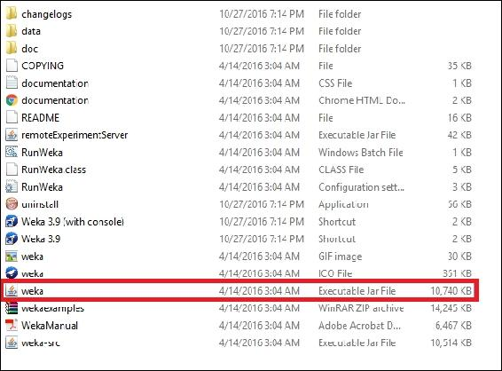

# 四、从数据中学习——第一部分

在本章中，我们将介绍以下配方:

*   创建并保存属性关系文件格式文件
*   交叉验证机器学习模型
*   分类看不见的测试数据
*   用过滤的分类器对看不见的测试数据进行分类
*   生成线性回归模型
*   生成逻辑回归模型
*   使用 KMeans 算法对数据进行聚类
*   来自类的聚类数据
*   从数据中学习关联规则
*   使用低级方法、过滤方法和元分类器方法选择特征/属性

# 简介

在本章和接下来的章节中，我们将介绍使用机器学习技术从数据中学习模式的方法。这些模式是至少三个关键机器学习任务的关注中心:分类、回归和聚类。分类是从一个名义类别预测一个值的任务。与分类相反，回归模型试图从数值类中预测值。最后，聚类是根据数据点的接近程度对其进行分组的技术。

有许多基于 Java 的工具、工作台、库和 API 可以用于前面提到的机器学习领域的研究和开发。最流行的工具之一是**怀卡托知识分析环境** ( **Weka** )，这是一个在 GNU 通用公共许可证下授权的自由软件。它是用 Java 编写的，拥有非常好的数据准备和过滤选项、带有可定制参数设置的经典机器学习算法以及强大的数据可视化选项。此外，除了易于使用的 Java 库，它还有一个非常方便的**图形用户界面** ( **GUI** )供非 Java 用户使用。

在本章中，我们的重点将是演示如何进行常规的数据科学活动，例如为工具准备数据集、为不同类型的机器学习任务生成模型，以及使用 Weka 进行模型性能评估。

### 注意

请注意，本章配方中的代码不会实现任何异常处理，因此，catch 块故意留空。异常处理完全取决于用户和他/她的需求。


# 创建并保存属性关系文件格式(ARFF)文件

Weka 的原生文件格式叫做**属性关系文件格式** ( **ARFF** )。ARFF 文件有两个逻辑部分。第一部分叫做*头*，第二部分叫做*数据* *。**头*部分有三个必须出现在 ARFF 文件中的物理部分——关系的名称、属性或特征以及它们的数据类型和范围。*数据*部分有一个物理部分，也必须存在以生成机器学习模型。ARFF 文件的*头*部分如下所示:

```java
% 1\. Title: Iris Plants Database 
   % 
   % 2\. Sources: 
   %      (a) Creator: R.A. Fisher 
   %      (b) Donor: Michael Marshall (MARSHALL%PLU@io.arc.nasa.gov) 
   %      (c) Date: July, 1988 
   % 
   @RELATION iris 

   @ATTRIBUTE sepallength     NUMERIC 
   @ATTRIBUTE sepalwidth      NUMERIC 
   @ATTRIBUTE petallength     NUMERIC 
   @ATTRIBUTE petalwidth      NUMERIC 
   @ATTRIBUTE class  {Iris-setosa,Iris-versicolor,Iris-virginica} 

```

这里，以`%`符号开始的行表示注释。关系的名称由关键字`@RELATION`表示。以`@ATTRIBUTE`关键字开始的下几行表示特性或属性。在示例中，关系的名称是`iris`，数据集有五个属性——前四个属性是*数字*类型，最后一个属性是数据点的*类*，这是一个带有三个类值的*名义*属性。

ARFF 文件的*数据*部分如下所示:

```java
   @DATA 
   5.1,3.5,1.4,0.2,Iris-setosa 
   4.9,3.0,1.4,0.2,Iris-setosa 
   4.7,3.2,1.3,0.2,Iris-setosa 
   4.6,3.1,1.5,0.2,Iris-setosa 
   5.0,3.6,1.4,0.2,Iris-setosa 
   5.4,3.9,1.7,0.4,Iris-setosa 
   4.6,3.4,1.4,0.3,Iris-setosa   

```

该示例显示数据部分以关键字`@DATA`开始，然后包含逗号分隔的属性值。逗号分隔值的顺序应该与*属性*部分中属性的顺序一致。

### 注意

`@RELATION`、`@ATTRIBUTE`和`@DATA`声明不区分大小写。

要了解更多关于 ARFF 文件格式、Weka 和稀疏 ARFF 文件中支持的属性类型，请参考[http://www.cs.waikato.ac.nz/ml/weka/arff.html](http://www.cs.waikato.ac.nz/ml/weka/arff.html)。

为了执行本章中的配方，我们需要以下内容:

为了开发我们的代码，我们将使用 Eclipse IDE，为了成功地执行本章中的所有代码，我们将把 Weka JAR 文件添加到一个项目中。为此，请按照下列步骤操作:

1.  To download Weka, go to [http://www.cs.waikato.ac.nz/ml/weka/downloading.html](http://www.cs.waikato.ac.nz/ml/weka/downloading.html) and you will find download options for Windows, Mac, and other operating systems such as Linux. Read through the options carefully and download the appropriate version.

    ### 注意

    在撰写本书时，3.9.0 是开发人员的最新版本，由于作者已经在他的 64 位 Windows 机器上安装了 1.8 版本的 JVM，他选择下载一个用于 64 位 Windows 的自解压可执行文件，而不使用 Java VM，如下图所示:

    
2.  下载完成后，双击可执行文件并按照屏幕上的说明进行操作。你需要安装 Weka 的*完整*版本。
3.  安装完成后，不要运行该软件。相反，转到安装它的目录，找到 Weka 的 Java 归档文件(`weka.jar`)。将这个文件作为外部库添加到您的 Eclipse 项目中:



### Tip

如果你因为某种原因需要下载旧版本的 Weka，都可以在[https://sourceforge.net/projects/weka/files/](https://sourceforge.net/projects/weka/files/)找到。请注意，旧版本中的许多方法可能已被废弃，因此不再受支持。

## 怎么做...

1.  We will be keeping all our codes in a `main()` method instead of creating a method. Therefore, create a class and a `main` method:

    ```java
            public class WekaArffTest { 
              public static void main(String[] args) throws Exception { 

    ```

    注意，`main`方法将包含与 Weka 库相关的代码，因此会抛出异常

2.  创建两个数组列表。第一个`ArrayList`将包含属性，第二个`ArrayList`将包含类值。因此，第一个`ArrayList`的泛型将是 Attribute 类型的(事实上，它是一个 Weka 类来建模属性)，而第二个`ArrayList`的泛型可以是 string 来表示类标签:

    ```java
            ArrayList<Attribute>      attributes; 
            ArrayList<String>      classVals; 

    ```

3.  接下来，创建一个实例对象。该对象将为 ARFF 文件的`@DATA`部分中的实例建模；`@DATA`部分中的每一行都是一个实例:

    ```java
            Instances       data; 

    ```

4.  创建一个双数组。该数组将包含属性的值:

    ```java
            double[]        values; 

    ```

5.  现在是设置属性的时候了。我们将创建 ARFF 文件的`@ATTRIBUTE`部分。首先，实例化属性:

    ```java
            attributes = new ArrayList<Attribute>(); 

    ```

6.  接下来，我们将创建一个名为 age 的数字属性，并将它添加到我们的属性`ArrayList` :

    ```java
            attributes.add(new Attribute("age")); 

    ```

7.  我们现在将创建一个名为 name 的字符串属性，并将它添加到我们的属性`ArrayList`中。然而，在此之前，我们将创建一个 String 类型的空的`ArrayList`,并将`NULL`赋给它。这个空的`ArrayList`将在`Attribute`类的构造函数中使用，以表明 name 是一个字符串类型属性，而不是名义属性，就像类属性:

    ```java
            ArrayList<String> empty = null; 
            attributes.add(new Attribute("name", empty)); 

    ```

8.  Weka 也支持日期类型属性。接下来，我们将创建一个 dob 属性来表示出生日期:

    ```java
            attributes.add(new Attribute("dob", "yyyy-MM-dd")); 

    ```

9.  然后我们将实例化类值`ArrayList`，并将创建五个类值- `class1`、`class2`、`class3`、`class4`和`class5` :

    ```java
            classVals = new ArrayList<String>(); 
            for (int i = 0; i < 5; i++){ 
               classVals.add("class" + (i + 1)); 
            } 

    ```

10.  有了这些类值，我们接下来将创建一个属性，并将其添加到我们的属性`ArrayList` :

    ```java
            Attribute classVal = new Attribute("class", classVals); 
            attributes.add(classVal); 

    ```

11.  通过这一行代码，我们已经完成了 ARFF 文件的`@ATTRIBUTE`部分的创建。接下来，我们将填充`@DATA`部分。
12.  首先，我们将创建一个名为`MyRelation`(这是我们的 ARFF 文件的`@RELATION`部分中的参数)的实例对象，以及所有属性:

    ```java
            data = new Instances("MyRelation", attributes, 0); 

    ```

13.  我们将使用前面创建的 double 数组为我们的四个属性生成四个值；我们将指定年龄、姓名、出生日期和类值(随机选择，在本例中没有意义):

    ```java
            values = new double[data.numAttributes()];
            values[0] = 35; 
            values[1] = data.attribute(1).addStringValue("John Doe"); 
            values[2] = data.attribute(2).parseDate("1981-01-20"); 
            values[3] = classVals.indexOf("class3"); 

    ```

14.  然后，我们将这些值添加到我们的数据部分:

    ```java
            data.add(new DenseInstance(1.0, values)); 

    ```

15.  同样，我们将为我们的数据部分创建第二个实例，如下所示:

    ```java
            values = new double[data.numAttributes()];   
            values[0] = 30; 
            values[1] = data.attribute(1).addStringValue("Harry Potter"); 
            values[2] = data.attribute(2).parseDate("1986-07-05"); 
            values[3] = classVals.indexOf("class1"); 
            data.add(new DenseInstance(1.0, values)); 

    ```

16.  如果我们想在某个地方保存 ARFF 文件，添加以下代码段:

    ```java
            BufferedWriter writer = new BufferedWriter(new    
              FileWriter("c:/training.arff")); 
            writer.write(data.toString()); 
            writer.close(); 

    ```

17.  我们刚刚创建的 ARFF 文件的全部内容也可以显示在控制台输出上:

    ```java
            System.out.println(data); 

    ```

18.  此时，关闭方法和类:

```java
           } 
        } 

```

食谱的完整代码如下:

```java
import java.io.BufferedWriter; 
import java.io.FileWriter; 
import java.util.ArrayList; 

import weka.core.Attribute; 
import weka.core.DenseInstance; 
import weka.core.Instances; 

public class WekaArffTest { 
   public static void main(String[] args) throws Exception { 
      ArrayList<Attribute>      attributes; 
      ArrayList<String>      classVals; 
      Instances       data; 
      double[]        values; 

      // Set up attributes 
      attributes = new ArrayList<Attribute>(); 
      // Numeric attribute 
      attributes.add(new Attribute("age")); 
      // String attribute 
      ArrayList<String> empty = null; 
      attributes.add(new Attribute("name", empty)); 
      // Date attribute 
      attributes.add(new Attribute("dob", "yyyy-MM-dd")); 
      classVals = new ArrayList<String>(); 
      for (int i = 0; i < 5; i++){ 
         classVals.add("class" + (i + 1)); 
      } 
      Attribute classVal = new Attribute("class", classVals); 
      attributes.add(classVal); 

      // Create Instances object 
      data = new Instances("MyRelation", attributes, 0); 

      // Data fill up 
      // First instance 
      values = new double[data.numAttributes()]; 
      values[0] = 35; 
      values[1] = data.attribute(1).addStringValue("John Doe"); 
      values[2] = data.attribute(2).parseDate("1981-01-20"); 
      values[3] = classVals.indexOf("class3"); 

      // add 
      data.add(new DenseInstance(1.0, values)); 

      // Second instance 
      values = new double[data.numAttributes()];   
      values[0] = 30; 
      values[1] = data.attribute(1).addStringValue("Harry Potter"); 
      values[2] = data.attribute(2).parseDate("1986-07-05"); 
      values[3] = classVals.indexOf("class1"); 

      // add 
      data.add(new DenseInstance(1.0, values)); 

      //writing arff file to disk 
      BufferedWriter writer = new BufferedWriter(new 
        FileWriter("c:/training.arff")); 
      writer.write(data.toString()); 
      writer.close(); 
      // Output data 
      System.out.println(data); 
   } 
} 

```

代码的输出如下所示:

```java
@relation MyRelation 

@attribute age numeric 
@attribute name string 
@attribute dob date yyyy-MM-dd 
@attribute class {class1,class2,class3,class4,class5} 

@data 
35,'John Doe',1981-01-20,class3 
30,'Harry Potter',1986-07-05,class1

```


# 交叉验证机器学习模型

在这个菜谱中，我们将创建四个方法来做四件不同的事情——一个方法将加载一个 ARFF 文件(假设 ARFF 文件已经创建并保存在某个地方)；第二种方法将读取 ARFF 文件中的数据，并生成一个机器学习模型(我们任意选择了朴素贝叶斯模型)；第三种方法是通过使用序列化来保存模型，最后一种方法是使用 10 重交叉验证来评估 ARFF 文件上的模型。

## 怎么做...

1.  创建两个实例变量。第一个将包含 iris 数据集的所有实例。iris ARFF 数据集可以在您安装的 Weka 目录的 data 文件夹中找到。第二个变量将是一个`NaiveBayes`分类器:

    ```java
            Instances iris = null; 
            NaiveBayes nb;  

    ```

2.  我们的第一个方法是使用`DataSource`类加载 iris ARFF 文件，使用类的`getDataSet()`方法读取内容，并设置类属性的位置。如果用记事本打开`iris.arff`数据集，会看到 class 属性是最后一个属性，这是约定，不是强制规则。因此，`iris.setClassIndex(iris.numAttributes() - 1);`已经被用来分配最后一个属性作为类属性。对于 Weka 中的任何分类任务，这都是非常重要的:

    ```java
            public void loadArff(String arffInput){ 
              DataSource source = null; 
              try { 
                source = new DataSource(arffInput); 
                iris = source.getDataSet(); 
                if (iris.classIndex() == -1) 
                iris.setClassIndex(iris.numAttributes() - 1); 
              } catch (Exception e1) { 
              } 
            } 

    ```

3.  我们的下一个方法是使用`NaiveBayes`类的`buildClassifier(dataset)`方法生成一个`NaiveBayes`分类器，基于 iris 数据集:

    ```java
            public void generateModel(){ 
              nb = new NaiveBayes(); 
              try { 
                nb.buildClassifier(iris); 
              } catch (Exception e) { 
              } 
            } 

    ```

4.  Weka 有一个工具可以保存使用 Weka 生成的任何模型。这些保存的模型可以在以后用于分类看不见的、未标记的测试数据。我们需要使用 Weka 的`SerializationHelper`类，它有一个名为 write 的特殊方法，该方法将保存用户模型和模型的路径作为其参数:

    ```java
            public void saveModel(String modelPath){ 
              try { 
                weka.core.SerializationHelper.write(modelPath, nb); 
              } catch (Exception e) { 
              } 
            } 

    ```

5.  我们的最终方法是使用 iris 数据集交叉验证模型的性能评估。为此，我们将使用 10 重交叉验证。如果我们只有少量的数据，这种流行的模型性能评估技术是非常有用的。然而，它也有一些局限性。对这种方法的利弊的讨论超出了本书的范围。感兴趣的读者可以参考[https://en . Wikipedia . org/wiki/Cross-validation _(statistics)](https://en.wikipedia.org/wiki/Cross-validation_(statistics))了解更多详情:

```java
        public void crossValidate(){ 
          Evaluation eval = null; 
          try { 
            eval = new Evaluation(iris); 
            eval.crossValidateModel(nb, iris, 10, new Random(1)); 
            System.out.println(eval.toSummaryString()); 
          } catch (Exception e1) { 
          }   
        } 

```

第`eval.crossValidateModel(nb, iris, 10, new Random(1));`行使用模型和数据集作为它的前两个参数。第三个参数表示这是一个 10 重交叉验证。最后一个参数是在过程中引入随机化，这非常重要，因为在大多数情况下，我们数据集中的数据实例不是随机化的。

该配方的完整可执行代码如下:

```java
import java.util.Random; 

import weka.classifiers.Evaluation; 
import weka.classifiers.bayes.NaiveBayes; 
import weka.core.Instances; 
import weka.core.converters.ConverterUtils.DataSource; 

public class WekaCVTest { 
   Instances iris = null; 
   NaiveBayes nb; 

   public void loadArff(String arffInput){ 
      DataSource source = null; 
      try { 
         source = new DataSource(arffInput); 
         iris = source.getDataSet(); 
         if (iris.classIndex() == -1) 
            iris.setClassIndex(iris.numAttributes() - 1); 
      } catch (Exception e1) { 
      } 
   } 

   public void generateModel(){ 
      nb = new NaiveBayes(); 
      try { 
         nb.buildClassifier(iris); 
      } catch (Exception e) { 

      } 
   } 

   public void saveModel(String modelPath){ 
      try { 
         weka.core.SerializationHelper.write(modelPath, nb); 
      } catch (Exception e) { 
      } 
   } 

   public void crossValidate(){ 
      Evaluation eval = null; 
      try { 
         eval = new Evaluation(iris); 
         eval.crossValidateModel(nb, iris, 10, new Random(1)); 
         System.out.println(eval.toSummaryString()); 
      } catch (Exception e1) { 
      }   
   } 
   public static void main(String[] args){ 
      WekaCVTest test = new WekaCVTest(); 
      test.loadArff("C:/Program Files/Weka-3-6/data/iris.arff"); 
      test.generateModel(); 
      test.saveModel("c:/nb.model"); 
      test.crossValidate(); 
   } 
} 

```

代码的输出如下所示:

```java
Correctly Classified Instances         144               96      % 
Incorrectly Classified Instances         6                4      % 
Kappa statistic                          0.94   
Mean absolute error                      0.0342 
Root mean squared error                  0.155 
Relative absolute error                  7.6997 % 
Root relative squared error             32.8794 % 
Total Number of Instances              150 

```

### Tip

在这个食谱中，我们保存了一个机器学习模型。如果您需要加载一个模型，您需要知道使用了哪种类型的学习算法(例如，本菜谱中的 Naive Bayes)来生成模型，以便您可以将模型加载到适当的学习算法对象中。可以使用以下方法加载模型:

```java
public void loadModel(String modelPath){
try {
nb = (NaiveBayes)
weka.core.SerializationHelper.read(modelPath);
} catch (Exception e) {
}
}
```


# 分类看不见的测试数据

经典的监督机器学习分类任务是在标记的训练实例上训练分类器，并在看不见的测试实例上应用分类器。这里要记住的关键点是，训练集中的属性数量、它们的类型、它们的名称以及它们在训练数据集中的取值范围(如果它们是常规的名义属性或名义类属性)必须与测试数据集中的完全相同。

## 准备就绪

在 Weka 中，训练数据集和测试数据集之间可能存在关键差异。测试部分中 ARFF 文件的`@DATA`部分看起来类似于 ARFF 文件的`@DATA`部分。它可以具有如下属性值和分类标签:

```java
@DATA 
   5.1,3.5,1.4,0.2,Iris-setosa 
   4.9,3.0,1.4,0.2,Iris-setosa 
   4.7,3.2,1.3,0.2,Iris-setosa 

```

当分类器应用于这种标记的测试数据时，分类器在预测实例的类别时忽略类别标签。还要注意，如果您的测试数据被标记，您可以将您的分类器的预测标签与实际标签进行比较。这使您有机会生成分类器的评估指标。然而，最常见的情况是，您的测试数据没有任何类别信息，并且基于它对训练数据的学习，分类器将预测并分配类别标签。这样一个测试数据集的`@DATA` 部分将如下所示，其中类标签是未知的，用一个问号(`?`)表示:

```java
@DATA 
   5.1,3.5,1.4,0.2,? 
   4.9,3.0,1.4,0.2,? 
   4.7,3.2,1.3,0.2,? 

```

Weka 的*数据*目录不包含任何这样的测试文件。因此，您可以创建自己的类似于`iris.arff`文件的测试文件。复制以下内容，打开记事本将其放入一个文本文件中，并在您的文件系统中保存为`iris-test.arff`文件(比如在`C:/`驱动器中):

```java
@RELATION iris-test 

@ATTRIBUTE sepallength  REAL 
@ATTRIBUTE sepalwidth   REAL 
@ATTRIBUTE petallength  REAL 
@ATTRIBUTE petalwidth   REAL 
@ATTRIBUTE class  {Iris-setosa,Iris-versicolor,Iris-virginica} 
@DATA 
3.1,1.2,1.2,0.5,? 
2.3,2.3,2.3,0.3,? 
4.2,4.4,2.1,0.2,? 
3.1,2.5,1.0,0.2,? 
2.8,1.6,2.0,0.2,? 
3.0,2.6,3.3,0.3,? 
4.5,2.0,3.4,0.1,? 
5.3,2.0,3.1,0.2,? 
3.2,1.3,2.1,0.3,? 
2.1,6.4,1.2,0.1,? 

```

## 怎么做...

1.  We will have the following instance variables:

    ```java
            NaiveBayes nb; 
            Instances train, test, labeled; 

    ```

    为了让这个食谱有点挑战性，同时也给我们一个好的学习体验，我们将加载一个先前构建并保存的模型，并将该模型分配给我们的`NaiveBayes`分类器。该分类器将应用于未标记的测试实例。测试实例将作为标记实例复制到分类器中。在不改变测试实例的情况下，由分类器预测的类别标签将作为类别标签被分配给相应的标记实例。

2.  首先，我们将创建一个方法来加载一个预先构建并保存的模型。事实上，我们可以加载我们在前面名为*的配方中构建并保存的分类器，交叉验证一个机器学习模型:*

    ```java
            public void loadModel(String modelPath){ 
              try { 
                nb = (NaiveBayes)  
                  weka.core.SerializationHelper.read(modelPath); 
              } catch (Exception e) { 
              }  
            } 

    ```

3.  然后，我们需要读取训练和测试数据集。作为训练数据集，我们将使用文件系统中 Weka 安装文件的*数据*目录中的`iris.arff`文件。作为测试文件，我们将使用我们之前在菜谱中创建的`iris-test.arff`文件:

    ```java
            public void loadDatasets(String training, String testing){ 

    ```

4.  To read the training dataset, we have used Weka's DataSource class. The key advantage in using this class is that it can deal with all file types supported by Weka. However, Weka users can use Java's `BufferedReader` class also to read the contents of a dataset. In this recipe, just to introduce a new way to read datasets, we will be using the `BufferedReader` class instead of the `DataSource` class.

    我们将把 ARFF 文件视为常规文件，并使用一个`BufferedReader`阅读器来指向训练数据集。然后，读取器将用于使用 Weka 的 instances 类的构造函数创建训练实例。最后，我们将最后一个属性设置为数据集的类属性:

    ```java
            BufferedReader reader = null; 
              try { 
                reader = new BufferedReader(new FileReader(training)); 
                train = new Instances (reader); 
                train.setClassIndex(train.numAttributes() -1); 
              } catch (IOException e) { 
           } 

    ```

5.  In a similar way, we will be reading the test dataset:

    ```java
            try { 
              reader = new BufferedReader(new FileReader(testing)); 
              test = new Instances (reader); 
              test.setClassIndex(train.numAttributes() -1); 
            } catch (IOException e) { 
            } 

    ```

    请注意，您不需要创建新的`BufferedReader`对象。

6.  最后，关闭打开的`BufferedReader`对象并结束方法:

    ```java
            try { 
              reader.close(); 
            } catch (IOException e) { 
            } 
         } 

    ```

7.  我们的下一个方法是从训练数据中创建一个`NaiveBayes`分类器，并将该分类器应用于我们的测试数据集的看不见的、未标记的实例。该方法还将显示由`NaiveBayes`分类器预测的类值的概率:

    ```java
            public void classify(){ 
              try { 
                nb.buildClassifier(train); 
              } catch (Exception e) { 
              } 
            }

    ```

8.  我们将创建带标签的实例，它们是测试实例的副本。我们在前面步骤中生成的分类器预测的标签将被分配给这些实例，而测试实例保持不变:

    ```java
            labeled = new Instances(test); 

    ```

9.  现在，对于测试数据集的每个实例，我们将创建一个类标签，这是一个双精度变量。然后，朴素贝叶斯将应用它的`classifyInstance()`方法，该方法将一个实例作为参数。类别标签将被分配给类别标签变量，并且该变量的值将被分配为在被标记的实例中的该特定实例的类别标签。换句话说，标记实例中测试实例的`?` 值将被朴素贝叶斯预测的值所替换:

    ```java
            for (int i = 0; i < test.numInstances(); i++) { 
              double clsLabel; 
              try { 
                clsLabel = nb.classifyInstance(test.instance(i)); 
                labeled.instance(i).setClassValue(clsLabel); 
                double[] predictionOutput = 
                  nb.distributionForInstance(test.instance(i)); 
                double predictionProbability = predictionOutput[1]; 
                System.out.println(predictionProbability); 
              } catch (Exception e) { 
              } 
            } 

    ```

10.  最后，我们将在文件系统中写入带标签的测试数据集(即`labeled`):

```java
public void writeArff(String outArff){ 
      BufferedWriter writer; 
      try { 
         writer = new BufferedWriter(new FileWriter(outArff)); 
         writer.write(labeled.toString()); 
         writer.close(); 
      } catch (IOException e) { 
      } 
} 

```

该配方的完整可执行代码如下:

```java
import java.io.BufferedReader; 
import java.io.BufferedWriter; 
import java.io.FileReader; 
import java.io.FileWriter; 
import java.io.IOException; 

import weka.classifiers.bayes.NaiveBayes; 
import weka.core.Instances; 

public class WekaTrainTest { 
   NaiveBayes nb; 
   Instances train, test, labeled; 

   public void loadModel(String modelPath){ 
      try { 
         nb = (NaiveBayes) 
           weka.core.SerializationHelper.read(modelPath); 
      } catch (Exception e) { 
      } 
   } 

   public void loadDatasets(String training, String testing){ 
      BufferedReader reader = null; 
      try { 
         reader = new BufferedReader(new FileReader(training)); 
         train = new Instances (reader); 
         train.setClassIndex(train.numAttributes() -1); 
      } catch (IOException e) { 
      } 

      try { 
         reader = new BufferedReader(new FileReader(testing)); 
         test = new Instances (reader); 
         test.setClassIndex(train.numAttributes() -1); 
      } catch (IOException e) { 
      } 

      try { 
         reader.close(); 
      } catch (IOException e) { 
      } 
   } 

   public void classify(){ 
      try { 
         nb.buildClassifier(train); 
      } catch (Exception e) { 
      } 

      labeled = new Instances(test); 

      for (int i = 0; i < test.numInstances(); i++) { 
         double clsLabel; 
         try { 
            clsLabel = nb.classifyInstance(test.instance(i)); 
            labeled.instance(i).setClassValue(clsLabel); 
            double[] predictionOutput = 
              nb.distributionForInstance(test.instance(i)); 
            double predictionProbability = predictionOutput[1]; 
            System.out.println(predictionProbability); 
         } catch (Exception e) { 
         } 
      } 
   } 

   public void writeArff(String outArff){ 
      BufferedWriter writer; 
      try { 
         writer = new BufferedWriter(new FileWriter(outArff)); 
         writer.write(labeled.toString()); 
         writer.close(); 
      } catch (IOException e) { 
      } 
   } 

   public static void main(String[] args) throws Exception{ 
      WekaTrainTest test = new WekaTrainTest(); 
      test.loadModel("path to your Naive Bayes Model"); 
      test.loadDatasets("path to iris.arff dataset", "path to iris-
        test.arff dataset"); 
      test.classify(); 
      test.writeArff("path to your output ARFF file"); 
   } 
} 

```

在控制台上，您将看到我们的模型预测的概率值:

```java
5.032582653870928E-13 
2.1050052853672135E-4 
5.177104804026096E-16 
1.2459904922893976E-16 
3.1771015903129274E-10 
0.9999993509430146 
0.999999944638627 
0.9999999844862647 
3.449759371835354E-8 
4.0178483420981394E-77 

```

如果您打开由代码生成的 ARFF 文件，该文件包含以前未知实例的类值，您应该会看到如下内容:

```java
@relation iris-test 

@attribute sepallength numeric 
@attribute sepalwidth numeric 
@attribute petallength numeric 
@attribute petalwidth numeric 
@attribute class {Iris-setosa,Iris-versicolor,Iris-virginica} 

@data 
3.1,1.2,1.2,0.5,Iris-setosa 
2.3,2.3,2.3,0.3,Iris-setosa 
4.2,4.4,2.1,0.2,Iris-setosa 
3.1,2.5,1,0.2,Iris-setosa 
2.8,1.6,2,0.2,Iris-setosa 
3,2.6,3.3,0.3,Iris-versicolor 
4.5,2,3.4,0.1,Iris-versicolor 
5.3,2,3.1,0.2,Iris-versicolor 
3.2,1.3,2.1,0.3,Iris-setosa 
2.1,6.4,1.2,0.1,Iris-setosa 

```


# 用过滤的分类器对看不见的测试数据进行分类

很多时候，在开发分类器之前，您需要使用过滤器。该过滤器可用于移除、转换、离散化和添加属性，移除错误分类的实例，随机化或规范化实例，等等。通常的方法是使用 Weka 的 Filter 类，然后用类方法执行一系列过滤。此外，Weka 有一个名为`FilteredClassifier`的类，它是一个*类，用于对通过任意过滤器*的数据运行任意分类器。

在这个菜谱中，我们将看到如何同时使用一个过滤器和一个分类器来对看不见的测试例子进行分类。

## 怎么做...

1.  This time, we will be using a Random Forest classifier. As our dataset, we will be using `weather.nominal.arff` that can be found in the `Data` directory of the installed Weka folder in your file system.

    下面两个将是我们的实例变量:

    ```java
            Instances weather = null; 
            RandomForest rf; 

    ```

2.  接下来，在我们的代码中，我们将有一个加载数据集的方法。我们将把`weather.nominal.arff`文件的目录路径从我们的驱动方法发送到这个方法。使用 Weka 的`DataSource`类，我们将读取`weather.nominal.arff`文件的数据，并将数据集的最后一个属性设置为类属性:

    ```java
            public void loadArff(String arffInput){ 
              DataSource source = null; 
              try { 
                source = new DataSource(arffInput); 
                weather = source.getDataSet(); 
                weather.setClassIndex(iris.numAttributes() - 1); 
              } catch (Exception e1) { 
              } 
            } 

    ```

3.  接下来，我们将创建这个食谱的核心方法:

    ```java
            public void buildFilteredClassifier(){ 

    ```

4.  为了创建这个方法，我们将首先创建一个随机森林分类器:

    ```java
            rf = new RandomForest(); 

    ```

5.  我们将创建一个过滤器，从`weather.nominal.arff`文件中删除一个特定的属性。为此，我们将使用 Weka 的 Remove 类。下面的代码将创建一个过滤器，用于删除数据集的第一个属性:

    ```java
            Remove rm = new Remove(); 
            rm.setAttributeIndices("1"); 

    ```

6.  在接下来的几行代码中，创建一个`FilteredClassifier`，添加我们在上一步中创建的过滤器，并添加`RandomForest`分类器:

    ```java
            FilteredClassifier fc = new FilteredClassifier(); 
            fc.setFilter(rm); 
            fc.setClassifier(rf); 

    ```

7.  使用过滤的分类器，我们可以从名义上的天气数据集构建一个随机的森林分类器。然后，对于名义天气数据集的每个实例，分类器将预测类值。在 try 块中，我们将打印实例的实际值和预测值:

```java
        try{ 
          fc.buildClassifier(weather); 
          for (int i = 0; i < iris.numInstances(); i++){ 
             double pred = fc.classifyInstance(weather.instance(i)); 
             System.out.print("given value: " + 
                weather.classAttribute().value((int) 
                weather.instance(i).classValue())); 
             System.out.println("---predicted value: " +
             weather.classAttribute().value((int) pred)); 
        } 
        } catch (Exception e) { 
        } 
        } 

```

食谱的完整代码如下:

```java
import weka.classifiers.meta.FilteredClassifier; 
import weka.classifiers.trees.RandomForest; 
import weka.core.Instances; 
import weka.core.converters.ConverterUtils.DataSource; 
import weka.filters.unsupervised.attribute.Remove; 

public class WekaFilteredClassifierTest { 
   Instances weather = null; 
   RandomForest rf; 

   public void loadArff(String arffInput){ 
      DataSource source = null; 
      try { 
         source = new DataSource(arffInput); 
         weather = source.getDataSet(); 
         weather.setClassIndex(weather.numAttributes() - 1); 
      } catch (Exception e1) { 
      } 
   } 

   public void buildFilteredClassifier(){ 
      rf = new RandomForest(); 
      Remove rm = new Remove(); 
      rm.setAttributeIndices("1"); 
      FilteredClassifier fc = new FilteredClassifier(); 
      fc.setFilter(rm); 
      fc.setClassifier(rf); 
      try{ 
         fc.buildClassifier(weather); 
         for (int i = 0; i < weather.numInstances(); i++){ 
            double pred = fc.classifyInstance(weather.instance(i)); 
            System.out.print("given value: " + 
              weather.classAttribute().value((int) 
                weather.instance(i).classValue())); 
            System.out.println("---predicted value: " +
              weather.classAttribute().value((int) pred)); 
         } 
      } catch (Exception e) { 
      } 
   } 

   public static void main(String[] args){ 
      WekaFilteredClassifierTest test = new 
        WekaFilteredClassifierTest(); 
      test.loadArff("C:/Program Files/Weka-3-
        6/data/weather.nominal.arff"); 
      test.buildFilteredClassifier(); 
   } 
} 

```

代码的输出如下所示:

```java
given value: no---predicted value: yes 
given value: no---predicted value: no 
given value: yes---predicted value: yes 
given value: yes---predicted value: yes 
given value: yes---predicted value: yes 
given value: no---predicted value: yes 
given value: yes---predicted value: yes 
given value: no---predicted value: yes 
given value: yes---predicted value: yes 
given value: yes---predicted value: yes 
given value: yes---predicted value: yes 
given value: yes---predicted value: yes 
given value: yes---predicted value: yes 
given value: no---predicted value: yes

```


# 生成线性回归模型

大多数线性回归模型遵循一个通用的模式-将有许多自变量共同产生一个结果，这是一个因变量。例如，我们可以生成一个回归模型，根据房屋的不同属性/特征(主要是数字、真实值)来预测房屋的价格，例如房屋的平方英尺大小、卧室数量、卫生间数量、位置的重要性等等。

在这个食谱中，我们将使用 Weka 的线性回归分类器来生成回归模型。

## 怎么做...

1.  In this recipe, the linear regression model we will be creating is based on the `cpu.arff` dataset, which can be found in the `data` directory of the Weka installation directory.

    我们的代码将有两个实例变量:第一个变量将包含`cpu.arff`文件的数据实例，第二个变量将是我们的线性回归分类器:

    ```java
            Instances cpu = null; 
            LinearRegression lReg ; 

    ```

2.  接下来，我们将创建一个方法来加载 ARFF 文件，并将 ARFF 文件的最后一个属性指定为它的类属性:

    ```java
            public void loadArff(String arffInput){ 
              DataSource source = null; 
              try { 
                source = new DataSource(arffInput); 
                cpu = source.getDataSet(); 
                cpu.setClassIndex(cpu.numAttributes() - 1); 
              } catch (Exception e1) { 
              } 
            } 

    ```

3.  我们将创建一种方法来构建线性回归模型。为此，我们只需调用线性回归变量的`buildClassifier()`方法。模型可以作为参数直接发送给`System.out.println()`:

```java
         public void buildRegression(){
           lReg = new LinearRegression(); 
           try { 
             lReg.buildClassifier(cpu);
           } catch (Exception e) {
           } 
           System.out.println(lReg);
         }
```

食谱的完整代码如下:

```java
import weka.classifiers.functions.LinearRegression; 
import weka.core.Instances; 
import weka.core.converters.ConverterUtils.DataSource; 

public class WekaLinearRegressionTest { 
   Instances cpu = null; 
   LinearRegression lReg ; 

   public void loadArff(String arffInput){ 
      DataSource source = null; 
      try { 
         source = new DataSource(arffInput); 
         cpu = source.getDataSet(); 
         cpu.setClassIndex(cpu.numAttributes() - 1); 
      } catch (Exception e1) { 
      } 
   } 

   public void buildRegression(){    
      lReg = new LinearRegression(); 
      try { 
         lReg.buildClassifier(cpu); 
      } catch (Exception e) { 
      } 
      System.out.println(lReg); 
   } 

   public static void main(String[] args) throws Exception{ 
      WekaLinearRegressionTest test = new WekaLinearRegressionTest(); 
      test.loadArff("path to the cpu.arff file"); 
      test.buildRegression(); 
   } 
} 

```

代码的输出如下所示:

```java
Linear Regression Model 

class = 

      0.0491 * MYCT + 
      0.0152 * MMIN + 
      0.0056 * MMAX + 
      0.6298 * CACH + 
      1.4599 * CHMAX + 
    -56.075 

```


# 生成逻辑回归模型

Weka 有一个名为 logistic 的类，可用于构建和使用带有岭估计的多项式 Logistic 回归模型。虽然最初的逻辑回归不处理实例权重，但是 Weka 中的算法已经被修改来处理实例权重。

在这个配方中，我们将使用 Weka 在 iris 数据集上生成一个逻辑回归模型。

## 怎么做...

1.  We will be generating a logistic regression model from the `iris` dataset, which can be found in the `data` directory in the installed folder of Weka.

    我们的代码将有两个实例变量:一个包含 iris 数据集的数据实例，另一个是逻辑回归分类器:

    ```java
            Instances iris = null; 
            Logistic logReg ; 

    ```

2.  我们将使用一个方法来加载和读取数据集，以及分配它的类属性(`iris.arff`文件的最后一个属性):

    ```java
            public void loadArff(String arffInput){ 
              DataSource source = null; 
              try { 
                source = new DataSource(arffInput); 
                iris = source.getDataSet(); 
                iris.setClassIndex(iris.numAttributes() - 1); 
              } catch (Exception e1) { 
              } 
            } 

    ```

3.  接下来，我们将创建食谱中最重要的方法，该方法从 `iris`数据集构建逻辑回归分类器:

```java
        public void buildRegression(){    
          logReg = new Logistic(); 

          try { 
            logReg.buildClassifier(iris); 
          } catch (Exception e) { 
          } 
          System.out.println(logReg); 
        } 

```

该配方的完整可执行代码如下:

```java
import weka.classifiers.functions.Logistic; 
import weka.core.Instances; 
import weka.core.converters.ConverterUtils.DataSource; 

public class WekaLogisticRegressionTest { 
   Instances iris = null; 
   Logistic logReg ; 

   public void loadArff(String arffInput){ 
      DataSource source = null; 
      try { 
         source = new DataSource(arffInput); 
         iris = source.getDataSet(); 
         iris.setClassIndex(iris.numAttributes() - 1); 
      } catch (Exception e1) { 
      } 
   } 

   public void buildRegression(){    
      logReg = new Logistic(); 

      try { 
         logReg.buildClassifier(iris); 
      } catch (Exception e) { 
      } 
      System.out.println(logReg); 
   } 

   public static void main(String[] args) throws Exception{ 
      WekaLogisticRegressionTest test = new 
        WekaLogisticRegressionTest(); 
      test.loadArff("path to the iris.arff file "); 
      test.buildRegression(); 
   } 
}

```

代码的输出如下所示:

```java
Logistic Regression with ridge parameter of 1.0E-8 
Coefficients... 
                         Class 
Variable           Iris-setosa  Iris-versicolor 
=============================================== 
sepallength            21.8065           2.4652 
sepalwidth              4.5648           6.6809 
petallength           -26.3083          -9.4293 
petalwidth             -43.887         -18.2859 
Intercept               8.1743           42.637 

Odds Ratios... 
                         Class 
Variable           Iris-setosa  Iris-versicolor 
=============================================== 
sepallength    2954196659.8892          11.7653 
sepalwidth             96.0426         797.0304 
petallength                  0           0.0001 
petalwidth                   0                0 

```

### Tip

对配方结果的解释超出了本书的范围。感兴趣的读者可以在这里看到关于堆栈溢出的讨论:[http://Stack Overflow . com/questions/19136213/how-to-interpret-WEKA-logistic-regression-output](http://stackoverflow.com/questions/19136213/how-to-interpret-weka-logistic-regression-output)


# 使用 KMeans 算法聚类数据点

在这个菜谱中，我们将使用 KMeans 算法对数据集的数据点进行聚类或分组。

## 怎么做...

1.  We will be using the cpu dataset to cluster its data points based on a simple KMeans algorithm. The cpu dataset can be found in the `data` directory of the installed folder in the Weka directory.

    我们将有两个实例变量，就像前面的食谱一样。第一个变量将包含 cpu 数据集的数据点，第二个变量将是我们简单的 KMeans clusterer:

    ```java
            Instances cpu = null; 
            SimpleKMeans kmeans; 

    ```

2.  然后，我们将创建一个方法来加载 cpu 数据集，并读取其内容。请注意，由于聚类是一种无监督的方法，我们不需要指定数据集的 class 属性:

    ```java
            public void loadArff(String arffInput){ 
              DataSource source = null; 
              try { 
                source = new DataSource(arffInput); 
                cpu = source.getDataSet(); 
              } catch (Exception e1) { 
             } 
            } 

    ```

3.  接下来，我们将创建我们的方法来开发集群器:

    ```java
            public void clusterData(){ 

    ```

4.  我们实例化集群，并将 seed 的值设置为 10。种子将用于生成一个随机数，它取一个整数值:

    ```java
            kmeans = new SimpleKMeans(); 
            kmeans.setSeed(10); 

    ```

5.  然后，我们告诉集群器保持数据实例的顺序不变。如果您觉得不需要维护数据集中实例的顺序，可以将`setPreserveInstancesOrder()`方法的参数设置为 false。我们还将集群的数量设置为 10。最后，我们从 cpu 数据集构建集群:

    ```java
            try { 
              kmeans.setPreserveInstancesOrder(true); 
              kmeans.setNumClusters(10); 
              kmeans.buildClusterer(cpu); 

    ```

6.  接下来，我们使用一个`for`循环，通过简单的 KMeans 算法获得每个实例和分配给它们的集群号:

```java
        int[] assignments = kmeans.getAssignments(); 
          int i = 0; 
          for(int clusterNum : assignments) { 
             System.out.printf("Instance %d -> Cluster %d\n", i,  
               clusterNum); 
             i++; 
          } 
        } catch (Exception e1) { 
        } 

```

食谱的完整代码如下:

```java
import weka.clusterers.SimpleKMeans; 
import weka.core.Instances; 
import weka.core.converters.ConverterUtils.DataSource; 

public class WekaClusterTest { 
   Instances cpu = null; 
   SimpleKMeans kmeans; 

   public void loadArff(String arffInput){ 
      DataSource source = null; 
      try { 
         source = new DataSource(arffInput); 
         cpu = source.getDataSet(); 
      } catch (Exception e1) { 
      } 
   } 

   public void clusterData(){  
      kmeans = new SimpleKMeans(); 
      kmeans.setSeed(10); 
      try { 
         kmeans.setPreserveInstancesOrder(true); 
         kmeans.setNumClusters(10); 
         kmeans.buildClusterer(cpu); 
         int[] assignments = kmeans.getAssignments(); 
         int i = 0; 
         for(int clusterNum : assignments) { 
            System.out.printf("Instance %d -> Cluster %d\n", i, 
              clusterNum); 
            i++; 
         } 
      } catch (Exception e1) { 
      } 
   } 

   public static void main(String[] args) throws Exception{ 
      WekaClusterTest test = new WekaClusterTest(); 
      test.loadArff("path to cpu.arff file"); 
      test.clusterData(); 
   } 
} 

```

`cpu.arff`文件有 209 个数据实例。前 10 个的输出如下:

```java
Instance 0 -> Cluster 7 
Instance 1 -> Cluster 5 
Instance 2 -> Cluster 5 
Instance 3 -> Cluster 5 
Instance 4 -> Cluster 1 
Instance 5 -> Cluster 5 
Instance 6 -> Cluster 5 
Instance 7 -> Cluster 5 
Instance 8 -> Cluster 4 
Instance 9 -> Cluster 4

```


# 聚类来自类的数据

如果你有一个包含类的数据集，这对于无监督学习来说是一种不寻常的情况，Weka 有一种方法叫做从类中聚类。在这种方法中，Weka 首先忽略类属性并生成聚类。然后在测试阶段，它根据每个集群内的类属性的多数值将类分配给集群。我们将在这份食谱中介绍这种方法。

## 怎么做...

1.  In this recipe, we will use a dataset with class values for instances. We will use a `weather.nominal.arff` file, which can be found in the *data* directory of the installed Weka directory.

    在我们的代码中，我们将有两个实例变量。第一个变量将包含数据集的实例，第二个变量将包含一个期望最小化聚类器:

    ```java
            Instances weather = null; 
            EM clusterer; 

    ```

2.  接下来，我们将加载数据集，读取它，并将最后一个索引设置为它的类索引:

    ```java
           public void loadArff(String arffInput){ 
             DataSource source = null; 
             try { 
               source = new DataSource(arffInput); 
               weather = source.getDataSet(); 
               weather.setClassIndex(weather.numAttributes() - 1); 
             } catch (Exception e1) { 
             } 
           } 

    ```

3.  然后，我们将在这个配方中创建我们的关键方法，它将从类:

    ```java
            public void generateClassToCluster(){ 

    ```

    中生成集群
4.  为此，我们将首先创建一个移除过滤器。此过滤器将用于从数据集中移除类属性，因为 Weka 在聚类过程中会忽略此属性:

    ```java
            Remove filter = new Remove(); 
            filter.setAttributeIndices("" + (weather.classIndex() + 1)); 

    ```

5.  然后，我们将把过滤器应用到我们的数据集:

    ```java
            try { 
              filter.setInputFormat(weather); 

    ```

6.  我们将获得没有类变量的数据集，并可以从数据中创建一个期望最大化聚类器:

    ```java
             Instances dataClusterer = Filter.useFilter(weather, filter); 
             clusterer = new EM(); 
             clusterer.buildClusterer(dataClusterer); 

    ```

7.  然后，我们将使用原始数据集的类来评估集群:

    ```java
             ClusterEvaluation eval = new ClusterEvaluation(); 
             eval.setClusterer(clusterer); 
             eval.evaluateClusterer(weather); 

    ```

8.  最后，我们将在控制台上打印聚类结果:

```java
         System.out.println(eval.clusterResultsToString()); 
         } catch (Exception e) { 
      } 
   } 

```

食谱的完整代码如下:

```java
import weka.clusterers.ClusterEvaluation; 
import weka.clusterers.EM; 
import weka.core.Instances; 
import weka.core.converters.ConverterUtils.DataSource; 
import weka.filters.Filter; 
import weka.filters.unsupervised.attribute.Remove; 

public class WekaClassesToClusterTest { 
   Instances weather = null; 
   EM clusterer; 

   public void loadArff(String arffInput){ 
      DataSource source = null; 
      try { 
         source = new DataSource(arffInput); 
         weather = source.getDataSet(); 
         weather.setClassIndex(weather.numAttributes() - 1); 
      } catch (Exception e1) { 
      } 
   } 

   public void generateClassToCluster(){ 
      Remove filter = new Remove(); 
      filter.setAttributeIndices("" + (weather.classIndex() + 1)); 
      try { 
         filter.setInputFormat(weather); 
         Instances dataClusterer = Filter.useFilter(weather, filter); 
         clusterer = new EM(); 
         clusterer.buildClusterer(dataClusterer); 
         ClusterEvaluation eval = new ClusterEvaluation(); 
         eval.setClusterer(clusterer); 
         eval.evaluateClusterer(weather); 

         System.out.println(eval.clusterResultsToString()); 
      } catch (Exception e) { 
      } 
   } 

   public static void main(String[] args){ 
      WekaClassesToClusterTest test = new WekaClassesToClusterTest(); 
      test.loadArff("path to weather.nominal.arff file"); 
      test.generateClassToCluster(); 
   } 
} 

```


# 从数据中学习关联规则

关联规则学习是一种机器学习技术，用于发现数据集中各种特征或变量之间的关联和规则。统计学中的一种类似技术被称为相关性，这在第 3 章、*中有所介绍，统计分析数据*，但是关联规则学习在决策制定中更有用。例如，通过分析大型超市数据，机器学习学习者可以发现，如果一个人买了洋葱、西红柿、鸡肉馅饼和蛋黄酱，她很可能会买包子(来做汉堡)。

在这个菜谱中，我们将看到如何使用 Weka 从数据集中学习关联规则。

## 准备就绪

我们将使用超市数据集，该数据集可以在我们安装的 Weka 目录的`data`目录中找到。数据集中的实例总数为 4，627 个，每个实例有 217 个二进制属性。属性的值为`true`或`missing`。有一个名为`total`的名义类属性，如果交易少于 100 美元，其值为`low`，如果交易多于 100 美元，其值为`high`。

## 怎么做...

1.  声明两个实例变量来包含超市数据集的数据并表示先验学习者:

    ```java
            Instances superMarket = null; 
            Apriori apriori; 

    ```

2.  创建一个方法来加载数据集并读取它。对于这个配方，不需要设置数据集的 class 属性:

    ```java
            public void loadArff(String arffInput){ 
              DataSource source = null; 
              try { 
                source = new DataSource(arffInput); 
                superMarket = source.getDataSet(); 
              } catch (Exception e1) { 
              } 
            } 

    ```

3.  创建一个方法来实例化先验学习者。然后，该方法从给定的数据集构建关联。最后，在控制台上显示学员:

```java
        public void generateRule(){ 
          apriori = new Apriori(); 
            try { 
              apriori.buildAssociations(superMarket); 
              System.out.println(apriori); 
            } catch (Exception e) { 
            } 
        } 

```

### Tip

先验学习者产生的规则的默认数量被设置为 10。如果您需要生成更多的规则，您可以在构建关联之前输入以下代码行，其中`n`是一个整数，表示规则`learn-apriori.setNumRules(n);`的数量

食谱的完整代码如下:

```java
import weka.associations.Apriori; 
import weka.core.Instances; 
import weka.core.converters.ConverterUtils.DataSource; 

public class WekaAssociationRuleTest { 
   Instances superMarket = null; 
   Apriori apriori; 
   public void loadArff(String arffInput){ 
      DataSource source = null; 
      try { 
         source = new DataSource(arffInput); 
         superMarket = source.getDataSet(); 
      } catch (Exception e1) { 
      } 
   } 
   public void generateRule(){ 
      apriori = new Apriori(); 
      try { 
         apriori.buildAssociations(superMarket); 
         System.out.println(apriori); 
      } catch (Exception e) { 
      } 
   } 
   public static void main(String args[]){ 
      WekaAssociationRuleTest test = new WekaAssociationRuleTest(); 
      test.loadArff("path to supermarket.arff file"); 
      test.generateRule(); 
   } 
} 

```

先验学习者发现的规则如下:

```java
1\. biscuits=t frozen foods=t fruit=t total=high 788 ==> bread and cake=t 723    <conf:(0.92)> lift:(1.27) lev:(0.03) [155] conv:(3.35) 
 2\. baking needs=t biscuits=t fruit=t total=high 760 ==> bread and cake=t 696    <conf:(0.92)> lift:(1.27) lev:(0.03) [149] conv:(3.28) 
 3\. baking needs=t frozen foods=t fruit=t total=high 770 ==> bread and cake=t 705    <conf:(0.92)> lift:(1.27) lev:(0.03) [150] conv:(3.27) 
 4\. biscuits=t fruit=t vegetables=t total=high 815 ==> bread and cake=t 746    <conf:(0.92)> lift:(1.27) lev:(0.03) [159] conv:(3.26) 
 5\. party snack foods=t fruit=t total=high 854 ==> bread and cake=t 779    <conf:(0.91)> lift:(1.27) lev:(0.04) [164] conv:(3.15) 
 6\. biscuits=t frozen foods=t vegetables=t total=high 797 ==> bread and cake=t 725    <conf:(0.91)> lift:(1.26) lev:(0.03) [151] conv:(3.06) 
 7\. baking needs=t biscuits=t vegetables=t total=high 772 ==> bread and cake=t 701    <conf:(0.91)> lift:(1.26) lev:(0.03) [145] conv:(3.01) 
 8\. biscuits=t fruit=t total=high 954 ==> bread and cake=t 866    <conf:(0.91)> lift:(1.26) lev:(0.04) [179] conv:(3) 
 9\. frozen foods=t fruit=t vegetables=t total=high 834 ==> bread and cake=t 757    <conf:(0.91)> lift:(1.26) lev:(0.03) [156] conv:(3) 
10\. frozen foods=t fruit=t total=high 969 ==> bread and cake=t 877    <conf:(0.91)> lift:(1.26) lev:(0.04) [179] conv:(2.92)

```


# 使用低级方法、过滤方法和元分类器方法选择特征/属性

特征选择是一个重要的机器学习过程，它从一组属性中识别数据集中最重要的属性，因此，如果基于所选属性生成分类器，该分类器会比包含所有属性的分类器产生更好的结果。

在 Weka 中，有三种选择属性的方式。该方法将使用 Weka 中可用的所有三种属性选择技术:低级属性选择方法、使用过滤器的属性选择和使用元分类器的属性选择。

## 准备就绪

配方将选择可以在 Weka 安装目录的`data`目录中找到的`iris`数据集的重要属性。

要执行属性选择，需要两个元素:搜索方法和评估方法。在我们的配方中，我们将使用最佳优先搜索作为我们的搜索方法，以及一个名为基于相关性的特征子集选择的子集评估方法。

## 怎么做...

1.  声明一个实例变量来保存 iris 数据集中的数据。为`NaiveBayes`分类器声明另一个变量:

    ```java
            Instances iris = null; 
            NaiveBayes nb; 

    ```

2.  创建一个方法来加载我们的数据集。该方法还将读取数据实例，并将数据集的最后一个属性设置为类属性:

    ```java
            public void loadArff(String arffInput){ 
              DataSource source = null; 
              try { 
                source = new DataSource(arffInput); 
                iris = source.getDataSet(); 
                iris.setClassIndex(iris.numAttributes() - 1); 
              } catch (Exception e1) { 
              } 
           } 

    ```

3.  我们将从简单开始——我们将创建一个使用 Weka 的低级属性选择方法的方法:

    ```java
           public void selectFeatures(){ 

    ```

4.  创建一个`AttributeSelection`对象:

    ```java
            AttributeSelection attSelection = new AttributeSelection(); 

    ```

5.  接下来，为搜索和评估器创建对象，并为属性`selection`对象:

    ```java
            CfsSubsetEval eval = new CfsSubsetEval(); 
            BestFirst search = new BestFirst(); 
            attSelection.setEvaluator(eval); 
            attSelection.setSearch(search); 

    ```

    设置评估器和搜索对象
6.  Then, use the attribute selection object to select attributes from the iris dataset using the search and evaluator. We will get the index of the attributes that are selected by this technique and will display the selected attribute numbers (the attribute numbers start from 0):

    ```java
            try { 
              attSelection.SelectAttributes(iris); 
              int[] attIndex = attSelection.selectedAttributes(); 
              System.out.println(Utils.arrayToString(attIndex)); 
            } catch (Exception e) { 
          } 
          } 

    ```

    该方法的输出如下:

    ```java
     2, 3, 4

    ```

    输出意味着属性选择技术从虹膜数据集的所有属性中选择属性号 2、3 和 4。

7.  现在，我们将创建一个方法，实现基于过滤器选择属性的第二种技术:

    ```java
            public void selectFeaturesWithFilter(){ 

    ```

8.  创建属性选择过滤器。注意，这个过滤器的包不是我们在这个配方的第一个方法中使用的包:

    ```java
            weka.filters.supervised.attribute.AttributeSelection filter = 
              new weka.filters.supervised.attribute.AttributeSelection(); 

    ```

9.  接下来，为搜索和评估器创建对象，并为过滤器设置评估器和搜索对象:

    ```java
            CfsSubsetEval eval = new CfsSubsetEval(); 
            BestFirst search = new BestFirst(); 
            filter.setEvaluator(eval); 
            filter.setSearch(search); 

    ```

10.  Then, apply the filter to the iris dataset, and retrieve new data using the `useFilter()` of the Filter class, which takes the dataset and filter as its two arguments. This is something different than what we saw in the previous method. This is very useful if we want to create a new ARFF file by selecting the attributes selected by the filtering technique on the fly:

    ```java
           try { 
             filter.setInputFormat(iris); 
             Instances newData = Filter.useFilter(iris, filter); 
             System.out.println(newData); 
           } catch (Exception e) { 
           } 
           } 

    ```

    从控制台的输出中，我们可以看到 ARFF 文件数据的属性部分现在包含以下条目:

    ```java
            @attribute petallength numeric 
            @attribute petalwidth numeric 
            @attribute class {Iris-setosa,Iris-versicolor,Iris-virginica} 

    ```

    这意味着与类属性一起列出的两个属性是由我们刚刚使用的属性选择方法选择的。

11.  最后，我们将创建一个方法，在将数据集交给分类器之前选择属性(在我们的例子中，它是一个`NaiveBayes`分类器):

    ```java
            public void selectFeaturesWithClassifiers(){ 

    ```

12.  在将数据传递给`NaiveBayes`分类器:

    ```java
            AttributeSelectedClassifier classifier = new  
              AttributeSelectedClassifier(); 

    ```

    之前，创建一个元分类器来减少数据的维数(即选择属性)
13.  创建一个评估器、一个搜索对象和一个`NaiveBayes`分类器:

    ```java
            CfsSubsetEval eval = new CfsSubsetEval(); 
            BestFirst search = new BestFirst(); 
            nb = new NaiveBayes(); 

    ```

14.  将评估器、搜索对象和`NaiveBayes`分类器设置为元分类器:

    ```java
            classifier.setClassifier(nb); 
            classifier.setEvaluator(eval); 
            classifier.setSearch(search); 

    ```

15.  现在，我们将使用元分类器技术选择的属性来评估`NaiveBayes`分类器的性能。注意，在这个例子中，元分类器选择的属性就像一个*黑盒*。在评估中，使用了 10 重交叉验证:

```java
        Evaluation evaluation; 
        try { 
           evaluation = new Evaluation(iris); 
           evaluation.crossValidateModel(classifier, iris, 10, new 
             Random(1)); 
           System.out.println(evaluation.toSummaryString()); 
         } catch (Exception e) { 
         } 
         } 

```

食谱的完整代码如下:

```java
import java.util.Random; 
import weka.attributeSelection.AttributeSelection; 
import weka.attributeSelection.BestFirst; 
import weka.attributeSelection.CfsSubsetEval; 
import weka.classifiers.Evaluation; 
import weka.classifiers.bayes.NaiveBayes; 
import weka.classifiers.meta.AttributeSelectedClassifier; 
import weka.core.Instances; 
import weka.core.Utils; 
import weka.core.converters.ConverterUtils.DataSource; 
import weka.filters.Filter; 

public class WekaFeatureSelectionTest { 
   Instances iris = null; 
   NaiveBayes nb; 
   public void loadArff(String arffInput){ 
      DataSource source = null; 
      try { 
         source = new DataSource(arffInput); 
         iris = source.getDataSet(); 
         iris.setClassIndex(iris.numAttributes() - 1); 
      } catch (Exception e1) { 
      } 
   } 

   public void selectFeatures(){ 
      AttributeSelection attSelection = new AttributeSelection(); 
       CfsSubsetEval eval = new CfsSubsetEval(); 
       BestFirst search = new BestFirst(); 
       attSelection.setEvaluator(eval); 
       attSelection.setSearch(search); 
       try { 
         attSelection.SelectAttributes(iris); 
         int[] attIndex = attSelection.selectedAttributes(); 
         System.out.println(Utils.arrayToString(attIndex)); 
      } catch (Exception e) { 
      } 
   } 

   public void selectFeaturesWithFilter(){ 
      weka.filters.supervised.attribute.AttributeSelection filter = new 
       weka.filters.supervised.attribute.AttributeSelection(); 
       CfsSubsetEval eval = new CfsSubsetEval(); 
       BestFirst search = new BestFirst(); 
       filter.setEvaluator(eval); 
       filter.setSearch(search); 
       try { 
         filter.setInputFormat(iris); 
         Instances newData = Filter.useFilter(iris, filter); 
         System.out.println(newData); 
      } catch (Exception e) { 
      } 
   } 

   public void selectFeaturesWithClassifiers(){ 
      AttributeSelectedClassifier classifier = new 
        AttributeSelectedClassifier(); 
      CfsSubsetEval eval = new CfsSubsetEval(); 
      BestFirst search = new BestFirst(); 
      nb = new NaiveBayes(); 
      classifier.setClassifier(nb); 
      classifier.setEvaluator(eval); 
      classifier.setSearch(search); 
      Evaluation evaluation; 
      try { 
         evaluation = new Evaluation(iris); 
         evaluation.crossValidateModel(classifier, iris, 10, new 
           Random(1)); 
         System.out.println(evaluation.toSummaryString()); 
      } catch (Exception e) { 
      } 
   } 

   public static void main(String[] args){ 
      WekaFeatureSelectionTest test = new WekaFeatureSelectionTest(); 
      test.loadArff("C:/Program Files/Weka-3-6/data/iris.arff"); 
      test.selectFeatures(); 
      test.selectFeaturesWithFilter(); 
      test.selectFeaturesWithClassifiers(); 
   } 

```

该方法的输出如下:

```java
Correctly Classified Instances         144               96      % 
Incorrectly Classified Instances         6                4      % 
Kappa statistic                          0.94   
Mean absolute error                      0.0286 
Root mean squared error                  0.1386 
Relative absolute error                  6.4429 % 
Root relative squared error             29.4066 % 
Total Number of Instances              150

```

### 注意

以下频道有关于使用 Weka 完成许多不同机器学习任务的教程，包括其 API 和 GUI:[https://www.youtube.com/c/rushdishams](https://www.youtube.com/c/rushdishams)。