# 六、从文本数据中检索信息

在本章中，我们将介绍以下配方:

*   使用 Java 检测标记(单词)
*   使用 Java 检测句子
*   使用 OpenNLP 检测单词和句子
*   使用 Stanford CoreNLP 从标记中检索词条和词性并识别命名实体
*   使用 Java 8 用余弦相似度度量文本相似度
*   使用 Mallet 从文本文档中提取主题
*   使用 Mallet 分类文本文档
*   使用 Weka 对文本文档进行分类

# 简介

由于 web 数据的可用性，而且大部分都是文本格式，数据科学家现在处理最多的数据类型就是文本。可以从文档、文章、博客文章、社交媒体更新、新闻专线以及任何你能想到的地方检索到文本数据的许多方面。

许多基于 Java 的工具可供数据科学家从文本数据中检索信息。此外，还有一些工具可以完成各种数据科学任务。在本章中，我们将范围限制在几个数据科学任务上，如句子和单词等琐碎文本特征提取、使用机器学习的文档分类、主题提取和建模、从文档中提取关键字以及命名实体识别。


# 使用 Java 检测令牌(单词)

数据科学家需要使用文本数据完成的最常见任务之一是检测其中的标记。这个任务叫做*标记化* *。*虽然“记号”可以指单词、符号、短语或任何其他有意义的文本单元，但在本章中，我们将把单词视为记号，因为单词是一个合理的文本单元。然而，单词标记的概念因人而异；有些人只需要单词，有些人希望在检测过程中省略符号，而有些人希望在单词中保留标点符号以获得更多的上下文信息。根据不同的需求，在这个配方中，我们将使用三种不同的技术，当应用于相同的字符串时，会产生三种不同的结果。这些技术将涉及字符串标记化、中断迭代器和正则表达式。您需要决定使用哪种技术。

请记住，我们只选择性地选择了三种方法，尽管还有许多其他的选择；它们是供你探索的。

## 准备就绪

1.  转到[https://docs . Oracle . com/javase/7/docs/API/Java/util/regex/pattern . html](https://docs.oracle.com/javase/7/docs/api/java/util/regex/Pattern.html)，浏览关于`Pattern`类支持的正则表达式模式的文档。
2.  进入[https://docs . Oracle . com/javase/7/docs/API/Java/text/break iterator . html](https://docs.oracle.com/javase/7/docs/api/java/text/BreakIterator.html)查看示例。这将让你对 break 迭代器的用法有所了解。

## 怎么做...

1.  首先，我们将创建一个使用 Java 的`StringTokenzier`类来检测令牌的方法。这个方法将获取输入的句子，并使用这个类对句子进行标记。最后，该方法将打印令牌:

    ```java
            public void useTokenizer(String input){ 

    ```

2.  通过将输入句子作为参数:

    ```java
            StringTokenizer tokenizer = new StringTokenizer(input); 

    ```

    来调用`StringTokenizer`构造函数
3.  创建一个字符串对象来保存令牌:

    ```java
            String word =""; 

    ```

4.  遍历分词器，获取每个单词，并在控制台上打印出来:

    ```java
            while(tokenizer.hasMoreTokens()){ 
              word = tokenizer.nextToken(); 
              System.out.println(word); 
            } 

    ```

5.  Close the method:

    ```java
             } 

    ```

    这种方法的输出对于一个类似*让我们来看看这个相对于* *的句子，他说，“*这些男生的分数真的那么好吗？***如下:*

    ```java
     ***"Let's 
            get 
            this 
            vis-a-vis", 
            he 
            said, 
            "these 
            boys' 
            marks 
            are 
            really 
            that 
            well?"*** 
    ```

6.  *Second, we will create a method that will use Java's `BreakIterator` class to iterate through each word in a text. You will see that the code is slightly more complex than the first method we have created in this recipe.

    该方法将获得输入句子作为其参数:

    ```java
            public void useBreakIterator(String input){ 

    ```* 
7.  *然后，使用`BreakIterator`类创建一个`tokenizer` :

    ```java
            BreakIterator tokenizer = BreakIterator.getWordInstance(); 

    ```* 
8.  *将`tokenizer`应用于输入句子:

    ```java
            tokenizer.setText(input); 

    ```* 
9.  *获取`tokenizer` :

    ```java
            int start = tokenizer.first(); 

    ```

    的起始索引*
10.  *使用 for 循环将每个令牌作为字符串，并在控制台上打印出来，如下所示:

    ```java
            for (int end = tokenizer.next(); 
                 end != BreakIterator.DONE; 
                 start = end, end = tokenizer.next()) { 
                 System.out.println(input.substring(start,end)); 
            } 

    ```* 
11.  *Close the method:

    ```java
            } 

    ```

    这种方法的输出对于类似*“让我们来看看这个”的句子，他说，“这些男孩的分数真的那么好吗？*将如下:

    ```java
     " 
            Let's 

            get 

            this 

            vis-a-vis 
            " 
            , 

            he 

            said 
            , 

            " 
            these 

            boys 
            ' 

            marks 

            are 

            really 

            that 

            well 
            ? 
            "

    ```* 
12.  *最后，我们将创建一个使用正则表达式对输入文本进行标记的方法:

    ```java
            public void useRegEx(String input){ 

    ```* 
13.  *使用带有正则表达式的模式，该模式可以捕获标点符号、单个或多个连字符、引号、末尾的撇号等等。如果你需要一些特定的模式，只需在下面一行使用你自己的正则表达式:

    ```java
            Pattern pattern = Pattern.compile("\\w[\\w-]+('\\w*)?"); 

    ```* 
14.  *在`pattern` :

    ```java
            Matcher matcher = pattern.matcher(input); 

    ```

    上施加一个`matcher`*
15.  *使用`matcher`从输入文本中检索所有单词:

    ```java
            while ( matcher.find() ) { 
              System.out.println(input.substring(matcher.start(), 
                matcher.end())); 
            } 

    ```* 
16.  *关闭方法:*

```java
 *}* 
```

*这种方法对于类似*Let ' s get this visa-vis，* **他说，这些男生的分数真的有那么好吗？** 将如下:*

```java
 ***Let's 
        get 
        this 
        vis-a-vis 
        he 
        said 
        these 
        boys' 
        marks 
        are 
        really 
        that 
        well*** 
```

*该配方的完整代码如下:*

```java
*import java.text.BreakIterator; 
import java.util.StringTokenizer; 
import java.util.regex.Matcher; 
import java.util.regex.Pattern; 

public class WordDetection { 
   public static void main(String[] args){ 
      String input = ""Let's get this vis-a-vis", he said, "these boys' 
        marks are really that well?""; 
      WordDetection wordDetection = new WordDetection(); 
      wordDetection.useTokenizer(input); 
      wordDetection.useBreakIterator(input); 
      wordDetection.useRegEx(input); 

   } 

   public void useTokenizer(String input){ 
      System.out.println("Tokenizer"); 
      StringTokenizer tokenizer = new StringTokenizer(input); 
      String word =""; 
      while(tokenizer.hasMoreTokens()){ 
          word = tokenizer.nextToken(); 
          System.out.println(word); 
      } 
   } 

   public void useBreakIterator(String input){ 
      System.out.println("Break Iterator"); 
      BreakIterator tokenizer = BreakIterator.getWordInstance(); 
        tokenizer.setText(input); 
        int start = tokenizer.first(); 
        for (int end = tokenizer.next(); 
             end != BreakIterator.DONE; 
             start = end, end = tokenizer.next()) { 
             System.out.println(input.substring(start,end)); 
        } 
   } 

   public void useRegEx(String input){ 
      System.out.println("Regular Expression"); 
      Pattern pattern = Pattern.compile("\\w[\\w-]+('\\w*)?"); 
      Matcher matcher = pattern.matcher(input); 

      while ( matcher.find() ) { 
          System.out.println(input.substring(matcher.start(), 
            matcher.end())); 
      } 
   } 
}* 
```

*

# 使用 Java 检测句子

在这个食谱中，我们将看到如何检测句子，以便我们可以使用它们进行进一步的分析。对于数据科学家来说，句子是一个非常重要的文本单元，可以用来试验不同的路由练习，例如分类。为了从文本中检测句子，我们将使用 Java 的`BreakIterator`类。

## 准备就绪

进入[https://docs . Oracle . com/javase/7/docs/API/Java/text/break iterator . html](https://docs.oracle.com/javase/7/docs/api/java/text/BreakIterator.html)查看示例。这将让你对 break 迭代器的用法有所了解。

## 怎么做...

为了测试这个菜谱的代码，我们将使用两个句子，这两个句子可能会给许多基于正则表达式的解决方案造成混淆。用于测试的两个句子是:*我的名字是 Rushdi Shams。你可以在我的名字前用博士，因为我有博士学位。但是我有点不好意思用它。*有趣的是，我们会看到 Java 的`BreakIterator`类非常高效地处理它们。

创建一个将测试字符串作为参数的方法。

```java
public void useSentenceIterator(String source){ 

```

1.  创建一个`BreakIterator`类的`sentenceiterator`对象:

    ```java
            BreakIterator iterator =  
              BreakIterator.getSentenceInstance(Locale.US); 

    ```

2.  在测试管柱

    ```java
            iterator.setText(source); 

    ```

    上使用`iterator`
3.  将测试字符串的`start`索引获取到一个整数变量:

    ```java
            int start = iterator.first(); 

    ```

4.  最后，遍历迭代器中的所有句子并打印出来。要循环遍历迭代器中的句子，您需要另一个名为`end`的变量来指向句子的结尾索引:

```java
        for (int end = iterator.next(); end != BreakIterator.DONE; 
          start = end, end = iterator.next()) { 
          System.out.println(source.substring(start,end)); 
        } 

```

代码的输出如下所示:

```java
My name is Rushdi Shams. 
You can use Dr. before my name as I have a Ph.D. but I am a bit shy to use it. 

```

食谱的完整代码如下:

```java
import java.text.BreakIterator; 
import java.util.Locale; 
public class SentenceDetection { 
   public void useSentenceIterator(String source){ 
      BreakIterator iterator = 
        BreakIterator.getSentenceInstance(Locale.US); 
      iterator.setText(source); 
      int start = iterator.first(); 
      for (int end = iterator.next(); 
          end != BreakIterator.DONE; 
          start = end, end = iterator.next()) { 
        System.out.println(source.substring(start,end)); 
      } 
   } 
   public static void main(String[] args){ 
      SentenceDetection detection = new SentenceDetection(); 
      String test = "My name is Rushdi Shams. You can use Dr. before my 
        name as I have a Ph.D. but I am a bit shy to use it."; 
      detection.useSentenceIterator(test); 
   } 
} 

```


# 使用 OpenNLP 检测单词和句子

本章前面的两个方法使用遗留 Java 类和其中的方法来检测令牌(单词)和句子。在这个菜谱中，我们将把检测标记和句子这两个任务与 Apache 的一个名为 OpenNLP 的开源库结合起来。引入 OpenNLP 和这两个可以用传统方法很好完成的任务的原因是向数据科学家介绍一个非常方便的工具，并且在标准和经典语料库的几个信息检索任务中具有非常高的准确性。OpenNLP 的主页可以在[https://opennlp.apache.org/](https://opennlp.apache.org/)找到。使用这个库进行标记化、句子分割、词性标注、命名实体识别、分块、解析和共同引用解析的一个有力论据是，您可以在文章或文档的语料库上训练自己的分类器。

## 准备就绪

1.  At the time of writing this book, the 1.6.0 version was the latest for OpenNLP and therefore you are encouraged to use this version. Download the 1.6.0 version of the library from [https://opennlp.apache.org/download.html](https://opennlp.apache.org/download.html). Go to this webpage and download the binary zip files: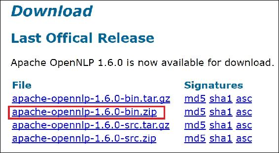
2.  After downloading the files, unzip them. In the distribution, you will find a directory named `lib`*.*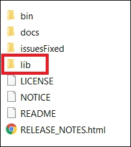
3.  在`lib`目录中，您会发现以下两个 Jar 文件:


从该目录中，将`opennlp-tools-1.6.0.jar`文件作为外部库添加到您需要为这个配方创建的 Eclipse 项目中:

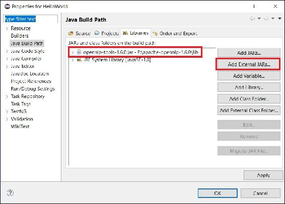

对于这个菜谱，您将使用 OpenNLP 提供的预构建的令牌和句子检测模型。因此，您需要下载模型并将其保存在硬盘中。记住这些模型的位置，这样您就可以在代码中包含这些模型。

去[http://opennlp.sourceforge.net/models-1.5/](http://opennlp.sourceforge.net/models-1.5/)下载英语分词器和句子检测器模型。将它们保存在您的`C:/`驱动器中。现在，您可以编写一些代码了:

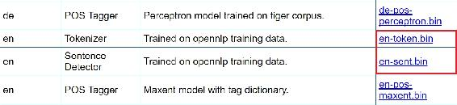

## 怎么做...

1.  In this recipe, you will create a method that uses the `tokenizer` and sentence detector models of OpenNLP to tokenize and fragment a source text into sentences. As parameters, you will send the following:

    *   将包含源文本的字符串。
    *   模型的路径。
    *   一个字符串，表示您是要对源文本进行标记，还是要将其分割成句子单元。对于前者，你将选择发送的是*字*，对于后者，选择将是*句。*

    ```java
            public void useOpenNlp(String sourceText, String modelPath, 
              String choice) throws IOException{

    ```

2.  首先，阅读将它们视为输入流的模型:

    ```java
            InputStream modelIn = null; 
            modelIn = new FileInputStream(modelPath); 

    ```

3.  然后，为选择*句子*创建一个 if 块，它将包含代码来检测源文本:

    ```java
            if(choice.equalsIgnoreCase("sentence")){ 

    ```

    的句子片段
4.  从预先构建的模型中创建一个句子模型，然后关闭用于保存预先构建的模型的变量:

    ```java
            SentenceModel model = new SentenceModel(modelIn); 
            modelIn.close(); 

    ```

5.  使用该模型，创建一个句子检测器:

    ```java
            SentenceDetectorME sentenceDetector = new 
              SentenceDetectorME(model); 

    ```

6.  使用句子检测器检测源文本的句子。生成的句子将被视为一个字符串数组:

    ```java
            String sentences[] = sentenceDetector.sentDetect(sourceText); 

    ```

7.  现在，在控制台上打印句子并关闭 if 块:

    ```java
           System.out.println("Sentences: "); 
             for(String sentence:sentences){ 
                System.out.println(sentence); 
             } 
           } 

    ```

8.  接下来，创建一个 else if 块，它将保存用于对源文本进行标记化的代码:

    ```java
            else if(choice.equalsIgnoreCase("word")){ 

    ```

9.  从预建模型创建一个`tokenizer`模型，并关闭预建模型:

    ```java
            TokenizerModel model = new TokenizerModel(modelIn); 
            modelIn.close(); 

    ```

10.  使用该模型，创建一个`tokenizer` :

    ```java
            Tokenizer tokenizer = new TokenizerME(model); 

    ```

11.  使用`tokenizer`从源文本中提取单词。提取的令牌将被放入一个字符串数组:

    ```java
            String tokens[] = tokenizer.tokenize(sourceText); 

    ```

12.  最后，在控制台上打印令牌并关闭 else if 块:

    ```java
           System.out.println("Words: "); 
             for(String token:tokens){ 
                System.out.println(token); 
             } 
           } 

    ```

13.  您将需要一个 else 块，以防来自用户的无效选择:

    ```java
           else{ 
             System.out.println("Error in choice"); 
             modelIn.close(); 
             return; 
           } 

    ```

14.  关闭方法:

```java
       } 

```

该配方的完整源代码如下:

```java
import java.io.FileInputStream; 
import java.io.IOException; 
import java.io.InputStream; 

import opennlp.tools.sentdetect.SentenceDetectorME; 
import opennlp.tools.sentdetect.SentenceModel; 
import opennlp.tools.tokenize.Tokenizer; 
import opennlp.tools.tokenize.TokenizerME; 
import opennlp.tools.tokenize.TokenizerModel; 

public class OpenNlpSenToken { 
   public static void main(String[] args){ 
      OpenNlpSenToken openNlp = new OpenNlpSenToken(); 
      try { 
         openNlp.useOpenNlp("My name is Rushdi Shams. " 
               + "You can use Dr. before my name as I have a Ph.D. " 
               + "but I am a bit shy to use it.", "C:/en-sent.bin", 
                 "sentence"); 
         openNlp.useOpenNlp(""Let's get this vis-a-vis", he said, 
           "these boys' marks are really that well?"", "C:/en-
              token.bin", "word"); 
      } catch (IOException e) { 
      } 
   } 

   public void useOpenNlp(String sourceText, String modelPath, String 
       choice) throws IOException{ 
      InputStream modelIn = null; 
      modelIn = new FileInputStream(modelPath); 

      if(choice.equalsIgnoreCase("sentence")){ 
         SentenceModel model = new SentenceModel(modelIn); 
         modelIn.close(); 
         SentenceDetectorME sentenceDetector = new 
           SentenceDetectorME(model); 
         String sentences[] = sentenceDetector.sentDetect(sourceText); 
         System.out.println("Sentences: "); 
         for(String sentence:sentences){ 
            System.out.println(sentence); 
         } 
      } 
      else if(choice.equalsIgnoreCase("word")){ 
         TokenizerModel model = new TokenizerModel(modelIn); 
         modelIn.close(); 
         Tokenizer tokenizer = new TokenizerME(model); 
         String tokens[] = tokenizer.tokenize(sourceText); 
         System.out.println("Words: "); 
         for(String token:tokens){ 
            System.out.println(token); 
         } 
      } 
      else{ 
         System.out.println("Error in choice"); 
         modelIn.close(); 
         return; 
      } 
   } 
} 

```

现在，您可以将这个源代码的输出与前两个菜谱进行比较，因为这两个菜谱使用了相同的源文本。

### 注意

对于 OpenNLP 库的其他用途，强烈建议本书的读者查看[https://open NLP . Apache . org/documentation/1 . 6 . 0/manual/open NLP . html](https://opennlp.apache.org/documentation/1.6.0/manual/opennlp.html)。


# 使用斯坦福 CoreNLP 从标记中检索词条、词性和识别命名实体

现在我们知道了如何从给定的文本中提取标记或单词，我们将看到如何从标记中获得不同类型的信息，如它们的词条、词性以及标记是否是命名实体。

把一个词的屈折形式组合在一起，使它们可以作为一个单一的文本单位来分析的过程。这类似于词干处理过程，区别在于词干处理在分组时不考虑上下文。因此，对文本数据分析来说，词汇化比词干化更有用，但需要更多的计算能力。

文章或文档中的标记的词性标签被广泛用作许多机器学习模型的特征，这些机器学习模型对数据科学家来说可能是有用的。

另一方面，命名实体对于新闻文章数据分析非常重要，并且对与商业公司相关的研究具有非常高的影响。

在这个菜谱中，我们将使用 Stanford CoreNLP 3.7.0 从文本中检索这些信息，这是编写本章时的最新版本。

## 准备就绪

1.  去 http://stanfordnlp.github.io/CoreNLP/download.html 下载斯坦福 CoreNLP 3.7.0。
2.  The files that you have downloaded in step 1 are compressed. If you decompress them, you will find a directory structure as follows:
3.  将图中所示的所有 jar 文件作为外部 Jar 文件包含到您现有的项目中，您就可以编写一些代码了:


## 怎么做...

1.  创建一个类和一个`main()`方法，用于保存这个菜谱的所有代码:

    ```java
            public class Lemmatizer { 
              public static void main(String[] args){ 

    ```

2.  接下来，创建一个斯坦福 CoreNLP 管道。通过这条管道，你将为 CoreNLP 引擎提供许多属性值:

    ```java
            StanfordCoreNLP pipeline; 

    ```

3.  创建一个`Properties`对象并添加一些属性。在我们的例子中，我们将使用词性标注和词汇化来标记:

    ```java
            Properties props = new Properties(); 
            props.put("annotators", "tokenize, ssplit, pos, lemma, ner"); 

    ```

4.  接下来，使用这些属性创建一个 CoreNLP 对象:

    ```java
            pipeline = new StanfordCoreNLP(props, false); 

    ```

5.  创建一个需要为其生成词条的字符串:

    ```java
            String text = "Hamlet's mother, Queen Gertrude, says this 
              famous line while watching The Mousetrap. " 
                + "Gertrude is talking about the queen in the play. " 
                + "She feels that the play-queen seems insincere because 
                  she repeats so dramatically that she'll never remarry 
                  due to her undying love of her husband."; 

    ```

6.  接下来，用给定的文本

    ```java
            Annotation document = pipeline.process(text); 

    ```

    创建一个`Annotation`
7.  最后，对于每一个令牌，得到原令牌，得到该令牌的引理。您不需要获得原始令牌，但要看到单词形式和词条形式之间的区别，这可能很方便。使用您在上一步中创建的名为`document`的`Annotation`变量:

    ```java
            for(CoreMap sentence: document.get(SentencesAnnotation.class))
             {     
                for(CoreLabel token: sentence.get(TokensAnnotation.class))
                 {        
                    String word = token.get(TextAnnotation.class);       
                    String lemma = token.get(LemmaAnnotation.class); 
                    String pos = token.get(PartOfSpeechAnnotation.class); 
                    String ne = token.get(NamedEntityTagAnnotation.class); 
                    System.out.println(word + "-->" + lemma + "-->" + pos 
                    + "-->" + ne); 
                } 
             } 

    ```

    对所有句子重复上述步骤
8.  关闭方法和类:

```java
        } 
        } 

```

代码的部分输出如下:

```java
... 
Queen-->Queen-->NNP-->PERSON 
Gertrude-->Gertrude-->NNP-->PERSON 
,-->,-->,-->O 
says-->say-->VBZ-->O 
this-->this-->DT-->O 
famous-->famous-->JJ-->O 
line-->line-->NN-->O 
while-->while-->IN-->O 
watching-->watch-->VBG-->O 
The-->the-->DT-->O 
Mousetrap-->mousetrap-->NN-->O 
.-->.-->.-->O 
Gertrude-->Gertrude-->NNP-->PERSON 
is-->be-->VBZ-->O 
talking-->talk-->VBG-->O 
...

```

这个食谱的完整代码如下:

```java
import edu.stanford.nlp.ling.CoreAnnotations.LemmaAnnotation; 
import edu.stanford.nlp.ling.CoreAnnotations.NamedEntityTagAnnotation; 
import edu.stanford.nlp.ling.CoreAnnotations.PartOfSpeechAnnotation; 
import edu.stanford.nlp.ling.CoreAnnotations.SentencesAnnotation; 
import edu.stanford.nlp.ling.CoreAnnotations.TextAnnotation; 
import edu.stanford.nlp.ling.CoreAnnotations.TokensAnnotation; 
import edu.stanford.nlp.ling.CoreLabel; 
import edu.stanford.nlp.pipeline.Annotation; 
import edu.stanford.nlp.pipeline.StanfordCoreNLP; 
import edu.stanford.nlp.util.CoreMap; 
import java.util.Properties; 

public class Lemmatizer { 
    public static void main(String[] args){ 
      StanfordCoreNLP pipeline; 
        Properties props = new Properties(); 
        props.put("annotators", "tokenize, ssplit, pos, lemma, ner"); 
        pipeline = new StanfordCoreNLP(props, false); 
        String text = "Hamlet's mother, Queen Gertrude, says this 
          famous line while watching The Mousetrap. " 
            + "Gertrude is talking about the queen in the play. " 
            + "She feels that the play-queen seems insincere because 
              she repeats so dramatically that she'll never remarry 
                due to her undying love of her husband."; 
        Annotation document = pipeline.process(text);   

        for(CoreMap sentence: document.get(SentencesAnnotation.class)) 
          {     
            for(CoreLabel token: sentence.get(TokensAnnotation.class))
             {        
                String word = token.get(TextAnnotation.class);       
                String lemma = token.get(LemmaAnnotation.class); 
                String pos = token.get(PartOfSpeechAnnotation.class); 
                String ne = token.get(NamedEntityTagAnnotation.class); 
                System.out.println(word + "-->" + lemma + "-->" + pos 
                + "-->" + ne); 
            } 
        } 
    } 
} 

```


# 使用 Java 8 用余弦相似度度量文本相似度

数据科学家经常测量两个数据点之间的距离或相似性——有时用于分类或聚类，有时用于检测异常值，以及许多其他情况。当他们将文本作为数据点处理时，传统的距离或相似性度量就不能使用了。有许多标准的和经典的以及新兴的和新颖的相似性度量可用于比较两个或多个文本数据点。在这个食谱中，我们将使用一种叫做余弦相似度的方法来计算两个句子之间的距离。余弦相似度被认为是信息检索社区中事实上的标准，因此被广泛使用。在这个菜谱中，我们将使用这个度量来查找字符串格式的两个句子之间的相似性。

## 准备就绪

虽然读者可以从[https://en.wikipedia.org/wiki/Cosine_similarity](https://en.wikipedia.org/wiki/Cosine_similarity)那里得到测量的全面展望，但是让我们来看看使用公式的两个句子的算法:

1.  首先，从两个字符串中提取单词。
2.  对于相应字符串中的每个单词，计算它们的频率。这里的频率表示单词在每个句子中出现的次数。设 A 是来自第一个字符串的单词及其频率的向量，B 是来自第二个字符串的单词及其频率的向量。
3.  通过删除重复项，找出每个字符串中唯一的单词。
4.  找出两个字符串相交的单词列表。
5.  余弦相似性公式的分子将是矢量 A 和 b 的点积。
6.  公式的分母是矢量 A 和 b 的算术乘积。

### 注意

请注意，两个句子的余弦相似性得分将介于 1(表示完全相反)和 1(表示完全相同)之间，而 0 分表示去相关。

## 怎么做...

1.  创建一个接受两个字符串参数的方法。这些字符串将与您的`calculateCosine`相似:

    ```java
            public double calculateCosine(String s1, String s2){ 

    ```

2.  Use the power of regular expressions and Java 8's parallelization facility to tokenize the given strings. This gives you two streams of words in the tw O strings:

    ```java
            Stream<String> stream1 = 
              Stream.of(s1.toLowerCase().split("\\W+")).parallel(); 
            Stream<String> stream2 = 
              Stream.of(s2.toLowerCase().split("\\W+")).parallel(); 

    ```

    ### tip

    For tokenization, you can use any method in the first method in this chapter, but the method shown in this step is also convenient and short, and makes use of the powerful functions of regular expressions and Java 8\.

3.  获取每个单词在每个字符串中的出现频率。同样，您将使用 Java 8 来实现这一点。结果将是两个地图:

    ```java
            Map<String, Long> wordFreq1 = stream1 
              .collect(Collectors.groupingBy
              (String::toString,Collectors.counting())); 
            Map<String, Long> wordFreq2 = stream2 
              .collect(Collectors.groupingBy
              (String::toString,Collectors.counting())); 

    ```

4.  从每个句子的单词列表中，通过删除重复的单词，只保留唯一的单词。为此，您将使用在上一步中创建的地图创建两个集合:

    ```java
            Set<String> wordSet1 = wordFreq1.keySet(); 
            Set<String> wordSet2 = wordFreq2.keySet(); 

    ```

5.  因为您将在步骤 3 中计算两个图的点积，以用于余弦相似性度量的分子，所以您需要创建两个字符串共有的单词列表:

    ```java
            Set<String> intersection = new HashSet<String>(wordSet1); 
            intersection.retainAll(wordSet2); 

    ```

6.  接下来计算公式的分子，就是两个图的点积:

    ```java
            double numerator = 0; 
              for (String common: intersection){ 
              numerator += wordFreq1.get(common) * wordFreq2.get(common); 
            } 

    ```

7.  From this point on, you will be preparing to compute the denominator of the formula, which is the arithmetic product of the magnitudes of the two maps.

    首先，创建变量来保存矢量的量值(在地图数据结构中):

    ```java
            double param1 = 0, param2 = 0; 

    ```

8.  现在，计算你的第一个向量的大小:

    ```java
            for(String w1: wordSet1){ 
              param1 += Math.pow(wordFreq1.get(w1), 2); 
            } 
            param1 = Math.sqrt(param1); 

    ```

9.  接下来，计算第二个向量的大小:

    ```java
            for(String w2: wordSet2){ 
              param2 += Math.pow(wordFreq2.get(w2), 2); 
            } 
            param2 = Math.sqrt(param2);       

    ```

10.  现在你已经有了`denominator`的所有参数，乘以幅度得到它:

    ```java
            double denominator = param1 * param2; 

    ```

11.  最后，将分子和分母放在适当的位置，计算两个字符串的余弦相似度。将分数返回给呼叫者。关闭方法:

    ```java
            double cosineSimilarity = numerator/denominator; 
            return cosineSimilarity; 
            } 

    ```

12.  此菜谱的完整代码如下:

```java
import java.util.HashSet; 
import java.util.Map; 
import java.util.Set; 
import java.util.stream.Collectors; 
import java.util.stream.Stream; 

public class CosineSimilarity { 
   public double calculateCosine(String s1, String s2){ 
      //tokenization in parallel with Java 8 
      Stream<String> stream1 = 
        Stream.of(s1.toLowerCase().split("\\W+")).parallel(); 
      Stream<String> stream2 = 
        Stream.of(s2.toLowerCase().split("\\W+")).parallel(); 

      //word frequency maps for two strings 
      Map<String, Long> wordFreq1 = stream1 
         .collect(Collectors.groupingBy
           (String::toString,Collectors.counting())); 
      Map<String, Long> wordFreq2 = stream2 
         .collect(Collectors.groupingBy
            (String::toString,Collectors.counting())); 

      //unique words for each string 
      Set<String> wordSet1 = wordFreq1.keySet(); 
      Set<String> wordSet2 = wordFreq2.keySet(); 

      //common words of two strings 
      Set<String> intersection = new HashSet<String>(wordSet1); 
      intersection.retainAll(wordSet2); 

      //numerator of cosine formula. s1.s2 
      double numerator = 0; 
      for (String common: intersection){ 
         numerator += wordFreq1.get(common) * wordFreq2.get(common); 
      } 

      //denominator of cosine formula has two parameters 
      double param1 = 0, param2 = 0; 

      //sqrt (sum of squared of s1 word frequencies) 
      for(String w1: wordSet1){ 
         param1 += Math.pow(wordFreq1.get(w1), 2); 
      } 
      param1 = Math.sqrt(param1); 

      //sqrt (sum of squared of s2 word frequencies) 
      for(String w2: wordSet2){ 
         param2 += Math.pow(wordFreq2.get(w2), 2); 
      } 
      param2 = Math.sqrt(param2); 

      //denominator of cosine formula. sqrt(sum(s1^2)) X 
        sqrt(sum(s2^2)) 
      double denominator = param1 * param2; 

      //cosine measure 
      double cosineSimilarity = numerator/denominator; 
      return cosineSimilarity; 
   }//end method to calculate cosine similarity of two strings 

   public static void main(String[] args){ 
      CosineSimilarity cos = new CosineSimilarity(); 
      System.out.println(cos.calculateCosine("To be, or not to be: that 
        is the question.", "Frailty, thy name is woman!")); 
      System.out.println(cos.calculateCosine("The lady doth protest too 
         much, methinks.", "Frailty, thy name is woman!")); 
   } 
} 

```

如果运行该代码，您会发现以下输出:

```java
0.11952286093343936
0.0
```

输出意味着句子之间的余弦相似度*是，还是不是:这是个问题。*和*脆弱，你的名字是女人！*大约是`0.11`；在我看来，这位女士抗议得太多了。脆弱，你的名字是女人！是`0.0`。

### Tip

在这个方法中，您没有从字符串中删除停用词。为了获得无偏差的结果，最好从两个文本单元中删除停用词。


# 使用 Mallet 从文本文档中提取主题

如今，随着文本格式的文档数量不断增加，任何数据科学家的一项重要任务都是获得大量带有摘要、概要或抽象主题列表的文章的概览，这不是因为这样可以节省通读文章的时间，而是为了进行聚类、分类、语义相关度测量、情感分析等。

在机器学习和自然语言处理领域，主题建模是指使用统计模型从文本文章中检索抽象主题或关键词。在这个食谱中，我们将使用一个复杂的基于 Java 的机器学习和自然语言处理库，名为 Mallet，是语言工具包机器学习的首字母缩写(见[http://mallet.cs.umass.edu/](http://mallet.cs.umass.edu/))。Mallet 在学术界和工业中广泛应用于以下方面:

*   文件分类，
*   聚类，
*   主题建模，以及
*   信息提取。

然而，这本书的范围仅限于主题建模和文档分类。在这个菜谱中，我们将介绍如何使用 Mallet 提取主题，而下一个菜谱将重点关注使用 Mallet 和监督机器学习对文本文档进行分类。

### 注意

请注意，您将只使用命令提示符来使用该工具，并且您将不会参与该配方和下一个配方的编码。这是因为 Mallet 更容易与命令提示符一起使用。希望使用 Java API 的感兴趣的读者可以去 http://mallet.cs.umass.edu/api/阅读 Mallet 丰富的 API 文档。

## 准备就绪

1.  First, you will be installing Mallet. We will be providing installation instructions only for Windows operating systems in this recipe. Go to [http://mallet.cs.umass.edu/download.php](http://mallet.cs.umass.edu/download.php) and download Mallet. At the time of writing this book, version 2.0.8 was the latest version and therefore you are encouraged to download it (preferably the zip file):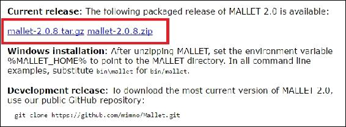
2.  Unzip Mallet into your `C:/ directory`. Your `C:/` drive will have a directory named `C:\mallet-2.0.8RC2` or similar: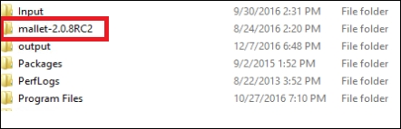
3.  Inside the directory, the files and folders will look something as the following screenshot shows. The actual runnable file is in the bin folder and there are some sample datasets in the sample-data folder:
4.  Go to `Control Panel\System and Security\System` in your Windows PC. Click on **Advanced system settings**.
5.  Now, you will see a system property window. Click on the **Environment Variables**... button: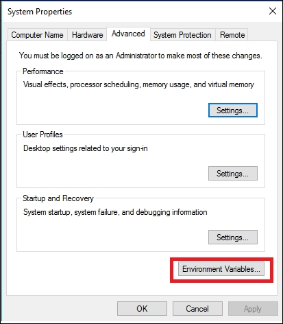
6.  This will open a window for setting up environment variables. Click on **New** for system variables:
7.  在**变量名**文本框中，输入`MALLET_HOME`。并在**变量值**文本框中，给出路径`C:\mallet-2.0.8RC2`。点击**确定**关闭窗口。
8.  要查看 mallet 是否已正确安装，请打开命令提示符窗口，转到 Mallet 目录的 bin 文件夹，并键入 Mallet。您应该会看到所有可以在屏幕上使用的 Mallet 2.0 命令:


现在，你可以使用木槌了。在任何时候，如果您对命令或参数不确定，您可以使用 Mallet append-help 中的 Mallet 2.0 命令。这将列出特定 Mallet 2.0 命令的所有可能的命令和参数选项:

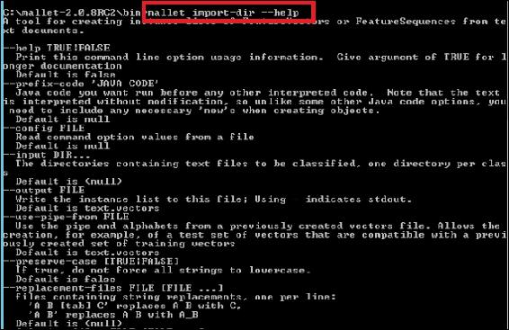

## 怎么做...

1.  The Mallet distribution folder in your `C:/` drive has a directory named sample-data. This directory contains another directory named web. Inside web, you will find two more directories-the directory named en contains a few text files that are text versions of a few English web articles, and the directory named de contains a few text files that are text versions of a few German web articles. The en directory can be seen as our dataset or corpus for this recipe and you will be extracting topics from these web articles. If you have your own set of documents for which you need to extract topics, just imagine the following tasks that you are going to do by simply replacing the en directory with the directory where your documents reside.

    为此，首先将文本文件转换成一个单独的文件，这个文件是 Mallet 类型的，是二进制的，不可读的。从命令行，转到`C:\mallet-2.0.8RC2/bin`并键入以下命令:

    ```java
     mallet import-dir --input C:\mallet-2.0.8RC2\sample-
              data\web\en --output c:/web.en.mallet --keep-sequence --
                remove-stopwords

    ```

    该命令在您的`C:/`驱动器中创建一个 Mallet 文件，名为 web.en.mallet，方法是保留 en 目录中列出的数据文件的原始序列，从标准英语词典中删除停用词。

    如果您希望模型在建模过程中考虑文本的二元模型，请将该命令替换为:

    ### 注意

    `mallet import-dir --input C:\mallet-2.0.8RC2\sample-data\web\en --output c:/web.en.mallet --keep-sequence-bigrams --remove-stopwords`

2.  Type in the following command to run Mallet's topic modelling routing with default settings on the `we.en.mallet` file:

    ```java
    mallet train-topics --input c:/web.en.mallet

    ```

    该命令将在命令提示符下生成如下信息:

    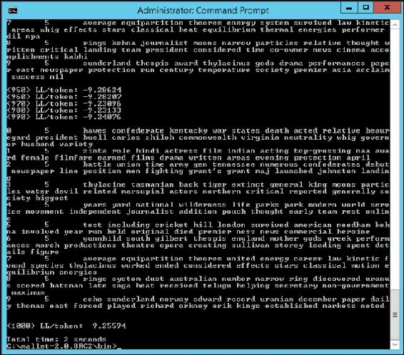

    让我们检查输出。Mallet 主题建模输出的第二行包含一行:

    ```java
    1       5       zinta role hindi actress film indian acting 
             top-grossing naa award female filmfare earned films drama written areas evening 
             protection april

    ```

    如果你是一个印地语电影迷，那么你会立刻明白这个话题是关于女演员普丽缇·泽塔的印地语电影。为了确认，您可以查看在`C:\mallet-2.0.8RC2\sample-data\web\en`目录中名为`zinta.txt`的文件。

    输出中的 1 表示段落编号(编号从 0 开始)，5 是主题的*狄利克雷参数*(可以看做是主题的权重)。由于我们没有设置它，这个数字将是输出中所有段落的默认值。

    ### 注意

    MALLET 包含了主题建模和提取的随机性元素，因此每次程序运行时，即使是在相同的数据集上，关键字列表看起来也会不同。因此，如果您的输出与本食谱中概述的不同，不要认为有什么地方出错了。

    这一步中的命令太普通了，没有使用 Mallet 中任何精彩的参数，并且在控制台上显示结果。

3.  Next, we will be applying topic modelling on the same data but with more options and we will output the topics to an external file so that we can further use them. On your command prompt, type in the following:

    ```java
     mallet train-topics --input c:/web.en.mallet --num-topics 20--
              num-top-words 20 --optimize-interval 10 --xml-topic-phrase-
                report C:/web.en.xml

    ```

    该命令表示我们将使用`c:/web.en.mallet` 文件作为输入，为数据生成最多 20 个主题，打印前 20 个主题，并在`c:/web.en.xml`文件中输出结果。`--optimize`-区间用于通过打开超参数优化来生成更好的主题模型，最终通过将一些主题优先于其他主题来允许模型更好地拟合数据。

    运行该命令后，您将看到在您的`C:/`驱动器中，生成了一个名为`web.en.xml`的 XML 文件。如果您打开该文件，您将看到类似以下内容:

    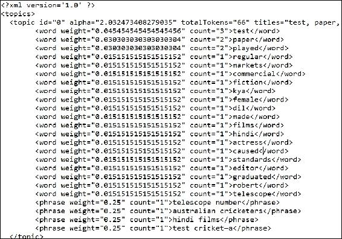
4.  There are some other options in Mallet that you can use when you use topic modelling. One of the important options is the *alpha* parameter, Which is known as the smoothing parameter for the topic distribution. Try the following command:

    ```java
     mallet train-topics --input c:/web.en.mallet --num-topics 20--
              num-top-words 20 --optimize-interval 10 --alpha 2.5 --xml-
                topic-phrase-report C:/web.en.xml

    ```

    ### Tip

    Set *. The rule of thumb for the alpha* value is 50/T, where t is the number of topics you select with the-num-topics [NUMBER] option. So, if you generate 20 themes, you should set the value of alpha to 50/20 = 2.5\.

    If-random-seed is not set to generate a theme model for the document, randomness will be applied, and a slightly/completely different xml file will be generated using the theme every time.

5.  Mallet 还以不同的格式生成输出，以多种不同的方式帮助分析主题。在命令行中键入以下命令:

```java
 mallet train-topics --input c:/web.en.mallet --num-topics 20--
          num-top-words 20 --optimize-interval 10 --output-state 
            C:\web.en.gz  --output-topic-keys C:\web.en.keys.txt --
               output-doc-topics c:/web.en.composition.txt

```

该命令将在您的`C:/`驱动器中生成三个新文件。

*   `C:\web.en.gz` contains a file where every word in your corpus and the topic it belongs to. A partial look of the file can be as follows: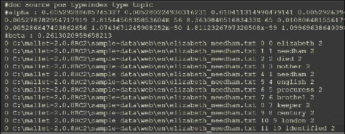
*   `C:\web.en.keys.txt`包含我们已经在步骤 2 中在控制台上看到的数据，即主题编号、权重和每个主题的热门关键词。
*   `C:/web.en.composition.txt`包含您导入的每个原始文本文件中每个主题的百分比细分。以下是该文件的部分外观。可以使用任何电子表格应用程序(如 Microsoft Excel)打开该文件。


在大多数情况下，这些是您将用来从文章集中提取主题的关键命令。在这个食谱中遵循的步骤是从文本集合中提取主题。如果您有一篇需要提取主题的文章，请将这篇文章放在一个目录中，并将其视为单个文档的语料库。

在我们完成菜谱之前，让我们来看看 Mallet 可以使用的主题建模算法:

*   皱胃向左移
*   并行 LDA
*   DMR·艾达
*   分级 LDA
*   标签 LDA
*   多语种主题模型
*   分层弹球分配模型
*   加权主题模型
*   具有集成短语发现的 LDA
*   使用具有负采样的跳跃图的单词嵌入(word2vec)


# 使用木槌对文本文档进行分类

本章的最后两个方法是经典的机器学习分类问题——使用语言建模对文档进行分类。在这个菜谱中，我们将使用 Mallet 及其命令行界面来训练一个模型，并将该模型应用于看不见的测试数据。

木槌分类取决于三个步骤:

1.  将您的培训文档转换成 Mallet 的本地格式。
2.  根据培训文档培训您的模型。
3.  应用该模型对看不见的测试文档进行分类。

当提到需要将训练文档转换成 Mallet 的原生格式时，其技术含义是将文档转换成特征向量。您不需要从您的培训或测试文档中提取任何特性，因为 Mallet 会处理这些。您可以在物理上分离培训和测试数据，或者您可以有一个文档的平面列表，并从命令行选项中分割培训和测试部分。

让我们考虑一个简单的设置:您有纯文本文件中的文本数据，每个文档一个文件。不需要识别文档的开始或结束。文件将被组织在目录中，其中具有相同类别标签的所有文档将被包含在一个目录中。例如，如果您的文本文件有两个类，spam 和 ham，那么您需要创建两个目录——一个包含所有的 spam 文档，另一个包含所有的 ham 文档。

## 准备就绪

1.  Mallet 的安装已经在前面的名为使用 Mallet 从文本文档中提取主题的菜谱中详细介绍过了，因此我们将避免重复。
2.  打开网页浏览器，粘贴以下网址:[http://www . cs . CMU . edu/AFS/cs/project/theo-11/www/naive-Bayes/20 _ news groups . tar . gz](http://www.cs.cmu.edu/afs/cs/project/theo-11/www/naive-bayes/20_newsgroups.tar.gz)。这将下载一个文件夹，其中包含分类在 20 个不同目录中的新闻文章。将它保存在 Mallet 安装目录中:

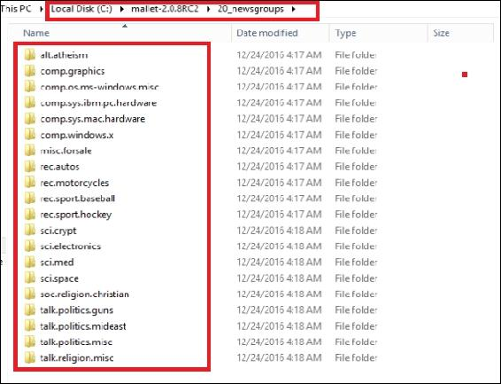

## 怎么做...

1.  打开一个命令提示窗口，进入`Mallet`安装文件夹的 bin 文件夹。
2.  Write the following command while you are inside the bin folder:

    ```java
     mallet import-dir --input C:\mallet-2.0.8RC2\20_newsgroups\*--
              preserve-case --remove-stopwords --binary-features --gram-
                sizes 1 --output C:\20_newsgroup.classification.mallet

    ```

    该命令将获取`C:\mallet-2.0.8RC2\20_newsgroups`文件夹中的所有文档，删除其中的停用词，保留文档中单词的实际大小写，并创建 gram 大小为 1 的二进制特征。Mallet 从文档中输出的本地文件格式将被保存为`C:\20_newsgroup.classification.mallet.`

    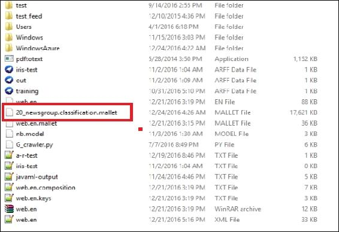
3.  Next, create a Maximum Entropy classifier from the data using the following command. The command takes the output of the previous step as input, creates a Naïve Bayes classifier from the binary features with 1-grams and outputs the classifier as `C:\20_newsgroup.classification.classifier`:

    ```java
     mallet train-classifier --trainer NaiveBayes --input 
            C:\20_newsgroup.classification.mallet --output-classifier 
            C:\20_newsgroup.classification.classifier

    ```

    

    除了朴素贝叶斯，Mallet 还支持许多其他算法。以下是完整的列表:

    *   adaboost 算法
    *   制袋材料
    *   扬
    *   C45 决策树
    *   合奏教练
    *   最大熵分类器(多项式逻辑回归)
    *   朴素贝叶斯
    *   秩最大熵分类器
    *   后验正则化辅助模型

4.  Besides training on the full dataset, you can also provide a portion of data to be used as training data and the rest as test data; and based on the test data's actual class labels, you can see the classifier's prediction performance.

    在 bin 文件夹中编写以下命令:

    ```java
     mallet train-classifier --trainer NaiveBayes --input 
              C:\20_newsgroup.classification.mallet --training-portion 0.9

    ```

    该命令随机选择 90%的数据，并在这些数据上训练朴素贝叶斯分类器。最后，通过看不到它们的实际标签，将分类器应用于剩余的 10%数据；它们的实际类别仅在分类器评估期间被考虑。

    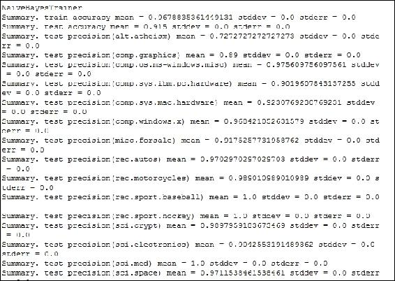

    该命令为您提供了 20 个类别的分类器的总体准确性，以及每个类别的精确度、召回率和准确性，以及标准误差。

5.  您也可以多次运行培训和测试；每次训练和测试集将被随机选择。例如，如果您想在 90%的数据上训练您的分类器，并在剩下的 10%的数据上用随机分割测试分类器 10 次，使用下面的命令:

    ```java
     mallet train-classifier --trainer NaiveBayes --input 
            C:\20_newsgroup.classification.mallet --training-portion 0.9--
              num-trials 10

    ```

6.  You can also do cross-validation using Mallet where you can specify number of folds to be created during cross validation. For instance, if you want to do a 10-fold cross validation, use the following command:

    ```java
     mallet train-classifier --trainer NaiveBayes --input 
              C:\20_newsgroup.classification.mallet --cross-validation 10

    ```

    该命令将为您提供 10 次试验中每一次的单独结果，每次都包含原始数据的新测试部分以及 10 次试验的平均结果。Mallet 还给出了一个混淆矩阵，这对数据科学家更好地理解他们的模型真的很重要。

    
7.  Mallet 允许您比较从不同算法开发的多个分类器的性能。例如，下面的命令将给出使用朴素贝叶斯和使用 10 重交叉验证的最大熵的两个分类器的比较:

    ```java
     mallet train-classifier --trainer MaxEnt --trainer NaiveBayes-
             -input C:\20_newsgroup.classification.mallet --cross-
                validation 10

    ```

8.  If you want to use your saved classifier on a set of unseen test documents (which is not our case as we have used the entire directory for training in step 2), you can use the following command:

    ```java
     mallet classify-dir --input <directory containing unseen test  
             data> --output - --classifier 
               C:\20_newsgroup.classification.classifier

    ```

    这个命令将会在控制台上显示你未看到的测试文档的预测类。还可以使用以下命令将预测保存在制表符分隔的值文件中:

    ```java
     mallet classify-dir --input <directory containing unseen test 
             data> --output <Your output file> --classifier 
               C:\20_newsgroup.classification.classifier

    ```

9.  最后，还可以在单个看不见的测试文档上使用一个保存的分类器。为此，请使用以下命令:

```java
 mallet classify-file --input <unseen test data file path> --
        output - --classifier 
          C:\20_newsgroup.classification.classifier

```

这个命令将会在控制台上显示出你未看到的测试文档的预测类。还可以使用以下命令将预测保存在制表符分隔的值文件中:

```java
 mallet classify-file --input <unseen test data file path> --
        output <Your output file> --classifier C:\20_ne
         wsgroup.classification.classifier

```


# 使用 Weka 对文本文档进行分类

我们在[第 4 章](ch04.html "Chapter 4. Learning from Data - Part 1")、*从数据中学习-第 1 部分*中使用 Weka 对非文本格式的数据点进行分类。Weka 也是使用机器学习模型对文本文档进行分类的非常有用的工具。在这个菜谱中，我们将演示如何使用 Weka 3 来开发文档分类模型。

## 准备就绪

1.  要下载 Weka，请前往[http://www.cs.waikato.ac.nz/ml/weka/downloading.html](http://www.cs.waikato.ac.nz/ml/weka/downloading.html)，你会找到 Windows、Mac 和其他操作系统(如 Linux)的下载选项。仔细阅读选项并下载合适的版本。在撰写本书期间，3.9.0 是开发人员的最新版本，由于作者已经在他的 64 位 Windows 机器上安装了 1.8 版本的 JVM，他选择了*来下载一个用于 64 位 Windows 的自解压可执行文件，无需 Java VM。*
2.  下载完成后，双击可执行文件并按照屏幕上的说明进行操作。你需要安装 Weka 的*完整*版本。
3.  安装完成后，不要运行该软件。相反，转到安装它的目录，找到 Weka 的 Java 归档文件(weka.jar)。将这个文件作为外部库添加到 Eclipse 项目中。
4.  将在该配方中使用的示例文档文件将保存在目录中。每个目录包含相似类别的文档。要下载示例文档，请打开 web 浏览器，复制并粘贴以下 URL:[https://WEKA . wikispaces . com/file/view/text _ example . zip/82917283/text _ example . zip](https://weka.wikispaces.com/file/view/text_example.zip/82917283/text_example.zip)。这将提示您保存文件(如果您的浏览器配置为询问您保存文件的位置)。将文件保存在您的`C:/`驱动器上。解压缩文件，您将看到如下所示的目录结构:


每个目录包含一些属于特定类的 html 文件。这些类别具有标签 class1、class2 和 class3。

现在，您已经为使用 Weka 对这些文档进行分类做好了准备。

## 怎么做...

1.  创建一个类和一个`main()`方法来存放你所有的代码。main 方法会抛出异常:

    ```java
            public class WekaClassification { 
              public static void main(String[] args) throws Exception { 

    ```

2.  创建一个加载器，通过设置父目录到加载器的路径来加载所有类目录的父目录:

    ```java
            TextDirectoryLoader loader = new TextDirectoryLoader(); 
            loader.setDirectory(new File("C:/text_example")); 

    ```

3.  从加载的 html 文件创建实例:

    ```java
            Instances data = loader.getDataSet(); 

    ```

4.  从数据字符串中创建单词向量。为此，首先创建一个过滤器，将字符串转换为单词向量，然后为过滤器设置上一步的原始数据:

    ```java
            StringToWordVector filter = new StringToWordVector(); 
            filter.setInputFormat(data); 

    ```

5.  为了完成字符串到单词的向量转换，使用这个过滤器从数据中创建实例:

    ```java
            Instances dataFiltered = Filter.useFilter(data, filter); 

    ```

6.  从这个单词向量生成一个朴素贝叶斯分类器:

    ```java
            NaiveBayes nb = new NaiveBayes(); 
            nb.buildClassifier(dataFiltered); 

    ```

7.  此时，你也可以考虑看看你的模型是什么样子的。为此，在控制台上打印您的模型:

    ```java
            System.out.println("\n\nClassifier model:\n\n" + nb); 

    ```

8.  A partial output on your screen will look like the following: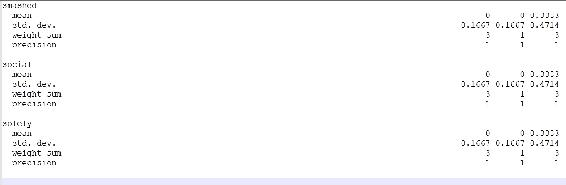
9.  要使用 k-fold 交叉验证评估模型，请编写以下代码:

```java
        Evaluation eval = null; 
        eval = new Evaluation(dataFiltered); 
        eval.crossValidateModel(nb, dataFiltered, 5, new Random(1)); 
        System.out.println(eval.toSummaryString()); 

```

这将在控制台上打印分类器评估:

```java
Correctly Classified Instances           1               14.2857 % 
Incorrectly Classified Instances         6               85.7143 % 
Kappa statistic                         -0.5    
Mean absolute error                      0.5714 
Root mean squared error                  0.7559 
Relative absolute error                126.3158 % 
Root relative squared error            153.7844 % 
Total Number of Instances                7

```

请注意，我们使用了五重交叉验证，而不是标准的 10 重交叉验证，因为文档的数量少于 10(确切地说，是 7)。

食谱的完整代码如下:

```java
import weka.core.*; 
import weka.core.converters.*; 
import weka.classifiers.Evaluation; 
import weka.classifiers.bayes.NaiveBayes; 
import weka.filters.*; 
import weka.filters.unsupervised.attribute.*; 

import java.io.*; 
import java.util.Random; 

public class WekaClassification { 
   public static void main(String[] args) throws Exception { 
      TextDirectoryLoader loader = new TextDirectoryLoader(); 
      loader.setDirectory(new File("C:/text_example")); 
      Instances data = loader.getDataSet(); 

      StringToWordVector filter = new StringToWordVector(); 
      filter.setInputFormat(data); 
      Instances dataFiltered = Filter.useFilter(data, filter); 

      NaiveBayes nb = new NaiveBayes(); 
      nb.buildClassifier(dataFiltered); 
      System.out.println("\n\nClassifier model:\n\n" + nb); 

      Evaluation eval = null; 
      eval = new Evaluation(dataFiltered); 
      eval.crossValidateModel(nb, dataFiltered, 5, new Random(1)); 
      System.out.println(eval.toSummaryString()); 
   } 
} 

```*