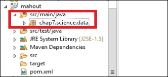
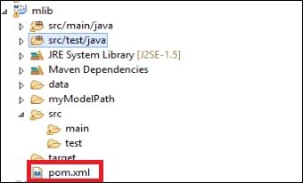
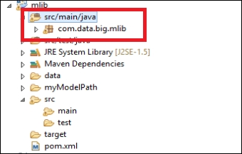

# 七、处理大数据

在本章中，我们将介绍以下配方:

*   使用 Apache Mahout 训练在线逻辑回归模型
*   使用 Apache Mahout 应用在线逻辑回归模型
*   用 Apache Spark 解决简单的文本挖掘问题
*   基于 MLib 的 KMeans 聚类算法
*   使用 MLib 创建线性回归模型
*   使用 MLib 通过随机森林模型对数据点进行分类

# 简介

在这一章中，你会看到大数据框架中用到的三个关键技术，对数据科学家来说极其有用:Apache Mahout、Apache Spark，以及其名为 MLib 的机器学习库。

我们将从 Apache Mahout 开始这一章，Apache Mahout 是一个可伸缩的或分布式的机器学习平台，用于分类、回归、聚类和协作过滤任务。Mahout 最初是一个机器学习工作台，只在 Hadoop MapReduce 上工作，但最终选择了 Apache Spark 作为其平台。

Apache Spark 是一个在大数据处理中引入并行化的框架，与 MapReduce 相似，因为它也跨集群分布数据。但 Spark 和 MapReduce 之间的一个关键区别是，前者试图尽可能地将内容保存在内存中，而后者则不断地从磁盘中读写。所以 Spark 比 MapReduce 快很多。我们将看到，作为一名数据科学家，您如何使用 Spark 来完成简单的文本挖掘相关任务，例如计算空行或获取大型文件中单词的频率。使用 Spark 的另一个原因是，它不仅可以与 Java 一起使用，还可以与 Python、Scala 等其他流行语言一起使用；对于 MapReduce，通常的选择是 Java。

MLib 是来自 Apache Spark 的可扩展机器学习库，它实现了多种分类、回归、聚类、协作过滤和特征选择算法。它基本上坐在 Spark 上，利用它的速度来解决机器学习问题。在本章中，你将看到如何使用这个库来解决分类、回归和聚类问题。

### 注意

在本书中，我们已经使用了 0.9 版本的 Mahout，但是有兴趣的读者可以在这里看看 Mahout 0.10.x 和 MLib 的区别:[http://www . weatheringthroughtechdays . com/2015/04/Mahout-010 x-first-Mahout-release-as . html](http://www.weatheringthroughtechdays.com/2015/04/mahout-010x-first-mahout-release-as.html)。


# 使用 Apache Mahout 训练在线逻辑回归模型

在这个菜谱中，我们将使用 Apache Mahout 来训练一个使用 Apache Mahout Java 库的在线逻辑回归模型。

## 准备就绪

1.  In Eclipse, create a new Maven project. The author had Eclipse Mars set up. To do so, go to **File**. Then select **New** and **Other...**:
2.  Then, expand Maven from the wizard and select Maven Project. Click on **Next** until you reach the window where Eclipse prompts you to provide an **Artifact Id**. Type in `mahout` as **Artifact Id**, and the grayed out Finish button will become visible. Click on **Finish**. This will create a Maven project for you named mahout:
3.  Double-click on `pom.xml` from your Eclipse Package Explorer to edit:
4.  点击`pom.xml`选项卡。现在你会在屏幕上看到`pom.xml`文件。将下面几行放到您的`<dependencies>...</dependencies>`标签内的`pom.xml`中，并保存它。这将自动下载依赖 JAR 文件到您的项目:

    ```java
          <dependency> 
             <groupId>org.apache.mahout</groupId> 
             <artifactId>mahout-core</artifactId> 
             <version>0.9</version> 
          </dependency> 
          <dependency> 
             <groupId>org.apache.mahout</groupId> 
             <artifactId>mahout-examples</artifactId>  
             <version>0.9</version> 
          </dependency> 
          <dependency> 
             <groupId>org.apache.mahout</groupId> 
             <artifactId>mahout-math</artifactId> 
             <version>0.9</version> 
          </dependency> 

    ```

5.  Create a package named `chap7.science.data` in your project under `src/main/java directory`:
6.  在 Eclipse 中右键单击项目名称，选择**新建**，然后选择文件夹。您将创建两个文件夹。第一个文件夹将包含您将为其创建模型的输入数据集，其名称将为`data`。第二个文件夹将被命名为`model`，您将在其中保存您的模型。现在输入`data`作为文件夹名，点击**完成**。重复这个步骤，创建一个名为`model`的文件夹。
7.  用以下数据在`data`文件夹中创建一个名为`weather.numeric.csv`的 CSV 文件:

    ```java
            outlook,temperature,humidity,windy,play 
            sunny,85,85,FALSE,no 
            sunny,80,90,TRUE,no 
            overcast,83,86,FALSE,yes 
            rainy,70,96,FALSE,yes 
            rainy,68,80,FALSE,yes 
            rainy,65,70,TRUE,no 
            overcast,64,65,TRUE,yes 
            sunny,72,95,FALSE,no 
            sunny,69,70,FALSE,yes 
            rainy,75,80,FALSE,yes 
            sunny,75,70,TRUE,yes 
            overcast,72,90,TRUE,yes 
            overcast,81,75,FALSE,yes 
            rainy,71,91,TRUE,no 

    ```

8.  现在您已经准备好编码了。

## 怎么做...

1.  在您刚刚创建的包中，创建一个名为`OnlineLogisticRegressionTrain.java`的 Java 类。双击类文件，写下您的代码。创建一个名为`OnlineLogisticRegressionTrain` :

    ```java
            public class OnlineLogisticRegressionTrain { 

    ```

    的类
2.  开始编写你的`main`方法:

    ```java
            public static void main(String[] args) throws IOException { 

    ```

3.  创建两个`String`变量来包含输入数据文件路径和您将要构建和保存的模型文件的路径:

    ```java
            String inputFile = "data/weather.numeric.csv"; 
            String outputFile = "model/model"; 

    ```

4.  现在创建一个包含数据文件特性的列表:

    ```java
            List<String> features =Arrays.asList("outlook", "temperature", 
              "humidity", "windy", "play"); 

    ```

5.  此步骤列出数据文件的所有特征名称，并按照它们在数据文件中出现的顺序排列。
6.  接下来，定义每个特征的类型。特征类型`w`表示名义特征，特征类型`n`表示数字特征类型:

    ```java
            List<String> featureType = Arrays.asList("w", "n", "n", "w", 
            "w"); 

    ```

7.  现在是时候设置分类器的参数了。在此步骤中，您将创建一个参数变量，并将一些值设置为参数。您将设置目标变量或类变量(在我们的例子中是`"play"`)。如果您看一下数据，您会发现类变量“play”最多取两个值——是或否。因此，您会将最大目标类别设置为`2`。接下来，您将设置非类特征的数量(在我们的例子中是`4`)。接下来的三个参数取决于算法。在这个方法中，您将不会使用任何偏差来生成分类器，您将使用一个平衡学习率`0.5`。最后，您需要使用类型映射方法设置特性及其类型:

    ```java
            LogisticModelParameters params = new 
              LogisticModelParameters(); 
            params.setTargetVariable("play"); 
            params.setMaxTargetCategories(2); 
            params.setNumFeatures(4); 
            params.setUseBias(false); 
            params.setTypeMap(features,featureType); 
            params.setLearningRate(0.5); 

    ```

8.  您将使用`10 passes`创建分类器。这个数字是任意的，你可以选择你凭经验找到的任何数字:

    ```java
            int passes = 10; 

    ```

9.  创建在线线性回归分类器:

    ```java
            OnlineLogisticRegression olr;     

    ```

10.  创建一个变量从 CSV 文件中读取数据，并开始创建回归模型:

    ```java
            CsvRecordFactory csv = params.getCsvRecordFactory(); 
            olr = params.createRegression(); 

    ```

11.  接下来，您将创建一个`for`循环来遍历每个`10 passes` :

    ```java
            for (int pass = 0; pass < passes; pass++) { 

    ```

12.  开始读取数据文件:

    ```java
            BufferedReader in = new BufferedReader(new 
              FileReader(inputFile)); 

    ```

13.  获取数据文件的文件头，它由特性的名称组成:

    ```java
            csv.firstLine(in.readLine()); 

    ```

14.  读取数据行:

    ```java
            String row = in.readLine(); 

    ```

15.  现在循环遍历不是`null` :

    ```java
            while (row != null) { 

    ```

    的每一行
16.  现在对于每一行(或数据行)，显示数据点，并创建一个输入向量:

    ```java
            System.out.println(row); 
            Vector input = new 
              RandomAccessSparseVector(params.getNumFeatures()); 

    ```

17.  获取行

    ```java
            int targetValue = csv.processLine(row, input); 

    ```

    的`targetValue`
18.  `Train`具有该数据点的模型:

    ```java
            olr.train(targetValue, input); 

    ```

19.  阅读下一个`row` :

    ```java
            row = in.readLine(); 

    ```

20.  闭环:

    ```java
            } 

    ```

21.  关闭阅读器阅读输入数据文件:

    ```java
            in.close(); 

    ```

22.  关闭循环以遍历路径:

    ```java
            } 

    ```

23.  最后，将`output`模型保存到 Eclipse 项目

    ```java
            OutputStream modelOutput = new FileOutputStream(outputFile); 
            try { 
                params.saveTo(modelOutput); 
            } finally { 
                modelOutput.close(); 
            } 

    ```

    的`model`目录下名为`model`的文件中
24.  关闭`main`方法和类:

    ```java
            } 
            } 

    ```

25.  如果您运行代码，您将在控制台上看到输入数据文件的数据行作为您的输出，并且在学习的模型中，它将保存在您的 Eclipse 项目的模型目录中。

食谱的完整代码如下:

```java
package chap7.science.data; 

import java.io.BufferedReader; 
import java.io.FileOutputStream; 
import java.io.FileReader; 
import java.io.IOException; 
import java.io.OutputStream; 
import java.util.Arrays; 
import java.util.List; 
import org.apache.mahout.classifier.sgd.CsvRecordFactory; 
import org.apache.mahout.classifier.sgd.LogisticModelParameters; 
import org.apache.mahout.classifier.sgd.OnlineLogisticRegression; 
import org.apache.mahout.math.RandomAccessSparseVector; 
import org.apache.mahout.math.Vector; 

public class OnlineLogisticRegressionTrain { 

   public static void main(String[] args) throws IOException { 
      String inputFile = "data/weather.numeric.csv"; 
      String outputFile = "model/model"; 

      List<String> features =Arrays.asList("outlook", "temperature", 
        "humidity", "windy", "play"); 
      List<String> featureType = Arrays.asList("w", "n", "n", "w", 
        "w"); 
      LogisticModelParameters params = new LogisticModelParameters(); 
      params.setTargetVariable("play"); 
      params.setMaxTargetCategories(2); 
      params.setNumFeatures(4); 
      params.setUseBias(false); 
      params.setTypeMap(features,featureType); 
      params.setLearningRate(0.5); 

      int passes = 10; 
      OnlineLogisticRegression olr;     

      CsvRecordFactory csv = params.getCsvRecordFactory(); 
      olr = params.createRegression(); 

      for (int pass = 0; pass < passes; pass++) { 
         BufferedReader in = new BufferedReader(new 
           FileReader(inputFile)); 
         csv.firstLine(in.readLine()); 
         String row = in.readLine(); 
         while (row != null) { 
            System.out.println(row); 
            Vector input = new 
              RandomAccessSparseVector(params.getNumFeatures()); 
            int targetValue = csv.processLine(row, input); 
            olr.train(targetValue, input); 
            row = in.readLine(); 
         } 
         in.close(); 
      } 

      OutputStream modelOutput = new FileOutputStream(outputFile); 
      try { 
         params.saveTo(modelOutput); 
      } finally { 
         modelOutput.close(); 
      } 
   } 
} 

```


# 使用 Apache Mahout 应用在线逻辑回归模型

在这个菜谱中，我们将演示如何使用 Apache Mahout 对看不见的、未标记的测试数据应用在线逻辑回归模型。请注意，这个配方与上一个配方非常相似，需要您使用训练数据来建立模型。这个要求在前面的配方中已经演示过了。

## 准备就绪

1.  完成前面的配方后，转到您创建的项目文件夹，进入您在最后一个配方中创建的名为`model`的目录。您应该会在那里看到一个`model`文件。
2.  接下来，创建一个测试文件。转到您在上一个配方的项目文件夹中创建的`data`文件夹。用以下数据创建一个名为`weather.numeric.test.csv`的测试文件:

    ```java
            outlook,temperature,humidity,windy,play 
            overcast,90,80,TRUE,yes 
            overcast,95,88,FALSE,yes 
            rainy,67,78,TRUE,no 
            rainy,90,97,FALSE,no 
            sunny,50,67,FALSE,yes 
            sunny,67,75,TRUE,no 

    ```

3.  在名为 mahout 的 Eclipse 项目中，您应该会在`src/main/java folder`中看到名为`chap7.science.data`的包。这个包是在前一个配方中创建的。在这个包中创建一个名为`OnlineLogisticRegressionTest.java`的 Java 类。双击要编辑的 Java 类文件。

## 怎么做...

1.  创建`class` :

    ```java
            public class OnlineLogisticRegressionTest { 

    ```

2.  声明几个类变量。首先，创建两个变量来保存您的测试文件`data`和`model`的路径(您在上一个菜谱中创建的):

    ```java
            private static String inputFile = 
              "data/weather.numeric.test.csv"; 
            private static String modelFile = "model/model"; 

    ```

3.  开始创建你的`main`方法:

    ```java
            public static void main(String[] args) throws Exception { 

    ```

4.  创建一个类类型 AUC 的变量，因为您将计算您的分类器的曲线下面积 ( **AUC** )作为性能指标:

    ```java
            Auc auc = new Auc(); 

    ```

5.  接下来，从`model`文件中读取并加载在线逻辑回归算法的参数:

    ```java
            LogisticModelParameters params = 
              LogisticModelParameters.loadFrom(new File(modelFile)); 

    ```

6.  创建一个变量来读取测试数据文件:

    ```java
            CsvRecordFactory csv = params.getCsvRecordFactory(); 

    ```

7.  创建一个`onlinelogisticregression`分类器:

    ```java
            OnlineLogisticRegression olr = params.createRegression(); 

    ```

8.  现在读取测试数据文件:

    ```java
            InputStream in = new FileInputStream(new File(inputFile)); 
            BufferedReader reader = new BufferedReader(new 
              InputStreamReader(in, Charsets.UTF_8)); 

    ```

9.  测试数据文件的第一行是文件头或特性列表。因此，您将从分类中忽略这一行，并读取下一行(或行或数据点):

    ```java
            String line = reader.readLine(); 
            csv.firstLine(line); 
            line = reader.readLine(); 

    ```

10.  您可能希望在控制台上显示分类结果。为此创建一个`PrintWriter`变量:

    ```java
            PrintWriter output=new PrintWriter(new 
              OutputStreamWriter(System.out, Charsets.UTF_8), true); 

    ```

11.  您将打印预测类、`model's output`和`log likelihood`。创建标题并在控制台上打印:

    ```java
            output.println(""class","model-output","log-likelihood""); 

    ```

12.  现在遍历每一个不为空的行:

    ```java
            while (line != null) { 

    ```

13.  为您的测试数据:

    ```java
            Vector vector = new 
              SequentialAccessSparseVector(params.getNumFeatures()); 

    ```

    创建特性`vector`
14.  创建一个变量来保存每行/数据点的实际`classvalue`:

    ```java
            int classValue = csv.processLine(line, vector); 

    ```

15.  对测试数据点进行分类，从分类器

    ```java
            double score = olr.classifyScalarNoLink(vector); 

    ```

    中获取`score`
16.  在控制台上打印以下内容-`classValue`、`score`和`log likelihood` :

    ```java
            output.printf(Locale.ENGLISH, "%d,%.3f,%.6f%n", classValue, 
            score, olr.logLikelihood(classValue, vector)); 

    ```

17.  将`score`和`classvalue`添加到`AUC`变量:

    ```java
            auc.add(classValue, score); 

    ```

18.  阅读下一行并关闭循环:

    ```java
            line = reader.readLine(); 
            } 

    ```

19.  关闭`reader` :

    ```java
            reader.close(); 

    ```

20.  现在让我们打印您的分类的输出。首先，打印`AUC` :

    ```java
            output.printf(Locale.ENGLISH, "AUC = %.2f%n", auc.auc()); 

    ```

21.  接下来，你将打印出你的分类中的困惑。为此制造混乱`matrix`。由于训练/测试数据有两类，你会有一个 *2x2* 混淆`matrix` :

    ```java
            Matrix matrix = auc.confusion(); 
            output.printf(Locale.ENGLISH, "confusion: [[%.1f, %.1f], [%.1f, 
              %.1f]]%n", matrix.get(0, 0), matrix.get(1, 0), matrix.get(0,  
                1), matrix.get(1, 1)); 

    ```

22.  保存`matrix`中的熵值。您不需要为此创建一个新的`matrix`变量，但是如果您愿意，您可以这样做:

    ```java
            matrix = auc.entropy(); 
            output.printf(Locale.ENGLISH, "entropy: [[%.1f, %.1f], [%.1f, 
              %.1f]]%n", matrix.get(0, 0), matrix.get(1, 0), matrix.get(0, 
                1), matrix.get(1, 1)); 

    ```

23.  关闭`main`方法和类:

```java
        } 
        } 

```

食谱的完整代码如下:

```java
package chap7.science.data; 

import com.google.common.base.Charsets; 
import org.apache.mahout.math.Matrix; 
import org.apache.mahout.math.SequentialAccessSparseVector; 
import org.apache.mahout.math.Vector; 
import org.apache.mahout.classifier.evaluation.Auc; 
import org.apache.mahout.classifier.sgd.CsvRecordFactory; 
import org.apache.mahout.classifier.sgd.LogisticModelParameters; 
import org.apache.mahout.classifier.sgd.OnlineLogisticRegression; 
import java.io.BufferedReader; 
import java.io.File; 
import java.io.FileInputStream; 
import java.io.InputStream; 
import java.io.InputStreamReader; 
import java.io.OutputStreamWriter; 
import java.io.PrintWriter; 
import java.util.Locale; 

public class OnlineLogisticRegressionTest { 

   private static String inputFile = "data/weather.numeric.test.csv"; 
   private static String modelFile = "model/model"; 

   public static void main(String[] args) throws Exception { 
      Auc auc = new Auc(); 
      LogisticModelParameters params = 
        LogisticModelParameters.loadFrom(new File(modelFile)); 
      CsvRecordFactory csv = params.getCsvRecordFactory(); 
      OnlineLogisticRegression olr = params.createRegression(); 
      InputStream in = new FileInputStream(new File(inputFile)); 
      BufferedReader reader = new BufferedReader(new 
        InputStreamReader(in, Charsets.UTF_8)); 
      String line = reader.readLine(); 
      csv.firstLine(line); 
      line = reader.readLine(); 
      PrintWriter output=new PrintWriter(new 
        OutputStreamWriter(System.out, Charsets.UTF_8), true); 
      output.println(""class","model-output","log-likelihood""); 
      while (line != null) { 
         Vector vector = new 
            SequentialAccessSparseVector(params.getNumFeatures()); 
         int classValue = csv.processLine(line, vector); 
         double score = olr.classifyScalarNoLink(vector); 
         output.printf(Locale.ENGLISH, "%d,%.3f,%.6f%n", classValue, 
           score, olr.logLikelihood(classValue, vector)); 
         auc.add(classValue, score); 
         line = reader.readLine(); 
      } 
      reader.close(); 
      output.printf(Locale.ENGLISH, "AUC = %.2f%n", auc.auc()); 
      Matrix matrix = auc.confusion(); 
      output.printf(Locale.ENGLISH, "confusion: [[%.1f, %.1f], [%.1f, 
        %.1f]]%n", matrix.get(0, 0), matrix.get(1, 0), matrix.get(0, 
          1), matrix.get(1, 1)); 
      matrix = auc.entropy(); 
      output.printf(Locale.ENGLISH, "entropy: [[%.1f, %.1f], [%.1f,  
        %.1f]]%n", matrix.get(0, 0), matrix.get(1, 0), matrix.get(0, 
          1), matrix.get(1, 1)); 
   } 
} 

```

如果运行该代码，输出将如下所示:

```java
"class","model-output","log-likelihood" 
1,119.133,0.000000 
1,123.028,0.000000 
0,15.888,-15.887942 
0,63.213,-100.000000 
1,-6.692,-6.693089 
0,24.286,-24.286465 
AUC = 0.67 
confusion: [[0.0, 1.0], [3.0, 2.0]] 
entropy: [[NaN, NaN], [0.0, -9.2]]

```


# 使用 Apache Spark 解决简单的文本挖掘问题

根据 Apache Spark 网站，Spark 在内存中运行程序的速度比 Hadoop MapReduce 快 100 倍，在磁盘上快 10 倍。一般来说，Apache Spark 是一个开源的集群计算框架。它的处理引擎提供了良好的速度和易用性，并为数据科学家提供了复杂的分析。

在这个菜谱中，我们将演示如何使用 Apache Spark 来解决非常简单的数据问题。当然，数据问题仅仅是虚拟的问题，而不是真实世界的问题，但是这可以作为一个起点，让您直观地理解 Apache Spark 在大规模使用时的用法。

## 准备就绪

1.  In Eclipse, create a new Maven project. The author had Eclipse Mars set up. To do so, go to **File**. Then select **New** and **Other...**:
2.  Expand Maven from the wizard and select **Maven Project**. Click on **Next** until you reach the window where Eclipse prompts you to provide an **Artifact Id**. Type in `mlib` as the **Artifact Id**, and the grayed-out Finish button will become visible. Click on **Finish**. This will create a Maven project for you named `mlib`:
3.  Double-click on `pom.xml` from your Eclipse Package Explorer to edit:
4.  点击`pom.xml`选项卡。现在你会在屏幕上看到`pom.xml`文件。将下面几行放到您的`<dependencies>...</dependencies>`标签内的`pom.xml`中，并保存它。这将自动下载依赖 JAR 文件到您的项目:

    ```java
            <dependency> 
              <groupId>org.apache.spark</groupId> 
              <artifactId>spark-mllib_2.10</artifactId> 
              <version>1.3.1</version> 
            </dependency>  

    ```

5.  Create a package named `com.data.big.mlib` in your project under `src/main/java directory`:
6.  在 Eclipse 中右键单击项目名称，选择 **New** ，然后选择 Folder。您将创建一个名为`data`的文件夹，用于存放该配方的输入数据文件。
7.  You will be using the literature of William Shakespeare in text format. Open a browser and put the link [http://norvig.com/ngrams/](http://norvig.com/ngrams/). This will open a page named Natural Language Corpus Data: Beautiful Data. In the Files for Download section, you will find a .txt file named `shakespeare`. Download this file anywhere in your system:
8.  在您创建的包中，创建一个名为`SparkTest`的 Java 类文件。双击开始在其中编写代码。

## 怎么做...

1.  创建您的类:

    ```java
            public class SparkTest { 

    ```

2.  开始编写你的`main`方法:

    ```java
            public static void main( String[] args ){ 

    ```

3.  首先，获取输入数据文件的路径。这是您下载的莎士比亚文学文件，保存在项目的 data 文件夹中:

    ```java
            String inputFile = "data/shakespeare.txt"; 

    ```

4.  火花属性用于控制应用程序设置，并为每个应用程序单独配置。设置这些属性的一种方法是使用传递给 SparkContext 的`SparkConf`。`SparkConf`允许您配置一些常用属性:

    ```java
            SparkConf configuration = new 
              SparkConf().setMaster("local[4]").setAppName("My App"); 
            JavaSparkContext sparkContext = new 
              JavaSparkContext(configuration); 

    ```

5.  注意，如果我们使用`local[2]`，它将实现最小的并行性。上述语法使应用程序能够运行四个线程。
6.  JavaRDD 是一个分布式对象集合。创建一个 RDD 对象。该方法中该对象的主要用途是收集`shakespeare.txt`文件中的空行:

    ```java
            JavaRDD<String> rdd = 
               sparkContext.textFile(inputFile).cache();  

    ```

    ### 提示

    如果我们使用`local[*]`，火花将使用系统的所有核心

7.  统计输入数据文件中空行的行数:

    ```java
            long emptyLines = rdd.filter(new Function<String,Boolean>(){ 
              private static final long serialVersionUID = 1L; 
              public Boolean call(String s){ 
              return s.length() == 0; 
              } 
            }).count(); 

    ```

8.  在控制台上打印文件

    ```java
            System.out.println("Empty Lines: " + emptyLines); 

    ```

    中`emptylines`的编号
9.  Next, create the following code snippet to retrieve the word frequencies from the input data file:

    ```java
            JavaPairRDD<String, Integer> wordCounts = rdd 
              .flatMap(s -> Arrays.asList(s.toLowerCase().split(" "))) 
              .mapToPair(word -> new Tuple2<>(word, 1)) 
              .reduceByKey((a, b) -> a + b); 

    ```

    ### Note

    One of the reasons for choosing Apache Spark instead of MapReduce is that it requires less code to achieve the same thing. For example, the lines of code in this step retrieve words and their frequencies from a text document. The same effect can be achieved by using more than 100 lines of MapReduce code, as shown below: [https://Hadoop.apache.org/docs/r1.2.1/mapred _ tutorial.html # example% 3a+wordcount+v2.0](https://hadoop.apache.org/docs/r1.2.1/mapred_tutorial.html#Example%3A+WordCount+v2.0) .

10.  使用`wordCounts` RDD，您可以收集单词和它们的频率作为地图，然后迭代地图并打印单词-频率对:

    ```java
           Map<String, Integer> wordMap = wordCounts.collectAsMap(); 
           for (Entry<String, Integer> entry : wordMap.entrySet()) { 
              System.out.println("Word = " + entry.getKey() + ", Frequency 
                 = " + entry.getValue()); 
           } 

    ```

11.  关闭您创建的`sparkContext`:

    ```java
            sparkContext.close(); 

    ```

12.  关闭`main`方法和类:

```java
       } 
       } 

```

食谱的完整代码如下:

```java
package com.data.big.mlib; 

import java.util.Arrays; 
import java.util.Map; 
import java.util.Map.Entry; 
import org.apache.spark.SparkConf; 
import org.apache.spark.api.java.JavaPairRDD; 
import org.apache.spark.api.java.JavaRDD; 
import org.apache.spark.api.java.JavaSparkContext; 
import org.apache.spark.api.java.function.Function; 
import scala.Tuple2; 
public class SparkTest { 
   public static void main( String[] args ){ 
      String inputFile = "data/shakespeare.txt"; 
      SparkConf configuration = new 
        SparkConf().setMaster("local[4]").setAppName("My App"); 
      JavaSparkContext sparkContext = new 
        JavaSparkContext(configuration); 
      JavaRDD<String> rdd = sparkContext.textFile(inputFile).cache(); 

      long emptyLines = rdd.filter(new Function<String,Boolean>(){ 
         private static final long serialVersionUID = 1L; 
         public Boolean call(String s){ 
            return s.length() == 0; 
         } 
      }).count(); 

      System.out.println("Empty Lines: " + emptyLines); 

      JavaPairRDD<String, Integer> wordCounts = rdd 
          .flatMap(s -> Arrays.asList(s.toLowerCase().split(" "))) 
          .mapToPair(word -> new Tuple2<>(word, 1)) 
          .reduceByKey((a, b) -> a + b); 

      Map<String, Integer> wordMap = wordCounts.collectAsMap(); 
      for (Entry<String, Integer> entry : wordMap.entrySet()) { 
          System.out.println("Word = " + entry.getKey() + ", Frequency 
              = " + entry.getValue()); 
      } 

      sparkContext.close(); 
   } 
} 

```

如果运行该代码，部分输出将如下所示:

```java
Empty Lines: 35941 
...................................................................................................... 

Word = augustus, Frequency = 4 
Word = bucklers, Frequency = 3 
Word = guilty, Frequency = 66 
Word = thunder'st, Frequency = 1 
Word = hermia's, Frequency = 7 
Word = sink, Frequency = 37 
Word = burn, Frequency = 76 
Word = relapse, Frequency = 2 
Word = boar, Frequency = 16 
Word = cop'd, Frequency = 2 

...................................................................................................... 

```

### 注意

能鼓励用户使用 Apache Spark 而不是 MapReduce 的好文章可以在这里找到:[https://www . mapr . com/blog/5-minute-guide-understanding-significance-Apache-Spark](https://www.mapr.com/blog/5-minute-guide-understanding-significance-apache-spark)。


# 使用带 MLib 的 KMeans 算法进行聚类

在本食谱中，我们将演示如何使用带有 MLib 的 KMeans 算法对没有标签的数据点进行聚类。正如本章介绍中所讨论的，MLib 是 Apache Spark 的机器学习组件，是 Apache Mahout 的一个有竞争力(甚至更好)的替代方案。

## 准备就绪

1.  您将使用您在前一个菜谱中创建的 Maven 项目(用 Apache Spark 解决简单的文本挖掘问题)。如果您还没有这样做，请遵循该配方的*准备好*部分中的步骤 1-6。
2.  进入[https://github . com/Apache/spark/blob/master/data/ml lib/k means _ data . txt](https://github.com/apache/spark/blob/master/data/mllib/kmeans_data.txt)，下载数据并另存为`km-data.txt`在您按照步骤 1 中的说明创建的项目的数据文件夹中。或者，您可以在项目的 data 文件夹中创建一个名为`km-data.txt`的文本文件，并从上述 URL 复制粘贴数据。
3.  在您创建的包中，创建一个名为`KMeansClusteringMlib.java`的 Java 类文件。双击开始在其中编写代码。

现在，您已经准备好进行一些编码了。

## 怎么做...

1.  创建一个名为`KMeansClusteringMlib` :

    ```java
            public class KMeansClusteringMlib { 

    ```

    的类
2.  开始编写你的`main`方法:

    ```java
            public static void main( String[] args ){ 

    ```

3.  创建一个 Spark 配置，并使用该配置创建一个 Spark 上下文。注意，如果我们使用`local[2]`，它将实现最小的并行性。以下语法使应用程序能够运行四个线程:

    ```java
            SparkConf configuration = new  
             SparkConf().setMaster("local[4]").setAppName("K-means 
              Clustering"); 
            JavaSparkContext sparkContext = new 
              JavaSparkContext(configuration); 

    ```

4.  现在您将加载并解析您的输入数据:

    ```java
          String path = "data/km-data.txt"; 

    ```

5.  `JavaRDD`是对象的分布式集合。创建一个 RDD 对象来读取数据文件:

    ```java
          JavaRDD<String> data = sparkContext.textFile(path); 

    ```

6.  现在，您需要从前面的 RDD 中读取数据值，这些值由空格分隔。将这些数据值解析并读取到另一个 RDD:

    ```java
             JavaRDD<Vector> parsedData = data.map( 
                new Function<String, Vector>() { 
                   private static final long serialVersionUID = 1L; 

                   public Vector call(String s) { 
                      String[] sarray = s.split(" "); 
                      double[] values = new double[sarray.length]; 
                      for (int i = 0; i < sarray.length; i++) 
                         values[i] = Double.parseDouble(sarray[i]); 
                      return Vectors.dense(values); 
                   } 
                } 
                ); 
             parsedData.cache();   

    ```

7.  现在为 KMeans 聚类算法定义几个参数。我们将只使用两个聚类来分离数据点，最多迭代 10 次。连同解析的数据一起，使用参数值创建一个集群器:

    ```java
          int numClusters = 2; 
          int iterations = 10; 
          KMeansModel clusters = KMeans.train(parsedData.rdd(), 
            numClusters, iterations); 

    ```

8.  计算聚类器集合内的误差平方和:

    ```java
          double sse = clusters.computeCost(parsedData.rdd()); 
             System.out.println("Sum of Squared Errors within set = " + 
               sse); 

    ```

9.  最后，关闭`sparkContext`、`main`方法和类:

```java
         sparkContext.close(); 
       } 
     } 

```

食谱的完整代码如下:

```java
package com.data.big.mlib; 

import org.apache.spark.api.java.*; 
import org.apache.spark.api.java.function.Function; 
import org.apache.spark.mllib.clustering.KMeans; 
import org.apache.spark.mllib.clustering.KMeansModel; 
import org.apache.spark.mllib.linalg.Vector; 
import org.apache.spark.mllib.linalg.Vectors; 
import org.apache.spark.SparkConf; 

public class KMeansClusteringMlib { 
   public static void main( String[] args ){ 
      SparkConf configuration = new 
        SparkConf().setMaster("local[4]").setAppName("K-means 
          Clustering"); 
      JavaSparkContext sparkContext = new 
         JavaSparkContext(configuration); 

      // Load and parse data 
      String path = "data/km-data.txt"; 
      JavaRDD<String> data = sparkContext.textFile(path); 
      JavaRDD<Vector> parsedData = data.map( 
            new Function<String, Vector>() { 
               private static final long serialVersionUID = 1L; 

               public Vector call(String s) { 
                  String[] sarray = s.split(" "); 
                  double[] values = new double[sarray.length]; 
                  for (int i = 0; i < sarray.length; i++) 
                     values[i] = Double.parseDouble(sarray[i]); 
                  return Vectors.dense(values); 
               } 
            } 
            ); 
      parsedData.cache(); 

      // Cluster the data into two classes using KMeans 
      int numClusters = 2; 
      int iterations = 10; 
      KMeansModel clusters = KMeans.train(parsedData.rdd(), 
        numClusters, iterations); 

      // Evaluate clustering by computing Within Set Sum of Squared 
        Errors 
      double sse = clusters.computeCost(parsedData.rdd()); 
      System.out.println("Sum of Squared Errors within set = " + sse); 
      sparkContext.close(); 
   } 
} 

```

如果运行该代码，输出将如下所示:

```java
Sum of Squared Errors within set = 0.11999999999994547

```


# 使用 MLib 创建线性回归模型

在本菜谱中，您将了解如何使用线性回归模型来构建 MLib 模型。

## 准备就绪

1.  您将使用您在名为*的菜谱中创建的 Maven 项目，通过 Apache Spark* 解决简单的文本挖掘问题。如果您还没有这样做，那么请按照该食谱的*准备*部分中的步骤 1-6 进行操作。
2.  转到[https://github . com/Apache/spark/blob/master/data/ml lib/ridge-data/lpsa . data](https://github.com/apache/spark/blob/master/data/mllib/ridge-data/lpsa.data)，下载数据，并另存为按照步骤 1 中的说明创建的项目的数据文件夹中的`lr-data.txt`。或者，您可以在项目的 data 文件夹中创建一个名为`lr-data.txt`的文本文件，并从上述 URL 复制粘贴数据。
3.  在您创建的包中，创建一个名为`LinearRegressionMlib.java`的 Java 类文件。双击开始在其中编写代码。

现在，您已经准备好进行一些编码了。

## 怎么做...

1.  创建一个名为`LinearRegressionMlib` :

    ```java
            public class LinearRegressionMlib { 

    ```

    的类
2.  开始编写你的`main`方法:

    ```java
            public static void main(String[] args) { 

    ```

3.  创建一个 Spark 配置，并使用该配置创建一个 Spark 上下文。注意，如果我们使用`local[2]`，它将实现最小的并行性。以下语法使应用程序能够运行四个线程:

    ```java
            SparkConf configuration = new 
              SparkConf().setMaster("local[4]").setAppName("Linear 
                 Regression"); 
            JavaSparkContext sparkContext = new 
              JavaSparkContext(configuration); 

    ```

4.  现在您将加载并解析您的输入数据:

    ```java
            String inputData = "data/lr-data.txt"; 

    ```

5.  `JavaRDD`是对象的分布式集合。创建一个 RDD 对象来读取数据文件:

    ```java
              JavaRDD<String> data = sparkContext.textFile(inputData); 

    ```

6.  现在，您需要从上述 RDD 中读取数据值。输入数据由逗号分隔的两部分组成。在第二部分中，这些功能由空格分隔。标记点是输入数据中每一行的第一部分。解析这些数据值并将其读取到另一个 RDD。用特征创建特征向量。将特征向量与标记点放在一起:

    ```java
             JavaRDD<LabeledPoint> parsedData = data.map( 
                new Function<String, LabeledPoint>() { 
                   private static final long serialVersionUID = 1L; 

                   public LabeledPoint call(String line) { 
                      String[] parts = line.split(","); 
                      String[] features = parts[1].split(" "); 
                      double[] featureVector = new 
                         double[features.length]; 
                      for (int i = 0; i < features.length - 1; i++){ 
                         featureVector[i] = 
                           Double.parseDouble(features[i]); 
                      } 
                     return new LabeledPoint(Double.parseDouble(parts[0]), 
                        Vectors.dense(featureVector)); 
                   } 
                 } 
                ); 
             parsedData.cache();    

    ```

7.  接下来，您将使用 10 次迭代来构建线性回归模型。使用特征向量、标记点和关于迭代次数的信息创建模型:

    ```java
            int iterations = 10; 
            final LinearRegressionModel model = 
              LinearRegressionWithSGD.train(JavaRDD.toRDD(parsedData), 
               iterations); 

    ```

8.  然后，您将使用该模型获得预测，并将它们放入另一个名为 predictions 的 RDD 变量中。该模型将根据给定的要素集预测一个值，并返回预测值和实际标注。请注意，此时您将获得的预测是针对您的训练集中的数据点的预测(`lr-data.txt`)。Tuple2 包含回归预测值和实际值:

    ```java
             JavaRDD<Tuple2<Double, Double>> predictions = parsedData.map( 
                new Function<LabeledPoint, Tuple2<Double, Double>>() { 
                   private static final long serialVersionUID = 1L; 

                   public Tuple2<Double, Double> call(LabeledPoint point) 
                { 
                      double prediction = model.predict(point.features()); 
                      return new Tuple2<Double, Double>(prediction, 
                        point.label()); 
                   } 
                } 
             ); 

    ```

9.  最后，计算训练数据的线性回归模型的均方误差。对于每个数据点，误差是模型预测值与数据集中提到的实际值之差的平方。最后，平均每个数据点的误差:

    ```java
           double mse = new JavaDoubleRDD(predictions.map( 
                new Function<Tuple2<Double, Double>, Object>() { 
                   private static final long serialVersionUID = 1L; 

                   public Object call(Tuple2<Double, Double> pair) { 
                      return Math.pow(pair._1() - pair._2(), 2.0); 
                   } 
                } 
                ).rdd()).mean(); 
            System.out.println("training Mean Squared Error = " + mse);    

    ```

10.  最后，关闭`sparkContext`、`main`方法和类:

```java
      sparkContext.close(); 
      } 
      }
```

食谱的完整代码将是:

```java
package com.data.big.mlib; 

import scala.Tuple2; 
import org.apache.spark.api.java.*; 
import org.apache.spark.api.java.function.Function; 
import org.apache.spark.mllib.linalg.Vectors; 
import org.apache.spark.mllib.regression.LabeledPoint; 
import org.apache.spark.mllib.regression.LinearRegressionModel; 
import org.apache.spark.mllib.regression.LinearRegressionWithSGD; 
import org.apache.spark.SparkConf; 

public class LinearRegressionMlib { 

   public static void main(String[] args) { 
      SparkConf configuration = new 
        SparkConf().setMaster("local[4]").setAppName("Linear 
           Regression"); 
      JavaSparkContext sparkContext = new 
         JavaSparkContext(configuration); 

      // Load and parse the data 
      String inputData = "data/lr-data.txt"; 
      JavaRDD<String> data = sparkContext.textFile(inputData); 
      JavaRDD<LabeledPoint> parsedData = data.map( 
            new Function<String, LabeledPoint>() { 
               private static final long serialVersionUID = 1L; 

               public LabeledPoint call(String line) { 
                  String[] parts = line.split(","); 
                  String[] features = parts[1].split(" "); 
                  double[] featureVector = new 
                    double[features.length]; 
                  for (int i = 0; i < features.length - 1; i++){ 
                     featureVector[i] = 
                        Double.parseDouble(features[i]); 
                  } 
                 return new LabeledPoint(Double.parseDouble(parts[0]), 
                     Vectors.dense(featureVector)); 
               } 
            } 
            ); 
      parsedData.cache(); 

      // Building the model 
      int iterations = 10; 
      final LinearRegressionModel model = 
            LinearRegressionWithSGD.train(JavaRDD.toRDD(parsedData), 
                iterations); 

      // Evaluate model on training examples and compute training 
          error 
      JavaRDD<Tuple2<Double, Double>> predictions = parsedData.map( 
            new Function<LabeledPoint, Tuple2<Double, Double>>() { 
               private static final long serialVersionUID = 1L; 

               public Tuple2<Double, Double> call(LabeledPoint point) { 
                  double prediction = model.predict(point.features()); 
                  return new Tuple2<Double, Double>(prediction, 
                    point.label()); 
               } 
            } 
            ); 
      double mse = new JavaDoubleRDD(predictions.map( 
            new Function<Tuple2<Double, Double>, Object>() { 
               private static final long serialVersionUID = 1L; 

               public Object call(Tuple2<Double, Double> pair) { 
                  return Math.pow(pair._1() - pair._2(), 2.0); 
               } 
            } 
            ).rdd()).mean(); 
      System.out.println("training Mean Squared Error = " + mse); 
      sparkContext.close(); 
   } 
} 

```

运行该代码时，其输出如下:

```java
training Mean Squared Error = 6.487093790021849

```


# 利用 MLib 对随机森林模型的数据点进行分类

在这个菜谱中，我们将演示如何使用 MLib 的随机森林算法来分类数据点。

## 准备就绪

1.  您将使用您在名为*的菜谱中创建的 Maven 项目，通过 Apache Spark* 解决简单的文本挖掘问题。如果您还没有这样做，那么请按照该食谱的*准备*部分中的步骤 1-6 进行操作。
2.  转到[https://github . com/Apache/spark/blob/master/data/ml lib/sample _ binary _ class ification _ data . txt](https://github.com/apache/spark/blob/master/data/mllib/sample_binary_classification_data.txt)，下载数据，并另存为`rf-data.txt`在您按照步骤 1 中的说明创建的项目的数据文件夹中。或者，您可以在项目的 data 文件夹中创建一个名为`rf-data.txt`的文本文件，并从上述 URL 复制粘贴数据。
3.  在您创建的包中，创建一个名为`RandomForestMlib.java`的 Java 类文件。双击开始在其中编写代码。

## 怎么做...

1.  创建一个名为`RandomForestMlib` :

    ```java
            public class RandomForestMlib {
    ```

    的类
2.  开始编写你的`main`方法。

    ```java
            public static void main(String args[]){
    ```

3.  创建一个 Spark 配置，并使用该配置创建一个 Spark 上下文。注意，如果我们使用`local[2]`，它将实现最小的并行性。以下语法使应用程序能够运行四个线程:

    ```java
           SparkConf configuration = new 
             SparkConf().setMaster("local[4]").setAppName("Random 
               Forest");   
           JavaSparkContext sparkContext = new 
              JavaSparkContext(configuration);
    ```

4.  现在您将加载并解析您的输入数据:

    ```java
            String input = "data/rf-data.txt"; 

    ```

5.  通过将输入文件加载为 LibSVM 文件并将其放入 RDD 来读取数据。

    ```java
            JavaRDD<LabeledPoint> data =  
              MLUtils.loadLibSVMFile(sparkContext.sc(), 
                input).toJavaRDD();
    ```

6.  您将使用 70%的数据来训练模型，30%的数据作为模型的测试数据。数据的选择将是随机的。

    ```java
           JavaRDD<LabeledPoint>[] dataSplits = data.randomSplit(new 
              double[]{0.7, 0.3});
           JavaRDD<LabeledPoint> trainingData = dataSplits[0];
           JavaRDD<LabeledPoint> testData = dataSplits[1];
    ```

7.  现在，您将配置一些参数来设置随机森林，以便根据训练数据生成模型。您需要定义数据点可以拥有的数量类别。您还需要为名义要素创建地图。您可以定义森林中的树木数量。如果您不知道选择什么作为分类器的特征子集选择过程，您可以选择`"auto"`。其余四个参数是森林结构所必需的。

    ```java
            Integer classes = 2;
            HashMap<Integer, Integer> nominalFeatures = new   
             HashMap<Integer, nteger>();
            Integer trees = 3;
            String featureSubsetProcess = "auto";
            String impurity = "gini";
            Integer maxDepth = 3;
            Integer maxBins = 20;
            Integer seed = 12345;
    ```

8.  使用这些参数，创建一个`RandomForest`分类器。

    ```java
            final RandomForestModel rf =  
              RandomForest.trainClassifier(trainingData, classes,  
                nominalFeatures, trees, featureSubsetProcess, impurity, 
                   maxDepth, maxBins, seed);
    ```

9.  下一步，使用该模型预测给定特征向量的数据点的类别标签。`Tuple2<Double,Double>`包含每个数据点的预测值和实际类别值:

    ```java
            JavaPairRDD<Double, Double> label = 
               testData.mapToPair(new PairFunction<LabeledPoint, Double, 
                 Double>() { 
                   private static final long serialVersionUID = 1L; 

                   public Tuple2<Double, Double> call(LabeledPoint p) { 
                      return new Tuple2<Double, Double>
                        (rf.predict(p.features()), p.label()); 
                   } 
            }); 

    ```

10.  最后，计算预测的误差。您只需计算预测值与实际值不匹配的次数，然后通过除以测试实例的总数得到平均值:

    ```java
          Double error = 
             1.0 * label.filter(new Function<Tuple2<Double, Double>, 
               Boolean>() { 
                   private static final long serialVersionUID = 1L; 

                   public Boolean call(Tuple2<Double, Double> pl) { 
                      return !pl._1().equals(pl._2()); 
                   } 
          }).count() / testData.count(); 

    ```

11.  在控制台上打印出测试错误。您可能还想看看从训练数据中学习到的实际的`RandomForest`模型:

    ```java
          System.out.println("Test Error: " + error); 
          System.out.println("Learned classification forest model:\n" + 
            rf.toDebugString()); 

    ```

12.  关闭`sparkContext`、`main`方法和类:

```java
        sparkContext.close(); 
       } 
       } 

```

食谱的完整代码如下:

```java
package com.data.big.mlib; 

import scala.Tuple2; 
import java.util.HashMap; 
import org.apache.spark.SparkConf; 
import org.apache.spark.api.java.JavaPairRDD; 
import org.apache.spark.api.java.JavaRDD; 
import org.apache.spark.api.java.JavaSparkContext; 
import org.apache.spark.api.java.function.Function; 
import org.apache.spark.api.java.function.PairFunction; 
import org.apache.spark.mllib.regression.LabeledPoint; 
import org.apache.spark.mllib.tree.RandomForest; 
import org.apache.spark.mllib.tree.model.RandomForestModel; 
import org.apache.spark.mllib.util.MLUtils; 

public class RandomForestMlib { 
   public static void main(String args[]){ 

      SparkConf configuration = new 
         SparkConf().setMaster("local[4]").setAppName("Random Forest"); 
      JavaSparkContext sparkContext = new 
          JavaSparkContext(configuration); 

      // Load and parse the data file. 
      String input = "data/rf-data.txt"; 
      JavaRDD<LabeledPoint> data = 
          MLUtils.loadLibSVMFile(sparkContext.sc(), input).toJavaRDD(); 
      // Split the data into training and test sets (30% held out for 
         testing) 
      JavaRDD<LabeledPoint>[] dataSplits = data.randomSplit(new 
          double[]{0.7, 0.3}); 
      JavaRDD<LabeledPoint> trainingData = dataSplits[0]; 
      JavaRDD<LabeledPoint> testData = dataSplits[1]; 

      // Train a RandomForest model. 
      Integer classes = 2; 
      HashMap<Integer, Integer> nominalFeatures = new HashMap<Integer, 
         Integer>();//  Empty categoricalFeaturesInfo indicates all 
             features are continuous. 
      Integer trees = 3; // Use more in practice. 
      String featureSubsetProcess = "auto"; // Let the algorithm 
        choose. 
      String impurity = "gini"; 
      Integer maxDepth = 3; 
      Integer maxBins = 20; 
      Integer seed = 12345; 

      final RandomForestModel rf = 
          RandomForest.trainClassifier(trainingData, classes, 
            nominalFeatures, trees, featureSubsetProcess, impurity, 
             maxDepth, maxBins, seed); 

      // Evaluate model on test instances and compute test error 
      JavaPairRDD<Double, Double> label = 
          testData.mapToPair(new PairFunction<LabeledPoint, Double, 
               Double>() { 
               private static final long serialVersionUID = 1L; 

               public Tuple2<Double, Double> call(LabeledPoint p) { 
                  return new Tuple2<Double, Double>
                     (rf.predict(p.features()), p.label()); 
               } 
            }); 

      Double error = 
          1.0 * label.filter(new Function<Tuple2<Double, Double>, 
              Boolean>() { 
               private static final long serialVersionUID = 1L; 

               public Boolean call(Tuple2<Double, Double> pl) { 
                  return !pl._1().equals(pl._2()); 
               } 
            }).count() / testData.count(); 

      System.out.println("Test Error: " + error); 
      System.out.println("Learned classification forest model:\n" + 
          rf.toDebugString()); 

      sparkContext.close(); 
   } 
}

```

如果运行该代码，输出将如下所示:

```java
Test Error: 0.034482758620689655 
Learned classification forest model: 
TreeEnsembleModel classifier with 3 trees 

  Tree 0: 
    If (feature 427 <= 0.0) 
     If (feature 407 <= 0.0) 
      Predict: 0.0 
     Else (feature 407 > 0.0) 
      Predict: 1.0 
    Else (feature 427 > 0.0) 
     Predict: 0.0 
  Tree 1: 
    If (feature 405 <= 0.0) 
     If (feature 624 <= 253.0) 
      Predict: 0.0 
     Else (feature 624 > 253.0) 
      If (feature 650 <= 0.0) 
       Predict: 0.0 
      Else (feature 650 > 0.0) 
       Predict: 1.0 
    Else (feature 405 > 0.0) 
     If (feature 435 <= 0.0) 
      If (feature 541 <= 0.0) 
       Predict: 1.0 
      Else (feature 541 > 0.0) 
       Predict: 0.0 
     Else (feature 435 > 0.0) 
      Predict: 1.0 
  Tree 2: 
    If (feature 271 <= 72.0) 
     If (feature 323 <= 0.0) 
      Predict: 0.0 
     Else (feature 323 > 0.0) 
      Predict: 1.0 
    Else (feature 271 > 72.0) 
     If (feature 414 <= 0.0) 
      If (feature 159 <= 124.0) 
       Predict: 0.0 
      Else (feature 159 > 124.0) 
       Predict: 1.0 
     Else (feature 414 > 0.0) 
      Predict: 0.0

```