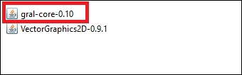
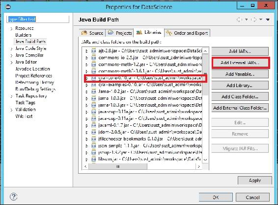
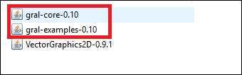
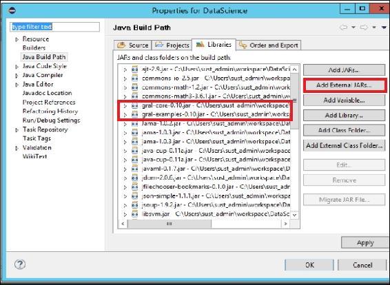
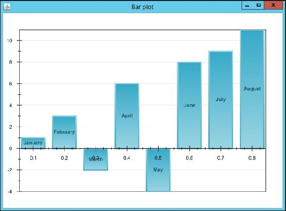
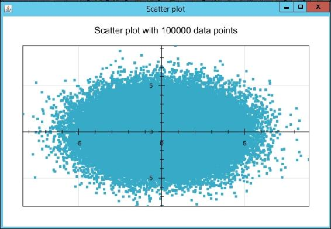
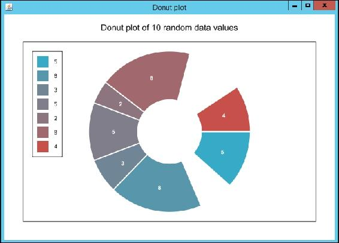
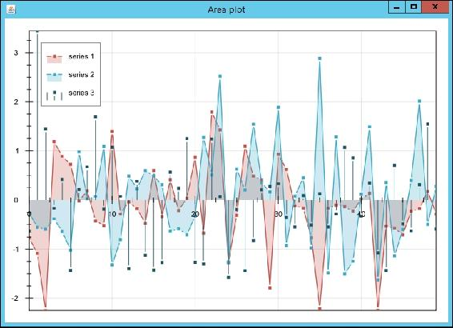

# 九、可视化数据

在本章中，我们将介绍以下配方:

*   绘制 2D 正弦图
*   绘制直方图
*   绘制条形图
*   绘制箱线图或须状图
*   绘制散点图
*   绘制圆环图
*   绘制面积图

# 简介

数据可视化在数据科学界正变得越来越流行，因为它是在点、线或条的帮助下使用底层数据的可视化信息通信。可视化不仅向数据科学家传达信息，还向不了解或很少了解底层数据分布或数据性质的受众展示信息。在许多情况下，数据可视化被管理层、利益相关者和业务主管用来制定决策或了解趋势。

在这一章中，我们介绍了七种使用正弦图、直方图、条形图、箱线图、散点图、圆环图或饼图以及面积图来可视化数据的方法。这是一本烹饪书，除了非常简短的介绍之外，我们没有给出足够的背景知识，它们的优点和使用范围。相反，我们关注的是可以实现可视化的 Java 库的技术细节。

在这一章中，我们将使用一个名为 GRAL(GRAphing Library 的简写)的 Java 库来图形化地展示数据。本章中有几个理由考虑将 GRAL 用于数据可视化方案:

*   全面的类集合
*   数据处理功能的可用性，如平滑、重定比例、统计和直方图
*   Availability of plots popular among data scientists. The plots include the following:

    *   xy 散点图
    *   气泡图
    *   线形图
    *   面积图
    *   bar plot
    *   饼图
    *   donut plot
    *   盒须图
    *   光栅图

*   显示图例的功能
*   支持多种文件格式作为数据源或数据接收器(CSV、位图图像数据、音频文件数据)
*   以位图和矢量文件格式(PNG、GIF、JPEG、EPS、PDF、SVG)导出绘图
*   内存占用小(约 300 千字节)

鼓励感兴趣的读者查看各种 Java 数据可视化库的比较:[https://github.com/eseifert/gral/wiki/comparison](https://github.com/eseifert/gral/wiki/comparison)。


# 绘制 2D 正弦图

在这个菜谱中，我们将使用一个名为**的免费 Java 图形库** ( **GRAL** )来绘制 2D 正弦图。在许多情况下，正弦图对数据科学家特别有用，因为它们是一种三角图，可用于对数据波动进行建模(例如，使用温度数据创建一个模型，预测一年中某个位置适合游览的时间)。

## 准备就绪

1.  To use GRAL in your project, you need to download the GRAL JAR file and include it in your project as an external Java library. To download the Jar file, go to [http://trac.erichseifert.de/gral/wiki/Download](http://trac.erichseifert.de/gral/wiki/Download)  and download GRAL JAR file version 0.10 from the legacy version section. The file that you are going to download is a zip file named `gral-core-0.10.zip`:

    下载文件后，解压文件，您将在发行版中看到文件和文件夹。其中，你会发现一个名为`lib`的文件夹，也就是感兴趣的文件夹。

    
2.  Go to the `lib` folder. There will be two Jar files there: `gral-core-0.10` and `VectorGraphics2D-0.9.1`. For this tutorial, you will only need to consider `gral-core-0.10.jar`:
3.  In our Eclipse project, we add this JAR file as an external library file:
4.  现在，您已经准备好编写一些代码来绘制正弦图。

## 怎么做...

```java
       } 

```

1.  首先，我们创建一个名为`SineGraph`的 Java 类，它扩展了`JFrame`，因为我们将把数据的输出图绘制到一个`JFrame` :

    ```java
            public class SineGraph extends JFrame { 

    ```

    上
2.  接下来，将串行版本`UID`声明为类变量:

    ```java
            private static final long serialVersionUID = 1L; 

    ```

3.  `serialVersionUID`可以看作是一个`Serializable`类中的版本控制。如果您没有显式声明`serialVersionUID`，JVM 会自动为您完成。关于这一点的更多细节超出了本书的范围，可以在[http://docs . Oracle . com/javase/1 . 5 . 0/docs/API/Java/io/serializable . html](http://docs.oracle.com/javase/1.5.0/docs/api/java/io/Serializable.html)找到。
4.  接下来，为该类创建一个构造函数。构造函数将定义关闭框架时的行为，定义绘制正弦图的框架大小，并根据 for 循环中的值创建数据表。因此，在这个例子中，我们将看到一个真正的正弦图。您的实际数据可能不是完美的正弦图:

    ```java
            public SineGraph() throws FileNotFoundException, IOException { 

    ```

5.  设置关闭框架时的默认动作:

    ```java
            setDefaultCloseOperation(EXIT_ON_CLOSE); 

    ```

6.  设置

    ```java
            setSize(1600, 1400); 

    ```

    帧的`size`
7.  使用循环创建人工的`x`和`y`值，然后将它们放入数据表:

    ```java
            DataTable data = new DataTable(Double.class, Double.class); 
             for (double x = -5.0; x <= 5.0; x+=0.25) { 
             double y = 5.0*Math.sin(x); 
             data.add(x, y); 
           } 

    ```

8.  为了得到正弦图，我们将使用 GRAL 的类。通过将您创建的数据作为参数发送来创建一个`XYPlot`对象:

    ```java
            XYPlot plot = new XYPlot(data); 

    ```

9.  将`plot`设置为交互面板:

    ```java
            XYPlot plot = new XYPlot(data); 

    ```

10.  为了渲染绘图，创建一条`2D`线`renderer`。将此线条渲染和数据添加到`XYPlot`对象:

    ```java
            LineRenderer lines = new DefaultLineRenderer2D(); 
            plot.setLineRenderer(data, lines); 

    ```

11.  使用 GRAL，可以使用它的`Color`类:

    ```java
            Color color = new Color(0.0f, 0.0f, 0.0f); 

    ```

    来绘制`color`图
12.  作为`Color`类的构造函数的参数，您需要发出红色、绿色和蓝色的值。在前面的例子中，您正在绘制一个黑白图形，因为您已经发送了 0 作为红色、绿色和蓝色值。
13.  设置点和线的颜色:

    ```java
            plot.getPointRenderer(data).setColor(color); 
            plot.getLineRenderer(data).setColor(color); 

    ```

14.  关闭构造函数:
15.  要运行程序，写下下面的`main()`方法:

```java
        public static void main(String[] args) { 
        SineGraph frame = null; 
        try { 
         frame = new SineGraph(); 
        } catch (IOException e) { 
        } 
        frame.setVisible(true); 
        } 

```

该配方的完整代码如下:

```java
import java.awt.Color; 
import java.io.FileNotFoundException; 
import java.io.IOException; 
import javax.swing.JFrame; 
import de.erichseifert.gral.data.DataTable; 
import de.erichseifert.gral.plots.XYPlot; 
import de.erichseifert.gral.plots.lines.DefaultLineRenderer2D; 
import de.erichseifert.gral.plots.lines.LineRenderer; 
import de.erichseifert.gral.ui.InteractivePanel; 

public class SineGraph extends JFrame { 
   private static final long serialVersionUID = 1L; 

   public SineGraph() throws FileNotFoundException, IOException { 
      setDefaultCloseOperation(EXIT_ON_CLOSE); 
      setSize(1600, 1400); 

      DataTable data = new DataTable(Double.class, Double.class); 
      for (double x = -5.0; x <= 5.0; x+=0.25) { 
            double y = 5.0*Math.sin(x); 
            data.add(x, y); 
        } 

      XYPlot plot = new XYPlot(data); 
      getContentPane().add(new InteractivePanel(plot)); 
      LineRenderer lines = new DefaultLineRenderer2D(); 
      plot.setLineRenderer(data, lines); 
      Color color = new Color(0.0f, 0.3f, 1.0f); 
      plot.getPointRenderer(data).setColor(color); 
      plot.getLineRenderer(data).setColor(color); 
   } 

   public static void main(String[] args) { 
      SineGraph frame = null; 
      try { 
         frame = new SineGraph(); 
      } catch (IOException e) { 
      } 
      frame.setVisible(true); 
   } 
} 

```

该程序的输出将是一个布局良好的正弦图:


# 绘制直方图

直方图是发现一组连续数据的频率分布的一种非常流行的方法。在直方图中，数据科学家通常沿着 *x* 轴显示定量变量，沿着 *y* 轴显示该变量的频率。直方图的一些关键特性使其非常有用，如下所示:

*   只能绘制数字数据
*   庞大的数据集可以很容易地绘制出来
*   *x* 轴通常用作数量变量的箱或区间
*   在这个食谱中，我们将看到如何使用 **GRAL** 绘制直方图

## 准备就绪

1.  To use GRAL to plot histograms, we need the example applications provided with the library in the form of Jar files. These example applications can be downloaded from [http://trac.erichseifert.de/gral/wiki/Download](http://trac.erichseifert.de/gral/wiki/Download). Download the `gral-examples-0.10.zip` file from the download location to your local disk. Extract the files:
2.  Once you download the Zip file and extract it, you will see a directory structure as follows, where our folder of interest is the `lib` folder:
3.  Inside `lib,` you will find three Jar files: `gral-core-0.10`, `gral-examples-0.10`, and `VectorGraphics2D-0.9.1`. The first one was used in the first recipe of this chapter. In this recipe, you will use the second one as well:
4.  Include these two Jar files in your project as an external library:
5.  现在，您已经准备好使用 GRAL 示例包中包含的程序来绘制直方图。我们将在下一节看到的配方可以在您下载的示例包的`gral-examples-0.10\gral-examples-0.10\src\main\java\de\erichseifert\gral\examples\barplot`中找到。

## 怎么做...

1.  创建一个名为`HistogramPlot`的类，它将扩展`ExamplePanel`类。创建一个序列版本 UID:

    ```java
            public class HistogramPlot extends ExamplePanel {
            private static final long serialVersionUID = 
              4458280577519421950L;
    ```

2.  在本例中，您将为`1000`样本数据点:

    ```java
            private static final int SAMPLE_COUNT = 1000;
    ```

    创建直方图
3.  创建类的构造函数:

    ```java
            public HistogramPlot() {
    ```

4.  随机创建 1000 个样本数据点。您将创建的数据点来自高斯分布，因为您将使用 Java `Random`类的`random.nextGaussian()`方法:

    ```java
            Random random = new Random();
            DataTable data = new DataTable(Double.class);
             for (int i = 0; i < SAMPLE_COUNT; i++) {
                data.add(random.nextGaussian());
             }
    ```

5.  从数据中创建一个`histogram`，并创建第二个尺寸用于绘图:

    ```java
            Histogram1D histogram = new Histogram1D(data,             
             Orientation.VERTICAL,new Number[] {-4.0, -3.2, -2.4, -1.6, 
               -0.8, 0.0, 0.8, 1.6, 2.4, 3.2, 4.0});
            DataSource histogram2d = new EnumeratedData(histogram, (-4.0 + 
              -3.2)/2.0, 0.8);
    ```

6.  The values in the array are the intervals or bins on the *x* axis of your histogram:
7.  如您所见，直方图为`Barplot`，创建一个条形图，并将您的直方图信息提供给条形图:

    ```java
             BarPlot plot = new BarPlot(histogram2d);
    ```

8.  现在，格式化绘图区。
9.  设置框架内直方图的坐标:

    ```java
             plot.setInsets(new Insets2D.Double(20.0, 65.0, 50.0, 40.0));
    ```

10.  设置直方图的标题:

    ```java
             plot.getTitle().setText(
             String.format("Distribution of %d random samples", 
               data.getRowCount()));
    ```

11.  设置直方图条的宽度:

    ```java
             plot.setBarWidth(0.78);
    ```

12.  格式化 x 轴。如果您熟悉 Microsoft Excel，那么您一定知道对于给定的轴也有刻度对齐和间距的选项。用户可以选择是否要查看轴上的次要刻度。幸运的是，GRAL 给了你这个工具，让你的图形对科学界更有吸引力。
13.  配置 *x* 轴的记号对齐。注意`getAxisRenderer()`方法的参数，它是针对 *x* 轴:

    ```java
            plot.getAxisRenderer(BarPlot.AXIS_X).setTickAlignment(0.0);
    ```

14.  配置刻度间距:

    ```java
            plot.getAxisRenderer(BarPlot.AXIS_X).setTickSpacing(0.8);
    ```

15.  最后，配置次要刻度，使它们不可见:

    ```java
          plot.getAxisRenderer(BarPlot.AXIS_X).setMinorTicksVisible(false);
    ```

16.  格式化 *y* 轴。在这种情况下，您将定义条形可以延伸到的高度范围:

    ```java
             plot.getAxis(BarPlot.AXIS_Y).setRange(0.0,
          MathUtils.ceil(histogram.getStatistics().get(Statistics.MAX)*1.1,    
             25.0));
    ```

17.  同样，像对 *x* 轴:

    ```java
          plot.getAxisRenderer(BarPlot.AXIS_Y).setTickAlignment(0.0);
          plot.getAxisRenderer(BarPlot.AXIS_Y).setMinorTicksVisible(false);
          plot.getAxisRenderer(BarPlot.AXIS_Y).setIntersection(-4.4);
    ```

    所做的那样，设置记号对齐、间距和次要记号的可见性
18.  接下来，格式化条形。设置条形的颜色，并配置直方图以在条形顶部显示频率值:

    ```java
             plot.getPointRenderer(histogram2d).setColor(
             GraphicsUtils.deriveWithAlpha(COLOR1, 128));
             plot.getPointRenderer(histogram2d).setValueVisible(true);
    ```

19.  最后，添加情节到 swing 组件:

    ```java
             InteractivePanel panel = new InteractivePanel(plot);
             panel.setPannable(false);
             panel.setZoomable(false);
             add(panel);
    ```

20.  关闭构造函数:

    ```java
             }
    ```

21.  您还需要实现`ExamplePanel`类中的所有方法。为了简单起见，重写`getTitle()`和`getDescription()`方法如下:

    ```java
             @Override
              public String getTitle() {
                 return "Histogram plot";
              }
             @Override
                public String getDescription() {
                 return String.format("Histogram of %d samples",    
                   SAMPLE_COUNT);
               }
    ```

22.  该类的`main`方法如下:

    ```java
             public static void main(String[] args) {
             new HistogramPlot().showInFrame();
             }
    ```

23.  最后，关闭类:

    ```java
             }
    ```

24.  食谱的完整代码如下:

```java
import java.util.Random; 
import de.erichseifert.gral.data.DataSource; 
import de.erichseifert.gral.data.DataTable; 
import de.erichseifert.gral.data.EnumeratedData; 
import de.erichseifert.gral.data.statistics.Histogram1D; 
import de.erichseifert.gral.data.statistics.Statistics; 
import de.erichseifert.gral.examples.ExamplePanel; 
import de.erichseifert.gral.plots.BarPlot; 
import de.erichseifert.gral.ui.InteractivePanel; 
import de.erichseifert.gral.util.GraphicsUtils; 
import de.erichseifert.gral.util.Insets2D; 
import de.erichseifert.gral.util.MathUtils; 
import de.erichseifert.gral.util.Orientation; 

public class HistogramPlot extends ExamplePanel { 
   /** Version id for serialization. */ 
   private static final long serialVersionUID = 4458280577519421950L; 

   private static final int SAMPLE_COUNT = 1000; 

   //@SuppressWarnings("unchecked") 
   public HistogramPlot() { 
      // Create example data 
      Random random = new Random(); 
      DataTable data = new DataTable(Double.class); 
      for (int i = 0; i < SAMPLE_COUNT; i++) { 
         data.add(random.nextGaussian()); 
      } 

      // Create histogram from data 
      Histogram1D histogram = new Histogram1D(data, 
       Orientation.VERTICAL, new Number[] {-4.0, -3.2, -2.4, -1.6, 
          -0.8, 0.0, 0.8, 1.6, 2.4, 3.2, 4.0}); 
      // Create a second dimension (x axis) for plotting 
      DataSource histogram2d = new EnumeratedData(histogram, (-4.0 + 
          -3.2)/2.0, 0.8); 

      // Create new bar plot 
      BarPlot plot = new BarPlot(histogram2d); 

      // Format plot 
      plot.setInsets(new Insets2D.Double(20.0, 65.0, 50.0, 40.0)); 
      plot.getTitle().setText( 
            String.format("Distribution of %d random samples", 
               data.getRowCount())); 
      plot.setBarWidth(0.78); 

      // Format x axis 
      plot.getAxisRenderer(BarPlot.AXIS_X).setTickAlignment(0.0); 
      plot.getAxisRenderer(BarPlot.AXIS_X).setTickSpacing(0.8); 
      plot.getAxisRenderer(BarPlot.AXIS_X).setMinorTicksVisible(false); 
      // Format y axis 
      plot.getAxis(BarPlot.AXIS_Y).setRange(0.0, 
         MathUtils.ceil(histogram.getStatistics().
             get(Statistics.MAX)*1.1, 25.0)); 
      plot.getAxisRenderer(BarPlot.AXIS_Y).setTickAlignment(0.0); 
      plot.getAxisRenderer(BarPlot.AXIS_Y).setMinorTicksVisible(false); 
      plot.getAxisRenderer(BarPlot.AXIS_Y).setIntersection(-4.4); 

      // Format bars 
      plot.getPointRenderer(histogram2d).setColor( 
         GraphicsUtils.deriveWithAlpha(COLOR1, 128)); 
      plot.getPointRenderer(histogram2d).setValueVisible(true); 

      // Add plot to Swing component 
      InteractivePanel panel = new InteractivePanel(plot); 
      panel.setPannable(false); 
      panel.setZoomable(false); 
      add(panel); 
   } 

   @Override 
   public String getTitle() { 
      return "Histogram plot"; 
   } 

   @Override 
   public String getDescription() { 
      return String.format("Histogram of %d samples", SAMPLE_COUNT); 
   } 

   public static void main(String[] args) { 
      new HistogramPlot().showInFrame(); 
   } 
} 

```


# 绘制条形图

条形图是数据科学家最常用的图表类型。用 GRAL 画条形图很简单。在本食谱中，我们将使用 GRAL 绘制以下条形图:



## 准备就绪

1.  为了使用 GRAL 绘制条形图，我们需要以 Jar 文件的形式随库提供的示例应用程序。这些示例应用程序可以从 http://trac.erichseifert.de/gral/wiki/Download T2 下载。从下载位置下载`gral-examples-0.10.zip`文件到本地磁盘。提取文件。
2.  一旦你下载了 ZIP 文件，并解压它们，你会看到一个目录结构，如*绘制 2D 正弦图*的*准备*部分所示，这里我们感兴趣的文件夹是`lib`文件夹。
3.  在`lib`文件夹中，您会发现三个 Jar 文件:`gral-core-0.10`、`gral-examples-0.10`和`VectorGraphics2D-0.9.1`。在这个菜谱中，您将使用前面提到的前两个 Jar 文件。
4.  将这两个 JAR 文件作为外部库包含在项目中。

现在，您已经准备好使用 GRAL 示例包中包含的程序来绘制直方图。我们将在下一节看到的配方可以在您下载的示例包的`gral-examples-0.10\gral-examples-0.10\src\main\java\de\erichseifert\gral\examples\barplot`中找到。

## 怎么做...

1.  像前面的菜谱一样创建一个名为`SimpleBarPlot.`的类，这个类将扩展 GRAL 库的`ExamplePanel`类:

    ```java
            publicclassSimpleBarPlotextendsExamplePanel {
    ```

2.  创建一个系列版本 UID:

    ```java
            privatestaticfinallong serialVersionUID =-2793954497895054530L;
    ```

3.  开始开发构造函数:

    ```java
            publicSimpleBarPlot() {
    ```

4.  首先，您将创建示例数据。在本食谱开头显示的条形图中，每个条形有三个值:x 轴的值、y 轴的值和条形的名称。例如，第一个条形的 x 轴值为 0.1，y 轴值为 1，名称为一月。您将通过以下方式为所有条形创建数据点:

    ```java
            DataTable data = new DataTable(Double.class, Integer.class, 
              String.class);
            data.add(0.1, 1, "January");
            data.add(0.2, 3, "February");
            data.add(0.3, -2, "March");
            data.add(0.4, 6, "April");
            data.add(0.5, -4, "May");
            data.add(0.6, 8, "June");
            data.add(0.7, 9, "July");
            data.add(0.8, 11, "August");
    ```

5.  DataTable 类的构造函数在这里取三个值: *x* 轴(double)， *y* 轴(integer)，最后是条形的名称(String)。
6.  剩下的代码将用于格式化你的条形图。
7.  创建新的条形图:

    ```java
            BarPlot plot = newBarPlot(data);
    ```

8.  设置图表中条形的条形图厚度的尺寸:

    ```java
            plot.setInsets(new Insets2D.Double(40.0, 40.0, 40.0, 40.0));
            plot.setBarWidth(0.075);
    ```

9.  现在，您将格式化您的条形图。为此，首先您需要使用您的数据

    ```java
            BarRenderer pointRenderer = (BarRenderer) 
              plot.getPointRenderer(data);
    ```

    创建一个`BarRenderer`
10.  接下来，设置条形的颜色:

    ```java
             pointRenderer.setColor(
              new LinearGradientPaint(0f,0f, 0f,1f,
              new float[] { 0.0f, 1.0f },
              new Color[] { COLOR1, GraphicsUtils.deriveBrighter(COLOR1) }
              )
             );
    ```

11.  Next, set the properties of the bar chart:

    要在条形图上显示值，请使用以下代码:

    ```java
              pointRenderer.setValueVisible(true);
    ```

    将数据中的第三个值(月份名称)设置为值列:

    ```java
            pointRenderer.setValueColumn(2);
    ```

    将值的位置设置为居中:

    ```java
            pointRenderer.setValueLocation(Location.CENTER);
    ```

    设置值的颜色:

    ```java
           pointRenderer.setValueColor(GraphicsUtils.deriveDarker(COLOR1));
    ```

    打开值字体的粗体功能:

    ```java
           pointRenderer.setValueFont(Font.decode
              (null).deriveFont(Font.BOLD));
    ```

12.  将条形图添加到`Swing`组件:

    ```java
           add(newInteractivePanel(plot));
    ```

13.  关闭构造函数:

    ```java
           }
    ```

14.  您需要实现 GRAL 库的`ExamplePanel`类中的另外两个方法:

    ```java
            @Override
           public String getTitle() {
            return "Bar plot";
           }
            @Override
            public String getDescription() {
              return "Bar plot with example data and color gradients";
            }
    ```

15.  到目前为止，运行代码的`main`方法将如下所示:

    ```java
            public static void main(String[] args) {
            new SimpleBarPlot().showInFrame();
            }
    ```

16.  关闭课程:

```java
       }
```

该配方的完整源代码如下:

```java
import java.awt.Color; 
import java.awt.Font; 
import java.awt.LinearGradientPaint; 
import de.erichseifert.gral.data.DataTable; 
import de.erichseifert.gral.examples.ExamplePanel; 
import de.erichseifert.gral.plots.BarPlot; 
import de.erichseifert.gral.plots.BarPlot.BarRenderer; 
import de.erichseifert.gral.ui.InteractivePanel; 
import de.erichseifert.gral.util.GraphicsUtils; 
import de.erichseifert.gral.util.Insets2D; 
import de.erichseifert.gral.util.Location; 

public class SimpleBarPlot extends ExamplePanel { 
   /** Version id for serialization. */ 
   private static final long serialVersionUID = -2793954497895054530L; 

   @SuppressWarnings("unchecked") 
   public SimpleBarPlot() { 
      // Create example data 
      DataTable data = new DataTable(Double.class, Integer.class, 
        String.class); 
      data.add(0.1,  1, "January"); 
      data.add(0.2,  3, "February"); 
      data.add(0.3, -2, "March"); 
      data.add(0.4,  6, "April"); 
      data.add(0.5, -4, "May"); 
      data.add(0.6,  8, "June"); 
      data.add(0.7,  9, "July"); 
      data.add(0.8, 11, "August"); 

      // Create new bar plot 
      BarPlot plot = new BarPlot(data); 

      // Format plot 
      plot.setInsets(new Insets2D.Double(40.0, 40.0, 40.0, 40.0)); 
      plot.setBarWidth(0.075); 

      // Format bars 
      BarRenderer pointRenderer = (BarRenderer)    
        plot.getPointRenderer(data); 
      pointRenderer.setColor( 
         new LinearGradientPaint(0f,0f, 0f,1f, 
               new float[] { 0.0f, 1.0f }, 
               new Color[] { COLOR1,  
                 GraphicsUtils.deriveBrighter(COLOR1) } 
         ) 
      ); 
      /*pointRenderer.setBorderStroke(new BasicStroke(3f)); 
      pointRenderer.setBorderColor( 
         new LinearGradientPaint(0f,0f, 0f,1f, 
               new float[] { 0.0f, 1.0f }, 
               new Color[] { GraphicsUtils.deriveBrighter(COLOR1), 
                COLOR1 } 
         ) 
      );*/ 
      pointRenderer.setValueVisible(true); 
      pointRenderer.setValueColumn(2); 
      pointRenderer.setValueLocation(Location.CENTER); 
      pointRenderer.setValueColor(GraphicsUtils.deriveDarker(COLOR1)); 
   pointRenderer.setValueFont(Font.decode(null).deriveFont(Font.BOLD)); 

      // Add plot to Swing component 
      add(new InteractivePanel(plot)); 
   } 

   @Override 
   public String getTitle() { 
      return "Bar plot"; 
   } 

   @Override 
   public String getDescription() { 
      return "Bar plot with example data and color gradients"; 
   } 

   public static void main(String[] args) { 
      new SimpleBarPlot().showInFrame(); 
   } 
} 

```


# 绘制箱形图或须状图

箱线图是数据科学家的另一种有效的可视化工具。它们给出了数据分布的重要描述性统计数据。典型的箱线图将包含以下关于数据分布的信息:

*   最小值
*   第一四分位数
*   中位数
*   第三个四分位数
*   最大值

通过获取第三个四分位数和第一个四分位数之间的差异，也可以从这些统计数据中得出其他值，如四分位数间距。

在本食谱中，您将使用 GRAL 绘制数据分布的箱线图。

## 准备就绪

1.  为了使用 GRAL 绘制条形图，我们需要以 Jar 文件的形式随库提供的示例应用程序。这些示例应用程序可以从 http://trac.erichseifert.de/gral/wiki/Download T2 下载。从下载位置下载`gral-examples-0.10.zip`文件到本地磁盘。提取文件。
2.  下载 ZIP 文件并解压后，你会看到一个目录结构，如*绘制 2D 正弦图*配方的*准备*部分所示。我们感兴趣的文件夹是`lib`文件夹。
3.  在`lib`里面，你会发现三个 Jar 文件:`gral-core-0.10`、`gral-examples-0.10`和`VectorGraphics2D-0.9.1`。在这个菜谱中，您将使用前面提到的前两个 Jar 文件。
4.  将这两个 JAR 文件作为外部库包含在项目中。

现在，您已经准备好使用 GRAL 示例包中包含的程序来绘制箱线图。我们将在下一节看到的配方可以在您下载的示例包的`gral-examples-0.10\gral-examples-0.10\src\main\java\de\erichseifert\gral\examples\boxplot` 中找到。当您成功运行该配方中的代码时，您将看到如下所示的方框图:


## 怎么做...

1.  首先，创建一个名为`SimpleBoxPlot`的类，它扩展了 GRAL 库中的类`ExamplePanel`。提供一个序列版本 UID:

    ```java
            public class SimpleBoxPlot extends ExamplePanel {
            private static final long serialVersionUID = 
               5228891435595348789L;
    ```

2.  您将为将要创建和渲染的盒状图生成`50`随机样本。创建以下类变量:

    ```java
            private static final int SAMPLE_COUNT = 50;
            private static final Random random = new Random();
    ```

3.  为类创建构造函数:

    ```java
            public SimpleBoxPlot() {
    ```

4.  设置你的方框图窗口的尺寸:

    ```java
            setPreferredSize(new Dimension(400, 600));
    ```

5.  创建一个数据表，其中每一行包含三个列值，并且它们都是整数:

    ```java
            DataTable data = new DataTable(Integer.class, Integer.class, 
              Integer.class);
    ```

6.  用三个整数值(数据表中的列值)生成 50 个数据样本。数据样本将包含来自高斯分布的值(不一定需要从高斯分布中提取):

    ```java
            for (int i = 0; i < SAMPLE_COUNT; i++) {
            int x = (int) Math.round(5.0*random.nextGaussian());
            int y = (int) Math.round(5.0*random.nextGaussian());
            int z = (int) Math.round(5.0*random.nextGaussian());
            data.add(x, y, z);
            }
    ```

7.  用数据创建一个新的方框图:

    ```java
            DataSource boxData = BoxPlot.createBoxData(data);
            BoxPlot plot = new BoxPlot(boxData);
    ```

8.  设置您将要绘制`Boxplot` :

    ```java
            plot.setInsets(newInsets2D.Double(20.0, 50.0, 40.0, 20.0));
    ```

    的窗口的插入尺寸
9.  格式化 *x* 轴:

    ```java
            plot.getAxisRenderer(BoxPlot.AXIS_X).setCustomTicks(
            DataUtils.map(
            new Double[] {1.0, 2.0, 3.0},
            new String[] {"Column 1", "Column 2", "Column 3"}
            )
            );
    ```

    中的值
10.  代码的其余部分将呈现箱线图。首先，用数据创建一个点渲染器:

    ```java
            BoxWhiskerRenderer pointRenderer =
               (BoxWhiskerRenderer) plot.getPointRenderer(boxData);
    ```

11.  接下来，设置盒状图的边框颜色，胡须的颜色(第三个四分位数为最大值，第一个四分位数为最小值)和中心条(中间条):

    ```java
            pointRenderer.setBoxBorderColor(COLOR1);
            pointRenderer.setWhiskerColor(COLOR1);
            pointRenderer.setCenterBarColor(COLOR1);
    ```

12.  对于箱罐，使用垂直导航:

    ```java
          plot.getNavigator().setDirection(XYNavigationDirection.VERTICAL);
    ```

13.  将方框图发送给 swing 组件进行渲染:

    ```java
            InteractivePanel panel = new InteractivePanel(plot);
            add(panel);
    ```

14.  关闭构造函数:

    ```java
            }
    ```

15.  您需要在 ExamplePanel 类中实现以下两个方法，方法是覆盖它们:

    ```java
             @Override
             public String getTitle() {
             return "Box-and-whisker plot";
             }
             @Override
             public String getDescription() {
             return String.format("Three box-and-whisker plots created from  
             %d random samples", SAMPLE_COUNT);
            }
    ```

16.  然后，添加`main`方法并关闭类:

    ```java
            public static void main(String[] args) {
            new SimpleBoxPlot().showInFrame();
            }
            }
    ```

17.  完整的源代码如下:

```java
import java.awt.Dimension; 
import java.util.Random; 
import de.erichseifert.gral.data.DataSource; 
import de.erichseifert.gral.data.DataTable; 
import de.erichseifert.gral.examples.ExamplePanel; 
import de.erichseifert.gral.plots.BoxPlot; 
import de.erichseifert.gral.plots.BoxPlot.BoxWhiskerRenderer; 
import de.erichseifert.gral.plots.XYPlot.XYNavigationDirection; 
import de.erichseifert.gral.ui.InteractivePanel; 
import de.erichseifert.gral.util.DataUtils; 
import de.erichseifert.gral.util.Insets2D; 

public class SimpleBoxPlot extends ExamplePanel { 
   /** Version id for serialization. */ 
   private static final long serialVersionUID = 5228891435595348789L; 
   private static final int SAMPLE_COUNT = 50; 
   private static final Random random = new Random(); 

   @SuppressWarnings("unchecked") 
   public SimpleBoxPlot() { 
      setPreferredSize(new Dimension(400, 600)); 

      // Create example data 
      DataTable data = new DataTable(Integer.class, Integer.class, 
        Integer.class); 
      for (int i = 0; i < SAMPLE_COUNT; i++) { 
         int x = (int) Math.round(5.0*random.nextGaussian()); 
         int y = (int) Math.round(5.0*random.nextGaussian()); 
         int z = (int) Math.round(5.0*random.nextGaussian()); 
         data.add(x, y, z); 
      } 

      // Create new box-and-whisker plot 
      DataSource boxData = BoxPlot.createBoxData(data); 
      BoxPlot plot = new BoxPlot(boxData); 

      // Format plot 
      plot.setInsets(new Insets2D.Double(20.0, 50.0, 40.0, 20.0)); 

      // Format axes 
      plot.getAxisRenderer(BoxPlot.AXIS_X).setCustomTicks( 
         DataUtils.map( 
               new Double[] {1.0, 2.0, 3.0}, 
               new String[] {"Column 1", "Column 2", "Column 3"} 
         ) 
      ); 

      // Format boxes 
      /*Stroke stroke = new BasicStroke(2f); 
      ScaledContinuousColorMapper colors = 
         new LinearGradient(GraphicsUtils.deriveBrighter(COLOR1), 
           Color.WHITE); 
      colors.setRange(1.0, 3.0);*/ 

      BoxWhiskerRenderer pointRenderer = 
            (BoxWhiskerRenderer) plot.getPointRenderer(boxData); 
      /*pointRenderer.setWhiskerStroke(stroke); 
      pointRenderer.setBoxBorderStroke(stroke); 
      pointRenderer.setBoxBackground(colors);*/ 
      pointRenderer.setBoxBorderColor(COLOR1); 
      pointRenderer.setWhiskerColor(COLOR1); 
      pointRenderer.setCenterBarColor(COLOR1); 

      plot.getNavigator().setDirection(XYNavigationDirection.VERTICAL); 

      // Add plot to Swing component 
      InteractivePanel panel = new InteractivePanel(plot); 
      add(panel); 
   } 

   @Override 
   public String getTitle() { 
      return "Box-and-whisker plot"; 
   } 

   @Override 
   public String getDescription() { 
      return String.format("Three box-and-whisker plots created from %d 
        random samples", SAMPLE_COUNT); 
   } 

   public static void main(String[] args) { 
      new SimpleBoxPlot().showInFrame(); 
   } 
} 

```


# 绘制散点图

这个食谱演示了如何使用 GRAL 绘制 100，000 个随机数据点的散点图。散点图使用 *x* 和 *y* 轴来绘制数据点，是展示变量之间相关性的好方法。

## 准备就绪

1.  为了使用 GRAL 绘制条形图，我们需要以 Jar 文件的形式随库提供的示例应用程序。这些示例应用程序可以从 http://trac.erichseifert.de/gral/wiki/Download T2 下载。从下载位置下载`gral-examples-0.10.zip`文件到本地磁盘。提取文件。
2.  一旦你下载了 ZIP 文件并解压，你会看到一个目录结构，如*绘制 2D 正弦图*的*准备*部分所示。我们感兴趣的文件夹是`lib`文件夹。
3.  在`lib`里面，你会发现三个 Jar 文件:`gral-core-0.10`、`gral-examples-0.10`和`VectorGraphics2D-0.9.1`。在这个菜谱中，您将使用前面提到的前两个 Jar 文件。
4.  将这两个 Jar 文件作为外部库包含在项目中。

现在，您已经准备好使用 GRAL 示例包中包含的程序来绘制散点图。我们将在下一节看到的配方可以在您下载的示例包中的`gral-examples-0.10\gral-examples-0.10\src\main\java\de\erichseifert\gral\examples\xyplot`处找到。当您成功运行该配方中的代码时，您将看到一个包含 100，000 个随机数据点的散点图，如下所示:



## 怎么做...

1.  首先，创建一个名为`ScatterPlot`的类，它扩展了 GRAL 库的`ExamplePanel`类。在类中添加串行版本 UID:

    ```java
            public class ScatterPlot extends ExamplePanel {
            private static final long serialVersionUID = 
              -412699430625953887L;
    ```

2.  在配方中，您将使用 100，000 个随机数据点。为数据点和其中的随机性元素创建类变量:

    ```java
            private static final int SAMPLE_COUNT = 100000;
            private static final Random random = new Random();
    ```

3.  开始编写构造函数的代码:

    ```java
           publicScatterPlot() {
    ```

4.  创建一个数据表来包含您将在散点图中绘制的随机 x 和 y 值。x 和 y 值将为双精度类型，并从高斯分布中提取:

    ```java
             DataTable data = new DataTable(Double.class, Double.class);
             for (int i = 0; i <= SAMPLE_COUNT; i++) {
             data.add(random.nextGaussian()*2.0, 
              random.nextGaussian()*2.0);
             }
    ```

5.  散点图可以看作是一个`XYplot`，因此，我们创建了一个:

    ```java
            XYPlot plot =newXYPlot(data);
    ```

6.  设置图的尺寸，获取图的描述:

    ```java
             plot.setInsets(new Insets2D.Double(20.0, 40.0, 40.0, 40.0));
             plot.getTitle().setText(getDescription());
    ```

7.  格式化数据点并添加一些颜色:

    ```java
            plot.getPointRenderer(data).setColor(COLOR1);
    ```

8.  最后，将绘图发送到 Java Swing 组件并关闭构造函数:

    ```java
            add(new InteractivePanel(plot), BorderLayout.CENTER);
            }
    ```

9.  在扩展`ExamplePanel`类时，您还需要实现以下两个方法:

    ```java
            @Override
            public String getTitle() {
            return "Scatter plot";
            }
            @Override
            public String getDescription() {
            return String.format("Scatter plot with %d data points", 
            SAMPLE_COUNT);
            }
    ```

10.  最后，放置 main 方法块来运行代码并关闭该类:

```java
         public static void main(String[] args) {
         new ScatterPlot().showInFrame();
         }
         }
```

该配方的源代码如下:

```java
import java.awt.BorderLayout; 
import java.util.Random; 
import de.erichseifert.gral.data.DataTable; 
import de.erichseifert.gral.examples.ExamplePanel; 
import de.erichseifert.gral.plots.XYPlot; 
import de.erichseifert.gral.ui.InteractivePanel; 
import de.erichseifert.gral.util.Insets2D; 

public class ScatterPlot extends ExamplePanel { 
   /** Version id for serialization. */ 
   private static final long serialVersionUID = -412699430625953887L; 

   private static final int SAMPLE_COUNT = 100000; 
   /** Instance to generate random data values. */ 
   private static final Random random = new Random(); 

   @SuppressWarnings("unchecked") 
   public ScatterPlot() { 
      // Generate 100,000 data points 
      DataTable data = new DataTable(Double.class, Double.class); 
      for (int i = 0; i <= SAMPLE_COUNT; i++) { 
         data.add(random.nextGaussian()*2.0,  
           random.nextGaussian()*2.0); 
      } 

      // Create a new xy-plot 
      XYPlot plot = new XYPlot(data); 

      // Format plot 
      plot.setInsets(new Insets2D.Double(20.0, 40.0, 40.0, 40.0)); 
      plot.getTitle().setText(getDescription()); 

      // Format points 
      plot.getPointRenderer(data).setColor(COLOR1); 

      // Add plot to Swing component 
      add(new InteractivePanel(plot), BorderLayout.CENTER); 
   } 

   @Override 
   public String getTitle() { 
      return "Scatter plot"; 
   } 

   @Override 
   public String getDescription() { 
      return String.format("Scatter plot with %d data points", 
        SAMPLE_COUNT); 
   } 

   public static void main(String[] args) { 
      new ScatterPlot().showInFrame(); 
   } 
}
```


# 绘制圆环图

圆环图是饼图的一个版本，是一种流行的数据可视化技术，可以直观地显示数据中的比例。在这个食谱中，我们将看到如何使用 GRAL Java 库来绘制 10 个随机变量的环形图。

## 准备就绪

1.  为了使用 GRAL 绘制条形图，我们需要以 Jar 文件的形式随库提供的示例应用程序。这些示例应用程序可以从 http://trac.erichseifert.de/gral/wiki/Download T2 下载。从下载位置下载`gral-examples-0.10.zip`文件到本地磁盘。提取文件。
2.  你会看到一个目录结构，如*绘制 2D 正弦图*的*准备*部分所示。我们感兴趣的文件夹是`lib`文件夹。
3.  在`lib`里面，你会发现三个 Jar 文件:`gral-core-0.10`、`gral-examples-0.10`和`VectorGraphics2D-0.9.1`。在这个菜谱中，您将使用前面提到的前两个 Jar 文件。
4.  将这两个 Jar 文件作为外部库包含在项目中。

现在，您已经准备好使用 GRAL 示例包中包含的程序来绘制圆环图。我们将在下一节看到的配方可以在您下载的示例包中的`gral-examples-0.10\gral-examples-0.10\src\main\java\de\erichseifert\gral\examples\pieplot`处找到。当您成功地运行这个食谱中的代码时，您将看到一个由 10 个随机数据值组成的**圆环图**，如下所示:



## 怎么做...

1.  创建一个名为`SimplePiePlot`的类，它扩展了 GRAL 库的`ExamplePanel`类。提供一个序列版本 UID:

    ```java
            public class SimplePiePlot extends ExamplePanel {
    ```

2.  接下来，声明两个用于生成`10`随机数据点的类变量:

    ```java
            privatestaticfinalintSAMPLE_COUNT = 10;
            privatestatic Random random = new Random();
    ```

3.  开始为你的构造函数编写代码:

    ```java
            public SimplePiePlot() {
    ```

4.  创建一个数据表，并在其中放入 10 个随机数。在这个例子中，您将生成一个带有种子值`8`的随机整数，并且总是用 random 类生成的随机数来添加`2`。然后，当您将值添加到数据表中时，检查生成的值是否小于或等于`0.15`。如果值满足这个条件，则加上生成值的负数；否则，将该值添加到您的数据表:

    ```java
            DataTable data = new DataTable(Integer.class);
            for (int i = 0; i < SAMPLE_COUNT; i++) {
            int val = random.nextInt(8) + 2;
            data.add((random.nextDouble() <= 0.15) ? -val : val);
            }
    ```

5.  用您的数据创建一个`PiePlot`:

    ```java
            PiePlot plot = new PiePlot(data);
    ```

6.  获取您的甜甜圈图的标题:

    ```java
            plot.getTitle().setText(getDescription());
    ```

7.  现在，设置甜甜圈的相对大小:

    ```java
            plot.setRadius(0.9);
    ```

8.  如果您想查看绘图上可见的图例，将图例可见设置为`true`；设置为`false`否则:

    ```java
            plot.setLegendVisible(true);
    ```

9.  提供您的图的尺寸:

    ```java
            plot.setInsets(new Insets2D.Double(20.0, 40.0, 40.0, 40.0));
    ```

10.  为你的圆环图创建一个点渲染:

    ```java
            PieSliceRenderer pointRenderer =
              (PieSliceRenderer) plot.getPointRenderer(data);
    ```

11.  设置内部区域的相对大小:

    ```java
            pointRenderer.setInnerRadius(0.4);
    ```

12.  设置合理的切片间隙:

    ```java
            pointRenderer.setGap(0.2);
    ```

13.  改变切片的颜色:

    ```java
            LinearGradient colors = new LinearGradient(COLOR1, COLOR2);
            pointRenderer.setColor(colors);
    ```

14.  格式化标签以及您希望如何显示它们。在本例中，您用白色粗体显示值:

    ```java
            pointRenderer.setValueVisible(true);
            pointRenderer.setValueColor(Color.WHITE);
            pointRenderer.setValueFont(Font.decode(null)
            .deriveFont(Font.BOLD));
    ```

15.  最后，添加情节到 Swing 组件:

    ```java
            add(new InteractivePanel(plot), BorderLayout.CENTER);
    ```

16.  关闭构造函数:

    ```java
            }
    ```

17.  您需要在代码中实现另外两个方法，因为您已经从`ExamplePanel`类:

    ```java
            @Override
            public String getTitle() {
            return "Donut plot";
            }
             @Override
              public String getDescription() {
              return String.format("Donut plot of %d random data values", 
                SAMPLE_COUNT);
             }
    ```

    扩展了您的类
18.  将主方法添加到`run`代码:

    ```java
            publicstaticvoid main(String[] args) {
            new SimplePiePlot().showInFrame();
            }
    ```

19.  关闭您的班级:

    ```java
            }
    ```

20.  该配方的代码如下:

```java
import java.awt.BorderLayout; 
import java.awt.Color; 
import java.awt.Font; 
import java.util.Random; 
import de.erichseifert.gral.data.DataTable; 
import de.erichseifert.gral.examples.ExamplePanel; 
import de.erichseifert.gral.plots.PiePlot; 
import de.erichseifert.gral.plots.PiePlot.PieSliceRenderer; 
import de.erichseifert.gral.plots.colors.LinearGradient; 
import de.erichseifert.gral.ui.InteractivePanel; 
import de.erichseifert.gral.util.Insets2D; 

public class SimplePiePlot extends ExamplePanel { 
   /** Version id for serialization. */ 
   private static final long serialVersionUID = -3039317265508932299L; 

   private static final int SAMPLE_COUNT = 10; 
   /** Instance to generate random data values. */ 
   private static Random random = new Random(); 

   @SuppressWarnings("unchecked") 
   public SimplePiePlot() { 
      // Create data 
      DataTable data = new DataTable(Integer.class); 
      for (int i = 0; i < SAMPLE_COUNT; i++) { 
         int val = random.nextInt(8) + 2; 
         data.add((random.nextDouble() <= 0.15) ? -val : val); 
      } 

      // Create new pie plot 
      PiePlot plot = new PiePlot(data); 

      // Format plot 
      plot.getTitle().setText(getDescription()); 
      // Change relative size of pie 
      plot.setRadius(0.9); 
      // Display a legend 
      plot.setLegendVisible(true); 
      // Add some margin to the plot area 
      plot.setInsets(new Insets2D.Double(20.0, 40.0, 40.0, 40.0)); 

      PieSliceRenderer pointRenderer = 
            (PieSliceRenderer) plot.getPointRenderer(data); 
      // Change relative size of inner region 
      pointRenderer.setInnerRadius(0.4); 
      // Change the width of gaps between segments 
      pointRenderer.setGap(0.2); 
      // Change the colors 
      LinearGradient colors = new LinearGradient(COLOR1, COLOR2); 
      pointRenderer.setColor(colors); 
      // Show labels 
      pointRenderer.setValueVisible(true); 
      pointRenderer.setValueColor(Color.WHITE); 
      pointRenderer.setValueFont(Font.decode(null).deriveFont(Font.BOLD)); 

      // Add plot to Swing component 
      add(new InteractivePanel(plot), BorderLayout.CENTER); 
   } 

   @Override 
   public String getTitle() { 
      return "Donut plot"; 
   } 

   @Override 
   public String getDescription() { 
      return String.format("Donut plot of %d random data values", 
        SAMPLE_COUNT); 
   } 

   public static void main(String[] args) { 
      new SimplePiePlot().showInFrame(); 
   } 
} 

```


# 绘制面积图

面积图是显示定量值在给定时间间隔内如何发展的有用工具。对于数据科学家来说，它们是了解趋势的有效手段。它们基于线图，但是基于轴中的值绘制的线下方的区域用某种颜色或纹理填充。在本菜谱中，您将使用 GRAL Java 库来绘制面积图。

## 准备就绪

1.  为了使用 GRAL 绘制条形图，我们需要以 Jar 文件的形式随库提供的示例应用程序。这些示例应用程序可以从 http://trac.erichseifert.de/gral/wiki/Download T2 下载。从下载位置下载`gral-examples-0.10.zip`文件到本地磁盘。提取文件。
2.  然后你会看到一个目录结构，如*绘制 2D 正弦图*的*准备*部分所示。我们感兴趣的文件夹是`lib`文件夹。
3.  在`lib`里面，你会发现三个 Jar 文件:`gral-core-0.10`、`gral-examples-0.10`和`VectorGraphics2D-0.9.1`。在这个菜谱中，您将使用前面提到的前两个 Jar 文件。
4.  将这两个 Jar 文件作为外部库包含在项目中。

现在，您已经准备好使用 GRAL 示例包中包含的程序来绘制面积图。当您成功运行此配方中的代码时，您将看到类似如下的面积图:



## 怎么做...

1.  首先，创建一个名为`AreaPlot`的类，它扩展了 GRAL 的`ExamplePanel.`为你的类提供一个串行版本 UID:

    ```java
            public class AreaPlot extends ExamplePanel {
            private static final long serialVersionUID = 
              3287044991898775949L;
    ```

2.  您将使用随机值绘制面积图。因此，为这个随机化创建一个类变量:

    ```java
            private static final Random random = new Random();
    ```

3.  接下来，开始为这个类创建构造函数:

    ```java
           public AreaPlot() {
    ```

4.  创建一个包含四个数据点的数据表:一个 x 值和三个 y 值。本例中所有数据点的值都是 double 类型:

    ```java
           DataTable data = new DataTable(Double.class, Double.class, 
              Double.class, Double.class);
    ```

5.  创建一个运行`50`次的 for 循环，从`x`的`0.0`值开始，每次递增 1:

    ```java
            for (double x = 0.0; x < 50; x ++) {
    ```

6.  创建三个`y`变量来保存`y`值。`y`值将在下一步从高斯数据分布中随机产生:

    ```java
            y1 = random.nextGaussian();
            y2 = random.nextGaussian();
            y3 = random.nextGaussian();
    ```

7.  Finally, add the `(x, y1, y2, y3)` values to your data table and close the for loop:

    ```java
            data.add(x, y1, y2, y3);
            }
    ```

    为了获得更好的图形，您可以用以下代码替换步骤 5 到 7 中的 For 循环:

    ```java
             for (double x=0.0; x<.5*Math.PI; x+=Math.PI/15.0) {
              double y1 = Double.NaN, y2 = Double.NaN, y3 = Double.NaN;
              if (x>=0.00*Math.PI && x<2.25*Math.PI) {
                y1 = 4.0*Math.sin(x + 0.5*Math.PI) + 
                     0.1*random.nextGaussian();
             }
             if (x>=0.25*Math.PI && x<2.50*Math.PI) {
                y2 = 4.0*Math.cos(x + 0.5*Math.PI) + 
                     0.1*random.nextGaussian();
             }
             if (x>=0.00*Math.PI && x<2.50*Math.PI) {
                y3 = 2.0*Math.sin(2.0*x/2.5)       + 
                     0.1*random.nextGaussian();
             }
                data.add(x, y1, y2, y3);
             }
    ```

8.  然后，使用 GRAL 的`DataSeries`类将三组数据系列相加。该类有一个构造函数，其形式如下:

    ```java
            public DataSeries(DataSource data, int... cols)
    ```

9.  这里，根据 GRAL 在[的 Java API 文档 http://www . erichseifert . de/dev/gral/0.9/API docs/de/erichseifert/gral/data/data series . html](http://www.erichseifert.de/dev/gral/0.9/apidocs/de/erichseifert/gral/data/DataSeries.html)，第一列将是第 0 列，第二列是第 1 列，依此类推，而指定列的值是数据源中的列号:

    ```java
            DataSeries data1 = new DataSeries("series 1", data, 0, 1);
            DataSeries data2 = new DataSeries("series 2", data, 0, 2);
            DataSeries data3 = new DataSeries("series 3", data, 0, 3);
    ```

10.  用三个数据系列创建一个`XYPlot`。您可能会对显示图表上的图例感兴趣。此外，设置图形的尺寸:

    ```java
            XYPlot plot = new XYPlot(data1, data2, data3);
            plot.setLegendVisible(true);
            plot.setInsets(new Insets2D.Double(20.0, 40.0, 20.0, 20.0));
    ```

11.  面积图的一个附加任务是用颜色填充绘图区域。您将为此任务调用一个名为`formatFilledArea`和`formatLineArea`的静态方法。前两个系列和第三个系列的区别见面积图:

    ```java
           formatFilledArea(plot, data1, COLOR2);
           formatFilledArea(plot, data2, COLOR1);
           formatLineArea(plot, data3, GraphicsUtils.deriveDarker(COLOR1));
    ```

12.  将绘图添加到 Swing 组件并关闭构造函数:

    ```java
           add(new InteractivePanel(plot));
           }
    ```

13.  创建一个静态方法，用某种颜色填充该区域。该方法将您创建的 XY 图、数据系列和颜色作为参数:

    ```java
            private static void formatFilledArea(XYPlot plot, DataSource 
              data, Color color) {
    ```

14.  创建点渲染器。请记住，您将呈现 2D 图像，因此，使用适当的类。设置点渲染器的颜色，用数据序列设置点渲染器:

    ```java
            PointRenderer point = new DefaultPointRenderer2D();
            point.setColor(color);
            plot.setPointRenderer(data, point);
    ```

15.  同样，使用 GRAL 的适当类创建一个 2D 线渲染器，设置线渲染器的颜色，并将线之间的间隙设置为`3.0`点。接下来，将间隙格式化为圆角。最后，用数据序列设置线条渲染器:

    ```java
            LineRenderer line = new DefaultLineRenderer2D();
            line.setColor(color);
            line.setGap(3.0);
            line.setGapRounded(true);
            plot.setLineRenderer(data, line);
    ```

16.  点和线渲染器之后，剩下的是区域渲染器。创建一个 2D 区域渲染器并设置其颜色。用数据系列设置渲染器。关闭方法:

    ```java
           AreaRenderer area = new DefaultAreaRenderer2D();
           area.setColor(GraphicsUtils.deriveWithAlpha(color, 64));
           plot.setAreaRenderer(data, area);
           }
    ```

17.  类似地，创建一个静态方法来格式化行区域。该方法将接受三个参数:您在构造函数中创建的`XYPlot`、数据序列和颜色:

    ```java
           private static void formatLineArea(XYPlot plot, DataSource 
            data, Color color) {
    ```

18.  创建 2D 点渲染器，设置颜色，用数据序列设置渲染器:

    ```java
            PointRenderer point = new DefaultPointRenderer2D();
            point.setColor(color);
            plot.setPointRenderer(data, point);
    ```

19.  在此方法中，您将不会使用线渲染器。这将使第三个数据系列看起来不同于前两个数据系列:

    ```java
            plot.setLineRenderer(data, null);
    ```

20.  就像上一步一样，创建一个 2D 区域渲染器，设置区域的间隙，设置其颜色，用数据序列设置渲染器:

    ```java
            AreaRenderer area = new LineAreaRenderer2D();
            area.setGap(3.0);
            area.setColor(color);
            plot.setAreaRenderer(data, area);
            }
    ```

21.  您需要重写`ExamplePanel`类的两个方法，如下所示:

    ```java
            @Override
            public String getTitle() {
            return "Area plot";
            }
            @Override
            public String getDescription() {
            return "Area plot of three series with different styling";
            }
    ```

22.  要运行前面的代码，您需要一个如下所示的 main 方法。之后结束课程:

```java
        public static void main(String[] args) {
        new AreaPlot().showInFrame();
        }
       }
```

这个食谱的完整代码如下:

```java
import java.awt.Color; 
import java.util.Random; 
import de.erichseifert.gral.data.DataSeries; 
import de.erichseifert.gral.data.DataSource; 
import de.erichseifert.gral.data.DataTable; 
import de.erichseifert.gral.examples.ExamplePanel; 
import de.erichseifert.gral.plots.XYPlot; 
import de.erichseifert.gral.plots.areas.AreaRenderer; 
import de.erichseifert.gral.plots.areas.DefaultAreaRenderer2D; 
import de.erichseifert.gral.plots.areas.LineAreaRenderer2D; 
import de.erichseifert.gral.plots.lines.DefaultLineRenderer2D; 
import de.erichseifert.gral.plots.lines.LineRenderer; 
import de.erichseifert.gral.plots.points.DefaultPointRenderer2D; 
import de.erichseifert.gral.plots.points.PointRenderer; 
import de.erichseifert.gral.ui.InteractivePanel; 
import de.erichseifert.gral.util.GraphicsUtils; 
import de.erichseifert.gral.util.Insets2D; 

public class AreaPlot extends ExamplePanel { 
   /** Version id for serialization. */ 
   private static final long serialVersionUID = 3287044991898775949L; 

   /** Instance to generate random data values. */ 
   private static final Random random = new Random(); 

   public AreaPlot() { 
      // Generate data 
      DataTable data = new DataTable(Double.class, Double.class, 
        Double.class, Double.class); 
      for (double x = 0.0; x < 50; x ++) { 
         double y1 = Double.NaN, y2 = Double.NaN, y3 = Double.NaN; 
         y1 = random.nextGaussian(); 
         y2 = random.nextGaussian(); 
         y3 = random.nextGaussian(); 
         data.add(x, y1, y2, y3); 
      } 

      // Create data series 
      DataSeries data1 = new DataSeries("series 1", data, 0, 1); 
      DataSeries data2 = new DataSeries("series 2", data, 0, 2); 
      DataSeries data3 = new DataSeries("series 3", data, 0, 3); 

      // Create new xy-plot 
      XYPlot plot = new XYPlot(data1, data2, data3); 
      plot.setLegendVisible(true); 
      plot.setInsets(new Insets2D.Double(20.0, 40.0, 20.0, 20.0)); 

      // Format data series 
      formatFilledArea(plot, data1, COLOR2); 
      formatFilledArea(plot, data2, COLOR1); 
      formatLineArea(plot, data3, GraphicsUtils.deriveDarker(COLOR1)); 

      // Add plot to Swing component 
      add(new InteractivePanel(plot)); 
   } 

   private static void formatFilledArea(XYPlot plot, DataSource data, 
      Color color) { 
      PointRenderer point = new DefaultPointRenderer2D(); 
      point.setColor(color); 
      plot.setPointRenderer(data, point); 
      LineRenderer line = new DefaultLineRenderer2D(); 
      line.setColor(color); 
      line.setGap(3.0); 
      line.setGapRounded(true); 
      plot.setLineRenderer(data, line); 
      AreaRenderer area = new DefaultAreaRenderer2D(); 
      area.setColor(GraphicsUtils.deriveWithAlpha(color, 64)); 
      plot.setAreaRenderer(data, area); 
   } 

   private static void formatLineArea(XYPlot plot, DataSource data, 
      Color color) { 
      PointRenderer point = new DefaultPointRenderer2D(); 
      point.setColor(color); 
      plot.setPointRenderer(data, point); 
      plot.setLineRenderer(data, null); 
      AreaRenderer area = new LineAreaRenderer2D(); 
      area.setGap(3.0); 
      area.setColor(color); 
      plot.setAreaRenderer(data, area); 
   } 

   @Override 
   public String getTitle() { 
      return "Area plot"; 
   } 

   @Override 
   public String getDescription() { 
      return "Area plot of three series with different styling"; 
   } 

   public static void main(String[] args) { 
      new AreaPlot().showInFrame(); 
   } 
} 

```