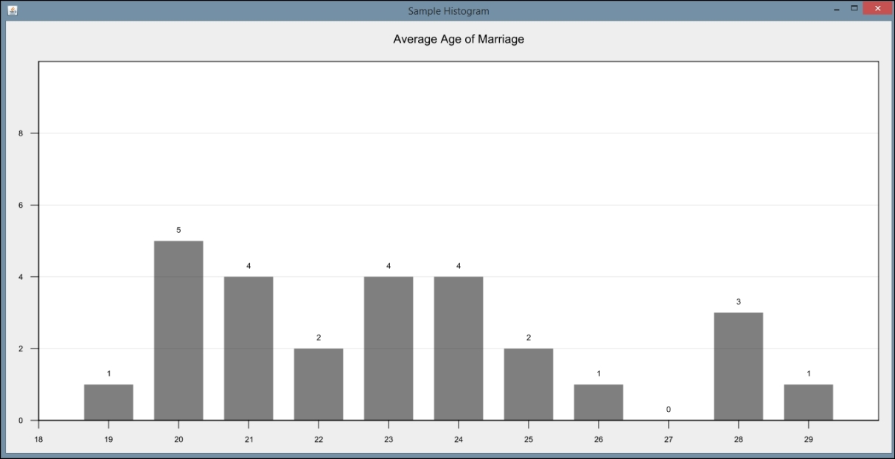
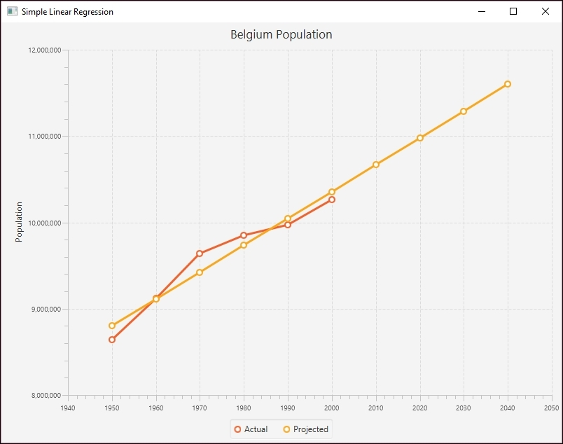

# 一、数据科学入门

数据科学不是一门单一的科学，而是为了分析数据而集成的各种科学学科的集合。这些学科包括各种统计和数学技术，包括:

*   计算机科学
*   数据工程
*   形象化
*   特定领域的知识和方法

随着更便宜的存储技术的出现，越来越多的数据被收集和存储，允许以前不可行的数据处理和分析。随着这种分析，需要各种技术来理解数据。这些大型数据集在用于分析数据并识别趋势和模式时，被称为**大数据**。

这反过来又催生了云计算和并发技术，如 **map-reduce、**将分析过程分布在大量处理器上，充分利用了并行处理的能力。

分析大数据的过程并不简单，并且演变为被称为数据科学家的开发人员的专业化。利用无数的技术和专业知识，他们能够分析数据来解决以前没有预见到或难以解决的问题。

早期的大数据应用以搜索引擎的出现为代表，这些搜索引擎比它们的前辈能够进行更强大和更准确的搜索。例如， **AltaVista** 是早期流行的搜索引擎，最终被谷歌取代。虽然大数据应用不仅限于这些搜索引擎功能，但这些应用为未来的大数据工作奠定了基础。

数据科学这一术语自 1974 年开始使用，并随着时间的推移发展到包括数据的统计分析。数据挖掘和数据分析的概念已经与数据科学联系在一起。大约在 2008 年，数据科学家一词出现，用来描述执行数据分析的人。关于数据科学历史的更深入的讨论可以在[http://www . Forbes . com/sites/Gil press/2013/05/28/a-very-short-history-of-data-science/# 3d 9 ea 08369 FD](http://www.forbes.com/sites/gilpress/2013/05/28/a-very-short-history-of-data-science/#3d9ea08369fd)找到。

这本书旨在用 Java 对数据科学有一个广泛的了解，并将简要涉及许多主题。读者可能会找到感兴趣的话题，并独立地更深入地探讨这些话题。然而，本书的目的只是向读者介绍重要的数据科学主题，并说明如何使用 Java 解决这些问题。

数据科学中使用了很多算法。在本书中，我们不试图解释它们是如何工作的，除非是在一个介绍性的水平上。相反，我们更感兴趣的是解释它们如何被用来解决问题。具体来说，我们有兴趣知道它们如何与 Java 一起使用。

# 利用数据科学解决问题

我们将展示的各种数据科学技术已经被用来解决各种问题。这些技术中有许多是为了获得一些经济利益，但是它们也被用来解决许多紧迫的社会和环境问题。使用这些技术的问题领域包括金融、优化业务流程、了解客户需求、执行 DNA 分析、挫败恐怖阴谋、发现交易之间的关系以检测欺诈，以及许多其他数据密集型问题。

数据挖掘是数据科学的一个热门应用领域。在这项活动中，大量的数据被处理和分析，以收集关于数据集的信息，提供有意义的见解，并得出有意义的结论和预测。它已被用于分析客户行为，检测看似不相关的事件之间的关系，并对未来行为做出预测。

机器学习是数据科学的一个重要方面。这种技术允许计算机解决各种问题，而不需要显式编程。它已经被用于自动驾驶汽车、语音识别和网络搜索。在数据挖掘中，数据被提取和处理。通过机器学习，计算机使用数据采取某种行动。

# 了解数据科学问题解决方法

数据科学涉及对大量数据的处理和分析，以创建可用于预测或支持特定目标的模型。这个过程通常涉及模型的建立和训练。解决问题的具体方法取决于问题的性质。但是，一般来说，以下是分析过程中使用的高级任务:

*   **获取数据**:在我们处理数据之前，必须先获取数据。数据经常以各种格式存储，并且将来自广泛的数据源。
*   **清理数据**:数据一旦被采集，往往需要转换成不同的格式才能使用。此外，还需要对数据进行处理或清理，以便消除错误、解决不一致的地方，或者将数据转换成可供分析的形式。
*   **Analyzing the data**: This can be performed using a number of techniques including:

    *   **统计分析**:这使用多种统计方法来提供对数据的洞察。它包括简单的技术和更高级的技术，如回归分析。
    *   **AI analysis**: These can be grouped as machine learning, neural networks, and deep learning techniques:

        *   机器学习方法的特点是程序可以学习，而无需专门编程来完成特定任务
        *   神经网络是围绕模仿大脑神经连接的模型建立的
        *   深度学习试图在一组数据中识别更高层次的抽象

    *   **文本分析**:这是一种常见的分析形式，它与自然语言一起识别特征，如人名和地名、文本各部分之间的关系以及文本的隐含意义。
    *   **数据可视化**:这是一个重要的分析工具。通过以视觉形式显示数据，一组难以理解的数字可以更容易理解。
    *   **视频、图像和音频处理和分析**:这是一种更专业的分析形式，随着更好的分析技术的发现和更快的处理器的出现，这种形式变得越来越普遍。这与更常见的文本处理和分析任务形成对比。

开发高效的应用程序是对这组任务的补充。采用多处理器和 GPU 的机器极大地促进了最终结果。

虽然使用的确切步骤会因应用程序而异，但了解这些基本步骤为构建许多数据科学问题的解决方案提供了基础。

## 使用 Java 支持数据科学

Java 及其相关的第三方库为数据科学应用程序的开发提供了一系列支持。有许多核心 Java 功能可以使用，比如基本的字符串处理方法。Java 8 中 lambda 表达式的引入有助于实现构建应用程序的更强大和更具表现力的方法。在后续章节的许多例子中，我们将展示使用 lambda 表达式的替代技术。

为基础数据科学任务提供了充足的支持。这些包括获取数据的多种方式、用于清理数据的库，以及用于自然语言处理和统计分析等任务的多种分析方法。还有无数支持神经网络类型分析的库。

对于数据科学问题，Java 可能是一个非常好的选择。该语言为解决问题提供了面向对象和函数的支持。有一个庞大的开发人员社区可以利用，并且存在多个支持数据科学任务的 API。这些只是为什么应该使用 Java 的几个原因。

本章的剩余部分将概述书中演示的数据科学任务和 Java 支持。每个部分只能提供对主题和可用支持的简要介绍。下一章将更深入地讨论这些话题。

# 为应用程序获取数据

数据采集是数据分析过程中的一个重要步骤。当数据被获取时，它通常是一种特殊的形式，其内容可能与应用程序的需求不一致或不同。有许多数据来源，可以在互联网上找到。几个例子将在[第二章](part0029.xhtml#aid-RL0A2 "Chapter 2. Data Acquisition")、*数据采集*中演示。

数据可以以各种格式存储。文本数据的流行格式包括 HTML、**逗号分隔值** ( **CSV** )、 **JavaScript 对象符号** ( **JSON** )和 XML。图像和音频数据以多种格式存储。但是，经常需要将一种数据格式转换成另一种格式，通常是纯文本格式。

例如，JSON([http://www.JSON.org/](http://www.JSON.org/))使用包含键值对的花括号块来存储。在以下示例中，显示了 YouTube 结果的一部分:

```
    {
      "kind": "youtube#searchResult",
      "etag": etag,
      "id": {
        "kind": string,
        "videoId": string,
        "channelId": string,
        "playlistId": string
      },
      ...
    }

```

使用诸如**处理直播流**、**下载压缩文件**以及通过**屏幕抓取**等技术获取数据，在那里提取网页上的信息。Web 爬行是一种技术，程序检查一系列网页，从一个页面移动到另一个页面，获取它需要的数据。

对于许多流行的媒体网站，需要获得用户 ID 和密码才能访问数据。一种常用的技术是 **OAuth，**，这是一种开放标准，用于对许多不同网站的用户进行身份验证。该技术委托对服务器资源的访问，并在 HTTPS 上工作。一些公司使用 OAuth 2.0，包括 PayPal、脸书、Twitter 和 Yelp。

# 清洗数据的重要性和过程

一旦获取了数据，就需要对其进行清理。通常，数据会包含错误、重复条目或不一致。通常需要将其转换为更简单的数据类型，如文本。**数据清洗**通常被称为**数据角力**、**整形、**或**蒙骗**。它们实际上是同义词。

清理数据时，通常需要执行几项任务，包括检查其有效性、准确性、完整性、一致性和统一性。例如，当数据不完整时，可能需要提供替代值。

考虑 CSV 数据。可以用几种方法中的一种来处理。我们可以使用简单的 Java 技术，比如`String` class' `split`方法。在下面的序列中，假定字符串数组`csvArray`保存逗号分隔的数据。`split`方法填充第二个数组`tokenArray`。

```
for(int i=0; i<csvArray.length; i++) { 
    tokenArray[i] = csvArray[i].split(","); 
} 

```

更复杂的数据类型需要 API 来检索数据。例如，在[第三章](part0032.xhtml#aid-UGI02 "Chapter 3. Data Cleaning")、*数据清理*中，我们将使用杰克森项目(【https://github.com/FasterXML/jackson】T4)从 JSON 文件中检索字段。该示例使用一个文件，该文件包含一个人的 JSON 格式的演示，如下所示:

```
{ 
 "firstname":"Smith",
 "lastname":"Peter", 
 "phone":8475552222,
 "address":["100 Main Street","Corpus","Oklahoma"] 
}
```

下面的代码序列显示了如何提取一个人的字段值。创建一个解析器，它使用`getCurrentName`来检索字段名称。如果名称是`firstname`，那么`getText`方法返回该字段的值。其他字段以类似的方式处理。

```
try { 
    JsonFactory jsonfactory = new JsonFactory(); 
    JsonParser parser = jsonfactory.createParser( 
        new File("Person.json")); 
    while (parser.nextToken() != JsonToken.END_OBJECT) { 
        String token = parser.getCurrentName(); 
        if ("firstname".equals(token)) { 
            parser.nextToken(); 
            String fname = parser.getText(); 
            out.println("firstname : " + fname); 
        } 
        ... 
    } 
    parser.close(); 
} catch (IOException ex) { 
    // Handle exceptions 
} 

```

该示例的输出如下:

```
firstname : Smith

```

简单的数据清理可能包括将文本转换成小写，用空格替换某些文本，以及用一个空格删除多个空白字符。下面显示了这样做的一种方法，其中组合使用了`String` class' `toLowerCase`、`replaceAll`和`trim`方法。这里，处理包含脏文本的字符串:

```
dirtyText = dirtyText 
    .toLowerCase() 
    .replaceAll("[\\d[^\\w\\s]]+", "  
    .trim(); 
while(dirtyText.contains("  ")){ 
      dirtyText = dirtyText.replaceAll("  ", " "); 
}            

```

停用词是诸如*、*、*和*或*但*之类的词，它们并不总是有助于文本分析。删除这些停用词通常可以改善结果并加快处理速度。

**LingPipe API** 可以用来移除停用词。在下一个代码序列中，使用了一个`TokenizerFactory`类实例来标记文本。标记化是返回单个单词的过程。`EnglishStopTokenizerFactory`类是一个特殊的记号赋予器，它删除常见的英语停用词。

```
text = text.toLowerCase().trim(); 
TokenizerFactory fact = IndoEuropeanTokenizerFactory.INSTANCE; 
fact = new EnglishStopTokenizerFactory(fact); 
Tokenizer tok = fact.tokenizer( 
    text.toCharArray(), 0, text.length()); 
for(String word : tok){ 
      out.print(word + " "); 
} 

```

想想下面这段摘自《莫比·迪克》一书的文字:

`Call me Ishmael. Some years ago- never mind how long precisely - having little or no money in my purse, and nothing particular to interest me on shore, I thought I would sail about a little and see the watery part of the world.`

输出如下所示:

```
call me ishmael . years ago - never mind how long precisely - having little money my purse , nothing particular interest me shore , i thought i sail little see watery part world .

```

这些只是在第 3 章、*数据清理*中讨论的几个数据清理任务。

# 可视化数据以增强理解

数据分析通常会产生一系列代表分析结果的数字。然而，对于大多数人来说，这种表达结果的方式并不总是直观的。理解结果的更好方法是创建图形和图表来描述结果以及结果元素之间的关系。

人类的大脑通常善于在视觉表现中看到模式、趋势和异常值。许多数据科学问题中存在的大量数据可以使用可视化技术进行分析。可视化适用于从分析师到高层管理人员到客户的广泛受众。在这一章中，我们将介绍各种可视化技术，并演示 Java 是如何支持这些技术的。

在[第 4 章](part0036.xhtml#aid-12AK82 "Chapter 4. Data Visualization")、*数据可视化、*中，我们展示了如何创建不同类型的图形、曲线图和图表。这些例子使用 JavaFX，使用一个名为【http://trac.erichseifert.de/gral/】()的免费库**。**

可视化允许用户以提供大量数据中不存在的洞察力的方式来检查大型数据集。可视化工具帮助我们识别潜在的问题或意外的数据结果，并对数据进行有意义的解释。

例如，离群值，即超出正常值范围的值，可能很难从大量数字中识别出来。根据数据创建图表，用户可以快速发现异常值。它还可以帮助快速发现错误，并更容易地对数据进行分类。

例如，下面的图表可能表明上面两个值应该是需要处理的异常值:



# 数据科学中统计方法的使用

统计分析是许多数据科学任务的关键。它用于多种类型的分析，从简单平均值和中间值的计算到复杂的多元回归分析。[第 5 章](part0046.xhtml#aid-1BRPS2 "Chapter 5. Statistical Data Analysis Techniques")，*统计数据分析技术*，介绍了这种类型的分析和可用的 Java 支持。

统计分析并不总是一件容易的事情。此外，高级统计技术通常需要特定的心态才能完全理解，这可能很难学习。幸运的是，许多技术并不难使用，各种库减轻了这些技术固有的复杂性。

特别地，回归分析是一种分析数据的重要技术。该技术试图绘制一条与一组数据相匹配的线。计算表示该线的方程，并可用于预测未来的行为。回归分析有几种类型，包括简单回归和多元回归。它们因所考虑的变量数量而异。

下图显示了一条与代表比利时几十年人口的一组数据点非常匹配的直线:



简单的统计技术，如均值和标准差，可以使用 basic Java 来计算。它们也可以由 Apache Commons 之类的库来处理。例如，为了计算中位数，我们可以使用 Apache Commons `DescriptiveStatistics`类。这将在下一个计算 doubles 数组的中值的地方进行说明。这些数字被添加到该类的一个实例中，如下所示:

```
double[] testData = {12.5, 18.3, 11.2, 19.0, 22.1, 14.3, 16.2, 
    12.5, 17.8, 16.5, 12.5}; 
DescriptiveStatistics statTest =  
    new SynchronizedDescriptiveStatistics(); 
for(double num : testData){ 
   statTest.addValue(num); 
} 

```

`getPercentile`方法返回存储在其参数中指定的百分点值。为了找到中间值，我们使用`50`的值。

```
out.println("The median is " + statTest.getPercentile(50)); 

```

我们的输出如下:

```
The median is 16.2

```

在第五章、*统计数据分析技术*中，我们将展示如何使用 Apache Commons `SimpleRegression`类执行回归分析。

# 机器学习应用于数据科学

机器学习对于数据科学分析已经变得越来越重要，就像它对于许多其他领域一样。机器学习的一个定义性特征是模型能够根据一组代表性数据进行训练，然后用于解决类似的问题。不需要显式地编写应用程序来解决问题。模型是现实世界对象的表示。

例如，客户购买可以用于训练模型。随后，可以对客户随后可能进行的购买类型进行预测。这允许组织为客户定制广告和优惠券，并可能提供更好的客户体验。

培训可以用几种不同的方法之一来进行:

*   **监督学习**:用显示相应正确结果的带注释、带标签的数据训练模型
*   **无监督学习**:数据不包含结果，但是模型被期望自己发现关系
*   **半监督**:少量标记数据与大量未标记数据相结合
*   **强化学习**:这类似于监督学习，但是对好的结果提供奖励

有几种方法支持机器学习。在[第六章](part0052.xhtml#aid-1HIT82 "Chapter 6. Machine Learning")、*、*机器学习中，我们将举例说明三种技术:

*   **决策树**:使用问题的特征作为内部节点，结果作为叶子来构建一棵树
*   **支持向量机**:它通过创建一个超平面来划分数据集，然后进行预测，从而用于分类
*   **贝叶斯网络**:用于描述事件之间的概率关系

一个**支持向量机** ( **SVM** )主要用于分类类型问题。该方法创建了一个超平面来对数据进行分类，该超平面可以被想象为分隔两个区域的**几何平面**。在二维空间中，它将是一条线。在三维空间中，它将是一个二维平面。在[第 6 章](part0052.xhtml#aid-1HIT82 "Chapter 6. Machine Learning")、*机器学习、*中，我们将使用一组与个人露营倾向相关的数据来演示如何使用该方法。我们将使用 Weka 类`SMO`来演示这种类型的分析。

下图描述了一个使用两种数据点分布的超平面。这些线代表分隔这些点的可能的超平面。除了一个异常值，这些线清楚地分隔了数据点。


一旦模型被训练，可能的超平面被考虑，然后可以使用类似的数据进行预测。

# 在数据科学中使用神经网络

一个**人工神经网络** ( **安**)，我们称之为**神经网络**，是基于大脑中发现的神经元。一个**神经元**是一个有**树突**将其连接到输入源和其他神经元的细胞。根据输入源，分配给源的权重，神经元被激活，然后**发射**信号沿着树突到另一个神经元。可以训练一组神经元对一组输入信号作出反应。

人工神经元是具有一个或多个输入和单个输出的节点。每个输入都有一个分配给它的**权重**，该权重可以随时间变化。神经网络可以通过向网络输入输入、调用**激活函数**并比较结果来进行学习。该函数组合输入并创建输出。如果多个神经元的输出与预期结果匹配，那么网络已经被正确训练。如果它们不匹配，则网络被修改。

如下图所示，可以可视化一个神经网络，其中**隐藏层**用于增强该过程:


在第 7 章、*神经网络*的[中，我们将使用`Weka`类、`MultilayerPerceptron`来说明一个**多层感知器** ( **MLP** )网络的创建和使用。正如我们将要解释的，这种类型的网络是一个多层前馈神经网络。该网络使用带有反向传播的监督学习。该示例使用了一个名为`dermatology.arff`的数据集，其中包含用于诊断红斑-鳞状疾病的 *366 个*实例。它使用 *34* 属性将疾病分为五个不同的类别。](part0056.xhtml#aid-1LCVG1 "Chapter 7. Neural Networks")

数据集被分成训练集和测试集。读取数据后，将使用方法创建并初始化 MLP 实例，以配置模型的属性，包括模型学习的速度和训练模型所花费的时间。

```
String trainingFileName = "dermatologyTrainingSet.arff"; 
String testingFileName = "dermatologyTestingSet.arff"; 

try (FileReader trainingReader = new FileReader(trainingFileName); 
        FileReader testingReader =  
            new FileReader(testingFileName)) { 
    Instances trainingInstances = new Instances(trainingReader); 
    trainingInstances.setClassIndex( 
        trainingInstances.numAttributes() - 1); 
    Instances testingInstances = new Instances(testingReader); 
    testingInstances.setClassIndex( 
        testingInstances.numAttributes() - 1); 

    MultilayerPerceptron mlp = new MultilayerPerceptron(); 
    mlp.setLearningRate(0.1); 
    mlp.setMomentum(0.2); 
    mlp.setTrainingTime(2000); 
    mlp.setHiddenLayers("3"); 
          mlp.buildClassifier(trainingInstances); 
       ... 
} catch (Exception ex) { 
    // Handle exceptions 
} 

```

然后使用测试数据对模型进行评估:

```
Evaluation evaluation = new Evaluation(trainingInstances); 
evaluation.evaluateModel(mlp, testingInstances); 

```

然后可以显示结果:

```
System.out.println(evaluation.toSummaryString()); 

```

此处显示了该示例的截断输出，其中列出了正确和错误识别的疾病数量:

```
Correctly Classified Instances 73 98.6486 % 
Incorrectly Classified Instances 1 1.3514 %

```

可以调整模型的各种属性来改进模型。在第 7 章、*神经网络、*中，我们将更深入地讨论这一技术和其他技术。

# 深度学习方法

深度学习网络通常被描述为使用多个中间层的神经网络。每一层将在前一层的输出上训练，潜在地识别数据集的特征和子特征。特征是指可能感兴趣的数据的那些方面。在[第 8 章](part0061.xhtml#aid-1Q5IA2 "Chapter 8. Deep Learning")、*深度学习*中，我们将考察这些类型的网络，以及它们如何支持几种不同的数据科学任务。

这些网络通常使用非结构化和未标记的数据集，这是当今可用数据的绝大部分。一种典型的方法是获取数据，识别要素，然后使用这些要素及其对应的图层来重构原始数据集，从而验证网络。**受限玻尔兹曼机** ( **RBM** )就是应用这种方法的一个很好的例子。

深度学习网络需要确保结果是准确的，并最大限度地减少任何可能蔓延到过程中的错误。这是通过基于所谓的**梯度下降**来调整分配给神经元的内部权重来实现的。这代表重量变化的斜率。该方法修改权重以最小化误差，并且还加速了学习过程。

有几种类型的网络被归类为深度学习网络。其中之一是一个自动编码器网络。在这个网络中，各层是对称的，其中输入值的数量与输出值的数量相同，中间层有效地将数据压缩到一个更小的内部层。自动编码器的每一层都是一个 RBM。

下面的例子反映了这种结构，它将提取一组包含手写数字的图像中的数字。这里没有显示完整示例的细节，但是请注意，1，000 个输入和输出值与由 RBM 组成的内部层一起使用。层的大小在`nOut`和`nIn`方法中指定。

```
MultiLayerConfiguration conf = new NeuralNetConfiguration.Builder() 
        .seed(seed) 
        .iterations(numberOfIterations) 
        .optimizationAlgo( 
           OptimizationAlgorithm.LINE_GRADIENT_DESCENT) 
        .list() 
        .layer(0, new RBM.Builder() 
            .nIn(numberOfRows * numberOfColumns).nOut(1000) 
            .lossFunction(LossFunctions.LossFunction.RMSE_XENT) 
            .build()) 
        .layer(1, new RBM.Builder().nIn(1000).nOut(500) 
            .lossFunction(LossFunctions.LossFunction.RMSE_XENT) 
            .build()) 
        .layer(2, new RBM.Builder().nIn(500).nOut(250) 
            .lossFunction(LossFunctions.LossFunction.RMSE_XENT) 
            .build()) 
        .layer(3, new RBM.Builder().nIn(250).nOut(100) 
            .lossFunction(LossFunctions.LossFunction.RMSE_XENT) 
            .build()) 
        .layer(4, new RBM.Builder().nIn(100).nOut(30) 
            .lossFunction(LossFunctions.LossFunction.RMSE_XENT) 
            .build()) //encoding stops 
        .layer(5, new RBM.Builder().nIn(30).nOut(100) 
            .lossFunction(LossFunctions.LossFunction.RMSE_XENT) 
            .build()) //decoding starts 
        .layer(6, new RBM.Builder().nIn(100).nOut(250) 
            .lossFunction(LossFunctions.LossFunction.RMSE_XENT) 
            .build()) 
        .layer(7, new RBM.Builder().nIn(250).nOut(500) 
            .lossFunction(LossFunctions.LossFunction.RMSE_XENT) 
            .build()) 
        .layer(8, new RBM.Builder().nIn(500).nOut(1000) 
            .lossFunction(LossFunctions.LossFunction.RMSE_XENT) 
            .build()) 
        .layer(9, new OutputLayer.Builder( 
                LossFunctions.LossFunction.RMSE_XENT).nIn(1000) 
                .nOut(numberOfRows * numberOfColumns).build()) 
        .pretrain(true).backprop(true) 
        .build(); 

```

一旦模型经过训练，就可以用于预测和搜索任务。通过搜索，压缩的中间层可以用于匹配其他需要分类的压缩图像。

# 执行文本分析

**自然语言处理** ( **NLP** )领域用于许多不同的任务，包括文本搜索、语言翻译、情感分析、语音识别和分类等等。由于许多原因，包括自然语言固有的模糊性，处理文本是困难的。

有几种不同类型的处理可以执行，例如:

*   **识别停用词**:这些是常见的词，可能不需要处理
*   **命名实体识别** ( **NER** ):这是识别文本元素的过程，例如人名、地点或事物
*   词性 ( **词性**):这标识了一个句子的语法部分，如名词、动词、形容词等等
*   **关系**:这里我们关心的是识别文本的各个部分是如何相互关联的，比如句子的主语和宾语

与大多数数据科学问题一样，预处理和清理文本非常重要。在[第 9 章](part0068.xhtml#aid-20R681 "Chapter 9. Text Analysis")、*文本分析*中，我们考察了 Java 为这一数据科学领域提供的支持。

例如，我们将使用 Apache 的 OpenNLP([https://opennlp.apache.org/](https://opennlp.apache.org/))库来查找词性。这只是我们可以使用的几个 NLP APIs 中的一个，包括 LingPipe(【http://alias-i.com/lingpipe/】[)、Apache UIMA(](http://alias-i.com/lingpipe/))和 Standford NLP([【http://nlp.stanford.edu/】](http://nlp.stanford.edu/))。我们选择 OpenNLP 是因为它在这个例子中很容易使用。

在下面的例子中，在`en-pos-maxent.bin`文件中找到了一个用于识别 POS 元素的模型。初始化单词数组并创建 POS 模型:

```
try (InputStream input = new FileInputStream( 
        new File("en-pos-maxent.bin"));) { 
    String sentence = "Let's parse this sentence."; 
    ... 
    String[] words; 
    ...  
    list.toArray(words); 
    POSModel posModel = new POSModel(input); 
    ... 
} catch (IOException ex) { 
    // Handle exceptions 
} 

```

向`tag`方法传递一个`words`数组，并返回一个标签数组。然后显示单词和标签。

```
String[] posTags = posTagger.tag(words); 
for(int i=0; i<posTags.length; i++) { 
    out.println(words[i] + " - " + posTags[i]); 
} 

```

该示例的输出如下:

```
Let's - NNP 
parse - NN 
this - DT 
sentence. - NN

```

缩写`NNP`和`DT`分别代表单数专有名词和限定词。我们在[第 9 章](part0068.xhtml#aid-20R681 "Chapter 9. Text Analysis")、*文本分析*中考察了其他几种 NLP 技术。

# 视觉和听觉分析

在[第十章](part0074.xhtml#aid-26I9K2 "Chapter 10. Visual and Audio Analysis")、*视听分析*中，我们展示了几种处理声音和图像的 Java 技术。我们首先演示声音处理技术，包括语音识别和文本到语音转换 API。具体来说，我们将使用 FreeTTS(【http://freetts.sourceforge.net/docs/index.php】)API 将文本转换为语音。我们还展示了用于语音识别的 **CMU 斯芬克斯**工具包。

Java 语音 API(**JSAPI**)(【http://www.oracle.com/technetwork/java/index-140170.html】T4)支持语音技术。这个由第三方供应商创建的 API 支持语音识别和语音合成器。FreeTTS 和 Festival([http://www.cstr.ed.ac.uk/projects/festival/](http://www.cstr.ed.ac.uk/projects/festival/))就是支持 JSAPI 的供应商的例子。

在本章的第二部分，我们研究图像处理技术，如面部识别。这个演示包括识别图像中的人脸，使用 OpenCV([http://opencv.org/](http://opencv.org/))很容易完成。

此外，在第十章、*、*中，我们演示了如何从图像中提取文本，这个过程被称为 **OCR** 。一个常见的数据科学问题涉及提取和分析图像中嵌入的文本。例如，包含在牌照、路标和方向中的信息可能非常重要。

在下面的例子中，在第 11 章[中有更详细的解释，用于数据分析的*数学和并行技术*使用 Tess4j(](part0080.xhtml#aid-2C9D01 "Chapter 11. Mathematical and Parallel Techniques for Data Analysis")[http://tess4j.sourceforge.net/](http://tess4j.sourceforge.net/))一个用于 Tesseract OCR API 的 Java JNA 包装器来实现 OCR。我们对从维基百科关于 OCR 的文章([https://en . Wikipedia . org/wiki/Optical _ character _ recognition # Applications](https://en.wikipedia.org/wiki/Optical_character_recognition))中捕获的图像执行 OCR，如下所示:


`ITesseract`接口提供了许多 OCR 方法。`doOCR`方法获取一个文件并返回一个包含文件中的单词的字符串，如下所示:

```
ITesseract instance = new Tesseract();  
try { 
    String result = instance.doOCR(new File("OCRExample.png")); 
    System.out.println(result); 
} catch (TesseractException e) { 
    System.err.println(e.getMessage()); 
} 

```

下面显示了输出的一部分:

```
OCR engines nave been developed into many lunds oiobiectorlented OCR applicatlons, sucn as reoeipt OCR, involoe OCR, check OCR, legal billing document OCR 
They can be used ior 
- Data entry ior business documents, e g check, passport, involoe, bank statement and receipt 
- Automatic number plate recognnlon

```

如您所见，这个示例中有许多错误需要解决。我们在第 11 章[*数据分析的数学和并行技术*中建立了这个例子，讨论了增强功能和注意事项，以确保 OCR 过程尽可能有效。](part0080.xhtml#aid-2C9D01 "Chapter 11. Mathematical and Parallel Techniques for Data Analysis")

我们将以 NeurophStudio 的讨论来结束本章，NeurophStudio 是一个基于 Java 的神经网络编辑器，用于对图像进行分类和执行图像识别。我们在这一部分训练一个神经网络来识别和分类人脸。

# 使用并行技术提高应用性能

在[第 11 章](part0080.xhtml#aid-2C9D01 "Chapter 11. Mathematical and Parallel Techniques for Data Analysis")、*数据分析的数学和并行技术*中，我们考虑了一些可用于数据科学应用的并行技术。程序的并发执行可以显著提高性能。与数据科学相关，这些技术包括从低级数学计算到高级 API 特定选项。

本章包括对基本性能增强注意事项的讨论。算法和应用程序架构与增强代码一样重要，当试图集成并行技术时，应该考虑这一点。如果应用程序没有以预期或想要的方式运行，并行优化的任何好处都是无关紧要的。

矩阵运算对于许多数据应用程序和支持 API 是必不可少的。我们将在本章中讨论矩阵乘法，以及如何用各种方法处理它。尽管这些操作通常隐藏在 API 中，但是理解它们是如何被支持的还是很有用的。

我们演示的一种方法利用了 Apache Commons 数学 API([http://commons.apache.org/proper/commons-math/](http://commons.apache.org/proper/commons-math/))。这个 API 支持大量的数学和统计操作，包括矩阵乘法。以下示例说明了如何执行矩阵乘法。

我们首先声明并初始化矩阵`A`和`B`:

```
double[][] A = { 
    {0.1950, 0.0311}, 
    {0.3588, 0.2203}, 
    {0.1716, 0.5931}, 
    {0.2105, 0.3242}}; 

double[][] B = { 
    {0.0502, 0.9823, 0.9472}, 
    {0.5732, 0.2694, 0.916}}; 

```

Apache Commons 使用`RealMatrix`类来存储矩阵。接下来，我们使用`Array2DRowRealMatrix`构造函数为`A`和`B`创建相应的矩阵:

```
RealMatrix aRealMatrix = new Array2DRowRealMatrix(A); 
RealMatrix bRealMatrix = new Array2DRowRealMatrix(B); 

```

我们简单地使用`multiply`方法执行乘法:

```
RealMatrix cRealMatrix = aRealMatrix.multiply(bRealMatrix); 

```

最后，我们使用一个`for`循环来显示结果:

```
for (int i = 0; i < cRealMatrix.getRowDimension(); i++) { 
    System.out.println(cRealMatrix.getRowVector(i)); 
} 

```

输出如下所示:

```
{0.02761552; 0.19992684; 0.2131916}
{0.14428772; 0.41179806; 0.54165016}
{0.34857924; 0.32834382; 0.70581912}
{0.19639854; 0.29411363; 0.4963528}

```

并发处理的另一种方法是使用 Java 线程。当多个 CPU 或 GPU 不可用时，线程由 api(如 Aparapi)使用。

数据科学应用程序通常利用 map-reduce 算法。我们将通过使用 Apache 的 Hadoop 来执行 map-reduce 来演示并行处理。Hadoop 专为大型数据集而设计，可减少大规模数据科学项目的处理时间。我们演示了一种计算大型数据集平均值的技术。

我们还包括支持多处理器的 API 的例子，包括 CUDA 和 OpenCL。使用 Java bindings for CUDA(JCuda)([http://jcuda.org/](http://jcuda.org/))来支持 CUDA。我们还将讨论 OpenCL 及其 Java 支持。Aparapi API 为使用多个 CPU 或 GPU 提供了高级支持，并且我们包括了一个 Aparapi 支持矩阵乘法的演示。


# 组装零件

在本书的最后一章，我们将把前几章探索的许多技术结合在一起。我们将创建一个简单的基于控制台的应用程序，用于从 Twitter 获取数据并执行各种类型的数据操作和分析。我们在本章中的目标是展示一个探索各种数据科学概念的简单项目，并为未来的项目提供见解和考虑。

具体来说，在最后一章中开发的应用程序执行几个高级任务，包括数据采集、数据清理、情感分析和基本的统计数据收集。我们使用 Java 8 流演示这些技术，并尽可能关注 Java 8 方法。


# 总结

数据科学是一个广泛多样的研究领域，不可能在本书中进行详尽的探讨。我们希望提供对重要数据科学概念的坚实理解，并使读者做好进一步学习的准备。特别是，这本书将为数据科学相关调查的所有阶段提供不同技术的具体例子。这包括从数据采集和清理到详细的统计分析。

因此，让我们从讨论数据采集和 Java 如何支持它开始，如下一章所示。