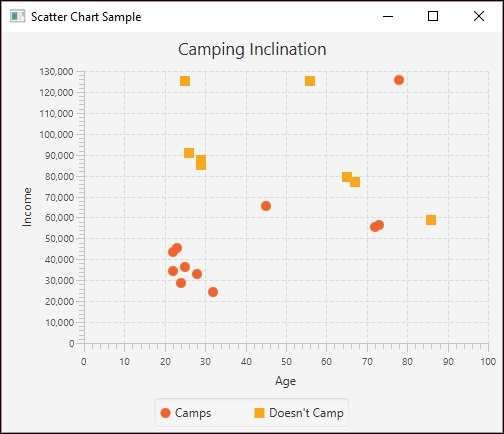

# 六、机器学习

机器学习是一个广泛的话题，有许多不同的支持算法。它通常关注开发一些技术，这些技术允许应用程序学习，而不需要显式地编程来解决问题。通常，建立模型是为了解决一类问题，然后使用来自问题域的样本数据进行训练。在这一章中，我们将讨论一些数据科学中更常见的问题和模型。

这些技术中的许多使用训练数据来教导模型。数据由问题空间的各种代表性元素组成。一旦该模型被训练，就使用测试数据对其进行测试和评估。然后，使用该模型和输入数据进行预测。

例如，商店顾客的购买可以用来训练模型。随后，可以对具有相似特征的客户进行预测。由于预测客户行为的能力，有可能提供特殊的交易或服务来吸引客户返回或促进他们的访问。

有几种对机器学习技术进行分类的方法。一种方法是根据学习风格对他们进行分类:

*   **监督学习**:通过监督学习，用将输入特征值与正确输出值相匹配的数据来训练模型
*   **无监督学习**:在无监督学习中，数据不包含结果，但是模型被期望自己确定关系。
*   **半监督**:该技术使用少量包含正确答案的标记数据和大量未标记数据。这种结合可以带来更好的结果。
*   **强化学习**:这类似于监督学习，但是对好的结果提供奖励。
*   **深度学习**:这种方法使用包含多个处理级别的图来建模高级抽象。

在这一章中，我们将只能触及其中的一些技术。具体来说，我们将举例说明使用监督学习的三种技术:

*   **决策树**:使用问题的特征作为内部节点，结果作为叶子来构建一棵树
*   **支持向量机**:通常用于分类，通过创建一个分离数据集的超平面，然后进行预测
*   **贝叶斯网络**:用于描述环境中事件之间概率关系的模型

对于无监督学习，我们将展示如何使用**关联规则学习**来发现数据集元素之间的关系。然而，我们不会在这一章中讨论无监督学习。

我们将讨论强化学习的要素，并讨论这种技术的一些具体变化。我们还将提供进一步探索的资源链接。

深度学习的讨论推迟到[第八章](part0061.xhtml#aid-1Q5IA2 "Chapter 8. Deep Learning")、*深度学习*。这项技术建立在神经网络的基础上，这将在[第 7 章](part0056.xhtml#aid-1LCVG1 "Chapter 7. Neural Networks")、*神经网络*中讨论。

在本章中，我们将讨论以下具体主题:

*   决策树
*   支持向量机
*   贝叶斯网络
*   关联规则学习
*   强化学习

# 监督学习技术

有大量的监督机器学习算法可用。我们将研究其中的三种:决策树、支持向量机和贝叶斯网络。它们都使用包含属性和正确答案的带注释的数据集。通常，使用训练和测试数据集。

我们从讨论决策树开始。

## 决策树

机器学习**决策树**是一种用于进行预测的模型。它有效地将某些观察映射到关于目标的结论。术语**树**来自反映不同状态或价值的分支。树叶代表结果，树枝代表导致结果的特征。在数据挖掘中，决策树是用于分类的数据描述。例如，我们可以使用决策树来根据收入水平和邮政编码等特定属性来确定个人是否可能购买某件商品。

我们希望创建一个决策树，根据其他变量来预测结果。当目标变量取连续值，如实数时，该树被称为**回归树**。

树由内部节点和叶子组成。每个内部节点代表模型的一个特征，例如受教育的年数或者一本书是平装本还是精装本。从内部节点引出的边表示这些特征的值。每片叶子被称为一个**类**，并且有一个**相关的概率分布**。

例如，我们将使用一个数据集，该数据集根据书籍的装订类型、颜色使用和流派来处理书籍的成功与否。基于该数据集的一个可能的决策树如下:


决策图表

决策树很有用，也很容易理解。即使对于大型数据集，为模型准备数据也很简单。

### 决策树类型

通过将输入数据集除以特征，可以对树进行*训练*。这通常以递归方式完成，被称为**递归划分**或**决策树的自顶向下归纳** ( **TDIDT** )。当节点的值与目标的值都是同一类型或者递归不再增加值时，递归是有界的。

**分类回归树** ( **大车**)分析是指两种不同类型的决策树类型:

*   **分类树分析**:叶子对应一个目标特征
*   **回归树分析**:叶子拥有一个代表特征的实数

在分析过程中，可能会创建多个树。有几种技术可以用来创建树。这些技术被称为**集成方法**:

*   **Bagging 决策树**:数据被重新采样并经常用于获得基于共识的预测
*   **随机森林分类器**:用于提高分类率
*   **提升树**:这可用于回归或分类问题
*   **旋转森林**:使用一种叫做**主成分分析** ( **PCA** )的技术

对于给定的一组数据，有可能不止一棵树对数据进行建模。例如，树的根可以指定银行是否有 ATM 机，随后的内部节点可以指定出纳员的数量。然而，可以创建这样的树，其中出纳员的数量是根，ATM 的存在是内部节点。树的结构差异可以决定树的效率有多高。

有许多方法可以确定树中节点的顺序。一种技术是选择提供最多信息增益的属性；也就是说，选择一个能更好地帮助快速缩小可能决策范围的属性。

### 决策树库

有几个 Java 库支持决策树:

*   **韦卡**:【http://www.cs.waikato.ac.nz/ml/weka/】T2
*   **Apache Spark**:[https://Spark . Apache . org/docs/1 . 2 . 0/ml lib-decision-tree . html](https://spark.apache.org/docs/1.2.0/mllib-decision-tree.html)
*   **JBoss**:【http://jboost.sourceforge.net】T2
*   **机器学习语言工具包** ( **木槌**):【http://mallet.cs.umass.edu】T4

我们将使用**怀卡托知识分析环境** ( **Weka** )来演示如何用 Java 创建决策树。Weka 是一个具有 GUI 界面的工具，允许对数据进行分析。也可以从命令行或通过我们将使用的 Java API 调用它。

在构建树时，选择一个变量来分割树。有几种方法可以用来选择变量。我们使用哪一个取决于通过选择一个变量获得了多少信息。具体来说，我们将使用 Weka 的`J48`类支持的 **C4.5 算法**。

Weka 使用一个`.arff`文件来保存数据集。这个文件是可读的，由两部分组成。第一个是标题部分；它描述了文件中的数据。本节使用&符号来指定数据的关系和属性。第二段是数据段；它由一组逗号分隔的数据组成。

### 对图书数据集使用决策树

对于这个例子，我们将使用一个名为`books.arff`的文件。接下来显示了它，它使用了四个称为属性的特性。这些功能指定了一本书是如何装订的，它是否使用多种颜色，它的流派，以及表明该书是否被购买的结果。标题部分如下所示:

```
@RELATION book_purchases
@ATTRIBUTE Binding {Hardcover, Paperback, Leather}
@ATTRIBUTE Multicolor {yes, no}
@ATTRIBUTE Genre {fiction, comedy, romance, historical}
@ATTRIBUTE Result {Success, Failure}
```

数据部分如下，由 13 个书条目组成:

```
@DATA
Hardcover,yes,fiction,Success
Hardcover,no,comedy,Failure
Hardcover,yes,comedy,Success
Leather,no,comedy,Success
Leather,yes,historical,Success
Paperback,yes,fiction,Failure
Paperback,yes,romance,Failure
Leather,yes,comedy,Failure
Paperback,no,fiction,Failure
Paperback,yes,historical,Failure
Hardcover,yes,historical,Success
Paperback,yes,comedy,Success
Hardcover,yes,comedy,Success
```

我们将使用下面定义的`BookDecisionTree`类来处理这个文件。它使用一个构造函数和三个方法:

*   `BookDecisionTree`:读入教练数据并创建一个用于处理数据的`Instance`对象
*   `main`:驱动应用程序
*   `performTraining`:使用数据集训练模型
*   `getTestInstance`:创建一个测试用例

`Instances`类保存代表单个数据集元素的元素:

```
public class BookDecisionTree { 
    private Instances trainingData; 

    public static void main(String[] args) { 
        ... 
    } 

    public BookDecisionTree(String fileName) { 
        ... 
    } 

    private J48 performTraining() { 
        ... 
    } 

    private Instance getTestInstance(   
        ... 
    } 
} 

```

构造函数打开一个文件并使用`BufferReader`实例创建一个`Instances`类的实例。数据集的每个元素要么是要素，要么是结果。`setClassIndex`方法指定了结果类的索引。在这种情况下，它是数据集的最后一个索引，对应于成功或失败:

```
public BookDecisionTree(String fileName) { 
    try { 
        BufferedReader reader = new BufferedReader( 
            new FileReader(fileName)); 
        trainingData = new Instances(reader); 
        trainingData.setClassIndex( 
            trainingData.numAttributes() - 1); 
    } catch (IOException ex) { 
        // Handle exceptions 
    } 
} 

```

我们将使用`J48`类来生成一个决策树。这个类使用 C4.5 决策树算法来生成修剪或未修剪的树。方法指定使用未修剪的树。`buildClassifier`方法实际上是基于所使用的数据集创建分类器:

```
private J48 performTraining() { 
    J48 j48 = new J48(); 
    String[] options = {"-U"}; 
    try { 
        j48.setOptions(options); 
        j48.buildClassifier(trainingData); 
    } catch (Exception ex) { 
        ex.printStackTrace(); 
    } 
    return j48; 
} 

```

我们想要测试这个模型，所以我们将为每个测试用例创建一个实现`Instance`接口的对象。一个`getTestInstance` helper 方法被传递了三个参数，代表一个数据元素的三个特性。`DenseInstance`类是一个实现`Instance`接口的类。传递的值被分配给实例，并返回实例:

```
private Instance getTestInstance( 
        String binding, String multicolor, String genre) { 
    Instance instance = new DenseInstance(3); 
    instance.setDataset(trainingData); 
    instance.setValue(trainingData.attribute(0), binding); 
    instance.setValue(trainingData.attribute(1), multicolor); 
    instance.setValue(trainingData.attribute(2), genre); 
    return instance; 
}
```

`main`方法使用前面所有的方法来处理和测试我们的图书数据集。首先，使用图书数据集文件的名称创建一个`BookDecisionTree`实例:

```
public static void main(String[] args) { 
    try { 
        BookDecisionTree decisionTree =  
            new BookDecisionTree("books.arff"); 
        ... 
    } catch (Exception ex) { 
        // Handle exceptions 
    } 
} 

```

接下来，调用`performTraining`方法来训练模型。我们还显示了树:

```
J48 tree = decisionTree.performTraining(); 
System.out.println(tree.toString());             

```

执行时，将显示以下内容:

```
J48 unpruned tree
------------------
Binding = Hardcover: Success (5.0/1.0)
Binding = Paperback: Failure (5.0/1.0)
Binding = Leather: Success (3.0/1.0)
Number of Leaves : 3
Size of the tree : 4

```

### 测试图书决策树

我们将用两个不同的测试用例来测试这个模型。两者都使用相同的代码来设置实例。我们使用带有测试用例特定值的`getTestInstance`方法，然后使用带有`classifyInstance`的实例来获得结果。为了获得更具可读性的内容，我们生成一个字符串，然后显示如下:

```
Instance testInstance = decisionTree. 
        getTestInstance("Leather", "yes", "historical"); 
int result = (int) tree.classifyInstance(testInstance);             
String results = decisionTree.trainingData.attribute(3).value(result);             
System.out.println( 
        "Test with: " + testInstance + "  Result: " + results); 

testInstance = decisionTree. 
        getTestInstance("Paperback", "no", "historical"); 
result = (int) tree.classifyInstance(testInstance);             
results = decisionTree.trainingData.attribute(3).value(result);             
System.out.println( 
        "Test with: " + testInstance + "  Result: " + results); 

```

执行这段代码的结果如下:

```
Test with: Leather,yes,historical Result: Success
Test with: Paperback,no,historical Result: Failure

```

这符合我们的预期。这种技术是基于在做出排序决定之前和之后获得的信息量。这可以基于如下计算的熵来测量:

```
Entropy = -portionPos * log2(portionPos) - portionNeg* log2(portionNeg)
```

在这个例子中，`portionPos`是正的数据部分，`portionNeg`是负的数据部分。基于 books 文件，我们可以计算绑定的熵，如下表所示。通过从 *1.0* 中减去用于结合的熵来计算信息增益:


我们可以用类似的方式计算颜色和类型使用的熵。颜色的信息增益为 *0.05* ，流派的信息增益为 *0.15* 。因此，对树的第一层使用绑定类型更有意义。

由于 C4.5 算法确定剩余的特征不提供任何额外的信息增益，因此该示例的结果树由两层组成。

当选择具有大量值的特征时，例如客户的信用卡号，信息获取可能会有问题。使用这种类型的属性会迅速缩小范围，但它的选择性太强，没有多大价值。

## 支持向量机

一个**支持向量机** ( **SVM** )是一个监督机器学习算法，用于分类和回归问题。它主要用于分类问题。该方法创建超平面来对训练数据进行分类。超平面可以被想象成分隔两个区域的几何平面。在二维空间中，它将是一条线。在三维空间中，它将是一个二维平面。对于更高的维度，更难概念化，但它们确实存在。

考虑下图，该图描述了两种类型的数据点的分布。这些线代表分隔这些点的可能的超平面。SVM 过程的一部分是为问题数据集寻找最佳超平面。我们将在编码示例中详细阐述这个数字。


超平面示例

支持向量是位于超平面附近的数据点。SVM 模型使用核的概念将输入数据映射到更高阶的维度空间，以使数据更容易结构化。这样做的映射函数可能导致无限维空间；也就是说，可能存在无限数量的可能映射。

然而，所谓的**内核技巧**，内核函数是一种避免这种映射并避免可能发生的不可行计算的方法。支持向量机支持不同类型的内核。内核列表可以在[http://crsouza . com/2010/03/kernel-functions-for-machine-learning-applications/](http://crsouza.com/2010/03/kernel-functions-for-machine-learning-applications/)找到。选择合适的内核取决于问题。常用的内核包括:

*   **线性**:使用一个线性超平面
*   **多项式**:使用超平面的多项式方程
*   **径向基函数(RBF)** :使用非线性超平面
*   **Sigmoid**:Sigmoid 核，也称为**双曲正切核**，来自神经网络领域，相当于一个两层感知器神经网络

这些内核支持不同的数据分析算法。

支持向量机对于人类难以想象的高维空间非常有用。在上图中，两个属性用于预测第三个属性。当存在更多属性时，可以使用 SVM。需要对 SVM 进行训练，对于较大的数据集，这可能需要更长的时间。

我们将使用 Weka 类`SMO`来演示 SVM 分析。该类支持 John Platt 的顺序最小优化算法。关于这个算法的更多信息可以在[https://www . Microsoft . com/en-us/research/publication/fast-training-of-support-vector-machines-using-sequential-minimal-optimization/](https://www.microsoft.com/en-us/research/publication/fast-training-of-support-vector-machines-using-sequential-minimal-optimization/)找到。

`SMO`类支持以下内核，可以在使用该类时指定:

*   **Puk** :基于皮尔逊 VII 函数的通用核
*   **多内核**:多项式内核
*   **RBF kernel**:RBF 内核

该算法使用训练数据来创建分类模型。然后，测试数据可用于评估模型。我们还可以评估单个数据元素。

### 使用 SVM 获取露营数据

为了便于说明，我们将使用一个由年龄、收入和某人是否露营组成的数据集。我们希望能够根据年龄和收入预测某人是否倾向于露营。我们使用的数据以`.arff`格式存储，并非基于调查，而是为了解释 SVM 进程而创建的。输入数据在`camping.txt`文件中找到，如下所示。文件扩展名不必是`.arff`:

```
@relation camping
@attribute age numeric
@attribute income numeric
@attribute camps {1, 0}
@data
23,45600,1
45,65700,1
72,55600,1
24,28700,1
22,34200,1
28,32800,1
32,24600,1
25,36500,1
26,91000,0
29,85300,0
67,76800,0
86,58900,0
56,125300,0
25,125000,0
22,43600,1
78,125700,1
73,56500,1
29,87600,0
65,79300,0
```

下图显示了数据的分布情况。注意右上角的异常值。生成此图的 JavaFX 代码位于[http://www.packtpub.com/support](http://www.packtpub.com/support):



野营图

我们将从读入数据和处理异常开始:

```
try { 
    BufferedReader datafile; 
    datafile = readDataFile("camping.txt"); 
    ... 
} catch (Exception ex) { 
    // Handle exceptions 
} 

```

`readDataFile`方法如下:

```
public BufferedReader readDataFile(String filename) { 
    BufferedReader inputReader = null; 
    try { 
        inputReader = new BufferedReader( 
            new FileReader(filename)); 
    } catch (FileNotFoundException ex) { 
        // Handle exceptions 
    } 
    return inputReader; 
}
```

`Instances`类保存一系列数据实例，其中每个实例都是年龄、收入和露营值。`setClassIndex`方法指出哪个属性将被预测。在本例中，它是`camps`属性:

```
    Instances data = new Instances(datafile); 
    data.setClassIndex(data.numAttributes() - 1); 

```

为了训练模型，我们将把数据集分成两组。第一个`14`实例用于训练模型，最后一个`5`实例用于测试模型。`Instances`构造函数的第二个参数指定数据集中的起始索引，最后一个参数指定要包含多少个实例:

```
    Instances trainingData = new Instances(data, 0, 14); 
    Instances testingData = new Instances(data, 14, 5); 

```

创建一个`Evaluation`类实例来评估模型。还创建了一个`SMO`类的实例。`SMO`类的`buildClassifier`方法使用数据集构建分类器:

```
    Evaluation evaluation = new Evaluation(trainingData); 
    Classifier smo = new SMO();             
    smo.buildClassifier(data); 

```

`evaluateModel`方法使用测试数据评估模型。然后显示结果:

```
    evaluation.evaluateModel(smo, testingData); 
    System.out.println(evaluation.toSummaryString()); 

```

输出如下。请注意一个错误分类的实例。这对应于前面提到的异常值:

```
Correctly Classified Instances 4 80 %
Incorrectly Classified Instances 1 20 %
Kappa statistic 0.6154
Mean absolute error 0.2 
Root mean squared error 0.4472
Relative absolute error 41.0256 %
Root relative squared error 91.0208 %
Coverage of cases (0.95 level) 80 %
Mean rel. region size (0.95 level) 50 %
Total Number of Instances 5

```

### 测试个别实例

我们还可以使用`classifyInstance`方法测试一个单独的实例。在下面的序列中，我们使用`DenseInstance`类创建一个新的实例。然后使用露营数据集的属性对其进行填充:

```
Instance instance = new DenseInstance(3); 
instance.setValue(data.attribute("age"), 78); 
instance.setValue(data.attribute("income"), 125700); 
instance.setValue(data.attribute("camps"), 1); 

```

需要使用`setDataset`方法将实例与数据集相关联:

```
instance.setDataset(data); 

```

然后将`classifyInstance`方法应用于`smo`实例，并显示结果:

```
System.out.println(smo.classifyInstance(instance)); 

```

执行时，我们得到以下输出:

```
1.0

```

也有替代的测试方法。常见的一种叫做**交叉验证折叠**。这种方法将数据集分为*褶皱、*褶皱，这些褶皱是数据集的分区。通常会创建 10 个分区。九个分区用于训练，一个用于测试。每次使用数据集的不同分区重复 10 次，并使用结果的平均值。这个技巧在[https://WEKA . wikispaces . com/Generating+cross-validation+folds+(Java+approach)](https://weka.wikispaces.com/Generating+cross-validation+folds+(Java+approach))有描述。

我们现在将检查贝叶斯网络的目的和使用。

## 贝叶斯网络

**贝叶斯网络**，也称为**贝叶斯网**或**信念网络**，是通过描述世界不同属性的状态及其统计关系来反映特定世界或环境的模型。这些模型可以用来展示各种各样的真实场景。在下图中，我们建立了一个系统模型，描述了各种因素与我们上班迟到可能性之间的关系:


贝叶斯网络

图上的每个圆圈代表系统的一个节点或部分，它可以有不同的值和每个值的概率。例如，**停电**可能是真的或假的——要么停电，要么没有停电。停电的概率会影响你的闹钟不响的概率，你可能会睡过头，从而上班迟到。

图表顶部的节点往往比底部的节点意味着更高层次的因果关系。更高的节点称为**父节点**，它们可能有一个或多个子节点。贝叶斯网络只涉及具有因果相关性的节点，因此允许更有效地计算概率。与其他模型不同，我们不必存储和分析每个节点的每种可能的状态组合。相反，我们可以计算和存储相关节点的概率。此外，贝叶斯网络很容易适应，并且可以随着关于特定世界的更多知识的获得而增长。

### 使用贝叶斯网络

为了使用 Java 对这种类型的网络进行建模，我们将使用 JB eyes([https://github.com/vangj/jbayes](https://github.com/vangj/jbayes))来创建一个网络。JBayes 是一个开源库，用于创建一个简单的**贝叶斯信念网络** ( **BBN** )。它可以免费用于个人或商业用途。在我们的下一个例子中，我们将执行近似推理，这是一种被认为不太准确但可以减少计算时间的技术。这种技术经常在处理大数据时使用，因为它可以在合理的时间内生成可靠的模型。我们通过对每个节点进行加权采样来进行近似推理。JBayes 还提供了对精确推理的支持。精确推断最常用于较小的数据集或准确性非常重要的情况。JBayes 使用连接树算法执行精确推理。

为了开始我们的近似推理模型，我们将首先创建我们的节点。我们将使用前面描述影响准时到达的属性的图表来构建我们的网络。在下面的代码示例中，我们使用方法链接来创建节点。其中三个方法带有一个`String`参数。`name`方法是与每个节点相关联的名称。为了简洁起见，我们只使用首字母，所以 *s* 代表`storms` , `t`代表`traffic`，以此类推。`value`方法允许我们为节点设置值。在每种情况下，我们的节点只能有两个值:`t`表示真，或者`f`表示假:

```
Node storms = Node.newBuilder().name("s").value("t").value("f").build(); 
Node traffic = Node.newBuilder().name("t").value("t").value("f").build(); 
Node powerOut = Node.newBuilder().name("p").value("t").value("f").build(); 
Node alarm = Node.newBuilder().name("a").value("t").value("f").build(); 
Node overslept = Node.newBuilder().name("o").value("t").value("f").build(); 
Node lateToWork = Node.newBuilder().name("l").value("t").value("f").build(); 

```

接下来，我们为每个子节点分配父节点。请注意，`storms`是`traffic`和`powerOut`的父节点。`lateToWork`节点有两个父节点，`traffic`和`overslept`:

```
traffic.addParent(storms); 
powerOut.addParent(storms); 
lateToWork.addParent(traffic); 
alarm.addParent(powerOut); 
overslept.addParent(alarm); 
lateToWork.addParent(overslept); 

```

然后，我们为每个节点定义**条件概率表** ( **CPTs** )。这些表基本上是表示每个节点的每个属性的概率的二维数组。如果我们有不止一个父节点，就像在`lateToWork`节点的情况下，我们需要为每个节点准备一行。在这个例子中，我们使用了任意的概率值，但是注意每一行的总和必须是`1.0`:

```
storms.setCpt(new double[][] {{0.7, 0.3}}); 
traffic.setCpt(new double[][] {{0.8, 0.2}}); 
powerOut.setCpt(new double[][] {{0.5, 0.5}}); 
alarm.setCpt(new double[][] {{0.7, 0.3}}); 
overslept.setCpt(new double[][] {{0.5, 0.5}}); 
lateToWork.setCpt(new double[][] { 
   {0.5, 0.5}, 
   {0.5, 0.5} 
}); 

```

最后，我们创建一个`Graph`对象，并将每个节点添加到我们的图结构中。然后，我们使用此图进行采样:

```
Graph bayesGraph = new Graph(); 
bayesGraph.addNode(storms); 
bayesGraph.addNode(traffic); 
bayesGraph.addNode(powerOut); 
bayesGraph.addNode(alarm); 
bayesGraph.addNode(overslept); 
bayesGraph.addNode(lateToWork); 
bayesGraph.sample(1000); 

```

此时，我们可能对每个事件的概率感兴趣。我们可以使用`prob`方法来检查每个节点的`True`或`False`值的概率:

```
double[] stormProb = storms.probs(); 
double[] trafProb = traffic.probs(); 
double[] powerProb = powerOut.probs(); 
double[] alarmProb = alarm.probs(); 
double[] overProb = overslept.probs(); 
double[] lateProb = lateToWork.probs(); 

out.println("nStorm Probabilities"); 
out.println("True: " + stormProb[0] + " False: " + stormProb[1]); 
out.println("nTraffic Probabilities"); 
out.println("True: " + trafProb[0] + " False: " + trafProb[1]); 
out.println("nPower Outage Probabilities"); 
out.println("True: " + powerProb[0] + " False: " + powerProb[1]); 
out.println("vAlarm Probabilities"); 
out.println("True: " + alarmProb[0] + " False: " + alarmProb[1]); 
out.println("nOverslept Probabilities"); 
out.println("True: " + overProb[0] + " False: " + overProb[1]); 
out.println("nLate to Work Probabilities"); 
out.println("True: " + lateProb[0] + " False: " + lateProb[1]); 

```

我们的输出包含每个节点的每个值的概率。例如，风暴发生的概率是 71%，而不发生的概率是 29%:

```
Storm Probabilities
True: 0.71 False: 0.29
Traffic Probabilities
True: 0.726 False: 0.274
Power Outage Probabilities
True: 0.442 False: 0.558
Alarm Probabilities
True: 0.543 False: 0.457
Overslept Probabilities
True: 0.556 False: 0.444
Late to Work Probabilities
True: 0.469 False: 0.531

```

### 注意

请注意，在这个例子中，我们使用了产生上班迟到可能性非常高的数字，大约为 47%。这是因为我们已经将父节点的概率设置得相当高。如果风暴发生的几率较低，或者如果我们也改变了一些其他的子节点，这个数据会有很大的变化。

如果我们想保存有关样本的信息，可以使用以下代码将数据保存到 CSV 文件中:

```
try { 
   CsvUtil.saveSamples(bayesGraph, new FileWriter( 
        new File("C://JBayesInfo.csv"))); 
} catch (IOException e) { 
   // Handle exceptions 
} 

```

关于监督学习的讨论结束后，我们现在将转向无监督学习。

# 无监督机器学习

无监督机器学习不使用带注释的数据；也就是说，数据集确实包含预期的结果。虽然有几种无监督学习算法，但我们将展示关联规则学习的使用来说明这种学习方法。

## 关联规则学习

**关联规则学习**是一种识别数据项之间关系的技术。这是所谓的**市场篮子分析**的一部分。当购物者进行购买时，这些购买很可能由不止一个项目组成，并且当它这样做时，有某些项目倾向于一起购买。关联规则学习是识别这些相关项目的一种方法。当发现关联时，可以为其制定规则。

例如，如果顾客购买尿布和乳液，他们也可能购买婴儿湿巾。分析可以发现这些关联，并且可以形成陈述观察结果的规则。该规则将被表达为*{尿布、洗液} =>{湿巾}* 。能够识别这些购买模式允许商店提供特殊优惠券，安排他们的产品更容易得到，或者实现任何数量的其他市场相关活动。

这种技术的一个问题是存在大量可能的关联。一种常用的有效方法是**先验**算法。该算法处理由一组项目定义的事务集合。这些项目可以被认为是购买，而交易可以被认为是一起购买的一组项目。该集合通常被称为数据库。

考虑下面的一组交易，其中, *1* 表示该物品是作为交易的一部分购买的，而 *0* 表示该物品没有被购买:

| **交易 ID** | **尿布** | **乳液** | **湿巾** | **公式** |
| one | one | one | one | Zero |
| Two | one | one | one | one |
| three | Zero | one | one | Zero |
| four | one | Zero | Zero | Zero |
| five | Zero | one | one | one |

先验模型使用了几个分析术语:

*   **Support** :这是数据库中包含项目子集的项目的比例。在之前的数据库中，*{尿不湿，乳液}* 项出现 *2/5* 次或者 *20%* 。
*   **置信度**:这是对规则为真的频率的度量。其计算方式为*conf(X->Y)= sup(X∪Y)/sup(X)*。
*   **Lift** :衡量项目相互依赖的程度。定义为 lift(X->Y)=*sup(X∪Y)/(sup(X)* sup(Y))*。
*   **杠杆率**:杠杆率是指在 *X* 和 *Y* 相互独立的情况下， *X* 和 *Y* 所涵盖的交易数量。高于 *0* 的值是一个好的指示器。计算方法为 *lev(X- > Y) = sup(X，Y) - sup(X) * sup(Y)* 。
*   信念:衡量规则做出错误决定的频率。定义为*conv(X->Y)= 1-sup(Y)/(1-conf(X->Y))*。

这些定义和样本值可以在[https://en.wikipedia.org/wiki/Association_rule_learning](https://en.wikipedia.org/wiki/Association_rule_learning)找到。

### 利用关联规则学习发现购买关系

我们将使用`Apriori` Weka 类来演示 Java 对使用两个数据集的算法的支持。第一个是之前讨论的数据，第二个是关于一个人在徒步旅行中可能携带的物品。

以下是婴儿信息的数据文件`babies.arff`:

```
@relation TEST_ITEM_TRANS
@attribute Diapers {1, 0}
@attribute Lotion {1, 0}
@attribute Wipes {1, 0}
@attribute Formula {1, 0}
@data
1,1,1,0
1,1,1,1
0,1,1,0
1,0,0,0
0,1,1,1
```

我们从使用一个`BufferedReader`实例读入文件开始。这个对象被用作`Instances`类的参数，它将保存数据:

```
try { 
    BufferedReader br; 
    br = new BufferedReader(new FileReader("babies.arff")); 
   Instances data = new Instances(br); 
    br.close(); 
    ... 
} catch (Exception ex) { 
    // Handle exceptions 
} 

```

接下来，创建一个`Apriori`实例。我们设置要生成的规则数量和规则的最小置信度:

```
Apriori apriori = new Apriori(); 
apriori.setNumRules(100); 
apriori.setMinMetric(0.5); 

```

`buildAssociations`方法使用`Instances`变量生成关联。然后显示关联:

```
apriori.buildAssociations(data); 
System.out.println(apriori); 

```

将显示 100 条规则。以下是简短的输出。每个规则后面都有该规则的各种度量:

### 注意

请注意，规则 8 和 100 反映了前面的例子。

```
Apriori
=======
Minimum support: 0.3 (1 instances)
Minimum metric <confidence>: 0.5
Number of cycles performed: 14
Generated sets of large itemsets:
Size of set of large itemsets L(1): 8
Size of set of large itemsets L(2): 18
Size of set of large itemsets L(3): 16
Size of set of large itemsets L(4): 5
Best rules found:
1\. Wipes=1 4 ==> Lotion=1 4 <conf:(1)> lift:(1.25) lev:(0.16) [0] conv:(0.8)
2\. Lotion=1 4 ==> Wipes=1 4 <conf:(1)> lift:(1.25) lev:(0.16) [0] conv:(0.8)
3\. Diapers=0 2 ==> Lotion=1 2 <conf:(1)> lift:(1.25) lev:(0.08) [0] conv:(0.4)
4\. Diapers=0 2 ==> Wipes=1 2 <conf:(1)> lift:(1.25) lev:(0.08) [0] conv:(0.4)
5\. Formula=1 2 ==> Lotion=1 2 <conf:(1)> lift:(1.25) lev:(0.08) [0] conv:(0.4)
6\. Formula=1 2 ==> Wipes=1 2 <conf:(1)> lift:(1.25) lev:(0.08) [0] conv:(0.4)
7\. Diapers=1 Wipes=1 2 ==> Lotion=1 2 <conf:(1)> lift:(1.25) lev:(0.08) [0] conv:(0.4)
8\. Diapers=1 Lotion=1 2 ==> Wipes=1 2 <conf:(1)> lift:(1.25) lev:(0.08) [0] conv:(0.4)
...
62\. Diapers=0 Lotion=1 Formula=1 1 ==> Wipes=1 1 <conf:(1)> lift:(1.25) lev:(0.04) [0] conv:(0.2) 
...
99\. Lotion=1 Formula=1 2 ==> Diapers=1 1 <conf:(0.5)> lift:(0.83) lev:(-0.04) [0] conv:(0.4)
100\. Diapers=1 Lotion=1 2 ==> Formula=1 1 <conf:(0.5)> lift:(1.25) lev:(0.04) [0] conv:(0.6)

```

这为我们提供了一个关系列表，我们可以用它来识别购买行为等活动中的模式。

# 强化学习

**强化学习**是当前神经网络和机器学习研究前沿的一种学习类型。与无监督和有监督的学习不同，强化学习基于动作的结果做出决策。这是一个以目标为导向的学习过程，类似于世界各地许多家长和教师使用的方法。我们教孩子们学习并在考试中表现出色，这样他们就能得到高分作为奖励。同样，强化学习可以用来教机器做出能带来最高回报的选择。

强化学习有四个主要组成部分:行动者或代理人、状态或场景、选择的行动和奖励。参与者是在应用程序中做出决策的对象或工具。国家是行动者存在的世界。行动者做出的任何决定都发生在国家的参数范围内。动作只是演员在给定一组选项时做出的选择。回报是每一个行动的结果，并影响未来选择特定行动的可能性。

必须指出，行动和行动发生的国家不是独立的。事实上，正确的或回报最高的行为往往取决于行为发生的状态。如果演员试图决定如何穿过水体，如果水体平静且相当小，游泳可能是一个不错的选择。如果演员想横渡太平洋，游泳将是一个可怕的选择。

要处理这个问题，我们可以考虑 **Q** 函数。该功能是由特定状态到该状态中的动作的映射产生的。Q 函数会将游过太平洋的奖励比游过小河的奖励低。Q 函数不是说游泳是一种低回报的活动，而是允许游泳有时有低回报，而其他时候有更高的回报。

强化学习总是从一张白纸开始。当迭代第一次开始时，参与者不知道最佳路径或决策序列。然而，在通过给定问题的多次迭代之后，考虑每个特定状态-动作对选择的结果，算法改进并学习做出最高回报的选择。

用于实现强化学习的算法包括在一系列复杂的过程和选择中实现回报的最大化。虽然目前正在视频游戏和其他离散环境中进行测试，但最终目标是这些算法在不可预测的现实世界场景中取得成功。在强化学习的主题中，有三种主要风格或类型:时间差异学习、q `-学习和**状态-动作-奖励-状态-动作** ( **SARSA** )。

时间差异学习考虑先前学习的信息，以通知未来的决策。这种类型的学习假设了过去和未来决策之间的相关性。在采取行动之前，会进行预测。在选择行动之前，将该预测与关于环境的其他已知信息和类似决策进行比较。这一过程被称为自举，被认为是创造更准确和有用的结果。

Q-learning 使用上面提到的 Q 函数，不仅选择给定状态下某一特定步骤的最佳动作，而且选择从该点向前将导致最高奖励*的动作。这就是所谓的最优策略。Q-learning 提供的一个很大的优势是不需要完整的状态模型就能做出决策。这使得它在行动和奖励随机变化的状态下发挥作用。*

SARSA 是另一种用于强化学习的算法。它的名字是不言自明的:Q 值取决于当前的**状态**，当前选择的**动作**，该动作的**奖励**，动作完成后代理将存在的状态，以及在新状态下采取的后续动作。该算法向前看一步，以做出最佳决策。

目前可用于使用 Java 执行强化学习的工具有限。一个流行的工具是用于实现 Q 学习实验的平台 ( **Piqle** )。这个 Java 框架旨在为快速设计和测试或强化学习实验提供工具。Piqle 可以从 http://piqle.sourceforge.net 的[下载。另一个健壮的工具叫做**布朗-UMBC 强化学习和规划** ( **BURPLAP** )。在 http://burlap.cs.brown.edu](http://piqle.sourceforge.net)[发现的这个库也是为强化学习的算法和领域的开发而设计的。这种特殊的资源以状态和动作的灵活性而自豪，并支持广泛的规划和学习算法。BURLAP 还包括用于可视化目的的分析工具。](http://burlap.cs.brown.edu)


# 总结

机器学习与开发技术有关，这些技术允许应用程序学习，而不必显式编程来解决问题。这种灵活性允许这种应用程序在几乎不做修改的情况下用于更多样的设置中。

我们看到了如何使用训练数据来创建模型。一旦训练了模型，就使用测试数据来评估该模型。训练数据和测试数据都来自问题域。一旦完成训练，该模型将与其他输入数据一起用于进行预测。

我们学习了如何使用 Weka Java API 来创建决策树。该树由代表问题不同属性的内部节点组成。树叶代表结果。因为有许多方法来构造一棵树，所以决策树的一部分工作就是创建最好的树。

支持向量机将数据集分成多个部分，从而对数据集中的元素进行分类。这种分类基于数据的属性，如年龄、头发颜色或体重。使用该模型，可以根据数据实例的属性预测结果。

贝叶斯网络用于根据节点之间的父子关系进行预测。一个事件的概率直接影响子事件的概率，我们可以使用这些信息来预测复杂现实环境的结果。

在关联规则学习部分，我们学习了如何识别数据集元素之间的关系。更重要的关系允许我们建立规则来解决各种问题。

在我们对强化学习的讨论中，我们讨论了主体、状态、行动和奖励的要素以及它们之间的关系。我们还讨论了强化学习的具体类型，并为进一步的研究提供了资源。

在介绍了机器学习的要素之后，我们现在准备探索神经网络，这将在下一章中找到。