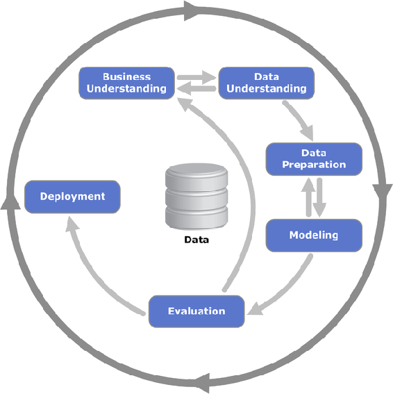

# 一、使用 Java 的数据科学

这本书是关于使用 Java 语言构建数据科学应用程序的。在本书中，我们将涵盖实现项目的所有方面，从数据准备到模型部署。

假设本书的读者以前接触过 Java 和数据科学，本书将有助于将这些知识提升到一个新的水平。这意味着学习如何有效地解决特定的数据科学问题，并最大限度地利用可用数据。

这是一个介绍性的章节，我们将在这里为所有其他章节奠定基础。在这里，我们将讨论以下主题:

*   什么是机器学习和数据科学？
*   **数据挖掘的跨行业标准流程** ( **CRIPS-DM** )，一种进行数据科学项目的方法论
*   面向大中型数据科学应用的 Java 机器学习库

在本章结束时，你将知道如何着手一个数据科学项目，以及使用什么样的 Java 库来做这件事。


# 数据科学

数据科学是从各种形式的数据中提取可操作知识的学科。数据科学这个名字最近才出现——它是由 DJ Patil 和 Jeff Hammerbacher 发明的，并在 2012 年的文章*数据科学家:21 世纪最性感的工作*中得到推广。但是这个学科本身已经存在了很长一段时间，之前以其他名字为人所知，如**数据挖掘**或**预测分析**。数据科学，像它的前辈一样，建立在统计和机器学习算法的基础上，用于知识提取和模型构建。

术语**数据科学**的**科学**部分并非巧合——如果我们查阅**科学**，它的定义可以概括为*以可测试的解释和预测为术语的知识的系统组织*。这正是数据科学家所做的，通过从可用数据中提取模式，他们可以对未来的未知数据进行预测，并确保预测事先得到验证。

如今，数据科学应用于许多领域，包括(但不限于):

*   **银行业**:风险管理(例如，信用评分)、欺诈检测、交易
*   **保险**:索赔管理(例如，加快索赔审批)、风险和损失评估，以及欺诈检测
*   **保健**:预测疾病(如中风、糖尿病、癌症)和复发
*   **零售** **和** **电子商务**:购物篮分析(识别搭配良好的产品)、推荐引擎、产品分类和个性化搜索

本书涵盖了以下实际使用案例:

*   预测 URL 是否可能出现在搜索引擎的第一页
*   在给定硬件规格的情况下，预测操作完成的速度
*   为搜索引擎排列文本文档
*   检查图片上是猫还是狗
*   在社交网络中推荐朋友
*   在计算机集群上处理大规模文本数据

在所有这些情况下，我们将使用数据科学从数据中学习，并使用学到的知识来解决特定的业务问题。

我们还将在整本书中使用一个运行示例，构建一个搜索引擎。我们将使用它来说明许多数据科学概念，如监督机器学习、降维、文本挖掘和学习排序模型。


# 机器学习

机器学习是计算机科学的一部分，是数据科学的核心。数据本身，尤其是大量的数据，几乎没有什么用处，但是数据里面隐藏着非常有价值的模式。在机器学习的帮助下，我们可以识别这些隐藏的模式，提取它们，然后将学习到的信息应用到新的看不见的项目上。

例如，给定一个动物的图像，机器学习算法可以说出图片是狗还是猫；或者，考虑到银行客户的历史，它会说客户违约的可能性有多大，即无法偿还债务。

通常，机器学习模型被视为黑盒，它接受数据点并输出对它的预测。在这本书里，我们将看看这些黑盒里有什么，看看如何以及何时最好地使用它们。

机器学习解决的典型问题可以分为以下几组:

*   **监督学习**:对于每个数据点，我们都有一个*标签-* 额外信息，描述我们想要学习的结果。在猫对狗的情况下，数据点是动物的图像；标签描述的是狗还是猫。
*   **无监督学习**:我们只有原始数据点，没有标签信息可用。例如，我们有一组电子邮件，我们希望根据它们的相似程度对它们进行分组。没有与电子邮件相关联的明确标签，这使得该问题无人监管。
*   **半监督学习**:只对一部分数据给出标签。
*   **强化学习**:我们没有标签，有*奖励*；模型通过与它运行的*环境*互动得到的东西。基于奖励，它可以适应并最大化它。比如，一个学习下棋的模型，每吃掉对手一个图形就获得一个正奖励，每输一个图形就获得一个负奖励；而报酬与数字的价值成正比。


# 监督学习

正如我们之前讨论的，对于监督学习，我们有一些信息附加到每个数据点，标签，我们可以训练一个模型来使用它并从中学习。例如，如果我们想建立一个模型，告诉我们一张图片上是狗还是猫，那么图片就是数据点，是狗还是猫的信息就是标签。再比如预测房子的价格——房子的描述就是数据点，价格就是标签。

我们可以根据这些信息的性质将监督学习的算法分为分类和回归算法。

在**分类**问题中，标签来自于某个固定的有限类集合，比如{猫、狗}、{默认、非默认}，或者{办公室、美食、娱乐、家居}。根据类的数量不同，分类问题可以是**二元**(只有两个可能的类)或者**多类**(几个类)。

分类算法的例子有朴素贝叶斯、逻辑回归、感知器、**支持向量机**(**)等等。我们将在[第四章第一部分](24f23333-1326-47d1-9cb2-9ab9c53f82e8.xhtml)、*监督学习-分类和回归*中更详细地讨论分类算法。**

 **在**回归**问题中，标号是实数。例如，一个人的年薪可以从 0 美元到几十亿美元不等。因此，预测工资是一个回归问题。

回归算法的例子有线性回归、LASSO、**支持向量回归** ( **SVR** )等。这些算法将在[第二部分第四章](24f23333-1326-47d1-9cb2-9ab9c53f82e8.xhtml)、*监督学习-分类和回归中详细描述。*

一些监督学习方法是通用的，可以应用于分类和回归问题。例如，决策树、随机森林和其他基于树的方法可以处理这两种类型。我们将在第七章、*的[中讨论一个这样的算法，梯度提升机器。](1607e4a0-6cf9-4250-b12a-64e7f61b26ac.xhtml)*

神经网络还可以同时处理分类和回归问题，我们会在[第八章](a3282407-05e1-4559-9805-318e093558a7.xhtml)、*用 DeepLearning4J* 进行深度学习中讲到。** **<title>Unknown</title>  <link href="../stylesheet.css" rel="stylesheet" type="text/css"> <link href="../page_styles.css" rel="stylesheet" type="text/css">

# 无监督学习

无监督学习涵盖了我们没有标签可用，但仍然希望找到隐藏在数据中的一些模式的情况。有几种类型的无监督学习，我们将研究聚类分析，或聚类和无监督降维。


# 使聚集

通常，当人们谈论无监督学习时，他们会谈论**聚类分析**或**聚类**。聚类分析算法获取一组数据点，并尝试将它们分类成组，使得相似的项目属于同一组，而不同的项目不属于同一组。有许多方法可以使用它，例如，在客户细分或文本分类。

**客户细分**是聚类的一个例子。给定客户的一些描述，我们尝试将他们分组，使得一个组中的客户具有相似的简档并以相似的方式行为。这些信息可以用来了解这些群体中的人们想要什么，并且这可以用来为他们提供更好的广告和其他促销信息。

再比如**文本分类**。给定一个文本集合，我们希望在这些文本中找到共同的主题，并根据这些主题排列文本。例如，给定一个电子商务商店中的一组投诉，我们可能希望将谈论类似事情的投诉放在一起，这应该有助于系统用户更容易地浏览投诉。

聚类分析算法的例子有层次聚类、k-means、**带噪声的应用的基于密度的空间聚类** ( **DBSCAN** )等等。我们会在[第五章第一部分](e4294e91-73ee-46ca-8fb5-eb6183c0e361.xhtml)、*无监督学习——聚类与降维*中详细讲聚类。


# 降维

另一组无监督学习算法是**降维**算法。这组算法*压缩*数据集，只保留最有用的信息。如果我们的数据集包含太多信息，机器学习算法很难同时使用所有这些信息。算法处理所有数据可能需要太长时间，我们希望压缩数据，因此处理时间会更短。

有多种算法可以降低数据的维数，包括**主成分分析** ( **PCA** )、局部线性嵌入和 t-SNE。所有这些算法都是无监督降维技术的例子。

不是所有的降维算法都是无监督的；他们中的一些人可以使用标签来更好地降低维度。例如，许多特征选择算法依赖于标签来查看哪些特征是有用的，哪些是无用的。

我们将在第五章、*无监督学习-聚类和降维中详细讨论这一点。*


# 自然语言处理

处理自然语言文本是非常复杂的，它们的结构不是很好，需要大量的清理和规范化。然而，我们周围的文本信息量是巨大的:每分钟都产生大量的文本数据，很难从中检索有用的信息。使用数据科学和机器学习对文本问题也很有帮助；它们让我们找到正确的文本，处理它，并提取有价值的信息。

我们可以通过多种方式使用文本信息。一个例子是信息检索，或者简单地说，文本搜索——给定一个用户查询和一组文档，我们希望在语料库中找到与该查询最相关的文档，并将它们呈现给用户。其他应用包括情感分析——预测产品评论是积极的、中立的还是消极的，或者根据评论如何谈论产品来对评论进行分组。

我们将在[第六章](43d5078e-805b-4e29-a527-ed11fa96c4b2.xhtml)、*中更多地讨论信息检索、**自然语言处理** ( **NLP** )和文本处理——自然语言处理和信息检索*中的文本处理。此外，我们将在[第 9 章](a1fd16c7-f78d-45bc-a6b7-17d201c96bbc.xhtml)、*缩放数据科学*中了解如何处理大量文本数据。

我们可以用于机器学习和数据科学的方法非常重要。同样重要的是我们创造它们，然后将它们用于生产系统的方式。数据科学流程模型帮助我们使其更有组织性和系统性，这也是我们接下来将讨论它们的原因。


# 数据科学过程模型

应用数据科学不仅仅是选择合适的机器学习算法并将其用于数据。记住机器学习只是项目的一小部分总是好的；还有其他部分，如了解问题、收集数据、测试解决方案和部署到生产环境中。

当从事任何项目时，不仅仅是数据科学项目，将它分解成更小的可管理的部分并逐个完成它们是有益的。对于数据科学，有描述如何以最佳方式完成的最佳实践，它们被称为**流程模型**。有多个型号，包括 CRISP-DM 和 OSEMN。

在本章中，CRISP-DM 被解释为**获取、擦洗、探索、建模和解释** ( **OSEMN** )，它更适合于数据分析任务，并在较小的程度上解决了许多重要步骤。


# CRISP-DM

**数据挖掘的跨行业标准过程** ( **CRISP-DM** )是一种开发数据挖掘应用的过程方法论。它是在术语*数据科学*变得流行之前创建的，它是可靠的，并且经过了几代分析的时间考验。这些实践现在仍然有用，并且很好地描述了任何分析项目的高级步骤。



图片来源:[https://en . Wikipedia . org/wiki/File:CRISP-DM _ Process _ diagram . png](https://en.wikipedia.org/wiki/File:CRISP-DM_Process_Diagram.png)

CRISP-DM 方法将项目分解为以下步骤:

*   商业理解
*   数据理解
*   数据准备
*   建模
*   估价
*   部署

方法本身定义的不仅仅是这些步骤，但是通常了解步骤是什么以及每个步骤发生了什么对于一个成功的数据科学项目来说已经足够了。让我们分别看一下这些步骤。

第一步**业务理解**。这一步旨在了解企业存在什么样的问题，以及他们希望通过解决这些问题来实现什么。为了取得成功，数据科学应用程序必须对业务有用。这一步的结果是我们想要解决的问题的公式化，以及项目期望的结果是什么。

第二步是**数据理解**。在这一步，我们试图找出哪些数据可以用来解决问题。我们还需要找出我们是否已经有了数据；如果没有，我们需要思考如何才能得到它。根据我们找到(或没有找到)的数据，我们可能想要改变最初的目标。

当数据被收集后，我们需要探索它。审查数据的过程通常被称为**探索性数据分析**，它是任何数据科学项目不可或缺的一部分。它有助于理解创建数据的过程，并且已经可以提出解决问题的方法。这一步的结果是了解解决问题需要哪些数据源。我们将在[第三章](9ae5c988-c3f5-4d5d-9117-a92e4ed9c832.xhtml)、*探索性数据分析*中详细讲述这一步。

CRISP-DM 的第三步是**数据准备**。为了使数据集有用，需要对其进行清理并将其转换为表格形式。表格形式意味着每行恰好对应一个观察值。如果我们的数据不是这种形状，它就不能被大多数机器学习算法使用。因此，我们需要准备数据，以便最终可以将其转换为矩阵形式并提供给模型。

此外，可能存在包含所需信息的不同数据集，并且它们可能不是同质的。这意味着我们需要将这些数据集转换成某种通用格式，以便模型能够读取。

这一步还包括**特征工程**——创建最能提供问题信息并以最佳方式描述数据的特征的过程。

许多数据科学家表示，在构建数据科学应用程序时，他们将大部分时间花在这一步上。我们将在[第二章](a005c42b-d837-402c-9bba-971b440268b5.xhtml)、*数据处理工具箱*以及整本书中谈到这一步。

第四步**建模**。在这一步中，数据已经处于正确的形状，我们将它馈送给不同的机器学习算法。这一步还包括参数调整、特性选择和选择最佳模型。

从机器学习的角度评估模型的质量发生在这个步骤中。要检查的最重要的事情是归纳的能力，这通常是通过交叉验证来完成的。在这一步中，我们可能还想回到上一步，做额外的清理和功能工程。结果是一个模型，它可能对解决步骤 1 中定义的问题有用。

第五步**评估**。它包括从商业角度评估模型——而不是从机器学习的角度。这意味着我们需要对迄今为止的结果进行严格审查，并计划下一步行动。模型达到我们想要的了吗？此外，一些发现可能会导致重新考虑最初的问题。在这一步之后，我们可以转到部署步骤或重复流程。

最后的第六步是**模型部署**。在这个步骤中，生产的模型被添加到产品中，因此结果是模型被集成到活动系统中。我们将在[第 10 章](e6c6202a-4170-4715-af34-d450d541c2c3.xhtml)、*部署数据科学模型*中介绍这一步骤。

通常，评估是困难的，因为并不总是能够说出模型是否达到了预期的结果。在这些情况下，可以将评估和部署步骤合并为一个步骤，只对部分用户部署和应用模型，然后收集用于评估模型的数据。我们还将在本书的最后一章简要介绍他们的做法，如 A/B 测试和多臂土匪。


# 连续的例子

整本书会有很多实际的用例，有时每章会有几个。但是我们也会有一个运行的例子，构建一个搜索引擎。这个问题很有趣，原因有很多:

*   这很有趣
*   几乎任何领域的企业都可以从搜索引擎中受益
*   许多企业已经有了文本数据；通常它没有被有效地使用，并且它的使用可以被改进
*   处理文本需要很大的努力，学会有效地处理文本是很有用的

我们将尽量保持简单，但是，通过这个例子，我们将在整本书中触及数据科学过程的所有技术部分:

*   **数据理解**:哪些数据可以对问题有用？我们如何获得这些数据？
*   **数据准备**:数据一旦获得，我们该如何处理？如果是 HTML，我们如何从中提取文本？我们如何从文本中提取单个的句子和单词？
*   **建模**:根据文档与查询的相关性对文档进行排序是一个数据科学问题，我们将讨论如何实现这个问题。
*   **评估**:可以对搜索引擎进行测试，看它对解决业务问题是否有用。
*   **部署**:最后，引擎可以作为 REST 服务部署，或者直接集成到实时系统中。

我们将在[第二章](a005c42b-d837-402c-9bba-971b440268b5.xhtml)、*数据处理工具箱*中获取并准备数据，在[第三章](9ae5c988-c3f5-4d5d-9117-a92e4ed9c832.xhtml)、*探索性数据分析*中理解数据，在[第四章](24f23333-1326-47d1-9cb2-9ab9c53f82e8.xhtml)、*监督机器学习-分类和回归*中构建简单模型并进行评估，在[第六章](43d5078e-805b-4e29-a527-ed11fa96c4b2.xhtml)、*中查看如何处理文本使用文本-自然语言处理和信息检索*， 在第 9 章、*扩展数据科学*中了解如何将它应用于数百万个网页，最后，在第 10 章、*部署数据科学模型*中了解我们如何部署它。


# Java 中的数据科学

在本书中，我们将使用 Java 进行数据科学项目。乍一看，Java 似乎不是数据科学的好选择，不像 Python 或 R，它的数据科学和机器学习库更少，更冗长，缺乏交互性。另一方面，它有很多优点，如下所示:

*   Java 是一种静态类型的语言，这使得维护代码库更容易，更难犯愚蠢的错误——编译器可以检测到其中的一些错误。
*   数据处理的标准库非常丰富，甚至还有更丰富的外部库。
*   Java 代码通常比通常用于数据科学的脚本语言(如 R 或 Python)的代码更快。
*   Maven 是 Java 世界中依赖性管理的事实上的标准，它使得向项目中添加新的库和避免版本冲突变得非常容易。
*   大多数用于可扩展数据处理的大数据框架都是用 Java 或 JVM 语言编写的，如 Apache Hadoop、Apache Spark 或 Apache Flink。
*   生产系统通常是用 Java 编写的，用其他语言构建模型会增加不必要的复杂性。用 Java 创建模型使得将它们集成到产品中变得更加容易。

接下来，我们将看看 Java 中可用的数据科学库。


# 数据科学图书馆

虽然与 R 相比，Java 中的数据科学库不多，但也不少。此外，通常可以使用用其他 JVM 语言编写的机器学习和数据挖掘库，如 Scala、Groovy 或 Clojure。因为这些语言共享运行时环境，所以很容易导入用 Scala 编写的库，并直接在 Java 代码中使用它们。

我们可以将图书馆分为以下几类:

*   数据处理库
*   数学和统计库
*   机器学习和数据挖掘库
*   文本处理库

现在，我们将详细了解它们。


# 数据处理库

标准 Java 库非常丰富，提供了很多数据处理工具，比如集合、I/O 工具、数据流和并行任务执行的手段。

标准库有非常强大的扩展，例如:

*   谷歌番石榴([https://github.com/google/guava](https://github.com/google/guava))和阿帕奇共同收藏([https://commons.apache.org/collections/](https://commons.apache.org/collections/))更丰富的收藏
*   用于简化 I/O 的 Apache Commons IO([https://commons.apache.org/io/](https://commons.apache.org/io/))
*   AOL Cyclops-React([https://github.com/aol/cyclops-react](https://github.com/aol/cyclops-react))实现更丰富的功能方式并行流

我们将在[第 2 章](a005c42b-d837-402c-9bba-971b440268b5.xhtml)、*数据处理工具箱*中介绍数据处理的标准 API 及其扩展。在本书中，我们将使用 Maven 来包含外部库，如 Google Guava 或 Apache Commons IO。它是一个依赖管理工具，允许用几行 XML 代码指定外部依赖。比如添加谷歌番石榴，在`pom.xml`中声明如下依赖关系就足够了:

```
<dependency> 
 <groupId>com.google.guava</groupId> 
 <artifactId>guava</artifactId> 
 <version>19.0</version> 
</dependency>

```

当我们这样做时，Maven 将转到 Maven 中央存储库并下载指定版本的依赖项。找到`pom.xml`(比如上一个)的依赖片段的最好方法是在[https://mvnrepository.com](https://mvnrepository.com/)或者你最喜欢的搜索引擎上搜索。

Java 提供了一种通过 **Java 数据库连接** ( **JDBC** )访问数据库的简单方法——一种统一的数据库访问协议。JDBC 使得连接几乎任何支持 SQL 的关系数据库成为可能，比如 MySQL、MS SQL、Oracle、PostgreSQL 等等。这允许将数据操作从 Java 转移到数据库端。

当无法使用数据库处理表格数据时，我们可以使用 DataFrame 库直接在 Java 中处理。DataFrame 是一种最初来自 R 的数据结构，它允许在程序中轻松地操作文本数据，而无需借助外部数据库。

例如，使用数据帧，可以根据某些条件过滤行，对列的每个元素应用相同的操作，按某些条件分组或与另一个数据帧连接。此外，一些数据框库可以轻松地将表格数据转换为矩阵形式，以便机器学习算法可以使用这些数据。

Java 中有一些数据框库。其中一些如下:

*   细木工([https://cardillo.github.io/joinery/](https://cardillo.github.io/joinery/))
*   餐桌锯([https://github.com/lwhite1/tablesaw](https://github.com/lwhite1/tablesaw)
*   鞍([https://saddle.github.io/](https://saddle.github.io/))Scala 的数据框架库
*   阿帕奇火花数据帧([http://spark.apache.org/](http://spark.apache.org/)

我们还将在[第 2 章](a005c42b-d837-402c-9bba-971b440268b5.xhtml)、*数据处理工具箱*中介绍数据库和数据框架，我们将在整本书中使用数据框架。

还有更复杂的数据处理库比如 Spring Batch([http://projects.spring.io/spring-batch/](http://projects.spring.io/spring-batch/))。它们允许创建复杂的数据管道(从提取-转换-加载称为 ETL)并管理它们的执行。

此外，还有用于分布式数据处理的库，例如:

*   阿帕奇 Hadoop([http://hadoop.apache.org/](http://hadoop.apache.org/))
*   阿帕奇火花([http://spark.apache.org/](http://spark.apache.org/))
*   Apache 小程序(https://flip . Apache . org/

我们将在[第 9 章](a1fd16c7-f78d-45bc-a6b7-17d201c96bbc.xhtml)、*扩展数据科学*中讨论分布式数据处理。


# 数学和统计库

标准 Java 库中的数学支持相当有限，只包括计算对数的`log`、计算指数的`exp`等基本方法。

有更丰富的数学支持的外部库。例如:

*   Apache Commons Math([http://commons.apache.org/math/](http://commons.apache.org/math/))用于统计、优化和线性代数
*   Apache Mahout([http://mahout.apache.org/](http://mahout.apache.org/))用于线性代数，还包括一个分布式线性代数和机器学习模块
*   JBlas([http://jblas.org/)](http://jblas.org/)优化和非常快速的线性代数包，使用 Blas 库

此外，许多机器学习库带有一些额外的数学功能，通常是线性代数、统计和优化。


# 机器学习和数据挖掘库

有相当多的机器学习和数据挖掘库可用于 Java 和其他 JVM 语言。其中一些如下:

*   WEKA([http://www.cs.waikato.ac.nz/ml/weka/](http://www.cs.waikato.ac.nz/ml/weka/))可能是 Java 中最著名的数据挖掘库，包含大量算法，有很多扩展。
*   JavaML([http://java-ml.sourceforge.net/](http://java-ml.sourceforge.net/))是一个相当老且可靠的 ML 库，但不幸的是不再更新了
*   smile([http://haifengl.github.io/smile/](http://haifengl.github.io/smile/))是一个很有前途的 ML 库，目前正在积极开发中，很多新的方法正在加入其中。
*   https://github.com/EdwardRaff/JSAT 的 JSAT 包含了一系列令人印象深刻的机器学习算法。
*   H2O([http://www.h2o.ai/](http://www.h2o.ai/))是一个用 Java 编写的分布式 ML 框架，但可用于多种语言，包括 Scala、R 和 Python。
*   Apache Mahout([http://mahout.apache.org/](http://mahout.apache.org/))用于核内(一台机器)和分布式机器学习。Mahout Samsara 框架允许以独立于框架的方式编写代码，然后在 Spark、Flink 或 H2O 上执行。

有几个专门研究神经网络的库:

*   安可([http://www.heatonresearch.com/encog/](http://www.heatonresearch.com/encog/))
*   深度学习 4j([http://deeplearning4j.org/](http://deeplearning4j.org/)

我们将在整本书中介绍其中的一些库。


# 文本处理

可以只使用标准 Java 库进行简单的文本处理，该库包含诸如`StringTokenizer`、`java.text`包或正则表达式之类的类。

除此之外，还有各种各样的文本处理框架可用于 Java，如下所示:

*   Apache Lucene([https://lucene.apache.org/](https://lucene.apache.org/))是一个用于信息检索的库
*   斯坦福·科伦普([http://stanfordnlp.github.io/CoreNLP/](http://stanfordnlp.github.io/CoreNLP/)
*   Apache OpenNLP([https://opennlp.apache.org/](https://opennlp.apache.org/))
*   凌派([http://alias-i.com/lingpipe/](http://alias-i.com/lingpipe/))
*   大门([https://gate.ac.uk/](https://gate.ac.uk/))
*   木槌([http://mallet.cs.umass.edu/](http://mallet.cs.umass.edu/))
*   smile([http://haifengl.github.io/smile/](http://haifengl.github.io/smile/))也有一些 NLP 的算法

大多数 NLP 库具有非常相似的功能和算法覆盖范围，这就是为什么选择使用哪一个通常是一个习惯或品味的问题。它们通常都有标记化、解析、词性标注、命名实体识别和其他文本处理算法。其中有些(比如 StanfordNLP)支持多种语言，有些只支持英语。

我们将在第 6 章、*中介绍这些库，使用文本自然语言处理和信息检索*。


# 摘要

在本章中，我们简要讨论了数据科学以及机器学习在其中扮演的角色。然后我们谈到做一个数据科学项目，以及什么方法论对它有用。我们讨论了其中的一个，CRISP-DM，它定义的步骤，这些步骤是如何关联的，以及每个步骤的结果。

最后，我们谈到了为什么用 Java 做数据科学项目是一个好主意，它是静态编译的，它很快，而且通常现有的生产系统已经在 Java 中运行。我们还提到了使用 Java 语言成功完成数据科学项目的库和框架。

有了这个基础，我们现在将进入数据科学项目中最重要(也是最耗时)的步骤——数据准备。**