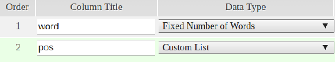
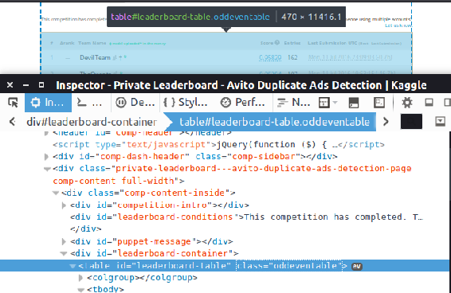

# 二、数据处理工具箱

在前一章中，我们讨论了处理数据科学问题的最佳实践。我们看了 CRISP-DM，它是处理数据挖掘项目的方法论，其中第一步是数据预处理。在这一章中，我们将仔细看看如何在 Java 中做到这一点。

具体来说，我们将涵盖以下主题:

*   标准 Java 库
*   标准库的扩展
*   从不同来源读取数据，比如文本、HTML、JSON 和数据库
*   用于操作表格数据的数据框架

最后，我们会把所有东西放在一起，为搜索引擎准备数据。

本章结束时，你将能够处理数据，使其可用于机器学习和进一步分析。


# 标准 Java 库

标准 Java 库非常丰富，提供了许多数据操作工具，包括:

*   用于在内存中组织数据的集合
*   用于读写数据的 I/O
*   简化数据转换的流式 API

在本章中，我们将详细了解所有这些工具。


# 收集

数据是数据科学最重要的部分。当处理数据时，它需要被有效地存储和处理，为此我们使用数据结构。数据结构描述了有效存储数据以解决特定问题的方法，Java 集合 API 是数据结构的标准 Java API。这个 API 提供了在实际数据科学应用中有用的各种各样的实现。

我们不会详细描述集合 API，而是集中在最有用和最重要的部分——列表、集合和映射接口。

列表是集合，其中每个元素都可以通过其索引来访问。`List`接口的 g0-to 实现是`ArrayList`，它应该在 99%的情况下使用，可以如下使用:

```
List<String> list = new ArrayList<>(); 
list.add("alpha"); 
list.add("beta"); 
list.add("beta"); 
list.add("gamma"); 
System.out.println(list);

```

还有其他的`List`接口、`LinkedList`或`CopyOnWriteArrayList`的实现，但是它们很少被用到。

Set 是集合 API 中的另一个接口，它描述了一个不允许重复的集合。如果我们插入元素的顺序不重要，那么首选实现是`HashSet`，如果顺序重要，那么首选实现是`LinkedHashSet`。我们可以如下使用它:

```
Set<String> set = new HashSet<>(); 
set.add("alpha"); 
set.add("beta"); 
set.add("beta"); 
set.add("gamma"); 
System.out.println(set);

```

`List`和`Set`都实现了`Iterable`接口，这使得它们可以使用`for-each`循环:

```
for (String el : set) { 
    System.out.println(el); 
}

```

`Map`接口允许将键映射到值，在其他语言中有时被称为字典或关联数组。g0-to 实现是`HashMap`:

```
Map<String, String> map = new HashMap<>(); 
map.put("alpha", "α"); 
map.put("beta", "β"); 
map.put("gamma", "γ"); 
System.out.println(map);

```

如果需要保持插入顺序，可以使用`LinkedHashMap`；如果你知道`map`接口将被多线程访问，使用`ConcurrentHashMap`。

`Collections`类提供了几个助手方法来处理集合，比如排序，或者提取`max`或者`min`元素:

```
String min = Collections.min(list); 
String max = Collections.max(list); 
System.out.println("min: " + min + ", max: " + max); 
Collections.sort(list); 
Collections.shuffle(list);

```

还有其他集合，比如`Queue`、`Deque`、`Stack`、线程安全集合等等。它们不太常用，对数据科学也不是很重要。


# 输入/输出

数据科学家经常使用文件和其他数据源。I/O 是从数据源读取和写回结果所必需的。Java I/O API 为此提供了两种主要的抽象类型:

*   `InputStream`、`OutputStream`为二进制数据
*   `Reader`、`Writer`为文本数据

典型的数据科学应用处理文本而不是原始的二进制数据——数据通常以 TXT、CSV、JSON 和其他类似的文本格式存储。这就是为什么我们将集中讨论第二部分。


# 读取输入数据

能够读取数据是数据科学家最重要的技能，这些数据通常是文本格式，可以是 TXT、CSV 或任何其他格式。在 Java I/O API 中，`Reader`类的子类处理读取文本文件。

假设我们有一个包含一些句子的`text.txt`文件(这些句子可能有意义，也可能没有意义):

*   我的狗也喜欢吃香肠
*   除了盈余外，马达还能接受
*   每一个有能力的斜线成功与世界范围的指责
*   持续的任务在内疚的吻周围咳嗽

如果需要将整个文件作为字符串列表读取，通常的 Java I/O 方式是使用`BufferedReader`:

```
List<String> lines = new ArrayList<>(); 

try (InputStream is = new FileInputStream("data/text.txt")) { 
    try (InputStreamReader isReader = new InputStreamReader(is,
               StandardCharsets.UTF_8)) { 
        try (BufferedReader reader = new BufferedReader(isReader)) { 
            while (true) { 
                String line = reader.readLine(); 
                if (line == null) { 
                    break; 
                } 
                lines.add(line); 
            } 

            isReader.close(); 
        } 
    } 
}

```

提供字符编码很重要——这样，`Reader`就知道如何将字节序列转换成合适的`String`对象。除了 UTF 8，还有 UTF-16，ISO-8859(这是基于 ASCII 的英语文本编码)和许多其他标准。

直接获取文件的`BufferedReader`有一个快捷方式:

```
Path path = Paths.get("data/text.txt"); 
try (BufferedReader reader = Files.newBufferedReader(path,
        StandardCharsets.UTF_8)) { 
    // read line-by-line 
}

```

即使使用这种快捷方式，您也可以看到，对于从文件中读取一系列行这样简单的任务来说，这是非常冗长的。您可以将它封装在一个助手函数中，或者使用 Java NIO API，它提供了一些助手方法来简化这项任务:

```
Path path = Paths.get("data/text.txt"); 
List<String> lines = Files.readAllLines(path, StandardCharsets.UTF_8); 
System.out.println(lines);

```

Java NIO 快捷方式仅适用于文件。稍后，我们将讨论适用于任何 InputStream 对象的快捷方式，而不仅仅是文件。


# 写入输出数据

在数据被读取和处理后，我们通常希望将它放回磁盘。对于文本，这通常使用`Writer`对象来完成。

假设我们从`text.txt`中读取句子，我们需要将每一行转换成大写，并将它们写回一个新文件`output.txt`；编写文本数据最方便的方式是通过`PrintWriter`类:

```
try (PrintWriter writer = new PrintWriter("output.txt", "UTF-8")) { 
    for (String line : lines) { 
        String upperCase = line.toUpperCase(Locale.US); 
        writer.println(upperCase); 
    } 
}

```

在 Java NIO API 中，它看起来像这样:

```
Path output = Paths.get("output.txt"); 
try (BufferedWriter writer = Files.newBufferedWriter(output,     
           StandardCharsets.UTF_8)) { 
    for (String line : lines) { 
        String upperCase = line.toUpperCase(Locale.US); 
        writer.write(upperCase); 
        writer.newLine(); 
    } 
}

```

两种方法都是正确的，你应该选择你喜欢的那一种。然而，记住总是包括编码是很重要的；否则，它可能会使用一些依赖于平台的默认值，有时是任意的。


# 流式 API

Java 8 是 Java 语言历史上的一大进步。在其他特性中，有两个重要的东西——流和 Lambda 表达式。

在 Java 中，流是一个对象序列，Streams API 提供了函数式的操作来转换这些序列，比如 map、filter 和 reduce。流的源可以是包含元素的任何东西，例如数组、集合或文件。

例如，让我们创建一个简单的`Word`类，它包含一个令牌及其词性:

```
public class Word { 
    private final String token; 
    private final String pos; 
    // constructor and getters are omitted 
}

```

为了简洁起见，我们将总是省略这种数据类的构造函数和 getters，但是用注释指出这一点。

现在，我们来考虑一句话*我的狗也喜欢吃香肠*。使用这个类，我们可以将其表示如下:

```
Word[] array = { new Word("My", "RPR"), new Word("dog", "NN"), 
     new Word("also", "RB"), new Word("likes", "VB"), 
     new Word("eating", "VB"), new Word("sausage", "NN"), 
     new Word(".", ".") };

```

这里，我们使用 Penn Treebank POS 符号，其中`NN`表示名词，或者`VB`表示动词。

现在，我们可以使用`Arrays.stream`实用程序方法将这个数组转换成一个流:

```
Stream<Word> stream = Arrays.stream(array);

```

可以使用`stream`方法从集合中创建流:

```
List<Word> list = Arrays.asList(array); 
Stream<Word> stream = list.stream();

```

流上的操作被链接在一起，形成了美观易读的数据处理管道。对流最常见的操作是映射和过滤操作:

*   Map 对每个元素应用相同的变换函数
*   给定一个谓词函数，Filter 过滤掉不满足它的元素

在管道的末端，您使用收集器收集结果。`Collectors`类提供了几个实现，比如`toList`、`toSet`、`toMap`等等。

假设我们只想保留名词标记。使用 Streams API，我们可以如下操作:

```
List<String> nouns = list.stream() 
        .filter(w -> "NN".equals(w.getPos())) 
        .map(Word::getToken) 
        .collect(Collectors.toList()); 
System.out.println(nouns);

```

或者，我们可能想要检查流中有多少唯一的 POS 标签。为此，我们可以使用`toSet`收集器:

```
Set<String> pos = list.stream() 
        .map(Word::getPos) 
        .collect(Collectors.toSet()); 
System.out.println(pos);

```

在处理文本时，我们有时可能希望将一系列字符串连接在一起:

```
String rawSentence = list.stream() 
        .map(Word::getToken) 
        .collect(Collectors.joining(" ")); 
System.out.println(rawSentence);

```

或者，我们可以根据单词的`POS`标签对它们进行分组:

```
Map<String, List<Word>> groupByPos = list.stream() 
        .collect(Collectors.groupingBy(Word::getPos)); 
System.out.println(groupByPos.get("VB")); 
System.out.println(groupByPos.get("NN"));

```

此外，还有一个有用的`toMap`收集器，它可以使用一些字段对集合进行索引。例如，如果我们想获得从令牌到`Word`对象的映射，可以使用下面的代码来实现:

```
Map<String, Word> tokenToWord = list.stream() 
        .collect(Collectors.toMap(Word::getToken, Function.identity())); 
System.out.println(tokenToWord.get("sausage"));

```

除了对象流，Streams API 还提供了原语流——整型、双精度型和其他原语流。这些流有用于统计计算的有用方法，例如`sum`、`max`、`min`或`average`。可以使用`mapToInt`或`mapToDouble`等函数将普通流转换为原始流。

例如，这就是我们如何找到句子中所有单词的最大长度:

```
int maxTokenLength = list.stream() 
        .mapToInt(w -> w.getToken().length()) 
        .max().getAsInt(); 
System.out.println(maxTokenLength);

```

流操作易于并行化；它们分别应用于每一项，因此多线程可以做到这一点，而不会相互干扰。因此，通过将工作分散到多个处理器上并并行执行所有任务，可以大大加快这些操作的速度。

Java 利用了这一点，并提供了一种简单而富于表现力的方法来创建并行代码；对于集合，您只需要调用`parallelStream`方法:

```
int[] firstLengths = list.parallelStream() 
        .filter(w -> w.getToken().length() % 2 == 0) 
        .map(Word::getToken) 
        .mapToInt(String::length) 
        .sequential() 
        .sorted() 
        .limit(2) 
        .toArray(); 
System.out.println(Arrays.toString(firstLengths));

```

在这个例子中，过滤和映射是并行完成的，但是随后流被转换成顺序流，被排序，并且最上面的两个元素被提取到一个数组中。虽然这个例子不是很有意义，但是它展示了使用流可以做多少事情。

最后，标准 Java I/O 库提供了一些方便的方法。例如，可以使用`Files.lines`方法将文本文件表示为一串行:

```
Path path = Paths.get("text.txt"); 
try (Stream<String> lines = Files.lines(path, StandardCharsets.UTF_8)) { 
    double average = lines 
        .flatMap(line -> Arrays.stream(line.split(" "))) 
        .map(String::toLowerCase) 
        .mapToInt(String::length) 
        .average().getAsDouble(); 
    System.out.println("average token length: " + average); 
}

```

流是处理数据的一种表达性强、功能强大的方式，掌握这个 API 对于用 Java 做数据科学非常有帮助。稍后，我们将经常使用 Stream API，因此您将看到更多如何使用它的示例。


# 标准库的扩展

标准 Java 库非常强大，但是有些东西需要花很长时间来编写，或者根本就没有。标准库有许多扩展，最突出的库是 Apache Commons(一组库)和 Google Guava。它们使得使用标准 API 或扩展它变得更加容易，例如，通过添加新的集合或实现。

首先，我们将简要介绍这些库的最相关部分，稍后我们将看到它们在实践中是如何使用的。


# Apache common(Apache 公共)

Apache Commons 是 Java 开源库的集合，目标是创建可重用的 Java 组件。有很多，包括 Apache Commons Lang、Apache Commons IO、Apache Commons Collections 等等。


# 公共语言

Apache Commons Lang 是一组扩展了`java.util`包的实用程序类，它们通过提供许多解决常见问题并节省大量时间的小方法，使 Java 开发人员的生活变得更加轻松。

为了在 Java 中包含外部库，我们通常使用 Maven，这使得管理依赖关系变得非常容易。有了 Maven，Apache Commons Lang 库可以使用下面的`dependency`片段来包含:

```
<dependency> 
  <groupId>org.apache.commons</groupId> 
  <artifactId>commons-lang3</artifactId> 
  <version>3.4</version> 
</dependency>

```

该库包含了许多对通用 Java 编程有用的方法，比如使实现对象的`equals`和`hashCode`方法、序列化助手和其他方法变得更加容易。总的来说，它们并不特别适用于数据科学，但是有一些辅助函数非常有用。举个例子，

*   用于生成数据的`RandomUtils`和`RandomStringUtils`
*   `StringEscapeUtils`和`LookupTranslator`用于转义和不转义字符串
*   `EqualsBuilder`和`HashCodeBuilder`用于快速执行`equals`和`hashCode`方法
*   `StringUtils`和`WordUtils`了解有用的字符串操作方法
*   `Pair`类

如需了解更多信息，您可以阅读位于 https://commons.apache.org/lang 的文档。

查看可用内容的最佳方式是下载该包并查看其中的可用代码。每个 Java 开发者都会发现很多有用的东西。


# 公共 IO

像 Apache Commons Lang 扩展了`java.util`标准包，Apache Commons IO 扩展了`java.io`；这是一个 Java 实用程序库，用于协助 Java 中的 I/O，正如我们之前了解到的，它可能非常冗长。

要在您的项目中包含该库，请将`dependency`片段添加到`pom.xml`文件中:

```
<dependency> 
  <groupId>commons-io</groupId> 
  <artifactId>commons-io</artifactId> 
  <version>2.5</version> 
</dependency>

```

我们已经从 Java NIO 中了解了`Files.lines`。虽然它很方便，但我们并不总是处理文件，有时需要从其他`InputStream`获取行，例如，一个网页或一个 web 套接字。

为此，Commons IO 提供了一个非常有用的实用程序类`IOUtils`。使用它，将整个输入流读入字符串或字符串列表非常容易:

```
try (InputStream is = new FileInputStream("data/text.txt")) { 
    String content = IOUtils.toString(is, StandardCharsets.UTF_8); 
    System.out.println(content); 
} 

try (InputStream is = new FileInputStream("data/text.txt")) { 
    List<String> lines = IOUtils.readLines(is, StandardCharsets.UTF_8); 
    System.out.println(lines); 
}

```

虽然我们在这个例子中使用了`FileInputStream`对象，但是它可以是任何其他的流。第一种方法`IOUtils.toString`特别有用，我们稍后将使用它来抓取网页和处理来自 web 服务的响应。

在这个库中有很多更有用的 I/O 方法，为了得到一个好的概述，你可以参考在[https://commons.apache.org/io](https://commons.apache.org/io)获得的文档。


# 公共收藏

Java Collections API 非常强大，它为 Java 中的数据结构定义了一组很好的抽象。Commons 集合使用这些抽象，并用新的实现和新的集合来扩展标准集合 API。要包含该库，请使用以下代码片段:

```
<dependency> 
  <groupId>org.apache.commons</groupId> 
  <artifactId>commons-collections4</artifactId> 
  <version>4.1</version> 
</dependency>

```

该库中一些有用的收藏有:

*   `Bag`:这是可以多次保存同一元素的集合的接口
*   `BidiMap`:这代表双向地图。它可以从键映射到值，也可以从值映射到键

它与 Google Guava 中的集合有一些重叠，这将在下一节课中解释，但是它还有一些没有实现的附加集合。举个例子，

*   `LRUMap`:用于实现缓存
*   `PatriciaTrie`:用于快速字符串前缀查找


# 其他公共模块

Commons Lang、IO 和 Collections 是众多 Commons 库中的几个。还有其他对数据科学有用的公共模块:

*   Commons compress 用于读取压缩文件，例如，`bzip2`(用于读取维基百科转储)、`gzip`、`7z`等
*   Commons CSV 用于读取和写入 CSV 文件(我们将在后面使用它)
*   Commons math 用于统计计算和线性代数(我们稍后也会用到)

你可以参考[https://commons.apache.org/](https://commons.apache.org/)的完整列表。


# 谷歌番石榴

谷歌番石榴很像阿帕奇 Commons 它是一组实用程序，扩展了标准的 Java API，使生活变得更加简单。但是与 Apache Commons 不同的是，Google Guava 是一个同时涵盖许多领域的库，包括集合和 I/O。

要将其包含在项目中，请使用`dependency`:

```
<dependency> 
  <groupId>com.google.guava</groupId> 
  <artifactId>guava</artifactId> 
  <version>19.0</version> 
</dependency>

```

我们将从 Guava I/O 模块开始。为了举例说明，我们将使用一些生成的数据。我们已经使用了`word`类，它包含一个令牌及其词性标签，这里我们将生成更多的单词。要做到这一点，我们可以使用数据生成工具，如 http://www.generatedata.com/和 T2。让我们定义下面的模式，如下面的屏幕截图所示:



之后，可以将生成的数据保存为 CSV 格式，将分隔符设置为制表符(`t`)，并将其保存到`words.txt`。我们已经为您生成了一个文件；你可以在`chapter2`库中找到它。

Guava 定义了一些处理 I/O 的抽象。其中之一是`CharSource`，它是对任何基于字符的数据源的抽象，在某种意义上，它与标准的`Reader`类非常相似。此外，与 Commons IO 类似，还有一个用于处理文件的实用程序类。它被称为`Files`(不要与`java.nio.file.Files`混淆)，并且包含帮助函数，使文件 I/O 更容易。使用这个类，可以读取文本文件的所有行，如下所示:

```
File file = new File("data/words.txt"); 
CharSource wordsSource = Files.asCharSource(file, StandardCharsets.UTF_8); 
List<String> lines = wordsSource.readLines();

```

Google Guava Collections 遵循与 Commons Collections 相同的理念；它建立在标准集合 API 的基础上，提供了新的实现和抽象。有一些实用程序类，比如用于列表的`Lists`，用于集合的`Sets`，等等。

`Lists`中的一个方法是`transform`，它就像流中的`map`，它应用于列表中的每个元素。结果列表的元素被延迟评估；仅当需要元素时，才触发函数的计算。让我们用它将文本文件中的行转换成一列`Word`对象:

```
List<Word> words = Lists.transform(lines, line -> { 
    String[] split = line.split("t"); 
    return new Word(split[0].toLowerCase(), split[1]); 
});

```

这与 Streams API 中的 map 的主要区别在于，transform 会立即返回一个列表，因此不需要首先创建一个流，调用`map`函数，最后将结果收集到列表中。

与 Commons 集合类似，Java API 中也有新的集合不可用。对数据科学最有用的集合是`Multiset`、`Multimap`和`Table`。

**Multisets** 是同一元素可以多次存储的集合，通常用于计数。当我们想要计算每个术语出现的次数时，这个类对于文本处理特别有用。

让我们看看我们读到的单词，并计算每个`pos`标签出现的次数:

```
Multiset<String> pos = HashMultiset.create(); 
for (Word word : words) { 
    pos.add(word.getPos()); 
}

```

如果我们想输出按计数排序的结果，有一个特殊的实用函数:

```
Multiset<String> sortedPos = Multisets.copyHighestCountFirst(pos); 
System.out.println(sortedPos);

```

**Multimap** 是一个映射，每个键可以有多个值。多地图有几种类型。两种最常见的地图如下:

*   `ListMultimap`:这将一个键与一个值列表相关联，类似于`Map<Key, List<Value>>`
*   `SetMultimap`:这将一个键与一组值相关联，类似于`Map<Key, Set<Value>>`

这对于实现`group by`逻辑非常有用。让我们看看每个`POS`标签的平均长度:

```
ArrayListMultimap<String, String> wordsByPos = ArrayListMultimap.create();
for (Word word : words) {
    wordsByPos.put(word.getPos(), word.getToken());
}

```

可以将多地图视为集合地图:

```
Map<String, Collection<String>> wordsByPosMap = wordsByPos.asMap(); 
wordsByPosMap.entrySet().forEach(System.out::println);

```

最后，`Table`集合可以看作是`map`接口的二维扩展；现在，不是一个键，每个条目由两个键索引，`row`键和`column`键。除此之外，还可以使用`column`键获得整列，或者使用`row`键获得一行。

例如，我们可以计算每个(单词、词性)对在数据集中出现的次数:

```
Table<String, String, Integer> table = HashBasedTable.create(); 
for (Word word : words) { 
    Integer cnt = table.get(word.getPos(), word.getToken()); 
    if (cnt == null) { 
        cnt = 0; 
    } 
    table.put(word.getPos(), word.getToken(), cnt + 1); 
}

```

将数据放入表中后，我们可以分别访问行和列:

```
Map<String, Integer> nouns = table.row("NN"); 
System.out.println(nouns); 

String word = "eu"; 
Map<String, Integer> posTags = table.column(word); 
System.out.println(posTags);

```

像在 Commons Lang 中一样，Guava 也包含用于处理原语的实用程序类，比如用`Ints`处理`int`原语，用`Doubles`处理`double`原语，等等。例如，它可用于将原始包装的集合转换为原始数组:

```
Collection<Integer> values = nouns.values(); 
int[] nounCounts = Ints.toArray(values); 
int totalNounCount = Arrays.stream(nounCounts).sum(); 
System.out.println(totalNounCount);

```

最后，Guava 为排序数据提供了一个很好的抽象- `Ordering`，它扩展了标准的`Comparator`接口。它为创建比较器提供了清晰流畅的界面:

```
Ordering<Word> byTokenLength =  
        Ordering.natural().<Word> onResultOf(w -> w.getToken().length()).reverse(); 
List<Word> sortedByLength = byTokenLength.immutableSortedCopy(words); 
System.out.println(sortedByLength);

```

由于`Ordering`实现了`Comparator`接口，它可以用于任何需要比较器的地方。例如，对于`Collections.sort`:

```
List<Word> sortedCopy = new ArrayList<>(words); 
Collections.sort(sortedCopy, byTokenLength);

```

除此之外，它还提供了其他方法，如提取 top-k 或 bottom-k 元素:

```
List<Word> first10 = byTokenLength.leastOf(words, 10); 
System.out.println(first10); 
List<Word> last10 = byTokenLength.greatestOf(words, 10); 
System.out.println(last10);

```

它与先排序，然后取第一个或最后一个 k 元素相同，但效率更高。

还有其他有用的类:

*   可定制的哈希实现，如杂音哈希和其他
*   `Stopwatch`用于测量时间

更多见解，可以参考[https://github.com/google/guava](https://github.com/google/guava)和[https://github.com/google/guava/wiki](https://github.com/google/guava/wiki)。

你可能已经注意到了，番石榴和阿帕奇共有地有很多共同点。选择使用哪一个是个人喜好的问题——两个库都经过了很好的测试，并在许多生产系统中得到积极的应用。但是番石榴的开发更加积极，新功能出现的频率也更高，所以如果你只想用其中的一种，那么番石榴可能是更好的选择。


# 美国在线独眼巨人反应

正如我们已经了解的，Java Streams API 是以函数方式处理数据的一种非常强大的方式。Cyclops React 库通过在流上添加新的操作来扩展这个 API，并允许对流执行进行更多的控制。要包含该库，将其添加到`pom.xml`文件:

```
<dependency> 
  <groupId>com.aol.simplereact</groupId> 
  <artifactId>cyclops-react</artifactId> 
  <version>1.0.0-RC4</version> 
</dependency>

```

它添加的一些方法是`zipWithIndex`和 cast 以及便利收集器，如`toList`、`toSet`和`toMap`。更重要的是，它为并行执行提供了更多的控制，例如，可以提供一个自定义执行器，用于处理数据或以声明方式拦截异常。

同样，使用这个库，很容易从迭代器创建并行流——使用标准库很难做到这一点。

例如，我们以`words.txt`为例，从中提取所有的 POS 标签，然后创建一个映射，将每个标签与一个惟一的索引相关联。对于读取数据，我们将使用来自 Commons IO 的`LineIterator`,否则仅使用标准 Java APIs 很难并行化。此外，我们创建一个定制的执行器，它将用于并行执行流操作:

```
LineIterator it = FileUtils.lineIterator(new File("data/words.txt"), "UTF-8"); 
ExecutorService executor = Executors.newCachedThreadPool(); 
LazyFutureStream<String> stream =  
        LazyReact.parallelBuilder().withExecutor(executor).from(it); 

Map<String, Integer> map = stream 
        .map(line -> line.split("t")) 
        .map(arr -> arr[1].toLowerCase()) 
        .distinct() 
        .zipWithIndex() 
        .toMap(Tuple2::v1, t -> t.v2.intValue()); 

System.out.println(map); 
executor.shutdown(); 
it.close();

```

这是一个非常简单的例子，并没有描述这个库中所有可用的功能。欲了解更多信息，请参考他们的文档，可在[https://github.com/aol/cyclops-react](https://github.com/aol/cyclops-react)找到。我们还会在后面章节的其他例子中用到它。


# 访问数据

到目前为止，我们已经花了很多时间来描述如何读写数据。但是还有更多的内容:数据通常以不同的格式出现，比如 CSV、HTML 或 JSON，或者可以存储在数据库中。了解如何访问和处理这些数据对于数据科学非常重要，现在我们将详细描述如何对最常见的数据格式和数据源进行访问和处理。


# 文本数据和 CSV

我们已经详细讨论过读取文本数据，例如，可以使用 NIO API 中的`Files` helper 类或 Commons IO 中的`IOUtils`来完成。

CSV(逗号分隔值)是在纯文本文件中组织表格数据的常用方法。虽然手动解析 CSV 文件是可能的，但是有一些极限情况，这使得它有点麻烦。幸运的是，有很好的库可以实现这个目的，其中之一就是 Apache Commons CSV:

```
<dependency> 
  <groupId>org.apache.commons</groupId> 
  <artifactId>commons-csv</artifactId> 
  <version>1.4</version> 
</dependency>

```

为了说明如何使用这个库，让我们再次生成一些随机数据。这次我们也可以使用[http://www.generatedata.com/](http://www.generatedata.com/)并定义以下模式:


现在我们可以创建一个特殊的类来保存这些数据:

```
public static class Person { 
    private final String name; 
    private final String email; 
    private final String country; 
    private final int salary; 
    private final int experience; 
    // constructor and getters are omitted  
}

```

然后，要读取 CSV 文件，您可以执行以下操作:

```
List<Person> result = new ArrayList<>(); 

Path csvFile = Paths.get("data/csv-example-generatedata_com.csv"); 
try (BufferedReader reader = Files.newBufferedReader(csvFile, StandardCharsets.UTF_8)) { 
    CSVFormat csv = CSVFormat.RFC4180.withHeader(); 
    try (CSVParser parser = csv.parse(reader)) { 
        Iterator<CSVRecord> it = parser.iterator(); 
        it.forEachRemaining(rec -> { 
            String name = rec.get("name"); 
            String email = rec.get("email"); 
            String country = rec.get("country"); 
            int salary = Integer.parseInt(rec.get("salary").substring(1)); 
            int experience = Integer.parseInt(rec.get("experience")); 
            Person person = new Person(name, email, country, salary, experience); 
            result.add(person); 
        }); 
    } 
}

```

前面的代码创建了一个`CSVRecord`对象的迭代器，我们从每个这样的对象中提取值，并将它们传递给一个数据对象。当 CSV 文件非常大，可能无法完全容纳在可用内存中时，创建迭代器非常有用。

如果文件不太大，也可以一次读取整个 CSV 并将结果放入一个列表中:

```
List<CSVRecord> records = parse.getRecords();

```

最后，制表符分隔的文件可以看作是 CSV 的一个特例，也可以使用这个库来读取。为此，您只需使用`TDF`格式进行解析:

```
CSVFormat tsv = CSVFormat.TDF.withHeader();

```


# Web 和 HTML

现在互联网上有大量的数据，能够访问这些数据并将其转换成机器可读的东西对于数据科学家来说是一项非常重要的技能。

从互联网上获取数据有多种方式。幸运的是，标准 Java API 提供了一个特殊的类来做这件事，`URL`。使用`URL`，可以打开一个`InputStream`，它将包含响应体。对于网页，通常是它的 HTML 内容。使用 Commons IO 的`IOUtils`,这样做很简单:

```
try (InputStream is = new URL(url).openStream()) { 
    return IOUtils.toString(is, StandardCharsets.UTF_8); 
}

```

这段代码相当有用，所以把它放入某个 helper 方法，比如`UrlUtils.request`，会很有帮助。

这里我们假设网页的内容总是 UTF-8。它可能在很多情况下都有效，尤其是对于英文页面，但偶尔也会失败。对于更复杂的爬虫，可以使用来自 Apache Tika([https://tika.apache.org/](https://tika.apache.org/))的编码检测。

前面的方法返回原始的 HTML 数据，这本身是没有用的；大多数时候，我们感兴趣的是文本内容，而不是标记。有一些用于处理 HTML 的库，其中之一是 Jsoup:

```
<dependency> 
  <groupId>org.jsoup</groupId> 
  <artifactId>jsoup</artifactId> 
  <version>1.9.2</version> 
</dependency>

```

让我们考虑一个例子。Kaggle.com 是一个举办数据科学竞赛的网站，每个竞赛都有一个排行榜，显示每个参与者的表现。假设你有兴趣从[https://www . ka ggle . com/c/avito-duplicate-ads-detection/leader board](https://www.kaggle.com/c/avito-duplicate-ads-detection/leaderboard)中提取这些信息，如下图截图所示:


这些信息包含在一个表中，为了从这个表中提取数据，我们需要找到一个唯一指向这个表的锚。为此，你可以使用检查器来查看页面(在 Mozilla Firefox 或 Google Chrome 中按下 *F12* 将打开检查器窗口):



使用 Inspector，我们可以注意到表的 ID 是`leaderboard-table`，为了在 Jsoup 中获得这个表，我们可以使用下面的 CSS 选择器`#leaderboard-table`。因为我们实际上对表格的行感兴趣，所以我们将使用`#leaderboard-table tr`。

关于团队名称的信息包含在列表表格的第三列中。因此，要提取它，我们需要获取第三个`<td>`标签，然后查看它的`<a>`标签。同样，为了提取分数，我们获取第四个`<td>`标签的内容。

执行此操作的代码如下:

```
Map<String, Double> result = new HashMap<>(); 

String rawHtml = UrlUtils.request("https://www.kaggle.com/c/avito-duplicate-ads-detection/leaderboard"); 
Document document = Jsoup.parse(rawHtml); 
Elements tableRows = document.select("#leaderboard-table tr"); 
for (Element tr : tableRows) { 
    Elements columns = tr.select("td"); 
    if (columns.isEmpty()) { 
        continue; 
    } 

    String team = columns.get(2).select("a.team-link").text(); 
    double score = Double.parseDouble(columns.get(3).text()); 
    result.put(team, score); 
} 

Comparator<Map.Entry<String, Double>> byValue = Map.Entry.comparingByValue(); 
result.entrySet().stream() 
        .sorted(byValue.reversed()) 
        .forEach(System.out::println);

```

这里我们重用`UrlUtils.request`函数来获取我们之前定义的 HTML，然后用 Jsoup 处理它。

Jsoup 利用 CSS 选择器来访问解析后的 HTML 文档中的条目。要了解更多，你可以阅读相关的文档，可以在[https://jsoup.org/cookbook/extracting-data/selector-syntax](https://jsoup.org/cookbook/extracting-data/selector-syntax)找到。


# JSON

JSON 作为 web 服务之间的通信方式越来越受欢迎，逐渐取代了 XML 和其他格式。知道如何处理它可以让你从互联网上各种各样的数据源中提取数据。

有相当多的 JSON 库可用于 Java。Jackson 就是其中之一，它有一个简化版本，叫做`jackson-jr`，适用于大多数简单的情况，我们只需要从 JSON 中快速提取数据。要添加它，请使用以下命令:

```
<dependency> 
  <groupId>com.fasterxml.jackson.jr</groupId> 
  <artifactId>jackson-jr-all</artifactId> 
  <version>2.8.1</version> 
</dependency>

```

为了说明这一点，让我们考虑一个返回 JSON 的简单 API。我们可以使用[http://www.jsontest.com/](http://www.jsontest.com/)，它提供了许多虚拟的 web 服务。其中之一是 http://md5.jsontest.com[的 MD5 服务；给定一个字符串，它返回它的 MD5 散列。](http://md5.jsontest.com/)

以下是它的输出示例:

```
{ 
  "original": "mastering java for data science", 
  "md5": "f4c8637d7274f13b58940ff29f669e8a" 
}

```

让我们使用它:

```
String text = "mastering java for data science"; 
String json = UrlUtils.request("http://md5.jsontest.com/?text=" + text.replace(' ', '+')); 

Map<String, Object> map = JSON.std.mapFrom(json); 
System.out.println(map.get("original")); 
System.out.println(map.get("md5"));

```

在这个例子中，web 服务的 JSON 响应非常简单。然而，列表和嵌套对象有更复杂的情况。比如，[www.github.com](http://www.github.com)提供了很多 API，其中一个就是[https://api.github.com/users/alexeygrigorev/repos](https://api.github.com/users/alexeygrigorev/repos)。对于给定的用户，它返回他们所有的存储库。它有一个对象列表，每个对象都有一个嵌套对象。

在具有动态类型的语言中，比如 Python，这很简单——这种语言并不强迫您拥有特定的类型，对于这种特殊情况来说，这很好。然而，在 Java 中，静态类型系统要求定义一个类型；每次需要提取东西的时候，都需要做铸造。

例如，如果我们想获得第一个对象的元素 ID，我们需要做这样的事情:

```
String username = "alexeygrigorev"; 
String json = UrlUtils.request("https://api.github.com/users/" + username + "/repos"); 

List<Map<String, ?>> list = (List<Map<String, ?>>) JSON.std.anyFrom(json); 
String name = (String) list.get(0).get("name"); 
System.out.println(name);

```

如您所见，我们需要进行大量的类型转换，代码很快变得非常混乱。一个解决方案可能是使用一种类似于 Xpath 的查询语言，称为 JsonPath。可在[https://github.com/jayway/JsonPath](https://github.com/jayway/JsonPath)访问 Java 的实现。要使用它，请添加以下内容:

```
<dependency> 
  <groupId>com.jayway.jsonpath</groupId> 
  <artifactId>json-path</artifactId> 
  <version>2.2.0</version> 
</dependency>

```

如果我们想要检索所有用 Java 编写的存储库，并且至少有一个 start，那么下面的查询就可以做到:

```
ReadContext ctx = JsonPath.parse(json); 
String query = "$..[?(@.language=='Java' && @.stargazers_count > 0)]full_name"; 
List<String> javaProjects = ctx.read(query);

```

这肯定会为过滤等简单的数据操作节省一些时间，但不幸的是，对于更复杂的事情，您可能仍然需要进行大量的强制转换来进行手动转换。

对于更复杂的查询(例如，发送 POST 请求)，最好使用特殊的库，比如 Apache http components([https://hc.apache.org/](https://hc.apache.org/))。


# 数据库

在组织中，数据通常保存在关系数据库中。Java 将 **Java 数据库连接** ( **JDBC** )定义为访问任何支持 SQL 的数据库的抽象。

在我们的例子中，我们将使用 MySQL，它可以从[https://www.mysql.com/](https://www.mysql.com/)下载，但原则上它可以是任何其他数据库，如 PostgreSQL、Oracle、MS SQL 和许多其他数据库。要连接到 MySQL 服务器，我们可以使用 JDBC MySQL 驱动程序:

```
<dependency> 
  <groupId>mysql</groupId> 
  <artifactId>mysql-connector-java</artifactId> 
  <version>5.1.39</version> 
</dependency>

```

如果你想使用不同的数据库，那么你可以使用你最喜欢的搜索引擎，找到合适的 JDBC 驱动程序。交互代码将保持不变，如果您使用标准 SQL，查询代码应该也不会改变。

例如，我们将使用为 CSV 示例生成的相同数据。首先，我们将它加载到数据库中，然后进行简单的选择。

让我们定义以下模式:

```
CREATE SCHEMA &grave;people&grave; DEFAULT CHARACTER SET utf8 ;  
CREATE TABLE &grave;people&grave;.&grave;people&grave; (  
  &grave;person_id&grave; INT UNSIGNED NOT NULL AUTO_INCREMENT,  
  &grave;name&grave; VARCHAR(45) NULL,  
  &grave;email&grave; VARCHAR(100) NULL,  
  &grave;country&grave; VARCHAR(45) NULL,  
  &grave;salary&grave; INT NULL,  
  &grave;experience&grave; INT NULL,  
  PRIMARY KEY (&grave;person_id&grave;));

```

现在，为了连接到数据库，我们通常使用`DataSource`抽象。MySQL 驱动提供了一个实现:`MysqlDataSource`:

```
MysqlDataSource datasource = new MysqlDataSource(); 
datasource.setServerName("localhost"); 
datasource.setDatabaseName("people"); 
datasource.setUser("root"); 
datasource.setPassword("");

```

现在使用`DataSource`对象，我们可以加载数据。做这件事有两种方法:简单的方法是，当我们单独插入每个对象时，以及批处理模式，其中我们首先准备一个批处理，然后插入一个批处理的所有对象。批处理模式选项通常工作得更快。

我们先来看看通常的模式:

```
try (Connection connection = datasource.getConnection()) { 
    String sql = "INSERT INTO people (name, email, country, salary, experience) VALUES (?, ?, ?, ?, ?);"; 
    try (PreparedStatement statement = connection.prepareStatement(sql)) { 
        for (Person person : people) { 
            statement.setString(1, person.getName()); 
            statement.setString(2, person.getEmail()); 
            statement.setString(3, person.getCountry()); 
            statement.setInt(4, person.getSalary()); 
            statement.setInt(5, person.getExperience()); 
            statement.execute(); 
        } 
    } 
}

```

注意，在 JDBC 中，索引的枚举从 1 开始，而不是从 0 开始。

批次很相似。为了准备批处理，我们首先使用来自 Guava 的`Lists.partition`函数，并将所有数据放入 50 个对象的批处理中。然后使用`addBatch`函数将块中的每个对象添加到一个批处理中:

```
List<List<Person>> chunks = Lists.partition(people, 50); 

try (Connection connection = datasource.getConnection()) { 
    String sql = "INSERT INTO people (name, email, country, salary, experience) VALUES (?, ?, ?, ?, ?);"; 
    try (PreparedStatement statement = connection.prepareStatement(sql)) { 
        for (List<Person> chunk : chunks) { 
            for (Person person : chunk) { 
                statement.setString(1, person.getName()); 
                statement.setString(2, person.getEmail()); 
                statement.setString(3, person.getCountry()); 
                statement.setInt(4, person.getSalary()); 
                statement.setInt(5, person.getExperience()); 
                statement.addBatch(); 
            } 
            statement.executeBatch(); 
        } 
    } 
}

```

批处理模式比通常的数据处理方式更快，但需要更多的内存。如果您需要处理大量数据，并且关心速度，那么批处理模式是一个更好的选择，但是它会使代码变得更加复杂。因此，使用更简单的方法可能更好。

现在，当数据被加载时，我们可以查询数据库。例如，让我们选择一个国家的所有人:

```
String country = "Greenland"; 
try (Connection connection = datasource.getConnection()) { 
    String sql = "SELECT name, email, salary, experience FROM people WHERE country = ?;"; 
    try (PreparedStatement statement = connection.prepareStatement(sql)) { 
        List<Person> result = new ArrayList<>(); 

        statement.setString(1, country); 
        try (ResultSet rs = statement.executeQuery()) { 
            while (rs.next()) { 
                String name = rs.getString(1); 
                String email = rs.getString(2); 
                int salary = rs.getInt(3); 
                int experience = rs.getInt(4); 
                Person person = new Person(name, email, country, salary, experience); 
                result.add(person); 
            } 
        } 
    } 
}

```

这样，我们就可以执行任何想要的 SQL 查询，并将结果放入 Java 对象中进行进一步处理。

你可能已经注意到在 JDBC 有很多样板代码。样板文件可以用 Spring JDBC 模板库来简化(见[http://www.springframework.org](http://www.springframework.org/))。


# DataFrames

数据帧是在内存中表示表格数据的一种便捷方式。最初 DataFrames 来自 R 编程语言，但现在在其他语言中也很常见；例如，在 Python 中，pandas 库提供了一个类似于 R 的 DataFrame 数据结构。

Java 中存储数据的通常方式是列表、映射和其他对象集合。我们可以把这些集合想象成表，但是我们只能通过行来评估数据。然而，对于数据科学来说，操作列同样重要，这也是数据框架有用的地方。

例如，它们允许您对同一列的所有值应用相同的函数，或者查看值的分布。

在 Java 中，没有太多成熟的实现，但是有一些实现具有所有需要的功能。在我们的例子中，我们将使用`joinery`:

```
<dependency> 
  <groupId>joinery</groupId> 
  <artifactId>joinery-dataframe</artifactId> 
  <version>1.7</version> 
</dependency>

```

遗憾的是，`joinery`在 Maven Central 上不可用；因此，要将它包含到 Maven 项目中，您需要指向另一个 Maven 存储库`bintray`。为此，将这个`repository`添加到`pom`文件的存储库部分:

```
<repository> 
  <id>bintray</id> 
  <url>http://jcenter.bintray.com</url> 
</repository>

```

细木工取决于`Apache POI`，所以你也需要加上:

```
<dependency> 
  <groupId>org.apache.poi</groupId> 
  <artifactId>poi</artifactId> 
  <version>3.14</version> 
</dependency>

```

使用细木工技术，读取数据非常容易:

```
DataFrame<Object> df = DataFrame.readCsv("data/csv-example-generatedata_com.csv");

```

一旦数据被读取，我们不仅可以访问数据帧的每一行，还可以访问每一列。给定一个列名，Joinery 返回一个存储在列中的值的`List`,我们可以用它对它进行各种转换。

例如，假设我们希望将我们拥有的每个国家与一个唯一的索引相关联。我们可以这样做:

```
List<Object> country = df.col("country"); 
Map<String, Long> map = LazyReact.sequentialBuilder() 
        .from(country) 
        .cast(String.class) 
        .distinct() 
        .zipWithIndex() 
        .toMap(Tuple2::v1, Tuple2::v2); 

List<Object> indexes = country.stream().map(map::get).collect(Collectors.toList());

```

之后，我们可以删除带有`country`的旧列，并包含新的索引列:

```
df = df.drop("country"); 
df.add("country_index", indexes); 
System.out.println(df);

```

Joinery 可以做更多的事情——分组、连接、旋转和为机器学习模型创建设计矩阵。我们将在以后的几乎所有章节中再次使用它。同时，你可以在 https://cardillo.github.io/joinery/阅读更多关于细木工的内容。


# 搜索引擎-准备数据

在第一章中，我们介绍了运行示例，构建一个搜索引擎。搜索引擎是这样一种程序，给定用户的查询，它返回按照与该查询的相关性排序的结果。在本章中，我们将执行第一步-获取和处理数据。

假设我们在一个门户网站上工作，用户生成了很多内容，但是他们很难找到其他人所创建的内容。为了克服这个问题，我们建议建立一个搜索引擎，产品管理部门已经确定了用户会提出的典型查询。

例如，“中国食物”，“自制披萨”，“如何学习编程”是这个列表中的典型查询。

现在我们需要收集数据。幸运的是，互联网上已经有搜索引擎可以接受查询并返回他们认为相关的 URL 列表。我们可以用它们来获取数据。你可能已经知道这样的引擎——谷歌或必应，仅举两例。

因此，我们可以应用我们在这一章中学到的知识，使用 JSoup 解析来自 Google、Bing 或任何其他搜索引擎的数据。或者，也可以使用诸如[https://flow-app.com/](https://flow-app.com/)这样的服务来帮你提取，但是需要注册。

最后，我们需要的是一个查询和一个最相关的 URL 列表。提取相关的 URL 作为一个练习，但是我们已经准备了一些结果，如果你愿意的话可以使用:对于每个查询，从搜索结果的前三页有 30 个最相关的页面。此外，您可以在代码包中找到对爬行有用的代码。

现在，当我们有了 URL，我们感兴趣的是检索它们并保存它们的 HTML 代码。为此，我们需要一个比我们已经有的`UrlUtils.request`更智能的爬虫。

我们必须添加的一个特别的东西是超时:一些页面需要很长时间来加载，因为它们要么很大，要么服务器遇到一些问题，需要一段时间来响应。在这些情况下，当一个页面在 30 秒内无法下载时，放弃是有意义的。

在 Java 中，这可以用`Executors`来完成。首先，让我们创建一个`Crawler`类，并声明`executor`字段:

```
int numProc = Runtime.getRuntime().availableProcessors();
executor = Executors.newFixedThreadPool(numProc);

```

然后，我们可以如下使用这个执行程序:

```
try { 
    Future<String> future = executor.submit(() -> UrlUtils.request(url)); 
    String result = future.get(30, TimeUnit.SECONDS); 
    return Optional.of(result); 
} catch (TimeoutException e) { 
    LOGGER.warn("timeout exception: could not crawl {} in {} sec", url, timeout); 
    return Optional.empty(); 
}

```

这段代码将删除花费太长时间检索的页面。

我们需要将抓取的 HTML 页面存储在某个地方。有几个选择:文件系统上的一堆 HTML 文件、关系存储(如 MySQL)或键值存储。键值存储看起来是最好的选择，因为我们有一个键，URL，和值，HTML。为此，我们可以使用 MapDB，这是一个实现了`Map`接口的纯 Java 键值存储。本质上，它是一个由磁盘上的文件支持的`Map`。

因为它是纯 Java，所以使用它所需要做的就是包含它的依赖项:

```
<dependency> 
  <groupId>org.mapdb</groupId> 
  <artifactId>mapdb</artifactId> 
  <version>3.0.1</version> 
</dependency>

```

现在我们可以使用它:

```
DB db = DBMaker.fileDB("urls.db").closeOnJvmShutdown().make(); 
HTreeMap<?, ?> htreeMap = db.hashMap("urls").createOrOpen(); 
Map<String, String> urls = (Map<String, String>) htreeMap;

```

因为它实现了`Map`接口，所以它可以被当作普通的`Map`来处理，我们可以把 HTML 放在那里。因此，让我们读取相关的 URL，下载它们的 HTML，并保存到地图:

```
Path path = Paths.get("data/search-results.txt"); 
List<String> lines = FileUtils.readLines(path.toFile(), StandardCharsets.UTF_8); 

lines.parallelStream() 
    .map(line -> line.split("t")) 
    .map(split -> "http://" + split[2]) 
    .distinct() 
    .forEach(url -> { 
        try { 
            Optional<String> html = crawler.crawl(url); 
            if (html.isPresent()) { 
                LOGGER.debug("successfully crawled {}", url); 
                urls.put(url, html.get()); 
            } 
        } catch (Exception e) { 
            LOGGER.error("got exception when processing url {}", url, e); 
        } 
    });

```

这里我们在`parallelStream`中这样做是为了加快执行速度。超时将确保它在合理的时间内完成。

首先，让我们从页面中提取一些非常简单的内容，如下所示:

*   URL 的长度
*   标题的长度
*   无论查询是否包含在标题中
*   正文中整个文本的长度
*   `<h1>` - `<h6>`标签的数量
*   链接数量

为了保存这些信息，我们可以创建一个特殊的类，`RankedPage`。

```
public class RankedPage { 
    private String url; 
    private int position; 
    private int page; 
    private int titleLength; 
    private int bodyContentLength; 
    private boolean queryInTitle; 
    private int numberOfHeaders; 
    private int numberOfLinks; 
    // setters, getters are omitted 
}

```

现在，让我们为每个页面创建一个这个类的对象。我们使用`flatMap`是因为有些 URL 没有 HTML 数据。

```
Stream<RankedPage> pages = lines.parallelStream().flatMap(line -> { 
    String[] split = line.split("t"); 
    String query = split[0]; 
    int position = Integer.parseInt(split[1]); 
    int searchPageNumber = 1 + (position - 1) / 10; // converts position to a page number 
    String url = "http://" + split[2]; 
    if (!urls.containsKey(url)) { // no crawl available 
        return Stream.empty(); 
    } 

    RankedPage page = new RankedPage(url, position, searchPageNumber); 
    String html = urls.get(url); 
    Document document = Jsoup.parse(html); 
    String title = document.title(); 
    int titleLength = title.length(); 
    page.setTitleLength(titleLength); 

    boolean queryInTitle = title.toLowerCase().contains(query.toLowerCase()); 
    page.setQueryInTitle(queryInTitle); 

    if (document.body() == null) { // no body for the document 
        return Stream.empty(); 
    } 
    int bodyContentLength = document.body().text().length(); 
    page.setBodyContentLength(bodyContentLength); 

    int numberOfLinks = document.body().select("a").size(); 
    page.setNumberOfLinks(numberOfLinks); 

    int numberOfHeaders = document.body().select("h1,h2,h3,h4,h5,h6").size(); 
    page.setNumberOfHeaders(numberOfHeaders); 

    return Stream.of(page); 
});

```

在这段代码中，我们为每个页面查找它的 HTML。如果没有被抓取，我们跳过这个页面；然后我们解析 HTML 并检索前面的基本特性。

这只是我们可以计算的可能页面特征的一小部分。稍后，我们将在此基础上添加更多功能。

在这个例子中，我们得到了一个页面流。我们可以对这个流做任何我们想做的事情，例如，将它保存到 JSON 或转换成 DataFrame。本书附带的代码包中有一些例子，展示了如何进行这些类型的转换。例如，从 Java 对象列表到 Joinery `DataFrame`的转换在`BeanToJoinery`实用程序类中可用。


# 摘要

处理任何数据科学问题都有几个步骤，而数据准备步骤是第一步。标准的 Java API 有大量的工具使这项任务成为可能，并且有许多库使它变得容易得多。

在这一章中，我们讨论了其中的许多，包括对 Java API 的扩展，如 Google Guava 我们讨论了从文本、HTML 和数据库等不同来源读取数据的方法；最后，我们讨论了 DataFrame，这是一种用于操作表格数据的有用结构。

在下一章中，我们将仔细查看本章中提取的数据，并执行探索性数据分析。