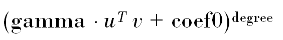
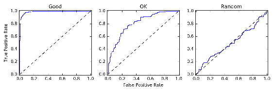
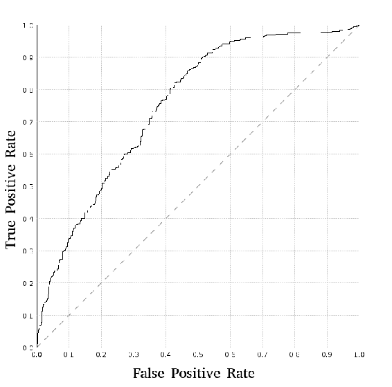
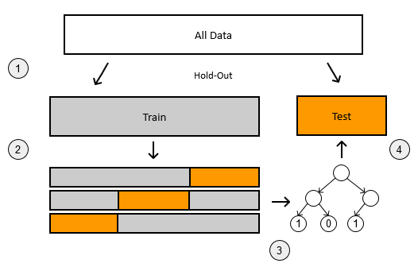

# 四、监督学习——分类和回归

在前几章中，我们学习了如何在 Java 中预处理数据，以及如何进行探索性的数据分析。现在，我们已经打下了基础，我们准备开始创建机器学习模型。

首先，我们从监督学习开始。在有监督的设置中，我们有一些信息附加在每个观察上，叫做标签，我们想从中学习，对没有标签的观察进行预测。

有两种类型的标签:第一种是离散和有限的，如真/假或买/卖，第二种是连续的，如工资或温度。这些类型对应于两种类型的监督学习:分类和回归。我们将在本章中讨论它们。

本章包括以下几点:

*   分类问题
*   回归问题
*   每种类型的评估指标
*   Java 中可用实现的概述

到本章结束时，你将知道如何使用 Smile、LIBLINEAR 和其他 Java 库来构建有监督的机器学习模型。


# 分类

在机器学习中，分类问题处理具有有限组可能值的离散目标。这意味着有一组可能的结果，给定一些特征，我们想要预测结果。

**二元分类**是最常见的分类问题类型，因为`target`变量只能有两个可能的值，比如`True` / `False`、`Relevant` / `Not Relevant`、`Duplicate` / `Not Duplicate`、`Cat` / `Dog`等等。

有时目标变量可以有两个以上的结果，例如颜色、物品类别、汽车型号等等，我们称之为**多类分类**。通常，每个观察只能有一个标签，但在某些设置中，可以为一个观察分配多个值。多类分类可以转化为一组二分类问题，这就是为什么我们将主要集中于二分类。


# 二元分类模型

正如我们已经讨论过的，二元分类模型处理只有两种可能结果需要预测的情况。通常，在这些设置中，我们有正类项目(存在某种效果)和负类项目(不存在某种效果)。

例如，积极的标签可以是相关的、重复的、不能偿还债务的等等。正类的实例通常被赋予目标值 1。此外，我们还有负面的实例，如不相关、不重复、偿还债务，它们被赋予目标值`0`。

这种分为积极和消极两类的做法有些人为，在某些情况下并不真正有意义。例如，如果我们有猫和狗的图像，即使只有两个类，说`Cat`是正类而`Dog`是负类也有点牵强。但这对于模型来说并不重要，所以我们仍然可以这样分配标签:`Cat`是`1`，而`Dog`是`0`。

一旦我们训练了一个模型，我们通常不会对硬预测感兴趣，比如*正面效应在那里*，或者*这是一只猫*。更有趣的是积极或消极影响的程度，这通常是通过预测概率来实现的。例如，如果我们想建立一个模型来预测一个客户是否会无法偿还债务，那么说*这个客户有 30%的违约*比*这个客户不会违约*更有用。

有许多模型可以解决二元分类问题，不可能涵盖所有的模型。我们将简要介绍实践中最常用的方法。它们包括以下内容:

*   逻辑回归
*   支持向量机
*   决策树
*   神经网络

我们假设您已经熟悉这些方法，并且至少对它们的工作原理有所了解。不要求非常熟悉，但要了解更多信息，您可以查阅以下书籍:

*   *统计学习入门，* *G .詹姆斯*， *D .威滕*， *T .哈斯蒂*， *R .蒂布拉尼*，*斯普林格*
*   *Python 机器学习*， *S .拉什卡*， *Packt 出版*

说到库，我们将涉及 Smile、JSAT、LIBSVM、LIBLINEAR 和 Encog。让我们从微笑开始。


# 微笑

**统计机器智能和学习引擎** ( **微笑**)是一个拥有大量分类和其他机器学习算法的库。对我们来说，最有趣的是逻辑回归、SVM 和随机森林，但你可以在 https://github.com/haifengl/smile[的 GitHub 官方页面上看到可用算法的完整列表。](https://github.com/haifengl/smile)

该库可以在 Maven Central 上获得，在撰写本文时的最新版本是 1.1.0。若要将它包含到项目中，请添加以下依赖项:

```
<dependency>  
  <groupId>com.github.haifengl</groupId>  
  <artifactId>smile-core</artifactId>  
  <version>1.1.0</version>  
</dependency>

```

正在积极开发中；新功能和错误修复经常被添加，但发布的频率并不高。我们建议使用 Smile 的最新可用版本，要获得它，您需要从源代码构建它。为此:

*   安装`sbt`，这是一个用于构建 scala 项目的工具。可以按照[http://www . Scala-SBT . org/release/docs/Manual-installation . html](http://www.scala-sbt.org/release/docs/Manual-Installation.html)的说明进行操作
*   使用 git 从[https://github.com/haifengl/smile](https://github.com/haifengl/smile)克隆项目
*   要构建库并将其发布到本地 Maven 存储库，请运行以下命令:

```
sbt core/publishM2

```

微笑库由几个子模块组成，如`smile-core`、`smile-nlp`、`smile-plot`等。出于本章的目的，我们只需要核心包，前面的命令将只构建核心包。在撰写本文时，GitHub 上的当前版本是 1.2.0。因此，在构建它之后，将下面的依赖项添加到 pom 中:

```
<dependency>  
  <groupId>com.github.haifengl</groupId>  
  <artifactId>smile-core</artifactId>  
  <version>1.2.0</version>  
</dependency>

```

Smile 的模型期望数据是双精度的二维数组形式，标签信息是整数的一维数组形式。对于二进制模型，值应为`0`或`1`。Smile 中的一些模型可以处理多类分类问题，所以有可能有更多的标签，不仅仅是`0`、`1`，还有`2`、`3`等等。

在 Smile 中，模型是使用`builder`模式构建的；你创建一个特殊的类，设置一些参数，最后它返回它构建的对象。这个`builder`类通常被称为`Trainer`，所有的模型都应该有一个`Trainer`对象。

例如，考虑训练一个 RandomForest 模型:

```
double[] X = ... // training data 
int[] y = ... // 0 and 1 labels 
RandomForest model = new RandomForest.Trainer() 
    .setNumTrees(100)  
    .setNodeSize(4) 
    .setSamplingRates(0.7) 
    .setSplitRule(SplitRule.ENTROPY) 
    .setNumRandomFeatures(3) 
    .train(X, y);

```

`RandomForest.Trainer`类接受一组参数和训练数据，最终生成训练好的`RandomForest`模型。来自 Smile 的 RandomForest 的实现具有以下参数:

*   这是模型中要训练的树的数量
*   `nodeSize`:这是叶节点中的最小项目数
*   `samplingRate`:这是用于生长每棵树的训练数据的比率
*   `splitRule`:这是用于选择最佳分割的杂质测量
*   `numRandomFeatures`:这是模型为选择最佳分割随机选择的特征数量

类似地，逻辑回归训练如下:

```
LogisticRegression lr = new LogisticRegression.Trainer() 
        .setRegularizationFactor(lambda) 
        .train(X, y);

```

一旦我们有了一个模型，我们就可以用它来预测以前看不见的商品的标签。为此，我们使用`predict`方法:

```
double[] row = // data  
int prediction = model.predict(row);

```

这段代码输出给定项目最可能的类。但是，我们往往更感兴趣的不是标签本身，而是拥有标签的概率。如果一个模型实现了`SoftClassifier`接口，那么有可能得到这样的概率:

```
double[] probs = new double[2]; 
model.predict(row, probs);

```

运行这段代码后，`probs`数组将包含概率。


# JSAT

**Java 统计分析工具** ( **JSAT** )是另一个 Java 库，里面包含了很多常用机器学习算法的实现。您可以在 https://github.com/EdwardRaff/JSAT/wiki/Algorithms 的[查看已实施车型的完整列表。](https://github.com/EdwardRaff/JSAT/wiki/Algorithms)

要将 JSAT 添加到 Java 项目中，请将下面的代码片段添加到`pom`:

```
<dependency>  
  <groupId>com.edwardraff</groupId>  
  <artifactId>JSAT</artifactId>  
  <version>0.0.5</version>  
</dependency>

```

与 Smile 模型不同，它只需要一个带有特征信息的 doubles 数组，JSAT 需要一个特殊的数据包装类。如果我们有一个数组，它被转换成 JSAT 表示，如下所示:

```
double[][] X = ... // data 
int[] y = ... // labels 

// change to more classes for more classes for multi-classification 
CategoricalData binary = new CategoricalData(2);  

List<DataPointPair<Integer>> data = new ArrayList<>(X.length); 
for (int i = 0; i < X.length; i++) { 
    int target = y[i]; 
    DataPoint row = new DataPoint(new DenseVector(X[i])); 
    data.add(new DataPointPair<Integer>(row, target)); 
} 

ClassificationDataSet dataset = new ClassificationDataSet(data, binary);

```

一旦我们准备好数据集，我们就可以训练一个模型。让我们再次考虑随机森林分类器:

```
RandomForest model = new RandomForest(); 
model.setFeatureSamples(4); 
model.setMaxForestSize(150); 
model.trainC(dataset);

```

首先，我们为模型设置一些参数，然后，在最后，我们调用`trainC`方法(这意味着训练一个分类器)。

在 JSAT 实现中，与 Smile 相比，Random Forest 的调整选项较少，只有可供选择的要素数量和要生长的树的数量。

此外，JSAT 包含逻辑回归的几个实现。通常的逻辑回归模型没有任何参数，它是这样训练的:

```
LogisticRegression model = new LogisticRegression(); 
model.trainC(dataset);

```

如果我们想要一个正则化的模型，那么我们需要使用`LogisticRegressionDCD`类。**对偶坐标下降** ( **DCD** )是用于训练逻辑回归的最优化方法。我们这样训练它:

```
LogisticRegressionDCD model = new LogisticRegressionDCD(); 
model.setMaxIterations(maxIterations); 
model.setC(C); 
model.trainC(fold.toJsatDataset());

```

在该代码中，`C`是正则化参数，`C`的值越小，对应的正则化效果越强。

最后，为了输出概率，我们可以做以下事情:

```
double[] row = // data 
DenseVector vector = new DenseVector(row); 
DataPoint point = new DataPoint(vector); 
CategoricalResults out = model.classify(point); 
double probability = out.getProb(1);

```

`CategoricalResults`类包含大量信息，包括每个类的概率和最可能的标签。


# LIBSVM 和 LIBLINEAR

接下来，我们考虑两个类似的库，LIBSVM 和 LIBLINEAR。

*   LIBSVM([https://www.csie.ntu.edu.tw/~cjlin/libsvm/](https://www.csie.ntu.edu.tw/~cjlin/libsvm/))是一个实现支持向量机模型的库，包括支持向量分类器
*   LIBLINEAR([https://www.csie.ntu.edu.tw/~cjlin/liblinear/](https://www.csie.ntu.edu.tw/~cjlin/liblinear/))是一个快速线性分类算法库，如线性 SVM 和逻辑回归

这两个库来自同一个研究小组，并且具有非常相似的接口。我们将从 LIBSVM 开始。

LIBSVM 是一个库，它实现了许多不同的 SVM 算法。它是用 C++实现的，并且有官方支持的 Java 版本。它可以在 Maven Central 上获得:

```
<dependency> 
  <groupId>tw.edu.ntu.csie</groupId> 
  <artifactId>libsvm</artifactId> 
  <version>3.17</version> 
</dependency>

```

注意，LIBSVM 的 Java 版本不如 C++版本更新频繁。尽管如此，前面的版本是稳定的，不应该包含错误，但它可能比它的 C++版本慢。

要使用 LIBSVM 中的 SVM 模型，首先需要指定参数。为此，您创建一个`svm_parameter`类。在内部，您可以指定许多参数，包括:

*   内核类型(`RBF`、`POLY`或`LINEAR`)
*   正则化参数`C`
*   `probability`你可以设置为`1`来得到概率
*   `svm_type`应设置为`C_SVC`；这表明模型应该是一个分类器

回想一下，SVM 模型可以有不同的核，根据我们使用的核，我们有不同的模型和不同的参数。这里，我们将考虑最常用的内核；线性(或无核)、多项式和**径向基函数** ( **RBF** )，又称高斯核)。
首先，我们从线性内核开始。首先，我们创建一个`svm_paramter`对象，其中我们将内核类型设置为`LINEAR`，并要求它输出概率:

```
svm_parameter param = new svm_parameter(); 
param.svm_type = svm_parameter.C_SVC; 
param.kernel_type = svm_parameter.LINEAR; 
param.probability = 1; 
param.C = C; 

// default parameters 
param.cache_size = 100; 
param.eps = 1e-3; 
param.p = 0.1; 
param.shrinking = 1;

```

接下来，我们有一个多项式核。回想一下，多项式内核由以下公式指定:



它有三个附加参数，即控制内核的`gamma`、`coef0`和`degree`，还有`C` -正则化参数。我们可以这样配置`POLY` SVM 的`svm_parameter`类:

```
svm_parameter param = new svm_parameter(); 
param.svm_type = svm_parameter.C_SVC; 
param.kernel_type = svm_parameter.POLY; 
param.C = C; 
param.degree = degree; 
param.gamma = 1; 
param.coef0 = 1; 
param.probability = 1; 
// plus defaults from the above

```

最后，高斯核(或 RBF)具有以下公式:


因此有一个参数`gamma`，它控制高斯曲线的宽度。我们可以像这样指定带有`RBF`内核的模型:

```
svm_parameter param = new svm_parameter(); 
param.svm_type = svm_parameter.C_SVC; 
param.kernel_type = svm_parameter.RBF; 
param.C = C; 
param.gamma = gamma; 
param.probability = 1; 
// plus defaults from the above

```

一旦我们创建了配置对象，我们需要将数据转换成正确的格式。该库希望数据以稀疏格式表示。对于单个数据行，到所需格式的转换如下:

```
double[] dataRow = // single row vector 
svm_node[] svmRow = new svm_node[dataRow.length]; 

for (int j = 0; j < dataRow.length; j++) { 
    svm_node node = new svm_node(); 
    node.index = j; 
    node.value = dataRow[j]; 
    svmRow[j] = node; 
}

```

因为我们通常有一个矩阵，而不仅仅是一行，所以我们将前面的代码应用于这个矩阵的每一行:

```
double[][] X = ... // data 
int n = X.length; 
svm_node[][] nodes = new svm_node[n][]; 

for (int i = 0; i < n; i++) { 
    nodes[i] = wrapAsSvmNode(X[i]); 
}

```

这里，`wrapAsSvmNode`是一个函数，它将一个向量包装成一个由`svm_node`对象组成的数组。

现在，我们可以将数据和标签一起放入`svm_problem`对象:

```
double[] y = ... // labels  
svm_problem prob = new svm_problem(); 
prob.l = n; 
prob.x = nodes; 
prob.y = y;

```

最后，我们可以使用参数和问题规范来训练 SVM 模型:

```
svm_model model = svm.svm_train(prob, param);

```

一旦模型被训练，我们就可以用它来分类看不见的数据。获取概率的方法如下:

```
double[][] X = // test data 
int n = X.length; 
double[] results = new double[n]; 
double[] probs = new double[2]; 

for (int i = 0; i < n; i++) { 
    svm_node[] row = wrapAsSvmNode(X[i]); 
    svm.svm_predict_probability(model, row, probs); 
    results[i] = probs[1]; 
}

```

由于我们使用了`param.probability = 1`，我们可以使用`svm.svm_predict_probability`方法来预测概率。与 Smile 一样，该方法接受一个 doubles 数组，并将输出写入其中。在这个操作之后，它将包含这个数组中的概率。

最后，在训练的时候，LIBSVM 在控制台上输出很多东西。如果我们对这个输出不感兴趣，我们可以用下面的代码片段禁用它:

```
svm.svm_set_print_string_function(s -> {});

```

只需将它添加到代码的开头，就再也看不到调试信息了。

下一个库是 LIBLINEAR，它提供了非常快速和高性能的线性分类器，如具有线性核的 SVM 和逻辑回归。它可以轻松扩展到数千万甚至数亿个数据点。它的界面与 LIBSVM 非常相似，我们需要指定参数和数据，然后训练一个模型。

与 LIBSVM 不同，LIBLINEAR 没有官方的 Java 版本，但是在 http://liblinear.bwaldvogel.de/有一个非官方的 Java 端口。要使用它，请包括以下内容:

```
<dependency>
 <groupId>de.bwaldvogel</groupId>
 <artifactId>liblinear</artifactId>
 <version>1.95</version>
</dependency>

```

该接口与 LIBSVM 非常相似。首先，我们定义参数:

```
SolverType solverType = SolverType.L1R_LR; 
double C = 0.001; 
double eps = 0.0001;  
Parameter param = new Parameter(solverType, C, eps);

```

在本例中，我们指定了三个参数:

*   `solverType`:定义将要使用的模型
*   `C`:这是正则化的量，C 越小，正则化越强
*   `epsilon`:这是停止训练过程的容忍度；合理的默认值是`0.0001`

对于分类问题，以下是我们可以使用的解决方案:

*   **逻辑回归** : `L1R_LR`或`L2R_LR`
*   **SVM** : `L1R_L2LOSS_SVC`或`L2R_L2LOSS_SVC`

这里，我们有两个模型:逻辑回归和 SVM，以及两种正规化类型，L1 和 L2。我们如何决定选择哪种模型和使用哪种正则化？根据官方常见问题解答(可以在这里找到:[https://www.csie.ntu.edu.tw/~cjlin/liblinear/FAQ.html](https://www.csie.ntu.edu.tw/~cjlin/liblinear/FAQ.html))，我们应该:

*   与逻辑回归相比，我更喜欢 SVM，因为它训练速度更快，而且通常精度更高
*   首先尝试 L2 正则化，除非你需要一个稀疏的解决方案，在这种情况下使用 L1

接下来，我们需要准备我们的数据。如前所述，我们需要将其包装成某种特殊的格式。首先，让我们看看如何包装单个数据行:

```
double[] row = // data 
int m = row.length; 
Feature[] result = new Feature[m]; 

for (int i = 0; i < m; i++) { 
    result[i] = new FeatureNode(i + 1, row[i]); 
}

```

注意，我们将`1`添加到索引中。`0`是偏置项，所以实际特性要从`1`开始。

我们可以将这段代码放入一个`wrapRow`函数中，然后将整个数据集包装如下:

```
double[][] X = // data 
int n = X.length; 
Feature[][] matrix = new Feature[n][]; 
for (int i = 0; i < n; i++) { 
    matrix[i] = wrapRow(X[i]); 
}

```

现在，我们可以用数据和标签创建`Problem`类:

```
double[] y = // labels 

Problem problem = new Problem(); 
problem.x = wrapMatrix(X); 
problem.y = y; 
problem.n = X[0].length + 1; 
problem.l = X.length;

```

注意，这里我们还需要提供数据的维度，也就是特征的数量加 1。我们需要增加一个，因为它包含了偏差项。

现在我们准备训练模型:

```
Model model = LibLinear.train(fold, param);

```

当模型被训练后，我们可以用它来分类看不见的数据。在下面的例子中，我们将输出概率:

```
double[] dataRow = // data 
Feature[] row = wrapRow(dataRow); 
Linear.predictProbability(model, row, probs); 
double result = probs[1];

```

前面的代码适用于逻辑回归模型，但不适用于 SVM，SVM 无法输出概率，因此前面的代码将为`L1R_L2LOSS_SVC`等求解器抛出错误。我们可以做的是获得原始输出:

```
double[] values = new double[1]; 
Feature[] row = wrapRow(dataRow); 
Linear.predictValues(model, row, values); 
double result = values[0];

```

在这种情况下，结果将不会包含概率，而是一些真实值。当该值大于零时，模型预测该类为正。

如果我们想将这个值映射到`[0, 1]`范围，我们可以使用`sigmoid`函数:

```
public static double[] sigmoid(double[] scores) { 
    double[] result = new double[scores.length]; 

    for (int i = 0; i < result.length; i++) { 
        result[i] = 1 / (1 + Math.exp(-scores[i])); 
    } 

    return result; 
}

```

最后，和 LIBSVM 一样，LIBLINEAR 也将很多东西输出到标准输出。如果您不希望看到它，可以使用以下代码将其静音:

```
PrintStream devNull = new PrintStream(new NullOutputStream()); 
Linear.setDebugOutput(devNull);

```

这里，我们使用 Apache IO 中的`NullOutputStream`，它什么也不做，所以屏幕保持干净。

想知道什么时候用 LIBSVM，什么时候用 LIBLINEAR？对于大型数据集，通常不可能使用任何内核方法。在这种情况下，您应该更喜欢 LIBLINEAR。此外，LIBLINEAR 特别适合文本处理，比如文档分类。我们将在第六章、*中更详细地介绍这些案例——自然语言处理和信息检索*。


# Encog

到目前为止，我们已经介绍了许多模型，即逻辑回归、SVM 和 RandomForest，并且我们已经查看了实现它们的多个库。但是我们还没有涉及神经网络。在 Java 中，有一个专门处理神经网络的特殊库——Encog。它可以在 Maven Central 上获得，并且可以通过以下代码片段进行添加:

```
<dependency>  
  <groupId>org.encog</groupId>  
  <artifactId>encog-core</artifactId>  
  <version>3.3.0</version>  
</dependency>

```

在包括库之后，第一步是指定神经网络的架构。我们可以这样做:

```
BasicNetwork network = new BasicNetwork(); 
network.addLayer(new BasicLayer(new ActivationSigmoid(), true, noInputNeurons)); 
network.addLayer(new BasicLayer(new ActivationSigmoid(), true, 30)); 
network.addLayer(new BasicLayer(new ActivationSigmoid(), true, 1)); 
network.getStructure().finalizeStructure(); 
network.reset();

```

这里，我们创建一个网络，它有一个输入层，一个内层有 30 个神经元，一个输出层有 1 个神经元。在每一层中，我们使用 sigmoid 作为激活函数，并添加偏置输入(`true`参数)。最后，`reset`方法随机初始化网络中的权重。

对于输入和输出，Encog 期望二维双数组。在二进制分类的情况下，我们通常有一个一维数组，所以我们需要转换它:

```
double[][] X = // data 
double[] y = // labels 
double[][] y2d = new double[y.length][]; 

for (int i = 0; i < y.length; i++) { 
    y2d[i] = new double[] { y[i] }; 
}

```

一旦数据被转换，我们就把它包装成一个特殊的包装类:

```
MLDataSet dataset = new BasicMLDataSet(X, y2d);

```

然后，该数据集可用于训练:

```
MLTrain trainer = new ResilientPropagation(network, dataset); 
double lambda = 0.01; 
trainer.addStrategy(new RegularizationStrategy(lambda)); 

int noEpochs = 101; 
for (int i = 0; i < noEpochs; i++) { 
    trainer.iteration(); 
}

```

我们不会在这里详细介绍 Encog，但我们会在第 8 章、*中回到神经网络，用 DeepLearning4j* 进行深度学习，在那里我们会看到一个不同的库——Deep Learning 4j。

Java 中还有很多其他的机器学习库。例如威卡、H2O、贾瓦尔等。这是不可能涵盖所有的，但你也可以尝试一下，看看你是否喜欢他们比我们已经涵盖的。

接下来，我们将看到如何评估分类模型。


# 估价

我们已经介绍了许多机器学习库，其中许多实现了相同的算法，如随机森林或逻辑回归。此外，每个单独的模型可以具有许多不同的参数，逻辑回归具有正则化系数，SVM 通过设置核及其参数来配置。

我们如何从这么多可能的变体中选择最佳的单一模型？

为此，我们首先定义一些评估指标，然后选择根据该指标实现最佳性能的模型。对于二进制分类，我们可以使用许多指标进行比较，最常用的指标如下:

*   准确度和误差
*   精确度、召回率和 F1
*   AUC(澳大利亚)

我们使用这些指标来观察模型对新的未知数据的概括能力。因此，当数据对模型来说是新的时，对这种情况建模是很重要的。这通常是通过将数据分成几个部分来完成的。因此，我们还将涵盖以下内容:

*   结果评估
*   k 倍交叉验证
*   培训、验证和测试

让我们从最直观的评估指标——准确性开始。


# 准确(性)

准确性是评估分类器最直接的方式:我们进行预测，查看预测的标签，然后将其与实际值进行比较。如果价值观一致，那么模型是正确的。然后，我们可以对我们所有的数据都这样做，看看正确预测的例子的比率；这正是准确性所描述的。因此，准确性告诉我们有多少例子模型预测了正确的标签。计算它是微不足道的:

```
int n = actual.length; 
double[] proba = // predictions; 

double[] prediction = Arrays.stream(proba).map(p -> p > threshold ? 1.0 : 0.0).toArray(); 
int correct = 0; 

for (int i = 0; i < n; i++) { 
    if (actual[i] == prediction[i]) { 
        correct++; 
    } 
} 

double accuracy = 1.0 * correct / n;

```

准确性是最简单的评估标准，很容易向任何人解释，甚至是非技术人员。

然而，有时，准确性并不是模型性能的最佳衡量标准。接下来我们来看看它的问题是什么，用什么来代替。


# 精确度、召回率和 F1

在某些情况下，精度值是有欺骗性的:它们表明分类器是好的，尽管它不是。例如，假设我们有一个不平衡的数据集:只有 1%的例子是正面的，其余的(99%)是负面的。然后，一个总是预测为负的模型在 99%的情况下是正确的，因此将具有 0.99 的准确度。但是这个模型并没有用。

除了准确性，还有其他方法可以解决这个问题。精确度和召回率都在这些指标中，因为它们都着眼于模型正确识别的积极项目的比例。所以，如果我们有大量的反面例子，我们仍然可以对模型进行一些有意义的评估。

可以使用混淆矩阵来计算精度和召回率，混淆矩阵是一个总结了二元分类器性能的表:


当我们使用二元分类模型来预测某个数据项的实际值时，有四种可能的结果:

*   **真正** ( **TP** ):实际类为正，我们预测为正
*   **真负** ( **TN** ):实际类为负，我们预测为负
*   **假阳性** ( **FP** ):实际类是阴性，我们却说是阳性
*   **假阴性** ( **FN** ):实际类是阳性，我们却说是阴性

前两种情况(TP 和 TN)是正确的预测，实际值和预测值是相同的。最后两种情况(FP 和 FN)是不正确的分类，因为我们无法预测正确的标签。

现在，假设我们有一个带有已知标签的数据集，并对其运行我们的模型。然后，设`TP`为真正例数，`TN`为真反例数，以此类推。

然后我们可以使用这些值来计算精度和召回率:

*   精度是模型预测为阳性的所有项目中正确预测为阳性的项目所占的比例。就混淆矩阵而言，精度是`TP / (TP + FP)`。
*   回忆是正确预测的阳性项目在实际阳性项目中所占的比例。利用来自混淆矩阵的值，回忆是`TP / (TP + FN)`。
*   通常很难决定是应该优化精确度还是召回率。但是还有另一个将精确度和召回率结合成一个数字的指标，它被称为 **F1 分数**。

为了计算精度和召回率，我们首先需要计算混淆矩阵单元的值:

```
int tp = 0, tn = 0, fp = 0, fn = 0; 

for (int i = 0; i < actual.length; i++) { 
    if (actual[i] == 1.0 && proba[i] > threshold) { 
        tp++; 
    } else if (actual[i] == 0.0 && proba[i] <= threshold) { 
        tn++; 
    } else if (actual[i] == 0.0 && proba[i] > threshold) { 
        fp++; 
    } else if (actual[i] == 1.0 && proba[i] <= threshold) { 
        fn++; 
    } 
}

```

然后，我们可以使用这些值来计算精度和召回率:

```
double precision = 1.0 * tp / (tp + fp); 
double recall = 1.0 * tp / (tp + fn);

```

最后，`f1`可以用下面的公式计算:

```
double f1 = 2 * precision * recall / (precision + recall);

```

当数据集不平衡时，这些指标非常有用。


# ROC 和 AU ROC (AUC)

前面的度量对于产生硬输出的二进制分类器是好的；它们只告诉类是否应该被分配一个积极的标签或消极的。相反，如果我们的模型输出一些分数，使得分数的值越高，项目越有可能是正面的，那么二元分类器被称为**排序分类器**。

大多数模型可以输出属于某一类的概率，我们可以用它来对例子进行排序，这样积极的东西可能会排在第一位。

ROC 曲线直观地告诉我们一个分级分类器从负面例子中分离正面例子有多好。ROC 曲线的构建方式如下:

*   根据分数对观察值进行排序，然后从原点开始
*   如果观察值为正，则向上；如果观察值为负，则向右。

这样，在理想情况下，我们首先总是向上，然后总是向右，这将产生最佳的 ROC 曲线。在这种情况下，我们可以说，正例与反例的分离是完美的。如果分离不完美，但仍然 **OK** ，曲线将上升为正例，但有时会在错误分类发生时右转。最后，一个糟糕的分类器将不能区分正例与反例，曲线将在向上和向右之间交替。

让我们看一些例子:



图上的对角线代表基线——随机分类器将达到的性能。曲线离基线越远越好。

不幸的是，在 Java 中没有 ROC 曲线的易用实现。我们自己实现代码并不难。在这里，我们将概述如何做到这一点，你会发现在代码库一章的实现。

所以绘制 ROC 曲线的算法如下:

*   设 POS 为阳性标记的数量，NEG 为阴性标记的数量
*   按分数降序排列数据
*   从(0，0)开始
*   对于排序顺序中的每个示例，
    *   o 如果示例为正，则在图中上移 1 / POS，
    *   o 否则，在图表中向右移动 1 /负。

这是一个简化的算法，并假设分数是不同的。如果分数不明显，并且同一个分数有不同的实际标签，就需要做一些调整。

它是在`RocCurve`类中实现的，您可以在源代码中找到。您可以按如下方式使用它:

```
RocCurve.plot(actual, prediction);

```

调用它将创建一个类似于这个的情节:



曲线下的面积表示正例与反例之间的分离程度。如果分离度很好，那么面积会接近 1。但如果分类器不能区分正反例，曲线会绕着随机基线曲线走，面积会接近 **0.5** 。

曲线下的面积通常缩写为 AUC，或者有时缩写为 AU ROC，以强调该曲线是 ROC 曲线。

AUC 有一个非常好的解释——AUC 的值对应于随机选择的阳性样本得分高于随机选择的阴性样本的概率。自然地，如果这个概率很高，我们的分类器在分离正面和负面例子方面做得很好。

这使得 AUC 成为许多情况下的一种评估指标，特别是当数据集不平衡时，因为一个类别的示例比另一个类别的多得多。

幸运的是，Java 中有 AUC 的实现。例如，它在 Smile 中实现。你可以这样使用它:

```
double[] predicted = ...  // 
int[] truth = ... //
double auc = AUC.measure(truth, predicted);

```

现在，当我们讨论可能的评估指标时，我们需要应用它们来测试我们的模型。我们需要小心处理。如果我们对用于训练的相同数据进行评估，那么评估结果将过于乐观。接下来，我们将看到什么是正确的做法。


# 结果验证

当从数据中学习时，总是有过度拟合的危险。当模型开始学习数据中的噪声而不是检测有用的模式时，就会发生过度拟合。检查模型是否过度拟合总是很重要的，否则当应用于看不见的数据时，它将是无用的。

检查模型是否过拟合的典型且最实用的方法是模拟看不见的数据，也就是说，取一部分可用的标记数据，不使用它进行训练。

这种技术被称为**保留**，我们保留一部分数据，仅用于评估。


我们还在分割前打乱原始数据集。在许多情况下，我们会做一个简化的假设，即数据的顺序并不重要，也就是说，一个观察值对另一个观察值没有影响。在这种情况下，在拆分之前打乱数据将会消除项目顺序可能产生的影响。另一方面，如果数据是时间序列数据，那么打乱它不是一个好主意，因为观察值之间存在一些相关性。

那么，让我们实现保持分离。我们假设我们拥有的数据已经用`X`表示了——一个具有特征的双精度二维数组和`y`——一个标签一维数组。

首先，我们创建一个助手类来保存数据:

```
public class Dataset { 
    private final double[][] X; 
    private final double[] y; 
    // constructor and getters are omitted 
}

```

分割我们的数据集应该产生两个数据集，所以我们也为其创建一个类:

```
public class Split { 
    private final Dataset train; 
    private final Dataset test; 
    // constructor and getters are omitted 
}

```

现在，假设我们想把数据分成两部分:训练和测试。我们还想指定训练集的大小，我们将使用一个`testRatio`参数:应该进入测试集的项目的百分比。

我们做的第一件事是生成一个带索引的数组，然后根据`testRatio`对其进行拆分:

```
int[] indexes = IntStream.range(0, dataset.length()).toArray(); 
int trainSize = (int) (indexes.length * (1 - testRatio)); 
int[] trainIndex = Arrays.copyOfRange(indexes, 0, trainSize); 
int[] testIndex = Arrays.copyOfRange(indexes, trainSize, indexes.length);

```

如果需要，我们也可以打乱索引:

```
Random rnd = new Random(seed); 

for (int i = indexes.length - 1; i > 0; i--) { 
    int index = rnd.nextInt(i + 1); 
    int tmp = indexes[index]; 
    indexes[index] = indexes[i]; 
    indexes[i] = tmp; 
}

```

然后，我们可以为训练集选择实例，如下所示:

```
int trainSize = trainIndex.length; 
double[][] trainX = new double[trainSize][]; 
double[] trainY = new double[trainSize]; 
for (int i = 0; i < trainSize; i++) { 
    int idx = trainIndex[i]; 
    trainX[i] = X[idx]; 
    trainY[i] = y[idx]; 
}

```

最后，将它包装到我们的`Dataset`类中:

```
Dataset train = new Dataset(trainX, trainY);

```

如果我们对测试集重复同样的操作，我们可以将训练集和测试集放入一个`Split`对象中:

```
Split split = new Split(train, test);

```

现在我们可以使用 train fold 进行训练，使用 test fold 测试模型。

如果我们把前面所有的代码放到`Dataset`类的一个函数中，例如`trainTestSplit`，我们可以如下使用它:

```
Split split = dataset.trainTestSplit(0.2); 

Dataset train = split.getTrain();
// train the model using train.getX() and train.getY()

Dataset test = split.getTest(); 
// test the model using test.getX(); test.getY();

```

这里，我们在`train`数据集上训练一个模型，然后在`test`集上计算评估度量。


# k 倍交叉验证

只提供一部分数据并不总是最好的选择。相反，我们可以做的是将它分成 *K* 个部分，然后只对第 *1/K* 个数据测试模型。

这叫做 **k 倍交叉验证**；它不仅给出了性能估计，而且给出了误差的可能传播。通常，我们感兴趣的是能提供良好和稳定性能的模型。K-fold 交叉验证有助于我们选择这样的模型。

接下来，我们准备用于 k 倍交叉验证的数据，如下所示:

*   首先，将数据分成 *K* 个部分
*   然后，对于这些零件中的每一个:
    *   取一部分作为验证集
    *   将剩余的 *K-1* 零件作为训练集

如果我们把它翻译成 Java，第一步会是这样的:

```
int[] indexes = IntStream.range(0, dataset.length()).toArray(); 
int[][] foldIndexes = new int[k][]; 

int step = indexes.length / k; 
int beginIndex = 0; 

for (int i = 0; i < k - 1; i++) { 
    foldIndexes[i] = Arrays.copyOfRange(indexes, beginIndex, beginIndex + step); 
    beginIndex = beginIndex + step; 
} 

foldIndexes[k - 1] = Arrays.copyOfRange(indexes, beginIndex, indexes.length);

```

这为每个 *K* 折叠创建了一个索引数组。我们也可以像前面一样打乱索引数组。

现在，我们可以从每个折叠创建拆分:

```
List<Split> result = new ArrayList<>(); 

for (int i = 0; i < k; i++) { 
    int[] testIdx = folds[i]; 
    int[] trainIdx = combineTrainFolds(folds, indexes.length, i); 
    result.add(Split.fromIndexes(dataset, trainIdx, testIdx)); 
}

```

在前面的代码中，我们有两个额外的方法:

*   `combineTrainFolds`:这个函数接收带有索引的 *K-1 个*数组，并将它们组合成一个
*   `Split.fromIndexes`:这将创建一个训练和测试索引的分割。

当我们创建一个简单的保持测试集时，我们已经讨论了第二个功能。

第一个函数`combineTrainFolds`是这样实现的:

```
private static int[] combineTrainFolds(int[][] folds, int totalSize, int excludeIndex) { 
    int size = totalSize - folds[excludeIndex].length; 
    int result[] = new int[size]; 

    int start = 0; 
    for (int i = 0; i < folds.length; i++) { 
        if (i == excludeIndex) { 
            continue; 
        } 
        int[] fold = folds[i]; 
        System.arraycopy(fold, 0, result, start, fold.length); 
        start = start + fold.length; 
    } 

    return result; 
}

```

同样，我们可以将前面的代码放入`Dataset`类的函数中，并像下面这样调用它:

```
List<Split> folds = train.kfold(3);

```

现在，当我们有了一个`Split`对象的列表时，我们可以创建一个特殊的函数来执行交叉验证:

```
public static DescriptiveStatistics crossValidate(List<Split> folds,  
        Function<Dataset, Model> trainer) { 
    double[] aucs = folds.parallelStream().mapToDouble(fold -> { 
        Dataset foldTrain = fold.getTrain(); 
        Dataset foldValidation = fold.getTest(); 
        Model model = trainer.apply(foldTrain); 
        return auc(model, foldValidation); 
    }).toArray(); 

    return new DescriptiveStatistics(aucs); 
}

```

这个函数的作用是，获取一个折叠列表和一个回调函数，并创建一个模型。在模型被训练之后，我们计算它的 AUC。

此外，我们利用 Java 的并行循环能力，同时在每个折叠上训练模型。

最后，我们将在每个折叠上计算的 AUC 放入一个`DescriptiveStatistics`对象中，该对象稍后可用于返回 AUC 的平均值和标准差。您可能还记得，`DescriptiveStatistics`类来自 Apache Commons 数学库。

让我们考虑一个例子。假设我们想要使用来自`LIBLINEAR`的逻辑回归，并为正则化参数`C`选择最佳值。我们可以这样使用前面的函数:

```
double[] Cs = { 0.01, 0.05, 0.1, 0.5, 1.0, 5.0, 10.0 }; 

for (double C : Cs) { 
    DescriptiveStatistics summary = crossValidate(folds, fold -> { 
        Parameter param = new Parameter(SolverType.L1R_LR, C, 0.0001); 
        return LibLinear.train(fold, param); 
    }); 

    double mean = summary.getMean(); 
    double std = summary.getStandardDeviation(); 
    System.out.printf("L1 logreg C=%7.3f, auc=%.4f &pm; %.4f%n", C, mean, std); 
}

```

这里，`LibLinear.train`是一个助手方法，它接受一个`Dataset`对象和一个`Parameter`对象，然后训练一个 LIBLINEAR 模型。这将打印所有提供的`C`值的 AUC，因此您可以看到哪一个是最好的，并选择具有最高平均 AUC 的一个。


# 培训、验证和测试

当进行交叉验证时，仍然存在过度拟合的危险。由于我们在同一个验证集上尝试了许多不同的实验，我们可能会意外地选择在验证集上表现良好的模型——但它可能稍后无法推广到看不见的数据。

这个问题的解决方案是在最开始的时候拿出一个测试集，在我们选择出我们认为最好的模型之前，不要碰它。我们只用它来评估最终的模型。

那么，我们如何选择最佳模型呢？我们能做的就是对剩下的训练数据做交叉验证。它可以被保持或 k-fold 交叉验证。一般来说，您应该更喜欢进行 k-fold 交叉验证，因为它还可以提供性能分布，您也可以在模型选择中使用它。

下图说明了该过程:



根据图表，典型的数据科学工作流应该如下所示:

*   **0** :选择一些指标进行验证，例如，准确度或 AUC
*   **1** :将所有数据分成训练集和测试集
*   **2** :进一步拆分训练数据，保留一个验证数据集，或者拆分成 k 个折叠
*   **3** :使用验证数据进行选型和参数优化
*   **4** :根据验证集选择最佳模型，并对照坚持测试集进行评估

避免过于频繁地查看测试集是很重要的，它应该很少使用，并且只用于最终评估，以确保所选模型不会过度拟合。如果认证方案设置正确，认证分数应与最终测试分数一致。如果发生这种情况，我们可以肯定模型不会过度拟合，并且能够推广到看不见的数据。

使用我们之前创建的类和代码，它可以转换成下面的 Java 代码:

```
Dataset data = new Dataset(X, y); 
Dataset train = split.getTrain(); 
List<Split> folds = train.kfold(3); 
// now use crossValidate(folds, ...) to select the best model 

Dataset test = split.getTest(); 
// do final evaluation of the best model on test

```

有了这些信息，我们准备做一个关于二元分类的项目。


# 案例研究-页面预测

现在我们将继续我们运行的例子，搜索引擎。这里我们想做的是尝试预测一个 URL 是否来自搜索引擎结果的第一页。所以，是时候使用我们在这一章中已经介绍过的材料了。

在[第二章](a005c42b-d837-402c-9bba-971b440268b5.xhtml)、*数据处理工具箱*中，我们创建了以下对象来存储关于页面的信息:

```
public class RankedPage { 
    private String url; 
    private int position; 
    private int page; 
    private int titleLength; 
    private int bodyContentLength; 
    private boolean queryInTitle; 
    private int numberOfHeaders; 
    private int numberOfLinks; 
}

```

首先，我们可以从向该对象添加一些方法开始，如下所示:

*   `isHttps`:这将告诉我们该 URL 是否是 HTTPS，是否可以用`url.startsWith("https://")`实现
*   `isComDomain`:这应该告诉我们 URL 是否属于 COM 域，以及我们是否可以用`url.contains(".com")`来实现它
*   `isOrgDomain`、`isNetDomain`:与上一个相同，但分别针对 ORG 和 NET
*   `numberOfSlashes`:这是 URL 中斜杠字符的个数，可以用番石榴的`CharMatcher` : `CharMatcher.*is*('/').countIn(url)`实现

这些模型描述了我们得到的每个 URL，所以我们称之为特征方法，我们可以在我们的机器学习模型中使用这些方法的结果。

如前所述，我们有一个读取 JSON 数据并从中创建 Joinery 数据帧的方法:

```
List<RankedPage> pages = RankedPageData.readRankedPages(); 
DataFrame<Object> dataframe = BeanToJoinery.convert(pages, RankedPage.class);

```

有了数据后，第一步是提取目标变量的值:

```
List<Object> page = dataframe.col("page"); 
double[] target = page.stream() 
                      .mapToInt(o -> (int) o) 
                      .mapToDouble(p -> (p == 0) ? 1.0 : 0.0) 
                      .toArray();

```

为了得到特征矩阵`X`，我们可以使用 Joinery 为我们创建一个二维数组。首先，我们需要删除一些变量，即目标变量、URL 以及位置，因为位置显然与页面相关。我们可以这样做:

```
dataframe = dataframe.drop("page", "url", "position"); 
double[][] X = dataframe.toModelMatrix(0.0);

```

接下来，我们可以使用我们在本章中创建的`Dataset`类，并将它分成训练和测试部分:

```
Dataset dataset = new Dataset(X, target); 
Split split = dataset.trainTestSplit(0.2); 
Dataset train = split.getTrain(); 
Dataset test = split.getTest();

```

此外，对于某些算法，对要素进行标准化很有帮助，这样它们的平均值和单位标准差为零。这样做的原因是为了帮助优化算法更快地收敛。

为此，我们计算矩阵中每一列的平均值和标准偏差，然后从每个值中减去平均值，再除以标准偏差。为了简洁起见，我们在这里省略了这个函数的代码，但是您可以在代码仓库一章中找到它。

下面的代码可以做到这一点:

```
preprocessor = StandardizationPreprocessor.train(train); 
train = preprocessor.transform(train); 
test = preprocessor.transform(test);

```

现在我们准备开始训练不同的模型。让我们先从 Smile 开始尝试逻辑回归实现。我们将使用 k-fold 交叉验证来选择其正则化参数λ的最佳值。

```
List<Fold> folds = train.kfold(3); 
double[] lambdas = { 0, 0.5, 1.0, 5.0, 10.0, 100.0, 1000.0 }; 
for (double lambda : lambdas) { 
    DescriptiveStatistics summary = Smile.crossValidate(folds, fold -> { 
        return new LogisticRegression.Trainer() 
                .setRegularizationFactor(lambda) 
                .train(fold.getX(), fold.getYAsInt()); 
    }); 

    double mean = summary.getMean(); 
    double std = summary.getStandardDeviation(); 
    System.out.printf("logreg, λ=%8.3f, auc=%.4f &pm; %.4f%n", lambda, mean, std); 
}

```

注意这里的`Dataset`类有一个新方法`getYAsInt`，它简单地返回表示为整数数组的目标变量。当我们运行它时，它会产生以下输出:

```
logreg, λ=   0.000, auc=0.5823 &pm; 0.0041 
logreg, λ=   0.500, auc=0.5822 &pm; 0.0040 
logreg, λ=   1.000, auc=0.5820 &pm; 0.0037 
logreg, λ=   5.000, auc=0.5820 &pm; 0.0030 
logreg, λ=  10.000, auc=0.5823 &pm; 0.0027 
logreg, λ= 100.000, auc=0.5839 &pm; 0.0009 
logreg, λ=1000.000, auc=0.5859 &pm; 0.0036

```

它显示了λ的值，我们得到的该值的 AUC，以及跨不同折叠的 AUC 的标准偏差。

我们看到我们得到的 AUC 相当低。这不应该是一个惊喜:仅使用我们现在拥有的信息显然不足以完全逆向工程搜索引擎的排名算法。在接下来的章节中，我们将学习如何从页面中提取更多的信息，这些技术将有助于大大增加 AUC。

我们可以注意到的另一件事是，不同λ值的 AUC 非常相似，但其中一个具有最低的标准偏差。在这种情况下，我们应该总是选择方差最小的模型。

我们还可以尝试更复杂的分类器，如 RandomForest:

```
DescriptiveStatistics rf = Smile.crossValidate(folds, fold -> { 
    return new RandomForest.Trainer() 
            .setNumTrees(100) 
            .setNodeSize(4) 
            .setSamplingRates(0.7) 
            .setSplitRule(SplitRule.ENTROPY) 
            .setNumRandomFeatures(3) 
            .train(fold.getX(), fold.getYAsInt()); 
}); 

System.out.printf("random forest auc=%.4f &pm; %.4f%n", rf.getMean(), rf.getStandardDeviation());

```

这将创建以下输出:

```
random forest auc=0.6093 &pm; 0.0209

```

这个分类器平均比逻辑回归分类器好 2%,但是我们也可以注意到标准偏差相当高。因为它高得多，我们可以怀疑，在测试数据上，该模型的表现可能比逻辑回归模型差得多。

接下来，我们也可以尝试训练其他模型。但是，让我们假设我们这样做了，最后我们得出结论，使用`lambda=100`的逻辑回归给出了最佳性能。然后，我们可以对整个训练数据集进行再训练，然后使用测试集进行最终评估:

```
LogisticRegression logregFinal = new LogisticRegression.Trainer() 
        .setRegularizationFactor(100.0) 
        .train(train.getX(), train.getYAsInt()); 

double auc = Smile.auc(logregFinal, test); 
System.out.printf("final logreg auc=%.4f%n", auc);

```

该代码产生以下输出:

```
final logreg auc=0.5807

```

因此，事实上，我们可以看到，所选模型产生的 AUC 与我们交叉验证中的相同。这是一个很好的迹象，表明该模型可以很好地概括，不会过度填充。

出于好奇，我们还可以检查 RandomForest 模型在训练集上的表现。由于它具有较高的方差，因此它的表现可能比逻辑回归差，但也可能好得多。让我们在整个列车上重新训练它:

```
RandomForest rfFinal = new RandomForest.Trainer() 
        .setNumTrees(100) 
        .setNodeSize(4) 
        .setSamplingRates(0.7) 
        .setSplitRule(SplitRule.ENTROPY) 
        .setNumRandomFeatures(3) 
        .train(train.getX(), train.getYAsInt()); 

double auc = Smile.auc(rfFinal, test); 
System.out.printf("final rf auc=%.4f%n", finalAuc);

```

它打印以下内容:

```
final rf auc=0.5778

```

因此，事实上，模型的高方差导致测试分数低于交叉验证分数。这不是一个好的迹象，这样的模型不应该是首选。

因此，对于这样的数据集，表现最好的模型是逻辑回归。

如果你想知道如何使用其他机器学习库来解决这个问题，可以查看本章的代码库。在那里，我们为 JSAT、JavaML、LIBSVM、LIBLINEAR 和 Encog 创建了一些例子。

至此，我们结束了本章关于分类的部分，接下来我们将研究另一个被称为**回归**的监督学习问题。


# 回归

在机器学习中，回归问题处理标签信息连续的情况。这可以是预测明天的气温、股票价格、一个人的工资或者电子商务网站上一件商品的评级。

有许多模型可以解决衰退问题:

*   **普通最小二乘法** ( **OLS** )就是通常的线性回归
*   岭回归和套索是 OLS 的正则化变体
*   基于树的模型，如 RandomForest
*   神经网络

处理回归问题与处理分类问题非常相似，总体框架保持不变:

*   首先，您选择一个评估指标
*   然后，您将数据分为训练和测试
*   您在训练中训练模型，使用交叉验证调整参数，并使用保留的测试集进行最终验证。


# 用于回归的机器学习库

我们已经讨论了许多可以处理分类问题的机器学习库。通常，这些库也有回归模型。让我们简单回顾一下。


# 微笑

Smile 是一个通用的机器学习库，所以它也有回归模型。你可以看看模特名单，这里:[https://github.com/haifengl/smile](https://github.com/haifengl/smile)。

例如，这是创建简单线性回归的方法:

```
OLS ols = new OLS(data.getX(), data.getY());

```

对于正则化回归，可以使用脊或套索:

```
double lambda = 0.01; 
RidgeRegression ridge = new RidgeRegression(data.getX(), data.getY(), lambda); 
LASSO lasso = new LASSO(data.getX(), data.getY(), lambda);

```

使用 RandomForest 与分类情况非常相似:

```
int nbtrees = 100; 
RandomForest rf = new RandomForest.Trainer(nbtrees) 
        .setNumRandomFeatures(15) 
        .setMaxNodes(128) 
        .setNodeSize(10) 
        .setSamplingRates(0.6) 
        .train(data.getX(), data.getY());

```

预测也与分类情况相同。我们需要做的只是使用`predict`方法:

```
double result = model.predict(row);

```


# JSAT

JSAT 也是一个通用库，包含许多解决回归问题的实现。

与分类一样，它需要一个用于数据的包装类和一个用于回归的特殊包装:

```
double[][] X = ... // 
double[] y = ... // 
List<DataPointPair<Double>> data = new ArrayList<>(X.length); 

for (int i = 0; i < X.length; i++) { 
    DataPoint row = new DataPoint(new DenseVector(X[i])); 
    data.add(new DataPointPair<Double>(row, y[i])); 
} 

RegressionDataSet dataset = new RegressionDataSet(data);

```

一旦数据集被包装在正确的类中，我们就可以像这样训练模型:

```
MultipleLinearRegression linreg = new MultipleLinearRegression(); 
linreg.train(dataset);;

```

前面的代码训练通常的 OLS 线性回归。

与 Smile 不同，当矩阵病态时，OLS 不会产生稳定的解，也就是说，它有一些线性相关的解。在这种情况下，使用正则化模型。

可以使用以下代码来训练正则化线性回归:

```
RidgeRegression ridge = new RidgeRegression(); 
ridge.setLambda(lambda); 
ridge.train(dataset);

```

然后，为了预测，我们还需要做一些转换:

```
double[] row = .. . // 
DenseVector vector = new DenseVector(row); 
DataPoint point = new DataPoint(vector); 
double result = model.regress(point);

```


# 其他图书馆

我们之前提到的其他库也有解决回归问题的模型。

例如，在 LIBSVM 中，可以通过将`svm_type`参数设置为`EPSILON_SVR`或`NU_SVR`来进行回归，而代码的其余部分几乎与分类情况相同。同样，在 LIBLINEAR 中，回归问题通过选择`L2R_L2LOSS_SVR`或`L2R_L2LOSS_SVR_DUAL`模型来解决。

也可以用神经网络解决回归问题，例如在 Encog 中。您唯一需要更改的是损失函数:您应该使用回归损失函数，比如均方差，而不是最小化分类损失函数(比如`logloss`)。

因为大部分代码都非常相似，所以没有必要详细介绍。一如既往，我们在章节代码库中准备了一些代码示例，请随意查看。


# 估价

与分类一样，我们也需要评估模型的结果。有一些指标有助于做到这一点，并选择最佳模型。先来过两个最流行的:**均方误差** ( **MSE** )和**平均绝对误差** ( **MAE** )。


# 均方误差(mean square error)

**均方误差** ( **MSE** )是实际值和预测值的平方差之和。用 Java 计算它很容易:

```
double[] actual, predicted;  

int n = actual.length; 
double sum = 0.0; 
for (int i = 0; i < n; i++) { 
    diff = actual[i] - predicted[i]; 
    sum = sum + diff * diff; 
} 

double mse = sum / n;

```

通常，MSE 的值很难解释，这就是为什么我们经常取 MSE 的平方根；这叫做**均方根误差** ( **RMSE** )。它更容易解释，因为它与目标变量使用相同的单位。

```
double rmse = Math.sqrt(mse);

```


# 平均绝对误差

**平均绝对误差** ( **MAE** )，是评估性能的替代指标。它不取误差的平方，而只取实际值和预测值之差的绝对值。我们可以这样计算:

```
double sum = 0.0; 
for (int i = 0; i < n; i++) { 
    sum = sum + Math.abs(actual[i] - predicted[i]); 
} 

double mae = sum / n;

```

有时我们会在数据中发现异常值——非常不规则的值。如果我们有很多离群值，我们应该选择 MAE 而不是 RMSE，因为它对他们更稳健。如果我们没有很多离群值，那么 RMSE 应该是首选。

还有其他指标，如 MAPE 或 RMSE，但它们使用频率较低，因此我们不会涉及它们。

虽然我们只是简单地浏览了一下解决回归问题的库，但是有了从解决分类问题的概述中获得的基础，做一个回归项目就足够了。


# 案例研究-硬件性能

在这个项目中，我们将尝试预测在不同的计算机上将两个矩阵相乘需要多少时间。

这个项目的数据集最初来自西德涅夫和格尔格尔(2014)的论文*自动选择最快的算法实现*，并在 Mail.RU 组织的一次机器学习比赛上提供。您可以在 http://mlbootcamp.ru/championship/7/的[查看详细信息。](http://mlbootcamp.ru/championship/7/)

内容是俄语的，所以如果你不会说俄语，最好使用有翻译支持的浏览器。

你会找到数据集的副本以及本章的代码。

该数据集包含以下数据:

*   `m`、`k`、`n`表示矩阵的维度，`m*k`为矩阵`A`的维度，`k*n`为矩阵`B`的维度
*   硬件特征，如 CPU 速度、内核数量、是否启用超高速缓存以及 CPU 类型
*   操作系统

这个问题的解决方案对研究非常有用，当选择硬件来运行实验时。那样的话。您可以使用该模型来选择应该产生最佳性能的构建。

因此，目标是在给定大小和环境特征的情况下，预测两个矩阵相乘需要多少秒。虽然本文使用 MAPE 作为评估指标，但我们将使用 RMSE，因为它更易于实施和解释。

首先，我们需要读取数据。有两个文件，一个包含特征，一个包含标签。我们先来读一下目标:

```
DataFrame<Object> targetDf = DataFrame.readCsv("data/performance/y_train.csv"); 
List<Double> targetList = targetDf.cast(Double.class).col("time"); 
double[] target = Doubles.toArray(targetList);

```

接下来，我们来读一下特写:

```
DataFrame<Object> dataframe = DataFrame.readCsv("data/performance/x_train.csv");

```

如果我们查看数据，我们会注意到有时缺失的值被编码为一个字符串`None`。我们需要把它转换成真正的 Java `null`。为此，我们可以定义一个特殊的函数:

```
private static List<Object> noneToNull(List<Object> memfreq) { 
    return memfreq.stream() 
            .map(s -> isNone(s) ? null : Double.parseDouble(s.toString())) 
            .collect(Collectors.toList()); 
}

```

现在，使用它来处理原始列，然后删除它们，并添加转换后的列:

```
List<Object> memfreq = noneToNull(dataframe.col("memFreq")); 
List<Object> memtRFC = noneToNull(dataframe.col("memtRFC")); 
dataframe = dataframe.drop("memFreq", "memtRFC"); 
dataframe.add("memFreq", memfreq); 
dataframe.add("memtRFC", memtRFC);

```

数据集中有一些分类变量。我们可以看看它们。首先，让我们创建一个数据帧，它包含原始帧的类型:

```
List<Object> types = dataframe.types().stream() 
             .map(c -> c.getSimpleName()) 
             .collect(Collectors.toList()); 
List<Object> columns = new ArrayList<>(dataframe.columns()); 
DataFrame<Object> typesDf = new DataFrame<>(); 
typesDf.add("column", columns); 
typesDf.add("type", types);

```

因为我们只对分类值感兴趣，所以我们需要选择类型为`String`的特性:

```
DataFrame<Object> stringTypes = typesDf.select(p -> p.get(1).equals("String"));

```

分类变量在机器学习问题中经常使用的方式被称为虚拟编码，或一种热编码。在这种编码方案中:

*   只要有可能的值，我们就创建尽可能多的列
*   对于每个观察值，我们为该列加上数字`1`，它对应于分类变量的值，其余的列得到`0`

细木工可以为我们自动完成这种转换:

```
double[][] X = dataframe.toModelMatrix(0.0);

```

前面的代码将对所有分类变量应用一个热编码方案。

然而，对于我们现有的数据，分类变量的一些值只出现一次或几次。通常，我们对这种不常出现的值不感兴趣，所以我们可以用一些人工值(如`OTHER`)来替换它们。

在细木工领域，我们是这样做的:

*   从`DataFrame`中删除所有分类列
*   对于每一列，我们计算这些值出现的次数，并用`OTHER`替换不频繁

让我们把它翻译成 Java 代码。这样我们就得到分类变量:

```
Object[] columns = stringTypes.col("column").toArray(); 
DataFrame<Object> categorical = dataframe.retain(columns); 
dataframe = dataframe.drop(stringTypes.col("column").toArray());

```

为了计数，我们可以使用来自番石榴的`Multiset`集合。然后，我们用`OTHER`替换不常用的，并将结果放回数据帧:

```
for (Object column : categorical.columns()) { 
    List<Object> data = categorical.col(column); 
    Multiset<Object> counts = HashMultiset.create(data); 

    List<Object> cleaned = data.stream() 
            .map(o -> counts.count(o) >= 50 ? o : "OTHER") 
            .collect(Collectors.toList()); 

    dataframe.add(column, cleaned); 
}

```

在此处理之后，我们可以将数据帧转换成矩阵，并将其放入我们的`Dataset`对象:

```
double[][] X = dataframe.toModelMatrix(0.0); 
Dataset dataset = new Dataset(X, target);

```

现在我们准备开始训练模型。同样，我们将使用 Smile 来实现机器学习算法，其他库的代码可在章节代码库中找到。

我们已经决定使用 RMSE 作为评估指标。现在我们需要建立交叉验证方案，并为最终评估提供数据:

```
Split trainTestSplit = dataset.shuffleSplit(0.3); 
Dataset train = trainTestSplit.getTrain(); 
Dataset test = trainTestSplit.getTest(); 
List<Split> folds = train.shuffleKFold(3);

```

我们可以重用我们为分类情况编写的函数，并稍微修改它以适应回归情况:

```
public static DescriptiveStatistics crossValidate(List<Split> folds, 
        Function<Dataset, Regression<double[]>> trainer) { 
    double[] aucs = folds.parallelStream().mapToDouble(fold -> { 
        Dataset train = fold.getTrain(); 
        Dataset validation = fold.getTest(); 
        Regression<double[]> model = trainer.apply(train); 
        return rmse(model, validation); 
    }).toArray(); 

    return new DescriptiveStatistics(aucs); 
}

```

在前面的代码中，我们首先训练一个回归模型，然后在验证数据集上评估它的 RMSE。

在开始建模之前，让我们先来看一个简单的基线解决方案。在回归的情况下，总是预测平均值可以是这样的基线:

```
private static Regression<double[]> mean(Dataset data) { 
    double meanTarget = Arrays.stream(data.getY()).average().getAsDouble(); 
    return x -> meanTarget; 
}

```

让我们将它用作基线计算的交叉验证函数:

```
DescriptiveStatistics baseline = crossValidate(folds, data -> mean(data)); 
System.out.printf("baseline: rmse=%.4f &pm; %.4f%n", baseline.getMean(), baseline.getStandardDeviation());

```

它将以下内容打印到控制台:

```
baseline: rmse=25.1487 &pm; 4.3445

```

我们的基线解平均误差为 25 秒，误差范围为 4.3 秒。

现在我们可以尝试训练一个简单的 OLS 回归:

```
DescriptiveStatistics ols = crossValidate(folds, data -> { 
    return new OLS(data.getX(), data.getY()); 
}); 

System.out.printf("ols: rmse=%.4f &pm; %.4f%n", ols.getMean(), ols.getStandardDeviation());

```

我们应该注意到，Smile 给了我们一个警告，即矩阵不是满秩的，它将使用**奇异值分解** ( **SVD** )来解决 OLS 问题。我们可以忽略它，或者明确地告诉它使用 SVD:

```
new OLS(data.getX(), data.getY(), true);

```

在任一情况下，它都会将以下内容打印到控制台:

```
ols: rmse=15.8679 &pm; 3.4587

```

当我们使用正则化模型时，我们通常不担心相关列。让我们用不同的`lambda`值来尝试套索:

```
double[] lambdas = { 0.1, 1, 10, 100, 1000, 5000, 10000, 20000 }; 
for (double lambda : lambdas) { 
    DescriptiveStatistics summary = crossValidate(folds, data -> { 
        return new LASSO(data.getX(), data.getY(), lambda); 
    }); 

    double mean = summary.getMean(); 
    double std = summary.getStandardDeviation(); 
    System.out.printf("lasso λ=%9.1f, rmse=%.4f &pm; %.4f%n", lambda, mean, std); 
}

```

它产生以下输出:

```
lasso λ=      0.1, rmse=15.8679 &pm; 3.4587 
lasso λ=      1.0, rmse=15.8678 &pm; 3.4588 
lasso λ=     10.0, rmse=15.8650 &pm; 3.4615 
lasso λ=    100.0, rmse=15.8533 &pm; 3.4794 
lasso λ=   1000.0, rmse=15.8650 &pm; 3.5905 
lasso λ=   5000.0, rmse=16.1321 &pm; 3.9813 
lasso λ=  10000.0, rmse=16.6793 &pm; 4.3830 
lasso λ=  20000.0, rmse=18.6088 &pm; 4.9315

```

请注意，Smile 版本 1.1.0 中的 LASSO 实现对该数据集有问题，因为存在线性相关的列。为了避免这种情况，您应该使用 1.2.0 版本，在编写本文时，Maven Central 还没有提供该版本，如果您想使用它，您需要自己构建它。我们已经讨论过如何做到这一点。

我们也可以尝试 RidgeRegression，但它的性能与 OLS 和拉索非常相似，所以我们在这里将省略它。

看起来 OLS 的结果与套索没有太大的不同，所以我们选择它作为最终模型并使用它，因为它是最简单的模型:

```
OLS ols = new OLS(train.getX(), train.getY(), true); 
double testRmse = rmse(lasso, test); 
System.out.printf("final rmse=%.4f%n", testRmse);

```

这为我们提供了以下输出:

```
final rmse=15.0722

```

因此，所选模型的性能与我们的交叉验证一致，这意味着该模型能够很好地推广到未知数据。


# 摘要

在这一章中，我们谈到了监督机器学习和两个常见的监督问题:分类和回归。我们还介绍了常用算法库，实现了它们，并学习了如何评估这些算法的性能。

还有另一类不需要标签信息的机器学习算法；这些方法被称为无监督学习——在下一章，我们将会谈到它们。