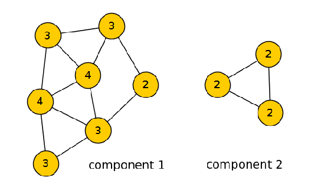
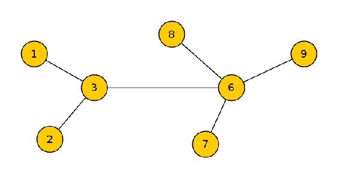

# 九、扩展数据科学

到目前为止，我们已经讲述了许多关于数据科学的材料，我们学习了如何在 Java 中进行监督和非监督学习，如何执行文本挖掘，使用 XGBoost 和训练深度神经网络。然而，到目前为止，我们使用的大多数方法和技术都是在假设所有数据都可以存储在内存中的情况下，设计在单台机器上运行的。您应该已经知道，这是经常发生的情况:有非常大的数据集是不可能用传统的技术在典型的硬件上处理的。

在这一章中，我们将看到如何处理这样的数据集——我们将看到允许在几台机器上处理数据的工具。我们将讨论两个用例:一个是来自普通抓取的大规模 HTML 处理——网页的拷贝，另一个是社交网络的链接预测。

我们将讨论以下主题:

*   Apache Hadoop MapReduce
*   通用爬网处理
*   阿帕奇火花
*   链接预测
*   Spark GraphFrame 和 MLlib 库
*   Apache Spark 上的 XGBoost

在本章结束时，你将学会如何使用 Hadoop 从普通抓取中提取数据，如何使用 Apache Spark 进行链接预测，以及如何在 Spark 中使用 XGBoost。


# Apache Hadoop

Apache Hadoop 是一套工具，允许您将数据处理管道扩展到数千台机器。它包括:

*   Hadoop MapReduce :这是一个数据处理框架
*   HDFS: 这是一个分布式文件系统，允许我们在多台机器上存储数据
*   **YARN:** 这是 MapReduce 等作业的执行程序

我们将只讨论 MapReduce，因为它是 Hadoop 的核心，并且与数据处理相关。我们不会讨论其余的内容，也不会讨论如何设置或配置 Hadoop 集群，因为这已经超出了本书的范围。如果你有兴趣了解更多，由*汤姆·怀特*撰写的 *Hadoop:权威指南*是一本深入学习这个主题的优秀书籍。

在我们的实验中，我们将使用本地模式，也就是说，我们将模拟集群，但仍然在本地机器上运行代码。这对于测试非常有用，一旦我们确定它能够正常工作，就可以将其部署到集群中，无需任何更改。


# Hadoop MapReduce

正如我们已经说过的，Hadoop MapReduce 是一个库，它允许您以可扩展的方式处理数据。

MapReduce 框架中有两个主要的抽象:Map 和 Reduce。这个想法最初来自函数式编程范例，其中`map`和`reduce`是高级函数:

*   `map`:它接受一个函数和一系列元素，并依次将函数应用于每个元素。结果是一个新的序列。
*   `reduce`:它也接受一个函数和一个序列，并使用这个函数处理序列，最终返回一个元素。

在本书中，我们已经相当广泛地使用了来自 Java Stream API 的 map 函数，从第二章、*数据处理工具箱*开始，所以你现在一定对它相当熟悉了。

在 Hadoop MapReduce 中，`map`和`reduce`函数与其前辈有些不同:

*   Map 接受一个元素并返回许多键值对。它可以不返回任何东西，也可以返回一个或几个这样的对，所以它比`map`更`flatMap`
*   然后通过排序将输出按关键字分组
*   最后，`reduce`接受一个组，并为每个组输出一些键-值对

通常，MapReduce 以单词计数为例进行说明:给定一个文本，我们希望计算每个单词在文本中出现的次数。解决方案如下:

*   `map`接收文本，然后将其标记化，并为每个标记输出一对`(token, 1)`，其中`token`是密钥，`1`是关联值。
*   `reducer`对所有 1 求和，这是最终计数。

我们将实现类似的东西:我们将为语料库中的每个标记创建 TF-IDF 向量，而不仅仅是计数单词。但是首先，我们需要从某个地方获取大量的文本数据。我们将使用公共爬网数据集，它包含网站的副本。


# 普通爬行

通用抓取([http://commoncrawl.org/](http://commoncrawl.org/))是过去七年从互联网上抓取的数据的储存库。它非常大，而且每个人都可以下载和分析。

当然，我们不可能全部使用它:即使一小部分也是如此之大，以至于需要一个大而强大的集群来处理它。在这一章中，将从 2016 年底的几个档案中，摘录文字 ting TF-IDF。

下载数据并不复杂，你可以在[http://commoncrawl.org/the-data/get-started/](http://commoncrawl.org/the-data/get-started/)找到说明。这些数据已经存在于 S3 的存储中，因此 AWS 用户可以很容易地访问它们。然而，在这一章中，我们将通过 HTTP 下载一部分通用爬网，而不使用 AWS。

在撰写本文时，最近的数据来自 2016 年 12 月，位于`s3://commoncrawl/crawl-data/CC-MAIN-2016-50`。按照说明，我们首先需要获得本月各个归档文件的所有路径，它们存储在一个`warc.paths.gz`文件中。所以，在我们的例子中，我们对`s3://commoncrawl/crawl-data/CC-MAIN-2016-50/warc.paths.gz`感兴趣。

因为我们不打算使用 AWS，所以我们需要将它转换成可以通过 HTTP 下载的路径。为此，我们将`s3://commoncrawl/`替换为`https://commoncrawl.s3.amazonaws.com`:

```
wget https://commoncrawl.s3.amazonaws.com/crawl-data/CC-MAIN-2016-50/warc.paths.gz

```

让我们看看文件:

```
zcat warc.paths.gz | head -n 3

```

你会看到很多这样的行(为了简洁省略了后缀):

```
.../CC-MAIN-20161202170900-00000-ip-10-31-129-80.ec2.internal.warc.gz
.../CC-MAIN-20161202170900-00001-ip-10-31-129-80.ec2.internal.warc.gz
.../CC-MAIN-20161202170900-00002-ip-10-31-129-80.ec2.internal.warc.gz

```

为了通过 HTTP 下载它，我们再次需要将[https://commoncrawl.s3.amazonaws.com/](https://commoncrawl.s3.amazonaws.com/)附加到这个文件的每一行。这可以通过 awk 轻松实现:

```
zcat warc.paths.gz 
  | head 
  | awk '{ print "https://commoncrawl.s3.amazonaws.com/" $0}' 
  > files.txt

```

现在我们有了这个文件的前 10 个 URL，所以我们可以下载它们:

```
for url in $(cat files.txt); do
  wget $url;
done

```

为了加快速度，我们可以用 gnu-parallel 并行下载文件:

```
cat files.txt | parallel --gnu "wget {}"

```

现在我们已经下载了一些较大的数据:大约 10 个文件，每个 1GB。请注意，路径文件中大约有 50，000 行，仅 12 月份就有大约 50，000 GBs 的数据。这是大量的数据，每个人都可以在任何时候使用它！我们不会用光所有的文件，只会集中在我们已经下载的 10 个文件上。让我们用 Hadoop 来处理它们。

第一步很正常:我们需要在`.pom`文件中指定对 Hadoop 的依赖:

```
<dependency>
  <groupId>org.apache.hadoop</groupId>
  <artifactId>hadoop-client</artifactId>
  <version>2.7.3</version>
</dependency>
<dependency>
  <groupId>org.apache.hadoop</groupId>
  <artifactId>hadoop-common</artifactId>
  <version>2.7.3</version>
</dependency>

```

通用爬网使用 WARC 来存储 HTML 数据:这是一种存储爬网数据的特殊格式。为了能够处理它，我们需要添加一个特殊的库来读取它:

```
<dependency>
  <groupId>org.netpreserve.commons</groupId>
  <artifactId>webarchive-commons</artifactId>
  <version>1.1.2</version>
</dependency>

```

接下来，我们需要告诉 Hadoop 如何使用这样的文件。为此，程序员通常需要提供`FileRecordReader`和`FileImportFormat`类的实现。幸运的是，有开源的实现，我们可以复制并粘贴到我们的项目中。其中一个在`org.commoncrawl.warc`包装的[https://github.com/Smerity/cc-warc-examples](https://github.com/Smerity/cc-warc-examples)有售。所以我们只是从那里复制`WARCFileInputFormat`和`WARCFileRecordReader`到我们的项目中。该代码也包含在本书的代码包中，以防存储库被删除。

有了这些，我们就可以开始编码了。首先，我们需要创建一个`Job`类:它指定将使用哪个映射器和缩减器类来运行作业，并允许我们配置如何执行该作业。所以，让我们创建一个`WarcPreparationJob`类，它扩展了`Configured`类并实现了`Tool`接口:

```
public class WarcPreparationJob extends Configured implements Tool {
    public static void main(String[] args) throws Exception {
        int res = ToolRunner.run(new Configuration(), 
              new WarcPreparationJob(), args);
        System.exit(res);
    }

    public int run(String[] args) throws Exception {
        // implementation goes here
    }
}

```

用于`Tool`接口的 Java 文档信息丰富，详细描述了如何实现这样一个`Job`类:它覆盖了`run`方法，在这里它应该指定输入和输出路径以及映射器和缩减器类。

我们将稍微修改这段代码:首先，我们将有一个只有地图的作业，所以我们不需要一个缩减器。此外，因为我们正在处理文本，所以压缩输出是有用的。所以，让我们用下面的代码创建`run`方法。首先，我们创建一个`Job`类:

```
Job job = Job.getInstance(getConf());

```

现在我们来看看输入及其格式(在我们的例子中是 WARC):

```
Path inputPath = new Path(args[0]);
FileInputFormat.addInputPath(job, inputPath);
job.setInputFormatClass(WARCFileInputFormat.class);

```

接下来，我们指定输出，它是 gzipped 文本:

```
Path outputPath = new Path(args[1];
TextOutputFormat.setOutputPath(job, outputPath);
TextOutputFormat.setCompressOutput(job, true);
TextOutputFormat.setOutputCompressorClass(job, GzipCodec.class);
job.setOutputFormatClass(TextOutputFormat.class);

```

通常，输出是键-值对，但是因为我们只想处理 WARC 并从中提取文本，所以我们只输出一个键，没有值:

```
job.setOutputKeyClass(Text.class);
job.setOutputValueClass(NullWritable.class);

```

最后，我们指定了映射器类，并说将没有缩减器:

```
job.setMapperClass(WarcPreparationMapper.class);
job.setNumReduceTasks(0);

```

现在，当我们指定了作业后，我们可以实现映射器类- `WarcPreparationMapper`。这个类应该扩展`Mapper`类。所有的映射器都应该实现`map`方法，所以我们的映射器应该有如下的轮廓:

```
public class WarcPreparationMapper extends 
        Mapper<Text, ArchiveReader, Text, NullWritable> {

   @Override
   protected void map(Text input, ArchiveReader archive, Context context) 
             throws IOException, InterruptedException {
       // implementation goes here
   }

}

```

`map`方法接收一个带有记录集合的 WARC `archive`，所以我们想要处理所有记录。因此，我们把下面的`map`法:

```
for (ArchiveRecord record : archive) {
    process(record, context);
}

```

process 方法执行以下操作:从记录中提取 HTML，然后从 HTML 中提取文本，对其进行标记，最后将结果写入输出。在代码中，它看起来像这样:

```
String url = record.getHeader().getUrl();
String html = TextUtils.extractHtml(record);
String text = TextUtils.extractText(html);
List<String> tokens = TextUtils.tokenize(text);
String result = url + "t" + String.join(" ", tokens);
context.write(new Text(result), NullWritable.get());

```

在里面我们使用了三个助手函数:`extractHtml`、`extractText`和`tokenize`。后两个(`exctractHtml`和`tokenize`)我们已经用过几次了，所以省略它们的实现；参考[第 6 章](43d5078e-805b-4e29-a527-ed11fa96c4b2.xhtml)、*处理文本-自然语言处理和信息检索*。

第一个是`extractHtml`，包含以下代码:

```
byte[] rawData = IOUtils.toByteArray(r, r.available());
String rawContent = new String(rawData, "UTF-8");
String[] split = rawContent.split("(r?n){2}", 2);
String html = split[1].trim();

```

它使用 UTF-8 编码(有时可能不理想，因为不是互联网上的所有页面都使用 UTF-8 编码)将来自存档的数据转换为`String`，然后删除响应头，只保留剩余的 HTML。

最后，为了运行这些类，我们可以使用下面的代码:

```
String[] args = { /data/cc_warc", "/data/cc_warc_processed" };
ToolRunner.run(new Configuration(), new WarcPreparationJob(), args);

```

这里，我们手动指定“命令行”参数(在 main 方法中获得的参数)，并将它们传递给`ToolRunner`类，该类可以在本地模型中运行 Hadoop 作业。

结果可能有色情内容。由于 Common Crawl 是对 Web 的复制，而且互联网上有大量的色情网站，所以很有可能你会在处理后的结果中看到一些色情文字。通过保留一个特殊的色情关键词列表，并丢弃所有包含这些词的文档，可以很容易地将其过滤掉。

运行此作业后，您将看到结果中有大量不同的语言。如果我们对特定的语言感兴趣，那么我们可以自动检测文档的语言，并且只保留那些我们感兴趣的语言的文档。

几个可以进行语言检测的 Java 库。其中之一是 language-detector，它可以通过下面的依赖片段包含在我们的项目中:

```
<dependency>
  <groupId>com.optimaize.languagedetector</groupId>
  <artifactId>language-detector</artifactId>
  <version>0.5</version>
</dependency>

```

毫不奇怪，这个库使用机器学习来检测语言。因此，要使用它，我们需要做的第一件事是加载模型:

```
List<LanguageProfile> languageProfiles =
        new LanguageProfileReader().readAllBuiltIn();
LanguageDetector detector = LanguageDetectorBuilder.create(NgramExtractors.standard())
        .withProfiles(languageProfiles)
        .build();

```

我们可以这样使用它:

```
Optional<LdLocale> result = detector.detect(text);
String language = "unk";
if (result.isPresent()) {
    language = result.get().getLanguage();
}

```

这样，我们可以只保留英语(或任何其他语言)的文章，而丢弃其他的。因此，让我们从下载的文件中提取文本:

```
String lang = detectLanguage(text.get());
if (lang.equals("en")) {
    // process the data
}

```

这里，`detectLanguage`是一个方法，它包含了检测文本语言的代码:我们之前写了这个代码。

一旦我们处理了 WARC 文件并从中提取了文本，我们就可以为语料库中的每个令牌计算 IDF。为此，我们需要首先计算测向文档频率。这与字数统计示例非常相似:

*   首先，我们需要一个为文档中每个不同的单词输出`1`的`mapper`
*   然后`reducer`将所有的数字相加，得出最终的数字

该作业将处理我们刚刚从通用爬网解析的文档。

让我们创建映射器。它将在`map`方法中包含以下代码:

```
String doc = value.toString();
String[] split = doc.split("t");
String joinedTokens = split[1];
Set<String> tokens = Sets.newHashSet(joinedTokens.split(" "));
LongWritable one = new LongWritable(1);

for (String token : tokens) {
    context.write(new Text(token), one);
}

```

映射器的输入是一个`Text`对象(名为`value`，它包含 URL 和令牌。我们使用`HashSet`分割令牌，只保留不同的令牌。最后，对于每个不同的令牌，我们编写`1`。

为了计算 IDF，我们通常需要知道 *N* :我们语料库中的文档数量。有两种方法可以得到它。首先，我们可以使用计数器:创建一个计数器，并为每个成功处理的文档递增。这很容易做到。

第一步是用我们希望在应用程序中使用的可能计数器创建一个特殊的`enum`。因为我们只需要一种类型的计数器，所以我们创建了一个只有一个元素的`enum`:

```
public static enum Counter {
    DOCUMENTS;
}

```

第二步是使用`context.getCounter()`方法并递增计数器:

```
context.getCounter(Counter.DOCUMENTS).increment(1);

```

一旦作业结束，我们可以用下面的代码获得计数器的值:

```
Counters counters = job.getCounters();
long count = counters.findCounter(Counter.DOCUMENTS).getValue();

```

但是还有另一种选择:我们可以选择一个大的数字，并将其用作文档的数量。通常不需要精确，因为所有令牌的 IDF 共享相同的 *N* 。

现在，让我们继续进行`reducer`。由于映射器输出`Text`和一个 long(通过`LongWritable`)，缩减器得到一个`Text`和一个`LongWritable`类上的 iterable 这是令牌和一堆 1。我们能做的只是对它们求和:

```
long sum = 0;
for (LongWritable cnt : values) {
    sum = sum + cnt.get();
}

```

为了只保留频繁出现的单词，我们可以添加一个过滤器，丢弃所有不常用的单词，使结果明显变小:

```
if (sum > 100) {
    context.write(key, new LongWritable(sum));
}

```

然后，我们的`job`类中运行它的代码将如下所示:

```
job.setInputFormatClass(TextInputFormat.class);
job.setOutputFormatClass(TextOutputFormat.class);
job.setOutputKeyClass(Text.class);
job.setOutputValueClass(LongWritable.class);

job.setMapperClass(DocumentFrequencyMapper.class);
job.setCombinerClass(DocumentFrequencyReducer.class);
job.setReducerClass(DocumentFrequencyReducer.class);

```

请注意，我们不仅设置了 mapper 和 reducer，还指定了一个合并器:这允许我们预聚合一些我们在 mapper 中输出的`1`,并且花费更少的时间对数据进行排序并在网络中发送结果。

最后，要将文档转换为 TF-IDF，我们可以创建第三个作业，再次使用 reduce-less，它将读取第一个作业的结果(在那里我们处理了 WARC 文件),并应用第二个作业的 IDF 权重。

我们希望第二个作业的输出应该非常小，以适合内存，所以我们可以做的是将文件发送到所有的映射器，在初始化期间读取它，然后检查已处理的 WARC 和先前的行。

`job`类的主要部分是一样的:我们输入，输出是`Text`——输出被压缩，reducer 任务数是`0`。

现在我们需要将`df`任务的结果发送给所有的映射器。这是通过缓存文件完成的:

```
Path dfInputPath = new Path(args[3]);
job.addCacheFile(new URI(dfInputPath.toUri() + "#df"));

```

因此，我们在这里指定了`df`作业结果的路径，然后将其放入缓存文件。注意最后的`#df`:这是我们稍后访问文件时使用的别名。

在映射器中，我们可以将所有结果读入一个映射(在设置方法中):

```
dfs = new HashMap<>();
File dir = new File("./df");
for (File file : dir.listFiles()) {
    try (FileInputStream is = FileUtils.openInputStream(file)) {
        LineIterator lines = IOUtils.lineIterator(is, StandardCharsets.UTF_8);
        while (lines.hasNext()) {
            String line = lines.next();
            String[] split = line.split("t");
            dfs.put(split[0], Integer.parseInt(split[1]));
        }
    }
}

```

这里，`df`是我们赋予结果文件的别名，它实际上是一个文件夹，而不是一个文件。因此，为了得到结果，我们需要检查文件夹中的每个文件，逐行读取它们，并将结果放入一个映射中。然后，我们可以在应用 IDF 权重的 map 方法中使用计数字典:

```
String doc = value.toString();
String[] split = doc.split("t");
String url = split[0];
List<String> tokens = Arrays.asList(split[1].split(" "));
Multiset<String> counts = HashMultiset.create(tokens);
String tfIdfTokens = counts.entrySet().stream()
        .map(e -> toTfIdf(dfs, e))
        .collect(Collectors.joining(" "));
Text output = new Text(url + "t" + tfIdfTokens);
context.write(output, NullWritable.get());

```

在这里，我们使用标记并使用`Multiset`来计算术语频率。接下来，我们在`toTfIdf`函数中将 TF 乘以 IDF:

```
String token = e.getElement();
int tf = e.getCount();
int df = dfs.getOrDefault(token, 100);
double idf = LOG_N - Math.log(df);
String result = String.format("%s:%.5f", token, tf * idf);

```

在这里，我们获得了`Multiset`的每个输入条目的 DF(文档频率)，如果该标记不在我们的字典中，我们假设它相当罕见，因此我们为它指定默认 of 100。接下来我们算 IDF，最后算`tf*idf`。为了计算 IDF，我们使用`LOG_N`，它是我们设置为`Math.log(1_000_000)`的常数。

对于这个例子，一百万被选作文档的数量。即使文档的实际数量更少(大约 5k)，但对于所有的令牌来说都是一样的。更重要的是，如果我们决定向索引中添加更多的文档，我们仍然可以使用相同的 *N* 而不用担心重新计算所有的内容。

这会产生如下所示的输出:

```
http://url.com/        flavors:9.21034 gluten:9.21034 specialty:14.28197 salad:18.36156 ...

```

您一定注意到了，每个作业的输出都保存在磁盘上。如果我们有多个任务，就像我们以前做的那样，我们需要读取数据，处理数据，然后保存回来。I/O 的开销很大，所以其中一些步骤是中间的，我们不需要保存结果。在 Hadoop 中，这是无法避免的，这就是为什么它有时会非常慢，并且会产生大量 I/O 开销。

幸运的是，有另一个库可以解决这个问题:Apache Spark。


# 阿帕奇火花

Apache Spark 是一个用于可伸缩数据处理的框架。它被设计得比 Hadoop 更好:它试图在内存中处理数据，而不是将中间结果保存在磁盘上。此外，它有更多的操作，不仅仅是 map 和 reduce，因此有更丰富的 API。

Apache Spark 中的主要抽象单元是**弹性分布式数据集** ( **RDD** )，它是元素的分布式集合。与通常的集合或流的关键区别在于，rdd 可以在多台机器上并行处理，处理 Hadoop 作业的方式也是如此。

我们可以对 rdd 应用两种类型的操作:转换和操作。

*   **转换**:顾名思义，它只是把数据从一种形式变成另一种形式。作为输入，它们接收一个 RDD，同时也输出一个 RDD。诸如 map、flatMap 或 filter 之类的操作是变换操作的示例。
*   **动作**:这些接受一个 RDD 并产生其他东西，例如一个值、一个列表或一个地图，或者保存结果。动作的例子是计数和减少。

像在 Java Steam API 中一样，转换是懒惰的:它们不是立即执行的，而是链接在一起并一次性计算，不需要将中间结果保存到磁盘。在 Steam API 中，链是通过收集流来触发的，在 Spark 中也是如此:当我们执行一个动作时，这个特定动作所需的所有转换都会被执行。另一方面，如果一些转换是不需要的，那么它们将永远不会被执行，这就是为什么它们被称为*懒惰。*

所以让我们从 Spark 开始，首先将它的依赖项包含到`.pom`文件中:

```
<dependency>
  <groupId>org.apache.spark</groupId>
  <artifactId>spark-core_2.11</artifactId>
  <version>2.1.0</version>
</dependency>

```

在本节中，我们将使用它来计算 TF-IDF:因此我们将尝试重现我们刚刚为 Hadoop 编写的算法。

第一步是创建配置和上下文:

```
SparkConf conf = new SparkConf().setAppName("tfidf").setMaster("local[*]");
JavaSparkContext sc = new JavaSparkContext(conf);

```

这里，我们指定了 Spark 应用程序的名称以及它将连接到的服务器 URL。因为我们在本地模式下运行 Spark，所以我们把`local[*]`。这意味着我们建立一个本地服务器，并创建尽可能多的本地工人。

Spark 依赖于一些 Hadoop 实用程序，这使得它更难在 Windows 上运行。如果在 Windows 下运行，可能会遇到找不到 Spark 和 Hadoop 需要的`winutils.exe`文件的问题。要解决这个问题，请执行以下操作:

*   为 Hadoop 文件创建一个文件夹，例如`c:/tmp/hadoop`(确保路径中没有空格)
*   从[http://public-repo-1 . Horton works . com/HDP-win-alpha/winutils . exe](http://public-repo-1.hortonworks.com/hdp-win-alpha/winutils.exe)下载`winutils.exe`
*   将文件放入文件夹`c:/tmp/hadoop/bin`——注意`bin`子目录。
*   将`HADOOP_HOME`环境变量设置为`c:/tmp/hadoop`，或者使用以下代码:

```
System.setProperty("hadoop.home.dir", "c:/tmp/hadoop");

```

这应该能解决问题。

下一步是读取文本文件，这是我们在处理了常见的爬网文件后用 Hadoop 创建的。我们来读一下:

```
JavaRDD<String> textFile = sc.textFile("C:/tmp/warc");

```

要查看文件，我们可以使用 take 函数，该函数从 RDD 中返回前 10 个元素，然后我们将每一行打印到 stdout:

```
textFile.take(10).forEach(System.out::println);

```

现在，我们可以逐行读取文件，对于每个文档，输出它具有的所有不同的标记:

```
JavaPairRDD<String, Integer> dfRdd = textFile
    .flatMap(line -> distinctTokens(line))
   .mapToPair(t -> new Tuple2<>(t, 1))
   .reduceByKey((a, b) -> a + b)
   .filter(t -> t._2 >= 100);

```

这里，`distinctToken`是一个函数，它拆分行并将所有的记号放入一个集合中，只保留不同的记号。下面是它的实现方式:

```
private static Iterator<String> distinctTokens(String line) {
    String[] split = line.split("t");
   Set<String> tokens = Sets.newHashSet(split[1].split(" "));
   return tokens.iterator();
}

```

`flatMap`函数需要返回一个迭代器，所以我们在最后调用集合上的迭代器方法。

接下来，我们将每一行转换成一个元组:需要这一步来告诉 Spark 我们有了键值对，所以像`reduceByKey`和`groupByKey`这样的函数是可用的。最后，我们用与之前在 Hadoop 中相同的实现来调用`reduceByKey`方法。在转换链的末尾，我们应用过滤器只保留足够频繁的令牌。

您可能已经注意到，与我们之前编写的 Hadoop 相比，这段代码非常简单。

现在我们可以将所有的结果放入一个`Map`中:因为我们应用了过滤，所以我们期望字典应该很容易放入一个内存中，即使是在普通的硬件上。我们通过使用`collectAsMap`函数来实现:

```
Map<String, Integer> dfs = dfRdd.collectAsMap();

```

最后，我们再次检查所有文档，这次将 TF-IDF 加权方案应用于所有令牌:

```
JavaRDD<String> tfIdfRdd = textFile.map(line -> {
    String[] split = line.split("t");
    String url = split[0];
    List<String> tokens = Arrays.asList(split[1].split(" "));
    Multiset<String> counts = HashMultiset.create(tokens);

    String tfIdfTokens = counts.entrySet().stream()
           .map(e -> toTfIdf(dfs, e))
           .collect(Collectors.joining(" "));

    return url + "t" + tfIdfTokens;
});

```

我们像以前一样解析输入，并使用来自 Guava 的`Multiset`来计算 TF。`toTfIdf`函数与之前完全相同:它从`Multiset`接收一个条目，通过 IDF 对其进行加权，并输出一个`token:weight`格式的字符串。

为了查看结果，我们可以从 RDD 中取出前 10 个令牌，并将其打印到 stdout:

```
tfIdfRdd.take(10).forEach(System.out::println);

```

最后，我们使用`saveAsTextFile`方法将结果保存到文本文件中:

```
tfIdfRdd.saveAsTextFile("c:/tmp/warc-tfidf");

```

正如我们所见，我们可以用少得多的代码在 Spark 中做同样的事情。更重要的是，它的效率也更高:它不需要在每一步之后都将结果保存到磁盘上，而是动态地应用所有需要的转换。这使得 Spark 在许多应用程序上比 Hadoop 快得多。

但是，也有 Hadoop 优于 Spark 的情况。Spark 试图将所有东西都保存在内存中，有时会因为这个和`OutOfMemoryException`一起失败。Hadoop 要简单得多:它所做的只是写入文件，然后对数据执行大型分布式合并排序。也就是说，一般来说，你应该更喜欢 Apache Spark 而不是 Hadoop MapReduce，因为 Hadoop 速度较慢且相当冗长。

在下一节中，我们将看到如何使用 Apache Spark 及其图形处理和机器学习库来解决链接预测问题。


# 链接预测

链路预测是预测网络中会出现哪些链路的问题。例如，我们可以在脸书或另一个社交网络中有一个友谊图，像你可能认识的人这样的功能*是链接预测的一个应用。因此，我们可以看到链接预测是一个社交网络推荐系统。*

 *对于这个问题，我们需要找到一个数据集，其中包含一个随时间演变的图。然后，我们可以考虑这样一个图在其演变过程中的某个时刻，计算现有链接之间的一些特征，并以此为基础，预测接下来可能会出现哪些链接。因为对于这样的图，我们知道未来，我们可以使用这种知识来评估我们的模型的性能。

有许多有趣的数据集可用，但不幸的是，它们中的大多数都没有与边相关联的时间，因此不可能看到这些图表是如何随着时间的推移而发展的。这使得测试方法更加困难，但是，当然，没有时间维度也是可能的。

幸运的是，有一些带有时间戳边的数据集。对于这一章，我们将使用基于 DBLP([http://dblp.uni-trier.de/](http://dblp.uni-trier.de/))数据的合著图，这是一个索引计算机科学论文的搜索引擎。该数据集可从[http://projects.csail.mit.edu/dnd/DBLP/](http://projects.csail.mit.edu/dnd/DBLP/)(`dblp_coauthorship.json.gz`文件)获得，它包括 1938 年至 2015 年的论文。它已经以图表的形式出现了:每条边是一对一起发表论文的作者，每条边还包含他们发表论文的年份。

该文件的前几行如下所示:

```
[
["Alin Deutsch", "Mary F. Fernandez", 1998],
["Alin Deutsch", "Daniela Florescu", 1998],
["Alin Deutsch", "Alon Y. Levy", 1998],
["Alin Deutsch", "Dan Suciu", 1998],
["Mary F. Fernandez", "Daniela Florescu", 1998],

```

让我们使用这个数据集来建立一个模型，该模型将预测谁很可能在未来成为合著者。这种模型的应用之一可以是推荐系统:对于每个作者，它可以建议可能的合作作者。* *<title>Unknown</title>  <link href="../stylesheet.css" rel="stylesheet" type="text/css"> <link href="../page_styles.css" rel="stylesheet" type="text/css">

# 阅读 DBLP 图表

从这个项目开始，我们首先需要读取图形数据，为此，我们将使用 Apache Spark 和它的一些库。第一个库是 Spark Data frames，它类似于 R data frames、pandas 或 joinery，只是它们是分布式的，基于 RDDs。

让我们来看看这个数据集。第一步是创建一个特殊的类`Edge`来存储数据:

```
public class Edge implements Serializable {
    private final String node1;
    private final String node2;
    private final int year;
    // constructor and setters omitted
}

```

现在，让我们来读数据:

```
SparkConf conf = new SparkConf().setAppName("graph").setMaster("local[*]");
JavaSparkContext sc = new JavaSparkContext(conf);
JavaRDD<String> edgeFile = sc.textFile("/data/dblp/dblp_coauthorship.json.gz");

JavaRDD<Edge> edges = edgeFile.filter(s -> s.length() > 1).map(s -> {
    Object[] array = JSON.std.arrayFrom(s);

    String node1 = (String) array[0];
    String node2 = (String) array[1];
    Integer year = (Integer) array[2];

    if (year == null) {
        return new Edge(node1, node2, -1);
    }

    return new Edge(node1, node2, year);
});

```

设置完上下文后，我们从一个文本文件中读取数据，然后对每一行应用一个 map 函数，将其转换为`Edge`。为了解析 JSON，我们像前面一样使用 Jackson-Jr 库，所以确保将它添加到 pom 文件中。

注意，我们在这里还包含了一个`filter`:第一行和最后一行分别包含了`[`和`]`，所以我们需要跳过它们。

为了检查我们是否成功地解析了数据，我们可以使用 take 方法:它获取 RDD 的头部并将其放入一个`List`，我们可以将它打印到控制台:

```
edges.take(5).forEach(System.out::println);

```

这将产生以下输出:

```
Edge [node1=Alin Deutsch, node2=Mary F. Fernandez, year=1998]
Edge [node1=Alin Deutsch, node2=Daniela Florescu, year=1998]
Edge [node1=Alin Deutsch, node2=Alon Y. Levy, year=1998]
Edge [node1=Alin Deutsch, node2=Dan Suciu, year=1998]
Edge [node1=Mary F. Fernandez, node2=Daniela Florescu, year=1998]

```

成功转换数据后，我们会将其放入数据框中。为此，我们将使用 Spark DataFrame，它是 Spark-SQL 包的一部分。我们可以通过以下依赖关系来包含它:

```
<dependency>
  <groupId>org.apache.spark</groupId>
  <artifactId>spark-sql_2.11</artifactId>
  <version>2.1.0</version>
</dependency>

```

为了从我们的`RDD`创建一个`DataFrame`，我们首先创建一个 SQL 会话，然后使用它的`createDataFrame`方法:

```
SparkSession sql = new SparkSession(sc.sc());
Dataset<Row> df = sql.createDataFrame(edges, Edge.class);

```

数据集中有相当多的论文。我们可以通过将它限制为仅在`1990.`发表的论文来缩小它，为此我们可以使用`filter`方法:

```
df = df.filter("year >= 1990");

```

接下来，很多作者可以有多篇论文在一起，我们感兴趣的是最早的一篇。我们可以使用`min`函数得到它:

```
df = df.groupBy("node1", "node2")
       .min("year")
       .withColumnRenamed("min(year)", "year");

```

当我们应用 min 函数时，该列被重命名为`min(year)`，所以我们通过用`withColumnRenamed`函数将该列重命名回`year`来修复它。

为了建立任何机器学习模型，我们总是需要指定一个训练/测试分割。这个案例也不例外，所以我们把 2013 年之前的所有数据作为训练部分，之后的所有论文作为测试:

```
Dataset<Row> train = df.filter("year <= 2013");
Dataset<Row> test = df.filter("year >= 2014");

```

现在，我们可以开始提取一些将用于创建模型的特征。


# 从图中提取特征

我们需要提取一些特征，然后放入机器学习模型进行训练。对于这个数据集，我们拥有的所有信息就是图表本身，仅此而已:我们没有任何外部信息，比如作者的从属关系。当然，如果我们有，加到模型里也没问题。所以我们来讨论一下，单独从图中可以提取哪些特征。

对于图模型，可以有两种特征:节点特征(作者)和边特征(合著关系)。

我们可以从图节点中提取许多可能的特征。例如，除其他外，我们可以考虑以下情况:

*   **度**:这是这个作者拥有的合著者数量。
*   **页面排名**:这是一个节点的重要性。

让我们看看下图:



这里我们有两个连接的组件，节点上的数字指定了节点的度数，或者它有多少个连接。

在某种程度上，程度衡量一个节点的重要性(或中心性):它拥有的连接越多，重要性就越高。页面排名(也称为特征向量中心性)是另一种衡量重要性的方法。你可能听说过 Page Rank——它被 Google 用作排名公式的组成部分之一。网页排名背后的主要思想是，如果一个网页链接到其他重要的网页，它也必须是重要的。有时使用 Chei Rank 也是有意义的，它是页面等级的反向——它不看进来的边，而是看出去的边。

然而，我们的图是无向的:如果 *A* 和 *B* 是合著者，那么 *B* 和 *A* 也是合著者。所以，在我们的例子中，Page Rank 和 Chei Rank 是完全相同的。

还有其他一些重要的度量，比如接近中心性或中间中心性，但我们不会在本章中考虑它们。

此外，我们可以查看节点的连通分量:如果两个节点来自不同的连通分量，通常很难预测它们之间是否会有链接。(当然，如果我们包括其他特征，而不仅仅是我们可以从图中提取的特征，这就变得可能了。)

图也有边，我们可以从中提取很多信息来构建我们的模型。例如，我们可以考虑以下特征:

*   **共同好友**:这是共同作者的数量
*   **好友总数**:这是两位作者拥有的不同合著者的总数
*   **Jaccard 相似度**:这是合著者集合的 Jaccard 相似度
*   **基于节点的特征**这是每个节点的页面排名的差异，最小和最大程度，等等

当然，我们可以包括许多其他特征，例如，两个作者之间的最短路径的长度应该是一个很强的预测因素，但是计算它通常需要很多时间。


# 节点特征

让我们首先集中于我们可以用来计算图的节点的特征。为此，我们将需要一个图形库，让我们能够轻松地计算图形特征，如程度或页面排名。对于 Apache Spark，这样的库就是 GraphX。然而，目前这个库只支持 Scala:它使用了很多 Scala 特有的特性，这使得从 Java 中使用它变得非常困难(而且经常是不可能的)。

然而，还有另一个名为 GraphFrames 的库，它试图将 GraphX 与 DataFrames 结合起来。幸运的是，它支持 Java。这个包在 Maven Central 上不可用，要使用它，我们首先需要将下面的存储库添加到我们的`pom.xml`:

```
<repository>
  <id>bintray-spark</id>
  <url>https://dl.bintray.com/spark-packages/maven/</url>
</repository>

```

接下来，让我们包括库:

```
<dependency>
  <groupId>graphframes</groupId>
  <artifactId>graphframes</artifactId>
  <version>0.3.0-spark2.0-s_2.11</version>
</dependency>

```

我们还需要添加 GraphX 依赖项，因为 GraphFrames 依赖于它:

```
<dependency>
  <groupId>org.apache.spark</groupId>
  <artifactId>spark-graphx_2.11</artifactId>
  <version>2.1.0</version>
</dependency>

```

GraphFrames 库目前正在积极开发中，将来很可能会更改一些方法名。如果本章中的例子停止工作，请参考 http://graphframes.github.io/的官方文档。

然而，在我们实际使用 GraphFrames 之前，我们需要准备我们的数据，因为它期望数据帧遵循特定的约定。首先，它假设图是有向的，但在我们的例子中不是这样。为了克服这个问题，我们需要添加反向链接。也就是说，我们的数据集中有一个记录`(A, B)`，我们需要添加它的反向记录`(B, A)`。

为此，我们可以重命名数据帧副本的列，然后对原始数据帧使用 union 函数:

```
Dataset<Row> dfReversed = df
        .withColumnRenamed("node1", "tmp")
        .withColumnRenamed("node2", "node1")
        .withColumnRenamed("tmp", "node2")
        .select("node1", "node2", "year")
Dataset<Row> edges = df.union(dfReversed);

```

接下来，我们需要为节点创建一个特殊的`DataFrame`。我们可以通过选择 edges 数据集的`node1`列，然后调用 distinct 函数来实现这一点:

```
Dataset<Row> nodes = edges.select("node1")
        .withColumnRenamed("node1", "node")
        .distinct();

```

GraphFrame 在接受一个带有节点的`DataFrame`时，希望它有一个`id`列，这是我们必须手动创建的。第一种选择是将`node`列重命名为`id`，并将其传递给 GraphFrame。另一种选择是创建代理 id，我们将在这里完成:

```
nodes = nodes.withColumn("id", functions.monotonicallyIncreasingId());

```

对于前面的代码，我们需要添加以下导入:

```
import org.apache.spark.sql.functions;

```

这个`functions`是一个实用程序类，有很多有用的 DataFrame 函数。

要查看所有这些转换后我们的数据帧是什么样子，我们可以使用`show`方法:

```
nodes.show();

```

它将产生以下输出(在此处和所有示例中，被截断为前六行):

```
+--------------------+---+
|                node| id|
+--------------------+---+
|         Dan Olteanu|  0|
|        Manjit Borah|  1|
|    Christoph Elsner|  2|
|         Sagnika Sen|  3|
|          Jerome Yen|  4|
|        Anand Kudari|  5|
|              M. Pan|  6|
+--------------------+---+

```

现在，让我们准备边缘。GraphFrames 要求数据帧有两个特殊的列:`src`和`dst`(分别是*源*和*目的地*)。要获得这些列的值，让我们将它们与节点数据帧连接起来，并获得数字 id:

```
edges = edges.join(nodes, edges.col("node2").equalTo(nodes.col("node")));
edges = edges.drop("node").withColumnRenamed("id", "dst");
edges = edges.join(nodes, edges.col("node1").equalTo(nodes.col("node")));
edges = edges.drop("node").withColumnRenamed("id", "src");

```

它将创建一个包含以下内容的数据帧:

```
+-------------+--------------------+----+-------------+----+
|        node1|               node2|year|          dst| src|
+-------------+--------------------+----+-------------+----+
|A. A. Davydov| Eugene V. Shilnikov|2013|  51539612101|2471|
|A. A. Davydov|      S. V. Sinitsyn|2011| 326417520647|2471|
|A. A. Davydov|      N. Yu. Nalutin|2011| 335007452466|2471|
|A. A. Davydov|        A. V. Bataev|2011| 429496733302|2471|
|A. A. Davydov|Boris N. Chetveru...|2013|1486058685923|2471|
| A. A. Sawant|          M. K. Shah|2011| 231928238662|4514|
| A. A. Sawant|      A. V. Shingala|2011| 644245100670|4514|
+-------------+--------------------+----+-------------+----+

```

最后，我们可以从节点和边数据帧创建`GraphFrame`:

```
GraphFrame gf = GraphFrame.apply(nodes, edges);

```

`GraphFrame`类允许我们使用很多图形算法。例如，计算页面排名非常简单，如下所示:

```
GraphFrame pageRank = gf.pageRank().resetProbability(0.1).maxIter(7).run();
Dataset<Row> pageRankNodes = pageRank.vertices();
pageRankNodes.show();

```

它将创建一个包含以下各列的`DataFrame`:

```
+----+-------------------+
|  id|           pagerank|
+----+-------------------+
|  26| 1.4394843416065657|
|  29|  1.012233852957335|
| 474| 0.7774103396731716|
| 964| 0.4443614094552203|
|1677|  0.274044687604839|
|1697|  0.493174385163372|
+----+-------------------+

```

计算度数甚至更简单:

```
Dataset<Row> degrees = gf.degrees();

```

这行代码将创建一个`DataFrame`与每个节点的度数:

```
+-------------+------+
|           id|degree|
+-------------+------+
| 901943134694|    86|
| 171798692537|     4|
|1589137900148|   114|
|   8589935298|    86|
| 901943133299|    74|
| 292057778121|    14|
+-------------+------+

```

计算连接的组件也是如此:

```
Dataset<Row> cc = gf.connectedComponents().run();

```

它将创建一个`DataFrame`,对于每个节点，我们将获得它所属的连接组件的 ID:

```
+----+---------+
|  id|component|
+----+---------+
|  26|        0|
|  29|        0|
| 474|        0|
| 964|      964|
|1677|        0|
|1697|        0|
+----+---------+

```

正如我们在这里看到的，6 个第一部分中有 5 个是第 0 部分。我们来看看这些组件的大小——可能 0th 是最大的，几乎包含了所有的东西？

为此，我们可以计算每个组件出现的次数:

```
Dataset<Row> cc = connectedComponents.groupBy("component").count();
cc.orderBy(functions.desc("count")).show();

```

我们使用`groupBy`函数，然后调用`count`方法。之后，我们按照 count 列的值以降序对数据帧进行排序。让我们看看输出:

```
+------------+-------+
|   component|  count|
+------------+-------+
|           0|1173137|
| 60129546561|     32|
| 60129543093|     30|
|         722|     29|
| 77309412270|     28|
| 34359740786|     28|
+------------+-------+

```

正如我们所看到的，大多数节点确实来自同一个组件。因此，在这种情况下，关于组件的信息不是很有用:几乎总是组件是`0`。

现在，在计算完节点特征之后，我们需要继续处理边特征。但在此之前，我们首先需要对将要计算这些特征的边进行采样。


# 负采样

在我们计算另一组特征，即边特征之前，我们需要首先指定我们想要为此取哪些边。因此，我们需要选择一组候选边，然后我们将在它们的基础上训练一个模型来预测一个边是否应该属于该图。换句话说，我们首先需要准备一个数据集，其中存在的边被视为正例，不存在的边被视为反例。

获得正面的例子很简单:我们只取所有的边，并给它们分配标签`1`。

对于反面例子来说，就更复杂了:在任何现实生活的图中，正面例子的数量都比反面例子的数量少很多。因此，我们需要找到一种方法来采样负面的例子，以便训练一个模型变得易于管理。

通常，对于链接预测问题，我们考虑两种类型的否定候选:简单的和困难的。简单的只是从相同的连接组件中采样，但困难的是一两跳之遥。因为对于我们的问题，大多数作者来自同一个组件，所以我们可以放松它，从整个图中抽取简单的否定，而不局限于同一个连接组件:



如果我们考虑前面的图，肯定的例子是容易的:我们只得到存在的边`(1, 3)`、`(2, 3)`、`(3, 6)`，等等。对于消极的，有两种类型:`simple`和`hard.`简单的只是从所有可能不存在的边的集合中采样。这里可以是`(1, 8)`、`(2, 7)`，也可以是`(1, 9)`。硬负边缘仅一跳之遥:`(1, 2)`、`(1, 6)`或`(7, 9)`是硬负的可能例子。

在我们的数据集中，我们有大约 600 万个正面的例子。为了保持训练数据或多或少的平衡，我们可以采样大约 1200 万个简单否定和大约 600 万个硬否定。那么正例与反例的比例将是 1/4。

创建正面示例非常简单:我们只需从图表中提取边，并为它们分配`1.0`目标:

```
Dataset<Row> pos = df.drop("year");
pos = pos.join(nodes, pos.col("node1").equalTo(nodes.col("node")));
pos = pos.drop("node", "node1").withColumnRenamed("id", "node1");

pos = pos.join(nodes, pos.col("node2").equalTo(nodes.col("node")));
pos = pos.drop("node", "node2").withColumnRenamed("id", "node2");

pos = pos.withColumn("target", functions.lit(1.0));

```

这里我们做了一些连接，用作者的 id 替换他们的名字。结果如下:

```
+-------------+-----+------+
|        node1|node2|target|
+-------------+-----+------+
|  51539612101| 2471|   1.0|
| 429496733302| 2471|   1.0|
|1486058685923| 2471|   1.0|
|1254130450702| 4514|   1.0|
|  94489280742|  913|   1.0|
|1176821039357|  913|   1.0|
+-------------+-----+------+

```

接下来，我们对容易消极的人进行取样。为此，我们首先从节点的数据帧中抽取两次替换样本，一次针对`node1`，一次针对`node2`。然后，将这些列放在一个数据框中。我们可以这样取样:

```
Dataset<Row> nodeIds = nodes.select("id");
long nodesCount = nodeIds.count();
double fraction = 12_000_000.0 / nodesCount;

Dataset<Row> sample1 = nodeIds.sample(true, fraction, 1);
sample1 = sample1.withColumn("rnd", functions.rand(1))
                 .orderBy("rnd")
                 .drop("rnd");

Dataset<Row> sample2 = nodeIds.sample(true, fraction, 2);
sample2 = sample2.withColumn("rnd", functions.rand(2))
                 .orderBy("rnd")
                 .drop("rnd");

```

这里，fraction 参数指定样本应该包含的`DataFrame`的分数。因为我们想得到 1200 万个例子，所以我们用 1200 万除以我们拥有的节点数。然后，我们通过向每个样本添加一个具有随机数的列来对其进行混洗，并使用它来对`DataFrame`进行排序。在排序完成后，我们不再需要该列，因此可以将其删除。

两个样本可能具有不同的大小，因此我们需要选择最小的一个，然后将两个样本都限制在此大小，这样它们就可以连接起来:

```
long sample1Count = sample1.count();
long sample2Count = sample2.count();

int minSize = (int) Math.min(sample1Count, sample2Count);

sample1 = sample1.limit(minSize);
sample2 = sample2.limit(minSize);

```

接下来，我们要将这两个样本放在一个数据帧中。对于 DataFrame API 来说，没有简单的方法可以做到这一点，所以我们需要使用 rdd。为此，我们将`DataFrame`转换成`JavaRDD`，`zip`它们放在一起，然后将结果转换回单个`DataFrame`:

```
JavaRDD<Row> sample1Rdd = sample1.toJavaRDD();
JavaRDD<Row> sample2Rdd = sample2.toJavaRDD();
JavaRDD<Row> concat = sample1Rdd.zip(sample2Rdd).map(t -> {
    long id1 = t._1.getLong(0);
    long id2 = t._2.getLong(0);
    return RowFactory.create(id1, id2);
});

StructField node1Field = DataTypes.createStructField("node1", DataTypes.LongType, false);
StructField node2Field = DataTypes.createStructField("node2", DataTypes.LongType, false);
StructType schema = DataTypes.createStructType(Arrays.asList(node1Field, node2Field));
Dataset<Row> negSimple = sql.createDataFrame(concat, schema);

```

为了将`RDD`转换成`DataFrame`，我们需要指定一个模式，前面的代码显示了如何做。

最后，我们将目标列添加到这个`DataFrame`:

```
negSimple = negSimple.withColumn("target", functions.lit(0.0));

```

这将产生以下`DataFrame`:

```
+-------------+-------------+------+
|        node1|        node2|target|
+-------------+-------------+------+
| 652835034825|1056561960618|   0.0|
| 386547056678| 446676601330|   0.0|
| 824633725362|1477468756129|   0.0|
|1529008363870| 274877910417|   0.0|
| 395136992117| 944892811576|   0.0|
|1657857381212|1116691503444|   0.0|
+-------------+-------------+------+

```

有可能通过这种方式采样，我们意外地生成了恰好在正例中的配对。但是，这样的概率相当低，可以丢弃。

我们还需要创造一些有力的反面例子——这些例子之间只有一步之遥:


在这个图中，正如我们已经讨论过的，`(1, 2)`、`(1, 6)`或`(7, 9)`对是硬否定例子的例子。

为了得到这样的对子，让我们首先从逻辑上阐明这个想法。我们需要对所有可能的对`(B, C)`进行采样，使得存在一些节点`A`和边`(A, B)`和`(A, C)`都存在，但是没有边`(B, C)`。

当我们以这种方式表述这个采样问题时，用 SQL 来表达就变得很容易了:我们需要做的只是一个自连接，并选择具有相同源但不同目的地的边。考虑下面的例子:

```
SELECT e1.dst as node1, e2.dst as node2
  FROM Edges e1, Edges e2
 WHERE e1.src = e2.src ANDe1.dst <> e2.dst;

```

让我们把它翻译成 Spark DataFrame API。为了进行自连接，我们首先需要创建边`DataFrame`的两个别名，并重命名其中的列:

```
Dataset<Row> e1 = edges.drop("node1", "node2", "year")
        .withColumnRenamed("src", "e1_src")
        .withColumnRenamed("dst", "e1_dst")
        .as("e1");
Dataset<Row> e2 = edges.drop("node1", "node2", "year")
        .withColumnRenamed("src", "e2_src")
        .withColumnRenamed("dst", "e2_dst")
        .as("e2");

```

现在，我们在`dst`不同，但`src`相同的条件下执行连接，然后重命名列，使它们与前面的示例一致:

```
Column diffDest = e1.col("e1_dst").notEqual(e2.col("e2_dst"));
Column sameSrc = e1.col("e1_src").equalTo(e2.col("e2_src"));
Dataset<Row> hardNeg = e1.join(e2, diffDest.and(sameSrc));
hardNeg = hardNeg.select("e1_dst", "e2_dst")
        .withColumnRenamed("e1_dst", "node1")
        .withColumnRenamed("e2_dst", "node2");

```

接下来，我们需要获取前 600 万条生成的边，并将其称为硬样本。然而，Spark 将这个`DataFrame`中的值以某种特定的顺序排列，这可能会在我们的模型中引入偏差。为了降低偏差的危害，让我们在采样过程中增加一些随机性:生成一个包含随机值的列，并只选取值大于某个数字的那些边:

```
hardNeg = hardNeg.withColumn("rnd", functions.rand(0));
hardNeg = hardNeg.filter("rnd >= 0.95").drop("rnd");
hardNeg = hardNeg.limit(6_000_000);
hardNeg = hardNeg.withColumn("target", functions.lit(0.0));

```

之后，我们只取前 6m 边，并添加`target`列。结果遵循与我们之前的示例相同的模式:

```
+------------+-------------+------+
|       node1|        node2|target|
+------------+-------------+------+
| 34359740336| 970662610852|   0.0|
| 34359740336| 987842479409|   0.0|
| 34359740336|1494648621189|   0.0|
| 34359740336|1554778161775|   0.0|
| 42949673538| 326417515499|   0.0|
|266287973882| 781684049287|   0.0|
+------------+-------------+------+

```

用`union`函数将它们放在一起:

```
Dataset<Row> trainEdges = pos.union(negSimple).union(hardNeg);

```

最后，让我们将 ID 与每条边相关联:

```
trainEdges = trainEdges.withColumn("id", functions.monotonicallyIncreasingId());

```

这样，我们就准备好了可以计算边缘特征的边缘。


# 边缘特征

我们可以计算许多边缘特征:共同朋友的数量，两个人都有的不同朋友的总数，等等。

让我们从共同的朋友这个特征开始，对于我们的问题来说，这是两位作者拥有的共同合著者的数量。为了得到它们，我们需要把我们选择的边和所有的边连接起来(两次)，然后按 ID 分组，并计算每组有多少个元素。在 SQL 中，它看起来像这样:

```
  SELECT train.id, COUNT(*)
    FROM Sample train, Edges e1, Edges e2
   WHERE train.node1 = e1.src AND
         train.node2 = e2.src AND
         e1.dst = e2.dst
GROUP BY train.id;

```

让我们把这个翻译成 DataFrame API。首先，我们使用连接:

```
Dataset<Row> join = train.join(e1,
        train.col("node1").equalTo(e1.col("e1_src")));
join = join.join(e2,
        join.col("node2").equalTo(e2.col("e2_src")).and(
        join.col("e1_dst").equalTo(e2.col("e2_dst"))));

```

这里，我们重用来自负采样子部分的数据帧`e1`和`e2`。

然后，我们最后按`id`分组并计数:

```
Dataset<Row> commonFriends = join.groupBy("id").count();
commonFriends = commonFriends.withColumnRenamed("count", "commonFriends");

```

结果`DataFrame`将包含以下内容:

```
+-------------+-------------+
|           id|commonFriends|
+-------------+-------------+
|1726578522049|          116|
|        15108|            1|
|1726581250424|          117|
|        17579|            4|
|         2669|           11|
|         3010|           73|
+-------------+-------------+

```

现在我们计算朋友总数，这是两位作者拥有的不同合著者的数量。在 SQL 中，它比前面的特性简单一点:

```
  SELECT train.id, COUNT DISTINCT (e.dst)
    FROM Sample train, Edges e
   WHERE train.node1 = e.src
GROUP BY train.id

```

现在让我们把它翻译成 Spark:

```
Dataset<Row> e = edges.drop("node1", "node2", "year", "target");
Dataset<Row> join = train.join(e,
        train.col("node1").equalTo(edges.col("src")));
totalFriends = join.select("id", "dst")
        .groupBy("id")
        .agg(functions.approxCountDistinct("dst").as("totalFriendsApprox"));

```

这里，我们使用了近似的非重复计数，因为它速度更快，并且通常给出相当准确的值。当然，有一个选项可以使用 exact count distinct:为此，我们需要使用`functions.countDistinct`函数。此步骤的输出如下表所示:

```
+-------------+------------------+
|           id|totalFriendsApprox|
+-------------+------------------+
|1726580872911|                 4|
| 601295447985|                 4|
|1726580879317|                 1|
| 858993461306|                11|
|1726578972367|               296|
|1726581766707|               296|
+-------------+------------------+

```

接下来，我们计算两组合著者之间的 Jaccard 相似度。我们首先为每个作者创建一个带有集合的`DataFrame`，然后连接并计算 jaccard。对于这个特性，没有直接的方式用 SQL 来表达，所以我们从 Spark API 开始。

为每个作者创建一组合著者很容易:我们只需使用`groupBy`函数，然后将`functions.collect_set`应用于每个组:

```
Dataset<Row> coAuthors = e.groupBy("src")
        .agg(functions.collect_set("dst").as("others"))
        .withColumnRenamed("src", "node");

```

现在我们加入我们的训练数据:

```
Dataset<Row> join = train.drop("target");

join = join.join(coAuthors, join.col("node1").equalTo(coAuthors.col("node")));
join = join.drop("node").withColumnRenamed("others", "others1");

join = join.join(coAuthors, join.col("node2").equalTo(coAuthors.col("node")));
join = join.drop("node").withColumnRenamed("others", "others2");

join = join.drop("node1", "node2");

```

最后，join 列有边的 ID 和每个边的合著者数组。接下来，我们检查该数据帧的每个记录，并计算 Jaccard 相似性:

```
JavaRDD<Row> jaccardRdd = join.toJavaRDD().map(r -> {
    long id = r.getAs("id");
    WrappedArray<Long> others1 = r.getAs("others1");
    WrappedArray<Long> others2 = r.getAs("others2");

    Set<Long> set1 = Sets.newHashSet((Long[]) others1.array());
    Set<Long> set2 = Sets.newHashSet((Long[]) others2.array());

    int intersection = Sets.intersection(set1, set2).size();
    int union = Sets.union(set1, set2).size();

    double jaccard = intersection / (union + 1.0);
    return RowFactory.create(id, jaccard);
});

```

这里我们使用了**正则化的 Jaccard 相似度**:我们不是仅仅用交集除以并集，而是在分母上增加一个小的正则化因子。

这样做的原因是为了给非常小的集合更少的分数:假设每个集合都有相同的元素，那么 Jaccard 就是 1.0。通过正则化，小批量的相似性被罚分，对于这个例子，它将等于 0.5。

因为我们在这里使用了 rdd，所以我们需要将其转换回数据帧:

```
StructField node1Field = DataTypes.createStructField("id", DataTypes.LongType, false);
StructField node2Field = DataTypes.createStructField("jaccard", DataTypes.DoubleType, false);
StructType schema = DataTypes.createStructType(Arrays.asList(node1Field, node2Field));
Dataset<Row> jaccard = sql.createDataFrame(jaccardRdd, schema);

```

执行之后，我们得到一个类似这样的表:

```
+-------------+---------+
|           id|  jaccard|
+-------------+---------+
|1726581480054|    0.011|
|1726578955032|    0.058|
|1726581479913|    0.037|
|1726581479873|     0.05|
|1726581479976|      0.1|
|         1667|      0.1|
+-------------+---------+

```

请注意，前面的方法非常通用，我们可以遵循相同的方法来计算*普通朋友*和*总朋友*特征:分别是交集和并集的大小。更重要的是，它可以和 Jaccard 一起一次性计算。

我们的下一步是从我们已经计算的节点特征中去除边缘特征。除其他外，我们可以包括以下内容:

*   最小度数，最大度数
*   优先连接分数:节点 1 的度数乘以节点 2 的度数
*   页面等级的乘积
*   页面等级的绝对差异
*   相同的连接组件

为此，我们首先将所有节点功能连接在一起:

```
Dataset<Row> nodeFeatures = pageRank.join(degrees, "id")
                                    .join(connectedComponents, "id");
nodeFeatures = nodeFeatures.withColumnRenamed("id", "node_id");

```

接下来，我们将刚刚创建的节点特征`DataFrame`与我们准备用于训练的边连接起来:

```
Dataset<Row> join = train.drop("target");

join = join.join(nodeFeatures,
                join.col("node1").equalTo(nodeFeatures.col("node_id")));
join = join.drop("node_id")
        .withColumnRenamed("pagerank", "pagerank_1")
        .withColumnRenamed("degree", "degree_1")
        .withColumnRenamed("component", "component_1");

join = join.join(nodeFeatures,
                join.col("node2").equalTo(nodeFeatures.col("node_id")));
join = join.drop("node_id")
        .withColumnRenamed("pagerank", "pagerank_2")
        .withColumnRenamed("degree", "degree_2")
        .withColumnRenamed("component", "component_2");

join = join.drop("node1", "node2");

```

现在，让我们来计算特性:

```
join = join
    .withColumn("pagerank_mult", join.col("pagerank_1").multiply(join.col("pagerank_2")))
    .withColumn("pagerank_max", functions.greatest("pagerank_1", "pagerank_2"))
    .withColumn("pagerank_min", functions.least("pagerank_1", "pagerank_2"))
    .withColumn("pref_attachm", join.col("degree_1").multiply(join.col("degree_2")))
    .withColumn("degree_max", functions.greatest("degree_1", "degree_2"))
    .withColumn("degree_min", functions.least("degree_1", "degree_2"))
    .withColumn("same_comp", join.col("component_1").equalTo(join.col("component_2")));
join = join.drop("pagerank_1", "pagerank_2");
join = join.drop("degree_1", "degree_2");
join = join.drop("component_1", "component_2");

```

这将创建一个具有 edge ID 和七个特征的`DataFrame`:最小和最大页面等级，两个页面等级的乘积，最小和最大程度，两个程度的乘积(优先附件),最后，两个节点是否属于同一个组件。

现在我们已经计算完了我们想要的所有特性，所以是时候把它们都加入到一个单独的`DataFrame`中了:

```
Dataset<Row> join = train.join(commonFriends, "id")
     .join(totalFriends, "id")
     .join(jaccard, "id")
     .join(nodeFeatures, "id");

```

到目前为止，我们创建了带有标注的数据集，并计算了一组要素。现在我们终于准备在它上面训练一个机器学习模型了。


# 使用 MLlib 和 XGBoost 进行链接预测

现在，当所有的数据都准备好并放入合适的形状时，我们可以训练一个模型，它将预测两个作者是否有可能成为合著者。为此，我们将使用二元分类器模型，该模型将被训练来预测该边在图中存在的概率。

Apache Spark 附带了一个库，它提供了几种机器学习算法的可伸缩实现。这个库叫做 MLlib。让我们把它添加到我们的`pom.xml`:

```
<dependency>
  <groupId>org.apache.spark</groupId>
  <artifactId>spark-mllib_2.11</artifactId>
  <version>2.1.0</version>
</dependency>

```

我们可以使用许多模型，包括逻辑回归、随机森林和梯度提升树。但是在我们训练任何模型之前，让我们将训练数据集分成训练集和验证集:

```
features = features.withColumn("rnd", functions.rand(1));
Dataset<Row> trainFeatures = features.filter("rnd < 0.8").drop("rnd");
Dataset<Row> valFeatures = features.filter("rnd >= 0.8").drop("rnd");

```

为了能够使用它来训练机器学习模型，我们需要将我们的数据转换为`LabeledPoint`对象的 RDD。为此，我们首先将数据帧转换为 RDD，然后将每一行转换为`DenseVector`:

```
List<String> columns = Arrays.asList("commonFriends", "totalFriendsApprox",
        "jaccard", "pagerank_mult", "pagerank_max", "pagerank_min",
        "pref_attachm", "degree_max", "degree_min", "same_comp");

JavaRDD<LabeledPoint> trainRdd = trainFeatures.toJavaRDD().map(r -> {
    Vector vec = toDenseVector(columns, r);
    double label = r.getAs("target");
    return new LabeledPoint(label, vec);
});

```

`columns`按照我们希望将它们放入`DenseVector`的顺序存储我们希望用作特性的所有列名。`toDenseVector`函数有如下实现:

```
private static DenseVector toDenseVector(List<String> columns, Row r) {
    int featureVecLen = columns.size();
    double[] values = new double[featureVecLen];
    for (int i = 0; i < featureVecLen; i++) {
        Object o = r.getAs(columns.get(i));
        values[i] = castToDouble(o);
    }
    return new DenseVector(values);
}

```

因为在我们的 DataFrame 中有多种类型的数据，包括`int`、`double`和`boolean`，我们需要能够将它们全部转换成 double。这就是`castToDouble`功能的作用:

```
private static double castToDouble(Object o) {
    if (o instanceof Number) {
        Number number = (Number) o;
        return number.doubleValue();
    }

    if (o instanceof Boolean) {
        Boolean bool = (Boolean) o;
        if (bool) {
            return 1.0;
        } else {
            return 0.0;
        }
    }

    throw new IllegalArgumentException();
}

```

现在我们终于可以训练逻辑回归模型了:

```
LogisticRegressionModel logreg = new LogisticRegressionWithLBFGS()
            .run(JavaRDD.toRDD(trainRdd));

```

完成后，我们可以评估模型有多好。

让我们浏览整个验证数据集，并对其中的每个元素进行预测:

```
logreg.clearThreshold();

JavaRDD<Pair<Double, Double>> predRdd = valFeatures.toJavaRDD().map(r -> {
    Vector v = toDenseVector(columns, r);
    double label = r.getAs("target");
    double predict = logreg.predict(v);
    return ImmutablePair.of(label, predict);
});

```

注意，我们首先需要调用`clearThreshold`方法——如果我们不这样做，那么模型将输出硬预测(只有 0.0 和 1.0)，这将增加评估的难度。

现在，我们可以将预测和真实标签放入单独的双数组中，并使用任何二元分类评估函数，我们在[第 4 章](24f23333-1326-47d1-9cb2-9ab9c53f82e8.xhtml)、*监督学习-分类和回归*中讨论过这些函数。例如，我们可以使用`logLoss`:

```
List<Pair<Double, Double>> pred = predRdd.collect();
double[] actual = pred.stream().mapToDouble(Pair::getLeft).toArray();
double[] predicted = pred.stream().mapToDouble(Pair::getRight).toArray();
double logLoss = Metrics.logLoss(actual, predicted);
System.out.printf("log loss: %.4f%n", logLoss);

```

这会产生以下输出:

```
log loss: 0.6528

```

这不是一个很好的性能:如果我们总是输出`0.5`作为预测值，那么`logLoss`将会是`0.7`，所以我们的模型比它好一点。我们可以尝试 MLlib 中的其他模型，如线性 SVM 或随机森林，看看它们是否能提供更好的性能。

但是还有另一个选择:如果你还记得第七章，*极限梯度提升* XGBoost，也可以以并行模式运行，并且它可以使用 Apache Spark 来实现。所以这个问题我们试着用一下。要了解如何构建 XGBoost，请参考[第七章](1607e4a0-6cf9-4250-b12a-64e7f61b26ac.xhtml)、*极限梯度增强*。

为了将 Spark 版本包含到我们的项目中，我们将下面的依赖声明添加到项目中:

```
<dependency>
  <groupId>ml.dmlc</groupId>
  <artifactId>xgboost4j-spark</artifactId>
  <version>0.7</version>
</dependency>

```

作为输入，XGBoost 也接受`Vector`对象的`RDD`。除此之外，它使用与运行在单台机器上的 XGBoost 相同的参数:模型参数、要构建的树的数量等等。代码看起来是这样的:

```
Map<String, Object> params = xgbParams();
int nRounds = 20;
int numWorkers = 4;
ObjectiveTrait objective = null;
EvalTrait eval = null;
boolean externalMemoryCache = false;
float nanValue = Float.NaN;
RDD<LabeledPoint> trainData = JavaRDD.toRDD(trainRdd);

XGBoostModel model = XGBoost.train(trainData, params,
        nRounds, numWorkers, objective, eval, externalMemoryCache,
        nanValue);

```

这里，`xgbParams`函数返回我们用于训练的 XGBoost 模型参数的`Map`。

注意 XGBoost Spark 包装器是用 Scala 写的，不是 Java，所以`Map`对象实际上是`scala.collection.immutable.Map`，不是`java.util.Map`。因此，我们还需要将一个普通的`HashMap`转换成 Scala `Map`:

```
HashMap<String, Object> params = new HashMap<String, Object>();
params.put("eta", 0.3);
params.put("gamma", 0);
params.put("max_depth", 6);
// ... other parameters
Map<String, Object> res = toScala(params);

```

这里，`toScala`实用程序方法是这样实现的:

```
private static <K, V> Map<K, V> toScala(HashMap<K, V> params) {
    return JavaConversions.mapAsScalaMap(params)
            .toMap(Predef.<Tuple2<K, V>>conforms());
}

```

它看起来有点奇怪，因为它使用了一些 Scala 特有的特性。但是我们不需要赘述，可以照原样使用。

有了这个，我们将能够训练一个分布式的 XGBoost。然而，对于评估，我们不能遵循与逻辑回归相同的方法。也就是说，我们不能将每一行转换成一个向量，然后针对这个向量运行模型，如果这样做，XGBoost 将抛出一个异常。这样做的原因是这样的操作是相当昂贵的，因为它将试图为每个向量构建`DMatrix`，并且它将导致显著的速度减慢。

由于我们的验证数据集不是很大，我们可以将整个`RDD`转换成一个`DMatrix`:

```
JavaRDD<LabeledPoint> valRdd = valFeatures.toJavaRDD().map(r -> {
    float[] vec = rowToFloatArray(columns, r);
    double label = r.getAs("target");
    return LabeledPoint.fromDenseVector((float) label, vec);
});

List<LabeledPoint> valPoints = valRdd.collect();
DMatrix data = new DMatrix(valPoints.iterator(), null);

```

这里，我们遍历`DataFrame`的行，并将每一行转换成一个`LabeledPoint`类(来自`ml.dmlc.xgboost4j`包——不要与`org.apache.spark.ml.feature.LabeledPoint`混淆)。然后，我们将所有东西收集到一个列表中，并从中创建一个`DMatrix`。

接下来，我们获得经过训练的模型，并将其应用于这个`DMatrix`:

```
Booster xgb = model._booster();
float[][] xgbPred = xgb.predict(new ml.dmlc.xgboost4j.scala.DMatrix(data), false, 20);

```

然后，我们用于`logLoss`计算的方法期望得到 double 作为输入，所以让我们将结果转换成 double 的数组:

```
double[] actual = floatToDouble(data.getLabel());
double[] predicted = unwrapToDouble(xgbPred);

```

我们已经在[第七章](1607e4a0-6cf9-4250-b12a-64e7f61b26ac.xhtml)、*极限梯度提升*中使用了这些函数，它们非常简单:`floatToDouble`只是将一个浮点数组转换成一个双数组，`unwrapToDouble`将一个列的二维浮点数组转换成一维双数组。

最后，我们可以计算分数:

```
double logLoss = Metrics.logLoss(actual, predicted);
System.out.printf("log loss: %.4f%n", logLoss);

```

它显示分数是 0.497，比我们之前的分数有了很大的提高。这里，我们使用了带有默认参数的模型，这些参数通常不是最佳的。我们可以进一步调整模型，你可以在[第 7 章](1607e4a0-6cf9-4250-b12a-64e7f61b26ac.xhtml)、*极限梯度提升*中找到如何调整 XGBoost 的策略。

选择这里仅仅是因为它的简单性，当涉及到推荐系统时，它通常很难解释。选择一个评估指标通常是非常具体的，我们可以使用 F1 分数、 **MAP** ( **平均精度**)、 **NDCG** ( **归一化折现累积收益**)等分数。除此之外，我们还可以使用在线评估指标，比如用户接受了多少建议链接。

接下来，我们将看到这个模型如何用于建议链接，以及我们如何更好地评估它。


# 链接建议

到目前为止，我们已经详细讨论了如何为链接预测模型构建特征并训练这些模型。现在我们需要能够使用这样的模型来提出建议。再次，想想你可能认识的*人*脸书上的横幅——这里我们希望有类似的东西，比如*作者你应该用*写一篇论文。除此之外，我们将看到如何评估模型，以便在这种情况下评估结果更加直观和清晰。

第一步是在整个训练集上重新训练 XGBoost 模型，不进行训练验证拆分。这很容易做到:在进行分割之前，我们只需根据数据再次拟合模型。

接下来，我们需要处理测试数据集。如果你还记得的话，测试数据集包含了 2014 年和 2015 年发表的所有论文。为了使事情更简单，我们将选择测试用户的子集，并且只向他们提供建议。我们可以这样做:

```
Dataset<Row> fullTest = df.filter("year >= 2014");
Dataset<Row> testNodes = fullTest.sample(true, 0.05, 1)
                                 .select("node1")
                                 .dropDuplicates();
Dataset<Row> testEdges = fullTest.join(testNodes, "node1");

```

在这里，我们首先选择测试集，然后从中抽取节点样本——这给出了我们选择进行测试的作者列表。换句话说，只有这些作者会收到推荐。接下来，我们执行完整测试集与所选节点的连接，以获得测试期间建立的所有实际链接。我们稍后将使用这些链接进行评估。

接下来，我们用 id 替换作者的名字。我们用和以前一样的方法来做——用节点`DataFrame`连接它:

```
Dataset<Row> join = testEdges.drop("year");
join = join.join(nodes, join.col("node1").equalTo(nodes.col("node")));
join = join.drop("node", "node1").withColumnRenamed("id", "node1");
join = join.join(nodes, join.col("node2").equalTo(nodes.col("node")));
join = join.drop("node", "node2").withColumnRenamed("id", "node2");
Dataset<Row> selected = join;

```

接下来，我们需要选择我们将应用该模型的候选人。候选人名单应包含最有可能成为潜在合著者的作者名单(即在网络中形成链接)。选择这样的候选人最明显的方法是选择彼此相距一个跳跃点的作者——以同样的方式，我们对硬负面链接进行采样:

```
Dataset<Row> e1 = selected.select("node1").dropDuplicates();
Dataset<Row> e2 = edges.drop("node1", "node2", "year")
        .withColumnRenamed("src", "e2_src")
        .withColumnRenamed("dst", "e2_dst")
        .as("e2");
Column diffDest = e1.col("node1").notEqual(e2.col("e2_dst"));
Column sameSrc = e1.col("node1").equalTo(e2.col("e2_src"));
Dataset<Row> candidates = e1.join(e2, diffDest.and(sameSrc));
candidates = candidates.select("node1", "e2_dst")
                       .withColumnRenamed("e2_dst", "node2");

```

代码几乎是相同的，除了我们不考虑所有可能的硬否定，而只考虑那些与我们预先选择的节点相关的硬否定。

我们假设这些候选人在测试期间没有成为合著者，所以我们添加了带有`0.0`的目标列:

```
candidates = candidates.withColumn("target", functions.lit(0.0));

```

而一般来说，这种假设是不成立的，因为我们只关注从训练阶段获得的联系，很可能其中一些联系实际上是在测试阶段形成的。

让我们通过手动添加阳性候选项，然后删除重复项来解决这个问题:

```
selected = selected.withColumn("target", functions.lit(1.0));
candidates = selected.union(candidates).dropDuplicates("node1", "node2");

```

现在，正如我们之前所做的，我们为每个候选边分配一个 id:

```
candidates = candidates.withColumn("id", functions.monotonicallyIncreasingId());

```

为了将模型应用于这些候选人，我们需要计算特征。为此，我们只需重用之前编写的代码。首先，我们计算节点特征:

```
Dataset<Row> nodeFeatures = nodeFeatures(sql, pageRank, connectedComponents, degrees, candidates);

```

这里，`nodeFeatures`方法接收我们在训练数据上计算的`pageRank`、`connectedComponents`和`degree`、`DataFrame` s，并为我们在`candidates`、`DataFrame`中经过的边计算所有基于节点的特征。

接下来，我们计算候选对象的基于边缘的特征:

```
Dataset<Row> commonFriends = calculateCommonFriends(sql, edges, candidates);
Dataset<Row> totalFriends = calculateTotalFriends(sql, edges, candidates);
Dataset<Row> jaccard = calculateJaccard(sql, edges, candidates);

```

我们将这些特性的实际计算放在效用方法中，并使用一组不同的边来调用它们。

最后，我们只是把所有东西连接在一起:

```
Dataset<Row> features = candidates.join(commonFriends, "id")
        .join(totalFriends, "id")
        .join(jaccard, "id")
        .join(nodeFeatures, "id");

```

现在我们准备将 XGBoost 模型应用于这些特性。为此，我们将使用`mapPartition`函数:它类似于通常的`map`，但是它不是只接受一个项目，而是同时接受多个项目。这样，我们将同时为多个对象创建一个`DMatrix`，这将节省时间。

这是我们的做法。首先，我们创建一个特殊的类`ScoredEdge`,用于保存关于边的节点的信息、由模型分配的分数以及实际的标签:

```
public class ScoredEdge implements Serializable {
    private long node1;
    private long node2;
    private double score;
    private double target;
    // constructor, getter and setters are omitted
}

```

现在我们对候选边进行评分:

```
JavaRDD<ScoredEdge> scoredRdd = features.toJavaRDD().mapPartitions(rows -> {
    List<ScoredEdge> scoredEdges = new ArrayList<>();
    List<LabeledPoint> labeled = new ArrayList<>();

    while (rows.hasNext()) {
        Row r = rows.next();
        long node1 = r.getAs("node1");
        long node2 = r.getAs("node2");
        double target = r.getAs("target");
        scoredEdges.add(new ScoredEdge(node1, node2, target));

        float[] vec = rowToFloatArray(columns, r);
        labeled.add(LabeledPoint.fromDenseVector(0.0f, vec));
    }

    DMatrix data = new DMatrix(labeled.iterator(), null);
    float[][] xgbPred =
        xgb.predict(new ml.dmlc.xgboost4j.scala.DMatrix(data), false, 20);

    for (int i = 0; i < scoredEdges.size(); i++) {
        double pred = xgbPred[i][0];
        ScoredEdge edge = scoredEdges.get(i);
        edge.setScore(pred);
    }

    return scoredEdges.iterator();
});

```

`mapPartition`函数中的代码执行以下操作:首先，我们检查所有输入行，并为每一行创建一个`ScoredEdge`类。除此之外，我们还从每一行中提取特征(与我们之前所做的完全相同)。然后我们把所有东西放进`DMatrix`，用 XGBoost 模型给这个矩阵的每一行打分。最后，我们给`ScoredEdge`对象打分。作为这一步的结果，我们得到了一个`RDD`，其中每个候选边都由模型评分。

接下来，我们将为每位用户推荐 10 位潜在的合著者。为此，我们根据`ScoredEdge`类中的`node1`进行分组，然后根据每个组中的分数进行排序，只保留前 10 个:

```
JavaPairRDD<Long, List<ScoredEdge>> topSuggestions = scoredRdd
        .keyBy(s -> s.getNode1())
        .groupByKey()
        .mapValues(es -> takeFirst10(es));

```

这里，`takeFirst10`可以这样实现:

```
private static List<ScoredEdge> takeFirst10(Iterable<ScoredEdge> es) {
    Ordering<ScoredEdge> byScore =
            Ordering.natural().onResultOf(ScoredEdge::getScore).reverse();
    return byScore.leastOf(es, 10);
}

```

如果你还记得的话，`Ordering`这里有一个来自 Google Guava 的类，它根据分数进行排序，然后取前 10 条边。

最后看看建议有多好。为此，我们检查了所有的建议，并计算了在测试期间实际形成的这些链接的数量。然后我们取所有组的平均值:

```
double mp10 = topSuggestions.mapToDouble(es -> {
    List<ScoredEdge> es2 = es._2();
    double correct = es2.stream().filter(e -> e.getTarget() == 1.0).count();
    return correct / es2.size();
}).mean();

System.out.println(mp10);

```

它所做的是计算每个组的`Precision@10`(正确分类的边在前 10 个中的部分),然后取其平均值。

当我们运行它时，我们看到分数约为 30%。这不是一个很差的结果:这意味着实际上形成了 30%的推荐边。

尽管如此，这个分数还远远不够理想，还有很多方法可以提高它。在现实生活中的社交网络中，我们通常会使用额外的信息来构建模型。例如，在合著者图表的情况下，我们可以使用来自论文摘要、会议和发表论文的期刊的隶属关系、标题和文本，以及许多其他内容。如果社交图来自脸书这样的网络社交网络，我们可以使用地理信息、团体和社区，最后还有喜欢。通过包含这些信息，我们应该能够实现更好的性能。


# 摘要

在这一章中，我们看了处理大量数据的方法和特殊工具，如 Apache Hadoop MapReduce 和 Apache Spark。我们看到了如何使用它们来处理常见的抓取-互联网的副本，并从中计算一些有用的统计数据。最后，我们创建了一个推荐合著者的链接预测模型，并以分布式方式训练了一个 XGBoost 模型。

在下一章中，我们将探讨如何将数据科学模型部署到生产系统中。*