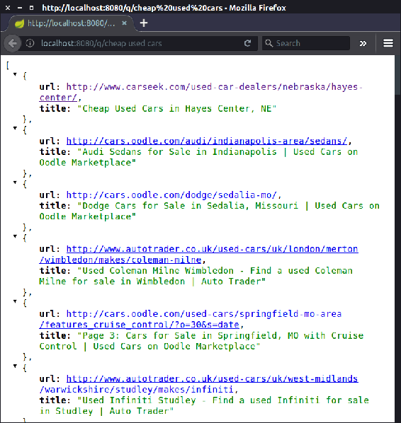

# 十、部署数据科学模型

到目前为止，我们已经涵盖了许多数据科学模型，我们谈到了许多监督和非监督学习方法，包括深度学习和 XGBoost，并讨论了我们如何将这些模型应用于文本和图形数据。

就 CRISP-DM 方法而言，到目前为止，我们主要讨论了*建模*部分。但是还有其他重要的部分我们还没有讨论:*测评*和*部署*。这些步骤在应用程序生命周期中非常重要，因为我们创建的模型应该对业务有用并带来价值，实现这一点的唯一方法是将它们集成到应用程序中(部署部分)，并确保它们确实有用(评估部分)。

在本书的最后一章中，我们将详细介绍这些缺失的部分——我们将了解如何部署数据科学模型，以便应用程序的其他服务可以使用它们。除此之外，我们还将了解如何对已经部署的模型进行在线评估。

特别是，我们将涵盖以下内容:

*   Spring Boot 在爪哇的微服务
*   使用 A/B 测试和多支武装匪徒进行模型评估

在本章结束时，你将学会如何用数据科学模型创建简单的 web 服务，以及如何以一种易于测试的方式设计它们。


# 微服务

Java 是跨许多领域运行许多应用程序的生产代码的一个非常常见的平台选择。当数据科学家为现有应用程序创建模型时，Java 是一个自然的选择，因为它可以无缝地集成到代码中。这种情况很简单，您创建一个单独的包，在那里实现您的模型，并确保其他包使用它。另一个可能的选择是将代码打包到一个单独的 JAR 文件中，并将其作为 Maven 依赖项包含进来。

但是有一种不同的架构方法来组合一个大型系统的多个组件——微服务架构。主要思想是系统应该由小的独立单元组成，它们有自己的生命周期——它们的开发、测试和部署周期独立于所有其他组件。

这些微服务通常通过基于 HTTP 的 REST API 进行通信。它基于四种 HTTP 方法- `GET`、`POST`、`PUT`和`DELETE`。前两个是最常用的:

*   `GET`:从服务中获取一些信息
*   `POST`:向服务提交一些信息

有相当多的库允许用 Java 的 REST API 创建 web 服务，其中之一是 Spring Boot，它是基于 Spring 框架的。接下来，我们将研究如何使用它为数据科学模型服务。


# Spring Boot

Spring 是一个非常古老而强大的 Java 库。核心 Spring 模块实现了**依赖注入** ( **DI** )模式，这允许开发松耦合、可测试和可靠的应用程序。Spring 有围绕核心构建的其他模块，其中之一是 Spring MVC，这是一个用于创建 web 应用程序的模块。

简而言之，DI 模式认为你应该将应用程序逻辑放在所谓的*服务*中，然后*将这些服务*注入到 web 模块中。

正如我们已经提到的，Spring MVC 用于开发 web 服务。它运行在 Servlet API 之上，Servlet API 是 Java 处理 web 请求和生成 web 响应的方式。Servlet 容器实现 Servlet API。因此，为了能够将您的应用程序用作 web 服务，您需要将它部署到 servlet 容器中。最流行的是 Apache Tomcat 和 Eclipse Jetty。然而，该 API 使用起来相当麻烦。Spring MVC 构建在 Servlet API 之上，但是隐藏了它所有的复杂性。

此外，Spring Boot 库允许我们快速开始开发一个 Spring 应用程序，而不需要进入大量的配置细节，比如设置 Apache Tomcat、Spring 应用程序上下文等等。它附带了一组很好的预定义参数，预计可以很好地工作，所以我们可以开始使用它，并专注于应用程序逻辑，而不是配置 servlet 容器。

现在让我们看看如何使用 Spring Boot 和 Spring MVC 来服务机器学习模型。


# 搜索引擎服务

让我们最后回到我们正在运行的例子——构建一个搜索引擎。在[第七章](1607e4a0-6cf9-4250-b12a-64e7f61b26ac.xhtml)、*极限梯度提升*中，我们创建了一个排名模型，可以用来对搜索引擎结果进行重新排序，让最相关的内容获得更高的位置。

在前一章[第九章](a1fd16c7-f78d-45bc-a6b7-17d201c96bbc.xhtml)、*缩放数据科学*中，我们从常见的抓取中提取了大量的文本数据。我们现在能做的就是把这些都放在一起——用 Apache Lucene 索引来自 Common Crawl 的数据，然后搜索它的内容，用 XGBoost 排名模型得到最好的结果。

我们已经知道如何使用 Hadoop MapReduce 从常见的抓取中提取文本信息。然而，如果你记得，我们的排名模型需要的不仅仅是文本——除了正文，它还需要知道标题和头。我们可以修改现有的 MapReduce 作业来提取我们需要的部分，或者不使用 Hadoop 来处理它，直接用 Lucene 索引它。让我们看看第二种方法。

首先，我们将再次使用`HtmlDocument`类，它有以下字段:

```java
public class HtmlDocument implements Serializable {
    private final String url;
    private final String title;
    private final ArrayListMultimap<String, String> headers;
    private final String bodyText;
    // constructors and getters are omitted
}

```

然后，我们还将重用将 HTML 转换为这个`HtmlDocument`对象的方法，但会稍微修改它，以便它可以从通用爬网中读取 WARC 记录:

```java
private static HtmlDocument extractText(ArchiveRecord record) {
    String html = TextUtils.extractHtml(record);
    Document document = Jsoup.parse(html);
    String title = document.title();
    Element body = document.body();
    String bodyText = body.text();

    Elements headerElements = body.select("h1, h2, h3, h4, h5, h6");
    ArrayListMultimap<String, String> headers = ArrayListMultimap.create();
    for (Element htag : headerElements) {
        String tagName = htag.nodeName().toLowerCase();
        headers.put(tagName, htag.text());
    }

    return new HtmlDocument(url, title, headers, bodyText);
}

```

这里的`extractHtml`是上一章中的一个方法，它从 WARC 记录中提取 HTML 内容，其余的与第六章中的[相同，*使用文本自然语言处理和信息检索*。](43d5078e-805b-4e29-a527-ed11fa96c4b2.xhtml)

接下来，我们需要检查 WARC 档案的每个记录，并将其转换成一个`HtmlDocument`类的对象。由于档案足够大，我们不希望一直将所有`HtmlDocument`对象的内容保存在内存中。相反，我们可以不紧不慢地做这件事:读取下一个 WARC 记录，将其转换为`HtmlDocument`，这是 Lucene 的一个索引。下一张唱片再做一次。

为了能够轻松地做到这一点，我们将使用 Google Guava 的`AbstractIterator`类:

```java
public static Iterator<HtmlDocument> iterator(File commonCrawlFile) {
    ArchiveReader archive = WARCReaderFactory.get(commonCrawlFile);
    Iterator<ArchiveRecord> records = archive.iterator();

    return new AbstractIterator<HtmlDocument>() {
        protected HtmlDocument computeNext() {
            while (records.hasNext()) {
                ArchiveRecord record = records.next();
                return extractText(record);
            }
            return endOfData();
        }
    };
}

```

首先，我们打开 WARC 档案并将其传递给我们的`AbstractIterator`类的实例。在内部，当仍然有记录时，我们使用我们的`extractText`函数转换它们。一旦我们完成了处理，我们就通过调用`endOfData`方法发出信号。

现在我们可以用 Lucene 索引所有的 WARC 文件:

```java
FSDirectory directory = FSDirectory.open("lucene-index");
WhitespaceAnalyzer analyzer = new WhitespaceAnalyzer();
IndexWriter writer = new IndexWriter(directory, new IndexWriterConfig(analyzer));

for (File warc : warcFolder.listFiles()) {
    Iterator<HtmlDocument> iterator = CommonCrawlReader.iterator(warc);

    while (iterator.hasNext()) {
        HtmlDocument htmlDoc = iterator.next();
        Document doc = toLuceneDocument(htmlDoc);
        writer.addDocument(doc);
    }
}

```

在这段代码中，我们首先创建一个文件系统 Lucene 索引，然后检查来自`warcFolder`目录的所有 WARC 文件。对于每个这样的文件，我们使用我们刚刚编写的方法获得迭代器，然后用 Lucene 索引这个 WARC 文件的每个记录。从第六章、*的[中我们应该已经熟悉了`toLuceneDocument`方法，它处理文本-自然语言处理和信息检索；它将`HtmlDocument`转换成一个 Lucene 文档，并包含以下代码:](43d5078e-805b-4e29-a527-ed11fa96c4b2.xhtml)*

```java
String url = htmlDoc.getUrl();
String title = htmlDoc.getTitle();
String bodyText = htmlDoc.getBodyText();
ArrayListMultimap<String, String> headers = htmlDoc.getHeaders();

String allHeaders = String.join(" ", headers.values());
String h1 = String.join(" ", headers.get("h1"));
String h2 = String.join(" ", headers.get("h2"));
String h3 = String.join(" ", headers.get("h3"));

Document doc = new Document();
doc.add(new Field("url", url, URL_FIELD));
doc.add(new Field("title", title, TEXT_FIELD));
doc.add(new Field("bodyText", bodyText, TEXT_FIELD));
doc.add(new Field("allHeaders", allHeaders, TEXT_FIELD));
doc.add(new Field("h1", h1, TEXT_FIELD));
doc.add(new Field("h2", h2, TEXT_FIELD));
doc.add(new Field("h3", h3, TEXT_FIELD));

```

可以参考[第六章](43d5078e-805b-4e29-a527-ed11fa96c4b2.xhtml)、*处理文本-自然语言处理和信息检索*了解更多详情。

有了这段代码，我们可以非常快速地索引普通爬行的一部分。在我们的实验中，我们只从 2016 年 12 月开始收集了 3 个 WARC 档案，其中包含大约 50 万个文档。

现在，在我们索引数据之后，我们需要得到我们的 ranker。让我们重用我们在[第 6 章](43d5078e-805b-4e29-a527-ed11fa96c4b2.xhtml)、*处理文本-自然语言处理和信息检索*和[第 7 章](1607e4a0-6cf9-4250-b12a-64e7f61b26ac.xhtml)、*极限*、*梯度提升:*特征提取器和 XGBoost 模型。

如果您还记得，特征提取器执行以下操作:标记查询和每个文档的主体、标题和标题；将它们全部放入 TF-IDF 向量空间，并计算查询和所有文本特征之间的相似性。除此之外，我们还查看了 LSA 空间(使用 SVD 缩减的空间)中的相似性，以及手套空间中查询和标题之间的相似性。请参考[第六章](43d5078e-805b-4e29-a527-ed11fa96c4b2.xhtml)、*处理文本-自然语言处理和信息检索*，了解更多详情。

所以让我们使用这些类来实现我们的 ranker。但是首先，我们需要对所有排名函数进行适当的抽象，为此，我们可以创建`Ranker`接口:

```java
public interface Ranker {
    SearchResults rank(List<QueryDocumentPair> inputList);
}

```

虽然在这一步创建接口似乎是多余的，但它将确保我们创建的服务易于扩展和替换，这对于能够进行模型评估非常重要。

它唯一的方法 rank 接受一组`QueryDocumentPair`对象，并产生一个`SearchResults`对象。我们在[第 6 章](43d5078e-805b-4e29-a527-ed11fa96c4b2.xhtml)、*中创建了`QueryDocumentPair`类，处理文本-自然语言处理和信息检索*，它包含查询以及文档的文本特征:

```java
public static class QueryDocumentPair {
    private final String query;
    private final String url;
    private final String title;
    private final String bodyText;
    private final String allHeaders;
    private final String h1;
    private final String h2;
    private final String h3;
    // constructor and getters are omitted
}

```

`SearchResults`对象只包含一个重新排序的`SearchResult`对象列表:

```java
public class SearchResults {
    private List<SearchResult> list;
    // constructor and getters are omitted
}

```

`SearchResult`是另一个只保存页面标题和 URL 的对象:

```java
public class SearchResult {
    private String url;
    private String title;
    // constructor and getters are omitted
}

```

现在让我们创建这个接口的一个实现，并将其命名为`XgbRanker`。首先，我们指定构造函数，它接受`FeatureExtractor`对象和保存的 XGBoost 模型的路径:

```java
public XgbRanker(FeatureExtractor featureExtractor, String pathToModel) {
    this.featureExtractor = featureExtractor;
    this.booster = XGBoost.loadModel(pathToModel);
}

```

并且`rank`方法通过以下方式实现:

```java
@Override
public SearchResults rank(List<QueryDocumentPair> inputList) {
    DataFrame<Double> featuresDf = featureExtractor.transform(inputList);
    double[][] matrix = featuresDf.toModelMatrix(0.0);

    double[] probs = XgbUtils.predict(booster, matrix);
    List<ScoredIndex> scored = ScoredIndex.wrap(probs);

    List<SearchResult> result = new ArrayList<>(inputList.size());

    for (ScoredIndex idx : scored) {
        QueryDocumentPair doc = inputList.get(idx.getIndex());
        result.add(new SearchResult(doc.getUrl(), doc.getTitle());
    }

    return new SearchResutls(result);
}

```

这里我们只是把我们在[第 6 章](https://cdp.packtpub.com/b05867masteringjavafordatascience/wp-admin/post.php?post=212&action=edit#post_82)、*处理文本-自然语言处理和信息检索*和[第 7 章](https://cdp.packtpub.com/b05867masteringjavafordatascience/wp-admin/post.php?post=212&action=edit#post_105)、*极限* *渐变增强*中写的代码放在里面，特征提取器创建一个带有特征的`DataFrame`。然后，我们使用实用程序类`XgbUtils`将 XGBoost 模型应用于来自`DataFrame`的数据，最后，我们使用来自模型的分数对输入列表进行重新排序。最后，它只是将`QueryDocumentPair`对象转换成`SearchResult`对象并返回。

为了创建这个类的一个实例，我们可以首先加载我们*训练*提取并保存的特征以及模型:

```java
FeatureExtractor fe = FeatureExtractor.load("project/feature-extractor.bin");
Ranker ranker = new XgbRanker(fe, "project/xgb_model.bin");

```

这里的`load`方法只是来自 Commons Lang 的`SerializationUtils`的包装器。

现在我们有了 ranker，我们可以用它来创建搜索引擎服务。在内部，它应该接受 Lucene 的`IndexSearcher`作为通用抓取索引，以及我们的 ranker。

当我们有了一个排名器，让我们创建一个搜索服务。它应该接受 Lucene 的`IndexSearcher`和我们的`Ranker`。

然后我们用用户查询创建`search`方法；它解析查询，从 Lucene 索引中获取前 100 个文档，并用 ranker 对它们进行重新排序:

```java
public SearchResults search(String userQuery) {
    Query query = parser.parse(userQuery);
    TopDocs result = searcher.search(query, 100);
    List<QueryDocumentPair> data = wrapResultsToObject(userQuery, searcher, result)
    return ranker.rank(data);
}

```

这里我们再次重用了来自[第 6 章](https://cdp.packtpub.com/b05867masteringjavafordatascience/wp-admin/post.php?post=212&action=edit#post_82)、*的一个函数，处理文本-自然语言处理和信息检索:*将 Lucene 结果转换成`QueryDocumentPair`对象的`wrapResultsToObject`:

```java
private static List<QueryDocumentPair> wrapResultsToObject(String userQuery, 
              IndexSearcher searcher, TopDocs result) throws IOException {
    List<QueryDocumentPair> data = new ArrayList<>();

    for (ScoreDoc scored : result.scoreDocs) {
        int docId = scored.doc;
        Document doc = searcher.doc(docId);

        String url = doc.get("url");
        String title = doc.get("title");
        String bodyText = doc.get("bodyText");
        String allHeaders = doc.get("allHeaders");
        String h1 = doc.get("h1");
        String h2 = doc.get("h2");
        String h3 = doc.get("h3");

        data.add(new QueryDocumentPair(userQuery, url, title, 
              bodyText, allHeaders, h1, h2, h3));
    }

    return data;
}

```

我们的搜索引擎服务已经准备好了，所以我们终于可以把它放到一个微服务中了。如前所述，一个简单的方法是通过 Spring Boot。

为此，第一步是将 Spring Boot 纳入我们的项目。这有点不寻常:我们不只是指定依赖项，而是使用下面的代码片段，您需要将它放在依赖项部分之后:

```java
<dependencyManagement>
  <dependencies>
    <dependency>
      <groupId>org.springframework.boot</groupId>
      <artifactId>spring-boot-dependencies</artifactId>
      <version>1.3.0.RELEASE</version>
      <type>pom</type>
      <scope>import</scope>
    </dependency>
  </dependencies>
</dependencyManagement>

```

然后在通常的地方出现下面的依赖关系:

```java
<dependency>
  <groupId>org.springframework.boot</groupId>
  <artifactId>spring-boot-starter-web</artifactId>
</dependency>

```

注意，这里缺少了版本部分:Maven 从我们刚刚添加的依赖关系管理部分中提取了它。我们的 web 服务将使用 JSON 对象进行响应，因此我们还需要添加一个 JSON 库。我们将使用 Jackson，因为 Spring Boot 已经提供了一个内置的 JSON 处理程序。让我们将它纳入我们的`pom.xml`:

```java
<dependency>
  <artifactId>jackson-databind</artifactId>
  <groupId>com.fasterxml.jackson.core</groupId>
</dependency>

```

现在所有的依赖项都已经添加了，所以我们可以创建一个 web 服务了。在 Spring 术语中，它们被称为`Controller`(或`RestController`)。让我们创建一个`SearchController`类:

```java
@RestController
@RequestMapping("/")
public class SearchController {
private final SearchEngineService service;

    @Autowired
    public SearchController(SearchEngineService service) {
        this.service = service;
    }

    @RequestMapping("q/{query}")
    public SearchResults contentOpt(@PathVariable("query") String query) {
        return service.search(query);
    }

}

```

这里我们使用了 Spring 的一些注释:

*   告诉 Spring 这个类是一个 REST 控制器
*   `@Autowired`告诉 Spring 应该将`SearchEngineService`的实例注入控制器
*   `@RequestMapping("q/{query}")`指定服务的 URL

注意，这里我们使用了`@Autowired`注释来注入`SearchEngineService`。但是 Spring 不知道这样一个服务应该如何被实例化，所以我们需要创建一个容器来自己完成。让我们这样做:

```java
@Configuration
public class Container {

    @Bean
    public XgbRanker xgbRanker() throws Exception {
        FeatureExtractor fe = load("project/feature-extractor.bin");
        return new XgbRanker(fe, "project/xgb_model.bin");
    }

    @Bean
    public SearchEngineService searchEngineService(XgbRanker ranker) 
             throws IOException {
        File index = new File("project/lucene-rerank");
        FSDirectory directory = FSDirectory.open(index.toPath());
        DirectoryReader reader = DirectoryReader.open(directory);
        IndexSearcher searcher = new IndexSearcher(reader);
        return new SearchEngineService(searcher, ranker);
    }

    private static <E> E load(String filepath) throws IOException {
        Path path = Paths.get(filepath);
        try (InputStream is = Files.newInputStream(path)) {
            try (BufferedInputStream bis = new BufferedInputStream(is)) {
                return SerializationUtils.deserialize(bis);
            }
        }
    }
}

```

这里我们首先创建一个`XgbRanker`类的对象，通过使用`@Bean`注释，我们告诉 Spring 将这个类放入容器中。接下来，我们创建依赖于`XgbRanker`的`SearchEngineService`，因此我们初始化它的方法将它作为一个参数。Spring 将此视为一种依赖，并将`XgbRanker`对象传递到那里，以便满足依赖关系。

最后一步是创建应用程序，该应用程序将监听`8080`端口的传入请求，并用 JSON 进行响应:

```java
@SpringBootApplication
public class SearchRestApp {
    public static void main(String[] args) {
        SpringApplication.run(SearchRestApp.class, args);
    }
}

```

一旦我们运行了这个类，我们就可以通过向`http://localhost:8080/q/query`发送一个`GET`请求来查询我们的服务，其中`query`可以是任何东西。

例如，如果我们想找到关于*廉价二手车*的所有页面，那么我们向`http://localhost:8080/q/cheap%20used%20cars`发送一个`GET`请求。如果我们在 web 浏览器中这样做，我们应该能够看到 JSON 响应:



正如我们所见，只需几个简单的步骤，就可以创建一个简单的微服务来服务数据科学模型。接下来，我们将看到如何在线评估我们的模型的性能，也就是说，在模型被部署并且用户已经开始使用它之后。


# 在线评估

当我们进行交叉验证时，我们对我们的模型进行离线评估，我们根据过去的数据训练模型，然后保留一些数据，仅用于测试。了解模型在实际用户身上是否表现良好非常重要，但往往还不够。这就是为什么我们需要不断地在线监控我们的模型的性能——当用户实际使用它的时候。可能会发生这样的情况，一个在离线测试中表现很好的模型，在在线评估中实际上并没有表现得很好。这可能有很多原因——过度拟合、交叉验证不佳、过于频繁地使用测试集来检查性能，等等。

因此，当我们提出一个新模型时，我们不能因为它的离线性能更好就认为它会更好，所以我们需要在真实用户身上进行测试。

对于在线测试模型，我们通常需要想出一个合理的方法来衡量性能。我们可以获取许多指标，包括简单的指标，如点击数、在网站上花费的时间等。这些指标通常被称为**关键绩效指标**(**KPI**)。一旦我们决定了要监控哪些指标，我们就可以将所有的用户分成两组，看看哪里的指标更好。这种方法被称为 **A/B 测试**，这是一种流行的在线模型评估方法。


# A/B 测试

A/B 测试是对系统用户进行受控实验的一种方式。通常，我们有两个系统——原始版本的系统(*控制*系统)和新的改进版本(*处理*系统)。

A/B 测试是对系统在线用户进行受控实验的一种方式。在这些实验中，我们有两个系统——原始版本(*对照*)和新版本(*处理*)。为了测试新版本是否比原来的版本更好，我们将系统的用户分成两组(*控制*和*处理*)，每组获得各自系统的输出。当用户与系统交互时，我们捕获我们感兴趣的 KPI，当实验完成时，我们看到整个治疗组的 KPI 是否与对照组有显著差异。如果不是(或者更差)，那么测试表明新版本实际上并不比现有版本更好。

通常使用***t*-测试**进行比较，我们查看每组的平均值，并执行双边(有时是单边)测试，这将告诉我们一组的平均值是否明显优于另一组，或者差异是否仅归因于数据的随机波动。

假设我们已经有了一个搜索引擎，它使用 Lucene 排名公式，并且不执行任何重新排序。然后我们提出 XGBoost 模型，想看看它是否更好。为此，我们决定测量用户的点击量

选择这个 KPI 是因为它实现起来非常简单，并且是一个很好的例子。但是对于评估搜索引擎来说，它不是一个很好的 KPI:例如，如果一个算法比其他算法获得更多的点击，这可能意味着用户无法找到他们正在寻找的东西。所以，实际上，你应该选择其他的评估指标。为了更好地了解现有的选择，你可以参考 K. Hoffman 的论文*信息检索在线评估*。

让我们为我们的例子实现它。首先，我们创建一个特殊的类`ABRanker`，它实现了`Ranker`接口。在构造函数中，需要两个排序器和随机的`seed`(为了重现性):

```java
public ABRanker(Ranker aRanker, Ranker bRanker, long seed) {
    this.aRanker = aRanker;
    this.bRanker = bRanker;
    this.random = new Random(seed);
}

```

接下来，我们实现`rank`方法，这应该非常简单；我们只是随机选择是使用`aRanker`还是`bRanker`:

```java
public SearchResults rank(List<QueryDocumentPair> inputList) {
    if (random.nextBoolean()) {
        return aRanker.rank(inputList);
    } else {
        return bRanker.rank(inputList);
    }
}

```

让我们也修改一下`SearchResults`类，在那里包含两个额外的字段，结果的 ID 以及生成它的算法的 ID:

```java
public class SearchResults {
    private String uuid = UUID.randomUUID().toString();
    private String generatedBy = "na";
    private List<SearchResult> list;
}

```

我们需要它来追踪。接下来，我们修改`XGBRanker`,使其将`generatedBy`字段设置为`xgb`——这一变化微不足道，因此我们在此省略。此外，我们需要创建 Lucene ranker 的实现。这也很简单——这个实现所要做的就是原样返回给定的列表，而不重新排序，并将`generatedBy`字段设置为`lucene`。

接下来，我们修改我们的容器。我们需要创建两个排名器，给每个排名器分配一个名称(通过使用`@Bean`注释的`name`参数)，然后最终创建`ABRanker`:

```java
@Bean(name = "luceneRanker")
public DefaultRanker luceneRanker() throws Exception {
    return new DefaultRanker();
}

@Bean(name = "xgbRanker")
public XgbRanker xgbRanker() throws Exception {
    FeatureExtractor fe = load("project/feature-extractor.bin");
    return new XgbRanker(fe, "project/xgb_model.bin");
}

@Bean(name = "abRanker")
public ABRanker abRanker(@Qualifier("luceneRanker") DefaultRanker lucene,
        @Qualifier("xgbRanker") XgbRanker xgb) {
    return new ABRanker(lucene, xgb, 0L);
}

@Bean
public SearchEngineService searchEngineService(@Qualifier("abRanker") Ranker ranker)
        throws IOException {
    // content of this method stays the same
}

```

当我们创建`ABRanker`和`SearchEngineService`时，在参数中我们提供了`@Qualifier`——这是 bean 的名称。因为我们现在有相当多的 rankers，我们需要能够区分它们，所以它们需要有名字。

一旦我们完成了，我们就可以重新启动我们的 web 服务。从现在开始，一半的请求将由 Lucene 默认排序器处理，不进行重新排序，另一半由 XGBoost 排序器处理，根据我们模型的分数进行重新排序。

下一步是获取用户的反馈并存储起来。在我们的例子中，反馈是点击，所以我们可以在`SearchController`中创建下面的 HTTP 端点来捕获这些信息:

```java
@RequestMapping("click/{algorithm}/{uuid}")
public void click(@PathVariable("algorithm") String algorithm,
        @PathVariable("uuid") String uuid) throws Exception {
    service.registerClick(algorithm, uuid);
}

```

当我们接收到对`click/{algorithm}/{uuid}`路径的`GET`请求时，这个方法将被调用，其中`{algorithm}`和`{uuid}`都是占位符。在这个方法中，我们将调用转发给`SearchEngineService`类。

现在让我们稍微重新组织一下我们的抽象，创建另一个接口`FeedbackRanker`，它扩展了`Ranker`接口并提供了`registerClick`方法:

```java
public interface FeedbackRanker extends Ranker {
    void registerClick(String algorithm, String uuid);
}

```

我们可以让`SearchEngineService`依赖于它，而不是简单的`Ranker`，这样我们就可以收集反馈。除此之外，我们还可以将呼叫转发给实际的排名者:

```java
public class SearchEngineService {
    private final FeedbackRanker ranker;

    public SearchEngineService(IndexSearcher searcher, FeedbackRanker ranker) {
        this.searcher = searcher;
        this.ranker = ranker;
    }

    public void registerClick(String algorithm, String uuid) {
        ranker.registerClick(algorithm, uuid);
    }

    // other fields and methods are omitted
}

```

最后，我们让我们的`ABRanker`实现这个接口，并将捕获逻辑放在`registerClick`方法中。

例如，我们可以进行以下修改:

```java
public class ABRanker implements FeedbackRanker {
    private final List<String> aResults = new ArrayList<>();
    private final List<String> bResults = new ArrayList<>();
    private final Multiset<String> clicksCount = ConcurrentHashMultiset.create();

    @Override
    public SearchResults rank(List<QueryDocumentPair> inputList) 
                     throws Exception {
        if (random.nextBoolean()) {
            SearchResults results = aRanker.rank(inputList);
            aResults.add(results.getUuid());
            return results;
        } else {
            SearchResults results = bRanker.rank(inputList);
            bResults.add(results.getUuid());
            return results;
        }
    }

    @Override
    public void registerClick(String algorithm, String uuid) {
        clicksCount.add(uuid);
    }

    // constructor and other fields are omitted
}

```

在这里，我们创建了两个数组列表，其中填充了已创建结果的`UUID`和来自 Guava 的一个`Multiset`，后者计算了每个算法收到的点击次数。我们在这里使用集合只是为了举例说明，实际上，您应该将结果写入数据库或某个日志。

最后，让我们假设系统运行了一段时间，我们能够从用户那里收集一些反馈。现在是时候检查新算法是否比旧算法更好了。这是通过*t*-测试完成的，我们可以从 Apache Commons Math 中获取。

最简单的实现方法如下:

```java
public void tTest() {
    double[] sampleA = aResults.stream().mapToDouble(u -> clicksCount.count(u)).toArray();
    double[] sampleB = bResults.stream().mapToDouble(u -> clicksCount.count(u)).toArray();

    TTest tTest = new TTest();
    double p = tTest.tTest(sampleA, sampleB);

    System.out.printf("P(sample means are same) = %.3f%n", p);
}

```

执行之后，它将报告***【p】**t*测试的值**，或者，拒绝两个样本具有相同均值的零假设的概率。如果这个数字很小，那么差别就很大，或者换句话说，有强有力的证据表明一种算法比另一种算法好。

有了这个简单的想法，我们可以对我们的机器学习算法进行在线评估，并确保离线改进确实导致了在线改进。在下一节中，我们将讨论一个类似的想法，多臂土匪，它允许我们在运行时选择最佳性能的算法。


# 多武装匪徒

A/B 测试是评估一些想法的很好的工具。但有时没有更好的模式，对于一个特定的案例，有时一个更好，有时另一个更好。为了在这个特定的时刻选择一个更好的，我们可以使用在线学习。

我们可以把这个问题公式化为一个强化学习问题——我们有**个代理**(我们的搜索引擎和排名器)，他们与**环境**(搜索引擎的用户)，并获得一些**奖励**(点击)。然后，我们的系统通过采取**动作**(选择排名者)，观察反馈并基于反馈选择最佳策略，从交互中学习。

如果我们试图在这个框架中制定 A/B 测试，那么 A/B 测试的行为是随机选择排名者，奖励是点击。但是对于 A/B 测试，当我们建立实验时，我们要等到实验结束。然而，在在线学习环境中，我们不需要等到最后，我们已经可以根据目前收到的反馈选择最佳排名。
这个问题被称为 **bandit 问题**，被称为多臂 bandit 的算法帮助我们解决了这个问题——它可以在执行实验的同时选择最佳模型。主要思想是有两种行动——探索，你尝试采取未知性能的行动，和开发，你使用最佳性能的模型。

其实现方式如下:我们预先定义一些概率*e*(ε)，用它我们在勘探和开采之间进行选择。用概率 *e* 我们随机选择任何可用的行动，用概率 *1 - e* 我们利用经验上的最佳行动。对于我们的问题，这意味着如果我们有几个排名器，我们使用概率为 *1 - e* 的最佳排名器，并使用概率为 e 的随机选择的排名器对结果进行重新排序。在运行期间，我们监控 KPI 以了解哪个排名者当前是最好的，并在我们获得更多反馈时更新统计数据。

这个想法有一个小缺点，当我们刚刚开始运行 bandit 时，我们没有足够的数据来选择哪个算法是最好的。这可以通过一系列预热来解决，例如，前 1000 个结果可能只在探索模式下获得。也就是说，对于前 1000 个结果，我们只是随机选择排名。之后，我们应该收集足够的数据，然后如上所述以概率 *e* 在开采和勘探之间进行选择。

所以让我们为此创建一个新类，我们称之为`BanditRanker`，它将实现我们为`ABRanker`定义的`FeedbackRanker`接口。

构造函数将获取一个`Ranker`的映射，其中包含与每个排名器相关的名称、`epsilon`参数和随机的`seed`:

```java
public BanditRanker(Map<String, Ranker> rankers, double epsilon, long seed) {
    this.rankers = rankers;
    this.rankerNames = new ArrayList<>(rankers.keySet());
    this.epsilon = epsilon;
    this.random = new Random(seed);
}

```

在内部，我们还将保留一个供内部使用的排名表。

接下来，我们实现`rank`函数:

```java
@Override
public SearchResults rank(List<QueryDocumentPair> inputList) throws Exception {
    if (count.getAndIncrement() < WARM_UP_ROUNDS) {
        return rankByRandomRanker(inputList);
    }

    double rnd = random.nextDouble();
    if (rnd > epsilon) {
        return rankByBestRanker(inputList);
    }

    return rankByRandomRanker(inputList);
}

```

这里我们总是首先随机选择排名者，然后或者探索(通过`rankByRandomRanker`方法随机选择排名者)或者利用(通过`rankByBestRanker`方法选择最佳排名者)。

现在让我们看看如何实现这些方法，首先，`rankByRandomRanker`方法是以如下方式实现的:

```java
private SearchResults rankByRandomRanker(List<QueryDocumentPair> inputList) {
    int idx = random.nextInt(rankerNames.size());
    String rankerName = rankerNames.get(idx);
    Ranker ranker = rankers.get(rankerName);
    SearchResults results = ranker.rank(inputList);
    explorationResults.add(results.getUuid().hashCode());
    return results;
}

```

这非常简单:我们从`rankerName`列表中随机选择一个名字，然后根据名字获得排名，并用它来重新排列结果。最后，我们还将生成结果的`UUID`保存到一个`HashSet`(或者更确切地说，是保存 RAM 的散列)。

`rankByBestRanker`方法有如下实现:

```java
private SearchResults rankByBestRanker(List<QueryDocumentPair> inputList)  {
    String rankerName = bestRanker();
    Ranker ranker = rankers.get(rankerName);
    return ranker.rank(inputList);
}

private String bestRanker() {
    Comparator<Multiset.Entry<String>> cnp =
            (e1, e2) -> Integer.compare(e1.getCount(), e2.getCount());
    Multiset.Entry<String> entry = counts.entrySet().stream().max(cnp).get();
    return entry.getElement();
}

```

这里我们保存了`Multiset<String>`，它存储了每个算法收到的点击次数。然后，我们选择基于这个数字的算法，并使用它来重新排列结果。

最后，这是我们如何实现`registerClick`函数:

```java
@Override
public void registerClick(String algorithm, String uuid) {
    if (explorationResults.contains(uuid.hashCode())) {
        counts.add(algorithm);
    }
}

```

我们不是只计算点击次数，而是首先过滤掉在利用阶段生成的结果的点击，这样它们就不会扭曲统计数据。

这样，我们实现了最简单的多臂强盗版本，您可以使用它来选择部署最好的模型。为了将它包含到我们的工作 web 服务中，我们需要修改`container`类，但是修改是琐碎的，所以我们在这里省略了它。


# 摘要

在本书中，我们涵盖了大量的材料，从 data 中可用的数据科学库开始，然后探索监督和非监督学习模型，并讨论文本、图像和图形。在最后一章中，我们谈到了非常重要的一步:如何将这些模型部署到生产中，并在真实用户身上进行评估。